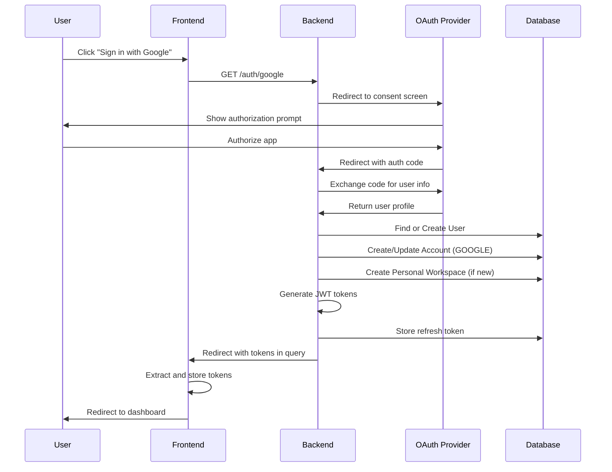

# Actopod Authentication Module Documentation

**Version:** 1.0  
**Last Updated:** October 12, 2025  
**Module Path:** `apps/backend/src/v1/auth/`  
**Status:** ✅ Production Ready

---

## Table of Contents

1. [Overview](#overview)
2. [Features](#features)
3. [Architecture](#architecture)
4. [Database Schema](#database-schema)
5. [API Endpoints](#api-endpoints)
6. [Authentication Flows](#authentication-flows)
7. [Configuration](#configuration)
8. [Security Considerations](#security-considerations)
9. [Testing](#testing)
10. [Troubleshooting](#troubleshooting)

---

## Overview

The Authentication module provides a complete, production-ready authentication system supporting multiple authentication methods:

- **Email/Password Authentication** with verification
- **Magic Link** (passwordless authentication)
- **OAuth Providers** (Google, GitHub)
- **JWT-based** access and refresh tokens
- **Multi-device** session management
- **Password reset** functionality

### Key Features

✅ **Secure:** bcrypt password hashing, SHA-256 token hashing, JWT tokens  
✅ **Flexible:** Multiple auth methods, optional email verification  
✅ **User-Friendly:** Magic links, OAuth, password reset  
✅ **Scalable:** Device tracking, multi-session support  
✅ **Production-Ready:** Rate limiting, error handling, logging

---

## Features

### 1. Email/Password Authentication

**User Registration:**

- User provides email, name, and password
- Password hashed with bcrypt (10 rounds)
- Verification email sent automatically
- Personal workspace created on registration
- User can login immediately (verification optional)

**Email Verification:**

- 24-hour token expiry
- SHA-256 token hashing for security
- Resend verification with 1-minute rate limit
- Welcome email sent after verification

**Login:**

- Email/password validation
- JWT access token (15 minutes)
- JWT refresh token (7 days)
- Device tracking with User-Agent parsing
- Multi-device support

### 2. Password Reset

**Request Reset:**

- User provides email
- Reset token generated (1-hour expiry)
- Token stored as SHA-256 hash
- Reset email sent with secure link

**Reset Password:**

- Token validated
- New password hashed with bcrypt
- All refresh tokens invalidated
- User must login again on all devices

### 3. Magic Link Authentication

**Passwordless Login:**

- User provides email
- Magic link generated (15-minute expiry)
- Rate limited (3 attempts per hour)
- Device and IP tracking for security
- Email sent with secure link

**Verification:**

- Token validated
- IP address verification (optional)
- Device metadata stored
- JWT tokens generated

### 4. OAuth Authentication

**Supported Providers:**

- Google OAuth 2.0
- GitHub OAuth 2.0

**Flow:**

1. User redirected to OAuth provider
2. User authorizes application
3. Provider redirects back with auth code
4. Backend validates and creates/updates user
5. Personal workspace created for new users
6. JWT tokens generated
7. Frontend receives tokens via redirect

### 5. Token Management

**Access Tokens:**

- JWT with 15-minute expiry
- Contains userId and email
- Used for API authentication
- Validated by AccessTokenGuard

**Refresh Tokens:**

- JWT with 7-day expiry
- Stored in database with device info
- One token per user+device combination
- Token rotation on refresh (old deleted, new created)
- Stable device ID across refreshes

**Device Tracking:**

- Device ID: Database CUID (stable)
- Device Name: User-Agent parsed (human-readable)
- Example: `Windows – Chrome`, `macOS – Safari`

### 6. Session Management

**Multi-Device Support:**

- Separate refresh tokens per device
- Track active sessions
- Logout from single device
- Logout from all devices

**Device Information:**

- Browser name and version
- Operating system
- Device identifier (CUID)
- Last activity timestamp

---

## Architecture

### Module Structure

```
apps/backend/src/v1/auth/
├── auth.module.ts           # Module definition
├── auth.controller.ts       # API endpoints
├── auth.service.ts          # Business logic
├── dto/                     # Data Transfer Objects
│   ├── register.dto.ts
│   ├── login.dto.ts
│   ├── forgot-password.dto.ts
│   ├── reset-password.dto.ts
│   └── magic-link.dto.ts
├── guards/                  # Authentication guards
│   ├── access-token.guard.ts
│   ├── refresh-token.guard.ts
│   ├── google-oauth.guard.ts
│   └── github-oauth.guard.ts
├── strategies/              # Passport strategies
│   ├── access-token.strategy.ts
│   ├── refresh-token.strategy.ts
│   ├── google.strategy.ts
│   └── github.strategy.ts
└── types/                   # TypeScript types
    └── auth.types.ts
```

### Dependencies

```json
{
  "@nestjs/common": "^10.x",
  "@nestjs/jwt": "^10.x",
  "@nestjs/passport": "^10.x",
  "passport": "^0.7.x",
  "passport-jwt": "^4.x",
  "passport-google-oauth20": "^2.x",
  "passport-github2": "^0.1.x",
  "bcrypt": "^5.x",
  "ua-parser-js": "^1.x",
  "class-validator": "^0.14.x",
  "class-transformer": "^0.5.x"
}
```

---

## Database Schema

### User Model

```prisma
model User {
  id        String   @id @default(cuid())
  email     String   @unique
  name      String?
  image     String?
  hash      String?  @db.VarChar(255)  // Password hash
  createdAt DateTime @default(now()) @db.Timestamptz(6)
  updatedAt DateTime @updatedAt @db.Timestamptz(6)

  accounts      Account[]
  refreshTokens RefreshToken[]
  workspaces    WorkspaceUser[]

  @@index([email])
  @@schema("core")
}
```

### Account Model

```prisma
model Account {
  id                String       @id @default(cuid())
  userId            String
  provider          AuthProvider
  providerAccountId String
  accessToken       String?      @db.Text  // Verification/reset tokens
  refreshToken      String?      @db.Text  // Reset tokens
  expiresAt         DateTime?    @db.Timestamptz(6)
  createdAt         DateTime     @default(now()) @db.Timestamptz(6)

  user User @relation(fields: [userId], references: [id], onDelete: Cascade)

  @@unique([provider, providerAccountId])
  @@index([userId])
  @@schema("core")
}
```

### RefreshToken Model

```prisma
model RefreshToken {
  id        String   @id @default(cuid())
  token     String   @unique
  deviceId  String   @db.VarChar(255)  // Device name (e.g., "Windows – Chrome")
  userId    String
  expiresAt DateTime @db.Timestamptz(6)
  createdAt DateTime @default(now()) @db.Timestamptz(6)
  updatedAt DateTime @updatedAt @db.Timestamptz(6)

  user User @relation(fields: [userId], references: [id], onDelete: Cascade)

  @@unique([userId, deviceId])
  @@index([userId, expiresAt])
  @@index([token, expiresAt])
  @@schema("core")
}
```

### AuthProvider Enum

```prisma
enum AuthProvider {
  GOOGLE
  GITHUB
  EMAIL

  @@schema("core")
}
```

---

## API Endpoints

### Base URL

```
http://localhost:8000/api/v1/auth
```

### Authentication

All endpoints except OAuth callbacks require `Authorization: Bearer <token>` header where indicated.

---

### 1. Register

**Endpoint:** `POST /auth/register`  
**Access:** Public  
**Description:** Register a new user with email and password

**Request Body:**

```json
{
  "email": "user@example.com",
  "name": "John Doe",
  "password": "SecurePass123!"
}
```

**Response (201 Created):**

```json
{
  "statusCode": 201,
  "message": "Success",
  "data": {
    "message": "Registration successful. Please check your email to verify your account.",
    "userId": "cmgnxzc2b0000kj504z2ae1z3"
  },
  "errors": [],
  "timestamp": "2025-10-12T17:30:00.000Z"
}
```

**Errors:**

- `409 Conflict` - Email already registered
- `400 Bad Request` - Invalid input data

---

### 2. Verify Email

**Endpoint:** `POST /auth/verify-email`  
**Access:** Public  
**Description:** Verify email address with token from email

**Request Body:**

```json
{
  "token": "abc123...xyz789"
}
```

**Response (200 OK):**

```json
{
  "statusCode": 200,
  "message": "Success",
  "data": {
    "message": "Email verified successfully. You can now log in."
  },
  "errors": [],
  "timestamp": "2025-10-12T17:30:00.000Z"
}
```

**Errors:**

- `400 Bad Request` - Invalid or expired token

---

### 3. Resend Verification Email

**Endpoint:** `POST /auth/resend-verification`  
**Access:** Public  
**Description:** Resend verification email

**Request Body:**

```json
{
  "email": "user@example.com"
}
```

**Response (200 OK):**

```json
{
  "statusCode": 200,
  "message": "Success",
  "data": {
    "message": "If the email exists and is not verified, a verification link has been sent"
  },
  "errors": [],
  "timestamp": "2025-10-12T17:30:00.000Z"
}
```

**Rate Limit:** 1 request per minute per email

---

### 4. Login

**Endpoint:** `POST /auth/login`  
**Access:** Public  
**Description:** Login with email and password

**Request Body:**

```json
{
  "email": "user@example.com",
  "password": "SecurePass123!"
}
```

**Response (200 OK):**

```json
{
  "statusCode": 200,
  "message": "Success",
  "data": {
    "userId": "cmgnxzc2b0000kj504z2ae1z3",
    "email": "user@example.com",
    "accessToken": "eyJhbGciOiJIUzI1NiIsInR5cCI6IkpXVCJ9...",
    "refreshToken": "eyJhbGciOiJIUzI1NiIsInR5cCI6IkpXVCJ9...",
    "deviceId": "cmgnzach4000bkj44pb3sy84v",
    "deviceName": "Windows – Chrome"
  },
  "errors": [],
  "timestamp": "2025-10-12T17:30:00.000Z"
}
```

**Errors:**

- `401 Unauthorized` - Invalid credentials

---

### 5. Forgot Password

**Endpoint:** `POST /auth/forgot-password`  
**Access:** Public  
**Description:** Request password reset link

**Request Body:**

```json
{
  "email": "user@example.com"
}
```

**Response (200 OK):**

```json
{
  "statusCode": 200,
  "message": "Success",
  "data": {
    "message": "If the email exists, a password reset link has been sent"
  },
  "errors": [],
  "timestamp": "2025-10-12T17:30:00.000Z"
}
```

---

### 6. Reset Password

**Endpoint:** `POST /auth/reset-password`  
**Access:** Public  
**Description:** Reset password with token from email

**Request Body:**

```json
{
  "token": "abc123...xyz789",
  "newPassword": "NewSecurePass123!"
}
```

**Response (200 OK):**

```json
{
  "statusCode": 200,
  "message": "Success",
  "data": {
    "message": "Password reset successfully. You can now log in with your new password."
  },
  "errors": [],
  "timestamp": "2025-10-12T17:30:00.000Z"
}
```

**Errors:**

- `400 Bad Request` - Invalid or expired token

---

### 7. Send Magic Link

**Endpoint:** `POST /auth/magic-link/send`  
**Access:** Public  
**Description:** Send passwordless login link via email

**Request Body:**

```json
{
  "email": "user@example.com"
}
```

**Response (200 OK):**

```json
{
  "statusCode": 200,
  "message": "Success",
  "data": {
    "message": "If the email exists, a magic link has been sent"
  },
  "errors": [],
  "timestamp": "2025-10-12T17:30:00.000Z"
}
```

**Rate Limit:** 3 attempts per hour per email

---

### 8. Verify Magic Link

**Endpoint:** `POST /auth/magic-link/verify`  
**Access:** Public  
**Description:** Verify magic link and get tokens

**Request Body:**

```json
{
  "token": "abc123...xyz789",
  "email": "user@example.com"
}
```

**Response (200 OK):**

```json
{
  "statusCode": 200,
  "message": "Success",
  "data": {
    "userId": "cmgnxzc2b0000kj504z2ae1z3",
    "email": "user@example.com",
    "accessToken": "eyJhbGciOiJIUzI1NiIsInR5cCI6IkpXVCJ9...",
    "refreshToken": "eyJhbGciOiJIUzI1NiIsInR5cCI6IkpXVCJ9...",
    "deviceId": "cmgnzach4000bkj44pb3sy84v",
    "deviceName": "Windows – Chrome"
  },
  "errors": [],
  "timestamp": "2025-10-12T17:30:00.000Z"
}
```

**Errors:**

- `401 Unauthorized` - Invalid or expired magic link

---

### 9. Google OAuth

**Initiate:** `GET /auth/google`  
**Callback:** `GET /auth/google/callback`  
**Access:** Public  
**Description:** OAuth authentication with Google

**Flow:**

1. User visits `/auth/google`
2. Redirected to Google OAuth consent screen
3. User authorizes application
4. Google redirects to `/auth/google/callback?code=...`
5. Backend validates and generates tokens
6. Frontend receives redirect with tokens in query params

**Callback Redirect:**

```
http://localhost:5173/auth/callback?accessToken=...&refreshToken=...&userId=...&deviceId=...
```

---

### 10. GitHub OAuth

**Initiate:** `GET /auth/github`  
**Callback:** `GET /auth/github/callback`  
**Access:** Public  
**Description:** OAuth authentication with GitHub

**Flow:** Same as Google OAuth

**Callback Redirect:**

```
http://localhost:5173/auth/callback?accessToken=...&refreshToken=...&userId=...&deviceId=...
```

---

### 11. Refresh Token

**Endpoint:** `POST /auth/refresh`  
**Access:** Authenticated (Refresh Token)  
**Description:** Get new access and refresh tokens

**Headers:**

```
Authorization: Bearer <refresh_token>
```

**Request Body:**

```json
{
  "deviceId": "cmgnzach4000bkj44pb3sy84v"
}
```

**Response (200 OK):**

```json
{
  "statusCode": 200,
  "message": "Success",
  "data": {
    "userId": "cmgnxzc2b0000kj504z2ae1z3",
    "email": "user@example.com",
    "accessToken": "eyJhbGciOiJIUzI1NiIsInR5cCI6IkpXVCJ9...",
    "refreshToken": "eyJhbGciOiJIUzI1NiIsInR5cCI6IkpXVCJ9...",
    "deviceId": "cmgnzach4000bkj44pb3sy84v",
    "deviceName": "Windows – Chrome"
  },
  "errors": [],
  "timestamp": "2025-10-12T17:30:00.000Z"
}
```

**Important:**

- Old refresh token is deleted
- New refresh token is generated
- Device ID stays the same
- Must use new refresh token for next refresh

**Errors:**

- `401 Unauthorized` - Invalid or expired refresh token
- `401 Unauthorized` - Device ID mismatch

---

### 12. Logout

**Endpoint:** `POST /auth/logout`  
**Access:** Authenticated (Access Token)  
**Description:** Logout from current device

**Headers:**

```
Authorization: Bearer <access_token>
x-device-id: cmgnzach4000bkj44pb3sy84v
```

**Response (200 OK):**

```json
{
  "statusCode": 200,
  "message": "Success",
  "data": {
    "message": "Logged out successfully"
  },
  "errors": [],
  "timestamp": "2025-10-12T17:30:00.000Z"
}
```

---

### 13. Logout All Devices

**Endpoint:** `POST /auth/logout-all`  
**Access:** Authenticated (Access Token)  
**Description:** Logout from all devices

**Headers:**

```
Authorization: Bearer <access_token>
```

**Response (200 OK):**

```json
{
  "statusCode": 200,
  "message": "Success",
  "data": {
    "message": "Logged out from all devices"
  },
  "errors": [],
  "timestamp": "2025-10-12T17:30:00.000Z"
}
```

---

### 14. Get Current User

**Endpoint:** `GET /auth/me`  
**Access:** Authenticated (Access Token)  
**Description:** Get current authenticated user info

**Headers:**

```
Authorization: Bearer <access_token>
```

**Response (200 OK):**

```json
{
  "statusCode": 200,
  "message": "Success",
  "data": {
    "userId": "cmgnxzc2b0000kj504z2ae1z3"
  },
  "errors": [],
  "timestamp": "2025-10-12T17:30:00.000Z"
}
```

---

### 15. Check Email Verification Status

**Endpoint:** `GET /auth/email-verified-status`  
**Access:** Authenticated (Access Token)  
**Description:** Check if current user's email is verified

**Headers:**

```
Authorization: Bearer <access_token>
```

**Response (200 OK):**

```json
{
  "statusCode": 200,
  "message": "Success",
  "data": {
    "isVerified": true,
    "email": "user@example.com"
  },
  "errors": [],
  "timestamp": "2025-10-12T17:30:00.000Z"
}
```

---

## Authentication Flows

### Email/Password Registration Flow


### Email Verification Flow


### Login Flow


### Token Refresh Flow


### OAuth Flow (Google/GitHub)



### Password Reset Flow


### Magic Link Flow


---

## Configuration

### Environment Variables

**Required:**

```env
# JWT Tokens
JWT_ACCESS_TOKEN_SECRET=your-super-secret-access-key-min-32-chars
JWT_REFRESH_TOKEN_SECRET=your-super-secret-refresh-key-min-32-chars
JWT_ACCESS_TOKEN_EXPIRATION=15m
JWT_REFRESH_TOKEN_EXPIRATION=7d

# Frontend URL
FRONTEND_URL=http://localhost:5173
```

**OAuth (Optional):**

```env
# Google OAuth
GOOGLE_CLIENT_ID=123456789-abcdefg.apps.googleusercontent.com
GOOGLE_CLIENT_SECRET=GOCSPX-xxxxxxxxxxxxx
GOOGLE_CALLBACK_URL=http://localhost:8000/api/v1/auth/google/callback

# GitHub OAuth
GITHUB_CLIENT_ID=Iv1.1234567890abcdef
GITHUB_CLIENT_SECRET=1234567890abcdef1234567890abcdef12345678
GITHUB_CALLBACK_URL=http://localhost:8000/api/v1/auth/github/callback
```

**Email Service (AWS SES):**

```env
AWS_REGION=us-east-1
AWS_SES_ACCESS_KEY_ID=your-access-key-id
AWS_SES_SECRET_ACCESS_KEY=your-secret-access-key
AWS_SES_NO_REPLY_EMAIL=noreply@actopod.dev
AWS_SES_SUPPORT_EMAIL=support@actopod.dev
```

### OAuth Setup

#### Google OAuth Setup

1. Go to [Google Cloud Console](https://console.cloud.google.com/)
2. Create a new project or select existing
3. Enable Google+ API
4. Configure OAuth consent screen:
   - App name: `Actopod`
   - User support email: your email
   - Developer contact: your email
   - Add test users for development
5. Create OAuth 2.0 credentials:
   - Application type: Web application
   - Authorized JavaScript origins: `http://localhost:5173`
   - Authorized redirect URIs: `http://localhost:8000/api/v1/auth/google/callback`
6. Copy Client ID and Client Secret to `.env`

#### GitHub OAuth Setup

1. Go to [GitHub Developer Settings](https://github.com/settings/developers)
2. Click "OAuth Apps" → "New OAuth App"
3. Fill in details:
   - Application name: `Actopod`
   - Homepage URL: `http://localhost:5173`
   - Authorization callback URL: `http://localhost:8000/api/v1/auth/github/callback`
4. Click "Register application"
5. Generate a new client secret
6. Copy Client ID and Client Secret to `.env`

---

## Security Considerations

### Password Security

- **Hashing:** bcrypt with 10 salt rounds
- **Minimum Requirements:** Enforced by frontend (not backend)
- **Storage:** Never stored in plain text
- **Comparison:** Constant-time comparison via bcrypt

### Token Security

**Verification/Reset Tokens:**

- Generated with `crypto.randomBytes(32)`
- Hashed with SHA-256 before storage
- Single-use (deleted after use)
- Time-limited expiry (1-24 hours)

**JWT Tokens:**

- Signed with HS256 algorithm
- Contains minimal payload (userId, email)
- Short-lived access tokens (15 minutes)
- Longer refresh tokens (7 days)
- Refresh token rotation on use

### Session Security

- One refresh token per user+device combination
- Device tracking via User-Agent
- IP address tracking for magic links
- Ability to logout from all devices
- Automatic cleanup of expired tokens

### Rate Limiting

- Magic links: 3 attempts per hour per email
- Verification resend: 1 request per minute per email
- Failed login attempts: Not currently implemented (consider adding)

### CORS Configuration

```typescript
app.enableCors({
  origin: [
    process.env.FRONTEND_URL || 'http://localhost:5173',
    /^http:\/\/localhost:\d+$/,
    /^https?:\/\/.*\.actopod\.dev/,
  ],
  methods: 'GET,HEAD,PUT,PATCH,POST,DELETE,OPTIONS',
  credentials: true,
});
```

### Database Security

- Cascade deletes for user data cleanup
- Unique constraints on critical fields
- Indexed fields for query performance
- Separate schemas for logical separation

---

## Testing

### Postman Collection

**Environment Variables:**

```json
{
  "api_url": "http://localhost:8000/api/v1",
  "user_email": "test@example.com",
  "access_token": "",
  "refresh_token": "",
  "user_id": "",
  "device_id": ""
}
```

**Test Script (for all auth endpoints):**

```javascript
const response = pm.response.json();

if (response.statusCode >= 200 && response.statusCode < 300 && response.data) {
  // Save tokens if they exist
  if (response.data.accessToken) {
    pm.environment.set('access_token', response.data.accessToken);
  }
  if (response.data.refreshToken) {
    pm.environment.set('refresh_token', response.data.refreshToken);
  }
  if (response.data.userId) {
    pm.environment.set('user_id', response.data.userId);
  }
  if (response.data.deviceId) {
    pm.environment.set('device_id', response.data.deviceId);
  }

  console.log('✅ Success:', response.message);
} else {
  console.error('❌ Request failed:', response.message || 'Unknown error');
}
```

### Manual Testing Steps

**1. Registration:**

```bash
curl -X POST http://localhost:8000/api/v1/auth/register \
  -H "Content-Type: application/json" \
  -d '{
    "email": "test@example.com",
    "name": "Test User",
    "password": "SecurePass123!"
  }'
```

**2. Login:**

```bash
curl -X POST http://localhost:8000/api/v1/auth/login \
  -H "Content-Type: application/json" \
  -d '{
    "email": "test@example.com",
    "password": "SecurePass123!"
  }'
```

**3. Refresh Token:**

```bash
curl -X POST http://localhost:8000/api/v1/auth/refresh \
  -H "Authorization: Bearer <refresh_token>" \
  -H "Content-Type: application/json" \
  -d '{
    "deviceId": "cmgnzach4000bkj44pb3sy84v"
  }'
```

**4. Get Current User:**

```bash
curl -X GET http://localhost:8000/api/v1/auth/me \
  -H "Authorization: Bearer <access_token>"
```

---

## Troubleshooting

### Common Issues

**1. "Email already registered"**

- **Cause:** User already exists in database
- **Solution:** Use different email or login with existing account

**2. "Invalid or expired verification token"**

- **Cause:** Token expired (24 hours) or already used
- **Solution:** Request new verification email

**3. "Invalid or expired refresh token"**

- **Cause:** Token expired, revoked, or device ID mismatch
- **Solution:** Login again to get new tokens

**4. "Headers already sent" error**

- **Cause:** Response interceptor and exception filter conflict
- **Solution:** Already fixed - interceptor checks `response.headersSent`

**5. OAuth redirect not working**

- **Cause:** Callback URL mismatch in OAuth provider settings
- **Solution:** Verify callback URLs match exactly in `.env` and OAuth provider console

**6. Device ID changes on every refresh**

- **Cause:** Incorrect implementation (DELETE + CREATE instead of UPDATE)
- **Solution:** Already fixed - using UPDATE to keep same database record

**7. "Cannot read properties of undefined (reading 'statusCode')"**

- **Cause:** OAuth callbacks return redirects, not JSON
- **Solution:** Already fixed - interceptor skips when `headersSent` is true

### Debug Logs

**Enable detailed logging:**

```typescript
// In main.ts
const app = await NestFactory.create(AppModule, {
  logger: ['error', 'warn', 'debug', 'log', 'verbose'],
});
```

**Check database:**

```bash
# Open Prisma Studio
yarn db:studio

# Check RefreshToken table
# Verify device IDs are stable across refreshes
```

**Monitor email delivery:**

- Check AWS SES console for delivery status
- Verify email templates are rendering correctly
- Check spam folder if not receiving emails

---

## Future Enhancements

### Potential Improvements

1. **Rate Limiting:**
   - Implement Redis-based rate limiting
   - Track failed login attempts
   - Temporary account lockout after multiple failures

2. **Two-Factor Authentication:**
   - TOTP (Time-based One-Time Password)
   - SMS verification
   - Backup codes

3. **Social Logins:**
   - Microsoft OAuth
   - Apple Sign In
   - LinkedIn OAuth

4. **Session Management:**
   - Active session list in user profile
   - Revoke specific sessions
   - Session activity logs

5. **Security:**
   - IP-based geolocation
   - Suspicious login detection
   - Email notifications for new logins

6. **Analytics:**
   - Login analytics dashboard
   - Failed login attempts tracking
   - User activity monitoring

---

## Changelog

### Version 1.0 (October 12, 2025)

**Initial Release:**

- ✅ Complete authentication system
- ✅ Email/password authentication
- ✅ Email verification
- ✅ Password reset
- ✅ Magic link authentication
- ✅ Google OAuth
- ✅ GitHub OAuth
- ✅ JWT token management
- ✅ Multi-device support
- ✅ Device tracking
- ✅ Session management

---

**Document End**

---

## Quick Reference

### Key Endpoints

```
POST   /api/v1/auth/register
POST   /api/v1/auth/login
POST   /api/v1/auth/verify-email
POST   /api/v1/auth/forgot-password
POST   /api/v1/auth/reset-password
POST   /api/v1/auth/magic-link/send
POST   /api/v1/auth/magic-link/verify
GET    /api/v1/auth/google
GET    /api/v1/auth/github
POST   /api/v1/auth/refresh
POST   /api/v1/auth/logout
POST   /api/v1/auth/logout-all
GET    /api/v1/auth/me
```

### Token Expiry Times

- **Access Token:** 15 minutes
- **Refresh Token:** 7 days
- **Verification Token:** 24 hours
- **Password Reset Token:** 1 hour
- **Magic Link Token:** 15 minutes

### Response Format

All endpoints return standardized responses:

```json
{
  "statusCode": number,
  "message": string,
  "data": object | null,
  "errors": array,
  "timestamp": string (ISO 8601)
}
```

---

**For questions or issues, contact the development team.**
