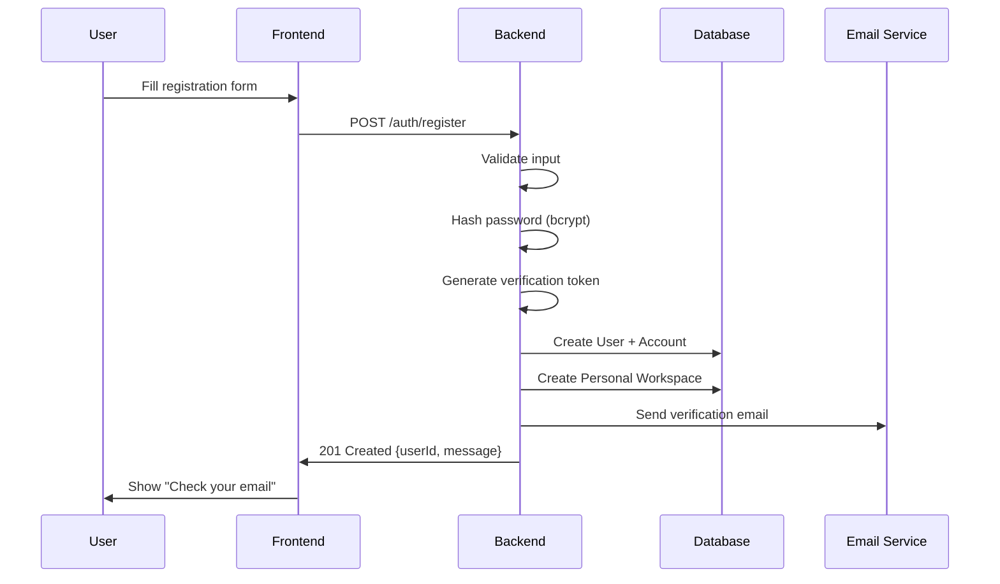
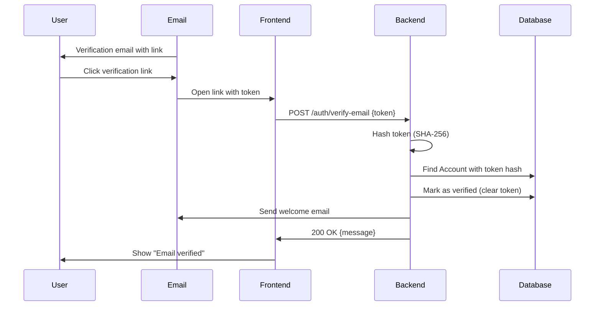
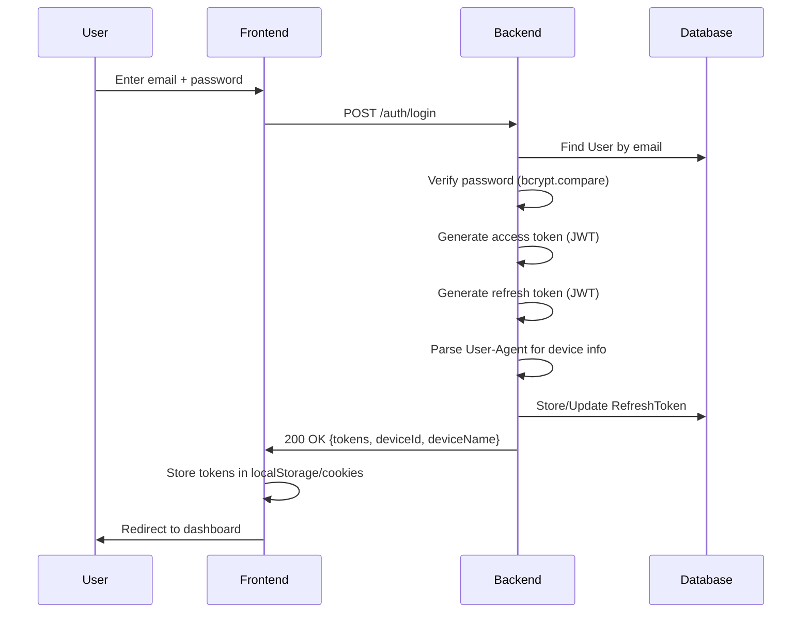
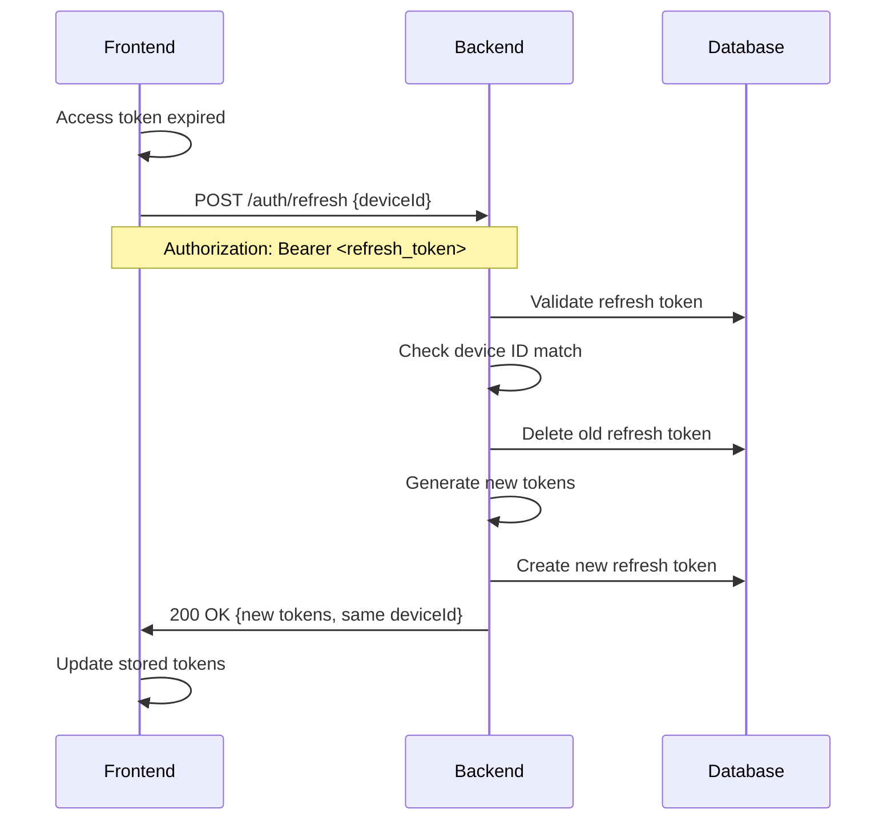
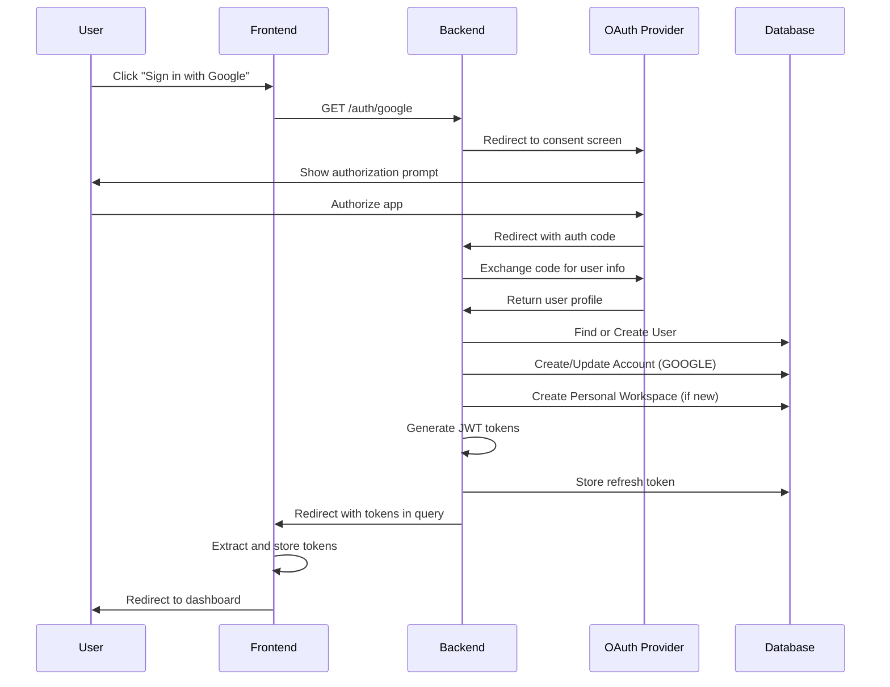
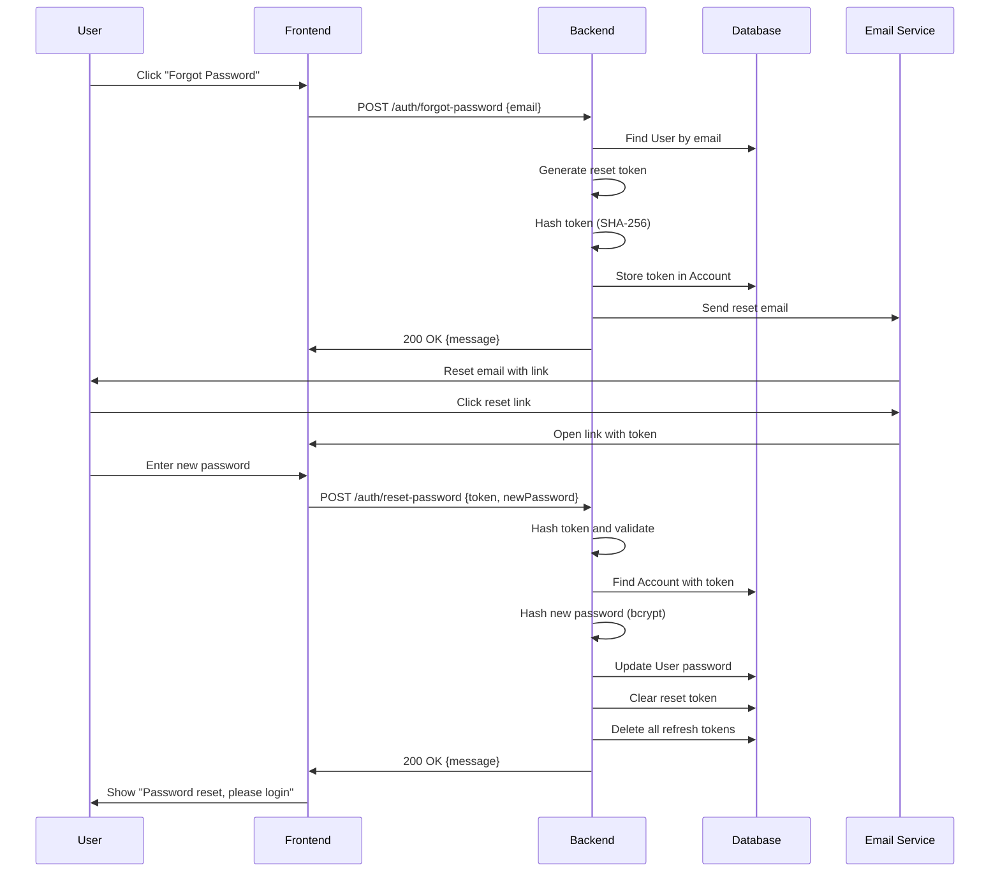
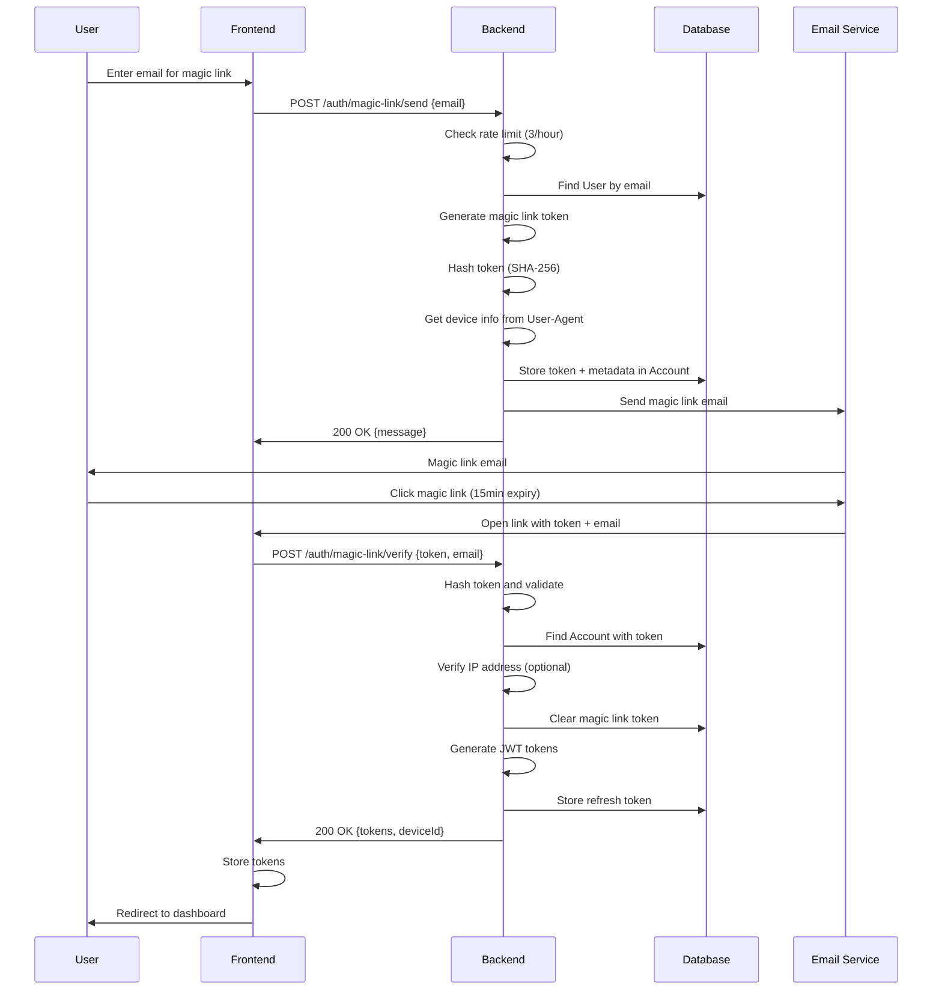

# Flopods: AI Workflow Canvas - Codebase Export

**Project:** AI Workflow Canvas - Multi-LLM Node-Based Platform
**Author:** Zahid Khan
**Generated:** 2025-10-27 22:39:16 IST
**Version:** 0.0.1
**Source Root (Base Path):** D:\Zahid\Work\Actopod\code\turbo\actopod
---

## Specific Export: apps\backend

### `apps\backend\.turbo\turbo-build.log`

```text
```

### `apps\backend\.turbo\turbo-dev.log`

```text
[9:16:20 PM] Starting compilation in watch mode...

[9:16:44 PM] Found 0 errors. Watching for file changes.

[Nest] 15248  - 10/27/2025, 9:18:08 PM     LOG [NestFactory] Starting Nest application...
[Nest] 15248  - 10/27/2025, 9:18:08 PM     LOG [InstanceLoader] PrismaModule dependencies initialized +98ms
[Nest] 15248  - 10/27/2025, 9:18:08 PM     LOG [InstanceLoader] WebSocketModule dependencies initialized +1ms
[Nest] 15248  - 10/27/2025, 9:18:08 PM     LOG [InstanceLoader] V1AppModule dependencies initialized +0ms
[Nest] 15248  - 10/27/2025, 9:18:08 PM     LOG [InstanceLoader] V1ServerModule dependencies initialized +0ms
[Nest] 15248  - 10/27/2025, 9:18:08 PM     LOG [InstanceLoader] PassportModule dependencies initialized +0ms
[Nest] 15248  - 10/27/2025, 9:18:08 PM     LOG [InstanceLoader] ConfigHostModule dependencies initialized +10ms
[Nest] 15248  - 10/27/2025, 9:18:08 PM     LOG [InstanceLoader] HttpModule dependencies initialized +0ms
[Nest] 15248  - 10/27/2025, 9:18:08 PM     LOG [InstanceLoader] JwtModule dependencies initialized +0ms
[Nest] 15248  - 10/27/2025, 9:18:08 PM     LOG [InstanceLoader] DiscoveryModule dependencies initialized +0ms
[Nest] 15248  - 10/27/2025, 9:18:08 PM     LOG [InstanceLoader] JwtModule dependencies initialized +1ms
[Nest] 15248  - 10/27/2025, 9:18:08 PM     LOG [ProviderFactory] ✅ Encryption key validated successfully
[Nest] 15248  - 10/27/2025, 9:18:08 PM     LOG [AwsSesEmailService] ✅ AWS SES initialized successfully
[Nest] 15248  - 10/27/2025, 9:18:08 PM     LOG [S3Service] ✅ AWS S3 initialized successfully
[Nest] 15248  - 10/27/2025, 9:18:08 PM    WARN [SnsService] ⚠️  AWS SNS not configured
[Nest] 15248  - 10/27/2025, 9:18:08 PM     LOG [DynamoDbService] ✅ AWS DynamoDB initialized successfully
[Nest] 15248  - 10/27/2025, 9:18:08 PM     LOG [DynamoDbService] 📋 Pod Table: flopods-pods-dev
[Nest] 15248  - 10/27/2025, 9:18:08 PM     LOG [DynamoDbService] 📋 Execution Table: flopods-executions-dev
[Nest] 15248  - 10/27/2025, 9:18:08 PM     LOG [DynamoDbService] 📋 Context Table: flopods-context-dev
[Nest] 15248  - 10/27/2025, 9:18:08 PM     LOG [ProviderFactory] ✅ Encryption key validated successfully
[Nest] 15248  - 10/27/2025, 9:18:08 PM     LOG [InstanceLoader] ConfigModule dependencies initialized +4ms
[Nest] 15248  - 10/27/2025, 9:18:08 PM     LOG [InstanceLoader] ConfigModule dependencies initialized +0ms
[Nest] 15248  - 10/27/2025, 9:18:08 PM     LOG [InstanceLoader] ScheduleModule dependencies initialized +1ms
[Nest] 15248  - 10/27/2025, 9:18:08 PM     LOG [InstanceLoader] TerminusModule dependencies initialized +0ms
[Nest] 15248  - 10/27/2025, 9:18:08 PM     LOG [InstanceLoader] V1UserModule dependencies initialized +2ms
[Nest] 15248  - 10/27/2025, 9:18:08 PM     LOG [InstanceLoader] V1ModelsModule dependencies initialized +0ms
[Nest] 15248  - 10/27/2025, 9:18:08 PM     LOG [InstanceLoader] QueueModule dependencies initialized +2ms
[Nest] 15248  - 10/27/2025, 9:18:08 PM     LOG [InstanceLoader] AwsModule dependencies initialized +0ms
[Nest] 15248  - 10/27/2025, 9:18:08 PM     LOG [InstanceLoader] ProviderModule dependencies initialized +0ms
[Nest] 15248  - 10/27/2025, 9:18:08 PM     LOG [InstanceLoader] JwtModule dependencies initialized +3ms
[Nest] 15248  - 10/27/2025, 9:18:08 PM     LOG [InstanceLoader] V1HealthModule dependencies initialized +1ms
[Nest] 15248  - 10/27/2025, 9:18:08 PM     LOG [InstanceLoader] AppModule dependencies initialized +0ms
[Nest] 15248  - 10/27/2025, 9:18:08 PM     LOG [V1WorkspaceService] ✅ Encryption key validated successfully
[Nest] 15248  - 10/27/2025, 9:18:08 PM     LOG [InstanceLoader] V1ExecutionModule dependencies initialized +1ms
[Nest] 15248  - 10/27/2025, 9:18:08 PM     LOG [InstanceLoader] V1FlowModule dependencies initialized +0ms
[Nest] 15248  - 10/27/2025, 9:18:08 PM     LOG [InstanceLoader] V1PodModule dependencies initialized +2ms
[Nest] 15248  - 10/27/2025, 9:18:08 PM     LOG [InstanceLoader] V1WorkspaceModule dependencies initialized +0ms
[Nest] 15248  - 10/27/2025, 9:18:08 PM     LOG [InstanceLoader] V1NotificationModule dependencies initialized +1ms
[Nest] 15248  - 10/27/2025, 9:18:08 PM     LOG [InstanceLoader] V1AuthModule dependencies initialized +0ms
[Nest] 15248  - 10/27/2025, 9:18:08 PM     LOG [Bootstrap] ✅ Database connected successfully
[Nest] 15248  - 10/27/2025, 9:18:09 PM     LOG [V1NotificationGateway] 🔌 Notification WebSocket Gateway initialized
[Nest] 15248  - 10/27/2025, 9:18:09 PM     LOG [V1FlowGateway] 🔌 Flow WebSocket Gateway initialized
[Nest] 15248  - 10/27/2025, 9:18:09 PM     LOG [WebSocketsController] V1FlowGateway subscribed to the "flow:join" message +0ms
[Nest] 15248  - 10/27/2025, 9:18:09 PM     LOG [WebSocketsController] V1FlowGateway subscribed to the "flow:leave" message +0ms
[Nest] 15248  - 10/27/2025, 9:18:09 PM     LOG [WebSocketsController] V1FlowGateway subscribed to the "pod:create" message +0ms
[Nest] 15248  - 10/27/2025, 9:18:09 PM     LOG [WebSocketsController] V1FlowGateway subscribed to the "pod:update" message +0ms
[Nest] 15248  - 10/27/2025, 9:18:09 PM     LOG [WebSocketsController] V1FlowGateway subscribed to the "pod:delete" message +1ms
[Nest] 15248  - 10/27/2025, 9:18:09 PM     LOG [WebSocketsController] V1FlowGateway subscribed to the "pod:move" message +0ms
[Nest] 15248  - 10/27/2025, 9:18:09 PM     LOG [WebSocketsController] V1FlowGateway subscribed to the "pod:lock" message +0ms
[Nest] 15248  - 10/27/2025, 9:18:09 PM     LOG [WebSocketsController] V1FlowGateway subscribed to the "pod:unlock" message +0ms
[Nest] 15248  - 10/27/2025, 9:18:09 PM     LOG [WebSocketsController] V1FlowGateway subscribed to the "edge:create" message +0ms
[Nest] 15248  - 10/27/2025, 9:18:09 PM     LOG [WebSocketsController] V1FlowGateway subscribed to the "edge:delete" message +0ms
[Nest] 15248  - 10/27/2025, 9:18:09 PM     LOG [WebSocketsController] V1FlowGateway subscribed to the "cursor:move" message +0ms
[Nest] 15248  - 10/27/2025, 9:18:09 PM     LOG [WebSocketsController] V1FlowGateway subscribed to the "selection:change" message +0ms
[Nest] 15248  - 10/27/2025, 9:18:09 PM     LOG [RoutesResolver] V1HealthController {/api/health} (version: 1): +2ms
[Nest] 15248  - 10/27/2025, 9:18:09 PM     LOG [RouterExplorer] Mapped {/api/health, GET} (version: 1) route +3ms
[Nest] 15248  - 10/27/2025, 9:18:09 PM     LOG [RoutesResolver] V1AuthController {/api/auth} (version: 1): +0ms
[Nest] 15248  - 10/27/2025, 9:18:09 PM     LOG [RouterExplorer] Mapped {/api/auth/register, POST} (version: 1) route +1ms
[Nest] 15248  - 10/27/2025, 9:18:09 PM     LOG [RouterExplorer] Mapped {/api/auth/verify-email, POST} (version: 1) route +1ms
[Nest] 15248  - 10/27/2025, 9:18:09 PM     LOG [RouterExplorer] Mapped {/api/auth/login, POST} (version: 1) route +0ms
[Nest] 15248  - 10/27/2025, 9:18:09 PM     LOG [RouterExplorer] Mapped {/api/auth/forgot-password, POST} (version: 1) route +0ms
[Nest] 15248  - 10/27/2025, 9:18:09 PM     LOG [RouterExplorer] Mapped {/api/auth/reset-password, POST} (version: 1) route +1ms
[Nest] 15248  - 10/27/2025, 9:18:09 PM     LOG [RouterExplorer] Mapped {/api/auth/magic-link/send, POST} (version: 1) route +0ms
[Nest] 15248  - 10/27/2025, 9:18:09 PM     LOG [RouterExplorer] Mapped {/api/auth/magic-link/verify, POST} (version: 1) route +1ms
[Nest] 15248  - 10/27/2025, 9:18:09 PM     LOG [RouterExplorer] Mapped {/api/auth/google, GET} (version: 1) route +2ms
[Nest] 15248  - 10/27/2025, 9:18:09 PM     LOG [RouterExplorer] Mapped {/api/auth/google/callback, GET} (version: 1) route +1ms
[Nest] 15248  - 10/27/2025, 9:18:09 PM     LOG [RouterExplorer] Mapped {/api/auth/github, GET} (version: 1) route +0ms
[Nest] 15248  - 10/27/2025, 9:18:09 PM     LOG [RouterExplorer] Mapped {/api/auth/github/callback, GET} (version: 1) route +1ms
[Nest] 15248  - 10/27/2025, 9:18:09 PM     LOG [RouterExplorer] Mapped {/api/auth/refresh, POST} (version: 1) route +0ms
[Nest] 15248  - 10/27/2025, 9:18:09 PM     LOG [RouterExplorer] Mapped {/api/auth/logout, POST} (version: 1) route +1ms
[Nest] 15248  - 10/27/2025, 9:18:09 PM     LOG [RouterExplorer] Mapped {/api/auth/logout-all, POST} (version: 1) route +0ms
[Nest] 15248  - 10/27/2025, 9:18:09 PM     LOG [RouterExplorer] Mapped {/api/auth/me, GET} (version: 1) route +0ms
[Nest] 15248  - 10/27/2025, 9:18:09 PM     LOG [RouterExplorer] Mapped {/api/auth/resend-verification, POST} (version: 1) route +1ms
[Nest] 15248  - 10/27/2025, 9:18:09 PM     LOG [RouterExplorer] Mapped {/api/auth/email-verified-status, GET} (version: 1) route +0ms
[Nest] 15248  - 10/27/2025, 9:18:09 PM     LOG [RoutesResolver] V1WorkspaceController {/api/workspaces} (version: 1): +0ms
[Nest] 15248  - 10/27/2025, 9:18:09 PM     LOG [RouterExplorer] Mapped {/api/workspaces, GET} (version: 1) route +0ms
[Nest] 15248  - 10/27/2025, 9:18:09 PM     LOG [RouterExplorer] Mapped {/api/workspaces/:id, GET} (version: 1) route +1ms
[Nest] 15248  - 10/27/2025, 9:18:09 PM     LOG [RouterExplorer] Mapped {/api/workspaces/:id/stats, GET} (version: 1) route +0ms
[Nest] 15248  - 10/27/2025, 9:18:09 PM     LOG [RouterExplorer] Mapped {/api/workspaces, POST} (version: 1) route +0ms
[Nest] 15248  - 10/27/2025, 9:18:09 PM     LOG [RouterExplorer] Mapped {/api/workspaces/:id, PATCH} (version: 1) route +1ms
[Nest] 15248  - 10/27/2025, 9:18:09 PM     LOG [RouterExplorer] Mapped {/api/workspaces/:id, DELETE} (version: 1) route +0ms
[Nest] 15248  - 10/27/2025, 9:18:09 PM     LOG [RouterExplorer] Mapped {/api/workspaces/:id/transfer-ownership/:userId, POST} (version: 1) route +0ms
[Nest] 15248  - 10/27/2025, 9:18:09 PM     LOG [RouterExplorer] Mapped {/api/workspaces/:id/members, GET} (version: 1) route +0ms
[Nest] 15248  - 10/27/2025, 9:18:09 PM     LOG [RouterExplorer] Mapped {/api/workspaces/:id/members/:userId, PATCH} (version: 1) route +1ms
[Nest] 15248  - 10/27/2025, 9:18:09 PM     LOG [RouterExplorer] Mapped {/api/workspaces/:id/members/:userId, DELETE} (version: 1) route +0ms
[Nest] 15248  - 10/27/2025, 9:18:09 PM     LOG [RouterExplorer] Mapped {/api/workspaces/:id/invitations, POST} (version: 1) route +0ms
[Nest] 15248  - 10/27/2025, 9:18:09 PM     LOG [RouterExplorer] Mapped {/api/workspaces/:id/invitations, GET} (version: 1) route +1ms
[Nest] 15248  - 10/27/2025, 9:18:09 PM     LOG [RouterExplorer] Mapped {/api/workspaces/invitations/:token/details, GET} (version: 1) route +0ms
[Nest] 15248  - 10/27/2025, 9:18:09 PM     LOG [RouterExplorer] Mapped {/api/workspaces/invitations/:token/accept, POST} (version: 1) route +1ms
[Nest] 15248  - 10/27/2025, 9:18:09 PM     LOG [RouterExplorer] Mapped {/api/workspaces/:id/invitations/:invitationId, DELETE} (version: 1) route +0ms
[Nest] 15248  - 10/27/2025, 9:18:09 PM     LOG [RouterExplorer] Mapped {/api/workspaces/:id/api-keys/stats, GET} (version: 1) route +1ms
[Nest] 15248  - 10/27/2025, 9:18:09 PM     LOG [RouterExplorer] Mapped {/api/workspaces/:id/api-keys, GET} (version: 1) route +0ms
[Nest] 15248  - 10/27/2025, 9:18:09 PM     LOG [RouterExplorer] Mapped {/api/workspaces/:id/api-keys/:keyId/metrics, GET} (version: 1) route +1ms
[Nest] 15248  - 10/27/2025, 9:18:09 PM     LOG [RouterExplorer] Mapped {/api/workspaces/:id/api-keys, POST} (version: 1) route +0ms
[Nest] 15248  - 10/27/2025, 9:18:09 PM     LOG [RouterExplorer] Mapped {/api/workspaces/:id/api-keys/:keyId, PATCH} (version: 1) route +0ms
[Nest] 15248  - 10/27/2025, 9:18:09 PM     LOG [RouterExplorer] Mapped {/api/workspaces/:id/api-keys/:keyId, DELETE} (version: 1) route +1ms
[Nest] 15248  - 10/27/2025, 9:18:09 PM     LOG [RoutesResolver] V1NotificationController {/api/notifications} (version: 1): +0ms
[Nest] 15248  - 10/27/2025, 9:18:09 PM     LOG [RouterExplorer] Mapped {/api/notifications, GET} (version: 1) route +0ms
[Nest] 15248  - 10/27/2025, 9:18:09 PM     LOG [RouterExplorer] Mapped {/api/notifications/unread-count, GET} (version: 1) route +0ms
[Nest] 15248  - 10/27/2025, 9:18:09 PM     LOG [RouterExplorer] Mapped {/api/notifications/:id/read, PATCH} (version: 1) route +1ms
[Nest] 15248  - 10/27/2025, 9:18:09 PM     LOG [RouterExplorer] Mapped {/api/notifications/read-many, PATCH} (version: 1) route +0ms
[Nest] 15248  - 10/27/2025, 9:18:09 PM     LOG [RouterExplorer] Mapped {/api/notifications/read-all, PATCH} (version: 1) route +0ms
[Nest] 15248  - 10/27/2025, 9:18:09 PM     LOG [RouterExplorer] Mapped {/api/notifications/:id, DELETE} (version: 1) route +1ms
[Nest] 15248  - 10/27/2025, 9:18:09 PM     LOG [RouterExplorer] Mapped {/api/notifications/read, DELETE} (version: 1) route +0ms
[Nest] 15248  - 10/27/2025, 9:18:09 PM     LOG [RoutesResolver] V1UserController {/api/users} (version: 1): +0ms
[Nest] 15248  - 10/27/2025, 9:18:09 PM     LOG [RouterExplorer] Mapped {/api/users/me, GET} (version: 1) route +1ms
[Nest] 15248  - 10/27/2025, 9:18:09 PM     LOG [RouterExplorer] Mapped {/api/users/me/verification-status, GET} (version: 1) route +0ms
[Nest] 15248  - 10/27/2025, 9:18:09 PM     LOG [RoutesResolver] V1FlowController {/api/workspaces/:workspaceId/flows} (version: 1): +0ms
[Nest] 15248  - 10/27/2025, 9:18:09 PM     LOG [RouterExplorer] Mapped {/api/workspaces/:workspaceId/flows, GET} (version: 1) route +1ms
[Nest] 15248  - 10/27/2025, 9:18:09 PM     LOG [RouterExplorer] Mapped {/api/workspaces/:workspaceId/flows/:id, GET} (version: 1) route +0ms
[Nest] 15248  - 10/27/2025, 9:18:09 PM     LOG [RouterExplorer] Mapped {/api/workspaces/:workspaceId/flows, POST} (version: 1) route +1ms
[Nest] 15248  - 10/27/2025, 9:18:09 PM     LOG [RouterExplorer] Mapped {/api/workspaces/:workspaceId/flows/:id, PATCH} (version: 1) route +0ms
[Nest] 15248  - 10/27/2025, 9:18:09 PM     LOG [RouterExplorer] Mapped {/api/workspaces/:workspaceId/flows/:id, DELETE} (version: 1) route +1ms
[Nest] 15248  - 10/27/2025, 9:18:09 PM     LOG [RouterExplorer] Mapped {/api/workspaces/:workspaceId/flows/:id/collaborators, GET} (version: 1) route +2ms
[Nest] 15248  - 10/27/2025, 9:18:09 PM     LOG [RouterExplorer] Mapped {/api/workspaces/:workspaceId/flows/:id/collaborators, POST} (version: 1) route +2ms
[Nest] 15248  - 10/27/2025, 9:18:09 PM     LOG [RouterExplorer] Mapped {/api/workspaces/:workspaceId/flows/:id/collaborators/:collaboratorId, PATCH} (version: 1) route +0ms
[Nest] 15248  - 10/27/2025, 9:18:09 PM     LOG [RouterExplorer] Mapped {/api/workspaces/:workspaceId/flows/:id/collaborators/:collaboratorId, DELETE} (version: 1) route +1ms
[Nest] 15248  - 10/27/2025, 9:18:09 PM     LOG [RouterExplorer] Mapped {/api/workspaces/:workspaceId/flows/:id/activity, GET} (version: 1) route +0ms
[Nest] 15248  - 10/27/2025, 9:18:09 PM     LOG [RoutesResolver] V1ExecutionController {/api/workspaces/:workspaceId} (version: 1): +1ms
[Nest] 15248  - 10/27/2025, 9:18:09 PM     LOG [RouterExplorer] Mapped {/api/workspaces/:workspaceId/executions, POST} (version: 1) route +0ms
[Nest] 15248  - 10/27/2025, 9:18:09 PM     LOG [RouterExplorer] Mapped {/api/workspaces/:workspaceId/flows/:flowId/executions/pods/:podId, GET} (version: 1) route +0ms
[Nest] 15248  - 10/27/2025, 9:18:09 PM     LOG [RouterExplorer] Mapped {/api/workspaces/:workspaceId/executions/:executionId, GET} (version: 1) route +1ms
[Nest] 15248  - 10/27/2025, 9:18:09 PM     LOG [RoutesResolver] V1PodController {/api/workspaces/:workspaceId/flows/:flowId/canvas} (version: 1): +0ms
[Nest] 15248  - 10/27/2025, 9:18:09 PM     LOG [RouterExplorer] Mapped {/api/workspaces/:workspaceId/flows/:flowId/canvas, GET} (version: 1) route +1ms
[Nest] 15248  - 10/27/2025, 9:18:09 PM     LOG [RouterExplorer] Mapped {/api/workspaces/:workspaceId/flows/:flowId/canvas/pods, POST} (version: 1) route +1ms
[Nest] 15248  - 10/27/2025, 9:18:09 PM     LOG [RouterExplorer] Mapped {/api/workspaces/:workspaceId/flows/:flowId/canvas/pods/:podId, PATCH} (version: 1) route +1ms
[Nest] 15248  - 10/27/2025, 9:18:09 PM     LOG [RouterExplorer] Mapped {/api/workspaces/:workspaceId/flows/:flowId/canvas/pods/:podId, DELETE} (version: 1) route +0ms
[Nest] 15248  - 10/27/2025, 9:18:09 PM     LOG [RouterExplorer] Mapped {/api/workspaces/:workspaceId/flows/:flowId/canvas/pods/:podId/lock, POST} (version: 1) route +1ms
[Nest] 15248  - 10/27/2025, 9:18:09 PM     LOG [RouterExplorer] Mapped {/api/workspaces/:workspaceId/flows/:flowId/canvas/pods/:podId/unlock, POST} (version: 1) route +0ms
[Nest] 15248  - 10/27/2025, 9:18:09 PM     LOG [RouterExplorer] Mapped {/api/workspaces/:workspaceId/flows/:flowId/canvas/edges, POST} (version: 1) route +1ms
[Nest] 15248  - 10/27/2025, 9:18:09 PM     LOG [RouterExplorer] Mapped {/api/workspaces/:workspaceId/flows/:flowId/canvas/edges/:edgeId, DELETE} (version: 1) route +0ms
[Nest] 15248  - 10/27/2025, 9:18:09 PM     LOG [RoutesResolver] V1ModelsController {/api/models} (version: 1): +1ms
[Nest] 15248  - 10/27/2025, 9:18:09 PM     LOG [RouterExplorer] Mapped {/api/models/providers, GET} (version: 1) route +0ms
[Nest] 15248  - 10/27/2025, 9:18:09 PM     LOG [RouterExplorer] Mapped {/api/models, GET} (version: 1) route +0ms
[Nest] 15248  - 10/27/2025, 9:18:09 PM     LOG [RouterExplorer] Mapped {/api/models/grouped, GET} (version: 1) route +0ms
[Nest] 15248  - 10/27/2025, 9:18:09 PM     LOG [RouterExplorer] Mapped {/api/models/provider/:provider, GET} (version: 1) route +1ms
[Nest] 15248  - 10/27/2025, 9:18:09 PM     LOG [RouterExplorer] Mapped {/api/models/provider/:provider/:modelId, GET} (version: 1) route +0ms
[Nest] 15248  - 10/27/2025, 9:18:09 PM     LOG [DynamoDbService] 🔧 Development mode: Ensuring tables exist...
[Nest] 15248  - 10/27/2025, 9:18:10 PM     LOG [DynamoDbService] ✅ DynamoDB table "flopods-context-dev" exists
[Nest] 15248  - 10/27/2025, 9:18:10 PM     LOG [DynamoDbService] ✅ DynamoDB table "flopods-pods-dev" exists
[Nest] 15248  - 10/27/2025, 9:18:10 PM     LOG [DynamoDbService] ✅ DynamoDB table "flopods-executions-dev" exists
[Nest] 15248  - 10/27/2025, 9:18:10 PM   DEBUG [ProviderFactory] API key encrypted successfully with 12-byte IV
[Nest] 15248  - 10/27/2025, 9:18:10 PM   DEBUG [ProviderFactory] API key decrypted successfully (IV length: 12 bytes)
[Nest] 15248  - 10/27/2025, 9:18:10 PM     LOG [ProviderFactory] ✅ Provider factory health check passed
[Nest] 15248  - 10/27/2025, 9:18:10 PM   DEBUG [ProviderFactory] API key encrypted successfully with 12-byte IV
[Nest] 15248  - 10/27/2025, 9:18:10 PM   DEBUG [ProviderFactory] API key decrypted successfully (IV length: 12 bytes)
[Nest] 15248  - 10/27/2025, 9:18:10 PM     LOG [ProviderFactory] ✅ Provider factory health check passed
[Nest] 15248  - 10/27/2025, 9:18:10 PM     LOG [NestApplication] Nest application successfully started +3ms
[Nest] 15248  - 10/27/2025, 9:18:10 PM     LOG [Bootstrap] 🚀 Actopod Backend running on: http://localhost:8000
[Nest] 15248  - 10/27/2025, 9:18:10 PM     LOG [Bootstrap] 📚 API v1 Documentation: http://localhost:8000/api/v1/docs
[Nest] 15248  - 10/27/2025, 9:18:10 PM     LOG [Bootstrap] 🔍 Health Check: http://localhost:8000/api/v1/health
[Nest] 15248  - 10/27/2025, 9:18:10 PM     LOG [Bootstrap] 🔌 WebSocket: ws://localhost:8000/notifications
[Nest] 15248  - 10/27/2025, 9:18:42 PM     LOG [V1UserController] User me endpoint called by: cmh7g4s8j0000kjuscupyp479
[Nest] 15248  - 10/27/2025, 9:18:42 PM     LOG [V1UserService] Fetching user data for: cmh7g4s8j0000kjuscupyp479
[Nest] 15248  - 10/27/2025, 9:18:42 PM     LOG [V1UserController] User me endpoint called by: cmh7g4s8j0000kjuscupyp479
[Nest] 15248  - 10/27/2025, 9:18:42 PM     LOG [V1UserService] Fetching user data for: cmh7g4s8j0000kjuscupyp479
[Nest] 15248  - 10/27/2025, 9:18:42 PM     LOG [V1UserController] User me endpoint called by: cmh7g4s8j0000kjuscupyp479
[Nest] 15248  - 10/27/2025, 9:18:42 PM     LOG [V1UserService] Fetching user data for: cmh7g4s8j0000kjuscupyp479
[Nest] 15248  - 10/27/2025, 9:18:42 PM     LOG [V1NotificationGateway] ✅ User cmh7g4s8j0000kjuscupyp479 connected [1 device(s)]
[Nest] 15248  - 10/27/2025, 9:18:45 PM   DEBUG [V1PodService] ✅ Fetched canvas for flow cmh7zwgi80003kjos4v0bxjnr: 3 pods, 2 edges
[Nest] 15248  - 10/27/2025, 9:18:45 PM   DEBUG [V1PodService] ✅ Fetched canvas for flow cmh7zwgi80003kjos4v0bxjnr: 3 pods, 2 edges
[Nest] 15248  - 10/27/2025, 9:18:46 PM     LOG [V1FlowGateway] ✅ User cmh7g4s8j0000kjuscupyp479 connected (socket: VpTqAJR9rPTcQ741AAAE)
[Nest] 15248  - 10/27/2025, 9:18:46 PM     LOG [V1FlowGateway] 📊 User cmh7g4s8j0000kjuscupyp479 joined flow cmh7zwgi80003kjos4v0bxjnr (1 total users)
[Nest] 15248  - 10/27/2025, 9:18:52 PM     LOG [V1FlowGateway] 🔌 User cmh7g4s8j0000kjuscupyp479 explicitly left flow cmh7zwgi80003kjos4v0bxjnr
[Nest] 15248  - 10/27/2025, 9:18:53 PM     LOG [V1FlowGateway] ✅ User cmh7g4s8j0000kjuscupyp479 connected (socket: CiWYsa2ViseTI3kzAAAG)
[Nest] 15248  - 10/27/2025, 9:18:53 PM     LOG [V1FlowGateway] 📊 User cmh7g4s8j0000kjuscupyp479 joined flow cmh7zwgi80003kjos4v0bxjnr (1 total users)
[Nest] 15248  - 10/27/2025, 9:18:54 PM     LOG [V1FlowGateway] 🔌 User cmh7g4s8j0000kjuscupyp479 explicitly left flow cmh7zwgi80003kjos4v0bxjnr
[Nest] 15248  - 10/27/2025, 9:18:54 PM     LOG [V1FlowGateway] ✅ User cmh7g4s8j0000kjuscupyp479 connected (socket: jV1BL2M2JKQ84P9oAAAI)
[Nest] 15248  - 10/27/2025, 9:18:54 PM     LOG [V1FlowGateway] 📊 User cmh7g4s8j0000kjuscupyp479 joined flow cmh7zwgi80003kjos4v0bxjnr (1 total users)
[Nest] 15248  - 10/27/2025, 9:18:55 PM     LOG [V1PodService] ✅ Pod created: pod_1761580135535_4spawcvsw (LLM_PROMPT) in flow cmh7zwgi80003kjos4v0bxjnr by user cmh7g4s8j0000kjuscupyp479
[Nest] 15248  - 10/27/2025, 9:18:55 PM     LOG [V1FlowGateway] 🔌 User cmh7g4s8j0000kjuscupyp479 explicitly left flow cmh7zwgi80003kjos4v0bxjnr
[Nest] 15248  - 10/27/2025, 9:18:55 PM     LOG [V1EdgeService] ✅ Edge created: cmh9bbw1l0001kjrk0sptfux6 (pod_1761500668423_dbijhvr9b → pod_1761580135535_4spawcvsw) by user cmh7g4s8j0000kjuscupyp479
[Nest] 15248  - 10/27/2025, 9:18:56 PM     LOG [V1FlowGateway] ✅ User cmh7g4s8j0000kjuscupyp479 connected (socket: imDbfRZ7Bvne86fhAAAK)
[Nest] 15248  - 10/27/2025, 9:18:56 PM     LOG [V1FlowGateway] 📊 User cmh7g4s8j0000kjuscupyp479 joined flow cmh7zwgi80003kjos4v0bxjnr (1 total users)
[Nest] 15248  - 10/27/2025, 9:18:57 PM     LOG [V1FlowGateway] 🔌 User cmh7g4s8j0000kjuscupyp479 explicitly left flow cmh7zwgi80003kjos4v0bxjnr
[Nest] 15248  - 10/27/2025, 9:18:58 PM     LOG [V1FlowGateway] ✅ User cmh7g4s8j0000kjuscupyp479 connected (socket: MbYC3pXVkw6nn7n8AAAM)
[Nest] 15248  - 10/27/2025, 9:18:58 PM     LOG [V1FlowGateway] 📊 User cmh7g4s8j0000kjuscupyp479 joined flow cmh7zwgi80003kjos4v0bxjnr (1 total users)
[Nest] 15248  - 10/27/2025, 9:19:05 PM   DEBUG [V1ExecutionService] Including 0 messages from conversation history for pod pod_1761580135535_4spawcvsw
[Nest] 15248  - 10/27/2025, 9:19:05 PM   DEBUG [V1ContextResolutionService] ✅ Resolved context for pod pod_1761580135535_4spawcvsw: 15 messages from 1 upstream pods
[Nest] 15248  - 10/27/2025, 9:19:05 PM   DEBUG [V1ExecutionService] Using configured system prompt: "

## Context from Connected Pods:

**Pod pod_17615..."
[Nest] 15248  - 10/27/2025, 9:19:05 PM   DEBUG [V1ExecutionService] Final message count: 2 (0 history + 1 new)
[Nest] 15248  - 10/27/2025, 9:19:05 PM   DEBUG [ProviderFactory] API key decrypted successfully (IV length: 12 bytes)
[Nest] 15248  - 10/27/2025, 9:19:05 PM   DEBUG [ProviderFactory] Successfully retrieved and decrypted API key cmh7h7zvq0009kjaow8ede22g for workspace cmh7g4s8w0001kjusb1qjm05v
[Nest] 15248  - 10/27/2025, 9:19:05 PM   DEBUG [V1ExecutionService] Streaming execution exec_zY12JB5tHc6MF20k: GOOGLE_GEMINI/gemini-2.5-flash
[Nest] 15248  - 10/27/2025, 9:19:05 PM   DEBUG [GeminiProvider] Streaming Gemini request: model=gemini-2.5-flash
[Nest] 15248  - 10/27/2025, 9:19:05 PM   DEBUG [GeminiProvider] Request body: {
  "contents": [
    {
      "role": "user",
      "parts": [
        {
          "text": "so do you know about me?"
        }
      ]
    }
  ],
  "generationConfig": {
    "temperature": 0.7
  },
  "systemInstruction": {
    "parts": [
      {
        "text": "\n\n## Context from Connected Pods:\n\n**Pod pod_1761500668423_dbijhvr9b History:**\n[User]: who are my friends?\n\n[Assistant]: Based on our conversation, you've mentioned one friend: **Anu**.\n\n[User]: who are my friends?\n\n\n[Assistant]: Based on our conversation, you've mentioned two friends:\n\n*   **Anu**\n*   **Aniket**\n\n[User]: hi how are you\n\n[Assistant]: Hi Zahid!\n\nI'm doing well, thank you for asking! As an AI, I don't have feelings in the way humans do, but I'm ready and available to assist you.\n\nHow are you today?\n\n[User]: hi\n\n[Assistant]: Hi Zahid! How can I help you today?\n\n[User]: hi\n\n[Assistant]: Hi Zahid!\n\nHow can I help you?\n\n[User]: hi\n\n[Assistant]: Hi Zahid!\n\nIs there something specific you'd like to talk about or ask me?\n\n[User]: hi\n\n[Assistant]: Hi Zahid!\n\nHow can I assist you?\n\n[User]: hi\n\n\n[Assistant]: Hi Zahid!\n\nIt's good to hear from you again. What's on your mind? I'm here to help if you have any questions or just want to chat.\n\n[User]: who are my friends\n\n[Assistant]: Based on our previous conversation, you've told me about two friends:\n\n*   **Anu**\n*   **Aniket**\n\n[User]: hi\n\n[Assistant]: Hi Zahid!\n\nHow can I help you today? Is there anything specific you wanted to talk about or ask?\n\n[User]: hi\n\n[Assistant]: Hi Zahid!\n\nIt's good to hear from you. What can I do for you right now?\n\n[User]: hi\n\n[Assistant]: Hi Zahid!\n\nI'm here and ready to help if you have any questions or something you'd like to discuss. Just let me know!\n\n[User]: hi\n\n\n[Assistant]: Hi Zahid!\n\nWhat can I do for you today? Do you have a question or something you'd like to chat about?\n\n[User]: hi\n\n[Assistant]: Hi Zahid!\n\nIt's good to hear from you again. How can I help you today?\n\n[User]: do i have any friends?\n\n[Assistant]: Yes, you do!\n\nBased on our conversation, you've told me about two friends:\n\n*   **Anu**\n*   **Aniket**"
      }
    ]
  },
  "safetySettings": [
    {
      "category": "HARM_CATEGORY_HARASSMENT",
      "threshold": "BLOCK_NONE"
    },
    {
      "category": "HARM_CATEGORY_HATE_SPEECH",
      "threshold": "BLOCK_NONE"
    },
    {
      "category": "HARM_CATEGORY_SEXUALLY_EXPLICIT",
      "threshold": "BLOCK_NONE"
    },
    {
      "category": "HARM_CATEGORY_DANGEROUS_CONTENT",
      "threshold": "BLOCK_NONE"
    }
  ]
}
[Nest] 15248  - 10/27/2025, 9:19:08 PM   DEBUG [GeminiProvider] Received SSE data: {"candidates":[{"content":{"parts":[{"text":"Yes, based on our conversations, I've learned a few things about you!\n\nSpecifically, I know that:\n\n*   Your name is **Zahid**.\n*   You have two friend
[Nest] 15248  - 10/27/2025, 9:19:08 PM   DEBUG [GeminiProvider] Streaming token: Yes, based on our conversations, I've learned a fe...
[Nest] 15248  - 10/27/2025, 9:19:08 PM   DEBUG [GeminiProvider] Usage metadata: {"promptTokens":572,"completionTokens":50,"totalTokens":820}
[Nest] 15248  - 10/27/2025, 9:19:09 PM   DEBUG [GeminiProvider] Received SSE data: {"candidates":[{"content":{"parts":[{"text":"**.\n\nMy knowledge about you is entirely derived from what you've shared with me during our interactions. I don't have any personal information about you 
[Nest] 15248  - 10/27/2025, 9:19:09 PM   DEBUG [GeminiProvider] Streaming token: **.

My knowledge about you is entirely derived fr...
[Nest] 15248  - 10/27/2025, 9:19:09 PM   DEBUG [GeminiProvider] Usage metadata: {"promptTokens":572,"completionTokens":90,"totalTokens":860}
[Nest] 15248  - 10/27/2025, 9:19:09 PM     LOG [GeminiProvider] ✅ Gemini stream completed (860 tokens, 365 chars)
[Nest] 15248  - 10/27/2025, 9:19:09 PM   DEBUG [ProviderFactory] ✅ Usage tracked for key cmh7h7zvq0009kjaow8ede22g: 662 tokens, $0.000000, success=true
[Nest] 15248  - 10/27/2025, 9:19:09 PM     LOG [V1ExecutionService] ✅ Execution exec_zY12JB5tHc6MF20k completed - 860 tokens, $0.000000 in 3594ms
[Nest] 15248  - 10/27/2025, 9:19:20 PM     LOG [V1FlowGateway] 🔌 User cmh7g4s8j0000kjuscupyp479 explicitly left flow cmh7zwgi80003kjos4v0bxjnr
[Nest] 15248  - 10/27/2025, 9:19:20 PM     LOG [V1FlowGateway] ✅ User cmh7g4s8j0000kjuscupyp479 connected (socket: 2Z5n2sM1WgLOu4ULAAAO)
[Nest] 15248  - 10/27/2025, 9:19:20 PM     LOG [V1FlowGateway] 📊 User cmh7g4s8j0000kjuscupyp479 joined flow cmh7zwgi80003kjos4v0bxjnr (1 total users)
[Nest] 15248  - 10/27/2025, 9:19:21 PM     LOG [V1FlowGateway] 🔌 User cmh7g4s8j0000kjuscupyp479 explicitly left flow cmh7zwgi80003kjos4v0bxjnr
[Nest] 15248  - 10/27/2025, 9:19:21 PM     LOG [V1FlowGateway] ✅ User cmh7g4s8j0000kjuscupyp479 connected (socket: WZf8FDLsCnIRtvQcAAAQ)
[Nest] 15248  - 10/27/2025, 9:19:21 PM     LOG [V1FlowGateway] 📊 User cmh7g4s8j0000kjuscupyp479 joined flow cmh7zwgi80003kjos4v0bxjnr (1 total users)
[Nest] 15248  - 10/27/2025, 9:20:22 PM     LOG [V1PodService] ✅ Pod updated: pod_1761500489033_i4rjgnqh5 by user cmh7g4s8j0000kjuscupyp479
[Nest] 15248  - 10/27/2025, 9:20:22 PM     LOG [V1PodService] ✅ Pod updated: pod_1761500476490_qr47bmnoe by user cmh7g4s8j0000kjuscupyp479
[Nest] 15248  - 10/27/2025, 9:20:22 PM     LOG [V1PodService] ✅ Pod updated: pod_1761500668423_dbijhvr9b by user cmh7g4s8j0000kjuscupyp479
[Nest] 15248  - 10/27/2025, 9:20:23 PM     LOG [V1PodService] ✅ Pod updated: pod_1761580135535_4spawcvsw by user cmh7g4s8j0000kjuscupyp479
[Nest] 15248  - 10/27/2025, 9:20:23 PM     LOG [V1PodService] ✅ Pod updated: pod_1761580135535_4spawcvsw by user cmh7g4s8j0000kjuscupyp479
[Nest] 15248  - 10/27/2025, 9:27:25 PM     LOG [V1FlowGateway] 🔌 User cmh7g4s8j0000kjuscupyp479 explicitly left flow cmh7zwgi80003kjos4v0bxjnr
[Nest] 15248  - 10/27/2025, 9:27:26 PM     LOG [V1FlowGateway] ✅ User cmh7g4s8j0000kjuscupyp479 connected (socket: r3YuQukxPMU776tJAAAS)
[Nest] 15248  - 10/27/2025, 9:27:26 PM     LOG [V1FlowGateway] 📊 User cmh7g4s8j0000kjuscupyp479 joined flow cmh7zwgi80003kjos4v0bxjnr (1 total users)
[Nest] 15248  - 10/27/2025, 9:28:26 PM     LOG [V1PodService] ✅ Pod updated: pod_1761500476490_qr47bmnoe by user cmh7g4s8j0000kjuscupyp479
[Nest] 15248  - 10/27/2025, 9:28:26 PM     LOG [V1PodService] ✅ Pod updated: pod_1761500489033_i4rjgnqh5 by user cmh7g4s8j0000kjuscupyp479
[Nest] 15248  - 10/27/2025, 9:28:26 PM     LOG [V1PodService] ✅ Pod updated: pod_1761500668423_dbijhvr9b by user cmh7g4s8j0000kjuscupyp479
[Nest] 15248  - 10/27/2025, 9:28:26 PM     LOG [V1PodService] ✅ Pod updated: pod_1761580135535_4spawcvsw by user cmh7g4s8j0000kjuscupyp479

```

### `apps\backend\dist\app.module.d.ts`

```typescript
export declare class AppModule {
}
//# sourceMappingURL=app.module.d.ts.map
```

### `apps\backend\dist\app.module.d.ts.map`

```text
{"version":3,"file":"app.module.d.ts","sourceRoot":"","sources":["../src/app.module.ts"],"names":[],"mappings":"AAWA,qBAmBa,SAAS;CAAG"}
```

### `apps\backend\dist\app.module.js`

```javascript
"use strict";
var __decorate = (this && this.__decorate) || function (decorators, target, key, desc) {
    var c = arguments.length, r = c < 3 ? target : desc === null ? desc = Object.getOwnPropertyDescriptor(target, key) : desc, d;
    if (typeof Reflect === "object" && typeof Reflect.decorate === "function") r = Reflect.decorate(decorators, target, key, desc);
    else for (var i = decorators.length - 1; i >= 0; i--) if (d = decorators[i]) r = (c < 3 ? d(r) : c > 3 ? d(target, key, r) : d(target, key)) || r;
    return c > 3 && r && Object.defineProperty(target, key, r), r;
};
Object.defineProperty(exports, "__esModule", { value: true });
exports.AppModule = void 0;
const common_1 = require("@nestjs/common");
const core_1 = require("@nestjs/core");
const config_1 = require("@nestjs/config");
const schedule_1 = require("@nestjs/schedule");
const auth_1 = require("./common/guards/auth");
const prisma_module_1 = require("./prisma/prisma.module");
const websocket_module_1 = require("./common/websocket/websocket.module");
const app_module_1 = require("./v1/app.module");
const queue_module_1 = require("./common/queue/queue.module");
let AppModule = class AppModule {
};
exports.AppModule = AppModule;
exports.AppModule = AppModule = __decorate([
    (0, common_1.Module)({
        imports: [
            config_1.ConfigModule.forRoot({
                isGlobal: true,
                envFilePath: ['.env'],
            }),
            queue_module_1.QueueModule,
            prisma_module_1.PrismaModule,
            schedule_1.ScheduleModule.forRoot(),
            websocket_module_1.WebSocketModule,
            app_module_1.V1AppModule,
        ],
        providers: [
            {
                provide: core_1.APP_GUARD,
                useClass: auth_1.AccessTokenGuard,
            },
        ],
    })
], AppModule);
//# sourceMappingURL=app.module.js.map
```

### `apps\backend\dist\app.module.js.map`

```text
{"version":3,"file":"app.module.js","sourceRoot":"","sources":["../src/app.module.ts"],"names":[],"mappings":";;;;;;;;;AAAA,2CAAwC;AACxC,uCAAyC;AACzC,2CAA8C;AAC9C,+CAAkD;AAElD,+CAAwD;AACxD,0DAAsD;AACtD,0EAAsE;AACtE,gDAA8C;AAC9C,8DAA0D;AAqBnD,IAAM,SAAS,GAAf,MAAM,SAAS;CAAG,CAAA;AAAZ,8BAAS;oBAAT,SAAS;IAnBrB,IAAA,eAAM,EAAC;QACN,OAAO,EAAE;YACP,qBAAY,CAAC,OAAO,CAAC;gBACnB,QAAQ,EAAE,IAAI;gBACd,WAAW,EAAE,CAAC,MAAM,CAAC;aACtB,CAAC;YACF,0BAAW;YACX,4BAAY;YACZ,yBAAc,CAAC,OAAO,EAAE;YACxB,kCAAe;YACf,wBAAW;SACZ;QACD,SAAS,EAAE;YACT;gBACE,OAAO,EAAE,gBAAS;gBAClB,QAAQ,EAAE,uBAAgB;aAC3B;SACF;KACF,CAAC;GACW,SAAS,CAAG"}
```

### `apps\backend\dist\common\aws\aws.module.d.ts`

```typescript
export declare class AwsModule {
}
//# sourceMappingURL=aws.module.d.ts.map
```

### `apps\backend\dist\common\aws\aws.module.d.ts.map`

```text
{"version":3,"file":"aws.module.d.ts","sourceRoot":"","sources":["../../../src/common/aws/aws.module.ts"],"names":[],"mappings":"AAOA,qBAMa,SAAS;CAAG"}
```

### `apps\backend\dist\common\aws\aws.module.js`

```javascript
"use strict";
var __decorate = (this && this.__decorate) || function (decorators, target, key, desc) {
    var c = arguments.length, r = c < 3 ? target : desc === null ? desc = Object.getOwnPropertyDescriptor(target, key) : desc, d;
    if (typeof Reflect === "object" && typeof Reflect.decorate === "function") r = Reflect.decorate(decorators, target, key, desc);
    else for (var i = decorators.length - 1; i >= 0; i--) if (d = decorators[i]) r = (c < 3 ? d(r) : c > 3 ? d(target, key, r) : d(target, key)) || r;
    return c > 3 && r && Object.defineProperty(target, key, r), r;
};
Object.defineProperty(exports, "__esModule", { value: true });
exports.AwsModule = void 0;
const common_1 = require("@nestjs/common");
const config_1 = require("@nestjs/config");
const ses_email_service_1 = require("./ses/ses-email.service");
const s3_service_1 = require("./s3/s3.service");
const dynamodb_service_1 = require("./dynamodb/dynamodb.service");
const sns_service_1 = require("./sns/sns.service");
let AwsModule = class AwsModule {
};
exports.AwsModule = AwsModule;
exports.AwsModule = AwsModule = __decorate([
    (0, common_1.Global)(),
    (0, common_1.Module)({
        imports: [config_1.ConfigModule],
        providers: [ses_email_service_1.AwsSesEmailService, s3_service_1.S3Service, sns_service_1.SnsService, dynamodb_service_1.DynamoDbService],
        exports: [ses_email_service_1.AwsSesEmailService, s3_service_1.S3Service, sns_service_1.SnsService, dynamodb_service_1.DynamoDbService],
    })
], AwsModule);
//# sourceMappingURL=aws.module.js.map
```

### `apps\backend\dist\common\aws\aws.module.js.map`

```text
{"version":3,"file":"aws.module.js","sourceRoot":"","sources":["../../../src/common/aws/aws.module.ts"],"names":[],"mappings":";;;;;;;;;AAAA,2CAAgD;AAChD,2CAA8C;AAC9C,+DAA6D;AAC7D,gDAA4C;AAC5C,kEAA8D;AAC9D,mDAA+C;AAQxC,IAAM,SAAS,GAAf,MAAM,SAAS;CAAG,CAAA;AAAZ,8BAAS;oBAAT,SAAS;IANrB,IAAA,eAAM,GAAE;IACR,IAAA,eAAM,EAAC;QACN,OAAO,EAAE,CAAC,qBAAY,CAAC;QACvB,SAAS,EAAE,CAAC,sCAAkB,EAAE,sBAAS,EAAE,wBAAU,EAAE,kCAAe,CAAC;QACvE,OAAO,EAAE,CAAC,sCAAkB,EAAE,sBAAS,EAAE,wBAAU,EAAE,kCAAe,CAAC;KACtE,CAAC;GACW,SAAS,CAAG"}
```

### `apps\backend\dist\common\aws\dynamodb\dynamodb.service.d.ts`

```typescript
import { OnModuleInit } from '@nestjs/common';
import { ConfigService } from '@nestjs/config';
export interface QueryOptions {
    tableName: string;
    keyConditionExpression: string;
    expressionAttributeValues: Record<string, any>;
    expressionAttributeNames?: Record<string, string>;
    indexName?: string;
    limit?: number;
    exclusiveStartKey?: Record<string, any>;
    scanIndexForward?: boolean;
}
export interface ScanOptions {
    tableName: string;
    filterExpression?: string;
    expressionAttributeValues?: Record<string, any>;
    expressionAttributeNames?: Record<string, string>;
    limit?: number;
    exclusiveStartKey?: Record<string, any>;
}
export declare class DynamoDbService implements OnModuleInit {
    private readonly configService;
    private readonly logger;
    private readonly dynamoClient;
    private readonly isEnabled;
    private readonly region;
    private readonly isProduction;
    private readonly podTableName;
    private readonly executionTableName;
    private readonly contextTableName;
    constructor(configService: ConfigService);
    onModuleInit(): Promise<void>;
    /**
     * Ensure table exists (development only)
     */
    private ensureTableExists;
    /**
     * Create table with schema
     */
    private createTable;
    /**
     * Wait for table to become active
     */
    private waitForTableActive;
    /**
     * Enable TTL on a table
     */
    private enableTTL;
    /**
     * Pod Table Schema
     * Stores: Pod content, configuration, visual properties, connections, context
     */
    private createPodTableSchema;
    /**
     * Execution Table Schema
     * Stores: Execution results, inputs, outputs, context used, caching
     */
    private createExecutionTableSchema;
    /**
     * Context Table Schema
     * Stores: Context chains, pod relationships, execution context snapshots
     */
    private createContextTableSchema;
    /**
     * Put item into table
     */
    putItem(tableName: string, item: Record<string, any>): Promise<void>;
    /**
     * Get item from table
     */
    getItem(tableName: string, key: Record<string, any>): Promise<Record<string, any> | null>;
    /**
     * Update item in table
     */
    updateItem(tableName: string, key: Record<string, any>, updates: Record<string, any>): Promise<Record<string, any>>;
    /**
     * Delete item from table
     */
    deleteItem(tableName: string, key: Record<string, any>): Promise<void>;
    /**
     * Query items from table (supports GSI)
     */
    query(options: QueryOptions): Promise<{
        items: Record<string, any>[];
        lastEvaluatedKey?: Record<string, any>;
    }>;
    /**
     * Scan table
     */
    scan(options: ScanOptions): Promise<{
        items: Record<string, any>[];
        lastEvaluatedKey?: Record<string, any>;
    }>;
    /**
     * Batch write items
     */
    batchWrite(tableName: string, items: Record<string, any>[]): Promise<void>;
    /**
     * Batch get items
     */
    batchGet(tableName: string, keys: Record<string, any>[]): Promise<Record<string, any>[]>;
    /**
     * Helper: Get all pods in a flow with their context
     */
    queryPodsByFlow(flowId: string): Promise<Record<string, any>[]>;
    /**
     * Helper: Get pod content with all context
     */
    getPodWithContext(workspaceId: string, flowId: string, podId: string): Promise<Record<string, any> | null>;
    /**
     * Check if DynamoDB is configured
     */
    isConfigured(): boolean;
    /**
     * Get DynamoDB configuration info
     */
    getConfig(): {
        isEnabled: boolean;
        region: string;
        isProduction: boolean;
        podTableName: string;
        executionTableName: string;
        contextTableName: string;
        endpoint: string | undefined;
    };
    /**
     * Get table names
     */
    getTableNames(): {
        pods: string;
        executions: string;
        context: string;
    };
}
//# sourceMappingURL=dynamodb.service.d.ts.map
```

### `apps\backend\dist\common\aws\dynamodb\dynamodb.service.d.ts.map`

```text
{"version":3,"file":"dynamodb.service.d.ts","sourceRoot":"","sources":["../../../../src/common/aws/dynamodb/dynamodb.service.ts"],"names":[],"mappings":"AAAA,OAAO,EAAoD,YAAY,EAAE,MAAM,gBAAgB,CAAC;AAChG,OAAO,EAAE,aAAa,EAAE,MAAM,gBAAgB,CAAC;AAkB/C,MAAM,WAAW,YAAY;IAC3B,SAAS,EAAE,MAAM,CAAC;IAClB,sBAAsB,EAAE,MAAM,CAAC;IAC/B,yBAAyB,EAAE,MAAM,CAAC,MAAM,EAAE,GAAG,CAAC,CAAC;IAC/C,wBAAwB,CAAC,EAAE,MAAM,CAAC,MAAM,EAAE,MAAM,CAAC,CAAC;IAClD,SAAS,CAAC,EAAE,MAAM,CAAC;IACnB,KAAK,CAAC,EAAE,MAAM,CAAC;IACf,iBAAiB,CAAC,EAAE,MAAM,CAAC,MAAM,EAAE,GAAG,CAAC,CAAC;IACxC,gBAAgB,CAAC,EAAE,OAAO,CAAC;CAC5B;AAED,MAAM,WAAW,WAAW;IAC1B,SAAS,EAAE,MAAM,CAAC;IAClB,gBAAgB,CAAC,EAAE,MAAM,CAAC;IAC1B,yBAAyB,CAAC,EAAE,MAAM,CAAC,MAAM,EAAE,GAAG,CAAC,CAAC;IAChD,wBAAwB,CAAC,EAAE,MAAM,CAAC,MAAM,EAAE,MAAM,CAAC,CAAC;IAClD,KAAK,CAAC,EAAE,MAAM,CAAC;IACf,iBAAiB,CAAC,EAAE,MAAM,CAAC,MAAM,EAAE,GAAG,CAAC,CAAC;CACzC;AAED,qBACa,eAAgB,YAAW,YAAY;IAYtC,OAAO,CAAC,QAAQ,CAAC,aAAa;IAX1C,OAAO,CAAC,QAAQ,CAAC,MAAM,CAAoC;IAC3D,OAAO,CAAC,QAAQ,CAAC,YAAY,CAA+B;IAC5D,OAAO,CAAC,QAAQ,CAAC,SAAS,CAAU;IACpC,OAAO,CAAC,QAAQ,CAAC,MAAM,CAAS;IAChC,OAAO,CAAC,QAAQ,CAAC,YAAY,CAAU;IAGvC,OAAO,CAAC,QAAQ,CAAC,YAAY,CAAS;IACtC,OAAO,CAAC,QAAQ,CAAC,kBAAkB,CAAS;IAC5C,OAAO,CAAC,QAAQ,CAAC,gBAAgB,CAAS;gBAEb,aAAa,EAAE,aAAa;IAqDnD,YAAY;IAiBlB;;OAEG;YACW,iBAAiB;IAe/B;;OAEG;YACW,WAAW;IAazB;;OAEG;YACW,kBAAkB;IAqBhC;;OAEG;YACW,SAAS;IAiBvB;;;OAGG;IACH,OAAO,CAAC,oBAAoB;IAqC5B;;;OAGG;IACH,OAAO,CAAC,0BAA0B;IAqClC;;;OAGG;IACH,OAAO,CAAC,wBAAwB;IA2BhC;;OAEG;IACG,OAAO,CAAC,SAAS,EAAE,MAAM,EAAE,IAAI,EAAE,MAAM,CAAC,MAAM,EAAE,GAAG,CAAC,GAAG,OAAO,CAAC,IAAI,CAAC;IAmB1E;;OAEG;IACG,OAAO,CAAC,SAAS,EAAE,MAAM,EAAE,GAAG,EAAE,MAAM,CAAC,MAAM,EAAE,GAAG,CAAC,GAAG,OAAO,CAAC,MAAM,CAAC,MAAM,EAAE,GAAG,CAAC,GAAG,IAAI,CAAC;IAmB/F;;OAEG;IACG,UAAU,CACd,SAAS,EAAE,MAAM,EACjB,GAAG,EAAE,MAAM,CAAC,MAAM,EAAE,GAAG,CAAC,EACxB,OAAO,EAAE,MAAM,CAAC,MAAM,EAAE,GAAG,CAAC,GAC3B,OAAO,CAAC,MAAM,CAAC,MAAM,EAAE,GAAG,CAAC,CAAC;IA6C/B;;OAEG;IACG,UAAU,CAAC,SAAS,EAAE,MAAM,EAAE,GAAG,EAAE,MAAM,CAAC,MAAM,EAAE,GAAG,CAAC,GAAG,OAAO,CAAC,IAAI,CAAC;IAkB5E;;OAEG;IACG,KAAK,CAAC,OAAO,EAAE,YAAY,GAAG,OAAO,CAAC;QAC1C,KAAK,EAAE,MAAM,CAAC,MAAM,EAAE,GAAG,CAAC,EAAE,CAAC;QAC7B,gBAAgB,CAAC,EAAE,MAAM,CAAC,MAAM,EAAE,GAAG,CAAC,CAAC;KACxC,CAAC;IAiCF;;OAEG;IACG,IAAI,CAAC,OAAO,EAAE,WAAW,GAAG,OAAO,CAAC;QACxC,KAAK,EAAE,MAAM,CAAC,MAAM,EAAE,GAAG,CAAC,EAAE,CAAC;QAC7B,gBAAgB,CAAC,EAAE,MAAM,CAAC,MAAM,EAAE,GAAG,CAAC,CAAC;KACxC,CAAC;IAiCF;;OAEG;IACG,UAAU,CAAC,SAAS,EAAE,MAAM,EAAE,KAAK,EAAE,MAAM,CAAC,MAAM,EAAE,GAAG,CAAC,EAAE,GAAG,OAAO,CAAC,IAAI,CAAC;IA8BhF;;OAEG;IACG,QAAQ,CAAC,SAAS,EAAE,MAAM,EAAE,IAAI,EAAE,MAAM,CAAC,MAAM,EAAE,GAAG,CAAC,EAAE,GAAG,OAAO,CAAC,MAAM,CAAC,MAAM,EAAE,GAAG,CAAC,EAAE,CAAC;IAwB9F;;OAEG;IACG,eAAe,CAAC,MAAM,EAAE,MAAM,GAAG,OAAO,CAAC,MAAM,CAAC,MAAM,EAAE,GAAG,CAAC,EAAE,CAAC;IAcrE;;OAEG;IACG,iBAAiB,CAAC,WAAW,EAAE,MAAM,EAAE,MAAM,EAAE,MAAM,EAAE,KAAK,EAAE,MAAM;IAO1E;;OAEG;IACH,YAAY,IAAI,OAAO;IAIvB;;OAEG;IACH,SAAS;;;;;;;;;IAYT;;OAEG;IACH,aAAa;;;;;CAOd"}
```

### `apps\backend\dist\common\aws\dynamodb\dynamodb.service.js`

```javascript
"use strict";
var __decorate = (this && this.__decorate) || function (decorators, target, key, desc) {
    var c = arguments.length, r = c < 3 ? target : desc === null ? desc = Object.getOwnPropertyDescriptor(target, key) : desc, d;
    if (typeof Reflect === "object" && typeof Reflect.decorate === "function") r = Reflect.decorate(decorators, target, key, desc);
    else for (var i = decorators.length - 1; i >= 0; i--) if (d = decorators[i]) r = (c < 3 ? d(r) : c > 3 ? d(target, key, r) : d(target, key)) || r;
    return c > 3 && r && Object.defineProperty(target, key, r), r;
};
var __metadata = (this && this.__metadata) || function (k, v) {
    if (typeof Reflect === "object" && typeof Reflect.metadata === "function") return Reflect.metadata(k, v);
};
var DynamoDbService_1;
Object.defineProperty(exports, "__esModule", { value: true });
exports.DynamoDbService = void 0;
const common_1 = require("@nestjs/common");
const config_1 = require("@nestjs/config");
const client_dynamodb_1 = require("@aws-sdk/client-dynamodb");
const util_dynamodb_1 = require("@aws-sdk/util-dynamodb");
let DynamoDbService = DynamoDbService_1 = class DynamoDbService {
    configService;
    logger = new common_1.Logger(DynamoDbService_1.name);
    dynamoClient = null;
    isEnabled;
    region;
    isProduction;
    // Table names
    podTableName;
    executionTableName;
    contextTableName;
    constructor(configService) {
        this.configService = configService;
        this.region =
            this.configService.get('AWS_DYNAMODB_REGION') ||
                this.configService.get('AWS_REGION') ||
                'ap-south-1';
        const accessKeyId = this.configService.get('AWS_DYNAMODB_ACCESS_KEY_ID');
        const secretAccessKey = this.configService.get('AWS_DYNAMODB_SECRET_ACCESS_KEY');
        const endpoint = this.configService.get('AWS_DYNAMODB_ENDPOINT');
        this.isProduction = this.configService.get('NODE_ENV') === 'production';
        // Get table names from environment
        this.podTableName = this.configService.get('AWS_DYNAMODB_POD_TABLE', 'flopods-pods-dev');
        this.executionTableName = this.configService.get('AWS_DYNAMODB_EXECUTION_TABLE', 'flopods-executions-dev');
        this.contextTableName = this.configService.get('AWS_DYNAMODB_CONTEXT_TABLE', 'flopods-context-dev');
        this.isEnabled = !!(accessKeyId && secretAccessKey);
        if (this.isEnabled && accessKeyId && secretAccessKey) {
            const clientConfig = {
                region: this.region,
                credentials: {
                    accessKeyId,
                    secretAccessKey,
                },
                maxAttempts: 3,
            };
            if (endpoint) {
                clientConfig.endpoint = endpoint;
                this.logger.log(`🔧 DynamoDB Local endpoint: ${endpoint}`);
            }
            this.dynamoClient = new client_dynamodb_1.DynamoDBClient(clientConfig);
            this.logger.log('✅ AWS DynamoDB initialized successfully');
            this.logger.log(`📋 Pod Table: ${this.podTableName}`);
            this.logger.log(`📋 Execution Table: ${this.executionTableName}`);
            this.logger.log(`📋 Context Table: ${this.contextTableName}`);
        }
        else {
            this.logger.warn('⚠️  AWS DynamoDB not configured');
        }
    }
    async onModuleInit() {
        if (this.isEnabled && this.dynamoClient) {
            // Only auto-create tables in development
            if (!this.isProduction) {
                this.logger.log('🔧 Development mode: Ensuring tables exist...');
                await Promise.all([
                    this.ensureTableExists(this.podTableName, this.createPodTableSchema()),
                    this.ensureTableExists(this.executionTableName, this.createExecutionTableSchema()),
                    this.ensureTableExists(this.contextTableName, this.createContextTableSchema()),
                ]);
                // this.logger.log('🔧 Development mode: Active');
            }
            else {
                this.logger.log('🏭 Production mode: Skipping auto table creation');
            }
        }
    }
    /**
     * Ensure table exists (development only)
     */
    async ensureTableExists(tableName, schema) {
        try {
            await this.dynamoClient.send(new client_dynamodb_1.DescribeTableCommand({ TableName: tableName }));
            this.logger.log(`✅ DynamoDB table "${tableName}" exists`);
        }
        catch (error) {
            if (error instanceof client_dynamodb_1.ResourceNotFoundException) {
                await this.createTable(schema);
                // Enable TTL after table creation
                await this.enableTTL(tableName);
            }
            else {
                this.logger.error(`❌ Error checking table ${tableName}: ${error.message}`);
            }
        }
    }
    /**
     * Create table with schema
     */
    async createTable(schema) {
        try {
            await this.dynamoClient.send(new client_dynamodb_1.CreateTableCommand(schema));
            this.logger.log(`✅ Created DynamoDB table "${schema.TableName}"`);
            // Wait for table to be active
            await this.waitForTableActive(schema.TableName);
        }
        catch (error) {
            this.logger.error(`❌ Error creating table ${schema.TableName}: ${error.message}`);
            throw error;
        }
    }
    /**
     * Wait for table to become active
     */
    async waitForTableActive(tableName, maxAttempts = 30) {
        for (let i = 0; i < maxAttempts; i++) {
            try {
                const { Table } = await this.dynamoClient.send(new client_dynamodb_1.DescribeTableCommand({ TableName: tableName }));
                if (Table?.TableStatus === 'ACTIVE') {
                    this.logger.log(`✅ Table "${tableName}" is active`);
                    return;
                }
                await new Promise((resolve) => setTimeout(resolve, 1000));
            }
            catch {
                this.logger.warn(`⏳ Waiting for table "${tableName}" to be active...`);
            }
        }
        throw new Error(`Table "${tableName}" did not become active in time`);
    }
    /**
     * Enable TTL on a table
     */
    async enableTTL(tableName) {
        try {
            await this.dynamoClient.send(new client_dynamodb_1.UpdateTimeToLiveCommand({
                TableName: tableName,
                TimeToLiveSpecification: {
                    Enabled: true,
                    AttributeName: 'ttl',
                },
            }));
            this.logger.log(`✅ Enabled TTL for table "${tableName}"`);
        }
        catch (error) {
            this.logger.warn(`⚠️ Could not enable TTL for "${tableName}": ${error.message}`);
        }
    }
    /**
     * Pod Table Schema
     * Stores: Pod content, configuration, visual properties, connections, context
     */
    createPodTableSchema() {
        return {
            TableName: this.podTableName,
            KeySchema: [
                { AttributeName: 'pk', KeyType: 'HASH' }, // WORKSPACE#<id>
                { AttributeName: 'sk', KeyType: 'RANGE' }, // FLOW#<flowId>#POD#<podId>
            ],
            AttributeDefinitions: [
                { AttributeName: 'pk', AttributeType: 'S' },
                { AttributeName: 'sk', AttributeType: 'S' },
                { AttributeName: 'gsi1pk', AttributeType: 'S' }, // FLOW#<flowId>
                { AttributeName: 'gsi1sk', AttributeType: 'S' }, // POD#<podId>
                { AttributeName: 'gsi2pk', AttributeType: 'S' }, // POD#<podId>
                { AttributeName: 'gsi2sk', AttributeType: 'S' }, // VERSION#<timestamp>
            ],
            GlobalSecondaryIndexes: [
                {
                    IndexName: 'GSI1-FlowPods',
                    KeySchema: [
                        { AttributeName: 'gsi1pk', KeyType: 'HASH' },
                        { AttributeName: 'gsi1sk', KeyType: 'RANGE' },
                    ],
                    Projection: { ProjectionType: 'ALL' },
                },
                {
                    IndexName: 'GSI2-PodVersions',
                    KeySchema: [
                        { AttributeName: 'gsi2pk', KeyType: 'HASH' },
                        { AttributeName: 'gsi2sk', KeyType: 'RANGE' },
                    ],
                    Projection: { ProjectionType: 'ALL' },
                },
            ],
            BillingMode: 'PAY_PER_REQUEST',
        };
    }
    /**
     * Execution Table Schema
     * Stores: Execution results, inputs, outputs, context used, caching
     */
    createExecutionTableSchema() {
        return {
            TableName: this.executionTableName,
            KeySchema: [
                { AttributeName: 'pk', KeyType: 'HASH' }, // POD#<podId>
                { AttributeName: 'sk', KeyType: 'RANGE' }, // EXECUTION#<timestamp>
            ],
            AttributeDefinitions: [
                { AttributeName: 'pk', AttributeType: 'S' },
                { AttributeName: 'sk', AttributeType: 'S' },
                { AttributeName: 'gsi1pk', AttributeType: 'S' }, // FLOW#<flowId>
                { AttributeName: 'gsi1sk', AttributeType: 'S' }, // EXECUTION#<timestamp>
                { AttributeName: 'gsi2pk', AttributeType: 'S' }, // WORKSPACE#<id>#STATUS#<status>
                { AttributeName: 'gsi2sk', AttributeType: 'S' }, // TIMESTAMP#<timestamp>
            ],
            GlobalSecondaryIndexes: [
                {
                    IndexName: 'GSI1-FlowExecutions',
                    KeySchema: [
                        { AttributeName: 'gsi1pk', KeyType: 'HASH' },
                        { AttributeName: 'gsi1sk', KeyType: 'RANGE' },
                    ],
                    Projection: { ProjectionType: 'ALL' },
                },
                {
                    IndexName: 'GSI2-WorkspaceExecutions',
                    KeySchema: [
                        { AttributeName: 'gsi2pk', KeyType: 'HASH' },
                        { AttributeName: 'gsi2sk', KeyType: 'RANGE' },
                    ],
                    Projection: { ProjectionType: 'ALL' },
                },
            ],
            BillingMode: 'PAY_PER_REQUEST',
        };
    }
    /**
     * Context Table Schema
     * Stores: Context chains, pod relationships, execution context snapshots
     */
    createContextTableSchema() {
        return {
            TableName: this.contextTableName,
            KeySchema: [
                { AttributeName: 'pk', KeyType: 'HASH' }, // EXECUTION#<execId> or FLOW#<flowId>
                { AttributeName: 'sk', KeyType: 'RANGE' }, // CONTEXT#<timestamp> or POD#<podId>
            ],
            AttributeDefinitions: [
                { AttributeName: 'pk', AttributeType: 'S' },
                { AttributeName: 'sk', AttributeType: 'S' },
                { AttributeName: 'gsi1pk', AttributeType: 'S' }, // POD#<podId>
                { AttributeName: 'gsi1sk', AttributeType: 'S' }, // USED_IN#<flowId>#<timestamp>
            ],
            GlobalSecondaryIndexes: [
                {
                    IndexName: 'GSI1-PodContextUsage',
                    KeySchema: [
                        { AttributeName: 'gsi1pk', KeyType: 'HASH' },
                        { AttributeName: 'gsi1sk', KeyType: 'RANGE' },
                    ],
                    Projection: { ProjectionType: 'ALL' },
                },
            ],
            BillingMode: 'PAY_PER_REQUEST',
        };
    }
    /**
     * Put item into table
     */
    async putItem(tableName, item) {
        if (!this.isEnabled || !this.dynamoClient) {
            this.logger.debug(`[DynamoDB LOG] Put item in ${tableName}`);
            return;
        }
        try {
            const command = new client_dynamodb_1.PutItemCommand({
                TableName: tableName,
                Item: (0, util_dynamodb_1.marshall)(item, { removeUndefinedValues: true }),
            });
            await this.dynamoClient.send(command);
        }
        catch (error) {
            this.logger.error('❌ DynamoDB put item error:', error);
            throw new common_1.InternalServerErrorException(`Failed to put item in DynamoDB: ${error.message}`);
        }
    }
    /**
     * Get item from table
     */
    async getItem(tableName, key) {
        if (!this.isEnabled || !this.dynamoClient) {
            return null;
        }
        try {
            const command = new client_dynamodb_1.GetItemCommand({
                TableName: tableName,
                Key: (0, util_dynamodb_1.marshall)(key),
            });
            const response = await this.dynamoClient.send(command);
            return response.Item ? (0, util_dynamodb_1.unmarshall)(response.Item) : null;
        }
        catch (error) {
            this.logger.error('❌ DynamoDB get item error:', error);
            throw new common_1.InternalServerErrorException(`Failed to get item from DynamoDB: ${error.message}`);
        }
    }
    /**
     * Update item in table
     */
    async updateItem(tableName, key, updates) {
        if (!this.isEnabled || !this.dynamoClient) {
            throw new common_1.InternalServerErrorException('DynamoDB not configured');
        }
        try {
            const updateExpression = 'SET ' +
                Object.keys(updates)
                    .map((k, i) => `#attr${i} = :val${i}`)
                    .join(', ');
            const expressionAttributeNames = Object.keys(updates).reduce((acc, k, i) => {
                acc[`#attr${i}`] = k;
                return acc;
            }, {});
            const expressionAttributeValues = (0, util_dynamodb_1.marshall)(Object.values(updates).reduce((acc, v, i) => {
                acc[`:val${i}`] = v;
                return acc;
            }, {}));
            const command = new client_dynamodb_1.UpdateItemCommand({
                TableName: tableName,
                Key: (0, util_dynamodb_1.marshall)(key),
                UpdateExpression: updateExpression,
                ExpressionAttributeNames: expressionAttributeNames,
                ExpressionAttributeValues: expressionAttributeValues,
                ReturnValues: 'ALL_NEW',
            });
            const response = await this.dynamoClient.send(command);
            return response.Attributes ? (0, util_dynamodb_1.unmarshall)(response.Attributes) : {};
        }
        catch (error) {
            this.logger.error('❌ DynamoDB update item error:', error);
            throw new common_1.InternalServerErrorException(`Failed to update item: ${error.message}`);
        }
    }
    /**
     * Delete item from table
     */
    async deleteItem(tableName, key) {
        if (!this.isEnabled || !this.dynamoClient) {
            throw new common_1.InternalServerErrorException('DynamoDB not configured');
        }
        try {
            const command = new client_dynamodb_1.DeleteItemCommand({
                TableName: tableName,
                Key: (0, util_dynamodb_1.marshall)(key),
            });
            await this.dynamoClient.send(command);
        }
        catch (error) {
            this.logger.error('❌ DynamoDB delete item error:', error);
            throw new common_1.InternalServerErrorException(`Failed to delete item: ${error.message}`);
        }
    }
    /**
     * Query items from table (supports GSI)
     */
    async query(options) {
        if (!this.isEnabled || !this.dynamoClient) {
            throw new common_1.InternalServerErrorException('DynamoDB not configured');
        }
        try {
            const command = new client_dynamodb_1.QueryCommand({
                TableName: options.tableName,
                IndexName: options.indexName,
                KeyConditionExpression: options.keyConditionExpression,
                ExpressionAttributeValues: (0, util_dynamodb_1.marshall)(options.expressionAttributeValues),
                ExpressionAttributeNames: options.expressionAttributeNames,
                Limit: options.limit,
                ScanIndexForward: options.scanIndexForward !== false,
                ExclusiveStartKey: options.exclusiveStartKey
                    ? (0, util_dynamodb_1.marshall)(options.exclusiveStartKey)
                    : undefined,
            });
            const response = await this.dynamoClient.send(command);
            return {
                items: (response.Items || []).map((item) => (0, util_dynamodb_1.unmarshall)(item)),
                lastEvaluatedKey: response.LastEvaluatedKey
                    ? (0, util_dynamodb_1.unmarshall)(response.LastEvaluatedKey)
                    : undefined,
            };
        }
        catch (error) {
            this.logger.error('❌ DynamoDB query error:', error);
            throw new common_1.InternalServerErrorException(`Failed to query items: ${error.message}`);
        }
    }
    /**
     * Scan table
     */
    async scan(options) {
        if (!this.isEnabled || !this.dynamoClient) {
            throw new common_1.InternalServerErrorException('DynamoDB not configured');
        }
        try {
            const command = new client_dynamodb_1.ScanCommand({
                TableName: options.tableName,
                FilterExpression: options.filterExpression,
                ExpressionAttributeValues: options.expressionAttributeValues
                    ? (0, util_dynamodb_1.marshall)(options.expressionAttributeValues)
                    : undefined,
                ExpressionAttributeNames: options.expressionAttributeNames,
                Limit: options.limit,
                ExclusiveStartKey: options.exclusiveStartKey
                    ? (0, util_dynamodb_1.marshall)(options.exclusiveStartKey)
                    : undefined,
            });
            const response = await this.dynamoClient.send(command);
            return {
                items: (response.Items || []).map((item) => (0, util_dynamodb_1.unmarshall)(item)),
                lastEvaluatedKey: response.LastEvaluatedKey
                    ? (0, util_dynamodb_1.unmarshall)(response.LastEvaluatedKey)
                    : undefined,
            };
        }
        catch (error) {
            this.logger.error('❌ DynamoDB scan error:', error);
            throw new common_1.InternalServerErrorException(`Failed to scan table: ${error.message}`);
        }
    }
    /**
     * Batch write items
     */
    async batchWrite(tableName, items) {
        if (!this.isEnabled || !this.dynamoClient) {
            throw new common_1.InternalServerErrorException('DynamoDB not configured');
        }
        const batches = [];
        for (let i = 0; i < items.length; i += 25) {
            batches.push(items.slice(i, i + 25));
        }
        try {
            for (const batch of batches) {
                const command = new client_dynamodb_1.BatchWriteItemCommand({
                    RequestItems: {
                        [tableName]: batch.map((item) => ({
                            PutRequest: { Item: (0, util_dynamodb_1.marshall)(item, { removeUndefinedValues: true }) },
                        })),
                    },
                });
                await this.dynamoClient.send(command);
            }
            this.logger.log(`✅ ${items.length} items batch written to table`);
        }
        catch (error) {
            this.logger.error('❌ DynamoDB batch write error:', error);
            throw new common_1.InternalServerErrorException(`Failed to batch write items: ${error.message}`);
        }
    }
    /**
     * Batch get items
     */
    async batchGet(tableName, keys) {
        if (!this.isEnabled || !this.dynamoClient) {
            throw new common_1.InternalServerErrorException('DynamoDB not configured');
        }
        try {
            const command = new client_dynamodb_1.BatchGetItemCommand({
                RequestItems: {
                    [tableName]: {
                        Keys: keys.map((key) => (0, util_dynamodb_1.marshall)(key)),
                    },
                },
            });
            const response = await this.dynamoClient.send(command);
            const items = response.Responses?.[tableName] || [];
            return items.map((item) => (0, util_dynamodb_1.unmarshall)(item));
        }
        catch (error) {
            this.logger.error('❌ DynamoDB batch get error:', error);
            throw new common_1.InternalServerErrorException(`Failed to batch get items: ${error.message}`);
        }
    }
    /**
     * Helper: Get all pods in a flow with their context
     */
    async queryPodsByFlow(flowId) {
        const { items } = await this.query({
            tableName: this.podTableName,
            indexName: 'GSI1-FlowPods',
            keyConditionExpression: 'gsi1pk = :flowId',
            expressionAttributeValues: {
                ':flowId': `FLOW#${flowId}`,
            },
            scanIndexForward: true,
        });
        return items;
    }
    /**
     * Helper: Get pod content with all context
     */
    async getPodWithContext(workspaceId, flowId, podId) {
        return this.getItem(this.podTableName, {
            pk: `WORKSPACE#${workspaceId}`,
            sk: `FLOW#${flowId}#POD#${podId}`,
        });
    }
    /**
     * Check if DynamoDB is configured
     */
    isConfigured() {
        return this.isEnabled;
    }
    /**
     * Get DynamoDB configuration info
     */
    getConfig() {
        return {
            isEnabled: this.isEnabled,
            region: this.region,
            isProduction: this.isProduction,
            podTableName: this.podTableName,
            executionTableName: this.executionTableName,
            contextTableName: this.contextTableName,
            endpoint: this.configService.get('AWS_DYNAMODB_ENDPOINT'),
        };
    }
    /**
     * Get table names
     */
    getTableNames() {
        return {
            pods: this.podTableName,
            executions: this.executionTableName,
            context: this.contextTableName,
        };
    }
};
exports.DynamoDbService = DynamoDbService;
exports.DynamoDbService = DynamoDbService = DynamoDbService_1 = __decorate([
    (0, common_1.Injectable)(),
    __metadata("design:paramtypes", [config_1.ConfigService])
], DynamoDbService);
//# sourceMappingURL=dynamodb.service.js.map
```

### `apps\backend\dist\common\aws\dynamodb\dynamodb.service.js.map`

```text
{"version":3,"file":"dynamodb.service.js","sourceRoot":"","sources":["../../../../src/common/aws/dynamodb/dynamodb.service.ts"],"names":[],"mappings":";;;;;;;;;;;;;AAAA,2CAAgG;AAChG,2CAA+C;AAC/C,8DAckC;AAClC,0DAA8D;AAuBvD,IAAM,eAAe,uBAArB,MAAM,eAAe;IAYG;IAXZ,MAAM,GAAG,IAAI,eAAM,CAAC,iBAAe,CAAC,IAAI,CAAC,CAAC;IAC1C,YAAY,GAA0B,IAAI,CAAC;IAC3C,SAAS,CAAU;IACnB,MAAM,CAAS;IACf,YAAY,CAAU;IAEvC,cAAc;IACG,YAAY,CAAS;IACrB,kBAAkB,CAAS;IAC3B,gBAAgB,CAAS;IAE1C,YAA6B,aAA4B;QAA5B,kBAAa,GAAb,aAAa,CAAe;QACvD,IAAI,CAAC,MAAM;YACT,IAAI,CAAC,aAAa,CAAC,GAAG,CAAS,qBAAqB,CAAC;gBACrD,IAAI,CAAC,aAAa,CAAC,GAAG,CAAS,YAAY,CAAC;gBAC5C,YAAY,CAAC;QAEf,MAAM,WAAW,GAAG,IAAI,CAAC,aAAa,CAAC,GAAG,CAAS,4BAA4B,CAAC,CAAC;QACjF,MAAM,eAAe,GAAG,IAAI,CAAC,aAAa,CAAC,GAAG,CAAS,gCAAgC,CAAC,CAAC;QACzF,MAAM,QAAQ,GAAG,IAAI,CAAC,aAAa,CAAC,GAAG,CAAS,uBAAuB,CAAC,CAAC;QAEzE,IAAI,CAAC,YAAY,GAAG,IAAI,CAAC,aAAa,CAAC,GAAG,CAAC,UAAU,CAAC,KAAK,YAAY,CAAC;QAExE,mCAAmC;QACnC,IAAI,CAAC,YAAY,GAAG,IAAI,CAAC,aAAa,CAAC,GAAG,CACxC,wBAAwB,EACxB,kBAAkB,CACnB,CAAC;QACF,IAAI,CAAC,kBAAkB,GAAG,IAAI,CAAC,aAAa,CAAC,GAAG,CAC9C,8BAA8B,EAC9B,wBAAwB,CACzB,CAAC;QACF,IAAI,CAAC,gBAAgB,GAAG,IAAI,CAAC,aAAa,CAAC,GAAG,CAC5C,4BAA4B,EAC5B,qBAAqB,CACtB,CAAC;QAEF,IAAI,CAAC,SAAS,GAAG,CAAC,CAAC,CAAC,WAAW,IAAI,eAAe,CAAC,CAAC;QAEpD,IAAI,IAAI,CAAC,SAAS,IAAI,WAAW,IAAI,eAAe,EAAE,CAAC;YACrD,MAAM,YAAY,GAAQ;gBACxB,MAAM,EAAE,IAAI,CAAC,MAAM;gBACnB,WAAW,EAAE;oBACX,WAAW;oBACX,eAAe;iBAChB;gBACD,WAAW,EAAE,CAAC;aACf,CAAC;YAEF,IAAI,QAAQ,EAAE,CAAC;gBACb,YAAY,CAAC,QAAQ,GAAG,QAAQ,CAAC;gBACjC,IAAI,CAAC,MAAM,CAAC,GAAG,CAAC,+BAA+B,QAAQ,EAAE,CAAC,CAAC;YAC7D,CAAC;YAED,IAAI,CAAC,YAAY,GAAG,IAAI,gCAAc,CAAC,YAAY,CAAC,CAAC;YACrD,IAAI,CAAC,MAAM,CAAC,GAAG,CAAC,yCAAyC,CAAC,CAAC;YAC3D,IAAI,CAAC,MAAM,CAAC,GAAG,CAAC,iBAAiB,IAAI,CAAC,YAAY,EAAE,CAAC,CAAC;YACtD,IAAI,CAAC,MAAM,CAAC,GAAG,CAAC,uBAAuB,IAAI,CAAC,kBAAkB,EAAE,CAAC,CAAC;YAClE,IAAI,CAAC,MAAM,CAAC,GAAG,CAAC,qBAAqB,IAAI,CAAC,gBAAgB,EAAE,CAAC,CAAC;QAChE,CAAC;aAAM,CAAC;YACN,IAAI,CAAC,MAAM,CAAC,IAAI,CAAC,iCAAiC,CAAC,CAAC;QACtD,CAAC;IACH,CAAC;IAED,KAAK,CAAC,YAAY;QAChB,IAAI,IAAI,CAAC,SAAS,IAAI,IAAI,CAAC,YAAY,EAAE,CAAC;YACxC,yCAAyC;YACzC,IAAI,CAAC,IAAI,CAAC,YAAY,EAAE,CAAC;gBACvB,IAAI,CAAC,MAAM,CAAC,GAAG,CAAC,+CAA+C,CAAC,CAAC;gBACjE,MAAM,OAAO,CAAC,GAAG,CAAC;oBAChB,IAAI,CAAC,iBAAiB,CAAC,IAAI,CAAC,YAAY,EAAE,IAAI,CAAC,oBAAoB,EAAE,CAAC;oBACtE,IAAI,CAAC,iBAAiB,CAAC,IAAI,CAAC,kBAAkB,EAAE,IAAI,CAAC,0BAA0B,EAAE,CAAC;oBAClF,IAAI,CAAC,iBAAiB,CAAC,IAAI,CAAC,gBAAgB,EAAE,IAAI,CAAC,wBAAwB,EAAE,CAAC;iBAC/E,CAAC,CAAC;gBACH,kDAAkD;YACpD,CAAC;iBAAM,CAAC;gBACN,IAAI,CAAC,MAAM,CAAC,GAAG,CAAC,kDAAkD,CAAC,CAAC;YACtE,CAAC;QACH,CAAC;IACH,CAAC;IAED;;OAEG;IACK,KAAK,CAAC,iBAAiB,CAAC,SAAiB,EAAE,MAAmC;QACpF,IAAI,CAAC;YACH,MAAM,IAAI,CAAC,YAAa,CAAC,IAAI,CAAC,IAAI,sCAAoB,CAAC,EAAE,SAAS,EAAE,SAAS,EAAE,CAAC,CAAC,CAAC;YAClF,IAAI,CAAC,MAAM,CAAC,GAAG,CAAC,qBAAqB,SAAS,UAAU,CAAC,CAAC;QAC5D,CAAC;QAAC,OAAO,KAAU,EAAE,CAAC;YACpB,IAAI,KAAK,YAAY,2CAAyB,EAAE,CAAC;gBAC/C,MAAM,IAAI,CAAC,WAAW,CAAC,MAAM,CAAC,CAAC;gBAC/B,kCAAkC;gBAClC,MAAM,IAAI,CAAC,SAAS,CAAC,SAAS,CAAC,CAAC;YAClC,CAAC;iBAAM,CAAC;gBACN,IAAI,CAAC,MAAM,CAAC,KAAK,CAAC,0BAA0B,SAAS,KAAK,KAAK,CAAC,OAAO,EAAE,CAAC,CAAC;YAC7E,CAAC;QACH,CAAC;IACH,CAAC;IAED;;OAEG;IACK,KAAK,CAAC,WAAW,CAAC,MAAmC;QAC3D,IAAI,CAAC;YACH,MAAM,IAAI,CAAC,YAAa,CAAC,IAAI,CAAC,IAAI,oCAAkB,CAAC,MAAM,CAAC,CAAC,CAAC;YAC9D,IAAI,CAAC,MAAM,CAAC,GAAG,CAAC,6BAA6B,MAAM,CAAC,SAAS,GAAG,CAAC,CAAC;YAElE,8BAA8B;YAC9B,MAAM,IAAI,CAAC,kBAAkB,CAAC,MAAM,CAAC,SAAU,CAAC,CAAC;QACnD,CAAC;QAAC,OAAO,KAAU,EAAE,CAAC;YACpB,IAAI,CAAC,MAAM,CAAC,KAAK,CAAC,0BAA0B,MAAM,CAAC,SAAS,KAAK,KAAK,CAAC,OAAO,EAAE,CAAC,CAAC;YAClF,MAAM,KAAK,CAAC;QACd,CAAC;IACH,CAAC;IAED;;OAEG;IACK,KAAK,CAAC,kBAAkB,CAAC,SAAiB,EAAE,WAAW,GAAG,EAAE;QAClE,KAAK,IAAI,CAAC,GAAG,CAAC,EAAE,CAAC,GAAG,WAAW,EAAE,CAAC,EAAE,EAAE,CAAC;YACrC,IAAI,CAAC;gBACH,MAAM,EAAE,KAAK,EAAE,GAAG,MAAM,IAAI,CAAC,YAAa,CAAC,IAAI,CAC7C,IAAI,sCAAoB,CAAC,EAAE,SAAS,EAAE,SAAS,EAAE,CAAC,CACnD,CAAC;gBAEF,IAAI,KAAK,EAAE,WAAW,KAAK,QAAQ,EAAE,CAAC;oBACpC,IAAI,CAAC,MAAM,CAAC,GAAG,CAAC,YAAY,SAAS,aAAa,CAAC,CAAC;oBACpD,OAAO;gBACT,CAAC;gBAED,MAAM,IAAI,OAAO,CAAC,CAAC,OAAO,EAAE,EAAE,CAAC,UAAU,CAAC,OAAO,EAAE,IAAI,CAAC,CAAC,CAAC;YAC5D,CAAC;YAAC,MAAM,CAAC;gBACP,IAAI,CAAC,MAAM,CAAC,IAAI,CAAC,wBAAwB,SAAS,mBAAmB,CAAC,CAAC;YACzE,CAAC;QACH,CAAC;QAED,MAAM,IAAI,KAAK,CAAC,UAAU,SAAS,iCAAiC,CAAC,CAAC;IACxE,CAAC;IAED;;OAEG;IACK,KAAK,CAAC,SAAS,CAAC,SAAiB;QACvC,IAAI,CAAC;YACH,MAAM,IAAI,CAAC,YAAa,CAAC,IAAI,CAC3B,IAAI,yCAAuB,CAAC;gBAC1B,SAAS,EAAE,SAAS;gBACpB,uBAAuB,EAAE;oBACvB,OAAO,EAAE,IAAI;oBACb,aAAa,EAAE,KAAK;iBACrB;aACF,CAAC,CACH,CAAC;YACF,IAAI,CAAC,MAAM,CAAC,GAAG,CAAC,4BAA4B,SAAS,GAAG,CAAC,CAAC;QAC5D,CAAC;QAAC,OAAO,KAAU,EAAE,CAAC;YACpB,IAAI,CAAC,MAAM,CAAC,IAAI,CAAC,gCAAgC,SAAS,MAAM,KAAK,CAAC,OAAO,EAAE,CAAC,CAAC;QACnF,CAAC;IACH,CAAC;IAED;;;OAGG;IACK,oBAAoB;QAC1B,OAAO;YACL,SAAS,EAAE,IAAI,CAAC,YAAY;YAC5B,SAAS,EAAE;gBACT,EAAE,aAAa,EAAE,IAAI,EAAE,OAAO,EAAE,MAAM,EAAE,EAAE,iBAAiB;gBAC3D,EAAE,aAAa,EAAE,IAAI,EAAE,OAAO,EAAE,OAAO,EAAE,EAAE,4BAA4B;aACxE;YACD,oBAAoB,EAAE;gBACpB,EAAE,aAAa,EAAE,IAAI,EAAE,aAAa,EAAE,GAAG,EAAE;gBAC3C,EAAE,aAAa,EAAE,IAAI,EAAE,aAAa,EAAE,GAAG,EAAE;gBAC3C,EAAE,aAAa,EAAE,QAAQ,EAAE,aAAa,EAAE,GAAG,EAAE,EAAE,gBAAgB;gBACjE,EAAE,aAAa,EAAE,QAAQ,EAAE,aAAa,EAAE,GAAG,EAAE,EAAE,cAAc;gBAC/D,EAAE,aAAa,EAAE,QAAQ,EAAE,aAAa,EAAE,GAAG,EAAE,EAAE,cAAc;gBAC/D,EAAE,aAAa,EAAE,QAAQ,EAAE,aAAa,EAAE,GAAG,EAAE,EAAE,sBAAsB;aACxE;YACD,sBAAsB,EAAE;gBACtB;oBACE,SAAS,EAAE,eAAe;oBAC1B,SAAS,EAAE;wBACT,EAAE,aAAa,EAAE,QAAQ,EAAE,OAAO,EAAE,MAAM,EAAE;wBAC5C,EAAE,aAAa,EAAE,QAAQ,EAAE,OAAO,EAAE,OAAO,EAAE;qBAC9C;oBACD,UAAU,EAAE,EAAE,cAAc,EAAE,KAAK,EAAE;iBACtC;gBACD;oBACE,SAAS,EAAE,kBAAkB;oBAC7B,SAAS,EAAE;wBACT,EAAE,aAAa,EAAE,QAAQ,EAAE,OAAO,EAAE,MAAM,EAAE;wBAC5C,EAAE,aAAa,EAAE,QAAQ,EAAE,OAAO,EAAE,OAAO,EAAE;qBAC9C;oBACD,UAAU,EAAE,EAAE,cAAc,EAAE,KAAK,EAAE;iBACtC;aACF;YACD,WAAW,EAAE,iBAAiB;SAC/B,CAAC;IACJ,CAAC;IAED;;;OAGG;IACK,0BAA0B;QAChC,OAAO;YACL,SAAS,EAAE,IAAI,CAAC,kBAAkB;YAClC,SAAS,EAAE;gBACT,EAAE,aAAa,EAAE,IAAI,EAAE,OAAO,EAAE,MAAM,EAAE,EAAE,cAAc;gBACxD,EAAE,aAAa,EAAE,IAAI,EAAE,OAAO,EAAE,OAAO,EAAE,EAAE,wBAAwB;aACpE;YACD,oBAAoB,EAAE;gBACpB,EAAE,aAAa,EAAE,IAAI,EAAE,aAAa,EAAE,GAAG,EAAE;gBAC3C,EAAE,aAAa,EAAE,IAAI,EAAE,aAAa,EAAE,GAAG,EAAE;gBAC3C,EAAE,aAAa,EAAE,QAAQ,EAAE,aAAa,EAAE,GAAG,EAAE,EAAE,gBAAgB;gBACjE,EAAE,aAAa,EAAE,QAAQ,EAAE,aAAa,EAAE,GAAG,EAAE,EAAE,wBAAwB;gBACzE,EAAE,aAAa,EAAE,QAAQ,EAAE,aAAa,EAAE,GAAG,EAAE,EAAE,iCAAiC;gBAClF,EAAE,aAAa,EAAE,QAAQ,EAAE,aAAa,EAAE,GAAG,EAAE,EAAE,wBAAwB;aAC1E;YACD,sBAAsB,EAAE;gBACtB;oBACE,SAAS,EAAE,qBAAqB;oBAChC,SAAS,EAAE;wBACT,EAAE,aAAa,EAAE,QAAQ,EAAE,OAAO,EAAE,MAAM,EAAE;wBAC5C,EAAE,aAAa,EAAE,QAAQ,EAAE,OAAO,EAAE,OAAO,EAAE;qBAC9C;oBACD,UAAU,EAAE,EAAE,cAAc,EAAE,KAAK,EAAE;iBACtC;gBACD;oBACE,SAAS,EAAE,0BAA0B;oBACrC,SAAS,EAAE;wBACT,EAAE,aAAa,EAAE,QAAQ,EAAE,OAAO,EAAE,MAAM,EAAE;wBAC5C,EAAE,aAAa,EAAE,QAAQ,EAAE,OAAO,EAAE,OAAO,EAAE;qBAC9C;oBACD,UAAU,EAAE,EAAE,cAAc,EAAE,KAAK,EAAE;iBACtC;aACF;YACD,WAAW,EAAE,iBAAiB;SAC/B,CAAC;IACJ,CAAC;IAED;;;OAGG;IACK,wBAAwB;QAC9B,OAAO;YACL,SAAS,EAAE,IAAI,CAAC,gBAAgB;YAChC,SAAS,EAAE;gBACT,EAAE,aAAa,EAAE,IAAI,EAAE,OAAO,EAAE,MAAM,EAAE,EAAE,sCAAsC;gBAChF,EAAE,aAAa,EAAE,IAAI,EAAE,OAAO,EAAE,OAAO,EAAE,EAAE,qCAAqC;aACjF;YACD,oBAAoB,EAAE;gBACpB,EAAE,aAAa,EAAE,IAAI,EAAE,aAAa,EAAE,GAAG,EAAE;gBAC3C,EAAE,aAAa,EAAE,IAAI,EAAE,aAAa,EAAE,GAAG,EAAE;gBAC3C,EAAE,aAAa,EAAE,QAAQ,EAAE,aAAa,EAAE,GAAG,EAAE,EAAE,cAAc;gBAC/D,EAAE,aAAa,EAAE,QAAQ,EAAE,aAAa,EAAE,GAAG,EAAE,EAAE,+BAA+B;aACjF;YACD,sBAAsB,EAAE;gBACtB;oBACE,SAAS,EAAE,sBAAsB;oBACjC,SAAS,EAAE;wBACT,EAAE,aAAa,EAAE,QAAQ,EAAE,OAAO,EAAE,MAAM,EAAE;wBAC5C,EAAE,aAAa,EAAE,QAAQ,EAAE,OAAO,EAAE,OAAO,EAAE;qBAC9C;oBACD,UAAU,EAAE,EAAE,cAAc,EAAE,KAAK,EAAE;iBACtC;aACF;YACD,WAAW,EAAE,iBAAiB;SAC/B,CAAC;IACJ,CAAC;IAED;;OAEG;IACH,KAAK,CAAC,OAAO,CAAC,SAAiB,EAAE,IAAyB;QACxD,IAAI,CAAC,IAAI,CAAC,SAAS,IAAI,CAAC,IAAI,CAAC,YAAY,EAAE,CAAC;YAC1C,IAAI,CAAC,MAAM,CAAC,KAAK,CAAC,8BAA8B,SAAS,EAAE,CAAC,CAAC;YAC7D,OAAO;QACT,CAAC;QAED,IAAI,CAAC;YACH,MAAM,OAAO,GAAG,IAAI,gCAAc,CAAC;gBACjC,SAAS,EAAE,SAAS;gBACpB,IAAI,EAAE,IAAA,wBAAQ,EAAC,IAAI,EAAE,EAAE,qBAAqB,EAAE,IAAI,EAAE,CAAC;aACtD,CAAC,CAAC;YAEH,MAAM,IAAI,CAAC,YAAY,CAAC,IAAI,CAAC,OAAO,CAAC,CAAC;QACxC,CAAC;QAAC,OAAO,KAAU,EAAE,CAAC;YACpB,IAAI,CAAC,MAAM,CAAC,KAAK,CAAC,4BAA4B,EAAE,KAAK,CAAC,CAAC;YACvD,MAAM,IAAI,qCAA4B,CAAC,mCAAmC,KAAK,CAAC,OAAO,EAAE,CAAC,CAAC;QAC7F,CAAC;IACH,CAAC;IAED;;OAEG;IACH,KAAK,CAAC,OAAO,CAAC,SAAiB,EAAE,GAAwB;QACvD,IAAI,CAAC,IAAI,CAAC,SAAS,IAAI,CAAC,IAAI,CAAC,YAAY,EAAE,CAAC;YAC1C,OAAO,IAAI,CAAC;QACd,CAAC;QAED,IAAI,CAAC;YACH,MAAM,OAAO,GAAG,IAAI,gCAAc,CAAC;gBACjC,SAAS,EAAE,SAAS;gBACpB,GAAG,EAAE,IAAA,wBAAQ,EAAC,GAAG,CAAC;aACnB,CAAC,CAAC;YAEH,MAAM,QAAQ,GAAG,MAAM,IAAI,CAAC,YAAY,CAAC,IAAI,CAAC,OAAO,CAAC,CAAC;YACvD,OAAO,QAAQ,CAAC,IAAI,CAAC,CAAC,CAAC,IAAA,0BAAU,EAAC,QAAQ,CAAC,IAAI,CAAC,CAAC,CAAC,CAAC,IAAI,CAAC;QAC1D,CAAC;QAAC,OAAO,KAAU,EAAE,CAAC;YACpB,IAAI,CAAC,MAAM,CAAC,KAAK,CAAC,4BAA4B,EAAE,KAAK,CAAC,CAAC;YACvD,MAAM,IAAI,qCAA4B,CAAC,qCAAqC,KAAK,CAAC,OAAO,EAAE,CAAC,CAAC;QAC/F,CAAC;IACH,CAAC;IAED;;OAEG;IACH,KAAK,CAAC,UAAU,CACd,SAAiB,EACjB,GAAwB,EACxB,OAA4B;QAE5B,IAAI,CAAC,IAAI,CAAC,SAAS,IAAI,CAAC,IAAI,CAAC,YAAY,EAAE,CAAC;YAC1C,MAAM,IAAI,qCAA4B,CAAC,yBAAyB,CAAC,CAAC;QACpE,CAAC;QAED,IAAI,CAAC;YACH,MAAM,gBAAgB,GACpB,MAAM;gBACN,MAAM,CAAC,IAAI,CAAC,OAAO,CAAC;qBACjB,GAAG,CAAC,CAAC,CAAC,EAAE,CAAC,EAAE,EAAE,CAAC,QAAQ,CAAC,UAAU,CAAC,EAAE,CAAC;qBACrC,IAAI,CAAC,IAAI,CAAC,CAAC;YAChB,MAAM,wBAAwB,GAAG,MAAM,CAAC,IAAI,CAAC,OAAO,CAAC,CAAC,MAAM,CAC1D,CAAC,GAAG,EAAE,CAAC,EAAE,CAAC,EAAE,EAAE;gBACZ,GAAG,CAAC,QAAQ,CAAC,EAAE,CAAC,GAAG,CAAC,CAAC;gBACrB,OAAO,GAAG,CAAC;YACb,CAAC,EACD,EAA4B,CAC7B,CAAC;YACF,MAAM,yBAAyB,GAAG,IAAA,wBAAQ,EACxC,MAAM,CAAC,MAAM,CAAC,OAAO,CAAC,CAAC,MAAM,CAC3B,CAAC,GAAG,EAAE,CAAC,EAAE,CAAC,EAAE,EAAE;gBACZ,GAAG,CAAC,OAAO,CAAC,EAAE,CAAC,GAAG,CAAC,CAAC;gBACpB,OAAO,GAAG,CAAC;YACb,CAAC,EACD,EAAyB,CAC1B,CACF,CAAC;YAEF,MAAM,OAAO,GAAG,IAAI,mCAAiB,CAAC;gBACpC,SAAS,EAAE,SAAS;gBACpB,GAAG,EAAE,IAAA,wBAAQ,EAAC,GAAG,CAAC;gBAClB,gBAAgB,EAAE,gBAAgB;gBAClC,wBAAwB,EAAE,wBAAwB;gBAClD,yBAAyB,EAAE,yBAAyB;gBACpD,YAAY,EAAE,SAAS;aACxB,CAAC,CAAC;YAEH,MAAM,QAAQ,GAAG,MAAM,IAAI,CAAC,YAAY,CAAC,IAAI,CAAC,OAAO,CAAC,CAAC;YACvD,OAAO,QAAQ,CAAC,UAAU,CAAC,CAAC,CAAC,IAAA,0BAAU,EAAC,QAAQ,CAAC,UAAU,CAAC,CAAC,CAAC,CAAC,EAAE,CAAC;QACpE,CAAC;QAAC,OAAO,KAAU,EAAE,CAAC;YACpB,IAAI,CAAC,MAAM,CAAC,KAAK,CAAC,+BAA+B,EAAE,KAAK,CAAC,CAAC;YAC1D,MAAM,IAAI,qCAA4B,CAAC,0BAA0B,KAAK,CAAC,OAAO,EAAE,CAAC,CAAC;QACpF,CAAC;IACH,CAAC;IAED;;OAEG;IACH,KAAK,CAAC,UAAU,CAAC,SAAiB,EAAE,GAAwB;QAC1D,IAAI,CAAC,IAAI,CAAC,SAAS,IAAI,CAAC,IAAI,CAAC,YAAY,EAAE,CAAC;YAC1C,MAAM,IAAI,qCAA4B,CAAC,yBAAyB,CAAC,CAAC;QACpE,CAAC;QAED,IAAI,CAAC;YACH,MAAM,OAAO,GAAG,IAAI,mCAAiB,CAAC;gBACpC,SAAS,EAAE,SAAS;gBACpB,GAAG,EAAE,IAAA,wBAAQ,EAAC,GAAG,CAAC;aACnB,CAAC,CAAC;YAEH,MAAM,IAAI,CAAC,YAAY,CAAC,IAAI,CAAC,OAAO,CAAC,CAAC;QACxC,CAAC;QAAC,OAAO,KAAU,EAAE,CAAC;YACpB,IAAI,CAAC,MAAM,CAAC,KAAK,CAAC,+BAA+B,EAAE,KAAK,CAAC,CAAC;YAC1D,MAAM,IAAI,qCAA4B,CAAC,0BAA0B,KAAK,CAAC,OAAO,EAAE,CAAC,CAAC;QACpF,CAAC;IACH,CAAC;IAED;;OAEG;IACH,KAAK,CAAC,KAAK,CAAC,OAAqB;QAI/B,IAAI,CAAC,IAAI,CAAC,SAAS,IAAI,CAAC,IAAI,CAAC,YAAY,EAAE,CAAC;YAC1C,MAAM,IAAI,qCAA4B,CAAC,yBAAyB,CAAC,CAAC;QACpE,CAAC;QAED,IAAI,CAAC;YACH,MAAM,OAAO,GAAG,IAAI,8BAAY,CAAC;gBAC/B,SAAS,EAAE,OAAO,CAAC,SAAS;gBAC5B,SAAS,EAAE,OAAO,CAAC,SAAS;gBAC5B,sBAAsB,EAAE,OAAO,CAAC,sBAAsB;gBACtD,yBAAyB,EAAE,IAAA,wBAAQ,EAAC,OAAO,CAAC,yBAAyB,CAAC;gBACtE,wBAAwB,EAAE,OAAO,CAAC,wBAAwB;gBAC1D,KAAK,EAAE,OAAO,CAAC,KAAK;gBACpB,gBAAgB,EAAE,OAAO,CAAC,gBAAgB,KAAK,KAAK;gBACpD,iBAAiB,EAAE,OAAO,CAAC,iBAAiB;oBAC1C,CAAC,CAAC,IAAA,wBAAQ,EAAC,OAAO,CAAC,iBAAiB,CAAC;oBACrC,CAAC,CAAC,SAAS;aACd,CAAC,CAAC;YAEH,MAAM,QAAQ,GAAG,MAAM,IAAI,CAAC,YAAY,CAAC,IAAI,CAAC,OAAO,CAAC,CAAC;YAEvD,OAAO;gBACL,KAAK,EAAE,CAAC,QAAQ,CAAC,KAAK,IAAI,EAAE,CAAC,CAAC,GAAG,CAAC,CAAC,IAAI,EAAE,EAAE,CAAC,IAAA,0BAAU,EAAC,IAAI,CAAC,CAAC;gBAC7D,gBAAgB,EAAE,QAAQ,CAAC,gBAAgB;oBACzC,CAAC,CAAC,IAAA,0BAAU,EAAC,QAAQ,CAAC,gBAAgB,CAAC;oBACvC,CAAC,CAAC,SAAS;aACd,CAAC;QACJ,CAAC;QAAC,OAAO,KAAU,EAAE,CAAC;YACpB,IAAI,CAAC,MAAM,CAAC,KAAK,CAAC,yBAAyB,EAAE,KAAK,CAAC,CAAC;YACpD,MAAM,IAAI,qCAA4B,CAAC,0BAA0B,KAAK,CAAC,OAAO,EAAE,CAAC,CAAC;QACpF,CAAC;IACH,CAAC;IAED;;OAEG;IACH,KAAK,CAAC,IAAI,CAAC,OAAoB;QAI7B,IAAI,CAAC,IAAI,CAAC,SAAS,IAAI,CAAC,IAAI,CAAC,YAAY,EAAE,CAAC;YAC1C,MAAM,IAAI,qCAA4B,CAAC,yBAAyB,CAAC,CAAC;QACpE,CAAC;QAED,IAAI,CAAC;YACH,MAAM,OAAO,GAAG,IAAI,6BAAW,CAAC;gBAC9B,SAAS,EAAE,OAAO,CAAC,SAAS;gBAC5B,gBAAgB,EAAE,OAAO,CAAC,gBAAgB;gBAC1C,yBAAyB,EAAE,OAAO,CAAC,yBAAyB;oBAC1D,CAAC,CAAC,IAAA,wBAAQ,EAAC,OAAO,CAAC,yBAAyB,CAAC;oBAC7C,CAAC,CAAC,SAAS;gBACb,wBAAwB,EAAE,OAAO,CAAC,wBAAwB;gBAC1D,KAAK,EAAE,OAAO,CAAC,KAAK;gBACpB,iBAAiB,EAAE,OAAO,CAAC,iBAAiB;oBAC1C,CAAC,CAAC,IAAA,wBAAQ,EAAC,OAAO,CAAC,iBAAiB,CAAC;oBACrC,CAAC,CAAC,SAAS;aACd,CAAC,CAAC;YAEH,MAAM,QAAQ,GAAG,MAAM,IAAI,CAAC,YAAY,CAAC,IAAI,CAAC,OAAO,CAAC,CAAC;YAEvD,OAAO;gBACL,KAAK,EAAE,CAAC,QAAQ,CAAC,KAAK,IAAI,EAAE,CAAC,CAAC,GAAG,CAAC,CAAC,IAAI,EAAE,EAAE,CAAC,IAAA,0BAAU,EAAC,IAAI,CAAC,CAAC;gBAC7D,gBAAgB,EAAE,QAAQ,CAAC,gBAAgB;oBACzC,CAAC,CAAC,IAAA,0BAAU,EAAC,QAAQ,CAAC,gBAAgB,CAAC;oBACvC,CAAC,CAAC,SAAS;aACd,CAAC;QACJ,CAAC;QAAC,OAAO,KAAU,EAAE,CAAC;YACpB,IAAI,CAAC,MAAM,CAAC,KAAK,CAAC,wBAAwB,EAAE,KAAK,CAAC,CAAC;YACnD,MAAM,IAAI,qCAA4B,CAAC,yBAAyB,KAAK,CAAC,OAAO,EAAE,CAAC,CAAC;QACnF,CAAC;IACH,CAAC;IAED;;OAEG;IACH,KAAK,CAAC,UAAU,CAAC,SAAiB,EAAE,KAA4B;QAC9D,IAAI,CAAC,IAAI,CAAC,SAAS,IAAI,CAAC,IAAI,CAAC,YAAY,EAAE,CAAC;YAC1C,MAAM,IAAI,qCAA4B,CAAC,yBAAyB,CAAC,CAAC;QACpE,CAAC;QAED,MAAM,OAAO,GAAG,EAAE,CAAC;QACnB,KAAK,IAAI,CAAC,GAAG,CAAC,EAAE,CAAC,GAAG,KAAK,CAAC,MAAM,EAAE,CAAC,IAAI,EAAE,EAAE,CAAC;YAC1C,OAAO,CAAC,IAAI,CAAC,KAAK,CAAC,KAAK,CAAC,CAAC,EAAE,CAAC,GAAG,EAAE,CAAC,CAAC,CAAC;QACvC,CAAC;QAED,IAAI,CAAC;YACH,KAAK,MAAM,KAAK,IAAI,OAAO,EAAE,CAAC;gBAC5B,MAAM,OAAO,GAAG,IAAI,uCAAqB,CAAC;oBACxC,YAAY,EAAE;wBACZ,CAAC,SAAS,CAAC,EAAE,KAAK,CAAC,GAAG,CAAC,CAAC,IAAI,EAAE,EAAE,CAAC,CAAC;4BAChC,UAAU,EAAE,EAAE,IAAI,EAAE,IAAA,wBAAQ,EAAC,IAAI,EAAE,EAAE,qBAAqB,EAAE,IAAI,EAAE,CAAC,EAAE;yBACtE,CAAC,CAAC;qBACJ;iBACF,CAAC,CAAC;gBAEH,MAAM,IAAI,CAAC,YAAY,CAAC,IAAI,CAAC,OAAO,CAAC,CAAC;YACxC,CAAC;YAED,IAAI,CAAC,MAAM,CAAC,GAAG,CAAC,KAAK,KAAK,CAAC,MAAM,+BAA+B,CAAC,CAAC;QACpE,CAAC;QAAC,OAAO,KAAU,EAAE,CAAC;YACpB,IAAI,CAAC,MAAM,CAAC,KAAK,CAAC,+BAA+B,EAAE,KAAK,CAAC,CAAC;YAC1D,MAAM,IAAI,qCAA4B,CAAC,gCAAgC,KAAK,CAAC,OAAO,EAAE,CAAC,CAAC;QAC1F,CAAC;IACH,CAAC;IAED;;OAEG;IACH,KAAK,CAAC,QAAQ,CAAC,SAAiB,EAAE,IAA2B;QAC3D,IAAI,CAAC,IAAI,CAAC,SAAS,IAAI,CAAC,IAAI,CAAC,YAAY,EAAE,CAAC;YAC1C,MAAM,IAAI,qCAA4B,CAAC,yBAAyB,CAAC,CAAC;QACpE,CAAC;QAED,IAAI,CAAC;YACH,MAAM,OAAO,GAAG,IAAI,qCAAmB,CAAC;gBACtC,YAAY,EAAE;oBACZ,CAAC,SAAS,CAAC,EAAE;wBACX,IAAI,EAAE,IAAI,CAAC,GAAG,CAAC,CAAC,GAAG,EAAE,EAAE,CAAC,IAAA,wBAAQ,EAAC,GAAG,CAAC,CAAC;qBACvC;iBACF;aACF,CAAC,CAAC;YAEH,MAAM,QAAQ,GAAG,MAAM,IAAI,CAAC,YAAY,CAAC,IAAI,CAAC,OAAO,CAAC,CAAC;YACvD,MAAM,KAAK,GAAG,QAAQ,CAAC,SAAS,EAAE,CAAC,SAAS,CAAC,IAAI,EAAE,CAAC;YAEpD,OAAO,KAAK,CAAC,GAAG,CAAC,CAAC,IAAI,EAAE,EAAE,CAAC,IAAA,0BAAU,EAAC,IAAI,CAAC,CAAC,CAAC;QAC/C,CAAC;QAAC,OAAO,KAAU,EAAE,CAAC;YACpB,IAAI,CAAC,MAAM,CAAC,KAAK,CAAC,6BAA6B,EAAE,KAAK,CAAC,CAAC;YACxD,MAAM,IAAI,qCAA4B,CAAC,8BAA8B,KAAK,CAAC,OAAO,EAAE,CAAC,CAAC;QACxF,CAAC;IACH,CAAC;IAED;;OAEG;IACH,KAAK,CAAC,eAAe,CAAC,MAAc;QAClC,MAAM,EAAE,KAAK,EAAE,GAAG,MAAM,IAAI,CAAC,KAAK,CAAC;YACjC,SAAS,EAAE,IAAI,CAAC,YAAY;YAC5B,SAAS,EAAE,eAAe;YAC1B,sBAAsB,EAAE,kBAAkB;YAC1C,yBAAyB,EAAE;gBACzB,SAAS,EAAE,QAAQ,MAAM,EAAE;aAC5B;YACD,gBAAgB,EAAE,IAAI;SACvB,CAAC,CAAC;QAEH,OAAO,KAAK,CAAC;IACf,CAAC;IAED;;OAEG;IACH,KAAK,CAAC,iBAAiB,CAAC,WAAmB,EAAE,MAAc,EAAE,KAAa;QACxE,OAAO,IAAI,CAAC,OAAO,CAAC,IAAI,CAAC,YAAY,EAAE;YACrC,EAAE,EAAE,aAAa,WAAW,EAAE;YAC9B,EAAE,EAAE,QAAQ,MAAM,QAAQ,KAAK,EAAE;SAClC,CAAC,CAAC;IACL,CAAC;IAED;;OAEG;IACH,YAAY;QACV,OAAO,IAAI,CAAC,SAAS,CAAC;IACxB,CAAC;IAED;;OAEG;IACH,SAAS;QACP,OAAO;YACL,SAAS,EAAE,IAAI,CAAC,SAAS;YACzB,MAAM,EAAE,IAAI,CAAC,MAAM;YACnB,YAAY,EAAE,IAAI,CAAC,YAAY;YAC/B,YAAY,EAAE,IAAI,CAAC,YAAY;YAC/B,kBAAkB,EAAE,IAAI,CAAC,kBAAkB;YAC3C,gBAAgB,EAAE,IAAI,CAAC,gBAAgB;YACvC,QAAQ,EAAE,IAAI,CAAC,aAAa,CAAC,GAAG,CAAS,uBAAuB,CAAC;SAClE,CAAC;IACJ,CAAC;IAED;;OAEG;IACH,aAAa;QACX,OAAO;YACL,IAAI,EAAE,IAAI,CAAC,YAAY;YACvB,UAAU,EAAE,IAAI,CAAC,kBAAkB;YACnC,OAAO,EAAE,IAAI,CAAC,gBAAgB;SAC/B,CAAC;IACJ,CAAC;CACF,CAAA;AA3kBY,0CAAe;0BAAf,eAAe;IAD3B,IAAA,mBAAU,GAAE;qCAaiC,sBAAa;GAZ9C,eAAe,CA2kB3B"}
```

### `apps\backend\dist\common\aws\s3\s3.service.d.ts`

```typescript
import { ConfigService } from '@nestjs/config';
export interface UploadOptions {
    key: string;
    body: Buffer;
    contentType?: string;
    metadata?: Record<string, string>;
    acl?: 'private' | 'public-read' | 'public-read-write';
}
export interface ListObjectsOptions {
    prefix?: string;
    maxKeys?: number;
    continuationToken?: string;
}
export declare class S3Service {
    private readonly configService;
    private readonly logger;
    private readonly s3Client;
    private readonly bucketName;
    private readonly isEnabled;
    private readonly region;
    constructor(configService: ConfigService);
    /**
     * Upload file to S3
     */
    uploadFile(options: UploadOptions): Promise<string>;
    /**
     * Get signed URL for secure file access
     */
    getSignedUrl(key: string, expiresIn?: number): Promise<string>;
    /**
     * Get signed URL for file upload (client-side upload)
     */
    getUploadSignedUrl(key: string, contentType: string, expiresIn?: number): Promise<string>;
    /**
     * Delete single file
     */
    deleteFile(key: string): Promise<void>;
    /**
     * Delete multiple files
     */
    deleteFiles(keys: string[]): Promise<void>;
    /**
     * Check if file exists
     */
    fileExists(key: string): Promise<boolean>;
    /**
     * Get file metadata
     */
    getFileMetadata(key: string): Promise<Record<string, any>>;
    /**
     * List objects in bucket
     */
    listObjects(options?: ListObjectsOptions): Promise<{
        files: Array<{
            key: string;
            size: number;
            lastModified: Date;
        }>;
        nextToken?: string;
    }>;
    /**
     * Copy file within S3
     */
    copyFile(sourceKey: string, destinationKey: string): Promise<void>;
    /**
     * Check if S3 is configured
     */
    isConfigured(): boolean;
    /**
     * Get S3 configuration info
     */
    getConfig(): {
        isEnabled: boolean;
        region: string;
        bucket: string;
    };
}
//# sourceMappingURL=s3.service.d.ts.map
```

### `apps\backend\dist\common\aws\s3\s3.service.d.ts.map`

```text
{"version":3,"file":"s3.service.d.ts","sourceRoot":"","sources":["../../../../src/common/aws/s3/s3.service.ts"],"names":[],"mappings":"AAMA,OAAO,EAAE,aAAa,EAAE,MAAM,gBAAgB,CAAC;AAa/C,MAAM,WAAW,aAAa;IAC5B,GAAG,EAAE,MAAM,CAAC;IACZ,IAAI,EAAE,MAAM,CAAC;IACb,WAAW,CAAC,EAAE,MAAM,CAAC;IACrB,QAAQ,CAAC,EAAE,MAAM,CAAC,MAAM,EAAE,MAAM,CAAC,CAAC;IAClC,GAAG,CAAC,EAAE,SAAS,GAAG,aAAa,GAAG,mBAAmB,CAAC;CACvD;AAED,MAAM,WAAW,kBAAkB;IACjC,MAAM,CAAC,EAAE,MAAM,CAAC;IAChB,OAAO,CAAC,EAAE,MAAM,CAAC;IACjB,iBAAiB,CAAC,EAAE,MAAM,CAAC;CAC5B;AAED,qBACa,SAAS;IAOR,OAAO,CAAC,QAAQ,CAAC,aAAa;IAN1C,OAAO,CAAC,QAAQ,CAAC,MAAM,CAA8B;IACrD,OAAO,CAAC,QAAQ,CAAC,QAAQ,CAAyB;IAClD,OAAO,CAAC,QAAQ,CAAC,UAAU,CAAS;IACpC,OAAO,CAAC,QAAQ,CAAC,SAAS,CAAU;IACpC,OAAO,CAAC,QAAQ,CAAC,MAAM,CAAS;gBAEH,aAAa,EAAE,aAAa;IAuBzD;;OAEG;IACG,UAAU,CAAC,OAAO,EAAE,aAAa,GAAG,OAAO,CAAC,MAAM,CAAC;IA6BzD;;OAEG;IACG,YAAY,CAAC,GAAG,EAAE,MAAM,EAAE,SAAS,GAAE,MAAa,GAAG,OAAO,CAAC,MAAM,CAAC;IAqB1E;;OAEG;IAEG,kBAAkB,CACtB,GAAG,EAAE,MAAM,EACX,WAAW,EAAE,MAAM,EACnB,SAAS,GAAE,MAAa,GACvB,OAAO,CAAC,MAAM,CAAC;IAsBlB;;OAEG;IACG,UAAU,CAAC,GAAG,EAAE,MAAM,GAAG,OAAO,CAAC,IAAI,CAAC;IAmB5C;;OAEG;IACG,WAAW,CAAC,IAAI,EAAE,MAAM,EAAE,GAAG,OAAO,CAAC,IAAI,CAAC;IAuBhD;;OAEG;IACG,UAAU,CAAC,GAAG,EAAE,MAAM,GAAG,OAAO,CAAC,OAAO,CAAC;IAqB/C;;OAEG;IACG,eAAe,CAAC,GAAG,EAAE,MAAM,GAAG,OAAO,CAAC,MAAM,CAAC,MAAM,EAAE,GAAG,CAAC,CAAC;IAwBhE;;OAEG;IACG,WAAW,CAAC,OAAO,GAAE,kBAAuB,GAAG,OAAO,CAAC;QAC3D,KAAK,EAAE,KAAK,CAAC;YAAE,GAAG,EAAE,MAAM,CAAC;YAAC,IAAI,EAAE,MAAM,CAAC;YAAC,YAAY,EAAE,IAAI,CAAA;SAAE,CAAC,CAAC;QAChE,SAAS,CAAC,EAAE,MAAM,CAAC;KACpB,CAAC;IA6BF;;OAEG;IACG,QAAQ,CAAC,SAAS,EAAE,MAAM,EAAE,cAAc,EAAE,MAAM,GAAG,OAAO,CAAC,IAAI,CAAC;IAoBxE;;OAEG;IACH,YAAY,IAAI,OAAO;IAIvB;;OAEG;IACH,SAAS;;;;;CAOV"}
```

### `apps\backend\dist\common\aws\s3\s3.service.js`

```javascript
"use strict";
var __decorate = (this && this.__decorate) || function (decorators, target, key, desc) {
    var c = arguments.length, r = c < 3 ? target : desc === null ? desc = Object.getOwnPropertyDescriptor(target, key) : desc, d;
    if (typeof Reflect === "object" && typeof Reflect.decorate === "function") r = Reflect.decorate(decorators, target, key, desc);
    else for (var i = decorators.length - 1; i >= 0; i--) if (d = decorators[i]) r = (c < 3 ? d(r) : c > 3 ? d(target, key, r) : d(target, key)) || r;
    return c > 3 && r && Object.defineProperty(target, key, r), r;
};
var __metadata = (this && this.__metadata) || function (k, v) {
    if (typeof Reflect === "object" && typeof Reflect.metadata === "function") return Reflect.metadata(k, v);
};
var S3Service_1;
Object.defineProperty(exports, "__esModule", { value: true });
exports.S3Service = void 0;
const common_1 = require("@nestjs/common");
const config_1 = require("@nestjs/config");
const client_s3_1 = require("@aws-sdk/client-s3");
const s3_request_presigner_1 = require("@aws-sdk/s3-request-presigner");
let S3Service = S3Service_1 = class S3Service {
    configService;
    logger = new common_1.Logger(S3Service_1.name);
    s3Client = null;
    bucketName;
    isEnabled;
    region;
    constructor(configService) {
        this.configService = configService;
        this.region = this.configService.get('AWS_REGION') || 'us-east-1';
        const accessKeyId = this.configService.get('AWS_S3_ACCESS_KEY_ID');
        const secretAccessKey = this.configService.get('AWS_S3_SECRET_ACCESS_KEY');
        this.bucketName = this.configService.get('AWS_S3_BUCKET_NAME') || '';
        this.isEnabled = !!(this.region && accessKeyId && secretAccessKey && this.bucketName);
        if (this.isEnabled && accessKeyId && secretAccessKey) {
            this.s3Client = new client_s3_1.S3Client({
                region: this.region,
                credentials: {
                    accessKeyId,
                    secretAccessKey,
                },
                maxAttempts: 3,
            });
            this.logger.log('✅ AWS S3 initialized successfully');
        }
        else {
            this.logger.warn('⚠️  AWS S3 not configured');
        }
    }
    /**
     * Upload file to S3
     */
    async uploadFile(options) {
        if (!this.isEnabled || !this.s3Client) {
            throw new common_1.InternalServerErrorException('S3 not configured');
        }
        const { key, body, contentType, metadata, acl } = options;
        try {
            const command = new client_s3_1.PutObjectCommand({
                Bucket: this.bucketName,
                Key: key,
                Body: body,
                ContentType: contentType,
                Metadata: metadata,
                ACL: acl || 'private',
            });
            await this.s3Client.send(command);
            this.logger.log(`📁 File uploaded to S3: ${key}`);
            return acl === 'public-read'
                ? `https://${this.bucketName}.s3.${this.region}.amazonaws.com/${key}`
                : key;
        }
        catch (error) {
            this.logger.error('❌ S3 upload error:', error);
            throw new common_1.InternalServerErrorException(`Failed to upload file: ${error.message}`);
        }
    }
    /**
     * Get signed URL for secure file access
     */
    async getSignedUrl(key, expiresIn = 3600) {
        if (!this.isEnabled || !this.s3Client) {
            throw new common_1.InternalServerErrorException('S3 not configured');
        }
        try {
            const command = new client_s3_1.GetObjectCommand({
                Bucket: this.bucketName,
                Key: key,
            });
            // Type assertion to fix AWS SDK version mismatch
            const url = await (0, s3_request_presigner_1.getSignedUrl)(this.s3Client, command, { expiresIn });
            this.logger.log(`🔗 Generated signed URL for: ${key} (expires in ${expiresIn}s)`);
            return url;
        }
        catch (error) {
            this.logger.error('❌ S3 get signed URL error:', error);
            throw new common_1.InternalServerErrorException(`Failed to generate signed URL: ${error.message}`);
        }
    }
    /**
     * Get signed URL for file upload (client-side upload)
     */
    async getUploadSignedUrl(key, contentType, expiresIn = 3600) {
        if (!this.isEnabled || !this.s3Client) {
            throw new common_1.InternalServerErrorException('S3 not configured');
        }
        try {
            const command = new client_s3_1.PutObjectCommand({
                Bucket: this.bucketName,
                Key: key,
                ContentType: contentType,
            });
            // Type assertion to fix AWS SDK version mismatch
            const url = await (0, s3_request_presigner_1.getSignedUrl)(this.s3Client, command, { expiresIn });
            this.logger.log(`🔗 Generated upload signed URL for: ${key}`);
            return url;
        }
        catch (error) {
            this.logger.error('❌ S3 get upload signed URL error:', error);
            throw new common_1.InternalServerErrorException(`Failed to generate upload URL: ${error.message}`);
        }
    }
    /**
     * Delete single file
     */
    async deleteFile(key) {
        if (!this.isEnabled || !this.s3Client) {
            throw new common_1.InternalServerErrorException('S3 not configured');
        }
        try {
            const command = new client_s3_1.DeleteObjectCommand({
                Bucket: this.bucketName,
                Key: key,
            });
            await this.s3Client.send(command);
            this.logger.log(`🗑️  File deleted from S3: ${key}`);
        }
        catch (error) {
            this.logger.error('❌ S3 delete error:', error);
            throw new common_1.InternalServerErrorException(`Failed to delete file: ${error.message}`);
        }
    }
    /**
     * Delete multiple files
     */
    async deleteFiles(keys) {
        if (!this.isEnabled || !this.s3Client) {
            throw new common_1.InternalServerErrorException('S3 not configured');
        }
        if (keys.length === 0)
            return;
        try {
            const command = new client_s3_1.DeleteObjectsCommand({
                Bucket: this.bucketName,
                Delete: {
                    Objects: keys.map((key) => ({ Key: key })),
                },
            });
            await this.s3Client.send(command);
            this.logger.log(`🗑️  ${keys.length} files deleted from S3`);
        }
        catch (error) {
            this.logger.error('❌ S3 batch delete error:', error);
            throw new common_1.InternalServerErrorException(`Failed to delete files: ${error.message}`);
        }
    }
    /**
     * Check if file exists
     */
    async fileExists(key) {
        if (!this.isEnabled || !this.s3Client) {
            throw new common_1.InternalServerErrorException('S3 not configured');
        }
        try {
            const command = new client_s3_1.HeadObjectCommand({
                Bucket: this.bucketName,
                Key: key,
            });
            await this.s3Client.send(command);
            return true;
        }
        catch (error) {
            if (error.name === 'NotFound') {
                return false;
            }
            throw error;
        }
    }
    /**
     * Get file metadata
     */
    async getFileMetadata(key) {
        if (!this.isEnabled || !this.s3Client) {
            throw new common_1.InternalServerErrorException('S3 not configured');
        }
        try {
            const command = new client_s3_1.HeadObjectCommand({
                Bucket: this.bucketName,
                Key: key,
            });
            const response = await this.s3Client.send(command);
            return {
                contentType: response.ContentType,
                contentLength: response.ContentLength,
                lastModified: response.LastModified,
                metadata: response.Metadata,
            };
        }
        catch (error) {
            this.logger.error('❌ S3 get metadata error:', error);
            throw new common_1.NotFoundException(`File not found: ${key}`);
        }
    }
    /**
     * List objects in bucket
     */
    async listObjects(options = {}) {
        if (!this.isEnabled || !this.s3Client) {
            throw new common_1.InternalServerErrorException('S3 not configured');
        }
        try {
            const command = new client_s3_1.ListObjectsV2Command({
                Bucket: this.bucketName,
                Prefix: options.prefix,
                MaxKeys: options.maxKeys || 1000,
                ContinuationToken: options.continuationToken,
            });
            const response = await this.s3Client.send(command);
            return {
                files: (response.Contents || []).map((item) => ({
                    key: item.Key || '',
                    size: item.Size || 0,
                    lastModified: item.LastModified || new Date(),
                })),
                nextToken: response.NextContinuationToken,
            };
        }
        catch (error) {
            this.logger.error('❌ S3 list objects error:', error);
            throw new common_1.InternalServerErrorException(`Failed to list objects: ${error.message}`);
        }
    }
    /**
     * Copy file within S3
     */
    async copyFile(sourceKey, destinationKey) {
        if (!this.isEnabled || !this.s3Client) {
            throw new common_1.InternalServerErrorException('S3 not configured');
        }
        try {
            const command = new client_s3_1.CopyObjectCommand({
                Bucket: this.bucketName,
                CopySource: `${this.bucketName}/${sourceKey}`,
                Key: destinationKey,
            });
            await this.s3Client.send(command);
            this.logger.log(`📋 File copied: ${sourceKey} → ${destinationKey}`);
        }
        catch (error) {
            this.logger.error('❌ S3 copy error:', error);
            throw new common_1.InternalServerErrorException(`Failed to copy file: ${error.message}`);
        }
    }
    /**
     * Check if S3 is configured
     */
    isConfigured() {
        return this.isEnabled;
    }
    /**
     * Get S3 configuration info
     */
    getConfig() {
        return {
            isEnabled: this.isEnabled,
            region: this.region,
            bucket: this.bucketName,
        };
    }
};
exports.S3Service = S3Service;
exports.S3Service = S3Service = S3Service_1 = __decorate([
    (0, common_1.Injectable)(),
    __metadata("design:paramtypes", [config_1.ConfigService])
], S3Service);
//# sourceMappingURL=s3.service.js.map
```

### `apps\backend\dist\common\aws\s3\s3.service.js.map`

```text
{"version":3,"file":"s3.service.js","sourceRoot":"","sources":["../../../../src/common/aws/s3/s3.service.ts"],"names":[],"mappings":";;;;;;;;;;;;;AAAA,2CAKwB;AACxB,2CAA+C;AAC/C,kDAS4B;AAC5B,wEAA6D;AAiBtD,IAAM,SAAS,iBAAf,MAAM,SAAS;IAOS;IANZ,MAAM,GAAG,IAAI,eAAM,CAAC,WAAS,CAAC,IAAI,CAAC,CAAC;IACpC,QAAQ,GAAoB,IAAI,CAAC;IACjC,UAAU,CAAS;IACnB,SAAS,CAAU;IACnB,MAAM,CAAS;IAEhC,YAA6B,aAA4B;QAA5B,kBAAa,GAAb,aAAa,CAAe;QACvD,IAAI,CAAC,MAAM,GAAG,IAAI,CAAC,aAAa,CAAC,GAAG,CAAS,YAAY,CAAC,IAAI,WAAW,CAAC;QAC1E,MAAM,WAAW,GAAG,IAAI,CAAC,aAAa,CAAC,GAAG,CAAS,sBAAsB,CAAC,CAAC;QAC3E,MAAM,eAAe,GAAG,IAAI,CAAC,aAAa,CAAC,GAAG,CAAS,0BAA0B,CAAC,CAAC;QACnF,IAAI,CAAC,UAAU,GAAG,IAAI,CAAC,aAAa,CAAC,GAAG,CAAS,oBAAoB,CAAC,IAAI,EAAE,CAAC;QAE7E,IAAI,CAAC,SAAS,GAAG,CAAC,CAAC,CAAC,IAAI,CAAC,MAAM,IAAI,WAAW,IAAI,eAAe,IAAI,IAAI,CAAC,UAAU,CAAC,CAAC;QAEtF,IAAI,IAAI,CAAC,SAAS,IAAI,WAAW,IAAI,eAAe,EAAE,CAAC;YACrD,IAAI,CAAC,QAAQ,GAAG,IAAI,oBAAQ,CAAC;gBAC3B,MAAM,EAAE,IAAI,CAAC,MAAM;gBACnB,WAAW,EAAE;oBACX,WAAW;oBACX,eAAe;iBAChB;gBACD,WAAW,EAAE,CAAC;aACf,CAAC,CAAC;YACH,IAAI,CAAC,MAAM,CAAC,GAAG,CAAC,mCAAmC,CAAC,CAAC;QACvD,CAAC;aAAM,CAAC;YACN,IAAI,CAAC,MAAM,CAAC,IAAI,CAAC,2BAA2B,CAAC,CAAC;QAChD,CAAC;IACH,CAAC;IAED;;OAEG;IACH,KAAK,CAAC,UAAU,CAAC,OAAsB;QACrC,IAAI,CAAC,IAAI,CAAC,SAAS,IAAI,CAAC,IAAI,CAAC,QAAQ,EAAE,CAAC;YACtC,MAAM,IAAI,qCAA4B,CAAC,mBAAmB,CAAC,CAAC;QAC9D,CAAC;QAED,MAAM,EAAE,GAAG,EAAE,IAAI,EAAE,WAAW,EAAE,QAAQ,EAAE,GAAG,EAAE,GAAG,OAAO,CAAC;QAE1D,IAAI,CAAC;YACH,MAAM,OAAO,GAAG,IAAI,4BAAgB,CAAC;gBACnC,MAAM,EAAE,IAAI,CAAC,UAAU;gBACvB,GAAG,EAAE,GAAG;gBACR,IAAI,EAAE,IAAI;gBACV,WAAW,EAAE,WAAW;gBACxB,QAAQ,EAAE,QAAQ;gBAClB,GAAG,EAAE,GAAG,IAAI,SAAS;aACtB,CAAC,CAAC;YAEH,MAAM,IAAI,CAAC,QAAQ,CAAC,IAAI,CAAC,OAAO,CAAC,CAAC;YAClC,IAAI,CAAC,MAAM,CAAC,GAAG,CAAC,2BAA2B,GAAG,EAAE,CAAC,CAAC;YAElD,OAAO,GAAG,KAAK,aAAa;gBAC1B,CAAC,CAAC,WAAW,IAAI,CAAC,UAAU,OAAO,IAAI,CAAC,MAAM,kBAAkB,GAAG,EAAE;gBACrE,CAAC,CAAC,GAAG,CAAC;QACV,CAAC;QAAC,OAAO,KAAU,EAAE,CAAC;YACpB,IAAI,CAAC,MAAM,CAAC,KAAK,CAAC,oBAAoB,EAAE,KAAK,CAAC,CAAC;YAC/C,MAAM,IAAI,qCAA4B,CAAC,0BAA0B,KAAK,CAAC,OAAO,EAAE,CAAC,CAAC;QACpF,CAAC;IACH,CAAC;IAED;;OAEG;IACH,KAAK,CAAC,YAAY,CAAC,GAAW,EAAE,YAAoB,IAAI;QACtD,IAAI,CAAC,IAAI,CAAC,SAAS,IAAI,CAAC,IAAI,CAAC,QAAQ,EAAE,CAAC;YACtC,MAAM,IAAI,qCAA4B,CAAC,mBAAmB,CAAC,CAAC;QAC9D,CAAC;QAED,IAAI,CAAC;YACH,MAAM,OAAO,GAAG,IAAI,4BAAgB,CAAC;gBACnC,MAAM,EAAE,IAAI,CAAC,UAAU;gBACvB,GAAG,EAAE,GAAG;aACT,CAAC,CAAC;YAEH,iDAAiD;YACjD,MAAM,GAAG,GAAG,MAAM,IAAA,mCAAY,EAAC,IAAI,CAAC,QAAe,EAAE,OAAc,EAAE,EAAE,SAAS,EAAE,CAAC,CAAC;YACpF,IAAI,CAAC,MAAM,CAAC,GAAG,CAAC,gCAAgC,GAAG,gBAAgB,SAAS,IAAI,CAAC,CAAC;YAClF,OAAO,GAAG,CAAC;QACb,CAAC;QAAC,OAAO,KAAU,EAAE,CAAC;YACpB,IAAI,CAAC,MAAM,CAAC,KAAK,CAAC,4BAA4B,EAAE,KAAK,CAAC,CAAC;YACvD,MAAM,IAAI,qCAA4B,CAAC,kCAAkC,KAAK,CAAC,OAAO,EAAE,CAAC,CAAC;QAC5F,CAAC;IACH,CAAC;IAED;;OAEG;IAEH,KAAK,CAAC,kBAAkB,CACtB,GAAW,EACX,WAAmB,EACnB,YAAoB,IAAI;QAExB,IAAI,CAAC,IAAI,CAAC,SAAS,IAAI,CAAC,IAAI,CAAC,QAAQ,EAAE,CAAC;YACtC,MAAM,IAAI,qCAA4B,CAAC,mBAAmB,CAAC,CAAC;QAC9D,CAAC;QAED,IAAI,CAAC;YACH,MAAM,OAAO,GAAG,IAAI,4BAAgB,CAAC;gBACnC,MAAM,EAAE,IAAI,CAAC,UAAU;gBACvB,GAAG,EAAE,GAAG;gBACR,WAAW,EAAE,WAAW;aACzB,CAAC,CAAC;YAEH,iDAAiD;YACjD,MAAM,GAAG,GAAG,MAAM,IAAA,mCAAY,EAAC,IAAI,CAAC,QAAe,EAAE,OAAc,EAAE,EAAE,SAAS,EAAE,CAAC,CAAC;YACpF,IAAI,CAAC,MAAM,CAAC,GAAG,CAAC,uCAAuC,GAAG,EAAE,CAAC,CAAC;YAC9D,OAAO,GAAG,CAAC;QACb,CAAC;QAAC,OAAO,KAAU,EAAE,CAAC;YACpB,IAAI,CAAC,MAAM,CAAC,KAAK,CAAC,mCAAmC,EAAE,KAAK,CAAC,CAAC;YAC9D,MAAM,IAAI,qCAA4B,CAAC,kCAAkC,KAAK,CAAC,OAAO,EAAE,CAAC,CAAC;QAC5F,CAAC;IACH,CAAC;IAED;;OAEG;IACH,KAAK,CAAC,UAAU,CAAC,GAAW;QAC1B,IAAI,CAAC,IAAI,CAAC,SAAS,IAAI,CAAC,IAAI,CAAC,QAAQ,EAAE,CAAC;YACtC,MAAM,IAAI,qCAA4B,CAAC,mBAAmB,CAAC,CAAC;QAC9D,CAAC;QAED,IAAI,CAAC;YACH,MAAM,OAAO,GAAG,IAAI,+BAAmB,CAAC;gBACtC,MAAM,EAAE,IAAI,CAAC,UAAU;gBACvB,GAAG,EAAE,GAAG;aACT,CAAC,CAAC;YAEH,MAAM,IAAI,CAAC,QAAQ,CAAC,IAAI,CAAC,OAAO,CAAC,CAAC;YAClC,IAAI,CAAC,MAAM,CAAC,GAAG,CAAC,8BAA8B,GAAG,EAAE,CAAC,CAAC;QACvD,CAAC;QAAC,OAAO,KAAU,EAAE,CAAC;YACpB,IAAI,CAAC,MAAM,CAAC,KAAK,CAAC,oBAAoB,EAAE,KAAK,CAAC,CAAC;YAC/C,MAAM,IAAI,qCAA4B,CAAC,0BAA0B,KAAK,CAAC,OAAO,EAAE,CAAC,CAAC;QACpF,CAAC;IACH,CAAC;IAED;;OAEG;IACH,KAAK,CAAC,WAAW,CAAC,IAAc;QAC9B,IAAI,CAAC,IAAI,CAAC,SAAS,IAAI,CAAC,IAAI,CAAC,QAAQ,EAAE,CAAC;YACtC,MAAM,IAAI,qCAA4B,CAAC,mBAAmB,CAAC,CAAC;QAC9D,CAAC;QAED,IAAI,IAAI,CAAC,MAAM,KAAK,CAAC;YAAE,OAAO;QAE9B,IAAI,CAAC;YACH,MAAM,OAAO,GAAG,IAAI,gCAAoB,CAAC;gBACvC,MAAM,EAAE,IAAI,CAAC,UAAU;gBACvB,MAAM,EAAE;oBACN,OAAO,EAAE,IAAI,CAAC,GAAG,CAAC,CAAC,GAAG,EAAE,EAAE,CAAC,CAAC,EAAE,GAAG,EAAE,GAAG,EAAE,CAAC,CAAC;iBAC3C;aACF,CAAC,CAAC;YAEH,MAAM,IAAI,CAAC,QAAQ,CAAC,IAAI,CAAC,OAAO,CAAC,CAAC;YAClC,IAAI,CAAC,MAAM,CAAC,GAAG,CAAC,QAAQ,IAAI,CAAC,MAAM,wBAAwB,CAAC,CAAC;QAC/D,CAAC;QAAC,OAAO,KAAU,EAAE,CAAC;YACpB,IAAI,CAAC,MAAM,CAAC,KAAK,CAAC,0BAA0B,EAAE,KAAK,CAAC,CAAC;YACrD,MAAM,IAAI,qCAA4B,CAAC,2BAA2B,KAAK,CAAC,OAAO,EAAE,CAAC,CAAC;QACrF,CAAC;IACH,CAAC;IAED;;OAEG;IACH,KAAK,CAAC,UAAU,CAAC,GAAW;QAC1B,IAAI,CAAC,IAAI,CAAC,SAAS,IAAI,CAAC,IAAI,CAAC,QAAQ,EAAE,CAAC;YACtC,MAAM,IAAI,qCAA4B,CAAC,mBAAmB,CAAC,CAAC;QAC9D,CAAC;QAED,IAAI,CAAC;YACH,MAAM,OAAO,GAAG,IAAI,6BAAiB,CAAC;gBACpC,MAAM,EAAE,IAAI,CAAC,UAAU;gBACvB,GAAG,EAAE,GAAG;aACT,CAAC,CAAC;YAEH,MAAM,IAAI,CAAC,QAAQ,CAAC,IAAI,CAAC,OAAO,CAAC,CAAC;YAClC,OAAO,IAAI,CAAC;QACd,CAAC;QAAC,OAAO,KAAU,EAAE,CAAC;YACpB,IAAI,KAAK,CAAC,IAAI,KAAK,UAAU,EAAE,CAAC;gBAC9B,OAAO,KAAK,CAAC;YACf,CAAC;YACD,MAAM,KAAK,CAAC;QACd,CAAC;IACH,CAAC;IAED;;OAEG;IACH,KAAK,CAAC,eAAe,CAAC,GAAW;QAC/B,IAAI,CAAC,IAAI,CAAC,SAAS,IAAI,CAAC,IAAI,CAAC,QAAQ,EAAE,CAAC;YACtC,MAAM,IAAI,qCAA4B,CAAC,mBAAmB,CAAC,CAAC;QAC9D,CAAC;QAED,IAAI,CAAC;YACH,MAAM,OAAO,GAAG,IAAI,6BAAiB,CAAC;gBACpC,MAAM,EAAE,IAAI,CAAC,UAAU;gBACvB,GAAG,EAAE,GAAG;aACT,CAAC,CAAC;YAEH,MAAM,QAAQ,GAAG,MAAM,IAAI,CAAC,QAAQ,CAAC,IAAI,CAAC,OAAO,CAAC,CAAC;YACnD,OAAO;gBACL,WAAW,EAAE,QAAQ,CAAC,WAAW;gBACjC,aAAa,EAAE,QAAQ,CAAC,aAAa;gBACrC,YAAY,EAAE,QAAQ,CAAC,YAAY;gBACnC,QAAQ,EAAE,QAAQ,CAAC,QAAQ;aAC5B,CAAC;QACJ,CAAC;QAAC,OAAO,KAAU,EAAE,CAAC;YACpB,IAAI,CAAC,MAAM,CAAC,KAAK,CAAC,0BAA0B,EAAE,KAAK,CAAC,CAAC;YACrD,MAAM,IAAI,0BAAiB,CAAC,mBAAmB,GAAG,EAAE,CAAC,CAAC;QACxD,CAAC;IACH,CAAC;IAED;;OAEG;IACH,KAAK,CAAC,WAAW,CAAC,UAA8B,EAAE;QAIhD,IAAI,CAAC,IAAI,CAAC,SAAS,IAAI,CAAC,IAAI,CAAC,QAAQ,EAAE,CAAC;YACtC,MAAM,IAAI,qCAA4B,CAAC,mBAAmB,CAAC,CAAC;QAC9D,CAAC;QAED,IAAI,CAAC;YACH,MAAM,OAAO,GAAG,IAAI,gCAAoB,CAAC;gBACvC,MAAM,EAAE,IAAI,CAAC,UAAU;gBACvB,MAAM,EAAE,OAAO,CAAC,MAAM;gBACtB,OAAO,EAAE,OAAO,CAAC,OAAO,IAAI,IAAI;gBAChC,iBAAiB,EAAE,OAAO,CAAC,iBAAiB;aAC7C,CAAC,CAAC;YAEH,MAAM,QAAQ,GAAG,MAAM,IAAI,CAAC,QAAQ,CAAC,IAAI,CAAC,OAAO,CAAC,CAAC;YAEnD,OAAO;gBACL,KAAK,EAAE,CAAC,QAAQ,CAAC,QAAQ,IAAI,EAAE,CAAC,CAAC,GAAG,CAAC,CAAC,IAAI,EAAE,EAAE,CAAC,CAAC;oBAC9C,GAAG,EAAE,IAAI,CAAC,GAAG,IAAI,EAAE;oBACnB,IAAI,EAAE,IAAI,CAAC,IAAI,IAAI,CAAC;oBACpB,YAAY,EAAE,IAAI,CAAC,YAAY,IAAI,IAAI,IAAI,EAAE;iBAC9C,CAAC,CAAC;gBACH,SAAS,EAAE,QAAQ,CAAC,qBAAqB;aAC1C,CAAC;QACJ,CAAC;QAAC,OAAO,KAAU,EAAE,CAAC;YACpB,IAAI,CAAC,MAAM,CAAC,KAAK,CAAC,0BAA0B,EAAE,KAAK,CAAC,CAAC;YACrD,MAAM,IAAI,qCAA4B,CAAC,2BAA2B,KAAK,CAAC,OAAO,EAAE,CAAC,CAAC;QACrF,CAAC;IACH,CAAC;IAED;;OAEG;IACH,KAAK,CAAC,QAAQ,CAAC,SAAiB,EAAE,cAAsB;QACtD,IAAI,CAAC,IAAI,CAAC,SAAS,IAAI,CAAC,IAAI,CAAC,QAAQ,EAAE,CAAC;YACtC,MAAM,IAAI,qCAA4B,CAAC,mBAAmB,CAAC,CAAC;QAC9D,CAAC;QAED,IAAI,CAAC;YACH,MAAM,OAAO,GAAG,IAAI,6BAAiB,CAAC;gBACpC,MAAM,EAAE,IAAI,CAAC,UAAU;gBACvB,UAAU,EAAE,GAAG,IAAI,CAAC,UAAU,IAAI,SAAS,EAAE;gBAC7C,GAAG,EAAE,cAAc;aACpB,CAAC,CAAC;YAEH,MAAM,IAAI,CAAC,QAAQ,CAAC,IAAI,CAAC,OAAO,CAAC,CAAC;YAClC,IAAI,CAAC,MAAM,CAAC,GAAG,CAAC,mBAAmB,SAAS,MAAM,cAAc,EAAE,CAAC,CAAC;QACtE,CAAC;QAAC,OAAO,KAAU,EAAE,CAAC;YACpB,IAAI,CAAC,MAAM,CAAC,KAAK,CAAC,kBAAkB,EAAE,KAAK,CAAC,CAAC;YAC7C,MAAM,IAAI,qCAA4B,CAAC,wBAAwB,KAAK,CAAC,OAAO,EAAE,CAAC,CAAC;QAClF,CAAC;IACH,CAAC;IAED;;OAEG;IACH,YAAY;QACV,OAAO,IAAI,CAAC,SAAS,CAAC;IACxB,CAAC;IAED;;OAEG;IACH,SAAS;QACP,OAAO;YACL,SAAS,EAAE,IAAI,CAAC,SAAS;YACzB,MAAM,EAAE,IAAI,CAAC,MAAM;YACnB,MAAM,EAAE,IAAI,CAAC,UAAU;SACxB,CAAC;IACJ,CAAC;CACF,CAAA;AAlSY,8BAAS;oBAAT,SAAS;IADrB,IAAA,mBAAU,GAAE;qCAQiC,sBAAa;GAP9C,SAAS,CAkSrB"}
```

### `apps\backend\dist\common\aws\ses\ses-email.service.d.ts`

```typescript
import { ConfigService } from '@nestjs/config';
export interface SendEmailOptions {
    to: string | string[];
    subject: string;
    bodyHtml: string;
    bodyText?: string;
    from?: string;
    replyTo?: string[];
    cc?: string[];
    bcc?: string[];
}
export declare class AwsSesEmailService {
    private readonly configService;
    private readonly logger;
    private readonly sesClient;
    private readonly defaultFromEmail;
    private readonly isEnabled;
    private readonly region;
    constructor(configService: ConfigService);
    /**
     * Send a single email
     */
    sendEmail(options: SendEmailOptions): Promise<{
        messageId: string;
    }>;
    /**
     * Send bulk emails by sending individual emails (simple approach)
     * For production with high volume, use SES SendBulkTemplatedEmail with pre-created templates
     */
    sendBulkEmails(recipients: string[], subject: string, bodyHtml: string, bodyText?: string): Promise<{
        successCount: number;
        failureCount: number;
        errors: string[];
    }>;
    /**
     * Verify email identity (required before sending from that address)
     */
    verifyEmailIdentity(email: string): Promise<void>;
    /**
     * Get SES send quota (how many emails can be sent)
     */
    getSendQuota(): Promise<{
        max24HourSend: number;
        maxSendRate: number;
        sentLast24Hours: number;
    }>;
    /**
     * List verified email addresses
     */
    listVerifiedEmails(): Promise<string[]>;
    /**
     * Send email with retry logic
     */
    sendEmailWithRetry(options: SendEmailOptions, maxRetries?: number): Promise<{
        messageId: string;
    }>;
    /**
     * Validate email format
     */
    validateEmail(email: string): boolean;
    /**
     * Sanitize email list (remove invalid emails)
     */
    sanitizeEmailList(emails: string[]): string[];
    /**
     * Check if SES is properly configured
     */
    isConfigured(): boolean;
    /**
     * Get SES configuration info
     */
    getConfig(): {
        isEnabled: boolean;
        region: string;
        defaultFrom: string;
    };
}
//# sourceMappingURL=ses-email.service.d.ts.map
```

### `apps\backend\dist\common\aws\ses\ses-email.service.d.ts.map`

```text
{"version":3,"file":"ses-email.service.d.ts","sourceRoot":"","sources":["../../../../src/common/aws/ses/ses-email.service.ts"],"names":[],"mappings":"AACA,OAAO,EAAE,aAAa,EAAE,MAAM,gBAAgB,CAAC;AAU/C,MAAM,WAAW,gBAAgB;IAC/B,EAAE,EAAE,MAAM,GAAG,MAAM,EAAE,CAAC;IACtB,OAAO,EAAE,MAAM,CAAC;IAChB,QAAQ,EAAE,MAAM,CAAC;IACjB,QAAQ,CAAC,EAAE,MAAM,CAAC;IAClB,IAAI,CAAC,EAAE,MAAM,CAAC;IACd,OAAO,CAAC,EAAE,MAAM,EAAE,CAAC;IACnB,EAAE,CAAC,EAAE,MAAM,EAAE,CAAC;IACd,GAAG,CAAC,EAAE,MAAM,EAAE,CAAC;CAChB;AAED,qBACa,kBAAkB;IAOjB,OAAO,CAAC,QAAQ,CAAC,aAAa;IAN1C,OAAO,CAAC,QAAQ,CAAC,MAAM,CAAuC;IAC9D,OAAO,CAAC,QAAQ,CAAC,SAAS,CAA0B;IACpD,OAAO,CAAC,QAAQ,CAAC,gBAAgB,CAAS;IAC1C,OAAO,CAAC,QAAQ,CAAC,SAAS,CAAU;IACpC,OAAO,CAAC,QAAQ,CAAC,MAAM,CAAS;gBAEH,aAAa,EAAE,aAAa;IAuBzD;;OAEG;IACG,SAAS,CAAC,OAAO,EAAE,gBAAgB,GAAG,OAAO,CAAC;QAAE,SAAS,EAAE,MAAM,CAAA;KAAE,CAAC;IAoD1E;;;OAGG;IACG,cAAc,CAClB,UAAU,EAAE,MAAM,EAAE,EACpB,OAAO,EAAE,MAAM,EACf,QAAQ,EAAE,MAAM,EAChB,QAAQ,CAAC,EAAE,MAAM,GAChB,OAAO,CAAC;QAAE,YAAY,EAAE,MAAM,CAAC;QAAC,YAAY,EAAE,MAAM,CAAC;QAAC,MAAM,EAAE,MAAM,EAAE,CAAA;KAAE,CAAC;IA0C5E;;OAEG;IACG,mBAAmB,CAAC,KAAK,EAAE,MAAM,GAAG,OAAO,CAAC,IAAI,CAAC;IAgBvD;;OAEG;IACG,YAAY,IAAI,OAAO,CAAC;QAC5B,aAAa,EAAE,MAAM,CAAC;QACtB,WAAW,EAAE,MAAM,CAAC;QACpB,eAAe,EAAE,MAAM,CAAC;KACzB,CAAC;IAoBF;;OAEG;IACG,kBAAkB,IAAI,OAAO,CAAC,MAAM,EAAE,CAAC;IAe7C;;OAEG;IACG,kBAAkB,CACtB,OAAO,EAAE,gBAAgB,EACzB,UAAU,GAAE,MAAU,GACrB,OAAO,CAAC;QAAE,SAAS,EAAE,MAAM,CAAA;KAAE,CAAC;IAqBjC;;OAEG;IACH,aAAa,CAAC,KAAK,EAAE,MAAM,GAAG,OAAO;IAKrC;;OAEG;IACH,iBAAiB,CAAC,MAAM,EAAE,MAAM,EAAE,GAAG,MAAM,EAAE;IAI7C;;OAEG;IACH,YAAY,IAAI,OAAO;IAIvB;;OAEG;IACH,SAAS;;;;;CAOV"}
```

### `apps\backend\dist\common\aws\ses\ses-email.service.js`

```javascript
"use strict";
var __decorate = (this && this.__decorate) || function (decorators, target, key, desc) {
    var c = arguments.length, r = c < 3 ? target : desc === null ? desc = Object.getOwnPropertyDescriptor(target, key) : desc, d;
    if (typeof Reflect === "object" && typeof Reflect.decorate === "function") r = Reflect.decorate(decorators, target, key, desc);
    else for (var i = decorators.length - 1; i >= 0; i--) if (d = decorators[i]) r = (c < 3 ? d(r) : c > 3 ? d(target, key, r) : d(target, key)) || r;
    return c > 3 && r && Object.defineProperty(target, key, r), r;
};
var __metadata = (this && this.__metadata) || function (k, v) {
    if (typeof Reflect === "object" && typeof Reflect.metadata === "function") return Reflect.metadata(k, v);
};
var AwsSesEmailService_1;
Object.defineProperty(exports, "__esModule", { value: true });
exports.AwsSesEmailService = void 0;
const common_1 = require("@nestjs/common");
const config_1 = require("@nestjs/config");
const client_ses_1 = require("@aws-sdk/client-ses");
let AwsSesEmailService = AwsSesEmailService_1 = class AwsSesEmailService {
    configService;
    logger = new common_1.Logger(AwsSesEmailService_1.name);
    sesClient = null;
    defaultFromEmail;
    isEnabled;
    region;
    constructor(configService) {
        this.configService = configService;
        this.region = this.configService.get('AWS_REGION') || 'us-east-1';
        const accessKeyId = this.configService.get('AWS_SES_ACCESS_KEY_ID');
        const secretAccessKey = this.configService.get('AWS_SES_SECRET_ACCESS_KEY');
        this.defaultFromEmail = this.configService.get('AWS_SES_NO_REPLY_EMAIL') || '';
        this.isEnabled = !!(this.region && accessKeyId && secretAccessKey);
        if (this.isEnabled && accessKeyId && secretAccessKey) {
            this.sesClient = new client_ses_1.SESClient({
                region: this.region,
                credentials: {
                    accessKeyId,
                    secretAccessKey,
                },
                maxAttempts: 3,
            });
            this.logger.log('✅ AWS SES initialized successfully');
        }
        else {
            this.logger.warn('⚠️  AWS SES not configured - emails will be logged only');
        }
    }
    /**
     * Send a single email
     */
    async sendEmail(options) {
        const { to, subject, bodyHtml, bodyText, from, replyTo, cc, bcc } = options;
        if (!this.defaultFromEmail && !from) {
            throw new common_1.InternalServerErrorException('SES "from" email is not configured.');
        }
        const source = from || `Actopod <${this.defaultFromEmail}>`;
        const toAddresses = Array.isArray(to) ? to : [to];
        // Development mode - log only
        if (!this.isEnabled || !this.sesClient) {
            this.logger.log('=== EMAIL LOG (Development Mode) ===');
            this.logger.log(`From: ${source}`);
            this.logger.log(`To: ${toAddresses.join(', ')}`);
            this.logger.log(`Subject: ${subject}`);
            this.logger.log(`Body: ${bodyText || 'HTML content'}`);
            if (cc)
                this.logger.log(`CC: ${cc.join(', ')}`);
            if (bcc)
                this.logger.log(`BCC: ${bcc.join(', ')}`);
            this.logger.log('===================================');
            return { messageId: `dev-mode-${Date.now()}` };
        }
        const params = {
            Source: source,
            Destination: {
                ToAddresses: toAddresses,
                ...(cc && cc.length > 0 && { CcAddresses: cc }),
                ...(bcc && bcc.length > 0 && { BccAddresses: bcc }),
            },
            ...(replyTo && replyTo.length > 0 && { ReplyToAddresses: replyTo }),
            Message: {
                Subject: { Data: subject, Charset: 'UTF-8' },
                Body: {
                    Html: { Data: bodyHtml, Charset: 'UTF-8' },
                    ...(bodyText && { Text: { Data: bodyText, Charset: 'UTF-8' } }),
                },
            },
        };
        try {
            this.logger.log(`📧 Sending email to: ${toAddresses.join(', ')}`);
            const command = new client_ses_1.SendEmailCommand(params);
            const response = await this.sesClient.send(command);
            this.logger.log(`✅ Email sent successfully. Message ID: ${response.MessageId}`);
            return { messageId: response.MessageId || '' };
        }
        catch (error) {
            this.logger.error('❌ SES send email error:', error);
            throw new common_1.InternalServerErrorException(`Failed to send email: ${error.message}`);
        }
    }
    /**
     * Send bulk emails by sending individual emails (simple approach)
     * For production with high volume, use SES SendBulkTemplatedEmail with pre-created templates
     */
    async sendBulkEmails(recipients, subject, bodyHtml, bodyText) {
        if (!this.isEnabled || !this.sesClient) {
            this.logger.warn('Bulk email skipped - SES not configured');
            return { successCount: 0, failureCount: recipients.length, errors: [] };
        }
        let successCount = 0;
        let failureCount = 0;
        const errors = [];
        // Send emails in batches to avoid rate limiting
        const batchSize = 10;
        for (let i = 0; i < recipients.length; i += batchSize) {
            const batch = recipients.slice(i, i + batchSize);
            const promises = batch.map(async (recipient) => {
                try {
                    await this.sendEmail({
                        to: recipient,
                        subject,
                        bodyHtml,
                        bodyText,
                    });
                    successCount++;
                }
                catch (error) {
                    failureCount++;
                    errors.push(`${recipient}: ${error.message}`);
                }
            });
            await Promise.all(promises);
            // Rate limiting - wait between batches
            if (i + batchSize < recipients.length) {
                await new Promise((resolve) => setTimeout(resolve, 1000));
            }
        }
        this.logger.log(`📧 Bulk email completed: ${successCount} success, ${failureCount} failures`);
        return { successCount, failureCount, errors };
    }
    /**
     * Verify email identity (required before sending from that address)
     */
    async verifyEmailIdentity(email) {
        if (!this.isEnabled || !this.sesClient) {
            this.logger.warn(`Email verification skipped - SES not configured: ${email}`);
            return;
        }
        try {
            const command = new client_ses_1.VerifyEmailIdentityCommand({ EmailAddress: email });
            await this.sesClient.send(command);
            this.logger.log(`✅ Verification email sent to: ${email}`);
        }
        catch (error) {
            this.logger.error('❌ SES verify email error:', error);
            throw new common_1.InternalServerErrorException(`Failed to verify email: ${error.message}`);
        }
    }
    /**
     * Get SES send quota (how many emails can be sent)
     */
    async getSendQuota() {
        if (!this.isEnabled || !this.sesClient) {
            throw new common_1.InternalServerErrorException('SES not configured');
        }
        try {
            const command = new client_ses_1.GetSendQuotaCommand({});
            const response = await this.sesClient.send(command);
            return {
                max24HourSend: response.Max24HourSend || 0,
                maxSendRate: response.MaxSendRate || 0,
                sentLast24Hours: response.SentLast24Hours || 0,
            };
        }
        catch (error) {
            this.logger.error('❌ SES get send quota error:', error);
            throw new common_1.InternalServerErrorException(`Failed to get send quota: ${error.message}`);
        }
    }
    /**
     * List verified email addresses
     */
    async listVerifiedEmails() {
        if (!this.isEnabled || !this.sesClient) {
            throw new common_1.InternalServerErrorException('SES not configured');
        }
        try {
            const command = new client_ses_1.ListVerifiedEmailAddressesCommand({});
            const response = await this.sesClient.send(command);
            return response.VerifiedEmailAddresses || [];
        }
        catch (error) {
            this.logger.error('❌ SES list verified emails error:', error);
            throw new common_1.InternalServerErrorException(`Failed to list verified emails: ${error.message}`);
        }
    }
    /**
     * Send email with retry logic
     */
    async sendEmailWithRetry(options, maxRetries = 3) {
        let lastError;
        for (let attempt = 1; attempt <= maxRetries; attempt++) {
            try {
                return await this.sendEmail(options);
            }
            catch (error) {
                lastError = error;
                this.logger.warn(`Email send attempt ${attempt}/${maxRetries} failed: ${error.message}`);
                if (attempt < maxRetries) {
                    // Exponential backoff
                    const delay = Math.pow(2, attempt) * 1000;
                    await new Promise((resolve) => setTimeout(resolve, delay));
                }
            }
        }
        throw lastError;
    }
    /**
     * Validate email format
     */
    validateEmail(email) {
        const emailRegex = /^[^\s@]+@[^\s@]+\.[^\s@]+$/;
        return emailRegex.test(email);
    }
    /**
     * Sanitize email list (remove invalid emails)
     */
    sanitizeEmailList(emails) {
        return emails.filter((email) => this.validateEmail(email));
    }
    /**
     * Check if SES is properly configured
     */
    isConfigured() {
        return this.isEnabled;
    }
    /**
     * Get SES configuration info
     */
    getConfig() {
        return {
            isEnabled: this.isEnabled,
            region: this.region,
            defaultFrom: this.defaultFromEmail,
        };
    }
};
exports.AwsSesEmailService = AwsSesEmailService;
exports.AwsSesEmailService = AwsSesEmailService = AwsSesEmailService_1 = __decorate([
    (0, common_1.Injectable)(),
    __metadata("design:paramtypes", [config_1.ConfigService])
], AwsSesEmailService);
//# sourceMappingURL=ses-email.service.js.map
```

### `apps\backend\dist\common\aws\ses\ses-email.service.js.map`

```text
{"version":3,"file":"ses-email.service.js","sourceRoot":"","sources":["../../../../src/common/aws/ses/ses-email.service.ts"],"names":[],"mappings":";;;;;;;;;;;;;AAAA,2CAAkF;AAClF,2CAA+C;AAC/C,oDAO6B;AActB,IAAM,kBAAkB,0BAAxB,MAAM,kBAAkB;IAOA;IANZ,MAAM,GAAG,IAAI,eAAM,CAAC,oBAAkB,CAAC,IAAI,CAAC,CAAC;IAC7C,SAAS,GAAqB,IAAI,CAAC;IACnC,gBAAgB,CAAS;IACzB,SAAS,CAAU;IACnB,MAAM,CAAS;IAEhC,YAA6B,aAA4B;QAA5B,kBAAa,GAAb,aAAa,CAAe;QACvD,IAAI,CAAC,MAAM,GAAG,IAAI,CAAC,aAAa,CAAC,GAAG,CAAS,YAAY,CAAC,IAAI,WAAW,CAAC;QAC1E,MAAM,WAAW,GAAG,IAAI,CAAC,aAAa,CAAC,GAAG,CAAS,uBAAuB,CAAC,CAAC;QAC5E,MAAM,eAAe,GAAG,IAAI,CAAC,aAAa,CAAC,GAAG,CAAS,2BAA2B,CAAC,CAAC;QACpF,IAAI,CAAC,gBAAgB,GAAG,IAAI,CAAC,aAAa,CAAC,GAAG,CAAS,wBAAwB,CAAC,IAAI,EAAE,CAAC;QAEvF,IAAI,CAAC,SAAS,GAAG,CAAC,CAAC,CAAC,IAAI,CAAC,MAAM,IAAI,WAAW,IAAI,eAAe,CAAC,CAAC;QAEnE,IAAI,IAAI,CAAC,SAAS,IAAI,WAAW,IAAI,eAAe,EAAE,CAAC;YACrD,IAAI,CAAC,SAAS,GAAG,IAAI,sBAAS,CAAC;gBAC7B,MAAM,EAAE,IAAI,CAAC,MAAM;gBACnB,WAAW,EAAE;oBACX,WAAW;oBACX,eAAe;iBAChB;gBACD,WAAW,EAAE,CAAC;aACf,CAAC,CAAC;YACH,IAAI,CAAC,MAAM,CAAC,GAAG,CAAC,oCAAoC,CAAC,CAAC;QACxD,CAAC;aAAM,CAAC;YACN,IAAI,CAAC,MAAM,CAAC,IAAI,CAAC,yDAAyD,CAAC,CAAC;QAC9E,CAAC;IACH,CAAC;IAED;;OAEG;IACH,KAAK,CAAC,SAAS,CAAC,OAAyB;QACvC,MAAM,EAAE,EAAE,EAAE,OAAO,EAAE,QAAQ,EAAE,QAAQ,EAAE,IAAI,EAAE,OAAO,EAAE,EAAE,EAAE,GAAG,EAAE,GAAG,OAAO,CAAC;QAE5E,IAAI,CAAC,IAAI,CAAC,gBAAgB,IAAI,CAAC,IAAI,EAAE,CAAC;YACpC,MAAM,IAAI,qCAA4B,CAAC,qCAAqC,CAAC,CAAC;QAChF,CAAC;QAED,MAAM,MAAM,GAAG,IAAI,IAAI,YAAY,IAAI,CAAC,gBAAgB,GAAG,CAAC;QAC5D,MAAM,WAAW,GAAG,KAAK,CAAC,OAAO,CAAC,EAAE,CAAC,CAAC,CAAC,CAAC,EAAE,CAAC,CAAC,CAAC,CAAC,EAAE,CAAC,CAAC;QAElD,8BAA8B;QAC9B,IAAI,CAAC,IAAI,CAAC,SAAS,IAAI,CAAC,IAAI,CAAC,SAAS,EAAE,CAAC;YACvC,IAAI,CAAC,MAAM,CAAC,GAAG,CAAC,sCAAsC,CAAC,CAAC;YACxD,IAAI,CAAC,MAAM,CAAC,GAAG,CAAC,SAAS,MAAM,EAAE,CAAC,CAAC;YACnC,IAAI,CAAC,MAAM,CAAC,GAAG,CAAC,OAAO,WAAW,CAAC,IAAI,CAAC,IAAI,CAAC,EAAE,CAAC,CAAC;YACjD,IAAI,CAAC,MAAM,CAAC,GAAG,CAAC,YAAY,OAAO,EAAE,CAAC,CAAC;YACvC,IAAI,CAAC,MAAM,CAAC,GAAG,CAAC,SAAS,QAAQ,IAAI,cAAc,EAAE,CAAC,CAAC;YACvD,IAAI,EAAE;gBAAE,IAAI,CAAC,MAAM,CAAC,GAAG,CAAC,OAAO,EAAE,CAAC,IAAI,CAAC,IAAI,CAAC,EAAE,CAAC,CAAC;YAChD,IAAI,GAAG;gBAAE,IAAI,CAAC,MAAM,CAAC,GAAG,CAAC,QAAQ,GAAG,CAAC,IAAI,CAAC,IAAI,CAAC,EAAE,CAAC,CAAC;YACnD,IAAI,CAAC,MAAM,CAAC,GAAG,CAAC,qCAAqC,CAAC,CAAC;YACvD,OAAO,EAAE,SAAS,EAAE,YAAY,IAAI,CAAC,GAAG,EAAE,EAAE,EAAE,CAAC;QACjD,CAAC;QAED,MAAM,MAAM,GAA0B;YACpC,MAAM,EAAE,MAAM;YACd,WAAW,EAAE;gBACX,WAAW,EAAE,WAAW;gBACxB,GAAG,CAAC,EAAE,IAAI,EAAE,CAAC,MAAM,GAAG,CAAC,IAAI,EAAE,WAAW,EAAE,EAAE,EAAE,CAAC;gBAC/C,GAAG,CAAC,GAAG,IAAI,GAAG,CAAC,MAAM,GAAG,CAAC,IAAI,EAAE,YAAY,EAAE,GAAG,EAAE,CAAC;aACpD;YACD,GAAG,CAAC,OAAO,IAAI,OAAO,CAAC,MAAM,GAAG,CAAC,IAAI,EAAE,gBAAgB,EAAE,OAAO,EAAE,CAAC;YACnE,OAAO,EAAE;gBACP,OAAO,EAAE,EAAE,IAAI,EAAE,OAAO,EAAE,OAAO,EAAE,OAAO,EAAE;gBAC5C,IAAI,EAAE;oBACJ,IAAI,EAAE,EAAE,IAAI,EAAE,QAAQ,EAAE,OAAO,EAAE,OAAO,EAAE;oBAC1C,GAAG,CAAC,QAAQ,IAAI,EAAE,IAAI,EAAE,EAAE,IAAI,EAAE,QAAQ,EAAE,OAAO,EAAE,OAAO,EAAE,EAAE,CAAC;iBAChE;aACF;SACF,CAAC;QAEF,IAAI,CAAC;YACH,IAAI,CAAC,MAAM,CAAC,GAAG,CAAC,wBAAwB,WAAW,CAAC,IAAI,CAAC,IAAI,CAAC,EAAE,CAAC,CAAC;YAClE,MAAM,OAAO,GAAG,IAAI,6BAAgB,CAAC,MAAM,CAAC,CAAC;YAC7C,MAAM,QAAQ,GAAG,MAAM,IAAI,CAAC,SAAS,CAAC,IAAI,CAAC,OAAO,CAAC,CAAC;YACpD,IAAI,CAAC,MAAM,CAAC,GAAG,CAAC,0CAA0C,QAAQ,CAAC,SAAS,EAAE,CAAC,CAAC;YAChF,OAAO,EAAE,SAAS,EAAE,QAAQ,CAAC,SAAS,IAAI,EAAE,EAAE,CAAC;QACjD,CAAC;QAAC,OAAO,KAAU,EAAE,CAAC;YACpB,IAAI,CAAC,MAAM,CAAC,KAAK,CAAC,yBAAyB,EAAE,KAAK,CAAC,CAAC;YACpD,MAAM,IAAI,qCAA4B,CAAC,yBAAyB,KAAK,CAAC,OAAO,EAAE,CAAC,CAAC;QACnF,CAAC;IACH,CAAC;IAED;;;OAGG;IACH,KAAK,CAAC,cAAc,CAClB,UAAoB,EACpB,OAAe,EACf,QAAgB,EAChB,QAAiB;QAEjB,IAAI,CAAC,IAAI,CAAC,SAAS,IAAI,CAAC,IAAI,CAAC,SAAS,EAAE,CAAC;YACvC,IAAI,CAAC,MAAM,CAAC,IAAI,CAAC,yCAAyC,CAAC,CAAC;YAC5D,OAAO,EAAE,YAAY,EAAE,CAAC,EAAE,YAAY,EAAE,UAAU,CAAC,MAAM,EAAE,MAAM,EAAE,EAAE,EAAE,CAAC;QAC1E,CAAC;QAED,IAAI,YAAY,GAAG,CAAC,CAAC;QACrB,IAAI,YAAY,GAAG,CAAC,CAAC;QACrB,MAAM,MAAM,GAAa,EAAE,CAAC;QAE5B,gDAAgD;QAChD,MAAM,SAAS,GAAG,EAAE,CAAC;QACrB,KAAK,IAAI,CAAC,GAAG,CAAC,EAAE,CAAC,GAAG,UAAU,CAAC,MAAM,EAAE,CAAC,IAAI,SAAS,EAAE,CAAC;YACtD,MAAM,KAAK,GAAG,UAAU,CAAC,KAAK,CAAC,CAAC,EAAE,CAAC,GAAG,SAAS,CAAC,CAAC;YAEjD,MAAM,QAAQ,GAAG,KAAK,CAAC,GAAG,CAAC,KAAK,EAAE,SAAS,EAAE,EAAE;gBAC7C,IAAI,CAAC;oBACH,MAAM,IAAI,CAAC,SAAS,CAAC;wBACnB,EAAE,EAAE,SAAS;wBACb,OAAO;wBACP,QAAQ;wBACR,QAAQ;qBACT,CAAC,CAAC;oBACH,YAAY,EAAE,CAAC;gBACjB,CAAC;gBAAC,OAAO,KAAU,EAAE,CAAC;oBACpB,YAAY,EAAE,CAAC;oBACf,MAAM,CAAC,IAAI,CAAC,GAAG,SAAS,KAAK,KAAK,CAAC,OAAO,EAAE,CAAC,CAAC;gBAChD,CAAC;YACH,CAAC,CAAC,CAAC;YAEH,MAAM,OAAO,CAAC,GAAG,CAAC,QAAQ,CAAC,CAAC;YAE5B,uCAAuC;YACvC,IAAI,CAAC,GAAG,SAAS,GAAG,UAAU,CAAC,MAAM,EAAE,CAAC;gBACtC,MAAM,IAAI,OAAO,CAAC,CAAC,OAAO,EAAE,EAAE,CAAC,UAAU,CAAC,OAAO,EAAE,IAAI,CAAC,CAAC,CAAC;YAC5D,CAAC;QACH,CAAC;QAED,IAAI,CAAC,MAAM,CAAC,GAAG,CAAC,4BAA4B,YAAY,aAAa,YAAY,WAAW,CAAC,CAAC;QAC9F,OAAO,EAAE,YAAY,EAAE,YAAY,EAAE,MAAM,EAAE,CAAC;IAChD,CAAC;IAED;;OAEG;IACH,KAAK,CAAC,mBAAmB,CAAC,KAAa;QACrC,IAAI,CAAC,IAAI,CAAC,SAAS,IAAI,CAAC,IAAI,CAAC,SAAS,EAAE,CAAC;YACvC,IAAI,CAAC,MAAM,CAAC,IAAI,CAAC,oDAAoD,KAAK,EAAE,CAAC,CAAC;YAC9E,OAAO;QACT,CAAC;QAED,IAAI,CAAC;YACH,MAAM,OAAO,GAAG,IAAI,uCAA0B,CAAC,EAAE,YAAY,EAAE,KAAK,EAAE,CAAC,CAAC;YACxE,MAAM,IAAI,CAAC,SAAS,CAAC,IAAI,CAAC,OAAO,CAAC,CAAC;YACnC,IAAI,CAAC,MAAM,CAAC,GAAG,CAAC,iCAAiC,KAAK,EAAE,CAAC,CAAC;QAC5D,CAAC;QAAC,OAAO,KAAU,EAAE,CAAC;YACpB,IAAI,CAAC,MAAM,CAAC,KAAK,CAAC,2BAA2B,EAAE,KAAK,CAAC,CAAC;YACtD,MAAM,IAAI,qCAA4B,CAAC,2BAA2B,KAAK,CAAC,OAAO,EAAE,CAAC,CAAC;QACrF,CAAC;IACH,CAAC;IAED;;OAEG;IACH,KAAK,CAAC,YAAY;QAKhB,IAAI,CAAC,IAAI,CAAC,SAAS,IAAI,CAAC,IAAI,CAAC,SAAS,EAAE,CAAC;YACvC,MAAM,IAAI,qCAA4B,CAAC,oBAAoB,CAAC,CAAC;QAC/D,CAAC;QAED,IAAI,CAAC;YACH,MAAM,OAAO,GAAG,IAAI,gCAAmB,CAAC,EAAE,CAAC,CAAC;YAC5C,MAAM,QAAQ,GAAG,MAAM,IAAI,CAAC,SAAS,CAAC,IAAI,CAAC,OAAO,CAAC,CAAC;YAEpD,OAAO;gBACL,aAAa,EAAE,QAAQ,CAAC,aAAa,IAAI,CAAC;gBAC1C,WAAW,EAAE,QAAQ,CAAC,WAAW,IAAI,CAAC;gBACtC,eAAe,EAAE,QAAQ,CAAC,eAAe,IAAI,CAAC;aAC/C,CAAC;QACJ,CAAC;QAAC,OAAO,KAAU,EAAE,CAAC;YACpB,IAAI,CAAC,MAAM,CAAC,KAAK,CAAC,6BAA6B,EAAE,KAAK,CAAC,CAAC;YACxD,MAAM,IAAI,qCAA4B,CAAC,6BAA6B,KAAK,CAAC,OAAO,EAAE,CAAC,CAAC;QACvF,CAAC;IACH,CAAC;IAED;;OAEG;IACH,KAAK,CAAC,kBAAkB;QACtB,IAAI,CAAC,IAAI,CAAC,SAAS,IAAI,CAAC,IAAI,CAAC,SAAS,EAAE,CAAC;YACvC,MAAM,IAAI,qCAA4B,CAAC,oBAAoB,CAAC,CAAC;QAC/D,CAAC;QAED,IAAI,CAAC;YACH,MAAM,OAAO,GAAG,IAAI,8CAAiC,CAAC,EAAE,CAAC,CAAC;YAC1D,MAAM,QAAQ,GAAG,MAAM,IAAI,CAAC,SAAS,CAAC,IAAI,CAAC,OAAO,CAAC,CAAC;YACpD,OAAO,QAAQ,CAAC,sBAAsB,IAAI,EAAE,CAAC;QAC/C,CAAC;QAAC,OAAO,KAAU,EAAE,CAAC;YACpB,IAAI,CAAC,MAAM,CAAC,KAAK,CAAC,mCAAmC,EAAE,KAAK,CAAC,CAAC;YAC9D,MAAM,IAAI,qCAA4B,CAAC,mCAAmC,KAAK,CAAC,OAAO,EAAE,CAAC,CAAC;QAC7F,CAAC;IACH,CAAC;IAED;;OAEG;IACH,KAAK,CAAC,kBAAkB,CACtB,OAAyB,EACzB,aAAqB,CAAC;QAEtB,IAAI,SAAc,CAAC;QAEnB,KAAK,IAAI,OAAO,GAAG,CAAC,EAAE,OAAO,IAAI,UAAU,EAAE,OAAO,EAAE,EAAE,CAAC;YACvD,IAAI,CAAC;gBACH,OAAO,MAAM,IAAI,CAAC,SAAS,CAAC,OAAO,CAAC,CAAC;YACvC,CAAC;YAAC,OAAO,KAAU,EAAE,CAAC;gBACpB,SAAS,GAAG,KAAK,CAAC;gBAClB,IAAI,CAAC,MAAM,CAAC,IAAI,CAAC,sBAAsB,OAAO,IAAI,UAAU,YAAY,KAAK,CAAC,OAAO,EAAE,CAAC,CAAC;gBAEzF,IAAI,OAAO,GAAG,UAAU,EAAE,CAAC;oBACzB,sBAAsB;oBACtB,MAAM,KAAK,GAAG,IAAI,CAAC,GAAG,CAAC,CAAC,EAAE,OAAO,CAAC,GAAG,IAAI,CAAC;oBAC1C,MAAM,IAAI,OAAO,CAAC,CAAC,OAAO,EAAE,EAAE,CAAC,UAAU,CAAC,OAAO,EAAE,KAAK,CAAC,CAAC,CAAC;gBAC7D,CAAC;YACH,CAAC;QACH,CAAC;QAED,MAAM,SAAS,CAAC;IAClB,CAAC;IAED;;OAEG;IACH,aAAa,CAAC,KAAa;QACzB,MAAM,UAAU,GAAG,4BAA4B,CAAC;QAChD,OAAO,UAAU,CAAC,IAAI,CAAC,KAAK,CAAC,CAAC;IAChC,CAAC;IAED;;OAEG;IACH,iBAAiB,CAAC,MAAgB;QAChC,OAAO,MAAM,CAAC,MAAM,CAAC,CAAC,KAAK,EAAE,EAAE,CAAC,IAAI,CAAC,aAAa,CAAC,KAAK,CAAC,CAAC,CAAC;IAC7D,CAAC;IAED;;OAEG;IACH,YAAY;QACV,OAAO,IAAI,CAAC,SAAS,CAAC;IACxB,CAAC;IAED;;OAEG;IACH,SAAS;QACP,OAAO;YACL,SAAS,EAAE,IAAI,CAAC,SAAS;YACzB,MAAM,EAAE,IAAI,CAAC,MAAM;YACnB,WAAW,EAAE,IAAI,CAAC,gBAAgB;SACnC,CAAC;IACJ,CAAC;CACF,CAAA;AAnQY,gDAAkB;6BAAlB,kBAAkB;IAD9B,IAAA,mBAAU,GAAE;qCAQiC,sBAAa;GAP9C,kBAAkB,CAmQ9B"}
```

### `apps\backend\dist\common\aws\ses\templates\auth\magic-link.template.d.ts`

```typescript
export declare const magicLinkTemplate: (name: string, magicUrl: string, expiresIn: string, ipAddress: string, deviceName: string) => string;
//# sourceMappingURL=magic-link.template.d.ts.map
```

### `apps\backend\dist\common\aws\ses\templates\auth\magic-link.template.d.ts.map`

```text
{"version":3,"file":"magic-link.template.d.ts","sourceRoot":"","sources":["../../../../../../src/common/aws/ses/templates/auth/magic-link.template.ts"],"names":[],"mappings":"AAEA,eAAO,MAAM,iBAAiB,GAC5B,MAAM,MAAM,EACZ,UAAU,MAAM,EAChB,WAAW,MAAM,EACjB,WAAW,MAAM,EACjB,YAAY,MAAM,KACjB,MA6BF,CAAC"}
```

### `apps\backend\dist\common\aws\ses\templates\auth\magic-link.template.js`

```javascript
"use strict";
Object.defineProperty(exports, "__esModule", { value: true });
exports.magicLinkTemplate = void 0;
const base_template_1 = require("../base.template");
const magicLinkTemplate = (name, magicUrl, expiresIn, ipAddress, deviceName) => {
    const content = `
    <h2>🔐 Sign in to Actopod</h2>
    <p>Hi ${name || 'there'},</p>
    <p>Click the button below to securely sign in to your Actopod account:</p>
    <p style="text-align: center;">
      <a href="${magicUrl}" class="button">Sign In to Actopod</a>
    </p>
    <p>Or copy and paste this link into your browser:</p>
    <p style="word-break: break-all; color: #6b7280; background-color: #f3f4f6; padding: 12px; border-radius: 6px; font-family: monospace; font-size: 14px;">
      ${magicUrl}
    </p>

    <div style="margin-top: 30px; padding: 20px; background-color: #EEF2FF; border-left: 4px solid #4F46E5; border-radius: 6px;">
      <p style="margin: 0 0 10px 0; font-weight: 600; color: #4338CA;">🔒 Security Information</p>
      <p style="margin: 5px 0; font-size: 14px; color: #4338CA;">• This link expires in <strong>${expiresIn}</strong></p>
      <p style="margin: 5px 0; font-size: 14px; color: #4338CA;">• Device: ${deviceName}</p>
      <p style="margin: 5px 0; font-size: 14px; color: #4338CA;">• IP Address: ${ipAddress}</p>
      <p style="margin: 5px 0; font-size: 14px; color: #4338CA;">• Can only be used once</p>
    </div>

    <div style="margin-top: 20px; padding: 15px; background-color: #FEF2F2; border-left: 4px solid #EF4444; border-radius: 6px;">
      <p style="margin: 0; font-size: 14px; color: #991B1B;">
        <strong>⚠️ Security Warning:</strong><br>
        If you didn't request this sign-in link, please ignore this email or contact our support team immediately at <a href="mailto:${process.env.AWS_SES_SUPPORT_EMAIL || 'support@actopod.dev'}">${process.env.AWS_SES_SUPPORT_EMAIL || 'support@actopod.dev'}</a>
      </p>
    </div>
  `;
    return (0, base_template_1.baseEmailTemplate)(content);
};
exports.magicLinkTemplate = magicLinkTemplate;
//# sourceMappingURL=magic-link.template.js.map
```

### `apps\backend\dist\common\aws\ses\templates\auth\magic-link.template.js.map`

```text
{"version":3,"file":"magic-link.template.js","sourceRoot":"","sources":["../../../../../../src/common/aws/ses/templates/auth/magic-link.template.ts"],"names":[],"mappings":";;;AAAA,oDAAqD;AAE9C,MAAM,iBAAiB,GAAG,CAC/B,IAAY,EACZ,QAAgB,EAChB,SAAiB,EACjB,SAAiB,EACjB,UAAkB,EACV,EAAE;IACV,MAAM,OAAO,GAAG;;YAEN,IAAI,IAAI,OAAO;;;iBAGV,QAAQ;;;;QAIjB,QAAQ;;;;;kGAKkF,SAAS;6EAC9B,UAAU;iFACN,SAAS;;;;;;;uIAO6C,OAAO,CAAC,GAAG,CAAC,qBAAqB,IAAI,qBAAqB,KAAK,OAAO,CAAC,GAAG,CAAC,qBAAqB,IAAI,qBAAqB;;;GAG7P,CAAC;IACF,OAAO,IAAA,iCAAiB,EAAC,OAAO,CAAC,CAAC;AACpC,CAAC,CAAC;AAnCW,QAAA,iBAAiB,qBAmC5B"}
```

### `apps\backend\dist\common\aws\ses\templates\auth\reset-password.template.d.ts`

```typescript
export declare const resetPasswordTemplate: (name: string, resetUrl: string) => string;
//# sourceMappingURL=reset-password.template.d.ts.map
```

### `apps\backend\dist\common\aws\ses\templates\auth\reset-password.template.d.ts.map`

```text
{"version":3,"file":"reset-password.template.d.ts","sourceRoot":"","sources":["../../../../../../src/common/aws/ses/templates/auth/reset-password.template.ts"],"names":[],"mappings":"AAEA,eAAO,MAAM,qBAAqB,GAAI,MAAM,MAAM,EAAE,UAAU,MAAM,KAAG,MA6BtE,CAAC"}
```

### `apps\backend\dist\common\aws\ses\templates\auth\reset-password.template.js`

```javascript
"use strict";
Object.defineProperty(exports, "__esModule", { value: true });
exports.resetPasswordTemplate = void 0;
const base_template_1 = require("../base.template");
const resetPasswordTemplate = (name, resetUrl) => {
    const content = `
    <h2>Reset Your Password</h2>
    <p>Hi ${name},</p>
    <p>We received a request to reset your password for your Actopod account.</p>

    <p style="text-align: center;">
      <a href="${resetUrl}" class="button">Reset Password</a>
    </p>

    <p>Or copy and paste this link into your browser:</p>
    <p style="word-break: break-all; color: #6b7280; background-color: #f3f4f6; padding: 12px; border-radius: 6px; font-family: monospace; font-size: 14px;">
      ${resetUrl}
    </p>

    <div style="margin-top: 20px; padding: 15px; background-color: #FEF3C7; border-left: 4px solid #F59E0B; border-radius: 6px;">
      <p style="margin: 0; font-size: 14px; color: #92400E;">
        ⏰ This password reset link will expire in <strong>1 hour</strong>.
      </p>
    </div>

    <div style="margin-top: 20px; padding: 15px; background-color: #FEF2F2; border-left: 4px solid #EF4444; border-radius: 6px;">
      <p style="margin: 0; font-size: 14px; color: #991B1B;">
        <strong>⚠️ Security Warning:</strong><br>
        If you didn't request a password reset, please ignore this email. Your password will remain unchanged.
      </p>
    </div>
  `;
    return (0, base_template_1.baseEmailTemplate)(content);
};
exports.resetPasswordTemplate = resetPasswordTemplate;
//# sourceMappingURL=reset-password.template.js.map
```

### `apps\backend\dist\common\aws\ses\templates\auth\reset-password.template.js.map`

```text
{"version":3,"file":"reset-password.template.js","sourceRoot":"","sources":["../../../../../../src/common/aws/ses/templates/auth/reset-password.template.ts"],"names":[],"mappings":";;;AAAA,oDAAqD;AAE9C,MAAM,qBAAqB,GAAG,CAAC,IAAY,EAAE,QAAgB,EAAU,EAAE;IAC9E,MAAM,OAAO,GAAG;;YAEN,IAAI;;;;iBAIC,QAAQ;;;;;QAKjB,QAAQ;;;;;;;;;;;;;;;GAeb,CAAC;IACF,OAAO,IAAA,iCAAiB,EAAC,OAAO,CAAC,CAAC;AACpC,CAAC,CAAC;AA7BW,QAAA,qBAAqB,yBA6BhC"}
```

### `apps\backend\dist\common\aws\ses\templates\auth\verify-email.template.d.ts`

```typescript
export declare const verifyEmailTemplate: (name: string, verificationUrl: string) => string;
//# sourceMappingURL=verify-email.template.d.ts.map
```

### `apps\backend\dist\common\aws\ses\templates\auth\verify-email.template.d.ts.map`

```text
{"version":3,"file":"verify-email.template.d.ts","sourceRoot":"","sources":["../../../../../../src/common/aws/ses/templates/auth/verify-email.template.ts"],"names":[],"mappings":"AAEA,eAAO,MAAM,mBAAmB,GAAI,MAAM,MAAM,EAAE,iBAAiB,MAAM,KAAG,MAyB3E,CAAC"}
```

### `apps\backend\dist\common\aws\ses\templates\auth\verify-email.template.js`

```javascript
"use strict";
Object.defineProperty(exports, "__esModule", { value: true });
exports.verifyEmailTemplate = void 0;
const base_template_1 = require("../base.template");
const verifyEmailTemplate = (name, verificationUrl) => {
    const content = `
    <h2>Welcome to Actopod, ${name}!</h2>
    <p>Thank you for signing up. Please verify your email address to get started with our AI Workflow Canvas.</p>

    <p style="text-align: center;">
      <a href="${verificationUrl}" class="button">Verify Email Address</a>
    </p>

    <p>Or copy and paste this link into your browser:</p>
    <p style="word-break: break-all; color: #6b7280; background-color: #f3f4f6; padding: 12px; border-radius: 6px; font-family: monospace; font-size: 14px;">
      ${verificationUrl}
    </p>

    <div style="margin-top: 20px; padding: 15px; background-color: #FEF3C7; border-left: 4px solid #F59E0B; border-radius: 6px;">
      <p style="margin: 0; font-size: 14px; color: #92400E;">
        ⏰ This verification link will expire in <strong>24 hours</strong>.
      </p>
    </div>

    <p style="margin-top: 20px; color: #6b7280; font-size: 14px;">
      If you didn't create an account with Actopod, you can safely ignore this email.
    </p>
  `;
    return (0, base_template_1.baseEmailTemplate)(content);
};
exports.verifyEmailTemplate = verifyEmailTemplate;
//# sourceMappingURL=verify-email.template.js.map
```

### `apps\backend\dist\common\aws\ses\templates\auth\verify-email.template.js.map`

```text
{"version":3,"file":"verify-email.template.js","sourceRoot":"","sources":["../../../../../../src/common/aws/ses/templates/auth/verify-email.template.ts"],"names":[],"mappings":";;;AAAA,oDAAqD;AAE9C,MAAM,mBAAmB,GAAG,CAAC,IAAY,EAAE,eAAuB,EAAU,EAAE;IACnF,MAAM,OAAO,GAAG;8BACY,IAAI;;;;iBAIjB,eAAe;;;;;QAKxB,eAAe;;;;;;;;;;;;GAYpB,CAAC;IACF,OAAO,IAAA,iCAAiB,EAAC,OAAO,CAAC,CAAC;AACpC,CAAC,CAAC;AAzBW,QAAA,mBAAmB,uBAyB9B"}
```

### `apps\backend\dist\common\aws\ses\templates\auth\welcome.template.d.ts`

```typescript
export declare const welcomeEmailTemplate: (name: string) => string;
//# sourceMappingURL=welcome.template.d.ts.map
```

### `apps\backend\dist\common\aws\ses\templates\auth\welcome.template.d.ts.map`

```text
{"version":3,"file":"welcome.template.d.ts","sourceRoot":"","sources":["../../../../../../src/common/aws/ses/templates/auth/welcome.template.ts"],"names":[],"mappings":"AAEA,eAAO,MAAM,oBAAoB,GAAI,MAAM,MAAM,KAAG,MA4CnD,CAAC"}
```

### `apps\backend\dist\common\aws\ses\templates\auth\welcome.template.js`

```javascript
"use strict";
Object.defineProperty(exports, "__esModule", { value: true });
exports.welcomeEmailTemplate = void 0;
const base_template_1 = require("../base.template");
const welcomeEmailTemplate = (name) => {
    const content = `
    <h2>Welcome to Actopod, ${name}! 🎉</h2>
    <p>Your account has been successfully verified.</p>
    <p>You're all set to start building powerful AI workflows with our Multi-LLM Node-Based Platform.</p>

    <div style="margin: 30px 0; padding: 20px; background-color: #F0FDF4; border-radius: 8px;">
      <h3 style="margin-top: 0; color: #065F46;">🚀 Quick Start Guide</h3>
      <ul style="padding-left: 20px;">
        <li style="margin: 10px 0;">Create your first canvas</li>
        <li style="margin: 10px 0;">Add AI nodes (OpenAI, Anthropic, Google Gemini, and more)</li>
        <li style="margin: 10px 0;">Connect nodes to build powerful workflows</li>
        <li style="margin: 10px 0;">Run and iterate on your AI canvas</li>
      </ul>
    </div>

    <p style="text-align: center;">
      <a href="${process.env.FRONTEND_URL}/dashboard" class="button">Get Started →</a>
    </p>

    <div style="margin-top: 30px; padding: 20px; background-color: #F9FAFB; border-radius: 8px;">
      <h3 style="margin-top: 0; color: #374151;">📚 Helpful Resources</h3>
      <ul style="list-style: none; padding: 0;">
        <li style="margin: 10px 0;">
          📖 <a href="${process.env.FRONTEND_URL}/docs">Documentation</a> - Learn the basics
        </li>
        <li style="margin: 10px 0;">
          🎓 <a href="${process.env.FRONTEND_URL}/tutorials">Tutorials</a> - Step-by-step guides
        </li>
        <li style="margin: 10px 0;">
          💬 <a href="${process.env.FRONTEND_URL}/community">Community</a> - Connect with others
        </li>
        <li style="margin: 10px 0;">
          🆘 <a href="${process.env.FRONTEND_URL}/support">Support</a> - Get help anytime
        </li>
      </ul>
    </div>

    <p style="margin-top: 30px;">
      Need help getting started? Our support team is here to help at
      <a href="mailto:${process.env.AWS_SES_SUPPORT_EMAIL || 'support@actopod.dev'}">${process.env.AWS_SES_SUPPORT_EMAIL || 'support@actopod.dev'}</a>
    </p>
  `;
    return (0, base_template_1.baseEmailTemplate)(content);
};
exports.welcomeEmailTemplate = welcomeEmailTemplate;
//# sourceMappingURL=welcome.template.js.map
```

### `apps\backend\dist\common\aws\ses\templates\auth\welcome.template.js.map`

```text
{"version":3,"file":"welcome.template.js","sourceRoot":"","sources":["../../../../../../src/common/aws/ses/templates/auth/welcome.template.ts"],"names":[],"mappings":";;;AAAA,oDAAqD;AAE9C,MAAM,oBAAoB,GAAG,CAAC,IAAY,EAAU,EAAE;IAC3D,MAAM,OAAO,GAAG;8BACY,IAAI;;;;;;;;;;;;;;;iBAejB,OAAO,CAAC,GAAG,CAAC,YAAY;;;;;;;wBAOjB,OAAO,CAAC,GAAG,CAAC,YAAY;;;wBAGxB,OAAO,CAAC,GAAG,CAAC,YAAY;;;wBAGxB,OAAO,CAAC,GAAG,CAAC,YAAY;;;wBAGxB,OAAO,CAAC,GAAG,CAAC,YAAY;;;;;;;wBAOxB,OAAO,CAAC,GAAG,CAAC,qBAAqB,IAAI,qBAAqB,KAAK,OAAO,CAAC,GAAG,CAAC,qBAAqB,IAAI,qBAAqB;;GAE9I,CAAC;IACF,OAAO,IAAA,iCAAiB,EAAC,OAAO,CAAC,CAAC;AACpC,CAAC,CAAC;AA5CW,QAAA,oBAAoB,wBA4C/B"}
```

### `apps\backend\dist\common\aws\ses\templates\base.template.d.ts`

```typescript
export declare const baseEmailTemplate: (content: string) => string;
//# sourceMappingURL=base.template.d.ts.map
```

### `apps\backend\dist\common\aws\ses\templates\base.template.d.ts.map`

```text
{"version":3,"file":"base.template.d.ts","sourceRoot":"","sources":["../../../../../src/common/aws/ses/templates/base.template.ts"],"names":[],"mappings":"AAAA,eAAO,MAAM,iBAAiB,GAAI,SAAS,MAAM,KAAG,MA4FnD,CAAC"}
```

### `apps\backend\dist\common\aws\ses\templates\base.template.js`

```javascript
"use strict";
Object.defineProperty(exports, "__esModule", { value: true });
exports.baseEmailTemplate = void 0;
const baseEmailTemplate = (content) => `
<!DOCTYPE html>
<html>
<head>
  <meta charset="utf-8">
  <meta name="viewport" content="width=device-width, initial-scale=1.0">
  <title>Actopod</title>
  <style>
    body {
      font-family: -apple-system, BlinkMacSystemFont, 'Segoe UI', Roboto, 'Helvetica Neue', Arial, sans-serif;
      line-height: 1.6;
      color: #333;
      max-width: 600px;
      margin: 0 auto;
      padding: 20px;
      background-color: #f9fafb;
    }
    .container {
      background-color: #ffffff;
      border-radius: 8px;
      padding: 40px;
      box-shadow: 0 2px 4px rgba(0, 0, 0, 0.1);
    }
    .header {
      text-align: center;
      padding-bottom: 30px;
      border-bottom: 2px solid #4F46E5;
      margin-bottom: 30px;
    }
    .logo {
      font-size: 32px;
      font-weight: bold;
      color: #4F46E5;
      text-decoration: none;
    }
    .content {
      color: #374151;
      font-size: 16px;
    }
    .content h2 {
      color: #111827;
      font-size: 24px;
      margin-top: 0;
    }
    .button {
      display: inline-block;
      padding: 14px 28px;
      background-color: #4F46E5;
      color: #ffffff !important;
      text-decoration: none;
      border-radius: 8px;
      margin: 20px 0;
      font-weight: 600;
      transition: background-color 0.3s;
    }
    .button:hover {
      background-color: #4338CA;
    }
    .footer {
      text-align: center;
      padding-top: 30px;
      margin-top: 30px;
      border-top: 1px solid #e5e7eb;
      color: #6b7280;
      font-size: 14px;
    }
    .footer a {
      color: #4F46E5;
      text-decoration: none;
    }
  </style>
</head>
<body>
  <div class="container">
    <div class="header">
      <div class="logo">🚀 Actopod</div>
    </div>
    <div class="content">
      ${content}
    </div>
    <div class="footer">
      <p>© ${new Date().getFullYear()} Actopod. All rights reserved.</p>
      <p>AI Workflow Canvas - Multi-LLM Node-Based Platform</p>
      <p>
        <a href="${process.env.FRONTEND_URL}/help">Help Center</a> •
        <a href="${process.env.FRONTEND_URL}/privacy">Privacy Policy</a> •
        <a href="${process.env.FRONTEND_URL}/terms">Terms of Service</a>
      </p>
    </div>
  </div>
</body>
</html>
`;
exports.baseEmailTemplate = baseEmailTemplate;
//# sourceMappingURL=base.template.js.map
```

### `apps\backend\dist\common\aws\ses\templates\base.template.js.map`

```text
{"version":3,"file":"base.template.js","sourceRoot":"","sources":["../../../../../src/common/aws/ses/templates/base.template.ts"],"names":[],"mappings":";;;AAAO,MAAM,iBAAiB,GAAG,CAAC,OAAe,EAAU,EAAE,CAAC;;;;;;;;;;;;;;;;;;;;;;;;;;;;;;;;;;;;;;;;;;;;;;;;;;;;;;;;;;;;;;;;;;;;;;;;;;;;;;QA8EtD,OAAO;;;aAGF,IAAI,IAAI,EAAE,CAAC,WAAW,EAAE;;;mBAGlB,OAAO,CAAC,GAAG,CAAC,YAAY;mBACxB,OAAO,CAAC,GAAG,CAAC,YAAY;mBACxB,OAAO,CAAC,GAAG,CAAC,YAAY;;;;;;CAM1C,CAAC;AA5FW,QAAA,iBAAiB,qBA4F5B"}
```

### `apps\backend\dist\common\aws\ses\templates\workspace\invitation.template.d.ts`

```typescript
import { WorkspaceRole } from '@actopod/schema';
export declare const workspaceInvitationTemplate: (workspaceName: string, inviteLink: string, role: WorkspaceRole) => string;
//# sourceMappingURL=invitation.template.d.ts.map
```

### `apps\backend\dist\common\aws\ses\templates\workspace\invitation.template.d.ts.map`

```text
{"version":3,"file":"invitation.template.d.ts","sourceRoot":"","sources":["../../../../../../src/common/aws/ses/templates/workspace/invitation.template.ts"],"names":[],"mappings":"AAAA,OAAO,EAAE,aAAa,EAAE,MAAM,iBAAiB,CAAC;AAEhD,eAAO,MAAM,2BAA2B,GACtC,eAAe,MAAM,EACrB,YAAY,MAAM,EAClB,MAAM,aAAa,KAClB,MAgDF,CAAC"}
```

### `apps\backend\dist\common\aws\ses\templates\workspace\invitation.template.js`

```javascript
"use strict";
Object.defineProperty(exports, "__esModule", { value: true });
exports.workspaceInvitationTemplate = void 0;
const workspaceInvitationTemplate = (workspaceName, inviteLink, role) => {
    return `
<!DOCTYPE html>
<html>
<head>
  <meta charset="UTF-8">
  <meta name="viewport" content="width=device-width, initial-scale=1.0">
  <title>Workspace Invitation</title>
</head>
<body style="margin: 0; padding: 0; font-family: -apple-system, BlinkMacSystemFont, 'Segoe UI', Roboto, 'Helvetica Neue', Arial, sans-serif; background-color: #f5f5f5;">
  <div style="max-width: 600px; margin: 40px auto; background-color: #ffffff; border-radius: 8px; box-shadow: 0 2px 8px rgba(0,0,0,0.1);">
    <div style="background: linear-gradient(135deg, #667eea 0%, #764ba2 100%); padding: 40px; text-align: center; border-radius: 8px 8px 0 0;">
      <h1 style="color: #ffffff; margin: 0; font-size: 28px; font-weight: 600;">Workspace Invitation</h1>
    </div>

    <div style="padding: 40px;">
      <p style="font-size: 16px; color: #333; line-height: 1.6; margin: 0 0 20px;">
        You've been invited to join <strong>${workspaceName}</strong> as a <strong>${role}</strong> on Actopod.
      </p>

      <p style="font-size: 16px; color: #333; line-height: 1.6; margin: 0 0 30px;">
        Click the button below to accept the invitation and start collaborating:
      </p>

      <div style="text-align: center; margin: 30px 0;">
        <a href="${inviteLink}" style="display: inline-block; padding: 14px 32px; background: linear-gradient(135deg, #667eea 0%, #764ba2 100%); color: #ffffff; text-decoration: none; border-radius: 6px; font-weight: 600; font-size: 16px;">
          Accept Invitation
        </a>
      </div>

      <p style="font-size: 14px; color: #666; line-height: 1.6; margin: 30px 0 0; padding-top: 20px; border-top: 1px solid #eee;">
        This invitation will expire in <strong>7 days</strong>.
      </p>

      <p style="font-size: 14px; color: #666; line-height: 1.6; margin: 10px 0 0;">
        If you didn't expect this invitation, you can safely ignore this email.
      </p>
    </div>

    <div style="background-color: #f9f9f9; padding: 20px; text-align: center; border-radius: 0 0 8px 8px; border-top: 1px solid #eee;">
      <p style="margin: 0; font-size: 12px; color: #999;">
        © ${new Date().getFullYear()} Actopod. All rights reserved.
      </p>
    </div>
  </div>
</body>
</html>
  `;
};
exports.workspaceInvitationTemplate = workspaceInvitationTemplate;
//# sourceMappingURL=invitation.template.js.map
```

### `apps\backend\dist\common\aws\ses\templates\workspace\invitation.template.js.map`

```text
{"version":3,"file":"invitation.template.js","sourceRoot":"","sources":["../../../../../../src/common/aws/ses/templates/workspace/invitation.template.ts"],"names":[],"mappings":";;;AAEO,MAAM,2BAA2B,GAAG,CACzC,aAAqB,EACrB,UAAkB,EAClB,IAAmB,EACX,EAAE;IACV,OAAO;;;;;;;;;;;;;;;;8CAgBqC,aAAa,0BAA0B,IAAI;;;;;;;;mBAQtE,UAAU;;;;;;;;;;;;;;;;YAgBjB,IAAI,IAAI,EAAE,CAAC,WAAW,EAAE;;;;;;GAMjC,CAAC;AACJ,CAAC,CAAC;AApDW,QAAA,2BAA2B,+BAoDtC"}
```

### `apps\backend\dist\common\aws\sns\sns.service.d.ts`

```typescript
import { ConfigService } from '@nestjs/config';
export interface PublishOptions {
    topicArn: string;
    message: string;
    subject?: string;
    messageAttributes?: Record<string, any>;
}
export interface SubscriptionOptions {
    topicArn: string;
    protocol: 'email' | 'sms' | 'http' | 'https' | 'sqs' | 'lambda';
    endpoint: string;
}
export declare class SnsService {
    private readonly configService;
    private readonly logger;
    private readonly snsClient;
    private readonly isEnabled;
    private readonly region;
    constructor(configService: ConfigService);
    /**
     * Publish message to SNS topic
     */
    publishMessage(options: PublishOptions): Promise<string>;
    /**
     * Create SNS topic
     */
    createTopic(name: string): Promise<string>;
    /**
     * Subscribe to SNS topic
     */
    subscribe(options: SubscriptionOptions): Promise<string>;
    /**
     * Unsubscribe from SNS topic
     */
    unsubscribe(subscriptionArn: string): Promise<void>;
    /**
     * List all SNS topics
     */
    listTopics(): Promise<string[]>;
    /**
     * Set topic attribute
     */
    setTopicAttribute(topicArn: string, attributeName: string, attributeValue: string): Promise<void>;
    /**
     * Check if SNS is configured
     */
    isConfigured(): boolean;
    /**
     * Get SNS configuration info
     */
    getConfig(): {
        isEnabled: boolean;
        region: string;
    };
}
//# sourceMappingURL=sns.service.d.ts.map
```

### `apps\backend\dist\common\aws\sns\sns.service.d.ts.map`

```text
{"version":3,"file":"sns.service.d.ts","sourceRoot":"","sources":["../../../../src/common/aws/sns/sns.service.ts"],"names":[],"mappings":"AACA,OAAO,EAAE,aAAa,EAAE,MAAM,gBAAgB,CAAC;AAW/C,MAAM,WAAW,cAAc;IAC7B,QAAQ,EAAE,MAAM,CAAC;IACjB,OAAO,EAAE,MAAM,CAAC;IAChB,OAAO,CAAC,EAAE,MAAM,CAAC;IACjB,iBAAiB,CAAC,EAAE,MAAM,CAAC,MAAM,EAAE,GAAG,CAAC,CAAC;CACzC;AAED,MAAM,WAAW,mBAAmB;IAClC,QAAQ,EAAE,MAAM,CAAC;IACjB,QAAQ,EAAE,OAAO,GAAG,KAAK,GAAG,MAAM,GAAG,OAAO,GAAG,KAAK,GAAG,QAAQ,CAAC;IAChE,QAAQ,EAAE,MAAM,CAAC;CAClB;AAED,qBACa,UAAU;IAMT,OAAO,CAAC,QAAQ,CAAC,aAAa;IAL1C,OAAO,CAAC,QAAQ,CAAC,MAAM,CAA+B;IACtD,OAAO,CAAC,QAAQ,CAAC,SAAS,CAA0B;IACpD,OAAO,CAAC,QAAQ,CAAC,SAAS,CAAU;IACpC,OAAO,CAAC,QAAQ,CAAC,MAAM,CAAS;gBAEH,aAAa,EAAE,aAAa;IAsBzD;;OAEG;IACG,cAAc,CAAC,OAAO,EAAE,cAAc,GAAG,OAAO,CAAC,MAAM,CAAC;IAuB9D;;OAEG;IACG,WAAW,CAAC,IAAI,EAAE,MAAM,GAAG,OAAO,CAAC,MAAM,CAAC;IAgBhD;;OAEG;IACG,SAAS,CAAC,OAAO,EAAE,mBAAmB,GAAG,OAAO,CAAC,MAAM,CAAC;IAqB9D;;OAEG;IACG,WAAW,CAAC,eAAe,EAAE,MAAM,GAAG,OAAO,CAAC,IAAI,CAAC;IAezD;;OAEG;IACG,UAAU,IAAI,OAAO,CAAC,MAAM,EAAE,CAAC;IAerC;;OAEG;IACG,iBAAiB,CACrB,QAAQ,EAAE,MAAM,EAChB,aAAa,EAAE,MAAM,EACrB,cAAc,EAAE,MAAM,GACrB,OAAO,CAAC,IAAI,CAAC;IAoBhB;;OAEG;IACH,YAAY,IAAI,OAAO;IAIvB;;OAEG;IACH,SAAS;;;;CAMV"}
```

### `apps\backend\dist\common\aws\sns\sns.service.js`

```javascript
"use strict";
var __decorate = (this && this.__decorate) || function (decorators, target, key, desc) {
    var c = arguments.length, r = c < 3 ? target : desc === null ? desc = Object.getOwnPropertyDescriptor(target, key) : desc, d;
    if (typeof Reflect === "object" && typeof Reflect.decorate === "function") r = Reflect.decorate(decorators, target, key, desc);
    else for (var i = decorators.length - 1; i >= 0; i--) if (d = decorators[i]) r = (c < 3 ? d(r) : c > 3 ? d(target, key, r) : d(target, key)) || r;
    return c > 3 && r && Object.defineProperty(target, key, r), r;
};
var __metadata = (this && this.__metadata) || function (k, v) {
    if (typeof Reflect === "object" && typeof Reflect.metadata === "function") return Reflect.metadata(k, v);
};
var SnsService_1;
Object.defineProperty(exports, "__esModule", { value: true });
exports.SnsService = void 0;
const common_1 = require("@nestjs/common");
const config_1 = require("@nestjs/config");
const client_sns_1 = require("@aws-sdk/client-sns");
let SnsService = SnsService_1 = class SnsService {
    configService;
    logger = new common_1.Logger(SnsService_1.name);
    snsClient = null;
    isEnabled;
    region;
    constructor(configService) {
        this.configService = configService;
        this.region = this.configService.get('AWS_REGION') || 'us-east-1';
        const accessKeyId = this.configService.get('AWS_SNS_ACCESS_KEY_ID');
        const secretAccessKey = this.configService.get('AWS_SNS_SECRET_ACCESS_KEY');
        this.isEnabled = !!(this.region && accessKeyId && secretAccessKey);
        if (this.isEnabled && accessKeyId && secretAccessKey) {
            this.snsClient = new client_sns_1.SNSClient({
                region: this.region,
                credentials: {
                    accessKeyId,
                    secretAccessKey,
                },
                maxAttempts: 3,
            });
            this.logger.log('✅ AWS SNS initialized successfully');
        }
        else {
            this.logger.warn('⚠️  AWS SNS not configured');
        }
    }
    /**
     * Publish message to SNS topic
     */
    async publishMessage(options) {
        if (!this.isEnabled || !this.snsClient) {
            this.logger.log(`[SNS LOG] Topic: ${options.topicArn}, Message: ${options.message}`);
            return `dev-mode-${Date.now()}`;
        }
        try {
            const command = new client_sns_1.PublishCommand({
                TopicArn: options.topicArn,
                Message: options.message,
                Subject: options.subject,
                MessageAttributes: options.messageAttributes,
            });
            const response = await this.snsClient.send(command);
            this.logger.log(`📢 SNS message published: ${response.MessageId}`);
            return response.MessageId || '';
        }
        catch (error) {
            this.logger.error('❌ SNS publish error:', error);
            throw new common_1.InternalServerErrorException(`Failed to publish SNS message: ${error.message}`);
        }
    }
    /**
     * Create SNS topic
     */
    async createTopic(name) {
        if (!this.isEnabled || !this.snsClient) {
            throw new common_1.InternalServerErrorException('SNS not configured');
        }
        try {
            const command = new client_sns_1.CreateTopicCommand({ Name: name });
            const response = await this.snsClient.send(command);
            this.logger.log(`✅ SNS topic created: ${name}`);
            return response.TopicArn || '';
        }
        catch (error) {
            this.logger.error('❌ SNS create topic error:', error);
            throw new common_1.InternalServerErrorException(`Failed to create SNS topic: ${error.message}`);
        }
    }
    /**
     * Subscribe to SNS topic
     */
    async subscribe(options) {
        if (!this.isEnabled || !this.snsClient) {
            throw new common_1.InternalServerErrorException('SNS not configured');
        }
        try {
            const command = new client_sns_1.SubscribeCommand({
                TopicArn: options.topicArn,
                Protocol: options.protocol,
                Endpoint: options.endpoint,
            });
            const response = await this.snsClient.send(command);
            this.logger.log(`✅ Subscribed to SNS topic: ${options.topicArn}`);
            return response.SubscriptionArn || '';
        }
        catch (error) {
            this.logger.error('❌ SNS subscribe error:', error);
            throw new common_1.InternalServerErrorException(`Failed to subscribe to SNS topic: ${error.message}`);
        }
    }
    /**
     * Unsubscribe from SNS topic
     */
    async unsubscribe(subscriptionArn) {
        if (!this.isEnabled || !this.snsClient) {
            throw new common_1.InternalServerErrorException('SNS not configured');
        }
        try {
            const command = new client_sns_1.UnsubscribeCommand({ SubscriptionArn: subscriptionArn });
            await this.snsClient.send(command);
            this.logger.log(`✅ Unsubscribed from SNS topic`);
        }
        catch (error) {
            this.logger.error('❌ SNS unsubscribe error:', error);
            throw new common_1.InternalServerErrorException(`Failed to unsubscribe: ${error.message}`);
        }
    }
    /**
     * List all SNS topics
     */
    async listTopics() {
        if (!this.isEnabled || !this.snsClient) {
            throw new common_1.InternalServerErrorException('SNS not configured');
        }
        try {
            const command = new client_sns_1.ListTopicsCommand({});
            const response = await this.snsClient.send(command);
            return (response.Topics || []).map((t) => t.TopicArn || '');
        }
        catch (error) {
            this.logger.error('❌ SNS list topics error:', error);
            throw new common_1.InternalServerErrorException(`Failed to list SNS topics: ${error.message}`);
        }
    }
    /**
     * Set topic attribute
     */
    async setTopicAttribute(topicArn, attributeName, attributeValue) {
        if (!this.isEnabled || !this.snsClient) {
            throw new common_1.InternalServerErrorException('SNS not configured');
        }
        try {
            const command = new client_sns_1.SetTopicAttributesCommand({
                TopicArn: topicArn,
                AttributeName: attributeName,
                AttributeValue: attributeValue,
            });
            await this.snsClient.send(command);
            this.logger.log(`✅ SNS topic attribute set: ${attributeName}`);
        }
        catch (error) {
            this.logger.error('❌ SNS set attribute error:', error);
            throw new common_1.InternalServerErrorException(`Failed to set topic attribute: ${error.message}`);
        }
    }
    /**
     * Check if SNS is configured
     */
    isConfigured() {
        return this.isEnabled;
    }
    /**
     * Get SNS configuration info
     */
    getConfig() {
        return {
            isEnabled: this.isEnabled,
            region: this.region,
        };
    }
};
exports.SnsService = SnsService;
exports.SnsService = SnsService = SnsService_1 = __decorate([
    (0, common_1.Injectable)(),
    __metadata("design:paramtypes", [config_1.ConfigService])
], SnsService);
//# sourceMappingURL=sns.service.js.map
```

### `apps\backend\dist\common\aws\sns\sns.service.js.map`

```text
{"version":3,"file":"sns.service.js","sourceRoot":"","sources":["../../../../src/common/aws/sns/sns.service.ts"],"names":[],"mappings":";;;;;;;;;;;;;AAAA,2CAAkF;AAClF,2CAA+C;AAC/C,oDAQ6B;AAgBtB,IAAM,UAAU,kBAAhB,MAAM,UAAU;IAMQ;IALZ,MAAM,GAAG,IAAI,eAAM,CAAC,YAAU,CAAC,IAAI,CAAC,CAAC;IACrC,SAAS,GAAqB,IAAI,CAAC;IACnC,SAAS,CAAU;IACnB,MAAM,CAAS;IAEhC,YAA6B,aAA4B;QAA5B,kBAAa,GAAb,aAAa,CAAe;QACvD,IAAI,CAAC,MAAM,GAAG,IAAI,CAAC,aAAa,CAAC,GAAG,CAAS,YAAY,CAAC,IAAI,WAAW,CAAC;QAC1E,MAAM,WAAW,GAAG,IAAI,CAAC,aAAa,CAAC,GAAG,CAAS,uBAAuB,CAAC,CAAC;QAC5E,MAAM,eAAe,GAAG,IAAI,CAAC,aAAa,CAAC,GAAG,CAAS,2BAA2B,CAAC,CAAC;QAEpF,IAAI,CAAC,SAAS,GAAG,CAAC,CAAC,CAAC,IAAI,CAAC,MAAM,IAAI,WAAW,IAAI,eAAe,CAAC,CAAC;QAEnE,IAAI,IAAI,CAAC,SAAS,IAAI,WAAW,IAAI,eAAe,EAAE,CAAC;YACrD,IAAI,CAAC,SAAS,GAAG,IAAI,sBAAS,CAAC;gBAC7B,MAAM,EAAE,IAAI,CAAC,MAAM;gBACnB,WAAW,EAAE;oBACX,WAAW;oBACX,eAAe;iBAChB;gBACD,WAAW,EAAE,CAAC;aACf,CAAC,CAAC;YACH,IAAI,CAAC,MAAM,CAAC,GAAG,CAAC,oCAAoC,CAAC,CAAC;QACxD,CAAC;aAAM,CAAC;YACN,IAAI,CAAC,MAAM,CAAC,IAAI,CAAC,4BAA4B,CAAC,CAAC;QACjD,CAAC;IACH,CAAC;IAED;;OAEG;IACH,KAAK,CAAC,cAAc,CAAC,OAAuB;QAC1C,IAAI,CAAC,IAAI,CAAC,SAAS,IAAI,CAAC,IAAI,CAAC,SAAS,EAAE,CAAC;YACvC,IAAI,CAAC,MAAM,CAAC,GAAG,CAAC,oBAAoB,OAAO,CAAC,QAAQ,cAAc,OAAO,CAAC,OAAO,EAAE,CAAC,CAAC;YACrF,OAAO,YAAY,IAAI,CAAC,GAAG,EAAE,EAAE,CAAC;QAClC,CAAC;QAED,IAAI,CAAC;YACH,MAAM,OAAO,GAAG,IAAI,2BAAc,CAAC;gBACjC,QAAQ,EAAE,OAAO,CAAC,QAAQ;gBAC1B,OAAO,EAAE,OAAO,CAAC,OAAO;gBACxB,OAAO,EAAE,OAAO,CAAC,OAAO;gBACxB,iBAAiB,EAAE,OAAO,CAAC,iBAAiB;aAC7C,CAAC,CAAC;YAEH,MAAM,QAAQ,GAAG,MAAM,IAAI,CAAC,SAAS,CAAC,IAAI,CAAC,OAAO,CAAC,CAAC;YACpD,IAAI,CAAC,MAAM,CAAC,GAAG,CAAC,6BAA6B,QAAQ,CAAC,SAAS,EAAE,CAAC,CAAC;YACnE,OAAO,QAAQ,CAAC,SAAS,IAAI,EAAE,CAAC;QAClC,CAAC;QAAC,OAAO,KAAU,EAAE,CAAC;YACpB,IAAI,CAAC,MAAM,CAAC,KAAK,CAAC,sBAAsB,EAAE,KAAK,CAAC,CAAC;YACjD,MAAM,IAAI,qCAA4B,CAAC,kCAAkC,KAAK,CAAC,OAAO,EAAE,CAAC,CAAC;QAC5F,CAAC;IACH,CAAC;IAED;;OAEG;IACH,KAAK,CAAC,WAAW,CAAC,IAAY;QAC5B,IAAI,CAAC,IAAI,CAAC,SAAS,IAAI,CAAC,IAAI,CAAC,SAAS,EAAE,CAAC;YACvC,MAAM,IAAI,qCAA4B,CAAC,oBAAoB,CAAC,CAAC;QAC/D,CAAC;QAED,IAAI,CAAC;YACH,MAAM,OAAO,GAAG,IAAI,+BAAkB,CAAC,EAAE,IAAI,EAAE,IAAI,EAAE,CAAC,CAAC;YACvD,MAAM,QAAQ,GAAG,MAAM,IAAI,CAAC,SAAS,CAAC,IAAI,CAAC,OAAO,CAAC,CAAC;YACpD,IAAI,CAAC,MAAM,CAAC,GAAG,CAAC,wBAAwB,IAAI,EAAE,CAAC,CAAC;YAChD,OAAO,QAAQ,CAAC,QAAQ,IAAI,EAAE,CAAC;QACjC,CAAC;QAAC,OAAO,KAAU,EAAE,CAAC;YACpB,IAAI,CAAC,MAAM,CAAC,KAAK,CAAC,2BAA2B,EAAE,KAAK,CAAC,CAAC;YACtD,MAAM,IAAI,qCAA4B,CAAC,+BAA+B,KAAK,CAAC,OAAO,EAAE,CAAC,CAAC;QACzF,CAAC;IACH,CAAC;IAED;;OAEG;IACH,KAAK,CAAC,SAAS,CAAC,OAA4B;QAC1C,IAAI,CAAC,IAAI,CAAC,SAAS,IAAI,CAAC,IAAI,CAAC,SAAS,EAAE,CAAC;YACvC,MAAM,IAAI,qCAA4B,CAAC,oBAAoB,CAAC,CAAC;QAC/D,CAAC;QAED,IAAI,CAAC;YACH,MAAM,OAAO,GAAG,IAAI,6BAAgB,CAAC;gBACnC,QAAQ,EAAE,OAAO,CAAC,QAAQ;gBAC1B,QAAQ,EAAE,OAAO,CAAC,QAAQ;gBAC1B,QAAQ,EAAE,OAAO,CAAC,QAAQ;aAC3B,CAAC,CAAC;YAEH,MAAM,QAAQ,GAAG,MAAM,IAAI,CAAC,SAAS,CAAC,IAAI,CAAC,OAAO,CAAC,CAAC;YACpD,IAAI,CAAC,MAAM,CAAC,GAAG,CAAC,8BAA8B,OAAO,CAAC,QAAQ,EAAE,CAAC,CAAC;YAClE,OAAO,QAAQ,CAAC,eAAe,IAAI,EAAE,CAAC;QACxC,CAAC;QAAC,OAAO,KAAU,EAAE,CAAC;YACpB,IAAI,CAAC,MAAM,CAAC,KAAK,CAAC,wBAAwB,EAAE,KAAK,CAAC,CAAC;YACnD,MAAM,IAAI,qCAA4B,CAAC,qCAAqC,KAAK,CAAC,OAAO,EAAE,CAAC,CAAC;QAC/F,CAAC;IACH,CAAC;IAED;;OAEG;IACH,KAAK,CAAC,WAAW,CAAC,eAAuB;QACvC,IAAI,CAAC,IAAI,CAAC,SAAS,IAAI,CAAC,IAAI,CAAC,SAAS,EAAE,CAAC;YACvC,MAAM,IAAI,qCAA4B,CAAC,oBAAoB,CAAC,CAAC;QAC/D,CAAC;QAED,IAAI,CAAC;YACH,MAAM,OAAO,GAAG,IAAI,+BAAkB,CAAC,EAAE,eAAe,EAAE,eAAe,EAAE,CAAC,CAAC;YAC7E,MAAM,IAAI,CAAC,SAAS,CAAC,IAAI,CAAC,OAAO,CAAC,CAAC;YACnC,IAAI,CAAC,MAAM,CAAC,GAAG,CAAC,+BAA+B,CAAC,CAAC;QACnD,CAAC;QAAC,OAAO,KAAU,EAAE,CAAC;YACpB,IAAI,CAAC,MAAM,CAAC,KAAK,CAAC,0BAA0B,EAAE,KAAK,CAAC,CAAC;YACrD,MAAM,IAAI,qCAA4B,CAAC,0BAA0B,KAAK,CAAC,OAAO,EAAE,CAAC,CAAC;QACpF,CAAC;IACH,CAAC;IAED;;OAEG;IACH,KAAK,CAAC,UAAU;QACd,IAAI,CAAC,IAAI,CAAC,SAAS,IAAI,CAAC,IAAI,CAAC,SAAS,EAAE,CAAC;YACvC,MAAM,IAAI,qCAA4B,CAAC,oBAAoB,CAAC,CAAC;QAC/D,CAAC;QAED,IAAI,CAAC;YACH,MAAM,OAAO,GAAG,IAAI,8BAAiB,CAAC,EAAE,CAAC,CAAC;YAC1C,MAAM,QAAQ,GAAG,MAAM,IAAI,CAAC,SAAS,CAAC,IAAI,CAAC,OAAO,CAAC,CAAC;YACpD,OAAO,CAAC,QAAQ,CAAC,MAAM,IAAI,EAAE,CAAC,CAAC,GAAG,CAAC,CAAC,CAAC,EAAE,EAAE,CAAC,CAAC,CAAC,QAAQ,IAAI,EAAE,CAAC,CAAC;QAC9D,CAAC;QAAC,OAAO,KAAU,EAAE,CAAC;YACpB,IAAI,CAAC,MAAM,CAAC,KAAK,CAAC,0BAA0B,EAAE,KAAK,CAAC,CAAC;YACrD,MAAM,IAAI,qCAA4B,CAAC,8BAA8B,KAAK,CAAC,OAAO,EAAE,CAAC,CAAC;QACxF,CAAC;IACH,CAAC;IAED;;OAEG;IACH,KAAK,CAAC,iBAAiB,CACrB,QAAgB,EAChB,aAAqB,EACrB,cAAsB;QAEtB,IAAI,CAAC,IAAI,CAAC,SAAS,IAAI,CAAC,IAAI,CAAC,SAAS,EAAE,CAAC;YACvC,MAAM,IAAI,qCAA4B,CAAC,oBAAoB,CAAC,CAAC;QAC/D,CAAC;QAED,IAAI,CAAC;YACH,MAAM,OAAO,GAAG,IAAI,sCAAyB,CAAC;gBAC5C,QAAQ,EAAE,QAAQ;gBAClB,aAAa,EAAE,aAAa;gBAC5B,cAAc,EAAE,cAAc;aAC/B,CAAC,CAAC;YAEH,MAAM,IAAI,CAAC,SAAS,CAAC,IAAI,CAAC,OAAO,CAAC,CAAC;YACnC,IAAI,CAAC,MAAM,CAAC,GAAG,CAAC,8BAA8B,aAAa,EAAE,CAAC,CAAC;QACjE,CAAC;QAAC,OAAO,KAAU,EAAE,CAAC;YACpB,IAAI,CAAC,MAAM,CAAC,KAAK,CAAC,4BAA4B,EAAE,KAAK,CAAC,CAAC;YACvD,MAAM,IAAI,qCAA4B,CAAC,kCAAkC,KAAK,CAAC,OAAO,EAAE,CAAC,CAAC;QAC5F,CAAC;IACH,CAAC;IAED;;OAEG;IACH,YAAY;QACV,OAAO,IAAI,CAAC,SAAS,CAAC;IACxB,CAAC;IAED;;OAEG;IACH,SAAS;QACP,OAAO;YACL,SAAS,EAAE,IAAI,CAAC,SAAS;YACzB,MAAM,EAAE,IAAI,CAAC,MAAM;SACpB,CAAC;IACJ,CAAC;CACF,CAAA;AAhLY,gCAAU;qBAAV,UAAU;IADtB,IAAA,mBAAU,GAAE;qCAOiC,sBAAa;GAN9C,UAAU,CAgLtB"}
```

### `apps\backend\dist\common\decorators\common\index.d.ts`

```typescript
export * from './public.decorator';
export * from './paginate.decorator';
export * from './is-not-empty-object.decorator';
//# sourceMappingURL=index.d.ts.map
```

### `apps\backend\dist\common\decorators\common\index.d.ts.map`

```text
{"version":3,"file":"index.d.ts","sourceRoot":"","sources":["../../../../src/common/decorators/common/index.ts"],"names":[],"mappings":"AAAA,cAAc,oBAAoB,CAAC;AACnC,cAAc,sBAAsB,CAAC;AACrC,cAAc,iCAAiC,CAAC"}
```

### `apps\backend\dist\common\decorators\common\index.js`

```javascript
"use strict";
var __createBinding = (this && this.__createBinding) || (Object.create ? (function(o, m, k, k2) {
    if (k2 === undefined) k2 = k;
    var desc = Object.getOwnPropertyDescriptor(m, k);
    if (!desc || ("get" in desc ? !m.__esModule : desc.writable || desc.configurable)) {
      desc = { enumerable: true, get: function() { return m[k]; } };
    }
    Object.defineProperty(o, k2, desc);
}) : (function(o, m, k, k2) {
    if (k2 === undefined) k2 = k;
    o[k2] = m[k];
}));
var __exportStar = (this && this.__exportStar) || function(m, exports) {
    for (var p in m) if (p !== "default" && !Object.prototype.hasOwnProperty.call(exports, p)) __createBinding(exports, m, p);
};
Object.defineProperty(exports, "__esModule", { value: true });
__exportStar(require("./public.decorator"), exports);
__exportStar(require("./paginate.decorator"), exports);
__exportStar(require("./is-not-empty-object.decorator"), exports);
//# sourceMappingURL=index.js.map
```

### `apps\backend\dist\common\decorators\common\index.js.map`

```text
{"version":3,"file":"index.js","sourceRoot":"","sources":["../../../../src/common/decorators/common/index.ts"],"names":[],"mappings":";;;;;;;;;;;;;;;;AAAA,qDAAmC;AACnC,uDAAqC;AACrC,kEAAgD"}
```

### `apps\backend\dist\common\decorators\common\is-not-empty-object.decorator.d.ts`

```typescript
import type { ValidationOptions } from 'class-validator';
export declare function IsNotEmptyObject(validationOptions?: ValidationOptions): (object: object, propertyName: string) => void;
//# sourceMappingURL=is-not-empty-object.decorator.d.ts.map
```

### `apps\backend\dist\common\decorators\common\is-not-empty-object.decorator.d.ts.map`

```text
{"version":3,"file":"is-not-empty-object.decorator.d.ts","sourceRoot":"","sources":["../../../../src/common/decorators/common/is-not-empty-object.decorator.ts"],"names":[],"mappings":"AAEA,OAAO,KAAK,EAAE,iBAAiB,EAAuB,MAAM,iBAAiB,CAAC;AAG9E,wBAAgB,gBAAgB,CAAC,iBAAiB,CAAC,EAAE,iBAAiB,IACnD,QAAQ,MAAM,EAAE,cAAc,MAAM,UAoBtD"}
```

### `apps\backend\dist\common\decorators\common\is-not-empty-object.decorator.js`

```javascript
"use strict";
// src/common/decorators/common/is-not-empty-object.decorator.ts
Object.defineProperty(exports, "__esModule", { value: true });
exports.IsNotEmptyObject = IsNotEmptyObject;
const class_validator_1 = require("class-validator");
function IsNotEmptyObject(validationOptions) {
    return function (object, propertyName) {
        (0, class_validator_1.registerDecorator)({
            name: 'isNotEmptyObject',
            target: object.constructor,
            propertyName: propertyName,
            options: validationOptions,
            validator: {
                validate(value, args) {
                    // Exclude the 'data' property itself from the check
                    const keys = Object.keys(args.object).filter((key) => key !== propertyName);
                    return keys.length > 0;
                },
                defaultMessage() {
                    return 'At least one field must be provided';
                },
            },
        });
    };
}
//# sourceMappingURL=is-not-empty-object.decorator.js.map
```

### `apps\backend\dist\common\decorators\common\is-not-empty-object.decorator.js.map`

```text
{"version":3,"file":"is-not-empty-object.decorator.js","sourceRoot":"","sources":["../../../../src/common/decorators/common/is-not-empty-object.decorator.ts"],"names":[],"mappings":";AAAA,gEAAgE;;AAKhE,4CAqBC;AAvBD,qDAAoD;AAEpD,SAAgB,gBAAgB,CAAC,iBAAqC;IACpE,OAAO,UAAU,MAAc,EAAE,YAAoB;QACnD,IAAA,mCAAiB,EAAC;YAChB,IAAI,EAAE,kBAAkB;YACxB,MAAM,EAAE,MAAM,CAAC,WAAW;YAC1B,YAAY,EAAE,YAAY;YAC1B,OAAO,EAAE,iBAAiB;YAC1B,SAAS,EAAE;gBACT,QAAQ,CAAC,KAAU,EAAE,IAAyB;oBAC5C,oDAAoD;oBACpD,MAAM,IAAI,GAAG,MAAM,CAAC,IAAI,CAAC,IAAI,CAAC,MAAM,CAAC,CAAC,MAAM,CAC1C,CAAC,GAAG,EAAE,EAAE,CAAC,GAAG,KAAK,YAAY,CAC9B,CAAC;oBACF,OAAO,IAAI,CAAC,MAAM,GAAG,CAAC,CAAC;gBACzB,CAAC;gBACD,cAAc;oBACZ,OAAO,qCAAqC,CAAC;gBAC/C,CAAC;aACF;SACF,CAAC,CAAC;IACL,CAAC,CAAC;AACJ,CAAC"}
```

### `apps\backend\dist\common\decorators\common\paginate.decorator.d.ts`

```typescript
export declare const PAGINATE_METADATA_KEY = "paginate";
export interface PaginateOptions {
    page?: number;
    limit?: number;
    sortBy?: string;
    order?: 'asc' | 'desc';
    search?: string;
    filters?: {
        [key: string]: any;
    };
}
/**
 * This decorator is still available if you want to set some default metadata.
 */
export declare const Paginate: (options?: PaginateOptions) => import("@nestjs/common").CustomDecorator<string>;
/**
 * Extract pagination options from the request query.
 */
export declare const PaginationParams: (...dataOrPipes: unknown[]) => ParameterDecorator;
//# sourceMappingURL=paginate.decorator.d.ts.map
```

### `apps\backend\dist\common\decorators\common\paginate.decorator.d.ts.map`

```text
{"version":3,"file":"paginate.decorator.d.ts","sourceRoot":"","sources":["../../../../src/common/decorators/common/paginate.decorator.ts"],"names":[],"mappings":"AAMA,eAAO,MAAM,qBAAqB,aAAa,CAAC;AAEhD,MAAM,WAAW,eAAe;IAC9B,IAAI,CAAC,EAAE,MAAM,CAAC;IACd,KAAK,CAAC,EAAE,MAAM,CAAC;IACf,MAAM,CAAC,EAAE,MAAM,CAAC;IAChB,KAAK,CAAC,EAAE,KAAK,GAAG,MAAM,CAAC;IACvB,MAAM,CAAC,EAAE,MAAM,CAAC;IAChB,OAAO,CAAC,EAAE;QAAE,CAAC,GAAG,EAAE,MAAM,GAAG,GAAG,CAAA;KAAE,CAAC;CAClC;AAED;;GAEG;AACH,eAAO,MAAM,QAAQ,GACnB,UAAS,eAKR,qDAC6C,CAAC;AAEjD;;GAEG;AACH,eAAO,MAAM,gBAAgB,mDAa5B,CAAC"}
```

### `apps\backend\dist\common\decorators\common\paginate.decorator.js`

```javascript
"use strict";
Object.defineProperty(exports, "__esModule", { value: true });
exports.PaginationParams = exports.Paginate = exports.PAGINATE_METADATA_KEY = void 0;
const common_1 = require("@nestjs/common");
exports.PAGINATE_METADATA_KEY = 'paginate';
/**
 * This decorator is still available if you want to set some default metadata.
 */
const Paginate = (options = {
    page: 1,
    limit: 20,
    sortBy: 'createdAt',
    order: 'desc',
}) => (0, common_1.SetMetadata)(exports.PAGINATE_METADATA_KEY, options);
exports.Paginate = Paginate;
/**
 * Extract pagination options from the request query.
 */
exports.PaginationParams = (0, common_1.createParamDecorator)((data, ctx) => {
    const request = ctx.switchToHttp().getRequest();
    const page = parseInt(request.query.page, 10) || 1;
    const limit = parseInt(request.query.limit, 10) || 20;
    const sortBy = request.query.sortBy || 'createdAt';
    const order = request.query.order || 'desc';
    const search = request.query.search || '';
    const filters = request.query.filters
        ? JSON.parse(request.query.filters)
        : {};
    return { page, limit, sortBy, order, search, filters };
});
//# sourceMappingURL=paginate.decorator.js.map
```

### `apps\backend\dist\common\decorators\common\paginate.decorator.js.map`

```text
{"version":3,"file":"paginate.decorator.js","sourceRoot":"","sources":["../../../../src/common/decorators/common/paginate.decorator.ts"],"names":[],"mappings":";;;AAAA,2CAIwB;AAEX,QAAA,qBAAqB,GAAG,UAAU,CAAC;AAWhD;;GAEG;AACI,MAAM,QAAQ,GAAG,CACtB,UAA2B;IACzB,IAAI,EAAE,CAAC;IACP,KAAK,EAAE,EAAE;IACT,MAAM,EAAE,WAAW;IACnB,KAAK,EAAE,MAAM;CACd,EACD,EAAE,CAAC,IAAA,oBAAW,EAAC,6BAAqB,EAAE,OAAO,CAAC,CAAC;AAPpC,QAAA,QAAQ,YAO4B;AAEjD;;GAEG;AACU,QAAA,gBAAgB,GAAG,IAAA,6BAAoB,EAClD,CAAC,IAAa,EAAE,GAAqB,EAAmB,EAAE;IACxD,MAAM,OAAO,GAAG,GAAG,CAAC,YAAY,EAAE,CAAC,UAAU,EAAE,CAAC;IAChD,MAAM,IAAI,GAAG,QAAQ,CAAC,OAAO,CAAC,KAAK,CAAC,IAAI,EAAE,EAAE,CAAC,IAAI,CAAC,CAAC;IACnD,MAAM,KAAK,GAAG,QAAQ,CAAC,OAAO,CAAC,KAAK,CAAC,KAAK,EAAE,EAAE,CAAC,IAAI,EAAE,CAAC;IACtD,MAAM,MAAM,GAAG,OAAO,CAAC,KAAK,CAAC,MAAM,IAAI,WAAW,CAAC;IACnD,MAAM,KAAK,GAAG,OAAO,CAAC,KAAK,CAAC,KAAK,IAAI,MAAM,CAAC;IAC5C,MAAM,MAAM,GAAG,OAAO,CAAC,KAAK,CAAC,MAAM,IAAI,EAAE,CAAC;IAC1C,MAAM,OAAO,GAAG,OAAO,CAAC,KAAK,CAAC,OAAO;QACnC,CAAC,CAAC,IAAI,CAAC,KAAK,CAAC,OAAO,CAAC,KAAK,CAAC,OAAO,CAAC;QACnC,CAAC,CAAC,EAAE,CAAC;IACP,OAAO,EAAE,IAAI,EAAE,KAAK,EAAE,MAAM,EAAE,KAAK,EAAE,MAAM,EAAE,OAAO,EAAE,CAAC;AACzD,CAAC,CACF,CAAC"}
```

### `apps\backend\dist\common\decorators\common\public.decorator.d.ts`

```typescript
export declare const IS_PUBLIC_KEY = "isPublic";
export declare const Public: () => import("@nestjs/common").CustomDecorator<string>;
//# sourceMappingURL=public.decorator.d.ts.map
```

### `apps\backend\dist\common\decorators\common\public.decorator.d.ts.map`

```text
{"version":3,"file":"public.decorator.d.ts","sourceRoot":"","sources":["../../../../src/common/decorators/common/public.decorator.ts"],"names":[],"mappings":"AAIA,eAAO,MAAM,aAAa,aAAa,CAAC;AACxC,eAAO,MAAM,MAAM,wDAAyC,CAAC"}
```

### `apps\backend\dist\common\decorators\common\public.decorator.js`

```javascript
"use strict";
// src/common/decorators/common.decorator.ts
Object.defineProperty(exports, "__esModule", { value: true });
exports.Public = exports.IS_PUBLIC_KEY = void 0;
const common_1 = require("@nestjs/common");
exports.IS_PUBLIC_KEY = 'isPublic';
const Public = () => (0, common_1.SetMetadata)(exports.IS_PUBLIC_KEY, true);
exports.Public = Public;
//# sourceMappingURL=public.decorator.js.map
```

### `apps\backend\dist\common\decorators\common\public.decorator.js.map`

```text
{"version":3,"file":"public.decorator.js","sourceRoot":"","sources":["../../../../src/common/decorators/common/public.decorator.ts"],"names":[],"mappings":";AAAA,4CAA4C;;;AAE5C,2CAA6C;AAEhC,QAAA,aAAa,GAAG,UAAU,CAAC;AACjC,MAAM,MAAM,GAAG,GAAG,EAAE,CAAC,IAAA,oBAAW,EAAC,qBAAa,EAAE,IAAI,CAAC,CAAC;AAAhD,QAAA,MAAM,UAA0C"}
```

### `apps\backend\dist\common\decorators\user\get-current-user.decorator.d.ts`

```typescript
export declare const GetCurrentUser: (...dataOrPipes: (string | import("@nestjs/common").PipeTransform<any, any> | import("@nestjs/common").Type<import("@nestjs/common").PipeTransform<any, any>> | undefined)[]) => ParameterDecorator;
//# sourceMappingURL=get-current-user.decorator.d.ts.map
```

### `apps\backend\dist\common\decorators\user\get-current-user.decorator.d.ts.map`

```text
{"version":3,"file":"get-current-user.decorator.d.ts","sourceRoot":"","sources":["../../../../src/common/decorators/user/get-current-user.decorator.ts"],"names":[],"mappings":"AAKA,eAAO,MAAM,cAAc,qMAQ1B,CAAC"}
```

### `apps\backend\dist\common\decorators\user\get-current-user.decorator.js`

```javascript
"use strict";
// src/common/decorators/user.decorator.ts
Object.defineProperty(exports, "__esModule", { value: true });
exports.GetCurrentUser = void 0;
const common_1 = require("@nestjs/common");
exports.GetCurrentUser = (0, common_1.createParamDecorator)((data, context) => {
    const request = context.switchToHttp().getRequest();
    if (data) {
        return request.user[data];
    }
    return request.user;
});
//# sourceMappingURL=get-current-user.decorator.js.map
```

### `apps\backend\dist\common\decorators\user\get-current-user.decorator.js.map`

```text
{"version":3,"file":"get-current-user.decorator.js","sourceRoot":"","sources":["../../../../src/common/decorators/user/get-current-user.decorator.ts"],"names":[],"mappings":";AAAA,0CAA0C;;;AAG1C,2CAAsD;AAEzC,QAAA,cAAc,GAAG,IAAA,6BAAoB,EAChD,CAAC,IAAwB,EAAE,OAAyB,EAAE,EAAE;IACtD,MAAM,OAAO,GAAG,OAAO,CAAC,YAAY,EAAE,CAAC,UAAU,EAAE,CAAC;IACpD,IAAI,IAAI,EAAE,CAAC;QACT,OAAO,OAAO,CAAC,IAAI,CAAC,IAAI,CAAC,CAAC;IAC5B,CAAC;IACD,OAAO,OAAO,CAAC,IAAI,CAAC;AACtB,CAAC,CACF,CAAC"}
```

### `apps\backend\dist\common\decorators\user\get-current-user-id.decorator.d.ts`

```typescript
export declare const GetCurrentUserId: (...dataOrPipes: unknown[]) => ParameterDecorator;
//# sourceMappingURL=get-current-user-id.decorator.d.ts.map
```

### `apps\backend\dist\common\decorators\user\get-current-user-id.decorator.d.ts.map`

```text
{"version":3,"file":"get-current-user-id.decorator.d.ts","sourceRoot":"","sources":["../../../../src/common/decorators/user/get-current-user-id.decorator.ts"],"names":[],"mappings":"AAKA,eAAO,MAAM,gBAAgB,mDAK5B,CAAC"}
```

### `apps\backend\dist\common\decorators\user\get-current-user-id.decorator.js`

```javascript
"use strict";
// src/common/decorators/user.decorator.ts
Object.defineProperty(exports, "__esModule", { value: true });
exports.GetCurrentUserId = void 0;
const common_1 = require("@nestjs/common");
exports.GetCurrentUserId = (0, common_1.createParamDecorator)((data, context) => {
    const request = context.switchToHttp().getRequest();
    return request.user?.userId;
});
//# sourceMappingURL=get-current-user-id.decorator.js.map
```

### `apps\backend\dist\common\decorators\user\get-current-user-id.decorator.js.map`

```text
{"version":3,"file":"get-current-user-id.decorator.js","sourceRoot":"","sources":["../../../../src/common/decorators/user/get-current-user-id.decorator.ts"],"names":[],"mappings":";AAAA,0CAA0C;;;AAG1C,2CAA6E;AAEhE,QAAA,gBAAgB,GAAG,IAAA,6BAAoB,EAClD,CAAC,IAAa,EAAE,OAAyB,EAAU,EAAE;IACnD,MAAM,OAAO,GAAG,OAAO,CAAC,YAAY,EAAE,CAAC,UAAU,EAAE,CAAC;IACpD,OAAO,OAAO,CAAC,IAAI,EAAE,MAAM,CAAC;AAC9B,CAAC,CACF,CAAC"}
```

### `apps\backend\dist\common\decorators\user\index.d.ts`

```typescript
export * from './get-current-user.decorator';
export * from './get-current-user-id.decorator';
//# sourceMappingURL=index.d.ts.map
```

### `apps\backend\dist\common\decorators\user\index.d.ts.map`

```text
{"version":3,"file":"index.d.ts","sourceRoot":"","sources":["../../../../src/common/decorators/user/index.ts"],"names":[],"mappings":"AAAA,cAAc,8BAA8B,CAAC;AAC7C,cAAc,iCAAiC,CAAC"}
```

### `apps\backend\dist\common\decorators\user\index.js`

```javascript
"use strict";
var __createBinding = (this && this.__createBinding) || (Object.create ? (function(o, m, k, k2) {
    if (k2 === undefined) k2 = k;
    var desc = Object.getOwnPropertyDescriptor(m, k);
    if (!desc || ("get" in desc ? !m.__esModule : desc.writable || desc.configurable)) {
      desc = { enumerable: true, get: function() { return m[k]; } };
    }
    Object.defineProperty(o, k2, desc);
}) : (function(o, m, k, k2) {
    if (k2 === undefined) k2 = k;
    o[k2] = m[k];
}));
var __exportStar = (this && this.__exportStar) || function(m, exports) {
    for (var p in m) if (p !== "default" && !Object.prototype.hasOwnProperty.call(exports, p)) __createBinding(exports, m, p);
};
Object.defineProperty(exports, "__esModule", { value: true });
__exportStar(require("./get-current-user.decorator"), exports);
__exportStar(require("./get-current-user-id.decorator"), exports);
//# sourceMappingURL=index.js.map
```

### `apps\backend\dist\common\decorators\user\index.js.map`

```text
{"version":3,"file":"index.js","sourceRoot":"","sources":["../../../../src/common/decorators/user/index.ts"],"names":[],"mappings":";;;;;;;;;;;;;;;;AAAA,+DAA6C;AAC7C,kEAAgD"}
```

### `apps\backend\dist\common\dto\pagination.dto.d.ts`

```typescript
export declare class PaginationQueryDto {
    page?: number;
    limit?: number;
    sortBy?: string;
    order?: 'asc' | 'desc';
    search?: string;
    filters?: {
        [key: string]: any;
    };
}
//# sourceMappingURL=pagination.dto.d.ts.map
```

### `apps\backend\dist\common\dto\pagination.dto.d.ts.map`

```text
{"version":3,"file":"pagination.dto.d.ts","sourceRoot":"","sources":["../../../src/common/dto/pagination.dto.ts"],"names":[],"mappings":"AAKA,qBAAa,kBAAkB;IAI7B,IAAI,CAAC,EAAE,MAAM,CAAK;IAKlB,KAAK,CAAC,EAAE,MAAM,CAAM;IAIpB,MAAM,CAAC,EAAE,MAAM,CAAC;IAIhB,KAAK,CAAC,EAAE,KAAK,GAAG,MAAM,CAAS;IAI/B,MAAM,CAAC,EAAE,MAAM,CAAC;IAGhB,OAAO,CAAC,EAAE;QAAE,CAAC,GAAG,EAAE,MAAM,GAAG,GAAG,CAAA;KAAE,CAAC;CAClC"}
```

### `apps\backend\dist\common\dto\pagination.dto.js`

```javascript
"use strict";
// src/common/dto/pagination-query.dto.ts
var __decorate = (this && this.__decorate) || function (decorators, target, key, desc) {
    var c = arguments.length, r = c < 3 ? target : desc === null ? desc = Object.getOwnPropertyDescriptor(target, key) : desc, d;
    if (typeof Reflect === "object" && typeof Reflect.decorate === "function") r = Reflect.decorate(decorators, target, key, desc);
    else for (var i = decorators.length - 1; i >= 0; i--) if (d = decorators[i]) r = (c < 3 ? d(r) : c > 3 ? d(target, key, r) : d(target, key)) || r;
    return c > 3 && r && Object.defineProperty(target, key, r), r;
};
var __metadata = (this && this.__metadata) || function (k, v) {
    if (typeof Reflect === "object" && typeof Reflect.metadata === "function") return Reflect.metadata(k, v);
};
Object.defineProperty(exports, "__esModule", { value: true });
exports.PaginationQueryDto = void 0;
const class_validator_1 = require("class-validator");
const class_transformer_1 = require("class-transformer");
class PaginationQueryDto {
    page = 1;
    limit = 10;
    sortBy;
    order = 'asc';
    search;
    filters; // You can enhance this to be more specific
}
exports.PaginationQueryDto = PaginationQueryDto;
__decorate([
    (0, class_validator_1.IsOptional)(),
    (0, class_validator_1.IsPositive)(),
    (0, class_transformer_1.Type)(() => Number),
    __metadata("design:type", Number)
], PaginationQueryDto.prototype, "page", void 0);
__decorate([
    (0, class_validator_1.IsOptional)(),
    (0, class_validator_1.IsPositive)(),
    (0, class_transformer_1.Type)(() => Number),
    __metadata("design:type", Number)
], PaginationQueryDto.prototype, "limit", void 0);
__decorate([
    (0, class_validator_1.IsOptional)(),
    (0, class_validator_1.IsString)(),
    __metadata("design:type", String)
], PaginationQueryDto.prototype, "sortBy", void 0);
__decorate([
    (0, class_validator_1.IsOptional)(),
    (0, class_validator_1.IsString)(),
    __metadata("design:type", String)
], PaginationQueryDto.prototype, "order", void 0);
__decorate([
    (0, class_validator_1.IsOptional)(),
    (0, class_validator_1.IsString)(),
    __metadata("design:type", String)
], PaginationQueryDto.prototype, "search", void 0);
__decorate([
    (0, class_validator_1.IsOptional)(),
    __metadata("design:type", Object)
], PaginationQueryDto.prototype, "filters", void 0);
//# sourceMappingURL=pagination.dto.js.map
```

### `apps\backend\dist\common\dto\pagination.dto.js.map`

```text
{"version":3,"file":"pagination.dto.js","sourceRoot":"","sources":["../../../src/common/dto/pagination.dto.ts"],"names":[],"mappings":";AAAA,yCAAyC;;;;;;;;;;;;AAEzC,qDAAmE;AACnE,yDAAyC;AAEzC,MAAa,kBAAkB;IAI7B,IAAI,GAAY,CAAC,CAAC;IAKlB,KAAK,GAAY,EAAE,CAAC;IAIpB,MAAM,CAAU;IAIhB,KAAK,GAAoB,KAAK,CAAC;IAI/B,MAAM,CAAU;IAGhB,OAAO,CAA0B,CAAC,2CAA2C;CAC9E;AAzBD,gDAyBC;AArBC;IAHC,IAAA,4BAAU,GAAE;IACZ,IAAA,4BAAU,GAAE;IACZ,IAAA,wBAAI,EAAC,GAAG,EAAE,CAAC,MAAM,CAAC;;gDACD;AAKlB;IAHC,IAAA,4BAAU,GAAE;IACZ,IAAA,4BAAU,GAAE;IACZ,IAAA,wBAAI,EAAC,GAAG,EAAE,CAAC,MAAM,CAAC;;iDACC;AAIpB;IAFC,IAAA,4BAAU,GAAE;IACZ,IAAA,0BAAQ,GAAE;;kDACK;AAIhB;IAFC,IAAA,4BAAU,GAAE;IACZ,IAAA,0BAAQ,GAAE;;iDACoB;AAI/B;IAFC,IAAA,4BAAU,GAAE;IACZ,IAAA,0BAAQ,GAAE;;kDACK;AAGhB;IADC,IAAA,4BAAU,GAAE;;mDACoB"}
```

### `apps\backend\dist\common\filters\exception.filters.d.ts`

```typescript
import { ExceptionFilter, ArgumentsHost } from '@nestjs/common';
export declare class AllExceptionsFilter implements ExceptionFilter {
    private readonly logger;
    catch(exception: unknown, host: ArgumentsHost): void;
}
//# sourceMappingURL=exception.filters.d.ts.map
```

### `apps\backend\dist\common\filters\exception.filters.d.ts.map`

```text
{"version":3,"file":"exception.filters.d.ts","sourceRoot":"","sources":["../../../src/common/filters/exception.filters.ts"],"names":[],"mappings":"AAAA,OAAO,EACL,eAAe,EAEf,aAAa,EAId,MAAM,gBAAgB,CAAC;AAGxB,qBACa,mBAAoB,YAAW,eAAe;IACzD,OAAO,CAAC,QAAQ,CAAC,MAAM,CAAwC;IAE/D,KAAK,CAAC,SAAS,EAAE,OAAO,EAAE,IAAI,EAAE,aAAa;CA6C9C"}
```

### `apps\backend\dist\common\filters\exception.filters.js`

```javascript
"use strict";
var __decorate = (this && this.__decorate) || function (decorators, target, key, desc) {
    var c = arguments.length, r = c < 3 ? target : desc === null ? desc = Object.getOwnPropertyDescriptor(target, key) : desc, d;
    if (typeof Reflect === "object" && typeof Reflect.decorate === "function") r = Reflect.decorate(decorators, target, key, desc);
    else for (var i = decorators.length - 1; i >= 0; i--) if (d = decorators[i]) r = (c < 3 ? d(r) : c > 3 ? d(target, key, r) : d(target, key)) || r;
    return c > 3 && r && Object.defineProperty(target, key, r), r;
};
var AllExceptionsFilter_1;
Object.defineProperty(exports, "__esModule", { value: true });
exports.AllExceptionsFilter = void 0;
const common_1 = require("@nestjs/common");
let AllExceptionsFilter = AllExceptionsFilter_1 = class AllExceptionsFilter {
    logger = new common_1.Logger(AllExceptionsFilter_1.name);
    catch(exception, host) {
        const ctx = host.switchToHttp();
        const response = ctx.getResponse();
        const request = ctx.getRequest();
        // CRITICAL: Don't try to send response if headers already sent
        if (response.headersSent) {
            this.logger.error('Headers already sent. Cannot send error response.');
            this.logger.error('Exception details:', exception);
            return;
        }
        let status;
        let message;
        let errors = [];
        if (exception instanceof common_1.HttpException) {
            status = exception.getStatus();
            const exceptionResponse = exception.getResponse();
            if (typeof exceptionResponse === 'object') {
                message = exceptionResponse.message || exception.message;
                errors = exceptionResponse.errors || [];
            }
            else {
                message = exceptionResponse;
            }
        }
        else {
            status = common_1.HttpStatus.INTERNAL_SERVER_ERROR;
            message = 'Internal server error';
            this.logger.error('Unhandled exception:', exception);
        }
        try {
            response.status(status).json({
                statusCode: status,
                message,
                errors,
                timestamp: new Date().toISOString(),
                path: request.url,
            });
        }
        catch (error) {
            // If we still can't send response, log it
            this.logger.error('Failed to send error response:', error);
        }
    }
};
exports.AllExceptionsFilter = AllExceptionsFilter;
exports.AllExceptionsFilter = AllExceptionsFilter = AllExceptionsFilter_1 = __decorate([
    (0, common_1.Catch)()
], AllExceptionsFilter);
//# sourceMappingURL=exception.filters.js.map
```

### `apps\backend\dist\common\filters\exception.filters.js.map`

```text
{"version":3,"file":"exception.filters.js","sourceRoot":"","sources":["../../../src/common/filters/exception.filters.ts"],"names":[],"mappings":";;;;;;;;;;AAAA,2CAOwB;AAIjB,IAAM,mBAAmB,2BAAzB,MAAM,mBAAmB;IACb,MAAM,GAAG,IAAI,eAAM,CAAC,qBAAmB,CAAC,IAAI,CAAC,CAAC;IAE/D,KAAK,CAAC,SAAkB,EAAE,IAAmB;QAC3C,MAAM,GAAG,GAAG,IAAI,CAAC,YAAY,EAAE,CAAC;QAChC,MAAM,QAAQ,GAAG,GAAG,CAAC,WAAW,EAAY,CAAC;QAC7C,MAAM,OAAO,GAAG,GAAG,CAAC,UAAU,EAAW,CAAC;QAE1C,+DAA+D;QAC/D,IAAI,QAAQ,CAAC,WAAW,EAAE,CAAC;YACzB,IAAI,CAAC,MAAM,CAAC,KAAK,CAAC,mDAAmD,CAAC,CAAC;YACvE,IAAI,CAAC,MAAM,CAAC,KAAK,CAAC,oBAAoB,EAAE,SAAS,CAAC,CAAC;YACnD,OAAO;QACT,CAAC;QAED,IAAI,MAAc,CAAC;QACnB,IAAI,OAAe,CAAC;QACpB,IAAI,MAAM,GAAU,EAAE,CAAC;QAEvB,IAAI,SAAS,YAAY,sBAAa,EAAE,CAAC;YACvC,MAAM,GAAG,SAAS,CAAC,SAAS,EAAE,CAAC;YAC/B,MAAM,iBAAiB,GAAG,SAAS,CAAC,WAAW,EAAE,CAAC;YAElD,IAAI,OAAO,iBAAiB,KAAK,QAAQ,EAAE,CAAC;gBAC1C,OAAO,GAAI,iBAAyB,CAAC,OAAO,IAAI,SAAS,CAAC,OAAO,CAAC;gBAClE,MAAM,GAAI,iBAAyB,CAAC,MAAM,IAAI,EAAE,CAAC;YACnD,CAAC;iBAAM,CAAC;gBACN,OAAO,GAAG,iBAAiB,CAAC;YAC9B,CAAC;QACH,CAAC;aAAM,CAAC;YACN,MAAM,GAAG,mBAAU,CAAC,qBAAqB,CAAC;YAC1C,OAAO,GAAG,uBAAuB,CAAC;YAClC,IAAI,CAAC,MAAM,CAAC,KAAK,CAAC,sBAAsB,EAAE,SAAS,CAAC,CAAC;QACvD,CAAC;QAED,IAAI,CAAC;YACH,QAAQ,CAAC,MAAM,CAAC,MAAM,CAAC,CAAC,IAAI,CAAC;gBAC3B,UAAU,EAAE,MAAM;gBAClB,OAAO;gBACP,MAAM;gBACN,SAAS,EAAE,IAAI,IAAI,EAAE,CAAC,WAAW,EAAE;gBACnC,IAAI,EAAE,OAAO,CAAC,GAAG;aAClB,CAAC,CAAC;QACL,CAAC;QAAC,OAAO,KAAK,EAAE,CAAC;YACf,0CAA0C;YAC1C,IAAI,CAAC,MAAM,CAAC,KAAK,CAAC,gCAAgC,EAAE,KAAK,CAAC,CAAC;QAC7D,CAAC;IACH,CAAC;CACF,CAAA;AAhDY,kDAAmB;8BAAnB,mBAAmB;IAD/B,IAAA,cAAK,GAAE;GACK,mBAAmB,CAgD/B"}
```

### `apps\backend\dist\common\filters\ws-exception.filter.d.ts`

```typescript
import { ArgumentsHost } from '@nestjs/common';
import { BaseWsExceptionFilter } from '@nestjs/websockets';
export declare class WsExceptionFilter extends BaseWsExceptionFilter {
    catch(exception: unknown, host: ArgumentsHost): void;
}
//# sourceMappingURL=ws-exception.filter.d.ts.map
```

### `apps\backend\dist\common\filters\ws-exception.filter.d.ts.map`

```text
{"version":3,"file":"ws-exception.filter.d.ts","sourceRoot":"","sources":["../../../src/common/filters/ws-exception.filter.ts"],"names":[],"mappings":"AACA,OAAO,EAAS,aAAa,EAAE,MAAM,gBAAgB,CAAC;AACtD,OAAO,EAAE,qBAAqB,EAAe,MAAM,oBAAoB,CAAC;AAGxE,qBACa,iBAAkB,SAAQ,qBAAqB;IAC1D,KAAK,CAAC,SAAS,EAAE,OAAO,EAAE,IAAI,EAAE,aAAa;CAgB9C"}
```

### `apps\backend\dist\common\filters\ws-exception.filter.js`

```javascript
"use strict";
var __decorate = (this && this.__decorate) || function (decorators, target, key, desc) {
    var c = arguments.length, r = c < 3 ? target : desc === null ? desc = Object.getOwnPropertyDescriptor(target, key) : desc, d;
    if (typeof Reflect === "object" && typeof Reflect.decorate === "function") r = Reflect.decorate(decorators, target, key, desc);
    else for (var i = decorators.length - 1; i >= 0; i--) if (d = decorators[i]) r = (c < 3 ? d(r) : c > 3 ? d(target, key, r) : d(target, key)) || r;
    return c > 3 && r && Object.defineProperty(target, key, r), r;
};
Object.defineProperty(exports, "__esModule", { value: true });
exports.WsExceptionFilter = void 0;
// common/filters/ws-exception.filter.ts
const common_1 = require("@nestjs/common");
const websockets_1 = require("@nestjs/websockets");
let WsExceptionFilter = class WsExceptionFilter extends websockets_1.BaseWsExceptionFilter {
    catch(exception, host) {
        const client = host.switchToWs().getClient();
        const error = exception instanceof websockets_1.WsException
            ? exception.getError()
            : exception instanceof Error
                ? exception.message
                : 'Unknown error';
        client.emit('error', {
            message: typeof error === 'string' ? error : 'Internal server error',
            code: 'WS_ERROR',
            timestamp: new Date().toISOString(),
        });
    }
};
exports.WsExceptionFilter = WsExceptionFilter;
exports.WsExceptionFilter = WsExceptionFilter = __decorate([
    (0, common_1.Catch)()
], WsExceptionFilter);
//# sourceMappingURL=ws-exception.filter.js.map
```

### `apps\backend\dist\common\filters\ws-exception.filter.js.map`

```text
{"version":3,"file":"ws-exception.filter.js","sourceRoot":"","sources":["../../../src/common/filters/ws-exception.filter.ts"],"names":[],"mappings":";;;;;;;;;AAAA,wCAAwC;AACxC,2CAAsD;AACtD,mDAAwE;AAIjE,IAAM,iBAAiB,GAAvB,MAAM,iBAAkB,SAAQ,kCAAqB;IAC1D,KAAK,CAAC,SAAkB,EAAE,IAAmB;QAC3C,MAAM,MAAM,GAAG,IAAI,CAAC,UAAU,EAAE,CAAC,SAAS,EAAU,CAAC;QAErD,MAAM,KAAK,GACT,SAAS,YAAY,wBAAW;YAC9B,CAAC,CAAC,SAAS,CAAC,QAAQ,EAAE;YACtB,CAAC,CAAC,SAAS,YAAY,KAAK;gBAC1B,CAAC,CAAC,SAAS,CAAC,OAAO;gBACnB,CAAC,CAAC,eAAe,CAAC;QAExB,MAAM,CAAC,IAAI,CAAC,OAAO,EAAE;YACnB,OAAO,EAAE,OAAO,KAAK,KAAK,QAAQ,CAAC,CAAC,CAAC,KAAK,CAAC,CAAC,CAAC,uBAAuB;YACpE,IAAI,EAAE,UAAU;YAChB,SAAS,EAAE,IAAI,IAAI,EAAE,CAAC,WAAW,EAAE;SACpC,CAAC,CAAC;IACL,CAAC;CACF,CAAA;AAjBY,8CAAiB;4BAAjB,iBAAiB;IAD7B,IAAA,cAAK,GAAE;GACK,iBAAiB,CAiB7B"}
```

### `apps\backend\dist\common\guards\auth\access-token.guard.d.ts`

```typescript
import { ExecutionContext } from '@nestjs/common';
import { Reflector } from '@nestjs/core';
declare const AccessTokenGuard_base: import("@nestjs/passport").Type<import("@nestjs/passport").IAuthGuard>;
export declare class AccessTokenGuard extends AccessTokenGuard_base {
    private reflector;
    constructor(reflector: Reflector);
    canActivate(context: ExecutionContext): boolean | Promise<boolean> | import("rxjs").Observable<boolean>;
}
export {};
//# sourceMappingURL=access-token.guard.d.ts.map
```

### `apps\backend\dist\common\guards\auth\access-token.guard.d.ts.map`

```text
{"version":3,"file":"access-token.guard.d.ts","sourceRoot":"","sources":["../../../../src/common/guards/auth/access-token.guard.ts"],"names":[],"mappings":"AAAA,OAAO,EAAc,gBAAgB,EAAE,MAAM,gBAAgB,CAAC;AAC9D,OAAO,EAAE,SAAS,EAAE,MAAM,cAAc,CAAC;;AAIzC,qBACa,gBAAiB,SAAQ,qBAAgB;IACxC,OAAO,CAAC,SAAS;gBAAT,SAAS,EAAE,SAAS;IAIxC,WAAW,CAAC,OAAO,EAAE,gBAAgB;CAYtC"}
```

### `apps\backend\dist\common\guards\auth\access-token.guard.js`

```javascript
"use strict";
var __decorate = (this && this.__decorate) || function (decorators, target, key, desc) {
    var c = arguments.length, r = c < 3 ? target : desc === null ? desc = Object.getOwnPropertyDescriptor(target, key) : desc, d;
    if (typeof Reflect === "object" && typeof Reflect.decorate === "function") r = Reflect.decorate(decorators, target, key, desc);
    else for (var i = decorators.length - 1; i >= 0; i--) if (d = decorators[i]) r = (c < 3 ? d(r) : c > 3 ? d(target, key, r) : d(target, key)) || r;
    return c > 3 && r && Object.defineProperty(target, key, r), r;
};
var __metadata = (this && this.__metadata) || function (k, v) {
    if (typeof Reflect === "object" && typeof Reflect.metadata === "function") return Reflect.metadata(k, v);
};
Object.defineProperty(exports, "__esModule", { value: true });
exports.AccessTokenGuard = void 0;
const common_1 = require("@nestjs/common");
const core_1 = require("@nestjs/core");
const passport_1 = require("@nestjs/passport");
const common_2 = require("../../decorators/common");
let AccessTokenGuard = class AccessTokenGuard extends (0, passport_1.AuthGuard)('jwt') {
    reflector;
    constructor(reflector) {
        super();
        this.reflector = reflector;
    }
    canActivate(context) {
        const isPublic = this.reflector.getAllAndOverride(common_2.IS_PUBLIC_KEY, [
            context.getHandler(),
            context.getClass(),
        ]);
        if (isPublic) {
            return true;
        }
        return super.canActivate(context);
    }
};
exports.AccessTokenGuard = AccessTokenGuard;
exports.AccessTokenGuard = AccessTokenGuard = __decorate([
    (0, common_1.Injectable)(),
    __metadata("design:paramtypes", [core_1.Reflector])
], AccessTokenGuard);
//# sourceMappingURL=access-token.guard.js.map
```

### `apps\backend\dist\common\guards\auth\access-token.guard.js.map`

```text
{"version":3,"file":"access-token.guard.js","sourceRoot":"","sources":["../../../../src/common/guards/auth/access-token.guard.ts"],"names":[],"mappings":";;;;;;;;;;;;AAAA,2CAA8D;AAC9D,uCAAyC;AACzC,+CAA6C;AAC7C,oDAAwD;AAGjD,IAAM,gBAAgB,GAAtB,MAAM,gBAAiB,SAAQ,IAAA,oBAAS,EAAC,KAAK,CAAC;IAChC;IAApB,YAAoB,SAAoB;QACtC,KAAK,EAAE,CAAC;QADU,cAAS,GAAT,SAAS,CAAW;IAExC,CAAC;IAED,WAAW,CAAC,OAAyB;QACnC,MAAM,QAAQ,GAAG,IAAI,CAAC,SAAS,CAAC,iBAAiB,CAAU,sBAAa,EAAE;YACxE,OAAO,CAAC,UAAU,EAAE;YACpB,OAAO,CAAC,QAAQ,EAAE;SACnB,CAAC,CAAC;QAEH,IAAI,QAAQ,EAAE,CAAC;YACb,OAAO,IAAI,CAAC;QACd,CAAC;QAED,OAAO,KAAK,CAAC,WAAW,CAAC,OAAO,CAAC,CAAC;IACpC,CAAC;CACF,CAAA;AAjBY,4CAAgB;2BAAhB,gBAAgB;IAD5B,IAAA,mBAAU,GAAE;qCAEoB,gBAAS;GAD7B,gBAAgB,CAiB5B"}
```

### `apps\backend\dist\common\guards\auth\github-oauth.guard.d.ts`

```typescript
declare const GitHubOAuthGuard_base: import("@nestjs/passport").Type<import("@nestjs/passport").IAuthGuard>;
export declare class GitHubOAuthGuard extends GitHubOAuthGuard_base {
}
export {};
//# sourceMappingURL=github-oauth.guard.d.ts.map
```

### `apps\backend\dist\common\guards\auth\github-oauth.guard.d.ts.map`

```text
{"version":3,"file":"github-oauth.guard.d.ts","sourceRoot":"","sources":["../../../../src/common/guards/auth/github-oauth.guard.ts"],"names":[],"mappings":";AAGA,qBACa,gBAAiB,SAAQ,qBAAmB;CAAG"}
```

### `apps\backend\dist\common\guards\auth\github-oauth.guard.js`

```javascript
"use strict";
var __decorate = (this && this.__decorate) || function (decorators, target, key, desc) {
    var c = arguments.length, r = c < 3 ? target : desc === null ? desc = Object.getOwnPropertyDescriptor(target, key) : desc, d;
    if (typeof Reflect === "object" && typeof Reflect.decorate === "function") r = Reflect.decorate(decorators, target, key, desc);
    else for (var i = decorators.length - 1; i >= 0; i--) if (d = decorators[i]) r = (c < 3 ? d(r) : c > 3 ? d(target, key, r) : d(target, key)) || r;
    return c > 3 && r && Object.defineProperty(target, key, r), r;
};
Object.defineProperty(exports, "__esModule", { value: true });
exports.GitHubOAuthGuard = void 0;
const common_1 = require("@nestjs/common");
const passport_1 = require("@nestjs/passport");
let GitHubOAuthGuard = class GitHubOAuthGuard extends (0, passport_1.AuthGuard)('github') {
};
exports.GitHubOAuthGuard = GitHubOAuthGuard;
exports.GitHubOAuthGuard = GitHubOAuthGuard = __decorate([
    (0, common_1.Injectable)()
], GitHubOAuthGuard);
//# sourceMappingURL=github-oauth.guard.js.map
```

### `apps\backend\dist\common\guards\auth\github-oauth.guard.js.map`

```text
{"version":3,"file":"github-oauth.guard.js","sourceRoot":"","sources":["../../../../src/common/guards/auth/github-oauth.guard.ts"],"names":[],"mappings":";;;;;;;;;AAAA,2CAA4C;AAC5C,+CAA6C;AAGtC,IAAM,gBAAgB,GAAtB,MAAM,gBAAiB,SAAQ,IAAA,oBAAS,EAAC,QAAQ,CAAC;CAAG,CAAA;AAA/C,4CAAgB;2BAAhB,gBAAgB;IAD5B,IAAA,mBAAU,GAAE;GACA,gBAAgB,CAA+B"}
```

### `apps\backend\dist\common\guards\auth\google-oauth.guard.d.ts`

```typescript
declare const GoogleOAuthGuard_base: import("@nestjs/passport").Type<import("@nestjs/passport").IAuthGuard>;
export declare class GoogleOAuthGuard extends GoogleOAuthGuard_base {
}
export {};
//# sourceMappingURL=google-oauth.guard.d.ts.map
```

### `apps\backend\dist\common\guards\auth\google-oauth.guard.d.ts.map`

```text
{"version":3,"file":"google-oauth.guard.d.ts","sourceRoot":"","sources":["../../../../src/common/guards/auth/google-oauth.guard.ts"],"names":[],"mappings":";AAGA,qBACa,gBAAiB,SAAQ,qBAAmB;CAAG"}
```

### `apps\backend\dist\common\guards\auth\google-oauth.guard.js`

```javascript
"use strict";
var __decorate = (this && this.__decorate) || function (decorators, target, key, desc) {
    var c = arguments.length, r = c < 3 ? target : desc === null ? desc = Object.getOwnPropertyDescriptor(target, key) : desc, d;
    if (typeof Reflect === "object" && typeof Reflect.decorate === "function") r = Reflect.decorate(decorators, target, key, desc);
    else for (var i = decorators.length - 1; i >= 0; i--) if (d = decorators[i]) r = (c < 3 ? d(r) : c > 3 ? d(target, key, r) : d(target, key)) || r;
    return c > 3 && r && Object.defineProperty(target, key, r), r;
};
Object.defineProperty(exports, "__esModule", { value: true });
exports.GoogleOAuthGuard = void 0;
const common_1 = require("@nestjs/common");
const passport_1 = require("@nestjs/passport");
let GoogleOAuthGuard = class GoogleOAuthGuard extends (0, passport_1.AuthGuard)('google') {
};
exports.GoogleOAuthGuard = GoogleOAuthGuard;
exports.GoogleOAuthGuard = GoogleOAuthGuard = __decorate([
    (0, common_1.Injectable)()
], GoogleOAuthGuard);
//# sourceMappingURL=google-oauth.guard.js.map
```

### `apps\backend\dist\common\guards\auth\google-oauth.guard.js.map`

```text
{"version":3,"file":"google-oauth.guard.js","sourceRoot":"","sources":["../../../../src/common/guards/auth/google-oauth.guard.ts"],"names":[],"mappings":";;;;;;;;;AAAA,2CAA4C;AAC5C,+CAA6C;AAGtC,IAAM,gBAAgB,GAAtB,MAAM,gBAAiB,SAAQ,IAAA,oBAAS,EAAC,QAAQ,CAAC;CAAG,CAAA;AAA/C,4CAAgB;2BAAhB,gBAAgB;IAD5B,IAAA,mBAAU,GAAE;GACA,gBAAgB,CAA+B"}
```

### `apps\backend\dist\common\guards\auth\index.d.ts`

```typescript
export * from './access-token.guard';
export * from './refresh-token.guard';
export * from './google-oauth.guard';
export * from './github-oauth.guard';
//# sourceMappingURL=index.d.ts.map
```

### `apps\backend\dist\common\guards\auth\index.d.ts.map`

```text
{"version":3,"file":"index.d.ts","sourceRoot":"","sources":["../../../../src/common/guards/auth/index.ts"],"names":[],"mappings":"AAAA,cAAc,sBAAsB,CAAC;AACrC,cAAc,uBAAuB,CAAC;AACtC,cAAc,sBAAsB,CAAC;AACrC,cAAc,sBAAsB,CAAC"}
```

### `apps\backend\dist\common\guards\auth\index.js`

```javascript
"use strict";
var __createBinding = (this && this.__createBinding) || (Object.create ? (function(o, m, k, k2) {
    if (k2 === undefined) k2 = k;
    var desc = Object.getOwnPropertyDescriptor(m, k);
    if (!desc || ("get" in desc ? !m.__esModule : desc.writable || desc.configurable)) {
      desc = { enumerable: true, get: function() { return m[k]; } };
    }
    Object.defineProperty(o, k2, desc);
}) : (function(o, m, k, k2) {
    if (k2 === undefined) k2 = k;
    o[k2] = m[k];
}));
var __exportStar = (this && this.__exportStar) || function(m, exports) {
    for (var p in m) if (p !== "default" && !Object.prototype.hasOwnProperty.call(exports, p)) __createBinding(exports, m, p);
};
Object.defineProperty(exports, "__esModule", { value: true });
__exportStar(require("./access-token.guard"), exports);
__exportStar(require("./refresh-token.guard"), exports);
__exportStar(require("./google-oauth.guard"), exports);
__exportStar(require("./github-oauth.guard"), exports);
//# sourceMappingURL=index.js.map
```

### `apps\backend\dist\common\guards\auth\index.js.map`

```text
{"version":3,"file":"index.js","sourceRoot":"","sources":["../../../../src/common/guards/auth/index.ts"],"names":[],"mappings":";;;;;;;;;;;;;;;;AAAA,uDAAqC;AACrC,wDAAsC;AACtC,uDAAqC;AACrC,uDAAqC"}
```

### `apps\backend\dist\common\guards\auth\refresh-token.guard.d.ts`

```typescript
declare const RefreshTokenGuard_base: import("@nestjs/passport").Type<import("@nestjs/passport").IAuthGuard>;
export declare class RefreshTokenGuard extends RefreshTokenGuard_base {
}
export {};
//# sourceMappingURL=refresh-token.guard.d.ts.map
```

### `apps\backend\dist\common\guards\auth\refresh-token.guard.d.ts.map`

```text
{"version":3,"file":"refresh-token.guard.d.ts","sourceRoot":"","sources":["../../../../src/common/guards/auth/refresh-token.guard.ts"],"names":[],"mappings":";AAKA,qBACa,iBAAkB,SAAQ,sBAAwB;CAAG"}
```

### `apps\backend\dist\common\guards\auth\refresh-token.guard.js`

```javascript
"use strict";
// src/auth/guards/refresh-token.guard.ts
var __decorate = (this && this.__decorate) || function (decorators, target, key, desc) {
    var c = arguments.length, r = c < 3 ? target : desc === null ? desc = Object.getOwnPropertyDescriptor(target, key) : desc, d;
    if (typeof Reflect === "object" && typeof Reflect.decorate === "function") r = Reflect.decorate(decorators, target, key, desc);
    else for (var i = decorators.length - 1; i >= 0; i--) if (d = decorators[i]) r = (c < 3 ? d(r) : c > 3 ? d(target, key, r) : d(target, key)) || r;
    return c > 3 && r && Object.defineProperty(target, key, r), r;
};
Object.defineProperty(exports, "__esModule", { value: true });
exports.RefreshTokenGuard = void 0;
const common_1 = require("@nestjs/common");
const passport_1 = require("@nestjs/passport");
let RefreshTokenGuard = class RefreshTokenGuard extends (0, passport_1.AuthGuard)('jwt-refresh') {
};
exports.RefreshTokenGuard = RefreshTokenGuard;
exports.RefreshTokenGuard = RefreshTokenGuard = __decorate([
    (0, common_1.Injectable)()
], RefreshTokenGuard);
//# sourceMappingURL=refresh-token.guard.js.map
```

### `apps\backend\dist\common\guards\auth\refresh-token.guard.js.map`

```text
{"version":3,"file":"refresh-token.guard.js","sourceRoot":"","sources":["../../../../src/common/guards/auth/refresh-token.guard.ts"],"names":[],"mappings":";AAAA,yCAAyC;;;;;;;;;AAEzC,2CAA4C;AAC5C,+CAA6C;AAGtC,IAAM,iBAAiB,GAAvB,MAAM,iBAAkB,SAAQ,IAAA,oBAAS,EAAC,aAAa,CAAC;CAAG,CAAA;AAArD,8CAAiB;4BAAjB,iBAAiB;IAD7B,IAAA,mBAAU,GAAE;GACA,iBAAiB,CAAoC"}
```

### `apps\backend\dist\common\interceptors\response.interceptor.d.ts`

```typescript
import { NestInterceptor, ExecutionContext, CallHandler } from '@nestjs/common';
import { Observable } from 'rxjs';
import { Reflector } from '@nestjs/core';
interface ApiResponse<T> {
    statusCode: number;
    message: string;
    data: T | null;
    errors?: string[];
    timestamp: string;
    pagination?: {
        totalItems: number;
        totalPages: number;
        currentPage: number;
        pageSize: number;
    };
}
export declare class ResponseInterceptor<T> implements NestInterceptor<T, ApiResponse<T>> {
    private readonly reflector;
    constructor(reflector: Reflector);
    intercept(context: ExecutionContext, next: CallHandler): Observable<ApiResponse<T> | any>;
    private applyPagination;
    private sanitizeData;
    private sanitizeResponse;
}
export {};
//# sourceMappingURL=response.interceptor.d.ts.map
```

### `apps\backend\dist\common\interceptors\response.interceptor.d.ts.map`

```text
{"version":3,"file":"response.interceptor.d.ts","sourceRoot":"","sources":["../../../src/common/interceptors/response.interceptor.ts"],"names":[],"mappings":"AAAA,OAAO,EAEL,eAAe,EACf,gBAAgB,EAChB,WAAW,EAEZ,MAAM,gBAAgB,CAAC;AACxB,OAAO,EAAE,UAAU,EAAE,MAAM,MAAM,CAAC;AAElC,OAAO,EAAE,SAAS,EAAE,MAAM,cAAc,CAAC;AAIzC,UAAU,WAAW,CAAC,CAAC;IACrB,UAAU,EAAE,MAAM,CAAC;IACnB,OAAO,EAAE,MAAM,CAAC;IAChB,IAAI,EAAE,CAAC,GAAG,IAAI,CAAC;IACf,MAAM,CAAC,EAAE,MAAM,EAAE,CAAC;IAClB,SAAS,EAAE,MAAM,CAAC;IAClB,UAAU,CAAC,EAAE;QACX,UAAU,EAAE,MAAM,CAAC;QACnB,UAAU,EAAE,MAAM,CAAC;QACnB,WAAW,EAAE,MAAM,CAAC;QACpB,QAAQ,EAAE,MAAM,CAAC;KAClB,CAAC;CACH;AAYD,qBACa,mBAAmB,CAAC,CAAC,CAAE,YAAW,eAAe,CAAC,CAAC,EAAE,WAAW,CAAC,CAAC,CAAC,CAAC;IACnE,OAAO,CAAC,QAAQ,CAAC,SAAS;gBAAT,SAAS,EAAE,SAAS;IAEjD,SAAS,CAAC,OAAO,EAAE,gBAAgB,EAAE,IAAI,EAAE,WAAW,GAAG,UAAU,CAAC,WAAW,CAAC,CAAC,CAAC,GAAG,GAAG,CAAC;IAgFzF,OAAO,CAAC,eAAe;IAoDvB,OAAO,CAAC,YAAY;IAmBpB,OAAO,CAAC,gBAAgB;CAGzB"}
```

### `apps\backend\dist\common\interceptors\response.interceptor.js`

```javascript
"use strict";
var __decorate = (this && this.__decorate) || function (decorators, target, key, desc) {
    var c = arguments.length, r = c < 3 ? target : desc === null ? desc = Object.getOwnPropertyDescriptor(target, key) : desc, d;
    if (typeof Reflect === "object" && typeof Reflect.decorate === "function") r = Reflect.decorate(decorators, target, key, desc);
    else for (var i = decorators.length - 1; i >= 0; i--) if (d = decorators[i]) r = (c < 3 ? d(r) : c > 3 ? d(target, key, r) : d(target, key)) || r;
    return c > 3 && r && Object.defineProperty(target, key, r), r;
};
var __metadata = (this && this.__metadata) || function (k, v) {
    if (typeof Reflect === "object" && typeof Reflect.metadata === "function") return Reflect.metadata(k, v);
};
Object.defineProperty(exports, "__esModule", { value: true });
exports.ResponseInterceptor = void 0;
const common_1 = require("@nestjs/common");
const operators_1 = require("rxjs/operators");
const core_1 = require("@nestjs/core");
const common_2 = require("../decorators/common");
let ResponseInterceptor = class ResponseInterceptor {
    reflector;
    constructor(reflector) {
        this.reflector = reflector;
    }
    intercept(context, next) {
        const ctx = context.switchToHttp();
        const response = ctx.getResponse();
        const request = ctx.getRequest();
        // ✅ CRITICAL: Skip if headers already sent (streaming, OAuth redirects)
        if (response.headersSent) {
            return next.handle();
        }
        // ✅ CRITICAL: Check for SSE/streaming content type
        const contentType = response.getHeader('Content-Type');
        if (contentType && contentType.toString().includes('text/event-stream')) {
            return next.handle(); // Skip wrapping for SSE streams
        }
        const paginateOptions = this.reflector.get(common_2.PAGINATE_METADATA_KEY, context.getHandler());
        return next.handle().pipe((0, operators_1.map)((data) => {
            // ✅ Double-check after handler execution
            if (response.headersSent) {
                return data;
            }
            // ✅ Check again for streaming content
            const updatedContentType = response.getHeader('Content-Type');
            if (updatedContentType && updatedContentType.toString().includes('text/event-stream')) {
                return data;
            }
            // Don't wrap null/undefined or redirects
            if (!data || response.statusCode === 302 || response.statusCode === 301) {
                return data;
            }
            const statusCode = data.statusCode || response.statusCode || common_1.HttpStatus.OK;
            const message = data.message || response.locals.customMessage || 'Success';
            const errors = data.errors || response.locals.errors || [];
            const timestamp = data.timestamp || new Date().toISOString();
            // If data already contains pagination metadata, return as-is
            if (data && typeof data === 'object' && data.pagination) {
                return this.sanitizeResponse({
                    statusCode,
                    message,
                    data: data.data,
                    errors,
                    timestamp,
                    pagination: data.pagination,
                });
            }
            // Apply pagination if needed
            const responseData = data.data !== undefined ? data.data : data;
            const paginationData = {
                data: responseData,
            };
            if (Array.isArray(responseData) && paginateOptions) {
                const paginated = this.applyPagination(responseData, paginateOptions, request);
                paginationData.data = paginated.data;
                paginationData.pagination = paginated.pagination;
            }
            return this.sanitizeResponse({
                statusCode,
                message,
                data: paginationData.data,
                errors,
                timestamp,
                ...(paginationData.pagination ? { pagination: paginationData.pagination } : {}),
            });
        }));
    }
    applyPagination(data, options, request) {
        let { page, limit, sortBy, order, search, filters } = options;
        page = parseInt(request.query.page, 10) || page || 1;
        limit = parseInt(request.query.limit, 10) || limit || 20;
        sortBy = request.query.sortBy || sortBy || 'createdAt';
        order = request.query.order || order || 'desc';
        search = request.query.search || search || '';
        filters = request.query.filters ? JSON.parse(request.query.filters) : filters || {};
        let filteredData = data;
        if (search) {
            filteredData = filteredData.filter((item) => Object.values(item).some((val) => String(val).toLowerCase().includes(search.toLowerCase())));
        }
        if (filters) {
            for (const [key, value] of Object.entries(filters)) {
                filteredData = filteredData.filter((item) => item[key] === value);
            }
        }
        if (sortBy) {
            filteredData = filteredData.sort((a, b) => {
                if (a[sortBy] < b[sortBy]) {
                    return order === 'asc' ? -1 : 1;
                }
                if (a[sortBy] > b[sortBy]) {
                    return order === 'asc' ? 1 : -1;
                }
                return 0;
            });
        }
        const totalItems = filteredData.length;
        const totalPages = Math.ceil(totalItems / limit);
        const startIndex = (page - 1) * limit;
        const endIndex = Math.min(startIndex + limit, totalItems);
        const paginatedData = filteredData.slice(startIndex, endIndex);
        return {
            data: paginatedData,
            pagination: {
                totalItems,
                totalPages,
                currentPage: page,
                pageSize: paginatedData.length,
            },
        };
    }
    sanitizeData(data) {
        if (Array.isArray(data)) {
            return data.map((item) => this.sanitizeData(item));
        }
        else if (data !== null && typeof data === 'object') {
            if (typeof data.toISOString === 'function') {
                return data.toISOString();
            }
            const sanitized = {};
            for (const [key, value] of Object.entries(data)) {
                if (key === 'hash' || key === 'password') {
                    continue;
                }
                sanitized[key] = this.sanitizeData(value);
            }
            return sanitized;
        }
        return data;
    }
    sanitizeResponse(response) {
        return this.sanitizeData(response);
    }
};
exports.ResponseInterceptor = ResponseInterceptor;
exports.ResponseInterceptor = ResponseInterceptor = __decorate([
    (0, common_1.Injectable)(),
    __metadata("design:paramtypes", [core_1.Reflector])
], ResponseInterceptor);
//# sourceMappingURL=response.interceptor.js.map
```

### `apps\backend\dist\common\interceptors\response.interceptor.js.map`

```text
{"version":3,"file":"response.interceptor.js","sourceRoot":"","sources":["../../../src/common/interceptors/response.interceptor.ts"],"names":[],"mappings":";;;;;;;;;;;;AAAA,2CAMwB;AAExB,8CAAqC;AACrC,uCAAyC;AACzC,iDAA8E;AA4BvE,IAAM,mBAAmB,GAAzB,MAAM,mBAAmB;IACD;IAA7B,YAA6B,SAAoB;QAApB,cAAS,GAAT,SAAS,CAAW;IAAG,CAAC;IAErD,SAAS,CAAC,OAAyB,EAAE,IAAiB;QACpD,MAAM,GAAG,GAAG,OAAO,CAAC,YAAY,EAAE,CAAC;QACnC,MAAM,QAAQ,GAAG,GAAG,CAAC,WAAW,EAAY,CAAC;QAC7C,MAAM,OAAO,GAAG,GAAG,CAAC,UAAU,EAAE,CAAC;QAEjC,wEAAwE;QACxE,IAAI,QAAQ,CAAC,WAAW,EAAE,CAAC;YACzB,OAAO,IAAI,CAAC,MAAM,EAAE,CAAC;QACvB,CAAC;QAED,mDAAmD;QACnD,MAAM,WAAW,GAAG,QAAQ,CAAC,SAAS,CAAC,cAAc,CAAC,CAAC;QACvD,IAAI,WAAW,IAAI,WAAW,CAAC,QAAQ,EAAE,CAAC,QAAQ,CAAC,mBAAmB,CAAC,EAAE,CAAC;YACxE,OAAO,IAAI,CAAC,MAAM,EAAE,CAAC,CAAC,gCAAgC;QACxD,CAAC;QAED,MAAM,eAAe,GAAG,IAAI,CAAC,SAAS,CAAC,GAAG,CACxC,8BAAqB,EACrB,OAAO,CAAC,UAAU,EAAE,CACrB,CAAC;QAEF,OAAO,IAAI,CAAC,MAAM,EAAE,CAAC,IAAI,CACvB,IAAA,eAAG,EAAC,CAAC,IAAS,EAAE,EAAE;YAChB,yCAAyC;YACzC,IAAI,QAAQ,CAAC,WAAW,EAAE,CAAC;gBACzB,OAAO,IAAI,CAAC;YACd,CAAC;YAED,sCAAsC;YACtC,MAAM,kBAAkB,GAAG,QAAQ,CAAC,SAAS,CAAC,cAAc,CAAC,CAAC;YAC9D,IAAI,kBAAkB,IAAI,kBAAkB,CAAC,QAAQ,EAAE,CAAC,QAAQ,CAAC,mBAAmB,CAAC,EAAE,CAAC;gBACtF,OAAO,IAAI,CAAC;YACd,CAAC;YAED,yCAAyC;YACzC,IAAI,CAAC,IAAI,IAAI,QAAQ,CAAC,UAAU,KAAK,GAAG,IAAI,QAAQ,CAAC,UAAU,KAAK,GAAG,EAAE,CAAC;gBACxE,OAAO,IAAI,CAAC;YACd,CAAC;YAED,MAAM,UAAU,GAAG,IAAI,CAAC,UAAU,IAAI,QAAQ,CAAC,UAAU,IAAI,mBAAU,CAAC,EAAE,CAAC;YAC3E,MAAM,OAAO,GAAG,IAAI,CAAC,OAAO,IAAI,QAAQ,CAAC,MAAM,CAAC,aAAa,IAAI,SAAS,CAAC;YAC3E,MAAM,MAAM,GAAG,IAAI,CAAC,MAAM,IAAI,QAAQ,CAAC,MAAM,CAAC,MAAM,IAAI,EAAE,CAAC;YAC3D,MAAM,SAAS,GAAG,IAAI,CAAC,SAAS,IAAI,IAAI,IAAI,EAAE,CAAC,WAAW,EAAE,CAAC;YAE7D,6DAA6D;YAC7D,IAAI,IAAI,IAAI,OAAO,IAAI,KAAK,QAAQ,IAAI,IAAI,CAAC,UAAU,EAAE,CAAC;gBACxD,OAAO,IAAI,CAAC,gBAAgB,CAAC;oBAC3B,UAAU;oBACV,OAAO;oBACP,IAAI,EAAE,IAAI,CAAC,IAAI;oBACf,MAAM;oBACN,SAAS;oBACT,UAAU,EAAE,IAAI,CAAC,UAAU;iBAC5B,CAAC,CAAC;YACL,CAAC;YAED,6BAA6B;YAC7B,MAAM,YAAY,GAAG,IAAI,CAAC,IAAI,KAAK,SAAS,CAAC,CAAC,CAAC,IAAI,CAAC,IAAI,CAAC,CAAC,CAAC,IAAI,CAAC;YAChE,MAAM,cAAc,GAAqB;gBACvC,IAAI,EAAE,YAAY;aACnB,CAAC;YAEF,IAAI,KAAK,CAAC,OAAO,CAAC,YAAY,CAAC,IAAI,eAAe,EAAE,CAAC;gBACnD,MAAM,SAAS,GAAG,IAAI,CAAC,eAAe,CAAC,YAAY,EAAE,eAAe,EAAE,OAAO,CAAC,CAAC;gBAC/E,cAAc,CAAC,IAAI,GAAG,SAAS,CAAC,IAAI,CAAC;gBACrC,cAAc,CAAC,UAAU,GAAG,SAAS,CAAC,UAAU,CAAC;YACnD,CAAC;YAED,OAAO,IAAI,CAAC,gBAAgB,CAAC;gBAC3B,UAAU;gBACV,OAAO;gBACP,IAAI,EAAE,cAAc,CAAC,IAAS;gBAC9B,MAAM;gBACN,SAAS;gBACT,GAAG,CAAC,cAAc,CAAC,UAAU,CAAC,CAAC,CAAC,EAAE,UAAU,EAAE,cAAc,CAAC,UAAU,EAAE,CAAC,CAAC,CAAC,EAAE,CAAC;aAChF,CAAC,CAAC;QACL,CAAC,CAAC,CACH,CAAC;IACJ,CAAC;IAEO,eAAe,CAAC,IAAW,EAAE,OAAwB,EAAE,OAAY;QACzE,IAAI,EAAE,IAAI,EAAE,KAAK,EAAE,MAAM,EAAE,KAAK,EAAE,MAAM,EAAE,OAAO,EAAE,GAAG,OAAO,CAAC;QAC9D,IAAI,GAAG,QAAQ,CAAC,OAAO,CAAC,KAAK,CAAC,IAAI,EAAE,EAAE,CAAC,IAAI,IAAI,IAAI,CAAC,CAAC;QACrD,KAAK,GAAG,QAAQ,CAAC,OAAO,CAAC,KAAK,CAAC,KAAK,EAAE,EAAE,CAAC,IAAI,KAAK,IAAI,EAAE,CAAC;QACzD,MAAM,GAAG,OAAO,CAAC,KAAK,CAAC,MAAM,IAAI,MAAM,IAAI,WAAW,CAAC;QACvD,KAAK,GAAG,OAAO,CAAC,KAAK,CAAC,KAAK,IAAI,KAAK,IAAI,MAAM,CAAC;QAC/C,MAAM,GAAG,OAAO,CAAC,KAAK,CAAC,MAAM,IAAI,MAAM,IAAI,EAAE,CAAC;QAC9C,OAAO,GAAG,OAAO,CAAC,KAAK,CAAC,OAAO,CAAC,CAAC,CAAC,IAAI,CAAC,KAAK,CAAC,OAAO,CAAC,KAAK,CAAC,OAAO,CAAC,CAAC,CAAC,CAAC,OAAO,IAAI,EAAE,CAAC;QAEpF,IAAI,YAAY,GAAG,IAAI,CAAC;QAExB,IAAI,MAAM,EAAE,CAAC;YACX,YAAY,GAAG,YAAY,CAAC,MAAM,CAAC,CAAC,IAAI,EAAE,EAAE,CAC1C,MAAM,CAAC,MAAM,CAAC,IAAI,CAAC,CAAC,IAAI,CAAC,CAAC,GAAG,EAAE,EAAE,CAAC,MAAM,CAAC,GAAG,CAAC,CAAC,WAAW,EAAE,CAAC,QAAQ,CAAC,MAAM,CAAC,WAAW,EAAE,CAAC,CAAC,CAC5F,CAAC;QACJ,CAAC;QAED,IAAI,OAAO,EAAE,CAAC;YACZ,KAAK,MAAM,CAAC,GAAG,EAAE,KAAK,CAAC,IAAI,MAAM,CAAC,OAAO,CAAC,OAAO,CAAC,EAAE,CAAC;gBACnD,YAAY,GAAG,YAAY,CAAC,MAAM,CAAC,CAAC,IAA4B,EAAE,EAAE,CAAC,IAAI,CAAC,GAAG,CAAC,KAAK,KAAK,CAAC,CAAC;YAC5F,CAAC;QACH,CAAC;QAED,IAAI,MAAM,EAAE,CAAC;YACX,YAAY,GAAG,YAAY,CAAC,IAAI,CAAC,CAAC,CAAC,EAAE,CAAC,EAAE,EAAE;gBACxC,IAAI,CAAC,CAAC,MAAM,CAAC,GAAG,CAAC,CAAC,MAAM,CAAC,EAAE,CAAC;oBAC1B,OAAO,KAAK,KAAK,KAAK,CAAC,CAAC,CAAC,CAAC,CAAC,CAAC,CAAC,CAAC,CAAC,CAAC;gBAClC,CAAC;gBACD,IAAI,CAAC,CAAC,MAAM,CAAC,GAAG,CAAC,CAAC,MAAM,CAAC,EAAE,CAAC;oBAC1B,OAAO,KAAK,KAAK,KAAK,CAAC,CAAC,CAAC,CAAC,CAAC,CAAC,CAAC,CAAC,CAAC,CAAC;gBAClC,CAAC;gBACD,OAAO,CAAC,CAAC;YACX,CAAC,CAAC,CAAC;QACL,CAAC;QAED,MAAM,UAAU,GAAG,YAAY,CAAC,MAAM,CAAC;QACvC,MAAM,UAAU,GAAG,IAAI,CAAC,IAAI,CAAC,UAAU,GAAG,KAAK,CAAC,CAAC;QACjD,MAAM,UAAU,GAAG,CAAC,IAAI,GAAG,CAAC,CAAC,GAAG,KAAK,CAAC;QACtC,MAAM,QAAQ,GAAG,IAAI,CAAC,GAAG,CAAC,UAAU,GAAG,KAAK,EAAE,UAAU,CAAC,CAAC;QAC1D,MAAM,aAAa,GAAG,YAAY,CAAC,KAAK,CAAC,UAAU,EAAE,QAAQ,CAAC,CAAC;QAE/D,OAAO;YACL,IAAI,EAAE,aAAa;YACnB,UAAU,EAAE;gBACV,UAAU;gBACV,UAAU;gBACV,WAAW,EAAE,IAAI;gBACjB,QAAQ,EAAE,aAAa,CAAC,MAAM;aAC/B;SACF,CAAC;IACJ,CAAC;IAEO,YAAY,CAAC,IAAS;QAC5B,IAAI,KAAK,CAAC,OAAO,CAAC,IAAI,CAAC,EAAE,CAAC;YACxB,OAAO,IAAI,CAAC,GAAG,CAAC,CAAC,IAAI,EAAE,EAAE,CAAC,IAAI,CAAC,YAAY,CAAC,IAAI,CAAC,CAAC,CAAC;QACrD,CAAC;aAAM,IAAI,IAAI,KAAK,IAAI,IAAI,OAAO,IAAI,KAAK,QAAQ,EAAE,CAAC;YACrD,IAAI,OAAO,IAAI,CAAC,WAAW,KAAK,UAAU,EAAE,CAAC;gBAC3C,OAAO,IAAI,CAAC,WAAW,EAAE,CAAC;YAC5B,CAAC;YACD,MAAM,SAAS,GAAQ,EAAE,CAAC;YAC1B,KAAK,MAAM,CAAC,GAAG,EAAE,KAAK,CAAC,IAAI,MAAM,CAAC,OAAO,CAAC,IAAI,CAAC,EAAE,CAAC;gBAChD,IAAI,GAAG,KAAK,MAAM,IAAI,GAAG,KAAK,UAAU,EAAE,CAAC;oBACzC,SAAS;gBACX,CAAC;gBACD,SAAS,CAAC,GAAG,CAAC,GAAG,IAAI,CAAC,YAAY,CAAC,KAAK,CAAC,CAAC;YAC5C,CAAC;YACD,OAAO,SAAS,CAAC;QACnB,CAAC;QACD,OAAO,IAAI,CAAC;IACd,CAAC;IAEO,gBAAgB,CAAC,QAAwB;QAC/C,OAAO,IAAI,CAAC,YAAY,CAAC,QAAQ,CAAC,CAAC;IACrC,CAAC;CACF,CAAA;AA7JY,kDAAmB;8BAAnB,mBAAmB;IAD/B,IAAA,mBAAU,GAAE;qCAE6B,gBAAS;GADtC,mBAAmB,CA6J/B"}
```

### `apps\backend\dist\common\queue\queue.factory.d.ts`

```typescript
import { ConfigService } from '@nestjs/config';
import { QueueAdapter } from './queue-adapter.interface';
export declare class QueueFactory {
    private readonly config;
    private readonly logger;
    constructor(config: ConfigService);
    createQueue(queueName: string, concurrency?: number): QueueAdapter;
}
//# sourceMappingURL=queue.factory.d.ts.map
```

### `apps\backend\dist\common\queue\queue.factory.d.ts.map`

```text
{"version":3,"file":"queue.factory.d.ts","sourceRoot":"","sources":["../../../src/common/queue/queue.factory.ts"],"names":[],"mappings":"AACA,OAAO,EAAE,aAAa,EAAE,MAAM,gBAAgB,CAAC;AAC/C,OAAO,EAAE,YAAY,EAAE,MAAM,2BAA2B,CAAC;AAIzD,qBACa,YAAY;IAGX,OAAO,CAAC,QAAQ,CAAC,MAAM;IAFnC,OAAO,CAAC,QAAQ,CAAC,MAAM,CAAiC;gBAE3B,MAAM,EAAE,aAAa;IAElD,WAAW,CAAC,SAAS,EAAE,MAAM,EAAE,WAAW,GAAE,MAAW,GAAG,YAAY;CAWvE"}
```

### `apps\backend\dist\common\queue\queue.factory.js`

```javascript
"use strict";
var __decorate = (this && this.__decorate) || function (decorators, target, key, desc) {
    var c = arguments.length, r = c < 3 ? target : desc === null ? desc = Object.getOwnPropertyDescriptor(target, key) : desc, d;
    if (typeof Reflect === "object" && typeof Reflect.decorate === "function") r = Reflect.decorate(decorators, target, key, desc);
    else for (var i = decorators.length - 1; i >= 0; i--) if (d = decorators[i]) r = (c < 3 ? d(r) : c > 3 ? d(target, key, r) : d(target, key)) || r;
    return c > 3 && r && Object.defineProperty(target, key, r), r;
};
var __metadata = (this && this.__metadata) || function (k, v) {
    if (typeof Reflect === "object" && typeof Reflect.metadata === "function") return Reflect.metadata(k, v);
};
var QueueFactory_1;
Object.defineProperty(exports, "__esModule", { value: true });
exports.QueueFactory = void 0;
const common_1 = require("@nestjs/common");
const config_1 = require("@nestjs/config");
const redis_queue_adapter_1 = require("./redis-queue.adapter");
const sqs_queue_adapter_1 = require("./sqs-queue.adapter");
let QueueFactory = QueueFactory_1 = class QueueFactory {
    config;
    logger = new common_1.Logger(QueueFactory_1.name);
    constructor(config) {
        this.config = config;
    }
    createQueue(queueName, concurrency = 10) {
        const backend = this.config.get('QUEUE_BACKEND', 'redis');
        this.logger.log(`🔧 Creating queue "${queueName}" with backend: ${backend}`);
        if (backend === 'sqs') {
            return new sqs_queue_adapter_1.SqsQueueAdapter(this.config);
        }
        return new redis_queue_adapter_1.RedisQueueAdapter(this.config, queueName, concurrency);
    }
};
exports.QueueFactory = QueueFactory;
exports.QueueFactory = QueueFactory = QueueFactory_1 = __decorate([
    (0, common_1.Injectable)(),
    __metadata("design:paramtypes", [config_1.ConfigService])
], QueueFactory);
//# sourceMappingURL=queue.factory.js.map
```

### `apps\backend\dist\common\queue\queue.factory.js.map`

```text
{"version":3,"file":"queue.factory.js","sourceRoot":"","sources":["../../../src/common/queue/queue.factory.ts"],"names":[],"mappings":";;;;;;;;;;;;;AAAA,2CAAoD;AACpD,2CAA+C;AAE/C,+DAA0D;AAC1D,2DAAsD;AAG/C,IAAM,YAAY,oBAAlB,MAAM,YAAY;IAGM;IAFZ,MAAM,GAAG,IAAI,eAAM,CAAC,cAAY,CAAC,IAAI,CAAC,CAAC;IAExD,YAA6B,MAAqB;QAArB,WAAM,GAAN,MAAM,CAAe;IAAG,CAAC;IAEtD,WAAW,CAAC,SAAiB,EAAE,cAAsB,EAAE;QACrD,MAAM,OAAO,GAAG,IAAI,CAAC,MAAM,CAAC,GAAG,CAAC,eAAe,EAAE,OAAO,CAAC,CAAC;QAE1D,IAAI,CAAC,MAAM,CAAC,GAAG,CAAC,sBAAsB,SAAS,mBAAmB,OAAO,EAAE,CAAC,CAAC;QAE7E,IAAI,OAAO,KAAK,KAAK,EAAE,CAAC;YACtB,OAAO,IAAI,mCAAe,CAAC,IAAI,CAAC,MAAM,CAAC,CAAC;QAC1C,CAAC;QAED,OAAO,IAAI,uCAAiB,CAAC,IAAI,CAAC,MAAM,EAAE,SAAS,EAAE,WAAW,CAAC,CAAC;IACpE,CAAC;CACF,CAAA;AAhBY,oCAAY;uBAAZ,YAAY;IADxB,IAAA,mBAAU,GAAE;qCAI0B,sBAAa;GAHvC,YAAY,CAgBxB"}
```

### `apps\backend\dist\common\queue\queue.module.d.ts`

```typescript
export declare class QueueModule {
}
//# sourceMappingURL=queue.module.d.ts.map
```

### `apps\backend\dist\common\queue\queue.module.d.ts.map`

```text
{"version":3,"file":"queue.module.d.ts","sourceRoot":"","sources":["../../../src/common/queue/queue.module.ts"],"names":[],"mappings":"AAIA,qBAMa,WAAW;CAAG"}
```

### `apps\backend\dist\common\queue\queue.module.js`

```javascript
"use strict";
var __decorate = (this && this.__decorate) || function (decorators, target, key, desc) {
    var c = arguments.length, r = c < 3 ? target : desc === null ? desc = Object.getOwnPropertyDescriptor(target, key) : desc, d;
    if (typeof Reflect === "object" && typeof Reflect.decorate === "function") r = Reflect.decorate(decorators, target, key, desc);
    else for (var i = decorators.length - 1; i >= 0; i--) if (d = decorators[i]) r = (c < 3 ? d(r) : c > 3 ? d(target, key, r) : d(target, key)) || r;
    return c > 3 && r && Object.defineProperty(target, key, r), r;
};
Object.defineProperty(exports, "__esModule", { value: true });
exports.QueueModule = void 0;
const common_1 = require("@nestjs/common");
const config_1 = require("@nestjs/config");
const queue_factory_1 = require("./queue.factory");
let QueueModule = class QueueModule {
};
exports.QueueModule = QueueModule;
exports.QueueModule = QueueModule = __decorate([
    (0, common_1.Global)(),
    (0, common_1.Module)({
        imports: [config_1.ConfigModule],
        providers: [queue_factory_1.QueueFactory],
        exports: [queue_factory_1.QueueFactory],
    })
], QueueModule);
//# sourceMappingURL=queue.module.js.map
```

### `apps\backend\dist\common\queue\queue.module.js.map`

```text
{"version":3,"file":"queue.module.js","sourceRoot":"","sources":["../../../src/common/queue/queue.module.ts"],"names":[],"mappings":";;;;;;;;;AAAA,2CAAgD;AAChD,2CAA8C;AAC9C,mDAA+C;AAQxC,IAAM,WAAW,GAAjB,MAAM,WAAW;CAAG,CAAA;AAAd,kCAAW;sBAAX,WAAW;IANvB,IAAA,eAAM,GAAE;IACR,IAAA,eAAM,EAAC;QACN,OAAO,EAAE,CAAC,qBAAY,CAAC;QACvB,SAAS,EAAE,CAAC,4BAAY,CAAC;QACzB,OAAO,EAAE,CAAC,4BAAY,CAAC;KACxB,CAAC;GACW,WAAW,CAAG"}
```

### `apps\backend\dist\common\queue\queue-adapter.interface.d.ts`

```typescript
import { JobState } from 'bullmq';
export interface QueueJobData<T = any> {
    id?: string;
    data: T;
    attemptsMade?: number;
}
export interface QueueMetrics {
    waiting: number;
    active: number;
    completed: number;
    failed: number;
}
export interface QueueJobStatus {
    id?: string;
    state?: JobState | 'unknown';
    progress?: any;
    attemptsMade?: number;
    processedOn?: number;
    finishedOn?: number;
}
export interface QueueAdapter<T = any> {
    add(jobName: string, data: T, options?: any): Promise<string>;
    process(handler: (job: any) => Promise<any>): void;
    getMetrics(): Promise<QueueMetrics>;
    cancel(jobId: string): Promise<boolean>;
    getJobStatus(jobId: string): Promise<QueueJobStatus | null>;
    close(): Promise<void>;
}
//# sourceMappingURL=queue-adapter.interface.d.ts.map
```

### `apps\backend\dist\common\queue\queue-adapter.interface.d.ts.map`

```text
{"version":3,"file":"queue-adapter.interface.d.ts","sourceRoot":"","sources":["../../../src/common/queue/queue-adapter.interface.ts"],"names":[],"mappings":"AAAA,OAAO,EAAE,QAAQ,EAAE,MAAM,QAAQ,CAAC;AAElC,MAAM,WAAW,YAAY,CAAC,CAAC,GAAG,GAAG;IACnC,EAAE,CAAC,EAAE,MAAM,CAAC;IACZ,IAAI,EAAE,CAAC,CAAC;IACR,YAAY,CAAC,EAAE,MAAM,CAAC;CACvB;AAED,MAAM,WAAW,YAAY;IAC3B,OAAO,EAAE,MAAM,CAAC;IAChB,MAAM,EAAE,MAAM,CAAC;IACf,SAAS,EAAE,MAAM,CAAC;IAClB,MAAM,EAAE,MAAM,CAAC;CAChB;AAED,MAAM,WAAW,cAAc;IAC7B,EAAE,CAAC,EAAE,MAAM,CAAC;IACZ,KAAK,CAAC,EAAE,QAAQ,GAAG,SAAS,CAAC;IAC7B,QAAQ,CAAC,EAAE,GAAG,CAAC;IACf,YAAY,CAAC,EAAE,MAAM,CAAC;IACtB,WAAW,CAAC,EAAE,MAAM,CAAC;IACrB,UAAU,CAAC,EAAE,MAAM,CAAC;CACrB;AAED,MAAM,WAAW,YAAY,CAAC,CAAC,GAAG,GAAG;IACnC,GAAG,CAAC,OAAO,EAAE,MAAM,EAAE,IAAI,EAAE,CAAC,EAAE,OAAO,CAAC,EAAE,GAAG,GAAG,OAAO,CAAC,MAAM,CAAC,CAAC;IAC9D,OAAO,CAAC,OAAO,EAAE,CAAC,GAAG,EAAE,GAAG,KAAK,OAAO,CAAC,GAAG,CAAC,GAAG,IAAI,CAAC;IACnD,UAAU,IAAI,OAAO,CAAC,YAAY,CAAC,CAAC;IACpC,MAAM,CAAC,KAAK,EAAE,MAAM,GAAG,OAAO,CAAC,OAAO,CAAC,CAAC;IACxC,YAAY,CAAC,KAAK,EAAE,MAAM,GAAG,OAAO,CAAC,cAAc,GAAG,IAAI,CAAC,CAAC;IAC5D,KAAK,IAAI,OAAO,CAAC,IAAI,CAAC,CAAC;CACxB"}
```

### `apps\backend\dist\common\queue\queue-adapter.interface.js`

```javascript
"use strict";
Object.defineProperty(exports, "__esModule", { value: true });
//# sourceMappingURL=queue-adapter.interface.js.map
```

### `apps\backend\dist\common\queue\queue-adapter.interface.js.map`

```text
{"version":3,"file":"queue-adapter.interface.js","sourceRoot":"","sources":["../../../src/common/queue/queue-adapter.interface.ts"],"names":[],"mappings":""}
```

### `apps\backend\dist\common\queue\redis-queue.adapter.d.ts`

```typescript
import { ConfigService } from '@nestjs/config';
import { QueueAdapter, QueueJobStatus } from './queue-adapter.interface';
export declare class RedisQueueAdapter implements QueueAdapter {
    private readonly config;
    private readonly concurrency;
    private readonly logger;
    private queue;
    private worker;
    constructor(config: ConfigService, queueName: string, concurrency?: number);
    add(jobName: string, data: any, options?: any): Promise<string>;
    process(handler: (job: any) => Promise<any>): void;
    getMetrics(): Promise<{
        waiting: number;
        active: number;
        completed: number;
        failed: number;
    }>;
    cancel(jobId: string): Promise<boolean>;
    getJobStatus(jobId: string): Promise<QueueJobStatus | null>;
    private setupEventHandlers;
    close(): Promise<void>;
}
//# sourceMappingURL=redis-queue.adapter.d.ts.map
```

### `apps\backend\dist\common\queue\redis-queue.adapter.d.ts.map`

```text
{"version":3,"file":"redis-queue.adapter.d.ts","sourceRoot":"","sources":["../../../src/common/queue/redis-queue.adapter.ts"],"names":[],"mappings":"AACA,OAAO,EAAE,aAAa,EAAE,MAAM,gBAAgB,CAAC;AAE/C,OAAO,EAAE,YAAY,EAAE,cAAc,EAAE,MAAM,2BAA2B,CAAC;AAEzE,qBACa,iBAAkB,YAAW,YAAY;IAMlD,OAAO,CAAC,QAAQ,CAAC,MAAM;IAEvB,OAAO,CAAC,QAAQ,CAAC,WAAW;IAP9B,OAAO,CAAC,QAAQ,CAAC,MAAM,CAAsC;IAC7D,OAAO,CAAC,KAAK,CAAQ;IACrB,OAAO,CAAC,MAAM,CAAU;gBAGL,MAAM,EAAE,aAAa,EACtC,SAAS,EAAE,MAAM,EACA,WAAW,GAAE,MAAW;IA8BrC,GAAG,CAAC,OAAO,EAAE,MAAM,EAAE,IAAI,EAAE,GAAG,EAAE,OAAO,CAAC,EAAE,GAAG,GAAG,OAAO,CAAC,MAAM,CAAC;IAKrE,OAAO,CAAC,OAAO,EAAE,CAAC,GAAG,EAAE,GAAG,KAAK,OAAO,CAAC,GAAG,CAAC,GAAG,IAAI;IAS5C,UAAU;;;;;;IAWV,MAAM,CAAC,KAAK,EAAE,MAAM,GAAG,OAAO,CAAC,OAAO,CAAC;IASvC,YAAY,CAAC,KAAK,EAAE,MAAM,GAAG,OAAO,CAAC,cAAc,GAAG,IAAI,CAAC;IAcjE,OAAO,CAAC,kBAAkB;IAcpB,KAAK,IAAI,OAAO,CAAC,IAAI,CAAC;CAI7B"}
```

### `apps\backend\dist\common\queue\redis-queue.adapter.js`

```javascript
"use strict";
var __decorate = (this && this.__decorate) || function (decorators, target, key, desc) {
    var c = arguments.length, r = c < 3 ? target : desc === null ? desc = Object.getOwnPropertyDescriptor(target, key) : desc, d;
    if (typeof Reflect === "object" && typeof Reflect.decorate === "function") r = Reflect.decorate(decorators, target, key, desc);
    else for (var i = decorators.length - 1; i >= 0; i--) if (d = decorators[i]) r = (c < 3 ? d(r) : c > 3 ? d(target, key, r) : d(target, key)) || r;
    return c > 3 && r && Object.defineProperty(target, key, r), r;
};
var __metadata = (this && this.__metadata) || function (k, v) {
    if (typeof Reflect === "object" && typeof Reflect.metadata === "function") return Reflect.metadata(k, v);
};
var RedisQueueAdapter_1;
Object.defineProperty(exports, "__esModule", { value: true });
exports.RedisQueueAdapter = void 0;
const common_1 = require("@nestjs/common");
const config_1 = require("@nestjs/config");
const bullmq_1 = require("bullmq");
let RedisQueueAdapter = RedisQueueAdapter_1 = class RedisQueueAdapter {
    config;
    concurrency;
    logger = new common_1.Logger(RedisQueueAdapter_1.name);
    queue;
    worker;
    constructor(config, queueName, concurrency = 10) {
        this.config = config;
        this.concurrency = concurrency;
        const redisConfig = {
            host: this.config.get('REDIS_HOST', 'localhost'),
            port: this.config.get('REDIS_PORT', 6379),
            password: this.config.get('REDIS_PASSWORD'),
            tls: this.config.get('REDIS_TLS_ENABLED') === 'true' ? {} : undefined,
        };
        this.queue = new bullmq_1.Queue(queueName, {
            connection: redisConfig,
            defaultJobOptions: {
                attempts: 3,
                backoff: {
                    type: 'exponential',
                    delay: 2000,
                },
                removeOnComplete: {
                    age: 3600,
                    count: 1000,
                },
                removeOnFail: {
                    age: 86400,
                },
            },
        });
        this.logger.log(`✅ Redis queue initialized: ${queueName}`);
    }
    async add(jobName, data, options) {
        const job = await this.queue.add(jobName, data, options);
        return job.id || `${Date.now()}`;
    }
    process(handler) {
        this.worker = new bullmq_1.Worker(this.queue.name, async (job) => handler(job), {
            connection: this.queue.opts.connection,
            concurrency: this.concurrency,
        });
        this.setupEventHandlers();
    }
    async getMetrics() {
        const [waiting, active, completed, failed] = await Promise.all([
            this.queue.getWaitingCount(),
            this.queue.getActiveCount(),
            this.queue.getCompletedCount(),
            this.queue.getFailedCount(),
        ]);
        return { waiting, active, completed, failed };
    }
    async cancel(jobId) {
        const job = await this.queue.getJob(jobId);
        if (job) {
            await job.remove();
            return true;
        }
        return false;
    }
    async getJobStatus(jobId) {
        const job = await this.queue.getJob(jobId);
        if (!job)
            return null;
        return {
            id: job.id,
            state: await job.getState(),
            progress: job.progress,
            attemptsMade: job.attemptsMade,
            processedOn: job.processedOn,
            finishedOn: job.finishedOn,
        };
    }
    setupEventHandlers() {
        this.worker.on('completed', (job) => {
            this.logger.log(`✅ Job ${job.id} completed`);
        });
        this.worker.on('failed', (job, err) => {
            this.logger.error(`❌ Job ${job?.id} failed:`, err.message);
        });
        this.worker.on('stalled', (jobId) => {
            this.logger.warn(`⚠️ Job ${jobId} stalled`);
        });
    }
    async close() {
        await this.queue.close();
        if (this.worker)
            await this.worker.close();
    }
};
exports.RedisQueueAdapter = RedisQueueAdapter;
exports.RedisQueueAdapter = RedisQueueAdapter = RedisQueueAdapter_1 = __decorate([
    (0, common_1.Injectable)(),
    __metadata("design:paramtypes", [config_1.ConfigService, String, Number])
], RedisQueueAdapter);
//# sourceMappingURL=redis-queue.adapter.js.map
```

### `apps\backend\dist\common\queue\redis-queue.adapter.js.map`

```text
{"version":3,"file":"redis-queue.adapter.js","sourceRoot":"","sources":["../../../src/common/queue/redis-queue.adapter.ts"],"names":[],"mappings":";;;;;;;;;;;;;AAAA,2CAAoD;AACpD,2CAA+C;AAC/C,mCAA4C;AAIrC,IAAM,iBAAiB,yBAAvB,MAAM,iBAAiB;IAMT;IAEA;IAPF,MAAM,GAAG,IAAI,eAAM,CAAC,mBAAiB,CAAC,IAAI,CAAC,CAAC;IACrD,KAAK,CAAQ;IACb,MAAM,CAAU;IAExB,YACmB,MAAqB,EACtC,SAAiB,EACA,cAAsB,EAAE;QAFxB,WAAM,GAAN,MAAM,CAAe;QAErB,gBAAW,GAAX,WAAW,CAAa;QAEzC,MAAM,WAAW,GAAG;YAClB,IAAI,EAAE,IAAI,CAAC,MAAM,CAAC,GAAG,CAAC,YAAY,EAAE,WAAW,CAAC;YAChD,IAAI,EAAE,IAAI,CAAC,MAAM,CAAC,GAAG,CAAC,YAAY,EAAE,IAAI,CAAC;YACzC,QAAQ,EAAE,IAAI,CAAC,MAAM,CAAC,GAAG,CAAC,gBAAgB,CAAC;YAC3C,GAAG,EAAE,IAAI,CAAC,MAAM,CAAC,GAAG,CAAC,mBAAmB,CAAC,KAAK,MAAM,CAAC,CAAC,CAAC,EAAE,CAAC,CAAC,CAAC,SAAS;SACtE,CAAC;QAEF,IAAI,CAAC,KAAK,GAAG,IAAI,cAAK,CAAC,SAAS,EAAE;YAChC,UAAU,EAAE,WAAW;YACvB,iBAAiB,EAAE;gBACjB,QAAQ,EAAE,CAAC;gBACX,OAAO,EAAE;oBACP,IAAI,EAAE,aAAa;oBACnB,KAAK,EAAE,IAAI;iBACZ;gBACD,gBAAgB,EAAE;oBAChB,GAAG,EAAE,IAAI;oBACT,KAAK,EAAE,IAAI;iBACZ;gBACD,YAAY,EAAE;oBACZ,GAAG,EAAE,KAAK;iBACX;aACF;SACF,CAAC,CAAC;QAEH,IAAI,CAAC,MAAM,CAAC,GAAG,CAAC,8BAA8B,SAAS,EAAE,CAAC,CAAC;IAC7D,CAAC;IAED,KAAK,CAAC,GAAG,CAAC,OAAe,EAAE,IAAS,EAAE,OAAa;QACjD,MAAM,GAAG,GAAG,MAAM,IAAI,CAAC,KAAK,CAAC,GAAG,CAAC,OAAO,EAAE,IAAI,EAAE,OAAO,CAAC,CAAC;QACzD,OAAO,GAAG,CAAC,EAAE,IAAI,GAAG,IAAI,CAAC,GAAG,EAAE,EAAE,CAAC;IACnC,CAAC;IAED,OAAO,CAAC,OAAmC;QACzC,IAAI,CAAC,MAAM,GAAG,IAAI,eAAM,CAAC,IAAI,CAAC,KAAK,CAAC,IAAI,EAAE,KAAK,EAAE,GAAQ,EAAE,EAAE,CAAC,OAAO,CAAC,GAAG,CAAC,EAAE;YAC1E,UAAU,EAAE,IAAI,CAAC,KAAK,CAAC,IAAI,CAAC,UAAiB;YAC7C,WAAW,EAAE,IAAI,CAAC,WAAW;SAC9B,CAAC,CAAC;QAEH,IAAI,CAAC,kBAAkB,EAAE,CAAC;IAC5B,CAAC;IAED,KAAK,CAAC,UAAU;QACd,MAAM,CAAC,OAAO,EAAE,MAAM,EAAE,SAAS,EAAE,MAAM,CAAC,GAAG,MAAM,OAAO,CAAC,GAAG,CAAC;YAC7D,IAAI,CAAC,KAAK,CAAC,eAAe,EAAE;YAC5B,IAAI,CAAC,KAAK,CAAC,cAAc,EAAE;YAC3B,IAAI,CAAC,KAAK,CAAC,iBAAiB,EAAE;YAC9B,IAAI,CAAC,KAAK,CAAC,cAAc,EAAE;SAC5B,CAAC,CAAC;QAEH,OAAO,EAAE,OAAO,EAAE,MAAM,EAAE,SAAS,EAAE,MAAM,EAAE,CAAC;IAChD,CAAC;IAED,KAAK,CAAC,MAAM,CAAC,KAAa;QACxB,MAAM,GAAG,GAAG,MAAM,IAAI,CAAC,KAAK,CAAC,MAAM,CAAC,KAAK,CAAC,CAAC;QAC3C,IAAI,GAAG,EAAE,CAAC;YACR,MAAM,GAAG,CAAC,MAAM,EAAE,CAAC;YACnB,OAAO,IAAI,CAAC;QACd,CAAC;QACD,OAAO,KAAK,CAAC;IACf,CAAC;IAED,KAAK,CAAC,YAAY,CAAC,KAAa;QAC9B,MAAM,GAAG,GAAG,MAAM,IAAI,CAAC,KAAK,CAAC,MAAM,CAAC,KAAK,CAAC,CAAC;QAC3C,IAAI,CAAC,GAAG;YAAE,OAAO,IAAI,CAAC;QAEtB,OAAO;YACL,EAAE,EAAE,GAAG,CAAC,EAAE;YACV,KAAK,EAAE,MAAM,GAAG,CAAC,QAAQ,EAAE;YAC3B,QAAQ,EAAE,GAAG,CAAC,QAAQ;YACtB,YAAY,EAAE,GAAG,CAAC,YAAY;YAC9B,WAAW,EAAE,GAAG,CAAC,WAAW;YAC5B,UAAU,EAAE,GAAG,CAAC,UAAU;SAC3B,CAAC;IACJ,CAAC;IAEO,kBAAkB;QACxB,IAAI,CAAC,MAAM,CAAC,EAAE,CAAC,WAAW,EAAE,CAAC,GAAQ,EAAE,EAAE;YACvC,IAAI,CAAC,MAAM,CAAC,GAAG,CAAC,SAAS,GAAG,CAAC,EAAE,YAAY,CAAC,CAAC;QAC/C,CAAC,CAAC,CAAC;QAEH,IAAI,CAAC,MAAM,CAAC,EAAE,CAAC,QAAQ,EAAE,CAAC,GAAoB,EAAE,GAAU,EAAE,EAAE;YAC5D,IAAI,CAAC,MAAM,CAAC,KAAK,CAAC,SAAS,GAAG,EAAE,EAAE,UAAU,EAAE,GAAG,CAAC,OAAO,CAAC,CAAC;QAC7D,CAAC,CAAC,CAAC;QAEH,IAAI,CAAC,MAAM,CAAC,EAAE,CAAC,SAAS,EAAE,CAAC,KAAa,EAAE,EAAE;YAC1C,IAAI,CAAC,MAAM,CAAC,IAAI,CAAC,UAAU,KAAK,UAAU,CAAC,CAAC;QAC9C,CAAC,CAAC,CAAC;IACL,CAAC;IAED,KAAK,CAAC,KAAK;QACT,MAAM,IAAI,CAAC,KAAK,CAAC,KAAK,EAAE,CAAC;QACzB,IAAI,IAAI,CAAC,MAAM;YAAE,MAAM,IAAI,CAAC,MAAM,CAAC,KAAK,EAAE,CAAC;IAC7C,CAAC;CACF,CAAA;AAxGY,8CAAiB;4BAAjB,iBAAiB;IAD7B,IAAA,mBAAU,GAAE;qCAOgB,sBAAa;GAN7B,iBAAiB,CAwG7B"}
```

### `apps\backend\dist\common\queue\sqs-queue.adapter.d.ts`

```typescript
import { ConfigService } from '@nestjs/config';
import { QueueAdapter, QueueJobStatus } from './queue-adapter.interface';
export declare class SqsQueueAdapter implements QueueAdapter {
    private readonly config;
    private readonly logger;
    private sqs;
    private queueUrl;
    private isProcessing;
    private processingHandler;
    constructor(config: ConfigService);
    add(jobName: string, data: any, options?: any): Promise<string>;
    process(handler: (job: any) => Promise<any>): void;
    private startPolling;
    getMetrics(): Promise<{
        waiting: number;
        active: number;
        completed: number;
        failed: number;
    }>;
    cancel(_jobId: string): Promise<boolean>;
    getJobStatus(_jobId: string): Promise<QueueJobStatus | null>;
    close(): Promise<void>;
}
//# sourceMappingURL=sqs-queue.adapter.d.ts.map
```

### `apps\backend\dist\common\queue\sqs-queue.adapter.d.ts.map`

```text
{"version":3,"file":"sqs-queue.adapter.d.ts","sourceRoot":"","sources":["../../../src/common/queue/sqs-queue.adapter.ts"],"names":[],"mappings":"AACA,OAAO,EAAE,aAAa,EAAE,MAAM,gBAAgB,CAAC;AAS/C,OAAO,EAAE,YAAY,EAAE,cAAc,EAAE,MAAM,2BAA2B,CAAC;AAEzE,qBACa,eAAgB,YAAW,YAAY;IAOtC,OAAO,CAAC,QAAQ,CAAC,MAAM;IANnC,OAAO,CAAC,QAAQ,CAAC,MAAM,CAAoC;IAC3D,OAAO,CAAC,GAAG,CAAY;IACvB,OAAO,CAAC,QAAQ,CAAS;IACzB,OAAO,CAAC,YAAY,CAAS;IAC7B,OAAO,CAAC,iBAAiB,CAA6C;gBAEzC,MAAM,EAAE,aAAa;IAe5C,GAAG,CAAC,OAAO,EAAE,MAAM,EAAE,IAAI,EAAE,GAAG,EAAE,OAAO,CAAC,EAAE,GAAG,GAAG,OAAO,CAAC,MAAM,CAAC;IAgBrE,OAAO,CAAC,OAAO,EAAE,CAAC,GAAG,EAAE,GAAG,KAAK,OAAO,CAAC,GAAG,CAAC,GAAG,IAAI;YAKpC,YAAY;IAkDpB,UAAU;;;;;;IAoBV,MAAM,CAAC,MAAM,EAAE,MAAM,GAAG,OAAO,CAAC,OAAO,CAAC;IAKxC,YAAY,CAAC,MAAM,EAAE,MAAM,GAAG,OAAO,CAAC,cAAc,GAAG,IAAI,CAAC;IAI5D,KAAK,IAAI,OAAO,CAAC,IAAI,CAAC;CAG7B"}
```

### `apps\backend\dist\common\queue\sqs-queue.adapter.js`

```javascript
"use strict";
var __decorate = (this && this.__decorate) || function (decorators, target, key, desc) {
    var c = arguments.length, r = c < 3 ? target : desc === null ? desc = Object.getOwnPropertyDescriptor(target, key) : desc, d;
    if (typeof Reflect === "object" && typeof Reflect.decorate === "function") r = Reflect.decorate(decorators, target, key, desc);
    else for (var i = decorators.length - 1; i >= 0; i--) if (d = decorators[i]) r = (c < 3 ? d(r) : c > 3 ? d(target, key, r) : d(target, key)) || r;
    return c > 3 && r && Object.defineProperty(target, key, r), r;
};
var __metadata = (this && this.__metadata) || function (k, v) {
    if (typeof Reflect === "object" && typeof Reflect.metadata === "function") return Reflect.metadata(k, v);
};
var SqsQueueAdapter_1;
Object.defineProperty(exports, "__esModule", { value: true });
exports.SqsQueueAdapter = void 0;
const common_1 = require("@nestjs/common");
const config_1 = require("@nestjs/config");
const client_sqs_1 = require("@aws-sdk/client-sqs");
let SqsQueueAdapter = SqsQueueAdapter_1 = class SqsQueueAdapter {
    config;
    logger = new common_1.Logger(SqsQueueAdapter_1.name);
    sqs;
    queueUrl;
    isProcessing = false;
    processingHandler = null;
    constructor(config) {
        this.config = config;
        const region = this.config.get('AWS_SQS_REGION') || this.config.get('AWS_REGION');
        this.sqs = new client_sqs_1.SQSClient({
            region,
            credentials: {
                accessKeyId: this.config.get('AWS_SQS_ACCESS_KEY_ID'),
                secretAccessKey: this.config.get('AWS_SQS_SECRET_ACCESS_KEY'),
            },
        });
        this.queueUrl = this.config.get('AWS_SQS_QUEUE_URL');
        this.logger.log(`✅ SQS queue initialized: ${this.queueUrl}`);
    }
    async add(jobName, data, options) {
        const jobId = options?.jobId || Date.now().toString();
        const command = new client_sqs_1.SendMessageCommand({
            QueueUrl: this.queueUrl,
            MessageBody: JSON.stringify({ jobName, data, options }),
            MessageAttributes: {
                jobName: { DataType: 'String', StringValue: jobName },
                jobId: { DataType: 'String', StringValue: jobId },
            },
        });
        const result = await this.sqs.send(command);
        return result.MessageId || jobId;
    }
    process(handler) {
        this.processingHandler = handler;
        this.startPolling();
    }
    async startPolling() {
        this.isProcessing = true;
        while (this.isProcessing) {
            try {
                const command = new client_sqs_1.ReceiveMessageCommand({
                    QueueUrl: this.queueUrl,
                    MaxNumberOfMessages: 10,
                    WaitTimeSeconds: 20,
                    MessageAttributeNames: ['All'],
                });
                const result = await this.sqs.send(command);
                if (result.Messages && result.Messages.length > 0) {
                    await Promise.all(result.Messages.map(async (message) => {
                        try {
                            const body = JSON.parse(message.Body);
                            const job = {
                                id: message.MessageAttributes?.jobId?.StringValue || message.MessageId,
                                data: body.data,
                                attemptsMade: 0,
                            };
                            await this.processingHandler(job);
                            const deleteCommand = new client_sqs_1.DeleteMessageCommand({
                                QueueUrl: this.queueUrl,
                                ReceiptHandle: message.ReceiptHandle,
                            });
                            await this.sqs.send(deleteCommand);
                            this.logger.log(`✅ Job ${job.id} completed`);
                        }
                        catch (error) {
                            this.logger.error(`❌ Job processing failed:`, error instanceof Error ? error.message : 'Unknown error');
                        }
                    }));
                }
            }
            catch (error) {
                this.logger.error('SQS polling error:', error);
                await new Promise((resolve) => setTimeout(resolve, 5000));
            }
        }
    }
    async getMetrics() {
        const command = new client_sqs_1.GetQueueAttributesCommand({
            QueueUrl: this.queueUrl,
            AttributeNames: [
                'ApproximateNumberOfMessages',
                'ApproximateNumberOfMessagesNotVisible',
                'ApproximateNumberOfMessagesDelayed',
            ],
        });
        const result = await this.sqs.send(command);
        return {
            waiting: parseInt(result.Attributes?.ApproximateNumberOfMessages || '0'),
            active: parseInt(result.Attributes?.ApproximateNumberOfMessagesNotVisible || '0'),
            completed: 0,
            failed: 0,
        };
    }
    async cancel(_jobId) {
        this.logger.warn('SQS does not support job cancellation by ID');
        return false;
    }
    async getJobStatus(_jobId) {
        return null;
    }
    async close() {
        this.isProcessing = false;
    }
};
exports.SqsQueueAdapter = SqsQueueAdapter;
exports.SqsQueueAdapter = SqsQueueAdapter = SqsQueueAdapter_1 = __decorate([
    (0, common_1.Injectable)(),
    __metadata("design:paramtypes", [config_1.ConfigService])
], SqsQueueAdapter);
//# sourceMappingURL=sqs-queue.adapter.js.map
```

### `apps\backend\dist\common\queue\sqs-queue.adapter.js.map`

```text
{"version":3,"file":"sqs-queue.adapter.js","sourceRoot":"","sources":["../../../src/common/queue/sqs-queue.adapter.ts"],"names":[],"mappings":";;;;;;;;;;;;;AAAA,2CAAoD;AACpD,2CAA+C;AAC/C,oDAO6B;AAItB,IAAM,eAAe,uBAArB,MAAM,eAAe;IAOG;IANZ,MAAM,GAAG,IAAI,eAAM,CAAC,iBAAe,CAAC,IAAI,CAAC,CAAC;IACnD,GAAG,CAAY;IACf,QAAQ,CAAS;IACjB,YAAY,GAAG,KAAK,CAAC;IACrB,iBAAiB,GAAwC,IAAI,CAAC;IAEtE,YAA6B,MAAqB;QAArB,WAAM,GAAN,MAAM,CAAe;QAChD,MAAM,MAAM,GAAG,IAAI,CAAC,MAAM,CAAC,GAAG,CAAC,gBAAgB,CAAC,IAAI,IAAI,CAAC,MAAM,CAAC,GAAG,CAAC,YAAY,CAAC,CAAC;QAElF,IAAI,CAAC,GAAG,GAAG,IAAI,sBAAS,CAAC;YACvB,MAAM;YACN,WAAW,EAAE;gBACX,WAAW,EAAE,IAAI,CAAC,MAAM,CAAC,GAAG,CAAC,uBAAuB,CAAE;gBACtD,eAAe,EAAE,IAAI,CAAC,MAAM,CAAC,GAAG,CAAC,2BAA2B,CAAE;aAC/D;SACF,CAAC,CAAC;QAEH,IAAI,CAAC,QAAQ,GAAG,IAAI,CAAC,MAAM,CAAC,GAAG,CAAC,mBAAmB,CAAE,CAAC;QACtD,IAAI,CAAC,MAAM,CAAC,GAAG,CAAC,4BAA4B,IAAI,CAAC,QAAQ,EAAE,CAAC,CAAC;IAC/D,CAAC;IAED,KAAK,CAAC,GAAG,CAAC,OAAe,EAAE,IAAS,EAAE,OAAa;QACjD,MAAM,KAAK,GAAG,OAAO,EAAE,KAAK,IAAI,IAAI,CAAC,GAAG,EAAE,CAAC,QAAQ,EAAE,CAAC;QAEtD,MAAM,OAAO,GAAG,IAAI,+BAAkB,CAAC;YACrC,QAAQ,EAAE,IAAI,CAAC,QAAQ;YACvB,WAAW,EAAE,IAAI,CAAC,SAAS,CAAC,EAAE,OAAO,EAAE,IAAI,EAAE,OAAO,EAAE,CAAC;YACvD,iBAAiB,EAAE;gBACjB,OAAO,EAAE,EAAE,QAAQ,EAAE,QAAQ,EAAE,WAAW,EAAE,OAAO,EAAE;gBACrD,KAAK,EAAE,EAAE,QAAQ,EAAE,QAAQ,EAAE,WAAW,EAAE,KAAK,EAAE;aAClD;SACF,CAAC,CAAC;QAEH,MAAM,MAAM,GAAG,MAAM,IAAI,CAAC,GAAG,CAAC,IAAI,CAAC,OAAO,CAAC,CAAC;QAC5C,OAAO,MAAM,CAAC,SAAS,IAAI,KAAK,CAAC;IACnC,CAAC;IAED,OAAO,CAAC,OAAmC;QACzC,IAAI,CAAC,iBAAiB,GAAG,OAAO,CAAC;QACjC,IAAI,CAAC,YAAY,EAAE,CAAC;IACtB,CAAC;IAEO,KAAK,CAAC,YAAY;QACxB,IAAI,CAAC,YAAY,GAAG,IAAI,CAAC;QAEzB,OAAO,IAAI,CAAC,YAAY,EAAE,CAAC;YACzB,IAAI,CAAC;gBACH,MAAM,OAAO,GAAG,IAAI,kCAAqB,CAAC;oBACxC,QAAQ,EAAE,IAAI,CAAC,QAAQ;oBACvB,mBAAmB,EAAE,EAAE;oBACvB,eAAe,EAAE,EAAE;oBACnB,qBAAqB,EAAE,CAAC,KAAK,CAAC;iBAC/B,CAAC,CAAC;gBAEH,MAAM,MAAM,GAAG,MAAM,IAAI,CAAC,GAAG,CAAC,IAAI,CAAC,OAAO,CAAC,CAAC;gBAE5C,IAAI,MAAM,CAAC,QAAQ,IAAI,MAAM,CAAC,QAAQ,CAAC,MAAM,GAAG,CAAC,EAAE,CAAC;oBAClD,MAAM,OAAO,CAAC,GAAG,CACf,MAAM,CAAC,QAAQ,CAAC,GAAG,CAAC,KAAK,EAAE,OAAgB,EAAE,EAAE;wBAC7C,IAAI,CAAC;4BACH,MAAM,IAAI,GAAG,IAAI,CAAC,KAAK,CAAC,OAAO,CAAC,IAAK,CAAC,CAAC;4BACvC,MAAM,GAAG,GAAG;gCACV,EAAE,EAAE,OAAO,CAAC,iBAAiB,EAAE,KAAK,EAAE,WAAW,IAAI,OAAO,CAAC,SAAS;gCACtE,IAAI,EAAE,IAAI,CAAC,IAAI;gCACf,YAAY,EAAE,CAAC;6BAChB,CAAC;4BAEF,MAAM,IAAI,CAAC,iBAAkB,CAAC,GAAG,CAAC,CAAC;4BAEnC,MAAM,aAAa,GAAG,IAAI,iCAAoB,CAAC;gCAC7C,QAAQ,EAAE,IAAI,CAAC,QAAQ;gCACvB,aAAa,EAAE,OAAO,CAAC,aAAc;6BACtC,CAAC,CAAC;4BACH,MAAM,IAAI,CAAC,GAAG,CAAC,IAAI,CAAC,aAAa,CAAC,CAAC;4BAEnC,IAAI,CAAC,MAAM,CAAC,GAAG,CAAC,SAAS,GAAG,CAAC,EAAE,YAAY,CAAC,CAAC;wBAC/C,CAAC;wBAAC,OAAO,KAAK,EAAE,CAAC;4BACf,IAAI,CAAC,MAAM,CAAC,KAAK,CACf,0BAA0B,EAC1B,KAAK,YAAY,KAAK,CAAC,CAAC,CAAC,KAAK,CAAC,OAAO,CAAC,CAAC,CAAC,eAAe,CACzD,CAAC;wBACJ,CAAC;oBACH,CAAC,CAAC,CACH,CAAC;gBACJ,CAAC;YACH,CAAC;YAAC,OAAO,KAAK,EAAE,CAAC;gBACf,IAAI,CAAC,MAAM,CAAC,KAAK,CAAC,oBAAoB,EAAE,KAAK,CAAC,CAAC;gBAC/C,MAAM,IAAI,OAAO,CAAC,CAAC,OAAO,EAAE,EAAE,CAAC,UAAU,CAAC,OAAO,EAAE,IAAI,CAAC,CAAC,CAAC;YAC5D,CAAC;QACH,CAAC;IACH,CAAC;IAED,KAAK,CAAC,UAAU;QACd,MAAM,OAAO,GAAG,IAAI,sCAAyB,CAAC;YAC5C,QAAQ,EAAE,IAAI,CAAC,QAAQ;YACvB,cAAc,EAAE;gBACd,6BAA6B;gBAC7B,uCAAuC;gBACvC,oCAAoC;aACrC;SACF,CAAC,CAAC;QAEH,MAAM,MAAM,GAAG,MAAM,IAAI,CAAC,GAAG,CAAC,IAAI,CAAC,OAAO,CAAC,CAAC;QAE5C,OAAO;YACL,OAAO,EAAE,QAAQ,CAAC,MAAM,CAAC,UAAU,EAAE,2BAA2B,IAAI,GAAG,CAAC;YACxE,MAAM,EAAE,QAAQ,CAAC,MAAM,CAAC,UAAU,EAAE,qCAAqC,IAAI,GAAG,CAAC;YACjF,SAAS,EAAE,CAAC;YACZ,MAAM,EAAE,CAAC;SACV,CAAC;IACJ,CAAC;IAED,KAAK,CAAC,MAAM,CAAC,MAAc;QACzB,IAAI,CAAC,MAAM,CAAC,IAAI,CAAC,6CAA6C,CAAC,CAAC;QAChE,OAAO,KAAK,CAAC;IACf,CAAC;IAED,KAAK,CAAC,YAAY,CAAC,MAAc;QAC/B,OAAO,IAAI,CAAC;IACd,CAAC;IAED,KAAK,CAAC,KAAK;QACT,IAAI,CAAC,YAAY,GAAG,KAAK,CAAC;IAC5B,CAAC;CACF,CAAA;AA7HY,0CAAe;0BAAf,eAAe;IAD3B,IAAA,mBAAU,GAAE;qCAQ0B,sBAAa;GAPvC,eAAe,CA6H3B"}
```

### `apps\backend\dist\common\websocket\websocket.module.d.ts`

```typescript
export declare class WebSocketModule {
}
//# sourceMappingURL=websocket.module.d.ts.map
```

### `apps\backend\dist\common\websocket\websocket.module.d.ts.map`

```text
{"version":3,"file":"websocket.module.d.ts","sourceRoot":"","sources":["../../../src/common/websocket/websocket.module.ts"],"names":[],"mappings":"AAIA,qBAaa,eAAe;CAAG"}
```

### `apps\backend\dist\common\websocket\websocket.module.js`

```javascript
"use strict";
var __decorate = (this && this.__decorate) || function (decorators, target, key, desc) {
    var c = arguments.length, r = c < 3 ? target : desc === null ? desc = Object.getOwnPropertyDescriptor(target, key) : desc, d;
    if (typeof Reflect === "object" && typeof Reflect.decorate === "function") r = Reflect.decorate(decorators, target, key, desc);
    else for (var i = decorators.length - 1; i >= 0; i--) if (d = decorators[i]) r = (c < 3 ? d(r) : c > 3 ? d(target, key, r) : d(target, key)) || r;
    return c > 3 && r && Object.defineProperty(target, key, r), r;
};
Object.defineProperty(exports, "__esModule", { value: true });
exports.WebSocketModule = void 0;
const common_1 = require("@nestjs/common");
const jwt_1 = require("@nestjs/jwt");
const config_1 = require("@nestjs/config");
let WebSocketModule = class WebSocketModule {
};
exports.WebSocketModule = WebSocketModule;
exports.WebSocketModule = WebSocketModule = __decorate([
    (0, common_1.Global)(),
    (0, common_1.Module)({
        imports: [
            jwt_1.JwtModule.registerAsync({
                imports: [config_1.ConfigModule],
                useFactory: (configService) => ({
                    secret: configService.get('JWT_ACCESS_TOKEN_SECRET') || 'fallback-secret',
                }),
                inject: [config_1.ConfigService],
            }),
        ],
        exports: [jwt_1.JwtModule],
    })
], WebSocketModule);
//# sourceMappingURL=websocket.module.js.map
```

### `apps\backend\dist\common\websocket\websocket.module.js.map`

```text
{"version":3,"file":"websocket.module.js","sourceRoot":"","sources":["../../../src/common/websocket/websocket.module.ts"],"names":[],"mappings":";;;;;;;;;AAAA,2CAAgD;AAChD,qCAAwC;AACxC,2CAA6D;AAetD,IAAM,eAAe,GAArB,MAAM,eAAe;CAAG,CAAA;AAAlB,0CAAe;0BAAf,eAAe;IAb3B,IAAA,eAAM,GAAE;IACR,IAAA,eAAM,EAAC;QACN,OAAO,EAAE;YACP,eAAS,CAAC,aAAa,CAAC;gBACtB,OAAO,EAAE,CAAC,qBAAY,CAAC;gBACvB,UAAU,EAAE,CAAC,aAA4B,EAAE,EAAE,CAAC,CAAC;oBAC7C,MAAM,EAAE,aAAa,CAAC,GAAG,CAAS,yBAAyB,CAAC,IAAI,iBAAiB;iBAClF,CAAC;gBACF,MAAM,EAAE,CAAC,sBAAa,CAAC;aACxB,CAAC;SACH;QACD,OAAO,EAAE,CAAC,eAAS,CAAC;KACrB,CAAC;GACW,eAAe,CAAG"}
```

### `apps\backend\dist\main.d.ts`

```typescript
import 'tsconfig-paths/register';
//# sourceMappingURL=main.d.ts.map
```

### `apps\backend\dist\main.d.ts.map`

```text
{"version":3,"file":"main.d.ts","sourceRoot":"","sources":["../src/main.ts"],"names":[],"mappings":"AAAA,OAAO,yBAAyB,CAAC"}
```

### `apps\backend\dist\main.js`

```javascript
"use strict";
Object.defineProperty(exports, "__esModule", { value: true });
require("tsconfig-paths/register");
const core_1 = require("@nestjs/core");
const common_1 = require("@nestjs/common");
const swagger_1 = require("@nestjs/swagger");
const app_module_1 = require("./app.module");
const exception_filters_1 = require("./common/filters/exception.filters");
const response_interceptor_1 = require("./common/interceptors/response.interceptor");
const prisma_service_1 = require("./prisma/prisma.service");
const dotenv_1 = require("dotenv");
const path_1 = require("path");
(0, dotenv_1.config)({ path: (0, path_1.join)(__dirname, '../../..', '.env') });
function flattenValidationErrors(errors, parentPath = '') {
    const result = [];
    for (const error of errors) {
        const propertyPath = parentPath
            ? Array.isArray(error)
                ? `${parentPath}[${error.property}]`
                : `${parentPath}.${error.property}`
            : error.property;
        if (error.constraints) {
            result.push({
                property: propertyPath,
                constraints: error.constraints,
            });
        }
        if (error.children && error.children.length > 0) {
            const childPathPrefix = Array.isArray(error) ? `${propertyPath}` : `${propertyPath}`;
            result.push(...flattenValidationErrors(error.children, childPathPrefix));
        }
    }
    return result;
}
async function bootstrap() {
    const logger = new common_1.Logger('Bootstrap');
    const app = await core_1.NestFactory.create(app_module_1.AppModule, {
        rawBody: true,
    });
    // Global API prefix
    app.setGlobalPrefix('api');
    // CORS configuration (applies to both HTTP and WebSocket)
    app.enableCors({
        origin: [
            process.env.FRONTEND_URL || 'http://localhost:5173',
            /^http:\/\/localhost:\d+$/, // Allow all localhost ports
            /^https?:\/\/.*\.actopod\.dev/, // Production subdomains
        ],
        methods: 'GET,HEAD,PUT,PATCH,POST,DELETE,OPTIONS',
        credentials: true,
    });
    // API Versioning
    app.enableVersioning({
        type: common_1.VersioningType.URI,
        defaultVersion: '1',
    });
    // Connect to Prisma database
    const prisma = app.get(prisma_service_1.PrismaService);
    try {
        await prisma.$connect();
        logger.log('✅ Database connected successfully');
    }
    catch (error) {
        const errorMessage = error instanceof Error ? error.message : 'Unknown error';
        logger.error('❌ Database connection failed', errorMessage);
        throw new common_1.HttpException({ message: 'Unable to connect to database', error: errorMessage }, common_1.HttpStatus.INTERNAL_SERVER_ERROR);
    }
    // Global validation pipe
    app.useGlobalPipes(new common_1.ValidationPipe({
        transform: true,
        whitelist: true,
        transformOptions: {
            enableImplicitConversion: true,
        },
        forbidNonWhitelisted: true,
        exceptionFactory: (validationErrors = []) => {
            const flattened = flattenValidationErrors(validationErrors);
            return new common_1.HttpException({
                message: 'Validation failed',
                errors: flattened,
            }, common_1.HttpStatus.BAD_REQUEST);
        },
    }));
    // Global interceptors and filters
    const reflector = app.get(core_1.Reflector);
    app.useGlobalInterceptors(new response_interceptor_1.ResponseInterceptor(reflector));
    app.useGlobalInterceptors(new common_1.ClassSerializerInterceptor(reflector));
    app.useGlobalFilters(new exception_filters_1.AllExceptionsFilter());
    // Swagger documentation
    const swaggerConfig = new swagger_1.DocumentBuilder()
        .setTitle('Actopod API v1')
        .setDescription('AI Workflow Canvas - Multi-LLM Node-Based Platform')
        .setVersion('1.0')
        .addBearerAuth({
        type: 'http',
        scheme: 'bearer',
        bearerFormat: 'JWT',
        name: 'Authorization',
        description: 'Enter JWT token',
        in: 'header',
    })
        .build();
    const document = swagger_1.SwaggerModule.createDocument(app, swaggerConfig);
    swagger_1.SwaggerModule.setup('api/v1/docs', app, document, {
        customSiteTitle: 'Actopod API v1 Docs',
        swaggerOptions: {
            persistAuthorization: true,
        },
    });
    // Start server
    const port = parseInt(process.env.BACKEND_PORT || '3000', 10);
    await app.listen(port, '0.0.0.0');
    logger.log(`🚀 Actopod Backend running on: http://localhost:${port}`);
    logger.log(`📚 API v1 Documentation: http://localhost:${port}/api/v1/docs`);
    logger.log(`🔍 Health Check: http://localhost:${port}/api/v1/health`);
    logger.log(`🔌 WebSocket: ws://localhost:${port}/notifications`);
}
bootstrap().catch((error) => {
    const logger = new common_1.Logger('Bootstrap');
    const errorMessage = error instanceof Error ? error.message : 'Unknown error';
    logger.error('❌ Failed to start application', errorMessage);
    process.exit(1);
});
//# sourceMappingURL=main.js.map
```

### `apps\backend\dist\main.js.map`

```text
{"version":3,"file":"main.js","sourceRoot":"","sources":["../src/main.ts"],"names":[],"mappings":";;AAAA,mCAAiC;AACjC,uCAAsD;AACtD,2CAOwB;AACxB,6CAAiE;AAGjE,6CAAyC;AACzC,0EAAyE;AACzE,qFAAiF;AACjF,4DAAwD;AACxD,mCAAgC;AAChC,+BAA4B;AAE5B,IAAA,eAAM,EAAC,EAAE,IAAI,EAAE,IAAA,WAAI,EAAC,SAAS,EAAE,UAAU,EAAE,MAAM,CAAC,EAAE,CAAC,CAAC;AAEtD,SAAS,uBAAuB,CAC9B,MAAyB,EACzB,UAAU,GAAG,EAAE;IAEf,MAAM,MAAM,GAAgE,EAAE,CAAC;IAE/E,KAAK,MAAM,KAAK,IAAI,MAAM,EAAE,CAAC;QAC3B,MAAM,YAAY,GAAG,UAAU;YAC7B,CAAC,CAAC,KAAK,CAAC,OAAO,CAAC,KAAK,CAAC;gBACpB,CAAC,CAAC,GAAG,UAAU,IAAI,KAAK,CAAC,QAAQ,GAAG;gBACpC,CAAC,CAAC,GAAG,UAAU,IAAI,KAAK,CAAC,QAAQ,EAAE;YACrC,CAAC,CAAC,KAAK,CAAC,QAAQ,CAAC;QAEnB,IAAI,KAAK,CAAC,WAAW,EAAE,CAAC;YACtB,MAAM,CAAC,IAAI,CAAC;gBACV,QAAQ,EAAE,YAAY;gBACtB,WAAW,EAAE,KAAK,CAAC,WAAW;aAC/B,CAAC,CAAC;QACL,CAAC;QAED,IAAI,KAAK,CAAC,QAAQ,IAAI,KAAK,CAAC,QAAQ,CAAC,MAAM,GAAG,CAAC,EAAE,CAAC;YAChD,MAAM,eAAe,GAAG,KAAK,CAAC,OAAO,CAAC,KAAK,CAAC,CAAC,CAAC,CAAC,GAAG,YAAY,EAAE,CAAC,CAAC,CAAC,GAAG,YAAY,EAAE,CAAC;YACrF,MAAM,CAAC,IAAI,CAAC,GAAG,uBAAuB,CAAC,KAAK,CAAC,QAAQ,EAAE,eAAe,CAAC,CAAC,CAAC;QAC3E,CAAC;IACH,CAAC;IAED,OAAO,MAAM,CAAC;AAChB,CAAC;AAED,KAAK,UAAU,SAAS;IACtB,MAAM,MAAM,GAAG,IAAI,eAAM,CAAC,WAAW,CAAC,CAAC;IACvC,MAAM,GAAG,GAAG,MAAM,kBAAW,CAAC,MAAM,CAAC,sBAAS,EAAE;QAC9C,OAAO,EAAE,IAAI;KACd,CAAC,CAAC;IAEH,oBAAoB;IACpB,GAAG,CAAC,eAAe,CAAC,KAAK,CAAC,CAAC;IAE3B,0DAA0D;IAC1D,GAAG,CAAC,UAAU,CAAC;QACb,MAAM,EAAE;YACN,OAAO,CAAC,GAAG,CAAC,YAAY,IAAI,uBAAuB;YACnD,0BAA0B,EAAE,4BAA4B;YACxD,8BAA8B,EAAE,wBAAwB;SACzD;QACD,OAAO,EAAE,wCAAwC;QACjD,WAAW,EAAE,IAAI;KAClB,CAAC,CAAC;IAEH,iBAAiB;IACjB,GAAG,CAAC,gBAAgB,CAAC;QACnB,IAAI,EAAE,uBAAc,CAAC,GAAG;QACxB,cAAc,EAAE,GAAG;KACpB,CAAC,CAAC;IAEH,6BAA6B;IAC7B,MAAM,MAAM,GAAG,GAAG,CAAC,GAAG,CAAC,8BAAa,CAAC,CAAC;IACtC,IAAI,CAAC;QACH,MAAM,MAAM,CAAC,QAAQ,EAAE,CAAC;QACxB,MAAM,CAAC,GAAG,CAAC,mCAAmC,CAAC,CAAC;IAClD,CAAC;IAAC,OAAO,KAAc,EAAE,CAAC;QACxB,MAAM,YAAY,GAAG,KAAK,YAAY,KAAK,CAAC,CAAC,CAAC,KAAK,CAAC,OAAO,CAAC,CAAC,CAAC,eAAe,CAAC;QAC9E,MAAM,CAAC,KAAK,CAAC,8BAA8B,EAAE,YAAY,CAAC,CAAC;QAC3D,MAAM,IAAI,sBAAa,CACrB,EAAE,OAAO,EAAE,+BAA+B,EAAE,KAAK,EAAE,YAAY,EAAE,EACjE,mBAAU,CAAC,qBAAqB,CACjC,CAAC;IACJ,CAAC;IAED,yBAAyB;IACzB,GAAG,CAAC,cAAc,CAChB,IAAI,uBAAc,CAAC;QACjB,SAAS,EAAE,IAAI;QACf,SAAS,EAAE,IAAI;QACf,gBAAgB,EAAE;YAChB,wBAAwB,EAAE,IAAI;SAC/B;QACD,oBAAoB,EAAE,IAAI;QAC1B,gBAAgB,EAAE,CAAC,mBAAsC,EAAE,EAAE,EAAE;YAC7D,MAAM,SAAS,GAAG,uBAAuB,CAAC,gBAAgB,CAAC,CAAC;YAC5D,OAAO,IAAI,sBAAa,CACtB;gBACE,OAAO,EAAE,mBAAmB;gBAC5B,MAAM,EAAE,SAAS;aAClB,EACD,mBAAU,CAAC,WAAW,CACvB,CAAC;QACJ,CAAC;KACF,CAAC,CACH,CAAC;IAEF,kCAAkC;IAClC,MAAM,SAAS,GAAG,GAAG,CAAC,GAAG,CAAC,gBAAS,CAAC,CAAC;IACrC,GAAG,CAAC,qBAAqB,CAAC,IAAI,0CAAmB,CAAC,SAAS,CAAC,CAAC,CAAC;IAC9D,GAAG,CAAC,qBAAqB,CAAC,IAAI,mCAA0B,CAAC,SAAS,CAAC,CAAC,CAAC;IACrE,GAAG,CAAC,gBAAgB,CAAC,IAAI,uCAAmB,EAAE,CAAC,CAAC;IAEhD,wBAAwB;IACxB,MAAM,aAAa,GAAG,IAAI,yBAAe,EAAE;SACxC,QAAQ,CAAC,gBAAgB,CAAC;SAC1B,cAAc,CAAC,oDAAoD,CAAC;SACpE,UAAU,CAAC,KAAK,CAAC;SACjB,aAAa,CAAC;QACb,IAAI,EAAE,MAAM;QACZ,MAAM,EAAE,QAAQ;QAChB,YAAY,EAAE,KAAK;QACnB,IAAI,EAAE,eAAe;QACrB,WAAW,EAAE,iBAAiB;QAC9B,EAAE,EAAE,QAAQ;KACb,CAAC;SACD,KAAK,EAAE,CAAC;IAEX,MAAM,QAAQ,GAAG,uBAAa,CAAC,cAAc,CAAC,GAAG,EAAE,aAAa,CAAC,CAAC;IAClE,uBAAa,CAAC,KAAK,CAAC,aAAa,EAAE,GAAG,EAAE,QAAQ,EAAE;QAChD,eAAe,EAAE,qBAAqB;QACtC,cAAc,EAAE;YACd,oBAAoB,EAAE,IAAI;SAC3B;KACF,CAAC,CAAC;IAEH,eAAe;IACf,MAAM,IAAI,GAAG,QAAQ,CAAC,OAAO,CAAC,GAAG,CAAC,YAAY,IAAI,MAAM,EAAE,EAAE,CAAC,CAAC;IAC9D,MAAM,GAAG,CAAC,MAAM,CAAC,IAAI,EAAE,SAAS,CAAC,CAAC;IAElC,MAAM,CAAC,GAAG,CAAC,mDAAmD,IAAI,EAAE,CAAC,CAAC;IACtE,MAAM,CAAC,GAAG,CAAC,6CAA6C,IAAI,cAAc,CAAC,CAAC;IAC5E,MAAM,CAAC,GAAG,CAAC,qCAAqC,IAAI,gBAAgB,CAAC,CAAC;IACtE,MAAM,CAAC,GAAG,CAAC,gCAAgC,IAAI,gBAAgB,CAAC,CAAC;AACnE,CAAC;AAED,SAAS,EAAE,CAAC,KAAK,CAAC,CAAC,KAAc,EAAE,EAAE;IACnC,MAAM,MAAM,GAAG,IAAI,eAAM,CAAC,WAAW,CAAC,CAAC;IACvC,MAAM,YAAY,GAAG,KAAK,YAAY,KAAK,CAAC,CAAC,CAAC,KAAK,CAAC,OAAO,CAAC,CAAC,CAAC,eAAe,CAAC;IAC9E,MAAM,CAAC,KAAK,CAAC,+BAA+B,EAAE,YAAY,CAAC,CAAC;IAC5D,OAAO,CAAC,IAAI,CAAC,CAAC,CAAC,CAAC;AAClB,CAAC,CAAC,CAAC"}
```

### `apps\backend\dist\prisma\prisma.module.d.ts`

```typescript
export declare class PrismaModule {
}
//# sourceMappingURL=prisma.module.d.ts.map
```

### `apps\backend\dist\prisma\prisma.module.d.ts.map`

```text
{"version":3,"file":"prisma.module.d.ts","sourceRoot":"","sources":["../../src/prisma/prisma.module.ts"],"names":[],"mappings":"AAGA,qBAKa,YAAY;CAAG"}
```

### `apps\backend\dist\prisma\prisma.module.js`

```javascript
"use strict";
var __decorate = (this && this.__decorate) || function (decorators, target, key, desc) {
    var c = arguments.length, r = c < 3 ? target : desc === null ? desc = Object.getOwnPropertyDescriptor(target, key) : desc, d;
    if (typeof Reflect === "object" && typeof Reflect.decorate === "function") r = Reflect.decorate(decorators, target, key, desc);
    else for (var i = decorators.length - 1; i >= 0; i--) if (d = decorators[i]) r = (c < 3 ? d(r) : c > 3 ? d(target, key, r) : d(target, key)) || r;
    return c > 3 && r && Object.defineProperty(target, key, r), r;
};
Object.defineProperty(exports, "__esModule", { value: true });
exports.PrismaModule = void 0;
const common_1 = require("@nestjs/common");
const prisma_service_1 = require("./prisma.service");
let PrismaModule = class PrismaModule {
};
exports.PrismaModule = PrismaModule;
exports.PrismaModule = PrismaModule = __decorate([
    (0, common_1.Global)(),
    (0, common_1.Module)({
        providers: [prisma_service_1.PrismaService],
        exports: [prisma_service_1.PrismaService],
    })
], PrismaModule);
//# sourceMappingURL=prisma.module.js.map
```

### `apps\backend\dist\prisma\prisma.module.js.map`

```text
{"version":3,"file":"prisma.module.js","sourceRoot":"","sources":["../../src/prisma/prisma.module.ts"],"names":[],"mappings":";;;;;;;;;AAAA,2CAAgD;AAChD,qDAAiD;AAO1C,IAAM,YAAY,GAAlB,MAAM,YAAY;CAAG,CAAA;AAAf,oCAAY;uBAAZ,YAAY;IALxB,IAAA,eAAM,GAAE;IACR,IAAA,eAAM,EAAC;QACN,SAAS,EAAE,CAAC,8BAAa,CAAC;QAC1B,OAAO,EAAE,CAAC,8BAAa,CAAC;KACzB,CAAC;GACW,YAAY,CAAG"}
```

### `apps\backend\dist\prisma\prisma.service.d.ts`

```typescript
import { OnModuleInit, OnModuleDestroy } from '@nestjs/common';
import { PrismaClient } from '@actopod/schema';
export declare class PrismaService extends PrismaClient implements OnModuleInit, OnModuleDestroy {
    constructor();
    onModuleInit(): Promise<void>;
    onModuleDestroy(): Promise<void>;
}
//# sourceMappingURL=prisma.service.d.ts.map
```

### `apps\backend\dist\prisma\prisma.service.d.ts.map`

```text
{"version":3,"file":"prisma.service.d.ts","sourceRoot":"","sources":["../../src/prisma/prisma.service.ts"],"names":[],"mappings":"AAAA,OAAO,EAAc,YAAY,EAAE,eAAe,EAAE,MAAM,gBAAgB,CAAC;AAC3E,OAAO,EAAE,YAAY,EAAE,MAAM,iBAAiB,CAAC;AAE/C,qBACa,aAAc,SAAQ,YAAa,YAAW,YAAY,EAAE,eAAe;;IAWhF,YAAY;IAIZ,eAAe;CAGtB"}
```

### `apps\backend\dist\prisma\prisma.service.js`

```javascript
"use strict";
var __decorate = (this && this.__decorate) || function (decorators, target, key, desc) {
    var c = arguments.length, r = c < 3 ? target : desc === null ? desc = Object.getOwnPropertyDescriptor(target, key) : desc, d;
    if (typeof Reflect === "object" && typeof Reflect.decorate === "function") r = Reflect.decorate(decorators, target, key, desc);
    else for (var i = decorators.length - 1; i >= 0; i--) if (d = decorators[i]) r = (c < 3 ? d(r) : c > 3 ? d(target, key, r) : d(target, key)) || r;
    return c > 3 && r && Object.defineProperty(target, key, r), r;
};
var __metadata = (this && this.__metadata) || function (k, v) {
    if (typeof Reflect === "object" && typeof Reflect.metadata === "function") return Reflect.metadata(k, v);
};
Object.defineProperty(exports, "__esModule", { value: true });
exports.PrismaService = void 0;
const common_1 = require("@nestjs/common");
const schema_1 = require("@actopod/schema");
let PrismaService = class PrismaService extends schema_1.PrismaClient {
    constructor() {
        super({
            datasources: {
                db: {
                    url: process.env.DATABASE_URL,
                },
            },
        });
    }
    async onModuleInit() {
        await this.$connect();
    }
    async onModuleDestroy() {
        await this.$disconnect();
    }
};
exports.PrismaService = PrismaService;
exports.PrismaService = PrismaService = __decorate([
    (0, common_1.Injectable)(),
    __metadata("design:paramtypes", [])
], PrismaService);
//# sourceMappingURL=prisma.service.js.map
```

### `apps\backend\dist\prisma\prisma.service.js.map`

```text
{"version":3,"file":"prisma.service.js","sourceRoot":"","sources":["../../src/prisma/prisma.service.ts"],"names":[],"mappings":";;;;;;;;;;;;AAAA,2CAA2E;AAC3E,4CAA+C;AAGxC,IAAM,aAAa,GAAnB,MAAM,aAAc,SAAQ,qBAAY;IAC7C;QACE,KAAK,CAAC;YACJ,WAAW,EAAE;gBACX,EAAE,EAAE;oBACF,GAAG,EAAE,OAAO,CAAC,GAAG,CAAC,YAAY;iBAC9B;aACF;SACF,CAAC,CAAC;IACL,CAAC;IAED,KAAK,CAAC,YAAY;QAChB,MAAM,IAAI,CAAC,QAAQ,EAAE,CAAC;IACxB,CAAC;IAED,KAAK,CAAC,eAAe;QACnB,MAAM,IAAI,CAAC,WAAW,EAAE,CAAC;IAC3B,CAAC;CACF,CAAA;AAlBY,sCAAa;wBAAb,aAAa;IADzB,IAAA,mBAAU,GAAE;;GACA,aAAa,CAkBzB"}
```

### `apps\backend\dist\v1\app.module.d.ts`

```typescript
export declare class V1AppModule {
}
//# sourceMappingURL=app.module.d.ts.map
```

### `apps\backend\dist\v1\app.module.d.ts.map`

```text
{"version":3,"file":"app.module.d.ts","sourceRoot":"","sources":["../../src/v1/app.module.ts"],"names":[],"mappings":"AAYA,qBAgCa,WAAW;CAAG"}
```

### `apps\backend\dist\v1\app.module.js`

```javascript
"use strict";
var __decorate = (this && this.__decorate) || function (decorators, target, key, desc) {
    var c = arguments.length, r = c < 3 ? target : desc === null ? desc = Object.getOwnPropertyDescriptor(target, key) : desc, d;
    if (typeof Reflect === "object" && typeof Reflect.decorate === "function") r = Reflect.decorate(decorators, target, key, desc);
    else for (var i = decorators.length - 1; i >= 0; i--) if (d = decorators[i]) r = (c < 3 ? d(r) : c > 3 ? d(target, key, r) : d(target, key)) || r;
    return c > 3 && r && Object.defineProperty(target, key, r), r;
};
Object.defineProperty(exports, "__esModule", { value: true });
exports.V1AppModule = void 0;
// v1/app.module.ts
const common_1 = require("@nestjs/common");
const server_module_1 = require("./server/server.module");
const auth_module_1 = require("./auth/auth.module");
const workspace_module_1 = require("./workspace/workspace.module");
const user_module_1 = require("./user/user.module");
const notification_module_1 = require("./notification/notification.module");
const flow_module_1 = require("./flow/flow.module");
const execution_module_1 = require("./execution/execution.module");
const pod_module_1 = require("./pods/pod.module");
const models_module_1 = require("./models/models.module");
let V1AppModule = class V1AppModule {
};
exports.V1AppModule = V1AppModule;
exports.V1AppModule = V1AppModule = __decorate([
    (0, common_1.Module)({
        imports: [
            // ALL your V1 modules
            server_module_1.V1ServerModule,
            auth_module_1.V1AuthModule,
            workspace_module_1.V1WorkspaceModule,
            user_module_1.V1UserModule,
            notification_module_1.V1NotificationModule,
            flow_module_1.V1FlowModule,
            execution_module_1.V1ExecutionModule,
            pod_module_1.V1PodModule,
            models_module_1.V1ModelsModule,
        ],
        providers: [
        // {
        //   provide: APP_GUARD,
        //   useClass: AccessTokenGuard,
        // },
        ],
        exports: [
            // export if needed by the root or other modules
            server_module_1.V1ServerModule,
            auth_module_1.V1AuthModule,
            workspace_module_1.V1WorkspaceModule,
            user_module_1.V1UserModule,
            notification_module_1.V1NotificationModule,
            flow_module_1.V1FlowModule,
            execution_module_1.V1ExecutionModule,
            pod_module_1.V1PodModule,
            models_module_1.V1ModelsModule,
        ],
    })
], V1AppModule);
//# sourceMappingURL=app.module.js.map
```

### `apps\backend\dist\v1\app.module.js.map`

```text
{"version":3,"file":"app.module.js","sourceRoot":"","sources":["../../src/v1/app.module.ts"],"names":[],"mappings":";;;;;;;;;AAAA,mBAAmB;AACnB,2CAAwC;AACxC,0DAAwD;AACxD,oDAAkD;AAClD,mEAAiE;AACjE,oDAAkD;AAClD,4EAA0E;AAC1E,oDAAkD;AAClD,mEAAiE;AACjE,kDAAgD;AAChD,0DAAwD;AAkCjD,IAAM,WAAW,GAAjB,MAAM,WAAW;CAAG,CAAA;AAAd,kCAAW;sBAAX,WAAW;IAhCvB,IAAA,eAAM,EAAC;QACN,OAAO,EAAE;YACP,sBAAsB;YACtB,8BAAc;YACd,0BAAY;YACZ,oCAAiB;YACjB,0BAAY;YACZ,0CAAoB;YACpB,0BAAY;YACZ,oCAAiB;YACjB,wBAAW;YACX,8BAAc;SACf;QACD,SAAS,EAAE;QACT,IAAI;QACJ,wBAAwB;QACxB,gCAAgC;QAChC,KAAK;SACN;QACD,OAAO,EAAE;YACP,gDAAgD;YAChD,8BAAc;YACd,0BAAY;YACZ,oCAAiB;YACjB,0BAAY;YACZ,0CAAoB;YACpB,0BAAY;YACZ,oCAAiB;YACjB,wBAAW;YACX,8BAAc;SACf;KACF,CAAC;GACW,WAAW,CAAG"}
```

### `apps\backend\dist\v1\auth\auth.controller.d.ts`

```typescript
import { Request, Response } from 'express';
import { V1AuthService } from './auth.service';
import { SendMagicLinkDto, VerifyMagicLinkDto } from './dto/magic-link.dto';
import { RegisterDto } from './dto/register.dto';
import { LoginDto } from './dto/login.dto';
import { ForgotPasswordDto } from './dto/forgot-password.dto';
import { ResetPasswordDto } from './dto/reset-password.dto';
export declare class V1AuthController {
    private readonly authService;
    constructor(authService: V1AuthService);
    register(dto: RegisterDto): Promise<{
        message: string;
        userId: string;
    }>;
    verifyEmail(dto: {
        token: string;
    }): Promise<{
        message: string;
    }>;
    login(dto: LoginDto, req: Request): Promise<import("./types").AuthUserType>;
    forgotPassword(dto: ForgotPasswordDto): Promise<{
        message: string;
    }>;
    resetPassword(dto: ResetPasswordDto): Promise<{
        message: string;
    }>;
    sendMagicLink(dto: SendMagicLinkDto, req: Request, ipAddress: string): Promise<{
        message: string;
    }>;
    verifyMagicLink(dto: VerifyMagicLinkDto & {
        email: string;
    }, req: Request, ipAddress: string): Promise<import("./types").AuthUserType>;
    googleAuth(): Promise<void>;
    googleAuthCallback(req: Request, res: Response): Promise<void>;
    githubAuth(): Promise<void>;
    githubAuthCallback(req: Request, res: Response): Promise<void>;
    refreshTokens(req: any, body: {
        deviceId: string;
    }): Promise<import("./types").AuthUserType>;
    logout(userId: string, req: Request): Promise<{
        message: string;
    }>;
    logoutAll(userId: string): Promise<{
        message: string;
    }>;
    getCurrentUser(userId: string): Promise<{
        userId: string;
    }>;
    resendVerification(dto: {
        email: string;
    }): Promise<{
        message: string;
    }>;
    checkEmailVerified(userId: string): Promise<{
        isVerified: boolean;
        email: string;
    }>;
}
//# sourceMappingURL=auth.controller.d.ts.map
```

### `apps\backend\dist\v1\auth\auth.controller.d.ts.map`

```text
{"version":3,"file":"auth.controller.d.ts","sourceRoot":"","sources":["../../../src/v1/auth/auth.controller.ts"],"names":[],"mappings":"AAcA,OAAO,EAAE,OAAO,EAAE,QAAQ,EAAE,MAAM,SAAS,CAAC;AAC5C,OAAO,EAAE,aAAa,EAAE,MAAM,gBAAgB,CAAC;AAC/C,OAAO,EAAE,gBAAgB,EAAE,kBAAkB,EAAE,MAAM,sBAAsB,CAAC;AAC5E,OAAO,EAAE,WAAW,EAAE,MAAM,oBAAoB,CAAC;AACjD,OAAO,EAAE,QAAQ,EAAE,MAAM,iBAAiB,CAAC;AAC3C,OAAO,EAAE,iBAAiB,EAAE,MAAM,2BAA2B,CAAC;AAC9D,OAAO,EAAE,gBAAgB,EAAE,MAAM,0BAA0B,CAAC;AAM5D,qBAEa,gBAAgB;IACf,OAAO,CAAC,QAAQ,CAAC,WAAW;gBAAX,WAAW,EAAE,aAAa;IAgBjD,QAAQ,CAAS,GAAG,EAAE,WAAW;;;;IAUjC,WAAW,CAAS,GAAG,EAAE;QAAE,KAAK,EAAE,MAAM,CAAA;KAAE;;;IAU1C,KAAK,CAAS,GAAG,EAAE,QAAQ,EAAS,GAAG,EAAE,OAAO;IAehD,cAAc,CAAS,GAAG,EAAE,iBAAiB;;;IAU7C,aAAa,CAAS,GAAG,EAAE,gBAAgB;;;IAc3C,aAAa,CAAS,GAAG,EAAE,gBAAgB,EAAS,GAAG,EAAE,OAAO,EAAQ,SAAS,EAAE,MAAM;;;IAmBzF,eAAe,CACX,GAAG,EAAE,kBAAkB,GAAG;QAAE,KAAK,EAAE,MAAM,CAAA;KAAE,EAC5C,GAAG,EAAE,OAAO,EACb,SAAS,EAAE,MAAM;IAyBnB,UAAU;IAQV,kBAAkB,CAAQ,GAAG,EAAE,OAAO,EAAS,GAAG,EAAE,QAAQ;IAwB5D,UAAU;IAQV,kBAAkB,CAAQ,GAAG,EAAE,OAAO,EAAS,GAAG,EAAE,QAAQ;IA8B5D,aAAa,CAAQ,GAAG,EAAE,GAAG,EAAU,IAAI,EAAE;QAAE,QAAQ,EAAE,MAAM,CAAA;KAAE;IASjE,MAAM,CAAqB,MAAM,EAAE,MAAM,EAAS,GAAG,EAAE,OAAO;;;IAU9D,SAAS,CAAqB,MAAM,EAAE,MAAM;;;IAS5C,cAAc,CAAqB,MAAM,EAAE,MAAM;;;IAUjD,kBAAkB,CAAS,GAAG,EAAE;QAAE,KAAK,EAAE,MAAM,CAAA;KAAE;;;IAQjD,kBAAkB,CAAqB,MAAM,EAAE,MAAM;;;;CAG5D"}
```

### `apps\backend\dist\v1\auth\auth.controller.js`

```javascript
"use strict";
var __decorate = (this && this.__decorate) || function (decorators, target, key, desc) {
    var c = arguments.length, r = c < 3 ? target : desc === null ? desc = Object.getOwnPropertyDescriptor(target, key) : desc, d;
    if (typeof Reflect === "object" && typeof Reflect.decorate === "function") r = Reflect.decorate(decorators, target, key, desc);
    else for (var i = decorators.length - 1; i >= 0; i--) if (d = decorators[i]) r = (c < 3 ? d(r) : c > 3 ? d(target, key, r) : d(target, key)) || r;
    return c > 3 && r && Object.defineProperty(target, key, r), r;
};
var __metadata = (this && this.__metadata) || function (k, v) {
    if (typeof Reflect === "object" && typeof Reflect.metadata === "function") return Reflect.metadata(k, v);
};
var __param = (this && this.__param) || function (paramIndex, decorator) {
    return function (target, key) { decorator(target, key, paramIndex); }
};
Object.defineProperty(exports, "__esModule", { value: true });
exports.V1AuthController = void 0;
const common_1 = require("@nestjs/common");
const swagger_1 = require("@nestjs/swagger");
const auth_service_1 = require("./auth.service");
const magic_link_dto_1 = require("./dto/magic-link.dto");
const register_dto_1 = require("./dto/register.dto");
const login_dto_1 = require("./dto/login.dto");
const forgot_password_dto_1 = require("./dto/forgot-password.dto");
const reset_password_dto_1 = require("./dto/reset-password.dto");
const ua_parser_js_1 = require("ua-parser-js");
const common_2 = require("../../common/decorators/common");
const auth_1 = require("../../common/guards/auth");
const user_1 = require("../../common/decorators/user");
let V1AuthController = class V1AuthController {
    authService;
    constructor(authService) {
        this.authService = authService;
    }
    // ============================================
    // EMAIL/PASSWORD AUTHENTICATION
    // ============================================
    async register(dto) {
        return this.authService.register(dto.email, dto.name, dto.password);
    }
    async verifyEmail(dto) {
        return this.authService.verifyEmail(dto.token);
    }
    async login(dto, req) {
        const uaString = req.headers['user-agent'] || '';
        const parser = new ua_parser_js_1.UAParser(uaString);
        const os = parser.getOS().name || 'Unknown OS';
        const browser = parser.getBrowser().name || 'Unknown Browser';
        const deviceName = `${os} – ${browser}`;
        return this.authService.login(dto.email, dto.password, deviceName);
    }
    async forgotPassword(dto) {
        return this.authService.forgotPassword(dto.email);
    }
    async resetPassword(dto) {
        return this.authService.resetPassword(dto.token, dto.newPassword);
    }
    // ============================================
    // MAGIC LINK AUTHENTICATION
    // ============================================
    async sendMagicLink(dto, req, ipAddress) {
        const uaString = req.headers['user-agent'] || '';
        const parser = new ua_parser_js_1.UAParser(uaString);
        const os = parser.getOS().name || 'Unknown OS';
        const browser = parser.getBrowser().name || 'Unknown Browser';
        const deviceName = `${os} – ${browser}`;
        return this.authService.sendMagicLink(dto.email, deviceName, ipAddress || 'unknown');
    }
    async verifyMagicLink(dto, req, ipAddress) {
        const uaString = req.headers['user-agent'] || '';
        const parser = new ua_parser_js_1.UAParser(uaString);
        const os = parser.getOS().name || 'Unknown OS';
        const browser = parser.getBrowser().name || 'Unknown Browser';
        const deviceName = `${os} – ${browser}`;
        return this.authService.verifyMagicLink(dto.token, dto.email, deviceName, ipAddress || 'unknown');
    }
    // ============================================
    // OAUTH AUTHENTICATION
    // ============================================
    async googleAuth() { }
    async googleAuthCallback(req, res) {
        const user = req.user;
        if (!user) {
            const frontendUrl = this.authService['configService'].get('FRONTEND_URL');
            return res.redirect(`${frontendUrl}/auth/error?message=Authentication failed`);
        }
        const frontendUrl = this.authService['configService'].get('FRONTEND_URL');
        const params = new URLSearchParams({
            accessToken: user.accessToken,
            refreshToken: user.refreshToken,
            userId: user.userId,
            deviceId: user.deviceId,
        });
        res.redirect(`${frontendUrl}/auth/callback?${params.toString()}`);
    }
    async githubAuth() { }
    async githubAuthCallback(req, res) {
        const user = req.user;
        if (!user) {
            const frontendUrl = this.authService['configService'].get('FRONTEND_URL');
            return res.redirect(`${frontendUrl}/auth/error?message=Authentication failed`);
        }
        const frontendUrl = this.authService['configService'].get('FRONTEND_URL');
        const params = new URLSearchParams({
            accessToken: user.accessToken,
            refreshToken: user.refreshToken,
            userId: user.userId,
            deviceId: user.deviceId,
        });
        res.redirect(`${frontendUrl}/auth/callback?${params.toString()}`);
    }
    // ============================================
    // TOKEN MANAGEMENT
    // ============================================
    async refreshTokens(req, body) {
        return this.authService.refreshTokens(req.user.refreshToken, body.deviceId);
    }
    async logout(userId, req) {
        const deviceId = req.headers['x-device-id'];
        return this.authService.logout(userId, deviceId);
    }
    async logoutAll(userId) {
        return this.authService.logoutAllDevices(userId);
    }
    async getCurrentUser(userId) {
        return { userId };
    }
    async resendVerification(dto) {
        return this.authService.resendVerificationEmail(dto.email);
    }
    async checkEmailVerified(userId) {
        return this.authService.checkEmailVerifiedStatus(userId);
    }
};
exports.V1AuthController = V1AuthController;
__decorate([
    (0, common_2.Public)(),
    (0, common_1.Post)('register'),
    (0, common_1.HttpCode)(common_1.HttpStatus.CREATED),
    (0, swagger_1.ApiOperation)({ summary: 'Register new user with email and password' }),
    (0, swagger_1.ApiResponse)({
        status: 201,
        description: 'User registered successfully. Verification email sent.',
    }),
    (0, swagger_1.ApiResponse)({ status: 409, description: 'Email already exists' }),
    (0, swagger_1.ApiResponse)({ status: 400, description: 'Invalid input data' }),
    __param(0, (0, common_1.Body)()),
    __metadata("design:type", Function),
    __metadata("design:paramtypes", [register_dto_1.RegisterDto]),
    __metadata("design:returntype", Promise)
], V1AuthController.prototype, "register", null);
__decorate([
    (0, common_2.Public)(),
    (0, common_1.Post)('verify-email'),
    (0, common_1.HttpCode)(common_1.HttpStatus.OK),
    (0, swagger_1.ApiOperation)({ summary: 'Verify email address' }),
    (0, swagger_1.ApiResponse)({ status: 200, description: 'Email verified successfully' }),
    (0, swagger_1.ApiResponse)({ status: 400, description: 'Invalid or expired verification token' }),
    __param(0, (0, common_1.Body)()),
    __metadata("design:type", Function),
    __metadata("design:paramtypes", [Object]),
    __metadata("design:returntype", Promise)
], V1AuthController.prototype, "verifyEmail", null);
__decorate([
    (0, common_2.Public)(),
    (0, common_1.Post)('login'),
    (0, common_1.HttpCode)(common_1.HttpStatus.OK),
    (0, swagger_1.ApiOperation)({ summary: 'Login with email and password' }),
    (0, swagger_1.ApiResponse)({ status: 200, description: 'Login successful. Returns access and refresh tokens.' }),
    (0, swagger_1.ApiResponse)({ status: 401, description: 'Invalid credentials or email not verified' }),
    __param(0, (0, common_1.Body)()),
    __param(1, (0, common_1.Req)()),
    __metadata("design:type", Function),
    __metadata("design:paramtypes", [login_dto_1.LoginDto, Object]),
    __metadata("design:returntype", Promise)
], V1AuthController.prototype, "login", null);
__decorate([
    (0, common_2.Public)(),
    (0, common_1.Post)('forgot-password'),
    (0, common_1.HttpCode)(common_1.HttpStatus.OK),
    (0, swagger_1.ApiOperation)({ summary: 'Request password reset link' }),
    (0, swagger_1.ApiResponse)({ status: 200, description: 'If email exists, password reset link sent' }),
    __param(0, (0, common_1.Body)()),
    __metadata("design:type", Function),
    __metadata("design:paramtypes", [forgot_password_dto_1.ForgotPasswordDto]),
    __metadata("design:returntype", Promise)
], V1AuthController.prototype, "forgotPassword", null);
__decorate([
    (0, common_2.Public)(),
    (0, common_1.Post)('reset-password'),
    (0, common_1.HttpCode)(common_1.HttpStatus.OK),
    (0, swagger_1.ApiOperation)({ summary: 'Reset password with token from email' }),
    (0, swagger_1.ApiResponse)({ status: 200, description: 'Password reset successfully' }),
    (0, swagger_1.ApiResponse)({ status: 400, description: 'Invalid or expired reset token' }),
    __param(0, (0, common_1.Body)()),
    __metadata("design:type", Function),
    __metadata("design:paramtypes", [reset_password_dto_1.ResetPasswordDto]),
    __metadata("design:returntype", Promise)
], V1AuthController.prototype, "resetPassword", null);
__decorate([
    (0, common_2.Public)(),
    (0, common_1.Post)('magic-link/send'),
    (0, common_1.HttpCode)(common_1.HttpStatus.OK),
    (0, swagger_1.ApiOperation)({ summary: 'Send passwordless magic link to email' }),
    (0, swagger_1.ApiResponse)({ status: 200, description: 'If email exists, magic link sent' }),
    (0, swagger_1.ApiResponse)({ status: 429, description: 'Too many attempts. Try again later.' }),
    __param(0, (0, common_1.Body)()),
    __param(1, (0, common_1.Req)()),
    __param(2, (0, common_1.Ip)()),
    __metadata("design:type", Function),
    __metadata("design:paramtypes", [magic_link_dto_1.SendMagicLinkDto, Object, String]),
    __metadata("design:returntype", Promise)
], V1AuthController.prototype, "sendMagicLink", null);
__decorate([
    (0, common_2.Public)(),
    (0, common_1.Post)('magic-link/verify'),
    (0, common_1.HttpCode)(common_1.HttpStatus.OK),
    (0, swagger_1.ApiOperation)({ summary: 'Verify magic link token and get JWT tokens' }),
    (0, swagger_1.ApiResponse)({
        status: 200,
        description: 'Magic link verified. Returns access and refresh tokens.',
    }),
    (0, swagger_1.ApiResponse)({ status: 401, description: 'Invalid or expired magic link' }),
    __param(0, (0, common_1.Body)()),
    __param(1, (0, common_1.Req)()),
    __param(2, (0, common_1.Ip)()),
    __metadata("design:type", Function),
    __metadata("design:paramtypes", [Object, Object, String]),
    __metadata("design:returntype", Promise)
], V1AuthController.prototype, "verifyMagicLink", null);
__decorate([
    (0, common_2.Public)(),
    (0, common_1.Get)('google'),
    (0, common_1.UseGuards)(auth_1.GoogleOAuthGuard),
    (0, swagger_1.ApiOperation)({ summary: 'Initiate Google OAuth login flow' }),
    (0, swagger_1.ApiResponse)({ status: 302, description: 'Redirects to Google OAuth consent screen' }),
    __metadata("design:type", Function),
    __metadata("design:paramtypes", []),
    __metadata("design:returntype", Promise)
], V1AuthController.prototype, "googleAuth", null);
__decorate([
    (0, common_2.Public)(),
    (0, common_1.Get)('google/callback'),
    (0, common_1.UseGuards)(auth_1.GoogleOAuthGuard),
    (0, common_1.UseInterceptors)(),
    (0, swagger_1.ApiOperation)({ summary: 'Google OAuth callback endpoint' }),
    (0, swagger_1.ApiResponse)({ status: 302, description: 'Redirects to frontend with tokens' }),
    __param(0, (0, common_1.Req)()),
    __param(1, (0, common_1.Res)()),
    __metadata("design:type", Function),
    __metadata("design:paramtypes", [Object, Object]),
    __metadata("design:returntype", Promise)
], V1AuthController.prototype, "googleAuthCallback", null);
__decorate([
    (0, common_2.Public)(),
    (0, common_1.Get)('github'),
    (0, common_1.UseGuards)(auth_1.GitHubOAuthGuard),
    (0, swagger_1.ApiOperation)({ summary: 'Initiate GitHub OAuth login flow' }),
    (0, swagger_1.ApiResponse)({ status: 302, description: 'Redirects to GitHub OAuth consent screen' }),
    __metadata("design:type", Function),
    __metadata("design:paramtypes", []),
    __metadata("design:returntype", Promise)
], V1AuthController.prototype, "githubAuth", null);
__decorate([
    (0, common_2.Public)(),
    (0, common_1.Get)('github/callback'),
    (0, common_1.UseGuards)(auth_1.GitHubOAuthGuard),
    (0, common_1.UseInterceptors)() // ← Clear all interceptors for this route
    ,
    (0, swagger_1.ApiOperation)({ summary: 'GitHub OAuth callback endpoint' }),
    (0, swagger_1.ApiResponse)({ status: 302, description: 'Redirects to frontend with tokens' }),
    __param(0, (0, common_1.Req)()),
    __param(1, (0, common_1.Res)()),
    __metadata("design:type", Function),
    __metadata("design:paramtypes", [Object, Object]),
    __metadata("design:returntype", Promise)
], V1AuthController.prototype, "githubAuthCallback", null);
__decorate([
    (0, common_2.Public)(),
    (0, common_1.Post)('refresh'),
    (0, common_1.UseGuards)(auth_1.RefreshTokenGuard),
    (0, common_1.HttpCode)(common_1.HttpStatus.OK),
    (0, swagger_1.ApiOperation)({ summary: 'Refresh access token using refresh token' }),
    (0, swagger_1.ApiResponse)({ status: 200, description: 'New access and refresh tokens generated' }),
    (0, swagger_1.ApiResponse)({ status: 401, description: 'Invalid or expired refresh token' }),
    __param(0, (0, common_1.Req)()),
    __param(1, (0, common_1.Body)()),
    __metadata("design:type", Function),
    __metadata("design:paramtypes", [Object, Object]),
    __metadata("design:returntype", Promise)
], V1AuthController.prototype, "refreshTokens", null);
__decorate([
    (0, common_1.Post)('logout'),
    (0, common_1.HttpCode)(common_1.HttpStatus.OK),
    (0, swagger_1.ApiBearerAuth)(),
    (0, swagger_1.ApiOperation)({ summary: 'Logout from current device' }),
    (0, swagger_1.ApiResponse)({ status: 200, description: 'Logged out successfully' }),
    __param(0, (0, user_1.GetCurrentUserId)()),
    __param(1, (0, common_1.Req)()),
    __metadata("design:type", Function),
    __metadata("design:paramtypes", [String, Object]),
    __metadata("design:returntype", Promise)
], V1AuthController.prototype, "logout", null);
__decorate([
    (0, common_1.Post)('logout-all'),
    (0, common_1.HttpCode)(common_1.HttpStatus.OK),
    (0, swagger_1.ApiBearerAuth)(),
    (0, swagger_1.ApiOperation)({ summary: 'Logout from all devices' }),
    (0, swagger_1.ApiResponse)({ status: 200, description: 'Logged out from all devices' }),
    __param(0, (0, user_1.GetCurrentUserId)()),
    __metadata("design:type", Function),
    __metadata("design:paramtypes", [String]),
    __metadata("design:returntype", Promise)
], V1AuthController.prototype, "logoutAll", null);
__decorate([
    (0, common_1.Get)('me'),
    (0, swagger_1.ApiBearerAuth)(),
    (0, swagger_1.ApiOperation)({ summary: 'Get current authenticated user info' }),
    (0, swagger_1.ApiResponse)({ status: 200, description: 'Returns current user ID' }),
    (0, swagger_1.ApiResponse)({ status: 401, description: 'Not authenticated' }),
    __param(0, (0, user_1.GetCurrentUserId)()),
    __metadata("design:type", Function),
    __metadata("design:paramtypes", [String]),
    __metadata("design:returntype", Promise)
], V1AuthController.prototype, "getCurrentUser", null);
__decorate([
    (0, common_2.Public)(),
    (0, common_1.Post)('resend-verification'),
    (0, common_1.HttpCode)(common_1.HttpStatus.OK),
    (0, swagger_1.ApiOperation)({ summary: 'Resend email verification link' }),
    (0, swagger_1.ApiResponse)({ status: 200, description: 'Verification email sent if user exists' }),
    (0, swagger_1.ApiResponse)({ status: 429, description: 'Too many attempts' }),
    __param(0, (0, common_1.Body)()),
    __metadata("design:type", Function),
    __metadata("design:paramtypes", [Object]),
    __metadata("design:returntype", Promise)
], V1AuthController.prototype, "resendVerification", null);
__decorate([
    (0, common_1.Get)('email-verified-status'),
    (0, swagger_1.ApiBearerAuth)(),
    (0, swagger_1.ApiOperation)({ summary: 'Check if current user email is verified' }),
    (0, swagger_1.ApiResponse)({ status: 200, description: 'Returns verification status' }),
    __param(0, (0, user_1.GetCurrentUserId)()),
    __metadata("design:type", Function),
    __metadata("design:paramtypes", [String]),
    __metadata("design:returntype", Promise)
], V1AuthController.prototype, "checkEmailVerified", null);
exports.V1AuthController = V1AuthController = __decorate([
    (0, swagger_1.ApiTags)('Authentication'),
    (0, common_1.Controller)({ path: 'auth', version: '1' }),
    __metadata("design:paramtypes", [auth_service_1.V1AuthService])
], V1AuthController);
//# sourceMappingURL=auth.controller.js.map
```

### `apps\backend\dist\v1\auth\auth.controller.js.map`

```text
{"version":3,"file":"auth.controller.js","sourceRoot":"","sources":["../../../src/v1/auth/auth.controller.ts"],"names":[],"mappings":";;;;;;;;;;;;;;;AAAA,2CAYwB;AACxB,6CAAoF;AAEpF,iDAA+C;AAC/C,yDAA4E;AAC5E,qDAAiD;AACjD,+CAA2C;AAC3C,mEAA8D;AAC9D,iEAA4D;AAC5D,+CAAwC;AACxC,2DAAwD;AACxD,mDAAiG;AACjG,uDAAgE;AAIzD,IAAM,gBAAgB,GAAtB,MAAM,gBAAgB;IACE;IAA7B,YAA6B,WAA0B;QAA1B,gBAAW,GAAX,WAAW,CAAe;IAAG,CAAC;IAE3D,+CAA+C;IAC/C,gCAAgC;IAChC,+CAA+C;IAYzC,AAAN,KAAK,CAAC,QAAQ,CAAS,GAAgB;QACrC,OAAO,IAAI,CAAC,WAAW,CAAC,QAAQ,CAAC,GAAG,CAAC,KAAK,EAAE,GAAG,CAAC,IAAI,EAAE,GAAG,CAAC,QAAQ,CAAC,CAAC;IACtE,CAAC;IAQK,AAAN,KAAK,CAAC,WAAW,CAAS,GAAsB;QAC9C,OAAO,IAAI,CAAC,WAAW,CAAC,WAAW,CAAC,GAAG,CAAC,KAAK,CAAC,CAAC;IACjD,CAAC;IAQK,AAAN,KAAK,CAAC,KAAK,CAAS,GAAa,EAAS,GAAY;QACpD,MAAM,QAAQ,GAAG,GAAG,CAAC,OAAO,CAAC,YAAY,CAAC,IAAI,EAAE,CAAC;QACjD,MAAM,MAAM,GAAG,IAAI,uBAAQ,CAAC,QAAQ,CAAC,CAAC;QACtC,MAAM,EAAE,GAAG,MAAM,CAAC,KAAK,EAAE,CAAC,IAAI,IAAI,YAAY,CAAC;QAC/C,MAAM,OAAO,GAAG,MAAM,CAAC,UAAU,EAAE,CAAC,IAAI,IAAI,iBAAiB,CAAC;QAC9D,MAAM,UAAU,GAAG,GAAG,EAAE,MAAM,OAAO,EAAE,CAAC;QAExC,OAAO,IAAI,CAAC,WAAW,CAAC,KAAK,CAAC,GAAG,CAAC,KAAK,EAAE,GAAG,CAAC,QAAQ,EAAE,UAAU,CAAC,CAAC;IACrE,CAAC;IAOK,AAAN,KAAK,CAAC,cAAc,CAAS,GAAsB;QACjD,OAAO,IAAI,CAAC,WAAW,CAAC,cAAc,CAAC,GAAG,CAAC,KAAK,CAAC,CAAC;IACpD,CAAC;IAQK,AAAN,KAAK,CAAC,aAAa,CAAS,GAAqB;QAC/C,OAAO,IAAI,CAAC,WAAW,CAAC,aAAa,CAAC,GAAG,CAAC,KAAK,EAAE,GAAG,CAAC,WAAW,CAAC,CAAC;IACpE,CAAC;IAED,+CAA+C;IAC/C,4BAA4B;IAC5B,+CAA+C;IAQzC,AAAN,KAAK,CAAC,aAAa,CAAS,GAAqB,EAAS,GAAY,EAAQ,SAAiB;QAC7F,MAAM,QAAQ,GAAG,GAAG,CAAC,OAAO,CAAC,YAAY,CAAC,IAAI,EAAE,CAAC;QACjD,MAAM,MAAM,GAAG,IAAI,uBAAQ,CAAC,QAAQ,CAAC,CAAC;QACtC,MAAM,EAAE,GAAG,MAAM,CAAC,KAAK,EAAE,CAAC,IAAI,IAAI,YAAY,CAAC;QAC/C,MAAM,OAAO,GAAG,MAAM,CAAC,UAAU,EAAE,CAAC,IAAI,IAAI,iBAAiB,CAAC;QAC9D,MAAM,UAAU,GAAG,GAAG,EAAE,MAAM,OAAO,EAAE,CAAC;QAExC,OAAO,IAAI,CAAC,WAAW,CAAC,aAAa,CAAC,GAAG,CAAC,KAAK,EAAE,UAAU,EAAE,SAAS,IAAI,SAAS,CAAC,CAAC;IACvF,CAAC;IAWK,AAAN,KAAK,CAAC,eAAe,CACX,GAA2C,EAC5C,GAAY,EACb,SAAiB;QAEvB,MAAM,QAAQ,GAAG,GAAG,CAAC,OAAO,CAAC,YAAY,CAAC,IAAI,EAAE,CAAC;QACjD,MAAM,MAAM,GAAG,IAAI,uBAAQ,CAAC,QAAQ,CAAC,CAAC;QACtC,MAAM,EAAE,GAAG,MAAM,CAAC,KAAK,EAAE,CAAC,IAAI,IAAI,YAAY,CAAC;QAC/C,MAAM,OAAO,GAAG,MAAM,CAAC,UAAU,EAAE,CAAC,IAAI,IAAI,iBAAiB,CAAC;QAC9D,MAAM,UAAU,GAAG,GAAG,EAAE,MAAM,OAAO,EAAE,CAAC;QAExC,OAAO,IAAI,CAAC,WAAW,CAAC,eAAe,CACrC,GAAG,CAAC,KAAK,EACT,GAAG,CAAC,KAAK,EACT,UAAU,EACV,SAAS,IAAI,SAAS,CACvB,CAAC;IACJ,CAAC;IAED,+CAA+C;IAC/C,uBAAuB;IACvB,+CAA+C;IAOzC,AAAN,KAAK,CAAC,UAAU,KAAI,CAAC;IAQf,AAAN,KAAK,CAAC,kBAAkB,CAAQ,GAAY,EAAS,GAAa;QAChE,MAAM,IAAI,GAAG,GAAG,CAAC,IAAW,CAAC;QAE7B,IAAI,CAAC,IAAI,EAAE,CAAC;YACV,MAAM,WAAW,GAAG,IAAI,CAAC,WAAW,CAAC,eAAe,CAAC,CAAC,GAAG,CAAC,cAAc,CAAC,CAAC;YAC1E,OAAO,GAAG,CAAC,QAAQ,CAAC,GAAG,WAAW,2CAA2C,CAAC,CAAC;QACjF,CAAC;QAED,MAAM,WAAW,GAAG,IAAI,CAAC,WAAW,CAAC,eAAe,CAAC,CAAC,GAAG,CAAC,cAAc,CAAC,CAAC;QAC1E,MAAM,MAAM,GAAG,IAAI,eAAe,CAAC;YACjC,WAAW,EAAE,IAAI,CAAC,WAAW;YAC7B,YAAY,EAAE,IAAI,CAAC,YAAY;YAC/B,MAAM,EAAE,IAAI,CAAC,MAAM;YACnB,QAAQ,EAAE,IAAI,CAAC,QAAQ;SACxB,CAAC,CAAC;QAEH,GAAG,CAAC,QAAQ,CAAC,GAAG,WAAW,kBAAkB,MAAM,CAAC,QAAQ,EAAE,EAAE,CAAC,CAAC;IACpE,CAAC;IAOK,AAAN,KAAK,CAAC,UAAU,KAAI,CAAC;IAQf,AAAN,KAAK,CAAC,kBAAkB,CAAQ,GAAY,EAAS,GAAa;QAChE,MAAM,IAAI,GAAG,GAAG,CAAC,IAAW,CAAC;QAE7B,IAAI,CAAC,IAAI,EAAE,CAAC;YACV,MAAM,WAAW,GAAG,IAAI,CAAC,WAAW,CAAC,eAAe,CAAC,CAAC,GAAG,CAAC,cAAc,CAAC,CAAC;YAC1E,OAAO,GAAG,CAAC,QAAQ,CAAC,GAAG,WAAW,2CAA2C,CAAC,CAAC;QACjF,CAAC;QAED,MAAM,WAAW,GAAG,IAAI,CAAC,WAAW,CAAC,eAAe,CAAC,CAAC,GAAG,CAAC,cAAc,CAAC,CAAC;QAC1E,MAAM,MAAM,GAAG,IAAI,eAAe,CAAC;YACjC,WAAW,EAAE,IAAI,CAAC,WAAW;YAC7B,YAAY,EAAE,IAAI,CAAC,YAAY;YAC/B,MAAM,EAAE,IAAI,CAAC,MAAM;YACnB,QAAQ,EAAE,IAAI,CAAC,QAAQ;SACxB,CAAC,CAAC;QAEH,GAAG,CAAC,QAAQ,CAAC,GAAG,WAAW,kBAAkB,MAAM,CAAC,QAAQ,EAAE,EAAE,CAAC,CAAC;IACpE,CAAC;IAED,+CAA+C;IAC/C,mBAAmB;IACnB,+CAA+C;IASzC,AAAN,KAAK,CAAC,aAAa,CAAQ,GAAQ,EAAU,IAA0B;QACrE,OAAO,IAAI,CAAC,WAAW,CAAC,aAAa,CAAC,GAAG,CAAC,IAAI,CAAC,YAAY,EAAE,IAAI,CAAC,QAAQ,CAAC,CAAC;IAC9E,CAAC;IAOK,AAAN,KAAK,CAAC,MAAM,CAAqB,MAAc,EAAS,GAAY;QAClE,MAAM,QAAQ,GAAG,GAAG,CAAC,OAAO,CAAC,aAAa,CAAW,CAAC;QACtD,OAAO,IAAI,CAAC,WAAW,CAAC,MAAM,CAAC,MAAM,EAAE,QAAQ,CAAC,CAAC;IACnD,CAAC;IAOK,AAAN,KAAK,CAAC,SAAS,CAAqB,MAAc;QAChD,OAAO,IAAI,CAAC,WAAW,CAAC,gBAAgB,CAAC,MAAM,CAAC,CAAC;IACnD,CAAC;IAOK,AAAN,KAAK,CAAC,cAAc,CAAqB,MAAc;QACrD,OAAO,EAAE,MAAM,EAAE,CAAC;IACpB,CAAC;IAQK,AAAN,KAAK,CAAC,kBAAkB,CAAS,GAAsB;QACrD,OAAO,IAAI,CAAC,WAAW,CAAC,uBAAuB,CAAC,GAAG,CAAC,KAAK,CAAC,CAAC;IAC7D,CAAC;IAMK,AAAN,KAAK,CAAC,kBAAkB,CAAqB,MAAc;QACzD,OAAO,IAAI,CAAC,WAAW,CAAC,wBAAwB,CAAC,MAAM,CAAC,CAAC;IAC3D,CAAC;CACF,CAAA;AAlPY,4CAAgB;AAiBrB;IAVL,IAAA,eAAM,GAAE;IACR,IAAA,aAAI,EAAC,UAAU,CAAC;IAChB,IAAA,iBAAQ,EAAC,mBAAU,CAAC,OAAO,CAAC;IAC5B,IAAA,sBAAY,EAAC,EAAE,OAAO,EAAE,2CAA2C,EAAE,CAAC;IACtE,IAAA,qBAAW,EAAC;QACX,MAAM,EAAE,GAAG;QACX,WAAW,EAAE,wDAAwD;KACtE,CAAC;IACD,IAAA,qBAAW,EAAC,EAAE,MAAM,EAAE,GAAG,EAAE,WAAW,EAAE,sBAAsB,EAAE,CAAC;IACjE,IAAA,qBAAW,EAAC,EAAE,MAAM,EAAE,GAAG,EAAE,WAAW,EAAE,oBAAoB,EAAE,CAAC;IAChD,WAAA,IAAA,aAAI,GAAE,CAAA;;qCAAM,0BAAW;;gDAEtC;AAQK;IANL,IAAA,eAAM,GAAE;IACR,IAAA,aAAI,EAAC,cAAc,CAAC;IACpB,IAAA,iBAAQ,EAAC,mBAAU,CAAC,EAAE,CAAC;IACvB,IAAA,sBAAY,EAAC,EAAE,OAAO,EAAE,sBAAsB,EAAE,CAAC;IACjD,IAAA,qBAAW,EAAC,EAAE,MAAM,EAAE,GAAG,EAAE,WAAW,EAAE,6BAA6B,EAAE,CAAC;IACxE,IAAA,qBAAW,EAAC,EAAE,MAAM,EAAE,GAAG,EAAE,WAAW,EAAE,uCAAuC,EAAE,CAAC;IAChE,WAAA,IAAA,aAAI,GAAE,CAAA;;;;mDAExB;AAQK;IANL,IAAA,eAAM,GAAE;IACR,IAAA,aAAI,EAAC,OAAO,CAAC;IACb,IAAA,iBAAQ,EAAC,mBAAU,CAAC,EAAE,CAAC;IACvB,IAAA,sBAAY,EAAC,EAAE,OAAO,EAAE,+BAA+B,EAAE,CAAC;IAC1D,IAAA,qBAAW,EAAC,EAAE,MAAM,EAAE,GAAG,EAAE,WAAW,EAAE,sDAAsD,EAAE,CAAC;IACjG,IAAA,qBAAW,EAAC,EAAE,MAAM,EAAE,GAAG,EAAE,WAAW,EAAE,2CAA2C,EAAE,CAAC;IAC1E,WAAA,IAAA,aAAI,GAAE,CAAA;IAAiB,WAAA,IAAA,YAAG,GAAE,CAAA;;qCAAhB,oBAAQ;;6CAQhC;AAOK;IALL,IAAA,eAAM,GAAE;IACR,IAAA,aAAI,EAAC,iBAAiB,CAAC;IACvB,IAAA,iBAAQ,EAAC,mBAAU,CAAC,EAAE,CAAC;IACvB,IAAA,sBAAY,EAAC,EAAE,OAAO,EAAE,6BAA6B,EAAE,CAAC;IACxD,IAAA,qBAAW,EAAC,EAAE,MAAM,EAAE,GAAG,EAAE,WAAW,EAAE,2CAA2C,EAAE,CAAC;IACjE,WAAA,IAAA,aAAI,GAAE,CAAA;;qCAAM,uCAAiB;;sDAElD;AAQK;IANL,IAAA,eAAM,GAAE;IACR,IAAA,aAAI,EAAC,gBAAgB,CAAC;IACtB,IAAA,iBAAQ,EAAC,mBAAU,CAAC,EAAE,CAAC;IACvB,IAAA,sBAAY,EAAC,EAAE,OAAO,EAAE,sCAAsC,EAAE,CAAC;IACjE,IAAA,qBAAW,EAAC,EAAE,MAAM,EAAE,GAAG,EAAE,WAAW,EAAE,6BAA6B,EAAE,CAAC;IACxE,IAAA,qBAAW,EAAC,EAAE,MAAM,EAAE,GAAG,EAAE,WAAW,EAAE,gCAAgC,EAAE,CAAC;IACvD,WAAA,IAAA,aAAI,GAAE,CAAA;;qCAAM,qCAAgB;;qDAEhD;AAYK;IANL,IAAA,eAAM,GAAE;IACR,IAAA,aAAI,EAAC,iBAAiB,CAAC;IACvB,IAAA,iBAAQ,EAAC,mBAAU,CAAC,EAAE,CAAC;IACvB,IAAA,sBAAY,EAAC,EAAE,OAAO,EAAE,uCAAuC,EAAE,CAAC;IAClE,IAAA,qBAAW,EAAC,EAAE,MAAM,EAAE,GAAG,EAAE,WAAW,EAAE,kCAAkC,EAAE,CAAC;IAC7E,IAAA,qBAAW,EAAC,EAAE,MAAM,EAAE,GAAG,EAAE,WAAW,EAAE,qCAAqC,EAAE,CAAC;IAC5D,WAAA,IAAA,aAAI,GAAE,CAAA;IAAyB,WAAA,IAAA,YAAG,GAAE,CAAA;IAAgB,WAAA,IAAA,WAAE,GAAE,CAAA;;qCAA5C,iCAAgB;;qDAQhD;AAWK;IATL,IAAA,eAAM,GAAE;IACR,IAAA,aAAI,EAAC,mBAAmB,CAAC;IACzB,IAAA,iBAAQ,EAAC,mBAAU,CAAC,EAAE,CAAC;IACvB,IAAA,sBAAY,EAAC,EAAE,OAAO,EAAE,4CAA4C,EAAE,CAAC;IACvE,IAAA,qBAAW,EAAC;QACX,MAAM,EAAE,GAAG;QACX,WAAW,EAAE,yDAAyD;KACvE,CAAC;IACD,IAAA,qBAAW,EAAC,EAAE,MAAM,EAAE,GAAG,EAAE,WAAW,EAAE,+BAA+B,EAAE,CAAC;IAExE,WAAA,IAAA,aAAI,GAAE,CAAA;IACN,WAAA,IAAA,YAAG,GAAE,CAAA;IACL,WAAA,IAAA,WAAE,GAAE,CAAA;;;;uDAcN;AAWK;IALL,IAAA,eAAM,GAAE;IACR,IAAA,YAAG,EAAC,QAAQ,CAAC;IACb,IAAA,kBAAS,EAAC,uBAAgB,CAAC;IAC3B,IAAA,sBAAY,EAAC,EAAE,OAAO,EAAE,kCAAkC,EAAE,CAAC;IAC7D,IAAA,qBAAW,EAAC,EAAE,MAAM,EAAE,GAAG,EAAE,WAAW,EAAE,0CAA0C,EAAE,CAAC;;;;kDACjE;AAQf;IANL,IAAA,eAAM,GAAE;IACR,IAAA,YAAG,EAAC,iBAAiB,CAAC;IACtB,IAAA,kBAAS,EAAC,uBAAgB,CAAC;IAC3B,IAAA,wBAAe,GAAE;IACjB,IAAA,sBAAY,EAAC,EAAE,OAAO,EAAE,gCAAgC,EAAE,CAAC;IAC3D,IAAA,qBAAW,EAAC,EAAE,MAAM,EAAE,GAAG,EAAE,WAAW,EAAE,mCAAmC,EAAE,CAAC;IACrD,WAAA,IAAA,YAAG,GAAE,CAAA;IAAgB,WAAA,IAAA,YAAG,GAAE,CAAA;;;;0DAiBnD;AAOK;IALL,IAAA,eAAM,GAAE;IACR,IAAA,YAAG,EAAC,QAAQ,CAAC;IACb,IAAA,kBAAS,EAAC,uBAAgB,CAAC;IAC3B,IAAA,sBAAY,EAAC,EAAE,OAAO,EAAE,kCAAkC,EAAE,CAAC;IAC7D,IAAA,qBAAW,EAAC,EAAE,MAAM,EAAE,GAAG,EAAE,WAAW,EAAE,0CAA0C,EAAE,CAAC;;;;kDACjE;AAQf;IANL,IAAA,eAAM,GAAE;IACR,IAAA,YAAG,EAAC,iBAAiB,CAAC;IACtB,IAAA,kBAAS,EAAC,uBAAgB,CAAC;IAC3B,IAAA,wBAAe,GAAE,CAAC,0CAA0C;;IAC5D,IAAA,sBAAY,EAAC,EAAE,OAAO,EAAE,gCAAgC,EAAE,CAAC;IAC3D,IAAA,qBAAW,EAAC,EAAE,MAAM,EAAE,GAAG,EAAE,WAAW,EAAE,mCAAmC,EAAE,CAAC;IACrD,WAAA,IAAA,YAAG,GAAE,CAAA;IAAgB,WAAA,IAAA,YAAG,GAAE,CAAA;;;;0DAiBnD;AAaK;IAPL,IAAA,eAAM,GAAE;IACR,IAAA,aAAI,EAAC,SAAS,CAAC;IACf,IAAA,kBAAS,EAAC,wBAAiB,CAAC;IAC5B,IAAA,iBAAQ,EAAC,mBAAU,CAAC,EAAE,CAAC;IACvB,IAAA,sBAAY,EAAC,EAAE,OAAO,EAAE,0CAA0C,EAAE,CAAC;IACrE,IAAA,qBAAW,EAAC,EAAE,MAAM,EAAE,GAAG,EAAE,WAAW,EAAE,yCAAyC,EAAE,CAAC;IACpF,IAAA,qBAAW,EAAC,EAAE,MAAM,EAAE,GAAG,EAAE,WAAW,EAAE,kCAAkC,EAAE,CAAC;IACzD,WAAA,IAAA,YAAG,GAAE,CAAA;IAAY,WAAA,IAAA,aAAI,GAAE,CAAA;;;;qDAE3C;AAOK;IALL,IAAA,aAAI,EAAC,QAAQ,CAAC;IACd,IAAA,iBAAQ,EAAC,mBAAU,CAAC,EAAE,CAAC;IACvB,IAAA,uBAAa,GAAE;IACf,IAAA,sBAAY,EAAC,EAAE,OAAO,EAAE,4BAA4B,EAAE,CAAC;IACvD,IAAA,qBAAW,EAAC,EAAE,MAAM,EAAE,GAAG,EAAE,WAAW,EAAE,yBAAyB,EAAE,CAAC;IACvD,WAAA,IAAA,uBAAgB,GAAE,CAAA;IAAkB,WAAA,IAAA,YAAG,GAAE,CAAA;;;;8CAGtD;AAOK;IALL,IAAA,aAAI,EAAC,YAAY,CAAC;IAClB,IAAA,iBAAQ,EAAC,mBAAU,CAAC,EAAE,CAAC;IACvB,IAAA,uBAAa,GAAE;IACf,IAAA,sBAAY,EAAC,EAAE,OAAO,EAAE,yBAAyB,EAAE,CAAC;IACpD,IAAA,qBAAW,EAAC,EAAE,MAAM,EAAE,GAAG,EAAE,WAAW,EAAE,6BAA6B,EAAE,CAAC;IACxD,WAAA,IAAA,uBAAgB,GAAE,CAAA;;;;iDAElC;AAOK;IALL,IAAA,YAAG,EAAC,IAAI,CAAC;IACT,IAAA,uBAAa,GAAE;IACf,IAAA,sBAAY,EAAC,EAAE,OAAO,EAAE,qCAAqC,EAAE,CAAC;IAChE,IAAA,qBAAW,EAAC,EAAE,MAAM,EAAE,GAAG,EAAE,WAAW,EAAE,yBAAyB,EAAE,CAAC;IACpE,IAAA,qBAAW,EAAC,EAAE,MAAM,EAAE,GAAG,EAAE,WAAW,EAAE,mBAAmB,EAAE,CAAC;IACzC,WAAA,IAAA,uBAAgB,GAAE,CAAA;;;;sDAEvC;AAQK;IANL,IAAA,eAAM,GAAE;IACR,IAAA,aAAI,EAAC,qBAAqB,CAAC;IAC3B,IAAA,iBAAQ,EAAC,mBAAU,CAAC,EAAE,CAAC;IACvB,IAAA,sBAAY,EAAC,EAAE,OAAO,EAAE,gCAAgC,EAAE,CAAC;IAC3D,IAAA,qBAAW,EAAC,EAAE,MAAM,EAAE,GAAG,EAAE,WAAW,EAAE,wCAAwC,EAAE,CAAC;IACnF,IAAA,qBAAW,EAAC,EAAE,MAAM,EAAE,GAAG,EAAE,WAAW,EAAE,mBAAmB,EAAE,CAAC;IACrC,WAAA,IAAA,aAAI,GAAE,CAAA;;;;0DAE/B;AAMK;IAJL,IAAA,YAAG,EAAC,uBAAuB,CAAC;IAC5B,IAAA,uBAAa,GAAE;IACf,IAAA,sBAAY,EAAC,EAAE,OAAO,EAAE,yCAAyC,EAAE,CAAC;IACpE,IAAA,qBAAW,EAAC,EAAE,MAAM,EAAE,GAAG,EAAE,WAAW,EAAE,6BAA6B,EAAE,CAAC;IAC/C,WAAA,IAAA,uBAAgB,GAAE,CAAA;;;;0DAE3C;2BAjPU,gBAAgB;IAF5B,IAAA,iBAAO,EAAC,gBAAgB,CAAC;IACzB,IAAA,mBAAU,EAAC,EAAE,IAAI,EAAE,MAAM,EAAE,OAAO,EAAE,GAAG,EAAE,CAAC;qCAEC,4BAAa;GAD5C,gBAAgB,CAkP5B"}
```

### `apps\backend\dist\v1\auth\auth.module.d.ts`

```typescript
export declare class V1AuthModule {
}
//# sourceMappingURL=auth.module.d.ts.map
```

### `apps\backend\dist\v1\auth\auth.module.d.ts.map`

```text
{"version":3,"file":"auth.module.d.ts","sourceRoot":"","sources":["../../../src/v1/auth/auth.module.ts"],"names":[],"mappings":"AAWA,qBAYa,YAAY;CAAG"}
```

### `apps\backend\dist\v1\auth\auth.module.js`

```javascript
"use strict";
var __decorate = (this && this.__decorate) || function (decorators, target, key, desc) {
    var c = arguments.length, r = c < 3 ? target : desc === null ? desc = Object.getOwnPropertyDescriptor(target, key) : desc, d;
    if (typeof Reflect === "object" && typeof Reflect.decorate === "function") r = Reflect.decorate(decorators, target, key, desc);
    else for (var i = decorators.length - 1; i >= 0; i--) if (d = decorators[i]) r = (c < 3 ? d(r) : c > 3 ? d(target, key, r) : d(target, key)) || r;
    return c > 3 && r && Object.defineProperty(target, key, r), r;
};
Object.defineProperty(exports, "__esModule", { value: true });
exports.V1AuthModule = void 0;
const common_1 = require("@nestjs/common");
const jwt_1 = require("@nestjs/jwt");
const passport_1 = require("@nestjs/passport");
const auth_controller_1 = require("./auth.controller");
const auth_service_1 = require("./auth.service");
const access_token_strategy_1 = require("./strategies/access-token.strategy");
const refresh_token_strategy_1 = require("./strategies/refresh-token.strategy");
const google_strategy_1 = require("./strategies/google.strategy");
const github_strategy_1 = require("./strategies/github.strategy");
const aws_module_1 = require("../../common/aws/aws.module");
let V1AuthModule = class V1AuthModule {
};
exports.V1AuthModule = V1AuthModule;
exports.V1AuthModule = V1AuthModule = __decorate([
    (0, common_1.Module)({
        imports: [passport_1.PassportModule, jwt_1.JwtModule.register({}), aws_module_1.AwsModule],
        controllers: [auth_controller_1.V1AuthController],
        providers: [
            auth_service_1.V1AuthService,
            access_token_strategy_1.AccessTokenStrategy,
            refresh_token_strategy_1.RefreshTokenStrategy,
            google_strategy_1.GoogleStrategy,
            github_strategy_1.GitHubStrategy,
        ],
        exports: [auth_service_1.V1AuthService],
    })
], V1AuthModule);
//# sourceMappingURL=auth.module.js.map
```

### `apps\backend\dist\v1\auth\auth.module.js.map`

```text
{"version":3,"file":"auth.module.js","sourceRoot":"","sources":["../../../src/v1/auth/auth.module.ts"],"names":[],"mappings":";;;;;;;;;AAAA,2CAAwC;AACxC,qCAAwC;AACxC,+CAAkD;AAClD,uDAAqD;AACrD,iDAA+C;AAC/C,8EAAyE;AACzE,gFAA2E;AAC3E,kEAA8D;AAC9D,kEAA8D;AAC9D,4DAAwD;AAcjD,IAAM,YAAY,GAAlB,MAAM,YAAY;CAAG,CAAA;AAAf,oCAAY;uBAAZ,YAAY;IAZxB,IAAA,eAAM,EAAC;QACN,OAAO,EAAE,CAAC,yBAAc,EAAE,eAAS,CAAC,QAAQ,CAAC,EAAE,CAAC,EAAE,sBAAS,CAAC;QAC5D,WAAW,EAAE,CAAC,kCAAgB,CAAC;QAC/B,SAAS,EAAE;YACT,4BAAa;YACb,2CAAmB;YACnB,6CAAoB;YACpB,gCAAc;YACd,gCAAc;SACf;QACD,OAAO,EAAE,CAAC,4BAAa,CAAC;KACzB,CAAC;GACW,YAAY,CAAG"}
```

### `apps\backend\dist\v1\auth\auth.service.d.ts`

```typescript
import { JwtService } from '@nestjs/jwt';
import { ConfigService } from '@nestjs/config';
import { PrismaService } from '../../prisma/prisma.service';
import { AwsSesEmailService } from '../../common/aws/ses/ses-email.service';
import { AuthUserType, GoogleUserData, GitHubUserData } from './types';
export declare class V1AuthService {
    private readonly prisma;
    private readonly jwtService;
    private readonly configService;
    private readonly emailService;
    private readonly logger;
    private readonly MAGIC_LINK_EXPIRY;
    private readonly RESET_PASSWORD_EXPIRY;
    private readonly MAX_ATTEMPTS;
    private readonly ATTEMPT_WINDOW;
    constructor(prisma: PrismaService, jwtService: JwtService, configService: ConfigService, emailService: AwsSesEmailService);
    register(email: string, name: string, password: string): Promise<{
        message: string;
        userId: string;
    }>;
    verifyEmail(token: string): Promise<{
        message: string;
    }>;
    resendVerificationEmail(email: string): Promise<{
        message: string;
    }>;
    checkEmailVerifiedStatus(userId: string): Promise<{
        isVerified: boolean;
        email: string;
    }>;
    login(email: string, password: string, deviceName: string): Promise<AuthUserType>;
    forgotPassword(email: string): Promise<{
        message: string;
    }>;
    resetPassword(token: string, newPassword: string): Promise<{
        message: string;
    }>;
    sendMagicLink(email: string, deviceName: string, ipAddress: string): Promise<{
        message: string;
    }>;
    verifyMagicLink(token: string, email: string, deviceName: string, _ipAddress: string): Promise<AuthUserType>;
    validateGoogleUser(data: GoogleUserData): Promise<AuthUserType>;
    validateGitHubUser(data: GitHubUserData): Promise<AuthUserType>;
    refreshTokens(refreshToken: string, deviceId: string): Promise<AuthUserType>;
    logout(userId: string, deviceId: string): Promise<{
        message: string;
    }>;
    logoutAllDevices(userId: string): Promise<{
        message: string;
    }>;
    private generateTokens;
}
//# sourceMappingURL=auth.service.d.ts.map
```

### `apps\backend\dist\v1\auth\auth.service.d.ts.map`

```text
{"version":3,"file":"auth.service.d.ts","sourceRoot":"","sources":["../../../src/v1/auth/auth.service.ts"],"names":[],"mappings":"AAOA,OAAO,EAAE,UAAU,EAAE,MAAM,aAAa,CAAC;AACzC,OAAO,EAAE,aAAa,EAAE,MAAM,gBAAgB,CAAC;AAC/C,OAAO,EAAE,aAAa,EAAE,MAAM,6BAA6B,CAAC;AAC5D,OAAO,EAAE,kBAAkB,EAAE,MAAM,wCAAwC,CAAC;AAC5E,OAAO,EAAE,YAAY,EAAE,cAAc,EAAE,cAAc,EAAc,MAAM,SAAS,CAAC;AASnF,qBACa,aAAa;IAQtB,OAAO,CAAC,QAAQ,CAAC,MAAM;IACvB,OAAO,CAAC,QAAQ,CAAC,UAAU;IAC3B,OAAO,CAAC,QAAQ,CAAC,aAAa;IAC9B,OAAO,CAAC,QAAQ,CAAC,YAAY;IAV/B,OAAO,CAAC,QAAQ,CAAC,MAAM,CAAkC;IACzD,OAAO,CAAC,QAAQ,CAAC,iBAAiB,CAAkB;IACpD,OAAO,CAAC,QAAQ,CAAC,qBAAqB,CAAkB;IACxD,OAAO,CAAC,QAAQ,CAAC,YAAY,CAAK;IAClC,OAAO,CAAC,QAAQ,CAAC,cAAc,CAAkB;gBAG9B,MAAM,EAAE,aAAa,EACrB,UAAU,EAAE,UAAU,EACtB,aAAa,EAAE,aAAa,EAC5B,YAAY,EAAE,kBAAkB;IAO7C,QAAQ,CACZ,KAAK,EAAE,MAAM,EACb,IAAI,EAAE,MAAM,EACZ,QAAQ,EAAE,MAAM,GACf,OAAO,CAAC;QAAE,OAAO,EAAE,MAAM,CAAC;QAAC,MAAM,EAAE,MAAM,CAAA;KAAE,CAAC;IAoEzC,WAAW,CAAC,KAAK,EAAE,MAAM,GAAG,OAAO,CAAC;QAAE,OAAO,EAAE,MAAM,CAAA;KAAE,CAAC;IA+BxD,uBAAuB,CAAC,KAAK,EAAE,MAAM,GAAG,OAAO,CAAC;QAAE,OAAO,EAAE,MAAM,CAAA;KAAE,CAAC;IA6DpE,wBAAwB,CAAC,MAAM,EAAE,MAAM,GAAG,OAAO,CAAC;QAAE,UAAU,EAAE,OAAO,CAAC;QAAC,KAAK,EAAE,MAAM,CAAA;KAAE,CAAC;IAgBzF,KAAK,CAAC,KAAK,EAAE,MAAM,EAAE,QAAQ,EAAE,MAAM,EAAE,UAAU,EAAE,MAAM,GAAG,OAAO,CAAC,YAAY,CAAC;IA0BjF,cAAc,CAAC,KAAK,EAAE,MAAM,GAAG,OAAO,CAAC;QAAE,OAAO,EAAE,MAAM,CAAA;KAAE,CAAC;IA2C3D,aAAa,CAAC,KAAK,EAAE,MAAM,EAAE,WAAW,EAAE,MAAM,GAAG,OAAO,CAAC;QAAE,OAAO,EAAE,MAAM,CAAA;KAAE,CAAC;IAwC/E,aAAa,CACjB,KAAK,EAAE,MAAM,EACb,UAAU,EAAE,MAAM,EAClB,SAAS,EAAE,MAAM,GAChB,OAAO,CAAC;QAAE,OAAO,EAAE,MAAM,CAAA;KAAE,CAAC;IAoEzB,eAAe,CACnB,KAAK,EAAE,MAAM,EACb,KAAK,EAAE,MAAM,EACb,UAAU,EAAE,MAAM,EAClB,UAAU,EAAE,MAAM,GACjB,OAAO,CAAC,YAAY,CAAC;IA+ClB,kBAAkB,CAAC,IAAI,EAAE,cAAc,GAAG,OAAO,CAAC,YAAY,CAAC;IAgE/D,kBAAkB,CAAC,IAAI,EAAE,cAAc,GAAG,OAAO,CAAC,YAAY,CAAC;IAoE/D,aAAa,CAAC,YAAY,EAAE,MAAM,EAAE,QAAQ,EAAE,MAAM,GAAG,OAAO,CAAC,YAAY,CAAC;IAe5E,MAAM,CAAC,MAAM,EAAE,MAAM,EAAE,QAAQ,EAAE,MAAM,GAAG,OAAO,CAAC;QAAE,OAAO,EAAE,MAAM,CAAA;KAAE,CAAC;IAStE,gBAAgB,CAAC,MAAM,EAAE,MAAM,GAAG,OAAO,CAAC;QAAE,OAAO,EAAE,MAAM,CAAA;KAAE,CAAC;YAatD,cAAc;CAsD7B"}
```

### `apps\backend\dist\v1\auth\auth.service.js`

```javascript
"use strict";
var __createBinding = (this && this.__createBinding) || (Object.create ? (function(o, m, k, k2) {
    if (k2 === undefined) k2 = k;
    var desc = Object.getOwnPropertyDescriptor(m, k);
    if (!desc || ("get" in desc ? !m.__esModule : desc.writable || desc.configurable)) {
      desc = { enumerable: true, get: function() { return m[k]; } };
    }
    Object.defineProperty(o, k2, desc);
}) : (function(o, m, k, k2) {
    if (k2 === undefined) k2 = k;
    o[k2] = m[k];
}));
var __setModuleDefault = (this && this.__setModuleDefault) || (Object.create ? (function(o, v) {
    Object.defineProperty(o, "default", { enumerable: true, value: v });
}) : function(o, v) {
    o["default"] = v;
});
var __decorate = (this && this.__decorate) || function (decorators, target, key, desc) {
    var c = arguments.length, r = c < 3 ? target : desc === null ? desc = Object.getOwnPropertyDescriptor(target, key) : desc, d;
    if (typeof Reflect === "object" && typeof Reflect.decorate === "function") r = Reflect.decorate(decorators, target, key, desc);
    else for (var i = decorators.length - 1; i >= 0; i--) if (d = decorators[i]) r = (c < 3 ? d(r) : c > 3 ? d(target, key, r) : d(target, key)) || r;
    return c > 3 && r && Object.defineProperty(target, key, r), r;
};
var __importStar = (this && this.__importStar) || (function () {
    var ownKeys = function(o) {
        ownKeys = Object.getOwnPropertyNames || function (o) {
            var ar = [];
            for (var k in o) if (Object.prototype.hasOwnProperty.call(o, k)) ar[ar.length] = k;
            return ar;
        };
        return ownKeys(o);
    };
    return function (mod) {
        if (mod && mod.__esModule) return mod;
        var result = {};
        if (mod != null) for (var k = ownKeys(mod), i = 0; i < k.length; i++) if (k[i] !== "default") __createBinding(result, mod, k[i]);
        __setModuleDefault(result, mod);
        return result;
    };
})();
var __metadata = (this && this.__metadata) || function (k, v) {
    if (typeof Reflect === "object" && typeof Reflect.metadata === "function") return Reflect.metadata(k, v);
};
var V1AuthService_1;
Object.defineProperty(exports, "__esModule", { value: true });
exports.V1AuthService = void 0;
const common_1 = require("@nestjs/common");
const jwt_1 = require("@nestjs/jwt");
const config_1 = require("@nestjs/config");
const prisma_service_1 = require("../../prisma/prisma.service");
const ses_email_service_1 = require("../../common/aws/ses/ses-email.service");
const schema_1 = require("@actopod/schema");
const crypto_1 = require("crypto");
const bcrypt = __importStar(require("bcrypt"));
const magic_link_template_1 = require("../../common/aws/ses/templates/auth/magic-link.template");
const reset_password_template_1 = require("../../common/aws/ses/templates/auth/reset-password.template");
const verify_email_template_1 = require("../../common/aws/ses/templates/auth/verify-email.template");
const welcome_template_1 = require("../../common/aws/ses/templates/auth/welcome.template");
let V1AuthService = V1AuthService_1 = class V1AuthService {
    prisma;
    jwtService;
    configService;
    emailService;
    logger = new common_1.Logger(V1AuthService_1.name);
    MAGIC_LINK_EXPIRY = 15 * 60 * 1000;
    RESET_PASSWORD_EXPIRY = 60 * 60 * 1000;
    MAX_ATTEMPTS = 3;
    ATTEMPT_WINDOW = 60 * 60 * 1000;
    constructor(prisma, jwtService, configService, emailService) {
        this.prisma = prisma;
        this.jwtService = jwtService;
        this.configService = configService;
        this.emailService = emailService;
    }
    // ============================================
    // PASSWORD AUTHENTICATION
    // ============================================
    async register(email, name, password) {
        const normalizedEmail = email.toLowerCase().trim();
        const existingUser = await this.prisma.user.findUnique({
            where: { email: normalizedEmail },
        });
        if (existingUser) {
            throw new common_1.ConflictException('Email already registered');
        }
        const hash = await bcrypt.hash(password, 10);
        const verificationToken = (0, crypto_1.randomBytes)(32).toString('hex');
        const tokenHash = (0, crypto_1.createHash)('sha256').update(verificationToken).digest('hex');
        const expiresAt = new Date(Date.now() + 24 * 60 * 60 * 1000);
        const user = await this.prisma.$transaction(async (tx) => {
            const newUser = await tx.user.create({
                data: { email: normalizedEmail, name, hash },
            });
            await tx.account.create({
                data: {
                    userId: newUser.id,
                    provider: schema_1.AuthProvider.EMAIL,
                    providerAccountId: normalizedEmail,
                    accessToken: tokenHash,
                    expiresAt,
                },
            });
            await tx.workspace.create({
                data: {
                    name: `${name}'s Workspace`,
                    type: 'PERSONAL',
                    members: {
                        create: {
                            userId: newUser.id,
                            role: 'OWNER',
                            canCreateCanvas: true,
                            canDeleteCanvas: true,
                            canManageBilling: true,
                            canInviteMembers: true,
                            canManageMembers: true,
                            canManageApiKeys: true,
                        },
                    },
                },
            });
            return newUser;
        });
        const verificationUrl = `${this.configService.get('FRONTEND_URL')}/auth/verify-email?token=${verificationToken}`;
        await this.emailService.sendEmail({
            to: user.email,
            subject: 'Verify your Actopod account',
            bodyHtml: (0, verify_email_template_1.verifyEmailTemplate)(user.name || 'there', verificationUrl),
        });
        this.logger.log(`User registered: ${user.email}`);
        return {
            message: 'Registration successful. Please check your email to verify your account.',
            userId: user.id,
        };
    }
    async verifyEmail(token) {
        const tokenHash = (0, crypto_1.createHash)('sha256').update(token).digest('hex');
        const account = await this.prisma.account.findFirst({
            where: {
                accessToken: tokenHash,
                provider: schema_1.AuthProvider.EMAIL,
                expiresAt: { gte: new Date() },
            },
            include: { user: true },
        });
        if (!account) {
            throw new common_1.BadRequestException('Invalid or expired verification token');
        }
        await this.prisma.account.update({
            where: { id: account.id },
            data: { accessToken: null, expiresAt: null },
        });
        await this.emailService.sendEmail({
            to: account.user.email,
            subject: 'Welcome to Actopod!',
            bodyHtml: (0, welcome_template_1.welcomeEmailTemplate)(account.user.name || 'there'),
        });
        this.logger.log(`Email verified: ${account.user.email}`);
        return { message: 'Email verified successfully. You can now log in.' };
    }
    async resendVerificationEmail(email) {
        const normalizedEmail = email.toLowerCase().trim();
        const user = await this.prisma.user.findUnique({
            where: { email: normalizedEmail },
            include: { accounts: { where: { provider: schema_1.AuthProvider.EMAIL } } },
        });
        if (!user) {
            this.logger.warn(`Verification resend requested for non-existent user: ${normalizedEmail}`);
            return {
                message: 'If the email exists and is not verified, a verification link has been sent',
            };
        }
        const emailAccount = user.accounts[0];
        if (emailAccount && !emailAccount.accessToken) {
            return { message: 'Email is already verified' };
        }
        if (emailAccount?.expiresAt && emailAccount.expiresAt > new Date()) {
            const timeSinceLastSent = Date.now() - emailAccount.createdAt.getTime();
            if (timeSinceLastSent < 60 * 1000) {
                throw new common_1.BadRequestException('Please wait before requesting another verification email');
            }
        }
        const verificationToken = (0, crypto_1.randomBytes)(32).toString('hex');
        const tokenHash = (0, crypto_1.createHash)('sha256').update(verificationToken).digest('hex');
        const expiresAt = new Date(Date.now() + 24 * 60 * 60 * 1000);
        await this.prisma.account.upsert({
            where: {
                provider_providerAccountId: {
                    provider: schema_1.AuthProvider.EMAIL,
                    providerAccountId: normalizedEmail,
                },
            },
            create: {
                userId: user.id,
                provider: schema_1.AuthProvider.EMAIL,
                providerAccountId: normalizedEmail,
                accessToken: tokenHash,
                expiresAt,
            },
            update: { accessToken: tokenHash, expiresAt },
        });
        const verificationUrl = `${this.configService.get('FRONTEND_URL')}/auth/verify-email?token=${verificationToken}`;
        await this.emailService.sendEmail({
            to: user.email,
            subject: 'Verify your Actopod account',
            bodyHtml: (0, verify_email_template_1.verifyEmailTemplate)(user.name || 'there', verificationUrl),
        });
        this.logger.log(`Verification email resent to: ${user.email}`);
        return {
            message: 'If the email exists and is not verified, a verification link has been sent',
        };
    }
    async checkEmailVerifiedStatus(userId) {
        const user = await this.prisma.user.findUnique({
            where: { id: userId },
            include: { accounts: { where: { provider: schema_1.AuthProvider.EMAIL } } },
        });
        if (!user) {
            throw new common_1.UnauthorizedException('User not found');
        }
        const emailAccount = user.accounts[0];
        const isVerified = !emailAccount || !emailAccount.accessToken;
        return { isVerified, email: user.email };
    }
    async login(email, password, deviceName) {
        const normalizedEmail = email.toLowerCase().trim();
        const user = await this.prisma.user.findUnique({
            where: { email: normalizedEmail },
        });
        if (!user || !user.hash) {
            throw new common_1.UnauthorizedException('Invalid credentials');
        }
        const isPasswordValid = await bcrypt.compare(password, user.hash);
        if (!isPasswordValid) {
            throw new common_1.UnauthorizedException('Invalid credentials');
        }
        // Check if user already has a token for this device
        const existingToken = await this.prisma.refreshToken.findFirst({
            where: { userId: user.id, deviceName: deviceName },
        });
        this.logger.log(`User logged in: ${user.email}`);
        return this.generateTokens(user.id, user.email, deviceName, existingToken?.id);
    }
    async forgotPassword(email) {
        const normalizedEmail = email.toLowerCase().trim();
        const user = await this.prisma.user.findUnique({
            where: { email: normalizedEmail },
        });
        if (!user || !user.hash) {
            return { message: 'If the email exists, a password reset link has been sent' };
        }
        const resetToken = (0, crypto_1.randomBytes)(32).toString('hex');
        const tokenHash = (0, crypto_1.createHash)('sha256').update(resetToken).digest('hex');
        const expiresAt = new Date(Date.now() + this.RESET_PASSWORD_EXPIRY);
        await this.prisma.account.upsert({
            where: {
                provider_providerAccountId: {
                    provider: schema_1.AuthProvider.EMAIL,
                    providerAccountId: normalizedEmail,
                },
            },
            create: {
                userId: user.id,
                provider: schema_1.AuthProvider.EMAIL,
                providerAccountId: normalizedEmail,
                refreshToken: tokenHash,
                expiresAt,
            },
            update: { refreshToken: tokenHash, expiresAt },
        });
        const resetUrl = `${this.configService.get('FRONTEND_URL')}/auth/reset-password?token=${resetToken}`;
        await this.emailService.sendEmail({
            to: user.email,
            subject: 'Reset your Actopod password',
            bodyHtml: (0, reset_password_template_1.resetPasswordTemplate)(user.name || 'there', resetUrl),
        });
        this.logger.log(`Password reset requested: ${user.email}`);
        return { message: 'If the email exists, a password reset link has been sent' };
    }
    async resetPassword(token, newPassword) {
        const tokenHash = (0, crypto_1.createHash)('sha256').update(token).digest('hex');
        const account = await this.prisma.account.findFirst({
            where: {
                refreshToken: tokenHash,
                provider: schema_1.AuthProvider.EMAIL,
                expiresAt: { gte: new Date() },
            },
            include: { user: true },
        });
        if (!account) {
            throw new common_1.BadRequestException('Invalid or expired reset token');
        }
        const hash = await bcrypt.hash(newPassword, 10);
        await this.prisma.$transaction([
            this.prisma.user.update({
                where: { id: account.userId },
                data: { hash },
            }),
            this.prisma.account.update({
                where: { id: account.id },
                data: { refreshToken: null, expiresAt: null },
            }),
            this.prisma.refreshToken.deleteMany({
                where: { userId: account.userId },
            }),
        ]);
        this.logger.log(`Password reset: ${account.user.email}`);
        return { message: 'Password reset successfully. You can now log in with your new password.' };
    }
    // ============================================
    // MAGIC LINK AUTHENTICATION
    // ============================================
    async sendMagicLink(email, deviceName, ipAddress) {
        const normalizedEmail = email.toLowerCase().trim();
        const recentAttempts = await this.prisma.account.count({
            where: {
                user: { email: normalizedEmail },
                provider: schema_1.AuthProvider.EMAIL,
                createdAt: { gte: new Date(Date.now() - this.ATTEMPT_WINDOW) },
            },
        });
        if (recentAttempts >= this.MAX_ATTEMPTS) {
            throw new common_1.BadRequestException('Too many login attempts. Please try again in 1 hour.');
        }
        const user = await this.prisma.user.findUnique({
            where: { email: normalizedEmail },
        });
        if (!user) {
            this.logger.warn(`Magic link requested for non-existent user: ${normalizedEmail}`);
            return { message: 'If the email exists, a magic link has been sent' };
        }
        const token = (0, crypto_1.randomBytes)(32).toString('hex');
        const tokenHash = (0, crypto_1.createHash)('sha256').update(token).digest('hex');
        const expiresAt = new Date(Date.now() + this.MAGIC_LINK_EXPIRY);
        await this.prisma.account.upsert({
            where: {
                provider_providerAccountId: {
                    provider: schema_1.AuthProvider.EMAIL,
                    providerAccountId: normalizedEmail,
                },
            },
            create: {
                userId: user.id,
                provider: schema_1.AuthProvider.EMAIL,
                providerAccountId: normalizedEmail,
                accessToken: tokenHash,
                refreshToken: JSON.stringify({ deviceName, ipAddress }),
                expiresAt,
            },
            update: {
                accessToken: tokenHash,
                refreshToken: JSON.stringify({ deviceName, ipAddress }),
                expiresAt,
            },
        });
        const magicUrl = `${this.configService.get('FRONTEND_URL')}/auth/verify-magic-link?token=${token}&email=${encodeURIComponent(normalizedEmail)}`;
        await this.emailService.sendEmail({
            to: user.email,
            subject: '🔐 Sign in to Actopod',
            bodyHtml: (0, magic_link_template_1.magicLinkTemplate)(user.name || 'there', magicUrl, '15 minutes', ipAddress, deviceName),
        });
        this.logger.log(`Magic link sent to: ${normalizedEmail}`);
        return { message: 'If the email exists, a magic link has been sent' };
    }
    async verifyMagicLink(token, email, deviceName, _ipAddress) {
        const normalizedEmail = email.toLowerCase().trim();
        const tokenHash = (0, crypto_1.createHash)('sha256').update(token).digest('hex');
        const account = await this.prisma.account.findFirst({
            where: {
                provider: schema_1.AuthProvider.EMAIL,
                providerAccountId: normalizedEmail,
                accessToken: tokenHash,
                expiresAt: { gte: new Date() },
            },
            include: { user: true },
        });
        if (!account) {
            this.logger.warn(`Invalid or expired magic link: ${normalizedEmail}`);
            throw new common_1.UnauthorizedException('Invalid or expired magic link');
        }
        try {
            const metadata = JSON.parse(account.refreshToken || '{}');
            if (metadata.ipAddress !== _ipAddress) {
                this.logger.warn(`IP mismatch for magic link: ${normalizedEmail}`);
            }
        }
        catch {
            /* empty */
        }
        await this.prisma.account.update({
            where: { id: account.id },
            data: { accessToken: null, refreshToken: null, expiresAt: null },
        });
        this.logger.log(`Magic link verified: ${normalizedEmail}`);
        // Check for existing device
        const existingToken = await this.prisma.refreshToken.findFirst({
            where: { userId: account.user.id, deviceName: deviceName },
        });
        return this.generateTokens(account.user.id, account.user.email, deviceName, existingToken?.id);
    }
    // ============================================
    // OAUTH AUTHENTICATION
    // ============================================
    async validateGoogleUser(data) {
        const { email, firstName, lastName, googleId, picture, deviceName } = data;
        let user = await this.prisma.user.findUnique({
            where: { email: email.toLowerCase() },
        });
        if (!user) {
            user = await this.prisma.$transaction(async (tx) => {
                const newUser = await tx.user.create({
                    data: {
                        email: email.toLowerCase(),
                        name: `${firstName} ${lastName}`.trim(),
                        image: picture,
                        hash: null,
                    },
                });
                await tx.workspace.create({
                    data: {
                        name: `${newUser.name}'s Workspace`,
                        type: 'PERSONAL',
                        members: {
                            create: {
                                userId: newUser.id,
                                role: 'OWNER',
                                canCreateCanvas: true,
                                canDeleteCanvas: true,
                                canManageBilling: true,
                                canInviteMembers: true,
                                canManageMembers: true,
                                canManageApiKeys: true,
                            },
                        },
                    },
                });
                this.logger.log(`New user created via Google: ${newUser.email}`);
                return newUser;
            });
        }
        await this.prisma.account.upsert({
            where: {
                provider_providerAccountId: {
                    provider: schema_1.AuthProvider.GOOGLE,
                    providerAccountId: googleId,
                },
            },
            create: {
                userId: user.id,
                provider: schema_1.AuthProvider.GOOGLE,
                providerAccountId: googleId,
            },
            update: {},
        });
        const existingToken = await this.prisma.refreshToken.findFirst({
            where: { userId: user.id, deviceName: deviceName },
        });
        return this.generateTokens(user.id, user.email, deviceName, existingToken?.id);
    }
    async validateGitHubUser(data) {
        const { email, name, githubId, avatarUrl, deviceName } = data;
        let user = await this.prisma.user.findUnique({
            where: { email: email.toLowerCase() },
        });
        if (!user) {
            user = await this.prisma.$transaction(async (tx) => {
                const newUser = await tx.user.create({
                    data: {
                        email: email.toLowerCase(),
                        name,
                        image: avatarUrl,
                        hash: null,
                    },
                });
                await tx.workspace.create({
                    data: {
                        name: `${newUser.name}'s Workspace`,
                        type: 'PERSONAL',
                        members: {
                            create: {
                                userId: newUser.id,
                                role: 'OWNER',
                                canCreateCanvas: true,
                                canDeleteCanvas: true,
                                canManageBilling: true,
                                canInviteMembers: true,
                                canManageMembers: true,
                                canManageApiKeys: true,
                            },
                        },
                    },
                });
                this.logger.log(`New user created via GitHub: ${newUser.email}`);
                return newUser;
            });
        }
        await this.prisma.account.upsert({
            where: {
                provider_providerAccountId: {
                    provider: schema_1.AuthProvider.GITHUB,
                    providerAccountId: githubId,
                },
            },
            create: {
                userId: user.id,
                provider: schema_1.AuthProvider.GITHUB,
                providerAccountId: githubId,
            },
            update: {},
        });
        const existingToken = await this.prisma.refreshToken.findFirst({
            where: { userId: user.id, deviceName: deviceName },
        });
        return this.generateTokens(user.id, user.email, deviceName, existingToken?.id);
    }
    // ============================================
    // TOKEN MANAGEMENT
    // ============================================
    async refreshTokens(refreshToken, deviceId) {
        const storedToken = await this.prisma.refreshToken.findUnique({
            where: { token: refreshToken },
            include: { user: true },
        });
        if (!storedToken || storedToken.expiresAt < new Date() || storedToken.id !== deviceId) {
            throw new common_1.UnauthorizedException('Invalid or expired refresh token');
        }
        const deviceName = storedToken.deviceName;
        return this.generateTokens(storedToken.user.id, storedToken.user.email, deviceName, deviceId);
    }
    async logout(userId, deviceId) {
        await this.prisma.refreshToken.deleteMany({
            where: { userId, id: deviceId },
        });
        this.logger.log(`User logged out: ${userId} from device: ${deviceId}`);
        return { message: 'Logged out successfully' };
    }
    async logoutAllDevices(userId) {
        await this.prisma.refreshToken.deleteMany({
            where: { userId },
        });
        this.logger.log(`User logged out from all devices: ${userId}`);
        return { message: 'Logged out from all devices' };
    }
    // ============================================
    // PRIVATE HELPERS
    // ============================================
    async generateTokens(userId, email, deviceName, existingTokenId) {
        const payload = { userId, email };
        const [accessToken, refreshToken] = await Promise.all([
            this.jwtService.signAsync(payload, {
                secret: this.configService.get('JWT_ACCESS_TOKEN_SECRET'),
                expiresIn: this.configService.get('JWT_ACCESS_TOKEN_EXPIRATION'),
            }),
            this.jwtService.signAsync(payload, {
                secret: this.configService.get('JWT_REFRESH_TOKEN_SECRET'),
                expiresIn: this.configService.get('JWT_REFRESH_TOKEN_EXPIRATION'),
            }),
        ]);
        const expiresAt = new Date(Date.now() + 7 * 24 * 60 * 60 * 1000);
        let tokenRecord;
        if (existingTokenId) {
            // UPDATE existing record (keeps same ID)
            tokenRecord = await this.prisma.refreshToken.update({
                where: { id: existingTokenId },
                data: {
                    token: refreshToken,
                    expiresAt,
                    deviceName: deviceName,
                },
            });
        }
        else {
            // CREATE new record
            tokenRecord = await this.prisma.refreshToken.create({
                data: {
                    userId,
                    deviceName: deviceName, // Store deviceName in deviceId column
                    token: refreshToken,
                    expiresAt,
                },
            });
        }
        return {
            userId,
            email,
            accessToken,
            refreshToken,
            deviceId: tokenRecord.id, // Database CUID
            deviceName: deviceName, // Human-readable name
        };
    }
};
exports.V1AuthService = V1AuthService;
exports.V1AuthService = V1AuthService = V1AuthService_1 = __decorate([
    (0, common_1.Injectable)(),
    __metadata("design:paramtypes", [prisma_service_1.PrismaService,
        jwt_1.JwtService,
        config_1.ConfigService,
        ses_email_service_1.AwsSesEmailService])
], V1AuthService);
//# sourceMappingURL=auth.service.js.map
```

### `apps\backend\dist\v1\auth\auth.service.js.map`

```text
{"version":3,"file":"auth.service.js","sourceRoot":"","sources":["../../../src/v1/auth/auth.service.ts"],"names":[],"mappings":";;;;;;;;;;;;;;;;;;;;;;;;;;;;;;;;;;;;;;;;;;;;;;AAAA,2CAMwB;AACxB,qCAAyC;AACzC,2CAA+C;AAC/C,gEAA4D;AAC5D,8EAA4E;AAE5E,4CAA+C;AAC/C,mCAAiD;AACjD,+CAAiC;AACjC,iGAA4F;AAC5F,yGAAoG;AACpG,qGAAgG;AAChG,2FAA4F;AAGrF,IAAM,aAAa,qBAAnB,MAAM,aAAa;IAQL;IACA;IACA;IACA;IAVF,MAAM,GAAG,IAAI,eAAM,CAAC,eAAa,CAAC,IAAI,CAAC,CAAC;IACxC,iBAAiB,GAAG,EAAE,GAAG,EAAE,GAAG,IAAI,CAAC;IACnC,qBAAqB,GAAG,EAAE,GAAG,EAAE,GAAG,IAAI,CAAC;IACvC,YAAY,GAAG,CAAC,CAAC;IACjB,cAAc,GAAG,EAAE,GAAG,EAAE,GAAG,IAAI,CAAC;IAEjD,YACmB,MAAqB,EACrB,UAAsB,EACtB,aAA4B,EAC5B,YAAgC;QAHhC,WAAM,GAAN,MAAM,CAAe;QACrB,eAAU,GAAV,UAAU,CAAY;QACtB,kBAAa,GAAb,aAAa,CAAe;QAC5B,iBAAY,GAAZ,YAAY,CAAoB;IAChD,CAAC;IAEJ,+CAA+C;IAC/C,0BAA0B;IAC1B,+CAA+C;IAE/C,KAAK,CAAC,QAAQ,CACZ,KAAa,EACb,IAAY,EACZ,QAAgB;QAEhB,MAAM,eAAe,GAAG,KAAK,CAAC,WAAW,EAAE,CAAC,IAAI,EAAE,CAAC;QAEnD,MAAM,YAAY,GAAG,MAAM,IAAI,CAAC,MAAM,CAAC,IAAI,CAAC,UAAU,CAAC;YACrD,KAAK,EAAE,EAAE,KAAK,EAAE,eAAe,EAAE;SAClC,CAAC,CAAC;QAEH,IAAI,YAAY,EAAE,CAAC;YACjB,MAAM,IAAI,0BAAiB,CAAC,0BAA0B,CAAC,CAAC;QAC1D,CAAC;QAED,MAAM,IAAI,GAAG,MAAM,MAAM,CAAC,IAAI,CAAC,QAAQ,EAAE,EAAE,CAAC,CAAC;QAC7C,MAAM,iBAAiB,GAAG,IAAA,oBAAW,EAAC,EAAE,CAAC,CAAC,QAAQ,CAAC,KAAK,CAAC,CAAC;QAC1D,MAAM,SAAS,GAAG,IAAA,mBAAU,EAAC,QAAQ,CAAC,CAAC,MAAM,CAAC,iBAAiB,CAAC,CAAC,MAAM,CAAC,KAAK,CAAC,CAAC;QAC/E,MAAM,SAAS,GAAG,IAAI,IAAI,CAAC,IAAI,CAAC,GAAG,EAAE,GAAG,EAAE,GAAG,EAAE,GAAG,EAAE,GAAG,IAAI,CAAC,CAAC;QAE7D,MAAM,IAAI,GAAG,MAAM,IAAI,CAAC,MAAM,CAAC,YAAY,CAAC,KAAK,EAAE,EAAE,EAAE,EAAE;YACvD,MAAM,OAAO,GAAG,MAAM,EAAE,CAAC,IAAI,CAAC,MAAM,CAAC;gBACnC,IAAI,EAAE,EAAE,KAAK,EAAE,eAAe,EAAE,IAAI,EAAE,IAAI,EAAE;aAC7C,CAAC,CAAC;YAEH,MAAM,EAAE,CAAC,OAAO,CAAC,MAAM,CAAC;gBACtB,IAAI,EAAE;oBACJ,MAAM,EAAE,OAAO,CAAC,EAAE;oBAClB,QAAQ,EAAE,qBAAY,CAAC,KAAK;oBAC5B,iBAAiB,EAAE,eAAe;oBAClC,WAAW,EAAE,SAAS;oBACtB,SAAS;iBACV;aACF,CAAC,CAAC;YAEH,MAAM,EAAE,CAAC,SAAS,CAAC,MAAM,CAAC;gBACxB,IAAI,EAAE;oBACJ,IAAI,EAAE,GAAG,IAAI,cAAc;oBAC3B,IAAI,EAAE,UAAU;oBAChB,OAAO,EAAE;wBACP,MAAM,EAAE;4BACN,MAAM,EAAE,OAAO,CAAC,EAAE;4BAClB,IAAI,EAAE,OAAO;4BACb,eAAe,EAAE,IAAI;4BACrB,eAAe,EAAE,IAAI;4BACrB,gBAAgB,EAAE,IAAI;4BACtB,gBAAgB,EAAE,IAAI;4BACtB,gBAAgB,EAAE,IAAI;4BACtB,gBAAgB,EAAE,IAAI;yBACvB;qBACF;iBACF;aACF,CAAC,CAAC;YAEH,OAAO,OAAO,CAAC;QACjB,CAAC,CAAC,CAAC;QAEH,MAAM,eAAe,GAAG,GAAG,IAAI,CAAC,aAAa,CAAC,GAAG,CAAC,cAAc,CAAC,4BAA4B,iBAAiB,EAAE,CAAC;QACjH,MAAM,IAAI,CAAC,YAAY,CAAC,SAAS,CAAC;YAChC,EAAE,EAAE,IAAI,CAAC,KAAK;YACd,OAAO,EAAE,6BAA6B;YACtC,QAAQ,EAAE,IAAA,2CAAmB,EAAC,IAAI,CAAC,IAAI,IAAI,OAAO,EAAE,eAAe,CAAC;SACrE,CAAC,CAAC;QAEH,IAAI,CAAC,MAAM,CAAC,GAAG,CAAC,oBAAoB,IAAI,CAAC,KAAK,EAAE,CAAC,CAAC;QAElD,OAAO;YACL,OAAO,EAAE,0EAA0E;YACnF,MAAM,EAAE,IAAI,CAAC,EAAE;SAChB,CAAC;IACJ,CAAC;IAED,KAAK,CAAC,WAAW,CAAC,KAAa;QAC7B,MAAM,SAAS,GAAG,IAAA,mBAAU,EAAC,QAAQ,CAAC,CAAC,MAAM,CAAC,KAAK,CAAC,CAAC,MAAM,CAAC,KAAK,CAAC,CAAC;QAEnE,MAAM,OAAO,GAAG,MAAM,IAAI,CAAC,MAAM,CAAC,OAAO,CAAC,SAAS,CAAC;YAClD,KAAK,EAAE;gBACL,WAAW,EAAE,SAAS;gBACtB,QAAQ,EAAE,qBAAY,CAAC,KAAK;gBAC5B,SAAS,EAAE,EAAE,GAAG,EAAE,IAAI,IAAI,EAAE,EAAE;aAC/B;YACD,OAAO,EAAE,EAAE,IAAI,EAAE,IAAI,EAAE;SACxB,CAAC,CAAC;QAEH,IAAI,CAAC,OAAO,EAAE,CAAC;YACb,MAAM,IAAI,4BAAmB,CAAC,uCAAuC,CAAC,CAAC;QACzE,CAAC;QAED,MAAM,IAAI,CAAC,MAAM,CAAC,OAAO,CAAC,MAAM,CAAC;YAC/B,KAAK,EAAE,EAAE,EAAE,EAAE,OAAO,CAAC,EAAE,EAAE;YACzB,IAAI,EAAE,EAAE,WAAW,EAAE,IAAI,EAAE,SAAS,EAAE,IAAI,EAAE;SAC7C,CAAC,CAAC;QAEH,MAAM,IAAI,CAAC,YAAY,CAAC,SAAS,CAAC;YAChC,EAAE,EAAE,OAAO,CAAC,IAAI,CAAC,KAAK;YACtB,OAAO,EAAE,qBAAqB;YAC9B,QAAQ,EAAE,IAAA,uCAAoB,EAAC,OAAO,CAAC,IAAI,CAAC,IAAI,IAAI,OAAO,CAAC;SAC7D,CAAC,CAAC;QAEH,IAAI,CAAC,MAAM,CAAC,GAAG,CAAC,mBAAmB,OAAO,CAAC,IAAI,CAAC,KAAK,EAAE,CAAC,CAAC;QACzD,OAAO,EAAE,OAAO,EAAE,kDAAkD,EAAE,CAAC;IACzE,CAAC;IAED,KAAK,CAAC,uBAAuB,CAAC,KAAa;QACzC,MAAM,eAAe,GAAG,KAAK,CAAC,WAAW,EAAE,CAAC,IAAI,EAAE,CAAC;QAEnD,MAAM,IAAI,GAAG,MAAM,IAAI,CAAC,MAAM,CAAC,IAAI,CAAC,UAAU,CAAC;YAC7C,KAAK,EAAE,EAAE,KAAK,EAAE,eAAe,EAAE;YACjC,OAAO,EAAE,EAAE,QAAQ,EAAE,EAAE,KAAK,EAAE,EAAE,QAAQ,EAAE,qBAAY,CAAC,KAAK,EAAE,EAAE,EAAE;SACnE,CAAC,CAAC;QAEH,IAAI,CAAC,IAAI,EAAE,CAAC;YACV,IAAI,CAAC,MAAM,CAAC,IAAI,CAAC,wDAAwD,eAAe,EAAE,CAAC,CAAC;YAC5F,OAAO;gBACL,OAAO,EAAE,4EAA4E;aACtF,CAAC;QACJ,CAAC;QAED,MAAM,YAAY,GAAG,IAAI,CAAC,QAAQ,CAAC,CAAC,CAAC,CAAC;QACtC,IAAI,YAAY,IAAI,CAAC,YAAY,CAAC,WAAW,EAAE,CAAC;YAC9C,OAAO,EAAE,OAAO,EAAE,2BAA2B,EAAE,CAAC;QAClD,CAAC;QAED,IAAI,YAAY,EAAE,SAAS,IAAI,YAAY,CAAC,SAAS,GAAG,IAAI,IAAI,EAAE,EAAE,CAAC;YACnE,MAAM,iBAAiB,GAAG,IAAI,CAAC,GAAG,EAAE,GAAG,YAAY,CAAC,SAAS,CAAC,OAAO,EAAE,CAAC;YACxE,IAAI,iBAAiB,GAAG,EAAE,GAAG,IAAI,EAAE,CAAC;gBAClC,MAAM,IAAI,4BAAmB,CAAC,0DAA0D,CAAC,CAAC;YAC5F,CAAC;QACH,CAAC;QAED,MAAM,iBAAiB,GAAG,IAAA,oBAAW,EAAC,EAAE,CAAC,CAAC,QAAQ,CAAC,KAAK,CAAC,CAAC;QAC1D,MAAM,SAAS,GAAG,IAAA,mBAAU,EAAC,QAAQ,CAAC,CAAC,MAAM,CAAC,iBAAiB,CAAC,CAAC,MAAM,CAAC,KAAK,CAAC,CAAC;QAC/E,MAAM,SAAS,GAAG,IAAI,IAAI,CAAC,IAAI,CAAC,GAAG,EAAE,GAAG,EAAE,GAAG,EAAE,GAAG,EAAE,GAAG,IAAI,CAAC,CAAC;QAE7D,MAAM,IAAI,CAAC,MAAM,CAAC,OAAO,CAAC,MAAM,CAAC;YAC/B,KAAK,EAAE;gBACL,0BAA0B,EAAE;oBAC1B,QAAQ,EAAE,qBAAY,CAAC,KAAK;oBAC5B,iBAAiB,EAAE,eAAe;iBACnC;aACF;YACD,MAAM,EAAE;gBACN,MAAM,EAAE,IAAI,CAAC,EAAE;gBACf,QAAQ,EAAE,qBAAY,CAAC,KAAK;gBAC5B,iBAAiB,EAAE,eAAe;gBAClC,WAAW,EAAE,SAAS;gBACtB,SAAS;aACV;YACD,MAAM,EAAE,EAAE,WAAW,EAAE,SAAS,EAAE,SAAS,EAAE;SAC9C,CAAC,CAAC;QAEH,MAAM,eAAe,GAAG,GAAG,IAAI,CAAC,aAAa,CAAC,GAAG,CAAC,cAAc,CAAC,4BAA4B,iBAAiB,EAAE,CAAC;QACjH,MAAM,IAAI,CAAC,YAAY,CAAC,SAAS,CAAC;YAChC,EAAE,EAAE,IAAI,CAAC,KAAK;YACd,OAAO,EAAE,6BAA6B;YACtC,QAAQ,EAAE,IAAA,2CAAmB,EAAC,IAAI,CAAC,IAAI,IAAI,OAAO,EAAE,eAAe,CAAC;SACrE,CAAC,CAAC;QAEH,IAAI,CAAC,MAAM,CAAC,GAAG,CAAC,iCAAiC,IAAI,CAAC,KAAK,EAAE,CAAC,CAAC;QAC/D,OAAO;YACL,OAAO,EAAE,4EAA4E;SACtF,CAAC;IACJ,CAAC;IAED,KAAK,CAAC,wBAAwB,CAAC,MAAc;QAC3C,MAAM,IAAI,GAAG,MAAM,IAAI,CAAC,MAAM,CAAC,IAAI,CAAC,UAAU,CAAC;YAC7C,KAAK,EAAE,EAAE,EAAE,EAAE,MAAM,EAAE;YACrB,OAAO,EAAE,EAAE,QAAQ,EAAE,EAAE,KAAK,EAAE,EAAE,QAAQ,EAAE,qBAAY,CAAC,KAAK,EAAE,EAAE,EAAE;SACnE,CAAC,CAAC;QAEH,IAAI,CAAC,IAAI,EAAE,CAAC;YACV,MAAM,IAAI,8BAAqB,CAAC,gBAAgB,CAAC,CAAC;QACpD,CAAC;QAED,MAAM,YAAY,GAAG,IAAI,CAAC,QAAQ,CAAC,CAAC,CAAC,CAAC;QACtC,MAAM,UAAU,GAAG,CAAC,YAAY,IAAI,CAAC,YAAY,CAAC,WAAW,CAAC;QAE9D,OAAO,EAAE,UAAU,EAAE,KAAK,EAAE,IAAI,CAAC,KAAK,EAAE,CAAC;IAC3C,CAAC;IAED,KAAK,CAAC,KAAK,CAAC,KAAa,EAAE,QAAgB,EAAE,UAAkB;QAC7D,MAAM,eAAe,GAAG,KAAK,CAAC,WAAW,EAAE,CAAC,IAAI,EAAE,CAAC;QAEnD,MAAM,IAAI,GAAG,MAAM,IAAI,CAAC,MAAM,CAAC,IAAI,CAAC,UAAU,CAAC;YAC7C,KAAK,EAAE,EAAE,KAAK,EAAE,eAAe,EAAE;SAClC,CAAC,CAAC;QAEH,IAAI,CAAC,IAAI,IAAI,CAAC,IAAI,CAAC,IAAI,EAAE,CAAC;YACxB,MAAM,IAAI,8BAAqB,CAAC,qBAAqB,CAAC,CAAC;QACzD,CAAC;QAED,MAAM,eAAe,GAAG,MAAM,MAAM,CAAC,OAAO,CAAC,QAAQ,EAAE,IAAI,CAAC,IAAI,CAAC,CAAC;QAClE,IAAI,CAAC,eAAe,EAAE,CAAC;YACrB,MAAM,IAAI,8BAAqB,CAAC,qBAAqB,CAAC,CAAC;QACzD,CAAC;QAED,oDAAoD;QACpD,MAAM,aAAa,GAAG,MAAM,IAAI,CAAC,MAAM,CAAC,YAAY,CAAC,SAAS,CAAC;YAC7D,KAAK,EAAE,EAAE,MAAM,EAAE,IAAI,CAAC,EAAE,EAAE,UAAU,EAAE,UAAU,EAAE;SACnD,CAAC,CAAC;QAEH,IAAI,CAAC,MAAM,CAAC,GAAG,CAAC,mBAAmB,IAAI,CAAC,KAAK,EAAE,CAAC,CAAC;QAEjD,OAAO,IAAI,CAAC,cAAc,CAAC,IAAI,CAAC,EAAE,EAAE,IAAI,CAAC,KAAK,EAAE,UAAU,EAAE,aAAa,EAAE,EAAE,CAAC,CAAC;IACjF,CAAC;IAED,KAAK,CAAC,cAAc,CAAC,KAAa;QAChC,MAAM,eAAe,GAAG,KAAK,CAAC,WAAW,EAAE,CAAC,IAAI,EAAE,CAAC;QAEnD,MAAM,IAAI,GAAG,MAAM,IAAI,CAAC,MAAM,CAAC,IAAI,CAAC,UAAU,CAAC;YAC7C,KAAK,EAAE,EAAE,KAAK,EAAE,eAAe,EAAE;SAClC,CAAC,CAAC;QAEH,IAAI,CAAC,IAAI,IAAI,CAAC,IAAI,CAAC,IAAI,EAAE,CAAC;YACxB,OAAO,EAAE,OAAO,EAAE,0DAA0D,EAAE,CAAC;QACjF,CAAC;QAED,MAAM,UAAU,GAAG,IAAA,oBAAW,EAAC,EAAE,CAAC,CAAC,QAAQ,CAAC,KAAK,CAAC,CAAC;QACnD,MAAM,SAAS,GAAG,IAAA,mBAAU,EAAC,QAAQ,CAAC,CAAC,MAAM,CAAC,UAAU,CAAC,CAAC,MAAM,CAAC,KAAK,CAAC,CAAC;QACxE,MAAM,SAAS,GAAG,IAAI,IAAI,CAAC,IAAI,CAAC,GAAG,EAAE,GAAG,IAAI,CAAC,qBAAqB,CAAC,CAAC;QAEpE,MAAM,IAAI,CAAC,MAAM,CAAC,OAAO,CAAC,MAAM,CAAC;YAC/B,KAAK,EAAE;gBACL,0BAA0B,EAAE;oBAC1B,QAAQ,EAAE,qBAAY,CAAC,KAAK;oBAC5B,iBAAiB,EAAE,eAAe;iBACnC;aACF;YACD,MAAM,EAAE;gBACN,MAAM,EAAE,IAAI,CAAC,EAAE;gBACf,QAAQ,EAAE,qBAAY,CAAC,KAAK;gBAC5B,iBAAiB,EAAE,eAAe;gBAClC,YAAY,EAAE,SAAS;gBACvB,SAAS;aACV;YACD,MAAM,EAAE,EAAE,YAAY,EAAE,SAAS,EAAE,SAAS,EAAE;SAC/C,CAAC,CAAC;QAEH,MAAM,QAAQ,GAAG,GAAG,IAAI,CAAC,aAAa,CAAC,GAAG,CAAC,cAAc,CAAC,8BAA8B,UAAU,EAAE,CAAC;QACrG,MAAM,IAAI,CAAC,YAAY,CAAC,SAAS,CAAC;YAChC,EAAE,EAAE,IAAI,CAAC,KAAK;YACd,OAAO,EAAE,6BAA6B;YACtC,QAAQ,EAAE,IAAA,+CAAqB,EAAC,IAAI,CAAC,IAAI,IAAI,OAAO,EAAE,QAAQ,CAAC;SAChE,CAAC,CAAC;QAEH,IAAI,CAAC,MAAM,CAAC,GAAG,CAAC,6BAA6B,IAAI,CAAC,KAAK,EAAE,CAAC,CAAC;QAC3D,OAAO,EAAE,OAAO,EAAE,0DAA0D,EAAE,CAAC;IACjF,CAAC;IAED,KAAK,CAAC,aAAa,CAAC,KAAa,EAAE,WAAmB;QACpD,MAAM,SAAS,GAAG,IAAA,mBAAU,EAAC,QAAQ,CAAC,CAAC,MAAM,CAAC,KAAK,CAAC,CAAC,MAAM,CAAC,KAAK,CAAC,CAAC;QAEnE,MAAM,OAAO,GAAG,MAAM,IAAI,CAAC,MAAM,CAAC,OAAO,CAAC,SAAS,CAAC;YAClD,KAAK,EAAE;gBACL,YAAY,EAAE,SAAS;gBACvB,QAAQ,EAAE,qBAAY,CAAC,KAAK;gBAC5B,SAAS,EAAE,EAAE,GAAG,EAAE,IAAI,IAAI,EAAE,EAAE;aAC/B;YACD,OAAO,EAAE,EAAE,IAAI,EAAE,IAAI,EAAE;SACxB,CAAC,CAAC;QAEH,IAAI,CAAC,OAAO,EAAE,CAAC;YACb,MAAM,IAAI,4BAAmB,CAAC,gCAAgC,CAAC,CAAC;QAClE,CAAC;QAED,MAAM,IAAI,GAAG,MAAM,MAAM,CAAC,IAAI,CAAC,WAAW,EAAE,EAAE,CAAC,CAAC;QAEhD,MAAM,IAAI,CAAC,MAAM,CAAC,YAAY,CAAC;YAC7B,IAAI,CAAC,MAAM,CAAC,IAAI,CAAC,MAAM,CAAC;gBACtB,KAAK,EAAE,EAAE,EAAE,EAAE,OAAO,CAAC,MAAM,EAAE;gBAC7B,IAAI,EAAE,EAAE,IAAI,EAAE;aACf,CAAC;YACF,IAAI,CAAC,MAAM,CAAC,OAAO,CAAC,MAAM,CAAC;gBACzB,KAAK,EAAE,EAAE,EAAE,EAAE,OAAO,CAAC,EAAE,EAAE;gBACzB,IAAI,EAAE,EAAE,YAAY,EAAE,IAAI,EAAE,SAAS,EAAE,IAAI,EAAE;aAC9C,CAAC;YACF,IAAI,CAAC,MAAM,CAAC,YAAY,CAAC,UAAU,CAAC;gBAClC,KAAK,EAAE,EAAE,MAAM,EAAE,OAAO,CAAC,MAAM,EAAE;aAClC,CAAC;SACH,CAAC,CAAC;QAEH,IAAI,CAAC,MAAM,CAAC,GAAG,CAAC,mBAAmB,OAAO,CAAC,IAAI,CAAC,KAAK,EAAE,CAAC,CAAC;QACzD,OAAO,EAAE,OAAO,EAAE,yEAAyE,EAAE,CAAC;IAChG,CAAC;IAED,+CAA+C;IAC/C,4BAA4B;IAC5B,+CAA+C;IAE/C,KAAK,CAAC,aAAa,CACjB,KAAa,EACb,UAAkB,EAClB,SAAiB;QAEjB,MAAM,eAAe,GAAG,KAAK,CAAC,WAAW,EAAE,CAAC,IAAI,EAAE,CAAC;QAEnD,MAAM,cAAc,GAAG,MAAM,IAAI,CAAC,MAAM,CAAC,OAAO,CAAC,KAAK,CAAC;YACrD,KAAK,EAAE;gBACL,IAAI,EAAE,EAAE,KAAK,EAAE,eAAe,EAAE;gBAChC,QAAQ,EAAE,qBAAY,CAAC,KAAK;gBAC5B,SAAS,EAAE,EAAE,GAAG,EAAE,IAAI,IAAI,CAAC,IAAI,CAAC,GAAG,EAAE,GAAG,IAAI,CAAC,cAAc,CAAC,EAAE;aAC/D;SACF,CAAC,CAAC;QAEH,IAAI,cAAc,IAAI,IAAI,CAAC,YAAY,EAAE,CAAC;YACxC,MAAM,IAAI,4BAAmB,CAAC,sDAAsD,CAAC,CAAC;QACxF,CAAC;QAED,MAAM,IAAI,GAAG,MAAM,IAAI,CAAC,MAAM,CAAC,IAAI,CAAC,UAAU,CAAC;YAC7C,KAAK,EAAE,EAAE,KAAK,EAAE,eAAe,EAAE;SAClC,CAAC,CAAC;QAEH,IAAI,CAAC,IAAI,EAAE,CAAC;YACV,IAAI,CAAC,MAAM,CAAC,IAAI,CAAC,+CAA+C,eAAe,EAAE,CAAC,CAAC;YACnF,OAAO,EAAE,OAAO,EAAE,iDAAiD,EAAE,CAAC;QACxE,CAAC;QAED,MAAM,KAAK,GAAG,IAAA,oBAAW,EAAC,EAAE,CAAC,CAAC,QAAQ,CAAC,KAAK,CAAC,CAAC;QAC9C,MAAM,SAAS,GAAG,IAAA,mBAAU,EAAC,QAAQ,CAAC,CAAC,MAAM,CAAC,KAAK,CAAC,CAAC,MAAM,CAAC,KAAK,CAAC,CAAC;QACnE,MAAM,SAAS,GAAG,IAAI,IAAI,CAAC,IAAI,CAAC,GAAG,EAAE,GAAG,IAAI,CAAC,iBAAiB,CAAC,CAAC;QAEhE,MAAM,IAAI,CAAC,MAAM,CAAC,OAAO,CAAC,MAAM,CAAC;YAC/B,KAAK,EAAE;gBACL,0BAA0B,EAAE;oBAC1B,QAAQ,EAAE,qBAAY,CAAC,KAAK;oBAC5B,iBAAiB,EAAE,eAAe;iBACnC;aACF;YACD,MAAM,EAAE;gBACN,MAAM,EAAE,IAAI,CAAC,EAAE;gBACf,QAAQ,EAAE,qBAAY,CAAC,KAAK;gBAC5B,iBAAiB,EAAE,eAAe;gBAClC,WAAW,EAAE,SAAS;gBACtB,YAAY,EAAE,IAAI,CAAC,SAAS,CAAC,EAAE,UAAU,EAAE,SAAS,EAAE,CAAC;gBACvD,SAAS;aACV;YACD,MAAM,EAAE;gBACN,WAAW,EAAE,SAAS;gBACtB,YAAY,EAAE,IAAI,CAAC,SAAS,CAAC,EAAE,UAAU,EAAE,SAAS,EAAE,CAAC;gBACvD,SAAS;aACV;SACF,CAAC,CAAC;QAEH,MAAM,QAAQ,GAAG,GAAG,IAAI,CAAC,aAAa,CAAC,GAAG,CAAC,cAAc,CAAC,iCAAiC,KAAK,UAAU,kBAAkB,CAAC,eAAe,CAAC,EAAE,CAAC;QAEhJ,MAAM,IAAI,CAAC,YAAY,CAAC,SAAS,CAAC;YAChC,EAAE,EAAE,IAAI,CAAC,KAAK;YACd,OAAO,EAAE,uBAAuB;YAChC,QAAQ,EAAE,IAAA,uCAAiB,EACzB,IAAI,CAAC,IAAI,IAAI,OAAO,EACpB,QAAQ,EACR,YAAY,EACZ,SAAS,EACT,UAAU,CACX;SACF,CAAC,CAAC;QAEH,IAAI,CAAC,MAAM,CAAC,GAAG,CAAC,uBAAuB,eAAe,EAAE,CAAC,CAAC;QAC1D,OAAO,EAAE,OAAO,EAAE,iDAAiD,EAAE,CAAC;IACxE,CAAC;IAED,KAAK,CAAC,eAAe,CACnB,KAAa,EACb,KAAa,EACb,UAAkB,EAClB,UAAkB;QAElB,MAAM,eAAe,GAAG,KAAK,CAAC,WAAW,EAAE,CAAC,IAAI,EAAE,CAAC;QACnD,MAAM,SAAS,GAAG,IAAA,mBAAU,EAAC,QAAQ,CAAC,CAAC,MAAM,CAAC,KAAK,CAAC,CAAC,MAAM,CAAC,KAAK,CAAC,CAAC;QAEnE,MAAM,OAAO,GAAG,MAAM,IAAI,CAAC,MAAM,CAAC,OAAO,CAAC,SAAS,CAAC;YAClD,KAAK,EAAE;gBACL,QAAQ,EAAE,qBAAY,CAAC,KAAK;gBAC5B,iBAAiB,EAAE,eAAe;gBAClC,WAAW,EAAE,SAAS;gBACtB,SAAS,EAAE,EAAE,GAAG,EAAE,IAAI,IAAI,EAAE,EAAE;aAC/B;YACD,OAAO,EAAE,EAAE,IAAI,EAAE,IAAI,EAAE;SACxB,CAAC,CAAC;QAEH,IAAI,CAAC,OAAO,EAAE,CAAC;YACb,IAAI,CAAC,MAAM,CAAC,IAAI,CAAC,kCAAkC,eAAe,EAAE,CAAC,CAAC;YACtE,MAAM,IAAI,8BAAqB,CAAC,+BAA+B,CAAC,CAAC;QACnE,CAAC;QAED,IAAI,CAAC;YACH,MAAM,QAAQ,GAAG,IAAI,CAAC,KAAK,CAAC,OAAO,CAAC,YAAY,IAAI,IAAI,CAAC,CAAC;YAC1D,IAAI,QAAQ,CAAC,SAAS,KAAK,UAAU,EAAE,CAAC;gBACtC,IAAI,CAAC,MAAM,CAAC,IAAI,CAAC,+BAA+B,eAAe,EAAE,CAAC,CAAC;YACrE,CAAC;QACH,CAAC;QAAC,MAAM,CAAC;YACP,WAAW;QACb,CAAC;QAED,MAAM,IAAI,CAAC,MAAM,CAAC,OAAO,CAAC,MAAM,CAAC;YAC/B,KAAK,EAAE,EAAE,EAAE,EAAE,OAAO,CAAC,EAAE,EAAE;YACzB,IAAI,EAAE,EAAE,WAAW,EAAE,IAAI,EAAE,YAAY,EAAE,IAAI,EAAE,SAAS,EAAE,IAAI,EAAE;SACjE,CAAC,CAAC;QAEH,IAAI,CAAC,MAAM,CAAC,GAAG,CAAC,wBAAwB,eAAe,EAAE,CAAC,CAAC;QAE3D,4BAA4B;QAC5B,MAAM,aAAa,GAAG,MAAM,IAAI,CAAC,MAAM,CAAC,YAAY,CAAC,SAAS,CAAC;YAC7D,KAAK,EAAE,EAAE,MAAM,EAAE,OAAO,CAAC,IAAI,CAAC,EAAE,EAAE,UAAU,EAAE,UAAU,EAAE;SAC3D,CAAC,CAAC;QAEH,OAAO,IAAI,CAAC,cAAc,CAAC,OAAO,CAAC,IAAI,CAAC,EAAE,EAAE,OAAO,CAAC,IAAI,CAAC,KAAK,EAAE,UAAU,EAAE,aAAa,EAAE,EAAE,CAAC,CAAC;IACjG,CAAC;IAED,+CAA+C;IAC/C,uBAAuB;IACvB,+CAA+C;IAE/C,KAAK,CAAC,kBAAkB,CAAC,IAAoB;QAC3C,MAAM,EAAE,KAAK,EAAE,SAAS,EAAE,QAAQ,EAAE,QAAQ,EAAE,OAAO,EAAE,UAAU,EAAE,GAAG,IAAI,CAAC;QAE3E,IAAI,IAAI,GAAG,MAAM,IAAI,CAAC,MAAM,CAAC,IAAI,CAAC,UAAU,CAAC;YAC3C,KAAK,EAAE,EAAE,KAAK,EAAE,KAAK,CAAC,WAAW,EAAE,EAAE;SACtC,CAAC,CAAC;QAEH,IAAI,CAAC,IAAI,EAAE,CAAC;YACV,IAAI,GAAG,MAAM,IAAI,CAAC,MAAM,CAAC,YAAY,CAAC,KAAK,EAAE,EAAE,EAAE,EAAE;gBACjD,MAAM,OAAO,GAAG,MAAM,EAAE,CAAC,IAAI,CAAC,MAAM,CAAC;oBACnC,IAAI,EAAE;wBACJ,KAAK,EAAE,KAAK,CAAC,WAAW,EAAE;wBAC1B,IAAI,EAAE,GAAG,SAAS,IAAI,QAAQ,EAAE,CAAC,IAAI,EAAE;wBACvC,KAAK,EAAE,OAAO;wBACd,IAAI,EAAE,IAAI;qBACX;iBACF,CAAC,CAAC;gBAEH,MAAM,EAAE,CAAC,SAAS,CAAC,MAAM,CAAC;oBACxB,IAAI,EAAE;wBACJ,IAAI,EAAE,GAAG,OAAO,CAAC,IAAI,cAAc;wBACnC,IAAI,EAAE,UAAU;wBAChB,OAAO,EAAE;4BACP,MAAM,EAAE;gCACN,MAAM,EAAE,OAAO,CAAC,EAAE;gCAClB,IAAI,EAAE,OAAO;gCACb,eAAe,EAAE,IAAI;gCACrB,eAAe,EAAE,IAAI;gCACrB,gBAAgB,EAAE,IAAI;gCACtB,gBAAgB,EAAE,IAAI;gCACtB,gBAAgB,EAAE,IAAI;gCACtB,gBAAgB,EAAE,IAAI;6BACvB;yBACF;qBACF;iBACF,CAAC,CAAC;gBAEH,IAAI,CAAC,MAAM,CAAC,GAAG,CAAC,gCAAgC,OAAO,CAAC,KAAK,EAAE,CAAC,CAAC;gBACjE,OAAO,OAAO,CAAC;YACjB,CAAC,CAAC,CAAC;QACL,CAAC;QAED,MAAM,IAAI,CAAC,MAAM,CAAC,OAAO,CAAC,MAAM,CAAC;YAC/B,KAAK,EAAE;gBACL,0BAA0B,EAAE;oBAC1B,QAAQ,EAAE,qBAAY,CAAC,MAAM;oBAC7B,iBAAiB,EAAE,QAAQ;iBAC5B;aACF;YACD,MAAM,EAAE;gBACN,MAAM,EAAE,IAAI,CAAC,EAAE;gBACf,QAAQ,EAAE,qBAAY,CAAC,MAAM;gBAC7B,iBAAiB,EAAE,QAAQ;aAC5B;YACD,MAAM,EAAE,EAAE;SACX,CAAC,CAAC;QAEH,MAAM,aAAa,GAAG,MAAM,IAAI,CAAC,MAAM,CAAC,YAAY,CAAC,SAAS,CAAC;YAC7D,KAAK,EAAE,EAAE,MAAM,EAAE,IAAI,CAAC,EAAE,EAAE,UAAU,EAAE,UAAU,EAAE;SACnD,CAAC,CAAC;QAEH,OAAO,IAAI,CAAC,cAAc,CAAC,IAAI,CAAC,EAAE,EAAE,IAAI,CAAC,KAAK,EAAE,UAAU,EAAE,aAAa,EAAE,EAAE,CAAC,CAAC;IACjF,CAAC;IAED,KAAK,CAAC,kBAAkB,CAAC,IAAoB;QAC3C,MAAM,EAAE,KAAK,EAAE,IAAI,EAAE,QAAQ,EAAE,SAAS,EAAE,UAAU,EAAE,GAAG,IAAI,CAAC;QAE9D,IAAI,IAAI,GAAG,MAAM,IAAI,CAAC,MAAM,CAAC,IAAI,CAAC,UAAU,CAAC;YAC3C,KAAK,EAAE,EAAE,KAAK,EAAE,KAAK,CAAC,WAAW,EAAE,EAAE;SACtC,CAAC,CAAC;QAEH,IAAI,CAAC,IAAI,EAAE,CAAC;YACV,IAAI,GAAG,MAAM,IAAI,CAAC,MAAM,CAAC,YAAY,CAAC,KAAK,EAAE,EAAE,EAAE,EAAE;gBACjD,MAAM,OAAO,GAAG,MAAM,EAAE,CAAC,IAAI,CAAC,MAAM,CAAC;oBACnC,IAAI,EAAE;wBACJ,KAAK,EAAE,KAAK,CAAC,WAAW,EAAE;wBAC1B,IAAI;wBACJ,KAAK,EAAE,SAAS;wBAChB,IAAI,EAAE,IAAI;qBACX;iBACF,CAAC,CAAC;gBAEH,MAAM,EAAE,CAAC,SAAS,CAAC,MAAM,CAAC;oBACxB,IAAI,EAAE;wBACJ,IAAI,EAAE,GAAG,OAAO,CAAC,IAAI,cAAc;wBACnC,IAAI,EAAE,UAAU;wBAChB,OAAO,EAAE;4BACP,MAAM,EAAE;gCACN,MAAM,EAAE,OAAO,CAAC,EAAE;gCAClB,IAAI,EAAE,OAAO;gCACb,eAAe,EAAE,IAAI;gCACrB,eAAe,EAAE,IAAI;gCACrB,gBAAgB,EAAE,IAAI;gCACtB,gBAAgB,EAAE,IAAI;gCACtB,gBAAgB,EAAE,IAAI;gCACtB,gBAAgB,EAAE,IAAI;6BACvB;yBACF;qBACF;iBACF,CAAC,CAAC;gBAEH,IAAI,CAAC,MAAM,CAAC,GAAG,CAAC,gCAAgC,OAAO,CAAC,KAAK,EAAE,CAAC,CAAC;gBACjE,OAAO,OAAO,CAAC;YACjB,CAAC,CAAC,CAAC;QACL,CAAC;QAED,MAAM,IAAI,CAAC,MAAM,CAAC,OAAO,CAAC,MAAM,CAAC;YAC/B,KAAK,EAAE;gBACL,0BAA0B,EAAE;oBAC1B,QAAQ,EAAE,qBAAY,CAAC,MAAM;oBAC7B,iBAAiB,EAAE,QAAQ;iBAC5B;aACF;YACD,MAAM,EAAE;gBACN,MAAM,EAAE,IAAI,CAAC,EAAE;gBACf,QAAQ,EAAE,qBAAY,CAAC,MAAM;gBAC7B,iBAAiB,EAAE,QAAQ;aAC5B;YACD,MAAM,EAAE,EAAE;SACX,CAAC,CAAC;QAEH,MAAM,aAAa,GAAG,MAAM,IAAI,CAAC,MAAM,CAAC,YAAY,CAAC,SAAS,CAAC;YAC7D,KAAK,EAAE,EAAE,MAAM,EAAE,IAAI,CAAC,EAAE,EAAE,UAAU,EAAE,UAAU,EAAE;SACnD,CAAC,CAAC;QAEH,OAAO,IAAI,CAAC,cAAc,CAAC,IAAI,CAAC,EAAE,EAAE,IAAI,CAAC,KAAK,EAAE,UAAU,EAAE,aAAa,EAAE,EAAE,CAAC,CAAC;IACjF,CAAC;IAED,+CAA+C;IAC/C,mBAAmB;IACnB,+CAA+C;IAE/C,KAAK,CAAC,aAAa,CAAC,YAAoB,EAAE,QAAgB;QACxD,MAAM,WAAW,GAAG,MAAM,IAAI,CAAC,MAAM,CAAC,YAAY,CAAC,UAAU,CAAC;YAC5D,KAAK,EAAE,EAAE,KAAK,EAAE,YAAY,EAAE;YAC9B,OAAO,EAAE,EAAE,IAAI,EAAE,IAAI,EAAE;SACxB,CAAC,CAAC;QAEH,IAAI,CAAC,WAAW,IAAI,WAAW,CAAC,SAAS,GAAG,IAAI,IAAI,EAAE,IAAI,WAAW,CAAC,EAAE,KAAK,QAAQ,EAAE,CAAC;YACtF,MAAM,IAAI,8BAAqB,CAAC,kCAAkC,CAAC,CAAC;QACtE,CAAC;QAED,MAAM,UAAU,GAAG,WAAW,CAAC,UAAU,CAAC;QAE1C,OAAO,IAAI,CAAC,cAAc,CAAC,WAAW,CAAC,IAAI,CAAC,EAAE,EAAE,WAAW,CAAC,IAAI,CAAC,KAAK,EAAE,UAAU,EAAE,QAAQ,CAAC,CAAC;IAChG,CAAC;IAED,KAAK,CAAC,MAAM,CAAC,MAAc,EAAE,QAAgB;QAC3C,MAAM,IAAI,CAAC,MAAM,CAAC,YAAY,CAAC,UAAU,CAAC;YACxC,KAAK,EAAE,EAAE,MAAM,EAAE,EAAE,EAAE,QAAQ,EAAE;SAChC,CAAC,CAAC;QAEH,IAAI,CAAC,MAAM,CAAC,GAAG,CAAC,oBAAoB,MAAM,iBAAiB,QAAQ,EAAE,CAAC,CAAC;QACvE,OAAO,EAAE,OAAO,EAAE,yBAAyB,EAAE,CAAC;IAChD,CAAC;IAED,KAAK,CAAC,gBAAgB,CAAC,MAAc;QACnC,MAAM,IAAI,CAAC,MAAM,CAAC,YAAY,CAAC,UAAU,CAAC;YACxC,KAAK,EAAE,EAAE,MAAM,EAAE;SAClB,CAAC,CAAC;QAEH,IAAI,CAAC,MAAM,CAAC,GAAG,CAAC,qCAAqC,MAAM,EAAE,CAAC,CAAC;QAC/D,OAAO,EAAE,OAAO,EAAE,6BAA6B,EAAE,CAAC;IACpD,CAAC;IAED,+CAA+C;IAC/C,kBAAkB;IAClB,+CAA+C;IAEvC,KAAK,CAAC,cAAc,CAC1B,MAAc,EACd,KAAa,EACb,UAAkB,EAClB,eAAwB;QAExB,MAAM,OAAO,GAAe,EAAE,MAAM,EAAE,KAAK,EAAE,CAAC;QAE9C,MAAM,CAAC,WAAW,EAAE,YAAY,CAAC,GAAG,MAAM,OAAO,CAAC,GAAG,CAAC;YACpD,IAAI,CAAC,UAAU,CAAC,SAAS,CAAC,OAAO,EAAE;gBACjC,MAAM,EAAE,IAAI,CAAC,aAAa,CAAC,GAAG,CAAC,yBAAyB,CAAC;gBACzD,SAAS,EAAE,IAAI,CAAC,aAAa,CAAC,GAAG,CAAC,6BAA6B,CAAC;aACjE,CAAC;YACF,IAAI,CAAC,UAAU,CAAC,SAAS,CAAC,OAAO,EAAE;gBACjC,MAAM,EAAE,IAAI,CAAC,aAAa,CAAC,GAAG,CAAC,0BAA0B,CAAC;gBAC1D,SAAS,EAAE,IAAI,CAAC,aAAa,CAAC,GAAG,CAAC,8BAA8B,CAAC;aAClE,CAAC;SACH,CAAC,CAAC;QAEH,MAAM,SAAS,GAAG,IAAI,IAAI,CAAC,IAAI,CAAC,GAAG,EAAE,GAAG,CAAC,GAAG,EAAE,GAAG,EAAE,GAAG,EAAE,GAAG,IAAI,CAAC,CAAC;QAEjE,IAAI,WAAW,CAAC;QAEhB,IAAI,eAAe,EAAE,CAAC;YACpB,yCAAyC;YACzC,WAAW,GAAG,MAAM,IAAI,CAAC,MAAM,CAAC,YAAY,CAAC,MAAM,CAAC;gBAClD,KAAK,EAAE,EAAE,EAAE,EAAE,eAAe,EAAE;gBAC9B,IAAI,EAAE;oBACJ,KAAK,EAAE,YAAY;oBACnB,SAAS;oBACT,UAAU,EAAE,UAAU;iBACvB;aACF,CAAC,CAAC;QACL,CAAC;aAAM,CAAC;YACN,oBAAoB;YACpB,WAAW,GAAG,MAAM,IAAI,CAAC,MAAM,CAAC,YAAY,CAAC,MAAM,CAAC;gBAClD,IAAI,EAAE;oBACJ,MAAM;oBACN,UAAU,EAAE,UAAU,EAAE,sCAAsC;oBAC9D,KAAK,EAAE,YAAY;oBACnB,SAAS;iBACV;aACF,CAAC,CAAC;QACL,CAAC;QAED,OAAO;YACL,MAAM;YACN,KAAK;YACL,WAAW;YACX,YAAY;YACZ,QAAQ,EAAE,WAAW,CAAC,EAAE,EAAE,gBAAgB;YAC1C,UAAU,EAAE,UAAU,EAAE,sBAAsB;SAC/C,CAAC;IACJ,CAAC;CACF,CAAA;AA9oBY,sCAAa;wBAAb,aAAa;IADzB,IAAA,mBAAU,GAAE;qCASgB,8BAAa;QACT,gBAAU;QACP,sBAAa;QACd,sCAAkB;GAXxC,aAAa,CA8oBzB"}
```

### `apps\backend\dist\v1\auth\dto\forgot-password.dto.d.ts`

```typescript
export declare class ForgotPasswordDto {
    email: string;
}
//# sourceMappingURL=forgot-password.dto.d.ts.map
```

### `apps\backend\dist\v1\auth\dto\forgot-password.dto.d.ts.map`

```text
{"version":3,"file":"forgot-password.dto.d.ts","sourceRoot":"","sources":["../../../../src/v1/auth/dto/forgot-password.dto.ts"],"names":[],"mappings":"AAGA,qBAAa,iBAAiB;IAQ5B,KAAK,EAAG,MAAM,CAAC;CAChB"}
```

### `apps\backend\dist\v1\auth\dto\forgot-password.dto.js`

```javascript
"use strict";
var __decorate = (this && this.__decorate) || function (decorators, target, key, desc) {
    var c = arguments.length, r = c < 3 ? target : desc === null ? desc = Object.getOwnPropertyDescriptor(target, key) : desc, d;
    if (typeof Reflect === "object" && typeof Reflect.decorate === "function") r = Reflect.decorate(decorators, target, key, desc);
    else for (var i = decorators.length - 1; i >= 0; i--) if (d = decorators[i]) r = (c < 3 ? d(r) : c > 3 ? d(target, key, r) : d(target, key)) || r;
    return c > 3 && r && Object.defineProperty(target, key, r), r;
};
var __metadata = (this && this.__metadata) || function (k, v) {
    if (typeof Reflect === "object" && typeof Reflect.metadata === "function") return Reflect.metadata(k, v);
};
Object.defineProperty(exports, "__esModule", { value: true });
exports.ForgotPasswordDto = void 0;
const swagger_1 = require("@nestjs/swagger");
const class_validator_1 = require("class-validator");
class ForgotPasswordDto {
    email;
}
exports.ForgotPasswordDto = ForgotPasswordDto;
__decorate([
    (0, swagger_1.ApiProperty)({
        example: 'john@example.com',
        description: 'Email address to send password reset link',
        required: true,
    }),
    (0, class_validator_1.IsEmail)({}, { message: 'Please provide a valid email address' }),
    (0, class_validator_1.IsNotEmpty)({ message: 'Email is required' }),
    __metadata("design:type", String)
], ForgotPasswordDto.prototype, "email", void 0);
//# sourceMappingURL=forgot-password.dto.js.map
```

### `apps\backend\dist\v1\auth\dto\forgot-password.dto.js.map`

```text
{"version":3,"file":"forgot-password.dto.js","sourceRoot":"","sources":["../../../../src/v1/auth/dto/forgot-password.dto.ts"],"names":[],"mappings":";;;;;;;;;;;;AAAA,6CAA8C;AAC9C,qDAAsD;AAEtD,MAAa,iBAAiB;IAQ5B,KAAK,CAAU;CAChB;AATD,8CASC;AADC;IAPC,IAAA,qBAAW,EAAC;QACX,OAAO,EAAE,kBAAkB;QAC3B,WAAW,EAAE,2CAA2C;QACxD,QAAQ,EAAE,IAAI;KACf,CAAC;IACD,IAAA,yBAAO,EAAC,EAAE,EAAE,EAAE,OAAO,EAAE,sCAAsC,EAAE,CAAC;IAChE,IAAA,4BAAU,EAAC,EAAE,OAAO,EAAE,mBAAmB,EAAE,CAAC;;gDAC9B"}
```

### `apps\backend\dist\v1\auth\dto\login.dto.d.ts`

```typescript
export declare class LoginDto {
    email: string;
    password: string;
}
//# sourceMappingURL=login.dto.d.ts.map
```

### `apps\backend\dist\v1\auth\dto\login.dto.d.ts.map`

```text
{"version":3,"file":"login.dto.d.ts","sourceRoot":"","sources":["../../../../src/v1/auth/dto/login.dto.ts"],"names":[],"mappings":"AAGA,qBAAa,QAAQ;IAQnB,KAAK,EAAG,MAAM,CAAC;IASf,QAAQ,EAAG,MAAM,CAAC;CACnB"}
```

### `apps\backend\dist\v1\auth\dto\login.dto.js`

```javascript
"use strict";
var __decorate = (this && this.__decorate) || function (decorators, target, key, desc) {
    var c = arguments.length, r = c < 3 ? target : desc === null ? desc = Object.getOwnPropertyDescriptor(target, key) : desc, d;
    if (typeof Reflect === "object" && typeof Reflect.decorate === "function") r = Reflect.decorate(decorators, target, key, desc);
    else for (var i = decorators.length - 1; i >= 0; i--) if (d = decorators[i]) r = (c < 3 ? d(r) : c > 3 ? d(target, key, r) : d(target, key)) || r;
    return c > 3 && r && Object.defineProperty(target, key, r), r;
};
var __metadata = (this && this.__metadata) || function (k, v) {
    if (typeof Reflect === "object" && typeof Reflect.metadata === "function") return Reflect.metadata(k, v);
};
Object.defineProperty(exports, "__esModule", { value: true });
exports.LoginDto = void 0;
const swagger_1 = require("@nestjs/swagger");
const class_validator_1 = require("class-validator");
class LoginDto {
    email;
    password;
}
exports.LoginDto = LoginDto;
__decorate([
    (0, swagger_1.ApiProperty)({
        example: 'john@example.com',
        description: 'User email address',
        required: true,
    }),
    (0, class_validator_1.IsEmail)({}, { message: 'Please provide a valid email address' }),
    (0, class_validator_1.IsNotEmpty)({ message: 'Email is required' }),
    __metadata("design:type", String)
], LoginDto.prototype, "email", void 0);
__decorate([
    (0, swagger_1.ApiProperty)({
        example: 'Password123!',
        description: 'User password',
        required: true,
    }),
    (0, class_validator_1.IsString)({ message: 'Password must be a string' }),
    (0, class_validator_1.IsNotEmpty)({ message: 'Password is required' }),
    __metadata("design:type", String)
], LoginDto.prototype, "password", void 0);
//# sourceMappingURL=login.dto.js.map
```

### `apps\backend\dist\v1\auth\dto\login.dto.js.map`

```text
{"version":3,"file":"login.dto.js","sourceRoot":"","sources":["../../../../src/v1/auth/dto/login.dto.ts"],"names":[],"mappings":";;;;;;;;;;;;AAAA,6CAA8C;AAC9C,qDAAgE;AAEhE,MAAa,QAAQ;IAQnB,KAAK,CAAU;IASf,QAAQ,CAAU;CACnB;AAlBD,4BAkBC;AAVC;IAPC,IAAA,qBAAW,EAAC;QACX,OAAO,EAAE,kBAAkB;QAC3B,WAAW,EAAE,oBAAoB;QACjC,QAAQ,EAAE,IAAI;KACf,CAAC;IACD,IAAA,yBAAO,EAAC,EAAE,EAAE,EAAE,OAAO,EAAE,sCAAsC,EAAE,CAAC;IAChE,IAAA,4BAAU,EAAC,EAAE,OAAO,EAAE,mBAAmB,EAAE,CAAC;;uCAC9B;AASf;IAPC,IAAA,qBAAW,EAAC;QACX,OAAO,EAAE,cAAc;QACvB,WAAW,EAAE,eAAe;QAC5B,QAAQ,EAAE,IAAI;KACf,CAAC;IACD,IAAA,0BAAQ,EAAC,EAAE,OAAO,EAAE,2BAA2B,EAAE,CAAC;IAClD,IAAA,4BAAU,EAAC,EAAE,OAAO,EAAE,sBAAsB,EAAE,CAAC;;0CAC9B"}
```

### `apps\backend\dist\v1\auth\dto\magic-link.dto.d.ts`

```typescript
export declare class SendMagicLinkDto {
    email: string;
}
export declare class VerifyMagicLinkDto {
    token: string;
    email: string;
}
//# sourceMappingURL=magic-link.dto.d.ts.map
```

### `apps\backend\dist\v1\auth\dto\magic-link.dto.d.ts.map`

```text
{"version":3,"file":"magic-link.dto.d.ts","sourceRoot":"","sources":["../../../../src/v1/auth/dto/magic-link.dto.ts"],"names":[],"mappings":"AAGA,qBAAa,gBAAgB;IAQ3B,KAAK,EAAG,MAAM,CAAC;CAChB;AAED,qBAAa,kBAAkB;IAO7B,KAAK,EAAG,MAAM,CAAC;IASf,KAAK,EAAG,MAAM,CAAC;CAChB"}
```

### `apps\backend\dist\v1\auth\dto\magic-link.dto.js`

```javascript
"use strict";
var __decorate = (this && this.__decorate) || function (decorators, target, key, desc) {
    var c = arguments.length, r = c < 3 ? target : desc === null ? desc = Object.getOwnPropertyDescriptor(target, key) : desc, d;
    if (typeof Reflect === "object" && typeof Reflect.decorate === "function") r = Reflect.decorate(decorators, target, key, desc);
    else for (var i = decorators.length - 1; i >= 0; i--) if (d = decorators[i]) r = (c < 3 ? d(r) : c > 3 ? d(target, key, r) : d(target, key)) || r;
    return c > 3 && r && Object.defineProperty(target, key, r), r;
};
var __metadata = (this && this.__metadata) || function (k, v) {
    if (typeof Reflect === "object" && typeof Reflect.metadata === "function") return Reflect.metadata(k, v);
};
Object.defineProperty(exports, "__esModule", { value: true });
exports.VerifyMagicLinkDto = exports.SendMagicLinkDto = void 0;
const swagger_1 = require("@nestjs/swagger");
const class_validator_1 = require("class-validator");
class SendMagicLinkDto {
    email;
}
exports.SendMagicLinkDto = SendMagicLinkDto;
__decorate([
    (0, swagger_1.ApiProperty)({
        example: 'john@example.com',
        description: 'Email address to send magic link',
        required: true,
    }),
    (0, class_validator_1.IsEmail)({}, { message: 'Please provide a valid email address' }),
    (0, class_validator_1.IsNotEmpty)({ message: 'Email is required' }),
    __metadata("design:type", String)
], SendMagicLinkDto.prototype, "email", void 0);
class VerifyMagicLinkDto {
    token;
    email;
}
exports.VerifyMagicLinkDto = VerifyMagicLinkDto;
__decorate([
    (0, swagger_1.ApiProperty)({
        description: 'Magic link token from email',
        required: true,
    }),
    (0, class_validator_1.IsString)({ message: 'Token must be a string' }),
    (0, class_validator_1.IsNotEmpty)({ message: 'Token is required' }),
    __metadata("design:type", String)
], VerifyMagicLinkDto.prototype, "token", void 0);
__decorate([
    (0, swagger_1.ApiProperty)({
        example: 'john@example.com',
        description: 'Email address associated with the magic link',
        required: true,
    }),
    (0, class_validator_1.IsEmail)({}, { message: 'Please provide a valid email address' }),
    (0, class_validator_1.IsNotEmpty)({ message: 'Email is required' }),
    __metadata("design:type", String)
], VerifyMagicLinkDto.prototype, "email", void 0);
//# sourceMappingURL=magic-link.dto.js.map
```

### `apps\backend\dist\v1\auth\dto\magic-link.dto.js.map`

```text
{"version":3,"file":"magic-link.dto.js","sourceRoot":"","sources":["../../../../src/v1/auth/dto/magic-link.dto.ts"],"names":[],"mappings":";;;;;;;;;;;;AAAA,6CAA8C;AAC9C,qDAAgE;AAEhE,MAAa,gBAAgB;IAQ3B,KAAK,CAAU;CAChB;AATD,4CASC;AADC;IAPC,IAAA,qBAAW,EAAC;QACX,OAAO,EAAE,kBAAkB;QAC3B,WAAW,EAAE,kCAAkC;QAC/C,QAAQ,EAAE,IAAI;KACf,CAAC;IACD,IAAA,yBAAO,EAAC,EAAE,EAAE,EAAE,OAAO,EAAE,sCAAsC,EAAE,CAAC;IAChE,IAAA,4BAAU,EAAC,EAAE,OAAO,EAAE,mBAAmB,EAAE,CAAC;;+CAC9B;AAGjB,MAAa,kBAAkB;IAO7B,KAAK,CAAU;IASf,KAAK,CAAU;CAChB;AAjBD,gDAiBC;AAVC;IANC,IAAA,qBAAW,EAAC;QACX,WAAW,EAAE,6BAA6B;QAC1C,QAAQ,EAAE,IAAI;KACf,CAAC;IACD,IAAA,0BAAQ,EAAC,EAAE,OAAO,EAAE,wBAAwB,EAAE,CAAC;IAC/C,IAAA,4BAAU,EAAC,EAAE,OAAO,EAAE,mBAAmB,EAAE,CAAC;;iDAC9B;AASf;IAPC,IAAA,qBAAW,EAAC;QACX,OAAO,EAAE,kBAAkB;QAC3B,WAAW,EAAE,8CAA8C;QAC3D,QAAQ,EAAE,IAAI;KACf,CAAC;IACD,IAAA,yBAAO,EAAC,EAAE,EAAE,EAAE,OAAO,EAAE,sCAAsC,EAAE,CAAC;IAChE,IAAA,4BAAU,EAAC,EAAE,OAAO,EAAE,mBAAmB,EAAE,CAAC;;iDAC9B"}
```

### `apps\backend\dist\v1\auth\dto\refresh-token.dto.d.ts`

```typescript
export declare class RefreshTokenDto {
    refreshToken: string;
    deviceId?: string;
}
//# sourceMappingURL=refresh-token.dto.d.ts.map
```

### `apps\backend\dist\v1\auth\dto\refresh-token.dto.d.ts.map`

```text
{"version":3,"file":"refresh-token.dto.d.ts","sourceRoot":"","sources":["../../../../src/v1/auth/dto/refresh-token.dto.ts"],"names":[],"mappings":"AAGA,qBAAa,eAAe;IAO1B,YAAY,EAAG,MAAM,CAAC;IAQtB,QAAQ,CAAC,EAAE,MAAM,CAAC;CACnB"}
```

### `apps\backend\dist\v1\auth\dto\refresh-token.dto.js`

```javascript
"use strict";
var __decorate = (this && this.__decorate) || function (decorators, target, key, desc) {
    var c = arguments.length, r = c < 3 ? target : desc === null ? desc = Object.getOwnPropertyDescriptor(target, key) : desc, d;
    if (typeof Reflect === "object" && typeof Reflect.decorate === "function") r = Reflect.decorate(decorators, target, key, desc);
    else for (var i = decorators.length - 1; i >= 0; i--) if (d = decorators[i]) r = (c < 3 ? d(r) : c > 3 ? d(target, key, r) : d(target, key)) || r;
    return c > 3 && r && Object.defineProperty(target, key, r), r;
};
var __metadata = (this && this.__metadata) || function (k, v) {
    if (typeof Reflect === "object" && typeof Reflect.metadata === "function") return Reflect.metadata(k, v);
};
Object.defineProperty(exports, "__esModule", { value: true });
exports.RefreshTokenDto = void 0;
const swagger_1 = require("@nestjs/swagger");
const class_validator_1 = require("class-validator");
class RefreshTokenDto {
    refreshToken;
    deviceId;
}
exports.RefreshTokenDto = RefreshTokenDto;
__decorate([
    (0, swagger_1.ApiProperty)({
        description: 'Refresh token to get new access token',
        required: true,
    }),
    (0, class_validator_1.IsString)({ message: 'Refresh token must be a string' }),
    (0, class_validator_1.IsNotEmpty)({ message: 'Refresh token is required' }),
    __metadata("design:type", String)
], RefreshTokenDto.prototype, "refreshToken", void 0);
__decorate([
    (0, swagger_1.ApiProperty)({
        description: 'Device ID for session management',
        required: false,
    }),
    (0, class_validator_1.IsString)({ message: 'Device ID must be a string' }),
    (0, class_validator_1.IsOptional)(),
    __metadata("design:type", String)
], RefreshTokenDto.prototype, "deviceId", void 0);
//# sourceMappingURL=refresh-token.dto.js.map
```

### `apps\backend\dist\v1\auth\dto\refresh-token.dto.js.map`

```text
{"version":3,"file":"refresh-token.dto.js","sourceRoot":"","sources":["../../../../src/v1/auth/dto/refresh-token.dto.ts"],"names":[],"mappings":";;;;;;;;;;;;AAAA,6CAA8C;AAC9C,qDAAmE;AAEnE,MAAa,eAAe;IAO1B,YAAY,CAAU;IAQtB,QAAQ,CAAU;CACnB;AAhBD,0CAgBC;AATC;IANC,IAAA,qBAAW,EAAC;QACX,WAAW,EAAE,uCAAuC;QACpD,QAAQ,EAAE,IAAI;KACf,CAAC;IACD,IAAA,0BAAQ,EAAC,EAAE,OAAO,EAAE,gCAAgC,EAAE,CAAC;IACvD,IAAA,4BAAU,EAAC,EAAE,OAAO,EAAE,2BAA2B,EAAE,CAAC;;qDAC/B;AAQtB;IANC,IAAA,qBAAW,EAAC;QACX,WAAW,EAAE,kCAAkC;QAC/C,QAAQ,EAAE,KAAK;KAChB,CAAC;IACD,IAAA,0BAAQ,EAAC,EAAE,OAAO,EAAE,4BAA4B,EAAE,CAAC;IACnD,IAAA,4BAAU,GAAE;;iDACK"}
```

### `apps\backend\dist\v1\auth\dto\register.dto.d.ts`

```typescript
export declare class RegisterDto {
    email: string;
    name: string;
    password: string;
}
//# sourceMappingURL=register.dto.d.ts.map
```

### `apps\backend\dist\v1\auth\dto\register.dto.d.ts.map`

```text
{"version":3,"file":"register.dto.d.ts","sourceRoot":"","sources":["../../../../src/v1/auth/dto/register.dto.ts"],"names":[],"mappings":"AAGA,qBAAa,WAAW;IAQtB,KAAK,EAAG,MAAM,CAAC;IASf,IAAI,EAAG,MAAM,CAAC;IAgBd,QAAQ,EAAG,MAAM,CAAC;CACnB"}
```

### `apps\backend\dist\v1\auth\dto\register.dto.js`

```javascript
"use strict";
var __decorate = (this && this.__decorate) || function (decorators, target, key, desc) {
    var c = arguments.length, r = c < 3 ? target : desc === null ? desc = Object.getOwnPropertyDescriptor(target, key) : desc, d;
    if (typeof Reflect === "object" && typeof Reflect.decorate === "function") r = Reflect.decorate(decorators, target, key, desc);
    else for (var i = decorators.length - 1; i >= 0; i--) if (d = decorators[i]) r = (c < 3 ? d(r) : c > 3 ? d(target, key, r) : d(target, key)) || r;
    return c > 3 && r && Object.defineProperty(target, key, r), r;
};
var __metadata = (this && this.__metadata) || function (k, v) {
    if (typeof Reflect === "object" && typeof Reflect.metadata === "function") return Reflect.metadata(k, v);
};
Object.defineProperty(exports, "__esModule", { value: true });
exports.RegisterDto = void 0;
const swagger_1 = require("@nestjs/swagger");
const class_validator_1 = require("class-validator");
class RegisterDto {
    email;
    name;
    password;
}
exports.RegisterDto = RegisterDto;
__decorate([
    (0, swagger_1.ApiProperty)({
        example: 'john@example.com',
        description: 'User email address',
        required: true,
    }),
    (0, class_validator_1.IsEmail)({}, { message: 'Please provide a valid email address' }),
    (0, class_validator_1.IsNotEmpty)({ message: 'Email is required' }),
    __metadata("design:type", String)
], RegisterDto.prototype, "email", void 0);
__decorate([
    (0, swagger_1.ApiProperty)({
        example: 'John Doe',
        description: 'Full name',
        required: true,
    }),
    (0, class_validator_1.IsString)({ message: 'Name must be a string' }),
    (0, class_validator_1.IsNotEmpty)({ message: 'Name is required' }),
    __metadata("design:type", String)
], RegisterDto.prototype, "name", void 0);
__decorate([
    (0, swagger_1.ApiProperty)({
        example: 'Password123!',
        description: 'Password must contain at least 8 characters, one uppercase, one lowercase, one number and one special character',
        required: true,
        minLength: 8,
    }),
    (0, class_validator_1.IsString)({ message: 'Password must be a string' }),
    (0, class_validator_1.MinLength)(8, { message: 'Password must be at least 8 characters long' }),
    (0, class_validator_1.Matches)(/^(?=.*[a-z])(?=.*[A-Z])(?=.*\d)(?=.*[@$!%*?&])[A-Za-z\d@$!%*?&]/, {
        message: 'Password must contain at least one uppercase letter, one lowercase letter, one number and one special character',
    }),
    (0, class_validator_1.IsNotEmpty)({ message: 'Password is required' }),
    __metadata("design:type", String)
], RegisterDto.prototype, "password", void 0);
//# sourceMappingURL=register.dto.js.map
```

### `apps\backend\dist\v1\auth\dto\register.dto.js.map`

```text
{"version":3,"file":"register.dto.js","sourceRoot":"","sources":["../../../../src/v1/auth/dto/register.dto.ts"],"names":[],"mappings":";;;;;;;;;;;;AAAA,6CAA8C;AAC9C,qDAAoF;AAEpF,MAAa,WAAW;IAQtB,KAAK,CAAU;IASf,IAAI,CAAU;IAgBd,QAAQ,CAAU;CACnB;AAlCD,kCAkCC;AA1BC;IAPC,IAAA,qBAAW,EAAC;QACX,OAAO,EAAE,kBAAkB;QAC3B,WAAW,EAAE,oBAAoB;QACjC,QAAQ,EAAE,IAAI;KACf,CAAC;IACD,IAAA,yBAAO,EAAC,EAAE,EAAE,EAAE,OAAO,EAAE,sCAAsC,EAAE,CAAC;IAChE,IAAA,4BAAU,EAAC,EAAE,OAAO,EAAE,mBAAmB,EAAE,CAAC;;0CAC9B;AASf;IAPC,IAAA,qBAAW,EAAC;QACX,OAAO,EAAE,UAAU;QACnB,WAAW,EAAE,WAAW;QACxB,QAAQ,EAAE,IAAI;KACf,CAAC;IACD,IAAA,0BAAQ,EAAC,EAAE,OAAO,EAAE,uBAAuB,EAAE,CAAC;IAC9C,IAAA,4BAAU,EAAC,EAAE,OAAO,EAAE,kBAAkB,EAAE,CAAC;;yCAC9B;AAgBd;IAdC,IAAA,qBAAW,EAAC;QACX,OAAO,EAAE,cAAc;QACvB,WAAW,EACT,iHAAiH;QACnH,QAAQ,EAAE,IAAI;QACd,SAAS,EAAE,CAAC;KACb,CAAC;IACD,IAAA,0BAAQ,EAAC,EAAE,OAAO,EAAE,2BAA2B,EAAE,CAAC;IAClD,IAAA,2BAAS,EAAC,CAAC,EAAE,EAAE,OAAO,EAAE,6CAA6C,EAAE,CAAC;IACxE,IAAA,yBAAO,EAAC,iEAAiE,EAAE;QAC1E,OAAO,EACL,iHAAiH;KACpH,CAAC;IACD,IAAA,4BAAU,EAAC,EAAE,OAAO,EAAE,sBAAsB,EAAE,CAAC;;6CAC9B"}
```

### `apps\backend\dist\v1\auth\dto\reset-password.dto.d.ts`

```typescript
export declare class ResetPasswordDto {
    token: string;
    newPassword: string;
}
//# sourceMappingURL=reset-password.dto.d.ts.map
```

### `apps\backend\dist\v1\auth\dto\reset-password.dto.d.ts.map`

```text
{"version":3,"file":"reset-password.dto.d.ts","sourceRoot":"","sources":["../../../../src/v1/auth/dto/reset-password.dto.ts"],"names":[],"mappings":"AAGA,qBAAa,gBAAgB;IAO3B,KAAK,EAAG,MAAM,CAAC;IAgBf,WAAW,EAAG,MAAM,CAAC;CACtB"}
```

### `apps\backend\dist\v1\auth\dto\reset-password.dto.js`

```javascript
"use strict";
var __decorate = (this && this.__decorate) || function (decorators, target, key, desc) {
    var c = arguments.length, r = c < 3 ? target : desc === null ? desc = Object.getOwnPropertyDescriptor(target, key) : desc, d;
    if (typeof Reflect === "object" && typeof Reflect.decorate === "function") r = Reflect.decorate(decorators, target, key, desc);
    else for (var i = decorators.length - 1; i >= 0; i--) if (d = decorators[i]) r = (c < 3 ? d(r) : c > 3 ? d(target, key, r) : d(target, key)) || r;
    return c > 3 && r && Object.defineProperty(target, key, r), r;
};
var __metadata = (this && this.__metadata) || function (k, v) {
    if (typeof Reflect === "object" && typeof Reflect.metadata === "function") return Reflect.metadata(k, v);
};
Object.defineProperty(exports, "__esModule", { value: true });
exports.ResetPasswordDto = void 0;
const swagger_1 = require("@nestjs/swagger");
const class_validator_1 = require("class-validator");
class ResetPasswordDto {
    token;
    newPassword;
}
exports.ResetPasswordDto = ResetPasswordDto;
__decorate([
    (0, swagger_1.ApiProperty)({
        description: 'Password reset token from email',
        required: true,
    }),
    (0, class_validator_1.IsString)({ message: 'Token must be a string' }),
    (0, class_validator_1.IsNotEmpty)({ message: 'Token is required' }),
    __metadata("design:type", String)
], ResetPasswordDto.prototype, "token", void 0);
__decorate([
    (0, swagger_1.ApiProperty)({
        example: 'NewPassword123!',
        description: 'New password (min 8 chars, must include uppercase, lowercase, number, special char)',
        required: true,
        minLength: 8,
    }),
    (0, class_validator_1.IsString)({ message: 'Password must be a string' }),
    (0, class_validator_1.MinLength)(8, { message: 'Password must be at least 8 characters long' }),
    (0, class_validator_1.Matches)(/^(?=.*[a-z])(?=.*[A-Z])(?=.*\d)(?=.*[@$!%*?&])[A-Za-z\d@$!%*?&]/, {
        message: 'Password must contain at least one uppercase letter, one lowercase letter, one number and one special character',
    }),
    (0, class_validator_1.IsNotEmpty)({ message: 'Password is required' }),
    __metadata("design:type", String)
], ResetPasswordDto.prototype, "newPassword", void 0);
//# sourceMappingURL=reset-password.dto.js.map
```

### `apps\backend\dist\v1\auth\dto\reset-password.dto.js.map`

```text
{"version":3,"file":"reset-password.dto.js","sourceRoot":"","sources":["../../../../src/v1/auth/dto/reset-password.dto.ts"],"names":[],"mappings":";;;;;;;;;;;;AAAA,6CAA8C;AAC9C,qDAA2E;AAE3E,MAAa,gBAAgB;IAO3B,KAAK,CAAU;IAgBf,WAAW,CAAU;CACtB;AAxBD,4CAwBC;AAjBC;IANC,IAAA,qBAAW,EAAC;QACX,WAAW,EAAE,iCAAiC;QAC9C,QAAQ,EAAE,IAAI;KACf,CAAC;IACD,IAAA,0BAAQ,EAAC,EAAE,OAAO,EAAE,wBAAwB,EAAE,CAAC;IAC/C,IAAA,4BAAU,EAAC,EAAE,OAAO,EAAE,mBAAmB,EAAE,CAAC;;+CAC9B;AAgBf;IAdC,IAAA,qBAAW,EAAC;QACX,OAAO,EAAE,iBAAiB;QAC1B,WAAW,EACT,qFAAqF;QACvF,QAAQ,EAAE,IAAI;QACd,SAAS,EAAE,CAAC;KACb,CAAC;IACD,IAAA,0BAAQ,EAAC,EAAE,OAAO,EAAE,2BAA2B,EAAE,CAAC;IAClD,IAAA,2BAAS,EAAC,CAAC,EAAE,EAAE,OAAO,EAAE,6CAA6C,EAAE,CAAC;IACxE,IAAA,yBAAO,EAAC,iEAAiE,EAAE;QAC1E,OAAO,EACL,iHAAiH;KACpH,CAAC;IACD,IAAA,4BAAU,EAAC,EAAE,OAAO,EAAE,sBAAsB,EAAE,CAAC;;qDAC3B"}
```

### `apps\backend\dist\v1\auth\dto\verify-email.dto.d.ts`

```typescript
export declare class VerifyEmailDto {
    token: string;
}
//# sourceMappingURL=verify-email.dto.d.ts.map
```

### `apps\backend\dist\v1\auth\dto\verify-email.dto.d.ts.map`

```text
{"version":3,"file":"verify-email.dto.d.ts","sourceRoot":"","sources":["../../../../src/v1/auth/dto/verify-email.dto.ts"],"names":[],"mappings":"AAGA,qBAAa,cAAc;IAOzB,KAAK,EAAG,MAAM,CAAC;CAChB"}
```

### `apps\backend\dist\v1\auth\dto\verify-email.dto.js`

```javascript
"use strict";
var __decorate = (this && this.__decorate) || function (decorators, target, key, desc) {
    var c = arguments.length, r = c < 3 ? target : desc === null ? desc = Object.getOwnPropertyDescriptor(target, key) : desc, d;
    if (typeof Reflect === "object" && typeof Reflect.decorate === "function") r = Reflect.decorate(decorators, target, key, desc);
    else for (var i = decorators.length - 1; i >= 0; i--) if (d = decorators[i]) r = (c < 3 ? d(r) : c > 3 ? d(target, key, r) : d(target, key)) || r;
    return c > 3 && r && Object.defineProperty(target, key, r), r;
};
var __metadata = (this && this.__metadata) || function (k, v) {
    if (typeof Reflect === "object" && typeof Reflect.metadata === "function") return Reflect.metadata(k, v);
};
Object.defineProperty(exports, "__esModule", { value: true });
exports.VerifyEmailDto = void 0;
const swagger_1 = require("@nestjs/swagger");
const class_validator_1 = require("class-validator");
class VerifyEmailDto {
    token;
}
exports.VerifyEmailDto = VerifyEmailDto;
__decorate([
    (0, swagger_1.ApiProperty)({
        description: 'Email verification token from email',
        required: true,
    }),
    (0, class_validator_1.IsString)({ message: 'Token must be a string' }),
    (0, class_validator_1.IsNotEmpty)({ message: 'Token is required' }),
    __metadata("design:type", String)
], VerifyEmailDto.prototype, "token", void 0);
//# sourceMappingURL=verify-email.dto.js.map
```

### `apps\backend\dist\v1\auth\dto\verify-email.dto.js.map`

```text
{"version":3,"file":"verify-email.dto.js","sourceRoot":"","sources":["../../../../src/v1/auth/dto/verify-email.dto.ts"],"names":[],"mappings":";;;;;;;;;;;;AAAA,6CAA8C;AAC9C,qDAAuD;AAEvD,MAAa,cAAc;IAOzB,KAAK,CAAU;CAChB;AARD,wCAQC;AADC;IANC,IAAA,qBAAW,EAAC;QACX,WAAW,EAAE,qCAAqC;QAClD,QAAQ,EAAE,IAAI;KACf,CAAC;IACD,IAAA,0BAAQ,EAAC,EAAE,OAAO,EAAE,wBAAwB,EAAE,CAAC;IAC/C,IAAA,4BAAU,EAAC,EAAE,OAAO,EAAE,mBAAmB,EAAE,CAAC;;6CAC9B"}
```

### `apps\backend\dist\v1\auth\strategies\access-token.strategy.d.ts`

```typescript
import { Strategy } from 'passport-jwt';
import { ConfigService } from '@nestjs/config';
import { PrismaService } from '../../../prisma/prisma.service';
import { JwtPayload } from '../types';
declare const AccessTokenStrategy_base: new (...args: [opt: import("passport-jwt").StrategyOptionsWithRequest] | [opt: import("passport-jwt").StrategyOptionsWithoutRequest]) => Strategy & {
    validate(...args: any[]): unknown;
};
export declare class AccessTokenStrategy extends AccessTokenStrategy_base {
    private readonly configService;
    private readonly prisma;
    constructor(configService: ConfigService, prisma: PrismaService);
    validate(payload: JwtPayload): Promise<{
        userId: string;
        email: string;
    }>;
}
export {};
//# sourceMappingURL=access-token.strategy.d.ts.map
```

### `apps\backend\dist\v1\auth\strategies\access-token.strategy.d.ts.map`

```text
{"version":3,"file":"access-token.strategy.d.ts","sourceRoot":"","sources":["../../../../src/v1/auth/strategies/access-token.strategy.ts"],"names":[],"mappings":"AAEA,OAAO,EAAc,QAAQ,EAAE,MAAM,cAAc,CAAC;AACpD,OAAO,EAAE,aAAa,EAAE,MAAM,gBAAgB,CAAC;AAC/C,OAAO,EAAE,aAAa,EAAE,MAAM,gCAAgC,CAAC;AAC/D,OAAO,EAAE,UAAU,EAAE,MAAM,UAAU,CAAC;;;;AAEtC,qBACa,mBAAoB,SAAQ,wBAAiC;IAEtE,OAAO,CAAC,QAAQ,CAAC,aAAa;IAC9B,OAAO,CAAC,QAAQ,CAAC,MAAM;gBADN,aAAa,EAAE,aAAa,EAC5B,MAAM,EAAE,aAAa;IASlC,QAAQ,CAAC,OAAO,EAAE,UAAU;;;;CAWnC"}
```

### `apps\backend\dist\v1\auth\strategies\access-token.strategy.js`

```javascript
"use strict";
var __decorate = (this && this.__decorate) || function (decorators, target, key, desc) {
    var c = arguments.length, r = c < 3 ? target : desc === null ? desc = Object.getOwnPropertyDescriptor(target, key) : desc, d;
    if (typeof Reflect === "object" && typeof Reflect.decorate === "function") r = Reflect.decorate(decorators, target, key, desc);
    else for (var i = decorators.length - 1; i >= 0; i--) if (d = decorators[i]) r = (c < 3 ? d(r) : c > 3 ? d(target, key, r) : d(target, key)) || r;
    return c > 3 && r && Object.defineProperty(target, key, r), r;
};
var __metadata = (this && this.__metadata) || function (k, v) {
    if (typeof Reflect === "object" && typeof Reflect.metadata === "function") return Reflect.metadata(k, v);
};
Object.defineProperty(exports, "__esModule", { value: true });
exports.AccessTokenStrategy = void 0;
const common_1 = require("@nestjs/common");
const passport_1 = require("@nestjs/passport");
const passport_jwt_1 = require("passport-jwt");
const config_1 = require("@nestjs/config");
const prisma_service_1 = require("../../../prisma/prisma.service");
let AccessTokenStrategy = class AccessTokenStrategy extends (0, passport_1.PassportStrategy)(passport_jwt_1.Strategy, 'jwt') {
    configService;
    prisma;
    constructor(configService, prisma) {
        super({
            jwtFromRequest: passport_jwt_1.ExtractJwt.fromAuthHeaderAsBearerToken(),
            ignoreExpiration: false,
            secretOrKey: configService.get('JWT_ACCESS_TOKEN_SECRET') || '',
        });
        this.configService = configService;
        this.prisma = prisma;
    }
    async validate(payload) {
        const user = await this.prisma.user.findUnique({
            where: { id: payload.userId },
        });
        if (!user) {
            throw new common_1.UnauthorizedException('User not found');
        }
        return { userId: user.id, email: user.email };
    }
};
exports.AccessTokenStrategy = AccessTokenStrategy;
exports.AccessTokenStrategy = AccessTokenStrategy = __decorate([
    (0, common_1.Injectable)(),
    __metadata("design:paramtypes", [config_1.ConfigService,
        prisma_service_1.PrismaService])
], AccessTokenStrategy);
//# sourceMappingURL=access-token.strategy.js.map
```

### `apps\backend\dist\v1\auth\strategies\access-token.strategy.js.map`

```text
{"version":3,"file":"access-token.strategy.js","sourceRoot":"","sources":["../../../../src/v1/auth/strategies/access-token.strategy.ts"],"names":[],"mappings":";;;;;;;;;;;;AAAA,2CAAmE;AACnE,+CAAoD;AACpD,+CAAoD;AACpD,2CAA+C;AAC/C,mEAA+D;AAIxD,IAAM,mBAAmB,GAAzB,MAAM,mBAAoB,SAAQ,IAAA,2BAAgB,EAAC,uBAAQ,EAAE,KAAK,CAAC;IAErD;IACA;IAFnB,YACmB,aAA4B,EAC5B,MAAqB;QAEtC,KAAK,CAAC;YACJ,cAAc,EAAE,yBAAU,CAAC,2BAA2B,EAAE;YACxD,gBAAgB,EAAE,KAAK;YACvB,WAAW,EAAE,aAAa,CAAC,GAAG,CAAS,yBAAyB,CAAC,IAAI,EAAE;SACxE,CAAC,CAAC;QAPc,kBAAa,GAAb,aAAa,CAAe;QAC5B,WAAM,GAAN,MAAM,CAAe;IAOxC,CAAC;IAED,KAAK,CAAC,QAAQ,CAAC,OAAmB;QAChC,MAAM,IAAI,GAAG,MAAM,IAAI,CAAC,MAAM,CAAC,IAAI,CAAC,UAAU,CAAC;YAC7C,KAAK,EAAE,EAAE,EAAE,EAAE,OAAO,CAAC,MAAM,EAAE;SAC9B,CAAC,CAAC;QAEH,IAAI,CAAC,IAAI,EAAE,CAAC;YACV,MAAM,IAAI,8BAAqB,CAAC,gBAAgB,CAAC,CAAC;QACpD,CAAC;QAED,OAAO,EAAE,MAAM,EAAE,IAAI,CAAC,EAAE,EAAE,KAAK,EAAE,IAAI,CAAC,KAAK,EAAE,CAAC;IAChD,CAAC;CACF,CAAA;AAvBY,kDAAmB;8BAAnB,mBAAmB;IAD/B,IAAA,mBAAU,GAAE;qCAGuB,sBAAa;QACpB,8BAAa;GAH7B,mBAAmB,CAuB/B"}
```

### `apps\backend\dist\v1\auth\strategies\github.strategy.d.ts`

```typescript
import { Strategy, Profile, StrategyOptionsWithRequest } from 'passport-github2';
import { ConfigService } from '@nestjs/config';
import { V1AuthService } from '../auth.service';
import { Request } from 'express';
declare const GitHubStrategy_base: new (...args: [options: StrategyOptionsWithRequest] | [options: import("passport-github2").StrategyOptions]) => Strategy & {
    validate(...args: any[]): unknown;
};
export declare class GitHubStrategy extends GitHubStrategy_base {
    private readonly configService;
    private readonly authService;
    private readonly logger;
    constructor(configService: ConfigService, authService: V1AuthService);
    validate(req: Request, accessToken: string, refreshToken: string, profile: Profile, done: (error: any, user?: any) => void): Promise<void>;
}
export {};
//# sourceMappingURL=github.strategy.d.ts.map
```

### `apps\backend\dist\v1\auth\strategies\github.strategy.d.ts.map`

```text
{"version":3,"file":"github.strategy.d.ts","sourceRoot":"","sources":["../../../../src/v1/auth/strategies/github.strategy.ts"],"names":[],"mappings":"AAEA,OAAO,EAAE,QAAQ,EAAE,OAAO,EAAE,0BAA0B,EAAE,MAAM,kBAAkB,CAAC;AACjF,OAAO,EAAE,aAAa,EAAE,MAAM,gBAAgB,CAAC;AAC/C,OAAO,EAAE,aAAa,EAAE,MAAM,iBAAiB,CAAC;AAChD,OAAO,EAAE,OAAO,EAAE,MAAM,SAAS,CAAC;;;;AAGlC,qBACa,cAAe,SAAQ,mBAAoC;IAIpE,OAAO,CAAC,QAAQ,CAAC,aAAa;IAC9B,OAAO,CAAC,QAAQ,CAAC,WAAW;IAJ9B,OAAO,CAAC,QAAQ,CAAC,MAAM,CAAmC;gBAGvC,aAAa,EAAE,aAAa,EAC5B,WAAW,EAAE,aAAa;IAYvC,QAAQ,CACZ,GAAG,EAAE,OAAO,EACZ,WAAW,EAAE,MAAM,EACnB,YAAY,EAAE,MAAM,EACpB,OAAO,EAAE,OAAO,EAChB,IAAI,EAAE,CAAC,KAAK,EAAE,GAAG,EAAE,IAAI,CAAC,EAAE,GAAG,KAAK,IAAI,GACrC,OAAO,CAAC,IAAI,CAAC;CA6BjB"}
```

### `apps\backend\dist\v1\auth\strategies\github.strategy.js`

```javascript
"use strict";
var __decorate = (this && this.__decorate) || function (decorators, target, key, desc) {
    var c = arguments.length, r = c < 3 ? target : desc === null ? desc = Object.getOwnPropertyDescriptor(target, key) : desc, d;
    if (typeof Reflect === "object" && typeof Reflect.decorate === "function") r = Reflect.decorate(decorators, target, key, desc);
    else for (var i = decorators.length - 1; i >= 0; i--) if (d = decorators[i]) r = (c < 3 ? d(r) : c > 3 ? d(target, key, r) : d(target, key)) || r;
    return c > 3 && r && Object.defineProperty(target, key, r), r;
};
var __metadata = (this && this.__metadata) || function (k, v) {
    if (typeof Reflect === "object" && typeof Reflect.metadata === "function") return Reflect.metadata(k, v);
};
var GitHubStrategy_1;
Object.defineProperty(exports, "__esModule", { value: true });
exports.GitHubStrategy = void 0;
const common_1 = require("@nestjs/common");
const passport_1 = require("@nestjs/passport");
const passport_github2_1 = require("passport-github2");
const config_1 = require("@nestjs/config");
const auth_service_1 = require("../auth.service");
const ua_parser_js_1 = require("ua-parser-js");
let GitHubStrategy = GitHubStrategy_1 = class GitHubStrategy extends (0, passport_1.PassportStrategy)(passport_github2_1.Strategy, 'github') {
    configService;
    authService;
    logger = new common_1.Logger(GitHubStrategy_1.name);
    constructor(configService, authService) {
        const options = {
            clientID: configService.get('GITHUB_CLIENT_ID') || '',
            clientSecret: configService.get('GITHUB_CLIENT_SECRET') || '',
            callbackURL: configService.get('GITHUB_CALLBACK_URL') || '',
            scope: ['user:email'],
            passReqToCallback: true,
        };
        super(options);
        this.configService = configService;
        this.authService = authService;
    }
    async validate(req, accessToken, refreshToken, profile, done) {
        try {
            const uaString = req.headers['user-agent'] || '';
            const parser = new ua_parser_js_1.UAParser(uaString);
            const os = parser.getOS().name || 'Unknown OS';
            const browser = parser.getBrowser().name || 'Unknown Browser';
            const deviceName = `${os} – ${browser}`;
            const email = profile.emails?.[0]?.value || '';
            const name = profile.displayName || profile.username || '';
            const avatarUrl = profile.photos?.[0]?.value || '';
            const githubId = profile.id;
            this.logger.log(`GitHub OAuth: ${email}`);
            const user = await this.authService.validateGitHubUser({
                email,
                name,
                githubId,
                avatarUrl,
                deviceName,
            });
            done(null, user);
        }
        catch (error) {
            this.logger.error('Error in GitHubStrategy.validate()', error?.stack || error);
            done(error, false); // Use false instead of null
        }
    }
};
exports.GitHubStrategy = GitHubStrategy;
exports.GitHubStrategy = GitHubStrategy = GitHubStrategy_1 = __decorate([
    (0, common_1.Injectable)(),
    __metadata("design:paramtypes", [config_1.ConfigService,
        auth_service_1.V1AuthService])
], GitHubStrategy);
//# sourceMappingURL=github.strategy.js.map
```

### `apps\backend\dist\v1\auth\strategies\github.strategy.js.map`

```text
{"version":3,"file":"github.strategy.js","sourceRoot":"","sources":["../../../../src/v1/auth/strategies/github.strategy.ts"],"names":[],"mappings":";;;;;;;;;;;;;AAAA,2CAAoD;AACpD,+CAAoD;AACpD,uDAAiF;AACjF,2CAA+C;AAC/C,kDAAgD;AAEhD,+CAAwC;AAGjC,IAAM,cAAc,sBAApB,MAAM,cAAe,SAAQ,IAAA,2BAAgB,EAAC,2BAAQ,EAAE,QAAQ,CAAC;IAInD;IACA;IAJF,MAAM,GAAG,IAAI,eAAM,CAAC,gBAAc,CAAC,IAAI,CAAC,CAAC;IAE1D,YACmB,aAA4B,EAC5B,WAA0B;QAE3C,MAAM,OAAO,GAA+B;YAC1C,QAAQ,EAAE,aAAa,CAAC,GAAG,CAAS,kBAAkB,CAAC,IAAI,EAAE;YAC7D,YAAY,EAAE,aAAa,CAAC,GAAG,CAAS,sBAAsB,CAAC,IAAI,EAAE;YACrE,WAAW,EAAE,aAAa,CAAC,GAAG,CAAS,qBAAqB,CAAC,IAAI,EAAE;YACnE,KAAK,EAAE,CAAC,YAAY,CAAC;YACrB,iBAAiB,EAAE,IAAI;SACxB,CAAC;QACF,KAAK,CAAC,OAAO,CAAC,CAAC;QAVE,kBAAa,GAAb,aAAa,CAAe;QAC5B,gBAAW,GAAX,WAAW,CAAe;IAU7C,CAAC;IAED,KAAK,CAAC,QAAQ,CACZ,GAAY,EACZ,WAAmB,EACnB,YAAoB,EACpB,OAAgB,EAChB,IAAsC;QAEtC,IAAI,CAAC;YACH,MAAM,QAAQ,GAAG,GAAG,CAAC,OAAO,CAAC,YAAY,CAAC,IAAI,EAAE,CAAC;YACjD,MAAM,MAAM,GAAG,IAAI,uBAAQ,CAAC,QAAQ,CAAC,CAAC;YACtC,MAAM,EAAE,GAAG,MAAM,CAAC,KAAK,EAAE,CAAC,IAAI,IAAI,YAAY,CAAC;YAC/C,MAAM,OAAO,GAAG,MAAM,CAAC,UAAU,EAAE,CAAC,IAAI,IAAI,iBAAiB,CAAC;YAC9D,MAAM,UAAU,GAAG,GAAG,EAAE,MAAM,OAAO,EAAE,CAAC;YAExC,MAAM,KAAK,GAAG,OAAO,CAAC,MAAM,EAAE,CAAC,CAAC,CAAC,EAAE,KAAK,IAAI,EAAE,CAAC;YAC/C,MAAM,IAAI,GAAG,OAAO,CAAC,WAAW,IAAI,OAAO,CAAC,QAAQ,IAAI,EAAE,CAAC;YAC3D,MAAM,SAAS,GAAG,OAAO,CAAC,MAAM,EAAE,CAAC,CAAC,CAAC,EAAE,KAAK,IAAI,EAAE,CAAC;YACnD,MAAM,QAAQ,GAAG,OAAO,CAAC,EAAE,CAAC;YAE5B,IAAI,CAAC,MAAM,CAAC,GAAG,CAAC,iBAAiB,KAAK,EAAE,CAAC,CAAC;YAE1C,MAAM,IAAI,GAAG,MAAM,IAAI,CAAC,WAAW,CAAC,kBAAkB,CAAC;gBACrD,KAAK;gBACL,IAAI;gBACJ,QAAQ;gBACR,SAAS;gBACT,UAAU;aACX,CAAC,CAAC;YAEH,IAAI,CAAC,IAAI,EAAE,IAAI,CAAC,CAAC;QACnB,CAAC;QAAC,OAAO,KAAU,EAAE,CAAC;YACpB,IAAI,CAAC,MAAM,CAAC,KAAK,CAAC,oCAAoC,EAAE,KAAK,EAAE,KAAK,IAAI,KAAK,CAAC,CAAC;YAC/E,IAAI,CAAC,KAAK,EAAE,KAAK,CAAC,CAAC,CAAC,4BAA4B;QAClD,CAAC;IACH,CAAC;CACF,CAAA;AApDY,wCAAc;yBAAd,cAAc;IAD1B,IAAA,mBAAU,GAAE;qCAKuB,sBAAa;QACf,4BAAa;GALlC,cAAc,CAoD1B"}
```

### `apps\backend\dist\v1\auth\strategies\google.strategy.d.ts`

```typescript
import { Strategy, Profile, VerifyCallback, StrategyOptionsWithRequest } from 'passport-google-oauth20';
import { ConfigService } from '@nestjs/config';
import { V1AuthService } from '../auth.service';
import { Request } from 'express';
declare const GoogleStrategy_base: new (...args: [options: StrategyOptionsWithRequest] | [options: import("passport-google-oauth20").StrategyOptions] | [options: import("passport-google-oauth20").StrategyOptions] | [options: StrategyOptionsWithRequest]) => Strategy & {
    validate(...args: any[]): unknown;
};
export declare class GoogleStrategy extends GoogleStrategy_base {
    private readonly configService;
    private readonly authService;
    private readonly logger;
    constructor(configService: ConfigService, authService: V1AuthService);
    validate(req: Request, accessToken: string, refreshToken: string, profile: Profile, done: VerifyCallback): Promise<void>;
}
export {};
//# sourceMappingURL=google.strategy.d.ts.map
```

### `apps\backend\dist\v1\auth\strategies\google.strategy.d.ts.map`

```text
{"version":3,"file":"google.strategy.d.ts","sourceRoot":"","sources":["../../../../src/v1/auth/strategies/google.strategy.ts"],"names":[],"mappings":"AAEA,OAAO,EACL,QAAQ,EACR,OAAO,EACP,cAAc,EACd,0BAA0B,EAC3B,MAAM,yBAAyB,CAAC;AACjC,OAAO,EAAE,aAAa,EAAE,MAAM,gBAAgB,CAAC;AAC/C,OAAO,EAAE,aAAa,EAAE,MAAM,iBAAiB,CAAC;AAChD,OAAO,EAAE,OAAO,EAAE,MAAM,SAAS,CAAC;;;;AAGlC,qBACa,cAAe,SAAQ,mBAAoC;IAIpE,OAAO,CAAC,QAAQ,CAAC,aAAa;IAC9B,OAAO,CAAC,QAAQ,CAAC,WAAW;IAJ9B,OAAO,CAAC,QAAQ,CAAC,MAAM,CAAmC;gBAGvC,aAAa,EAAE,aAAa,EAC5B,WAAW,EAAE,aAAa;IAYvC,QAAQ,CACZ,GAAG,EAAE,OAAO,EACZ,WAAW,EAAE,MAAM,EACnB,YAAY,EAAE,MAAM,EACpB,OAAO,EAAE,OAAO,EAChB,IAAI,EAAE,cAAc,GACnB,OAAO,CAAC,IAAI,CAAC;CA+BjB"}
```

### `apps\backend\dist\v1\auth\strategies\google.strategy.js`

```javascript
"use strict";
var __decorate = (this && this.__decorate) || function (decorators, target, key, desc) {
    var c = arguments.length, r = c < 3 ? target : desc === null ? desc = Object.getOwnPropertyDescriptor(target, key) : desc, d;
    if (typeof Reflect === "object" && typeof Reflect.decorate === "function") r = Reflect.decorate(decorators, target, key, desc);
    else for (var i = decorators.length - 1; i >= 0; i--) if (d = decorators[i]) r = (c < 3 ? d(r) : c > 3 ? d(target, key, r) : d(target, key)) || r;
    return c > 3 && r && Object.defineProperty(target, key, r), r;
};
var __metadata = (this && this.__metadata) || function (k, v) {
    if (typeof Reflect === "object" && typeof Reflect.metadata === "function") return Reflect.metadata(k, v);
};
var GoogleStrategy_1;
Object.defineProperty(exports, "__esModule", { value: true });
exports.GoogleStrategy = void 0;
const common_1 = require("@nestjs/common");
const passport_1 = require("@nestjs/passport");
const passport_google_oauth20_1 = require("passport-google-oauth20");
const config_1 = require("@nestjs/config");
const auth_service_1 = require("../auth.service");
const ua_parser_js_1 = require("ua-parser-js");
let GoogleStrategy = GoogleStrategy_1 = class GoogleStrategy extends (0, passport_1.PassportStrategy)(passport_google_oauth20_1.Strategy, 'google') {
    configService;
    authService;
    logger = new common_1.Logger(GoogleStrategy_1.name);
    constructor(configService, authService) {
        const options = {
            clientID: configService.get('GOOGLE_CLIENT_ID') || '',
            clientSecret: configService.get('GOOGLE_CLIENT_SECRET') || '',
            callbackURL: configService.get('GOOGLE_CALLBACK_URL') || '',
            scope: ['email', 'profile'],
            passReqToCallback: true,
        };
        super(options);
        this.configService = configService;
        this.authService = authService;
    }
    async validate(req, accessToken, refreshToken, profile, done) {
        try {
            const uaString = req.headers['user-agent'] || '';
            const parser = new ua_parser_js_1.UAParser(uaString);
            const os = parser.getOS().name || 'Unknown OS';
            const browser = parser.getBrowser().name || 'Unknown Browser';
            const deviceName = `${os} – ${browser}`;
            const email = profile.emails?.[0]?.value || '';
            const firstName = profile.name?.givenName || '';
            const lastName = profile.name?.familyName || '';
            const picture = profile.photos?.[0]?.value || '';
            const googleId = profile.id;
            this.logger.log(`Google OAuth: ${email}`);
            const user = await this.authService.validateGoogleUser({
                email,
                firstName,
                lastName,
                googleId,
                picture,
                deviceName,
            });
            done(null, user);
        }
        catch (error) {
            this.logger.error('Error in GoogleStrategy.validate()', error?.stack || error);
            done(error, false); // Use false instead of null
        }
    }
};
exports.GoogleStrategy = GoogleStrategy;
exports.GoogleStrategy = GoogleStrategy = GoogleStrategy_1 = __decorate([
    (0, common_1.Injectable)(),
    __metadata("design:paramtypes", [config_1.ConfigService,
        auth_service_1.V1AuthService])
], GoogleStrategy);
//# sourceMappingURL=google.strategy.js.map
```

### `apps\backend\dist\v1\auth\strategies\google.strategy.js.map`

```text
{"version":3,"file":"google.strategy.js","sourceRoot":"","sources":["../../../../src/v1/auth/strategies/google.strategy.ts"],"names":[],"mappings":";;;;;;;;;;;;;AAAA,2CAAoD;AACpD,+CAAoD;AACpD,qEAKiC;AACjC,2CAA+C;AAC/C,kDAAgD;AAEhD,+CAAwC;AAGjC,IAAM,cAAc,sBAApB,MAAM,cAAe,SAAQ,IAAA,2BAAgB,EAAC,kCAAQ,EAAE,QAAQ,CAAC;IAInD;IACA;IAJF,MAAM,GAAG,IAAI,eAAM,CAAC,gBAAc,CAAC,IAAI,CAAC,CAAC;IAE1D,YACmB,aAA4B,EAC5B,WAA0B;QAE3C,MAAM,OAAO,GAA+B;YAC1C,QAAQ,EAAE,aAAa,CAAC,GAAG,CAAS,kBAAkB,CAAC,IAAI,EAAE;YAC7D,YAAY,EAAE,aAAa,CAAC,GAAG,CAAS,sBAAsB,CAAC,IAAI,EAAE;YACrE,WAAW,EAAE,aAAa,CAAC,GAAG,CAAS,qBAAqB,CAAC,IAAI,EAAE;YACnE,KAAK,EAAE,CAAC,OAAO,EAAE,SAAS,CAAC;YAC3B,iBAAiB,EAAE,IAAI;SACxB,CAAC;QACF,KAAK,CAAC,OAAO,CAAC,CAAC;QAVE,kBAAa,GAAb,aAAa,CAAe;QAC5B,gBAAW,GAAX,WAAW,CAAe;IAU7C,CAAC;IAED,KAAK,CAAC,QAAQ,CACZ,GAAY,EACZ,WAAmB,EACnB,YAAoB,EACpB,OAAgB,EAChB,IAAoB;QAEpB,IAAI,CAAC;YACH,MAAM,QAAQ,GAAG,GAAG,CAAC,OAAO,CAAC,YAAY,CAAC,IAAI,EAAE,CAAC;YACjD,MAAM,MAAM,GAAG,IAAI,uBAAQ,CAAC,QAAQ,CAAC,CAAC;YACtC,MAAM,EAAE,GAAG,MAAM,CAAC,KAAK,EAAE,CAAC,IAAI,IAAI,YAAY,CAAC;YAC/C,MAAM,OAAO,GAAG,MAAM,CAAC,UAAU,EAAE,CAAC,IAAI,IAAI,iBAAiB,CAAC;YAC9D,MAAM,UAAU,GAAG,GAAG,EAAE,MAAM,OAAO,EAAE,CAAC;YAExC,MAAM,KAAK,GAAG,OAAO,CAAC,MAAM,EAAE,CAAC,CAAC,CAAC,EAAE,KAAK,IAAI,EAAE,CAAC;YAC/C,MAAM,SAAS,GAAG,OAAO,CAAC,IAAI,EAAE,SAAS,IAAI,EAAE,CAAC;YAChD,MAAM,QAAQ,GAAG,OAAO,CAAC,IAAI,EAAE,UAAU,IAAI,EAAE,CAAC;YAChD,MAAM,OAAO,GAAG,OAAO,CAAC,MAAM,EAAE,CAAC,CAAC,CAAC,EAAE,KAAK,IAAI,EAAE,CAAC;YACjD,MAAM,QAAQ,GAAG,OAAO,CAAC,EAAE,CAAC;YAE5B,IAAI,CAAC,MAAM,CAAC,GAAG,CAAC,iBAAiB,KAAK,EAAE,CAAC,CAAC;YAE1C,MAAM,IAAI,GAAG,MAAM,IAAI,CAAC,WAAW,CAAC,kBAAkB,CAAC;gBACrD,KAAK;gBACL,SAAS;gBACT,QAAQ;gBACR,QAAQ;gBACR,OAAO;gBACP,UAAU;aACX,CAAC,CAAC;YAEH,IAAI,CAAC,IAAI,EAAE,IAAI,CAAC,CAAC;QACnB,CAAC;QAAC,OAAO,KAAU,EAAE,CAAC;YACpB,IAAI,CAAC,MAAM,CAAC,KAAK,CAAC,oCAAoC,EAAE,KAAK,EAAE,KAAK,IAAI,KAAK,CAAC,CAAC;YAC/E,IAAI,CAAC,KAAK,EAAE,KAAK,CAAC,CAAC,CAAC,4BAA4B;QAClD,CAAC;IACH,CAAC;CACF,CAAA;AAtDY,wCAAc;yBAAd,cAAc;IAD1B,IAAA,mBAAU,GAAE;qCAKuB,sBAAa;QACf,4BAAa;GALlC,cAAc,CAsD1B"}
```

### `apps\backend\dist\v1\auth\strategies\refresh-token.strategy.d.ts`

```typescript
import { Strategy, StrategyOptionsWithRequest } from 'passport-jwt';
import { ConfigService } from '@nestjs/config';
import { JwtPayload } from '../types';
import { Request } from 'express';
declare const RefreshTokenStrategy_base: new (...args: [opt: StrategyOptionsWithRequest] | [opt: import("passport-jwt").StrategyOptionsWithoutRequest]) => Strategy & {
    validate(...args: any[]): unknown;
};
export declare class RefreshTokenStrategy extends RefreshTokenStrategy_base {
    constructor(configService: ConfigService);
    validate(req: Request, payload: JwtPayload): Promise<{
        userId: string;
        email: string;
        refreshToken: string;
        deviceId: string;
    }>;
}
export {};
//# sourceMappingURL=refresh-token.strategy.d.ts.map
```

### `apps\backend\dist\v1\auth\strategies\refresh-token.strategy.d.ts.map`

```text
{"version":3,"file":"refresh-token.strategy.d.ts","sourceRoot":"","sources":["../../../../src/v1/auth/strategies/refresh-token.strategy.ts"],"names":[],"mappings":"AAEA,OAAO,EAAc,QAAQ,EAAE,0BAA0B,EAAE,MAAM,cAAc,CAAC;AAChF,OAAO,EAAE,aAAa,EAAE,MAAM,gBAAgB,CAAC;AAC/C,OAAO,EAAE,UAAU,EAAE,MAAM,UAAU,CAAC;AACtC,OAAO,EAAE,OAAO,EAAE,MAAM,SAAS,CAAC;;;;AAElC,qBACa,oBAAqB,SAAQ,yBAAyC;gBACrE,aAAa,EAAE,aAAa;IASlC,QAAQ,CAAC,GAAG,EAAE,OAAO,EAAE,OAAO,EAAE,UAAU;;;;kBAoBtB,MAAM;;CAGjC"}
```

### `apps\backend\dist\v1\auth\strategies\refresh-token.strategy.js`

```javascript
"use strict";
var __decorate = (this && this.__decorate) || function (decorators, target, key, desc) {
    var c = arguments.length, r = c < 3 ? target : desc === null ? desc = Object.getOwnPropertyDescriptor(target, key) : desc, d;
    if (typeof Reflect === "object" && typeof Reflect.decorate === "function") r = Reflect.decorate(decorators, target, key, desc);
    else for (var i = decorators.length - 1; i >= 0; i--) if (d = decorators[i]) r = (c < 3 ? d(r) : c > 3 ? d(target, key, r) : d(target, key)) || r;
    return c > 3 && r && Object.defineProperty(target, key, r), r;
};
var __metadata = (this && this.__metadata) || function (k, v) {
    if (typeof Reflect === "object" && typeof Reflect.metadata === "function") return Reflect.metadata(k, v);
};
Object.defineProperty(exports, "__esModule", { value: true });
exports.RefreshTokenStrategy = void 0;
const common_1 = require("@nestjs/common");
const passport_1 = require("@nestjs/passport");
const passport_jwt_1 = require("passport-jwt");
const config_1 = require("@nestjs/config");
let RefreshTokenStrategy = class RefreshTokenStrategy extends (0, passport_1.PassportStrategy)(passport_jwt_1.Strategy, 'jwt-refresh') {
    constructor(configService) {
        super({
            jwtFromRequest: passport_jwt_1.ExtractJwt.fromAuthHeaderAsBearerToken(),
            ignoreExpiration: false,
            secretOrKey: configService.get('JWT_REFRESH_TOKEN_SECRET') || '',
            passReqToCallback: true,
        });
    }
    async validate(req, payload) {
        const authHeader = req.headers['authorization'];
        if (!authHeader) {
            throw new common_1.UnauthorizedException('No authorization header');
        }
        const [scheme, token] = authHeader.split(' ');
        if (scheme !== 'Bearer' || !token) {
            throw new common_1.UnauthorizedException('Malformed authorization header');
        }
        const deviceId = req.body.deviceId ?? req.query.deviceId ?? req.headers['x-device-id'];
        if (!deviceId) {
            throw new common_1.UnauthorizedException('Device ID is missing');
        }
        return {
            userId: payload.userId,
            email: payload.email,
            refreshToken: token,
            deviceId: deviceId,
        };
    }
};
exports.RefreshTokenStrategy = RefreshTokenStrategy;
exports.RefreshTokenStrategy = RefreshTokenStrategy = __decorate([
    (0, common_1.Injectable)(),
    __metadata("design:paramtypes", [config_1.ConfigService])
], RefreshTokenStrategy);
//# sourceMappingURL=refresh-token.strategy.js.map
```

### `apps\backend\dist\v1\auth\strategies\refresh-token.strategy.js.map`

```text
{"version":3,"file":"refresh-token.strategy.js","sourceRoot":"","sources":["../../../../src/v1/auth/strategies/refresh-token.strategy.ts"],"names":[],"mappings":";;;;;;;;;;;;AAAA,2CAAmE;AACnE,+CAAoD;AACpD,+CAAgF;AAChF,2CAA+C;AAKxC,IAAM,oBAAoB,GAA1B,MAAM,oBAAqB,SAAQ,IAAA,2BAAgB,EAAC,uBAAQ,EAAE,aAAa,CAAC;IACjF,YAAY,aAA4B;QACtC,KAAK,CAAC;YACJ,cAAc,EAAE,yBAAU,CAAC,2BAA2B,EAAE;YACxD,gBAAgB,EAAE,KAAK;YACvB,WAAW,EAAE,aAAa,CAAC,GAAG,CAAS,0BAA0B,CAAC,IAAI,EAAE;YACxE,iBAAiB,EAAE,IAAI;SACM,CAAC,CAAC;IACnC,CAAC;IAED,KAAK,CAAC,QAAQ,CAAC,GAAY,EAAE,OAAmB;QAC9C,MAAM,UAAU,GAAG,GAAG,CAAC,OAAO,CAAC,eAAe,CAAC,CAAC;QAChD,IAAI,CAAC,UAAU,EAAE,CAAC;YAChB,MAAM,IAAI,8BAAqB,CAAC,yBAAyB,CAAC,CAAC;QAC7D,CAAC;QAED,MAAM,CAAC,MAAM,EAAE,KAAK,CAAC,GAAG,UAAU,CAAC,KAAK,CAAC,GAAG,CAAC,CAAC;QAC9C,IAAI,MAAM,KAAK,QAAQ,IAAI,CAAC,KAAK,EAAE,CAAC;YAClC,MAAM,IAAI,8BAAqB,CAAC,gCAAgC,CAAC,CAAC;QACpE,CAAC;QAED,MAAM,QAAQ,GAAG,GAAG,CAAC,IAAI,CAAC,QAAQ,IAAI,GAAG,CAAC,KAAK,CAAC,QAAQ,IAAI,GAAG,CAAC,OAAO,CAAC,aAAa,CAAC,CAAC;QACvF,IAAI,CAAC,QAAQ,EAAE,CAAC;YACd,MAAM,IAAI,8BAAqB,CAAC,sBAAsB,CAAC,CAAC;QAC1D,CAAC;QAED,OAAO;YACL,MAAM,EAAE,OAAO,CAAC,MAAM;YACtB,KAAK,EAAE,OAAO,CAAC,KAAK;YACpB,YAAY,EAAE,KAAK;YACnB,QAAQ,EAAE,QAAkB;SAC7B,CAAC;IACJ,CAAC;CACF,CAAA;AAjCY,oDAAoB;+BAApB,oBAAoB;IADhC,IAAA,mBAAU,GAAE;qCAEgB,sBAAa;GAD7B,oBAAoB,CAiChC"}
```

### `apps\backend\dist\v1\auth\types\index.d.ts`

```typescript
export interface JwtPayload {
    userId: string;
    email: string;
}
export interface JwtPayloadWithRt extends JwtPayload {
    refreshToken: string;
    deviceId: string;
}
export interface AuthUserType {
    userId: string;
    email: string;
    accessToken: string;
    refreshToken: string;
    deviceId: string;
    deviceName: string;
}
export interface GoogleUserData {
    email: string;
    firstName: string;
    lastName: string;
    googleId: string;
    picture?: string;
    deviceName: string;
}
export interface GitHubUserData {
    email: string;
    name: string;
    githubId: string;
    avatarUrl?: string;
    deviceName: string;
}
export interface MagicLinkData {
    email: string;
    token: string;
    expiresAt: Date;
    deviceName: string;
    ipAddress: string;
}
//# sourceMappingURL=index.d.ts.map
```

### `apps\backend\dist\v1\auth\types\index.d.ts.map`

```text
{"version":3,"file":"index.d.ts","sourceRoot":"","sources":["../../../../src/v1/auth/types/index.ts"],"names":[],"mappings":"AAAA,MAAM,WAAW,UAAU;IACzB,MAAM,EAAE,MAAM,CAAC;IACf,KAAK,EAAE,MAAM,CAAC;CACf;AAED,MAAM,WAAW,gBAAiB,SAAQ,UAAU;IAClD,YAAY,EAAE,MAAM,CAAC;IACrB,QAAQ,EAAE,MAAM,CAAC;CAClB;AAED,MAAM,WAAW,YAAY;IAC3B,MAAM,EAAE,MAAM,CAAC;IACf,KAAK,EAAE,MAAM,CAAC;IACd,WAAW,EAAE,MAAM,CAAC;IACpB,YAAY,EAAE,MAAM,CAAC;IACrB,QAAQ,EAAE,MAAM,CAAC;IACjB,UAAU,EAAE,MAAM,CAAC;CACpB;AAED,MAAM,WAAW,cAAc;IAC7B,KAAK,EAAE,MAAM,CAAC;IACd,SAAS,EAAE,MAAM,CAAC;IAClB,QAAQ,EAAE,MAAM,CAAC;IACjB,QAAQ,EAAE,MAAM,CAAC;IACjB,OAAO,CAAC,EAAE,MAAM,CAAC;IACjB,UAAU,EAAE,MAAM,CAAC;CACpB;AAED,MAAM,WAAW,cAAc;IAC7B,KAAK,EAAE,MAAM,CAAC;IACd,IAAI,EAAE,MAAM,CAAC;IACb,QAAQ,EAAE,MAAM,CAAC;IACjB,SAAS,CAAC,EAAE,MAAM,CAAC;IACnB,UAAU,EAAE,MAAM,CAAC;CACpB;AAED,MAAM,WAAW,aAAa;IAC5B,KAAK,EAAE,MAAM,CAAC;IACd,KAAK,EAAE,MAAM,CAAC;IACd,SAAS,EAAE,IAAI,CAAC;IAChB,UAAU,EAAE,MAAM,CAAC;IACnB,SAAS,EAAE,MAAM,CAAC;CACnB"}
```

### `apps\backend\dist\v1\auth\types\index.js`

```javascript
"use strict";
Object.defineProperty(exports, "__esModule", { value: true });
//# sourceMappingURL=index.js.map
```

### `apps\backend\dist\v1\auth\types\index.js.map`

```text
{"version":3,"file":"index.js","sourceRoot":"","sources":["../../../../src/v1/auth/types/index.ts"],"names":[],"mappings":""}
```

### `apps\backend\dist\v1\execution\context-resolution.service.d.ts`

```typescript
import { PodType } from '@actopod/schema';
import { PrismaService } from '../../prisma/prisma.service';
import { DynamoDbService } from '../../common/aws/dynamodb/dynamodb.service';
export interface ResolvedContext {
    podId: string;
    output: string;
    executionId?: string;
    timestamp: Date;
}
export interface ContextChain {
    pod: {
        id: string;
        type: PodType;
    };
    context: ResolvedContext[];
    variables: Record<string, string>;
}
export declare class V1ContextResolutionService {
    private readonly prisma;
    private readonly dynamoDb;
    private readonly logger;
    constructor(prisma: PrismaService, dynamoDb: DynamoDbService);
    /**
     * ✅ BEST: Resolve FULL conversation context with OPTIONAL pins
     */
    resolveFullContext(podId: string, flowId: string, contextMappings?: Array<{
        sourcePodId: string;
        pinnedExecutionId: string | null;
    }>): Promise<ContextChain>;
    /**
     * Resolve latest context only (backward compatible)
     */
    resolveContext(podId: string, flowId: string): Promise<ContextChain>;
    /**
     * Resolve context with support for pinned executions
     */
    resolveContextWithPins(podId: string, flowId: string, contextMappings?: Array<{
        sourcePodId: string;
        pinnedExecutionId: string | null;
    }>): Promise<ContextChain>;
    /**
     * ✅ Get upstream pod IDs
     */
    private getUpstreamPods;
    /**
     * ✅ FIXED: Get ALL completed executions as proper messages
     */
    private getAllPodOutputs;
    /**
     * Get specific pinned execution output
     */
    private getPinnedPodOutput;
    /**
     * Get latest execution output for a pod
     */
    private getLatestPodOutput;
    /**
     * Extract text output from LLM response metadata
     */
    private extractOutputFromResponse;
    /**
     * Interpolate variables in a string
     */
    interpolateVariables(text: string, variables: Record<string, string>): string;
    /**
     * Get execution order for all pods in a flow (topological sort)
     */
    getExecutionOrder(flowId: string): Promise<string[]>;
}
//# sourceMappingURL=context-resolution.service.d.ts.map
```

### `apps\backend\dist\v1\execution\context-resolution.service.d.ts.map`

```text
{"version":3,"file":"context-resolution.service.d.ts","sourceRoot":"","sources":["../../../src/v1/execution/context-resolution.service.ts"],"names":[],"mappings":"AACA,OAAO,EAAE,OAAO,EAAE,MAAM,iBAAiB,CAAC;AAC1C,OAAO,EAAE,aAAa,EAAE,MAAM,6BAA6B,CAAC;AAC5D,OAAO,EAAE,eAAe,EAAE,MAAM,4CAA4C,CAAC;AAE7E,MAAM,WAAW,eAAe;IAC9B,KAAK,EAAE,MAAM,CAAC;IACd,MAAM,EAAE,MAAM,CAAC;IACf,WAAW,CAAC,EAAE,MAAM,CAAC;IACrB,SAAS,EAAE,IAAI,CAAC;CACjB;AAED,MAAM,WAAW,YAAY;IAC3B,GAAG,EAAE;QACH,EAAE,EAAE,MAAM,CAAC;QACX,IAAI,EAAE,OAAO,CAAC;KACf,CAAC;IACF,OAAO,EAAE,eAAe,EAAE,CAAC;IAC3B,SAAS,EAAE,MAAM,CAAC,MAAM,EAAE,MAAM,CAAC,CAAC;CACnC;AAED,qBACa,0BAA0B;IAInC,OAAO,CAAC,QAAQ,CAAC,MAAM;IACvB,OAAO,CAAC,QAAQ,CAAC,QAAQ;IAJ3B,OAAO,CAAC,QAAQ,CAAC,MAAM,CAA+C;gBAGnD,MAAM,EAAE,aAAa,EACrB,QAAQ,EAAE,eAAe;IAG5C;;OAEG;IACG,kBAAkB,CACtB,KAAK,EAAE,MAAM,EACb,MAAM,EAAE,MAAM,EACd,eAAe,CAAC,EAAE,KAAK,CAAC;QAAE,WAAW,EAAE,MAAM,CAAC;QAAC,iBAAiB,EAAE,MAAM,GAAG,IAAI,CAAA;KAAE,CAAC,GACjF,OAAO,CAAC,YAAY,CAAC;IA8ExB;;OAEG;IACG,cAAc,CAAC,KAAK,EAAE,MAAM,EAAE,MAAM,EAAE,MAAM,GAAG,OAAO,CAAC,YAAY,CAAC;IAyD1E;;OAEG;IACG,sBAAsB,CAC1B,KAAK,EAAE,MAAM,EACb,MAAM,EAAE,MAAM,EACd,eAAe,CAAC,EAAE,KAAK,CAAC;QAAE,WAAW,EAAE,MAAM,CAAC;QAAC,iBAAiB,EAAE,MAAM,GAAG,IAAI,CAAA;KAAE,CAAC,GACjF,OAAO,CAAC,YAAY,CAAC;IA2ExB;;OAEG;YACW,eAAe;IAc7B;;OAEG;YACW,gBAAgB;IA2C9B;;OAEG;YACW,kBAAkB;IAqChC;;OAEG;YACW,kBAAkB;IAqChC;;OAEG;IACH,OAAO,CAAC,yBAAyB;IA0CjC;;OAEG;IACH,oBAAoB,CAAC,IAAI,EAAE,MAAM,EAAE,SAAS,EAAE,MAAM,CAAC,MAAM,EAAE,MAAM,CAAC,GAAG,MAAM;IAiB7E;;OAEG;IACG,iBAAiB,CAAC,MAAM,EAAE,MAAM,GAAG,OAAO,CAAC,MAAM,EAAE,CAAC;CAsD3D"}
```

### `apps\backend\dist\v1\execution\context-resolution.service.js`

```javascript
"use strict";
var __decorate = (this && this.__decorate) || function (decorators, target, key, desc) {
    var c = arguments.length, r = c < 3 ? target : desc === null ? desc = Object.getOwnPropertyDescriptor(target, key) : desc, d;
    if (typeof Reflect === "object" && typeof Reflect.decorate === "function") r = Reflect.decorate(decorators, target, key, desc);
    else for (var i = decorators.length - 1; i >= 0; i--) if (d = decorators[i]) r = (c < 3 ? d(r) : c > 3 ? d(target, key, r) : d(target, key)) || r;
    return c > 3 && r && Object.defineProperty(target, key, r), r;
};
var __metadata = (this && this.__metadata) || function (k, v) {
    if (typeof Reflect === "object" && typeof Reflect.metadata === "function") return Reflect.metadata(k, v);
};
var V1ContextResolutionService_1;
Object.defineProperty(exports, "__esModule", { value: true });
exports.V1ContextResolutionService = void 0;
const common_1 = require("@nestjs/common");
const prisma_service_1 = require("../../prisma/prisma.service");
const dynamodb_service_1 = require("../../common/aws/dynamodb/dynamodb.service");
let V1ContextResolutionService = V1ContextResolutionService_1 = class V1ContextResolutionService {
    prisma;
    dynamoDb;
    logger = new common_1.Logger(V1ContextResolutionService_1.name);
    constructor(prisma, dynamoDb) {
        this.prisma = prisma;
        this.dynamoDb = dynamoDb;
    }
    /**
     * ✅ BEST: Resolve FULL conversation context with OPTIONAL pins
     */
    async resolveFullContext(podId, flowId, contextMappings) {
        const pod = await this.prisma.pod.findUnique({
            where: { id: podId },
            select: { id: true, type: true },
        });
        if (!pod) {
            throw new common_1.NotFoundException(`Pod ${podId} not found`);
        }
        const upstreamPodIds = await this.getUpstreamPods(podId, flowId);
        if (upstreamPodIds.length === 0) {
            return { pod, context: [], variables: {} };
        }
        // Build mapping of pod → execution ID (if pinned)
        const executionMap = new Map();
        if (contextMappings) {
            for (const mapping of contextMappings) {
                executionMap.set(mapping.sourcePodId, mapping.pinnedExecutionId);
            }
        }
        // For each upstream pod:
        const contextPromises = upstreamPodIds.map(async (upstreamPodId) => {
            const pinnedExecutionId = executionMap.get(upstreamPodId);
            if (pinnedExecutionId) {
                // ✅ Use ONLY this specific pinned execution
                const pinned = await this.getPinnedPodOutput(upstreamPodId, pinnedExecutionId);
                return pinned ? [pinned] : [];
            }
            else {
                // ✅ Use ALL executions (full conversation history)
                return await this.getAllPodOutputs(upstreamPodId, 50);
            }
        });
        const allContexts = await Promise.all(contextPromises);
        // Build variables
        const variables = {};
        const flatContexts = [];
        for (const contexts of allContexts) {
            if (contexts.length > 0) {
                const podId = contexts[0].podId;
                // ✅ Parse and reconstruct as proper conversation
                const conversationParts = [];
                for (const ctx of contexts) {
                    try {
                        const turnData = JSON.parse(ctx.output);
                        if (turnData.user) {
                            conversationParts.push(`[User]: ${turnData.user}`);
                        }
                        if (turnData.assistant) {
                            conversationParts.push(`[Assistant]: ${turnData.assistant}`);
                        }
                    }
                    catch {
                        // Fallback if not JSON
                        conversationParts.push(ctx.output);
                    }
                }
                variables[podId] = conversationParts.join('\n\n');
                flatContexts.push(...contexts);
            }
        }
        this.logger.debug(`✅ Resolved context for pod ${podId}: ${flatContexts.length} messages from ${upstreamPodIds.length} upstream pods`);
        return { pod, context: flatContexts, variables };
    }
    /**
     * Resolve latest context only (backward compatible)
     */
    async resolveContext(podId, flowId) {
        const pod = await this.prisma.pod.findUnique({
            where: { id: podId },
            select: {
                id: true,
                type: true,
            },
        });
        if (!pod) {
            throw new common_1.NotFoundException(`Pod ${podId} not found`);
        }
        const upstreamEdges = await this.prisma.edge.findMany({
            where: {
                flowId,
                targetPodId: podId,
            },
            select: {
                sourcePodId: true,
            },
        });
        if (upstreamEdges.length === 0) {
            this.logger.debug(`Pod ${podId} has no upstream dependencies`);
            return {
                pod,
                context: [],
                variables: {},
            };
        }
        const upstreamPodIds = upstreamEdges.map((e) => e.sourcePodId);
        const contextPromises = upstreamPodIds.map((upstreamPodId) => {
            return this.getLatestPodOutput(upstreamPodId);
        });
        const resolvedContexts = await Promise.all(contextPromises);
        const validContexts = resolvedContexts.filter((c) => c !== null);
        const variables = {};
        for (const ctx of validContexts) {
            variables[ctx.podId] = ctx.output;
        }
        this.logger.debug(`Resolved ${validContexts.length} context items for pod ${podId}`);
        return {
            pod,
            context: validContexts,
            variables,
        };
    }
    /**
     * Resolve context with support for pinned executions
     */
    async resolveContextWithPins(podId, flowId, contextMappings) {
        const pod = await this.prisma.pod.findUnique({
            where: { id: podId },
            select: {
                id: true,
                type: true,
            },
        });
        if (!pod) {
            throw new common_1.NotFoundException(`Pod ${podId} not found`);
        }
        const upstreamEdges = await this.prisma.edge.findMany({
            where: {
                flowId,
                targetPodId: podId,
            },
            select: {
                sourcePodId: true,
            },
        });
        if (upstreamEdges.length === 0) {
            this.logger.debug(`Pod ${podId} has no upstream dependencies`);
            return {
                pod,
                context: [],
                variables: {},
            };
        }
        const upstreamPodIds = upstreamEdges.map((e) => e.sourcePodId);
        // Build mapping of pod → execution ID
        const executionMap = new Map();
        if (contextMappings) {
            for (const mapping of contextMappings) {
                executionMap.set(mapping.sourcePodId, mapping.pinnedExecutionId);
            }
        }
        const contextPromises = upstreamPodIds.map((upstreamPodId) => {
            const pinnedExecutionId = executionMap.get(upstreamPodId);
            if (pinnedExecutionId) {
                // Use specific pinned execution
                return this.getPinnedPodOutput(upstreamPodId, pinnedExecutionId);
            }
            else {
                // Use latest execution (default behavior)
                return this.getLatestPodOutput(upstreamPodId);
            }
        });
        const resolvedContexts = await Promise.all(contextPromises);
        const validContexts = resolvedContexts.filter((c) => c !== null);
        const variables = {};
        for (const ctx of validContexts) {
            variables[ctx.podId] = ctx.output;
        }
        this.logger.debug(`Resolved ${validContexts.length} context items for pod ${podId} (${contextMappings?.length || 0} pinned)`);
        return {
            pod,
            context: validContexts,
            variables,
        };
    }
    /**
     * ✅ Get upstream pod IDs
     */
    async getUpstreamPods(podId, flowId) {
        const upstreamEdges = await this.prisma.edge.findMany({
            where: {
                flowId,
                targetPodId: podId,
            },
            select: {
                sourcePodId: true,
            },
        });
        return upstreamEdges.map((e) => e.sourcePodId);
    }
    /**
     * ✅ FIXED: Get ALL completed executions as proper messages
     */
    async getAllPodOutputs(podId, limit = 50) {
        const executions = await this.prisma.podExecution.findMany({
            where: {
                podId,
                status: 'COMPLETED',
            },
            orderBy: {
                finishedAt: 'asc',
            },
            select: {
                id: true,
                responseMetadata: true,
                finishedAt: true,
                requestMetadata: true,
            },
            take: limit,
        });
        const contexts = [];
        for (const exec of executions) {
            const userInput = exec.requestMetadata?.userInput || '';
            const assistantOutput = this.extractOutputFromResponse(exec.responseMetadata);
            if (!assistantOutput || !exec.finishedAt)
                continue;
            // ✅ Store as JSON so it can be parsed back into messages
            const turnData = {
                user: userInput,
                assistant: assistantOutput,
            };
            contexts.push({
                podId,
                output: JSON.stringify(turnData), // Store structured data
                executionId: exec.id,
                timestamp: exec.finishedAt,
            });
        }
        return contexts;
    }
    /**
     * Get specific pinned execution output
     */
    async getPinnedPodOutput(podId, executionId) {
        const execution = await this.prisma.podExecution.findFirst({
            where: {
                id: executionId,
                podId,
                status: 'COMPLETED',
            },
            select: {
                id: true,
                responseMetadata: true,
                finishedAt: true,
            },
        });
        if (!execution || !execution.responseMetadata) {
            this.logger.warn(`Pinned execution ${executionId} not found or incomplete for pod ${podId}`);
            return null;
        }
        const output = this.extractOutputFromResponse(execution.responseMetadata);
        if (!output) {
            this.logger.warn(`Could not extract output from pinned execution ${executionId}`);
            return null;
        }
        return {
            podId,
            output,
            executionId: execution.id,
            timestamp: execution.finishedAt,
        };
    }
    /**
     * Get latest execution output for a pod
     */
    async getLatestPodOutput(podId) {
        const latestExecution = await this.prisma.podExecution.findFirst({
            where: {
                podId,
                status: 'COMPLETED',
            },
            orderBy: {
                finishedAt: 'desc',
            },
            select: {
                id: true,
                responseMetadata: true,
                finishedAt: true,
            },
            take: 1,
        });
        if (!latestExecution || !latestExecution.responseMetadata) {
            this.logger.warn(`No completed execution found for pod ${podId}`);
            return null;
        }
        const output = this.extractOutputFromResponse(latestExecution.responseMetadata);
        if (!output) {
            this.logger.warn(`Could not extract output from execution ${latestExecution.id}`);
            return null;
        }
        return {
            podId,
            output,
            executionId: latestExecution.id,
            timestamp: latestExecution.finishedAt,
        };
    }
    /**
     * Extract text output from LLM response metadata
     */
    extractOutputFromResponse(responseMetadata) {
        try {
            // ✅ GEMINI FORMAT - Check for streaming content first
            if (responseMetadata.content && typeof responseMetadata.content === 'string') {
                return responseMetadata.content;
            }
            // Gemini API response format
            if (responseMetadata.candidates && responseMetadata.candidates[0]) {
                const parts = responseMetadata.candidates[0].content?.parts;
                if (parts && Array.isArray(parts)) {
                    const text = parts
                        .map((p) => p.text || '')
                        .filter(Boolean)
                        .join('\n');
                    if (text)
                        return text;
                }
            }
            // OpenAI format
            if (responseMetadata.choices && responseMetadata.choices[0]) {
                const content = responseMetadata.choices[0].message?.content;
                if (content)
                    return content;
            }
            // Anthropic format
            if (responseMetadata.content && Array.isArray(responseMetadata.content)) {
                const textBlocks = responseMetadata.content.filter((block) => block.type === 'text');
                const text = textBlocks.map((block) => block.text).join('\n');
                if (text)
                    return text;
            }
            this.logger.warn(`Unknown response format: ${JSON.stringify(responseMetadata).substring(0, 100)}`);
            return null;
        }
        catch (error) {
            this.logger.error('Failed to extract output from response', error);
            return null;
        }
    }
    /**
     * Interpolate variables in a string
     */
    interpolateVariables(text, variables) {
        let result = text;
        const variableRegex = /\{\{([a-zA-Z0-9_-]+)(?:\.output)?\}\}/g;
        result = result.replace(variableRegex, (match, podId) => {
            const value = variables[podId];
            if (value === undefined) {
                this.logger.warn(`Variable ${podId} not found in context`);
                return match;
            }
            return value;
        });
        return result;
    }
    /**
     * Get execution order for all pods in a flow (topological sort)
     */
    async getExecutionOrder(flowId) {
        const pods = await this.prisma.pod.findMany({
            where: { flowId },
            select: { id: true },
        });
        const edges = await this.prisma.edge.findMany({
            where: { flowId },
            select: {
                sourcePodId: true,
                targetPodId: true,
            },
        });
        const graph = new Map();
        const inDegree = new Map();
        for (const pod of pods) {
            graph.set(pod.id, []);
            inDegree.set(pod.id, 0);
        }
        for (const edge of edges) {
            graph.get(edge.sourcePodId).push(edge.targetPodId);
            inDegree.set(edge.targetPodId, (inDegree.get(edge.targetPodId) || 0) + 1);
        }
        const queue = [];
        const result = [];
        for (const [podId, degree] of inDegree.entries()) {
            if (degree === 0) {
                queue.push(podId);
            }
        }
        while (queue.length > 0) {
            const current = queue.shift();
            result.push(current);
            for (const neighbor of graph.get(current) || []) {
                inDegree.set(neighbor, inDegree.get(neighbor) - 1);
                if (inDegree.get(neighbor) === 0) {
                    queue.push(neighbor);
                }
            }
        }
        if (result.length !== pods.length) {
            throw new Error(`Circular dependency detected in flow ${flowId}`);
        }
        return result;
    }
};
exports.V1ContextResolutionService = V1ContextResolutionService;
exports.V1ContextResolutionService = V1ContextResolutionService = V1ContextResolutionService_1 = __decorate([
    (0, common_1.Injectable)(),
    __metadata("design:paramtypes", [prisma_service_1.PrismaService,
        dynamodb_service_1.DynamoDbService])
], V1ContextResolutionService);
//# sourceMappingURL=context-resolution.service.js.map
```

### `apps\backend\dist\v1\execution\context-resolution.service.js.map`

```text
{"version":3,"file":"context-resolution.service.js","sourceRoot":"","sources":["../../../src/v1/execution/context-resolution.service.ts"],"names":[],"mappings":";;;;;;;;;;;;;AAAA,2CAAuE;AAEvE,gEAA4D;AAC5D,iFAA6E;AAmBtE,IAAM,0BAA0B,kCAAhC,MAAM,0BAA0B;IAIlB;IACA;IAJF,MAAM,GAAG,IAAI,eAAM,CAAC,4BAA0B,CAAC,IAAI,CAAC,CAAC;IAEtE,YACmB,MAAqB,EACrB,QAAyB;QADzB,WAAM,GAAN,MAAM,CAAe;QACrB,aAAQ,GAAR,QAAQ,CAAiB;IACzC,CAAC;IAEJ;;OAEG;IACH,KAAK,CAAC,kBAAkB,CACtB,KAAa,EACb,MAAc,EACd,eAAkF;QAElF,MAAM,GAAG,GAAG,MAAM,IAAI,CAAC,MAAM,CAAC,GAAG,CAAC,UAAU,CAAC;YAC3C,KAAK,EAAE,EAAE,EAAE,EAAE,KAAK,EAAE;YACpB,MAAM,EAAE,EAAE,EAAE,EAAE,IAAI,EAAE,IAAI,EAAE,IAAI,EAAE;SACjC,CAAC,CAAC;QAEH,IAAI,CAAC,GAAG,EAAE,CAAC;YACT,MAAM,IAAI,0BAAiB,CAAC,OAAO,KAAK,YAAY,CAAC,CAAC;QACxD,CAAC;QAED,MAAM,cAAc,GAAG,MAAM,IAAI,CAAC,eAAe,CAAC,KAAK,EAAE,MAAM,CAAC,CAAC;QAEjE,IAAI,cAAc,CAAC,MAAM,KAAK,CAAC,EAAE,CAAC;YAChC,OAAO,EAAE,GAAG,EAAE,OAAO,EAAE,EAAE,EAAE,SAAS,EAAE,EAAE,EAAE,CAAC;QAC7C,CAAC;QAED,kDAAkD;QAClD,MAAM,YAAY,GAAG,IAAI,GAAG,EAAyB,CAAC;QACtD,IAAI,eAAe,EAAE,CAAC;YACpB,KAAK,MAAM,OAAO,IAAI,eAAe,EAAE,CAAC;gBACtC,YAAY,CAAC,GAAG,CAAC,OAAO,CAAC,WAAW,EAAE,OAAO,CAAC,iBAAiB,CAAC,CAAC;YACnE,CAAC;QACH,CAAC;QAED,yBAAyB;QACzB,MAAM,eAAe,GAAG,cAAc,CAAC,GAAG,CAAC,KAAK,EAAE,aAAa,EAAE,EAAE;YACjE,MAAM,iBAAiB,GAAG,YAAY,CAAC,GAAG,CAAC,aAAa,CAAC,CAAC;YAE1D,IAAI,iBAAiB,EAAE,CAAC;gBACtB,4CAA4C;gBAC5C,MAAM,MAAM,GAAG,MAAM,IAAI,CAAC,kBAAkB,CAAC,aAAa,EAAE,iBAAiB,CAAC,CAAC;gBAC/E,OAAO,MAAM,CAAC,CAAC,CAAC,CAAC,MAAM,CAAC,CAAC,CAAC,CAAC,EAAE,CAAC;YAChC,CAAC;iBAAM,CAAC;gBACN,mDAAmD;gBACnD,OAAO,MAAM,IAAI,CAAC,gBAAgB,CAAC,aAAa,EAAE,EAAE,CAAC,CAAC;YACxD,CAAC;QACH,CAAC,CAAC,CAAC;QAEH,MAAM,WAAW,GAAG,MAAM,OAAO,CAAC,GAAG,CAAC,eAAe,CAAC,CAAC;QAEvD,kBAAkB;QAClB,MAAM,SAAS,GAA2B,EAAE,CAAC;QAC7C,MAAM,YAAY,GAAsB,EAAE,CAAC;QAE3C,KAAK,MAAM,QAAQ,IAAI,WAAW,EAAE,CAAC;YACnC,IAAI,QAAQ,CAAC,MAAM,GAAG,CAAC,EAAE,CAAC;gBACxB,MAAM,KAAK,GAAG,QAAQ,CAAC,CAAC,CAAC,CAAC,KAAK,CAAC;gBAEhC,iDAAiD;gBACjD,MAAM,iBAAiB,GAAa,EAAE,CAAC;gBAEvC,KAAK,MAAM,GAAG,IAAI,QAAQ,EAAE,CAAC;oBAC3B,IAAI,CAAC;wBACH,MAAM,QAAQ,GAAG,IAAI,CAAC,KAAK,CAAC,GAAG,CAAC,MAAM,CAAC,CAAC;wBACxC,IAAI,QAAQ,CAAC,IAAI,EAAE,CAAC;4BAClB,iBAAiB,CAAC,IAAI,CAAC,WAAW,QAAQ,CAAC,IAAI,EAAE,CAAC,CAAC;wBACrD,CAAC;wBACD,IAAI,QAAQ,CAAC,SAAS,EAAE,CAAC;4BACvB,iBAAiB,CAAC,IAAI,CAAC,gBAAgB,QAAQ,CAAC,SAAS,EAAE,CAAC,CAAC;wBAC/D,CAAC;oBACH,CAAC;oBAAC,MAAM,CAAC;wBACP,uBAAuB;wBACvB,iBAAiB,CAAC,IAAI,CAAC,GAAG,CAAC,MAAM,CAAC,CAAC;oBACrC,CAAC;gBACH,CAAC;gBAED,SAAS,CAAC,KAAK,CAAC,GAAG,iBAAiB,CAAC,IAAI,CAAC,MAAM,CAAC,CAAC;gBAClD,YAAY,CAAC,IAAI,CAAC,GAAG,QAAQ,CAAC,CAAC;YACjC,CAAC;QACH,CAAC;QAED,IAAI,CAAC,MAAM,CAAC,KAAK,CACf,8BAA8B,KAAK,KAAK,YAAY,CAAC,MAAM,kBAAkB,cAAc,CAAC,MAAM,gBAAgB,CACnH,CAAC;QAEF,OAAO,EAAE,GAAG,EAAE,OAAO,EAAE,YAAY,EAAE,SAAS,EAAE,CAAC;IACnD,CAAC;IAED;;OAEG;IACH,KAAK,CAAC,cAAc,CAAC,KAAa,EAAE,MAAc;QAChD,MAAM,GAAG,GAAG,MAAM,IAAI,CAAC,MAAM,CAAC,GAAG,CAAC,UAAU,CAAC;YAC3C,KAAK,EAAE,EAAE,EAAE,EAAE,KAAK,EAAE;YACpB,MAAM,EAAE;gBACN,EAAE,EAAE,IAAI;gBACR,IAAI,EAAE,IAAI;aACX;SACF,CAAC,CAAC;QAEH,IAAI,CAAC,GAAG,EAAE,CAAC;YACT,MAAM,IAAI,0BAAiB,CAAC,OAAO,KAAK,YAAY,CAAC,CAAC;QACxD,CAAC;QAED,MAAM,aAAa,GAAG,MAAM,IAAI,CAAC,MAAM,CAAC,IAAI,CAAC,QAAQ,CAAC;YACpD,KAAK,EAAE;gBACL,MAAM;gBACN,WAAW,EAAE,KAAK;aACnB;YACD,MAAM,EAAE;gBACN,WAAW,EAAE,IAAI;aAClB;SACF,CAAC,CAAC;QAEH,IAAI,aAAa,CAAC,MAAM,KAAK,CAAC,EAAE,CAAC;YAC/B,IAAI,CAAC,MAAM,CAAC,KAAK,CAAC,OAAO,KAAK,+BAA+B,CAAC,CAAC;YAC/D,OAAO;gBACL,GAAG;gBACH,OAAO,EAAE,EAAE;gBACX,SAAS,EAAE,EAAE;aACd,CAAC;QACJ,CAAC;QAED,MAAM,cAAc,GAAG,aAAa,CAAC,GAAG,CAAC,CAAC,CAA0B,EAAE,EAAE,CAAC,CAAC,CAAC,WAAW,CAAC,CAAC;QAExF,MAAM,eAAe,GAAG,cAAc,CAAC,GAAG,CAAC,CAAC,aAAqB,EAAE,EAAE;YACnE,OAAO,IAAI,CAAC,kBAAkB,CAAC,aAAa,CAAC,CAAC;QAChD,CAAC,CAAC,CAAC;QAEH,MAAM,gBAAgB,GAAG,MAAM,OAAO,CAAC,GAAG,CAAC,eAAe,CAAC,CAAC;QAC5D,MAAM,aAAa,GAAG,gBAAgB,CAAC,MAAM,CAC3C,CAAC,CAAyB,EAAwB,EAAE,CAAC,CAAC,KAAK,IAAI,CAChE,CAAC;QAEF,MAAM,SAAS,GAA2B,EAAE,CAAC;QAC7C,KAAK,MAAM,GAAG,IAAI,aAAa,EAAE,CAAC;YAChC,SAAS,CAAC,GAAG,CAAC,KAAK,CAAC,GAAG,GAAG,CAAC,MAAM,CAAC;QACpC,CAAC;QAED,IAAI,CAAC,MAAM,CAAC,KAAK,CAAC,YAAY,aAAa,CAAC,MAAM,0BAA0B,KAAK,EAAE,CAAC,CAAC;QAErF,OAAO;YACL,GAAG;YACH,OAAO,EAAE,aAAa;YACtB,SAAS;SACV,CAAC;IACJ,CAAC;IAED;;OAEG;IACH,KAAK,CAAC,sBAAsB,CAC1B,KAAa,EACb,MAAc,EACd,eAAkF;QAElF,MAAM,GAAG,GAAG,MAAM,IAAI,CAAC,MAAM,CAAC,GAAG,CAAC,UAAU,CAAC;YAC3C,KAAK,EAAE,EAAE,EAAE,EAAE,KAAK,EAAE;YACpB,MAAM,EAAE;gBACN,EAAE,EAAE,IAAI;gBACR,IAAI,EAAE,IAAI;aACX;SACF,CAAC,CAAC;QAEH,IAAI,CAAC,GAAG,EAAE,CAAC;YACT,MAAM,IAAI,0BAAiB,CAAC,OAAO,KAAK,YAAY,CAAC,CAAC;QACxD,CAAC;QAED,MAAM,aAAa,GAAG,MAAM,IAAI,CAAC,MAAM,CAAC,IAAI,CAAC,QAAQ,CAAC;YACpD,KAAK,EAAE;gBACL,MAAM;gBACN,WAAW,EAAE,KAAK;aACnB;YACD,MAAM,EAAE;gBACN,WAAW,EAAE,IAAI;aAClB;SACF,CAAC,CAAC;QAEH,IAAI,aAAa,CAAC,MAAM,KAAK,CAAC,EAAE,CAAC;YAC/B,IAAI,CAAC,MAAM,CAAC,KAAK,CAAC,OAAO,KAAK,+BAA+B,CAAC,CAAC;YAC/D,OAAO;gBACL,GAAG;gBACH,OAAO,EAAE,EAAE;gBACX,SAAS,EAAE,EAAE;aACd,CAAC;QACJ,CAAC;QAED,MAAM,cAAc,GAAG,aAAa,CAAC,GAAG,CAAC,CAAC,CAA0B,EAAE,EAAE,CAAC,CAAC,CAAC,WAAW,CAAC,CAAC;QAExF,sCAAsC;QACtC,MAAM,YAAY,GAAG,IAAI,GAAG,EAAyB,CAAC;QACtD,IAAI,eAAe,EAAE,CAAC;YACpB,KAAK,MAAM,OAAO,IAAI,eAAe,EAAE,CAAC;gBACtC,YAAY,CAAC,GAAG,CAAC,OAAO,CAAC,WAAW,EAAE,OAAO,CAAC,iBAAiB,CAAC,CAAC;YACnE,CAAC;QACH,CAAC;QAED,MAAM,eAAe,GAAG,cAAc,CAAC,GAAG,CAAC,CAAC,aAAqB,EAAE,EAAE;YACnE,MAAM,iBAAiB,GAAG,YAAY,CAAC,GAAG,CAAC,aAAa,CAAC,CAAC;YAE1D,IAAI,iBAAiB,EAAE,CAAC;gBACtB,gCAAgC;gBAChC,OAAO,IAAI,CAAC,kBAAkB,CAAC,aAAa,EAAE,iBAAiB,CAAC,CAAC;YACnE,CAAC;iBAAM,CAAC;gBACN,0CAA0C;gBAC1C,OAAO,IAAI,CAAC,kBAAkB,CAAC,aAAa,CAAC,CAAC;YAChD,CAAC;QACH,CAAC,CAAC,CAAC;QAEH,MAAM,gBAAgB,GAAG,MAAM,OAAO,CAAC,GAAG,CAAC,eAAe,CAAC,CAAC;QAC5D,MAAM,aAAa,GAAG,gBAAgB,CAAC,MAAM,CAC3C,CAAC,CAAyB,EAAwB,EAAE,CAAC,CAAC,KAAK,IAAI,CAChE,CAAC;QAEF,MAAM,SAAS,GAA2B,EAAE,CAAC;QAC7C,KAAK,MAAM,GAAG,IAAI,aAAa,EAAE,CAAC;YAChC,SAAS,CAAC,GAAG,CAAC,KAAK,CAAC,GAAG,GAAG,CAAC,MAAM,CAAC;QACpC,CAAC;QAED,IAAI,CAAC,MAAM,CAAC,KAAK,CACf,YAAY,aAAa,CAAC,MAAM,0BAA0B,KAAK,KAAK,eAAe,EAAE,MAAM,IAAI,CAAC,UAAU,CAC3G,CAAC;QAEF,OAAO;YACL,GAAG;YACH,OAAO,EAAE,aAAa;YACtB,SAAS;SACV,CAAC;IACJ,CAAC;IAED;;OAEG;IACK,KAAK,CAAC,eAAe,CAAC,KAAa,EAAE,MAAc;QACzD,MAAM,aAAa,GAAG,MAAM,IAAI,CAAC,MAAM,CAAC,IAAI,CAAC,QAAQ,CAAC;YACpD,KAAK,EAAE;gBACL,MAAM;gBACN,WAAW,EAAE,KAAK;aACnB;YACD,MAAM,EAAE;gBACN,WAAW,EAAE,IAAI;aAClB;SACF,CAAC,CAAC;QAEH,OAAO,aAAa,CAAC,GAAG,CAAC,CAAC,CAAC,EAAE,EAAE,CAAC,CAAC,CAAC,WAAW,CAAC,CAAC;IACjD,CAAC;IAED;;OAEG;IACK,KAAK,CAAC,gBAAgB,CAAC,KAAa,EAAE,QAAgB,EAAE;QAC9D,MAAM,UAAU,GAAG,MAAM,IAAI,CAAC,MAAM,CAAC,YAAY,CAAC,QAAQ,CAAC;YACzD,KAAK,EAAE;gBACL,KAAK;gBACL,MAAM,EAAE,WAAW;aACpB;YACD,OAAO,EAAE;gBACP,UAAU,EAAE,KAAK;aAClB;YACD,MAAM,EAAE;gBACN,EAAE,EAAE,IAAI;gBACR,gBAAgB,EAAE,IAAI;gBACtB,UAAU,EAAE,IAAI;gBAChB,eAAe,EAAE,IAAI;aACtB;YACD,IAAI,EAAE,KAAK;SACZ,CAAC,CAAC;QAEH,MAAM,QAAQ,GAAsB,EAAE,CAAC;QAEvC,KAAK,MAAM,IAAI,IAAI,UAAU,EAAE,CAAC;YAC9B,MAAM,SAAS,GAAI,IAAI,CAAC,eAAuB,EAAE,SAAS,IAAI,EAAE,CAAC;YACjE,MAAM,eAAe,GAAG,IAAI,CAAC,yBAAyB,CAAC,IAAI,CAAC,gBAAgB,CAAC,CAAC;YAE9E,IAAI,CAAC,eAAe,IAAI,CAAC,IAAI,CAAC,UAAU;gBAAE,SAAS;YAEnD,yDAAyD;YACzD,MAAM,QAAQ,GAAG;gBACf,IAAI,EAAE,SAAS;gBACf,SAAS,EAAE,eAAe;aAC3B,CAAC;YAEF,QAAQ,CAAC,IAAI,CAAC;gBACZ,KAAK;gBACL,MAAM,EAAE,IAAI,CAAC,SAAS,CAAC,QAAQ,CAAC,EAAE,wBAAwB;gBAC1D,WAAW,EAAE,IAAI,CAAC,EAAE;gBACpB,SAAS,EAAE,IAAI,CAAC,UAAU;aAC3B,CAAC,CAAC;QACL,CAAC;QAED,OAAO,QAAQ,CAAC;IAClB,CAAC;IAED;;OAEG;IACK,KAAK,CAAC,kBAAkB,CAC9B,KAAa,EACb,WAAmB;QAEnB,MAAM,SAAS,GAAG,MAAM,IAAI,CAAC,MAAM,CAAC,YAAY,CAAC,SAAS,CAAC;YACzD,KAAK,EAAE;gBACL,EAAE,EAAE,WAAW;gBACf,KAAK;gBACL,MAAM,EAAE,WAAW;aACpB;YACD,MAAM,EAAE;gBACN,EAAE,EAAE,IAAI;gBACR,gBAAgB,EAAE,IAAI;gBACtB,UAAU,EAAE,IAAI;aACjB;SACF,CAAC,CAAC;QAEH,IAAI,CAAC,SAAS,IAAI,CAAC,SAAS,CAAC,gBAAgB,EAAE,CAAC;YAC9C,IAAI,CAAC,MAAM,CAAC,IAAI,CAAC,oBAAoB,WAAW,oCAAoC,KAAK,EAAE,CAAC,CAAC;YAC7F,OAAO,IAAI,CAAC;QACd,CAAC;QAED,MAAM,MAAM,GAAG,IAAI,CAAC,yBAAyB,CAAC,SAAS,CAAC,gBAAgB,CAAC,CAAC;QAE1E,IAAI,CAAC,MAAM,EAAE,CAAC;YACZ,IAAI,CAAC,MAAM,CAAC,IAAI,CAAC,kDAAkD,WAAW,EAAE,CAAC,CAAC;YAClF,OAAO,IAAI,CAAC;QACd,CAAC;QAED,OAAO;YACL,KAAK;YACL,MAAM;YACN,WAAW,EAAE,SAAS,CAAC,EAAE;YACzB,SAAS,EAAE,SAAS,CAAC,UAAW;SACjC,CAAC;IACJ,CAAC;IAED;;OAEG;IACK,KAAK,CAAC,kBAAkB,CAAC,KAAa;QAC5C,MAAM,eAAe,GAAG,MAAM,IAAI,CAAC,MAAM,CAAC,YAAY,CAAC,SAAS,CAAC;YAC/D,KAAK,EAAE;gBACL,KAAK;gBACL,MAAM,EAAE,WAAW;aACpB;YACD,OAAO,EAAE;gBACP,UAAU,EAAE,MAAM;aACnB;YACD,MAAM,EAAE;gBACN,EAAE,EAAE,IAAI;gBACR,gBAAgB,EAAE,IAAI;gBACtB,UAAU,EAAE,IAAI;aACjB;YACD,IAAI,EAAE,CAAC;SACR,CAAC,CAAC;QAEH,IAAI,CAAC,eAAe,IAAI,CAAC,eAAe,CAAC,gBAAgB,EAAE,CAAC;YAC1D,IAAI,CAAC,MAAM,CAAC,IAAI,CAAC,wCAAwC,KAAK,EAAE,CAAC,CAAC;YAClE,OAAO,IAAI,CAAC;QACd,CAAC;QAED,MAAM,MAAM,GAAG,IAAI,CAAC,yBAAyB,CAAC,eAAe,CAAC,gBAAgB,CAAC,CAAC;QAEhF,IAAI,CAAC,MAAM,EAAE,CAAC;YACZ,IAAI,CAAC,MAAM,CAAC,IAAI,CAAC,2CAA2C,eAAe,CAAC,EAAE,EAAE,CAAC,CAAC;YAClF,OAAO,IAAI,CAAC;QACd,CAAC;QAED,OAAO;YACL,KAAK;YACL,MAAM;YACN,WAAW,EAAE,eAAe,CAAC,EAAE;YAC/B,SAAS,EAAE,eAAe,CAAC,UAAW;SACvC,CAAC;IACJ,CAAC;IAED;;OAEG;IACK,yBAAyB,CAAC,gBAAqB;QACrD,IAAI,CAAC;YACH,sDAAsD;YACtD,IAAI,gBAAgB,CAAC,OAAO,IAAI,OAAO,gBAAgB,CAAC,OAAO,KAAK,QAAQ,EAAE,CAAC;gBAC7E,OAAO,gBAAgB,CAAC,OAAO,CAAC;YAClC,CAAC;YAED,6BAA6B;YAC7B,IAAI,gBAAgB,CAAC,UAAU,IAAI,gBAAgB,CAAC,UAAU,CAAC,CAAC,CAAC,EAAE,CAAC;gBAClE,MAAM,KAAK,GAAG,gBAAgB,CAAC,UAAU,CAAC,CAAC,CAAC,CAAC,OAAO,EAAE,KAAK,CAAC;gBAC5D,IAAI,KAAK,IAAI,KAAK,CAAC,OAAO,CAAC,KAAK,CAAC,EAAE,CAAC;oBAClC,MAAM,IAAI,GAAG,KAAK;yBACf,GAAG,CAAC,CAAC,CAAM,EAAE,EAAE,CAAC,CAAC,CAAC,IAAI,IAAI,EAAE,CAAC;yBAC7B,MAAM,CAAC,OAAO,CAAC;yBACf,IAAI,CAAC,IAAI,CAAC,CAAC;oBACd,IAAI,IAAI;wBAAE,OAAO,IAAI,CAAC;gBACxB,CAAC;YACH,CAAC;YAED,gBAAgB;YAChB,IAAI,gBAAgB,CAAC,OAAO,IAAI,gBAAgB,CAAC,OAAO,CAAC,CAAC,CAAC,EAAE,CAAC;gBAC5D,MAAM,OAAO,GAAG,gBAAgB,CAAC,OAAO,CAAC,CAAC,CAAC,CAAC,OAAO,EAAE,OAAO,CAAC;gBAC7D,IAAI,OAAO;oBAAE,OAAO,OAAO,CAAC;YAC9B,CAAC;YAED,mBAAmB;YACnB,IAAI,gBAAgB,CAAC,OAAO,IAAI,KAAK,CAAC,OAAO,CAAC,gBAAgB,CAAC,OAAO,CAAC,EAAE,CAAC;gBACxE,MAAM,UAAU,GAAG,gBAAgB,CAAC,OAAO,CAAC,MAAM,CAAC,CAAC,KAAU,EAAE,EAAE,CAAC,KAAK,CAAC,IAAI,KAAK,MAAM,CAAC,CAAC;gBAC1F,MAAM,IAAI,GAAG,UAAU,CAAC,GAAG,CAAC,CAAC,KAAU,EAAE,EAAE,CAAC,KAAK,CAAC,IAAI,CAAC,CAAC,IAAI,CAAC,IAAI,CAAC,CAAC;gBACnE,IAAI,IAAI;oBAAE,OAAO,IAAI,CAAC;YACxB,CAAC;YAED,IAAI,CAAC,MAAM,CAAC,IAAI,CACd,4BAA4B,IAAI,CAAC,SAAS,CAAC,gBAAgB,CAAC,CAAC,SAAS,CAAC,CAAC,EAAE,GAAG,CAAC,EAAE,CACjF,CAAC;YACF,OAAO,IAAI,CAAC;QACd,CAAC;QAAC,OAAO,KAAK,EAAE,CAAC;YACf,IAAI,CAAC,MAAM,CAAC,KAAK,CAAC,wCAAwC,EAAE,KAAK,CAAC,CAAC;YACnE,OAAO,IAAI,CAAC;QACd,CAAC;IACH,CAAC;IAED;;OAEG;IACH,oBAAoB,CAAC,IAAY,EAAE,SAAiC;QAClE,IAAI,MAAM,GAAG,IAAI,CAAC;QAElB,MAAM,aAAa,GAAG,wCAAwC,CAAC;QAE/D,MAAM,GAAG,MAAM,CAAC,OAAO,CAAC,aAAa,EAAE,CAAC,KAAK,EAAE,KAAK,EAAE,EAAE;YACtD,MAAM,KAAK,GAAG,SAAS,CAAC,KAAK,CAAC,CAAC;YAC/B,IAAI,KAAK,KAAK,SAAS,EAAE,CAAC;gBACxB,IAAI,CAAC,MAAM,CAAC,IAAI,CAAC,YAAY,KAAK,uBAAuB,CAAC,CAAC;gBAC3D,OAAO,KAAK,CAAC;YACf,CAAC;YACD,OAAO,KAAK,CAAC;QACf,CAAC,CAAC,CAAC;QAEH,OAAO,MAAM,CAAC;IAChB,CAAC;IAED;;OAEG;IACH,KAAK,CAAC,iBAAiB,CAAC,MAAc;QACpC,MAAM,IAAI,GAAG,MAAM,IAAI,CAAC,MAAM,CAAC,GAAG,CAAC,QAAQ,CAAC;YAC1C,KAAK,EAAE,EAAE,MAAM,EAAE;YACjB,MAAM,EAAE,EAAE,EAAE,EAAE,IAAI,EAAE;SACrB,CAAC,CAAC;QAEH,MAAM,KAAK,GAAG,MAAM,IAAI,CAAC,MAAM,CAAC,IAAI,CAAC,QAAQ,CAAC;YAC5C,KAAK,EAAE,EAAE,MAAM,EAAE;YACjB,MAAM,EAAE;gBACN,WAAW,EAAE,IAAI;gBACjB,WAAW,EAAE,IAAI;aAClB;SACF,CAAC,CAAC;QAEH,MAAM,KAAK,GAAG,IAAI,GAAG,EAAoB,CAAC;QAC1C,MAAM,QAAQ,GAAG,IAAI,GAAG,EAAkB,CAAC;QAE3C,KAAK,MAAM,GAAG,IAAI,IAAI,EAAE,CAAC;YACvB,KAAK,CAAC,GAAG,CAAC,GAAG,CAAC,EAAE,EAAE,EAAE,CAAC,CAAC;YACtB,QAAQ,CAAC,GAAG,CAAC,GAAG,CAAC,EAAE,EAAE,CAAC,CAAC,CAAC;QAC1B,CAAC;QAED,KAAK,MAAM,IAAI,IAAI,KAAK,EAAE,CAAC;YACzB,KAAK,CAAC,GAAG,CAAC,IAAI,CAAC,WAAW,CAAE,CAAC,IAAI,CAAC,IAAI,CAAC,WAAW,CAAC,CAAC;YACpD,QAAQ,CAAC,GAAG,CAAC,IAAI,CAAC,WAAW,EAAE,CAAC,QAAQ,CAAC,GAAG,CAAC,IAAI,CAAC,WAAW,CAAC,IAAI,CAAC,CAAC,GAAG,CAAC,CAAC,CAAC;QAC5E,CAAC;QAED,MAAM,KAAK,GAAa,EAAE,CAAC;QAC3B,MAAM,MAAM,GAAa,EAAE,CAAC;QAE5B,KAAK,MAAM,CAAC,KAAK,EAAE,MAAM,CAAC,IAAI,QAAQ,CAAC,OAAO,EAAE,EAAE,CAAC;YACjD,IAAI,MAAM,KAAK,CAAC,EAAE,CAAC;gBACjB,KAAK,CAAC,IAAI,CAAC,KAAK,CAAC,CAAC;YACpB,CAAC;QACH,CAAC;QAED,OAAO,KAAK,CAAC,MAAM,GAAG,CAAC,EAAE,CAAC;YACxB,MAAM,OAAO,GAAG,KAAK,CAAC,KAAK,EAAG,CAAC;YAC/B,MAAM,CAAC,IAAI,CAAC,OAAO,CAAC,CAAC;YAErB,KAAK,MAAM,QAAQ,IAAI,KAAK,CAAC,GAAG,CAAC,OAAO,CAAC,IAAI,EAAE,EAAE,CAAC;gBAChD,QAAQ,CAAC,GAAG,CAAC,QAAQ,EAAE,QAAQ,CAAC,GAAG,CAAC,QAAQ,CAAE,GAAG,CAAC,CAAC,CAAC;gBACpD,IAAI,QAAQ,CAAC,GAAG,CAAC,QAAQ,CAAC,KAAK,CAAC,EAAE,CAAC;oBACjC,KAAK,CAAC,IAAI,CAAC,QAAQ,CAAC,CAAC;gBACvB,CAAC;YACH,CAAC;QACH,CAAC;QAED,IAAI,MAAM,CAAC,MAAM,KAAK,IAAI,CAAC,MAAM,EAAE,CAAC;YAClC,MAAM,IAAI,KAAK,CAAC,wCAAwC,MAAM,EAAE,CAAC,CAAC;QACpE,CAAC;QAED,OAAO,MAAM,CAAC;IAChB,CAAC;CACF,CAAA;AApfY,gEAA0B;qCAA1B,0BAA0B;IADtC,IAAA,mBAAU,GAAE;qCAKgB,8BAAa;QACX,kCAAe;GALjC,0BAA0B,CAoftC"}
```

### `apps\backend\dist\v1\execution\dto\execute-pod.dto.d.ts`

```typescript
import { LLMProvider } from '@actopod/schema';
export declare class LLMMessageDto {
    role: 'system' | 'user' | 'assistant';
    content: string;
}
export declare class ExecutePodDto {
    podId: string;
    messages: LLMMessageDto[];
    provider?: LLMProvider;
    model?: string;
    systemPrompt?: string;
    temperature?: number;
    maxTokens?: number;
    topP?: number;
    presencePenalty?: number;
    frequencyPenalty?: number;
    thinkingBudget?: number;
    responseFormat?: 'text' | 'json_object' | 'json';
}
//# sourceMappingURL=execute-pod.dto.d.ts.map
```

### `apps\backend\dist\v1\execution\dto\execute-pod.dto.d.ts.map`

```text
{"version":3,"file":"execute-pod.dto.d.ts","sourceRoot":"","sources":["../../../../src/v1/execution/dto/execute-pod.dto.ts"],"names":[],"mappings":"AAeA,OAAO,EAAE,WAAW,EAAE,MAAM,iBAAiB,CAAC;AAE9C,qBAAa,aAAa;IAOxB,IAAI,EAAG,QAAQ,GAAG,MAAM,GAAG,WAAW,CAAC;IAOvC,OAAO,EAAG,MAAM,CAAC;CAClB;AAED,qBAAa,aAAa;IAMxB,KAAK,EAAG,MAAM,CAAC;IAUf,QAAQ,EAAG,aAAa,EAAE,CAAC;IAU3B,QAAQ,CAAC,EAAE,WAAW,CAAC;IAQvB,KAAK,CAAC,EAAE,MAAM,CAAC;IAQf,YAAY,CAAC,EAAE,MAAM,CAAC;IAYtB,WAAW,CAAC,EAAE,MAAM,CAAC;IAYrB,SAAS,CAAC,EAAE,MAAM,CAAC;IAYnB,IAAI,CAAC,EAAE,MAAM,CAAC;IAYd,eAAe,CAAC,EAAE,MAAM,CAAC;IAYzB,gBAAgB,CAAC,EAAE,MAAM,CAAC;IAY1B,cAAc,CAAC,EAAE,MAAM,CAAC;IASxB,cAAc,CAAC,EAAE,MAAM,GAAG,aAAa,GAAG,MAAM,CAAC;CAClD"}
```

### `apps\backend\dist\v1\execution\dto\execute-pod.dto.js`

```javascript
"use strict";
// dto/execute-pod.dto.ts
var __decorate = (this && this.__decorate) || function (decorators, target, key, desc) {
    var c = arguments.length, r = c < 3 ? target : desc === null ? desc = Object.getOwnPropertyDescriptor(target, key) : desc, d;
    if (typeof Reflect === "object" && typeof Reflect.decorate === "function") r = Reflect.decorate(decorators, target, key, desc);
    else for (var i = decorators.length - 1; i >= 0; i--) if (d = decorators[i]) r = (c < 3 ? d(r) : c > 3 ? d(target, key, r) : d(target, key)) || r;
    return c > 3 && r && Object.defineProperty(target, key, r), r;
};
var __metadata = (this && this.__metadata) || function (k, v) {
    if (typeof Reflect === "object" && typeof Reflect.metadata === "function") return Reflect.metadata(k, v);
};
Object.defineProperty(exports, "__esModule", { value: true });
exports.ExecutePodDto = exports.LLMMessageDto = void 0;
const swagger_1 = require("@nestjs/swagger");
const class_validator_1 = require("class-validator");
const class_transformer_1 = require("class-transformer");
const schema_1 = require("@actopod/schema");
class LLMMessageDto {
    role;
    content;
}
exports.LLMMessageDto = LLMMessageDto;
__decorate([
    (0, swagger_1.ApiProperty)({
        description: 'Role of the message sender',
        enum: ['system', 'user', 'assistant'],
        example: 'user',
    }),
    (0, class_validator_1.IsIn)(['system', 'user', 'assistant']),
    __metadata("design:type", String)
], LLMMessageDto.prototype, "role", void 0);
__decorate([
    (0, swagger_1.ApiProperty)({
        description: 'Content of the message',
        example: 'Explain quantum computing in simple terms',
    }),
    (0, class_validator_1.IsString)(),
    __metadata("design:type", String)
], LLMMessageDto.prototype, "content", void 0);
class ExecutePodDto {
    podId;
    messages;
    // Runtime overrides (all optional)
    provider;
    model;
    systemPrompt;
    temperature;
    maxTokens;
    topP;
    presencePenalty;
    frequencyPenalty;
    thinkingBudget;
    responseFormat;
}
exports.ExecutePodDto = ExecutePodDto;
__decorate([
    (0, swagger_1.ApiProperty)({
        description: 'ID of the pod to execute',
        example: 'pod_1234567890_abc123',
    }),
    (0, class_validator_1.IsString)(),
    __metadata("design:type", String)
], ExecutePodDto.prototype, "podId", void 0);
__decorate([
    (0, swagger_1.ApiProperty)({
        description: 'Messages to send to the LLM',
        type: [LLMMessageDto],
        example: [{ role: 'user', content: 'Hello!' }],
    }),
    (0, class_validator_1.IsArray)(),
    (0, class_validator_1.ValidateNested)({ each: true }),
    (0, class_transformer_1.Type)(() => LLMMessageDto),
    __metadata("design:type", Array)
], ExecutePodDto.prototype, "messages", void 0);
__decorate([
    (0, swagger_1.ApiPropertyOptional)({
        description: 'Override pod provider',
        enum: schema_1.LLMProvider,
        example: schema_1.LLMProvider.OPENAI,
    }),
    (0, class_validator_1.IsOptional)(),
    (0, class_validator_1.IsEnum)(schema_1.LLMProvider),
    __metadata("design:type", String)
], ExecutePodDto.prototype, "provider", void 0);
__decorate([
    (0, swagger_1.ApiPropertyOptional)({
        description: 'Override pod model',
        example: 'gpt-4o',
    }),
    (0, class_validator_1.IsOptional)(),
    (0, class_validator_1.IsString)(),
    __metadata("design:type", String)
], ExecutePodDto.prototype, "model", void 0);
__decorate([
    (0, swagger_1.ApiPropertyOptional)({
        description: 'Override system prompt (overrides pod configuration)',
        example: 'You are an expert in quantum physics',
    }),
    (0, class_validator_1.IsOptional)(),
    (0, class_validator_1.IsString)(),
    __metadata("design:type", String)
], ExecutePodDto.prototype, "systemPrompt", void 0);
__decorate([
    (0, swagger_1.ApiPropertyOptional)({
        description: 'Override sampling temperature (0-2)',
        minimum: 0,
        maximum: 2,
        example: 0.7,
    }),
    (0, class_validator_1.IsOptional)(),
    (0, class_validator_1.IsNumber)(),
    (0, class_validator_1.Min)(0),
    (0, class_validator_1.Max)(2),
    __metadata("design:type", Number)
], ExecutePodDto.prototype, "temperature", void 0);
__decorate([
    (0, swagger_1.ApiPropertyOptional)({
        description: 'Override maximum tokens to generate',
        minimum: 1,
        maximum: 128000000,
        example: 2048,
    }),
    (0, class_validator_1.IsOptional)(),
    (0, class_validator_1.IsNumber)(),
    (0, class_validator_1.Min)(1),
    (0, class_validator_1.Max)(128000000),
    __metadata("design:type", Number)
], ExecutePodDto.prototype, "maxTokens", void 0);
__decorate([
    (0, swagger_1.ApiPropertyOptional)({
        description: 'Override top-p nucleus sampling (0-1)',
        minimum: 0,
        maximum: 1,
        example: 0.9,
    }),
    (0, class_validator_1.IsOptional)(),
    (0, class_validator_1.IsNumber)(),
    (0, class_validator_1.Min)(0),
    (0, class_validator_1.Max)(1),
    __metadata("design:type", Number)
], ExecutePodDto.prototype, "topP", void 0);
__decorate([
    (0, swagger_1.ApiPropertyOptional)({
        description: 'Override presence penalty (-2 to 2)',
        minimum: -2,
        maximum: 2,
        example: 0,
    }),
    (0, class_validator_1.IsOptional)(),
    (0, class_validator_1.IsNumber)(),
    (0, class_validator_1.Min)(-2),
    (0, class_validator_1.Max)(2),
    __metadata("design:type", Number)
], ExecutePodDto.prototype, "presencePenalty", void 0);
__decorate([
    (0, swagger_1.ApiPropertyOptional)({
        description: 'Override frequency penalty (-2 to 2)',
        minimum: -2,
        maximum: 2,
        example: 0,
    }),
    (0, class_validator_1.IsOptional)(),
    (0, class_validator_1.IsNumber)(),
    (0, class_validator_1.Min)(-2),
    (0, class_validator_1.Max)(2),
    __metadata("design:type", Number)
], ExecutePodDto.prototype, "frequencyPenalty", void 0);
__decorate([
    (0, swagger_1.ApiPropertyOptional)({
        description: 'Override thinking budget for reasoning models',
        minimum: 1000,
        maximum: 128000000,
        example: 10000,
    }),
    (0, class_validator_1.IsOptional)(),
    (0, class_validator_1.IsNumber)(),
    (0, class_validator_1.Min)(1000),
    (0, class_validator_1.Max)(128000000),
    __metadata("design:type", Number)
], ExecutePodDto.prototype, "thinkingBudget", void 0);
__decorate([
    (0, swagger_1.ApiPropertyOptional)({
        description: 'Override response format',
        enum: ['text', 'json_object', 'json'],
        example: 'text',
    }),
    (0, class_validator_1.IsOptional)(),
    (0, class_validator_1.IsIn)(['text', 'json_object', 'json']),
    __metadata("design:type", String)
], ExecutePodDto.prototype, "responseFormat", void 0);
//# sourceMappingURL=execute-pod.dto.js.map
```

### `apps\backend\dist\v1\execution\dto\execute-pod.dto.js.map`

```text
{"version":3,"file":"execute-pod.dto.js","sourceRoot":"","sources":["../../../../src/v1/execution/dto/execute-pod.dto.ts"],"names":[],"mappings":";AAAA,yBAAyB;;;;;;;;;;;;AAEzB,6CAAmE;AACnE,qDAUyB;AACzB,yDAAyC;AACzC,4CAA8C;AAE9C,MAAa,aAAa;IAOxB,IAAI,CAAmC;IAOvC,OAAO,CAAU;CAClB;AAfD,sCAeC;AARC;IANC,IAAA,qBAAW,EAAC;QACX,WAAW,EAAE,4BAA4B;QACzC,IAAI,EAAE,CAAC,QAAQ,EAAE,MAAM,EAAE,WAAW,CAAC;QACrC,OAAO,EAAE,MAAM;KAChB,CAAC;IACD,IAAA,sBAAI,EAAC,CAAC,QAAQ,EAAE,MAAM,EAAE,WAAW,CAAC,CAAC;;2CACC;AAOvC;IALC,IAAA,qBAAW,EAAC;QACX,WAAW,EAAE,wBAAwB;QACrC,OAAO,EAAE,2CAA2C;KACrD,CAAC;IACD,IAAA,0BAAQ,GAAE;;8CACM;AAGnB,MAAa,aAAa;IAMxB,KAAK,CAAU;IAUf,QAAQ,CAAmB;IAE3B,mCAAmC;IAQnC,QAAQ,CAAe;IAQvB,KAAK,CAAU;IAQf,YAAY,CAAU;IAYtB,WAAW,CAAU;IAYrB,SAAS,CAAU;IAYnB,IAAI,CAAU;IAYd,eAAe,CAAU;IAYzB,gBAAgB,CAAU;IAY1B,cAAc,CAAU;IASxB,cAAc,CAAmC;CAClD;AA5HD,sCA4HC;AAtHC;IALC,IAAA,qBAAW,EAAC;QACX,WAAW,EAAE,0BAA0B;QACvC,OAAO,EAAE,uBAAuB;KACjC,CAAC;IACD,IAAA,0BAAQ,GAAE;;4CACI;AAUf;IARC,IAAA,qBAAW,EAAC;QACX,WAAW,EAAE,6BAA6B;QAC1C,IAAI,EAAE,CAAC,aAAa,CAAC;QACrB,OAAO,EAAE,CAAC,EAAE,IAAI,EAAE,MAAM,EAAE,OAAO,EAAE,QAAQ,EAAE,CAAC;KAC/C,CAAC;IACD,IAAA,yBAAO,GAAE;IACT,IAAA,gCAAc,EAAC,EAAE,IAAI,EAAE,IAAI,EAAE,CAAC;IAC9B,IAAA,wBAAI,EAAC,GAAG,EAAE,CAAC,aAAa,CAAC;;+CACC;AAU3B;IAPC,IAAA,6BAAmB,EAAC;QACnB,WAAW,EAAE,uBAAuB;QACpC,IAAI,EAAE,oBAAW;QACjB,OAAO,EAAE,oBAAW,CAAC,MAAM;KAC5B,CAAC;IACD,IAAA,4BAAU,GAAE;IACZ,IAAA,wBAAM,EAAC,oBAAW,CAAC;;+CACG;AAQvB;IANC,IAAA,6BAAmB,EAAC;QACnB,WAAW,EAAE,oBAAoB;QACjC,OAAO,EAAE,QAAQ;KAClB,CAAC;IACD,IAAA,4BAAU,GAAE;IACZ,IAAA,0BAAQ,GAAE;;4CACI;AAQf;IANC,IAAA,6BAAmB,EAAC;QACnB,WAAW,EAAE,sDAAsD;QACnE,OAAO,EAAE,sCAAsC;KAChD,CAAC;IACD,IAAA,4BAAU,GAAE;IACZ,IAAA,0BAAQ,GAAE;;mDACW;AAYtB;IAVC,IAAA,6BAAmB,EAAC;QACnB,WAAW,EAAE,qCAAqC;QAClD,OAAO,EAAE,CAAC;QACV,OAAO,EAAE,CAAC;QACV,OAAO,EAAE,GAAG;KACb,CAAC;IACD,IAAA,4BAAU,GAAE;IACZ,IAAA,0BAAQ,GAAE;IACV,IAAA,qBAAG,EAAC,CAAC,CAAC;IACN,IAAA,qBAAG,EAAC,CAAC,CAAC;;kDACc;AAYrB;IAVC,IAAA,6BAAmB,EAAC;QACnB,WAAW,EAAE,qCAAqC;QAClD,OAAO,EAAE,CAAC;QACV,OAAO,EAAE,SAAS;QAClB,OAAO,EAAE,IAAI;KACd,CAAC;IACD,IAAA,4BAAU,GAAE;IACZ,IAAA,0BAAQ,GAAE;IACV,IAAA,qBAAG,EAAC,CAAC,CAAC;IACN,IAAA,qBAAG,EAAC,SAAS,CAAC;;gDACI;AAYnB;IAVC,IAAA,6BAAmB,EAAC;QACnB,WAAW,EAAE,uCAAuC;QACpD,OAAO,EAAE,CAAC;QACV,OAAO,EAAE,CAAC;QACV,OAAO,EAAE,GAAG;KACb,CAAC;IACD,IAAA,4BAAU,GAAE;IACZ,IAAA,0BAAQ,GAAE;IACV,IAAA,qBAAG,EAAC,CAAC,CAAC;IACN,IAAA,qBAAG,EAAC,CAAC,CAAC;;2CACO;AAYd;IAVC,IAAA,6BAAmB,EAAC;QACnB,WAAW,EAAE,qCAAqC;QAClD,OAAO,EAAE,CAAC,CAAC;QACX,OAAO,EAAE,CAAC;QACV,OAAO,EAAE,CAAC;KACX,CAAC;IACD,IAAA,4BAAU,GAAE;IACZ,IAAA,0BAAQ,GAAE;IACV,IAAA,qBAAG,EAAC,CAAC,CAAC,CAAC;IACP,IAAA,qBAAG,EAAC,CAAC,CAAC;;sDACkB;AAYzB;IAVC,IAAA,6BAAmB,EAAC;QACnB,WAAW,EAAE,sCAAsC;QACnD,OAAO,EAAE,CAAC,CAAC;QACX,OAAO,EAAE,CAAC;QACV,OAAO,EAAE,CAAC;KACX,CAAC;IACD,IAAA,4BAAU,GAAE;IACZ,IAAA,0BAAQ,GAAE;IACV,IAAA,qBAAG,EAAC,CAAC,CAAC,CAAC;IACP,IAAA,qBAAG,EAAC,CAAC,CAAC;;uDACmB;AAY1B;IAVC,IAAA,6BAAmB,EAAC;QACnB,WAAW,EAAE,+CAA+C;QAC5D,OAAO,EAAE,IAAI;QACb,OAAO,EAAE,SAAS;QAClB,OAAO,EAAE,KAAK;KACf,CAAC;IACD,IAAA,4BAAU,GAAE;IACZ,IAAA,0BAAQ,GAAE;IACV,IAAA,qBAAG,EAAC,IAAI,CAAC;IACT,IAAA,qBAAG,EAAC,SAAS,CAAC;;qDACS;AASxB;IAPC,IAAA,6BAAmB,EAAC;QACnB,WAAW,EAAE,0BAA0B;QACvC,IAAI,EAAE,CAAC,MAAM,EAAE,aAAa,EAAE,MAAM,CAAC;QACrC,OAAO,EAAE,MAAM;KAChB,CAAC;IACD,IAAA,4BAAU,GAAE;IACZ,IAAA,sBAAI,EAAC,CAAC,MAAM,EAAE,aAAa,EAAE,MAAM,CAAC,CAAC;;qDACW"}
```

### `apps\backend\dist\v1\execution\dto\execution-response.dto.d.ts`

```typescript
import { PodExecutionStatus, LLMProvider } from '@actopod/schema';
export declare class ExecutionUsageDto {
    promptTokens: number;
    completionTokens: number;
    totalTokens: number;
    reasoningTokens?: number;
    cachedTokens?: number;
}
export declare class ExecutionCostDto {
    inputCost: number;
    outputCost: number;
    reasoningCost: number;
    totalCost: number;
}
export declare class ExecutionResultDto {
    executionId: string;
    content: string;
    usage: ExecutionUsageDto;
    cost: ExecutionCostDto;
}
export declare class ExecutionHistoryItemDto {
    id: string;
    podId: string;
    status: PodExecutionStatus;
    provider: LLMProvider;
    modelId: string;
    modelName: string | null;
    inputTokens: number;
    outputTokens: number;
    reasoningTokens: number;
    costInUsd: string | null;
    startedAt: Date;
    finishedAt: Date | null;
    runtimeInMs: number | null;
    errorMessage: string | null;
    errorCode: string | null;
}
export declare class ExecutionDetailDto {
    id: string;
    pod: {
        id: string;
        type: string;
        flowId: string;
    };
    status: PodExecutionStatus;
    provider: LLMProvider;
    modelId: string;
    inputTokens: number;
    outputTokens: number;
    reasoningTokens: number;
    costInUsd: string | null;
    startedAt: Date;
    finishedAt: Date | null;
    runtimeInMs: number | null;
    requestMetadata: any;
    responseMetadata: any;
    errorMessage: string | null;
    errorCode: string | null;
}
//# sourceMappingURL=execution-response.dto.d.ts.map
```

### `apps\backend\dist\v1\execution\dto\execution-response.dto.d.ts.map`

```text
{"version":3,"file":"execution-response.dto.d.ts","sourceRoot":"","sources":["../../../../src/v1/execution/dto/execution-response.dto.ts"],"names":[],"mappings":"AAIA,OAAO,EAAE,kBAAkB,EAAE,WAAW,EAAE,MAAM,iBAAiB,CAAC;AAElE,qBAAa,iBAAiB;IAG5B,YAAY,EAAG,MAAM,CAAC;IAItB,gBAAgB,EAAG,MAAM,CAAC;IAI1B,WAAW,EAAG,MAAM,CAAC;IAQrB,eAAe,CAAC,EAAE,MAAM,CAAC;IAIzB,YAAY,CAAC,EAAE,MAAM,CAAC;CACvB;AAED,qBAAa,gBAAgB;IAG3B,SAAS,EAAG,MAAM,CAAC;IAInB,UAAU,EAAG,MAAM,CAAC;IAIpB,aAAa,EAAG,MAAM,CAAC;IAIvB,SAAS,EAAG,MAAM,CAAC;CACpB;AAED,qBAAa,kBAAkB;IAG7B,WAAW,EAAG,MAAM,CAAC;IAIrB,OAAO,EAAG,MAAM,CAAC;IAIjB,KAAK,EAAG,iBAAiB,CAAC;IAI1B,IAAI,EAAG,gBAAgB,CAAC;CACzB;AAED,qBAAa,uBAAuB;IAGlC,EAAE,EAAG,MAAM,CAAC;IAIZ,KAAK,EAAG,MAAM,CAAC;IAIf,MAAM,EAAG,kBAAkB,CAAC;IAI5B,QAAQ,EAAG,WAAW,CAAC;IAIvB,OAAO,EAAG,MAAM,CAAC;IAIjB,SAAS,EAAG,MAAM,GAAG,IAAI,CAAC;IAI1B,WAAW,EAAG,MAAM,CAAC;IAIrB,YAAY,EAAG,MAAM,CAAC;IAItB,eAAe,EAAG,MAAM,CAAC;IAIzB,SAAS,EAAG,MAAM,GAAG,IAAI,CAAC;IAI1B,SAAS,EAAG,IAAI,CAAC;IAIjB,UAAU,EAAG,IAAI,GAAG,IAAI,CAAC;IAIzB,WAAW,EAAG,MAAM,GAAG,IAAI,CAAC;IAI5B,YAAY,EAAG,MAAM,GAAG,IAAI,CAAC;IAI7B,SAAS,EAAG,MAAM,GAAG,IAAI,CAAC;CAC3B;AAED,qBAAa,kBAAkB;IAG7B,EAAE,EAAG,MAAM,CAAC;IAIZ,GAAG,EAAG;QACJ,EAAE,EAAE,MAAM,CAAC;QACX,IAAI,EAAE,MAAM,CAAC;QACb,MAAM,EAAE,MAAM,CAAC;KAChB,CAAC;IAIF,MAAM,EAAG,kBAAkB,CAAC;IAI5B,QAAQ,EAAG,WAAW,CAAC;IAIvB,OAAO,EAAG,MAAM,CAAC;IAIjB,WAAW,EAAG,MAAM,CAAC;IAGrB,YAAY,EAAG,MAAM,CAAC;IAGtB,eAAe,EAAG,MAAM,CAAC;IAIzB,SAAS,EAAG,MAAM,GAAG,IAAI,CAAC;IAI1B,SAAS,EAAG,IAAI,CAAC;IAGjB,UAAU,EAAG,IAAI,GAAG,IAAI,CAAC;IAGzB,WAAW,EAAG,MAAM,GAAG,IAAI,CAAC;IAI5B,eAAe,EAAG,GAAG,CAAC;IAItB,gBAAgB,EAAG,GAAG,CAAC;IAIvB,YAAY,EAAG,MAAM,GAAG,IAAI,CAAC;IAG7B,SAAS,EAAG,MAAM,GAAG,IAAI,CAAC;CAC3B"}
```

### `apps\backend\dist\v1\execution\dto\execution-response.dto.js`

```javascript
"use strict";
// File: apps/backend/src/v1/execution/dto/execution-response.dto.ts
var __decorate = (this && this.__decorate) || function (decorators, target, key, desc) {
    var c = arguments.length, r = c < 3 ? target : desc === null ? desc = Object.getOwnPropertyDescriptor(target, key) : desc, d;
    if (typeof Reflect === "object" && typeof Reflect.decorate === "function") r = Reflect.decorate(decorators, target, key, desc);
    else for (var i = decorators.length - 1; i >= 0; i--) if (d = decorators[i]) r = (c < 3 ? d(r) : c > 3 ? d(target, key, r) : d(target, key)) || r;
    return c > 3 && r && Object.defineProperty(target, key, r), r;
};
var __metadata = (this && this.__metadata) || function (k, v) {
    if (typeof Reflect === "object" && typeof Reflect.metadata === "function") return Reflect.metadata(k, v);
};
Object.defineProperty(exports, "__esModule", { value: true });
exports.ExecutionDetailDto = exports.ExecutionHistoryItemDto = exports.ExecutionResultDto = exports.ExecutionCostDto = exports.ExecutionUsageDto = void 0;
const swagger_1 = require("@nestjs/swagger");
const class_transformer_1 = require("class-transformer");
const schema_1 = require("@actopod/schema");
class ExecutionUsageDto {
    promptTokens;
    completionTokens;
    totalTokens;
    reasoningTokens;
    cachedTokens;
}
exports.ExecutionUsageDto = ExecutionUsageDto;
__decorate([
    (0, swagger_1.ApiProperty)({ description: 'Prompt (input) tokens used', example: 150 }),
    (0, class_transformer_1.Expose)(),
    __metadata("design:type", Number)
], ExecutionUsageDto.prototype, "promptTokens", void 0);
__decorate([
    (0, swagger_1.ApiProperty)({ description: 'Completion (output) tokens generated', example: 450 }),
    (0, class_transformer_1.Expose)(),
    __metadata("design:type", Number)
], ExecutionUsageDto.prototype, "completionTokens", void 0);
__decorate([
    (0, swagger_1.ApiProperty)({ description: 'Total tokens used', example: 600 }),
    (0, class_transformer_1.Expose)(),
    __metadata("design:type", Number)
], ExecutionUsageDto.prototype, "totalTokens", void 0);
__decorate([
    (0, swagger_1.ApiProperty)({
        description: 'Reasoning tokens (for o-series models)',
        required: false,
        example: 200,
    }),
    (0, class_transformer_1.Expose)(),
    __metadata("design:type", Number)
], ExecutionUsageDto.prototype, "reasoningTokens", void 0);
__decorate([
    (0, swagger_1.ApiProperty)({ description: 'Cached input tokens (cost savings)', required: false, example: 100 }),
    (0, class_transformer_1.Expose)(),
    __metadata("design:type", Number)
], ExecutionUsageDto.prototype, "cachedTokens", void 0);
class ExecutionCostDto {
    inputCost;
    outputCost;
    reasoningCost;
    totalCost;
}
exports.ExecutionCostDto = ExecutionCostDto;
__decorate([
    (0, swagger_1.ApiProperty)({ description: 'Input cost in USD', example: 0.000375 }),
    (0, class_transformer_1.Expose)(),
    __metadata("design:type", Number)
], ExecutionCostDto.prototype, "inputCost", void 0);
__decorate([
    (0, swagger_1.ApiProperty)({ description: 'Output cost in USD', example: 0.0045 }),
    (0, class_transformer_1.Expose)(),
    __metadata("design:type", Number)
], ExecutionCostDto.prototype, "outputCost", void 0);
__decorate([
    (0, swagger_1.ApiProperty)({ description: 'Reasoning cost in USD', example: 0.0012 }),
    (0, class_transformer_1.Expose)(),
    __metadata("design:type", Number)
], ExecutionCostDto.prototype, "reasoningCost", void 0);
__decorate([
    (0, swagger_1.ApiProperty)({ description: 'Total cost in USD', example: 0.005975 }),
    (0, class_transformer_1.Expose)(),
    __metadata("design:type", Number)
], ExecutionCostDto.prototype, "totalCost", void 0);
class ExecutionResultDto {
    executionId;
    content;
    usage;
    cost;
}
exports.ExecutionResultDto = ExecutionResultDto;
__decorate([
    (0, swagger_1.ApiProperty)({ description: 'Unique execution ID', example: 'exec_cm2abc123' }),
    (0, class_transformer_1.Expose)(),
    __metadata("design:type", String)
], ExecutionResultDto.prototype, "executionId", void 0);
__decorate([
    (0, swagger_1.ApiProperty)({ description: 'Generated content from LLM', example: 'Quantum computing uses...' }),
    (0, class_transformer_1.Expose)(),
    __metadata("design:type", String)
], ExecutionResultDto.prototype, "content", void 0);
__decorate([
    (0, swagger_1.ApiProperty)({ description: 'Token usage breakdown', type: ExecutionUsageDto }),
    (0, class_transformer_1.Expose)(),
    __metadata("design:type", ExecutionUsageDto)
], ExecutionResultDto.prototype, "usage", void 0);
__decorate([
    (0, swagger_1.ApiProperty)({ description: 'Cost breakdown in USD', type: ExecutionCostDto }),
    (0, class_transformer_1.Expose)(),
    __metadata("design:type", ExecutionCostDto)
], ExecutionResultDto.prototype, "cost", void 0);
class ExecutionHistoryItemDto {
    id;
    podId;
    status;
    provider;
    modelId;
    modelName;
    inputTokens;
    outputTokens;
    reasoningTokens;
    costInUsd;
    startedAt;
    finishedAt;
    runtimeInMs;
    errorMessage;
    errorCode;
}
exports.ExecutionHistoryItemDto = ExecutionHistoryItemDto;
__decorate([
    (0, swagger_1.ApiProperty)({ description: 'Execution ID', example: 'exec_cm2abc123' }),
    (0, class_transformer_1.Expose)(),
    __metadata("design:type", String)
], ExecutionHistoryItemDto.prototype, "id", void 0);
__decorate([
    (0, swagger_1.ApiProperty)({ description: 'Pod ID', example: 'pod_1234567890_abc123' }),
    (0, class_transformer_1.Expose)(),
    __metadata("design:type", String)
], ExecutionHistoryItemDto.prototype, "podId", void 0);
__decorate([
    (0, swagger_1.ApiProperty)({ description: 'Execution status', enum: schema_1.PodExecutionStatus, example: 'COMPLETED' }),
    (0, class_transformer_1.Expose)(),
    __metadata("design:type", String)
], ExecutionHistoryItemDto.prototype, "status", void 0);
__decorate([
    (0, swagger_1.ApiProperty)({ description: 'LLM provider used', enum: schema_1.LLMProvider, example: 'OPENAI' }),
    (0, class_transformer_1.Expose)(),
    __metadata("design:type", String)
], ExecutionHistoryItemDto.prototype, "provider", void 0);
__decorate([
    (0, swagger_1.ApiProperty)({ description: 'Model ID', example: 'gpt-4o' }),
    (0, class_transformer_1.Expose)(),
    __metadata("design:type", String)
], ExecutionHistoryItemDto.prototype, "modelId", void 0);
__decorate([
    (0, swagger_1.ApiProperty)({ description: 'Model name returned by provider', example: 'gpt-4o-2024-05-13' }),
    (0, class_transformer_1.Expose)(),
    __metadata("design:type", Object)
], ExecutionHistoryItemDto.prototype, "modelName", void 0);
__decorate([
    (0, swagger_1.ApiProperty)({ description: 'Input tokens used', example: 150 }),
    (0, class_transformer_1.Expose)(),
    __metadata("design:type", Number)
], ExecutionHistoryItemDto.prototype, "inputTokens", void 0);
__decorate([
    (0, swagger_1.ApiProperty)({ description: 'Output tokens generated', example: 450 }),
    (0, class_transformer_1.Expose)(),
    __metadata("design:type", Number)
], ExecutionHistoryItemDto.prototype, "outputTokens", void 0);
__decorate([
    (0, swagger_1.ApiProperty)({ description: 'Reasoning tokens (o-series)', example: 0 }),
    (0, class_transformer_1.Expose)(),
    __metadata("design:type", Number)
], ExecutionHistoryItemDto.prototype, "reasoningTokens", void 0);
__decorate([
    (0, swagger_1.ApiProperty)({ description: 'Total cost in USD', example: '0.005975', required: false }),
    (0, class_transformer_1.Expose)(),
    __metadata("design:type", Object)
], ExecutionHistoryItemDto.prototype, "costInUsd", void 0);
__decorate([
    (0, swagger_1.ApiProperty)({ description: 'Execution start timestamp', example: '2025-10-24T18:00:00.000Z' }),
    (0, class_transformer_1.Expose)(),
    __metadata("design:type", Date)
], ExecutionHistoryItemDto.prototype, "startedAt", void 0);
__decorate([
    (0, swagger_1.ApiProperty)({ description: 'Execution finish timestamp', example: '2025-10-24T18:00:05.000Z' }),
    (0, class_transformer_1.Expose)(),
    __metadata("design:type", Object)
], ExecutionHistoryItemDto.prototype, "finishedAt", void 0);
__decorate([
    (0, swagger_1.ApiProperty)({ description: 'Runtime in milliseconds', example: 5432 }),
    (0, class_transformer_1.Expose)(),
    __metadata("design:type", Object)
], ExecutionHistoryItemDto.prototype, "runtimeInMs", void 0);
__decorate([
    (0, swagger_1.ApiProperty)({ description: 'Error message if failed', required: false }),
    (0, class_transformer_1.Expose)(),
    __metadata("design:type", Object)
], ExecutionHistoryItemDto.prototype, "errorMessage", void 0);
__decorate([
    (0, swagger_1.ApiProperty)({ description: 'Error code if failed', required: false }),
    (0, class_transformer_1.Expose)(),
    __metadata("design:type", Object)
], ExecutionHistoryItemDto.prototype, "errorCode", void 0);
class ExecutionDetailDto {
    id;
    pod;
    status;
    provider;
    modelId;
    inputTokens;
    outputTokens;
    reasoningTokens;
    costInUsd;
    startedAt;
    finishedAt;
    runtimeInMs;
    requestMetadata; // ✅ Added for user input
    responseMetadata;
    errorMessage;
    errorCode;
}
exports.ExecutionDetailDto = ExecutionDetailDto;
__decorate([
    (0, swagger_1.ApiProperty)({ description: 'Execution ID', example: 'exec_cm2abc123' }),
    (0, class_transformer_1.Expose)(),
    __metadata("design:type", String)
], ExecutionDetailDto.prototype, "id", void 0);
__decorate([
    (0, swagger_1.ApiProperty)({ description: 'Pod details' }),
    (0, class_transformer_1.Expose)(),
    __metadata("design:type", Object)
], ExecutionDetailDto.prototype, "pod", void 0);
__decorate([
    (0, swagger_1.ApiProperty)({ description: 'Execution status', enum: schema_1.PodExecutionStatus }),
    (0, class_transformer_1.Expose)(),
    __metadata("design:type", String)
], ExecutionDetailDto.prototype, "status", void 0);
__decorate([
    (0, swagger_1.ApiProperty)({ description: 'LLM provider', enum: schema_1.LLMProvider }),
    (0, class_transformer_1.Expose)(),
    __metadata("design:type", String)
], ExecutionDetailDto.prototype, "provider", void 0);
__decorate([
    (0, swagger_1.ApiProperty)({ description: 'Model used' }),
    (0, class_transformer_1.Expose)(),
    __metadata("design:type", String)
], ExecutionDetailDto.prototype, "modelId", void 0);
__decorate([
    (0, swagger_1.ApiProperty)({ description: 'Token counts' }),
    (0, class_transformer_1.Expose)(),
    __metadata("design:type", Number)
], ExecutionDetailDto.prototype, "inputTokens", void 0);
__decorate([
    (0, class_transformer_1.Expose)(),
    __metadata("design:type", Number)
], ExecutionDetailDto.prototype, "outputTokens", void 0);
__decorate([
    (0, class_transformer_1.Expose)(),
    __metadata("design:type", Number)
], ExecutionDetailDto.prototype, "reasoningTokens", void 0);
__decorate([
    (0, swagger_1.ApiProperty)({ description: 'Cost in USD' }),
    (0, class_transformer_1.Expose)(),
    __metadata("design:type", Object)
], ExecutionDetailDto.prototype, "costInUsd", void 0);
__decorate([
    (0, swagger_1.ApiProperty)({ description: 'Timestamps' }),
    (0, class_transformer_1.Expose)(),
    __metadata("design:type", Date)
], ExecutionDetailDto.prototype, "startedAt", void 0);
__decorate([
    (0, class_transformer_1.Expose)(),
    __metadata("design:type", Object)
], ExecutionDetailDto.prototype, "finishedAt", void 0);
__decorate([
    (0, class_transformer_1.Expose)(),
    __metadata("design:type", Object)
], ExecutionDetailDto.prototype, "runtimeInMs", void 0);
__decorate([
    (0, swagger_1.ApiProperty)({ description: 'Request metadata (user input, params)', required: false }),
    (0, class_transformer_1.Expose)(),
    __metadata("design:type", Object)
], ExecutionDetailDto.prototype, "requestMetadata", void 0);
__decorate([
    (0, swagger_1.ApiProperty)({ description: 'Raw response from LLM provider' }),
    (0, class_transformer_1.Expose)(),
    __metadata("design:type", Object)
], ExecutionDetailDto.prototype, "responseMetadata", void 0);
__decorate([
    (0, swagger_1.ApiProperty)({ description: 'Error info if failed' }),
    (0, class_transformer_1.Expose)(),
    __metadata("design:type", Object)
], ExecutionDetailDto.prototype, "errorMessage", void 0);
__decorate([
    (0, class_transformer_1.Expose)(),
    __metadata("design:type", Object)
], ExecutionDetailDto.prototype, "errorCode", void 0);
//# sourceMappingURL=execution-response.dto.js.map
```

### `apps\backend\dist\v1\execution\dto\execution-response.dto.js.map`

```text
{"version":3,"file":"execution-response.dto.js","sourceRoot":"","sources":["../../../../src/v1/execution/dto/execution-response.dto.ts"],"names":[],"mappings":";AAAA,oEAAoE;;;;;;;;;;;;AAEpE,6CAA8C;AAC9C,yDAA2C;AAC3C,4CAAkE;AAElE,MAAa,iBAAiB;IAG5B,YAAY,CAAU;IAItB,gBAAgB,CAAU;IAI1B,WAAW,CAAU;IAQrB,eAAe,CAAU;IAIzB,YAAY,CAAU;CACvB;AAxBD,8CAwBC;AArBC;IAFC,IAAA,qBAAW,EAAC,EAAE,WAAW,EAAE,4BAA4B,EAAE,OAAO,EAAE,GAAG,EAAE,CAAC;IACxE,IAAA,0BAAM,GAAE;;uDACa;AAItB;IAFC,IAAA,qBAAW,EAAC,EAAE,WAAW,EAAE,sCAAsC,EAAE,OAAO,EAAE,GAAG,EAAE,CAAC;IAClF,IAAA,0BAAM,GAAE;;2DACiB;AAI1B;IAFC,IAAA,qBAAW,EAAC,EAAE,WAAW,EAAE,mBAAmB,EAAE,OAAO,EAAE,GAAG,EAAE,CAAC;IAC/D,IAAA,0BAAM,GAAE;;sDACY;AAQrB;IANC,IAAA,qBAAW,EAAC;QACX,WAAW,EAAE,wCAAwC;QACrD,QAAQ,EAAE,KAAK;QACf,OAAO,EAAE,GAAG;KACb,CAAC;IACD,IAAA,0BAAM,GAAE;;0DACgB;AAIzB;IAFC,IAAA,qBAAW,EAAC,EAAE,WAAW,EAAE,oCAAoC,EAAE,QAAQ,EAAE,KAAK,EAAE,OAAO,EAAE,GAAG,EAAE,CAAC;IACjG,IAAA,0BAAM,GAAE;;uDACa;AAGxB,MAAa,gBAAgB;IAG3B,SAAS,CAAU;IAInB,UAAU,CAAU;IAIpB,aAAa,CAAU;IAIvB,SAAS,CAAU;CACpB;AAhBD,4CAgBC;AAbC;IAFC,IAAA,qBAAW,EAAC,EAAE,WAAW,EAAE,mBAAmB,EAAE,OAAO,EAAE,QAAQ,EAAE,CAAC;IACpE,IAAA,0BAAM,GAAE;;mDACU;AAInB;IAFC,IAAA,qBAAW,EAAC,EAAE,WAAW,EAAE,oBAAoB,EAAE,OAAO,EAAE,MAAM,EAAE,CAAC;IACnE,IAAA,0BAAM,GAAE;;oDACW;AAIpB;IAFC,IAAA,qBAAW,EAAC,EAAE,WAAW,EAAE,uBAAuB,EAAE,OAAO,EAAE,MAAM,EAAE,CAAC;IACtE,IAAA,0BAAM,GAAE;;uDACc;AAIvB;IAFC,IAAA,qBAAW,EAAC,EAAE,WAAW,EAAE,mBAAmB,EAAE,OAAO,EAAE,QAAQ,EAAE,CAAC;IACpE,IAAA,0BAAM,GAAE;;mDACU;AAGrB,MAAa,kBAAkB;IAG7B,WAAW,CAAU;IAIrB,OAAO,CAAU;IAIjB,KAAK,CAAqB;IAI1B,IAAI,CAAoB;CACzB;AAhBD,gDAgBC;AAbC;IAFC,IAAA,qBAAW,EAAC,EAAE,WAAW,EAAE,qBAAqB,EAAE,OAAO,EAAE,gBAAgB,EAAE,CAAC;IAC9E,IAAA,0BAAM,GAAE;;uDACY;AAIrB;IAFC,IAAA,qBAAW,EAAC,EAAE,WAAW,EAAE,4BAA4B,EAAE,OAAO,EAAE,2BAA2B,EAAE,CAAC;IAChG,IAAA,0BAAM,GAAE;;mDACQ;AAIjB;IAFC,IAAA,qBAAW,EAAC,EAAE,WAAW,EAAE,uBAAuB,EAAE,IAAI,EAAE,iBAAiB,EAAE,CAAC;IAC9E,IAAA,0BAAM,GAAE;8BACD,iBAAiB;iDAAC;AAI1B;IAFC,IAAA,qBAAW,EAAC,EAAE,WAAW,EAAE,uBAAuB,EAAE,IAAI,EAAE,gBAAgB,EAAE,CAAC;IAC7E,IAAA,0BAAM,GAAE;8BACF,gBAAgB;gDAAC;AAG1B,MAAa,uBAAuB;IAGlC,EAAE,CAAU;IAIZ,KAAK,CAAU;IAIf,MAAM,CAAsB;IAI5B,QAAQ,CAAe;IAIvB,OAAO,CAAU;IAIjB,SAAS,CAAiB;IAI1B,WAAW,CAAU;IAIrB,YAAY,CAAU;IAItB,eAAe,CAAU;IAIzB,SAAS,CAAiB;IAI1B,SAAS,CAAQ;IAIjB,UAAU,CAAe;IAIzB,WAAW,CAAiB;IAI5B,YAAY,CAAiB;IAI7B,SAAS,CAAiB;CAC3B;AA5DD,0DA4DC;AAzDC;IAFC,IAAA,qBAAW,EAAC,EAAE,WAAW,EAAE,cAAc,EAAE,OAAO,EAAE,gBAAgB,EAAE,CAAC;IACvE,IAAA,0BAAM,GAAE;;mDACG;AAIZ;IAFC,IAAA,qBAAW,EAAC,EAAE,WAAW,EAAE,QAAQ,EAAE,OAAO,EAAE,uBAAuB,EAAE,CAAC;IACxE,IAAA,0BAAM,GAAE;;sDACM;AAIf;IAFC,IAAA,qBAAW,EAAC,EAAE,WAAW,EAAE,kBAAkB,EAAE,IAAI,EAAE,2BAAkB,EAAE,OAAO,EAAE,WAAW,EAAE,CAAC;IAChG,IAAA,0BAAM,GAAE;;uDACmB;AAI5B;IAFC,IAAA,qBAAW,EAAC,EAAE,WAAW,EAAE,mBAAmB,EAAE,IAAI,EAAE,oBAAW,EAAE,OAAO,EAAE,QAAQ,EAAE,CAAC;IACvF,IAAA,0BAAM,GAAE;;yDACc;AAIvB;IAFC,IAAA,qBAAW,EAAC,EAAE,WAAW,EAAE,UAAU,EAAE,OAAO,EAAE,QAAQ,EAAE,CAAC;IAC3D,IAAA,0BAAM,GAAE;;wDACQ;AAIjB;IAFC,IAAA,qBAAW,EAAC,EAAE,WAAW,EAAE,iCAAiC,EAAE,OAAO,EAAE,mBAAmB,EAAE,CAAC;IAC7F,IAAA,0BAAM,GAAE;;0DACiB;AAI1B;IAFC,IAAA,qBAAW,EAAC,EAAE,WAAW,EAAE,mBAAmB,EAAE,OAAO,EAAE,GAAG,EAAE,CAAC;IAC/D,IAAA,0BAAM,GAAE;;4DACY;AAIrB;IAFC,IAAA,qBAAW,EAAC,EAAE,WAAW,EAAE,yBAAyB,EAAE,OAAO,EAAE,GAAG,EAAE,CAAC;IACrE,IAAA,0BAAM,GAAE;;6DACa;AAItB;IAFC,IAAA,qBAAW,EAAC,EAAE,WAAW,EAAE,6BAA6B,EAAE,OAAO,EAAE,CAAC,EAAE,CAAC;IACvE,IAAA,0BAAM,GAAE;;gEACgB;AAIzB;IAFC,IAAA,qBAAW,EAAC,EAAE,WAAW,EAAE,mBAAmB,EAAE,OAAO,EAAE,UAAU,EAAE,QAAQ,EAAE,KAAK,EAAE,CAAC;IACvF,IAAA,0BAAM,GAAE;;0DACiB;AAI1B;IAFC,IAAA,qBAAW,EAAC,EAAE,WAAW,EAAE,2BAA2B,EAAE,OAAO,EAAE,0BAA0B,EAAE,CAAC;IAC9F,IAAA,0BAAM,GAAE;8BACG,IAAI;0DAAC;AAIjB;IAFC,IAAA,qBAAW,EAAC,EAAE,WAAW,EAAE,4BAA4B,EAAE,OAAO,EAAE,0BAA0B,EAAE,CAAC;IAC/F,IAAA,0BAAM,GAAE;;2DACgB;AAIzB;IAFC,IAAA,qBAAW,EAAC,EAAE,WAAW,EAAE,yBAAyB,EAAE,OAAO,EAAE,IAAI,EAAE,CAAC;IACtE,IAAA,0BAAM,GAAE;;4DACmB;AAI5B;IAFC,IAAA,qBAAW,EAAC,EAAE,WAAW,EAAE,yBAAyB,EAAE,QAAQ,EAAE,KAAK,EAAE,CAAC;IACxE,IAAA,0BAAM,GAAE;;6DACoB;AAI7B;IAFC,IAAA,qBAAW,EAAC,EAAE,WAAW,EAAE,sBAAsB,EAAE,QAAQ,EAAE,KAAK,EAAE,CAAC;IACrE,IAAA,0BAAM,GAAE;;0DACiB;AAG5B,MAAa,kBAAkB;IAG7B,EAAE,CAAU;IAIZ,GAAG,CAID;IAIF,MAAM,CAAsB;IAI5B,QAAQ,CAAe;IAIvB,OAAO,CAAU;IAIjB,WAAW,CAAU;IAGrB,YAAY,CAAU;IAGtB,eAAe,CAAU;IAIzB,SAAS,CAAiB;IAI1B,SAAS,CAAQ;IAGjB,UAAU,CAAe;IAGzB,WAAW,CAAiB;IAI5B,eAAe,CAAO,CAAC,yBAAyB;IAIhD,gBAAgB,CAAO;IAIvB,YAAY,CAAiB;IAG7B,SAAS,CAAiB;CAC3B;AA/DD,gDA+DC;AA5DC;IAFC,IAAA,qBAAW,EAAC,EAAE,WAAW,EAAE,cAAc,EAAE,OAAO,EAAE,gBAAgB,EAAE,CAAC;IACvE,IAAA,0BAAM,GAAE;;8CACG;AAIZ;IAFC,IAAA,qBAAW,EAAC,EAAE,WAAW,EAAE,aAAa,EAAE,CAAC;IAC3C,IAAA,0BAAM,GAAE;;+CAKP;AAIF;IAFC,IAAA,qBAAW,EAAC,EAAE,WAAW,EAAE,kBAAkB,EAAE,IAAI,EAAE,2BAAkB,EAAE,CAAC;IAC1E,IAAA,0BAAM,GAAE;;kDACmB;AAI5B;IAFC,IAAA,qBAAW,EAAC,EAAE,WAAW,EAAE,cAAc,EAAE,IAAI,EAAE,oBAAW,EAAE,CAAC;IAC/D,IAAA,0BAAM,GAAE;;oDACc;AAIvB;IAFC,IAAA,qBAAW,EAAC,EAAE,WAAW,EAAE,YAAY,EAAE,CAAC;IAC1C,IAAA,0BAAM,GAAE;;mDACQ;AAIjB;IAFC,IAAA,qBAAW,EAAC,EAAE,WAAW,EAAE,cAAc,EAAE,CAAC;IAC5C,IAAA,0BAAM,GAAE;;uDACY;AAGrB;IADC,IAAA,0BAAM,GAAE;;wDACa;AAGtB;IADC,IAAA,0BAAM,GAAE;;2DACgB;AAIzB;IAFC,IAAA,qBAAW,EAAC,EAAE,WAAW,EAAE,aAAa,EAAE,CAAC;IAC3C,IAAA,0BAAM,GAAE;;qDACiB;AAI1B;IAFC,IAAA,qBAAW,EAAC,EAAE,WAAW,EAAE,YAAY,EAAE,CAAC;IAC1C,IAAA,0BAAM,GAAE;8BACG,IAAI;qDAAC;AAGjB;IADC,IAAA,0BAAM,GAAE;;sDACgB;AAGzB;IADC,IAAA,0BAAM,GAAE;;uDACmB;AAI5B;IAFC,IAAA,qBAAW,EAAC,EAAE,WAAW,EAAE,uCAAuC,EAAE,QAAQ,EAAE,KAAK,EAAE,CAAC;IACtF,IAAA,0BAAM,GAAE;;2DACa;AAItB;IAFC,IAAA,qBAAW,EAAC,EAAE,WAAW,EAAE,gCAAgC,EAAE,CAAC;IAC9D,IAAA,0BAAM,GAAE;;4DACc;AAIvB;IAFC,IAAA,qBAAW,EAAC,EAAE,WAAW,EAAE,sBAAsB,EAAE,CAAC;IACpD,IAAA,0BAAM,GAAE;;wDACoB;AAG7B;IADC,IAAA,0BAAM,GAAE;;qDACiB"}
```

### `apps\backend\dist\v1\execution\execution.controller.d.ts`

```typescript
import { Response } from 'express';
import { V1ExecutionService } from './execution.service';
import { ExecutePodDto } from './dto/execute-pod.dto';
import { ExecutionHistoryItemDto, ExecutionDetailDto } from './dto/execution-response.dto';
export declare class V1ExecutionController {
    private readonly executionService;
    constructor(executionService: V1ExecutionService);
    executePod(workspaceId: string, userId: string, dto: ExecutePodDto, res: Response): Promise<void>;
    getPodExecutionsByPodId(podId: string, limit?: string): Promise<ExecutionHistoryItemDto[]>;
    getExecution(executionId: string): Promise<ExecutionDetailDto>;
}
//# sourceMappingURL=execution.controller.d.ts.map
```

### `apps\backend\dist\v1\execution\execution.controller.d.ts.map`

```text
{"version":3,"file":"execution.controller.d.ts","sourceRoot":"","sources":["../../../src/v1/execution/execution.controller.ts"],"names":[],"mappings":"AAqBA,OAAO,EAAE,QAAQ,EAAE,MAAM,SAAS,CAAC;AACnC,OAAO,EAAE,kBAAkB,EAAE,MAAM,qBAAqB,CAAC;AACzD,OAAO,EAAE,aAAa,EAAE,MAAM,uBAAuB,CAAC;AACtD,OAAO,EAAE,uBAAuB,EAAE,kBAAkB,EAAE,MAAM,8BAA8B,CAAC;AAG3F,qBAGa,qBAAqB;IACpB,OAAO,CAAC,QAAQ,CAAC,gBAAgB;gBAAhB,gBAAgB,EAAE,kBAAkB;IA2B3D,UAAU,CACQ,WAAW,EAAE,MAAM,EACjB,MAAM,EAAE,MAAM,EAC9B,GAAG,EAAE,aAAa,EACG,GAAG,EAAE,QAAQ,GACzC,OAAO,CAAC,IAAI,CAAC;IA6DV,uBAAuB,CACX,KAAK,EAAE,MAAM,EACb,KAAK,CAAC,EAAE,MAAM,GAC7B,OAAO,CAAC,uBAAuB,EAAE,CAAC;IAW/B,YAAY,CAAuB,WAAW,EAAE,MAAM,GAAG,OAAO,CAAC,kBAAkB,CAAC;CAG3F"}
```

### `apps\backend\dist\v1\execution\execution.controller.js`

```javascript
"use strict";
// File: apps/backend/src/v1/execution/execution.controller.ts
var __decorate = (this && this.__decorate) || function (decorators, target, key, desc) {
    var c = arguments.length, r = c < 3 ? target : desc === null ? desc = Object.getOwnPropertyDescriptor(target, key) : desc, d;
    if (typeof Reflect === "object" && typeof Reflect.decorate === "function") r = Reflect.decorate(decorators, target, key, desc);
    else for (var i = decorators.length - 1; i >= 0; i--) if (d = decorators[i]) r = (c < 3 ? d(r) : c > 3 ? d(target, key, r) : d(target, key)) || r;
    return c > 3 && r && Object.defineProperty(target, key, r), r;
};
var __metadata = (this && this.__metadata) || function (k, v) {
    if (typeof Reflect === "object" && typeof Reflect.metadata === "function") return Reflect.metadata(k, v);
};
var __param = (this && this.__param) || function (paramIndex, decorator) {
    return function (target, key) { decorator(target, key, paramIndex); }
};
Object.defineProperty(exports, "__esModule", { value: true });
exports.V1ExecutionController = void 0;
const common_1 = require("@nestjs/common");
const swagger_1 = require("@nestjs/swagger");
const execution_service_1 = require("./execution.service");
const execute_pod_dto_1 = require("./dto/execute-pod.dto");
const execution_response_dto_1 = require("./dto/execution-response.dto");
const user_1 = require("../../common/decorators/user");
let V1ExecutionController = class V1ExecutionController {
    executionService;
    constructor(executionService) {
        this.executionService = executionService;
    }
    async executePod(workspaceId, userId, dto, res) {
        if (!dto.podId || !dto.messages || dto.messages.length === 0) {
            res.status(400).json({
                error: 'Invalid request',
                message: 'podId and messages are required',
            });
            return;
        }
        res.setHeader('Content-Type', 'text/event-stream');
        res.setHeader('Cache-Control', 'no-cache');
        res.setHeader('Connection', 'keep-alive');
        res.setHeader('X-Accel-Buffering', 'no');
        res.flushHeaders();
        try {
            const stream = this.executionService.executePod({
                podId: dto.podId,
                workspaceId,
                userId,
                messages: dto.messages,
                provider: dto.provider,
                model: dto.model,
                systemPrompt: dto.systemPrompt,
                temperature: dto.temperature,
                maxTokens: dto.maxTokens,
                topP: dto.topP,
                presencePenalty: dto.presencePenalty,
                frequencyPenalty: dto.frequencyPenalty,
                thinkingBudget: dto.thinkingBudget,
                responseFormat: dto.responseFormat,
            });
            for await (const chunk of stream) {
                res.write(`data: ${JSON.stringify(chunk)}\n\n`);
            }
            res.write('data: [DONE]\n\n');
            res.end();
        }
        catch (error) {
            res.write(`data: ${JSON.stringify({
                type: 'error',
                error: error instanceof Error ? error.message : 'Unknown error',
                timestamp: new Date().toISOString(),
            })}\n\n`);
            res.end();
        }
    }
    async getPodExecutionsByPodId(podId, limit) {
        const parsedLimit = limit ? Math.min(parseInt(limit, 10), 100) : 10;
        return this.executionService.getPodExecutions(podId, parsedLimit);
    }
    async getExecution(executionId) {
        return this.executionService.getExecution(executionId);
    }
};
exports.V1ExecutionController = V1ExecutionController;
__decorate([
    (0, common_1.Post)('executions'),
    (0, common_1.HttpCode)(common_1.HttpStatus.OK),
    (0, swagger_1.ApiOperation)({
        summary: 'Execute a pod with instant streaming + conversation history',
        description: `
      Execute a pod with real-time streaming response.

      **Key Features:**
      - ✅ Instant token streaming (no queuing)
      - ✅ Automatic conversation history (last 20 turns)
      - ✅ Full upstream context from connected pods
      - ✅ Variable interpolation ({{podId}})

      **Conversation History:**
      Each pod maintains its own conversation thread. The last 20 executions
      are automatically included as context for continuity.
    `,
    }),
    (0, swagger_1.ApiParam)({ name: 'workspaceId', description: 'Workspace ID', example: 'cm2abc123' }),
    (0, swagger_1.ApiResponse)({
        status: 200,
        description: 'Streaming execution (SSE format)',
    }),
    (0, swagger_1.ApiResponse)({ status: 400, description: 'Invalid request or missing API key' }),
    (0, swagger_1.ApiResponse)({ status: 404, description: 'Pod not found' }),
    __param(0, (0, common_1.Param)('workspaceId')),
    __param(1, (0, user_1.GetCurrentUserId)('id')),
    __param(2, (0, common_1.Body)()),
    __param(3, (0, common_1.Res)({ passthrough: false })),
    __metadata("design:type", Function),
    __metadata("design:paramtypes", [String, String, execute_pod_dto_1.ExecutePodDto, Object]),
    __metadata("design:returntype", Promise)
], V1ExecutionController.prototype, "executePod", null);
__decorate([
    (0, common_1.Get)('flows/:flowId/executions/pods/:podId'),
    (0, swagger_1.ApiOperation)({
        summary: 'Get execution history for a specific pod',
        description: 'Returns the latest execution history for a pod (max 100 executions)',
    }),
    (0, swagger_1.ApiParam)({ name: 'workspaceId', description: 'Workspace ID' }),
    (0, swagger_1.ApiParam)({ name: 'flowId', description: 'Flow ID' }),
    (0, swagger_1.ApiParam)({ name: 'podId', description: 'Pod ID', example: 'pod_1234567890_abc123' }),
    (0, swagger_1.ApiQuery)({ name: 'limit', required: false, example: 10, description: 'Max 100' }),
    (0, swagger_1.ApiResponse)({ status: 200, type: [execution_response_dto_1.ExecutionHistoryItemDto] }),
    __param(0, (0, common_1.Param)('podId')),
    __param(1, (0, common_1.Query)('limit')),
    __metadata("design:type", Function),
    __metadata("design:paramtypes", [String, String]),
    __metadata("design:returntype", Promise)
], V1ExecutionController.prototype, "getPodExecutionsByPodId", null);
__decorate([
    (0, common_1.Get)('executions/:executionId'),
    (0, swagger_1.ApiOperation)({ summary: 'Get detailed execution information' }),
    (0, swagger_1.ApiParam)({ name: 'workspaceId', description: 'Workspace ID' }),
    (0, swagger_1.ApiParam)({ name: 'executionId', description: 'Execution ID', example: 'exec_cm2abc123' }),
    (0, swagger_1.ApiResponse)({ status: 200, type: execution_response_dto_1.ExecutionDetailDto }),
    (0, swagger_1.ApiResponse)({ status: 404, description: 'Execution not found' }),
    __param(0, (0, common_1.Param)('executionId')),
    __metadata("design:type", Function),
    __metadata("design:paramtypes", [String]),
    __metadata("design:returntype", Promise)
], V1ExecutionController.prototype, "getExecution", null);
exports.V1ExecutionController = V1ExecutionController = __decorate([
    (0, swagger_1.ApiTags)('Executions'),
    (0, common_1.Controller)('workspaces/:workspaceId'),
    (0, swagger_1.ApiBearerAuth)(),
    __metadata("design:paramtypes", [execution_service_1.V1ExecutionService])
], V1ExecutionController);
//# sourceMappingURL=execution.controller.js.map
```

### `apps\backend\dist\v1\execution\execution.controller.js.map`

```text
{"version":3,"file":"execution.controller.js","sourceRoot":"","sources":["../../../src/v1/execution/execution.controller.ts"],"names":[],"mappings":";AAAA,8DAA8D;;;;;;;;;;;;;;;AAE9D,2CAUwB;AACxB,6CAOyB;AAEzB,2DAAyD;AACzD,2DAAsD;AACtD,yEAA2F;AAC3F,uDAAgE;AAKzD,IAAM,qBAAqB,GAA3B,MAAM,qBAAqB;IACH;IAA7B,YAA6B,gBAAoC;QAApC,qBAAgB,GAAhB,gBAAgB,CAAoB;IAAG,CAAC;IA2B/D,AAAN,KAAK,CAAC,UAAU,CACQ,WAAmB,EACjB,MAAc,EAC9B,GAAkB,EACG,GAAa;QAE1C,IAAI,CAAC,GAAG,CAAC,KAAK,IAAI,CAAC,GAAG,CAAC,QAAQ,IAAI,GAAG,CAAC,QAAQ,CAAC,MAAM,KAAK,CAAC,EAAE,CAAC;YAC7D,GAAG,CAAC,MAAM,CAAC,GAAG,CAAC,CAAC,IAAI,CAAC;gBACnB,KAAK,EAAE,iBAAiB;gBACxB,OAAO,EAAE,iCAAiC;aAC3C,CAAC,CAAC;YACH,OAAO;QACT,CAAC;QAED,GAAG,CAAC,SAAS,CAAC,cAAc,EAAE,mBAAmB,CAAC,CAAC;QACnD,GAAG,CAAC,SAAS,CAAC,eAAe,EAAE,UAAU,CAAC,CAAC;QAC3C,GAAG,CAAC,SAAS,CAAC,YAAY,EAAE,YAAY,CAAC,CAAC;QAC1C,GAAG,CAAC,SAAS,CAAC,mBAAmB,EAAE,IAAI,CAAC,CAAC;QACzC,GAAG,CAAC,YAAY,EAAE,CAAC;QAEnB,IAAI,CAAC;YACH,MAAM,MAAM,GAAG,IAAI,CAAC,gBAAgB,CAAC,UAAU,CAAC;gBAC9C,KAAK,EAAE,GAAG,CAAC,KAAK;gBAChB,WAAW;gBACX,MAAM;gBACN,QAAQ,EAAE,GAAG,CAAC,QAAQ;gBACtB,QAAQ,EAAE,GAAG,CAAC,QAAQ;gBACtB,KAAK,EAAE,GAAG,CAAC,KAAK;gBAChB,YAAY,EAAE,GAAG,CAAC,YAAY;gBAC9B,WAAW,EAAE,GAAG,CAAC,WAAW;gBAC5B,SAAS,EAAE,GAAG,CAAC,SAAS;gBACxB,IAAI,EAAE,GAAG,CAAC,IAAI;gBACd,eAAe,EAAE,GAAG,CAAC,eAAe;gBACpC,gBAAgB,EAAE,GAAG,CAAC,gBAAgB;gBACtC,cAAc,EAAE,GAAG,CAAC,cAAc;gBAClC,cAAc,EAAE,GAAG,CAAC,cAAc;aACnC,CAAC,CAAC;YAEH,IAAI,KAAK,EAAE,MAAM,KAAK,IAAI,MAAM,EAAE,CAAC;gBACjC,GAAG,CAAC,KAAK,CAAC,SAAS,IAAI,CAAC,SAAS,CAAC,KAAK,CAAC,MAAM,CAAC,CAAC;YAClD,CAAC;YAED,GAAG,CAAC,KAAK,CAAC,kBAAkB,CAAC,CAAC;YAC9B,GAAG,CAAC,GAAG,EAAE,CAAC;QACZ,CAAC;QAAC,OAAO,KAAK,EAAE,CAAC;YACf,GAAG,CAAC,KAAK,CACP,SAAS,IAAI,CAAC,SAAS,CAAC;gBACtB,IAAI,EAAE,OAAO;gBACb,KAAK,EAAE,KAAK,YAAY,KAAK,CAAC,CAAC,CAAC,KAAK,CAAC,OAAO,CAAC,CAAC,CAAC,eAAe;gBAC/D,SAAS,EAAE,IAAI,IAAI,EAAE,CAAC,WAAW,EAAE;aACpC,CAAC,MAAM,CACT,CAAC;YACF,GAAG,CAAC,GAAG,EAAE,CAAC;QACZ,CAAC;IACH,CAAC;IAYK,AAAN,KAAK,CAAC,uBAAuB,CACX,KAAa,EACb,KAAc;QAE9B,MAAM,WAAW,GAAG,KAAK,CAAC,CAAC,CAAC,IAAI,CAAC,GAAG,CAAC,QAAQ,CAAC,KAAK,EAAE,EAAE,CAAC,EAAE,GAAG,CAAC,CAAC,CAAC,CAAC,EAAE,CAAC;QACpE,OAAO,IAAI,CAAC,gBAAgB,CAAC,gBAAgB,CAAC,KAAK,EAAE,WAAW,CAAC,CAAC;IACpE,CAAC;IAQK,AAAN,KAAK,CAAC,YAAY,CAAuB,WAAmB;QAC1D,OAAO,IAAI,CAAC,gBAAgB,CAAC,YAAY,CAAC,WAAW,CAAC,CAAC;IACzD,CAAC;CACF,CAAA;AA/GY,sDAAqB;AA4B1B;IAzBL,IAAA,aAAI,EAAC,YAAY,CAAC;IAClB,IAAA,iBAAQ,EAAC,mBAAU,CAAC,EAAE,CAAC;IACvB,IAAA,sBAAY,EAAC;QACZ,OAAO,EAAE,6DAA6D;QACtE,WAAW,EAAE;;;;;;;;;;;;KAYZ;KACF,CAAC;IACD,IAAA,kBAAQ,EAAC,EAAE,IAAI,EAAE,aAAa,EAAE,WAAW,EAAE,cAAc,EAAE,OAAO,EAAE,WAAW,EAAE,CAAC;IACpF,IAAA,qBAAW,EAAC;QACX,MAAM,EAAE,GAAG;QACX,WAAW,EAAE,kCAAkC;KAChD,CAAC;IACD,IAAA,qBAAW,EAAC,EAAE,MAAM,EAAE,GAAG,EAAE,WAAW,EAAE,oCAAoC,EAAE,CAAC;IAC/E,IAAA,qBAAW,EAAC,EAAE,MAAM,EAAE,GAAG,EAAE,WAAW,EAAE,eAAe,EAAE,CAAC;IAExD,WAAA,IAAA,cAAK,EAAC,aAAa,CAAC,CAAA;IACpB,WAAA,IAAA,uBAAgB,EAAC,IAAI,CAAC,CAAA;IACtB,WAAA,IAAA,aAAI,GAAE,CAAA;IACN,WAAA,IAAA,YAAG,EAAC,EAAE,WAAW,EAAE,KAAK,EAAE,CAAC,CAAA;;qDADf,+BAAa;;uDAmD3B;AAYK;IAVL,IAAA,YAAG,EAAC,sCAAsC,CAAC;IAC3C,IAAA,sBAAY,EAAC;QACZ,OAAO,EAAE,0CAA0C;QACnD,WAAW,EAAE,qEAAqE;KACnF,CAAC;IACD,IAAA,kBAAQ,EAAC,EAAE,IAAI,EAAE,aAAa,EAAE,WAAW,EAAE,cAAc,EAAE,CAAC;IAC9D,IAAA,kBAAQ,EAAC,EAAE,IAAI,EAAE,QAAQ,EAAE,WAAW,EAAE,SAAS,EAAE,CAAC;IACpD,IAAA,kBAAQ,EAAC,EAAE,IAAI,EAAE,OAAO,EAAE,WAAW,EAAE,QAAQ,EAAE,OAAO,EAAE,uBAAuB,EAAE,CAAC;IACpF,IAAA,kBAAQ,EAAC,EAAE,IAAI,EAAE,OAAO,EAAE,QAAQ,EAAE,KAAK,EAAE,OAAO,EAAE,EAAE,EAAE,WAAW,EAAE,SAAS,EAAE,CAAC;IACjF,IAAA,qBAAW,EAAC,EAAE,MAAM,EAAE,GAAG,EAAE,IAAI,EAAE,CAAC,gDAAuB,CAAC,EAAE,CAAC;IAE3D,WAAA,IAAA,cAAK,EAAC,OAAO,CAAC,CAAA;IACd,WAAA,IAAA,cAAK,EAAC,OAAO,CAAC,CAAA;;;;oEAIhB;AAQK;IANL,IAAA,YAAG,EAAC,yBAAyB,CAAC;IAC9B,IAAA,sBAAY,EAAC,EAAE,OAAO,EAAE,oCAAoC,EAAE,CAAC;IAC/D,IAAA,kBAAQ,EAAC,EAAE,IAAI,EAAE,aAAa,EAAE,WAAW,EAAE,cAAc,EAAE,CAAC;IAC9D,IAAA,kBAAQ,EAAC,EAAE,IAAI,EAAE,aAAa,EAAE,WAAW,EAAE,cAAc,EAAE,OAAO,EAAE,gBAAgB,EAAE,CAAC;IACzF,IAAA,qBAAW,EAAC,EAAE,MAAM,EAAE,GAAG,EAAE,IAAI,EAAE,2CAAkB,EAAE,CAAC;IACtD,IAAA,qBAAW,EAAC,EAAE,MAAM,EAAE,GAAG,EAAE,WAAW,EAAE,qBAAqB,EAAE,CAAC;IAC7C,WAAA,IAAA,cAAK,EAAC,aAAa,CAAC,CAAA;;;;yDAEvC;gCA9GU,qBAAqB;IAHjC,IAAA,iBAAO,EAAC,YAAY,CAAC;IACrB,IAAA,mBAAU,EAAC,yBAAyB,CAAC;IACrC,IAAA,uBAAa,GAAE;qCAEiC,sCAAkB;GADtD,qBAAqB,CA+GjC"}
```

### `apps\backend\dist\v1\execution\execution.module.d.ts`

```typescript
export declare class V1ExecutionModule {
}
//# sourceMappingURL=execution.module.d.ts.map
```

### `apps\backend\dist\v1\execution\execution.module.d.ts.map`

```text
{"version":3,"file":"execution.module.d.ts","sourceRoot":"","sources":["../../../src/v1/execution/execution.module.ts"],"names":[],"mappings":"AAYA,qBAMa,iBAAiB;CAAG"}
```

### `apps\backend\dist\v1\execution\execution.module.js`

```javascript
"use strict";
// execution.module.ts
var __decorate = (this && this.__decorate) || function (decorators, target, key, desc) {
    var c = arguments.length, r = c < 3 ? target : desc === null ? desc = Object.getOwnPropertyDescriptor(target, key) : desc, d;
    if (typeof Reflect === "object" && typeof Reflect.decorate === "function") r = Reflect.decorate(decorators, target, key, desc);
    else for (var i = decorators.length - 1; i >= 0; i--) if (d = decorators[i]) r = (c < 3 ? d(r) : c > 3 ? d(target, key, r) : d(target, key)) || r;
    return c > 3 && r && Object.defineProperty(target, key, r), r;
};
Object.defineProperty(exports, "__esModule", { value: true });
exports.V1ExecutionModule = void 0;
const common_1 = require("@nestjs/common");
const execution_service_1 = require("./execution.service");
const execution_controller_1 = require("./execution.controller");
const prisma_module_1 = require("../../prisma/prisma.module");
const provider_module_1 = require("./providers/provider.module");
const flow_module_1 = require("../flow/flow.module");
const aws_module_1 = require("../../common/aws/aws.module");
const context_resolution_service_1 = require("./context-resolution.service");
const provider_factory_1 = require("./providers/provider.factory");
let V1ExecutionModule = class V1ExecutionModule {
};
exports.V1ExecutionModule = V1ExecutionModule;
exports.V1ExecutionModule = V1ExecutionModule = __decorate([
    (0, common_1.Module)({
        imports: [prisma_module_1.PrismaModule, aws_module_1.AwsModule, provider_module_1.ProviderModule, flow_module_1.V1FlowModule],
        controllers: [execution_controller_1.V1ExecutionController],
        providers: [execution_service_1.V1ExecutionService, context_resolution_service_1.V1ContextResolutionService, provider_factory_1.ProviderFactory],
        exports: [execution_service_1.V1ExecutionService],
    })
], V1ExecutionModule);
//# sourceMappingURL=execution.module.js.map
```

### `apps\backend\dist\v1\execution\execution.module.js.map`

```text
{"version":3,"file":"execution.module.js","sourceRoot":"","sources":["../../../src/v1/execution/execution.module.ts"],"names":[],"mappings":";AAAA,sBAAsB;;;;;;;;;AAEtB,2CAAwC;AACxC,2DAAyD;AACzD,iEAA+D;AAC/D,8DAA0D;AAC1D,iEAA6D;AAC7D,qDAAmD;AACnD,4DAAwD;AACxD,6EAA0E;AAC1E,mEAA+D;AAQxD,IAAM,iBAAiB,GAAvB,MAAM,iBAAiB;CAAG,CAAA;AAApB,8CAAiB;4BAAjB,iBAAiB;IAN7B,IAAA,eAAM,EAAC;QACN,OAAO,EAAE,CAAC,4BAAY,EAAE,sBAAS,EAAE,gCAAc,EAAE,0BAAY,CAAC;QAChE,WAAW,EAAE,CAAC,4CAAqB,CAAC;QACpC,SAAS,EAAE,CAAC,sCAAkB,EAAE,uDAA0B,EAAE,kCAAe,CAAC;QAC5E,OAAO,EAAE,CAAC,sCAAkB,CAAC;KAC9B,CAAC;GACW,iBAAiB,CAAG"}
```

### `apps\backend\dist\v1\execution\execution.service.d.ts`

```typescript
import { PrismaService } from '../../prisma/prisma.service';
import { DynamoDbService } from '../../common/aws/dynamodb/dynamodb.service';
import { ProviderFactory } from './providers/provider.factory';
import { V1ContextResolutionService } from './context-resolution.service';
import { LLMProvider } from '@actopod/schema';
import { ExecutionHistoryItemDto, ExecutionDetailDto } from './dto/execution-response.dto';
import { PodContextMapping } from '../pods/types/pod-content.types';
import { LLMStreamChunk } from './types/llm-provider.types';
import { V1FlowGateway } from '../flow/flow.gateway';
type LLMMessage = {
    role: 'system' | 'user' | 'assistant';
    content: string;
};
export declare class V1ExecutionService {
    private readonly prisma;
    private readonly dynamoDb;
    private readonly providerFactory;
    private readonly contextResolution;
    private readonly flowGateway;
    private readonly logger;
    private readonly DEFAULT_SYSTEM_PROMPTS;
    constructor(prisma: PrismaService, dynamoDb: DynamoDbService, providerFactory: ProviderFactory, contextResolution: V1ContextResolutionService, flowGateway: V1FlowGateway);
    /**
     * INSTANT STREAMING with CONVERSATION HISTORY
     * Each pod maintains its own conversation thread (last 20 turns)
     */
    executePod(params: {
        podId: string;
        workspaceId: string;
        userId: string;
        messages: LLMMessage[];
        provider?: LLMProvider;
        model?: string;
        systemPrompt?: string;
        temperature?: number;
        maxTokens?: number;
        topP?: number;
        presencePenalty?: number;
        frequencyPenalty?: number;
        thinkingBudget?: number;
        responseFormat?: 'text' | 'json_object' | 'json';
        contextMappings?: PodContextMapping[];
    }): AsyncGenerator<LLMStreamChunk, void, unknown>;
    /**
     * ✅ Get conversation history for current pod (last 20 turns)
     */
    private getPodConversationHistory;
    /**
     * Extract output from response metadata
     */
    private extractOutputFromResponse;
    private getPodConfig;
    private buildMessagesWithSystemPrompt;
    getPodExecutions(podId: string, limit?: number): Promise<ExecutionHistoryItemDto[]>;
    getExecution(executionId: string): Promise<ExecutionDetailDto>;
}
export {};
//# sourceMappingURL=execution.service.d.ts.map
```

### `apps\backend\dist\v1\execution\execution.service.d.ts.map`

```text
{"version":3,"file":"execution.service.d.ts","sourceRoot":"","sources":["../../../src/v1/execution/execution.service.ts"],"names":[],"mappings":"AAGA,OAAO,EAAE,aAAa,EAAE,MAAM,6BAA6B,CAAC;AAC5D,OAAO,EAAE,eAAe,EAAE,MAAM,4CAA4C,CAAC;AAC7E,OAAO,EAAE,eAAe,EAAE,MAAM,8BAA8B,CAAC;AAC/D,OAAO,EAAE,0BAA0B,EAAE,MAAM,8BAA8B,CAAC;AAC1E,OAAO,EAAE,WAAW,EAAsB,MAAM,iBAAiB,CAAC;AAClE,OAAO,EAAE,uBAAuB,EAAE,kBAAkB,EAAE,MAAM,8BAA8B,CAAC;AAC3F,OAAO,EAAuB,iBAAiB,EAAE,MAAM,iCAAiC,CAAC;AACzF,OAAO,EAAE,cAAc,EAAE,MAAM,4BAA4B,CAAC;AAE5D,OAAO,EAAE,aAAa,EAAE,MAAM,sBAAsB,CAAC;AAErD,KAAK,UAAU,GAAG;IAChB,IAAI,EAAE,QAAQ,GAAG,MAAM,GAAG,WAAW,CAAC;IACtC,OAAO,EAAE,MAAM,CAAC;CACjB,CAAC;AAEF,qBACa,kBAAkB;IAW3B,OAAO,CAAC,QAAQ,CAAC,MAAM;IACvB,OAAO,CAAC,QAAQ,CAAC,QAAQ;IACzB,OAAO,CAAC,QAAQ,CAAC,eAAe;IAChC,OAAO,CAAC,QAAQ,CAAC,iBAAiB;IAClC,OAAO,CAAC,QAAQ,CAAC,WAAW;IAd9B,OAAO,CAAC,QAAQ,CAAC,MAAM,CAAuC;IAE9D,OAAO,CAAC,QAAQ,CAAC,sBAAsB,CAKrC;gBAGiB,MAAM,EAAE,aAAa,EACrB,QAAQ,EAAE,eAAe,EACzB,eAAe,EAAE,eAAe,EAChC,iBAAiB,EAAE,0BAA0B,EAC7C,WAAW,EAAE,aAAa;IAG7C;;;OAGG;IACI,UAAU,CAAC,MAAM,EAAE;QACxB,KAAK,EAAE,MAAM,CAAC;QACd,WAAW,EAAE,MAAM,CAAC;QACpB,MAAM,EAAE,MAAM,CAAC;QACf,QAAQ,EAAE,UAAU,EAAE,CAAC;QACvB,QAAQ,CAAC,EAAE,WAAW,CAAC;QACvB,KAAK,CAAC,EAAE,MAAM,CAAC;QACf,YAAY,CAAC,EAAE,MAAM,CAAC;QACtB,WAAW,CAAC,EAAE,MAAM,CAAC;QACrB,SAAS,CAAC,EAAE,MAAM,CAAC;QACnB,IAAI,CAAC,EAAE,MAAM,CAAC;QACd,eAAe,CAAC,EAAE,MAAM,CAAC;QACzB,gBAAgB,CAAC,EAAE,MAAM,CAAC;QAC1B,cAAc,CAAC,EAAE,MAAM,CAAC;QACxB,cAAc,CAAC,EAAE,MAAM,GAAG,aAAa,GAAG,MAAM,CAAC;QACjD,eAAe,CAAC,EAAE,iBAAiB,EAAE,CAAC;KACvC,GAAG,cAAc,CAAC,cAAc,EAAE,IAAI,EAAE,OAAO,CAAC;IAwUjD;;OAEG;YACW,yBAAyB;IAmCvC;;OAEG;IACH,OAAO,CAAC,yBAAyB;YA+BnB,YAAY;IAW1B,OAAO,CAAC,6BAA6B;IAmB/B,gBAAgB,CAAC,KAAK,EAAE,MAAM,EAAE,KAAK,GAAE,MAAW,GAAG,OAAO,CAAC,uBAAuB,EAAE,CAAC;IA2CvF,YAAY,CAAC,WAAW,EAAE,MAAM,GAAG,OAAO,CAAC,kBAAkB,CAAC;CAuBrE"}
```

### `apps\backend\dist\v1\execution\execution.service.js`

```javascript
"use strict";
// File: apps/backend/src/v1/execution/execution.service.ts
var __decorate = (this && this.__decorate) || function (decorators, target, key, desc) {
    var c = arguments.length, r = c < 3 ? target : desc === null ? desc = Object.getOwnPropertyDescriptor(target, key) : desc, d;
    if (typeof Reflect === "object" && typeof Reflect.decorate === "function") r = Reflect.decorate(decorators, target, key, desc);
    else for (var i = decorators.length - 1; i >= 0; i--) if (d = decorators[i]) r = (c < 3 ? d(r) : c > 3 ? d(target, key, r) : d(target, key)) || r;
    return c > 3 && r && Object.defineProperty(target, key, r), r;
};
var __metadata = (this && this.__metadata) || function (k, v) {
    if (typeof Reflect === "object" && typeof Reflect.metadata === "function") return Reflect.metadata(k, v);
};
var V1ExecutionService_1;
Object.defineProperty(exports, "__esModule", { value: true });
exports.V1ExecutionService = void 0;
const common_1 = require("@nestjs/common");
const prisma_service_1 = require("../../prisma/prisma.service");
const dynamodb_service_1 = require("../../common/aws/dynamodb/dynamodb.service");
const provider_factory_1 = require("./providers/provider.factory");
const context_resolution_service_1 = require("./context-resolution.service");
const schema_1 = require("@actopod/schema");
const nanoid_1 = require("nanoid");
const flow_gateway_1 = require("../flow/flow.gateway");
let V1ExecutionService = V1ExecutionService_1 = class V1ExecutionService {
    prisma;
    dynamoDb;
    providerFactory;
    contextResolution;
    flowGateway;
    logger = new common_1.Logger(V1ExecutionService_1.name);
    DEFAULT_SYSTEM_PROMPTS = {
        general: 'You are a helpful AI assistant. Provide clear, accurate, and concise responses.',
        analyst: 'You are a data analyst. Analyze information objectively and provide insights.',
        coder: 'You are a coding assistant. Write clean, efficient, and well-documented code.',
        creative: 'You are a creative writing assistant. Be imaginative and engaging.',
    };
    constructor(prisma, dynamoDb, providerFactory, contextResolution, flowGateway) {
        this.prisma = prisma;
        this.dynamoDb = dynamoDb;
        this.providerFactory = providerFactory;
        this.contextResolution = contextResolution;
        this.flowGateway = flowGateway;
    }
    /**
     * INSTANT STREAMING with CONVERSATION HISTORY
     * Each pod maintains its own conversation thread (last 20 turns)
     */
    async *executePod(params) {
        const { podId, workspaceId, messages, contextMappings } = params;
        const executionId = `exec_${(0, nanoid_1.nanoid)(16)}`;
        const startTime = Date.now();
        let podFlowId = null;
        try {
            // Get pod info
            const pod = await this.prisma.pod.findFirst({
                where: { id: podId, flow: { workspaceId } },
                select: {
                    flowId: true,
                    id: true,
                    type: true,
                    dynamoPartitionKey: true,
                    dynamoSortKey: true,
                },
            });
            if (!pod) {
                yield { type: 'error', error: `Pod ${podId} not found` };
                return;
            }
            podFlowId = pod.flowId;
            if (pod.type !== 'LLM_PROMPT') {
                yield { type: 'error', error: 'Only LLM_PROMPT pods can be executed' };
                return;
            }
            const podConfig = await this.getPodConfig(pod.dynamoPartitionKey, pod.dynamoSortKey);
            if (!podConfig) {
                yield { type: 'error', error: 'Pod configuration not found' };
                return;
            }
            const llmConfig = podConfig.config;
            // Resolve all parameters
            const finalProvider = params.provider ?? llmConfig.provider;
            const finalModel = params.model ?? llmConfig.model;
            const finalSystemPrompt = params.systemPrompt ?? llmConfig.systemPrompt;
            const finalTemperature = params.temperature ?? llmConfig.temperature;
            const finalMaxTokens = params.maxTokens ?? llmConfig.maxTokens;
            const finalTopP = params.topP ?? llmConfig.topP;
            const finalPresencePenalty = params.presencePenalty ?? llmConfig.presencePenalty;
            const finalFrequencyPenalty = params.frequencyPenalty ?? llmConfig.frequencyPenalty;
            const finalThinkingBudget = params.thinkingBudget ?? llmConfig.thinkingBudget;
            const finalResponseFormat = params.responseFormat ?? llmConfig.responseFormat;
            // Extract user input for history
            const userMessage = messages.find((m) => m.role === 'user');
            const userInput = userMessage?.content || '';
            // Create execution record
            await this.prisma.podExecution.create({
                data: {
                    id: executionId,
                    podId,
                    flowId: pod.flowId,
                    workspaceId,
                    status: schema_1.PodExecutionStatus.RUNNING,
                    provider: finalProvider,
                    modelId: finalModel,
                    startedAt: new Date(),
                    requestMetadata: {
                        userInput,
                        messages: messages.map((m) => ({ role: m.role, content: m.content })),
                        temperature: finalTemperature,
                        maxTokens: finalMaxTokens,
                        provider: finalProvider,
                        model: finalModel,
                    },
                },
            });
            // Broadcast execution start
            this.flowGateway.broadcastExecutionStart(pod.flowId, executionId, podId);
            // ✅ Get conversation history from THIS pod (last 20 turns)
            const conversationHistory = await this.getPodConversationHistory(podId, 20);
            this.logger.debug(`Including ${conversationHistory.length} messages from conversation history for pod ${podId}`);
            // Resolve upstream context
            const contextChain = await this.contextResolution.resolveFullContext(podId, pod.flowId);
            // Build system prompt with variable interpolation
            let systemPrompt = finalSystemPrompt ?? this.DEFAULT_SYSTEM_PROMPTS.general;
            systemPrompt = this.contextResolution.interpolateVariables(systemPrompt, contextChain.variables);
            // ✅ ADD UPSTREAM CONTEXT TO SYSTEM PROMPT
            if (Object.keys(contextChain.variables).length > 0) {
                const contextSection = '\n\n## Context from Connected Pods:\n\n';
                const contextDetails = Object.entries(contextChain.variables)
                    .map(([podId, content]) => `**Pod ${podId} History:**\n${content}`)
                    .join('\n\n');
                systemPrompt = systemPrompt + contextSection + contextDetails;
            }
            // Interpolate messages
            const interpolatedMessages = messages.map((msg) => {
                if (msg.role === 'user' && typeof msg.content === 'string') {
                    return {
                        ...msg,
                        content: this.contextResolution.interpolateVariables(msg.content, contextChain.variables),
                    };
                }
                return msg;
            });
            // ✅ Combine conversation history + new messages
            const allMessages = [...conversationHistory, ...interpolatedMessages];
            const finalMessages = this.buildMessagesWithSystemPrompt(allMessages, systemPrompt, params.systemPrompt !== undefined);
            this.logger.debug(`Final message count: ${finalMessages.length} (${conversationHistory.length} history + ${interpolatedMessages.length} new)`);
            // Get API key
            const workspaceKey = await this.providerFactory.getWorkspaceApiKey(workspaceId, finalProvider);
            if (!workspaceKey) {
                const errorMsg = `No ${finalProvider} API key configured for this workspace`;
                yield {
                    type: 'error',
                    error: errorMsg,
                };
                await this.prisma.podExecution.update({
                    where: { id: executionId },
                    data: {
                        status: schema_1.PodExecutionStatus.ERROR,
                        errorMessage: errorMsg,
                        finishedAt: new Date(),
                    },
                });
                this.flowGateway.broadcastExecutionError(pod.flowId, executionId, podId, errorMsg);
                return;
            }
            const { apiKey, keyId, customEndpoint } = workspaceKey;
            // Get provider
            const llmProvider = this.providerFactory.getProvider(finalProvider);
            if (!llmProvider.executeStream) {
                yield {
                    type: 'error',
                    error: `Provider ${finalProvider} does not support streaming yet`,
                };
                return;
            }
            // Build request
            const llmRequest = {
                provider: finalProvider,
                model: finalModel,
                messages: finalMessages,
                apiKey,
                customEndpoint,
                apiKeyId: keyId,
                stream: true,
            };
            if (finalTemperature !== undefined)
                llmRequest.temperature = finalTemperature;
            if (finalMaxTokens !== undefined)
                llmRequest.maxTokens = finalMaxTokens;
            if (finalTopP !== undefined)
                llmRequest.topP = finalTopP;
            if (finalPresencePenalty !== undefined)
                llmRequest.presencePenalty = finalPresencePenalty;
            if (finalFrequencyPenalty !== undefined)
                llmRequest.frequencyPenalty = finalFrequencyPenalty;
            if (finalThinkingBudget !== undefined)
                llmRequest.thinkingBudget = finalThinkingBudget;
            if (finalResponseFormat !== undefined)
                llmRequest.responseFormat = finalResponseFormat;
            this.logger.debug(`Streaming execution ${executionId}: ${finalProvider}/${finalModel}`);
            // Send start event with executionId
            yield { type: 'start', executionId };
            // Stream response
            let fullContent = '';
            let finalUsage = null;
            let finishReason = 'stop';
            let result = null;
            for await (const chunk of llmProvider.executeStream(llmRequest)) {
                yield chunk;
                if (chunk.type === 'token' && chunk.content) {
                    fullContent += chunk.content;
                }
                if (chunk.type === 'done') {
                    finalUsage = chunk.usage;
                    finishReason = chunk.finishReason || 'stop';
                }
            }
            // Save execution results
            if (finalUsage) {
                const pricing = await this.prisma.modelPricingTier.findFirst({
                    where: { provider: finalProvider, modelId: finalModel, isActive: true },
                    orderBy: { effectiveFrom: 'desc' },
                });
                if (pricing) {
                    const inputCost = (finalUsage.promptTokens / 1_000_000) * Number(pricing.inputTokenCost);
                    const outputCost = (finalUsage.completionTokens / 1_000_000) * Number(pricing.outputTokenCost);
                    const reasoningCost = ((finalUsage.reasoningTokens || 0) / 1_000_000) * Number(pricing.reasoningTokenCost);
                    const totalCost = inputCost + outputCost + reasoningCost;
                    result = {
                        content: fullContent,
                        usage: finalUsage,
                        cost: totalCost,
                        runtime: Date.now() - startTime,
                    };
                    await this.prisma.podExecution.update({
                        where: { id: executionId },
                        data: {
                            status: schema_1.PodExecutionStatus.COMPLETED,
                            finishedAt: new Date(),
                            runtimeInMs: Date.now() - startTime,
                            apiKeyId: keyId,
                            inputTokens: finalUsage.promptTokens,
                            outputTokens: finalUsage.completionTokens,
                            reasoningTokens: finalUsage.reasoningTokens || 0,
                            costInUsd: totalCost,
                            modelName: finalModel,
                            responseMetadata: {
                                content: fullContent,
                                finishReason,
                                candidates: [
                                    {
                                        content: {
                                            parts: [{ text: fullContent }],
                                        },
                                    },
                                ],
                            },
                        },
                    });
                    await this.providerFactory.trackApiKeyUsage(keyId, {
                        input: finalUsage.promptTokens,
                        output: finalUsage.completionTokens,
                        reasoning: finalUsage.reasoningTokens,
                    }, totalCost, true);
                    this.logger.log(`✅ Execution ${executionId} completed - ${finalUsage.totalTokens} tokens, $${totalCost.toFixed(6)} in ${Date.now() - startTime}ms`);
                    this.flowGateway.broadcastExecutionComplete(pod.flowId, executionId, podId, result);
                }
            }
            else {
                this.logger.warn(`No usage data for execution ${executionId}, marking as completed with partial data`);
                await this.prisma.podExecution.update({
                    where: { id: executionId },
                    data: {
                        status: schema_1.PodExecutionStatus.COMPLETED,
                        finishedAt: new Date(),
                        runtimeInMs: Date.now() - startTime,
                        modelName: finalModel,
                        responseMetadata: {
                            content: fullContent || 'Empty response',
                            finishReason: 'unknown',
                        },
                    },
                });
            }
            await this.prisma.pod.update({
                where: { id: podId },
                data: {
                    executionStatus: schema_1.PodExecutionStatus.COMPLETED,
                    lastExecutionId: executionId,
                },
            });
        }
        catch (error) {
            const errorMessage = error instanceof Error ? error.message : 'Unknown streaming error';
            await this.prisma.podExecution.update({
                where: { id: executionId },
                data: {
                    status: schema_1.PodExecutionStatus.ERROR,
                    finishedAt: new Date(),
                    runtimeInMs: Date.now() - startTime,
                    errorMessage: errorMessage,
                },
            });
            this.logger.error(`❌ Execution ${executionId} failed:`, error);
            if (podFlowId) {
                this.flowGateway.broadcastExecutionError(podFlowId, executionId, podId, errorMessage);
            }
            yield {
                type: 'error',
                error: errorMessage,
            };
        }
    }
    /**
     * ✅ Get conversation history for current pod (last 20 turns)
     */
    async getPodConversationHistory(podId, limit = 20) {
        const previousExecutions = await this.prisma.podExecution.findMany({
            where: {
                podId,
                status: 'COMPLETED',
            },
            orderBy: { finishedAt: 'desc' },
            take: limit,
            select: {
                requestMetadata: true,
                responseMetadata: true,
            },
        });
        const conversationHistory = [];
        // Reverse to chronological order
        for (const exec of previousExecutions.reverse()) {
            const userInput = exec.requestMetadata?.userInput;
            const assistantOutput = this.extractOutputFromResponse(exec.responseMetadata);
            if (userInput) {
                conversationHistory.push({ role: 'user', content: userInput });
            }
            if (assistantOutput) {
                conversationHistory.push({ role: 'assistant', content: assistantOutput });
            }
        }
        return conversationHistory;
    }
    /**
     * Extract output from response metadata
     */
    extractOutputFromResponse(responseMetadata) {
        try {
            // Streaming content format
            if (responseMetadata?.content && typeof responseMetadata.content === 'string') {
                return responseMetadata.content;
            }
            // Gemini format
            if (responseMetadata?.candidates?.[0]?.content?.parts) {
                const parts = responseMetadata.candidates[0].content.parts;
                return parts.map((p) => p.text || '').join('\n');
            }
            // OpenAI format
            if (responseMetadata?.choices?.[0]?.message?.content) {
                return responseMetadata.choices[0].message.content;
            }
            // Anthropic format
            if (Array.isArray(responseMetadata?.content)) {
                const textBlocks = responseMetadata.content.filter((block) => block.type === 'text');
                return textBlocks.map((block) => block.text).join('\n');
            }
            return null;
        }
        catch (error) {
            this.logger.error('Failed to extract output from response', error);
            return null;
        }
    }
    async getPodConfig(pk, sk) {
        try {
            const tableName = this.dynamoDb.getTableNames().pods;
            const item = (await this.dynamoDb.getItem(tableName, { pk, sk }));
            return item?.content?.type === 'LLM_PROMPT' ? item.content : null;
        }
        catch (error) {
            this.logger.error('Failed to fetch pod config from DynamoDB', error);
            return null;
        }
    }
    buildMessagesWithSystemPrompt(messages, systemPrompt, userProvidedSystemPrompt = false) {
        const hasSystemMessage = messages.some((m) => m.role === 'system');
        if (hasSystemMessage) {
            this.logger.debug('Using system message from messages array');
            return messages;
        }
        this.logger.debug(`Using ${userProvidedSystemPrompt ? 'user-provided' : 'configured'} system prompt: "${systemPrompt.substring(0, 50)}..."`);
        return [{ role: 'system', content: systemPrompt }, ...messages];
    }
    async getPodExecutions(podId, limit = 10) {
        const executions = await this.prisma.podExecution.findMany({
            where: { podId },
            orderBy: { startedAt: 'desc' },
            take: Math.min(limit, 100),
            select: {
                id: true,
                podId: true,
                status: true,
                provider: true,
                modelId: true,
                modelName: true,
                inputTokens: true,
                outputTokens: true,
                reasoningTokens: true,
                costInUsd: true,
                startedAt: true,
                finishedAt: true,
                runtimeInMs: true,
                errorMessage: true,
                errorCode: true,
            },
        });
        return executions.map((exec) => ({
            id: exec.id,
            podId: exec.podId,
            status: exec.status,
            provider: exec.provider,
            modelId: exec.modelId,
            modelName: exec.modelName,
            inputTokens: exec.inputTokens,
            outputTokens: exec.outputTokens,
            reasoningTokens: exec.reasoningTokens,
            costInUsd: exec.costInUsd ? exec.costInUsd.toString() : null,
            startedAt: exec.startedAt,
            finishedAt: exec.finishedAt,
            runtimeInMs: exec.runtimeInMs,
            errorMessage: exec.errorMessage,
            errorCode: exec.errorCode,
        }));
    }
    async getExecution(executionId) {
        const execution = await this.prisma.podExecution.findUnique({
            where: { id: executionId },
            include: {
                pod: {
                    select: {
                        id: true,
                        type: true,
                        flowId: true,
                    },
                },
            },
        });
        if (!execution) {
            throw new common_1.NotFoundException(`Execution ${executionId} not found`);
        }
        return {
            ...execution,
            costInUsd: execution.costInUsd ? execution.costInUsd.toString() : null,
        };
    }
};
exports.V1ExecutionService = V1ExecutionService;
exports.V1ExecutionService = V1ExecutionService = V1ExecutionService_1 = __decorate([
    (0, common_1.Injectable)(),
    __metadata("design:paramtypes", [prisma_service_1.PrismaService,
        dynamodb_service_1.DynamoDbService,
        provider_factory_1.ProviderFactory,
        context_resolution_service_1.V1ContextResolutionService,
        flow_gateway_1.V1FlowGateway])
], V1ExecutionService);
//# sourceMappingURL=execution.service.js.map
```

### `apps\backend\dist\v1\execution\execution.service.js.map`

```text
{"version":3,"file":"execution.service.js","sourceRoot":"","sources":["../../../src/v1/execution/execution.service.ts"],"names":[],"mappings":";AAAA,2DAA2D;;;;;;;;;;;;;AAE3D,2CAAuE;AACvE,gEAA4D;AAC5D,iFAA6E;AAC7E,mEAA+D;AAC/D,6EAA0E;AAC1E,4CAAkE;AAIlE,mCAAgC;AAChC,uDAAqD;AAQ9C,IAAM,kBAAkB,0BAAxB,MAAM,kBAAkB;IAWV;IACA;IACA;IACA;IACA;IAdF,MAAM,GAAG,IAAI,eAAM,CAAC,oBAAkB,CAAC,IAAI,CAAC,CAAC;IAE7C,sBAAsB,GAAG;QACxC,OAAO,EAAE,iFAAiF;QAC1F,OAAO,EAAE,+EAA+E;QACxF,KAAK,EAAE,+EAA+E;QACtF,QAAQ,EAAE,oEAAoE;KAC/E,CAAC;IAEF,YACmB,MAAqB,EACrB,QAAyB,EACzB,eAAgC,EAChC,iBAA6C,EAC7C,WAA0B;QAJ1B,WAAM,GAAN,MAAM,CAAe;QACrB,aAAQ,GAAR,QAAQ,CAAiB;QACzB,oBAAe,GAAf,eAAe,CAAiB;QAChC,sBAAiB,GAAjB,iBAAiB,CAA4B;QAC7C,gBAAW,GAAX,WAAW,CAAe;IAC1C,CAAC;IAEJ;;;OAGG;IACH,KAAK,CAAC,CAAC,UAAU,CAAC,MAgBjB;QACC,MAAM,EAAE,KAAK,EAAE,WAAW,EAAE,QAAQ,EAAE,eAAe,EAAE,GAAG,MAAM,CAAC;QACjE,MAAM,WAAW,GAAG,QAAQ,IAAA,eAAM,EAAC,EAAE,CAAC,EAAE,CAAC;QACzC,MAAM,SAAS,GAAG,IAAI,CAAC,GAAG,EAAE,CAAC;QAC7B,IAAI,SAAS,GAAkB,IAAI,CAAC;QAEpC,IAAI,CAAC;YACH,eAAe;YACf,MAAM,GAAG,GAAG,MAAM,IAAI,CAAC,MAAM,CAAC,GAAG,CAAC,SAAS,CAAC;gBAC1C,KAAK,EAAE,EAAE,EAAE,EAAE,KAAK,EAAE,IAAI,EAAE,EAAE,WAAW,EAAE,EAAE;gBAC3C,MAAM,EAAE;oBACN,MAAM,EAAE,IAAI;oBACZ,EAAE,EAAE,IAAI;oBACR,IAAI,EAAE,IAAI;oBACV,kBAAkB,EAAE,IAAI;oBACxB,aAAa,EAAE,IAAI;iBACpB;aACF,CAAC,CAAC;YAEH,IAAI,CAAC,GAAG,EAAE,CAAC;gBACT,MAAM,EAAE,IAAI,EAAE,OAAO,EAAE,KAAK,EAAE,OAAO,KAAK,YAAY,EAAE,CAAC;gBACzD,OAAO;YACT,CAAC;YACD,SAAS,GAAG,GAAG,CAAC,MAAM,CAAC;YAEvB,IAAI,GAAG,CAAC,IAAI,KAAK,YAAY,EAAE,CAAC;gBAC9B,MAAM,EAAE,IAAI,EAAE,OAAO,EAAE,KAAK,EAAE,sCAAsC,EAAE,CAAC;gBACvE,OAAO;YACT,CAAC;YAED,MAAM,SAAS,GAAG,MAAM,IAAI,CAAC,YAAY,CAAC,GAAG,CAAC,kBAAkB,EAAE,GAAG,CAAC,aAAa,CAAC,CAAC;YACrF,IAAI,CAAC,SAAS,EAAE,CAAC;gBACf,MAAM,EAAE,IAAI,EAAE,OAAO,EAAE,KAAK,EAAE,6BAA6B,EAAE,CAAC;gBAC9D,OAAO;YACT,CAAC;YAED,MAAM,SAAS,GAAG,SAAS,CAAC,MAAM,CAAC;YAEnC,yBAAyB;YACzB,MAAM,aAAa,GAAG,MAAM,CAAC,QAAQ,IAAI,SAAS,CAAC,QAAQ,CAAC;YAC5D,MAAM,UAAU,GAAG,MAAM,CAAC,KAAK,IAAI,SAAS,CAAC,KAAK,CAAC;YACnD,MAAM,iBAAiB,GAAG,MAAM,CAAC,YAAY,IAAI,SAAS,CAAC,YAAY,CAAC;YACxE,MAAM,gBAAgB,GAAG,MAAM,CAAC,WAAW,IAAI,SAAS,CAAC,WAAW,CAAC;YACrE,MAAM,cAAc,GAAG,MAAM,CAAC,SAAS,IAAI,SAAS,CAAC,SAAS,CAAC;YAC/D,MAAM,SAAS,GAAG,MAAM,CAAC,IAAI,IAAI,SAAS,CAAC,IAAI,CAAC;YAChD,MAAM,oBAAoB,GAAG,MAAM,CAAC,eAAe,IAAI,SAAS,CAAC,eAAe,CAAC;YACjF,MAAM,qBAAqB,GAAG,MAAM,CAAC,gBAAgB,IAAI,SAAS,CAAC,gBAAgB,CAAC;YACpF,MAAM,mBAAmB,GAAG,MAAM,CAAC,cAAc,IAAI,SAAS,CAAC,cAAc,CAAC;YAC9E,MAAM,mBAAmB,GAAG,MAAM,CAAC,cAAc,IAAI,SAAS,CAAC,cAAc,CAAC;YAE9E,iCAAiC;YACjC,MAAM,WAAW,GAAG,QAAQ,CAAC,IAAI,CAAC,CAAC,CAAC,EAAE,EAAE,CAAC,CAAC,CAAC,IAAI,KAAK,MAAM,CAAC,CAAC;YAC5D,MAAM,SAAS,GAAG,WAAW,EAAE,OAAO,IAAI,EAAE,CAAC;YAE7C,0BAA0B;YAC1B,MAAM,IAAI,CAAC,MAAM,CAAC,YAAY,CAAC,MAAM,CAAC;gBACpC,IAAI,EAAE;oBACJ,EAAE,EAAE,WAAW;oBACf,KAAK;oBACL,MAAM,EAAE,GAAG,CAAC,MAAM;oBAClB,WAAW;oBACX,MAAM,EAAE,2BAAkB,CAAC,OAAO;oBAClC,QAAQ,EAAE,aAAa;oBACvB,OAAO,EAAE,UAAU;oBACnB,SAAS,EAAE,IAAI,IAAI,EAAE;oBACrB,eAAe,EAAE;wBACf,SAAS;wBACT,QAAQ,EAAE,QAAQ,CAAC,GAAG,CAAC,CAAC,CAAC,EAAE,EAAE,CAAC,CAAC,EAAE,IAAI,EAAE,CAAC,CAAC,IAAI,EAAE,OAAO,EAAE,CAAC,CAAC,OAAO,EAAE,CAAC,CAAC;wBACrE,WAAW,EAAE,gBAAgB;wBAC7B,SAAS,EAAE,cAAc;wBACzB,QAAQ,EAAE,aAAa;wBACvB,KAAK,EAAE,UAAU;qBAClB;iBACF;aACF,CAAC,CAAC;YAEH,4BAA4B;YAC5B,IAAI,CAAC,WAAW,CAAC,uBAAuB,CAAC,GAAG,CAAC,MAAM,EAAE,WAAW,EAAE,KAAK,CAAC,CAAC;YAEzE,2DAA2D;YAC3D,MAAM,mBAAmB,GAAG,MAAM,IAAI,CAAC,yBAAyB,CAAC,KAAK,EAAE,EAAE,CAAC,CAAC;YAC5E,IAAI,CAAC,MAAM,CAAC,KAAK,CACf,aAAa,mBAAmB,CAAC,MAAM,+CAA+C,KAAK,EAAE,CAC9F,CAAC;YAEF,2BAA2B;YAC3B,MAAM,YAAY,GAAG,MAAM,IAAI,CAAC,iBAAiB,CAAC,kBAAkB,CAAC,KAAK,EAAE,GAAG,CAAC,MAAM,CAAC,CAAC;YAExF,kDAAkD;YAClD,IAAI,YAAY,GAAG,iBAAiB,IAAI,IAAI,CAAC,sBAAsB,CAAC,OAAO,CAAC;YAC5E,YAAY,GAAG,IAAI,CAAC,iBAAiB,CAAC,oBAAoB,CACxD,YAAY,EACZ,YAAY,CAAC,SAAS,CACvB,CAAC;YAEF,0CAA0C;YAC1C,IAAI,MAAM,CAAC,IAAI,CAAC,YAAY,CAAC,SAAS,CAAC,CAAC,MAAM,GAAG,CAAC,EAAE,CAAC;gBACnD,MAAM,cAAc,GAAG,yCAAyC,CAAC;gBACjE,MAAM,cAAc,GAAG,MAAM,CAAC,OAAO,CAAC,YAAY,CAAC,SAAS,CAAC;qBAC1D,GAAG,CAAC,CAAC,CAAC,KAAK,EAAE,OAAO,CAAC,EAAE,EAAE,CAAC,SAAS,KAAK,gBAAgB,OAAO,EAAE,CAAC;qBAClE,IAAI,CAAC,MAAM,CAAC,CAAC;gBAEhB,YAAY,GAAG,YAAY,GAAG,cAAc,GAAG,cAAc,CAAC;YAChE,CAAC;YAED,uBAAuB;YACvB,MAAM,oBAAoB,GAAG,QAAQ,CAAC,GAAG,CAAC,CAAC,GAAG,EAAE,EAAE;gBAChD,IAAI,GAAG,CAAC,IAAI,KAAK,MAAM,IAAI,OAAO,GAAG,CAAC,OAAO,KAAK,QAAQ,EAAE,CAAC;oBAC3D,OAAO;wBACL,GAAG,GAAG;wBACN,OAAO,EAAE,IAAI,CAAC,iBAAiB,CAAC,oBAAoB,CAClD,GAAG,CAAC,OAAO,EACX,YAAY,CAAC,SAAS,CACvB;qBACF,CAAC;gBACJ,CAAC;gBACD,OAAO,GAAG,CAAC;YACb,CAAC,CAAC,CAAC;YAEH,gDAAgD;YAChD,MAAM,WAAW,GAAG,CAAC,GAAG,mBAAmB,EAAE,GAAG,oBAAoB,CAAC,CAAC;YAEtE,MAAM,aAAa,GAAG,IAAI,CAAC,6BAA6B,CACtD,WAAW,EACX,YAAY,EACZ,MAAM,CAAC,YAAY,KAAK,SAAS,CAClC,CAAC;YAEF,IAAI,CAAC,MAAM,CAAC,KAAK,CACf,wBAAwB,aAAa,CAAC,MAAM,KAAK,mBAAmB,CAAC,MAAM,cAAc,oBAAoB,CAAC,MAAM,OAAO,CAC5H,CAAC;YAEF,cAAc;YACd,MAAM,YAAY,GAAG,MAAM,IAAI,CAAC,eAAe,CAAC,kBAAkB,CAChE,WAAW,EACX,aAAa,CACd,CAAC;YACF,IAAI,CAAC,YAAY,EAAE,CAAC;gBAClB,MAAM,QAAQ,GAAG,MAAM,aAAa,wCAAwC,CAAC;gBAC7E,MAAM;oBACJ,IAAI,EAAE,OAAO;oBACb,KAAK,EAAE,QAAQ;iBAChB,CAAC;gBACF,MAAM,IAAI,CAAC,MAAM,CAAC,YAAY,CAAC,MAAM,CAAC;oBACpC,KAAK,EAAE,EAAE,EAAE,EAAE,WAAW,EAAE;oBAC1B,IAAI,EAAE;wBACJ,MAAM,EAAE,2BAAkB,CAAC,KAAK;wBAChC,YAAY,EAAE,QAAQ;wBACtB,UAAU,EAAE,IAAI,IAAI,EAAE;qBACvB;iBACF,CAAC,CAAC;gBACH,IAAI,CAAC,WAAW,CAAC,uBAAuB,CAAC,GAAG,CAAC,MAAM,EAAE,WAAW,EAAE,KAAK,EAAE,QAAQ,CAAC,CAAC;gBACnF,OAAO;YACT,CAAC;YAED,MAAM,EAAE,MAAM,EAAE,KAAK,EAAE,cAAc,EAAE,GAAG,YAAY,CAAC;YAEvD,eAAe;YACf,MAAM,WAAW,GAAG,IAAI,CAAC,eAAe,CAAC,WAAW,CAAC,aAAa,CAAC,CAAC;YAEpE,IAAI,CAAC,WAAW,CAAC,aAAa,EAAE,CAAC;gBAC/B,MAAM;oBACJ,IAAI,EAAE,OAAO;oBACb,KAAK,EAAE,YAAY,aAAa,iCAAiC;iBAClE,CAAC;gBACF,OAAO;YACT,CAAC;YAED,gBAAgB;YAChB,MAAM,UAAU,GAAQ;gBACtB,QAAQ,EAAE,aAAa;gBACvB,KAAK,EAAE,UAAU;gBACjB,QAAQ,EAAE,aAAa;gBACvB,MAAM;gBACN,cAAc;gBACd,QAAQ,EAAE,KAAK;gBACf,MAAM,EAAE,IAAI;aACb,CAAC;YAEF,IAAI,gBAAgB,KAAK,SAAS;gBAAE,UAAU,CAAC,WAAW,GAAG,gBAAgB,CAAC;YAC9E,IAAI,cAAc,KAAK,SAAS;gBAAE,UAAU,CAAC,SAAS,GAAG,cAAc,CAAC;YACxE,IAAI,SAAS,KAAK,SAAS;gBAAE,UAAU,CAAC,IAAI,GAAG,SAAS,CAAC;YACzD,IAAI,oBAAoB,KAAK,SAAS;gBAAE,UAAU,CAAC,eAAe,GAAG,oBAAoB,CAAC;YAC1F,IAAI,qBAAqB,KAAK,SAAS;gBAAE,UAAU,CAAC,gBAAgB,GAAG,qBAAqB,CAAC;YAC7F,IAAI,mBAAmB,KAAK,SAAS;gBAAE,UAAU,CAAC,cAAc,GAAG,mBAAmB,CAAC;YACvF,IAAI,mBAAmB,KAAK,SAAS;gBAAE,UAAU,CAAC,cAAc,GAAG,mBAAmB,CAAC;YAEvF,IAAI,CAAC,MAAM,CAAC,KAAK,CAAC,uBAAuB,WAAW,KAAK,aAAa,IAAI,UAAU,EAAE,CAAC,CAAC;YAExF,oCAAoC;YACpC,MAAM,EAAE,IAAI,EAAE,OAAO,EAAE,WAAW,EAAE,CAAC;YAErC,kBAAkB;YAClB,IAAI,WAAW,GAAG,EAAE,CAAC;YACrB,IAAI,UAAU,GAAQ,IAAI,CAAC;YAC3B,IAAI,YAAY,GAAG,MAAM,CAAC;YAC1B,IAAI,MAAM,GAAQ,IAAI,CAAC;YAEvB,IAAI,KAAK,EAAE,MAAM,KAAK,IAAI,WAAW,CAAC,aAAa,CAAC,UAAU,CAAC,EAAE,CAAC;gBAChE,MAAM,KAAK,CAAC;gBAEZ,IAAI,KAAK,CAAC,IAAI,KAAK,OAAO,IAAI,KAAK,CAAC,OAAO,EAAE,CAAC;oBAC5C,WAAW,IAAI,KAAK,CAAC,OAAO,CAAC;gBAC/B,CAAC;gBAED,IAAI,KAAK,CAAC,IAAI,KAAK,MAAM,EAAE,CAAC;oBAC1B,UAAU,GAAG,KAAK,CAAC,KAAK,CAAC;oBACzB,YAAY,GAAG,KAAK,CAAC,YAAY,IAAI,MAAM,CAAC;gBAC9C,CAAC;YACH,CAAC;YAED,yBAAyB;YACzB,IAAI,UAAU,EAAE,CAAC;gBACf,MAAM,OAAO,GAAG,MAAM,IAAI,CAAC,MAAM,CAAC,gBAAgB,CAAC,SAAS,CAAC;oBAC3D,KAAK,EAAE,EAAE,QAAQ,EAAE,aAAa,EAAE,OAAO,EAAE,UAAU,EAAE,QAAQ,EAAE,IAAI,EAAE;oBACvE,OAAO,EAAE,EAAE,aAAa,EAAE,MAAM,EAAE;iBACnC,CAAC,CAAC;gBAEH,IAAI,OAAO,EAAE,CAAC;oBACZ,MAAM,SAAS,GAAG,CAAC,UAAU,CAAC,YAAY,GAAG,SAAS,CAAC,GAAG,MAAM,CAAC,OAAO,CAAC,cAAc,CAAC,CAAC;oBACzF,MAAM,UAAU,GACd,CAAC,UAAU,CAAC,gBAAgB,GAAG,SAAS,CAAC,GAAG,MAAM,CAAC,OAAO,CAAC,eAAe,CAAC,CAAC;oBAC9E,MAAM,aAAa,GACjB,CAAC,CAAC,UAAU,CAAC,eAAe,IAAI,CAAC,CAAC,GAAG,SAAS,CAAC,GAAG,MAAM,CAAC,OAAO,CAAC,kBAAkB,CAAC,CAAC;oBACvF,MAAM,SAAS,GAAG,SAAS,GAAG,UAAU,GAAG,aAAa,CAAC;oBAEzD,MAAM,GAAG;wBACP,OAAO,EAAE,WAAW;wBACpB,KAAK,EAAE,UAAU;wBACjB,IAAI,EAAE,SAAS;wBACf,OAAO,EAAE,IAAI,CAAC,GAAG,EAAE,GAAG,SAAS;qBAChC,CAAC;oBAEF,MAAM,IAAI,CAAC,MAAM,CAAC,YAAY,CAAC,MAAM,CAAC;wBACpC,KAAK,EAAE,EAAE,EAAE,EAAE,WAAW,EAAE;wBAC1B,IAAI,EAAE;4BACJ,MAAM,EAAE,2BAAkB,CAAC,SAAS;4BACpC,UAAU,EAAE,IAAI,IAAI,EAAE;4BACtB,WAAW,EAAE,IAAI,CAAC,GAAG,EAAE,GAAG,SAAS;4BACnC,QAAQ,EAAE,KAAK;4BACf,WAAW,EAAE,UAAU,CAAC,YAAY;4BACpC,YAAY,EAAE,UAAU,CAAC,gBAAgB;4BACzC,eAAe,EAAE,UAAU,CAAC,eAAe,IAAI,CAAC;4BAChD,SAAS,EAAE,SAAS;4BACpB,SAAS,EAAE,UAAU;4BACrB,gBAAgB,EAAE;gCAChB,OAAO,EAAE,WAAW;gCACpB,YAAY;gCACZ,UAAU,EAAE;oCACV;wCACE,OAAO,EAAE;4CACP,KAAK,EAAE,CAAC,EAAE,IAAI,EAAE,WAAW,EAAE,CAAC;yCAC/B;qCACF;iCACF;6BACF;yBACF;qBACF,CAAC,CAAC;oBAEH,MAAM,IAAI,CAAC,eAAe,CAAC,gBAAgB,CACzC,KAAK,EACL;wBACE,KAAK,EAAE,UAAU,CAAC,YAAY;wBAC9B,MAAM,EAAE,UAAU,CAAC,gBAAgB;wBACnC,SAAS,EAAE,UAAU,CAAC,eAAe;qBACtC,EACD,SAAS,EACT,IAAI,CACL,CAAC;oBAEF,IAAI,CAAC,MAAM,CAAC,GAAG,CACb,eAAe,WAAW,gBAAgB,UAAU,CAAC,WAAW,aAAa,SAAS,CAAC,OAAO,CAAC,CAAC,CAAC,OAAO,IAAI,CAAC,GAAG,EAAE,GAAG,SAAS,IAAI,CACnI,CAAC;oBAEF,IAAI,CAAC,WAAW,CAAC,0BAA0B,CAAC,GAAG,CAAC,MAAM,EAAE,WAAW,EAAE,KAAK,EAAE,MAAM,CAAC,CAAC;gBACtF,CAAC;YACH,CAAC;iBAAM,CAAC;gBACN,IAAI,CAAC,MAAM,CAAC,IAAI,CACd,+BAA+B,WAAW,0CAA0C,CACrF,CAAC;gBAEF,MAAM,IAAI,CAAC,MAAM,CAAC,YAAY,CAAC,MAAM,CAAC;oBACpC,KAAK,EAAE,EAAE,EAAE,EAAE,WAAW,EAAE;oBAC1B,IAAI,EAAE;wBACJ,MAAM,EAAE,2BAAkB,CAAC,SAAS;wBACpC,UAAU,EAAE,IAAI,IAAI,EAAE;wBACtB,WAAW,EAAE,IAAI,CAAC,GAAG,EAAE,GAAG,SAAS;wBACnC,SAAS,EAAE,UAAU;wBACrB,gBAAgB,EAAE;4BAChB,OAAO,EAAE,WAAW,IAAI,gBAAgB;4BACxC,YAAY,EAAE,SAAS;yBACxB;qBACF;iBACF,CAAC,CAAC;YACL,CAAC;YAED,MAAM,IAAI,CAAC,MAAM,CAAC,GAAG,CAAC,MAAM,CAAC;gBAC3B,KAAK,EAAE,EAAE,EAAE,EAAE,KAAK,EAAE;gBACpB,IAAI,EAAE;oBACJ,eAAe,EAAE,2BAAkB,CAAC,SAAS;oBAC7C,eAAe,EAAE,WAAW;iBAC7B;aACF,CAAC,CAAC;QACL,CAAC;QAAC,OAAO,KAAK,EAAE,CAAC;YACf,MAAM,YAAY,GAAG,KAAK,YAAY,KAAK,CAAC,CAAC,CAAC,KAAK,CAAC,OAAO,CAAC,CAAC,CAAC,yBAAyB,CAAC;YACxF,MAAM,IAAI,CAAC,MAAM,CAAC,YAAY,CAAC,MAAM,CAAC;gBACpC,KAAK,EAAE,EAAE,EAAE,EAAE,WAAW,EAAE;gBAC1B,IAAI,EAAE;oBACJ,MAAM,EAAE,2BAAkB,CAAC,KAAK;oBAChC,UAAU,EAAE,IAAI,IAAI,EAAE;oBACtB,WAAW,EAAE,IAAI,CAAC,GAAG,EAAE,GAAG,SAAS;oBACnC,YAAY,EAAE,YAAY;iBAC3B;aACF,CAAC,CAAC;YAEH,IAAI,CAAC,MAAM,CAAC,KAAK,CAAC,eAAe,WAAW,UAAU,EAAE,KAAK,CAAC,CAAC;YAE/D,IAAI,SAAS,EAAE,CAAC;gBACd,IAAI,CAAC,WAAW,CAAC,uBAAuB,CAAC,SAAS,EAAE,WAAW,EAAE,KAAK,EAAE,YAAY,CAAC,CAAC;YACxF,CAAC;YAED,MAAM;gBACJ,IAAI,EAAE,OAAO;gBACb,KAAK,EAAE,YAAY;aACpB,CAAC;QACJ,CAAC;IACH,CAAC;IAED;;OAEG;IACK,KAAK,CAAC,yBAAyB,CACrC,KAAa,EACb,QAAgB,EAAE;QAElB,MAAM,kBAAkB,GAAG,MAAM,IAAI,CAAC,MAAM,CAAC,YAAY,CAAC,QAAQ,CAAC;YACjE,KAAK,EAAE;gBACL,KAAK;gBACL,MAAM,EAAE,WAAW;aACpB;YACD,OAAO,EAAE,EAAE,UAAU,EAAE,MAAM,EAAE;YAC/B,IAAI,EAAE,KAAK;YACX,MAAM,EAAE;gBACN,eAAe,EAAE,IAAI;gBACrB,gBAAgB,EAAE,IAAI;aACvB;SACF,CAAC,CAAC;QAEH,MAAM,mBAAmB,GAAiB,EAAE,CAAC;QAE7C,iCAAiC;QACjC,KAAK,MAAM,IAAI,IAAI,kBAAkB,CAAC,OAAO,EAAE,EAAE,CAAC;YAChD,MAAM,SAAS,GAAI,IAAI,CAAC,eAAuB,EAAE,SAAS,CAAC;YAC3D,MAAM,eAAe,GAAG,IAAI,CAAC,yBAAyB,CAAC,IAAI,CAAC,gBAAgB,CAAC,CAAC;YAE9E,IAAI,SAAS,EAAE,CAAC;gBACd,mBAAmB,CAAC,IAAI,CAAC,EAAE,IAAI,EAAE,MAAM,EAAE,OAAO,EAAE,SAAS,EAAE,CAAC,CAAC;YACjE,CAAC;YACD,IAAI,eAAe,EAAE,CAAC;gBACpB,mBAAmB,CAAC,IAAI,CAAC,EAAE,IAAI,EAAE,WAAW,EAAE,OAAO,EAAE,eAAe,EAAE,CAAC,CAAC;YAC5E,CAAC;QACH,CAAC;QAED,OAAO,mBAAmB,CAAC;IAC7B,CAAC;IAED;;OAEG;IACK,yBAAyB,CAAC,gBAAqB;QACrD,IAAI,CAAC;YACH,2BAA2B;YAC3B,IAAI,gBAAgB,EAAE,OAAO,IAAI,OAAO,gBAAgB,CAAC,OAAO,KAAK,QAAQ,EAAE,CAAC;gBAC9E,OAAO,gBAAgB,CAAC,OAAO,CAAC;YAClC,CAAC;YAED,gBAAgB;YAChB,IAAI,gBAAgB,EAAE,UAAU,EAAE,CAAC,CAAC,CAAC,EAAE,OAAO,EAAE,KAAK,EAAE,CAAC;gBACtD,MAAM,KAAK,GAAG,gBAAgB,CAAC,UAAU,CAAC,CAAC,CAAC,CAAC,OAAO,CAAC,KAAK,CAAC;gBAC3D,OAAO,KAAK,CAAC,GAAG,CAAC,CAAC,CAAM,EAAE,EAAE,CAAC,CAAC,CAAC,IAAI,IAAI,EAAE,CAAC,CAAC,IAAI,CAAC,IAAI,CAAC,CAAC;YACxD,CAAC;YAED,gBAAgB;YAChB,IAAI,gBAAgB,EAAE,OAAO,EAAE,CAAC,CAAC,CAAC,EAAE,OAAO,EAAE,OAAO,EAAE,CAAC;gBACrD,OAAO,gBAAgB,CAAC,OAAO,CAAC,CAAC,CAAC,CAAC,OAAO,CAAC,OAAO,CAAC;YACrD,CAAC;YAED,mBAAmB;YACnB,IAAI,KAAK,CAAC,OAAO,CAAC,gBAAgB,EAAE,OAAO,CAAC,EAAE,CAAC;gBAC7C,MAAM,UAAU,GAAG,gBAAgB,CAAC,OAAO,CAAC,MAAM,CAAC,CAAC,KAAU,EAAE,EAAE,CAAC,KAAK,CAAC,IAAI,KAAK,MAAM,CAAC,CAAC;gBAC1F,OAAO,UAAU,CAAC,GAAG,CAAC,CAAC,KAAU,EAAE,EAAE,CAAC,KAAK,CAAC,IAAI,CAAC,CAAC,IAAI,CAAC,IAAI,CAAC,CAAC;YAC/D,CAAC;YAED,OAAO,IAAI,CAAC;QACd,CAAC;QAAC,OAAO,KAAK,EAAE,CAAC;YACf,IAAI,CAAC,MAAM,CAAC,KAAK,CAAC,wCAAwC,EAAE,KAAK,CAAC,CAAC;YACnE,OAAO,IAAI,CAAC;QACd,CAAC;IACH,CAAC;IAEO,KAAK,CAAC,YAAY,CAAC,EAAU,EAAE,EAAU;QAC/C,IAAI,CAAC;YACH,MAAM,SAAS,GAAG,IAAI,CAAC,QAAQ,CAAC,aAAa,EAAE,CAAC,IAAI,CAAC;YACrD,MAAM,IAAI,GAAG,CAAC,MAAM,IAAI,CAAC,QAAQ,CAAC,OAAO,CAAC,SAAS,EAAE,EAAE,EAAE,EAAE,EAAE,EAAE,CAAC,CAAe,CAAC;YAChF,OAAO,IAAI,EAAE,OAAO,EAAE,IAAI,KAAK,YAAY,CAAC,CAAC,CAAE,IAAI,CAAC,OAA+B,CAAC,CAAC,CAAC,IAAI,CAAC;QAC7F,CAAC;QAAC,OAAO,KAAK,EAAE,CAAC;YACf,IAAI,CAAC,MAAM,CAAC,KAAK,CAAC,0CAA0C,EAAE,KAAK,CAAC,CAAC;YACrE,OAAO,IAAI,CAAC;QACd,CAAC;IACH,CAAC;IAEO,6BAA6B,CACnC,QAAsB,EACtB,YAAoB,EACpB,2BAAoC,KAAK;QAEzC,MAAM,gBAAgB,GAAG,QAAQ,CAAC,IAAI,CAAC,CAAC,CAAC,EAAE,EAAE,CAAC,CAAC,CAAC,IAAI,KAAK,QAAQ,CAAC,CAAC;QAEnE,IAAI,gBAAgB,EAAE,CAAC;YACrB,IAAI,CAAC,MAAM,CAAC,KAAK,CAAC,0CAA0C,CAAC,CAAC;YAC9D,OAAO,QAAQ,CAAC;QAClB,CAAC;QAED,IAAI,CAAC,MAAM,CAAC,KAAK,CACf,SAAS,wBAAwB,CAAC,CAAC,CAAC,eAAe,CAAC,CAAC,CAAC,YAAY,oBAAoB,YAAY,CAAC,SAAS,CAAC,CAAC,EAAE,EAAE,CAAC,MAAM,CAC1H,CAAC;QAEF,OAAO,CAAC,EAAE,IAAI,EAAE,QAAQ,EAAE,OAAO,EAAE,YAAY,EAAE,EAAE,GAAG,QAAQ,CAAC,CAAC;IAClE,CAAC;IAED,KAAK,CAAC,gBAAgB,CAAC,KAAa,EAAE,QAAgB,EAAE;QACtD,MAAM,UAAU,GAAG,MAAM,IAAI,CAAC,MAAM,CAAC,YAAY,CAAC,QAAQ,CAAC;YACzD,KAAK,EAAE,EAAE,KAAK,EAAE;YAChB,OAAO,EAAE,EAAE,SAAS,EAAE,MAAM,EAAE;YAC9B,IAAI,EAAE,IAAI,CAAC,GAAG,CAAC,KAAK,EAAE,GAAG,CAAC;YAC1B,MAAM,EAAE;gBACN,EAAE,EAAE,IAAI;gBACR,KAAK,EAAE,IAAI;gBACX,MAAM,EAAE,IAAI;gBACZ,QAAQ,EAAE,IAAI;gBACd,OAAO,EAAE,IAAI;gBACb,SAAS,EAAE,IAAI;gBACf,WAAW,EAAE,IAAI;gBACjB,YAAY,EAAE,IAAI;gBAClB,eAAe,EAAE,IAAI;gBACrB,SAAS,EAAE,IAAI;gBACf,SAAS,EAAE,IAAI;gBACf,UAAU,EAAE,IAAI;gBAChB,WAAW,EAAE,IAAI;gBACjB,YAAY,EAAE,IAAI;gBAClB,SAAS,EAAE,IAAI;aAChB;SACF,CAAC,CAAC;QAEH,OAAO,UAAU,CAAC,GAAG,CAAC,CAAC,IAAI,EAAE,EAAE,CAAC,CAAC;YAC/B,EAAE,EAAE,IAAI,CAAC,EAAE;YACX,KAAK,EAAE,IAAI,CAAC,KAAK;YACjB,MAAM,EAAE,IAAI,CAAC,MAAM;YACnB,QAAQ,EAAE,IAAI,CAAC,QAAQ;YACvB,OAAO,EAAE,IAAI,CAAC,OAAO;YACrB,SAAS,EAAE,IAAI,CAAC,SAAS;YACzB,WAAW,EAAE,IAAI,CAAC,WAAW;YAC7B,YAAY,EAAE,IAAI,CAAC,YAAY;YAC/B,eAAe,EAAE,IAAI,CAAC,eAAe;YACrC,SAAS,EAAE,IAAI,CAAC,SAAS,CAAC,CAAC,CAAC,IAAI,CAAC,SAAS,CAAC,QAAQ,EAAE,CAAC,CAAC,CAAC,IAAI;YAC5D,SAAS,EAAE,IAAI,CAAC,SAAS;YACzB,UAAU,EAAE,IAAI,CAAC,UAAU;YAC3B,WAAW,EAAE,IAAI,CAAC,WAAW;YAC7B,YAAY,EAAE,IAAI,CAAC,YAAY;YAC/B,SAAS,EAAE,IAAI,CAAC,SAAS;SAC1B,CAAC,CAAC,CAAC;IACN,CAAC;IAED,KAAK,CAAC,YAAY,CAAC,WAAmB;QACpC,MAAM,SAAS,GAAG,MAAM,IAAI,CAAC,MAAM,CAAC,YAAY,CAAC,UAAU,CAAC;YAC1D,KAAK,EAAE,EAAE,EAAE,EAAE,WAAW,EAAE;YAC1B,OAAO,EAAE;gBACP,GAAG,EAAE;oBACH,MAAM,EAAE;wBACN,EAAE,EAAE,IAAI;wBACR,IAAI,EAAE,IAAI;wBACV,MAAM,EAAE,IAAI;qBACb;iBACF;aACF;SACF,CAAC,CAAC;QAEH,IAAI,CAAC,SAAS,EAAE,CAAC;YACf,MAAM,IAAI,0BAAiB,CAAC,aAAa,WAAW,YAAY,CAAC,CAAC;QACpE,CAAC;QAED,OAAO;YACL,GAAG,SAAS;YACZ,SAAS,EAAE,SAAS,CAAC,SAAS,CAAC,CAAC,CAAC,SAAS,CAAC,SAAS,CAAC,QAAQ,EAAE,CAAC,CAAC,CAAC,IAAI;SACjD,CAAC;IAC1B,CAAC;CACF,CAAA;AAthBY,gDAAkB;6BAAlB,kBAAkB;IAD9B,IAAA,mBAAU,GAAE;qCAYgB,8BAAa;QACX,kCAAe;QACR,kCAAe;QACb,uDAA0B;QAChC,4BAAa;GAflC,kBAAkB,CAshB9B"}
```

### `apps\backend\dist\v1\execution\execution-queue.service.d.ts`

```typescript
import { OnModuleDestroy } from '@nestjs/common';
import { ConfigService } from '@nestjs/config';
import { V1ExecutionService } from './execution.service';
import { V1FlowGateway } from '../flow/flow.gateway';
import { PrismaService } from '../../prisma/prisma.service';
import { LLMProvider } from '@actopod/schema';
import { QueueFactory } from '../../common/queue/queue.factory';
export type ExecutionJobData = {
    executionId: string;
    podId: string;
    workspaceId: string;
    userId: string;
    flowId: string;
    messages: Array<{
        role: 'system' | 'user' | 'assistant';
        content: string;
    }>;
    provider?: LLMProvider;
    model?: string;
    systemPrompt?: string;
    temperature?: number;
    maxTokens?: number;
    topP?: number;
    presencePenalty?: number;
    frequencyPenalty?: number;
    thinkingBudget?: number;
    responseFormat?: 'text' | 'json_object' | 'json';
};
export declare class V1ExecutionQueueService implements OnModuleDestroy {
    private readonly config;
    private readonly queueFactory;
    private readonly executionService;
    private readonly flowGateway;
    private readonly prisma;
    private readonly logger;
    private executionQueue;
    constructor(config: ConfigService, queueFactory: QueueFactory, executionService: V1ExecutionService, flowGateway: V1FlowGateway, prisma: PrismaService);
    queueExecution(data: ExecutionJobData): Promise<string>;
    private processExecution;
    private updateExecutionStatus;
    getQueueMetrics(): Promise<import("../../common/queue/queue-adapter.interface").QueueMetrics>;
    cancelExecution(executionId: string): Promise<boolean>;
    getExecutionQueueStatus(executionId: string): Promise<import("../../common/queue/queue-adapter.interface").QueueJobStatus | null>;
    onModuleDestroy(): Promise<void>;
}
//# sourceMappingURL=execution-queue.service.d.ts.map
```

### `apps\backend\dist\v1\execution\execution-queue.service.d.ts.map`

```text
{"version":3,"file":"execution-queue.service.d.ts","sourceRoot":"","sources":["../../../src/v1/execution/execution-queue.service.ts"],"names":[],"mappings":"AAEA,OAAO,EAAsB,eAAe,EAAE,MAAM,gBAAgB,CAAC;AACrE,OAAO,EAAE,aAAa,EAAE,MAAM,gBAAgB,CAAC;AAC/C,OAAO,EAAE,kBAAkB,EAAE,MAAM,qBAAqB,CAAC;AACzD,OAAO,EAAE,aAAa,EAAE,MAAM,sBAAsB,CAAC;AACrD,OAAO,EAAE,aAAa,EAAE,MAAM,6BAA6B,CAAC;AAC5D,OAAO,EAAE,WAAW,EAAsB,MAAM,iBAAiB,CAAC;AAClE,OAAO,EAAE,YAAY,EAAE,MAAM,kCAAkC,CAAC;AAGhE,MAAM,MAAM,gBAAgB,GAAG;IAC7B,WAAW,EAAE,MAAM,CAAC;IACpB,KAAK,EAAE,MAAM,CAAC;IACd,WAAW,EAAE,MAAM,CAAC;IACpB,MAAM,EAAE,MAAM,CAAC;IACf,MAAM,EAAE,MAAM,CAAC;IACf,QAAQ,EAAE,KAAK,CAAC;QAAE,IAAI,EAAE,QAAQ,GAAG,MAAM,GAAG,WAAW,CAAC;QAAC,OAAO,EAAE,MAAM,CAAA;KAAE,CAAC,CAAC;IAC5E,QAAQ,CAAC,EAAE,WAAW,CAAC;IACvB,KAAK,CAAC,EAAE,MAAM,CAAC;IACf,YAAY,CAAC,EAAE,MAAM,CAAC;IACtB,WAAW,CAAC,EAAE,MAAM,CAAC;IACrB,SAAS,CAAC,EAAE,MAAM,CAAC;IACnB,IAAI,CAAC,EAAE,MAAM,CAAC;IACd,eAAe,CAAC,EAAE,MAAM,CAAC;IACzB,gBAAgB,CAAC,EAAE,MAAM,CAAC;IAC1B,cAAc,CAAC,EAAE,MAAM,CAAC;IACxB,cAAc,CAAC,EAAE,MAAM,GAAG,aAAa,GAAG,MAAM,CAAC;CAClD,CAAC;AAEF,qBACa,uBAAwB,YAAW,eAAe;IAK3D,OAAO,CAAC,QAAQ,CAAC,MAAM;IACvB,OAAO,CAAC,QAAQ,CAAC,YAAY;IAC7B,OAAO,CAAC,QAAQ,CAAC,gBAAgB;IACjC,OAAO,CAAC,QAAQ,CAAC,WAAW;IAC5B,OAAO,CAAC,QAAQ,CAAC,MAAM;IARzB,OAAO,CAAC,QAAQ,CAAC,MAAM,CAA4C;IACnE,OAAO,CAAC,cAAc,CAAe;gBAGlB,MAAM,EAAE,aAAa,EACrB,YAAY,EAAE,YAAY,EAC1B,gBAAgB,EAAE,kBAAkB,EACpC,WAAW,EAAE,aAAa,EAC1B,MAAM,EAAE,aAAa;IAWlC,cAAc,CAAC,IAAI,EAAE,gBAAgB,GAAG,OAAO,CAAC,MAAM,CAAC;YAgC/C,gBAAgB;YAsEhB,qBAAqB;IA0B7B,eAAe;IAoBf,eAAe,CAAC,WAAW,EAAE,MAAM,GAAG,OAAO,CAAC,OAAO,CAAC;IAqBtD,uBAAuB,CAAC,WAAW,EAAE,MAAM;IAY3C,eAAe;CAStB"}
```

### `apps\backend\dist\v1\execution\execution-queue.service.js`

```javascript
"use strict";
// execution-queue.service.ts
var __decorate = (this && this.__decorate) || function (decorators, target, key, desc) {
    var c = arguments.length, r = c < 3 ? target : desc === null ? desc = Object.getOwnPropertyDescriptor(target, key) : desc, d;
    if (typeof Reflect === "object" && typeof Reflect.decorate === "function") r = Reflect.decorate(decorators, target, key, desc);
    else for (var i = decorators.length - 1; i >= 0; i--) if (d = decorators[i]) r = (c < 3 ? d(r) : c > 3 ? d(target, key, r) : d(target, key)) || r;
    return c > 3 && r && Object.defineProperty(target, key, r), r;
};
var __metadata = (this && this.__metadata) || function (k, v) {
    if (typeof Reflect === "object" && typeof Reflect.metadata === "function") return Reflect.metadata(k, v);
};
var V1ExecutionQueueService_1;
Object.defineProperty(exports, "__esModule", { value: true });
exports.V1ExecutionQueueService = void 0;
const common_1 = require("@nestjs/common");
const config_1 = require("@nestjs/config");
const execution_service_1 = require("./execution.service");
const flow_gateway_1 = require("../flow/flow.gateway");
const prisma_service_1 = require("../../prisma/prisma.service");
const schema_1 = require("@actopod/schema");
const queue_factory_1 = require("../../common/queue/queue.factory");
let V1ExecutionQueueService = V1ExecutionQueueService_1 = class V1ExecutionQueueService {
    config;
    queueFactory;
    executionService;
    flowGateway;
    prisma;
    logger = new common_1.Logger(V1ExecutionQueueService_1.name);
    executionQueue;
    constructor(config, queueFactory, executionService, flowGateway, prisma) {
        this.config = config;
        this.queueFactory = queueFactory;
        this.executionService = executionService;
        this.flowGateway = flowGateway;
        this.prisma = prisma;
        this.executionQueue = this.queueFactory.createQueue('pod-executions', 10);
        this.executionQueue.process(async (job) => {
            return this.processExecution(job);
        });
        this.logger.log('✅ Execution queue service initialized with streaming support');
    }
    async queueExecution(data) {
        try {
            const jobId = await this.executionQueue.add('execute-pod', data, {
                jobId: data.executionId,
                attempts: 3,
                backoff: {
                    type: 'exponential',
                    delay: 2000,
                },
            });
            this.logger.log(`📋 Queued execution ${data.executionId} for pod ${data.podId} (provider: ${data.provider || 'default'})`);
            this.flowGateway.broadcastToFlow(data.flowId, 'execution:queued', {
                executionId: data.executionId,
                podId: data.podId,
                status: schema_1.PodExecutionStatus.QUEUED,
                timestamp: new Date(),
            });
            return jobId;
        }
        catch (error) {
            this.logger.error(`Failed to queue execution ${data.executionId}:`, error instanceof Error ? error.message : 'Unknown error');
            throw error;
        }
    }
    async processExecution(job) {
        const { executionId, podId, workspaceId, userId, flowId, ...params } = job.data;
        this.logger.log(`🚀 Processing execution ${executionId} (attempt ${job.attemptsMade || 1}/${job.opts?.attempts || 3})`);
        try {
            await this.updateExecutionStatus(executionId, schema_1.PodExecutionStatus.RUNNING);
            this.flowGateway.broadcastToFlow(flowId, 'execution:running', {
                executionId,
                podId,
                status: schema_1.PodExecutionStatus.RUNNING,
                timestamp: new Date(),
            });
            // Execute with ALL parameters passed through
            const result = await this.executionService.executePod({
                podId,
                workspaceId,
                userId,
                messages: params.messages,
                provider: params.provider,
                model: params.model,
                systemPrompt: params.systemPrompt, // PASS THIS
                temperature: params.temperature,
                maxTokens: params.maxTokens,
                topP: params.topP, // PASS THIS
                presencePenalty: params.presencePenalty, // PASS THIS
                frequencyPenalty: params.frequencyPenalty, // PASS THIS
                thinkingBudget: params.thinkingBudget,
                responseFormat: params.responseFormat, // PASS THIS
            });
            this.logger.log(`✅ Execution ${executionId} completed successfully`);
            this.flowGateway.broadcastToFlow(flowId, 'execution:completed', {
                executionId,
                podId,
                status: schema_1.PodExecutionStatus.COMPLETED,
                result,
                timestamp: new Date(),
            });
            return result;
        }
        catch (error) {
            this.logger.error(`❌ Execution ${executionId} failed (attempt ${job.attemptsMade || 1}):`, error instanceof Error ? error.message : 'Unknown error');
            const errorMessage = error instanceof Error ? error.message : 'Unknown error';
            const errorCode = error instanceof Error ? error.name : 'UNKNOWN_ERROR';
            await this.updateExecutionStatus(executionId, schema_1.PodExecutionStatus.ERROR, errorMessage);
            this.flowGateway.broadcastToFlow(flowId, 'execution:error', {
                executionId,
                podId,
                status: schema_1.PodExecutionStatus.ERROR,
                error: errorMessage,
                errorCode,
                timestamp: new Date(),
            });
            throw error;
        }
    }
    async updateExecutionStatus(executionId, status, errorMessage) {
        try {
            await this.prisma.podExecution.update({
                where: { id: executionId },
                data: {
                    status,
                    ...(status === schema_1.PodExecutionStatus.RUNNING && { startedAt: new Date() }),
                    ...(errorMessage && {
                        errorMessage,
                        errorCode: 'EXECUTION_ERROR',
                        finishedAt: new Date(),
                    }),
                },
            });
        }
        catch (error) {
            this.logger.error(`Failed to update execution status for ${executionId}:`, error instanceof Error ? error.message : 'Unknown error');
        }
    }
    async getQueueMetrics() {
        try {
            const metrics = await this.executionQueue.getMetrics();
            this.logger.debug(`Queue metrics: waiting=${metrics.waiting}, active=${metrics.active}, completed=${metrics.completed}, failed=${metrics.failed}`);
            return metrics;
        }
        catch (error) {
            this.logger.error('Failed to get queue metrics:', error);
            return {
                waiting: 0,
                active: 0,
                completed: 0,
                failed: 0,
            };
        }
    }
    async cancelExecution(executionId) {
        try {
            const cancelled = await this.executionQueue.cancel(executionId);
            if (cancelled) {
                await this.updateExecutionStatus(executionId, schema_1.PodExecutionStatus.CANCELLED);
                this.logger.log(`🛑 Cancelled execution ${executionId}`);
                return true;
            }
            this.logger.warn(`Failed to cancel execution ${executionId} - job not found in queue`);
            return false;
        }
        catch (error) {
            this.logger.error(`Error cancelling execution ${executionId}:`, error instanceof Error ? error.message : 'Unknown error');
            return false;
        }
    }
    async getExecutionQueueStatus(executionId) {
        try {
            return await this.executionQueue.getJobStatus(executionId);
        }
        catch (error) {
            this.logger.error(`Failed to get queue status for ${executionId}:`, error instanceof Error ? error.message : 'Unknown error');
            return null;
        }
    }
    async onModuleDestroy() {
        try {
            this.logger.log('🛑 Shutting down execution queue...');
            await this.executionQueue.close();
            this.logger.log('✅ Execution queue closed successfully');
        }
        catch (error) {
            this.logger.error('Error closing execution queue:', error);
        }
    }
};
exports.V1ExecutionQueueService = V1ExecutionQueueService;
exports.V1ExecutionQueueService = V1ExecutionQueueService = V1ExecutionQueueService_1 = __decorate([
    (0, common_1.Injectable)(),
    __metadata("design:paramtypes", [config_1.ConfigService,
        queue_factory_1.QueueFactory,
        execution_service_1.V1ExecutionService,
        flow_gateway_1.V1FlowGateway,
        prisma_service_1.PrismaService])
], V1ExecutionQueueService);
//# sourceMappingURL=execution-queue.service.js.map
```

### `apps\backend\dist\v1\execution\execution-queue.service.js.map`

```text
{"version":3,"file":"execution-queue.service.js","sourceRoot":"","sources":["../../../src/v1/execution/execution-queue.service.ts"],"names":[],"mappings":";AAAA,6BAA6B;;;;;;;;;;;;;AAE7B,2CAAqE;AACrE,2CAA+C;AAC/C,2DAAyD;AACzD,uDAAqD;AACrD,gEAA4D;AAC5D,4CAAkE;AAClE,oEAAgE;AAuBzD,IAAM,uBAAuB,+BAA7B,MAAM,uBAAuB;IAKf;IACA;IACA;IACA;IACA;IARF,MAAM,GAAG,IAAI,eAAM,CAAC,yBAAuB,CAAC,IAAI,CAAC,CAAC;IAC3D,cAAc,CAAe;IAErC,YACmB,MAAqB,EACrB,YAA0B,EAC1B,gBAAoC,EACpC,WAA0B,EAC1B,MAAqB;QAJrB,WAAM,GAAN,MAAM,CAAe;QACrB,iBAAY,GAAZ,YAAY,CAAc;QAC1B,qBAAgB,GAAhB,gBAAgB,CAAoB;QACpC,gBAAW,GAAX,WAAW,CAAe;QAC1B,WAAM,GAAN,MAAM,CAAe;QAEtC,IAAI,CAAC,cAAc,GAAG,IAAI,CAAC,YAAY,CAAC,WAAW,CAAC,gBAAgB,EAAE,EAAE,CAAC,CAAC;QAE1E,IAAI,CAAC,cAAc,CAAC,OAAO,CAAC,KAAK,EAAE,GAAQ,EAAE,EAAE;YAC7C,OAAO,IAAI,CAAC,gBAAgB,CAAC,GAAG,CAAC,CAAC;QACpC,CAAC,CAAC,CAAC;QAEH,IAAI,CAAC,MAAM,CAAC,GAAG,CAAC,8DAA8D,CAAC,CAAC;IAClF,CAAC;IAED,KAAK,CAAC,cAAc,CAAC,IAAsB;QACzC,IAAI,CAAC;YACH,MAAM,KAAK,GAAG,MAAM,IAAI,CAAC,cAAc,CAAC,GAAG,CAAC,aAAa,EAAE,IAAI,EAAE;gBAC/D,KAAK,EAAE,IAAI,CAAC,WAAW;gBACvB,QAAQ,EAAE,CAAC;gBACX,OAAO,EAAE;oBACP,IAAI,EAAE,aAAa;oBACnB,KAAK,EAAE,IAAI;iBACZ;aACF,CAAC,CAAC;YAEH,IAAI,CAAC,MAAM,CAAC,GAAG,CACb,uBAAuB,IAAI,CAAC,WAAW,YAAY,IAAI,CAAC,KAAK,eAAe,IAAI,CAAC,QAAQ,IAAI,SAAS,GAAG,CAC1G,CAAC;YAEF,IAAI,CAAC,WAAW,CAAC,eAAe,CAAC,IAAI,CAAC,MAAM,EAAE,kBAAkB,EAAE;gBAChE,WAAW,EAAE,IAAI,CAAC,WAAW;gBAC7B,KAAK,EAAE,IAAI,CAAC,KAAK;gBACjB,MAAM,EAAE,2BAAkB,CAAC,MAAM;gBACjC,SAAS,EAAE,IAAI,IAAI,EAAE;aACtB,CAAC,CAAC;YAEH,OAAO,KAAK,CAAC;QACf,CAAC;QAAC,OAAO,KAAK,EAAE,CAAC;YACf,IAAI,CAAC,MAAM,CAAC,KAAK,CACf,6BAA6B,IAAI,CAAC,WAAW,GAAG,EAChD,KAAK,YAAY,KAAK,CAAC,CAAC,CAAC,KAAK,CAAC,OAAO,CAAC,CAAC,CAAC,eAAe,CACzD,CAAC;YACF,MAAM,KAAK,CAAC;QACd,CAAC;IACH,CAAC;IAEO,KAAK,CAAC,gBAAgB,CAAC,GAAQ;QACrC,MAAM,EAAE,WAAW,EAAE,KAAK,EAAE,WAAW,EAAE,MAAM,EAAE,MAAM,EAAE,GAAG,MAAM,EAAE,GAAG,GAAG,CAAC,IAAI,CAAC;QAEhF,IAAI,CAAC,MAAM,CAAC,GAAG,CACb,2BAA2B,WAAW,aAAa,GAAG,CAAC,YAAY,IAAI,CAAC,IAAI,GAAG,CAAC,IAAI,EAAE,QAAQ,IAAI,CAAC,GAAG,CACvG,CAAC;QAEF,IAAI,CAAC;YACH,MAAM,IAAI,CAAC,qBAAqB,CAAC,WAAW,EAAE,2BAAkB,CAAC,OAAO,CAAC,CAAC;YAE1E,IAAI,CAAC,WAAW,CAAC,eAAe,CAAC,MAAM,EAAE,mBAAmB,EAAE;gBAC5D,WAAW;gBACX,KAAK;gBACL,MAAM,EAAE,2BAAkB,CAAC,OAAO;gBAClC,SAAS,EAAE,IAAI,IAAI,EAAE;aACtB,CAAC,CAAC;YAEH,6CAA6C;YAC7C,MAAM,MAAM,GAAG,MAAM,IAAI,CAAC,gBAAgB,CAAC,UAAU,CAAC;gBACpD,KAAK;gBACL,WAAW;gBACX,MAAM;gBACN,QAAQ,EAAE,MAAM,CAAC,QAAQ;gBACzB,QAAQ,EAAE,MAAM,CAAC,QAAQ;gBACzB,KAAK,EAAE,MAAM,CAAC,KAAK;gBACnB,YAAY,EAAE,MAAM,CAAC,YAAY,EAAE,YAAY;gBAC/C,WAAW,EAAE,MAAM,CAAC,WAAW;gBAC/B,SAAS,EAAE,MAAM,CAAC,SAAS;gBAC3B,IAAI,EAAE,MAAM,CAAC,IAAI,EAAE,YAAY;gBAC/B,eAAe,EAAE,MAAM,CAAC,eAAe,EAAE,YAAY;gBACrD,gBAAgB,EAAE,MAAM,CAAC,gBAAgB,EAAE,YAAY;gBACvD,cAAc,EAAE,MAAM,CAAC,cAAc;gBACrC,cAAc,EAAE,MAAM,CAAC,cAAc,EAAE,YAAY;aACpD,CAAC,CAAC;YAEH,IAAI,CAAC,MAAM,CAAC,GAAG,CAAC,eAAe,WAAW,yBAAyB,CAAC,CAAC;YAErE,IAAI,CAAC,WAAW,CAAC,eAAe,CAAC,MAAM,EAAE,qBAAqB,EAAE;gBAC9D,WAAW;gBACX,KAAK;gBACL,MAAM,EAAE,2BAAkB,CAAC,SAAS;gBACpC,MAAM;gBACN,SAAS,EAAE,IAAI,IAAI,EAAE;aACtB,CAAC,CAAC;YAEH,OAAO,MAAM,CAAC;QAChB,CAAC;QAAC,OAAO,KAAK,EAAE,CAAC;YACf,IAAI,CAAC,MAAM,CAAC,KAAK,CACf,eAAe,WAAW,oBAAoB,GAAG,CAAC,YAAY,IAAI,CAAC,IAAI,EACvE,KAAK,YAAY,KAAK,CAAC,CAAC,CAAC,KAAK,CAAC,OAAO,CAAC,CAAC,CAAC,eAAe,CACzD,CAAC;YAEF,MAAM,YAAY,GAAG,KAAK,YAAY,KAAK,CAAC,CAAC,CAAC,KAAK,CAAC,OAAO,CAAC,CAAC,CAAC,eAAe,CAAC;YAC9E,MAAM,SAAS,GAAG,KAAK,YAAY,KAAK,CAAC,CAAC,CAAC,KAAK,CAAC,IAAI,CAAC,CAAC,CAAC,eAAe,CAAC;YAExE,MAAM,IAAI,CAAC,qBAAqB,CAAC,WAAW,EAAE,2BAAkB,CAAC,KAAK,EAAE,YAAY,CAAC,CAAC;YAEtF,IAAI,CAAC,WAAW,CAAC,eAAe,CAAC,MAAM,EAAE,iBAAiB,EAAE;gBAC1D,WAAW;gBACX,KAAK;gBACL,MAAM,EAAE,2BAAkB,CAAC,KAAK;gBAChC,KAAK,EAAE,YAAY;gBACnB,SAAS;gBACT,SAAS,EAAE,IAAI,IAAI,EAAE;aACtB,CAAC,CAAC;YAEH,MAAM,KAAK,CAAC;QACd,CAAC;IACH,CAAC;IAEO,KAAK,CAAC,qBAAqB,CACjC,WAAmB,EACnB,MAA0B,EAC1B,YAAqB;QAErB,IAAI,CAAC;YACH,MAAM,IAAI,CAAC,MAAM,CAAC,YAAY,CAAC,MAAM,CAAC;gBACpC,KAAK,EAAE,EAAE,EAAE,EAAE,WAAW,EAAE;gBAC1B,IAAI,EAAE;oBACJ,MAAM;oBACN,GAAG,CAAC,MAAM,KAAK,2BAAkB,CAAC,OAAO,IAAI,EAAE,SAAS,EAAE,IAAI,IAAI,EAAE,EAAE,CAAC;oBACvE,GAAG,CAAC,YAAY,IAAI;wBAClB,YAAY;wBACZ,SAAS,EAAE,iBAAiB;wBAC5B,UAAU,EAAE,IAAI,IAAI,EAAE;qBACvB,CAAC;iBACH;aACF,CAAC,CAAC;QACL,CAAC;QAAC,OAAO,KAAK,EAAE,CAAC;YACf,IAAI,CAAC,MAAM,CAAC,KAAK,CACf,yCAAyC,WAAW,GAAG,EACvD,KAAK,YAAY,KAAK,CAAC,CAAC,CAAC,KAAK,CAAC,OAAO,CAAC,CAAC,CAAC,eAAe,CACzD,CAAC;QACJ,CAAC;IACH,CAAC;IAED,KAAK,CAAC,eAAe;QACnB,IAAI,CAAC;YACH,MAAM,OAAO,GAAG,MAAM,IAAI,CAAC,cAAc,CAAC,UAAU,EAAE,CAAC;YAEvD,IAAI,CAAC,MAAM,CAAC,KAAK,CACf,0BAA0B,OAAO,CAAC,OAAO,YAAY,OAAO,CAAC,MAAM,eAAe,OAAO,CAAC,SAAS,YAAY,OAAO,CAAC,MAAM,EAAE,CAChI,CAAC;YAEF,OAAO,OAAO,CAAC;QACjB,CAAC;QAAC,OAAO,KAAK,EAAE,CAAC;YACf,IAAI,CAAC,MAAM,CAAC,KAAK,CAAC,8BAA8B,EAAE,KAAK,CAAC,CAAC;YACzD,OAAO;gBACL,OAAO,EAAE,CAAC;gBACV,MAAM,EAAE,CAAC;gBACT,SAAS,EAAE,CAAC;gBACZ,MAAM,EAAE,CAAC;aACV,CAAC;QACJ,CAAC;IACH,CAAC;IAED,KAAK,CAAC,eAAe,CAAC,WAAmB;QACvC,IAAI,CAAC;YACH,MAAM,SAAS,GAAG,MAAM,IAAI,CAAC,cAAc,CAAC,MAAM,CAAC,WAAW,CAAC,CAAC;YAEhE,IAAI,SAAS,EAAE,CAAC;gBACd,MAAM,IAAI,CAAC,qBAAqB,CAAC,WAAW,EAAE,2BAAkB,CAAC,SAAS,CAAC,CAAC;gBAC5E,IAAI,CAAC,MAAM,CAAC,GAAG,CAAC,0BAA0B,WAAW,EAAE,CAAC,CAAC;gBACzD,OAAO,IAAI,CAAC;YACd,CAAC;YAED,IAAI,CAAC,MAAM,CAAC,IAAI,CAAC,8BAA8B,WAAW,2BAA2B,CAAC,CAAC;YACvF,OAAO,KAAK,CAAC;QACf,CAAC;QAAC,OAAO,KAAK,EAAE,CAAC;YACf,IAAI,CAAC,MAAM,CAAC,KAAK,CACf,8BAA8B,WAAW,GAAG,EAC5C,KAAK,YAAY,KAAK,CAAC,CAAC,CAAC,KAAK,CAAC,OAAO,CAAC,CAAC,CAAC,eAAe,CACzD,CAAC;YACF,OAAO,KAAK,CAAC;QACf,CAAC;IACH,CAAC;IAED,KAAK,CAAC,uBAAuB,CAAC,WAAmB;QAC/C,IAAI,CAAC;YACH,OAAO,MAAM,IAAI,CAAC,cAAc,CAAC,YAAY,CAAC,WAAW,CAAC,CAAC;QAC7D,CAAC;QAAC,OAAO,KAAK,EAAE,CAAC;YACf,IAAI,CAAC,MAAM,CAAC,KAAK,CACf,kCAAkC,WAAW,GAAG,EAChD,KAAK,YAAY,KAAK,CAAC,CAAC,CAAC,KAAK,CAAC,OAAO,CAAC,CAAC,CAAC,eAAe,CACzD,CAAC;YACF,OAAO,IAAI,CAAC;QACd,CAAC;IACH,CAAC;IAED,KAAK,CAAC,eAAe;QACnB,IAAI,CAAC;YACH,IAAI,CAAC,MAAM,CAAC,GAAG,CAAC,qCAAqC,CAAC,CAAC;YACvD,MAAM,IAAI,CAAC,cAAc,CAAC,KAAK,EAAE,CAAC;YAClC,IAAI,CAAC,MAAM,CAAC,GAAG,CAAC,uCAAuC,CAAC,CAAC;QAC3D,CAAC;QAAC,OAAO,KAAK,EAAE,CAAC;YACf,IAAI,CAAC,MAAM,CAAC,KAAK,CAAC,gCAAgC,EAAE,KAAK,CAAC,CAAC;QAC7D,CAAC;IACH,CAAC;CACF,CAAA;AAlNY,0DAAuB;kCAAvB,uBAAuB;IADnC,IAAA,mBAAU,GAAE;qCAMgB,sBAAa;QACP,4BAAY;QACR,sCAAkB;QACvB,4BAAa;QAClB,8BAAa;GAT7B,uBAAuB,CAkNnC"}
```

### `apps\backend\dist\v1\execution\providers\anthropic.provider.d.ts`

```typescript
import { BaseLLMProvider } from './base-llm.provider';
import { LLMRequest, LLMResponse, LLMStreamChunk } from '../types/llm-provider.types';
import { PrismaService } from '../../../prisma/prisma.service';
export declare class AnthropicProvider extends BaseLLMProvider {
    private readonly defaultBaseUrl;
    private readonly apiVersion;
    constructor(prisma: PrismaService);
    execute(request: LLMRequest): Promise<LLMResponse>;
    executeStream(request: LLMRequest): AsyncGenerator<LLMStreamChunk>;
    private getDefaultMaxTokens;
    private getRequestHeaders;
    testApiKey(apiKey: string, customEndpoint?: string): Promise<boolean>;
    getAvailableModels(): Promise<string[]>;
}
//# sourceMappingURL=anthropic.provider.d.ts.map
```

### `apps\backend\dist\v1\execution\providers\anthropic.provider.d.ts.map`

```text
{"version":3,"file":"anthropic.provider.d.ts","sourceRoot":"","sources":["../../../../src/v1/execution/providers/anthropic.provider.ts"],"names":[],"mappings":"AAEA,OAAO,EAAE,eAAe,EAAE,MAAM,qBAAqB,CAAC;AAEtD,OAAO,EAAE,UAAU,EAAE,WAAW,EAAE,cAAc,EAAE,MAAM,6BAA6B,CAAC;AACtF,OAAO,EAAE,aAAa,EAAE,MAAM,gCAAgC,CAAC;AAE/D,qBACa,iBAAkB,SAAQ,eAAe;IACpD,OAAO,CAAC,QAAQ,CAAC,cAAc,CAAkC;IACjE,OAAO,CAAC,QAAQ,CAAC,UAAU,CAAgB;gBAE/B,MAAM,EAAE,aAAa;IAI3B,OAAO,CAAC,OAAO,EAAE,UAAU,GAAG,OAAO,CAAC,WAAW,CAAC;IAyFjD,aAAa,CAAC,OAAO,EAAE,UAAU,GAAG,cAAc,CAAC,cAAc,CAAC;IAiHzE,OAAO,CAAC,mBAAmB;IA8B3B,OAAO,CAAC,iBAAiB;IAenB,UAAU,CAAC,MAAM,EAAE,MAAM,EAAE,cAAc,CAAC,EAAE,MAAM,GAAG,OAAO,CAAC,OAAO,CAAC;IA0BrE,kBAAkB,IAAI,OAAO,CAAC,MAAM,EAAE,CAAC;CAkB9C"}
```

### `apps\backend\dist\v1\execution\providers\anthropic.provider.js`

```javascript
"use strict";
var __decorate = (this && this.__decorate) || function (decorators, target, key, desc) {
    var c = arguments.length, r = c < 3 ? target : desc === null ? desc = Object.getOwnPropertyDescriptor(target, key) : desc, d;
    if (typeof Reflect === "object" && typeof Reflect.decorate === "function") r = Reflect.decorate(decorators, target, key, desc);
    else for (var i = decorators.length - 1; i >= 0; i--) if (d = decorators[i]) r = (c < 3 ? d(r) : c > 3 ? d(target, key, r) : d(target, key)) || r;
    return c > 3 && r && Object.defineProperty(target, key, r), r;
};
var __metadata = (this && this.__metadata) || function (k, v) {
    if (typeof Reflect === "object" && typeof Reflect.metadata === "function") return Reflect.metadata(k, v);
};
var __importDefault = (this && this.__importDefault) || function (mod) {
    return (mod && mod.__esModule) ? mod : { "default": mod };
};
Object.defineProperty(exports, "__esModule", { value: true });
exports.AnthropicProvider = void 0;
const common_1 = require("@nestjs/common");
const axios_1 = __importDefault(require("axios"));
const base_llm_provider_1 = require("./base-llm.provider");
const schema_1 = require("@actopod/schema");
const prisma_service_1 = require("../../../prisma/prisma.service");
let AnthropicProvider = class AnthropicProvider extends base_llm_provider_1.BaseLLMProvider {
    defaultBaseUrl = 'https://api.anthropic.com/v1';
    apiVersion = '2023-06-01';
    constructor(prisma) {
        super('AnthropicProvider', prisma);
    }
    async execute(request) {
        try {
            const baseUrl = request.customEndpoint || this.defaultBaseUrl;
            const systemMessage = request.messages.find((m) => m.role === 'system');
            const userMessages = request.messages.filter((m) => m.role !== 'system');
            const modelPricing = await this.getModelPricing(schema_1.LLMProvider.ANTHROPIC, request.model);
            const supportsExtendedThinking = modelPricing?.modelId?.includes('4-5') || false;
            const requestBody = {
                model: request.model,
                messages: userMessages.map((m) => ({
                    role: m.role,
                    content: typeof m.content === 'string' ? m.content : JSON.stringify(m.content),
                })),
                max_tokens: request.maxTokens ?? this.getDefaultMaxTokens(request.model),
            };
            if (systemMessage) {
                requestBody.system =
                    typeof systemMessage.content === 'string'
                        ? systemMessage.content
                        : JSON.stringify(systemMessage.content);
            }
            if (request.temperature !== undefined) {
                requestBody.temperature = request.temperature;
            }
            if (request.topP !== undefined) {
                requestBody.top_p = request.topP;
            }
            if (supportsExtendedThinking && request.thinkingBudget) {
                requestBody.thinking = {
                    type: 'enabled',
                    budget_tokens: request.thinkingBudget,
                };
            }
            this.logger.debug(`Executing Anthropic request: model=${request.model}, max_tokens=${requestBody.max_tokens}`);
            const response = await this.retryWithBackoff(() => axios_1.default.post(`${baseUrl}/messages`, requestBody, {
                headers: this.getRequestHeaders(request.apiKey, request.model),
                timeout: 180000,
            }));
            const data = response.data;
            let content = '';
            if (Array.isArray(data.content)) {
                const textBlocks = data.content.filter((block) => block.type === 'text');
                content = textBlocks.map((block) => block.text).join('\n');
            }
            else {
                content = data.content[0]?.text || '';
            }
            const result = {
                id: data.id,
                model: data.model,
                provider: schema_1.LLMProvider.ANTHROPIC,
                content,
                finishReason: data.stop_reason,
                usage: {
                    promptTokens: data.usage.input_tokens,
                    completionTokens: data.usage.output_tokens,
                    totalTokens: data.usage.input_tokens + data.usage.output_tokens,
                    cachedTokens: data.usage.cache_read_input_tokens,
                },
                rawResponse: data,
                timestamp: new Date(),
            };
            this.logger.log(`✅ Anthropic execution completed: ${result.usage.totalTokens} tokens`);
            return result;
        }
        catch (error) {
            this.logger.error(`❌ Anthropic execution failed: ${error instanceof Error ? error.message : 'Unknown error'}`);
            this.handleError(error, 'Anthropic');
        }
    }
    async *executeStream(request) {
        try {
            const baseUrl = request.customEndpoint || this.defaultBaseUrl;
            const systemMessage = request.messages.find((m) => m.role === 'system');
            const userMessages = request.messages.filter((m) => m.role !== 'system');
            const modelPricing = await this.getModelPricing(schema_1.LLMProvider.ANTHROPIC, request.model);
            const supportsExtendedThinking = modelPricing?.modelId?.includes('4-5') || false;
            const requestBody = {
                model: request.model,
                messages: userMessages.map((m) => ({
                    role: m.role,
                    content: typeof m.content === 'string' ? m.content : JSON.stringify(m.content),
                })),
                max_tokens: request.maxTokens ?? this.getDefaultMaxTokens(request.model),
                stream: true,
            };
            if (systemMessage) {
                requestBody.system =
                    typeof systemMessage.content === 'string'
                        ? systemMessage.content
                        : JSON.stringify(systemMessage.content);
            }
            if (request.temperature !== undefined) {
                requestBody.temperature = request.temperature;
            }
            if (request.topP !== undefined) {
                requestBody.top_p = request.topP;
            }
            if (supportsExtendedThinking && request.thinkingBudget) {
                requestBody.thinking = {
                    type: 'enabled',
                    budget_tokens: request.thinkingBudget,
                };
            }
            this.logger.debug(`Streaming Anthropic request: model=${request.model}, max_tokens=${requestBody.max_tokens}`);
            const response = await axios_1.default.post(`${baseUrl}/messages`, requestBody, {
                headers: this.getRequestHeaders(request.apiKey, request.model),
                responseType: 'stream',
                timeout: 180000,
            });
            yield { type: 'start' };
            let buffer = '';
            let finalUsage = null;
            for await (const chunk of response.data) {
                buffer += chunk.toString();
                const lines = buffer.split('\n');
                buffer = lines.pop() || '';
                for (const line of lines) {
                    if (line.trim() === '' || !line.startsWith('data: '))
                        continue;
                    try {
                        const data = JSON.parse(line.substring(6));
                        if (data.type === 'content_block_delta') {
                            if (data.delta?.type === 'text_delta' && data.delta?.text) {
                                yield { type: 'token', content: data.delta.text };
                            }
                        }
                        if (data.type === 'message_delta') {
                            if (data.usage) {
                                finalUsage = data.usage;
                            }
                        }
                        if (data.type === 'message_stop') {
                            if (finalUsage) {
                                yield {
                                    type: 'done',
                                    finishReason: data.delta?.stop_reason || 'end_turn',
                                    usage: {
                                        promptTokens: finalUsage.input_tokens || 0,
                                        completionTokens: finalUsage.output_tokens || 0,
                                        totalTokens: (finalUsage.input_tokens || 0) + (finalUsage.output_tokens || 0),
                                    },
                                };
                            }
                            else {
                                yield { type: 'done', finishReason: 'end_turn' };
                            }
                        }
                    }
                    catch {
                        this.logger.warn(`Failed to parse SSE line: ${line}`);
                    }
                }
            }
            this.logger.log(`✅ Anthropic stream completed`);
        }
        catch (error) {
            this.logger.error(`❌ Anthropic stream failed: ${error instanceof Error ? error.message : 'Unknown error'}`);
            yield {
                type: 'error',
                error: error instanceof Error ? error.message : 'Unknown streaming error',
            };
        }
    }
    getDefaultMaxTokens(model) {
        // Claude 3.7 Sonnet - 128K output
        if (model.includes('claude-3-7')) {
            return 128000;
        }
        // Claude Sonnet 4 - 64K output
        if (model.includes('claude-sonnet-4') || model.includes('sonnet-4-5')) {
            return 64000;
        }
        // Claude Opus 4 - 32K output
        if (model.includes('claude-opus-4') || model.includes('opus-4-1')) {
            return 32000;
        }
        // Claude 3.5 Sonnet - 8K output (with special header)
        if (model.includes('claude-3-5-sonnet') || model.includes('3-5-sonnet')) {
            return 8192;
        }
        // Claude Haiku - 10K output
        if (model.includes('haiku')) {
            return 10000;
        }
        // Default for older models
        return 4096;
    }
    getRequestHeaders(apiKey, model) {
        const headers = {
            'Content-Type': 'application/json',
            'x-api-key': apiKey,
            'anthropic-version': this.apiVersion,
        };
        // Enable extended output for Claude 3.5 Sonnet
        if (model.includes('claude-3-5-sonnet')) {
            headers['anthropic-beta'] = 'max-tokens-3-5-sonnet-2024-07-15';
        }
        return headers;
    }
    async testApiKey(apiKey, customEndpoint) {
        try {
            const baseUrl = customEndpoint || this.defaultBaseUrl;
            await axios_1.default.post(`${baseUrl}/messages`, {
                model: 'claude-3-5-haiku-20241022',
                max_tokens: 10,
                messages: [{ role: 'user', content: 'test' }],
            }, {
                headers: {
                    'x-api-key': apiKey,
                    'anthropic-version': this.apiVersion,
                },
                timeout: 10000,
            });
            this.logger.log('✅ Anthropic API key validation successful');
            return true;
        }
        catch {
            this.logger.warn('Anthropic API key validation failed');
            return false;
        }
    }
    async getAvailableModels() {
        const dbModels = await this.getModelsFromDb(schema_1.LLMProvider.ANTHROPIC);
        if (dbModels.length > 0) {
            this.logger.debug(`Loaded ${dbModels.length} Anthropic models from database`);
            return dbModels;
        }
        const fallbackModels = [
            'claude-sonnet-4-5-20250929',
            'claude-haiku-4-5-20250929',
            'claude-opus-4-1-20250808',
            'claude-3-5-sonnet-20241022',
            'claude-3-5-haiku-20241022',
        ];
        this.logger.debug(`Using ${fallbackModels.length} fallback Anthropic models`);
        return fallbackModels;
    }
};
exports.AnthropicProvider = AnthropicProvider;
exports.AnthropicProvider = AnthropicProvider = __decorate([
    (0, common_1.Injectable)(),
    __metadata("design:paramtypes", [prisma_service_1.PrismaService])
], AnthropicProvider);
//# sourceMappingURL=anthropic.provider.js.map
```

### `apps\backend\dist\v1\execution\providers\anthropic.provider.js.map`

```text
{"version":3,"file":"anthropic.provider.js","sourceRoot":"","sources":["../../../../src/v1/execution/providers/anthropic.provider.ts"],"names":[],"mappings":";;;;;;;;;;;;;;;AAAA,2CAA4C;AAC5C,kDAA0B;AAC1B,2DAAsD;AACtD,4CAA8C;AAE9C,mEAA+D;AAGxD,IAAM,iBAAiB,GAAvB,MAAM,iBAAkB,SAAQ,mCAAe;IACnC,cAAc,GAAG,8BAA8B,CAAC;IAChD,UAAU,GAAG,YAAY,CAAC;IAE3C,YAAY,MAAqB;QAC/B,KAAK,CAAC,mBAAmB,EAAE,MAAM,CAAC,CAAC;IACrC,CAAC;IAED,KAAK,CAAC,OAAO,CAAC,OAAmB;QAC/B,IAAI,CAAC;YACH,MAAM,OAAO,GAAG,OAAO,CAAC,cAAc,IAAI,IAAI,CAAC,cAAc,CAAC;YAE9D,MAAM,aAAa,GAAG,OAAO,CAAC,QAAQ,CAAC,IAAI,CAAC,CAAC,CAAC,EAAE,EAAE,CAAC,CAAC,CAAC,IAAI,KAAK,QAAQ,CAAC,CAAC;YACxE,MAAM,YAAY,GAAG,OAAO,CAAC,QAAQ,CAAC,MAAM,CAAC,CAAC,CAAC,EAAE,EAAE,CAAC,CAAC,CAAC,IAAI,KAAK,QAAQ,CAAC,CAAC;YAEzE,MAAM,YAAY,GAAG,MAAM,IAAI,CAAC,eAAe,CAAC,oBAAW,CAAC,SAAS,EAAE,OAAO,CAAC,KAAK,CAAC,CAAC;YACtF,MAAM,wBAAwB,GAAG,YAAY,EAAE,OAAO,EAAE,QAAQ,CAAC,KAAK,CAAC,IAAI,KAAK,CAAC;YAEjF,MAAM,WAAW,GAAQ;gBACvB,KAAK,EAAE,OAAO,CAAC,KAAK;gBACpB,QAAQ,EAAE,YAAY,CAAC,GAAG,CAAC,CAAC,CAAC,EAAE,EAAE,CAAC,CAAC;oBACjC,IAAI,EAAE,CAAC,CAAC,IAAI;oBACZ,OAAO,EAAE,OAAO,CAAC,CAAC,OAAO,KAAK,QAAQ,CAAC,CAAC,CAAC,CAAC,CAAC,OAAO,CAAC,CAAC,CAAC,IAAI,CAAC,SAAS,CAAC,CAAC,CAAC,OAAO,CAAC;iBAC/E,CAAC,CAAC;gBACH,UAAU,EAAE,OAAO,CAAC,SAAS,IAAI,IAAI,CAAC,mBAAmB,CAAC,OAAO,CAAC,KAAK,CAAC;aACzE,CAAC;YAEF,IAAI,aAAa,EAAE,CAAC;gBAClB,WAAW,CAAC,MAAM;oBAChB,OAAO,aAAa,CAAC,OAAO,KAAK,QAAQ;wBACvC,CAAC,CAAC,aAAa,CAAC,OAAO;wBACvB,CAAC,CAAC,IAAI,CAAC,SAAS,CAAC,aAAa,CAAC,OAAO,CAAC,CAAC;YAC9C,CAAC;YAED,IAAI,OAAO,CAAC,WAAW,KAAK,SAAS,EAAE,CAAC;gBACtC,WAAW,CAAC,WAAW,GAAG,OAAO,CAAC,WAAW,CAAC;YAChD,CAAC;YAED,IAAI,OAAO,CAAC,IAAI,KAAK,SAAS,EAAE,CAAC;gBAC/B,WAAW,CAAC,KAAK,GAAG,OAAO,CAAC,IAAI,CAAC;YACnC,CAAC;YAED,IAAI,wBAAwB,IAAI,OAAO,CAAC,cAAc,EAAE,CAAC;gBACvD,WAAW,CAAC,QAAQ,GAAG;oBACrB,IAAI,EAAE,SAAS;oBACf,aAAa,EAAE,OAAO,CAAC,cAAc;iBACtC,CAAC;YACJ,CAAC;YAED,IAAI,CAAC,MAAM,CAAC,KAAK,CACf,sCAAsC,OAAO,CAAC,KAAK,gBAAgB,WAAW,CAAC,UAAU,EAAE,CAC5F,CAAC;YAEF,MAAM,QAAQ,GAAG,MAAM,IAAI,CAAC,gBAAgB,CAAC,GAAG,EAAE,CAChD,eAAK,CAAC,IAAI,CAAC,GAAG,OAAO,WAAW,EAAE,WAAW,EAAE;gBAC7C,OAAO,EAAE,IAAI,CAAC,iBAAiB,CAAC,OAAO,CAAC,MAAM,EAAE,OAAO,CAAC,KAAK,CAAC;gBAC9D,OAAO,EAAE,MAAM;aAChB,CAAC,CACH,CAAC;YAEF,MAAM,IAAI,GAAG,QAAQ,CAAC,IAAI,CAAC;YAE3B,IAAI,OAAO,GAAG,EAAE,CAAC;YACjB,IAAI,KAAK,CAAC,OAAO,CAAC,IAAI,CAAC,OAAO,CAAC,EAAE,CAAC;gBAChC,MAAM,UAAU,GAAG,IAAI,CAAC,OAAO,CAAC,MAAM,CAAC,CAAC,KAAU,EAAE,EAAE,CAAC,KAAK,CAAC,IAAI,KAAK,MAAM,CAAC,CAAC;gBAC9E,OAAO,GAAG,UAAU,CAAC,GAAG,CAAC,CAAC,KAAU,EAAE,EAAE,CAAC,KAAK,CAAC,IAAI,CAAC,CAAC,IAAI,CAAC,IAAI,CAAC,CAAC;YAClE,CAAC;iBAAM,CAAC;gBACN,OAAO,GAAG,IAAI,CAAC,OAAO,CAAC,CAAC,CAAC,EAAE,IAAI,IAAI,EAAE,CAAC;YACxC,CAAC;YAED,MAAM,MAAM,GAAgB;gBAC1B,EAAE,EAAE,IAAI,CAAC,EAAE;gBACX,KAAK,EAAE,IAAI,CAAC,KAAK;gBACjB,QAAQ,EAAE,oBAAW,CAAC,SAAS;gBAC/B,OAAO;gBACP,YAAY,EAAE,IAAI,CAAC,WAAW;gBAC9B,KAAK,EAAE;oBACL,YAAY,EAAE,IAAI,CAAC,KAAK,CAAC,YAAY;oBACrC,gBAAgB,EAAE,IAAI,CAAC,KAAK,CAAC,aAAa;oBAC1C,WAAW,EAAE,IAAI,CAAC,KAAK,CAAC,YAAY,GAAG,IAAI,CAAC,KAAK,CAAC,aAAa;oBAC/D,YAAY,EAAE,IAAI,CAAC,KAAK,CAAC,uBAAuB;iBACjD;gBACD,WAAW,EAAE,IAAI;gBACjB,SAAS,EAAE,IAAI,IAAI,EAAE;aACtB,CAAC;YAEF,IAAI,CAAC,MAAM,CAAC,GAAG,CAAC,oCAAoC,MAAM,CAAC,KAAK,CAAC,WAAW,SAAS,CAAC,CAAC;YAEvF,OAAO,MAAM,CAAC;QAChB,CAAC;QAAC,OAAO,KAAK,EAAE,CAAC;YACf,IAAI,CAAC,MAAM,CAAC,KAAK,CACf,iCAAiC,KAAK,YAAY,KAAK,CAAC,CAAC,CAAC,KAAK,CAAC,OAAO,CAAC,CAAC,CAAC,eAAe,EAAE,CAC5F,CAAC;YACF,IAAI,CAAC,WAAW,CAAC,KAAK,EAAE,WAAW,CAAC,CAAC;QACvC,CAAC;IACH,CAAC;IAED,KAAK,CAAC,CAAC,aAAa,CAAC,OAAmB;QACtC,IAAI,CAAC;YACH,MAAM,OAAO,GAAG,OAAO,CAAC,cAAc,IAAI,IAAI,CAAC,cAAc,CAAC;YAE9D,MAAM,aAAa,GAAG,OAAO,CAAC,QAAQ,CAAC,IAAI,CAAC,CAAC,CAAC,EAAE,EAAE,CAAC,CAAC,CAAC,IAAI,KAAK,QAAQ,CAAC,CAAC;YACxE,MAAM,YAAY,GAAG,OAAO,CAAC,QAAQ,CAAC,MAAM,CAAC,CAAC,CAAC,EAAE,EAAE,CAAC,CAAC,CAAC,IAAI,KAAK,QAAQ,CAAC,CAAC;YAEzE,MAAM,YAAY,GAAG,MAAM,IAAI,CAAC,eAAe,CAAC,oBAAW,CAAC,SAAS,EAAE,OAAO,CAAC,KAAK,CAAC,CAAC;YACtF,MAAM,wBAAwB,GAAG,YAAY,EAAE,OAAO,EAAE,QAAQ,CAAC,KAAK,CAAC,IAAI,KAAK,CAAC;YAEjF,MAAM,WAAW,GAAQ;gBACvB,KAAK,EAAE,OAAO,CAAC,KAAK;gBACpB,QAAQ,EAAE,YAAY,CAAC,GAAG,CAAC,CAAC,CAAC,EAAE,EAAE,CAAC,CAAC;oBACjC,IAAI,EAAE,CAAC,CAAC,IAAI;oBACZ,OAAO,EAAE,OAAO,CAAC,CAAC,OAAO,KAAK,QAAQ,CAAC,CAAC,CAAC,CAAC,CAAC,OAAO,CAAC,CAAC,CAAC,IAAI,CAAC,SAAS,CAAC,CAAC,CAAC,OAAO,CAAC;iBAC/E,CAAC,CAAC;gBACH,UAAU,EAAE,OAAO,CAAC,SAAS,IAAI,IAAI,CAAC,mBAAmB,CAAC,OAAO,CAAC,KAAK,CAAC;gBACxE,MAAM,EAAE,IAAI;aACb,CAAC;YAEF,IAAI,aAAa,EAAE,CAAC;gBAClB,WAAW,CAAC,MAAM;oBAChB,OAAO,aAAa,CAAC,OAAO,KAAK,QAAQ;wBACvC,CAAC,CAAC,aAAa,CAAC,OAAO;wBACvB,CAAC,CAAC,IAAI,CAAC,SAAS,CAAC,aAAa,CAAC,OAAO,CAAC,CAAC;YAC9C,CAAC;YAED,IAAI,OAAO,CAAC,WAAW,KAAK,SAAS,EAAE,CAAC;gBACtC,WAAW,CAAC,WAAW,GAAG,OAAO,CAAC,WAAW,CAAC;YAChD,CAAC;YAED,IAAI,OAAO,CAAC,IAAI,KAAK,SAAS,EAAE,CAAC;gBAC/B,WAAW,CAAC,KAAK,GAAG,OAAO,CAAC,IAAI,CAAC;YACnC,CAAC;YAED,IAAI,wBAAwB,IAAI,OAAO,CAAC,cAAc,EAAE,CAAC;gBACvD,WAAW,CAAC,QAAQ,GAAG;oBACrB,IAAI,EAAE,SAAS;oBACf,aAAa,EAAE,OAAO,CAAC,cAAc;iBACtC,CAAC;YACJ,CAAC;YAED,IAAI,CAAC,MAAM,CAAC,KAAK,CACf,sCAAsC,OAAO,CAAC,KAAK,gBAAgB,WAAW,CAAC,UAAU,EAAE,CAC5F,CAAC;YAEF,MAAM,QAAQ,GAAG,MAAM,eAAK,CAAC,IAAI,CAAC,GAAG,OAAO,WAAW,EAAE,WAAW,EAAE;gBACpE,OAAO,EAAE,IAAI,CAAC,iBAAiB,CAAC,OAAO,CAAC,MAAM,EAAE,OAAO,CAAC,KAAK,CAAC;gBAC9D,YAAY,EAAE,QAAQ;gBACtB,OAAO,EAAE,MAAM;aAChB,CAAC,CAAC;YAEH,MAAM,EAAE,IAAI,EAAE,OAAO,EAAE,CAAC;YAExB,IAAI,MAAM,GAAG,EAAE,CAAC;YAChB,IAAI,UAAU,GAAQ,IAAI,CAAC;YAE3B,IAAI,KAAK,EAAE,MAAM,KAAK,IAAI,QAAQ,CAAC,IAAI,EAAE,CAAC;gBACxC,MAAM,IAAI,KAAK,CAAC,QAAQ,EAAE,CAAC;gBAC3B,MAAM,KAAK,GAAG,MAAM,CAAC,KAAK,CAAC,IAAI,CAAC,CAAC;gBACjC,MAAM,GAAG,KAAK,CAAC,GAAG,EAAE,IAAI,EAAE,CAAC;gBAE3B,KAAK,MAAM,IAAI,IAAI,KAAK,EAAE,CAAC;oBACzB,IAAI,IAAI,CAAC,IAAI,EAAE,KAAK,EAAE,IAAI,CAAC,IAAI,CAAC,UAAU,CAAC,QAAQ,CAAC;wBAAE,SAAS;oBAE/D,IAAI,CAAC;wBACH,MAAM,IAAI,GAAG,IAAI,CAAC,KAAK,CAAC,IAAI,CAAC,SAAS,CAAC,CAAC,CAAC,CAAC,CAAC;wBAE3C,IAAI,IAAI,CAAC,IAAI,KAAK,qBAAqB,EAAE,CAAC;4BACxC,IAAI,IAAI,CAAC,KAAK,EAAE,IAAI,KAAK,YAAY,IAAI,IAAI,CAAC,KAAK,EAAE,IAAI,EAAE,CAAC;gCAC1D,MAAM,EAAE,IAAI,EAAE,OAAO,EAAE,OAAO,EAAE,IAAI,CAAC,KAAK,CAAC,IAAI,EAAE,CAAC;4BACpD,CAAC;wBACH,CAAC;wBAED,IAAI,IAAI,CAAC,IAAI,KAAK,eAAe,EAAE,CAAC;4BAClC,IAAI,IAAI,CAAC,KAAK,EAAE,CAAC;gCACf,UAAU,GAAG,IAAI,CAAC,KAAK,CAAC;4BAC1B,CAAC;wBACH,CAAC;wBAED,IAAI,IAAI,CAAC,IAAI,KAAK,cAAc,EAAE,CAAC;4BACjC,IAAI,UAAU,EAAE,CAAC;gCACf,MAAM;oCACJ,IAAI,EAAE,MAAM;oCACZ,YAAY,EAAE,IAAI,CAAC,KAAK,EAAE,WAAW,IAAI,UAAU;oCACnD,KAAK,EAAE;wCACL,YAAY,EAAE,UAAU,CAAC,YAAY,IAAI,CAAC;wCAC1C,gBAAgB,EAAE,UAAU,CAAC,aAAa,IAAI,CAAC;wCAC/C,WAAW,EAAE,CAAC,UAAU,CAAC,YAAY,IAAI,CAAC,CAAC,GAAG,CAAC,UAAU,CAAC,aAAa,IAAI,CAAC,CAAC;qCAC9E;iCACF,CAAC;4BACJ,CAAC;iCAAM,CAAC;gCACN,MAAM,EAAE,IAAI,EAAE,MAAM,EAAE,YAAY,EAAE,UAAU,EAAE,CAAC;4BACnD,CAAC;wBACH,CAAC;oBACH,CAAC;oBAAC,MAAM,CAAC;wBACP,IAAI,CAAC,MAAM,CAAC,IAAI,CAAC,6BAA6B,IAAI,EAAE,CAAC,CAAC;oBACxD,CAAC;gBACH,CAAC;YACH,CAAC;YAED,IAAI,CAAC,MAAM,CAAC,GAAG,CAAC,8BAA8B,CAAC,CAAC;QAClD,CAAC;QAAC,OAAO,KAAK,EAAE,CAAC;YACf,IAAI,CAAC,MAAM,CAAC,KAAK,CACf,8BAA8B,KAAK,YAAY,KAAK,CAAC,CAAC,CAAC,KAAK,CAAC,OAAO,CAAC,CAAC,CAAC,eAAe,EAAE,CACzF,CAAC;YACF,MAAM;gBACJ,IAAI,EAAE,OAAO;gBACb,KAAK,EAAE,KAAK,YAAY,KAAK,CAAC,CAAC,CAAC,KAAK,CAAC,OAAO,CAAC,CAAC,CAAC,yBAAyB;aAC1E,CAAC;QACJ,CAAC;IACH,CAAC;IAEO,mBAAmB,CAAC,KAAa;QACvC,kCAAkC;QAClC,IAAI,KAAK,CAAC,QAAQ,CAAC,YAAY,CAAC,EAAE,CAAC;YACjC,OAAO,MAAM,CAAC;QAChB,CAAC;QAED,+BAA+B;QAC/B,IAAI,KAAK,CAAC,QAAQ,CAAC,iBAAiB,CAAC,IAAI,KAAK,CAAC,QAAQ,CAAC,YAAY,CAAC,EAAE,CAAC;YACtE,OAAO,KAAK,CAAC;QACf,CAAC;QAED,6BAA6B;QAC7B,IAAI,KAAK,CAAC,QAAQ,CAAC,eAAe,CAAC,IAAI,KAAK,CAAC,QAAQ,CAAC,UAAU,CAAC,EAAE,CAAC;YAClE,OAAO,KAAK,CAAC;QACf,CAAC;QAED,sDAAsD;QACtD,IAAI,KAAK,CAAC,QAAQ,CAAC,mBAAmB,CAAC,IAAI,KAAK,CAAC,QAAQ,CAAC,YAAY,CAAC,EAAE,CAAC;YACxE,OAAO,IAAI,CAAC;QACd,CAAC;QAED,4BAA4B;QAC5B,IAAI,KAAK,CAAC,QAAQ,CAAC,OAAO,CAAC,EAAE,CAAC;YAC5B,OAAO,KAAK,CAAC;QACf,CAAC;QAED,2BAA2B;QAC3B,OAAO,IAAI,CAAC;IACd,CAAC;IAEO,iBAAiB,CAAC,MAAc,EAAE,KAAa;QACrD,MAAM,OAAO,GAAQ;YACnB,cAAc,EAAE,kBAAkB;YAClC,WAAW,EAAE,MAAM;YACnB,mBAAmB,EAAE,IAAI,CAAC,UAAU;SACrC,CAAC;QAEF,+CAA+C;QAC/C,IAAI,KAAK,CAAC,QAAQ,CAAC,mBAAmB,CAAC,EAAE,CAAC;YACxC,OAAO,CAAC,gBAAgB,CAAC,GAAG,kCAAkC,CAAC;QACjE,CAAC;QAED,OAAO,OAAO,CAAC;IACjB,CAAC;IAED,KAAK,CAAC,UAAU,CAAC,MAAc,EAAE,cAAuB;QACtD,IAAI,CAAC;YACH,MAAM,OAAO,GAAG,cAAc,IAAI,IAAI,CAAC,cAAc,CAAC;YACtD,MAAM,eAAK,CAAC,IAAI,CACd,GAAG,OAAO,WAAW,EACrB;gBACE,KAAK,EAAE,2BAA2B;gBAClC,UAAU,EAAE,EAAE;gBACd,QAAQ,EAAE,CAAC,EAAE,IAAI,EAAE,MAAM,EAAE,OAAO,EAAE,MAAM,EAAE,CAAC;aAC9C,EACD;gBACE,OAAO,EAAE;oBACP,WAAW,EAAE,MAAM;oBACnB,mBAAmB,EAAE,IAAI,CAAC,UAAU;iBACrC;gBACD,OAAO,EAAE,KAAK;aACf,CACF,CAAC;YACF,IAAI,CAAC,MAAM,CAAC,GAAG,CAAC,2CAA2C,CAAC,CAAC;YAC7D,OAAO,IAAI,CAAC;QACd,CAAC;QAAC,MAAM,CAAC;YACP,IAAI,CAAC,MAAM,CAAC,IAAI,CAAC,qCAAqC,CAAC,CAAC;YACxD,OAAO,KAAK,CAAC;QACf,CAAC;IACH,CAAC;IAED,KAAK,CAAC,kBAAkB;QACtB,MAAM,QAAQ,GAAG,MAAM,IAAI,CAAC,eAAe,CAAC,oBAAW,CAAC,SAAS,CAAC,CAAC;QACnE,IAAI,QAAQ,CAAC,MAAM,GAAG,CAAC,EAAE,CAAC;YACxB,IAAI,CAAC,MAAM,CAAC,KAAK,CAAC,UAAU,QAAQ,CAAC,MAAM,iCAAiC,CAAC,CAAC;YAC9E,OAAO,QAAQ,CAAC;QAClB,CAAC;QAED,MAAM,cAAc,GAAG;YACrB,4BAA4B;YAC5B,2BAA2B;YAC3B,0BAA0B;YAC1B,4BAA4B;YAC5B,2BAA2B;SAC5B,CAAC;QAEF,IAAI,CAAC,MAAM,CAAC,KAAK,CAAC,SAAS,cAAc,CAAC,MAAM,4BAA4B,CAAC,CAAC;QAC9E,OAAO,cAAc,CAAC;IACxB,CAAC;CACF,CAAA;AA3SY,8CAAiB;4BAAjB,iBAAiB;IAD7B,IAAA,mBAAU,GAAE;qCAKS,8BAAa;GAJtB,iBAAiB,CA2S7B"}
```

### `apps\backend\dist\v1\execution\providers\base-llm.provider.d.ts`

```typescript
import { Logger } from '@nestjs/common';
import { PrismaService } from '../../../prisma/prisma.service';
import { ILLMProvider, LLMRequest, LLMResponse } from '../types/llm-provider.types';
import { LLMProvider, ModelPricingTier } from '@actopod/schema';
export declare abstract class BaseLLMProvider implements ILLMProvider {
    protected readonly prisma: PrismaService;
    protected readonly logger: Logger;
    constructor(providerName: string, prisma: PrismaService);
    abstract execute(request: LLMRequest): Promise<LLMResponse>;
    abstract testApiKey(apiKey: string, customEndpoint?: string): Promise<boolean>;
    abstract getAvailableModels(): Promise<string[]>;
    /**
     * Get active models from database for this provider
     */
    protected getModelsFromDb(provider: LLMProvider): Promise<string[]>;
    /**
     * Get model pricing info from database
     */
    protected getModelPricing(provider: LLMProvider, modelId: string): Promise<ModelPricingTier | null>;
    /**
     * Handle common errors with better messaging
     */
    protected handleError(error: any, provider: string): never;
    /**
     * Retry with exponential backoff and jitter
     */
    protected retryWithBackoff<T>(fn: () => Promise<T>, maxRetries?: number, baseDelay?: number): Promise<T>;
}
//# sourceMappingURL=base-llm.provider.d.ts.map
```

### `apps\backend\dist\v1\execution\providers\base-llm.provider.d.ts.map`

```text
{"version":3,"file":"base-llm.provider.d.ts","sourceRoot":"","sources":["../../../../src/v1/execution/providers/base-llm.provider.ts"],"names":[],"mappings":"AAAA,OAAO,EAAE,MAAM,EAAE,MAAM,gBAAgB,CAAC;AACxC,OAAO,EAAE,aAAa,EAAE,MAAM,gCAAgC,CAAC;AAC/D,OAAO,EAAE,YAAY,EAAE,UAAU,EAAE,WAAW,EAAE,MAAM,6BAA6B,CAAC;AACpF,OAAO,EAAE,WAAW,EAAE,gBAAgB,EAAE,MAAM,iBAAiB,CAAC;AAEhE,8BAAsB,eAAgB,YAAW,YAAY;IAKzD,SAAS,CAAC,QAAQ,CAAC,MAAM,EAAE,aAAa;IAJ1C,SAAS,CAAC,QAAQ,CAAC,MAAM,EAAE,MAAM,CAAC;gBAGhC,YAAY,EAAE,MAAM,EACD,MAAM,EAAE,aAAa;IAK1C,QAAQ,CAAC,OAAO,CAAC,OAAO,EAAE,UAAU,GAAG,OAAO,CAAC,WAAW,CAAC;IAC3D,QAAQ,CAAC,UAAU,CAAC,MAAM,EAAE,MAAM,EAAE,cAAc,CAAC,EAAE,MAAM,GAAG,OAAO,CAAC,OAAO,CAAC;IAC9E,QAAQ,CAAC,kBAAkB,IAAI,OAAO,CAAC,MAAM,EAAE,CAAC;IAEhD;;OAEG;cACa,eAAe,CAAC,QAAQ,EAAE,WAAW,GAAG,OAAO,CAAC,MAAM,EAAE,CAAC;IAyBzE;;OAEG;cACa,eAAe,CAC7B,QAAQ,EAAE,WAAW,EACrB,OAAO,EAAE,MAAM,GACd,OAAO,CAAC,gBAAgB,GAAG,IAAI,CAAC;IAkBnC;;OAEG;IACH,SAAS,CAAC,WAAW,CAAC,KAAK,EAAE,GAAG,EAAE,QAAQ,EAAE,MAAM,GAAG,KAAK;IA6C1D;;OAEG;cACa,gBAAgB,CAAC,CAAC,EAChC,EAAE,EAAE,MAAM,OAAO,CAAC,CAAC,CAAC,EACpB,UAAU,GAAE,MAAU,EACtB,SAAS,GAAE,MAAa,GACvB,OAAO,CAAC,CAAC,CAAC;CAqCd"}
```

### `apps\backend\dist\v1\execution\providers\base-llm.provider.js`

```javascript
"use strict";
Object.defineProperty(exports, "__esModule", { value: true });
exports.BaseLLMProvider = void 0;
const common_1 = require("@nestjs/common");
class BaseLLMProvider {
    prisma;
    logger;
    constructor(providerName, prisma) {
        this.prisma = prisma;
        this.logger = new common_1.Logger(providerName);
    }
    /**
     * Get active models from database for this provider
     */
    async getModelsFromDb(provider) {
        try {
            const models = await this.prisma.modelPricingTier.findMany({
                where: {
                    provider,
                    isActive: true,
                },
                select: {
                    modelId: true,
                    displayName: true,
                },
                orderBy: {
                    displayName: 'asc',
                },
            });
            return models.map((m) => m.modelId);
        }
        catch (error) {
            this.logger.warn(`Failed to fetch models from DB: ${error instanceof Error ? error.message : 'Unknown error'}`);
            return [];
        }
    }
    /**
     * Get model pricing info from database
     */
    async getModelPricing(provider, modelId) {
        try {
            return await this.prisma.modelPricingTier.findFirst({
                where: {
                    provider,
                    modelId,
                    isActive: true,
                },
                orderBy: {
                    effectiveFrom: 'desc',
                },
            });
        }
        catch (error) {
            this.logger.warn(`Failed to fetch pricing for ${modelId}:`, error);
            return null;
        }
    }
    /**
     * Handle common errors with better messaging
     */
    handleError(error, provider) {
        this.logger.error(`${provider} execution failed:`, error);
        const status = error.response?.status;
        const errorData = error.response?.data;
        // Handle specific HTTP status codes
        if (status === 401 || status === 403) {
            throw new Error(`Invalid or expired API key for ${provider}`);
        }
        if (status === 429) {
            const retryAfter = error.response?.headers?.['retry-after'];
            throw new Error(`Rate limit exceeded for ${provider}${retryAfter ? `. Retry after ${retryAfter} seconds` : ''}`);
        }
        if (status === 400) {
            const message = errorData?.error?.message || errorData?.message || 'Bad request';
            throw new Error(`${provider} bad request: ${message}`);
        }
        if (status === 404) {
            throw new Error(`${provider} endpoint not found. Check your configuration.`);
        }
        if (status === 500 || status === 503) {
            throw new Error(`${provider} service unavailable. Please try again later.`);
        }
        if (status === 502 || status === 504) {
            throw new Error(`${provider} gateway timeout. Please try again.`);
        }
        // Handle timeout errors
        if (error.code === 'ECONNABORTED' || error.code === 'ETIMEDOUT') {
            throw new Error(`${provider} request timeout. Please try again.`);
        }
        // Handle network errors
        if (error.code === 'ENOTFOUND' || error.code === 'ECONNREFUSED') {
            throw new Error(`${provider} network error. Check your internet connection.`);
        }
        // Generic error
        const message = error.message || 'Unknown error';
        throw new Error(`${provider} execution failed: ${message}`);
    }
    /**
     * Retry with exponential backoff and jitter
     */
    async retryWithBackoff(fn, maxRetries = 3, baseDelay = 1000) {
        let lastError;
        for (let attempt = 0; attempt < maxRetries; attempt++) {
            try {
                return await fn();
            }
            catch (error) {
                lastError = error;
                // Don't retry on client errors (4xx except 429)
                const status = error.response?.status;
                if (status && status >= 400 && status < 500 && status !== 429) {
                    this.logger.warn(`Non-retryable error (${status}), failing immediately`);
                    throw error;
                }
                // Don't retry if this is the last attempt
                if (attempt === maxRetries - 1) {
                    this.logger.error(`Max retries (${maxRetries}) exceeded`);
                    throw error;
                }
                // Calculate delay with exponential backoff + jitter
                const exponentialDelay = baseDelay * Math.pow(2, attempt);
                const jitter = Math.random() * 1000; // Random 0-1000ms jitter
                const delay = Math.min(exponentialDelay + jitter, 30000); // Cap at 30 seconds
                this.logger.warn(`Retry ${attempt + 1}/${maxRetries} after ${Math.round(delay)}ms (status: ${status || 'unknown'})`);
                await new Promise((resolve) => setTimeout(resolve, delay));
            }
        }
        throw lastError;
    }
}
exports.BaseLLMProvider = BaseLLMProvider;
//# sourceMappingURL=base-llm.provider.js.map
```

### `apps\backend\dist\v1\execution\providers\base-llm.provider.js.map`

```text
{"version":3,"file":"base-llm.provider.js","sourceRoot":"","sources":["../../../../src/v1/execution/providers/base-llm.provider.ts"],"names":[],"mappings":";;;AAAA,2CAAwC;AAKxC,MAAsB,eAAe;IAKd;IAJF,MAAM,CAAS;IAElC,YACE,YAAoB,EACD,MAAqB;QAArB,WAAM,GAAN,MAAM,CAAe;QAExC,IAAI,CAAC,MAAM,GAAG,IAAI,eAAM,CAAC,YAAY,CAAC,CAAC;IACzC,CAAC;IAMD;;OAEG;IACO,KAAK,CAAC,eAAe,CAAC,QAAqB;QACnD,IAAI,CAAC;YACH,MAAM,MAAM,GAAG,MAAM,IAAI,CAAC,MAAM,CAAC,gBAAgB,CAAC,QAAQ,CAAC;gBACzD,KAAK,EAAE;oBACL,QAAQ;oBACR,QAAQ,EAAE,IAAI;iBACf;gBACD,MAAM,EAAE;oBACN,OAAO,EAAE,IAAI;oBACb,WAAW,EAAE,IAAI;iBAClB;gBACD,OAAO,EAAE;oBACP,WAAW,EAAE,KAAK;iBACnB;aACF,CAAC,CAAC;YAEH,OAAO,MAAM,CAAC,GAAG,CAAC,CAAC,CAAC,EAAE,EAAE,CAAC,CAAC,CAAC,OAAO,CAAC,CAAC;QACtC,CAAC;QAAC,OAAO,KAAK,EAAE,CAAC;YACf,IAAI,CAAC,MAAM,CAAC,IAAI,CACd,mCAAmC,KAAK,YAAY,KAAK,CAAC,CAAC,CAAC,KAAK,CAAC,OAAO,CAAC,CAAC,CAAC,eAAe,EAAE,CAC9F,CAAC;YACF,OAAO,EAAE,CAAC;QACZ,CAAC;IACH,CAAC;IAED;;OAEG;IACO,KAAK,CAAC,eAAe,CAC7B,QAAqB,EACrB,OAAe;QAEf,IAAI,CAAC;YACH,OAAO,MAAM,IAAI,CAAC,MAAM,CAAC,gBAAgB,CAAC,SAAS,CAAC;gBAClD,KAAK,EAAE;oBACL,QAAQ;oBACR,OAAO;oBACP,QAAQ,EAAE,IAAI;iBACf;gBACD,OAAO,EAAE;oBACP,aAAa,EAAE,MAAM;iBACtB;aACF,CAAC,CAAC;QACL,CAAC;QAAC,OAAO,KAAK,EAAE,CAAC;YACf,IAAI,CAAC,MAAM,CAAC,IAAI,CAAC,+BAA+B,OAAO,GAAG,EAAE,KAAK,CAAC,CAAC;YACnE,OAAO,IAAI,CAAC;QACd,CAAC;IACH,CAAC;IAED;;OAEG;IACO,WAAW,CAAC,KAAU,EAAE,QAAgB;QAChD,IAAI,CAAC,MAAM,CAAC,KAAK,CAAC,GAAG,QAAQ,oBAAoB,EAAE,KAAK,CAAC,CAAC;QAE1D,MAAM,MAAM,GAAG,KAAK,CAAC,QAAQ,EAAE,MAAM,CAAC;QACtC,MAAM,SAAS,GAAG,KAAK,CAAC,QAAQ,EAAE,IAAI,CAAC;QAEvC,oCAAoC;QACpC,IAAI,MAAM,KAAK,GAAG,IAAI,MAAM,KAAK,GAAG,EAAE,CAAC;YACrC,MAAM,IAAI,KAAK,CAAC,kCAAkC,QAAQ,EAAE,CAAC,CAAC;QAChE,CAAC;QACD,IAAI,MAAM,KAAK,GAAG,EAAE,CAAC;YACnB,MAAM,UAAU,GAAG,KAAK,CAAC,QAAQ,EAAE,OAAO,EAAE,CAAC,aAAa,CAAC,CAAC;YAC5D,MAAM,IAAI,KAAK,CACb,2BAA2B,QAAQ,GAAG,UAAU,CAAC,CAAC,CAAC,iBAAiB,UAAU,UAAU,CAAC,CAAC,CAAC,EAAE,EAAE,CAChG,CAAC;QACJ,CAAC;QACD,IAAI,MAAM,KAAK,GAAG,EAAE,CAAC;YACnB,MAAM,OAAO,GAAG,SAAS,EAAE,KAAK,EAAE,OAAO,IAAI,SAAS,EAAE,OAAO,IAAI,aAAa,CAAC;YACjF,MAAM,IAAI,KAAK,CAAC,GAAG,QAAQ,iBAAiB,OAAO,EAAE,CAAC,CAAC;QACzD,CAAC;QACD,IAAI,MAAM,KAAK,GAAG,EAAE,CAAC;YACnB,MAAM,IAAI,KAAK,CAAC,GAAG,QAAQ,gDAAgD,CAAC,CAAC;QAC/E,CAAC;QACD,IAAI,MAAM,KAAK,GAAG,IAAI,MAAM,KAAK,GAAG,EAAE,CAAC;YACrC,MAAM,IAAI,KAAK,CAAC,GAAG,QAAQ,+CAA+C,CAAC,CAAC;QAC9E,CAAC;QACD,IAAI,MAAM,KAAK,GAAG,IAAI,MAAM,KAAK,GAAG,EAAE,CAAC;YACrC,MAAM,IAAI,KAAK,CAAC,GAAG,QAAQ,qCAAqC,CAAC,CAAC;QACpE,CAAC;QAED,wBAAwB;QACxB,IAAI,KAAK,CAAC,IAAI,KAAK,cAAc,IAAI,KAAK,CAAC,IAAI,KAAK,WAAW,EAAE,CAAC;YAChE,MAAM,IAAI,KAAK,CAAC,GAAG,QAAQ,qCAAqC,CAAC,CAAC;QACpE,CAAC;QAED,wBAAwB;QACxB,IAAI,KAAK,CAAC,IAAI,KAAK,WAAW,IAAI,KAAK,CAAC,IAAI,KAAK,cAAc,EAAE,CAAC;YAChE,MAAM,IAAI,KAAK,CAAC,GAAG,QAAQ,iDAAiD,CAAC,CAAC;QAChF,CAAC;QAED,gBAAgB;QAChB,MAAM,OAAO,GAAG,KAAK,CAAC,OAAO,IAAI,eAAe,CAAC;QACjD,MAAM,IAAI,KAAK,CAAC,GAAG,QAAQ,sBAAsB,OAAO,EAAE,CAAC,CAAC;IAC9D,CAAC;IAED;;OAEG;IACO,KAAK,CAAC,gBAAgB,CAC9B,EAAoB,EACpB,aAAqB,CAAC,EACtB,YAAoB,IAAI;QAExB,IAAI,SAAc,CAAC;QAEnB,KAAK,IAAI,OAAO,GAAG,CAAC,EAAE,OAAO,GAAG,UAAU,EAAE,OAAO,EAAE,EAAE,CAAC;YACtD,IAAI,CAAC;gBACH,OAAO,MAAM,EAAE,EAAE,CAAC;YACpB,CAAC;YAAC,OAAO,KAAU,EAAE,CAAC;gBACpB,SAAS,GAAG,KAAK,CAAC;gBAElB,gDAAgD;gBAChD,MAAM,MAAM,GAAG,KAAK,CAAC,QAAQ,EAAE,MAAM,CAAC;gBACtC,IAAI,MAAM,IAAI,MAAM,IAAI,GAAG,IAAI,MAAM,GAAG,GAAG,IAAI,MAAM,KAAK,GAAG,EAAE,CAAC;oBAC9D,IAAI,CAAC,MAAM,CAAC,IAAI,CAAC,wBAAwB,MAAM,wBAAwB,CAAC,CAAC;oBACzE,MAAM,KAAK,CAAC;gBACd,CAAC;gBAED,0CAA0C;gBAC1C,IAAI,OAAO,KAAK,UAAU,GAAG,CAAC,EAAE,CAAC;oBAC/B,IAAI,CAAC,MAAM,CAAC,KAAK,CAAC,gBAAgB,UAAU,YAAY,CAAC,CAAC;oBAC1D,MAAM,KAAK,CAAC;gBACd,CAAC;gBAED,oDAAoD;gBACpD,MAAM,gBAAgB,GAAG,SAAS,GAAG,IAAI,CAAC,GAAG,CAAC,CAAC,EAAE,OAAO,CAAC,CAAC;gBAC1D,MAAM,MAAM,GAAG,IAAI,CAAC,MAAM,EAAE,GAAG,IAAI,CAAC,CAAC,yBAAyB;gBAC9D,MAAM,KAAK,GAAG,IAAI,CAAC,GAAG,CAAC,gBAAgB,GAAG,MAAM,EAAE,KAAK,CAAC,CAAC,CAAC,oBAAoB;gBAE9E,IAAI,CAAC,MAAM,CAAC,IAAI,CACd,SAAS,OAAO,GAAG,CAAC,IAAI,UAAU,UAAU,IAAI,CAAC,KAAK,CAAC,KAAK,CAAC,eAAe,MAAM,IAAI,SAAS,GAAG,CACnG,CAAC;gBAEF,MAAM,IAAI,OAAO,CAAC,CAAC,OAAO,EAAE,EAAE,CAAC,UAAU,CAAC,OAAO,EAAE,KAAK,CAAC,CAAC,CAAC;YAC7D,CAAC;QACH,CAAC;QAED,MAAM,SAAS,CAAC;IAClB,CAAC;CACF;AA9JD,0CA8JC"}
```

### `apps\backend\dist\v1\execution\providers\gemini.provider.d.ts`

```typescript
import { BaseLLMProvider } from './base-llm.provider';
import { LLMRequest, LLMResponse, LLMStreamChunk } from '../types/llm-provider.types';
import { PrismaService } from '../../../prisma/prisma.service';
export declare class GeminiProvider extends BaseLLMProvider {
    private readonly defaultBaseUrl;
    private readonly REQUEST_TIMEOUT;
    private readonly API_KEY_TEST_TIMEOUT;
    constructor(prisma: PrismaService);
    execute(request: LLMRequest): Promise<LLMResponse>;
    executeStream(request: LLMRequest): AsyncGenerator<LLMStreamChunk>;
    private validateRequest;
    private sanitizeUrl;
    private convertMessagesToGeminiFormat;
    private buildRequestBody;
    private validateResponse;
    private parseResponse;
    private getErrorMessage;
    testApiKey(apiKey: string, customEndpoint?: string): Promise<boolean>;
    getAvailableModels(): Promise<string[]>;
}
//# sourceMappingURL=gemini.provider.d.ts.map
```

### `apps\backend\dist\v1\execution\providers\gemini.provider.d.ts.map`

```text
{"version":3,"file":"gemini.provider.d.ts","sourceRoot":"","sources":["../../../../src/v1/execution/providers/gemini.provider.ts"],"names":[],"mappings":"AAEA,OAAO,EAAE,eAAe,EAAE,MAAM,qBAAqB,CAAC;AAEtD,OAAO,EAAE,UAAU,EAAE,WAAW,EAAE,cAAc,EAAE,MAAM,6BAA6B,CAAC;AACtF,OAAO,EAAE,aAAa,EAAE,MAAM,gCAAgC,CAAC;AAE/D,qBACa,cAAe,SAAQ,eAAe;IACjD,OAAO,CAAC,QAAQ,CAAC,cAAc,CAAsD;IACrF,OAAO,CAAC,QAAQ,CAAC,eAAe,CAAU;IAC1C,OAAO,CAAC,QAAQ,CAAC,oBAAoB,CAAS;gBAElC,MAAM,EAAE,aAAa;IAI3B,OAAO,CAAC,OAAO,EAAE,UAAU,GAAG,OAAO,CAAC,WAAW,CAAC;IA4DjD,aAAa,CAAC,OAAO,EAAE,UAAU,GAAG,cAAc,CAAC,cAAc,CAAC;IAmKzE,OAAO,CAAC,eAAe;IA8BvB,OAAO,CAAC,WAAW;IAYnB,OAAO,CAAC,6BAA6B;IAgCrC,OAAO,CAAC,gBAAgB;IAsDxB,OAAO,CAAC,gBAAgB;IA0BxB,OAAO,CAAC,aAAa;IAyBrB,OAAO,CAAC,eAAe;IAejB,UAAU,CAAC,MAAM,EAAE,MAAM,EAAE,cAAc,CAAC,EAAE,MAAM,GAAG,OAAO,CAAC,OAAO,CAAC;IAuBrE,kBAAkB,IAAI,OAAO,CAAC,MAAM,EAAE,CAAC;CAkB9C"}
```

### `apps\backend\dist\v1\execution\providers\gemini.provider.js`

```javascript
"use strict";
var __decorate = (this && this.__decorate) || function (decorators, target, key, desc) {
    var c = arguments.length, r = c < 3 ? target : desc === null ? desc = Object.getOwnPropertyDescriptor(target, key) : desc, d;
    if (typeof Reflect === "object" && typeof Reflect.decorate === "function") r = Reflect.decorate(decorators, target, key, desc);
    else for (var i = decorators.length - 1; i >= 0; i--) if (d = decorators[i]) r = (c < 3 ? d(r) : c > 3 ? d(target, key, r) : d(target, key)) || r;
    return c > 3 && r && Object.defineProperty(target, key, r), r;
};
var __metadata = (this && this.__metadata) || function (k, v) {
    if (typeof Reflect === "object" && typeof Reflect.metadata === "function") return Reflect.metadata(k, v);
};
var __importDefault = (this && this.__importDefault) || function (mod) {
    return (mod && mod.__esModule) ? mod : { "default": mod };
};
Object.defineProperty(exports, "__esModule", { value: true });
exports.GeminiProvider = void 0;
const common_1 = require("@nestjs/common");
const axios_1 = __importDefault(require("axios"));
const base_llm_provider_1 = require("./base-llm.provider");
const schema_1 = require("@actopod/schema");
const prisma_service_1 = require("../../../prisma/prisma.service");
let GeminiProvider = class GeminiProvider extends base_llm_provider_1.BaseLLMProvider {
    defaultBaseUrl = 'https://generativelanguage.googleapis.com/v1beta';
    REQUEST_TIMEOUT = 180000;
    API_KEY_TEST_TIMEOUT = 10000;
    constructor(prisma) {
        super('GeminiProvider', prisma);
    }
    async execute(request) {
        const startTime = Date.now();
        try {
            this.validateRequest(request);
            const baseUrl = this.sanitizeUrl(request.customEndpoint || this.defaultBaseUrl);
            const contents = this.convertMessagesToGeminiFormat(request.messages);
            if (contents.length === 0) {
                throw new Error('No valid messages to send after filtering system messages');
            }
            const requestBody = this.buildRequestBody(request, contents);
            this.logger.debug(`Executing Gemini request: model=${request.model}`);
            const response = await this.retryWithBackoff(() => axios_1.default.post(`${baseUrl}/models/${request.model}:generateContent?key=${request.apiKey}`, requestBody, {
                headers: { 'Content-Type': 'application/json' },
                timeout: this.REQUEST_TIMEOUT,
                validateStatus: (status) => status < 500,
            }));
            if (response.status === 429) {
                throw new Error('Rate limit exceeded. Please try again later.');
            }
            if (response.status === 401 || response.status === 403) {
                throw new Error('Invalid or unauthorized API key');
            }
            if (response.status >= 400) {
                const errorMessage = response.data?.error?.message || 'Unknown API error';
                throw new Error(`Gemini API error (${response.status}): ${errorMessage}`);
            }
            const data = this.validateResponse(response.data);
            const llmResponse = this.parseResponse(data, request.model);
            const executionTime = Date.now() - startTime;
            this.logger.log(`✅ Gemini execution completed: ${llmResponse.usage.totalTokens} tokens in ${executionTime}ms`);
            return llmResponse;
        }
        catch (error) {
            const executionTime = Date.now() - startTime;
            this.logger.error(`❌ Gemini execution failed after ${executionTime}ms: ${this.getErrorMessage(error)}`);
            this.handleError(error, 'Google Gemini');
        }
    }
    async *executeStream(request) {
        try {
            this.validateRequest(request);
            const baseUrl = this.sanitizeUrl(request.customEndpoint || this.defaultBaseUrl);
            const contents = this.convertMessagesToGeminiFormat(request.messages);
            if (contents.length === 0) {
                throw new Error('No valid messages to send');
            }
            const requestBody = this.buildRequestBody(request, contents);
            this.logger.debug(`Streaming Gemini request: model=${request.model}`);
            this.logger.debug(`Request body: ${JSON.stringify(requestBody, null, 2)}`);
            const response = await axios_1.default.post(`${baseUrl}/models/${request.model}:streamGenerateContent?key=${request.apiKey}&alt=sse`, requestBody, {
                headers: { 'Content-Type': 'application/json' },
                responseType: 'stream',
                timeout: this.REQUEST_TIMEOUT,
            });
            yield { type: 'start' };
            let buffer = '';
            let totalUsage = {
                promptTokens: 0,
                completionTokens: 0,
                totalTokens: 0,
            };
            let hasContent = false;
            let finishReason = 'STOP';
            let fullContent = '';
            for await (const chunk of response.data) {
                const chunkStr = chunk.toString();
                buffer += chunkStr;
                const lines = buffer.split('\n');
                buffer = lines.pop() || '';
                for (const line of lines) {
                    const trimmedLine = line.trim();
                    if (!trimmedLine)
                        continue;
                    if (!trimmedLine.startsWith('data: '))
                        continue;
                    const jsonStr = trimmedLine.substring(6);
                    if (!jsonStr || jsonStr === '{}')
                        continue;
                    try {
                        const data = JSON.parse(jsonStr);
                        this.logger.debug(`Received SSE data: ${JSON.stringify(data).substring(0, 200)}`);
                        if (data.candidates && Array.isArray(data.candidates)) {
                            for (const candidate of data.candidates) {
                                if (candidate.content?.parts && Array.isArray(candidate.content.parts)) {
                                    for (const part of candidate.content.parts) {
                                        if (part.text && typeof part.text === 'string' && part.text.length > 0) {
                                            hasContent = true;
                                            fullContent += part.text;
                                            yield { type: 'token', content: part.text };
                                            this.logger.debug(`Streaming token: ${part.text.substring(0, 50)}...`);
                                        }
                                    }
                                }
                                if (candidate.finishReason) {
                                    finishReason = candidate.finishReason;
                                }
                            }
                        }
                        if (data.usageMetadata) {
                            totalUsage = {
                                promptTokens: data.usageMetadata.promptTokenCount || 0,
                                completionTokens: data.usageMetadata.candidatesTokenCount || 0,
                                totalTokens: data.usageMetadata.totalTokenCount || 0,
                            };
                            this.logger.debug(`Usage metadata: ${JSON.stringify(totalUsage)}`);
                        }
                    }
                    catch (parseError) {
                        this.logger.warn(`Failed to parse SSE line: ${trimmedLine.substring(0, 100)}`);
                        this.logger.error('Parse error:', parseError);
                    }
                }
            }
            // Process remaining buffer
            if (buffer.trim()) {
                const trimmedBuffer = buffer.trim();
                if (trimmedBuffer.startsWith('data: ')) {
                    const jsonStr = trimmedBuffer.substring(6);
                    if (jsonStr && jsonStr !== '{}') {
                        try {
                            const data = JSON.parse(jsonStr);
                            if (data.candidates && Array.isArray(data.candidates)) {
                                for (const candidate of data.candidates) {
                                    if (candidate.content?.parts && Array.isArray(candidate.content.parts)) {
                                        for (const part of candidate.content.parts) {
                                            if (part.text && typeof part.text === 'string' && part.text.length > 0) {
                                                hasContent = true;
                                                fullContent += part.text;
                                                yield { type: 'token', content: part.text };
                                            }
                                        }
                                    }
                                }
                            }
                            if (data.usageMetadata) {
                                totalUsage = {
                                    promptTokens: data.usageMetadata.promptTokenCount || 0,
                                    completionTokens: data.usageMetadata.candidatesTokenCount || 0,
                                    totalTokens: data.usageMetadata.totalTokenCount || 0,
                                };
                            }
                        }
                        catch (parseError) {
                            this.logger.warn(`Failed to parse final buffer: ${trimmedBuffer.substring(0, 100)}`);
                        }
                    }
                }
            }
            yield {
                type: 'done',
                finishReason,
                usage: totalUsage,
            };
            if (!hasContent) {
                this.logger.warn(`⚠️ Gemini stream completed with NO content. Full response may have been filtered by safety settings.`);
            }
            else {
                this.logger.log(`✅ Gemini stream completed (${totalUsage.totalTokens} tokens, ${fullContent.length} chars)`);
            }
        }
        catch (error) {
            this.logger.error(`❌ Gemini stream failed: ${this.getErrorMessage(error)}`);
            if (axios_1.default.isAxiosError(error) && error.response) {
                this.logger.error(`Response status: ${error.response.status}`);
                this.logger.error(`Response data: ${JSON.stringify(error.response.data)}`);
            }
            yield {
                type: 'error',
                error: error instanceof Error ? error.message : 'Unknown streaming error',
            };
        }
    }
    validateRequest(request) {
        if (!request.apiKey ||
            typeof request.apiKey !== 'string' ||
            request.apiKey.trim().length === 0) {
            throw new Error('Invalid API key');
        }
        if (!request.model || typeof request.model !== 'string') {
            throw new Error('Invalid model');
        }
        if (!Array.isArray(request.messages) || request.messages.length === 0) {
            throw new Error('Invalid messages');
        }
        if (request.temperature !== undefined && (request.temperature < 0 || request.temperature > 2)) {
            throw new Error('Temperature must be between 0 and 2');
        }
        if (request.maxTokens !== undefined && (request.maxTokens < 1 || request.maxTokens > 65536)) {
            throw new Error('maxTokens must be between 1 and 65536');
        }
        if (request.topP !== undefined && (request.topP < 0 || request.topP > 1)) {
            throw new Error('topP must be between 0 and 1');
        }
    }
    sanitizeUrl(url) {
        try {
            const urlObj = new URL(url);
            if (!['http:', 'https:'].includes(urlObj.protocol)) {
                throw new Error('Invalid protocol');
            }
            return url.replace(/\/$/, '');
        }
        catch {
            throw new Error(`Invalid URL format: ${url}`);
        }
    }
    convertMessagesToGeminiFormat(messages) {
        return messages
            .filter((m) => m.role !== 'system')
            .map((m) => {
            if (!m.role || !m.content) {
                this.logger.warn(`Skipping invalid message: ${JSON.stringify(m)}`);
                return null;
            }
            const text = typeof m.content === 'string'
                ? m.content
                : typeof m.content === 'object'
                    ? JSON.stringify(m.content)
                    : String(m.content);
            if (text.length === 0) {
                this.logger.warn(`Skipping empty message from role: ${m.role}`);
                return null;
            }
            return {
                role: m.role === 'assistant' ? 'model' : 'user',
                parts: [{ text }],
            };
        })
            .filter((m) => m !== null);
    }
    buildRequestBody(request, contents) {
        const requestBody = { contents };
        const generationConfig = {};
        if (request.temperature !== undefined) {
            generationConfig.temperature = request.temperature;
        }
        if (request.maxTokens !== undefined && request.maxTokens > 0) {
            generationConfig.maxOutputTokens = request.maxTokens;
        }
        if (request.topP !== undefined) {
            generationConfig.topP = request.topP;
        }
        if (request.responseFormat === 'json_object') {
            generationConfig.response_mime_type = 'application/json';
        }
        if (request.thinkingBudget && request.model.includes('2.5')) {
            generationConfig.thinking_config = {
                budget_tokens: request.thinkingBudget,
            };
        }
        if (Object.keys(generationConfig).length > 0) {
            requestBody.generationConfig = generationConfig;
        }
        const systemMessage = request.messages.find((m) => m.role === 'system');
        if (systemMessage && systemMessage.content) {
            const systemText = typeof systemMessage.content === 'string'
                ? systemMessage.content
                : JSON.stringify(systemMessage.content);
            if (systemText.length > 0) {
                requestBody.systemInstruction = { parts: [{ text: systemText }] };
            }
        }
        // ✅ CRITICAL: MUST explicitly set BLOCK_NONE for all categories
        // Without this, Gemini defaults to strict filtering that blocks code
        requestBody.safetySettings = [
            { category: 'HARM_CATEGORY_HARASSMENT', threshold: 'BLOCK_NONE' },
            { category: 'HARM_CATEGORY_HATE_SPEECH', threshold: 'BLOCK_NONE' },
            { category: 'HARM_CATEGORY_SEXUALLY_EXPLICIT', threshold: 'BLOCK_NONE' },
            { category: 'HARM_CATEGORY_DANGEROUS_CONTENT', threshold: 'BLOCK_NONE' },
        ];
        return requestBody;
    }
    validateResponse(data) {
        if (!data || typeof data !== 'object') {
            throw new Error('Invalid response');
        }
        if (data.promptFeedback?.blockReason) {
            throw new Error(`Content blocked: ${data.promptFeedback.blockReason}`);
        }
        if (!data.candidates || !Array.isArray(data.candidates) || data.candidates.length === 0) {
            throw new Error('No candidates returned');
        }
        const candidate = data.candidates[0];
        if (candidate.finishReason === 'SAFETY') {
            throw new Error('Content blocked due to safety concerns');
        }
        if (!candidate.content || !Array.isArray(candidate.content.parts)) {
            throw new Error('Invalid candidate structure');
        }
        return data;
    }
    parseResponse(data, model) {
        const candidate = data.candidates[0];
        const content = candidate.content.parts
            .map((p) => p.text || '')
            .filter((text) => text.length > 0)
            .join('\n');
        return {
            id: data.modelVersion || model,
            model,
            provider: schema_1.LLMProvider.GOOGLE_GEMINI,
            content,
            finishReason: candidate.finishReason || 'unknown',
            usage: {
                promptTokens: data.usageMetadata?.promptTokenCount || 0,
                completionTokens: data.usageMetadata?.candidatesTokenCount || 0,
                totalTokens: data.usageMetadata?.totalTokenCount || 0,
                cachedTokens: data.usageMetadata?.cachedContentTokenCount || 0,
            },
            rawResponse: data,
            timestamp: new Date(),
        };
    }
    getErrorMessage(error) {
        if (error instanceof Error) {
            return error.message;
        }
        if (axios_1.default.isAxiosError(error)) {
            const axiosError = error;
            if (axiosError.response?.data) {
                const data = axiosError.response.data;
                return data.error?.message || data.message || axiosError.message;
            }
            return axiosError.message;
        }
        return String(error);
    }
    async testApiKey(apiKey, customEndpoint) {
        try {
            if (!apiKey || apiKey.trim().length === 0) {
                return false;
            }
            const baseUrl = this.sanitizeUrl(customEndpoint || this.defaultBaseUrl);
            const response = await axios_1.default.get(`${baseUrl}/models?key=${apiKey}`, {
                timeout: this.API_KEY_TEST_TIMEOUT,
                validateStatus: (status) => status < 500,
            });
            if (response.status === 200) {
                this.logger.log('✅ Gemini API key validation successful');
                return true;
            }
            return false;
        }
        catch {
            return false;
        }
    }
    async getAvailableModels() {
        try {
            const dbModels = await this.getModelsFromDb(schema_1.LLMProvider.GOOGLE_GEMINI);
            if (dbModels.length > 0) {
                return dbModels;
            }
            return [
                'gemini-2.5-pro',
                'gemini-2.5-flash',
                'gemini-2.5-flash-lite',
                'gemini-2.0-flash',
                'gemini-1.5-pro',
            ];
        }
        catch {
            return ['gemini-2.5-flash', 'gemini-1.5-pro'];
        }
    }
};
exports.GeminiProvider = GeminiProvider;
exports.GeminiProvider = GeminiProvider = __decorate([
    (0, common_1.Injectable)(),
    __metadata("design:paramtypes", [prisma_service_1.PrismaService])
], GeminiProvider);
//# sourceMappingURL=gemini.provider.js.map
```

### `apps\backend\dist\v1\execution\providers\gemini.provider.js.map`

```text
{"version":3,"file":"gemini.provider.js","sourceRoot":"","sources":["../../../../src/v1/execution/providers/gemini.provider.ts"],"names":[],"mappings":";;;;;;;;;;;;;;;AAAA,2CAA4C;AAC5C,kDAA0C;AAC1C,2DAAsD;AACtD,4CAA8C;AAE9C,mEAA+D;AAGxD,IAAM,cAAc,GAApB,MAAM,cAAe,SAAQ,mCAAe;IAChC,cAAc,GAAG,kDAAkD,CAAC;IACpE,eAAe,GAAG,MAAM,CAAC;IACzB,oBAAoB,GAAG,KAAK,CAAC;IAE9C,YAAY,MAAqB;QAC/B,KAAK,CAAC,gBAAgB,EAAE,MAAM,CAAC,CAAC;IAClC,CAAC;IAED,KAAK,CAAC,OAAO,CAAC,OAAmB;QAC/B,MAAM,SAAS,GAAG,IAAI,CAAC,GAAG,EAAE,CAAC;QAE7B,IAAI,CAAC;YACH,IAAI,CAAC,eAAe,CAAC,OAAO,CAAC,CAAC;YAE9B,MAAM,OAAO,GAAG,IAAI,CAAC,WAAW,CAAC,OAAO,CAAC,cAAc,IAAI,IAAI,CAAC,cAAc,CAAC,CAAC;YAChF,MAAM,QAAQ,GAAG,IAAI,CAAC,6BAA6B,CAAC,OAAO,CAAC,QAAQ,CAAC,CAAC;YAEtE,IAAI,QAAQ,CAAC,MAAM,KAAK,CAAC,EAAE,CAAC;gBAC1B,MAAM,IAAI,KAAK,CAAC,2DAA2D,CAAC,CAAC;YAC/E,CAAC;YAED,MAAM,WAAW,GAAG,IAAI,CAAC,gBAAgB,CAAC,OAAO,EAAE,QAAQ,CAAC,CAAC;YAE7D,IAAI,CAAC,MAAM,CAAC,KAAK,CAAC,mCAAmC,OAAO,CAAC,KAAK,EAAE,CAAC,CAAC;YAEtE,MAAM,QAAQ,GAAG,MAAM,IAAI,CAAC,gBAAgB,CAAC,GAAG,EAAE,CAChD,eAAK,CAAC,IAAI,CACR,GAAG,OAAO,WAAW,OAAO,CAAC,KAAK,wBAAwB,OAAO,CAAC,MAAM,EAAE,EAC1E,WAAW,EACX;gBACE,OAAO,EAAE,EAAE,cAAc,EAAE,kBAAkB,EAAE;gBAC/C,OAAO,EAAE,IAAI,CAAC,eAAe;gBAC7B,cAAc,EAAE,CAAC,MAAM,EAAE,EAAE,CAAC,MAAM,GAAG,GAAG;aACzC,CACF,CACF,CAAC;YAEF,IAAI,QAAQ,CAAC,MAAM,KAAK,GAAG,EAAE,CAAC;gBAC5B,MAAM,IAAI,KAAK,CAAC,8CAA8C,CAAC,CAAC;YAClE,CAAC;YAED,IAAI,QAAQ,CAAC,MAAM,KAAK,GAAG,IAAI,QAAQ,CAAC,MAAM,KAAK,GAAG,EAAE,CAAC;gBACvD,MAAM,IAAI,KAAK,CAAC,iCAAiC,CAAC,CAAC;YACrD,CAAC;YAED,IAAI,QAAQ,CAAC,MAAM,IAAI,GAAG,EAAE,CAAC;gBAC3B,MAAM,YAAY,GAAG,QAAQ,CAAC,IAAI,EAAE,KAAK,EAAE,OAAO,IAAI,mBAAmB,CAAC;gBAC1E,MAAM,IAAI,KAAK,CAAC,qBAAqB,QAAQ,CAAC,MAAM,MAAM,YAAY,EAAE,CAAC,CAAC;YAC5E,CAAC;YAED,MAAM,IAAI,GAAG,IAAI,CAAC,gBAAgB,CAAC,QAAQ,CAAC,IAAI,CAAC,CAAC;YAClD,MAAM,WAAW,GAAG,IAAI,CAAC,aAAa,CAAC,IAAI,EAAE,OAAO,CAAC,KAAK,CAAC,CAAC;YAE5D,MAAM,aAAa,GAAG,IAAI,CAAC,GAAG,EAAE,GAAG,SAAS,CAAC;YAC7C,IAAI,CAAC,MAAM,CAAC,GAAG,CACb,iCAAiC,WAAW,CAAC,KAAK,CAAC,WAAW,cAAc,aAAa,IAAI,CAC9F,CAAC;YAEF,OAAO,WAAW,CAAC;QACrB,CAAC;QAAC,OAAO,KAAK,EAAE,CAAC;YACf,MAAM,aAAa,GAAG,IAAI,CAAC,GAAG,EAAE,GAAG,SAAS,CAAC;YAC7C,IAAI,CAAC,MAAM,CAAC,KAAK,CACf,mCAAmC,aAAa,OAAO,IAAI,CAAC,eAAe,CAAC,KAAK,CAAC,EAAE,CACrF,CAAC;YACF,IAAI,CAAC,WAAW,CAAC,KAAK,EAAE,eAAe,CAAC,CAAC;QAC3C,CAAC;IACH,CAAC;IAED,KAAK,CAAC,CAAC,aAAa,CAAC,OAAmB;QACtC,IAAI,CAAC;YACH,IAAI,CAAC,eAAe,CAAC,OAAO,CAAC,CAAC;YAE9B,MAAM,OAAO,GAAG,IAAI,CAAC,WAAW,CAAC,OAAO,CAAC,cAAc,IAAI,IAAI,CAAC,cAAc,CAAC,CAAC;YAChF,MAAM,QAAQ,GAAG,IAAI,CAAC,6BAA6B,CAAC,OAAO,CAAC,QAAQ,CAAC,CAAC;YAEtE,IAAI,QAAQ,CAAC,MAAM,KAAK,CAAC,EAAE,CAAC;gBAC1B,MAAM,IAAI,KAAK,CAAC,2BAA2B,CAAC,CAAC;YAC/C,CAAC;YAED,MAAM,WAAW,GAAG,IAAI,CAAC,gBAAgB,CAAC,OAAO,EAAE,QAAQ,CAAC,CAAC;YAE7D,IAAI,CAAC,MAAM,CAAC,KAAK,CAAC,mCAAmC,OAAO,CAAC,KAAK,EAAE,CAAC,CAAC;YACtE,IAAI,CAAC,MAAM,CAAC,KAAK,CAAC,iBAAiB,IAAI,CAAC,SAAS,CAAC,WAAW,EAAE,IAAI,EAAE,CAAC,CAAC,EAAE,CAAC,CAAC;YAE3E,MAAM,QAAQ,GAAG,MAAM,eAAK,CAAC,IAAI,CAC/B,GAAG,OAAO,WAAW,OAAO,CAAC,KAAK,8BAA8B,OAAO,CAAC,MAAM,UAAU,EACxF,WAAW,EACX;gBACE,OAAO,EAAE,EAAE,cAAc,EAAE,kBAAkB,EAAE;gBAC/C,YAAY,EAAE,QAAQ;gBACtB,OAAO,EAAE,IAAI,CAAC,eAAe;aAC9B,CACF,CAAC;YAEF,MAAM,EAAE,IAAI,EAAE,OAAO,EAAE,CAAC;YAExB,IAAI,MAAM,GAAG,EAAE,CAAC;YAChB,IAAI,UAAU,GAAG;gBACf,YAAY,EAAE,CAAC;gBACf,gBAAgB,EAAE,CAAC;gBACnB,WAAW,EAAE,CAAC;aACf,CAAC;YACF,IAAI,UAAU,GAAG,KAAK,CAAC;YACvB,IAAI,YAAY,GAAG,MAAM,CAAC;YAC1B,IAAI,WAAW,GAAG,EAAE,CAAC;YAErB,IAAI,KAAK,EAAE,MAAM,KAAK,IAAI,QAAQ,CAAC,IAAI,EAAE,CAAC;gBACxC,MAAM,QAAQ,GAAG,KAAK,CAAC,QAAQ,EAAE,CAAC;gBAClC,MAAM,IAAI,QAAQ,CAAC;gBAEnB,MAAM,KAAK,GAAG,MAAM,CAAC,KAAK,CAAC,IAAI,CAAC,CAAC;gBACjC,MAAM,GAAG,KAAK,CAAC,GAAG,EAAE,IAAI,EAAE,CAAC;gBAE3B,KAAK,MAAM,IAAI,IAAI,KAAK,EAAE,CAAC;oBACzB,MAAM,WAAW,GAAG,IAAI,CAAC,IAAI,EAAE,CAAC;oBAEhC,IAAI,CAAC,WAAW;wBAAE,SAAS;oBAC3B,IAAI,CAAC,WAAW,CAAC,UAAU,CAAC,QAAQ,CAAC;wBAAE,SAAS;oBAEhD,MAAM,OAAO,GAAG,WAAW,CAAC,SAAS,CAAC,CAAC,CAAC,CAAC;oBACzC,IAAI,CAAC,OAAO,IAAI,OAAO,KAAK,IAAI;wBAAE,SAAS;oBAE3C,IAAI,CAAC;wBACH,MAAM,IAAI,GAAG,IAAI,CAAC,KAAK,CAAC,OAAO,CAAC,CAAC;wBAEjC,IAAI,CAAC,MAAM,CAAC,KAAK,CAAC,sBAAsB,IAAI,CAAC,SAAS,CAAC,IAAI,CAAC,CAAC,SAAS,CAAC,CAAC,EAAE,GAAG,CAAC,EAAE,CAAC,CAAC;wBAElF,IAAI,IAAI,CAAC,UAAU,IAAI,KAAK,CAAC,OAAO,CAAC,IAAI,CAAC,UAAU,CAAC,EAAE,CAAC;4BACtD,KAAK,MAAM,SAAS,IAAI,IAAI,CAAC,UAAU,EAAE,CAAC;gCACxC,IAAI,SAAS,CAAC,OAAO,EAAE,KAAK,IAAI,KAAK,CAAC,OAAO,CAAC,SAAS,CAAC,OAAO,CAAC,KAAK,CAAC,EAAE,CAAC;oCACvE,KAAK,MAAM,IAAI,IAAI,SAAS,CAAC,OAAO,CAAC,KAAK,EAAE,CAAC;wCAC3C,IAAI,IAAI,CAAC,IAAI,IAAI,OAAO,IAAI,CAAC,IAAI,KAAK,QAAQ,IAAI,IAAI,CAAC,IAAI,CAAC,MAAM,GAAG,CAAC,EAAE,CAAC;4CACvE,UAAU,GAAG,IAAI,CAAC;4CAClB,WAAW,IAAI,IAAI,CAAC,IAAI,CAAC;4CAEzB,MAAM,EAAE,IAAI,EAAE,OAAO,EAAE,OAAO,EAAE,IAAI,CAAC,IAAI,EAAE,CAAC;4CAE5C,IAAI,CAAC,MAAM,CAAC,KAAK,CAAC,oBAAoB,IAAI,CAAC,IAAI,CAAC,SAAS,CAAC,CAAC,EAAE,EAAE,CAAC,KAAK,CAAC,CAAC;wCACzE,CAAC;oCACH,CAAC;gCACH,CAAC;gCAED,IAAI,SAAS,CAAC,YAAY,EAAE,CAAC;oCAC3B,YAAY,GAAG,SAAS,CAAC,YAAY,CAAC;gCACxC,CAAC;4BACH,CAAC;wBACH,CAAC;wBAED,IAAI,IAAI,CAAC,aAAa,EAAE,CAAC;4BACvB,UAAU,GAAG;gCACX,YAAY,EAAE,IAAI,CAAC,aAAa,CAAC,gBAAgB,IAAI,CAAC;gCACtD,gBAAgB,EAAE,IAAI,CAAC,aAAa,CAAC,oBAAoB,IAAI,CAAC;gCAC9D,WAAW,EAAE,IAAI,CAAC,aAAa,CAAC,eAAe,IAAI,CAAC;6BACrD,CAAC;4BAEF,IAAI,CAAC,MAAM,CAAC,KAAK,CAAC,mBAAmB,IAAI,CAAC,SAAS,CAAC,UAAU,CAAC,EAAE,CAAC,CAAC;wBACrE,CAAC;oBACH,CAAC;oBAAC,OAAO,UAAU,EAAE,CAAC;wBACpB,IAAI,CAAC,MAAM,CAAC,IAAI,CAAC,6BAA6B,WAAW,CAAC,SAAS,CAAC,CAAC,EAAE,GAAG,CAAC,EAAE,CAAC,CAAC;wBAC/E,IAAI,CAAC,MAAM,CAAC,KAAK,CAAC,cAAc,EAAE,UAAU,CAAC,CAAC;oBAChD,CAAC;gBACH,CAAC;YACH,CAAC;YAED,2BAA2B;YAC3B,IAAI,MAAM,CAAC,IAAI,EAAE,EAAE,CAAC;gBAClB,MAAM,aAAa,GAAG,MAAM,CAAC,IAAI,EAAE,CAAC;gBACpC,IAAI,aAAa,CAAC,UAAU,CAAC,QAAQ,CAAC,EAAE,CAAC;oBACvC,MAAM,OAAO,GAAG,aAAa,CAAC,SAAS,CAAC,CAAC,CAAC,CAAC;oBAC3C,IAAI,OAAO,IAAI,OAAO,KAAK,IAAI,EAAE,CAAC;wBAChC,IAAI,CAAC;4BACH,MAAM,IAAI,GAAG,IAAI,CAAC,KAAK,CAAC,OAAO,CAAC,CAAC;4BAEjC,IAAI,IAAI,CAAC,UAAU,IAAI,KAAK,CAAC,OAAO,CAAC,IAAI,CAAC,UAAU,CAAC,EAAE,CAAC;gCACtD,KAAK,MAAM,SAAS,IAAI,IAAI,CAAC,UAAU,EAAE,CAAC;oCACxC,IAAI,SAAS,CAAC,OAAO,EAAE,KAAK,IAAI,KAAK,CAAC,OAAO,CAAC,SAAS,CAAC,OAAO,CAAC,KAAK,CAAC,EAAE,CAAC;wCACvE,KAAK,MAAM,IAAI,IAAI,SAAS,CAAC,OAAO,CAAC,KAAK,EAAE,CAAC;4CAC3C,IAAI,IAAI,CAAC,IAAI,IAAI,OAAO,IAAI,CAAC,IAAI,KAAK,QAAQ,IAAI,IAAI,CAAC,IAAI,CAAC,MAAM,GAAG,CAAC,EAAE,CAAC;gDACvE,UAAU,GAAG,IAAI,CAAC;gDAClB,WAAW,IAAI,IAAI,CAAC,IAAI,CAAC;gDACzB,MAAM,EAAE,IAAI,EAAE,OAAO,EAAE,OAAO,EAAE,IAAI,CAAC,IAAI,EAAE,CAAC;4CAC9C,CAAC;wCACH,CAAC;oCACH,CAAC;gCACH,CAAC;4BACH,CAAC;4BAED,IAAI,IAAI,CAAC,aAAa,EAAE,CAAC;gCACvB,UAAU,GAAG;oCACX,YAAY,EAAE,IAAI,CAAC,aAAa,CAAC,gBAAgB,IAAI,CAAC;oCACtD,gBAAgB,EAAE,IAAI,CAAC,aAAa,CAAC,oBAAoB,IAAI,CAAC;oCAC9D,WAAW,EAAE,IAAI,CAAC,aAAa,CAAC,eAAe,IAAI,CAAC;iCACrD,CAAC;4BACJ,CAAC;wBACH,CAAC;wBAAC,OAAO,UAAU,EAAE,CAAC;4BACpB,IAAI,CAAC,MAAM,CAAC,IAAI,CAAC,iCAAiC,aAAa,CAAC,SAAS,CAAC,CAAC,EAAE,GAAG,CAAC,EAAE,CAAC,CAAC;wBACvF,CAAC;oBACH,CAAC;gBACH,CAAC;YACH,CAAC;YAED,MAAM;gBACJ,IAAI,EAAE,MAAM;gBACZ,YAAY;gBACZ,KAAK,EAAE,UAAU;aAClB,CAAC;YAEF,IAAI,CAAC,UAAU,EAAE,CAAC;gBAChB,IAAI,CAAC,MAAM,CAAC,IAAI,CACd,sGAAsG,CACvG,CAAC;YACJ,CAAC;iBAAM,CAAC;gBACN,IAAI,CAAC,MAAM,CAAC,GAAG,CACb,8BAA8B,UAAU,CAAC,WAAW,YAAY,WAAW,CAAC,MAAM,SAAS,CAC5F,CAAC;YACJ,CAAC;QACH,CAAC;QAAC,OAAO,KAAK,EAAE,CAAC;YACf,IAAI,CAAC,MAAM,CAAC,KAAK,CAAC,2BAA2B,IAAI,CAAC,eAAe,CAAC,KAAK,CAAC,EAAE,CAAC,CAAC;YAE5E,IAAI,eAAK,CAAC,YAAY,CAAC,KAAK,CAAC,IAAI,KAAK,CAAC,QAAQ,EAAE,CAAC;gBAChD,IAAI,CAAC,MAAM,CAAC,KAAK,CAAC,oBAAoB,KAAK,CAAC,QAAQ,CAAC,MAAM,EAAE,CAAC,CAAC;gBAC/D,IAAI,CAAC,MAAM,CAAC,KAAK,CAAC,kBAAkB,IAAI,CAAC,SAAS,CAAC,KAAK,CAAC,QAAQ,CAAC,IAAI,CAAC,EAAE,CAAC,CAAC;YAC7E,CAAC;YAED,MAAM;gBACJ,IAAI,EAAE,OAAO;gBACb,KAAK,EAAE,KAAK,YAAY,KAAK,CAAC,CAAC,CAAC,KAAK,CAAC,OAAO,CAAC,CAAC,CAAC,yBAAyB;aAC1E,CAAC;QACJ,CAAC;IACH,CAAC;IAEO,eAAe,CAAC,OAAmB;QACzC,IACE,CAAC,OAAO,CAAC,MAAM;YACf,OAAO,OAAO,CAAC,MAAM,KAAK,QAAQ;YAClC,OAAO,CAAC,MAAM,CAAC,IAAI,EAAE,CAAC,MAAM,KAAK,CAAC,EAClC,CAAC;YACD,MAAM,IAAI,KAAK,CAAC,iBAAiB,CAAC,CAAC;QACrC,CAAC;QAED,IAAI,CAAC,OAAO,CAAC,KAAK,IAAI,OAAO,OAAO,CAAC,KAAK,KAAK,QAAQ,EAAE,CAAC;YACxD,MAAM,IAAI,KAAK,CAAC,eAAe,CAAC,CAAC;QACnC,CAAC;QAED,IAAI,CAAC,KAAK,CAAC,OAAO,CAAC,OAAO,CAAC,QAAQ,CAAC,IAAI,OAAO,CAAC,QAAQ,CAAC,MAAM,KAAK,CAAC,EAAE,CAAC;YACtE,MAAM,IAAI,KAAK,CAAC,kBAAkB,CAAC,CAAC;QACtC,CAAC;QAED,IAAI,OAAO,CAAC,WAAW,KAAK,SAAS,IAAI,CAAC,OAAO,CAAC,WAAW,GAAG,CAAC,IAAI,OAAO,CAAC,WAAW,GAAG,CAAC,CAAC,EAAE,CAAC;YAC9F,MAAM,IAAI,KAAK,CAAC,qCAAqC,CAAC,CAAC;QACzD,CAAC;QAED,IAAI,OAAO,CAAC,SAAS,KAAK,SAAS,IAAI,CAAC,OAAO,CAAC,SAAS,GAAG,CAAC,IAAI,OAAO,CAAC,SAAS,GAAG,KAAK,CAAC,EAAE,CAAC;YAC5F,MAAM,IAAI,KAAK,CAAC,uCAAuC,CAAC,CAAC;QAC3D,CAAC;QAED,IAAI,OAAO,CAAC,IAAI,KAAK,SAAS,IAAI,CAAC,OAAO,CAAC,IAAI,GAAG,CAAC,IAAI,OAAO,CAAC,IAAI,GAAG,CAAC,CAAC,EAAE,CAAC;YACzE,MAAM,IAAI,KAAK,CAAC,8BAA8B,CAAC,CAAC;QAClD,CAAC;IACH,CAAC;IAEO,WAAW,CAAC,GAAW;QAC7B,IAAI,CAAC;YACH,MAAM,MAAM,GAAG,IAAI,GAAG,CAAC,GAAG,CAAC,CAAC;YAC5B,IAAI,CAAC,CAAC,OAAO,EAAE,QAAQ,CAAC,CAAC,QAAQ,CAAC,MAAM,CAAC,QAAQ,CAAC,EAAE,CAAC;gBACnD,MAAM,IAAI,KAAK,CAAC,kBAAkB,CAAC,CAAC;YACtC,CAAC;YACD,OAAO,GAAG,CAAC,OAAO,CAAC,KAAK,EAAE,EAAE,CAAC,CAAC;QAChC,CAAC;QAAC,MAAM,CAAC;YACP,MAAM,IAAI,KAAK,CAAC,uBAAuB,GAAG,EAAE,CAAC,CAAC;QAChD,CAAC;IACH,CAAC;IAEO,6BAA6B,CAAC,QAAgC;QAIpE,OAAO,QAAQ;aACZ,MAAM,CAAC,CAAC,CAAC,EAAE,EAAE,CAAC,CAAC,CAAC,IAAI,KAAK,QAAQ,CAAC;aAClC,GAAG,CAAC,CAAC,CAAC,EAAE,EAAE;YACT,IAAI,CAAC,CAAC,CAAC,IAAI,IAAI,CAAC,CAAC,CAAC,OAAO,EAAE,CAAC;gBAC1B,IAAI,CAAC,MAAM,CAAC,IAAI,CAAC,6BAA6B,IAAI,CAAC,SAAS,CAAC,CAAC,CAAC,EAAE,CAAC,CAAC;gBACnE,OAAO,IAAI,CAAC;YACd,CAAC;YAED,MAAM,IAAI,GACR,OAAO,CAAC,CAAC,OAAO,KAAK,QAAQ;gBAC3B,CAAC,CAAC,CAAC,CAAC,OAAO;gBACX,CAAC,CAAC,OAAO,CAAC,CAAC,OAAO,KAAK,QAAQ;oBAC7B,CAAC,CAAC,IAAI,CAAC,SAAS,CAAC,CAAC,CAAC,OAAO,CAAC;oBAC3B,CAAC,CAAC,MAAM,CAAC,CAAC,CAAC,OAAO,CAAC,CAAC;YAE1B,IAAI,IAAI,CAAC,MAAM,KAAK,CAAC,EAAE,CAAC;gBACtB,IAAI,CAAC,MAAM,CAAC,IAAI,CAAC,qCAAqC,CAAC,CAAC,IAAI,EAAE,CAAC,CAAC;gBAChE,OAAO,IAAI,CAAC;YACd,CAAC;YAED,OAAO;gBACL,IAAI,EAAE,CAAC,CAAC,IAAI,KAAK,WAAW,CAAC,CAAC,CAAC,OAAO,CAAC,CAAC,CAAC,MAAM;gBAC/C,KAAK,EAAE,CAAC,EAAE,IAAI,EAAE,CAAC;aAClB,CAAC;QACJ,CAAC,CAAC;aACD,MAAM,CAAC,CAAC,CAAC,EAA8B,EAAE,CAAC,CAAC,KAAK,IAAI,CAAC,CAAC;IAC3D,CAAC;IAEO,gBAAgB,CAAC,OAAmB,EAAE,QAAe;QAC3D,MAAM,WAAW,GAAQ,EAAE,QAAQ,EAAE,CAAC;QACtC,MAAM,gBAAgB,GAAQ,EAAE,CAAC;QAEjC,IAAI,OAAO,CAAC,WAAW,KAAK,SAAS,EAAE,CAAC;YACtC,gBAAgB,CAAC,WAAW,GAAG,OAAO,CAAC,WAAW,CAAC;QACrD,CAAC;QAED,IAAI,OAAO,CAAC,SAAS,KAAK,SAAS,IAAI,OAAO,CAAC,SAAS,GAAG,CAAC,EAAE,CAAC;YAC7D,gBAAgB,CAAC,eAAe,GAAG,OAAO,CAAC,SAAS,CAAC;QACvD,CAAC;QAED,IAAI,OAAO,CAAC,IAAI,KAAK,SAAS,EAAE,CAAC;YAC/B,gBAAgB,CAAC,IAAI,GAAG,OAAO,CAAC,IAAI,CAAC;QACvC,CAAC;QAED,IAAI,OAAO,CAAC,cAAc,KAAK,aAAa,EAAE,CAAC;YAC7C,gBAAgB,CAAC,kBAAkB,GAAG,kBAAkB,CAAC;QAC3D,CAAC;QAED,IAAI,OAAO,CAAC,cAAc,IAAI,OAAO,CAAC,KAAK,CAAC,QAAQ,CAAC,KAAK,CAAC,EAAE,CAAC;YAC5D,gBAAgB,CAAC,eAAe,GAAG;gBACjC,aAAa,EAAE,OAAO,CAAC,cAAc;aACtC,CAAC;QACJ,CAAC;QAED,IAAI,MAAM,CAAC,IAAI,CAAC,gBAAgB,CAAC,CAAC,MAAM,GAAG,CAAC,EAAE,CAAC;YAC7C,WAAW,CAAC,gBAAgB,GAAG,gBAAgB,CAAC;QAClD,CAAC;QAED,MAAM,aAAa,GAAG,OAAO,CAAC,QAAQ,CAAC,IAAI,CAAC,CAAC,CAAC,EAAE,EAAE,CAAC,CAAC,CAAC,IAAI,KAAK,QAAQ,CAAC,CAAC;QACxE,IAAI,aAAa,IAAI,aAAa,CAAC,OAAO,EAAE,CAAC;YAC3C,MAAM,UAAU,GACd,OAAO,aAAa,CAAC,OAAO,KAAK,QAAQ;gBACvC,CAAC,CAAC,aAAa,CAAC,OAAO;gBACvB,CAAC,CAAC,IAAI,CAAC,SAAS,CAAC,aAAa,CAAC,OAAO,CAAC,CAAC;YAE5C,IAAI,UAAU,CAAC,MAAM,GAAG,CAAC,EAAE,CAAC;gBAC1B,WAAW,CAAC,iBAAiB,GAAG,EAAE,KAAK,EAAE,CAAC,EAAE,IAAI,EAAE,UAAU,EAAE,CAAC,EAAE,CAAC;YACpE,CAAC;QACH,CAAC;QAED,gEAAgE;QAChE,qEAAqE;QACrE,WAAW,CAAC,cAAc,GAAG;YAC3B,EAAE,QAAQ,EAAE,0BAA0B,EAAE,SAAS,EAAE,YAAY,EAAE;YACjE,EAAE,QAAQ,EAAE,2BAA2B,EAAE,SAAS,EAAE,YAAY,EAAE;YAClE,EAAE,QAAQ,EAAE,iCAAiC,EAAE,SAAS,EAAE,YAAY,EAAE;YACxE,EAAE,QAAQ,EAAE,iCAAiC,EAAE,SAAS,EAAE,YAAY,EAAE;SACzE,CAAC;QAEF,OAAO,WAAW,CAAC;IACrB,CAAC;IAEO,gBAAgB,CAAC,IAAS;QAChC,IAAI,CAAC,IAAI,IAAI,OAAO,IAAI,KAAK,QAAQ,EAAE,CAAC;YACtC,MAAM,IAAI,KAAK,CAAC,kBAAkB,CAAC,CAAC;QACtC,CAAC;QAED,IAAI,IAAI,CAAC,cAAc,EAAE,WAAW,EAAE,CAAC;YACrC,MAAM,IAAI,KAAK,CAAC,oBAAoB,IAAI,CAAC,cAAc,CAAC,WAAW,EAAE,CAAC,CAAC;QACzE,CAAC;QAED,IAAI,CAAC,IAAI,CAAC,UAAU,IAAI,CAAC,KAAK,CAAC,OAAO,CAAC,IAAI,CAAC,UAAU,CAAC,IAAI,IAAI,CAAC,UAAU,CAAC,MAAM,KAAK,CAAC,EAAE,CAAC;YACxF,MAAM,IAAI,KAAK,CAAC,wBAAwB,CAAC,CAAC;QAC5C,CAAC;QAED,MAAM,SAAS,GAAG,IAAI,CAAC,UAAU,CAAC,CAAC,CAAC,CAAC;QAErC,IAAI,SAAS,CAAC,YAAY,KAAK,QAAQ,EAAE,CAAC;YACxC,MAAM,IAAI,KAAK,CAAC,wCAAwC,CAAC,CAAC;QAC5D,CAAC;QAED,IAAI,CAAC,SAAS,CAAC,OAAO,IAAI,CAAC,KAAK,CAAC,OAAO,CAAC,SAAS,CAAC,OAAO,CAAC,KAAK,CAAC,EAAE,CAAC;YAClE,MAAM,IAAI,KAAK,CAAC,6BAA6B,CAAC,CAAC;QACjD,CAAC;QAED,OAAO,IAAI,CAAC;IACd,CAAC;IAEO,aAAa,CAAC,IAAS,EAAE,KAAa;QAC5C,MAAM,SAAS,GAAG,IAAI,CAAC,UAAU,CAAC,CAAC,CAAC,CAAC;QAErC,MAAM,OAAO,GAAG,SAAS,CAAC,OAAO,CAAC,KAAK;aACpC,GAAG,CAAC,CAAC,CAAM,EAAE,EAAE,CAAC,CAAC,CAAC,IAAI,IAAI,EAAE,CAAC;aAC7B,MAAM,CAAC,CAAC,IAAY,EAAE,EAAE,CAAC,IAAI,CAAC,MAAM,GAAG,CAAC,CAAC;aACzC,IAAI,CAAC,IAAI,CAAC,CAAC;QAEd,OAAO;YACL,EAAE,EAAE,IAAI,CAAC,YAAY,IAAI,KAAK;YAC9B,KAAK;YACL,QAAQ,EAAE,oBAAW,CAAC,aAAa;YACnC,OAAO;YACP,YAAY,EAAE,SAAS,CAAC,YAAY,IAAI,SAAS;YACjD,KAAK,EAAE;gBACL,YAAY,EAAE,IAAI,CAAC,aAAa,EAAE,gBAAgB,IAAI,CAAC;gBACvD,gBAAgB,EAAE,IAAI,CAAC,aAAa,EAAE,oBAAoB,IAAI,CAAC;gBAC/D,WAAW,EAAE,IAAI,CAAC,aAAa,EAAE,eAAe,IAAI,CAAC;gBACrD,YAAY,EAAE,IAAI,CAAC,aAAa,EAAE,uBAAuB,IAAI,CAAC;aAC/D;YACD,WAAW,EAAE,IAAI;YACjB,SAAS,EAAE,IAAI,IAAI,EAAE;SACtB,CAAC;IACJ,CAAC;IAEO,eAAe,CAAC,KAAc;QACpC,IAAI,KAAK,YAAY,KAAK,EAAE,CAAC;YAC3B,OAAO,KAAK,CAAC,OAAO,CAAC;QACvB,CAAC;QACD,IAAI,eAAK,CAAC,YAAY,CAAC,KAAK,CAAC,EAAE,CAAC;YAC9B,MAAM,UAAU,GAAG,KAAmB,CAAC;YACvC,IAAI,UAAU,CAAC,QAAQ,EAAE,IAAI,EAAE,CAAC;gBAC9B,MAAM,IAAI,GAAG,UAAU,CAAC,QAAQ,CAAC,IAAW,CAAC;gBAC7C,OAAO,IAAI,CAAC,KAAK,EAAE,OAAO,IAAI,IAAI,CAAC,OAAO,IAAI,UAAU,CAAC,OAAO,CAAC;YACnE,CAAC;YACD,OAAO,UAAU,CAAC,OAAO,CAAC;QAC5B,CAAC;QACD,OAAO,MAAM,CAAC,KAAK,CAAC,CAAC;IACvB,CAAC;IAED,KAAK,CAAC,UAAU,CAAC,MAAc,EAAE,cAAuB;QACtD,IAAI,CAAC;YACH,IAAI,CAAC,MAAM,IAAI,MAAM,CAAC,IAAI,EAAE,CAAC,MAAM,KAAK,CAAC,EAAE,CAAC;gBAC1C,OAAO,KAAK,CAAC;YACf,CAAC;YAED,MAAM,OAAO,GAAG,IAAI,CAAC,WAAW,CAAC,cAAc,IAAI,IAAI,CAAC,cAAc,CAAC,CAAC;YACxE,MAAM,QAAQ,GAAG,MAAM,eAAK,CAAC,GAAG,CAAC,GAAG,OAAO,eAAe,MAAM,EAAE,EAAE;gBAClE,OAAO,EAAE,IAAI,CAAC,oBAAoB;gBAClC,cAAc,EAAE,CAAC,MAAM,EAAE,EAAE,CAAC,MAAM,GAAG,GAAG;aACzC,CAAC,CAAC;YAEH,IAAI,QAAQ,CAAC,MAAM,KAAK,GAAG,EAAE,CAAC;gBAC5B,IAAI,CAAC,MAAM,CAAC,GAAG,CAAC,wCAAwC,CAAC,CAAC;gBAC1D,OAAO,IAAI,CAAC;YACd,CAAC;YAED,OAAO,KAAK,CAAC;QACf,CAAC;QAAC,MAAM,CAAC;YACP,OAAO,KAAK,CAAC;QACf,CAAC;IACH,CAAC;IAED,KAAK,CAAC,kBAAkB;QACtB,IAAI,CAAC;YACH,MAAM,QAAQ,GAAG,MAAM,IAAI,CAAC,eAAe,CAAC,oBAAW,CAAC,aAAa,CAAC,CAAC;YACvE,IAAI,QAAQ,CAAC,MAAM,GAAG,CAAC,EAAE,CAAC;gBACxB,OAAO,QAAQ,CAAC;YAClB,CAAC;YAED,OAAO;gBACL,gBAAgB;gBAChB,kBAAkB;gBAClB,uBAAuB;gBACvB,kBAAkB;gBAClB,gBAAgB;aACjB,CAAC;QACJ,CAAC;QAAC,MAAM,CAAC;YACP,OAAO,CAAC,kBAAkB,EAAE,gBAAgB,CAAC,CAAC;QAChD,CAAC;IACH,CAAC;CACF,CAAA;AAndY,wCAAc;yBAAd,cAAc;IAD1B,IAAA,mBAAU,GAAE;qCAMS,8BAAa;GALtB,cAAc,CAmd1B"}
```

### `apps\backend\dist\v1\execution\providers\openai.provider.d.ts`

```typescript
import { LLMRequest, LLMResponse, LLMStreamChunk } from '../types/llm-provider.types';
import { PrismaService } from '../../../prisma/prisma.service';
import { BaseLLMProvider } from './base-llm.provider';
export declare class OpenAIProvider extends BaseLLMProvider {
    private readonly defaultBaseUrl;
    constructor(prisma: PrismaService);
    execute(request: LLMRequest): Promise<LLMResponse>;
    executeStream(request: LLMRequest): AsyncGenerator<LLMStreamChunk>;
    testApiKey(apiKey: string, customEndpoint?: string): Promise<boolean>;
    getAvailableModels(): Promise<string[]>;
}
//# sourceMappingURL=openai.provider.d.ts.map
```

### `apps\backend\dist\v1\execution\providers\openai.provider.d.ts.map`

```text
{"version":3,"file":"openai.provider.d.ts","sourceRoot":"","sources":["../../../../src/v1/execution/providers/openai.provider.ts"],"names":[],"mappings":"AAGA,OAAO,EAAE,UAAU,EAAE,WAAW,EAAE,cAAc,EAAE,MAAM,6BAA6B,CAAC;AACtF,OAAO,EAAE,aAAa,EAAE,MAAM,gCAAgC,CAAC;AAC/D,OAAO,EAAE,eAAe,EAAE,MAAM,qBAAqB,CAAC;AAEtD,qBACa,cAAe,SAAQ,eAAe;IACjD,OAAO,CAAC,QAAQ,CAAC,cAAc,CAA+B;gBAElD,MAAM,EAAE,aAAa;IAI3B,OAAO,CAAC,OAAO,EAAE,UAAU,GAAG,OAAO,CAAC,WAAW,CAAC;IAsFjD,aAAa,CAAC,OAAO,EAAE,UAAU,GAAG,cAAc,CAAC,cAAc,CAAC;IA+GnE,UAAU,CAAC,MAAM,EAAE,MAAM,EAAE,cAAc,CAAC,EAAE,MAAM,GAAG,OAAO,CAAC,OAAO,CAAC;IAerE,kBAAkB,IAAI,OAAO,CAAC,MAAM,EAAE,CAAC;CAyB9C"}
```

### `apps\backend\dist\v1\execution\providers\openai.provider.js`

```javascript
"use strict";
var __decorate = (this && this.__decorate) || function (decorators, target, key, desc) {
    var c = arguments.length, r = c < 3 ? target : desc === null ? desc = Object.getOwnPropertyDescriptor(target, key) : desc, d;
    if (typeof Reflect === "object" && typeof Reflect.decorate === "function") r = Reflect.decorate(decorators, target, key, desc);
    else for (var i = decorators.length - 1; i >= 0; i--) if (d = decorators[i]) r = (c < 3 ? d(r) : c > 3 ? d(target, key, r) : d(target, key)) || r;
    return c > 3 && r && Object.defineProperty(target, key, r), r;
};
var __metadata = (this && this.__metadata) || function (k, v) {
    if (typeof Reflect === "object" && typeof Reflect.metadata === "function") return Reflect.metadata(k, v);
};
var __importDefault = (this && this.__importDefault) || function (mod) {
    return (mod && mod.__esModule) ? mod : { "default": mod };
};
Object.defineProperty(exports, "__esModule", { value: true });
exports.OpenAIProvider = void 0;
const common_1 = require("@nestjs/common");
const axios_1 = __importDefault(require("axios"));
const schema_1 = require("@actopod/schema");
const prisma_service_1 = require("../../../prisma/prisma.service");
const base_llm_provider_1 = require("./base-llm.provider");
let OpenAIProvider = class OpenAIProvider extends base_llm_provider_1.BaseLLMProvider {
    defaultBaseUrl = 'https://api.openai.com/v1';
    constructor(prisma) {
        super('OpenAIProvider', prisma);
    }
    async execute(request) {
        try {
            const baseUrl = request.customEndpoint || this.defaultBaseUrl;
            const modelPricing = await this.getModelPricing(schema_1.LLMProvider.OPENAI, request.model);
            const isReasoningModel = (modelPricing?.creditsPerMillionReasoningTokens ?? 0) > 0;
            const requestBody = {
                model: request.model,
                messages: request.messages,
                stream: false,
            };
            if (request.temperature !== undefined) {
                requestBody.temperature = request.temperature;
            }
            if (!isReasoningModel) {
                if (request.maxTokens !== undefined) {
                    requestBody.max_tokens = request.maxTokens;
                }
                if (request.topP !== undefined) {
                    requestBody.top_p = request.topP;
                }
                if (request.presencePenalty !== undefined) {
                    requestBody.presence_penalty = request.presencePenalty;
                }
                if (request.frequencyPenalty !== undefined) {
                    requestBody.frequency_penalty = request.frequencyPenalty;
                }
                if (request.responseFormat) {
                    requestBody.response_format = { type: request.responseFormat };
                }
            }
            else {
                if (request.maxTokens !== undefined) {
                    requestBody.max_completion_tokens = request.maxTokens;
                }
            }
            this.logger.debug(`Executing OpenAI request: model=${request.model}, isReasoning=${isReasoningModel}, temperature=${request.temperature ?? 'default'}, maxTokens=${request.maxTokens ?? 'default'}`);
            const response = await this.retryWithBackoff(() => axios_1.default.post(`${baseUrl}/chat/completions`, requestBody, {
                headers: {
                    'Content-Type': 'application/json',
                    Authorization: `Bearer ${request.apiKey}`,
                },
                timeout: 180000,
            }));
            const data = response.data;
            const choice = data.choices[0];
            const result = {
                id: data.id,
                model: data.model,
                provider: schema_1.LLMProvider.OPENAI,
                content: choice.message.content || '',
                finishReason: choice.finish_reason,
                usage: {
                    promptTokens: data.usage.prompt_tokens,
                    completionTokens: data.usage.completion_tokens,
                    totalTokens: data.usage.total_tokens,
                    reasoningTokens: data.usage.completion_tokens_details?.reasoning_tokens,
                    cachedTokens: data.usage.prompt_tokens_details?.cached_tokens,
                },
                rawResponse: data,
                timestamp: new Date(),
            };
            this.logger.log(`✅ OpenAI execution completed: ${result.usage.totalTokens} tokens (${result.usage.promptTokens} input + ${result.usage.completionTokens} output${result.usage.reasoningTokens ? ` + ${result.usage.reasoningTokens} reasoning` : ''})`);
            return result;
        }
        catch (error) {
            this.logger.error(`❌ OpenAI execution failed: ${error instanceof Error ? error.message : 'Unknown error'}`);
            this.handleError(error, 'OpenAI');
        }
    }
    async *executeStream(request) {
        try {
            const baseUrl = request.customEndpoint || this.defaultBaseUrl;
            const modelPricing = await this.getModelPricing(schema_1.LLMProvider.OPENAI, request.model);
            const isReasoningModel = (modelPricing?.creditsPerMillionReasoningTokens ?? 0) > 0;
            const requestBody = {
                model: request.model,
                messages: request.messages,
                stream: true,
                stream_options: { include_usage: true },
            };
            if (request.temperature !== undefined) {
                requestBody.temperature = request.temperature;
            }
            if (!isReasoningModel) {
                if (request.maxTokens !== undefined) {
                    requestBody.max_tokens = request.maxTokens;
                }
                if (request.topP !== undefined) {
                    requestBody.top_p = request.topP;
                }
                if (request.presencePenalty !== undefined) {
                    requestBody.presence_penalty = request.presencePenalty;
                }
                if (request.frequencyPenalty !== undefined) {
                    requestBody.frequency_penalty = request.frequencyPenalty;
                }
                if (request.responseFormat) {
                    requestBody.response_format = { type: request.responseFormat };
                }
            }
            else {
                if (request.maxTokens !== undefined) {
                    requestBody.max_completion_tokens = request.maxTokens;
                }
            }
            this.logger.debug(`Streaming OpenAI request: model=${request.model}`);
            const response = await axios_1.default.post(`${baseUrl}/chat/completions`, requestBody, {
                headers: {
                    'Content-Type': 'application/json',
                    Authorization: `Bearer ${request.apiKey}`,
                },
                responseType: 'stream',
                timeout: 180000,
            });
            yield { type: 'start' };
            let buffer = '';
            for await (const chunk of response.data) {
                buffer += chunk.toString();
                const lines = buffer.split('\n');
                buffer = lines.pop() || '';
                for (const line of lines) {
                    if (line.trim() === '' || line.trim() === 'data: [DONE]')
                        continue;
                    if (!line.startsWith('data: '))
                        continue;
                    try {
                        const data = JSON.parse(line.substring(6));
                        const delta = data.choices?.[0]?.delta;
                        if (delta?.content) {
                            yield { type: 'token', content: delta.content };
                        }
                        if (data.choices?.[0]?.finish_reason) {
                            const usage = data.usage;
                            if (usage) {
                                yield {
                                    type: 'done',
                                    finishReason: data.choices[0].finish_reason,
                                    usage: {
                                        promptTokens: usage.prompt_tokens,
                                        completionTokens: usage.completion_tokens,
                                        totalTokens: usage.total_tokens,
                                        reasoningTokens: usage.completion_tokens_details?.reasoning_tokens,
                                        cachedTokens: usage.prompt_tokens_details?.cached_tokens,
                                    },
                                };
                            }
                            else {
                                yield {
                                    type: 'done',
                                    finishReason: data.choices[0].finish_reason,
                                };
                            }
                        }
                    }
                    catch {
                        this.logger.warn(`Failed to parse SSE line: ${line}`);
                    }
                }
            }
            this.logger.log(`✅ OpenAI stream completed`);
        }
        catch (error) {
            this.logger.error(`❌ OpenAI stream failed: ${error instanceof Error ? error.message : 'Unknown error'}`);
            yield {
                type: 'error',
                error: error instanceof Error ? error.message : 'Unknown streaming error',
            };
        }
    }
    async testApiKey(apiKey, customEndpoint) {
        try {
            const baseUrl = customEndpoint || this.defaultBaseUrl;
            await axios_1.default.get(`${baseUrl}/models`, {
                headers: { Authorization: `Bearer ${apiKey}` },
                timeout: 10000,
            });
            this.logger.log('✅ OpenAI API key validation successful');
            return true;
        }
        catch {
            this.logger.warn('OpenAI API key validation failed');
            return false;
        }
    }
    async getAvailableModels() {
        const dbModels = await this.getModelsFromDb(schema_1.LLMProvider.OPENAI);
        if (dbModels.length > 0) {
            this.logger.debug(`Loaded ${dbModels.length} OpenAI models from database`);
            return dbModels;
        }
        const fallbackModels = [
            'gpt-5',
            'gpt-5-mini',
            'gpt-5-nano',
            'gpt-5-pro',
            'gpt-4.1',
            'gpt-4.1-mini',
            'gpt-4.1-nano',
            'o3',
            'o3-pro',
            'o4-mini',
            'gpt-4o',
            'gpt-4o-mini',
        ];
        this.logger.debug(`Using ${fallbackModels.length} fallback OpenAI models`);
        return fallbackModels;
    }
};
exports.OpenAIProvider = OpenAIProvider;
exports.OpenAIProvider = OpenAIProvider = __decorate([
    (0, common_1.Injectable)(),
    __metadata("design:paramtypes", [prisma_service_1.PrismaService])
], OpenAIProvider);
//# sourceMappingURL=openai.provider.js.map
```

### `apps\backend\dist\v1\execution\providers\openai.provider.js.map`

```text
{"version":3,"file":"openai.provider.js","sourceRoot":"","sources":["../../../../src/v1/execution/providers/openai.provider.ts"],"names":[],"mappings":";;;;;;;;;;;;;;;AAAA,2CAA4C;AAC5C,kDAA0B;AAC1B,4CAA8C;AAE9C,mEAA+D;AAC/D,2DAAsD;AAG/C,IAAM,cAAc,GAApB,MAAM,cAAe,SAAQ,mCAAe;IAChC,cAAc,GAAG,2BAA2B,CAAC;IAE9D,YAAY,MAAqB;QAC/B,KAAK,CAAC,gBAAgB,EAAE,MAAM,CAAC,CAAC;IAClC,CAAC;IAED,KAAK,CAAC,OAAO,CAAC,OAAmB;QAC/B,IAAI,CAAC;YACH,MAAM,OAAO,GAAG,OAAO,CAAC,cAAc,IAAI,IAAI,CAAC,cAAc,CAAC;YAE9D,MAAM,YAAY,GAAG,MAAM,IAAI,CAAC,eAAe,CAAC,oBAAW,CAAC,MAAM,EAAE,OAAO,CAAC,KAAK,CAAC,CAAC;YACnF,MAAM,gBAAgB,GAAG,CAAC,YAAY,EAAE,gCAAgC,IAAI,CAAC,CAAC,GAAG,CAAC,CAAC;YAEnF,MAAM,WAAW,GAAQ;gBACvB,KAAK,EAAE,OAAO,CAAC,KAAK;gBACpB,QAAQ,EAAE,OAAO,CAAC,QAAQ;gBAC1B,MAAM,EAAE,KAAK;aACd,CAAC;YAEF,IAAI,OAAO,CAAC,WAAW,KAAK,SAAS,EAAE,CAAC;gBACtC,WAAW,CAAC,WAAW,GAAG,OAAO,CAAC,WAAW,CAAC;YAChD,CAAC;YAED,IAAI,CAAC,gBAAgB,EAAE,CAAC;gBACtB,IAAI,OAAO,CAAC,SAAS,KAAK,SAAS,EAAE,CAAC;oBACpC,WAAW,CAAC,UAAU,GAAG,OAAO,CAAC,SAAS,CAAC;gBAC7C,CAAC;gBACD,IAAI,OAAO,CAAC,IAAI,KAAK,SAAS,EAAE,CAAC;oBAC/B,WAAW,CAAC,KAAK,GAAG,OAAO,CAAC,IAAI,CAAC;gBACnC,CAAC;gBACD,IAAI,OAAO,CAAC,eAAe,KAAK,SAAS,EAAE,CAAC;oBAC1C,WAAW,CAAC,gBAAgB,GAAG,OAAO,CAAC,eAAe,CAAC;gBACzD,CAAC;gBACD,IAAI,OAAO,CAAC,gBAAgB,KAAK,SAAS,EAAE,CAAC;oBAC3C,WAAW,CAAC,iBAAiB,GAAG,OAAO,CAAC,gBAAgB,CAAC;gBAC3D,CAAC;gBACD,IAAI,OAAO,CAAC,cAAc,EAAE,CAAC;oBAC3B,WAAW,CAAC,eAAe,GAAG,EAAE,IAAI,EAAE,OAAO,CAAC,cAAc,EAAE,CAAC;gBACjE,CAAC;YACH,CAAC;iBAAM,CAAC;gBACN,IAAI,OAAO,CAAC,SAAS,KAAK,SAAS,EAAE,CAAC;oBACpC,WAAW,CAAC,qBAAqB,GAAG,OAAO,CAAC,SAAS,CAAC;gBACxD,CAAC;YACH,CAAC;YAED,IAAI,CAAC,MAAM,CAAC,KAAK,CACf,mCAAmC,OAAO,CAAC,KAAK,iBAAiB,gBAAgB,iBAAiB,OAAO,CAAC,WAAW,IAAI,SAAS,eAAe,OAAO,CAAC,SAAS,IAAI,SAAS,EAAE,CAClL,CAAC;YAEF,MAAM,QAAQ,GAAG,MAAM,IAAI,CAAC,gBAAgB,CAAC,GAAG,EAAE,CAChD,eAAK,CAAC,IAAI,CAAC,GAAG,OAAO,mBAAmB,EAAE,WAAW,EAAE;gBACrD,OAAO,EAAE;oBACP,cAAc,EAAE,kBAAkB;oBAClC,aAAa,EAAE,UAAU,OAAO,CAAC,MAAM,EAAE;iBAC1C;gBACD,OAAO,EAAE,MAAM;aAChB,CAAC,CACH,CAAC;YAEF,MAAM,IAAI,GAAG,QAAQ,CAAC,IAAI,CAAC;YAC3B,MAAM,MAAM,GAAG,IAAI,CAAC,OAAO,CAAC,CAAC,CAAC,CAAC;YAE/B,MAAM,MAAM,GAAgB;gBAC1B,EAAE,EAAE,IAAI,CAAC,EAAE;gBACX,KAAK,EAAE,IAAI,CAAC,KAAK;gBACjB,QAAQ,EAAE,oBAAW,CAAC,MAAM;gBAC5B,OAAO,EAAE,MAAM,CAAC,OAAO,CAAC,OAAO,IAAI,EAAE;gBACrC,YAAY,EAAE,MAAM,CAAC,aAAa;gBAClC,KAAK,EAAE;oBACL,YAAY,EAAE,IAAI,CAAC,KAAK,CAAC,aAAa;oBACtC,gBAAgB,EAAE,IAAI,CAAC,KAAK,CAAC,iBAAiB;oBAC9C,WAAW,EAAE,IAAI,CAAC,KAAK,CAAC,YAAY;oBACpC,eAAe,EAAE,IAAI,CAAC,KAAK,CAAC,yBAAyB,EAAE,gBAAgB;oBACvE,YAAY,EAAE,IAAI,CAAC,KAAK,CAAC,qBAAqB,EAAE,aAAa;iBAC9D;gBACD,WAAW,EAAE,IAAI;gBACjB,SAAS,EAAE,IAAI,IAAI,EAAE;aACtB,CAAC;YAEF,IAAI,CAAC,MAAM,CAAC,GAAG,CACb,iCAAiC,MAAM,CAAC,KAAK,CAAC,WAAW,YAAY,MAAM,CAAC,KAAK,CAAC,YAAY,YAAY,MAAM,CAAC,KAAK,CAAC,gBAAgB,UAAU,MAAM,CAAC,KAAK,CAAC,eAAe,CAAC,CAAC,CAAC,MAAM,MAAM,CAAC,KAAK,CAAC,eAAe,YAAY,CAAC,CAAC,CAAC,EAAE,GAAG,CACvO,CAAC;YAEF,OAAO,MAAM,CAAC;QAChB,CAAC;QAAC,OAAO,KAAK,EAAE,CAAC;YACf,IAAI,CAAC,MAAM,CAAC,KAAK,CACf,8BAA8B,KAAK,YAAY,KAAK,CAAC,CAAC,CAAC,KAAK,CAAC,OAAO,CAAC,CAAC,CAAC,eAAe,EAAE,CACzF,CAAC;YACF,IAAI,CAAC,WAAW,CAAC,KAAK,EAAE,QAAQ,CAAC,CAAC;QACpC,CAAC;IACH,CAAC;IAED,KAAK,CAAC,CAAC,aAAa,CAAC,OAAmB;QACtC,IAAI,CAAC;YACH,MAAM,OAAO,GAAG,OAAO,CAAC,cAAc,IAAI,IAAI,CAAC,cAAc,CAAC;YAE9D,MAAM,YAAY,GAAG,MAAM,IAAI,CAAC,eAAe,CAAC,oBAAW,CAAC,MAAM,EAAE,OAAO,CAAC,KAAK,CAAC,CAAC;YACnF,MAAM,gBAAgB,GAAG,CAAC,YAAY,EAAE,gCAAgC,IAAI,CAAC,CAAC,GAAG,CAAC,CAAC;YAEnF,MAAM,WAAW,GAAQ;gBACvB,KAAK,EAAE,OAAO,CAAC,KAAK;gBACpB,QAAQ,EAAE,OAAO,CAAC,QAAQ;gBAC1B,MAAM,EAAE,IAAI;gBACZ,cAAc,EAAE,EAAE,aAAa,EAAE,IAAI,EAAE;aACxC,CAAC;YAEF,IAAI,OAAO,CAAC,WAAW,KAAK,SAAS,EAAE,CAAC;gBACtC,WAAW,CAAC,WAAW,GAAG,OAAO,CAAC,WAAW,CAAC;YAChD,CAAC;YAED,IAAI,CAAC,gBAAgB,EAAE,CAAC;gBACtB,IAAI,OAAO,CAAC,SAAS,KAAK,SAAS,EAAE,CAAC;oBACpC,WAAW,CAAC,UAAU,GAAG,OAAO,CAAC,SAAS,CAAC;gBAC7C,CAAC;gBACD,IAAI,OAAO,CAAC,IAAI,KAAK,SAAS,EAAE,CAAC;oBAC/B,WAAW,CAAC,KAAK,GAAG,OAAO,CAAC,IAAI,CAAC;gBACnC,CAAC;gBACD,IAAI,OAAO,CAAC,eAAe,KAAK,SAAS,EAAE,CAAC;oBAC1C,WAAW,CAAC,gBAAgB,GAAG,OAAO,CAAC,eAAe,CAAC;gBACzD,CAAC;gBACD,IAAI,OAAO,CAAC,gBAAgB,KAAK,SAAS,EAAE,CAAC;oBAC3C,WAAW,CAAC,iBAAiB,GAAG,OAAO,CAAC,gBAAgB,CAAC;gBAC3D,CAAC;gBACD,IAAI,OAAO,CAAC,cAAc,EAAE,CAAC;oBAC3B,WAAW,CAAC,eAAe,GAAG,EAAE,IAAI,EAAE,OAAO,CAAC,cAAc,EAAE,CAAC;gBACjE,CAAC;YACH,CAAC;iBAAM,CAAC;gBACN,IAAI,OAAO,CAAC,SAAS,KAAK,SAAS,EAAE,CAAC;oBACpC,WAAW,CAAC,qBAAqB,GAAG,OAAO,CAAC,SAAS,CAAC;gBACxD,CAAC;YACH,CAAC;YAED,IAAI,CAAC,MAAM,CAAC,KAAK,CAAC,mCAAmC,OAAO,CAAC,KAAK,EAAE,CAAC,CAAC;YAEtE,MAAM,QAAQ,GAAG,MAAM,eAAK,CAAC,IAAI,CAAC,GAAG,OAAO,mBAAmB,EAAE,WAAW,EAAE;gBAC5E,OAAO,EAAE;oBACP,cAAc,EAAE,kBAAkB;oBAClC,aAAa,EAAE,UAAU,OAAO,CAAC,MAAM,EAAE;iBAC1C;gBACD,YAAY,EAAE,QAAQ;gBACtB,OAAO,EAAE,MAAM;aAChB,CAAC,CAAC;YAEH,MAAM,EAAE,IAAI,EAAE,OAAO,EAAE,CAAC;YAExB,IAAI,MAAM,GAAG,EAAE,CAAC;YAEhB,IAAI,KAAK,EAAE,MAAM,KAAK,IAAI,QAAQ,CAAC,IAAI,EAAE,CAAC;gBACxC,MAAM,IAAI,KAAK,CAAC,QAAQ,EAAE,CAAC;gBAC3B,MAAM,KAAK,GAAG,MAAM,CAAC,KAAK,CAAC,IAAI,CAAC,CAAC;gBACjC,MAAM,GAAG,KAAK,CAAC,GAAG,EAAE,IAAI,EAAE,CAAC;gBAE3B,KAAK,MAAM,IAAI,IAAI,KAAK,EAAE,CAAC;oBACzB,IAAI,IAAI,CAAC,IAAI,EAAE,KAAK,EAAE,IAAI,IAAI,CAAC,IAAI,EAAE,KAAK,cAAc;wBAAE,SAAS;oBACnE,IAAI,CAAC,IAAI,CAAC,UAAU,CAAC,QAAQ,CAAC;wBAAE,SAAS;oBAEzC,IAAI,CAAC;wBACH,MAAM,IAAI,GAAG,IAAI,CAAC,KAAK,CAAC,IAAI,CAAC,SAAS,CAAC,CAAC,CAAC,CAAC,CAAC;wBAC3C,MAAM,KAAK,GAAG,IAAI,CAAC,OAAO,EAAE,CAAC,CAAC,CAAC,EAAE,KAAK,CAAC;wBAEvC,IAAI,KAAK,EAAE,OAAO,EAAE,CAAC;4BACnB,MAAM,EAAE,IAAI,EAAE,OAAO,EAAE,OAAO,EAAE,KAAK,CAAC,OAAO,EAAE,CAAC;wBAClD,CAAC;wBAED,IAAI,IAAI,CAAC,OAAO,EAAE,CAAC,CAAC,CAAC,EAAE,aAAa,EAAE,CAAC;4BACrC,MAAM,KAAK,GAAG,IAAI,CAAC,KAAK,CAAC;4BACzB,IAAI,KAAK,EAAE,CAAC;gCACV,MAAM;oCACJ,IAAI,EAAE,MAAM;oCACZ,YAAY,EAAE,IAAI,CAAC,OAAO,CAAC,CAAC,CAAC,CAAC,aAAa;oCAC3C,KAAK,EAAE;wCACL,YAAY,EAAE,KAAK,CAAC,aAAa;wCACjC,gBAAgB,EAAE,KAAK,CAAC,iBAAiB;wCACzC,WAAW,EAAE,KAAK,CAAC,YAAY;wCAC/B,eAAe,EAAE,KAAK,CAAC,yBAAyB,EAAE,gBAAgB;wCAClE,YAAY,EAAE,KAAK,CAAC,qBAAqB,EAAE,aAAa;qCACzD;iCACF,CAAC;4BACJ,CAAC;iCAAM,CAAC;gCACN,MAAM;oCACJ,IAAI,EAAE,MAAM;oCACZ,YAAY,EAAE,IAAI,CAAC,OAAO,CAAC,CAAC,CAAC,CAAC,aAAa;iCAC5C,CAAC;4BACJ,CAAC;wBACH,CAAC;oBACH,CAAC;oBAAC,MAAM,CAAC;wBACP,IAAI,CAAC,MAAM,CAAC,IAAI,CAAC,6BAA6B,IAAI,EAAE,CAAC,CAAC;oBACxD,CAAC;gBACH,CAAC;YACH,CAAC;YAED,IAAI,CAAC,MAAM,CAAC,GAAG,CAAC,2BAA2B,CAAC,CAAC;QAC/C,CAAC;QAAC,OAAO,KAAK,EAAE,CAAC;YACf,IAAI,CAAC,MAAM,CAAC,KAAK,CACf,2BAA2B,KAAK,YAAY,KAAK,CAAC,CAAC,CAAC,KAAK,CAAC,OAAO,CAAC,CAAC,CAAC,eAAe,EAAE,CACtF,CAAC;YACF,MAAM;gBACJ,IAAI,EAAE,OAAO;gBACb,KAAK,EAAE,KAAK,YAAY,KAAK,CAAC,CAAC,CAAC,KAAK,CAAC,OAAO,CAAC,CAAC,CAAC,yBAAyB;aAC1E,CAAC;QACJ,CAAC;IACH,CAAC;IAED,KAAK,CAAC,UAAU,CAAC,MAAc,EAAE,cAAuB;QACtD,IAAI,CAAC;YACH,MAAM,OAAO,GAAG,cAAc,IAAI,IAAI,CAAC,cAAc,CAAC;YACtD,MAAM,eAAK,CAAC,GAAG,CAAC,GAAG,OAAO,SAAS,EAAE;gBACnC,OAAO,EAAE,EAAE,aAAa,EAAE,UAAU,MAAM,EAAE,EAAE;gBAC9C,OAAO,EAAE,KAAK;aACf,CAAC,CAAC;YACH,IAAI,CAAC,MAAM,CAAC,GAAG,CAAC,wCAAwC,CAAC,CAAC;YAC1D,OAAO,IAAI,CAAC;QACd,CAAC;QAAC,MAAM,CAAC;YACP,IAAI,CAAC,MAAM,CAAC,IAAI,CAAC,kCAAkC,CAAC,CAAC;YACrD,OAAO,KAAK,CAAC;QACf,CAAC;IACH,CAAC;IAED,KAAK,CAAC,kBAAkB;QACtB,MAAM,QAAQ,GAAG,MAAM,IAAI,CAAC,eAAe,CAAC,oBAAW,CAAC,MAAM,CAAC,CAAC;QAChE,IAAI,QAAQ,CAAC,MAAM,GAAG,CAAC,EAAE,CAAC;YACxB,IAAI,CAAC,MAAM,CAAC,KAAK,CAAC,UAAU,QAAQ,CAAC,MAAM,8BAA8B,CAAC,CAAC;YAC3E,OAAO,QAAQ,CAAC;QAClB,CAAC;QAED,MAAM,cAAc,GAAG;YACrB,OAAO;YACP,YAAY;YACZ,YAAY;YACZ,WAAW;YACX,SAAS;YACT,cAAc;YACd,cAAc;YACd,IAAI;YACJ,QAAQ;YACR,SAAS;YACT,QAAQ;YACR,aAAa;SACd,CAAC;QAEF,IAAI,CAAC,MAAM,CAAC,KAAK,CAAC,SAAS,cAAc,CAAC,MAAM,yBAAyB,CAAC,CAAC;QAC3E,OAAO,cAAc,CAAC;IACxB,CAAC;CACF,CAAA;AApPY,wCAAc;yBAAd,cAAc;IAD1B,IAAA,mBAAU,GAAE;qCAIS,8BAAa;GAHtB,cAAc,CAoP1B"}
```

### `apps\backend\dist\v1\execution\providers\provider.factory.d.ts`

```typescript
import { OnModuleInit } from '@nestjs/common';
import { ConfigService } from '@nestjs/config';
import { PrismaService } from '../../../prisma/prisma.service';
import { LLMProvider, ProviderAPIKey } from '@actopod/schema';
import { ILLMProvider } from '../types/llm-provider.types';
/**
 * PRODUCTION-GRADE Provider Factory with:
 * - AES-256-GCM encryption for API keys
 * - Backward compatibility for old 16-byte IV format
 * - New 12-byte IV format (GCM standard)
 * - BYOK (Bring Your Own Key) support
 * - Usage tracking with fallback
 * - Circuit breaker pattern
 * - Comprehensive error handling
 */
export declare class ProviderFactory implements OnModuleInit {
    private readonly prisma;
    private readonly configService;
    private readonly logger;
    private readonly encryptionKey;
    private readonly encryptionAlgorithm;
    private readonly NEW_IV_LENGTH;
    private readonly OLD_IV_LENGTH;
    private readonly AUTH_TAG_LENGTH;
    private readonly circuitBreaker;
    private readonly CIRCUIT_BREAKER_THRESHOLD;
    private readonly CIRCUIT_BREAKER_TIMEOUT;
    constructor(prisma: PrismaService, configService: ConfigService);
    onModuleInit(): Promise<void>;
    /**
     * Initialize encryption with comprehensive validation
     */
    private initializeEncryption;
    /**
     * Get provider instance with validation and caching
     */
    getProvider(provider: LLMProvider): ILLMProvider;
    /**
     * Get and decrypt workspace API key with circuit breaker
     */
    getWorkspaceApiKey(workspaceId: string, provider: LLMProvider): Promise<{
        apiKey: string;
        keyId: string;
        customEndpoint?: string;
    } | null>;
    /**
     * Circuit breaker: Check if circuit is open
     */
    private isCircuitOpen;
    /**
     * Circuit breaker: Record failure
     */
    private recordFailure;
    /**
     * Circuit breaker: Reset on success
     */
    private resetCircuitBreaker;
    /**
     * Encrypt API key using AES-256-GCM with NEW 12-byte IV format
     */
    encryptApiKey(plaintext: string): string;
    /**
     * Decrypt API key with BACKWARD COMPATIBILITY for both 12-byte and 16-byte IV formats
     */
    private decryptApiKey;
    /**
     * Track API key usage with comprehensive error handling and fallbacks
     */
    trackApiKeyUsage(keyId: string, tokens: {
        input: number;
        output: number;
        reasoning?: number;
    }, cost: number, success: boolean): Promise<void>;
    /**
     * Get all active API keys for workspace with error handling
     */
    getWorkspaceApiKeys(workspaceId: string): Promise<ProviderAPIKey[]>;
    /**
     * Health check for encryption system (run on startup)
     */
    private runHealthCheck;
    /**
     * Health check endpoint for monitoring
     */
    healthCheck(): Promise<{
        status: 'healthy' | 'unhealthy';
        details: string;
    }>;
}
//# sourceMappingURL=provider.factory.d.ts.map
```

### `apps\backend\dist\v1\execution\providers\provider.factory.d.ts.map`

```text
{"version":3,"file":"provider.factory.d.ts","sourceRoot":"","sources":["../../../../src/v1/execution/providers/provider.factory.ts"],"names":[],"mappings":"AAAA,OAAO,EAAsB,YAAY,EAAE,MAAM,gBAAgB,CAAC;AAClE,OAAO,EAAE,aAAa,EAAE,MAAM,gBAAgB,CAAC;AAC/C,OAAO,EAAE,aAAa,EAAE,MAAM,gCAAgC,CAAC;AAC/D,OAAO,EAAE,WAAW,EAAE,cAAc,EAAE,MAAM,iBAAiB,CAAC;AAK9D,OAAO,EAAE,YAAY,EAAE,MAAM,6BAA6B,CAAC;AAE3D;;;;;;;;;GASG;AACH,qBACa,eAAgB,YAAW,YAAY;IAchD,OAAO,CAAC,QAAQ,CAAC,MAAM;IACvB,OAAO,CAAC,QAAQ,CAAC,aAAa;IAdhC,OAAO,CAAC,QAAQ,CAAC,MAAM,CAAoC;IAC3D,OAAO,CAAC,QAAQ,CAAC,aAAa,CAAS;IACvC,OAAO,CAAC,QAAQ,CAAC,mBAAmB,CAAiB;IACrD,OAAO,CAAC,QAAQ,CAAC,aAAa,CAAM;IACpC,OAAO,CAAC,QAAQ,CAAC,aAAa,CAAM;IACpC,OAAO,CAAC,QAAQ,CAAC,eAAe,CAAM;IAGtC,OAAO,CAAC,QAAQ,CAAC,cAAc,CAAgE;IAC/F,OAAO,CAAC,QAAQ,CAAC,yBAAyB,CAAK;IAC/C,OAAO,CAAC,QAAQ,CAAC,uBAAuB,CAAS;gBAG9B,MAAM,EAAE,aAAa,EACrB,aAAa,EAAE,aAAa;IAKzC,YAAY;IAIlB;;OAEG;IACH,OAAO,CAAC,oBAAoB;IAoC5B;;OAEG;IACH,WAAW,CAAC,QAAQ,EAAE,WAAW,GAAG,YAAY;IAwBhD;;OAEG;IACG,kBAAkB,CACtB,WAAW,EAAE,MAAM,EACnB,QAAQ,EAAE,WAAW,GACpB,OAAO,CAAC;QAAE,MAAM,EAAE,MAAM,CAAC;QAAC,KAAK,EAAE,MAAM,CAAC;QAAC,cAAc,CAAC,EAAE,MAAM,CAAA;KAAE,GAAG,IAAI,CAAC;IA+E7E;;OAEG;IACH,OAAO,CAAC,aAAa;IAgBrB;;OAEG;IACH,OAAO,CAAC,aAAa;IAWrB;;OAEG;IACH,OAAO,CAAC,mBAAmB;IAI3B;;OAEG;IACH,aAAa,CAAC,SAAS,EAAE,MAAM,GAAG,MAAM;IA4CxC;;OAEG;IACH,OAAO,CAAC,aAAa;IAgGrB;;OAEG;IACG,gBAAgB,CACpB,KAAK,EAAE,MAAM,EACb,MAAM,EAAE;QAAE,KAAK,EAAE,MAAM,CAAC;QAAC,MAAM,EAAE,MAAM,CAAC;QAAC,SAAS,CAAC,EAAE,MAAM,CAAA;KAAE,EAC7D,IAAI,EAAE,MAAM,EACZ,OAAO,EAAE,OAAO,GACf,OAAO,CAAC,IAAI,CAAC;IA0GhB;;OAEG;IACG,mBAAmB,CAAC,WAAW,EAAE,MAAM,GAAG,OAAO,CAAC,cAAc,EAAE,CAAC;IA8BzE;;OAEG;YACW,cAAc;IAqB5B;;OAEG;IACG,WAAW,IAAI,OAAO,CAAC;QAAE,MAAM,EAAE,SAAS,GAAG,WAAW,CAAC;QAAC,OAAO,EAAE,MAAM,CAAA;KAAE,CAAC;CAcnF"}
```

### `apps\backend\dist\v1\execution\providers\provider.factory.js`

```javascript
"use strict";
var __createBinding = (this && this.__createBinding) || (Object.create ? (function(o, m, k, k2) {
    if (k2 === undefined) k2 = k;
    var desc = Object.getOwnPropertyDescriptor(m, k);
    if (!desc || ("get" in desc ? !m.__esModule : desc.writable || desc.configurable)) {
      desc = { enumerable: true, get: function() { return m[k]; } };
    }
    Object.defineProperty(o, k2, desc);
}) : (function(o, m, k, k2) {
    if (k2 === undefined) k2 = k;
    o[k2] = m[k];
}));
var __setModuleDefault = (this && this.__setModuleDefault) || (Object.create ? (function(o, v) {
    Object.defineProperty(o, "default", { enumerable: true, value: v });
}) : function(o, v) {
    o["default"] = v;
});
var __decorate = (this && this.__decorate) || function (decorators, target, key, desc) {
    var c = arguments.length, r = c < 3 ? target : desc === null ? desc = Object.getOwnPropertyDescriptor(target, key) : desc, d;
    if (typeof Reflect === "object" && typeof Reflect.decorate === "function") r = Reflect.decorate(decorators, target, key, desc);
    else for (var i = decorators.length - 1; i >= 0; i--) if (d = decorators[i]) r = (c < 3 ? d(r) : c > 3 ? d(target, key, r) : d(target, key)) || r;
    return c > 3 && r && Object.defineProperty(target, key, r), r;
};
var __importStar = (this && this.__importStar) || (function () {
    var ownKeys = function(o) {
        ownKeys = Object.getOwnPropertyNames || function (o) {
            var ar = [];
            for (var k in o) if (Object.prototype.hasOwnProperty.call(o, k)) ar[ar.length] = k;
            return ar;
        };
        return ownKeys(o);
    };
    return function (mod) {
        if (mod && mod.__esModule) return mod;
        var result = {};
        if (mod != null) for (var k = ownKeys(mod), i = 0; i < k.length; i++) if (k[i] !== "default") __createBinding(result, mod, k[i]);
        __setModuleDefault(result, mod);
        return result;
    };
})();
var __metadata = (this && this.__metadata) || function (k, v) {
    if (typeof Reflect === "object" && typeof Reflect.metadata === "function") return Reflect.metadata(k, v);
};
var ProviderFactory_1;
Object.defineProperty(exports, "__esModule", { value: true });
exports.ProviderFactory = void 0;
const common_1 = require("@nestjs/common");
const config_1 = require("@nestjs/config");
const prisma_service_1 = require("../../../prisma/prisma.service");
const schema_1 = require("@actopod/schema");
const openai_provider_1 = require("./openai.provider");
const anthropic_provider_1 = require("./anthropic.provider");
const gemini_provider_1 = require("./gemini.provider");
const crypto = __importStar(require("crypto"));
/**
 * PRODUCTION-GRADE Provider Factory with:
 * - AES-256-GCM encryption for API keys
 * - Backward compatibility for old 16-byte IV format
 * - New 12-byte IV format (GCM standard)
 * - BYOK (Bring Your Own Key) support
 * - Usage tracking with fallback
 * - Circuit breaker pattern
 * - Comprehensive error handling
 */
let ProviderFactory = ProviderFactory_1 = class ProviderFactory {
    prisma;
    configService;
    logger = new common_1.Logger(ProviderFactory_1.name);
    encryptionKey;
    encryptionAlgorithm = 'aes-256-gcm';
    NEW_IV_LENGTH = 12; // 96-bit IV for GCM (recommended)
    OLD_IV_LENGTH = 16; // 128-bit IV (legacy)
    AUTH_TAG_LENGTH = 16; // 128-bit auth tag
    // Circuit breaker state
    circuitBreaker = new Map();
    CIRCUIT_BREAKER_THRESHOLD = 5; // Failures before opening circuit
    CIRCUIT_BREAKER_TIMEOUT = 60000; // 1 minute cooldown
    constructor(prisma, configService) {
        this.prisma = prisma;
        this.configService = configService;
        this.encryptionKey = this.initializeEncryption();
    }
    async onModuleInit() {
        await this.runHealthCheck();
    }
    /**
     * Initialize encryption with comprehensive validation
     */
    initializeEncryption() {
        try {
            const key = this.configService.get('API_KEY_ENCRYPTION_SECRET');
            if (!key) {
                const errorMsg = 'CRITICAL: API_KEY_ENCRYPTION_SECRET environment variable is not set. ' +
                    "Generate one using: node -e \"console.log(require('crypto').randomBytes(32).toString('hex'))\"";
                this.logger.error(errorMsg);
                throw new Error(errorMsg);
            }
            // Validate key format
            if (!/^[0-9a-fA-F]{64}$/.test(key)) {
                throw new Error('API_KEY_ENCRYPTION_SECRET must be a 64-character hexadecimal string (32 bytes). ' +
                    "Generate using: node -e \"console.log(require('crypto').randomBytes(32).toString('hex'))\"");
            }
            const keyBuffer = Buffer.from(key, 'hex');
            if (keyBuffer.length !== 32) {
                throw new Error(`API_KEY_ENCRYPTION_SECRET must be exactly 32 bytes (64 hex characters). Current: ${keyBuffer.length} bytes`);
            }
            this.logger.log('✅ Encryption key validated successfully');
            return keyBuffer;
        }
        catch (error) {
            this.logger.error('Failed to initialize encryption:', error);
            throw error;
        }
    }
    /**
     * Get provider instance with validation and caching
     */
    getProvider(provider) {
        try {
            if (!provider || typeof provider !== 'string') {
                throw new Error('Invalid provider: Provider must be a non-empty string');
            }
            switch (provider) {
                case schema_1.LLMProvider.OPENAI:
                    return new openai_provider_1.OpenAIProvider(this.prisma);
                case schema_1.LLMProvider.ANTHROPIC:
                    return new anthropic_provider_1.AnthropicProvider(this.prisma);
                case schema_1.LLMProvider.GOOGLE_GEMINI:
                    return new gemini_provider_1.GeminiProvider(this.prisma);
                default:
                    throw new Error(`Unsupported provider: ${provider}. Supported providers: ${Object.values(schema_1.LLMProvider).join(', ')}`);
            }
        }
        catch (error) {
            this.logger.error(`Failed to get provider instance for ${provider}:`, error);
            throw error;
        }
    }
    /**
     * Get and decrypt workspace API key with circuit breaker
     */
    async getWorkspaceApiKey(workspaceId, provider) {
        try {
            // Input validation
            if (!workspaceId || typeof workspaceId !== 'string' || workspaceId.trim().length === 0) {
                throw new Error('Invalid workspaceId: Must be a non-empty string');
            }
            if (!provider || typeof provider !== 'string') {
                throw new Error('Invalid provider: Must be a valid LLMProvider enum value');
            }
            // Check circuit breaker
            const circuitKey = `${workspaceId}:${provider}`;
            if (this.isCircuitOpen(circuitKey)) {
                throw new Error(`Circuit breaker open for ${provider}. Too many recent failures. Please try again later.`);
            }
            const apiKeyRecord = await this.prisma.providerAPIKey.findFirst({
                where: {
                    workspaceId,
                    provider,
                    isActive: true,
                },
                orderBy: {
                    createdAt: 'desc',
                },
            });
            if (!apiKeyRecord) {
                this.logger.debug(`No active API key found for workspace ${workspaceId} and provider ${provider}`);
                return null;
            }
            // Validate key record
            if (!apiKeyRecord.keyHash || typeof apiKeyRecord.keyHash !== 'string') {
                this.logger.error(`Invalid keyHash for API key ${apiKeyRecord.id}: keyHash is missing or invalid`);
                throw new Error('Stored API key data is corrupted');
            }
            // Decrypt API key with backward compatibility
            const decryptedKey = this.decryptApiKey(apiKeyRecord.keyHash);
            if (!decryptedKey || decryptedKey.length === 0) {
                throw new Error('Decryption produced empty API key');
            }
            // Reset circuit breaker on success
            this.resetCircuitBreaker(circuitKey);
            this.logger.debug(`Successfully retrieved and decrypted API key ${apiKeyRecord.id} for workspace ${workspaceId}`);
            return {
                apiKey: decryptedKey,
                keyId: apiKeyRecord.id,
                customEndpoint: apiKeyRecord.customEndpoint || undefined,
            };
        }
        catch (error) {
            // Record failure in circuit breaker
            const circuitKey = `${workspaceId}:${provider}`;
            this.recordFailure(circuitKey);
            this.logger.error(`Failed to get workspace API key for ${workspaceId}/${provider}:`, error instanceof Error ? error.message : error);
            throw new Error(`Failed to retrieve API key: ${error instanceof Error ? error.message : 'Unknown error'}`);
        }
    }
    /**
     * Circuit breaker: Check if circuit is open
     */
    isCircuitOpen(key) {
        const state = this.circuitBreaker.get(key);
        if (!state)
            return false;
        const now = Date.now();
        const timeSinceLastFailure = now - state.lastFailure;
        // Reset if cooldown period has passed
        if (timeSinceLastFailure > this.CIRCUIT_BREAKER_TIMEOUT) {
            this.circuitBreaker.delete(key);
            return false;
        }
        return state.failures >= this.CIRCUIT_BREAKER_THRESHOLD;
    }
    /**
     * Circuit breaker: Record failure
     */
    recordFailure(key) {
        const state = this.circuitBreaker.get(key) || { failures: 0, lastFailure: 0 };
        state.failures += 1;
        state.lastFailure = Date.now();
        this.circuitBreaker.set(key, state);
        if (state.failures >= this.CIRCUIT_BREAKER_THRESHOLD) {
            this.logger.warn(`Circuit breaker opened for ${key} after ${state.failures} failures`);
        }
    }
    /**
     * Circuit breaker: Reset on success
     */
    resetCircuitBreaker(key) {
        this.circuitBreaker.delete(key);
    }
    /**
     * Encrypt API key using AES-256-GCM with NEW 12-byte IV format
     */
    encryptApiKey(plaintext) {
        try {
            // Input validation
            if (!plaintext || typeof plaintext !== 'string') {
                throw new Error('Invalid plaintext: Must be a non-empty string');
            }
            if (plaintext.trim().length === 0) {
                throw new Error('Cannot encrypt empty API key');
            }
            // Generate cryptographically secure 12-byte IV (GCM standard)
            const iv = crypto.randomBytes(this.NEW_IV_LENGTH);
            // Create cipher
            const cipher = crypto.createCipheriv(this.encryptionAlgorithm, this.encryptionKey, iv);
            // Encrypt
            let encrypted = cipher.update(plaintext, 'utf8', 'hex');
            encrypted += cipher.final('hex');
            // Get authentication tag
            const authTag = cipher.getAuthTag();
            // Validate auth tag length
            if (authTag.length !== this.AUTH_TAG_LENGTH) {
                throw new Error(`Invalid auth tag length: expected ${this.AUTH_TAG_LENGTH}, got ${authTag.length}`);
            }
            // Format: iv:authTag:encrypted
            const result = `${iv.toString('hex')}:${authTag.toString('hex')}:${encrypted}`;
            this.logger.debug('API key encrypted successfully with 12-byte IV');
            return result;
        }
        catch (error) {
            this.logger.error('Failed to encrypt API key:', error);
            throw new Error(`Encryption failed: ${error instanceof Error ? error.message : 'Unknown error'}`);
        }
    }
    /**
     * Decrypt API key with BACKWARD COMPATIBILITY for both 12-byte and 16-byte IV formats
     */
    decryptApiKey(encryptedData) {
        try {
            // Input validation
            if (!encryptedData || typeof encryptedData !== 'string') {
                throw new Error('Invalid encrypted data: Must be a non-empty string');
            }
            // Parse encrypted data
            const parts = encryptedData.split(':');
            if (parts.length !== 3) {
                throw new Error(`Invalid encrypted data format: Expected 3 parts (iv:authTag:encrypted), got ${parts.length}`);
            }
            const [ivHex, authTagHex, encrypted] = parts;
            // Validate parts
            if (!ivHex || !authTagHex || !encrypted) {
                throw new Error('One or more encrypted data components are empty');
            }
            // Validate hex format
            if (!/^[0-9a-fA-F]+$/.test(ivHex) ||
                !/^[0-9a-fA-F]+$/.test(authTagHex) ||
                !/^[0-9a-fA-F]+$/.test(encrypted)) {
                throw new Error('Encrypted data contains invalid hexadecimal characters');
            }
            // Convert from hex
            const iv = Buffer.from(ivHex, 'hex');
            const authTag = Buffer.from(authTagHex, 'hex');
            // Determine IV format (backward compatibility)
            const ivLength = iv.length;
            if (ivLength !== this.NEW_IV_LENGTH && ivLength !== this.OLD_IV_LENGTH) {
                throw new Error(`Invalid IV length: expected ${this.NEW_IV_LENGTH} bytes (new format) or ${this.OLD_IV_LENGTH} bytes (legacy format), got ${ivLength} bytes`);
            }
            // Log if using legacy format
            if (ivLength === this.OLD_IV_LENGTH) {
                this.logger.warn(`Decrypting API key with legacy 16-byte IV format. Consider re-encrypting with the new 12-byte format.`);
            }
            // Validate auth tag length
            if (authTag.length !== this.AUTH_TAG_LENGTH) {
                throw new Error(`Invalid auth tag length: expected ${this.AUTH_TAG_LENGTH} bytes, got ${authTag.length}`);
            }
            // Create decipher
            const decipher = crypto.createDecipheriv(this.encryptionAlgorithm, this.encryptionKey, iv);
            decipher.setAuthTag(authTag);
            // Decrypt
            let decrypted = decipher.update(encrypted, 'hex', 'utf8');
            decrypted += decipher.final('utf8');
            if (!decrypted || decrypted.length === 0) {
                throw new Error('Decryption produced empty result');
            }
            this.logger.debug(`API key decrypted successfully (IV length: ${ivLength} bytes)`);
            return decrypted;
        }
        catch (error) {
            this.logger.error('Failed to decrypt API key:', error instanceof Error ? error.message : error);
            // Provide helpful error messages
            if (error instanceof Error) {
                if (error.message.includes('Unsupported state') || error.message.includes('auth')) {
                    throw new Error('Authentication failed: API key may be corrupted or tampered with');
                }
                if (error.message.includes('bad decrypt')) {
                    throw new Error('Decryption failed: Incorrect encryption key or corrupted data');
                }
            }
            throw new Error(`Decryption failed: ${error instanceof Error ? error.message : 'Unknown error'}`);
        }
    }
    /**
     * Track API key usage with comprehensive error handling and fallbacks
     */
    async trackApiKeyUsage(keyId, tokens, cost, success) {
        try {
            // Input validation
            if (!keyId || typeof keyId !== 'string' || keyId.trim().length === 0) {
                throw new Error('Invalid keyId: Must be a non-empty string');
            }
            // Validate tokens
            if (typeof tokens.input !== 'number' || tokens.input < 0) {
                throw new Error(`Invalid input tokens: ${tokens.input}`);
            }
            if (typeof tokens.output !== 'number' || tokens.output < 0) {
                throw new Error(`Invalid output tokens: ${tokens.output}`);
            }
            if (tokens.reasoning !== undefined &&
                (typeof tokens.reasoning !== 'number' || tokens.reasoning < 0)) {
                throw new Error(`Invalid reasoning tokens: ${tokens.reasoning}`);
            }
            // Validate cost
            if (typeof cost !== 'number' || cost < 0) {
                throw new Error(`Invalid cost: ${cost}`);
            }
            const totalTokens = tokens.input + tokens.output + (tokens.reasoning || 0);
            // Update API key stats with transaction
            await this.prisma.$transaction(async (tx) => {
                // Update API key
                await tx.providerAPIKey.update({
                    where: { id: keyId },
                    data: {
                        lastUsedAt: new Date(),
                        usageCount: { increment: 1 },
                        totalTokens: { increment: BigInt(totalTokens) },
                        totalCost: { increment: cost },
                        ...(success ? {} : { lastErrorAt: new Date() }),
                    },
                });
                // Get workspace ID
                const apiKey = await tx.providerAPIKey.findUnique({
                    where: { id: keyId },
                    select: { workspaceId: true },
                });
                if (!apiKey) {
                    throw new Error(`API key ${keyId} not found`);
                }
                // Update daily metrics
                const today = new Date();
                today.setHours(0, 0, 0, 0);
                await tx.usageMetric.upsert({
                    where: {
                        keyId_date: {
                            keyId,
                            date: today,
                        },
                    },
                    create: {
                        keyId,
                        workspaceId: apiKey.workspaceId,
                        date: today,
                        requestCount: 1,
                        successCount: success ? 1 : 0,
                        errorCount: success ? 0 : 1,
                        promptTokens: BigInt(tokens.input),
                        completionTokens: BigInt(tokens.output + (tokens.reasoning || 0)),
                        totalTokens: BigInt(totalTokens),
                        estimatedCost: cost,
                    },
                    update: {
                        requestCount: { increment: 1 },
                        successCount: success ? { increment: 1 } : undefined,
                        errorCount: success ? undefined : { increment: 1 },
                        promptTokens: { increment: BigInt(tokens.input) },
                        completionTokens: { increment: BigInt(tokens.output + (tokens.reasoning || 0)) },
                        totalTokens: { increment: BigInt(totalTokens) },
                        estimatedCost: { increment: cost },
                    },
                });
            }, {
                timeout: 10000, // 10 second timeout
            });
            this.logger.debug(`✅ Usage tracked for key ${keyId}: ${totalTokens} tokens, $${cost.toFixed(6)}, success=${success}`);
        }
        catch (error) {
            this.logger.error(`Failed to track usage for key ${keyId}:`, error instanceof Error ? error.message : error);
            // Don't throw - tracking failure shouldn't break execution
            this.logger.warn('Usage tracking failure will not affect execution flow');
        }
    }
    /**
     * Get all active API keys for workspace with error handling
     */
    async getWorkspaceApiKeys(workspaceId) {
        try {
            // Input validation
            if (!workspaceId || typeof workspaceId !== 'string' || workspaceId.trim().length === 0) {
                throw new Error('Invalid workspaceId: Must be a non-empty string');
            }
            const keys = await this.prisma.providerAPIKey.findMany({
                where: {
                    workspaceId,
                    isActive: true,
                },
                orderBy: {
                    createdAt: 'desc',
                },
            });
            this.logger.debug(`Retrieved ${keys.length} active API keys for workspace ${workspaceId}`);
            return keys;
        }
        catch (error) {
            this.logger.error(`Failed to get workspace API keys for ${workspaceId}:`, error instanceof Error ? error.message : error);
            throw new Error(`Failed to retrieve API keys: ${error instanceof Error ? error.message : 'Unknown error'}`);
        }
    }
    /**
     * Health check for encryption system (run on startup)
     */
    async runHealthCheck() {
        try {
            // Test encryption/decryption
            const testData = 'test-api-key-' + Date.now();
            const encrypted = this.encryptApiKey(testData);
            const decrypted = this.decryptApiKey(encrypted);
            if (decrypted !== testData) {
                throw new Error('Encryption round-trip test failed');
            }
            // Test database connection
            await this.prisma.$queryRaw `SELECT 1`;
            this.logger.log('✅ Provider factory health check passed');
        }
        catch (error) {
            this.logger.error('❌ Provider factory health check failed:', error);
            throw error;
        }
    }
    /**
     * Health check endpoint for monitoring
     */
    async healthCheck() {
        try {
            await this.runHealthCheck();
            return {
                status: 'healthy',
                details: 'Encryption and database connectivity verified',
            };
        }
        catch (error) {
            return {
                status: 'unhealthy',
                details: error instanceof Error ? error.message : 'Unknown error',
            };
        }
    }
};
exports.ProviderFactory = ProviderFactory;
exports.ProviderFactory = ProviderFactory = ProviderFactory_1 = __decorate([
    (0, common_1.Injectable)(),
    __metadata("design:paramtypes", [prisma_service_1.PrismaService,
        config_1.ConfigService])
], ProviderFactory);
//# sourceMappingURL=provider.factory.js.map
```

### `apps\backend\dist\v1\execution\providers\provider.factory.js.map`

```text
{"version":3,"file":"provider.factory.js","sourceRoot":"","sources":["../../../../src/v1/execution/providers/provider.factory.ts"],"names":[],"mappings":";;;;;;;;;;;;;;;;;;;;;;;;;;;;;;;;;;;;;;;;;;;;;;AAAA,2CAAkE;AAClE,2CAA+C;AAC/C,mEAA+D;AAC/D,4CAA8D;AAC9D,uDAAmD;AACnD,6DAAyD;AACzD,uDAAmD;AACnD,+CAAiC;AAGjC;;;;;;;;;GASG;AAEI,IAAM,eAAe,uBAArB,MAAM,eAAe;IAcP;IACA;IAdF,MAAM,GAAG,IAAI,eAAM,CAAC,iBAAe,CAAC,IAAI,CAAC,CAAC;IAC1C,aAAa,CAAS;IACtB,mBAAmB,GAAG,aAAa,CAAC;IACpC,aAAa,GAAG,EAAE,CAAC,CAAC,kCAAkC;IACtD,aAAa,GAAG,EAAE,CAAC,CAAC,sBAAsB;IAC1C,eAAe,GAAG,EAAE,CAAC,CAAC,mBAAmB;IAE1D,wBAAwB;IACP,cAAc,GAAG,IAAI,GAAG,EAAqD,CAAC;IAC9E,yBAAyB,GAAG,CAAC,CAAC,CAAC,kCAAkC;IACjE,uBAAuB,GAAG,KAAK,CAAC,CAAC,oBAAoB;IAEtE,YACmB,MAAqB,EACrB,aAA4B;QAD5B,WAAM,GAAN,MAAM,CAAe;QACrB,kBAAa,GAAb,aAAa,CAAe;QAE7C,IAAI,CAAC,aAAa,GAAG,IAAI,CAAC,oBAAoB,EAAE,CAAC;IACnD,CAAC;IAED,KAAK,CAAC,YAAY;QAChB,MAAM,IAAI,CAAC,cAAc,EAAE,CAAC;IAC9B,CAAC;IAED;;OAEG;IACK,oBAAoB;QAC1B,IAAI,CAAC;YACH,MAAM,GAAG,GAAG,IAAI,CAAC,aAAa,CAAC,GAAG,CAAS,2BAA2B,CAAC,CAAC;YAExE,IAAI,CAAC,GAAG,EAAE,CAAC;gBACT,MAAM,QAAQ,GACZ,uEAAuE;oBACvE,gGAAgG,CAAC;gBACnG,IAAI,CAAC,MAAM,CAAC,KAAK,CAAC,QAAQ,CAAC,CAAC;gBAC5B,MAAM,IAAI,KAAK,CAAC,QAAQ,CAAC,CAAC;YAC5B,CAAC;YAED,sBAAsB;YACtB,IAAI,CAAC,mBAAmB,CAAC,IAAI,CAAC,GAAG,CAAC,EAAE,CAAC;gBACnC,MAAM,IAAI,KAAK,CACb,kFAAkF;oBAChF,4FAA4F,CAC/F,CAAC;YACJ,CAAC;YAED,MAAM,SAAS,GAAG,MAAM,CAAC,IAAI,CAAC,GAAG,EAAE,KAAK,CAAC,CAAC;YAE1C,IAAI,SAAS,CAAC,MAAM,KAAK,EAAE,EAAE,CAAC;gBAC5B,MAAM,IAAI,KAAK,CACb,oFAAoF,SAAS,CAAC,MAAM,QAAQ,CAC7G,CAAC;YACJ,CAAC;YAED,IAAI,CAAC,MAAM,CAAC,GAAG,CAAC,yCAAyC,CAAC,CAAC;YAC3D,OAAO,SAAS,CAAC;QACnB,CAAC;QAAC,OAAO,KAAK,EAAE,CAAC;YACf,IAAI,CAAC,MAAM,CAAC,KAAK,CAAC,kCAAkC,EAAE,KAAK,CAAC,CAAC;YAC7D,MAAM,KAAK,CAAC;QACd,CAAC;IACH,CAAC;IAED;;OAEG;IACH,WAAW,CAAC,QAAqB;QAC/B,IAAI,CAAC;YACH,IAAI,CAAC,QAAQ,IAAI,OAAO,QAAQ,KAAK,QAAQ,EAAE,CAAC;gBAC9C,MAAM,IAAI,KAAK,CAAC,uDAAuD,CAAC,CAAC;YAC3E,CAAC;YAED,QAAQ,QAAQ,EAAE,CAAC;gBACjB,KAAK,oBAAW,CAAC,MAAM;oBACrB,OAAO,IAAI,gCAAc,CAAC,IAAI,CAAC,MAAM,CAAC,CAAC;gBACzC,KAAK,oBAAW,CAAC,SAAS;oBACxB,OAAO,IAAI,sCAAiB,CAAC,IAAI,CAAC,MAAM,CAAC,CAAC;gBAC5C,KAAK,oBAAW,CAAC,aAAa;oBAC5B,OAAO,IAAI,gCAAc,CAAC,IAAI,CAAC,MAAM,CAAC,CAAC;gBACzC;oBACE,MAAM,IAAI,KAAK,CACb,yBAAyB,QAAQ,0BAA0B,MAAM,CAAC,MAAM,CAAC,oBAAW,CAAC,CAAC,IAAI,CAAC,IAAI,CAAC,EAAE,CACnG,CAAC;YACN,CAAC;QACH,CAAC;QAAC,OAAO,KAAK,EAAE,CAAC;YACf,IAAI,CAAC,MAAM,CAAC,KAAK,CAAC,uCAAuC,QAAQ,GAAG,EAAE,KAAK,CAAC,CAAC;YAC7E,MAAM,KAAK,CAAC;QACd,CAAC;IACH,CAAC;IAED;;OAEG;IACH,KAAK,CAAC,kBAAkB,CACtB,WAAmB,EACnB,QAAqB;QAErB,IAAI,CAAC;YACH,mBAAmB;YACnB,IAAI,CAAC,WAAW,IAAI,OAAO,WAAW,KAAK,QAAQ,IAAI,WAAW,CAAC,IAAI,EAAE,CAAC,MAAM,KAAK,CAAC,EAAE,CAAC;gBACvF,MAAM,IAAI,KAAK,CAAC,iDAAiD,CAAC,CAAC;YACrE,CAAC;YAED,IAAI,CAAC,QAAQ,IAAI,OAAO,QAAQ,KAAK,QAAQ,EAAE,CAAC;gBAC9C,MAAM,IAAI,KAAK,CAAC,0DAA0D,CAAC,CAAC;YAC9E,CAAC;YAED,wBAAwB;YACxB,MAAM,UAAU,GAAG,GAAG,WAAW,IAAI,QAAQ,EAAE,CAAC;YAChD,IAAI,IAAI,CAAC,aAAa,CAAC,UAAU,CAAC,EAAE,CAAC;gBACnC,MAAM,IAAI,KAAK,CACb,4BAA4B,QAAQ,qDAAqD,CAC1F,CAAC;YACJ,CAAC;YAED,MAAM,YAAY,GAAG,MAAM,IAAI,CAAC,MAAM,CAAC,cAAc,CAAC,SAAS,CAAC;gBAC9D,KAAK,EAAE;oBACL,WAAW;oBACX,QAAQ;oBACR,QAAQ,EAAE,IAAI;iBACf;gBACD,OAAO,EAAE;oBACP,SAAS,EAAE,MAAM;iBAClB;aACF,CAAC,CAAC;YAEH,IAAI,CAAC,YAAY,EAAE,CAAC;gBAClB,IAAI,CAAC,MAAM,CAAC,KAAK,CACf,yCAAyC,WAAW,iBAAiB,QAAQ,EAAE,CAChF,CAAC;gBACF,OAAO,IAAI,CAAC;YACd,CAAC;YAED,sBAAsB;YACtB,IAAI,CAAC,YAAY,CAAC,OAAO,IAAI,OAAO,YAAY,CAAC,OAAO,KAAK,QAAQ,EAAE,CAAC;gBACtE,IAAI,CAAC,MAAM,CAAC,KAAK,CACf,+BAA+B,YAAY,CAAC,EAAE,iCAAiC,CAChF,CAAC;gBACF,MAAM,IAAI,KAAK,CAAC,kCAAkC,CAAC,CAAC;YACtD,CAAC;YAED,8CAA8C;YAC9C,MAAM,YAAY,GAAG,IAAI,CAAC,aAAa,CAAC,YAAY,CAAC,OAAO,CAAC,CAAC;YAE9D,IAAI,CAAC,YAAY,IAAI,YAAY,CAAC,MAAM,KAAK,CAAC,EAAE,CAAC;gBAC/C,MAAM,IAAI,KAAK,CAAC,mCAAmC,CAAC,CAAC;YACvD,CAAC;YAED,mCAAmC;YACnC,IAAI,CAAC,mBAAmB,CAAC,UAAU,CAAC,CAAC;YAErC,IAAI,CAAC,MAAM,CAAC,KAAK,CACf,gDAAgD,YAAY,CAAC,EAAE,kBAAkB,WAAW,EAAE,CAC/F,CAAC;YAEF,OAAO;gBACL,MAAM,EAAE,YAAY;gBACpB,KAAK,EAAE,YAAY,CAAC,EAAE;gBACtB,cAAc,EAAG,YAAoB,CAAC,cAAc,IAAI,SAAS;aAClE,CAAC;QACJ,CAAC;QAAC,OAAO,KAAK,EAAE,CAAC;YACf,oCAAoC;YACpC,MAAM,UAAU,GAAG,GAAG,WAAW,IAAI,QAAQ,EAAE,CAAC;YAChD,IAAI,CAAC,aAAa,CAAC,UAAU,CAAC,CAAC;YAE/B,IAAI,CAAC,MAAM,CAAC,KAAK,CACf,uCAAuC,WAAW,IAAI,QAAQ,GAAG,EACjE,KAAK,YAAY,KAAK,CAAC,CAAC,CAAC,KAAK,CAAC,OAAO,CAAC,CAAC,CAAC,KAAK,CAC/C,CAAC;YACF,MAAM,IAAI,KAAK,CACb,+BAA+B,KAAK,YAAY,KAAK,CAAC,CAAC,CAAC,KAAK,CAAC,OAAO,CAAC,CAAC,CAAC,eAAe,EAAE,CAC1F,CAAC;QACJ,CAAC;IACH,CAAC;IAED;;OAEG;IACK,aAAa,CAAC,GAAW;QAC/B,MAAM,KAAK,GAAG,IAAI,CAAC,cAAc,CAAC,GAAG,CAAC,GAAG,CAAC,CAAC;QAC3C,IAAI,CAAC,KAAK;YAAE,OAAO,KAAK,CAAC;QAEzB,MAAM,GAAG,GAAG,IAAI,CAAC,GAAG,EAAE,CAAC;QACvB,MAAM,oBAAoB,GAAG,GAAG,GAAG,KAAK,CAAC,WAAW,CAAC;QAErD,sCAAsC;QACtC,IAAI,oBAAoB,GAAG,IAAI,CAAC,uBAAuB,EAAE,CAAC;YACxD,IAAI,CAAC,cAAc,CAAC,MAAM,CAAC,GAAG,CAAC,CAAC;YAChC,OAAO,KAAK,CAAC;QACf,CAAC;QAED,OAAO,KAAK,CAAC,QAAQ,IAAI,IAAI,CAAC,yBAAyB,CAAC;IAC1D,CAAC;IAED;;OAEG;IACK,aAAa,CAAC,GAAW;QAC/B,MAAM,KAAK,GAAG,IAAI,CAAC,cAAc,CAAC,GAAG,CAAC,GAAG,CAAC,IAAI,EAAE,QAAQ,EAAE,CAAC,EAAE,WAAW,EAAE,CAAC,EAAE,CAAC;QAC9E,KAAK,CAAC,QAAQ,IAAI,CAAC,CAAC;QACpB,KAAK,CAAC,WAAW,GAAG,IAAI,CAAC,GAAG,EAAE,CAAC;QAC/B,IAAI,CAAC,cAAc,CAAC,GAAG,CAAC,GAAG,EAAE,KAAK,CAAC,CAAC;QAEpC,IAAI,KAAK,CAAC,QAAQ,IAAI,IAAI,CAAC,yBAAyB,EAAE,CAAC;YACrD,IAAI,CAAC,MAAM,CAAC,IAAI,CAAC,8BAA8B,GAAG,UAAU,KAAK,CAAC,QAAQ,WAAW,CAAC,CAAC;QACzF,CAAC;IACH,CAAC;IAED;;OAEG;IACK,mBAAmB,CAAC,GAAW;QACrC,IAAI,CAAC,cAAc,CAAC,MAAM,CAAC,GAAG,CAAC,CAAC;IAClC,CAAC;IAED;;OAEG;IACH,aAAa,CAAC,SAAiB;QAC7B,IAAI,CAAC;YACH,mBAAmB;YACnB,IAAI,CAAC,SAAS,IAAI,OAAO,SAAS,KAAK,QAAQ,EAAE,CAAC;gBAChD,MAAM,IAAI,KAAK,CAAC,+CAA+C,CAAC,CAAC;YACnE,CAAC;YAED,IAAI,SAAS,CAAC,IAAI,EAAE,CAAC,MAAM,KAAK,CAAC,EAAE,CAAC;gBAClC,MAAM,IAAI,KAAK,CAAC,8BAA8B,CAAC,CAAC;YAClD,CAAC;YAED,8DAA8D;YAC9D,MAAM,EAAE,GAAG,MAAM,CAAC,WAAW,CAAC,IAAI,CAAC,aAAa,CAAC,CAAC;YAElD,gBAAgB;YAChB,MAAM,MAAM,GAAG,MAAM,CAAC,cAAc,CAAC,IAAI,CAAC,mBAAmB,EAAE,IAAI,CAAC,aAAa,EAAE,EAAE,CAAC,CAAC;YAEvF,UAAU;YACV,IAAI,SAAS,GAAG,MAAM,CAAC,MAAM,CAAC,SAAS,EAAE,MAAM,EAAE,KAAK,CAAC,CAAC;YACxD,SAAS,IAAI,MAAM,CAAC,KAAK,CAAC,KAAK,CAAC,CAAC;YAEjC,yBAAyB;YACzB,MAAM,OAAO,GAAG,MAAM,CAAC,UAAU,EAAE,CAAC;YAEpC,2BAA2B;YAC3B,IAAI,OAAO,CAAC,MAAM,KAAK,IAAI,CAAC,eAAe,EAAE,CAAC;gBAC5C,MAAM,IAAI,KAAK,CACb,qCAAqC,IAAI,CAAC,eAAe,SAAS,OAAO,CAAC,MAAM,EAAE,CACnF,CAAC;YACJ,CAAC;YAED,+BAA+B;YAC/B,MAAM,MAAM,GAAG,GAAG,EAAE,CAAC,QAAQ,CAAC,KAAK,CAAC,IAAI,OAAO,CAAC,QAAQ,CAAC,KAAK,CAAC,IAAI,SAAS,EAAE,CAAC;YAE/E,IAAI,CAAC,MAAM,CAAC,KAAK,CAAC,gDAAgD,CAAC,CAAC;YACpE,OAAO,MAAM,CAAC;QAChB,CAAC;QAAC,OAAO,KAAK,EAAE,CAAC;YACf,IAAI,CAAC,MAAM,CAAC,KAAK,CAAC,4BAA4B,EAAE,KAAK,CAAC,CAAC;YACvD,MAAM,IAAI,KAAK,CACb,sBAAsB,KAAK,YAAY,KAAK,CAAC,CAAC,CAAC,KAAK,CAAC,OAAO,CAAC,CAAC,CAAC,eAAe,EAAE,CACjF,CAAC;QACJ,CAAC;IACH,CAAC;IAED;;OAEG;IACK,aAAa,CAAC,aAAqB;QACzC,IAAI,CAAC;YACH,mBAAmB;YACnB,IAAI,CAAC,aAAa,IAAI,OAAO,aAAa,KAAK,QAAQ,EAAE,CAAC;gBACxD,MAAM,IAAI,KAAK,CAAC,oDAAoD,CAAC,CAAC;YACxE,CAAC;YAED,uBAAuB;YACvB,MAAM,KAAK,GAAG,aAAa,CAAC,KAAK,CAAC,GAAG,CAAC,CAAC;YAEvC,IAAI,KAAK,CAAC,MAAM,KAAK,CAAC,EAAE,CAAC;gBACvB,MAAM,IAAI,KAAK,CACb,+EAA+E,KAAK,CAAC,MAAM,EAAE,CAC9F,CAAC;YACJ,CAAC;YAED,MAAM,CAAC,KAAK,EAAE,UAAU,EAAE,SAAS,CAAC,GAAG,KAAK,CAAC;YAE7C,iBAAiB;YACjB,IAAI,CAAC,KAAK,IAAI,CAAC,UAAU,IAAI,CAAC,SAAS,EAAE,CAAC;gBACxC,MAAM,IAAI,KAAK,CAAC,iDAAiD,CAAC,CAAC;YACrE,CAAC;YAED,sBAAsB;YACtB,IACE,CAAC,gBAAgB,CAAC,IAAI,CAAC,KAAK,CAAC;gBAC7B,CAAC,gBAAgB,CAAC,IAAI,CAAC,UAAU,CAAC;gBAClC,CAAC,gBAAgB,CAAC,IAAI,CAAC,SAAS,CAAC,EACjC,CAAC;gBACD,MAAM,IAAI,KAAK,CAAC,wDAAwD,CAAC,CAAC;YAC5E,CAAC;YAED,mBAAmB;YACnB,MAAM,EAAE,GAAG,MAAM,CAAC,IAAI,CAAC,KAAK,EAAE,KAAK,CAAC,CAAC;YACrC,MAAM,OAAO,GAAG,MAAM,CAAC,IAAI,CAAC,UAAU,EAAE,KAAK,CAAC,CAAC;YAE/C,+CAA+C;YAC/C,MAAM,QAAQ,GAAG,EAAE,CAAC,MAAM,CAAC;YAE3B,IAAI,QAAQ,KAAK,IAAI,CAAC,aAAa,IAAI,QAAQ,KAAK,IAAI,CAAC,aAAa,EAAE,CAAC;gBACvE,MAAM,IAAI,KAAK,CACb,+BAA+B,IAAI,CAAC,aAAa,0BAA0B,IAAI,CAAC,aAAa,+BAA+B,QAAQ,QAAQ,CAC7I,CAAC;YACJ,CAAC;YAED,6BAA6B;YAC7B,IAAI,QAAQ,KAAK,IAAI,CAAC,aAAa,EAAE,CAAC;gBACpC,IAAI,CAAC,MAAM,CAAC,IAAI,CACd,uGAAuG,CACxG,CAAC;YACJ,CAAC;YAED,2BAA2B;YAC3B,IAAI,OAAO,CAAC,MAAM,KAAK,IAAI,CAAC,eAAe,EAAE,CAAC;gBAC5C,MAAM,IAAI,KAAK,CACb,qCAAqC,IAAI,CAAC,eAAe,eAAe,OAAO,CAAC,MAAM,EAAE,CACzF,CAAC;YACJ,CAAC;YAED,kBAAkB;YAClB,MAAM,QAAQ,GAAG,MAAM,CAAC,gBAAgB,CAAC,IAAI,CAAC,mBAAmB,EAAE,IAAI,CAAC,aAAa,EAAE,EAAE,CAAC,CAAC;YAE3F,QAAQ,CAAC,UAAU,CAAC,OAAO,CAAC,CAAC;YAE7B,UAAU;YACV,IAAI,SAAS,GAAG,QAAQ,CAAC,MAAM,CAAC,SAAS,EAAE,KAAK,EAAE,MAAM,CAAC,CAAC;YAC1D,SAAS,IAAI,QAAQ,CAAC,KAAK,CAAC,MAAM,CAAC,CAAC;YAEpC,IAAI,CAAC,SAAS,IAAI,SAAS,CAAC,MAAM,KAAK,CAAC,EAAE,CAAC;gBACzC,MAAM,IAAI,KAAK,CAAC,kCAAkC,CAAC,CAAC;YACtD,CAAC;YAED,IAAI,CAAC,MAAM,CAAC,KAAK,CAAC,8CAA8C,QAAQ,SAAS,CAAC,CAAC;YACnF,OAAO,SAAS,CAAC;QACnB,CAAC;QAAC,OAAO,KAAK,EAAE,CAAC;YACf,IAAI,CAAC,MAAM,CAAC,KAAK,CACf,4BAA4B,EAC5B,KAAK,YAAY,KAAK,CAAC,CAAC,CAAC,KAAK,CAAC,OAAO,CAAC,CAAC,CAAC,KAAK,CAC/C,CAAC;YAEF,iCAAiC;YACjC,IAAI,KAAK,YAAY,KAAK,EAAE,CAAC;gBAC3B,IAAI,KAAK,CAAC,OAAO,CAAC,QAAQ,CAAC,mBAAmB,CAAC,IAAI,KAAK,CAAC,OAAO,CAAC,QAAQ,CAAC,MAAM,CAAC,EAAE,CAAC;oBAClF,MAAM,IAAI,KAAK,CAAC,kEAAkE,CAAC,CAAC;gBACtF,CAAC;gBACD,IAAI,KAAK,CAAC,OAAO,CAAC,QAAQ,CAAC,aAAa,CAAC,EAAE,CAAC;oBAC1C,MAAM,IAAI,KAAK,CAAC,+DAA+D,CAAC,CAAC;gBACnF,CAAC;YACH,CAAC;YAED,MAAM,IAAI,KAAK,CACb,sBAAsB,KAAK,YAAY,KAAK,CAAC,CAAC,CAAC,KAAK,CAAC,OAAO,CAAC,CAAC,CAAC,eAAe,EAAE,CACjF,CAAC;QACJ,CAAC;IACH,CAAC;IAED;;OAEG;IACH,KAAK,CAAC,gBAAgB,CACpB,KAAa,EACb,MAA6D,EAC7D,IAAY,EACZ,OAAgB;QAEhB,IAAI,CAAC;YACH,mBAAmB;YACnB,IAAI,CAAC,KAAK,IAAI,OAAO,KAAK,KAAK,QAAQ,IAAI,KAAK,CAAC,IAAI,EAAE,CAAC,MAAM,KAAK,CAAC,EAAE,CAAC;gBACrE,MAAM,IAAI,KAAK,CAAC,2CAA2C,CAAC,CAAC;YAC/D,CAAC;YAED,kBAAkB;YAClB,IAAI,OAAO,MAAM,CAAC,KAAK,KAAK,QAAQ,IAAI,MAAM,CAAC,KAAK,GAAG,CAAC,EAAE,CAAC;gBACzD,MAAM,IAAI,KAAK,CAAC,yBAAyB,MAAM,CAAC,KAAK,EAAE,CAAC,CAAC;YAC3D,CAAC;YACD,IAAI,OAAO,MAAM,CAAC,MAAM,KAAK,QAAQ,IAAI,MAAM,CAAC,MAAM,GAAG,CAAC,EAAE,CAAC;gBAC3D,MAAM,IAAI,KAAK,CAAC,0BAA0B,MAAM,CAAC,MAAM,EAAE,CAAC,CAAC;YAC7D,CAAC;YACD,IACE,MAAM,CAAC,SAAS,KAAK,SAAS;gBAC9B,CAAC,OAAO,MAAM,CAAC,SAAS,KAAK,QAAQ,IAAI,MAAM,CAAC,SAAS,GAAG,CAAC,CAAC,EAC9D,CAAC;gBACD,MAAM,IAAI,KAAK,CAAC,6BAA6B,MAAM,CAAC,SAAS,EAAE,CAAC,CAAC;YACnE,CAAC;YAED,gBAAgB;YAChB,IAAI,OAAO,IAAI,KAAK,QAAQ,IAAI,IAAI,GAAG,CAAC,EAAE,CAAC;gBACzC,MAAM,IAAI,KAAK,CAAC,iBAAiB,IAAI,EAAE,CAAC,CAAC;YAC3C,CAAC;YAED,MAAM,WAAW,GAAG,MAAM,CAAC,KAAK,GAAG,MAAM,CAAC,MAAM,GAAG,CAAC,MAAM,CAAC,SAAS,IAAI,CAAC,CAAC,CAAC;YAE3E,wCAAwC;YACxC,MAAM,IAAI,CAAC,MAAM,CAAC,YAAY,CAC5B,KAAK,EAAE,EAAE,EAAE,EAAE;gBACX,iBAAiB;gBACjB,MAAM,EAAE,CAAC,cAAc,CAAC,MAAM,CAAC;oBAC7B,KAAK,EAAE,EAAE,EAAE,EAAE,KAAK,EAAE;oBACpB,IAAI,EAAE;wBACJ,UAAU,EAAE,IAAI,IAAI,EAAE;wBACtB,UAAU,EAAE,EAAE,SAAS,EAAE,CAAC,EAAE;wBAC5B,WAAW,EAAE,EAAE,SAAS,EAAE,MAAM,CAAC,WAAW,CAAC,EAAE;wBAC/C,SAAS,EAAE,EAAE,SAAS,EAAE,IAAI,EAAE;wBAC9B,GAAG,CAAC,OAAO,CAAC,CAAC,CAAC,EAAE,CAAC,CAAC,CAAC,EAAE,WAAW,EAAE,IAAI,IAAI,EAAE,EAAE,CAAC;qBAChD;iBACF,CAAC,CAAC;gBAEH,mBAAmB;gBACnB,MAAM,MAAM,GAAG,MAAM,EAAE,CAAC,cAAc,CAAC,UAAU,CAAC;oBAChD,KAAK,EAAE,EAAE,EAAE,EAAE,KAAK,EAAE;oBACpB,MAAM,EAAE,EAAE,WAAW,EAAE,IAAI,EAAE;iBAC9B,CAAC,CAAC;gBAEH,IAAI,CAAC,MAAM,EAAE,CAAC;oBACZ,MAAM,IAAI,KAAK,CAAC,WAAW,KAAK,YAAY,CAAC,CAAC;gBAChD,CAAC;gBAED,uBAAuB;gBACvB,MAAM,KAAK,GAAG,IAAI,IAAI,EAAE,CAAC;gBACzB,KAAK,CAAC,QAAQ,CAAC,CAAC,EAAE,CAAC,EAAE,CAAC,EAAE,CAAC,CAAC,CAAC;gBAE3B,MAAM,EAAE,CAAC,WAAW,CAAC,MAAM,CAAC;oBAC1B,KAAK,EAAE;wBACL,UAAU,EAAE;4BACV,KAAK;4BACL,IAAI,EAAE,KAAK;yBACZ;qBACF;oBACD,MAAM,EAAE;wBACN,KAAK;wBACL,WAAW,EAAE,MAAM,CAAC,WAAW;wBAC/B,IAAI,EAAE,KAAK;wBACX,YAAY,EAAE,CAAC;wBACf,YAAY,EAAE,OAAO,CAAC,CAAC,CAAC,CAAC,CAAC,CAAC,CAAC,CAAC;wBAC7B,UAAU,EAAE,OAAO,CAAC,CAAC,CAAC,CAAC,CAAC,CAAC,CAAC,CAAC;wBAC3B,YAAY,EAAE,MAAM,CAAC,MAAM,CAAC,KAAK,CAAC;wBAClC,gBAAgB,EAAE,MAAM,CAAC,MAAM,CAAC,MAAM,GAAG,CAAC,MAAM,CAAC,SAAS,IAAI,CAAC,CAAC,CAAC;wBACjE,WAAW,EAAE,MAAM,CAAC,WAAW,CAAC;wBAChC,aAAa,EAAE,IAAI;qBACpB;oBACD,MAAM,EAAE;wBACN,YAAY,EAAE,EAAE,SAAS,EAAE,CAAC,EAAE;wBAC9B,YAAY,EAAE,OAAO,CAAC,CAAC,CAAC,EAAE,SAAS,EAAE,CAAC,EAAE,CAAC,CAAC,CAAC,SAAS;wBACpD,UAAU,EAAE,OAAO,CAAC,CAAC,CAAC,SAAS,CAAC,CAAC,CAAC,EAAE,SAAS,EAAE,CAAC,EAAE;wBAClD,YAAY,EAAE,EAAE,SAAS,EAAE,MAAM,CAAC,MAAM,CAAC,KAAK,CAAC,EAAE;wBACjD,gBAAgB,EAAE,EAAE,SAAS,EAAE,MAAM,CAAC,MAAM,CAAC,MAAM,GAAG,CAAC,MAAM,CAAC,SAAS,IAAI,CAAC,CAAC,CAAC,EAAE;wBAChF,WAAW,EAAE,EAAE,SAAS,EAAE,MAAM,CAAC,WAAW,CAAC,EAAE;wBAC/C,aAAa,EAAE,EAAE,SAAS,EAAE,IAAI,EAAE;qBACnC;iBACF,CAAC,CAAC;YACL,CAAC,EACD;gBACE,OAAO,EAAE,KAAK,EAAE,oBAAoB;aACrC,CACF,CAAC;YAEF,IAAI,CAAC,MAAM,CAAC,KAAK,CACf,2BAA2B,KAAK,KAAK,WAAW,aAAa,IAAI,CAAC,OAAO,CAAC,CAAC,CAAC,aAAa,OAAO,EAAE,CACnG,CAAC;QACJ,CAAC;QAAC,OAAO,KAAK,EAAE,CAAC;YACf,IAAI,CAAC,MAAM,CAAC,KAAK,CACf,iCAAiC,KAAK,GAAG,EACzC,KAAK,YAAY,KAAK,CAAC,CAAC,CAAC,KAAK,CAAC,OAAO,CAAC,CAAC,CAAC,KAAK,CAC/C,CAAC;YAEF,2DAA2D;YAC3D,IAAI,CAAC,MAAM,CAAC,IAAI,CAAC,uDAAuD,CAAC,CAAC;QAC5E,CAAC;IACH,CAAC;IAED;;OAEG;IACH,KAAK,CAAC,mBAAmB,CAAC,WAAmB;QAC3C,IAAI,CAAC;YACH,mBAAmB;YACnB,IAAI,CAAC,WAAW,IAAI,OAAO,WAAW,KAAK,QAAQ,IAAI,WAAW,CAAC,IAAI,EAAE,CAAC,MAAM,KAAK,CAAC,EAAE,CAAC;gBACvF,MAAM,IAAI,KAAK,CAAC,iDAAiD,CAAC,CAAC;YACrE,CAAC;YAED,MAAM,IAAI,GAAG,MAAM,IAAI,CAAC,MAAM,CAAC,cAAc,CAAC,QAAQ,CAAC;gBACrD,KAAK,EAAE;oBACL,WAAW;oBACX,QAAQ,EAAE,IAAI;iBACf;gBACD,OAAO,EAAE;oBACP,SAAS,EAAE,MAAM;iBAClB;aACF,CAAC,CAAC;YAEH,IAAI,CAAC,MAAM,CAAC,KAAK,CAAC,aAAa,IAAI,CAAC,MAAM,kCAAkC,WAAW,EAAE,CAAC,CAAC;YAC3F,OAAO,IAAI,CAAC;QACd,CAAC;QAAC,OAAO,KAAK,EAAE,CAAC;YACf,IAAI,CAAC,MAAM,CAAC,KAAK,CACf,wCAAwC,WAAW,GAAG,EACtD,KAAK,YAAY,KAAK,CAAC,CAAC,CAAC,KAAK,CAAC,OAAO,CAAC,CAAC,CAAC,KAAK,CAC/C,CAAC;YACF,MAAM,IAAI,KAAK,CACb,gCAAgC,KAAK,YAAY,KAAK,CAAC,CAAC,CAAC,KAAK,CAAC,OAAO,CAAC,CAAC,CAAC,eAAe,EAAE,CAC3F,CAAC;QACJ,CAAC;IACH,CAAC;IAED;;OAEG;IACK,KAAK,CAAC,cAAc;QAC1B,IAAI,CAAC;YACH,6BAA6B;YAC7B,MAAM,QAAQ,GAAG,eAAe,GAAG,IAAI,CAAC,GAAG,EAAE,CAAC;YAC9C,MAAM,SAAS,GAAG,IAAI,CAAC,aAAa,CAAC,QAAQ,CAAC,CAAC;YAC/C,MAAM,SAAS,GAAG,IAAI,CAAC,aAAa,CAAC,SAAS,CAAC,CAAC;YAEhD,IAAI,SAAS,KAAK,QAAQ,EAAE,CAAC;gBAC3B,MAAM,IAAI,KAAK,CAAC,mCAAmC,CAAC,CAAC;YACvD,CAAC;YAED,2BAA2B;YAC3B,MAAM,IAAI,CAAC,MAAM,CAAC,SAAS,CAAA,UAAU,CAAC;YAEtC,IAAI,CAAC,MAAM,CAAC,GAAG,CAAC,wCAAwC,CAAC,CAAC;QAC5D,CAAC;QAAC,OAAO,KAAK,EAAE,CAAC;YACf,IAAI,CAAC,MAAM,CAAC,KAAK,CAAC,yCAAyC,EAAE,KAAK,CAAC,CAAC;YACpE,MAAM,KAAK,CAAC;QACd,CAAC;IACH,CAAC;IAED;;OAEG;IACH,KAAK,CAAC,WAAW;QACf,IAAI,CAAC;YACH,MAAM,IAAI,CAAC,cAAc,EAAE,CAAC;YAC5B,OAAO;gBACL,MAAM,EAAE,SAAS;gBACjB,OAAO,EAAE,+CAA+C;aACzD,CAAC;QACJ,CAAC;QAAC,OAAO,KAAK,EAAE,CAAC;YACf,OAAO;gBACL,MAAM,EAAE,WAAW;gBACnB,OAAO,EAAE,KAAK,YAAY,KAAK,CAAC,CAAC,CAAC,KAAK,CAAC,OAAO,CAAC,CAAC,CAAC,eAAe;aAClE,CAAC;QACJ,CAAC;IACH,CAAC;CACF,CAAA;AAriBY,0CAAe;0BAAf,eAAe;IAD3B,IAAA,mBAAU,GAAE;qCAegB,8BAAa;QACN,sBAAa;GAfpC,eAAe,CAqiB3B"}
```

### `apps\backend\dist\v1\execution\providers\provider.module.d.ts`

```typescript
export declare class ProviderModule {
}
//# sourceMappingURL=provider.module.d.ts.map
```

### `apps\backend\dist\v1\execution\providers\provider.module.d.ts.map`

```text
{"version":3,"file":"provider.module.d.ts","sourceRoot":"","sources":["../../../../src/v1/execution/providers/provider.module.ts"],"names":[],"mappings":"AAUA,qBAKa,cAAc;CAAG"}
```

### `apps\backend\dist\v1\execution\providers\provider.module.js`

```javascript
"use strict";
// execution/providers/provider.module.ts
var __decorate = (this && this.__decorate) || function (decorators, target, key, desc) {
    var c = arguments.length, r = c < 3 ? target : desc === null ? desc = Object.getOwnPropertyDescriptor(target, key) : desc, d;
    if (typeof Reflect === "object" && typeof Reflect.decorate === "function") r = Reflect.decorate(decorators, target, key, desc);
    else for (var i = decorators.length - 1; i >= 0; i--) if (d = decorators[i]) r = (c < 3 ? d(r) : c > 3 ? d(target, key, r) : d(target, key)) || r;
    return c > 3 && r && Object.defineProperty(target, key, r), r;
};
Object.defineProperty(exports, "__esModule", { value: true });
exports.ProviderModule = void 0;
const common_1 = require("@nestjs/common");
const config_1 = require("@nestjs/config");
const provider_factory_1 = require("./provider.factory");
const openai_provider_1 = require("./openai.provider");
const anthropic_provider_1 = require("./anthropic.provider");
const gemini_provider_1 = require("./gemini.provider");
const prisma_module_1 = require("../../../prisma/prisma.module");
let ProviderModule = class ProviderModule {
};
exports.ProviderModule = ProviderModule;
exports.ProviderModule = ProviderModule = __decorate([
    (0, common_1.Module)({
        imports: [prisma_module_1.PrismaModule, config_1.ConfigModule],
        providers: [provider_factory_1.ProviderFactory, openai_provider_1.OpenAIProvider, anthropic_provider_1.AnthropicProvider, gemini_provider_1.GeminiProvider],
        exports: [provider_factory_1.ProviderFactory],
    })
], ProviderModule);
//# sourceMappingURL=provider.module.js.map
```

### `apps\backend\dist\v1\execution\providers\provider.module.js.map`

```text
{"version":3,"file":"provider.module.js","sourceRoot":"","sources":["../../../../src/v1/execution/providers/provider.module.ts"],"names":[],"mappings":";AAAA,yCAAyC;;;;;;;;;AAEzC,2CAAwC;AACxC,2CAA8C;AAC9C,yDAAqD;AACrD,uDAAmD;AACnD,6DAAyD;AACzD,uDAAmD;AACnD,iEAA6D;AAOtD,IAAM,cAAc,GAApB,MAAM,cAAc;CAAG,CAAA;AAAjB,wCAAc;yBAAd,cAAc;IAL1B,IAAA,eAAM,EAAC;QACN,OAAO,EAAE,CAAC,4BAAY,EAAE,qBAAY,CAAC;QACrC,SAAS,EAAE,CAAC,kCAAe,EAAE,gCAAc,EAAE,sCAAiB,EAAE,gCAAc,CAAC;QAC/E,OAAO,EAAE,CAAC,kCAAe,CAAC;KAC3B,CAAC;GACW,cAAc,CAAG"}
```

### `apps\backend\dist\v1\execution\types\llm-provider.types.d.ts`

```typescript
import { LLMProvider } from '@actopod/schema';
export interface LLMRequest {
    provider: LLMProvider;
    model: string;
    messages: Array<{
        role: string;
        content: string | any;
    }>;
    apiKey: string;
    customEndpoint?: string;
    apiKeyId?: string;
    temperature?: number;
    maxTokens?: number;
    topP?: number;
    presencePenalty?: number;
    frequencyPenalty?: number;
    thinkingBudget?: number;
    responseFormat?: 'text' | 'json_object' | 'json';
    stream?: boolean;
}
export interface LLMUsage {
    promptTokens: number;
    completionTokens: number;
    totalTokens: number;
    reasoningTokens?: number;
    cachedTokens?: number;
}
export interface LLMResponse {
    id: string;
    model: string;
    provider: LLMProvider;
    content: string;
    finishReason: string;
    usage: LLMUsage;
    rawResponse: any;
    timestamp: Date;
}
export type LLMStreamChunk = {
    type: 'start';
    executionId?: string;
} | {
    type: 'token';
    content: string;
} | {
    type: 'done';
    finishReason?: string;
    usage?: LLMUsage;
} | {
    type: 'error';
    error: string;
} | {
    type: 'metadata';
    metadata?: Record<string, any>;
};
export interface ILLMProvider {
    execute(request: LLMRequest): Promise<LLMResponse>;
    executeStream?(request: LLMRequest): AsyncGenerator<LLMStreamChunk>;
    testApiKey(apiKey: string, customEndpoint?: string): Promise<boolean>;
    getAvailableModels(): Promise<string[]>;
}
//# sourceMappingURL=llm-provider.types.d.ts.map
```

### `apps\backend\dist\v1\execution\types\llm-provider.types.d.ts.map`

```text
{"version":3,"file":"llm-provider.types.d.ts","sourceRoot":"","sources":["../../../../src/v1/execution/types/llm-provider.types.ts"],"names":[],"mappings":"AAEA,OAAO,EAAE,WAAW,EAAE,MAAM,iBAAiB,CAAC;AAE9C,MAAM,WAAW,UAAU;IACzB,QAAQ,EAAE,WAAW,CAAC;IACtB,KAAK,EAAE,MAAM,CAAC;IACd,QAAQ,EAAE,KAAK,CAAC;QAAE,IAAI,EAAE,MAAM,CAAC;QAAC,OAAO,EAAE,MAAM,GAAG,GAAG,CAAA;KAAE,CAAC,CAAC;IACzD,MAAM,EAAE,MAAM,CAAC;IACf,cAAc,CAAC,EAAE,MAAM,CAAC;IACxB,QAAQ,CAAC,EAAE,MAAM,CAAC;IAClB,WAAW,CAAC,EAAE,MAAM,CAAC;IACrB,SAAS,CAAC,EAAE,MAAM,CAAC;IACnB,IAAI,CAAC,EAAE,MAAM,CAAC;IACd,eAAe,CAAC,EAAE,MAAM,CAAC;IACzB,gBAAgB,CAAC,EAAE,MAAM,CAAC;IAC1B,cAAc,CAAC,EAAE,MAAM,CAAC;IACxB,cAAc,CAAC,EAAE,MAAM,GAAG,aAAa,GAAG,MAAM,CAAC;IACjD,MAAM,CAAC,EAAE,OAAO,CAAC;CAClB;AAED,MAAM,WAAW,QAAQ;IACvB,YAAY,EAAE,MAAM,CAAC;IACrB,gBAAgB,EAAE,MAAM,CAAC;IACzB,WAAW,EAAE,MAAM,CAAC;IACpB,eAAe,CAAC,EAAE,MAAM,CAAC;IACzB,YAAY,CAAC,EAAE,MAAM,CAAC;CACvB;AAED,MAAM,WAAW,WAAW;IAC1B,EAAE,EAAE,MAAM,CAAC;IACX,KAAK,EAAE,MAAM,CAAC;IACd,QAAQ,EAAE,WAAW,CAAC;IACtB,OAAO,EAAE,MAAM,CAAC;IAChB,YAAY,EAAE,MAAM,CAAC;IACrB,KAAK,EAAE,QAAQ,CAAC;IAChB,WAAW,EAAE,GAAG,CAAC;IACjB,SAAS,EAAE,IAAI,CAAC;CACjB;AAGD,MAAM,MAAM,cAAc,GACtB;IAAE,IAAI,EAAE,OAAO,CAAC;IAAC,WAAW,CAAC,EAAE,MAAM,CAAA;CAAE,GACvC;IAAE,IAAI,EAAE,OAAO,CAAC;IAAC,OAAO,EAAE,MAAM,CAAA;CAAE,GAClC;IAAE,IAAI,EAAE,MAAM,CAAC;IAAC,YAAY,CAAC,EAAE,MAAM,CAAC;IAAC,KAAK,CAAC,EAAE,QAAQ,CAAA;CAAE,GACzD;IAAE,IAAI,EAAE,OAAO,CAAC;IAAC,KAAK,EAAE,MAAM,CAAA;CAAE,GAChC;IAAE,IAAI,EAAE,UAAU,CAAC;IAAC,QAAQ,CAAC,EAAE,MAAM,CAAC,MAAM,EAAE,GAAG,CAAC,CAAA;CAAE,CAAC;AAEzD,MAAM,WAAW,YAAY;IAC3B,OAAO,CAAC,OAAO,EAAE,UAAU,GAAG,OAAO,CAAC,WAAW,CAAC,CAAC;IACnD,aAAa,CAAC,CAAC,OAAO,EAAE,UAAU,GAAG,cAAc,CAAC,cAAc,CAAC,CAAC;IACpE,UAAU,CAAC,MAAM,EAAE,MAAM,EAAE,cAAc,CAAC,EAAE,MAAM,GAAG,OAAO,CAAC,OAAO,CAAC,CAAC;IACtE,kBAAkB,IAAI,OAAO,CAAC,MAAM,EAAE,CAAC,CAAC;CACzC"}
```

### `apps\backend\dist\v1\execution\types\llm-provider.types.js`

```javascript
"use strict";
// File: apps/backend/src/v1/execution/types/llm-provider.types.ts
Object.defineProperty(exports, "__esModule", { value: true });
//# sourceMappingURL=llm-provider.types.js.map
```

### `apps\backend\dist\v1\execution\types\llm-provider.types.js.map`

```text
{"version":3,"file":"llm-provider.types.js","sourceRoot":"","sources":["../../../../src/v1/execution/types/llm-provider.types.ts"],"names":[],"mappings":";AAAA,kEAAkE"}
```

### `apps\backend\dist\v1\flow\dto\add-collaborator.dto.d.ts`

```typescript
import { FlowAccessLevel } from '@actopod/schema';
export declare class AddCollaboratorDto {
    email: string;
    accessLevel?: FlowAccessLevel;
    message?: string;
}
//# sourceMappingURL=add-collaborator.dto.d.ts.map
```

### `apps\backend\dist\v1\flow\dto\add-collaborator.dto.d.ts.map`

```text
{"version":3,"file":"add-collaborator.dto.d.ts","sourceRoot":"","sources":["../../../../src/v1/flow/dto/add-collaborator.dto.ts"],"names":[],"mappings":"AAEA,OAAO,EAAE,eAAe,EAAE,MAAM,iBAAiB,CAAC;AAElD,qBAAa,kBAAkB;IAG7B,KAAK,EAAG,MAAM,CAAC;IAKf,WAAW,CAAC,EAAE,eAAe,CAAC;IAK9B,OAAO,CAAC,EAAE,MAAM,CAAC;CAClB"}
```

### `apps\backend\dist\v1\flow\dto\add-collaborator.dto.js`

```javascript
"use strict";
var __decorate = (this && this.__decorate) || function (decorators, target, key, desc) {
    var c = arguments.length, r = c < 3 ? target : desc === null ? desc = Object.getOwnPropertyDescriptor(target, key) : desc, d;
    if (typeof Reflect === "object" && typeof Reflect.decorate === "function") r = Reflect.decorate(decorators, target, key, desc);
    else for (var i = decorators.length - 1; i >= 0; i--) if (d = decorators[i]) r = (c < 3 ? d(r) : c > 3 ? d(target, key, r) : d(target, key)) || r;
    return c > 3 && r && Object.defineProperty(target, key, r), r;
};
var __metadata = (this && this.__metadata) || function (k, v) {
    if (typeof Reflect === "object" && typeof Reflect.metadata === "function") return Reflect.metadata(k, v);
};
Object.defineProperty(exports, "__esModule", { value: true });
exports.AddCollaboratorDto = void 0;
const class_validator_1 = require("class-validator");
const swagger_1 = require("@nestjs/swagger");
const schema_1 = require("@actopod/schema");
class AddCollaboratorDto {
    email;
    accessLevel;
    message;
}
exports.AddCollaboratorDto = AddCollaboratorDto;
__decorate([
    (0, swagger_1.ApiProperty)({ example: 'user@example.com' }),
    (0, class_validator_1.IsEmail)(),
    __metadata("design:type", String)
], AddCollaboratorDto.prototype, "email", void 0);
__decorate([
    (0, swagger_1.ApiPropertyOptional)({ enum: schema_1.FlowAccessLevel, default: schema_1.FlowAccessLevel.EDITOR }),
    (0, class_validator_1.IsOptional)(),
    (0, class_validator_1.IsEnum)(schema_1.FlowAccessLevel),
    __metadata("design:type", String)
], AddCollaboratorDto.prototype, "accessLevel", void 0);
__decorate([
    (0, swagger_1.ApiPropertyOptional)({ example: 'Can view and edit this workflow' }),
    (0, class_validator_1.IsOptional)(),
    (0, class_validator_1.IsString)(),
    __metadata("design:type", String)
], AddCollaboratorDto.prototype, "message", void 0);
//# sourceMappingURL=add-collaborator.dto.js.map
```

### `apps\backend\dist\v1\flow\dto\add-collaborator.dto.js.map`

```text
{"version":3,"file":"add-collaborator.dto.js","sourceRoot":"","sources":["../../../../src/v1/flow/dto/add-collaborator.dto.ts"],"names":[],"mappings":";;;;;;;;;;;;AAAA,qDAAwE;AACxE,6CAAmE;AACnE,4CAAkD;AAElD,MAAa,kBAAkB;IAG7B,KAAK,CAAU;IAKf,WAAW,CAAmB;IAK9B,OAAO,CAAU;CAClB;AAdD,gDAcC;AAXC;IAFC,IAAA,qBAAW,EAAC,EAAE,OAAO,EAAE,kBAAkB,EAAE,CAAC;IAC5C,IAAA,yBAAO,GAAE;;iDACK;AAKf;IAHC,IAAA,6BAAmB,EAAC,EAAE,IAAI,EAAE,wBAAe,EAAE,OAAO,EAAE,wBAAe,CAAC,MAAM,EAAE,CAAC;IAC/E,IAAA,4BAAU,GAAE;IACZ,IAAA,wBAAM,EAAC,wBAAe,CAAC;;uDACM;AAK9B;IAHC,IAAA,6BAAmB,EAAC,EAAE,OAAO,EAAE,iCAAiC,EAAE,CAAC;IACnE,IAAA,4BAAU,GAAE;IACZ,IAAA,0BAAQ,GAAE;;mDACM"}
```

### `apps\backend\dist\v1\flow\dto\create-flow.dto.d.ts`

```typescript
import { FlowVisibility } from '@actopod/schema';
export declare class CreateFlowDto {
    name: string;
    description?: string;
    spaceId?: string;
    visibility?: FlowVisibility;
}
//# sourceMappingURL=create-flow.dto.d.ts.map
```

### `apps\backend\dist\v1\flow\dto\create-flow.dto.d.ts.map`

```text
{"version":3,"file":"create-flow.dto.d.ts","sourceRoot":"","sources":["../../../../src/v1/flow/dto/create-flow.dto.ts"],"names":[],"mappings":"AAEA,OAAO,EAAE,cAAc,EAAE,MAAM,iBAAiB,CAAC;AAEjD,qBAAa,aAAa;IAKxB,IAAI,EAAG,MAAM,CAAC;IAMd,WAAW,CAAC,EAAE,MAAM,CAAC;IAKrB,OAAO,CAAC,EAAE,MAAM,CAAC;IAKjB,UAAU,CAAC,EAAE,cAAc,CAA0B;CACtD"}
```

### `apps\backend\dist\v1\flow\dto\create-flow.dto.js`

```javascript
"use strict";
var __decorate = (this && this.__decorate) || function (decorators, target, key, desc) {
    var c = arguments.length, r = c < 3 ? target : desc === null ? desc = Object.getOwnPropertyDescriptor(target, key) : desc, d;
    if (typeof Reflect === "object" && typeof Reflect.decorate === "function") r = Reflect.decorate(decorators, target, key, desc);
    else for (var i = decorators.length - 1; i >= 0; i--) if (d = decorators[i]) r = (c < 3 ? d(r) : c > 3 ? d(target, key, r) : d(target, key)) || r;
    return c > 3 && r && Object.defineProperty(target, key, r), r;
};
var __metadata = (this && this.__metadata) || function (k, v) {
    if (typeof Reflect === "object" && typeof Reflect.metadata === "function") return Reflect.metadata(k, v);
};
Object.defineProperty(exports, "__esModule", { value: true });
exports.CreateFlowDto = void 0;
const class_validator_1 = require("class-validator");
const swagger_1 = require("@nestjs/swagger");
const schema_1 = require("@actopod/schema");
class CreateFlowDto {
    name;
    description;
    spaceId;
    visibility = schema_1.FlowVisibility.PRIVATE;
}
exports.CreateFlowDto = CreateFlowDto;
__decorate([
    (0, swagger_1.ApiProperty)({ example: 'My AI Workflow' }),
    (0, class_validator_1.IsString)(),
    (0, class_validator_1.MinLength)(1),
    (0, class_validator_1.MaxLength)(255),
    __metadata("design:type", String)
], CreateFlowDto.prototype, "name", void 0);
__decorate([
    (0, swagger_1.ApiPropertyOptional)({ example: 'A multi-LLM workflow for content generation' }),
    (0, class_validator_1.IsOptional)(),
    (0, class_validator_1.IsString)(),
    (0, class_validator_1.MaxLength)(500),
    __metadata("design:type", String)
], CreateFlowDto.prototype, "description", void 0);
__decorate([
    (0, swagger_1.ApiPropertyOptional)({ description: 'Space ID where this flow belongs' }),
    (0, class_validator_1.IsOptional)(),
    (0, class_validator_1.IsString)(),
    __metadata("design:type", String)
], CreateFlowDto.prototype, "spaceId", void 0);
__decorate([
    (0, swagger_1.ApiPropertyOptional)({ enum: schema_1.FlowVisibility, default: 'PRIVATE' }),
    (0, class_validator_1.IsOptional)(),
    (0, class_validator_1.IsEnum)(schema_1.FlowVisibility),
    __metadata("design:type", String)
], CreateFlowDto.prototype, "visibility", void 0);
//# sourceMappingURL=create-flow.dto.js.map
```

### `apps\backend\dist\v1\flow\dto\create-flow.dto.js.map`

```text
{"version":3,"file":"create-flow.dto.js","sourceRoot":"","sources":["../../../../src/v1/flow/dto/create-flow.dto.ts"],"names":[],"mappings":";;;;;;;;;;;;AAAA,qDAAqF;AACrF,6CAAmE;AACnE,4CAAiD;AAEjD,MAAa,aAAa;IAKxB,IAAI,CAAU;IAMd,WAAW,CAAU;IAKrB,OAAO,CAAU;IAKjB,UAAU,GAAoB,uBAAc,CAAC,OAAO,CAAC;CACtD;AAtBD,sCAsBC;AAjBC;IAJC,IAAA,qBAAW,EAAC,EAAE,OAAO,EAAE,gBAAgB,EAAE,CAAC;IAC1C,IAAA,0BAAQ,GAAE;IACV,IAAA,2BAAS,EAAC,CAAC,CAAC;IACZ,IAAA,2BAAS,EAAC,GAAG,CAAC;;2CACD;AAMd;IAJC,IAAA,6BAAmB,EAAC,EAAE,OAAO,EAAE,6CAA6C,EAAE,CAAC;IAC/E,IAAA,4BAAU,GAAE;IACZ,IAAA,0BAAQ,GAAE;IACV,IAAA,2BAAS,EAAC,GAAG,CAAC;;kDACM;AAKrB;IAHC,IAAA,6BAAmB,EAAC,EAAE,WAAW,EAAE,kCAAkC,EAAE,CAAC;IACxE,IAAA,4BAAU,GAAE;IACZ,IAAA,0BAAQ,GAAE;;8CACM;AAKjB;IAHC,IAAA,6BAAmB,EAAC,EAAE,IAAI,EAAE,uBAAc,EAAE,OAAO,EAAE,SAAS,EAAE,CAAC;IACjE,IAAA,4BAAU,GAAE;IACZ,IAAA,wBAAM,EAAC,uBAAc,CAAC;;iDAC8B"}
```

### `apps\backend\dist\v1\flow\dto\flow-query.dto.d.ts`

```typescript
import { FlowVisibility } from '@actopod/schema';
export declare class FlowQueryDto {
    page: number;
    limit: number;
    search?: string;
    visibility?: FlowVisibility;
    spaceId?: string;
    get skip(): number;
}
//# sourceMappingURL=flow-query.dto.d.ts.map
```

### `apps\backend\dist\v1\flow\dto\flow-query.dto.d.ts.map`

```text
{"version":3,"file":"flow-query.dto.d.ts","sourceRoot":"","sources":["../../../../src/v1/flow/dto/flow-query.dto.ts"],"names":[],"mappings":"AAGA,OAAO,EAAE,cAAc,EAAE,MAAM,iBAAiB,CAAC;AAEjD,qBAAa,YAAY;IAMvB,IAAI,EAAE,MAAM,CAAK;IAQjB,KAAK,EAAE,MAAM,CAAM;IAKnB,MAAM,CAAC,EAAE,MAAM,CAAC;IAKhB,UAAU,CAAC,EAAE,cAAc,CAAC;IAK5B,OAAO,CAAC,EAAE,MAAM,CAAC;IAEjB,IAAI,IAAI,IAAI,MAAM,CAEjB;CACF"}
```

### `apps\backend\dist\v1\flow\dto\flow-query.dto.js`

```javascript
"use strict";
var __decorate = (this && this.__decorate) || function (decorators, target, key, desc) {
    var c = arguments.length, r = c < 3 ? target : desc === null ? desc = Object.getOwnPropertyDescriptor(target, key) : desc, d;
    if (typeof Reflect === "object" && typeof Reflect.decorate === "function") r = Reflect.decorate(decorators, target, key, desc);
    else for (var i = decorators.length - 1; i >= 0; i--) if (d = decorators[i]) r = (c < 3 ? d(r) : c > 3 ? d(target, key, r) : d(target, key)) || r;
    return c > 3 && r && Object.defineProperty(target, key, r), r;
};
var __metadata = (this && this.__metadata) || function (k, v) {
    if (typeof Reflect === "object" && typeof Reflect.metadata === "function") return Reflect.metadata(k, v);
};
Object.defineProperty(exports, "__esModule", { value: true });
exports.FlowQueryDto = void 0;
const class_validator_1 = require("class-validator");
const class_transformer_1 = require("class-transformer");
const swagger_1 = require("@nestjs/swagger");
const schema_1 = require("@actopod/schema");
class FlowQueryDto {
    page = 1;
    limit = 20;
    search;
    visibility;
    spaceId;
    get skip() {
        return (this.page - 1) * this.limit;
    }
}
exports.FlowQueryDto = FlowQueryDto;
__decorate([
    (0, swagger_1.ApiPropertyOptional)({ example: 1, minimum: 1, default: 1 }),
    (0, class_validator_1.IsOptional)(),
    (0, class_transformer_1.Type)(() => Number),
    (0, class_validator_1.IsInt)(),
    (0, class_validator_1.Min)(1),
    __metadata("design:type", Number)
], FlowQueryDto.prototype, "page", void 0);
__decorate([
    (0, swagger_1.ApiPropertyOptional)({ example: 20, minimum: 1, maximum: 100, default: 20 }),
    (0, class_validator_1.IsOptional)(),
    (0, class_transformer_1.Type)(() => Number),
    (0, class_validator_1.IsInt)(),
    (0, class_validator_1.Min)(1),
    (0, class_validator_1.Max)(100),
    __metadata("design:type", Number)
], FlowQueryDto.prototype, "limit", void 0);
__decorate([
    (0, swagger_1.ApiPropertyOptional)({ example: 'My Flow' }),
    (0, class_validator_1.IsOptional)(),
    (0, class_validator_1.IsString)(),
    __metadata("design:type", String)
], FlowQueryDto.prototype, "search", void 0);
__decorate([
    (0, swagger_1.ApiPropertyOptional)({ enum: schema_1.FlowVisibility }),
    (0, class_validator_1.IsOptional)(),
    (0, class_validator_1.IsEnum)(schema_1.FlowVisibility),
    __metadata("design:type", String)
], FlowQueryDto.prototype, "visibility", void 0);
__decorate([
    (0, swagger_1.ApiPropertyOptional)({ description: 'Space ID to filter by' }),
    (0, class_validator_1.IsOptional)(),
    (0, class_validator_1.IsString)(),
    __metadata("design:type", String)
], FlowQueryDto.prototype, "spaceId", void 0);
//# sourceMappingURL=flow-query.dto.js.map
```

### `apps\backend\dist\v1\flow\dto\flow-query.dto.js.map`

```text
{"version":3,"file":"flow-query.dto.js","sourceRoot":"","sources":["../../../../src/v1/flow/dto/flow-query.dto.ts"],"names":[],"mappings":";;;;;;;;;;;;AAAA,qDAAgF;AAChF,yDAAyC;AACzC,6CAAsD;AACtD,4CAAiD;AAEjD,MAAa,YAAY;IAMvB,IAAI,GAAW,CAAC,CAAC;IAQjB,KAAK,GAAW,EAAE,CAAC;IAKnB,MAAM,CAAU;IAKhB,UAAU,CAAkB;IAK5B,OAAO,CAAU;IAEjB,IAAI,IAAI;QACN,OAAO,CAAC,IAAI,CAAC,IAAI,GAAG,CAAC,CAAC,GAAG,IAAI,CAAC,KAAK,CAAC;IACtC,CAAC;CACF;AAlCD,oCAkCC;AA5BC;IALC,IAAA,6BAAmB,EAAC,EAAE,OAAO,EAAE,CAAC,EAAE,OAAO,EAAE,CAAC,EAAE,OAAO,EAAE,CAAC,EAAE,CAAC;IAC3D,IAAA,4BAAU,GAAE;IACZ,IAAA,wBAAI,EAAC,GAAG,EAAE,CAAC,MAAM,CAAC;IAClB,IAAA,uBAAK,GAAE;IACP,IAAA,qBAAG,EAAC,CAAC,CAAC;;0CACU;AAQjB;IANC,IAAA,6BAAmB,EAAC,EAAE,OAAO,EAAE,EAAE,EAAE,OAAO,EAAE,CAAC,EAAE,OAAO,EAAE,GAAG,EAAE,OAAO,EAAE,EAAE,EAAE,CAAC;IAC3E,IAAA,4BAAU,GAAE;IACZ,IAAA,wBAAI,EAAC,GAAG,EAAE,CAAC,MAAM,CAAC;IAClB,IAAA,uBAAK,GAAE;IACP,IAAA,qBAAG,EAAC,CAAC,CAAC;IACN,IAAA,qBAAG,EAAC,GAAG,CAAC;;2CACU;AAKnB;IAHC,IAAA,6BAAmB,EAAC,EAAE,OAAO,EAAE,SAAS,EAAE,CAAC;IAC3C,IAAA,4BAAU,GAAE;IACZ,IAAA,0BAAQ,GAAE;;4CACK;AAKhB;IAHC,IAAA,6BAAmB,EAAC,EAAE,IAAI,EAAE,uBAAc,EAAE,CAAC;IAC7C,IAAA,4BAAU,GAAE;IACZ,IAAA,wBAAM,EAAC,uBAAc,CAAC;;gDACK;AAK5B;IAHC,IAAA,6BAAmB,EAAC,EAAE,WAAW,EAAE,uBAAuB,EAAE,CAAC;IAC7D,IAAA,4BAAU,GAAE;IACZ,IAAA,0BAAQ,GAAE;;6CACM"}
```

### `apps\backend\dist\v1\flow\dto\flow-response.dto.d.ts`

```typescript
import { FlowVisibility, FlowAccessLevel, FlowActivityAction } from '@actopod/schema';
/**
 * Flow Response DTO
 * Represents a complete flow with metadata
 */
export declare class FlowResponseDto {
    id: string;
    workspaceId: string;
    spaceId: string | null;
    name: string;
    description: string | null;
    visibility: FlowVisibility;
    createdBy: string;
    createdAt: Date;
    updatedAt: Date;
    podCount: number;
    collaboratorCount: number;
    thumbnailS3Key: string | null;
    thumbnailGeneratedAt: Date | null;
}
/**
 * Pagination Metadata DTO
 */
export declare class FlowPaginationDto {
    totalItems: number;
    totalPages: number;
    currentPage: number;
    pageSize: number;
}
/**
 * Paginated Flow Response DTO
 */
export declare class FlowPaginatedResponseDto {
    data: FlowResponseDto[];
    pagination: FlowPaginationDto;
}
/**
 * User Info DTO (Embedded in Collaborator Response)
 */
export declare class UserInfoDto {
    id: string;
    name: string | null;
    email: string;
    image: string | null;
}
/**
 * Flow Collaborator Response DTO
 */
export declare class CollaboratorResponseDto {
    id: string;
    userId: string;
    flowId: string;
    accessLevel: FlowAccessLevel;
    canEdit: boolean;
    canExecute: boolean;
    canDelete: boolean;
    canShare: boolean;
    canInvite: boolean;
    invitedAt: Date;
    lastViewedAt: Date | null;
    user: UserInfoDto;
}
/**
 * User Info DTO (for Activity Log)
 */
export declare class ActivityUserInfoDto {
    id: string;
    name: string | null;
    email: string;
}
/**
 * Flow Activity Log Response DTO
 */
export declare class ActivityLogResponseDto {
    id: string;
    flowId: string;
    userId: string | null;
    action: FlowActivityAction;
    entityType: string | null;
    entityId: string | null;
    changeData: any;
    createdAt: Date;
    user: ActivityUserInfoDto | null;
}
//# sourceMappingURL=flow-response.dto.d.ts.map
```

### `apps\backend\dist\v1\flow\dto\flow-response.dto.d.ts.map`

```text
{"version":3,"file":"flow-response.dto.d.ts","sourceRoot":"","sources":["../../../../src/v1/flow/dto/flow-response.dto.ts"],"names":[],"mappings":"AAEA,OAAO,EAAE,cAAc,EAAE,eAAe,EAAE,kBAAkB,EAAE,MAAM,iBAAiB,CAAC;AAEtF;;;GAGG;AACH,qBAAa,eAAe;IAM1B,EAAE,EAAG,MAAM,CAAC;IAOZ,WAAW,EAAG,MAAM,CAAC;IAQrB,OAAO,EAAG,MAAM,GAAG,IAAI,CAAC;IAQxB,IAAI,EAAG,MAAM,CAAC;IASd,WAAW,EAAG,MAAM,GAAG,IAAI,CAAC;IAS5B,UAAU,EAAG,cAAc,CAAC;IAO5B,SAAS,EAAG,MAAM,CAAC;IAQnB,SAAS,EAAG,IAAI,CAAC;IAQjB,SAAS,EAAG,IAAI,CAAC;IAQjB,QAAQ,EAAG,MAAM,CAAC;IAQlB,iBAAiB,EAAG,MAAM,CAAC;IAQ3B,cAAc,EAAG,MAAM,GAAG,IAAI,CAAC;IAS/B,oBAAoB,EAAG,IAAI,GAAG,IAAI,CAAC;CACpC;AAED;;GAEG;AACH,qBAAa,iBAAiB;IAO5B,UAAU,EAAG,MAAM,CAAC;IAQpB,UAAU,EAAG,MAAM,CAAC;IAQpB,WAAW,EAAG,MAAM,CAAC;IAQrB,QAAQ,EAAG,MAAM,CAAC;CACnB;AAED;;GAEG;AACH,qBAAa,wBAAwB;IAQnC,IAAI,EAAG,eAAe,EAAE,CAAC;IAQzB,UAAU,EAAG,iBAAiB,CAAC;CAChC;AAED;;GAEG;AACH,qBAAa,WAAW;IAKtB,EAAE,EAAG,MAAM,CAAC;IAOZ,IAAI,EAAG,MAAM,GAAG,IAAI,CAAC;IAMrB,KAAK,EAAG,MAAM,CAAC;IAOf,KAAK,EAAG,MAAM,GAAG,IAAI,CAAC;CACvB;AAED;;GAEG;AACH,qBAAa,uBAAuB;IAMlC,EAAE,EAAG,MAAM,CAAC;IAOZ,MAAM,EAAG,MAAM,CAAC;IAOhB,MAAM,EAAG,MAAM,CAAC;IAQhB,WAAW,EAAG,eAAe,CAAC;IAQ9B,OAAO,EAAG,OAAO,CAAC;IAQlB,UAAU,EAAG,OAAO,CAAC;IAQrB,SAAS,EAAG,OAAO,CAAC;IAQpB,QAAQ,EAAG,OAAO,CAAC;IAQnB,SAAS,EAAG,OAAO,CAAC;IAQpB,SAAS,EAAG,IAAI,CAAC;IASjB,YAAY,EAAG,IAAI,GAAG,IAAI,CAAC;IAQ3B,IAAI,EAAG,WAAW,CAAC;CACpB;AAED;;GAEG;AACH,qBAAa,mBAAmB;IAK9B,EAAE,EAAG,MAAM,CAAC;IAOZ,IAAI,EAAG,MAAM,GAAG,IAAI,CAAC;IAMrB,KAAK,EAAG,MAAM,CAAC;CAChB;AAED;;GAEG;AACH,qBAAa,sBAAsB;IAMjC,EAAE,EAAG,MAAM,CAAC;IAOZ,MAAM,EAAG,MAAM,CAAC;IAQhB,MAAM,EAAG,MAAM,GAAG,IAAI,CAAC;IAQvB,MAAM,EAAG,kBAAkB,CAAC;IAQ5B,UAAU,EAAG,MAAM,GAAG,IAAI,CAAC;IAQ3B,QAAQ,EAAG,MAAM,GAAG,IAAI,CAAC;IAQzB,UAAU,EAAG,GAAG,CAAC;IAQjB,SAAS,EAAG,IAAI,CAAC;IASjB,IAAI,EAAG,mBAAmB,GAAG,IAAI,CAAC;CACnC"}
```

### `apps\backend\dist\v1\flow\dto\flow-response.dto.js`

```javascript
"use strict";
var __decorate = (this && this.__decorate) || function (decorators, target, key, desc) {
    var c = arguments.length, r = c < 3 ? target : desc === null ? desc = Object.getOwnPropertyDescriptor(target, key) : desc, d;
    if (typeof Reflect === "object" && typeof Reflect.decorate === "function") r = Reflect.decorate(decorators, target, key, desc);
    else for (var i = decorators.length - 1; i >= 0; i--) if (d = decorators[i]) r = (c < 3 ? d(r) : c > 3 ? d(target, key, r) : d(target, key)) || r;
    return c > 3 && r && Object.defineProperty(target, key, r), r;
};
var __metadata = (this && this.__metadata) || function (k, v) {
    if (typeof Reflect === "object" && typeof Reflect.metadata === "function") return Reflect.metadata(k, v);
};
Object.defineProperty(exports, "__esModule", { value: true });
exports.ActivityLogResponseDto = exports.ActivityUserInfoDto = exports.CollaboratorResponseDto = exports.UserInfoDto = exports.FlowPaginatedResponseDto = exports.FlowPaginationDto = exports.FlowResponseDto = void 0;
const class_transformer_1 = require("class-transformer");
const swagger_1 = require("@nestjs/swagger");
const schema_1 = require("@actopod/schema");
/**
 * Flow Response DTO
 * Represents a complete flow with metadata
 */
class FlowResponseDto {
    id;
    workspaceId;
    spaceId;
    name;
    description;
    visibility;
    createdBy;
    createdAt;
    updatedAt;
    podCount;
    collaboratorCount;
    thumbnailS3Key;
    thumbnailGeneratedAt;
}
exports.FlowResponseDto = FlowResponseDto;
__decorate([
    (0, swagger_1.ApiProperty)({
        description: 'Unique flow identifier',
        example: 'flow_clx123abc456',
    }),
    (0, class_transformer_1.Expose)(),
    __metadata("design:type", String)
], FlowResponseDto.prototype, "id", void 0);
__decorate([
    (0, swagger_1.ApiProperty)({
        description: 'Workspace ID this flow belongs to',
        example: 'ws_clx789def012',
    }),
    (0, class_transformer_1.Expose)(),
    __metadata("design:type", String)
], FlowResponseDto.prototype, "workspaceId", void 0);
__decorate([
    (0, swagger_1.ApiPropertyOptional)({
        description: 'Space ID (folder) this flow is organized under',
        example: 'space_clx345ghi678',
        nullable: true,
    }),
    (0, class_transformer_1.Expose)(),
    __metadata("design:type", Object)
], FlowResponseDto.prototype, "spaceId", void 0);
__decorate([
    (0, swagger_1.ApiProperty)({
        description: 'Flow name',
        example: 'Customer Support Automation',
        maxLength: 255,
    }),
    (0, class_transformer_1.Expose)(),
    __metadata("design:type", String)
], FlowResponseDto.prototype, "name", void 0);
__decorate([
    (0, swagger_1.ApiPropertyOptional)({
        description: 'Flow description',
        example: 'Automates customer support responses using GPT-4',
        maxLength: 500,
        nullable: true,
    }),
    (0, class_transformer_1.Expose)(),
    __metadata("design:type", Object)
], FlowResponseDto.prototype, "description", void 0);
__decorate([
    (0, swagger_1.ApiProperty)({
        description: 'Flow visibility level',
        enum: schema_1.FlowVisibility,
        example: schema_1.FlowVisibility.PRIVATE,
        default: schema_1.FlowVisibility.PRIVATE,
    }),
    (0, class_transformer_1.Expose)(),
    __metadata("design:type", String)
], FlowResponseDto.prototype, "visibility", void 0);
__decorate([
    (0, swagger_1.ApiProperty)({
        description: 'User ID of the flow creator',
        example: 'user_clx901jkl234',
    }),
    (0, class_transformer_1.Expose)(),
    __metadata("design:type", String)
], FlowResponseDto.prototype, "createdBy", void 0);
__decorate([
    (0, swagger_1.ApiProperty)({
        description: 'Flow creation timestamp',
        example: '2025-10-25T00:00:00.000Z',
        type: Date,
    }),
    (0, class_transformer_1.Expose)(),
    __metadata("design:type", Date)
], FlowResponseDto.prototype, "createdAt", void 0);
__decorate([
    (0, swagger_1.ApiProperty)({
        description: 'Last update timestamp',
        example: '2025-10-25T00:30:00.000Z',
        type: Date,
    }),
    (0, class_transformer_1.Expose)(),
    __metadata("design:type", Date)
], FlowResponseDto.prototype, "updatedAt", void 0);
__decorate([
    (0, swagger_1.ApiProperty)({
        description: 'Number of pods (nodes) in this flow',
        example: 15,
        minimum: 0,
    }),
    (0, class_transformer_1.Expose)(),
    __metadata("design:type", Number)
], FlowResponseDto.prototype, "podCount", void 0);
__decorate([
    (0, swagger_1.ApiProperty)({
        description: 'Number of collaborators with access to this flow',
        example: 3,
        minimum: 0,
    }),
    (0, class_transformer_1.Expose)(),
    __metadata("design:type", Number)
], FlowResponseDto.prototype, "collaboratorCount", void 0);
__decorate([
    (0, swagger_1.ApiPropertyOptional)({
        description: 'S3 key for flow thumbnail image',
        example: 'thumbnails/flow_clx123abc456.png',
        nullable: true,
    }),
    (0, class_transformer_1.Expose)(),
    __metadata("design:type", Object)
], FlowResponseDto.prototype, "thumbnailS3Key", void 0);
__decorate([
    (0, swagger_1.ApiPropertyOptional)({
        description: 'Timestamp when thumbnail was last generated',
        example: '2025-10-25T00:15:00.000Z',
        type: Date,
        nullable: true,
    }),
    (0, class_transformer_1.Expose)(),
    __metadata("design:type", Object)
], FlowResponseDto.prototype, "thumbnailGeneratedAt", void 0);
/**
 * Pagination Metadata DTO
 */
class FlowPaginationDto {
    totalItems;
    totalPages;
    currentPage;
    pageSize;
}
exports.FlowPaginationDto = FlowPaginationDto;
__decorate([
    (0, swagger_1.ApiProperty)({
        description: 'Total number of items across all pages',
        example: 47,
        minimum: 0,
    }),
    (0, class_transformer_1.Expose)(),
    __metadata("design:type", Number)
], FlowPaginationDto.prototype, "totalItems", void 0);
__decorate([
    (0, swagger_1.ApiProperty)({
        description: 'Total number of pages',
        example: 3,
        minimum: 0,
    }),
    (0, class_transformer_1.Expose)(),
    __metadata("design:type", Number)
], FlowPaginationDto.prototype, "totalPages", void 0);
__decorate([
    (0, swagger_1.ApiProperty)({
        description: 'Current page number (1-indexed)',
        example: 1,
        minimum: 1,
    }),
    (0, class_transformer_1.Expose)(),
    __metadata("design:type", Number)
], FlowPaginationDto.prototype, "currentPage", void 0);
__decorate([
    (0, swagger_1.ApiProperty)({
        description: 'Number of items on current page',
        example: 20,
        minimum: 0,
    }),
    (0, class_transformer_1.Expose)(),
    __metadata("design:type", Number)
], FlowPaginationDto.prototype, "pageSize", void 0);
/**
 * Paginated Flow Response DTO
 */
class FlowPaginatedResponseDto {
    data;
    pagination;
}
exports.FlowPaginatedResponseDto = FlowPaginatedResponseDto;
__decorate([
    (0, swagger_1.ApiProperty)({
        description: 'Array of flow objects',
        type: [FlowResponseDto],
        isArray: true,
    }),
    (0, class_transformer_1.Expose)(),
    (0, class_transformer_1.Type)(() => FlowResponseDto),
    __metadata("design:type", Array)
], FlowPaginatedResponseDto.prototype, "data", void 0);
__decorate([
    (0, swagger_1.ApiProperty)({
        description: 'Pagination metadata',
        type: FlowPaginationDto,
    }),
    (0, class_transformer_1.Expose)(),
    (0, class_transformer_1.Type)(() => FlowPaginationDto),
    __metadata("design:type", FlowPaginationDto)
], FlowPaginatedResponseDto.prototype, "pagination", void 0);
/**
 * User Info DTO (Embedded in Collaborator Response)
 */
class UserInfoDto {
    id;
    name;
    email;
    image;
}
exports.UserInfoDto = UserInfoDto;
__decorate([
    (0, swagger_1.ApiProperty)({
        description: 'User ID',
        example: 'user_clx901jkl234',
    }),
    __metadata("design:type", String)
], UserInfoDto.prototype, "id", void 0);
__decorate([
    (0, swagger_1.ApiPropertyOptional)({
        description: 'User display name',
        example: 'John Doe',
        nullable: true,
    }),
    __metadata("design:type", Object)
], UserInfoDto.prototype, "name", void 0);
__decorate([
    (0, swagger_1.ApiProperty)({
        description: 'User email address',
        example: 'john.doe@example.com',
    }),
    __metadata("design:type", String)
], UserInfoDto.prototype, "email", void 0);
__decorate([
    (0, swagger_1.ApiPropertyOptional)({
        description: 'User profile image URL',
        example: 'https://example.com/avatar.jpg',
        nullable: true,
    }),
    __metadata("design:type", Object)
], UserInfoDto.prototype, "image", void 0);
/**
 * Flow Collaborator Response DTO
 */
class CollaboratorResponseDto {
    id;
    userId;
    flowId;
    accessLevel;
    canEdit;
    canExecute;
    canDelete;
    canShare;
    canInvite;
    invitedAt;
    lastViewedAt;
    user;
}
exports.CollaboratorResponseDto = CollaboratorResponseDto;
__decorate([
    (0, swagger_1.ApiProperty)({
        description: 'Collaborator record ID',
        example: 'collab_clx567mno890',
    }),
    (0, class_transformer_1.Expose)(),
    __metadata("design:type", String)
], CollaboratorResponseDto.prototype, "id", void 0);
__decorate([
    (0, swagger_1.ApiProperty)({
        description: 'User ID of the collaborator',
        example: 'user_clx901jkl234',
    }),
    (0, class_transformer_1.Expose)(),
    __metadata("design:type", String)
], CollaboratorResponseDto.prototype, "userId", void 0);
__decorate([
    (0, swagger_1.ApiProperty)({
        description: 'Flow ID this collaboration is for',
        example: 'flow_clx123abc456',
    }),
    (0, class_transformer_1.Expose)(),
    __metadata("design:type", String)
], CollaboratorResponseDto.prototype, "flowId", void 0);
__decorate([
    (0, swagger_1.ApiProperty)({
        description: 'Access level assigned to collaborator',
        enum: schema_1.FlowAccessLevel,
        example: schema_1.FlowAccessLevel.EDITOR,
    }),
    (0, class_transformer_1.Expose)(),
    __metadata("design:type", String)
], CollaboratorResponseDto.prototype, "accessLevel", void 0);
__decorate([
    (0, swagger_1.ApiProperty)({
        description: 'Can edit flow content (pods, edges)',
        example: true,
        default: true,
    }),
    (0, class_transformer_1.Expose)(),
    __metadata("design:type", Boolean)
], CollaboratorResponseDto.prototype, "canEdit", void 0);
__decorate([
    (0, swagger_1.ApiProperty)({
        description: 'Can execute pods (run LLM queries)',
        example: true,
        default: true,
    }),
    (0, class_transformer_1.Expose)(),
    __metadata("design:type", Boolean)
], CollaboratorResponseDto.prototype, "canExecute", void 0);
__decorate([
    (0, swagger_1.ApiProperty)({
        description: 'Can delete pods and edges',
        example: false,
        default: false,
    }),
    (0, class_transformer_1.Expose)(),
    __metadata("design:type", Boolean)
], CollaboratorResponseDto.prototype, "canDelete", void 0);
__decorate([
    (0, swagger_1.ApiProperty)({
        description: 'Can share flow with others',
        example: false,
        default: false,
    }),
    (0, class_transformer_1.Expose)(),
    __metadata("design:type", Boolean)
], CollaboratorResponseDto.prototype, "canShare", void 0);
__decorate([
    (0, swagger_1.ApiProperty)({
        description: 'Can invite new collaborators',
        example: false,
        default: false,
    }),
    (0, class_transformer_1.Expose)(),
    __metadata("design:type", Boolean)
], CollaboratorResponseDto.prototype, "canInvite", void 0);
__decorate([
    (0, swagger_1.ApiProperty)({
        description: 'Timestamp when collaborator was invited',
        example: '2025-10-24T12:00:00.000Z',
        type: Date,
    }),
    (0, class_transformer_1.Expose)(),
    __metadata("design:type", Date)
], CollaboratorResponseDto.prototype, "invitedAt", void 0);
__decorate([
    (0, swagger_1.ApiPropertyOptional)({
        description: 'Timestamp of last view/access',
        example: '2025-10-24T18:30:00.000Z',
        type: Date,
        nullable: true,
    }),
    (0, class_transformer_1.Expose)(),
    __metadata("design:type", Object)
], CollaboratorResponseDto.prototype, "lastViewedAt", void 0);
__decorate([
    (0, swagger_1.ApiProperty)({
        description: 'Collaborator user information',
        type: UserInfoDto,
    }),
    (0, class_transformer_1.Expose)(),
    (0, class_transformer_1.Type)(() => UserInfoDto),
    __metadata("design:type", UserInfoDto)
], CollaboratorResponseDto.prototype, "user", void 0);
/**
 * User Info DTO (for Activity Log)
 */
class ActivityUserInfoDto {
    id;
    name;
    email;
}
exports.ActivityUserInfoDto = ActivityUserInfoDto;
__decorate([
    (0, swagger_1.ApiProperty)({
        description: 'User ID',
        example: 'user_clx901jkl234',
    }),
    __metadata("design:type", String)
], ActivityUserInfoDto.prototype, "id", void 0);
__decorate([
    (0, swagger_1.ApiPropertyOptional)({
        description: 'User display name',
        example: 'John Doe',
        nullable: true,
    }),
    __metadata("design:type", Object)
], ActivityUserInfoDto.prototype, "name", void 0);
__decorate([
    (0, swagger_1.ApiProperty)({
        description: 'User email address',
        example: 'john.doe@example.com',
    }),
    __metadata("design:type", String)
], ActivityUserInfoDto.prototype, "email", void 0);
/**
 * Flow Activity Log Response DTO
 */
class ActivityLogResponseDto {
    id;
    flowId;
    userId;
    action;
    entityType;
    entityId;
    changeData;
    createdAt;
    user;
}
exports.ActivityLogResponseDto = ActivityLogResponseDto;
__decorate([
    (0, swagger_1.ApiProperty)({
        description: 'Activity log entry ID',
        example: 'activity_clx789pqr012',
    }),
    (0, class_transformer_1.Expose)(),
    __metadata("design:type", String)
], ActivityLogResponseDto.prototype, "id", void 0);
__decorate([
    (0, swagger_1.ApiProperty)({
        description: 'Flow ID this activity belongs to',
        example: 'flow_clx123abc456',
    }),
    (0, class_transformer_1.Expose)(),
    __metadata("design:type", String)
], ActivityLogResponseDto.prototype, "flowId", void 0);
__decorate([
    (0, swagger_1.ApiPropertyOptional)({
        description: 'User ID who performed the action',
        example: 'user_clx901jkl234',
        nullable: true,
    }),
    (0, class_transformer_1.Expose)(),
    __metadata("design:type", Object)
], ActivityLogResponseDto.prototype, "userId", void 0);
__decorate([
    (0, swagger_1.ApiProperty)({
        description: 'Type of action performed',
        enum: schema_1.FlowActivityAction,
        example: schema_1.FlowActivityAction.FLOW_UPDATED,
    }),
    (0, class_transformer_1.Expose)(),
    __metadata("design:type", String)
], ActivityLogResponseDto.prototype, "action", void 0);
__decorate([
    (0, swagger_1.ApiPropertyOptional)({
        description: 'Type of entity affected (pod, edge, collaborator, etc.)',
        example: 'pod',
        nullable: true,
    }),
    (0, class_transformer_1.Expose)(),
    __metadata("design:type", Object)
], ActivityLogResponseDto.prototype, "entityType", void 0);
__decorate([
    (0, swagger_1.ApiPropertyOptional)({
        description: 'ID of the affected entity',
        example: 'pod_clx456stu789',
        nullable: true,
    }),
    (0, class_transformer_1.Expose)(),
    __metadata("design:type", Object)
], ActivityLogResponseDto.prototype, "entityId", void 0);
__decorate([
    (0, swagger_1.ApiPropertyOptional)({
        description: 'JSON object containing change details',
        example: { name: 'Updated Flow Name', visibility: 'WORKSPACE' },
        nullable: true,
    }),
    (0, class_transformer_1.Expose)(),
    __metadata("design:type", Object)
], ActivityLogResponseDto.prototype, "changeData", void 0);
__decorate([
    (0, swagger_1.ApiProperty)({
        description: 'Timestamp when action was performed',
        example: '2025-10-24T15:45:00.000Z',
        type: Date,
    }),
    (0, class_transformer_1.Expose)(),
    __metadata("design:type", Date)
], ActivityLogResponseDto.prototype, "createdAt", void 0);
__decorate([
    (0, swagger_1.ApiPropertyOptional)({
        description: 'User who performed the action (null for system actions)',
        type: ActivityUserInfoDto,
        nullable: true,
    }),
    (0, class_transformer_1.Expose)(),
    (0, class_transformer_1.Type)(() => ActivityUserInfoDto),
    __metadata("design:type", Object)
], ActivityLogResponseDto.prototype, "user", void 0);
//# sourceMappingURL=flow-response.dto.js.map
```

### `apps\backend\dist\v1\flow\dto\flow-response.dto.js.map`

```text
{"version":3,"file":"flow-response.dto.js","sourceRoot":"","sources":["../../../../src/v1/flow/dto/flow-response.dto.ts"],"names":[],"mappings":";;;;;;;;;;;;AAAA,yDAAiD;AACjD,6CAAmE;AACnE,4CAAsF;AAEtF;;;GAGG;AACH,MAAa,eAAe;IAM1B,EAAE,CAAU;IAOZ,WAAW,CAAU;IAQrB,OAAO,CAAiB;IAQxB,IAAI,CAAU;IASd,WAAW,CAAiB;IAS5B,UAAU,CAAkB;IAO5B,SAAS,CAAU;IAQnB,SAAS,CAAQ;IAQjB,SAAS,CAAQ;IAQjB,QAAQ,CAAU;IAQlB,iBAAiB,CAAU;IAQ3B,cAAc,CAAiB;IAS/B,oBAAoB,CAAe;CACpC;AAxGD,0CAwGC;AAlGC;IALC,IAAA,qBAAW,EAAC;QACX,WAAW,EAAE,wBAAwB;QACrC,OAAO,EAAE,mBAAmB;KAC7B,CAAC;IACD,IAAA,0BAAM,GAAE;;2CACG;AAOZ;IALC,IAAA,qBAAW,EAAC;QACX,WAAW,EAAE,mCAAmC;QAChD,OAAO,EAAE,iBAAiB;KAC3B,CAAC;IACD,IAAA,0BAAM,GAAE;;oDACY;AAQrB;IANC,IAAA,6BAAmB,EAAC;QACnB,WAAW,EAAE,gDAAgD;QAC7D,OAAO,EAAE,oBAAoB;QAC7B,QAAQ,EAAE,IAAI;KACf,CAAC;IACD,IAAA,0BAAM,GAAE;;gDACe;AAQxB;IANC,IAAA,qBAAW,EAAC;QACX,WAAW,EAAE,WAAW;QACxB,OAAO,EAAE,6BAA6B;QACtC,SAAS,EAAE,GAAG;KACf,CAAC;IACD,IAAA,0BAAM,GAAE;;6CACK;AASd;IAPC,IAAA,6BAAmB,EAAC;QACnB,WAAW,EAAE,kBAAkB;QAC/B,OAAO,EAAE,kDAAkD;QAC3D,SAAS,EAAE,GAAG;QACd,QAAQ,EAAE,IAAI;KACf,CAAC;IACD,IAAA,0BAAM,GAAE;;oDACmB;AAS5B;IAPC,IAAA,qBAAW,EAAC;QACX,WAAW,EAAE,uBAAuB;QACpC,IAAI,EAAE,uBAAc;QACpB,OAAO,EAAE,uBAAc,CAAC,OAAO;QAC/B,OAAO,EAAE,uBAAc,CAAC,OAAO;KAChC,CAAC;IACD,IAAA,0BAAM,GAAE;;mDACmB;AAO5B;IALC,IAAA,qBAAW,EAAC;QACX,WAAW,EAAE,6BAA6B;QAC1C,OAAO,EAAE,mBAAmB;KAC7B,CAAC;IACD,IAAA,0BAAM,GAAE;;kDACU;AAQnB;IANC,IAAA,qBAAW,EAAC;QACX,WAAW,EAAE,yBAAyB;QACtC,OAAO,EAAE,0BAA0B;QACnC,IAAI,EAAE,IAAI;KACX,CAAC;IACD,IAAA,0BAAM,GAAE;8BACG,IAAI;kDAAC;AAQjB;IANC,IAAA,qBAAW,EAAC;QACX,WAAW,EAAE,uBAAuB;QACpC,OAAO,EAAE,0BAA0B;QACnC,IAAI,EAAE,IAAI;KACX,CAAC;IACD,IAAA,0BAAM,GAAE;8BACG,IAAI;kDAAC;AAQjB;IANC,IAAA,qBAAW,EAAC;QACX,WAAW,EAAE,qCAAqC;QAClD,OAAO,EAAE,EAAE;QACX,OAAO,EAAE,CAAC;KACX,CAAC;IACD,IAAA,0BAAM,GAAE;;iDACS;AAQlB;IANC,IAAA,qBAAW,EAAC;QACX,WAAW,EAAE,kDAAkD;QAC/D,OAAO,EAAE,CAAC;QACV,OAAO,EAAE,CAAC;KACX,CAAC;IACD,IAAA,0BAAM,GAAE;;0DACkB;AAQ3B;IANC,IAAA,6BAAmB,EAAC;QACnB,WAAW,EAAE,iCAAiC;QAC9C,OAAO,EAAE,kCAAkC;QAC3C,QAAQ,EAAE,IAAI;KACf,CAAC;IACD,IAAA,0BAAM,GAAE;;uDACsB;AAS/B;IAPC,IAAA,6BAAmB,EAAC;QACnB,WAAW,EAAE,6CAA6C;QAC1D,OAAO,EAAE,0BAA0B;QACnC,IAAI,EAAE,IAAI;QACV,QAAQ,EAAE,IAAI;KACf,CAAC;IACD,IAAA,0BAAM,GAAE;;6DAC0B;AAGrC;;GAEG;AACH,MAAa,iBAAiB;IAO5B,UAAU,CAAU;IAQpB,UAAU,CAAU;IAQpB,WAAW,CAAU;IAQrB,QAAQ,CAAU;CACnB;AAhCD,8CAgCC;AAzBC;IANC,IAAA,qBAAW,EAAC;QACX,WAAW,EAAE,wCAAwC;QACrD,OAAO,EAAE,EAAE;QACX,OAAO,EAAE,CAAC;KACX,CAAC;IACD,IAAA,0BAAM,GAAE;;qDACW;AAQpB;IANC,IAAA,qBAAW,EAAC;QACX,WAAW,EAAE,uBAAuB;QACpC,OAAO,EAAE,CAAC;QACV,OAAO,EAAE,CAAC;KACX,CAAC;IACD,IAAA,0BAAM,GAAE;;qDACW;AAQpB;IANC,IAAA,qBAAW,EAAC;QACX,WAAW,EAAE,iCAAiC;QAC9C,OAAO,EAAE,CAAC;QACV,OAAO,EAAE,CAAC;KACX,CAAC;IACD,IAAA,0BAAM,GAAE;;sDACY;AAQrB;IANC,IAAA,qBAAW,EAAC;QACX,WAAW,EAAE,iCAAiC;QAC9C,OAAO,EAAE,EAAE;QACX,OAAO,EAAE,CAAC;KACX,CAAC;IACD,IAAA,0BAAM,GAAE;;mDACS;AAGpB;;GAEG;AACH,MAAa,wBAAwB;IAQnC,IAAI,CAAqB;IAQzB,UAAU,CAAqB;CAChC;AAjBD,4DAiBC;AATC;IAPC,IAAA,qBAAW,EAAC;QACX,WAAW,EAAE,uBAAuB;QACpC,IAAI,EAAE,CAAC,eAAe,CAAC;QACvB,OAAO,EAAE,IAAI;KACd,CAAC;IACD,IAAA,0BAAM,GAAE;IACR,IAAA,wBAAI,EAAC,GAAG,EAAE,CAAC,eAAe,CAAC;;sDACH;AAQzB;IANC,IAAA,qBAAW,EAAC;QACX,WAAW,EAAE,qBAAqB;QAClC,IAAI,EAAE,iBAAiB;KACxB,CAAC;IACD,IAAA,0BAAM,GAAE;IACR,IAAA,wBAAI,EAAC,GAAG,EAAE,CAAC,iBAAiB,CAAC;8BACjB,iBAAiB;4DAAC;AAGjC;;GAEG;AACH,MAAa,WAAW;IAKtB,EAAE,CAAU;IAOZ,IAAI,CAAiB;IAMrB,KAAK,CAAU;IAOf,KAAK,CAAiB;CACvB;AA1BD,kCA0BC;AArBC;IAJC,IAAA,qBAAW,EAAC;QACX,WAAW,EAAE,SAAS;QACtB,OAAO,EAAE,mBAAmB;KAC7B,CAAC;;uCACU;AAOZ;IALC,IAAA,6BAAmB,EAAC;QACnB,WAAW,EAAE,mBAAmB;QAChC,OAAO,EAAE,UAAU;QACnB,QAAQ,EAAE,IAAI;KACf,CAAC;;yCACmB;AAMrB;IAJC,IAAA,qBAAW,EAAC;QACX,WAAW,EAAE,oBAAoB;QACjC,OAAO,EAAE,sBAAsB;KAChC,CAAC;;0CACa;AAOf;IALC,IAAA,6BAAmB,EAAC;QACnB,WAAW,EAAE,wBAAwB;QACrC,OAAO,EAAE,gCAAgC;QACzC,QAAQ,EAAE,IAAI;KACf,CAAC;;0CACoB;AAGxB;;GAEG;AACH,MAAa,uBAAuB;IAMlC,EAAE,CAAU;IAOZ,MAAM,CAAU;IAOhB,MAAM,CAAU;IAQhB,WAAW,CAAmB;IAQ9B,OAAO,CAAW;IAQlB,UAAU,CAAW;IAQrB,SAAS,CAAW;IAQpB,QAAQ,CAAW;IAQnB,SAAS,CAAW;IAQpB,SAAS,CAAQ;IASjB,YAAY,CAAe;IAQ3B,IAAI,CAAe;CACpB;AA9FD,0DA8FC;AAxFC;IALC,IAAA,qBAAW,EAAC;QACX,WAAW,EAAE,wBAAwB;QACrC,OAAO,EAAE,qBAAqB;KAC/B,CAAC;IACD,IAAA,0BAAM,GAAE;;mDACG;AAOZ;IALC,IAAA,qBAAW,EAAC;QACX,WAAW,EAAE,6BAA6B;QAC1C,OAAO,EAAE,mBAAmB;KAC7B,CAAC;IACD,IAAA,0BAAM,GAAE;;uDACO;AAOhB;IALC,IAAA,qBAAW,EAAC;QACX,WAAW,EAAE,mCAAmC;QAChD,OAAO,EAAE,mBAAmB;KAC7B,CAAC;IACD,IAAA,0BAAM,GAAE;;uDACO;AAQhB;IANC,IAAA,qBAAW,EAAC;QACX,WAAW,EAAE,uCAAuC;QACpD,IAAI,EAAE,wBAAe;QACrB,OAAO,EAAE,wBAAe,CAAC,MAAM;KAChC,CAAC;IACD,IAAA,0BAAM,GAAE;;4DACqB;AAQ9B;IANC,IAAA,qBAAW,EAAC;QACX,WAAW,EAAE,qCAAqC;QAClD,OAAO,EAAE,IAAI;QACb,OAAO,EAAE,IAAI;KACd,CAAC;IACD,IAAA,0BAAM,GAAE;;wDACS;AAQlB;IANC,IAAA,qBAAW,EAAC;QACX,WAAW,EAAE,oCAAoC;QACjD,OAAO,EAAE,IAAI;QACb,OAAO,EAAE,IAAI;KACd,CAAC;IACD,IAAA,0BAAM,GAAE;;2DACY;AAQrB;IANC,IAAA,qBAAW,EAAC;QACX,WAAW,EAAE,2BAA2B;QACxC,OAAO,EAAE,KAAK;QACd,OAAO,EAAE,KAAK;KACf,CAAC;IACD,IAAA,0BAAM,GAAE;;0DACW;AAQpB;IANC,IAAA,qBAAW,EAAC;QACX,WAAW,EAAE,4BAA4B;QACzC,OAAO,EAAE,KAAK;QACd,OAAO,EAAE,KAAK;KACf,CAAC;IACD,IAAA,0BAAM,GAAE;;yDACU;AAQnB;IANC,IAAA,qBAAW,EAAC;QACX,WAAW,EAAE,8BAA8B;QAC3C,OAAO,EAAE,KAAK;QACd,OAAO,EAAE,KAAK;KACf,CAAC;IACD,IAAA,0BAAM,GAAE;;0DACW;AAQpB;IANC,IAAA,qBAAW,EAAC;QACX,WAAW,EAAE,yCAAyC;QACtD,OAAO,EAAE,0BAA0B;QACnC,IAAI,EAAE,IAAI;KACX,CAAC;IACD,IAAA,0BAAM,GAAE;8BACG,IAAI;0DAAC;AASjB;IAPC,IAAA,6BAAmB,EAAC;QACnB,WAAW,EAAE,+BAA+B;QAC5C,OAAO,EAAE,0BAA0B;QACnC,IAAI,EAAE,IAAI;QACV,QAAQ,EAAE,IAAI;KACf,CAAC;IACD,IAAA,0BAAM,GAAE;;6DACkB;AAQ3B;IANC,IAAA,qBAAW,EAAC;QACX,WAAW,EAAE,+BAA+B;QAC5C,IAAI,EAAE,WAAW;KAClB,CAAC;IACD,IAAA,0BAAM,GAAE;IACR,IAAA,wBAAI,EAAC,GAAG,EAAE,CAAC,WAAW,CAAC;8BACjB,WAAW;qDAAC;AAGrB;;GAEG;AACH,MAAa,mBAAmB;IAK9B,EAAE,CAAU;IAOZ,IAAI,CAAiB;IAMrB,KAAK,CAAU;CAChB;AAnBD,kDAmBC;AAdC;IAJC,IAAA,qBAAW,EAAC;QACX,WAAW,EAAE,SAAS;QACtB,OAAO,EAAE,mBAAmB;KAC7B,CAAC;;+CACU;AAOZ;IALC,IAAA,6BAAmB,EAAC;QACnB,WAAW,EAAE,mBAAmB;QAChC,OAAO,EAAE,UAAU;QACnB,QAAQ,EAAE,IAAI;KACf,CAAC;;iDACmB;AAMrB;IAJC,IAAA,qBAAW,EAAC;QACX,WAAW,EAAE,oBAAoB;QACjC,OAAO,EAAE,sBAAsB;KAChC,CAAC;;kDACa;AAGjB;;GAEG;AACH,MAAa,sBAAsB;IAMjC,EAAE,CAAU;IAOZ,MAAM,CAAU;IAQhB,MAAM,CAAiB;IAQvB,MAAM,CAAsB;IAQ5B,UAAU,CAAiB;IAQ3B,QAAQ,CAAiB;IAQzB,UAAU,CAAO;IAQjB,SAAS,CAAQ;IASjB,IAAI,CAA8B;CACnC;AAvED,wDAuEC;AAjEC;IALC,IAAA,qBAAW,EAAC;QACX,WAAW,EAAE,uBAAuB;QACpC,OAAO,EAAE,uBAAuB;KACjC,CAAC;IACD,IAAA,0BAAM,GAAE;;kDACG;AAOZ;IALC,IAAA,qBAAW,EAAC;QACX,WAAW,EAAE,kCAAkC;QAC/C,OAAO,EAAE,mBAAmB;KAC7B,CAAC;IACD,IAAA,0BAAM,GAAE;;sDACO;AAQhB;IANC,IAAA,6BAAmB,EAAC;QACnB,WAAW,EAAE,kCAAkC;QAC/C,OAAO,EAAE,mBAAmB;QAC5B,QAAQ,EAAE,IAAI;KACf,CAAC;IACD,IAAA,0BAAM,GAAE;;sDACc;AAQvB;IANC,IAAA,qBAAW,EAAC;QACX,WAAW,EAAE,0BAA0B;QACvC,IAAI,EAAE,2BAAkB;QACxB,OAAO,EAAE,2BAAkB,CAAC,YAAY;KACzC,CAAC;IACD,IAAA,0BAAM,GAAE;;sDACmB;AAQ5B;IANC,IAAA,6BAAmB,EAAC;QACnB,WAAW,EAAE,yDAAyD;QACtE,OAAO,EAAE,KAAK;QACd,QAAQ,EAAE,IAAI;KACf,CAAC;IACD,IAAA,0BAAM,GAAE;;0DACkB;AAQ3B;IANC,IAAA,6BAAmB,EAAC;QACnB,WAAW,EAAE,2BAA2B;QACxC,OAAO,EAAE,kBAAkB;QAC3B,QAAQ,EAAE,IAAI;KACf,CAAC;IACD,IAAA,0BAAM,GAAE;;wDACgB;AAQzB;IANC,IAAA,6BAAmB,EAAC;QACnB,WAAW,EAAE,uCAAuC;QACpD,OAAO,EAAE,EAAE,IAAI,EAAE,mBAAmB,EAAE,UAAU,EAAE,WAAW,EAAE;QAC/D,QAAQ,EAAE,IAAI;KACf,CAAC;IACD,IAAA,0BAAM,GAAE;;0DACQ;AAQjB;IANC,IAAA,qBAAW,EAAC;QACX,WAAW,EAAE,qCAAqC;QAClD,OAAO,EAAE,0BAA0B;QACnC,IAAI,EAAE,IAAI;KACX,CAAC;IACD,IAAA,0BAAM,GAAE;8BACG,IAAI;yDAAC;AASjB;IAPC,IAAA,6BAAmB,EAAC;QACnB,WAAW,EAAE,yDAAyD;QACtE,IAAI,EAAE,mBAAmB;QACzB,QAAQ,EAAE,IAAI;KACf,CAAC;IACD,IAAA,0BAAM,GAAE;IACR,IAAA,wBAAI,EAAC,GAAG,EAAE,CAAC,mBAAmB,CAAC;;oDACE"}
```

### `apps\backend\dist\v1\flow\dto\update-collaborator.dto.d.ts`

```typescript
import { FlowAccessLevel } from '@actopod/schema';
export declare class UpdateCollaboratorDto {
    accessLevel?: FlowAccessLevel;
    canEdit?: boolean;
    canExecute?: boolean;
    canDelete?: boolean;
    canShare?: boolean;
    canInvite?: boolean;
}
//# sourceMappingURL=update-collaborator.dto.d.ts.map
```

### `apps\backend\dist\v1\flow\dto\update-collaborator.dto.d.ts.map`

```text
{"version":3,"file":"update-collaborator.dto.d.ts","sourceRoot":"","sources":["../../../../src/v1/flow/dto/update-collaborator.dto.ts"],"names":[],"mappings":"AAEA,OAAO,EAAE,eAAe,EAAE,MAAM,iBAAiB,CAAC;AAElD,qBAAa,qBAAqB;IAIhC,WAAW,CAAC,EAAE,eAAe,CAAC;IAK9B,OAAO,CAAC,EAAE,OAAO,CAAC;IAKlB,UAAU,CAAC,EAAE,OAAO,CAAC;IAKrB,SAAS,CAAC,EAAE,OAAO,CAAC;IAKpB,QAAQ,CAAC,EAAE,OAAO,CAAC;IAKnB,SAAS,CAAC,EAAE,OAAO,CAAC;CACrB"}
```

### `apps\backend\dist\v1\flow\dto\update-collaborator.dto.js`

```javascript
"use strict";
var __decorate = (this && this.__decorate) || function (decorators, target, key, desc) {
    var c = arguments.length, r = c < 3 ? target : desc === null ? desc = Object.getOwnPropertyDescriptor(target, key) : desc, d;
    if (typeof Reflect === "object" && typeof Reflect.decorate === "function") r = Reflect.decorate(decorators, target, key, desc);
    else for (var i = decorators.length - 1; i >= 0; i--) if (d = decorators[i]) r = (c < 3 ? d(r) : c > 3 ? d(target, key, r) : d(target, key)) || r;
    return c > 3 && r && Object.defineProperty(target, key, r), r;
};
var __metadata = (this && this.__metadata) || function (k, v) {
    if (typeof Reflect === "object" && typeof Reflect.metadata === "function") return Reflect.metadata(k, v);
};
Object.defineProperty(exports, "__esModule", { value: true });
exports.UpdateCollaboratorDto = void 0;
const class_validator_1 = require("class-validator");
const swagger_1 = require("@nestjs/swagger");
const schema_1 = require("@actopod/schema");
class UpdateCollaboratorDto {
    accessLevel;
    canEdit;
    canExecute;
    canDelete;
    canShare;
    canInvite;
}
exports.UpdateCollaboratorDto = UpdateCollaboratorDto;
__decorate([
    (0, swagger_1.ApiPropertyOptional)({ enum: schema_1.FlowAccessLevel }),
    (0, class_validator_1.IsOptional)(),
    (0, class_validator_1.IsEnum)(schema_1.FlowAccessLevel),
    __metadata("design:type", String)
], UpdateCollaboratorDto.prototype, "accessLevel", void 0);
__decorate([
    (0, swagger_1.ApiPropertyOptional)(),
    (0, class_validator_1.IsOptional)(),
    (0, class_validator_1.IsBoolean)(),
    __metadata("design:type", Boolean)
], UpdateCollaboratorDto.prototype, "canEdit", void 0);
__decorate([
    (0, swagger_1.ApiPropertyOptional)(),
    (0, class_validator_1.IsOptional)(),
    (0, class_validator_1.IsBoolean)(),
    __metadata("design:type", Boolean)
], UpdateCollaboratorDto.prototype, "canExecute", void 0);
__decorate([
    (0, swagger_1.ApiPropertyOptional)(),
    (0, class_validator_1.IsOptional)(),
    (0, class_validator_1.IsBoolean)(),
    __metadata("design:type", Boolean)
], UpdateCollaboratorDto.prototype, "canDelete", void 0);
__decorate([
    (0, swagger_1.ApiPropertyOptional)(),
    (0, class_validator_1.IsOptional)(),
    (0, class_validator_1.IsBoolean)(),
    __metadata("design:type", Boolean)
], UpdateCollaboratorDto.prototype, "canShare", void 0);
__decorate([
    (0, swagger_1.ApiPropertyOptional)(),
    (0, class_validator_1.IsOptional)(),
    (0, class_validator_1.IsBoolean)(),
    __metadata("design:type", Boolean)
], UpdateCollaboratorDto.prototype, "canInvite", void 0);
//# sourceMappingURL=update-collaborator.dto.js.map
```

### `apps\backend\dist\v1\flow\dto\update-collaborator.dto.js.map`

```text
{"version":3,"file":"update-collaborator.dto.js","sourceRoot":"","sources":["../../../../src/v1/flow/dto/update-collaborator.dto.ts"],"names":[],"mappings":";;;;;;;;;;;;AAAA,qDAAgE;AAChE,6CAAsD;AACtD,4CAAkD;AAElD,MAAa,qBAAqB;IAIhC,WAAW,CAAmB;IAK9B,OAAO,CAAW;IAKlB,UAAU,CAAW;IAKrB,SAAS,CAAW;IAKpB,QAAQ,CAAW;IAKnB,SAAS,CAAW;CACrB;AA9BD,sDA8BC;AA1BC;IAHC,IAAA,6BAAmB,EAAC,EAAE,IAAI,EAAE,wBAAe,EAAE,CAAC;IAC9C,IAAA,4BAAU,GAAE;IACZ,IAAA,wBAAM,EAAC,wBAAe,CAAC;;0DACM;AAK9B;IAHC,IAAA,6BAAmB,GAAE;IACrB,IAAA,4BAAU,GAAE;IACZ,IAAA,2BAAS,GAAE;;sDACM;AAKlB;IAHC,IAAA,6BAAmB,GAAE;IACrB,IAAA,4BAAU,GAAE;IACZ,IAAA,2BAAS,GAAE;;yDACS;AAKrB;IAHC,IAAA,6BAAmB,GAAE;IACrB,IAAA,4BAAU,GAAE;IACZ,IAAA,2BAAS,GAAE;;wDACQ;AAKpB;IAHC,IAAA,6BAAmB,GAAE;IACrB,IAAA,4BAAU,GAAE;IACZ,IAAA,2BAAS,GAAE;;uDACO;AAKnB;IAHC,IAAA,6BAAmB,GAAE;IACrB,IAAA,4BAAU,GAAE;IACZ,IAAA,2BAAS,GAAE;;wDACQ"}
```

### `apps\backend\dist\v1\flow\dto\update-flow.dto.d.ts`

```typescript
import { FlowVisibility } from '@actopod/schema';
export declare class UpdateFlowDto {
    name?: string;
    description?: string;
    spaceId?: string;
    visibility?: FlowVisibility;
}
//# sourceMappingURL=update-flow.dto.d.ts.map
```

### `apps\backend\dist\v1\flow\dto\update-flow.dto.d.ts.map`

```text
{"version":3,"file":"update-flow.dto.d.ts","sourceRoot":"","sources":["../../../../src/v1/flow/dto/update-flow.dto.ts"],"names":[],"mappings":"AAEA,OAAO,EAAE,cAAc,EAAE,MAAM,iBAAiB,CAAC;AAEjD,qBAAa,aAAa;IAMxB,IAAI,CAAC,EAAE,MAAM,CAAC;IAMd,WAAW,CAAC,EAAE,MAAM,CAAC;IAKrB,OAAO,CAAC,EAAE,MAAM,CAAC;IAKjB,UAAU,CAAC,EAAE,cAAc,CAAC;CAC7B"}
```

### `apps\backend\dist\v1\flow\dto\update-flow.dto.js`

```javascript
"use strict";
var __decorate = (this && this.__decorate) || function (decorators, target, key, desc) {
    var c = arguments.length, r = c < 3 ? target : desc === null ? desc = Object.getOwnPropertyDescriptor(target, key) : desc, d;
    if (typeof Reflect === "object" && typeof Reflect.decorate === "function") r = Reflect.decorate(decorators, target, key, desc);
    else for (var i = decorators.length - 1; i >= 0; i--) if (d = decorators[i]) r = (c < 3 ? d(r) : c > 3 ? d(target, key, r) : d(target, key)) || r;
    return c > 3 && r && Object.defineProperty(target, key, r), r;
};
var __metadata = (this && this.__metadata) || function (k, v) {
    if (typeof Reflect === "object" && typeof Reflect.metadata === "function") return Reflect.metadata(k, v);
};
Object.defineProperty(exports, "__esModule", { value: true });
exports.UpdateFlowDto = void 0;
const class_validator_1 = require("class-validator");
const swagger_1 = require("@nestjs/swagger");
const schema_1 = require("@actopod/schema");
class UpdateFlowDto {
    name;
    description;
    spaceId;
    visibility;
}
exports.UpdateFlowDto = UpdateFlowDto;
__decorate([
    (0, swagger_1.ApiPropertyOptional)({ example: 'My Updated Workflow' }),
    (0, class_validator_1.IsOptional)(),
    (0, class_validator_1.IsString)(),
    (0, class_validator_1.MinLength)(1),
    (0, class_validator_1.MaxLength)(255),
    __metadata("design:type", String)
], UpdateFlowDto.prototype, "name", void 0);
__decorate([
    (0, swagger_1.ApiPropertyOptional)({ example: 'Updated description' }),
    (0, class_validator_1.IsOptional)(),
    (0, class_validator_1.IsString)(),
    (0, class_validator_1.MaxLength)(500),
    __metadata("design:type", String)
], UpdateFlowDto.prototype, "description", void 0);
__decorate([
    (0, swagger_1.ApiPropertyOptional)({ description: 'Space ID' }),
    (0, class_validator_1.IsOptional)(),
    (0, class_validator_1.IsString)(),
    __metadata("design:type", String)
], UpdateFlowDto.prototype, "spaceId", void 0);
__decorate([
    (0, swagger_1.ApiPropertyOptional)({ enum: schema_1.FlowVisibility }),
    (0, class_validator_1.IsOptional)(),
    (0, class_validator_1.IsEnum)(schema_1.FlowVisibility),
    __metadata("design:type", String)
], UpdateFlowDto.prototype, "visibility", void 0);
//# sourceMappingURL=update-flow.dto.js.map
```

### `apps\backend\dist\v1\flow\dto\update-flow.dto.js.map`

```text
{"version":3,"file":"update-flow.dto.js","sourceRoot":"","sources":["../../../../src/v1/flow/dto/update-flow.dto.ts"],"names":[],"mappings":";;;;;;;;;;;;AAAA,qDAAqF;AACrF,6CAAsD;AACtD,4CAAiD;AAEjD,MAAa,aAAa;IAMxB,IAAI,CAAU;IAMd,WAAW,CAAU;IAKrB,OAAO,CAAU;IAKjB,UAAU,CAAkB;CAC7B;AAvBD,sCAuBC;AAjBC;IALC,IAAA,6BAAmB,EAAC,EAAE,OAAO,EAAE,qBAAqB,EAAE,CAAC;IACvD,IAAA,4BAAU,GAAE;IACZ,IAAA,0BAAQ,GAAE;IACV,IAAA,2BAAS,EAAC,CAAC,CAAC;IACZ,IAAA,2BAAS,EAAC,GAAG,CAAC;;2CACD;AAMd;IAJC,IAAA,6BAAmB,EAAC,EAAE,OAAO,EAAE,qBAAqB,EAAE,CAAC;IACvD,IAAA,4BAAU,GAAE;IACZ,IAAA,0BAAQ,GAAE;IACV,IAAA,2BAAS,EAAC,GAAG,CAAC;;kDACM;AAKrB;IAHC,IAAA,6BAAmB,EAAC,EAAE,WAAW,EAAE,UAAU,EAAE,CAAC;IAChD,IAAA,4BAAU,GAAE;IACZ,IAAA,0BAAQ,GAAE;;8CACM;AAKjB;IAHC,IAAA,6BAAmB,EAAC,EAAE,IAAI,EAAE,uBAAc,EAAE,CAAC;IAC7C,IAAA,4BAAU,GAAE;IACZ,IAAA,wBAAM,EAAC,uBAAc,CAAC;;iDACK"}
```

### `apps\backend\dist\v1\flow\flow.controller.d.ts`

```typescript
import { V1FlowService } from './flow.service';
import { CreateFlowDto } from './dto/create-flow.dto';
import { UpdateFlowDto } from './dto/update-flow.dto';
import { FlowQueryDto } from './dto/flow-query.dto';
import { AddCollaboratorDto } from './dto/add-collaborator.dto';
import { UpdateCollaboratorDto } from './dto/update-collaborator.dto';
import { FlowResponseDto, FlowPaginatedResponseDto, CollaboratorResponseDto, ActivityLogResponseDto } from './dto/flow-response.dto';
export declare class V1FlowController {
    private readonly flowService;
    constructor(flowService: V1FlowService);
    getFlows(workspaceId: string, userId: string, query: FlowQueryDto): Promise<FlowPaginatedResponseDto>;
    getFlow(workspaceId: string, flowId: string, userId: string): Promise<FlowResponseDto>;
    createFlow(workspaceId: string, userId: string, dto: CreateFlowDto): Promise<FlowResponseDto>;
    updateFlow(workspaceId: string, flowId: string, userId: string, dto: UpdateFlowDto): Promise<FlowResponseDto>;
    deleteFlow(workspaceId: string, flowId: string, userId: string): Promise<void>;
    getCollaborators(workspaceId: string, flowId: string, userId: string): Promise<CollaboratorResponseDto[]>;
    addCollaborator(workspaceId: string, flowId: string, userId: string, dto: AddCollaboratorDto): Promise<CollaboratorResponseDto>;
    updateCollaborator(workspaceId: string, flowId: string, collaboratorId: string, userId: string, dto: UpdateCollaboratorDto): Promise<CollaboratorResponseDto>;
    removeCollaborator(workspaceId: string, flowId: string, collaboratorId: string, userId: string): Promise<void>;
    getActivity(workspaceId: string, flowId: string, userId: string, limit: number): Promise<ActivityLogResponseDto[]>;
}
//# sourceMappingURL=flow.controller.d.ts.map
```

### `apps\backend\dist\v1\flow\flow.controller.d.ts.map`

```text
{"version":3,"file":"flow.controller.d.ts","sourceRoot":"","sources":["../../../src/v1/flow/flow.controller.ts"],"names":[],"mappings":"AA0BA,OAAO,EAAE,aAAa,EAAE,MAAM,gBAAgB,CAAC;AAE/C,OAAO,EAAE,aAAa,EAAE,MAAM,uBAAuB,CAAC;AACtD,OAAO,EAAE,aAAa,EAAE,MAAM,uBAAuB,CAAC;AACtD,OAAO,EAAE,YAAY,EAAE,MAAM,sBAAsB,CAAC;AACpD,OAAO,EAAE,kBAAkB,EAAE,MAAM,4BAA4B,CAAC;AAChE,OAAO,EAAE,qBAAqB,EAAE,MAAM,+BAA+B,CAAC;AACtE,OAAO,EACL,eAAe,EACf,wBAAwB,EACxB,uBAAuB,EACvB,sBAAsB,EACvB,MAAM,yBAAyB,CAAC;AAEjC,qBAOa,gBAAgB;IACf,OAAO,CAAC,QAAQ,CAAC,WAAW;gBAAX,WAAW,EAAE,aAAa;IAgBjD,QAAQ,CACU,WAAW,EAAE,MAAM,EACrB,MAAM,EAAE,MAAM,EACX,KAAK,EAAE,YAAY,GACzC,OAAO,CAAC,wBAAwB,CAAC;IAkB9B,OAAO,CACW,WAAW,EAAE,MAAM,EAC5B,MAAM,EAAE,MAAM,EACP,MAAM,EAAE,MAAM,GACjC,OAAO,CAAC,eAAe,CAAC;IAgBrB,UAAU,CACQ,WAAW,EAAE,MAAM,EACrB,MAAM,EAAE,MAAM,EACZ,GAAG,EAAE,aAAa,GACvC,OAAO,CAAC,eAAe,CAAC;IAkBrB,UAAU,CACQ,WAAW,EAAE,MAAM,EAC5B,MAAM,EAAE,MAAM,EACP,MAAM,EAAE,MAAM,EACZ,GAAG,EAAE,aAAa,GACvC,OAAO,CAAC,eAAe,CAAC;IAerB,UAAU,CACQ,WAAW,EAAE,MAAM,EAC5B,MAAM,EAAE,MAAM,EACP,MAAM,EAAE,MAAM,GACjC,OAAO,CAAC,IAAI,CAAC;IAmBV,gBAAgB,CACE,WAAW,EAAE,MAAM,EAC5B,MAAM,EAAE,MAAM,EACP,MAAM,EAAE,MAAM,GACjC,OAAO,CAAC,uBAAuB,EAAE,CAAC;IAkB/B,eAAe,CACG,WAAW,EAAE,MAAM,EAC5B,MAAM,EAAE,MAAM,EACP,MAAM,EAAE,MAAM,EACZ,GAAG,EAAE,kBAAkB,GAC5C,OAAO,CAAC,uBAAuB,CAAC;IAkB7B,kBAAkB,CACA,WAAW,EAAE,MAAM,EAC5B,MAAM,EAAE,MAAM,EACF,cAAc,EAAE,MAAM,EAC3B,MAAM,EAAE,MAAM,EACZ,GAAG,EAAE,qBAAqB,GAC/C,OAAO,CAAC,uBAAuB,CAAC;IAe7B,kBAAkB,CACA,WAAW,EAAE,MAAM,EAC5B,MAAM,EAAE,MAAM,EACF,cAAc,EAAE,MAAM,EAC3B,MAAM,EAAE,MAAM,GACjC,OAAO,CAAC,IAAI,CAAC;IAkBV,WAAW,CACO,WAAW,EAAE,MAAM,EAC5B,MAAM,EAAE,MAAM,EACP,MAAM,EAAE,MAAM,EACsB,KAAK,EAAE,MAAM,GACpE,OAAO,CAAC,sBAAsB,EAAE,CAAC;CAGrC"}
```

### `apps\backend\dist\v1\flow\flow.controller.js`

```javascript
"use strict";
var __decorate = (this && this.__decorate) || function (decorators, target, key, desc) {
    var c = arguments.length, r = c < 3 ? target : desc === null ? desc = Object.getOwnPropertyDescriptor(target, key) : desc, d;
    if (typeof Reflect === "object" && typeof Reflect.decorate === "function") r = Reflect.decorate(decorators, target, key, desc);
    else for (var i = decorators.length - 1; i >= 0; i--) if (d = decorators[i]) r = (c < 3 ? d(r) : c > 3 ? d(target, key, r) : d(target, key)) || r;
    return c > 3 && r && Object.defineProperty(target, key, r), r;
};
var __metadata = (this && this.__metadata) || function (k, v) {
    if (typeof Reflect === "object" && typeof Reflect.metadata === "function") return Reflect.metadata(k, v);
};
var __param = (this && this.__param) || function (paramIndex, decorator) {
    return function (target, key) { decorator(target, key, paramIndex); }
};
Object.defineProperty(exports, "__esModule", { value: true });
exports.V1FlowController = void 0;
const common_1 = require("@nestjs/common");
const swagger_1 = require("@nestjs/swagger");
const flow_service_1 = require("./flow.service");
const user_1 = require("../../common/decorators/user");
const create_flow_dto_1 = require("./dto/create-flow.dto");
const update_flow_dto_1 = require("./dto/update-flow.dto");
const flow_query_dto_1 = require("./dto/flow-query.dto");
const add_collaborator_dto_1 = require("./dto/add-collaborator.dto");
const update_collaborator_dto_1 = require("./dto/update-collaborator.dto");
const flow_response_dto_1 = require("./dto/flow-response.dto");
let V1FlowController = class V1FlowController {
    flowService;
    constructor(flowService) {
        this.flowService = flowService;
    }
    // ==================== FLOW CRUD ====================
    async getFlows(workspaceId, userId, query) {
        return this.flowService.getWorkspaceFlows(workspaceId, userId, query);
    }
    async getFlow(workspaceId, flowId, userId) {
        return this.flowService.getFlowById(flowId, workspaceId, userId);
    }
    async createFlow(workspaceId, userId, dto) {
        return this.flowService.createFlow(workspaceId, userId, dto);
    }
    async updateFlow(workspaceId, flowId, userId, dto) {
        return this.flowService.updateFlow(flowId, workspaceId, userId, dto);
    }
    async deleteFlow(workspaceId, flowId, userId) {
        await this.flowService.deleteFlow(flowId, workspaceId, userId);
    }
    // ==================== COLLABORATORS ====================
    async getCollaborators(workspaceId, flowId, userId) {
        return this.flowService.getFlowCollaborators(flowId, workspaceId, userId);
    }
    async addCollaborator(workspaceId, flowId, userId, dto) {
        return this.flowService.addCollaborator(flowId, workspaceId, userId, dto);
    }
    async updateCollaborator(workspaceId, flowId, collaboratorId, userId, dto) {
        return this.flowService.updateCollaborator(flowId, collaboratorId, workspaceId, userId, dto);
    }
    async removeCollaborator(workspaceId, flowId, collaboratorId, userId) {
        await this.flowService.removeCollaborator(flowId, collaboratorId, workspaceId, userId);
    }
    // ==================== ACTIVITY LOG ====================
    async getActivity(workspaceId, flowId, userId, limit) {
        return this.flowService.getFlowActivity(flowId, workspaceId, userId, limit);
    }
};
exports.V1FlowController = V1FlowController;
__decorate([
    (0, common_1.Get)(),
    (0, swagger_1.ApiOperation)({
        summary: 'Get all flows in workspace',
        description: 'Returns paginated list of flows user has access to (owned, shared, or workspace-visible)',
    }),
    (0, swagger_1.ApiParam)({ name: 'workspaceId', description: 'Workspace ID', type: String }),
    (0, swagger_1.ApiResponse)({
        status: 200,
        description: 'Flows fetched successfully',
        type: flow_response_dto_1.FlowPaginatedResponseDto,
    }),
    __param(0, (0, common_1.Param)('workspaceId')),
    __param(1, (0, user_1.GetCurrentUserId)()),
    __param(2, (0, common_1.Query)(common_1.ValidationPipe)),
    __metadata("design:type", Function),
    __metadata("design:paramtypes", [String, String, flow_query_dto_1.FlowQueryDto]),
    __metadata("design:returntype", Promise)
], V1FlowController.prototype, "getFlows", null);
__decorate([
    (0, common_1.Get)(':id'),
    (0, swagger_1.ApiOperation)({
        summary: 'Get flow by ID',
        description: 'Returns detailed flow information including pod count and collaborators',
    }),
    (0, swagger_1.ApiParam)({ name: 'workspaceId', description: 'Workspace ID', type: String }),
    (0, swagger_1.ApiParam)({ name: 'id', description: 'Flow ID', type: String }),
    (0, swagger_1.ApiResponse)({
        status: 200,
        description: 'Flow fetched successfully',
        type: flow_response_dto_1.FlowResponseDto,
    }),
    (0, swagger_1.ApiNotFoundResponse)({ description: 'Flow not found' }),
    (0, swagger_1.ApiForbiddenResponse)({ description: 'Access denied' }),
    __param(0, (0, common_1.Param)('workspaceId')),
    __param(1, (0, common_1.Param)('id')),
    __param(2, (0, user_1.GetCurrentUserId)()),
    __metadata("design:type", Function),
    __metadata("design:paramtypes", [String, String, String]),
    __metadata("design:returntype", Promise)
], V1FlowController.prototype, "getFlow", null);
__decorate([
    (0, common_1.Post)(),
    (0, swagger_1.ApiOperation)({
        summary: 'Create a new flow',
        description: 'Creates a new workflow canvas in the workspace',
    }),
    (0, swagger_1.ApiParam)({ name: 'workspaceId', description: 'Workspace ID', type: String }),
    (0, swagger_1.ApiResponse)({
        status: 201,
        description: 'Flow created successfully',
        type: flow_response_dto_1.FlowResponseDto,
    }),
    (0, swagger_1.ApiBadRequestResponse)({ description: 'Invalid input or space not found' }),
    __param(0, (0, common_1.Param)('workspaceId')),
    __param(1, (0, user_1.GetCurrentUserId)()),
    __param(2, (0, common_1.Body)(common_1.ValidationPipe)),
    __metadata("design:type", Function),
    __metadata("design:paramtypes", [String, String, create_flow_dto_1.CreateFlowDto]),
    __metadata("design:returntype", Promise)
], V1FlowController.prototype, "createFlow", null);
__decorate([
    (0, common_1.Patch)(':id'),
    (0, swagger_1.ApiOperation)({
        summary: 'Update a flow',
        description: 'Updates flow metadata (name, description, space, visibility)',
    }),
    (0, swagger_1.ApiParam)({ name: 'workspaceId', description: 'Workspace ID', type: String }),
    (0, swagger_1.ApiParam)({ name: 'id', description: 'Flow ID', type: String }),
    (0, swagger_1.ApiResponse)({
        status: 200,
        description: 'Flow updated successfully',
        type: flow_response_dto_1.FlowResponseDto,
    }),
    (0, swagger_1.ApiNotFoundResponse)({ description: 'Flow not found' }),
    (0, swagger_1.ApiForbiddenResponse)({ description: 'Edit permission required' }),
    __param(0, (0, common_1.Param)('workspaceId')),
    __param(1, (0, common_1.Param)('id')),
    __param(2, (0, user_1.GetCurrentUserId)()),
    __param(3, (0, common_1.Body)(common_1.ValidationPipe)),
    __metadata("design:type", Function),
    __metadata("design:paramtypes", [String, String, String, update_flow_dto_1.UpdateFlowDto]),
    __metadata("design:returntype", Promise)
], V1FlowController.prototype, "updateFlow", null);
__decorate([
    (0, common_1.Delete)(':id'),
    (0, common_1.HttpCode)(common_1.HttpStatus.NO_CONTENT),
    (0, swagger_1.ApiOperation)({
        summary: 'Delete a flow',
        description: 'Permanently deletes a flow and all associated data (pods, edges, activity logs)',
    }),
    (0, swagger_1.ApiParam)({ name: 'workspaceId', description: 'Workspace ID', type: String }),
    (0, swagger_1.ApiParam)({ name: 'id', description: 'Flow ID', type: String }),
    (0, swagger_1.ApiResponse)({ status: 204, description: 'Flow deleted successfully' }),
    (0, swagger_1.ApiNotFoundResponse)({ description: 'Flow not found' }),
    (0, swagger_1.ApiForbiddenResponse)({ description: 'Only owner can delete flow' }),
    __param(0, (0, common_1.Param)('workspaceId')),
    __param(1, (0, common_1.Param)('id')),
    __param(2, (0, user_1.GetCurrentUserId)()),
    __metadata("design:type", Function),
    __metadata("design:paramtypes", [String, String, String]),
    __metadata("design:returntype", Promise)
], V1FlowController.prototype, "deleteFlow", null);
__decorate([
    (0, common_1.Get)(':id/collaborators'),
    (0, swagger_1.ApiOperation)({
        summary: 'Get flow collaborators',
        description: 'Returns list of all users with access to this flow',
    }),
    (0, swagger_1.ApiParam)({ name: 'workspaceId', description: 'Workspace ID', type: String }),
    (0, swagger_1.ApiParam)({ name: 'id', description: 'Flow ID', type: String }),
    (0, swagger_1.ApiResponse)({
        status: 200,
        description: 'Collaborators fetched successfully',
        type: [flow_response_dto_1.CollaboratorResponseDto],
    }),
    (0, swagger_1.ApiForbiddenResponse)({ description: 'View permission required' }),
    __param(0, (0, common_1.Param)('workspaceId')),
    __param(1, (0, common_1.Param)('id')),
    __param(2, (0, user_1.GetCurrentUserId)()),
    __metadata("design:type", Function),
    __metadata("design:paramtypes", [String, String, String]),
    __metadata("design:returntype", Promise)
], V1FlowController.prototype, "getCollaborators", null);
__decorate([
    (0, common_1.Post)(':id/collaborators'),
    (0, swagger_1.ApiOperation)({
        summary: 'Add collaborator to flow',
        description: 'Invites a user to collaborate on this flow',
    }),
    (0, swagger_1.ApiParam)({ name: 'workspaceId', description: 'Workspace ID', type: String }),
    (0, swagger_1.ApiParam)({ name: 'id', description: 'Flow ID', type: String }),
    (0, swagger_1.ApiResponse)({
        status: 201,
        description: 'Collaborator added successfully',
        type: flow_response_dto_1.CollaboratorResponseDto,
    }),
    (0, swagger_1.ApiBadRequestResponse)({ description: 'User not found or already collaborator' }),
    (0, swagger_1.ApiForbiddenResponse)({ description: 'Invite permission required' }),
    __param(0, (0, common_1.Param)('workspaceId')),
    __param(1, (0, common_1.Param)('id')),
    __param(2, (0, user_1.GetCurrentUserId)()),
    __param(3, (0, common_1.Body)(common_1.ValidationPipe)),
    __metadata("design:type", Function),
    __metadata("design:paramtypes", [String, String, String, add_collaborator_dto_1.AddCollaboratorDto]),
    __metadata("design:returntype", Promise)
], V1FlowController.prototype, "addCollaborator", null);
__decorate([
    (0, common_1.Patch)(':id/collaborators/:collaboratorId'),
    (0, swagger_1.ApiOperation)({
        summary: 'Update collaborator permissions',
        description: 'Changes access level and granular permissions for a collaborator',
    }),
    (0, swagger_1.ApiParam)({ name: 'workspaceId', description: 'Workspace ID', type: String }),
    (0, swagger_1.ApiParam)({ name: 'id', description: 'Flow ID', type: String }),
    (0, swagger_1.ApiParam)({ name: 'collaboratorId', description: 'Collaborator record ID', type: String }),
    (0, swagger_1.ApiResponse)({
        status: 200,
        description: 'Collaborator permissions updated',
        type: flow_response_dto_1.CollaboratorResponseDto,
    }),
    (0, swagger_1.ApiForbiddenResponse)({ description: 'Manage permission required' }),
    __param(0, (0, common_1.Param)('workspaceId')),
    __param(1, (0, common_1.Param)('id')),
    __param(2, (0, common_1.Param)('collaboratorId')),
    __param(3, (0, user_1.GetCurrentUserId)()),
    __param(4, (0, common_1.Body)(common_1.ValidationPipe)),
    __metadata("design:type", Function),
    __metadata("design:paramtypes", [String, String, String, String, update_collaborator_dto_1.UpdateCollaboratorDto]),
    __metadata("design:returntype", Promise)
], V1FlowController.prototype, "updateCollaborator", null);
__decorate([
    (0, common_1.Delete)(':id/collaborators/:collaboratorId'),
    (0, common_1.HttpCode)(common_1.HttpStatus.NO_CONTENT),
    (0, swagger_1.ApiOperation)({
        summary: 'Remove collaborator from flow',
        description: 'Revokes access for a collaborator',
    }),
    (0, swagger_1.ApiParam)({ name: 'workspaceId', description: 'Workspace ID', type: String }),
    (0, swagger_1.ApiParam)({ name: 'id', description: 'Flow ID', type: String }),
    (0, swagger_1.ApiParam)({ name: 'collaboratorId', description: 'Collaborator record ID', type: String }),
    (0, swagger_1.ApiResponse)({ status: 204, description: 'Collaborator removed successfully' }),
    (0, swagger_1.ApiForbiddenResponse)({ description: 'Manage permission required' }),
    __param(0, (0, common_1.Param)('workspaceId')),
    __param(1, (0, common_1.Param)('id')),
    __param(2, (0, common_1.Param)('collaboratorId')),
    __param(3, (0, user_1.GetCurrentUserId)()),
    __metadata("design:type", Function),
    __metadata("design:paramtypes", [String, String, String, String]),
    __metadata("design:returntype", Promise)
], V1FlowController.prototype, "removeCollaborator", null);
__decorate([
    (0, common_1.Get)(':id/activity'),
    (0, swagger_1.ApiOperation)({
        summary: 'Get flow activity log',
        description: 'Returns chronological list of all actions performed on this flow',
    }),
    (0, swagger_1.ApiParam)({ name: 'workspaceId', description: 'Workspace ID', type: String }),
    (0, swagger_1.ApiParam)({ name: 'id', description: 'Flow ID', type: String }),
    (0, swagger_1.ApiResponse)({
        status: 200,
        description: 'Activity log fetched successfully',
        type: [flow_response_dto_1.ActivityLogResponseDto],
    }),
    __param(0, (0, common_1.Param)('workspaceId')),
    __param(1, (0, common_1.Param)('id')),
    __param(2, (0, user_1.GetCurrentUserId)()),
    __param(3, (0, common_1.Query)('limit', new common_1.DefaultValuePipe(50), common_1.ParseIntPipe)),
    __metadata("design:type", Function),
    __metadata("design:paramtypes", [String, String, String, Number]),
    __metadata("design:returntype", Promise)
], V1FlowController.prototype, "getActivity", null);
exports.V1FlowController = V1FlowController = __decorate([
    (0, swagger_1.ApiTags)('Flows'),
    (0, swagger_1.ApiBearerAuth)('JWT'),
    (0, common_1.Controller)({
        path: 'workspaces/:workspaceId/flows',
        version: '1',
    }),
    (0, swagger_1.ApiUnauthorizedResponse)({ description: 'Unauthorized' }),
    __metadata("design:paramtypes", [flow_service_1.V1FlowService])
], V1FlowController);
//# sourceMappingURL=flow.controller.js.map
```

### `apps\backend\dist\v1\flow\flow.controller.js.map`

```text
{"version":3,"file":"flow.controller.js","sourceRoot":"","sources":["../../../src/v1/flow/flow.controller.ts"],"names":[],"mappings":";;;;;;;;;;;;;;;AAAA,2CAcwB;AACxB,6CAUyB;AACzB,iDAA+C;AAC/C,uDAAgE;AAChE,2DAAsD;AACtD,2DAAsD;AACtD,yDAAoD;AACpD,qEAAgE;AAChE,2EAAsE;AACtE,+DAKiC;AAS1B,IAAM,gBAAgB,GAAtB,MAAM,gBAAgB;IACE;IAA7B,YAA6B,WAA0B;QAA1B,gBAAW,GAAX,WAAW,CAAe;IAAG,CAAC;IAE3D,sDAAsD;IAchD,AAAN,KAAK,CAAC,QAAQ,CACU,WAAmB,EACrB,MAAc,EACX,KAAmB;QAE1C,OAAO,IAAI,CAAC,WAAW,CAAC,iBAAiB,CAAC,WAAW,EAAE,MAAM,EAAE,KAAK,CAAC,CAAC;IACxE,CAAC;IAgBK,AAAN,KAAK,CAAC,OAAO,CACW,WAAmB,EAC5B,MAAc,EACP,MAAc;QAElC,OAAO,IAAI,CAAC,WAAW,CAAC,WAAW,CAAC,MAAM,EAAE,WAAW,EAAE,MAAM,CAAC,CAAC;IACnE,CAAC;IAcK,AAAN,KAAK,CAAC,UAAU,CACQ,WAAmB,EACrB,MAAc,EACZ,GAAkB;QAExC,OAAO,IAAI,CAAC,WAAW,CAAC,UAAU,CAAC,WAAW,EAAE,MAAM,EAAE,GAAG,CAAC,CAAC;IAC/D,CAAC;IAgBK,AAAN,KAAK,CAAC,UAAU,CACQ,WAAmB,EAC5B,MAAc,EACP,MAAc,EACZ,GAAkB;QAExC,OAAO,IAAI,CAAC,WAAW,CAAC,UAAU,CAAC,MAAM,EAAE,WAAW,EAAE,MAAM,EAAE,GAAG,CAAC,CAAC;IACvE,CAAC;IAaK,AAAN,KAAK,CAAC,UAAU,CACQ,WAAmB,EAC5B,MAAc,EACP,MAAc;QAElC,MAAM,IAAI,CAAC,WAAW,CAAC,UAAU,CAAC,MAAM,EAAE,WAAW,EAAE,MAAM,CAAC,CAAC;IACjE,CAAC;IAED,0DAA0D;IAepD,AAAN,KAAK,CAAC,gBAAgB,CACE,WAAmB,EAC5B,MAAc,EACP,MAAc;QAElC,OAAO,IAAI,CAAC,WAAW,CAAC,oBAAoB,CAAC,MAAM,EAAE,WAAW,EAAE,MAAM,CAAC,CAAC;IAC5E,CAAC;IAgBK,AAAN,KAAK,CAAC,eAAe,CACG,WAAmB,EAC5B,MAAc,EACP,MAAc,EACZ,GAAuB;QAE7C,OAAO,IAAI,CAAC,WAAW,CAAC,eAAe,CAAC,MAAM,EAAE,WAAW,EAAE,MAAM,EAAE,GAAG,CAAC,CAAC;IAC5E,CAAC;IAgBK,AAAN,KAAK,CAAC,kBAAkB,CACA,WAAmB,EAC5B,MAAc,EACF,cAAsB,EAC3B,MAAc,EACZ,GAA0B;QAEhD,OAAO,IAAI,CAAC,WAAW,CAAC,kBAAkB,CAAC,MAAM,EAAE,cAAc,EAAE,WAAW,EAAE,MAAM,EAAE,GAAG,CAAC,CAAC;IAC/F,CAAC;IAaK,AAAN,KAAK,CAAC,kBAAkB,CACA,WAAmB,EAC5B,MAAc,EACF,cAAsB,EAC3B,MAAc;QAElC,MAAM,IAAI,CAAC,WAAW,CAAC,kBAAkB,CAAC,MAAM,EAAE,cAAc,EAAE,WAAW,EAAE,MAAM,CAAC,CAAC;IACzF,CAAC;IAED,yDAAyD;IAcnD,AAAN,KAAK,CAAC,WAAW,CACO,WAAmB,EAC5B,MAAc,EACP,MAAc,EACsB,KAAa;QAErE,OAAO,IAAI,CAAC,WAAW,CAAC,eAAe,CAAC,MAAM,EAAE,WAAW,EAAE,MAAM,EAAE,KAAK,CAAC,CAAC;IAC9E,CAAC;CACF,CAAA;AA7NY,4CAAgB;AAiBrB;IAZL,IAAA,YAAG,GAAE;IACL,IAAA,sBAAY,EAAC;QACZ,OAAO,EAAE,4BAA4B;QACrC,WAAW,EACT,0FAA0F;KAC7F,CAAC;IACD,IAAA,kBAAQ,EAAC,EAAE,IAAI,EAAE,aAAa,EAAE,WAAW,EAAE,cAAc,EAAE,IAAI,EAAE,MAAM,EAAE,CAAC;IAC5E,IAAA,qBAAW,EAAC;QACX,MAAM,EAAE,GAAG;QACX,WAAW,EAAE,4BAA4B;QACzC,IAAI,EAAE,4CAAwB;KAC/B,CAAC;IAEC,WAAA,IAAA,cAAK,EAAC,aAAa,CAAC,CAAA;IACpB,WAAA,IAAA,uBAAgB,GAAE,CAAA;IAClB,WAAA,IAAA,cAAK,EAAC,uBAAc,CAAC,CAAA;;qDAAQ,6BAAY;;gDAG3C;AAgBK;IAdL,IAAA,YAAG,EAAC,KAAK,CAAC;IACV,IAAA,sBAAY,EAAC;QACZ,OAAO,EAAE,gBAAgB;QACzB,WAAW,EAAE,yEAAyE;KACvF,CAAC;IACD,IAAA,kBAAQ,EAAC,EAAE,IAAI,EAAE,aAAa,EAAE,WAAW,EAAE,cAAc,EAAE,IAAI,EAAE,MAAM,EAAE,CAAC;IAC5E,IAAA,kBAAQ,EAAC,EAAE,IAAI,EAAE,IAAI,EAAE,WAAW,EAAE,SAAS,EAAE,IAAI,EAAE,MAAM,EAAE,CAAC;IAC9D,IAAA,qBAAW,EAAC;QACX,MAAM,EAAE,GAAG;QACX,WAAW,EAAE,2BAA2B;QACxC,IAAI,EAAE,mCAAe;KACtB,CAAC;IACD,IAAA,6BAAmB,EAAC,EAAE,WAAW,EAAE,gBAAgB,EAAE,CAAC;IACtD,IAAA,8BAAoB,EAAC,EAAE,WAAW,EAAE,eAAe,EAAE,CAAC;IAEpD,WAAA,IAAA,cAAK,EAAC,aAAa,CAAC,CAAA;IACpB,WAAA,IAAA,cAAK,EAAC,IAAI,CAAC,CAAA;IACX,WAAA,IAAA,uBAAgB,GAAE,CAAA;;;;+CAGpB;AAcK;IAZL,IAAA,aAAI,GAAE;IACN,IAAA,sBAAY,EAAC;QACZ,OAAO,EAAE,mBAAmB;QAC5B,WAAW,EAAE,gDAAgD;KAC9D,CAAC;IACD,IAAA,kBAAQ,EAAC,EAAE,IAAI,EAAE,aAAa,EAAE,WAAW,EAAE,cAAc,EAAE,IAAI,EAAE,MAAM,EAAE,CAAC;IAC5E,IAAA,qBAAW,EAAC;QACX,MAAM,EAAE,GAAG;QACX,WAAW,EAAE,2BAA2B;QACxC,IAAI,EAAE,mCAAe;KACtB,CAAC;IACD,IAAA,+BAAqB,EAAC,EAAE,WAAW,EAAE,kCAAkC,EAAE,CAAC;IAExE,WAAA,IAAA,cAAK,EAAC,aAAa,CAAC,CAAA;IACpB,WAAA,IAAA,uBAAgB,GAAE,CAAA;IAClB,WAAA,IAAA,aAAI,EAAC,uBAAc,CAAC,CAAA;;qDAAM,+BAAa;;kDAGzC;AAgBK;IAdL,IAAA,cAAK,EAAC,KAAK,CAAC;IACZ,IAAA,sBAAY,EAAC;QACZ,OAAO,EAAE,eAAe;QACxB,WAAW,EAAE,8DAA8D;KAC5E,CAAC;IACD,IAAA,kBAAQ,EAAC,EAAE,IAAI,EAAE,aAAa,EAAE,WAAW,EAAE,cAAc,EAAE,IAAI,EAAE,MAAM,EAAE,CAAC;IAC5E,IAAA,kBAAQ,EAAC,EAAE,IAAI,EAAE,IAAI,EAAE,WAAW,EAAE,SAAS,EAAE,IAAI,EAAE,MAAM,EAAE,CAAC;IAC9D,IAAA,qBAAW,EAAC;QACX,MAAM,EAAE,GAAG;QACX,WAAW,EAAE,2BAA2B;QACxC,IAAI,EAAE,mCAAe;KACtB,CAAC;IACD,IAAA,6BAAmB,EAAC,EAAE,WAAW,EAAE,gBAAgB,EAAE,CAAC;IACtD,IAAA,8BAAoB,EAAC,EAAE,WAAW,EAAE,0BAA0B,EAAE,CAAC;IAE/D,WAAA,IAAA,cAAK,EAAC,aAAa,CAAC,CAAA;IACpB,WAAA,IAAA,cAAK,EAAC,IAAI,CAAC,CAAA;IACX,WAAA,IAAA,uBAAgB,GAAE,CAAA;IAClB,WAAA,IAAA,aAAI,EAAC,uBAAc,CAAC,CAAA;;6DAAM,+BAAa;;kDAGzC;AAaK;IAXL,IAAA,eAAM,EAAC,KAAK,CAAC;IACb,IAAA,iBAAQ,EAAC,mBAAU,CAAC,UAAU,CAAC;IAC/B,IAAA,sBAAY,EAAC;QACZ,OAAO,EAAE,eAAe;QACxB,WAAW,EAAE,iFAAiF;KAC/F,CAAC;IACD,IAAA,kBAAQ,EAAC,EAAE,IAAI,EAAE,aAAa,EAAE,WAAW,EAAE,cAAc,EAAE,IAAI,EAAE,MAAM,EAAE,CAAC;IAC5E,IAAA,kBAAQ,EAAC,EAAE,IAAI,EAAE,IAAI,EAAE,WAAW,EAAE,SAAS,EAAE,IAAI,EAAE,MAAM,EAAE,CAAC;IAC9D,IAAA,qBAAW,EAAC,EAAE,MAAM,EAAE,GAAG,EAAE,WAAW,EAAE,2BAA2B,EAAE,CAAC;IACtE,IAAA,6BAAmB,EAAC,EAAE,WAAW,EAAE,gBAAgB,EAAE,CAAC;IACtD,IAAA,8BAAoB,EAAC,EAAE,WAAW,EAAE,4BAA4B,EAAE,CAAC;IAEjE,WAAA,IAAA,cAAK,EAAC,aAAa,CAAC,CAAA;IACpB,WAAA,IAAA,cAAK,EAAC,IAAI,CAAC,CAAA;IACX,WAAA,IAAA,uBAAgB,GAAE,CAAA;;;;kDAGpB;AAiBK;IAbL,IAAA,YAAG,EAAC,mBAAmB,CAAC;IACxB,IAAA,sBAAY,EAAC;QACZ,OAAO,EAAE,wBAAwB;QACjC,WAAW,EAAE,oDAAoD;KAClE,CAAC;IACD,IAAA,kBAAQ,EAAC,EAAE,IAAI,EAAE,aAAa,EAAE,WAAW,EAAE,cAAc,EAAE,IAAI,EAAE,MAAM,EAAE,CAAC;IAC5E,IAAA,kBAAQ,EAAC,EAAE,IAAI,EAAE,IAAI,EAAE,WAAW,EAAE,SAAS,EAAE,IAAI,EAAE,MAAM,EAAE,CAAC;IAC9D,IAAA,qBAAW,EAAC;QACX,MAAM,EAAE,GAAG;QACX,WAAW,EAAE,oCAAoC;QACjD,IAAI,EAAE,CAAC,2CAAuB,CAAC;KAChC,CAAC;IACD,IAAA,8BAAoB,EAAC,EAAE,WAAW,EAAE,0BAA0B,EAAE,CAAC;IAE/D,WAAA,IAAA,cAAK,EAAC,aAAa,CAAC,CAAA;IACpB,WAAA,IAAA,cAAK,EAAC,IAAI,CAAC,CAAA;IACX,WAAA,IAAA,uBAAgB,GAAE,CAAA;;;;wDAGpB;AAgBK;IAdL,IAAA,aAAI,EAAC,mBAAmB,CAAC;IACzB,IAAA,sBAAY,EAAC;QACZ,OAAO,EAAE,0BAA0B;QACnC,WAAW,EAAE,4CAA4C;KAC1D,CAAC;IACD,IAAA,kBAAQ,EAAC,EAAE,IAAI,EAAE,aAAa,EAAE,WAAW,EAAE,cAAc,EAAE,IAAI,EAAE,MAAM,EAAE,CAAC;IAC5E,IAAA,kBAAQ,EAAC,EAAE,IAAI,EAAE,IAAI,EAAE,WAAW,EAAE,SAAS,EAAE,IAAI,EAAE,MAAM,EAAE,CAAC;IAC9D,IAAA,qBAAW,EAAC;QACX,MAAM,EAAE,GAAG;QACX,WAAW,EAAE,iCAAiC;QAC9C,IAAI,EAAE,2CAAuB;KAC9B,CAAC;IACD,IAAA,+BAAqB,EAAC,EAAE,WAAW,EAAE,wCAAwC,EAAE,CAAC;IAChF,IAAA,8BAAoB,EAAC,EAAE,WAAW,EAAE,4BAA4B,EAAE,CAAC;IAEjE,WAAA,IAAA,cAAK,EAAC,aAAa,CAAC,CAAA;IACpB,WAAA,IAAA,cAAK,EAAC,IAAI,CAAC,CAAA;IACX,WAAA,IAAA,uBAAgB,GAAE,CAAA;IAClB,WAAA,IAAA,aAAI,EAAC,uBAAc,CAAC,CAAA;;6DAAM,yCAAkB;;uDAG9C;AAgBK;IAdL,IAAA,cAAK,EAAC,mCAAmC,CAAC;IAC1C,IAAA,sBAAY,EAAC;QACZ,OAAO,EAAE,iCAAiC;QAC1C,WAAW,EAAE,kEAAkE;KAChF,CAAC;IACD,IAAA,kBAAQ,EAAC,EAAE,IAAI,EAAE,aAAa,EAAE,WAAW,EAAE,cAAc,EAAE,IAAI,EAAE,MAAM,EAAE,CAAC;IAC5E,IAAA,kBAAQ,EAAC,EAAE,IAAI,EAAE,IAAI,EAAE,WAAW,EAAE,SAAS,EAAE,IAAI,EAAE,MAAM,EAAE,CAAC;IAC9D,IAAA,kBAAQ,EAAC,EAAE,IAAI,EAAE,gBAAgB,EAAE,WAAW,EAAE,wBAAwB,EAAE,IAAI,EAAE,MAAM,EAAE,CAAC;IACzF,IAAA,qBAAW,EAAC;QACX,MAAM,EAAE,GAAG;QACX,WAAW,EAAE,kCAAkC;QAC/C,IAAI,EAAE,2CAAuB;KAC9B,CAAC;IACD,IAAA,8BAAoB,EAAC,EAAE,WAAW,EAAE,4BAA4B,EAAE,CAAC;IAEjE,WAAA,IAAA,cAAK,EAAC,aAAa,CAAC,CAAA;IACpB,WAAA,IAAA,cAAK,EAAC,IAAI,CAAC,CAAA;IACX,WAAA,IAAA,cAAK,EAAC,gBAAgB,CAAC,CAAA;IACvB,WAAA,IAAA,uBAAgB,GAAE,CAAA;IAClB,WAAA,IAAA,aAAI,EAAC,uBAAc,CAAC,CAAA;;qEAAM,+CAAqB;;0DAGjD;AAaK;IAXL,IAAA,eAAM,EAAC,mCAAmC,CAAC;IAC3C,IAAA,iBAAQ,EAAC,mBAAU,CAAC,UAAU,CAAC;IAC/B,IAAA,sBAAY,EAAC;QACZ,OAAO,EAAE,+BAA+B;QACxC,WAAW,EAAE,mCAAmC;KACjD,CAAC;IACD,IAAA,kBAAQ,EAAC,EAAE,IAAI,EAAE,aAAa,EAAE,WAAW,EAAE,cAAc,EAAE,IAAI,EAAE,MAAM,EAAE,CAAC;IAC5E,IAAA,kBAAQ,EAAC,EAAE,IAAI,EAAE,IAAI,EAAE,WAAW,EAAE,SAAS,EAAE,IAAI,EAAE,MAAM,EAAE,CAAC;IAC9D,IAAA,kBAAQ,EAAC,EAAE,IAAI,EAAE,gBAAgB,EAAE,WAAW,EAAE,wBAAwB,EAAE,IAAI,EAAE,MAAM,EAAE,CAAC;IACzF,IAAA,qBAAW,EAAC,EAAE,MAAM,EAAE,GAAG,EAAE,WAAW,EAAE,mCAAmC,EAAE,CAAC;IAC9E,IAAA,8BAAoB,EAAC,EAAE,WAAW,EAAE,4BAA4B,EAAE,CAAC;IAEjE,WAAA,IAAA,cAAK,EAAC,aAAa,CAAC,CAAA;IACpB,WAAA,IAAA,cAAK,EAAC,IAAI,CAAC,CAAA;IACX,WAAA,IAAA,cAAK,EAAC,gBAAgB,CAAC,CAAA;IACvB,WAAA,IAAA,uBAAgB,GAAE,CAAA;;;;0DAGpB;AAgBK;IAZL,IAAA,YAAG,EAAC,cAAc,CAAC;IACnB,IAAA,sBAAY,EAAC;QACZ,OAAO,EAAE,uBAAuB;QAChC,WAAW,EAAE,kEAAkE;KAChF,CAAC;IACD,IAAA,kBAAQ,EAAC,EAAE,IAAI,EAAE,aAAa,EAAE,WAAW,EAAE,cAAc,EAAE,IAAI,EAAE,MAAM,EAAE,CAAC;IAC5E,IAAA,kBAAQ,EAAC,EAAE,IAAI,EAAE,IAAI,EAAE,WAAW,EAAE,SAAS,EAAE,IAAI,EAAE,MAAM,EAAE,CAAC;IAC9D,IAAA,qBAAW,EAAC;QACX,MAAM,EAAE,GAAG;QACX,WAAW,EAAE,mCAAmC;QAChD,IAAI,EAAE,CAAC,0CAAsB,CAAC;KAC/B,CAAC;IAEC,WAAA,IAAA,cAAK,EAAC,aAAa,CAAC,CAAA;IACpB,WAAA,IAAA,cAAK,EAAC,IAAI,CAAC,CAAA;IACX,WAAA,IAAA,uBAAgB,GAAE,CAAA;IAClB,WAAA,IAAA,cAAK,EAAC,OAAO,EAAE,IAAI,yBAAgB,CAAC,EAAE,CAAC,EAAE,qBAAY,CAAC,CAAA;;;;mDAGxD;2BA5NU,gBAAgB;IAP5B,IAAA,iBAAO,EAAC,OAAO,CAAC;IAChB,IAAA,uBAAa,EAAC,KAAK,CAAC;IACpB,IAAA,mBAAU,EAAC;QACV,IAAI,EAAE,+BAA+B;QACrC,OAAO,EAAE,GAAG;KACb,CAAC;IACD,IAAA,iCAAuB,EAAC,EAAE,WAAW,EAAE,cAAc,EAAE,CAAC;qCAEb,4BAAa;GAD5C,gBAAgB,CA6N5B"}
```

### `apps\backend\dist\v1\flow\flow.gateway.d.ts`

```typescript
import { OnGatewayConnection, OnGatewayDisconnect, OnGatewayInit } from '@nestjs/websockets';
import { Server, Socket } from 'socket.io';
import { JwtService } from '@nestjs/jwt';
import { ConfigService } from '@nestjs/config';
interface FlowSession {
    userId: string;
    socketId: string;
    flowId: string;
    userName?: string;
    userColor?: string;
    joinedAt: Date;
}
/**
 * PRODUCTION-GRADE WebSocket Gateway for Flow Canvas
 * Features:
 * - Real-time collaboration
 * - Pod execution streaming
 * - Presence tracking
 * - Error handling
 * - Rate limiting
 * - Heartbeat monitoring
 */
export declare class V1FlowGateway implements OnGatewayInit, OnGatewayConnection, OnGatewayDisconnect {
    private readonly jwtService;
    private readonly configService;
    server: Server;
    private readonly logger;
    private flowSessions;
    private readonly rateLimitMap;
    private readonly RATE_LIMIT;
    private readonly RATE_LIMIT_WINDOW;
    constructor(jwtService: JwtService, configService: ConfigService);
    afterInit(): void;
    handleConnection(client: Socket): Promise<void>;
    handleDisconnect(client: Socket): void;
    handleJoinFlow(data: {
        flowId: string;
        userName?: string;
        userColor?: string;
    }, client: Socket): Promise<void>;
    handleLeaveFlow(client: Socket): void;
    handlePodCreate(data: {
        pod: any;
    }, client: Socket): void;
    handlePodUpdate(data: {
        podId: string;
        updates: any;
    }, client: Socket): void;
    handlePodDelete(data: {
        podId: string;
    }, client: Socket): void;
    handlePodMove(data: {
        podId: string;
        position: {
            x: number;
            y: number;
        };
    }, client: Socket): void;
    handlePodLock(data: {
        podId: string;
    }, client: Socket): void;
    handlePodUnlock(data: {
        podId: string;
    }, client: Socket): void;
    handleEdgeCreate(data: {
        edge: any;
    }, client: Socket): void;
    handleEdgeDelete(data: {
        edgeId: string;
    }, client: Socket): void;
    handleCursorMove(data: {
        position: {
            x: number;
            y: number;
        };
    }, client: Socket): void;
    handleSelectionChange(data: {
        selectedPodIds: string[];
    }, client: Socket): void;
    /**
     * Broadcast execution start to flow
     */
    broadcastExecutionStart(flowId: string, executionId: string, podId: string): void;
    /**
     * Broadcast execution token stream to flow
     */
    broadcastExecutionToken(flowId: string, executionId: string, podId: string, token: string): void;
    /**
     * Broadcast execution completion to flow
     */
    broadcastExecutionComplete(flowId: string, executionId: string, podId: string, result: any): void;
    /**
     * Broadcast execution error to flow
     */
    broadcastExecutionError(flowId: string, executionId: string, podId: string, error: string): void;
    /**
     * Broadcast message to all users in a flow
     */
    broadcastToFlow(flowId: string, event: string, data: any): void;
    /**
     * Get number of active users in a flow
     */
    getFlowUserCount(flowId: string): number;
    /**
     * Get number of active flows
     */
    getActiveFlowsCount(): number;
    /**
     * Get all users in a flow
     */
    getFlowUsers(flowId: string): FlowSession[];
    /**
     * Rate limiting check
     */
    private checkRateLimit;
    /**
     * Cleanup sessions older than 24 hours with no activity
     */
    private cleanupStaleSessions;
    /**
     * Get statistics for monitoring
     */
    getStats(): {
        activeFlows: number;
        totalSessions: number;
        averageUsersPerFlow: number;
    };
}
export {};
//# sourceMappingURL=flow.gateway.d.ts.map
```

### `apps\backend\dist\v1\flow\flow.gateway.d.ts.map`

```text
{"version":3,"file":"flow.gateway.d.ts","sourceRoot":"","sources":["../../../src/v1/flow/flow.gateway.ts"],"names":[],"mappings":"AAAA,OAAO,EAGL,mBAAmB,EACnB,mBAAmB,EACnB,aAAa,EAId,MAAM,oBAAoB,CAAC;AAC5B,OAAO,EAAE,MAAM,EAAE,MAAM,EAAE,MAAM,WAAW,CAAC;AAE3C,OAAO,EAAE,UAAU,EAAE,MAAM,aAAa,CAAC;AACzC,OAAO,EAAE,aAAa,EAAE,MAAM,gBAAgB,CAAC;AAG/C,UAAU,WAAW;IACnB,MAAM,EAAE,MAAM,CAAC;IACf,QAAQ,EAAE,MAAM,CAAC;IACjB,MAAM,EAAE,MAAM,CAAC;IACf,QAAQ,CAAC,EAAE,MAAM,CAAC;IAClB,SAAS,CAAC,EAAE,MAAM,CAAC;IACnB,QAAQ,EAAE,IAAI,CAAC;CAChB;AAED;;;;;;;;;GASG;AACH,qBAaa,aAAc,YAAW,aAAa,EAAE,mBAAmB,EAAE,mBAAmB;IAazF,OAAO,CAAC,QAAQ,CAAC,UAAU;IAC3B,OAAO,CAAC,QAAQ,CAAC,aAAa;IAZhC,MAAM,EAAG,MAAM,CAAC;IAEhB,OAAO,CAAC,QAAQ,CAAC,MAAM,CAAkC;IACzD,OAAO,CAAC,YAAY,CAA+C;IAGnE,OAAO,CAAC,QAAQ,CAAC,YAAY,CAA2D;IACxF,OAAO,CAAC,QAAQ,CAAC,UAAU,CAAO;IAClC,OAAO,CAAC,QAAQ,CAAC,iBAAiB,CAAQ;gBAGvB,UAAU,EAAE,UAAU,EACtB,aAAa,EAAE,aAAa;IAG/C,SAAS,IAAI,IAAI;IASX,gBAAgB,CAAC,MAAM,EAAE,MAAM,GAAG,OAAO,CAAC,IAAI,CAAC;IAoDrD,gBAAgB,CAAC,MAAM,EAAE,MAAM,GAAG,IAAI;IAiChC,cAAc,CACH,IAAI,EAAE;QAAE,MAAM,EAAE,MAAM,CAAC;QAAC,QAAQ,CAAC,EAAE,MAAM,CAAC;QAAC,SAAS,CAAC,EAAE,MAAM,CAAA;KAAE,EAC3D,MAAM,EAAE,MAAM,GAChC,OAAO,CAAC,IAAI,CAAC;IAoDhB,eAAe,CAAoB,MAAM,EAAE,MAAM,GAAG,IAAI;IAsCxD,eAAe,CAAgB,IAAI,EAAE;QAAE,GAAG,EAAE,GAAG,CAAA;KAAE,EAAqB,MAAM,EAAE,MAAM,GAAG,IAAI;IAoB3F,eAAe,CACE,IAAI,EAAE;QAAE,KAAK,EAAE,MAAM,CAAC;QAAC,OAAO,EAAE,GAAG,CAAA;KAAE,EACjC,MAAM,EAAE,MAAM,GAChC,IAAI;IAiBP,eAAe,CAAgB,IAAI,EAAE;QAAE,KAAK,EAAE,MAAM,CAAA;KAAE,EAAqB,MAAM,EAAE,MAAM,GAAG,IAAI;IAgBhG,aAAa,CACI,IAAI,EAAE;QAAE,KAAK,EAAE,MAAM,CAAC;QAAC,QAAQ,EAAE;YAAE,CAAC,EAAE,MAAM,CAAC;YAAC,CAAC,EAAE,MAAM,CAAA;SAAE,CAAA;KAAE,EACvD,MAAM,EAAE,MAAM,GAChC,IAAI;IAeP,aAAa,CAAgB,IAAI,EAAE;QAAE,KAAK,EAAE,MAAM,CAAA;KAAE,EAAqB,MAAM,EAAE,MAAM,GAAG,IAAI;IAY9F,eAAe,CAAgB,IAAI,EAAE;QAAE,KAAK,EAAE,MAAM,CAAA;KAAE,EAAqB,MAAM,EAAE,MAAM,GAAG,IAAI;IAchG,gBAAgB,CAAgB,IAAI,EAAE;QAAE,IAAI,EAAE,GAAG,CAAA;KAAE,EAAqB,MAAM,EAAE,MAAM,GAAG,IAAI;IAgB7F,gBAAgB,CACC,IAAI,EAAE;QAAE,MAAM,EAAE,MAAM,CAAA;KAAE,EACpB,MAAM,EAAE,MAAM,GAChC,IAAI;IAkBP,gBAAgB,CACC,IAAI,EAAE;QAAE,QAAQ,EAAE;YAAE,CAAC,EAAE,MAAM,CAAC;YAAC,CAAC,EAAE,MAAM,CAAA;SAAE,CAAA;KAAE,EACxC,MAAM,EAAE,MAAM,GAChC,IAAI;IAaP,qBAAqB,CACJ,IAAI,EAAE;QAAE,cAAc,EAAE,MAAM,EAAE,CAAA;KAAE,EAC9B,MAAM,EAAE,MAAM,GAChC,IAAI;IAaP;;OAEG;IACH,uBAAuB,CAAC,MAAM,EAAE,MAAM,EAAE,WAAW,EAAE,MAAM,EAAE,KAAK,EAAE,MAAM,GAAG,IAAI;IASjF;;OAEG;IACH,uBAAuB,CAAC,MAAM,EAAE,MAAM,EAAE,WAAW,EAAE,MAAM,EAAE,KAAK,EAAE,MAAM,EAAE,KAAK,EAAE,MAAM,GAAG,IAAI;IAQhG;;OAEG;IACH,0BAA0B,CACxB,MAAM,EAAE,MAAM,EACd,WAAW,EAAE,MAAM,EACnB,KAAK,EAAE,MAAM,EACb,MAAM,EAAE,GAAG,GACV,IAAI;IAUP;;OAEG;IACH,uBAAuB,CAAC,MAAM,EAAE,MAAM,EAAE,WAAW,EAAE,MAAM,EAAE,KAAK,EAAE,MAAM,EAAE,KAAK,EAAE,MAAM,GAAG,IAAI;IAYhG;;OAEG;IACH,eAAe,CAAC,MAAM,EAAE,MAAM,EAAE,KAAK,EAAE,MAAM,EAAE,IAAI,EAAE,GAAG,GAAG,IAAI;IAI/D;;OAEG;IACH,gBAAgB,CAAC,MAAM,EAAE,MAAM,GAAG,MAAM;IAIxC;;OAEG;IACH,mBAAmB,IAAI,MAAM;IAI7B;;OAEG;IACH,YAAY,CAAC,MAAM,EAAE,MAAM,GAAG,WAAW,EAAE;IAK3C;;OAEG;IACH,OAAO,CAAC,cAAc;IAyBtB;;OAEG;IACH,OAAO,CAAC,oBAAoB;IAwB5B;;OAEG;IACH,QAAQ,IAAI;QACV,WAAW,EAAE,MAAM,CAAC;QACpB,aAAa,EAAE,MAAM,CAAC;QACtB,mBAAmB,EAAE,MAAM,CAAC;KAC7B;CAcF"}
```

### `apps\backend\dist\v1\flow\flow.gateway.js`

```javascript
"use strict";
var __decorate = (this && this.__decorate) || function (decorators, target, key, desc) {
    var c = arguments.length, r = c < 3 ? target : desc === null ? desc = Object.getOwnPropertyDescriptor(target, key) : desc, d;
    if (typeof Reflect === "object" && typeof Reflect.decorate === "function") r = Reflect.decorate(decorators, target, key, desc);
    else for (var i = decorators.length - 1; i >= 0; i--) if (d = decorators[i]) r = (c < 3 ? d(r) : c > 3 ? d(target, key, r) : d(target, key)) || r;
    return c > 3 && r && Object.defineProperty(target, key, r), r;
};
var __metadata = (this && this.__metadata) || function (k, v) {
    if (typeof Reflect === "object" && typeof Reflect.metadata === "function") return Reflect.metadata(k, v);
};
var __param = (this && this.__param) || function (paramIndex, decorator) {
    return function (target, key) { decorator(target, key, paramIndex); }
};
var V1FlowGateway_1;
Object.defineProperty(exports, "__esModule", { value: true });
exports.V1FlowGateway = void 0;
const websockets_1 = require("@nestjs/websockets");
const socket_io_1 = require("socket.io");
const common_1 = require("@nestjs/common");
const jwt_1 = require("@nestjs/jwt");
const config_1 = require("@nestjs/config");
const ws_exception_filter_1 = require("../../common/filters/ws-exception.filter");
/**
 * PRODUCTION-GRADE WebSocket Gateway for Flow Canvas
 * Features:
 * - Real-time collaboration
 * - Pod execution streaming
 * - Presence tracking
 * - Error handling
 * - Rate limiting
 * - Heartbeat monitoring
 */
let V1FlowGateway = V1FlowGateway_1 = class V1FlowGateway {
    jwtService;
    configService;
    server;
    logger = new common_1.Logger(V1FlowGateway_1.name);
    flowSessions = new Map();
    // Rate limiting: max events per second per client
    rateLimitMap = new Map();
    RATE_LIMIT = 100; // 100 events per second
    RATE_LIMIT_WINDOW = 1000; // 1 second
    constructor(jwtService, configService) {
        this.jwtService = jwtService;
        this.configService = configService;
    }
    afterInit() {
        this.logger.log('🔌 Flow WebSocket Gateway initialized');
        // Cleanup stale sessions every 5 minutes
        setInterval(() => this.cleanupStaleSessions(), 5 * 60 * 1000);
    }
    // ==================== CONNECTION MANAGEMENT ====================
    async handleConnection(client) {
        try {
            const token = client.handshake.auth?.token ||
                client.handshake.headers?.authorization?.replace('Bearer ', '') ||
                client.handshake.query?.token;
            if (!token) {
                this.logger.warn(`❌ Client ${client.id}: No token provided`);
                client.emit('error', { message: 'Authentication required', code: 'NO_TOKEN' });
                client.disconnect(true);
                return;
            }
            const secret = this.configService.get('JWT_ACCESS_TOKEN_SECRET');
            if (!secret) {
                this.logger.error('JWT_ACCESS_TOKEN_SECRET not configured');
                client.disconnect(true);
                return;
            }
            const payload = await this.jwtService.verifyAsync(token, { secret });
            const userId = payload.userId || payload.sub;
            if (!userId) {
                this.logger.warn(`❌ Client ${client.id}: Invalid token payload`);
                client.emit('error', { message: 'Invalid token', code: 'INVALID_TOKEN' });
                client.disconnect(true);
                return;
            }
            // Store user data on socket
            client.data.userId = userId;
            client.data.connectedAt = new Date();
            // Send connection confirmation
            client.emit('connected', {
                message: 'Connected to flows',
                userId,
                serverTime: new Date().toISOString(),
            });
            this.logger.log(`✅ User ${userId} connected (socket: ${client.id})`);
        }
        catch (error) {
            const errorMessage = error instanceof Error ? error.message : 'Authentication failed';
            this.logger.error(`❌ Connection failed for ${client.id}: ${errorMessage}`);
            client.emit('error', { message: 'Authentication failed', code: 'AUTH_ERROR' });
            client.disconnect(true);
        }
    }
    handleDisconnect(client) {
        const userId = client.data.userId;
        const flowId = client.data.flowId;
        if (flowId && userId) {
            const sessions = this.flowSessions.get(flowId);
            if (sessions) {
                const session = sessions.get(client.id);
                sessions.delete(client.id);
                if (sessions.size === 0) {
                    this.flowSessions.delete(flowId);
                    this.logger.log(`📊 Flow ${flowId} now empty, sessions cleared`);
                }
                // Notify others user left
                this.server.to(`flow:${flowId}`).emit('user:left', {
                    userId,
                    socketId: client.id,
                    userName: session?.userName,
                });
                this.logger.log(`🔌 User ${userId} left flow ${flowId}`);
            }
        }
        // Cleanup rate limiting
        this.rateLimitMap.delete(client.id);
    }
    // ==================== FLOW ROOM MANAGEMENT ====================
    async handleJoinFlow(data, client) {
        try {
            if (!data.flowId || typeof data.flowId !== 'string') {
                client.emit('error', { message: 'Invalid flowId', code: 'INVALID_FLOW_ID' });
                return;
            }
            const { flowId, userName, userColor } = data;
            const userId = client.data.userId;
            // Leave previous flow if any
            if (client.data.flowId && client.data.flowId !== flowId) {
                await client.leave(`flow:${client.data.flowId}`);
            }
            // Join new flow room
            await client.join(`flow:${flowId}`);
            client.data.flowId = flowId;
            // Initialize flow sessions map
            if (!this.flowSessions.has(flowId)) {
                this.flowSessions.set(flowId, new Map());
            }
            const session = {
                userId,
                socketId: client.id,
                flowId,
                userName,
                userColor,
                joinedAt: new Date(),
            };
            this.flowSessions.get(flowId).set(client.id, session);
            // Notify others user joined
            client.to(`flow:${flowId}`).emit('user:joined', session);
            // Send current users to the new joiner
            const currentUsers = Array.from(this.flowSessions.get(flowId).values());
            client.emit('flow:users', currentUsers);
            this.logger.log(`📊 User ${userId} joined flow ${flowId} (${currentUsers.length} total users)`);
        }
        catch (error) {
            this.logger.error(`Failed to join flow:`, error);
            client.emit('error', { message: 'Failed to join flow', code: 'JOIN_ERROR' });
        }
    }
    handleLeaveFlow(client) {
        const flowId = client.data.flowId;
        const userId = client.data.userId;
        if (flowId) {
            client.leave(`flow:${flowId}`);
            const sessions = this.flowSessions.get(flowId);
            if (sessions) {
                const session = sessions.get(client.id);
                sessions.delete(client.id);
                if (sessions.size === 0) {
                    this.flowSessions.delete(flowId);
                }
                // Use session data when notifying others
                client.to(`flow:${flowId}`).emit('user:left', {
                    userId,
                    socketId: client.id,
                    userName: session?.userName, // Include user name
                });
            }
            else {
                // Sessions not found, still notify
                client.to(`flow:${flowId}`).emit('user:left', {
                    userId,
                    socketId: client.id,
                });
            }
            client.data.flowId = null;
            this.logger.log(`🔌 User ${userId} explicitly left flow ${flowId}`);
        }
    }
    // ==================== POD OPERATIONS ====================
    handlePodCreate(data, client) {
        if (!this.checkRateLimit(client))
            return;
        const flowId = client.data.flowId;
        if (!flowId) {
            client.emit('error', { message: 'Not in a flow', code: 'NOT_IN_FLOW' });
            return;
        }
        // Broadcast to all OTHER users in the flow
        client.to(`flow:${flowId}`).emit('pod:created', {
            pod: data.pod,
            userId: client.data.userId,
            timestamp: new Date().toISOString(),
        });
        this.logger.debug(`📦 Pod created in flow ${flowId} by user ${client.data.userId}`);
    }
    handlePodUpdate(data, client) {
        if (!this.checkRateLimit(client))
            return;
        const flowId = client.data.flowId;
        if (!flowId)
            return;
        client.to(`flow:${flowId}`).emit('pod:updated', {
            podId: data.podId,
            updates: data.updates,
            userId: client.data.userId,
            timestamp: new Date().toISOString(),
        });
        this.logger.debug(`📦 Pod ${data.podId} updated in flow ${flowId}`);
    }
    handlePodDelete(data, client) {
        if (!this.checkRateLimit(client))
            return;
        const flowId = client.data.flowId;
        if (!flowId)
            return;
        client.to(`flow:${flowId}`).emit('pod:deleted', {
            podId: data.podId,
            userId: client.data.userId,
            timestamp: new Date().toISOString(),
        });
        this.logger.debug(`📦 Pod ${data.podId} deleted in flow ${flowId}`);
    }
    handlePodMove(data, client) {
        if (!this.checkRateLimit(client))
            return;
        const flowId = client.data.flowId;
        if (!flowId)
            return;
        // High-frequency event, only broadcast position
        client.to(`flow:${flowId}`).emit('pod:moved', {
            podId: data.podId,
            position: data.position,
            userId: client.data.userId,
        });
    }
    handlePodLock(data, client) {
        const flowId = client.data.flowId;
        if (!flowId)
            return;
        client.to(`flow:${flowId}`).emit('pod:locked', {
            podId: data.podId,
            userId: client.data.userId,
            timestamp: new Date().toISOString(),
        });
    }
    handlePodUnlock(data, client) {
        const flowId = client.data.flowId;
        if (!flowId)
            return;
        client.to(`flow:${flowId}`).emit('pod:unlocked', {
            podId: data.podId,
            userId: client.data.userId,
            timestamp: new Date().toISOString(),
        });
    }
    // ==================== EDGE OPERATIONS ====================
    handleEdgeCreate(data, client) {
        if (!this.checkRateLimit(client))
            return;
        const flowId = client.data.flowId;
        if (!flowId)
            return;
        client.to(`flow:${flowId}`).emit('edge:created', {
            edge: data.edge,
            userId: client.data.userId,
            timestamp: new Date().toISOString(),
        });
        this.logger.debug(`🔗 Edge created in flow ${flowId}`);
    }
    handleEdgeDelete(data, client) {
        if (!this.checkRateLimit(client))
            return;
        const flowId = client.data.flowId;
        if (!flowId)
            return;
        client.to(`flow:${flowId}`).emit('edge:deleted', {
            edgeId: data.edgeId,
            userId: client.data.userId,
            timestamp: new Date().toISOString(),
        });
        this.logger.debug(`🔗 Edge ${data.edgeId} deleted in flow ${flowId}`);
    }
    // ==================== CURSOR & SELECTION ====================
    handleCursorMove(data, client) {
        // Very high-frequency event, skip rate limit check for cursors
        const flowId = client.data.flowId;
        if (!flowId)
            return;
        client.to(`flow:${flowId}`).emit('cursor:updated', {
            userId: client.data.userId,
            position: data.position,
            socketId: client.id,
        });
    }
    handleSelectionChange(data, client) {
        const flowId = client.data.flowId;
        if (!flowId)
            return;
        client.to(`flow:${flowId}`).emit('selection:changed', {
            userId: client.data.userId,
            selectedPodIds: data.selectedPodIds,
            socketId: client.id,
        });
    }
    // ==================== EXECUTION STREAMING (NEW) ====================
    /**
     * Broadcast execution start to flow
     */
    broadcastExecutionStart(flowId, executionId, podId) {
        this.server.to(`flow:${flowId}`).emit('execution:started', {
            executionId,
            podId,
            status: 'RUNNING',
            timestamp: new Date().toISOString(),
        });
    }
    /**
     * Broadcast execution token stream to flow
     */
    broadcastExecutionToken(flowId, executionId, podId, token) {
        this.server.to(`flow:${flowId}`).emit('execution:token', {
            executionId,
            podId,
            token,
        });
    }
    /**
     * Broadcast execution completion to flow
     */
    broadcastExecutionComplete(flowId, executionId, podId, result) {
        this.server.to(`flow:${flowId}`).emit('execution:completed', {
            executionId,
            podId,
            status: 'COMPLETED',
            result,
            timestamp: new Date().toISOString(),
        });
    }
    /**
     * Broadcast execution error to flow
     */
    broadcastExecutionError(flowId, executionId, podId, error) {
        this.server.to(`flow:${flowId}`).emit('execution:error', {
            executionId,
            podId,
            status: 'ERROR',
            error,
            timestamp: new Date().toISOString(),
        });
    }
    // ==================== UTILITY METHODS ====================
    /**
     * Broadcast message to all users in a flow
     */
    broadcastToFlow(flowId, event, data) {
        this.server.to(`flow:${flowId}`).emit(event, data);
    }
    /**
     * Get number of active users in a flow
     */
    getFlowUserCount(flowId) {
        return this.flowSessions.get(flowId)?.size || 0;
    }
    /**
     * Get number of active flows
     */
    getActiveFlowsCount() {
        return this.flowSessions.size;
    }
    /**
     * Get all users in a flow
     */
    getFlowUsers(flowId) {
        const sessions = this.flowSessions.get(flowId);
        return sessions ? Array.from(sessions.values()) : [];
    }
    /**
     * Rate limiting check
     */
    checkRateLimit(client) {
        const now = Date.now();
        const limit = this.rateLimitMap.get(client.id);
        if (!limit || now > limit.resetTime) {
            this.rateLimitMap.set(client.id, {
                count: 1,
                resetTime: now + this.RATE_LIMIT_WINDOW,
            });
            return true;
        }
        if (limit.count >= this.RATE_LIMIT) {
            client.emit('error', {
                message: 'Rate limit exceeded',
                code: 'RATE_LIMIT',
            });
            this.logger.warn(`Rate limit exceeded for client ${client.id}`);
            return false;
        }
        limit.count++;
        return true;
    }
    /**
     * Cleanup sessions older than 24 hours with no activity
     */
    cleanupStaleSessions() {
        const now = Date.now();
        const staleThreshold = 24 * 60 * 60 * 1000; // 24 hours
        let cleaned = 0;
        for (const [flowId, sessions] of this.flowSessions.entries()) {
            for (const [socketId, session] of sessions.entries()) {
                if (now - session.joinedAt.getTime() > staleThreshold) {
                    sessions.delete(socketId);
                    cleaned++;
                }
            }
            if (sessions.size === 0) {
                this.flowSessions.delete(flowId);
            }
        }
        if (cleaned > 0) {
            this.logger.log(`🧹 Cleaned up ${cleaned} stale sessions`);
        }
    }
    /**
     * Get statistics for monitoring
     */
    getStats() {
        const activeFlows = this.flowSessions.size;
        let totalSessions = 0;
        for (const sessions of this.flowSessions.values()) {
            totalSessions += sessions.size;
        }
        return {
            activeFlows,
            totalSessions,
            averageUsersPerFlow: activeFlows > 0 ? totalSessions / activeFlows : 0,
        };
    }
};
exports.V1FlowGateway = V1FlowGateway;
__decorate([
    (0, websockets_1.WebSocketServer)(),
    __metadata("design:type", socket_io_1.Server)
], V1FlowGateway.prototype, "server", void 0);
__decorate([
    (0, websockets_1.SubscribeMessage)('flow:join'),
    __param(0, (0, websockets_1.MessageBody)()),
    __param(1, (0, websockets_1.ConnectedSocket)()),
    __metadata("design:type", Function),
    __metadata("design:paramtypes", [Object, socket_io_1.Socket]),
    __metadata("design:returntype", Promise)
], V1FlowGateway.prototype, "handleJoinFlow", null);
__decorate([
    (0, websockets_1.SubscribeMessage)('flow:leave'),
    __param(0, (0, websockets_1.ConnectedSocket)()),
    __metadata("design:type", Function),
    __metadata("design:paramtypes", [socket_io_1.Socket]),
    __metadata("design:returntype", void 0)
], V1FlowGateway.prototype, "handleLeaveFlow", null);
__decorate([
    (0, websockets_1.SubscribeMessage)('pod:create'),
    __param(0, (0, websockets_1.MessageBody)()),
    __param(1, (0, websockets_1.ConnectedSocket)()),
    __metadata("design:type", Function),
    __metadata("design:paramtypes", [Object, socket_io_1.Socket]),
    __metadata("design:returntype", void 0)
], V1FlowGateway.prototype, "handlePodCreate", null);
__decorate([
    (0, websockets_1.SubscribeMessage)('pod:update'),
    __param(0, (0, websockets_1.MessageBody)()),
    __param(1, (0, websockets_1.ConnectedSocket)()),
    __metadata("design:type", Function),
    __metadata("design:paramtypes", [Object, socket_io_1.Socket]),
    __metadata("design:returntype", void 0)
], V1FlowGateway.prototype, "handlePodUpdate", null);
__decorate([
    (0, websockets_1.SubscribeMessage)('pod:delete'),
    __param(0, (0, websockets_1.MessageBody)()),
    __param(1, (0, websockets_1.ConnectedSocket)()),
    __metadata("design:type", Function),
    __metadata("design:paramtypes", [Object, socket_io_1.Socket]),
    __metadata("design:returntype", void 0)
], V1FlowGateway.prototype, "handlePodDelete", null);
__decorate([
    (0, websockets_1.SubscribeMessage)('pod:move'),
    __param(0, (0, websockets_1.MessageBody)()),
    __param(1, (0, websockets_1.ConnectedSocket)()),
    __metadata("design:type", Function),
    __metadata("design:paramtypes", [Object, socket_io_1.Socket]),
    __metadata("design:returntype", void 0)
], V1FlowGateway.prototype, "handlePodMove", null);
__decorate([
    (0, websockets_1.SubscribeMessage)('pod:lock'),
    __param(0, (0, websockets_1.MessageBody)()),
    __param(1, (0, websockets_1.ConnectedSocket)()),
    __metadata("design:type", Function),
    __metadata("design:paramtypes", [Object, socket_io_1.Socket]),
    __metadata("design:returntype", void 0)
], V1FlowGateway.prototype, "handlePodLock", null);
__decorate([
    (0, websockets_1.SubscribeMessage)('pod:unlock'),
    __param(0, (0, websockets_1.MessageBody)()),
    __param(1, (0, websockets_1.ConnectedSocket)()),
    __metadata("design:type", Function),
    __metadata("design:paramtypes", [Object, socket_io_1.Socket]),
    __metadata("design:returntype", void 0)
], V1FlowGateway.prototype, "handlePodUnlock", null);
__decorate([
    (0, websockets_1.SubscribeMessage)('edge:create'),
    __param(0, (0, websockets_1.MessageBody)()),
    __param(1, (0, websockets_1.ConnectedSocket)()),
    __metadata("design:type", Function),
    __metadata("design:paramtypes", [Object, socket_io_1.Socket]),
    __metadata("design:returntype", void 0)
], V1FlowGateway.prototype, "handleEdgeCreate", null);
__decorate([
    (0, websockets_1.SubscribeMessage)('edge:delete'),
    __param(0, (0, websockets_1.MessageBody)()),
    __param(1, (0, websockets_1.ConnectedSocket)()),
    __metadata("design:type", Function),
    __metadata("design:paramtypes", [Object, socket_io_1.Socket]),
    __metadata("design:returntype", void 0)
], V1FlowGateway.prototype, "handleEdgeDelete", null);
__decorate([
    (0, websockets_1.SubscribeMessage)('cursor:move'),
    __param(0, (0, websockets_1.MessageBody)()),
    __param(1, (0, websockets_1.ConnectedSocket)()),
    __metadata("design:type", Function),
    __metadata("design:paramtypes", [Object, socket_io_1.Socket]),
    __metadata("design:returntype", void 0)
], V1FlowGateway.prototype, "handleCursorMove", null);
__decorate([
    (0, websockets_1.SubscribeMessage)('selection:change'),
    __param(0, (0, websockets_1.MessageBody)()),
    __param(1, (0, websockets_1.ConnectedSocket)()),
    __metadata("design:type", Function),
    __metadata("design:paramtypes", [Object, socket_io_1.Socket]),
    __metadata("design:returntype", void 0)
], V1FlowGateway.prototype, "handleSelectionChange", null);
exports.V1FlowGateway = V1FlowGateway = V1FlowGateway_1 = __decorate([
    (0, websockets_1.WebSocketGateway)({
        cors: {
            origin: process.env.FRONTEND_URL || 'http://localhost:5173',
            credentials: true,
        },
        namespace: 'flows',
        transports: ['websocket', 'polling'],
        pingInterval: 25000, // 25 seconds
        pingTimeout: 60000, // 1 minute
        maxHttpBufferSize: 1e6, // 1MB
        perMessageDeflate: true,
    }),
    (0, common_1.UseFilters)(new ws_exception_filter_1.WsExceptionFilter()),
    __metadata("design:paramtypes", [jwt_1.JwtService,
        config_1.ConfigService])
], V1FlowGateway);
//# sourceMappingURL=flow.gateway.js.map
```

### `apps\backend\dist\v1\flow\flow.gateway.js.map`

```text
{"version":3,"file":"flow.gateway.js","sourceRoot":"","sources":["../../../src/v1/flow/flow.gateway.ts"],"names":[],"mappings":";;;;;;;;;;;;;;;;AAAA,mDAS4B;AAC5B,yCAA2C;AAC3C,2CAAoD;AACpD,qCAAyC;AACzC,2CAA+C;AAC/C,kFAA6E;AAW7E;;;;;;;;;GASG;AAcI,IAAM,aAAa,qBAAnB,MAAM,aAAa;IAaL;IACA;IAZnB,MAAM,CAAU;IAEC,MAAM,GAAG,IAAI,eAAM,CAAC,eAAa,CAAC,IAAI,CAAC,CAAC;IACjD,YAAY,GAAG,IAAI,GAAG,EAAoC,CAAC;IAEnE,kDAAkD;IACjC,YAAY,GAAG,IAAI,GAAG,EAAgD,CAAC;IACvE,UAAU,GAAG,GAAG,CAAC,CAAC,wBAAwB;IAC1C,iBAAiB,GAAG,IAAI,CAAC,CAAC,WAAW;IAEtD,YACmB,UAAsB,EACtB,aAA4B;QAD5B,eAAU,GAAV,UAAU,CAAY;QACtB,kBAAa,GAAb,aAAa,CAAe;IAC5C,CAAC;IAEJ,SAAS;QACP,IAAI,CAAC,MAAM,CAAC,GAAG,CAAC,uCAAuC,CAAC,CAAC;QAEzD,yCAAyC;QACzC,WAAW,CAAC,GAAG,EAAE,CAAC,IAAI,CAAC,oBAAoB,EAAE,EAAE,CAAC,GAAG,EAAE,GAAG,IAAI,CAAC,CAAC;IAChE,CAAC;IAED,kEAAkE;IAElE,KAAK,CAAC,gBAAgB,CAAC,MAAc;QACnC,IAAI,CAAC;YACH,MAAM,KAAK,GACT,MAAM,CAAC,SAAS,CAAC,IAAI,EAAE,KAAK;gBAC5B,MAAM,CAAC,SAAS,CAAC,OAAO,EAAE,aAAa,EAAE,OAAO,CAAC,SAAS,EAAE,EAAE,CAAC;gBAC/D,MAAM,CAAC,SAAS,CAAC,KAAK,EAAE,KAAK,CAAC;YAEhC,IAAI,CAAC,KAAK,EAAE,CAAC;gBACX,IAAI,CAAC,MAAM,CAAC,IAAI,CAAC,YAAY,MAAM,CAAC,EAAE,qBAAqB,CAAC,CAAC;gBAC7D,MAAM,CAAC,IAAI,CAAC,OAAO,EAAE,EAAE,OAAO,EAAE,yBAAyB,EAAE,IAAI,EAAE,UAAU,EAAE,CAAC,CAAC;gBAC/E,MAAM,CAAC,UAAU,CAAC,IAAI,CAAC,CAAC;gBACxB,OAAO;YACT,CAAC;YAED,MAAM,MAAM,GAAG,IAAI,CAAC,aAAa,CAAC,GAAG,CAAS,yBAAyB,CAAC,CAAC;YAEzE,IAAI,CAAC,MAAM,EAAE,CAAC;gBACZ,IAAI,CAAC,MAAM,CAAC,KAAK,CAAC,wCAAwC,CAAC,CAAC;gBAC5D,MAAM,CAAC,UAAU,CAAC,IAAI,CAAC,CAAC;gBACxB,OAAO;YACT,CAAC;YAED,MAAM,OAAO,GAAG,MAAM,IAAI,CAAC,UAAU,CAAC,WAAW,CAAC,KAAK,EAAE,EAAE,MAAM,EAAE,CAAC,CAAC;YACrE,MAAM,MAAM,GAAG,OAAO,CAAC,MAAM,IAAI,OAAO,CAAC,GAAG,CAAC;YAE7C,IAAI,CAAC,MAAM,EAAE,CAAC;gBACZ,IAAI,CAAC,MAAM,CAAC,IAAI,CAAC,YAAY,MAAM,CAAC,EAAE,yBAAyB,CAAC,CAAC;gBACjE,MAAM,CAAC,IAAI,CAAC,OAAO,EAAE,EAAE,OAAO,EAAE,eAAe,EAAE,IAAI,EAAE,eAAe,EAAE,CAAC,CAAC;gBAC1E,MAAM,CAAC,UAAU,CAAC,IAAI,CAAC,CAAC;gBACxB,OAAO;YACT,CAAC;YAED,4BAA4B;YAC5B,MAAM,CAAC,IAAI,CAAC,MAAM,GAAG,MAAM,CAAC;YAC5B,MAAM,CAAC,IAAI,CAAC,WAAW,GAAG,IAAI,IAAI,EAAE,CAAC;YAErC,+BAA+B;YAC/B,MAAM,CAAC,IAAI,CAAC,WAAW,EAAE;gBACvB,OAAO,EAAE,oBAAoB;gBAC7B,MAAM;gBACN,UAAU,EAAE,IAAI,IAAI,EAAE,CAAC,WAAW,EAAE;aACrC,CAAC,CAAC;YAEH,IAAI,CAAC,MAAM,CAAC,GAAG,CAAC,UAAU,MAAM,uBAAuB,MAAM,CAAC,EAAE,GAAG,CAAC,CAAC;QACvE,CAAC;QAAC,OAAO,KAAc,EAAE,CAAC;YACxB,MAAM,YAAY,GAAG,KAAK,YAAY,KAAK,CAAC,CAAC,CAAC,KAAK,CAAC,OAAO,CAAC,CAAC,CAAC,uBAAuB,CAAC;YACtF,IAAI,CAAC,MAAM,CAAC,KAAK,CAAC,2BAA2B,MAAM,CAAC,EAAE,KAAK,YAAY,EAAE,CAAC,CAAC;YAC3E,MAAM,CAAC,IAAI,CAAC,OAAO,EAAE,EAAE,OAAO,EAAE,uBAAuB,EAAE,IAAI,EAAE,YAAY,EAAE,CAAC,CAAC;YAC/E,MAAM,CAAC,UAAU,CAAC,IAAI,CAAC,CAAC;QAC1B,CAAC;IACH,CAAC;IAED,gBAAgB,CAAC,MAAc;QAC7B,MAAM,MAAM,GAAG,MAAM,CAAC,IAAI,CAAC,MAAM,CAAC;QAClC,MAAM,MAAM,GAAG,MAAM,CAAC,IAAI,CAAC,MAAM,CAAC;QAElC,IAAI,MAAM,IAAI,MAAM,EAAE,CAAC;YACrB,MAAM,QAAQ,GAAG,IAAI,CAAC,YAAY,CAAC,GAAG,CAAC,MAAM,CAAC,CAAC;YAC/C,IAAI,QAAQ,EAAE,CAAC;gBACb,MAAM,OAAO,GAAG,QAAQ,CAAC,GAAG,CAAC,MAAM,CAAC,EAAE,CAAC,CAAC;gBACxC,QAAQ,CAAC,MAAM,CAAC,MAAM,CAAC,EAAE,CAAC,CAAC;gBAE3B,IAAI,QAAQ,CAAC,IAAI,KAAK,CAAC,EAAE,CAAC;oBACxB,IAAI,CAAC,YAAY,CAAC,MAAM,CAAC,MAAM,CAAC,CAAC;oBACjC,IAAI,CAAC,MAAM,CAAC,GAAG,CAAC,WAAW,MAAM,8BAA8B,CAAC,CAAC;gBACnE,CAAC;gBAED,0BAA0B;gBAC1B,IAAI,CAAC,MAAM,CAAC,EAAE,CAAC,QAAQ,MAAM,EAAE,CAAC,CAAC,IAAI,CAAC,WAAW,EAAE;oBACjD,MAAM;oBACN,QAAQ,EAAE,MAAM,CAAC,EAAE;oBACnB,QAAQ,EAAE,OAAO,EAAE,QAAQ;iBAC5B,CAAC,CAAC;gBAEH,IAAI,CAAC,MAAM,CAAC,GAAG,CAAC,WAAW,MAAM,cAAc,MAAM,EAAE,CAAC,CAAC;YAC3D,CAAC;QACH,CAAC;QAED,wBAAwB;QACxB,IAAI,CAAC,YAAY,CAAC,MAAM,CAAC,MAAM,CAAC,EAAE,CAAC,CAAC;IACtC,CAAC;IAED,iEAAiE;IAG3D,AAAN,KAAK,CAAC,cAAc,CACH,IAA+D,EAC3D,MAAc;QAEjC,IAAI,CAAC;YACH,IAAI,CAAC,IAAI,CAAC,MAAM,IAAI,OAAO,IAAI,CAAC,MAAM,KAAK,QAAQ,EAAE,CAAC;gBACpD,MAAM,CAAC,IAAI,CAAC,OAAO,EAAE,EAAE,OAAO,EAAE,gBAAgB,EAAE,IAAI,EAAE,iBAAiB,EAAE,CAAC,CAAC;gBAC7E,OAAO;YACT,CAAC;YAED,MAAM,EAAE,MAAM,EAAE,QAAQ,EAAE,SAAS,EAAE,GAAG,IAAI,CAAC;YAC7C,MAAM,MAAM,GAAG,MAAM,CAAC,IAAI,CAAC,MAAM,CAAC;YAElC,6BAA6B;YAC7B,IAAI,MAAM,CAAC,IAAI,CAAC,MAAM,IAAI,MAAM,CAAC,IAAI,CAAC,MAAM,KAAK,MAAM,EAAE,CAAC;gBACxD,MAAM,MAAM,CAAC,KAAK,CAAC,QAAQ,MAAM,CAAC,IAAI,CAAC,MAAM,EAAE,CAAC,CAAC;YACnD,CAAC;YAED,qBAAqB;YACrB,MAAM,MAAM,CAAC,IAAI,CAAC,QAAQ,MAAM,EAAE,CAAC,CAAC;YACpC,MAAM,CAAC,IAAI,CAAC,MAAM,GAAG,MAAM,CAAC;YAE5B,+BAA+B;YAC/B,IAAI,CAAC,IAAI,CAAC,YAAY,CAAC,GAAG,CAAC,MAAM,CAAC,EAAE,CAAC;gBACnC,IAAI,CAAC,YAAY,CAAC,GAAG,CAAC,MAAM,EAAE,IAAI,GAAG,EAAE,CAAC,CAAC;YAC3C,CAAC;YAED,MAAM,OAAO,GAAgB;gBAC3B,MAAM;gBACN,QAAQ,EAAE,MAAM,CAAC,EAAE;gBACnB,MAAM;gBACN,QAAQ;gBACR,SAAS;gBACT,QAAQ,EAAE,IAAI,IAAI,EAAE;aACrB,CAAC;YAEF,IAAI,CAAC,YAAY,CAAC,GAAG,CAAC,MAAM,CAAE,CAAC,GAAG,CAAC,MAAM,CAAC,EAAE,EAAE,OAAO,CAAC,CAAC;YAEvD,4BAA4B;YAC5B,MAAM,CAAC,EAAE,CAAC,QAAQ,MAAM,EAAE,CAAC,CAAC,IAAI,CAAC,aAAa,EAAE,OAAO,CAAC,CAAC;YAEzD,uCAAuC;YACvC,MAAM,YAAY,GAAG,KAAK,CAAC,IAAI,CAAC,IAAI,CAAC,YAAY,CAAC,GAAG,CAAC,MAAM,CAAE,CAAC,MAAM,EAAE,CAAC,CAAC;YACzE,MAAM,CAAC,IAAI,CAAC,YAAY,EAAE,YAAY,CAAC,CAAC;YAExC,IAAI,CAAC,MAAM,CAAC,GAAG,CACb,WAAW,MAAM,gBAAgB,MAAM,KAAK,YAAY,CAAC,MAAM,eAAe,CAC/E,CAAC;QACJ,CAAC;QAAC,OAAO,KAAK,EAAE,CAAC;YACf,IAAI,CAAC,MAAM,CAAC,KAAK,CAAC,sBAAsB,EAAE,KAAK,CAAC,CAAC;YACjD,MAAM,CAAC,IAAI,CAAC,OAAO,EAAE,EAAE,OAAO,EAAE,qBAAqB,EAAE,IAAI,EAAE,YAAY,EAAE,CAAC,CAAC;QAC/E,CAAC;IACH,CAAC;IAGD,eAAe,CAAoB,MAAc;QAC/C,MAAM,MAAM,GAAG,MAAM,CAAC,IAAI,CAAC,MAAM,CAAC;QAClC,MAAM,MAAM,GAAG,MAAM,CAAC,IAAI,CAAC,MAAM,CAAC;QAElC,IAAI,MAAM,EAAE,CAAC;YACX,MAAM,CAAC,KAAK,CAAC,QAAQ,MAAM,EAAE,CAAC,CAAC;YAE/B,MAAM,QAAQ,GAAG,IAAI,CAAC,YAAY,CAAC,GAAG,CAAC,MAAM,CAAC,CAAC;YAC/C,IAAI,QAAQ,EAAE,CAAC;gBACb,MAAM,OAAO,GAAG,QAAQ,CAAC,GAAG,CAAC,MAAM,CAAC,EAAE,CAAC,CAAC;gBACxC,QAAQ,CAAC,MAAM,CAAC,MAAM,CAAC,EAAE,CAAC,CAAC;gBAE3B,IAAI,QAAQ,CAAC,IAAI,KAAK,CAAC,EAAE,CAAC;oBACxB,IAAI,CAAC,YAAY,CAAC,MAAM,CAAC,MAAM,CAAC,CAAC;gBACnC,CAAC;gBAED,yCAAyC;gBACzC,MAAM,CAAC,EAAE,CAAC,QAAQ,MAAM,EAAE,CAAC,CAAC,IAAI,CAAC,WAAW,EAAE;oBAC5C,MAAM;oBACN,QAAQ,EAAE,MAAM,CAAC,EAAE;oBACnB,QAAQ,EAAE,OAAO,EAAE,QAAQ,EAAE,oBAAoB;iBAClD,CAAC,CAAC;YACL,CAAC;iBAAM,CAAC;gBACN,mCAAmC;gBACnC,MAAM,CAAC,EAAE,CAAC,QAAQ,MAAM,EAAE,CAAC,CAAC,IAAI,CAAC,WAAW,EAAE;oBAC5C,MAAM;oBACN,QAAQ,EAAE,MAAM,CAAC,EAAE;iBACpB,CAAC,CAAC;YACL,CAAC;YAED,MAAM,CAAC,IAAI,CAAC,MAAM,GAAG,IAAI,CAAC;YAC1B,IAAI,CAAC,MAAM,CAAC,GAAG,CAAC,WAAW,MAAM,yBAAyB,MAAM,EAAE,CAAC,CAAC;QACtE,CAAC;IACH,CAAC;IAED,2DAA2D;IAG3D,eAAe,CAAgB,IAAkB,EAAqB,MAAc;QAClF,IAAI,CAAC,IAAI,CAAC,cAAc,CAAC,MAAM,CAAC;YAAE,OAAO;QAEzC,MAAM,MAAM,GAAG,MAAM,CAAC,IAAI,CAAC,MAAM,CAAC;QAClC,IAAI,CAAC,MAAM,EAAE,CAAC;YACZ,MAAM,CAAC,IAAI,CAAC,OAAO,EAAE,EAAE,OAAO,EAAE,eAAe,EAAE,IAAI,EAAE,aAAa,EAAE,CAAC,CAAC;YACxE,OAAO;QACT,CAAC;QAED,2CAA2C;QAC3C,MAAM,CAAC,EAAE,CAAC,QAAQ,MAAM,EAAE,CAAC,CAAC,IAAI,CAAC,aAAa,EAAE;YAC9C,GAAG,EAAE,IAAI,CAAC,GAAG;YACb,MAAM,EAAE,MAAM,CAAC,IAAI,CAAC,MAAM;YAC1B,SAAS,EAAE,IAAI,IAAI,EAAE,CAAC,WAAW,EAAE;SACpC,CAAC,CAAC;QAEH,IAAI,CAAC,MAAM,CAAC,KAAK,CAAC,0BAA0B,MAAM,YAAY,MAAM,CAAC,IAAI,CAAC,MAAM,EAAE,CAAC,CAAC;IACtF,CAAC;IAGD,eAAe,CACE,IAAqC,EACjC,MAAc;QAEjC,IAAI,CAAC,IAAI,CAAC,cAAc,CAAC,MAAM,CAAC;YAAE,OAAO;QAEzC,MAAM,MAAM,GAAG,MAAM,CAAC,IAAI,CAAC,MAAM,CAAC;QAClC,IAAI,CAAC,MAAM;YAAE,OAAO;QAEpB,MAAM,CAAC,EAAE,CAAC,QAAQ,MAAM,EAAE,CAAC,CAAC,IAAI,CAAC,aAAa,EAAE;YAC9C,KAAK,EAAE,IAAI,CAAC,KAAK;YACjB,OAAO,EAAE,IAAI,CAAC,OAAO;YACrB,MAAM,EAAE,MAAM,CAAC,IAAI,CAAC,MAAM;YAC1B,SAAS,EAAE,IAAI,IAAI,EAAE,CAAC,WAAW,EAAE;SACpC,CAAC,CAAC;QAEH,IAAI,CAAC,MAAM,CAAC,KAAK,CAAC,UAAU,IAAI,CAAC,KAAK,oBAAoB,MAAM,EAAE,CAAC,CAAC;IACtE,CAAC;IAGD,eAAe,CAAgB,IAAuB,EAAqB,MAAc;QACvF,IAAI,CAAC,IAAI,CAAC,cAAc,CAAC,MAAM,CAAC;YAAE,OAAO;QAEzC,MAAM,MAAM,GAAG,MAAM,CAAC,IAAI,CAAC,MAAM,CAAC;QAClC,IAAI,CAAC,MAAM;YAAE,OAAO;QAEpB,MAAM,CAAC,EAAE,CAAC,QAAQ,MAAM,EAAE,CAAC,CAAC,IAAI,CAAC,aAAa,EAAE;YAC9C,KAAK,EAAE,IAAI,CAAC,KAAK;YACjB,MAAM,EAAE,MAAM,CAAC,IAAI,CAAC,MAAM;YAC1B,SAAS,EAAE,IAAI,IAAI,EAAE,CAAC,WAAW,EAAE;SACpC,CAAC,CAAC;QAEH,IAAI,CAAC,MAAM,CAAC,KAAK,CAAC,UAAU,IAAI,CAAC,KAAK,oBAAoB,MAAM,EAAE,CAAC,CAAC;IACtE,CAAC;IAGD,aAAa,CACI,IAA2D,EACvD,MAAc;QAEjC,IAAI,CAAC,IAAI,CAAC,cAAc,CAAC,MAAM,CAAC;YAAE,OAAO;QAEzC,MAAM,MAAM,GAAG,MAAM,CAAC,IAAI,CAAC,MAAM,CAAC;QAClC,IAAI,CAAC,MAAM;YAAE,OAAO;QAEpB,gDAAgD;QAChD,MAAM,CAAC,EAAE,CAAC,QAAQ,MAAM,EAAE,CAAC,CAAC,IAAI,CAAC,WAAW,EAAE;YAC5C,KAAK,EAAE,IAAI,CAAC,KAAK;YACjB,QAAQ,EAAE,IAAI,CAAC,QAAQ;YACvB,MAAM,EAAE,MAAM,CAAC,IAAI,CAAC,MAAM;SAC3B,CAAC,CAAC;IACL,CAAC;IAGD,aAAa,CAAgB,IAAuB,EAAqB,MAAc;QACrF,MAAM,MAAM,GAAG,MAAM,CAAC,IAAI,CAAC,MAAM,CAAC;QAClC,IAAI,CAAC,MAAM;YAAE,OAAO;QAEpB,MAAM,CAAC,EAAE,CAAC,QAAQ,MAAM,EAAE,CAAC,CAAC,IAAI,CAAC,YAAY,EAAE;YAC7C,KAAK,EAAE,IAAI,CAAC,KAAK;YACjB,MAAM,EAAE,MAAM,CAAC,IAAI,CAAC,MAAM;YAC1B,SAAS,EAAE,IAAI,IAAI,EAAE,CAAC,WAAW,EAAE;SACpC,CAAC,CAAC;IACL,CAAC;IAGD,eAAe,CAAgB,IAAuB,EAAqB,MAAc;QACvF,MAAM,MAAM,GAAG,MAAM,CAAC,IAAI,CAAC,MAAM,CAAC;QAClC,IAAI,CAAC,MAAM;YAAE,OAAO;QAEpB,MAAM,CAAC,EAAE,CAAC,QAAQ,MAAM,EAAE,CAAC,CAAC,IAAI,CAAC,cAAc,EAAE;YAC/C,KAAK,EAAE,IAAI,CAAC,KAAK;YACjB,MAAM,EAAE,MAAM,CAAC,IAAI,CAAC,MAAM;YAC1B,SAAS,EAAE,IAAI,IAAI,EAAE,CAAC,WAAW,EAAE;SACpC,CAAC,CAAC;IACL,CAAC;IAED,4DAA4D;IAG5D,gBAAgB,CAAgB,IAAmB,EAAqB,MAAc;QACpF,IAAI,CAAC,IAAI,CAAC,cAAc,CAAC,MAAM,CAAC;YAAE,OAAO;QAEzC,MAAM,MAAM,GAAG,MAAM,CAAC,IAAI,CAAC,MAAM,CAAC;QAClC,IAAI,CAAC,MAAM;YAAE,OAAO;QAEpB,MAAM,CAAC,EAAE,CAAC,QAAQ,MAAM,EAAE,CAAC,CAAC,IAAI,CAAC,cAAc,EAAE;YAC/C,IAAI,EAAE,IAAI,CAAC,IAAI;YACf,MAAM,EAAE,MAAM,CAAC,IAAI,CAAC,MAAM;YAC1B,SAAS,EAAE,IAAI,IAAI,EAAE,CAAC,WAAW,EAAE;SACpC,CAAC,CAAC;QAEH,IAAI,CAAC,MAAM,CAAC,KAAK,CAAC,2BAA2B,MAAM,EAAE,CAAC,CAAC;IACzD,CAAC;IAGD,gBAAgB,CACC,IAAwB,EACpB,MAAc;QAEjC,IAAI,CAAC,IAAI,CAAC,cAAc,CAAC,MAAM,CAAC;YAAE,OAAO;QAEzC,MAAM,MAAM,GAAG,MAAM,CAAC,IAAI,CAAC,MAAM,CAAC;QAClC,IAAI,CAAC,MAAM;YAAE,OAAO;QAEpB,MAAM,CAAC,EAAE,CAAC,QAAQ,MAAM,EAAE,CAAC,CAAC,IAAI,CAAC,cAAc,EAAE;YAC/C,MAAM,EAAE,IAAI,CAAC,MAAM;YACnB,MAAM,EAAE,MAAM,CAAC,IAAI,CAAC,MAAM;YAC1B,SAAS,EAAE,IAAI,IAAI,EAAE,CAAC,WAAW,EAAE;SACpC,CAAC,CAAC;QAEH,IAAI,CAAC,MAAM,CAAC,KAAK,CAAC,WAAW,IAAI,CAAC,MAAM,oBAAoB,MAAM,EAAE,CAAC,CAAC;IACxE,CAAC;IAED,+DAA+D;IAG/D,gBAAgB,CACC,IAA4C,EACxC,MAAc;QAEjC,+DAA+D;QAC/D,MAAM,MAAM,GAAG,MAAM,CAAC,IAAI,CAAC,MAAM,CAAC;QAClC,IAAI,CAAC,MAAM;YAAE,OAAO;QAEpB,MAAM,CAAC,EAAE,CAAC,QAAQ,MAAM,EAAE,CAAC,CAAC,IAAI,CAAC,gBAAgB,EAAE;YACjD,MAAM,EAAE,MAAM,CAAC,IAAI,CAAC,MAAM;YAC1B,QAAQ,EAAE,IAAI,CAAC,QAAQ;YACvB,QAAQ,EAAE,MAAM,CAAC,EAAE;SACpB,CAAC,CAAC;IACL,CAAC;IAGD,qBAAqB,CACJ,IAAkC,EAC9B,MAAc;QAEjC,MAAM,MAAM,GAAG,MAAM,CAAC,IAAI,CAAC,MAAM,CAAC;QAClC,IAAI,CAAC,MAAM;YAAE,OAAO;QAEpB,MAAM,CAAC,EAAE,CAAC,QAAQ,MAAM,EAAE,CAAC,CAAC,IAAI,CAAC,mBAAmB,EAAE;YACpD,MAAM,EAAE,MAAM,CAAC,IAAI,CAAC,MAAM;YAC1B,cAAc,EAAE,IAAI,CAAC,cAAc;YACnC,QAAQ,EAAE,MAAM,CAAC,EAAE;SACpB,CAAC,CAAC;IACL,CAAC;IAED,sEAAsE;IAEtE;;OAEG;IACH,uBAAuB,CAAC,MAAc,EAAE,WAAmB,EAAE,KAAa;QACxE,IAAI,CAAC,MAAM,CAAC,EAAE,CAAC,QAAQ,MAAM,EAAE,CAAC,CAAC,IAAI,CAAC,mBAAmB,EAAE;YACzD,WAAW;YACX,KAAK;YACL,MAAM,EAAE,SAAS;YACjB,SAAS,EAAE,IAAI,IAAI,EAAE,CAAC,WAAW,EAAE;SACpC,CAAC,CAAC;IACL,CAAC;IAED;;OAEG;IACH,uBAAuB,CAAC,MAAc,EAAE,WAAmB,EAAE,KAAa,EAAE,KAAa;QACvF,IAAI,CAAC,MAAM,CAAC,EAAE,CAAC,QAAQ,MAAM,EAAE,CAAC,CAAC,IAAI,CAAC,iBAAiB,EAAE;YACvD,WAAW;YACX,KAAK;YACL,KAAK;SACN,CAAC,CAAC;IACL,CAAC;IAED;;OAEG;IACH,0BAA0B,CACxB,MAAc,EACd,WAAmB,EACnB,KAAa,EACb,MAAW;QAEX,IAAI,CAAC,MAAM,CAAC,EAAE,CAAC,QAAQ,MAAM,EAAE,CAAC,CAAC,IAAI,CAAC,qBAAqB,EAAE;YAC3D,WAAW;YACX,KAAK;YACL,MAAM,EAAE,WAAW;YACnB,MAAM;YACN,SAAS,EAAE,IAAI,IAAI,EAAE,CAAC,WAAW,EAAE;SACpC,CAAC,CAAC;IACL,CAAC;IAED;;OAEG;IACH,uBAAuB,CAAC,MAAc,EAAE,WAAmB,EAAE,KAAa,EAAE,KAAa;QACvF,IAAI,CAAC,MAAM,CAAC,EAAE,CAAC,QAAQ,MAAM,EAAE,CAAC,CAAC,IAAI,CAAC,iBAAiB,EAAE;YACvD,WAAW;YACX,KAAK;YACL,MAAM,EAAE,OAAO;YACf,KAAK;YACL,SAAS,EAAE,IAAI,IAAI,EAAE,CAAC,WAAW,EAAE;SACpC,CAAC,CAAC;IACL,CAAC;IAED,4DAA4D;IAE5D;;OAEG;IACH,eAAe,CAAC,MAAc,EAAE,KAAa,EAAE,IAAS;QACtD,IAAI,CAAC,MAAM,CAAC,EAAE,CAAC,QAAQ,MAAM,EAAE,CAAC,CAAC,IAAI,CAAC,KAAK,EAAE,IAAI,CAAC,CAAC;IACrD,CAAC;IAED;;OAEG;IACH,gBAAgB,CAAC,MAAc;QAC7B,OAAO,IAAI,CAAC,YAAY,CAAC,GAAG,CAAC,MAAM,CAAC,EAAE,IAAI,IAAI,CAAC,CAAC;IAClD,CAAC;IAED;;OAEG;IACH,mBAAmB;QACjB,OAAO,IAAI,CAAC,YAAY,CAAC,IAAI,CAAC;IAChC,CAAC;IAED;;OAEG;IACH,YAAY,CAAC,MAAc;QACzB,MAAM,QAAQ,GAAG,IAAI,CAAC,YAAY,CAAC,GAAG,CAAC,MAAM,CAAC,CAAC;QAC/C,OAAO,QAAQ,CAAC,CAAC,CAAC,KAAK,CAAC,IAAI,CAAC,QAAQ,CAAC,MAAM,EAAE,CAAC,CAAC,CAAC,CAAC,EAAE,CAAC;IACvD,CAAC;IAED;;OAEG;IACK,cAAc,CAAC,MAAc;QACnC,MAAM,GAAG,GAAG,IAAI,CAAC,GAAG,EAAE,CAAC;QACvB,MAAM,KAAK,GAAG,IAAI,CAAC,YAAY,CAAC,GAAG,CAAC,MAAM,CAAC,EAAE,CAAC,CAAC;QAE/C,IAAI,CAAC,KAAK,IAAI,GAAG,GAAG,KAAK,CAAC,SAAS,EAAE,CAAC;YACpC,IAAI,CAAC,YAAY,CAAC,GAAG,CAAC,MAAM,CAAC,EAAE,EAAE;gBAC/B,KAAK,EAAE,CAAC;gBACR,SAAS,EAAE,GAAG,GAAG,IAAI,CAAC,iBAAiB;aACxC,CAAC,CAAC;YACH,OAAO,IAAI,CAAC;QACd,CAAC;QAED,IAAI,KAAK,CAAC,KAAK,IAAI,IAAI,CAAC,UAAU,EAAE,CAAC;YACnC,MAAM,CAAC,IAAI,CAAC,OAAO,EAAE;gBACnB,OAAO,EAAE,qBAAqB;gBAC9B,IAAI,EAAE,YAAY;aACnB,CAAC,CAAC;YACH,IAAI,CAAC,MAAM,CAAC,IAAI,CAAC,kCAAkC,MAAM,CAAC,EAAE,EAAE,CAAC,CAAC;YAChE,OAAO,KAAK,CAAC;QACf,CAAC;QAED,KAAK,CAAC,KAAK,EAAE,CAAC;QACd,OAAO,IAAI,CAAC;IACd,CAAC;IAED;;OAEG;IACK,oBAAoB;QAC1B,MAAM,GAAG,GAAG,IAAI,CAAC,GAAG,EAAE,CAAC;QACvB,MAAM,cAAc,GAAG,EAAE,GAAG,EAAE,GAAG,EAAE,GAAG,IAAI,CAAC,CAAC,WAAW;QAEvD,IAAI,OAAO,GAAG,CAAC,CAAC;QAEhB,KAAK,MAAM,CAAC,MAAM,EAAE,QAAQ,CAAC,IAAI,IAAI,CAAC,YAAY,CAAC,OAAO,EAAE,EAAE,CAAC;YAC7D,KAAK,MAAM,CAAC,QAAQ,EAAE,OAAO,CAAC,IAAI,QAAQ,CAAC,OAAO,EAAE,EAAE,CAAC;gBACrD,IAAI,GAAG,GAAG,OAAO,CAAC,QAAQ,CAAC,OAAO,EAAE,GAAG,cAAc,EAAE,CAAC;oBACtD,QAAQ,CAAC,MAAM,CAAC,QAAQ,CAAC,CAAC;oBAC1B,OAAO,EAAE,CAAC;gBACZ,CAAC;YACH,CAAC;YAED,IAAI,QAAQ,CAAC,IAAI,KAAK,CAAC,EAAE,CAAC;gBACxB,IAAI,CAAC,YAAY,CAAC,MAAM,CAAC,MAAM,CAAC,CAAC;YACnC,CAAC;QACH,CAAC;QAED,IAAI,OAAO,GAAG,CAAC,EAAE,CAAC;YAChB,IAAI,CAAC,MAAM,CAAC,GAAG,CAAC,iBAAiB,OAAO,iBAAiB,CAAC,CAAC;QAC7D,CAAC;IACH,CAAC;IAED;;OAEG;IACH,QAAQ;QAKN,MAAM,WAAW,GAAG,IAAI,CAAC,YAAY,CAAC,IAAI,CAAC;QAC3C,IAAI,aAAa,GAAG,CAAC,CAAC;QAEtB,KAAK,MAAM,QAAQ,IAAI,IAAI,CAAC,YAAY,CAAC,MAAM,EAAE,EAAE,CAAC;YAClD,aAAa,IAAI,QAAQ,CAAC,IAAI,CAAC;QACjC,CAAC;QAED,OAAO;YACL,WAAW;YACX,aAAa;YACb,mBAAmB,EAAE,WAAW,GAAG,CAAC,CAAC,CAAC,CAAC,aAAa,GAAG,WAAW,CAAC,CAAC,CAAC,CAAC;SACvE,CAAC;IACJ,CAAC;CACF,CAAA;AAthBY,sCAAa;AAExB;IADC,IAAA,4BAAe,GAAE;8BACT,kBAAM;6CAAC;AA6GV;IADL,IAAA,6BAAgB,EAAC,WAAW,CAAC;IAE3B,WAAA,IAAA,wBAAW,GAAE,CAAA;IACb,WAAA,IAAA,4BAAe,GAAE,CAAA;;6CAAS,kBAAM;;mDAkDlC;AAGD;IADC,IAAA,6BAAgB,EAAC,YAAY,CAAC;IACd,WAAA,IAAA,4BAAe,GAAE,CAAA;;qCAAS,kBAAM;;oDAiChD;AAKD;IADC,IAAA,6BAAgB,EAAC,YAAY,CAAC;IACd,WAAA,IAAA,wBAAW,GAAE,CAAA;IAAsB,WAAA,IAAA,4BAAe,GAAE,CAAA;;6CAAS,kBAAM;;oDAiBnF;AAGD;IADC,IAAA,6BAAgB,EAAC,YAAY,CAAC;IAE5B,WAAA,IAAA,wBAAW,GAAE,CAAA;IACb,WAAA,IAAA,4BAAe,GAAE,CAAA;;6CAAS,kBAAM;;oDAelC;AAGD;IADC,IAAA,6BAAgB,EAAC,YAAY,CAAC;IACd,WAAA,IAAA,wBAAW,GAAE,CAAA;IAA2B,WAAA,IAAA,4BAAe,GAAE,CAAA;;6CAAS,kBAAM;;oDAaxF;AAGD;IADC,IAAA,6BAAgB,EAAC,UAAU,CAAC;IAE1B,WAAA,IAAA,wBAAW,GAAE,CAAA;IACb,WAAA,IAAA,4BAAe,GAAE,CAAA;;6CAAS,kBAAM;;kDAalC;AAGD;IADC,IAAA,6BAAgB,EAAC,UAAU,CAAC;IACd,WAAA,IAAA,wBAAW,GAAE,CAAA;IAA2B,WAAA,IAAA,4BAAe,GAAE,CAAA;;6CAAS,kBAAM;;kDAStF;AAGD;IADC,IAAA,6BAAgB,EAAC,YAAY,CAAC;IACd,WAAA,IAAA,wBAAW,GAAE,CAAA;IAA2B,WAAA,IAAA,4BAAe,GAAE,CAAA;;6CAAS,kBAAM;;oDASxF;AAKD;IADC,IAAA,6BAAgB,EAAC,aAAa,CAAC;IACd,WAAA,IAAA,wBAAW,GAAE,CAAA;IAAuB,WAAA,IAAA,4BAAe,GAAE,CAAA;;6CAAS,kBAAM;;qDAarF;AAGD;IADC,IAAA,6BAAgB,EAAC,aAAa,CAAC;IAE7B,WAAA,IAAA,wBAAW,GAAE,CAAA;IACb,WAAA,IAAA,4BAAe,GAAE,CAAA;;6CAAS,kBAAM;;qDAclC;AAKD;IADC,IAAA,6BAAgB,EAAC,aAAa,CAAC;IAE7B,WAAA,IAAA,wBAAW,GAAE,CAAA;IACb,WAAA,IAAA,4BAAe,GAAE,CAAA;;6CAAS,kBAAM;;qDAWlC;AAGD;IADC,IAAA,6BAAgB,EAAC,kBAAkB,CAAC;IAElC,WAAA,IAAA,wBAAW,GAAE,CAAA;IACb,WAAA,IAAA,4BAAe,GAAE,CAAA;;6CAAS,kBAAM;;0DAUlC;wBAjXU,aAAa;IAbzB,IAAA,6BAAgB,EAAC;QAChB,IAAI,EAAE;YACJ,MAAM,EAAE,OAAO,CAAC,GAAG,CAAC,YAAY,IAAI,uBAAuB;YAC3D,WAAW,EAAE,IAAI;SAClB;QACD,SAAS,EAAE,OAAO;QAClB,UAAU,EAAE,CAAC,WAAW,EAAE,SAAS,CAAC;QACpC,YAAY,EAAE,KAAK,EAAE,aAAa;QAClC,WAAW,EAAE,KAAK,EAAE,WAAW;QAC/B,iBAAiB,EAAE,GAAG,EAAE,MAAM;QAC9B,iBAAiB,EAAE,IAAI;KACxB,CAAC;IACD,IAAA,mBAAU,EAAC,IAAI,uCAAiB,EAAE,CAAC;qCAcH,gBAAU;QACP,sBAAa;GAdpC,aAAa,CAshBzB"}
```

### `apps\backend\dist\v1\flow\flow.module.d.ts`

```typescript
export declare class V1FlowModule {
}
//# sourceMappingURL=flow.module.d.ts.map
```

### `apps\backend\dist\v1\flow\flow.module.d.ts.map`

```text
{"version":3,"file":"flow.module.d.ts","sourceRoot":"","sources":["../../../src/v1/flow/flow.module.ts"],"names":[],"mappings":"AAOA,qBAMa,YAAY;CAAG"}
```

### `apps\backend\dist\v1\flow\flow.module.js`

```javascript
"use strict";
var __decorate = (this && this.__decorate) || function (decorators, target, key, desc) {
    var c = arguments.length, r = c < 3 ? target : desc === null ? desc = Object.getOwnPropertyDescriptor(target, key) : desc, d;
    if (typeof Reflect === "object" && typeof Reflect.decorate === "function") r = Reflect.decorate(decorators, target, key, desc);
    else for (var i = decorators.length - 1; i >= 0; i--) if (d = decorators[i]) r = (c < 3 ? d(r) : c > 3 ? d(target, key, r) : d(target, key)) || r;
    return c > 3 && r && Object.defineProperty(target, key, r), r;
};
Object.defineProperty(exports, "__esModule", { value: true });
exports.V1FlowModule = void 0;
const common_1 = require("@nestjs/common");
const flow_controller_1 = require("./flow.controller");
const flow_service_1 = require("./flow.service");
const prisma_module_1 = require("../../prisma/prisma.module");
const flow_gateway_1 = require("./flow.gateway");
const jwt_1 = require("@nestjs/jwt");
let V1FlowModule = class V1FlowModule {
};
exports.V1FlowModule = V1FlowModule;
exports.V1FlowModule = V1FlowModule = __decorate([
    (0, common_1.Module)({
        imports: [prisma_module_1.PrismaModule, jwt_1.JwtModule],
        controllers: [flow_controller_1.V1FlowController],
        providers: [flow_service_1.V1FlowService, flow_gateway_1.V1FlowGateway],
        exports: [flow_service_1.V1FlowService, flow_gateway_1.V1FlowGateway],
    })
], V1FlowModule);
//# sourceMappingURL=flow.module.js.map
```

### `apps\backend\dist\v1\flow\flow.module.js.map`

```text
{"version":3,"file":"flow.module.js","sourceRoot":"","sources":["../../../src/v1/flow/flow.module.ts"],"names":[],"mappings":";;;;;;;;;AAAA,2CAAwC;AACxC,uDAAqD;AACrD,iDAA+C;AAC/C,8DAA0D;AAC1D,iDAA+C;AAC/C,qCAAwC;AAQjC,IAAM,YAAY,GAAlB,MAAM,YAAY;CAAG,CAAA;AAAf,oCAAY;uBAAZ,YAAY;IANxB,IAAA,eAAM,EAAC;QACN,OAAO,EAAE,CAAC,4BAAY,EAAE,eAAS,CAAC;QAClC,WAAW,EAAE,CAAC,kCAAgB,CAAC;QAC/B,SAAS,EAAE,CAAC,4BAAa,EAAE,4BAAa,CAAC;QACzC,OAAO,EAAE,CAAC,4BAAa,EAAE,4BAAa,CAAC;KACxC,CAAC;GACW,YAAY,CAAG"}
```

### `apps\backend\dist\v1\flow\flow.service.d.ts`

```typescript
import { PrismaService } from '../../prisma/prisma.service';
import { CreateFlowDto } from './dto/create-flow.dto';
import { UpdateFlowDto } from './dto/update-flow.dto';
import { FlowQueryDto } from './dto/flow-query.dto';
import { AddCollaboratorDto } from './dto/add-collaborator.dto';
import { UpdateCollaboratorDto } from './dto/update-collaborator.dto';
import { FlowResponseDto, FlowPaginatedResponseDto, CollaboratorResponseDto, ActivityLogResponseDto } from './dto/flow-response.dto';
export declare class V1FlowService {
    private readonly prisma;
    private readonly logger;
    constructor(prisma: PrismaService);
    getWorkspaceFlows(workspaceId: string, userId: string, query: FlowQueryDto): Promise<FlowPaginatedResponseDto>;
    getFlowById(flowId: string, workspaceId: string, userId: string): Promise<FlowResponseDto>;
    createFlow(workspaceId: string, userId: string, dto: CreateFlowDto): Promise<FlowResponseDto>;
    updateFlow(flowId: string, workspaceId: string, userId: string, dto: UpdateFlowDto): Promise<FlowResponseDto>;
    deleteFlow(flowId: string, workspaceId: string, userId: string): Promise<void>;
    getFlowCollaborators(flowId: string, workspaceId: string, userId: string): Promise<CollaboratorResponseDto[]>;
    addCollaborator(flowId: string, workspaceId: string, userId: string, dto: AddCollaboratorDto): Promise<CollaboratorResponseDto>;
    updateCollaborator(flowId: string, collaboratorId: string, workspaceId: string, userId: string, dto: UpdateCollaboratorDto): Promise<CollaboratorResponseDto>;
    removeCollaborator(flowId: string, collaboratorId: string, workspaceId: string, userId: string): Promise<void>;
    getFlowActivity(flowId: string, workspaceId: string, userId: string, limit?: number): Promise<ActivityLogResponseDto[]>;
    private logActivity;
    private verifyFlowExists;
    private verifyFlowAccess;
}
//# sourceMappingURL=flow.service.d.ts.map
```

### `apps\backend\dist\v1\flow\flow.service.d.ts.map`

```text
{"version":3,"file":"flow.service.d.ts","sourceRoot":"","sources":["../../../src/v1/flow/flow.service.ts"],"names":[],"mappings":"AAQA,OAAO,EAAE,aAAa,EAAE,MAAM,6BAA6B,CAAC;AAG5D,OAAO,EAAE,aAAa,EAAE,MAAM,uBAAuB,CAAC;AACtD,OAAO,EAAE,aAAa,EAAE,MAAM,uBAAuB,CAAC;AACtD,OAAO,EAAE,YAAY,EAAE,MAAM,sBAAsB,CAAC;AACpD,OAAO,EAAE,kBAAkB,EAAE,MAAM,4BAA4B,CAAC;AAChE,OAAO,EAAE,qBAAqB,EAAE,MAAM,+BAA+B,CAAC;AACtE,OAAO,EACL,eAAe,EACf,wBAAwB,EAExB,uBAAuB,EACvB,sBAAsB,EACvB,MAAM,yBAAyB,CAAC;AAEjC,qBACa,aAAa;IAGZ,OAAO,CAAC,QAAQ,CAAC,MAAM;IAFnC,OAAO,CAAC,QAAQ,CAAC,MAAM,CAAkC;gBAE5B,MAAM,EAAE,aAAa;IAI5C,iBAAiB,CACrB,WAAW,EAAE,MAAM,EACnB,MAAM,EAAE,MAAM,EACd,KAAK,EAAE,YAAY,GAClB,OAAO,CAAC,wBAAwB,CAAC;IAsE9B,WAAW,CAAC,MAAM,EAAE,MAAM,EAAE,WAAW,EAAE,MAAM,EAAE,MAAM,EAAE,MAAM,GAAG,OAAO,CAAC,eAAe,CAAC;IAwC1F,UAAU,CACd,WAAW,EAAE,MAAM,EACnB,MAAM,EAAE,MAAM,EACd,GAAG,EAAE,aAAa,GACjB,OAAO,CAAC,eAAe,CAAC;IAuDrB,UAAU,CACd,MAAM,EAAE,MAAM,EACd,WAAW,EAAE,MAAM,EACnB,MAAM,EAAE,MAAM,EACd,GAAG,EAAE,aAAa,GACjB,OAAO,CAAC,eAAe,CAAC;IAsErB,UAAU,CAAC,MAAM,EAAE,MAAM,EAAE,WAAW,EAAE,MAAM,EAAE,MAAM,EAAE,MAAM,GAAG,OAAO,CAAC,IAAI,CAAC;IAgC9E,oBAAoB,CACxB,MAAM,EAAE,MAAM,EACd,WAAW,EAAE,MAAM,EACnB,MAAM,EAAE,MAAM,GACb,OAAO,CAAC,uBAAuB,EAAE,CAAC;IA8B/B,eAAe,CACnB,MAAM,EAAE,MAAM,EACd,WAAW,EAAE,MAAM,EACnB,MAAM,EAAE,MAAM,EACd,GAAG,EAAE,kBAAkB,GACtB,OAAO,CAAC,uBAAuB,CAAC;IAiF7B,kBAAkB,CACtB,MAAM,EAAE,MAAM,EACd,cAAc,EAAE,MAAM,EACtB,WAAW,EAAE,MAAM,EACnB,MAAM,EAAE,MAAM,EACd,GAAG,EAAE,qBAAqB,GACzB,OAAO,CAAC,uBAAuB,CAAC;IAsC7B,kBAAkB,CACtB,MAAM,EAAE,MAAM,EACd,cAAc,EAAE,MAAM,EACtB,WAAW,EAAE,MAAM,EACnB,MAAM,EAAE,MAAM,GACb,OAAO,CAAC,IAAI,CAAC;IA6BV,eAAe,CACnB,MAAM,EAAE,MAAM,EACd,WAAW,EAAE,MAAM,EACnB,MAAM,EAAE,MAAM,EACd,KAAK,GAAE,MAAW,GACjB,OAAO,CAAC,sBAAsB,EAAE,CAAC;YAyCtB,WAAW;YAoBX,gBAAgB;YAUhB,gBAAgB;CA4D/B"}
```

### `apps\backend\dist\v1\flow\flow.service.js`

```javascript
"use strict";
var __decorate = (this && this.__decorate) || function (decorators, target, key, desc) {
    var c = arguments.length, r = c < 3 ? target : desc === null ? desc = Object.getOwnPropertyDescriptor(target, key) : desc, d;
    if (typeof Reflect === "object" && typeof Reflect.decorate === "function") r = Reflect.decorate(decorators, target, key, desc);
    else for (var i = decorators.length - 1; i >= 0; i--) if (d = decorators[i]) r = (c < 3 ? d(r) : c > 3 ? d(target, key, r) : d(target, key)) || r;
    return c > 3 && r && Object.defineProperty(target, key, r), r;
};
var __metadata = (this && this.__metadata) || function (k, v) {
    if (typeof Reflect === "object" && typeof Reflect.metadata === "function") return Reflect.metadata(k, v);
};
var V1FlowService_1;
Object.defineProperty(exports, "__esModule", { value: true });
exports.V1FlowService = void 0;
const common_1 = require("@nestjs/common");
const prisma_service_1 = require("../../prisma/prisma.service");
const schema_1 = require("@actopod/schema");
const class_transformer_1 = require("class-transformer");
const flow_response_dto_1 = require("./dto/flow-response.dto");
let V1FlowService = V1FlowService_1 = class V1FlowService {
    prisma;
    logger = new common_1.Logger(V1FlowService_1.name);
    constructor(prisma) {
        this.prisma = prisma;
    }
    // ==================== FLOW CRUD ====================
    async getWorkspaceFlows(workspaceId, userId, query) {
        try {
            // User can see: their own flows, flows shared with them, or workspace-visible flows
            const where = {
                workspaceId,
                OR: [
                    { createdBy: userId },
                    { collaborators: { some: { userId } } },
                    { visibility: schema_1.FlowVisibility.WORKSPACE },
                ],
                ...(query.search && {
                    AND: [
                        {
                            OR: [
                                { name: { contains: query.search, mode: 'insensitive' } },
                                { description: { contains: query.search, mode: 'insensitive' } },
                            ],
                        },
                    ],
                }),
                ...(query.visibility && { visibility: query.visibility }),
                ...(query.spaceId && { spaceId: query.spaceId }),
            };
            const [flows, totalItems] = await Promise.all([
                this.prisma.flow.findMany({
                    where,
                    include: {
                        _count: {
                            select: {
                                pods: true,
                                collaborators: true,
                            },
                        },
                    },
                    orderBy: { updatedAt: 'desc' },
                    skip: query.skip,
                    take: query.limit,
                }),
                this.prisma.flow.count({ where }),
            ]);
            const totalPages = Math.ceil(totalItems / query.limit);
            const pagination = {
                totalItems,
                totalPages,
                currentPage: query.page,
                pageSize: flows.length,
            };
            const data = flows.map((flow) => (0, class_transformer_1.plainToInstance)(flow_response_dto_1.FlowResponseDto, {
                ...flow,
                podCount: flow._count.pods,
                collaboratorCount: flow._count.collaborators,
            }, { excludeExtraneousValues: true }));
            return { data, pagination };
        }
        catch (error) {
            this.logger.error(`Failed to fetch flows for workspace ${workspaceId}`, error);
            throw new common_1.InternalServerErrorException('Failed to fetch flows');
        }
    }
    async getFlowById(flowId, workspaceId, userId) {
        try {
            const flow = await this.prisma.flow.findFirst({
                where: {
                    id: flowId,
                    workspaceId,
                },
                include: {
                    _count: {
                        select: {
                            pods: true,
                            collaborators: true,
                        },
                    },
                },
            });
            if (!flow) {
                throw new common_1.NotFoundException('Flow not found');
            }
            // Verify user has access
            await this.verifyFlowAccess(flowId, userId, 'VIEW');
            return (0, class_transformer_1.plainToInstance)(flow_response_dto_1.FlowResponseDto, {
                ...flow,
                podCount: flow._count.pods,
                collaboratorCount: flow._count.collaborators,
            }, { excludeExtraneousValues: true });
        }
        catch (error) {
            if (error instanceof common_1.NotFoundException || error instanceof common_1.ForbiddenException)
                throw error;
            this.logger.error(`Failed to fetch flow ${flowId}`, error);
            throw new common_1.InternalServerErrorException('Failed to fetch flow');
        }
    }
    async createFlow(workspaceId, userId, dto) {
        try {
            if (dto.spaceId) {
                const space = await this.prisma.space.findFirst({
                    where: { id: dto.spaceId, workspaceId },
                });
                if (!space) {
                    throw new common_1.BadRequestException('Space not found in this workspace');
                }
            }
            const flow = await this.prisma.flow.create({
                data: {
                    workspaceId,
                    spaceId: dto.spaceId,
                    name: dto.name,
                    description: dto.description,
                    visibility: dto.visibility || schema_1.FlowVisibility.PRIVATE,
                    createdBy: userId,
                },
                include: {
                    _count: {
                        select: {
                            pods: true,
                            collaborators: true,
                        },
                    },
                },
            });
            // Log activity
            await this.logActivity(flow.id, userId, schema_1.FlowActivityAction.FLOW_CREATED, {
                name: flow.name,
                visibility: flow.visibility,
            });
            this.logger.log(`✅ Flow created: ${flow.id} by user ${userId}`);
            return (0, class_transformer_1.plainToInstance)(flow_response_dto_1.FlowResponseDto, {
                ...flow,
                podCount: flow._count.pods,
                collaboratorCount: flow._count.collaborators,
            }, { excludeExtraneousValues: true });
        }
        catch (error) {
            if (error instanceof common_1.BadRequestException)
                throw error;
            this.logger.error('Failed to create flow', error);
            throw new common_1.InternalServerErrorException('Failed to create flow');
        }
    }
    async updateFlow(flowId, workspaceId, userId, dto) {
        try {
            const existingFlow = await this.prisma.flow.findFirst({
                where: {
                    id: flowId,
                    workspaceId,
                },
            });
            if (!existingFlow) {
                throw new common_1.NotFoundException('Flow not found');
            }
            // Verify edit permission
            await this.verifyFlowAccess(flowId, userId, 'EDIT');
            if (dto.spaceId) {
                const space = await this.prisma.space.findFirst({
                    where: { id: dto.spaceId, workspaceId },
                });
                if (!space) {
                    throw new common_1.BadRequestException('Space not found in this workspace');
                }
            }
            const flow = await this.prisma.flow.update({
                where: { id: flowId },
                data: {
                    ...(dto.name && { name: dto.name }),
                    ...(dto.description !== undefined && { description: dto.description }),
                    ...(dto.spaceId !== undefined && { spaceId: dto.spaceId }),
                    ...(dto.visibility && { visibility: dto.visibility }),
                },
                include: {
                    _count: {
                        select: {
                            pods: true,
                            collaborators: true,
                        },
                    },
                },
            });
            // Log activity
            await this.logActivity(flowId, userId, schema_1.FlowActivityAction.FLOW_UPDATED, dto);
            this.logger.log(`✅ Flow updated: ${flowId} by user ${userId}`);
            return (0, class_transformer_1.plainToInstance)(flow_response_dto_1.FlowResponseDto, {
                ...flow,
                podCount: flow._count.pods,
                collaboratorCount: flow._count.collaborators,
            }, { excludeExtraneousValues: true });
        }
        catch (error) {
            if (error instanceof common_1.NotFoundException ||
                error instanceof common_1.BadRequestException ||
                error instanceof common_1.ForbiddenException)
                throw error;
            this.logger.error(`Failed to update flow ${flowId}`, error);
            throw new common_1.InternalServerErrorException('Failed to update flow');
        }
    }
    async deleteFlow(flowId, workspaceId, userId) {
        try {
            const flow = await this.prisma.flow.findFirst({
                where: {
                    id: flowId,
                    workspaceId,
                },
            });
            if (!flow) {
                throw new common_1.NotFoundException('Flow not found');
            }
            // Only owner can delete
            if (flow.createdBy !== userId) {
                throw new common_1.ForbiddenException('Only the flow owner can delete this flow');
            }
            await this.prisma.flow.delete({
                where: { id: flowId },
            });
            this.logger.log(`✅ Flow deleted: ${flowId} by user ${userId}`);
        }
        catch (error) {
            if (error instanceof common_1.NotFoundException || error instanceof common_1.ForbiddenException)
                throw error;
            this.logger.error(`Failed to delete flow ${flowId}`, error);
            throw new common_1.InternalServerErrorException('Failed to delete flow');
        }
    }
    // ==================== COLLABORATOR MANAGEMENT ====================
    async getFlowCollaborators(flowId, workspaceId, userId) {
        try {
            await this.verifyFlowExists(flowId, workspaceId);
            await this.verifyFlowAccess(flowId, userId, 'VIEW');
            const collaborators = await this.prisma.flowCollaborator.findMany({
                where: { flowId },
                include: {
                    user: {
                        select: {
                            id: true,
                            name: true,
                            email: true,
                            image: true,
                        },
                    },
                },
                orderBy: { invitedAt: 'asc' },
            });
            return collaborators.map((collab) => (0, class_transformer_1.plainToInstance)(flow_response_dto_1.CollaboratorResponseDto, collab, { excludeExtraneousValues: true }));
        }
        catch (error) {
            if (error instanceof common_1.NotFoundException || error instanceof common_1.ForbiddenException)
                throw error;
            this.logger.error(`Failed to fetch collaborators for flow ${flowId}`, error);
            throw new common_1.InternalServerErrorException('Failed to fetch collaborators');
        }
    }
    async addCollaborator(flowId, workspaceId, userId, dto) {
        try {
            await this.verifyFlowExists(flowId, workspaceId);
            await this.verifyFlowAccess(flowId, userId, 'INVITE');
            // Find user by email
            const targetUser = await this.prisma.user.findUnique({
                where: { email: dto.email },
            });
            if (!targetUser) {
                throw new common_1.BadRequestException('User with this email not found');
            }
            // Check if already collaborator
            const existing = await this.prisma.flowCollaborator.findUnique({
                where: {
                    flowId_userId: {
                        flowId,
                        userId: targetUser.id,
                    },
                },
            });
            if (existing) {
                throw new common_1.BadRequestException('User is already a collaborator on this flow');
            }
            // Check if user is owner
            const flow = await this.prisma.flow.findUnique({ where: { id: flowId } });
            if (flow?.createdBy === targetUser.id) {
                throw new common_1.BadRequestException('Cannot add owner as collaborator');
            }
            const collaborator = await this.prisma.flowCollaborator.create({
                data: {
                    flowId,
                    userId: targetUser.id,
                    accessLevel: dto.accessLevel || schema_1.FlowAccessLevel.EDITOR,
                    invitedBy: userId,
                    canEdit: dto.accessLevel !== schema_1.FlowAccessLevel.VIEWER,
                    canExecute: true,
                    canDelete: false,
                    canShare: false,
                    canInvite: false,
                },
                include: {
                    user: {
                        select: {
                            id: true,
                            name: true,
                            email: true,
                            image: true,
                        },
                    },
                },
            });
            // Log activity
            await this.logActivity(flowId, userId, schema_1.FlowActivityAction.COLLABORATOR_ADDED, {
                collaboratorEmail: dto.email,
                accessLevel: dto.accessLevel,
            });
            this.logger.log(`✅ Collaborator added to flow ${flowId}: ${dto.email}`);
            return (0, class_transformer_1.plainToInstance)(flow_response_dto_1.CollaboratorResponseDto, collaborator, {
                excludeExtraneousValues: true,
            });
        }
        catch (error) {
            if (error instanceof common_1.NotFoundException ||
                error instanceof common_1.BadRequestException ||
                error instanceof common_1.ForbiddenException)
                throw error;
            this.logger.error(`Failed to add collaborator to flow ${flowId}`, error);
            throw new common_1.InternalServerErrorException('Failed to add collaborator');
        }
    }
    async updateCollaborator(flowId, collaboratorId, workspaceId, userId, dto) {
        try {
            await this.verifyFlowExists(flowId, workspaceId);
            await this.verifyFlowAccess(flowId, userId, 'MANAGE');
            const collaborator = await this.prisma.flowCollaborator.update({
                where: { id: collaboratorId, flowId },
                data: dto,
                include: {
                    user: {
                        select: {
                            id: true,
                            name: true,
                            email: true,
                            image: true,
                        },
                    },
                },
            });
            // Log activity
            await this.logActivity(flowId, userId, schema_1.FlowActivityAction.COLLABORATOR_PERMISSIONS_CHANGED, {
                collaboratorId,
                changes: dto,
            });
            this.logger.log(`✅ Collaborator updated in flow ${flowId}: ${collaboratorId}`);
            return (0, class_transformer_1.plainToInstance)(flow_response_dto_1.CollaboratorResponseDto, collaborator, {
                excludeExtraneousValues: true,
            });
        }
        catch (error) {
            if (error instanceof common_1.NotFoundException || error instanceof common_1.ForbiddenException)
                throw error;
            this.logger.error(`Failed to update collaborator ${collaboratorId}`, error);
            throw new common_1.InternalServerErrorException('Failed to update collaborator');
        }
    }
    async removeCollaborator(flowId, collaboratorId, workspaceId, userId) {
        try {
            await this.verifyFlowExists(flowId, workspaceId);
            await this.verifyFlowAccess(flowId, userId, 'MANAGE');
            const collaborator = await this.prisma.flowCollaborator.findUnique({
                where: { id: collaboratorId },
                include: { user: true },
            });
            await this.prisma.flowCollaborator.delete({
                where: { id: collaboratorId, flowId },
            });
            // Log activity
            await this.logActivity(flowId, userId, schema_1.FlowActivityAction.COLLABORATOR_REMOVED, {
                collaboratorEmail: collaborator?.user.email,
            });
            this.logger.log(`✅ Collaborator removed from flow ${flowId}: ${collaboratorId}`);
        }
        catch (error) {
            if (error instanceof common_1.NotFoundException || error instanceof common_1.ForbiddenException)
                throw error;
            this.logger.error(`Failed to remove collaborator ${collaboratorId}`, error);
            throw new common_1.InternalServerErrorException('Failed to remove collaborator');
        }
    }
    // ==================== ACTIVITY LOG ====================
    async getFlowActivity(flowId, workspaceId, userId, limit = 50) {
        try {
            await this.verifyFlowExists(flowId, workspaceId);
            await this.verifyFlowAccess(flowId, userId, 'VIEW');
            const activities = await this.prisma.flowActivityLog.findMany({
                where: { flowId },
                orderBy: { createdAt: 'desc' },
                take: limit,
            });
            // Fetch users for activities
            const userIds = activities.map((a) => a.userId).filter((id) => id !== null);
            const users = await this.prisma.user.findMany({
                where: { id: { in: userIds } },
                select: { id: true, name: true, email: true },
            });
            const userMap = new Map(users.map((u) => [u.id, u]));
            return activities.map((activity) => {
                const user = activity.userId ? userMap.get(activity.userId) || null : null;
                return (0, class_transformer_1.plainToInstance)(flow_response_dto_1.ActivityLogResponseDto, {
                    ...activity,
                    user,
                }, { excludeExtraneousValues: true });
            });
        }
        catch (error) {
            if (error instanceof common_1.NotFoundException || error instanceof common_1.ForbiddenException)
                throw error;
            this.logger.error(`Failed to fetch activity for flow ${flowId}`, error);
            throw new common_1.InternalServerErrorException('Failed to fetch activity log');
        }
    }
    // ==================== HELPER METHODS ====================
    async logActivity(flowId, userId, action, changeData) {
        try {
            await this.prisma.flowActivityLog.create({
                data: {
                    flowId,
                    userId,
                    action,
                    changeData,
                },
            });
        }
        catch (error) {
            this.logger.warn(`Failed to log activity for flow ${flowId}:`, error);
        }
    }
    async verifyFlowExists(flowId, workspaceId) {
        const flow = await this.prisma.flow.findFirst({
            where: { id: flowId, workspaceId },
        });
        if (!flow) {
            throw new common_1.NotFoundException('Flow not found');
        }
    }
    async verifyFlowAccess(flowId, userId, action) {
        const flow = await this.prisma.flow.findUnique({
            where: { id: flowId },
            include: {
                collaborators: {
                    where: { userId },
                },
            },
        });
        if (!flow) {
            throw new common_1.NotFoundException('Flow not found');
        }
        // Owner has all permissions
        if (flow.createdBy === userId) {
            return;
        }
        // Workspace-visible flows can be viewed by workspace members
        if (action === 'VIEW' && flow.visibility === schema_1.FlowVisibility.WORKSPACE) {
            return;
        }
        const collaborator = flow.collaborators[0];
        if (!collaborator) {
            throw new common_1.ForbiddenException('Access denied to this flow');
        }
        // Check specific permissions
        switch (action) {
            case 'VIEW':
                return; // All collaborators can view
            case 'EDIT':
                if (!collaborator.canEdit) {
                    throw new common_1.ForbiddenException('Edit permission required');
                }
                break;
            case 'DELETE':
                if (!collaborator.canDelete) {
                    throw new common_1.ForbiddenException('Delete permission required');
                }
                break;
            case 'INVITE':
                if (!collaborator.canInvite) {
                    throw new common_1.ForbiddenException('Invite permission required');
                }
                break;
            case 'MANAGE':
                if (collaborator.accessLevel !== schema_1.FlowAccessLevel.OWNER) {
                    throw new common_1.ForbiddenException('Owner permission required');
                }
                break;
        }
    }
};
exports.V1FlowService = V1FlowService;
exports.V1FlowService = V1FlowService = V1FlowService_1 = __decorate([
    (0, common_1.Injectable)(),
    __metadata("design:paramtypes", [prisma_service_1.PrismaService])
], V1FlowService);
//# sourceMappingURL=flow.service.js.map
```

### `apps\backend\dist\v1\flow\flow.service.js.map`

```text
{"version":3,"file":"flow.service.js","sourceRoot":"","sources":["../../../src/v1/flow/flow.service.ts"],"names":[],"mappings":";;;;;;;;;;;;;AAAA,2CAOwB;AACxB,gEAA4D;AAC5D,4CAA8F;AAC9F,yDAAoD;AAMpD,+DAMiC;AAG1B,IAAM,aAAa,qBAAnB,MAAM,aAAa;IAGK;IAFZ,MAAM,GAAG,IAAI,eAAM,CAAC,eAAa,CAAC,IAAI,CAAC,CAAC;IAEzD,YAA6B,MAAqB;QAArB,WAAM,GAAN,MAAM,CAAe;IAAG,CAAC;IAEtD,sDAAsD;IAEtD,KAAK,CAAC,iBAAiB,CACrB,WAAmB,EACnB,MAAc,EACd,KAAmB;QAEnB,IAAI,CAAC;YACH,oFAAoF;YACpF,MAAM,KAAK,GAA0B;gBACnC,WAAW;gBACX,EAAE,EAAE;oBACF,EAAE,SAAS,EAAE,MAAM,EAAE;oBACrB,EAAE,aAAa,EAAE,EAAE,IAAI,EAAE,EAAE,MAAM,EAAE,EAAE,EAAE;oBACvC,EAAE,UAAU,EAAE,uBAAc,CAAC,SAAS,EAAE;iBACzC;gBACD,GAAG,CAAC,KAAK,CAAC,MAAM,IAAI;oBAClB,GAAG,EAAE;wBACH;4BACE,EAAE,EAAE;gCACF,EAAE,IAAI,EAAE,EAAE,QAAQ,EAAE,KAAK,CAAC,MAAM,EAAE,IAAI,EAAE,aAAa,EAAE,EAAE;gCACzD,EAAE,WAAW,EAAE,EAAE,QAAQ,EAAE,KAAK,CAAC,MAAM,EAAE,IAAI,EAAE,aAAa,EAAE,EAAE;6BACjE;yBACF;qBACF;iBACF,CAAC;gBACF,GAAG,CAAC,KAAK,CAAC,UAAU,IAAI,EAAE,UAAU,EAAE,KAAK,CAAC,UAAU,EAAE,CAAC;gBACzD,GAAG,CAAC,KAAK,CAAC,OAAO,IAAI,EAAE,OAAO,EAAE,KAAK,CAAC,OAAO,EAAE,CAAC;aACjD,CAAC;YAEF,MAAM,CAAC,KAAK,EAAE,UAAU,CAAC,GAAG,MAAM,OAAO,CAAC,GAAG,CAAC;gBAC5C,IAAI,CAAC,MAAM,CAAC,IAAI,CAAC,QAAQ,CAAC;oBACxB,KAAK;oBACL,OAAO,EAAE;wBACP,MAAM,EAAE;4BACN,MAAM,EAAE;gCACN,IAAI,EAAE,IAAI;gCACV,aAAa,EAAE,IAAI;6BACpB;yBACF;qBACF;oBACD,OAAO,EAAE,EAAE,SAAS,EAAE,MAAM,EAAE;oBAC9B,IAAI,EAAE,KAAK,CAAC,IAAI;oBAChB,IAAI,EAAE,KAAK,CAAC,KAAK;iBAClB,CAAC;gBACF,IAAI,CAAC,MAAM,CAAC,IAAI,CAAC,KAAK,CAAC,EAAE,KAAK,EAAE,CAAC;aAClC,CAAC,CAAC;YAEH,MAAM,UAAU,GAAG,IAAI,CAAC,IAAI,CAAC,UAAU,GAAG,KAAK,CAAC,KAAK,CAAC,CAAC;YAEvD,MAAM,UAAU,GAAsB;gBACpC,UAAU;gBACV,UAAU;gBACV,WAAW,EAAE,KAAK,CAAC,IAAI;gBACvB,QAAQ,EAAE,KAAK,CAAC,MAAM;aACvB,CAAC;YAEF,MAAM,IAAI,GAAG,KAAK,CAAC,GAAG,CAAC,CAAC,IAAI,EAAE,EAAE,CAC9B,IAAA,mCAAe,EACb,mCAAe,EACf;gBACE,GAAG,IAAI;gBACP,QAAQ,EAAE,IAAI,CAAC,MAAM,CAAC,IAAI;gBAC1B,iBAAiB,EAAE,IAAI,CAAC,MAAM,CAAC,aAAa;aAC7C,EACD,EAAE,uBAAuB,EAAE,IAAI,EAAE,CAClC,CACF,CAAC;YAEF,OAAO,EAAE,IAAI,EAAE,UAAU,EAAE,CAAC;QAC9B,CAAC;QAAC,OAAO,KAAK,EAAE,CAAC;YACf,IAAI,CAAC,MAAM,CAAC,KAAK,CAAC,uCAAuC,WAAW,EAAE,EAAE,KAAK,CAAC,CAAC;YAC/E,MAAM,IAAI,qCAA4B,CAAC,uBAAuB,CAAC,CAAC;QAClE,CAAC;IACH,CAAC;IAED,KAAK,CAAC,WAAW,CAAC,MAAc,EAAE,WAAmB,EAAE,MAAc;QACnE,IAAI,CAAC;YACH,MAAM,IAAI,GAAG,MAAM,IAAI,CAAC,MAAM,CAAC,IAAI,CAAC,SAAS,CAAC;gBAC5C,KAAK,EAAE;oBACL,EAAE,EAAE,MAAM;oBACV,WAAW;iBACZ;gBACD,OAAO,EAAE;oBACP,MAAM,EAAE;wBACN,MAAM,EAAE;4BACN,IAAI,EAAE,IAAI;4BACV,aAAa,EAAE,IAAI;yBACpB;qBACF;iBACF;aACF,CAAC,CAAC;YAEH,IAAI,CAAC,IAAI,EAAE,CAAC;gBACV,MAAM,IAAI,0BAAiB,CAAC,gBAAgB,CAAC,CAAC;YAChD,CAAC;YAED,yBAAyB;YACzB,MAAM,IAAI,CAAC,gBAAgB,CAAC,MAAM,EAAE,MAAM,EAAE,MAAM,CAAC,CAAC;YAEpD,OAAO,IAAA,mCAAe,EACpB,mCAAe,EACf;gBACE,GAAG,IAAI;gBACP,QAAQ,EAAE,IAAI,CAAC,MAAM,CAAC,IAAI;gBAC1B,iBAAiB,EAAE,IAAI,CAAC,MAAM,CAAC,aAAa;aAC7C,EACD,EAAE,uBAAuB,EAAE,IAAI,EAAE,CAClC,CAAC;QACJ,CAAC;QAAC,OAAO,KAAK,EAAE,CAAC;YACf,IAAI,KAAK,YAAY,0BAAiB,IAAI,KAAK,YAAY,2BAAkB;gBAAE,MAAM,KAAK,CAAC;YAC3F,IAAI,CAAC,MAAM,CAAC,KAAK,CAAC,wBAAwB,MAAM,EAAE,EAAE,KAAK,CAAC,CAAC;YAC3D,MAAM,IAAI,qCAA4B,CAAC,sBAAsB,CAAC,CAAC;QACjE,CAAC;IACH,CAAC;IAED,KAAK,CAAC,UAAU,CACd,WAAmB,EACnB,MAAc,EACd,GAAkB;QAElB,IAAI,CAAC;YACH,IAAI,GAAG,CAAC,OAAO,EAAE,CAAC;gBAChB,MAAM,KAAK,GAAG,MAAM,IAAI,CAAC,MAAM,CAAC,KAAK,CAAC,SAAS,CAAC;oBAC9C,KAAK,EAAE,EAAE,EAAE,EAAE,GAAG,CAAC,OAAO,EAAE,WAAW,EAAE;iBACxC,CAAC,CAAC;gBAEH,IAAI,CAAC,KAAK,EAAE,CAAC;oBACX,MAAM,IAAI,4BAAmB,CAAC,mCAAmC,CAAC,CAAC;gBACrE,CAAC;YACH,CAAC;YAED,MAAM,IAAI,GAAG,MAAM,IAAI,CAAC,MAAM,CAAC,IAAI,CAAC,MAAM,CAAC;gBACzC,IAAI,EAAE;oBACJ,WAAW;oBACX,OAAO,EAAE,GAAG,CAAC,OAAO;oBACpB,IAAI,EAAE,GAAG,CAAC,IAAI;oBACd,WAAW,EAAE,GAAG,CAAC,WAAW;oBAC5B,UAAU,EAAE,GAAG,CAAC,UAAU,IAAI,uBAAc,CAAC,OAAO;oBACpD,SAAS,EAAE,MAAM;iBAClB;gBACD,OAAO,EAAE;oBACP,MAAM,EAAE;wBACN,MAAM,EAAE;4BACN,IAAI,EAAE,IAAI;4BACV,aAAa,EAAE,IAAI;yBACpB;qBACF;iBACF;aACF,CAAC,CAAC;YAEH,eAAe;YACf,MAAM,IAAI,CAAC,WAAW,CAAC,IAAI,CAAC,EAAE,EAAE,MAAM,EAAE,2BAAkB,CAAC,YAAY,EAAE;gBACvE,IAAI,EAAE,IAAI,CAAC,IAAI;gBACf,UAAU,EAAE,IAAI,CAAC,UAAU;aAC5B,CAAC,CAAC;YAEH,IAAI,CAAC,MAAM,CAAC,GAAG,CAAC,mBAAmB,IAAI,CAAC,EAAE,YAAY,MAAM,EAAE,CAAC,CAAC;YAEhE,OAAO,IAAA,mCAAe,EACpB,mCAAe,EACf;gBACE,GAAG,IAAI;gBACP,QAAQ,EAAE,IAAI,CAAC,MAAM,CAAC,IAAI;gBAC1B,iBAAiB,EAAE,IAAI,CAAC,MAAM,CAAC,aAAa;aAC7C,EACD,EAAE,uBAAuB,EAAE,IAAI,EAAE,CAClC,CAAC;QACJ,CAAC;QAAC,OAAO,KAAK,EAAE,CAAC;YACf,IAAI,KAAK,YAAY,4BAAmB;gBAAE,MAAM,KAAK,CAAC;YACtD,IAAI,CAAC,MAAM,CAAC,KAAK,CAAC,uBAAuB,EAAE,KAAK,CAAC,CAAC;YAClD,MAAM,IAAI,qCAA4B,CAAC,uBAAuB,CAAC,CAAC;QAClE,CAAC;IACH,CAAC;IAED,KAAK,CAAC,UAAU,CACd,MAAc,EACd,WAAmB,EACnB,MAAc,EACd,GAAkB;QAElB,IAAI,CAAC;YACH,MAAM,YAAY,GAAG,MAAM,IAAI,CAAC,MAAM,CAAC,IAAI,CAAC,SAAS,CAAC;gBACpD,KAAK,EAAE;oBACL,EAAE,EAAE,MAAM;oBACV,WAAW;iBACZ;aACF,CAAC,CAAC;YAEH,IAAI,CAAC,YAAY,EAAE,CAAC;gBAClB,MAAM,IAAI,0BAAiB,CAAC,gBAAgB,CAAC,CAAC;YAChD,CAAC;YAED,yBAAyB;YACzB,MAAM,IAAI,CAAC,gBAAgB,CAAC,MAAM,EAAE,MAAM,EAAE,MAAM,CAAC,CAAC;YAEpD,IAAI,GAAG,CAAC,OAAO,EAAE,CAAC;gBAChB,MAAM,KAAK,GAAG,MAAM,IAAI,CAAC,MAAM,CAAC,KAAK,CAAC,SAAS,CAAC;oBAC9C,KAAK,EAAE,EAAE,EAAE,EAAE,GAAG,CAAC,OAAO,EAAE,WAAW,EAAE;iBACxC,CAAC,CAAC;gBAEH,IAAI,CAAC,KAAK,EAAE,CAAC;oBACX,MAAM,IAAI,4BAAmB,CAAC,mCAAmC,CAAC,CAAC;gBACrE,CAAC;YACH,CAAC;YAED,MAAM,IAAI,GAAG,MAAM,IAAI,CAAC,MAAM,CAAC,IAAI,CAAC,MAAM,CAAC;gBACzC,KAAK,EAAE,EAAE,EAAE,EAAE,MAAM,EAAE;gBACrB,IAAI,EAAE;oBACJ,GAAG,CAAC,GAAG,CAAC,IAAI,IAAI,EAAE,IAAI,EAAE,GAAG,CAAC,IAAI,EAAE,CAAC;oBACnC,GAAG,CAAC,GAAG,CAAC,WAAW,KAAK,SAAS,IAAI,EAAE,WAAW,EAAE,GAAG,CAAC,WAAW,EAAE,CAAC;oBACtE,GAAG,CAAC,GAAG,CAAC,OAAO,KAAK,SAAS,IAAI,EAAE,OAAO,EAAE,GAAG,CAAC,OAAO,EAAE,CAAC;oBAC1D,GAAG,CAAC,GAAG,CAAC,UAAU,IAAI,EAAE,UAAU,EAAE,GAAG,CAAC,UAAU,EAAE,CAAC;iBACtD;gBACD,OAAO,EAAE;oBACP,MAAM,EAAE;wBACN,MAAM,EAAE;4BACN,IAAI,EAAE,IAAI;4BACV,aAAa,EAAE,IAAI;yBACpB;qBACF;iBACF;aACF,CAAC,CAAC;YAEH,eAAe;YACf,MAAM,IAAI,CAAC,WAAW,CAAC,MAAM,EAAE,MAAM,EAAE,2BAAkB,CAAC,YAAY,EAAE,GAAG,CAAC,CAAC;YAE7E,IAAI,CAAC,MAAM,CAAC,GAAG,CAAC,mBAAmB,MAAM,YAAY,MAAM,EAAE,CAAC,CAAC;YAE/D,OAAO,IAAA,mCAAe,EACpB,mCAAe,EACf;gBACE,GAAG,IAAI;gBACP,QAAQ,EAAE,IAAI,CAAC,MAAM,CAAC,IAAI;gBAC1B,iBAAiB,EAAE,IAAI,CAAC,MAAM,CAAC,aAAa;aAC7C,EACD,EAAE,uBAAuB,EAAE,IAAI,EAAE,CAClC,CAAC;QACJ,CAAC;QAAC,OAAO,KAAK,EAAE,CAAC;YACf,IACE,KAAK,YAAY,0BAAiB;gBAClC,KAAK,YAAY,4BAAmB;gBACpC,KAAK,YAAY,2BAAkB;gBAEnC,MAAM,KAAK,CAAC;YACd,IAAI,CAAC,MAAM,CAAC,KAAK,CAAC,yBAAyB,MAAM,EAAE,EAAE,KAAK,CAAC,CAAC;YAC5D,MAAM,IAAI,qCAA4B,CAAC,uBAAuB,CAAC,CAAC;QAClE,CAAC;IACH,CAAC;IAED,KAAK,CAAC,UAAU,CAAC,MAAc,EAAE,WAAmB,EAAE,MAAc;QAClE,IAAI,CAAC;YACH,MAAM,IAAI,GAAG,MAAM,IAAI,CAAC,MAAM,CAAC,IAAI,CAAC,SAAS,CAAC;gBAC5C,KAAK,EAAE;oBACL,EAAE,EAAE,MAAM;oBACV,WAAW;iBACZ;aACF,CAAC,CAAC;YAEH,IAAI,CAAC,IAAI,EAAE,CAAC;gBACV,MAAM,IAAI,0BAAiB,CAAC,gBAAgB,CAAC,CAAC;YAChD,CAAC;YAED,wBAAwB;YACxB,IAAI,IAAI,CAAC,SAAS,KAAK,MAAM,EAAE,CAAC;gBAC9B,MAAM,IAAI,2BAAkB,CAAC,0CAA0C,CAAC,CAAC;YAC3E,CAAC;YAED,MAAM,IAAI,CAAC,MAAM,CAAC,IAAI,CAAC,MAAM,CAAC;gBAC5B,KAAK,EAAE,EAAE,EAAE,EAAE,MAAM,EAAE;aACtB,CAAC,CAAC;YAEH,IAAI,CAAC,MAAM,CAAC,GAAG,CAAC,mBAAmB,MAAM,YAAY,MAAM,EAAE,CAAC,CAAC;QACjE,CAAC;QAAC,OAAO,KAAK,EAAE,CAAC;YACf,IAAI,KAAK,YAAY,0BAAiB,IAAI,KAAK,YAAY,2BAAkB;gBAAE,MAAM,KAAK,CAAC;YAC3F,IAAI,CAAC,MAAM,CAAC,KAAK,CAAC,yBAAyB,MAAM,EAAE,EAAE,KAAK,CAAC,CAAC;YAC5D,MAAM,IAAI,qCAA4B,CAAC,uBAAuB,CAAC,CAAC;QAClE,CAAC;IACH,CAAC;IAED,oEAAoE;IAEpE,KAAK,CAAC,oBAAoB,CACxB,MAAc,EACd,WAAmB,EACnB,MAAc;QAEd,IAAI,CAAC;YACH,MAAM,IAAI,CAAC,gBAAgB,CAAC,MAAM,EAAE,WAAW,CAAC,CAAC;YACjD,MAAM,IAAI,CAAC,gBAAgB,CAAC,MAAM,EAAE,MAAM,EAAE,MAAM,CAAC,CAAC;YAEpD,MAAM,aAAa,GAAG,MAAM,IAAI,CAAC,MAAM,CAAC,gBAAgB,CAAC,QAAQ,CAAC;gBAChE,KAAK,EAAE,EAAE,MAAM,EAAE;gBACjB,OAAO,EAAE;oBACP,IAAI,EAAE;wBACJ,MAAM,EAAE;4BACN,EAAE,EAAE,IAAI;4BACR,IAAI,EAAE,IAAI;4BACV,KAAK,EAAE,IAAI;4BACX,KAAK,EAAE,IAAI;yBACZ;qBACF;iBACF;gBACD,OAAO,EAAE,EAAE,SAAS,EAAE,KAAK,EAAE;aAC9B,CAAC,CAAC;YAEH,OAAO,aAAa,CAAC,GAAG,CAAC,CAAC,MAAM,EAAE,EAAE,CAClC,IAAA,mCAAe,EAAC,2CAAuB,EAAE,MAAM,EAAE,EAAE,uBAAuB,EAAE,IAAI,EAAE,CAAC,CACpF,CAAC;QACJ,CAAC;QAAC,OAAO,KAAK,EAAE,CAAC;YACf,IAAI,KAAK,YAAY,0BAAiB,IAAI,KAAK,YAAY,2BAAkB;gBAAE,MAAM,KAAK,CAAC;YAC3F,IAAI,CAAC,MAAM,CAAC,KAAK,CAAC,0CAA0C,MAAM,EAAE,EAAE,KAAK,CAAC,CAAC;YAC7E,MAAM,IAAI,qCAA4B,CAAC,+BAA+B,CAAC,CAAC;QAC1E,CAAC;IACH,CAAC;IAED,KAAK,CAAC,eAAe,CACnB,MAAc,EACd,WAAmB,EACnB,MAAc,EACd,GAAuB;QAEvB,IAAI,CAAC;YACH,MAAM,IAAI,CAAC,gBAAgB,CAAC,MAAM,EAAE,WAAW,CAAC,CAAC;YACjD,MAAM,IAAI,CAAC,gBAAgB,CAAC,MAAM,EAAE,MAAM,EAAE,QAAQ,CAAC,CAAC;YAEtD,qBAAqB;YACrB,MAAM,UAAU,GAAG,MAAM,IAAI,CAAC,MAAM,CAAC,IAAI,CAAC,UAAU,CAAC;gBACnD,KAAK,EAAE,EAAE,KAAK,EAAE,GAAG,CAAC,KAAK,EAAE;aAC5B,CAAC,CAAC;YAEH,IAAI,CAAC,UAAU,EAAE,CAAC;gBAChB,MAAM,IAAI,4BAAmB,CAAC,gCAAgC,CAAC,CAAC;YAClE,CAAC;YAED,gCAAgC;YAChC,MAAM,QAAQ,GAAG,MAAM,IAAI,CAAC,MAAM,CAAC,gBAAgB,CAAC,UAAU,CAAC;gBAC7D,KAAK,EAAE;oBACL,aAAa,EAAE;wBACb,MAAM;wBACN,MAAM,EAAE,UAAU,CAAC,EAAE;qBACtB;iBACF;aACF,CAAC,CAAC;YAEH,IAAI,QAAQ,EAAE,CAAC;gBACb,MAAM,IAAI,4BAAmB,CAAC,6CAA6C,CAAC,CAAC;YAC/E,CAAC;YAED,yBAAyB;YACzB,MAAM,IAAI,GAAG,MAAM,IAAI,CAAC,MAAM,CAAC,IAAI,CAAC,UAAU,CAAC,EAAE,KAAK,EAAE,EAAE,EAAE,EAAE,MAAM,EAAE,EAAE,CAAC,CAAC;YAC1E,IAAI,IAAI,EAAE,SAAS,KAAK,UAAU,CAAC,EAAE,EAAE,CAAC;gBACtC,MAAM,IAAI,4BAAmB,CAAC,kCAAkC,CAAC,CAAC;YACpE,CAAC;YAED,MAAM,YAAY,GAAG,MAAM,IAAI,CAAC,MAAM,CAAC,gBAAgB,CAAC,MAAM,CAAC;gBAC7D,IAAI,EAAE;oBACJ,MAAM;oBACN,MAAM,EAAE,UAAU,CAAC,EAAE;oBACrB,WAAW,EAAE,GAAG,CAAC,WAAW,IAAI,wBAAe,CAAC,MAAM;oBACtD,SAAS,EAAE,MAAM;oBACjB,OAAO,EAAE,GAAG,CAAC,WAAW,KAAK,wBAAe,CAAC,MAAM;oBACnD,UAAU,EAAE,IAAI;oBAChB,SAAS,EAAE,KAAK;oBAChB,QAAQ,EAAE,KAAK;oBACf,SAAS,EAAE,KAAK;iBACjB;gBACD,OAAO,EAAE;oBACP,IAAI,EAAE;wBACJ,MAAM,EAAE;4BACN,EAAE,EAAE,IAAI;4BACR,IAAI,EAAE,IAAI;4BACV,KAAK,EAAE,IAAI;4BACX,KAAK,EAAE,IAAI;yBACZ;qBACF;iBACF;aACF,CAAC,CAAC;YAEH,eAAe;YACf,MAAM,IAAI,CAAC,WAAW,CAAC,MAAM,EAAE,MAAM,EAAE,2BAAkB,CAAC,kBAAkB,EAAE;gBAC5E,iBAAiB,EAAE,GAAG,CAAC,KAAK;gBAC5B,WAAW,EAAE,GAAG,CAAC,WAAW;aAC7B,CAAC,CAAC;YAEH,IAAI,CAAC,MAAM,CAAC,GAAG,CAAC,gCAAgC,MAAM,KAAK,GAAG,CAAC,KAAK,EAAE,CAAC,CAAC;YAExE,OAAO,IAAA,mCAAe,EAAC,2CAAuB,EAAE,YAAY,EAAE;gBAC5D,uBAAuB,EAAE,IAAI;aAC9B,CAAC,CAAC;QACL,CAAC;QAAC,OAAO,KAAK,EAAE,CAAC;YACf,IACE,KAAK,YAAY,0BAAiB;gBAClC,KAAK,YAAY,4BAAmB;gBACpC,KAAK,YAAY,2BAAkB;gBAEnC,MAAM,KAAK,CAAC;YACd,IAAI,CAAC,MAAM,CAAC,KAAK,CAAC,sCAAsC,MAAM,EAAE,EAAE,KAAK,CAAC,CAAC;YACzE,MAAM,IAAI,qCAA4B,CAAC,4BAA4B,CAAC,CAAC;QACvE,CAAC;IACH,CAAC;IAED,KAAK,CAAC,kBAAkB,CACtB,MAAc,EACd,cAAsB,EACtB,WAAmB,EACnB,MAAc,EACd,GAA0B;QAE1B,IAAI,CAAC;YACH,MAAM,IAAI,CAAC,gBAAgB,CAAC,MAAM,EAAE,WAAW,CAAC,CAAC;YACjD,MAAM,IAAI,CAAC,gBAAgB,CAAC,MAAM,EAAE,MAAM,EAAE,QAAQ,CAAC,CAAC;YAEtD,MAAM,YAAY,GAAG,MAAM,IAAI,CAAC,MAAM,CAAC,gBAAgB,CAAC,MAAM,CAAC;gBAC7D,KAAK,EAAE,EAAE,EAAE,EAAE,cAAc,EAAE,MAAM,EAAE;gBACrC,IAAI,EAAE,GAAG;gBACT,OAAO,EAAE;oBACP,IAAI,EAAE;wBACJ,MAAM,EAAE;4BACN,EAAE,EAAE,IAAI;4BACR,IAAI,EAAE,IAAI;4BACV,KAAK,EAAE,IAAI;4BACX,KAAK,EAAE,IAAI;yBACZ;qBACF;iBACF;aACF,CAAC,CAAC;YAEH,eAAe;YACf,MAAM,IAAI,CAAC,WAAW,CAAC,MAAM,EAAE,MAAM,EAAE,2BAAkB,CAAC,gCAAgC,EAAE;gBAC1F,cAAc;gBACd,OAAO,EAAE,GAAG;aACb,CAAC,CAAC;YAEH,IAAI,CAAC,MAAM,CAAC,GAAG,CAAC,kCAAkC,MAAM,KAAK,cAAc,EAAE,CAAC,CAAC;YAE/E,OAAO,IAAA,mCAAe,EAAC,2CAAuB,EAAE,YAAY,EAAE;gBAC5D,uBAAuB,EAAE,IAAI;aAC9B,CAAC,CAAC;QACL,CAAC;QAAC,OAAO,KAAK,EAAE,CAAC;YACf,IAAI,KAAK,YAAY,0BAAiB,IAAI,KAAK,YAAY,2BAAkB;gBAAE,MAAM,KAAK,CAAC;YAC3F,IAAI,CAAC,MAAM,CAAC,KAAK,CAAC,iCAAiC,cAAc,EAAE,EAAE,KAAK,CAAC,CAAC;YAC5E,MAAM,IAAI,qCAA4B,CAAC,+BAA+B,CAAC,CAAC;QAC1E,CAAC;IACH,CAAC;IAED,KAAK,CAAC,kBAAkB,CACtB,MAAc,EACd,cAAsB,EACtB,WAAmB,EACnB,MAAc;QAEd,IAAI,CAAC;YACH,MAAM,IAAI,CAAC,gBAAgB,CAAC,MAAM,EAAE,WAAW,CAAC,CAAC;YACjD,MAAM,IAAI,CAAC,gBAAgB,CAAC,MAAM,EAAE,MAAM,EAAE,QAAQ,CAAC,CAAC;YAEtD,MAAM,YAAY,GAAG,MAAM,IAAI,CAAC,MAAM,CAAC,gBAAgB,CAAC,UAAU,CAAC;gBACjE,KAAK,EAAE,EAAE,EAAE,EAAE,cAAc,EAAE;gBAC7B,OAAO,EAAE,EAAE,IAAI,EAAE,IAAI,EAAE;aACxB,CAAC,CAAC;YAEH,MAAM,IAAI,CAAC,MAAM,CAAC,gBAAgB,CAAC,MAAM,CAAC;gBACxC,KAAK,EAAE,EAAE,EAAE,EAAE,cAAc,EAAE,MAAM,EAAE;aACtC,CAAC,CAAC;YAEH,eAAe;YACf,MAAM,IAAI,CAAC,WAAW,CAAC,MAAM,EAAE,MAAM,EAAE,2BAAkB,CAAC,oBAAoB,EAAE;gBAC9E,iBAAiB,EAAE,YAAY,EAAE,IAAI,CAAC,KAAK;aAC5C,CAAC,CAAC;YAEH,IAAI,CAAC,MAAM,CAAC,GAAG,CAAC,oCAAoC,MAAM,KAAK,cAAc,EAAE,CAAC,CAAC;QACnF,CAAC;QAAC,OAAO,KAAK,EAAE,CAAC;YACf,IAAI,KAAK,YAAY,0BAAiB,IAAI,KAAK,YAAY,2BAAkB;gBAAE,MAAM,KAAK,CAAC;YAC3F,IAAI,CAAC,MAAM,CAAC,KAAK,CAAC,iCAAiC,cAAc,EAAE,EAAE,KAAK,CAAC,CAAC;YAC5E,MAAM,IAAI,qCAA4B,CAAC,+BAA+B,CAAC,CAAC;QAC1E,CAAC;IACH,CAAC;IAED,yDAAyD;IAEzD,KAAK,CAAC,eAAe,CACnB,MAAc,EACd,WAAmB,EACnB,MAAc,EACd,QAAgB,EAAE;QAElB,IAAI,CAAC;YACH,MAAM,IAAI,CAAC,gBAAgB,CAAC,MAAM,EAAE,WAAW,CAAC,CAAC;YACjD,MAAM,IAAI,CAAC,gBAAgB,CAAC,MAAM,EAAE,MAAM,EAAE,MAAM,CAAC,CAAC;YAEpD,MAAM,UAAU,GAAG,MAAM,IAAI,CAAC,MAAM,CAAC,eAAe,CAAC,QAAQ,CAAC;gBAC5D,KAAK,EAAE,EAAE,MAAM,EAAE;gBACjB,OAAO,EAAE,EAAE,SAAS,EAAE,MAAM,EAAE;gBAC9B,IAAI,EAAE,KAAK;aACZ,CAAC,CAAC;YAEH,6BAA6B;YAC7B,MAAM,OAAO,GAAG,UAAU,CAAC,GAAG,CAAC,CAAC,CAAC,EAAE,EAAE,CAAC,CAAC,CAAC,MAAM,CAAC,CAAC,MAAM,CAAC,CAAC,EAAE,EAAgB,EAAE,CAAC,EAAE,KAAK,IAAI,CAAC,CAAC;YAC1F,MAAM,KAAK,GAAG,MAAM,IAAI,CAAC,MAAM,CAAC,IAAI,CAAC,QAAQ,CAAC;gBAC5C,KAAK,EAAE,EAAE,EAAE,EAAE,EAAE,EAAE,EAAE,OAAO,EAAE,EAAE;gBAC9B,MAAM,EAAE,EAAE,EAAE,EAAE,IAAI,EAAE,IAAI,EAAE,IAAI,EAAE,KAAK,EAAE,IAAI,EAAE;aAC9C,CAAC,CAAC;YAEH,MAAM,OAAO,GAAG,IAAI,GAAG,CAAC,KAAK,CAAC,GAAG,CAAC,CAAC,CAAC,EAAE,EAAE,CAAC,CAAC,CAAC,CAAC,EAAE,EAAE,CAAC,CAAC,CAAC,CAAC,CAAC;YAErD,OAAO,UAAU,CAAC,GAAG,CAAC,CAAC,QAAQ,EAAE,EAAE;gBACjC,MAAM,IAAI,GAAG,QAAQ,CAAC,MAAM,CAAC,CAAC,CAAC,OAAO,CAAC,GAAG,CAAC,QAAQ,CAAC,MAAM,CAAC,IAAI,IAAI,CAAC,CAAC,CAAC,IAAI,CAAC;gBAE3E,OAAO,IAAA,mCAAe,EACpB,0CAAsB,EACtB;oBACE,GAAG,QAAQ;oBACX,IAAI;iBACL,EACD,EAAE,uBAAuB,EAAE,IAAI,EAAE,CAClC,CAAC;YACJ,CAAC,CAAC,CAAC;QACL,CAAC;QAAC,OAAO,KAAK,EAAE,CAAC;YACf,IAAI,KAAK,YAAY,0BAAiB,IAAI,KAAK,YAAY,2BAAkB;gBAAE,MAAM,KAAK,CAAC;YAC3F,IAAI,CAAC,MAAM,CAAC,KAAK,CAAC,qCAAqC,MAAM,EAAE,EAAE,KAAK,CAAC,CAAC;YACxE,MAAM,IAAI,qCAA4B,CAAC,8BAA8B,CAAC,CAAC;QACzE,CAAC;IACH,CAAC;IAED,2DAA2D;IAEnD,KAAK,CAAC,WAAW,CACvB,MAAc,EACd,MAAqB,EACrB,MAA0B,EAC1B,UAAgB;QAEhB,IAAI,CAAC;YACH,MAAM,IAAI,CAAC,MAAM,CAAC,eAAe,CAAC,MAAM,CAAC;gBACvC,IAAI,EAAE;oBACJ,MAAM;oBACN,MAAM;oBACN,MAAM;oBACN,UAAU;iBACX;aACF,CAAC,CAAC;QACL,CAAC;QAAC,OAAO,KAAK,EAAE,CAAC;YACf,IAAI,CAAC,MAAM,CAAC,IAAI,CAAC,mCAAmC,MAAM,GAAG,EAAE,KAAK,CAAC,CAAC;QACxE,CAAC;IACH,CAAC;IAEO,KAAK,CAAC,gBAAgB,CAAC,MAAc,EAAE,WAAmB;QAChE,MAAM,IAAI,GAAG,MAAM,IAAI,CAAC,MAAM,CAAC,IAAI,CAAC,SAAS,CAAC;YAC5C,KAAK,EAAE,EAAE,EAAE,EAAE,MAAM,EAAE,WAAW,EAAE;SACnC,CAAC,CAAC;QAEH,IAAI,CAAC,IAAI,EAAE,CAAC;YACV,MAAM,IAAI,0BAAiB,CAAC,gBAAgB,CAAC,CAAC;QAChD,CAAC;IACH,CAAC;IAEO,KAAK,CAAC,gBAAgB,CAC5B,MAAc,EACd,MAAc,EACd,MAAwD;QAExD,MAAM,IAAI,GAAG,MAAM,IAAI,CAAC,MAAM,CAAC,IAAI,CAAC,UAAU,CAAC;YAC7C,KAAK,EAAE,EAAE,EAAE,EAAE,MAAM,EAAE;YACrB,OAAO,EAAE;gBACP,aAAa,EAAE;oBACb,KAAK,EAAE,EAAE,MAAM,EAAE;iBAClB;aACF;SACF,CAAC,CAAC;QAEH,IAAI,CAAC,IAAI,EAAE,CAAC;YACV,MAAM,IAAI,0BAAiB,CAAC,gBAAgB,CAAC,CAAC;QAChD,CAAC;QAED,4BAA4B;QAC5B,IAAI,IAAI,CAAC,SAAS,KAAK,MAAM,EAAE,CAAC;YAC9B,OAAO;QACT,CAAC;QAED,6DAA6D;QAC7D,IAAI,MAAM,KAAK,MAAM,IAAI,IAAI,CAAC,UAAU,KAAK,uBAAc,CAAC,SAAS,EAAE,CAAC;YACtE,OAAO;QACT,CAAC;QAED,MAAM,YAAY,GAAG,IAAI,CAAC,aAAa,CAAC,CAAC,CAAC,CAAC;QAE3C,IAAI,CAAC,YAAY,EAAE,CAAC;YAClB,MAAM,IAAI,2BAAkB,CAAC,4BAA4B,CAAC,CAAC;QAC7D,CAAC;QAED,6BAA6B;QAC7B,QAAQ,MAAM,EAAE,CAAC;YACf,KAAK,MAAM;gBACT,OAAO,CAAC,6BAA6B;YACvC,KAAK,MAAM;gBACT,IAAI,CAAC,YAAY,CAAC,OAAO,EAAE,CAAC;oBAC1B,MAAM,IAAI,2BAAkB,CAAC,0BAA0B,CAAC,CAAC;gBAC3D,CAAC;gBACD,MAAM;YACR,KAAK,QAAQ;gBACX,IAAI,CAAC,YAAY,CAAC,SAAS,EAAE,CAAC;oBAC5B,MAAM,IAAI,2BAAkB,CAAC,4BAA4B,CAAC,CAAC;gBAC7D,CAAC;gBACD,MAAM;YACR,KAAK,QAAQ;gBACX,IAAI,CAAC,YAAY,CAAC,SAAS,EAAE,CAAC;oBAC5B,MAAM,IAAI,2BAAkB,CAAC,4BAA4B,CAAC,CAAC;gBAC7D,CAAC;gBACD,MAAM;YACR,KAAK,QAAQ;gBACX,IAAI,YAAY,CAAC,WAAW,KAAK,wBAAe,CAAC,KAAK,EAAE,CAAC;oBACvD,MAAM,IAAI,2BAAkB,CAAC,2BAA2B,CAAC,CAAC;gBAC5D,CAAC;gBACD,MAAM;QACV,CAAC;IACH,CAAC;CACF,CAAA;AA7mBY,sCAAa;wBAAb,aAAa;IADzB,IAAA,mBAAU,GAAE;qCAI0B,8BAAa;GAHvC,aAAa,CA6mBzB"}
```

### `apps\backend\dist\v1\models\dto\model-response.dto.d.ts`

```typescript
import { LLMProvider } from '@actopod/schema';
export declare class ModelPricingDto {
    modelId: string;
    modelName: string;
    provider: LLMProvider;
    inputTokenCost: string;
    outputTokenCost: string;
    reasoningTokenCost: string | null;
    contextWindow: number;
    supportsVision: boolean;
    supportsFunctionCalling: boolean;
    supportsStreaming: boolean;
    isActive: boolean;
    effectiveFrom: Date;
}
export declare class ModelsByProviderDto {
    provider: LLMProvider;
    models: ModelPricingDto[];
    count: number;
}
//# sourceMappingURL=model-response.dto.d.ts.map
```

### `apps\backend\dist\v1\models\dto\model-response.dto.d.ts.map`

```text
{"version":3,"file":"model-response.dto.d.ts","sourceRoot":"","sources":["../../../../src/v1/models/dto/model-response.dto.ts"],"names":[],"mappings":"AACA,OAAO,EAAE,WAAW,EAAE,MAAM,iBAAiB,CAAC;AAG9C,qBAAa,eAAe;IAG1B,OAAO,EAAG,MAAM,CAAC;IAIjB,SAAS,EAAG,MAAM,CAAC;IAInB,QAAQ,EAAG,WAAW,CAAC;IAIvB,cAAc,EAAG,MAAM,CAAC;IAIxB,eAAe,EAAG,MAAM,CAAC;IAIzB,kBAAkB,EAAG,MAAM,GAAG,IAAI,CAAC;IAInC,aAAa,EAAG,MAAM,CAAC;IAIvB,cAAc,EAAG,OAAO,CAAC;IAIzB,uBAAuB,EAAG,OAAO,CAAC;IAIlC,iBAAiB,EAAG,OAAO,CAAC;IAI5B,QAAQ,EAAG,OAAO,CAAC;IAInB,aAAa,EAAG,IAAI,CAAC;CACtB;AAED,qBAAa,mBAAmB;IAG9B,QAAQ,EAAG,WAAW,CAAC;IAIvB,MAAM,EAAG,eAAe,EAAE,CAAC;IAI3B,KAAK,EAAG,MAAM,CAAC;CAChB"}
```

### `apps\backend\dist\v1\models\dto\model-response.dto.js`

```javascript
"use strict";
var __decorate = (this && this.__decorate) || function (decorators, target, key, desc) {
    var c = arguments.length, r = c < 3 ? target : desc === null ? desc = Object.getOwnPropertyDescriptor(target, key) : desc, d;
    if (typeof Reflect === "object" && typeof Reflect.decorate === "function") r = Reflect.decorate(decorators, target, key, desc);
    else for (var i = decorators.length - 1; i >= 0; i--) if (d = decorators[i]) r = (c < 3 ? d(r) : c > 3 ? d(target, key, r) : d(target, key)) || r;
    return c > 3 && r && Object.defineProperty(target, key, r), r;
};
var __metadata = (this && this.__metadata) || function (k, v) {
    if (typeof Reflect === "object" && typeof Reflect.metadata === "function") return Reflect.metadata(k, v);
};
Object.defineProperty(exports, "__esModule", { value: true });
exports.ModelsByProviderDto = exports.ModelPricingDto = void 0;
const swagger_1 = require("@nestjs/swagger");
const schema_1 = require("@actopod/schema");
const class_transformer_1 = require("class-transformer");
class ModelPricingDto {
    modelId;
    modelName;
    provider;
    inputTokenCost;
    outputTokenCost;
    reasoningTokenCost;
    contextWindow;
    supportsVision;
    supportsFunctionCalling;
    supportsStreaming;
    isActive;
    effectiveFrom;
}
exports.ModelPricingDto = ModelPricingDto;
__decorate([
    (0, class_transformer_1.Expose)(),
    (0, swagger_1.ApiProperty)({ example: 'gpt-4o' }),
    __metadata("design:type", String)
], ModelPricingDto.prototype, "modelId", void 0);
__decorate([
    (0, class_transformer_1.Expose)(),
    (0, swagger_1.ApiProperty)({ example: 'gpt-4o-2024-05-13' }),
    __metadata("design:type", String)
], ModelPricingDto.prototype, "modelName", void 0);
__decorate([
    (0, class_transformer_1.Expose)(),
    (0, swagger_1.ApiProperty)({ enum: schema_1.LLMProvider }),
    __metadata("design:type", String)
], ModelPricingDto.prototype, "provider", void 0);
__decorate([
    (0, class_transformer_1.Expose)(),
    (0, swagger_1.ApiProperty)({ example: '2.50' }),
    __metadata("design:type", String)
], ModelPricingDto.prototype, "inputTokenCost", void 0);
__decorate([
    (0, class_transformer_1.Expose)(),
    (0, swagger_1.ApiProperty)({ example: '10.00' }),
    __metadata("design:type", String)
], ModelPricingDto.prototype, "outputTokenCost", void 0);
__decorate([
    (0, class_transformer_1.Expose)(),
    (0, swagger_1.ApiProperty)({ example: '0.00', nullable: true }),
    __metadata("design:type", Object)
], ModelPricingDto.prototype, "reasoningTokenCost", void 0);
__decorate([
    (0, class_transformer_1.Expose)(),
    (0, swagger_1.ApiProperty)({ example: 128000 }),
    __metadata("design:type", Number)
], ModelPricingDto.prototype, "contextWindow", void 0);
__decorate([
    (0, class_transformer_1.Expose)(),
    (0, swagger_1.ApiProperty)({ example: true }),
    __metadata("design:type", Boolean)
], ModelPricingDto.prototype, "supportsVision", void 0);
__decorate([
    (0, class_transformer_1.Expose)(),
    (0, swagger_1.ApiProperty)({ example: true }),
    __metadata("design:type", Boolean)
], ModelPricingDto.prototype, "supportsFunctionCalling", void 0);
__decorate([
    (0, class_transformer_1.Expose)(),
    (0, swagger_1.ApiProperty)({ example: false }),
    __metadata("design:type", Boolean)
], ModelPricingDto.prototype, "supportsStreaming", void 0);
__decorate([
    (0, class_transformer_1.Expose)(),
    (0, swagger_1.ApiProperty)({ example: true }),
    __metadata("design:type", Boolean)
], ModelPricingDto.prototype, "isActive", void 0);
__decorate([
    (0, class_transformer_1.Expose)(),
    (0, swagger_1.ApiProperty)({ example: '2024-05-13T00:00:00.000Z' }),
    __metadata("design:type", Date)
], ModelPricingDto.prototype, "effectiveFrom", void 0);
class ModelsByProviderDto {
    provider;
    models;
    count;
}
exports.ModelsByProviderDto = ModelsByProviderDto;
__decorate([
    (0, class_transformer_1.Expose)(),
    (0, swagger_1.ApiProperty)({ enum: schema_1.LLMProvider }),
    __metadata("design:type", String)
], ModelsByProviderDto.prototype, "provider", void 0);
__decorate([
    (0, class_transformer_1.Expose)(),
    (0, swagger_1.ApiProperty)({ type: [ModelPricingDto] }),
    __metadata("design:type", Array)
], ModelsByProviderDto.prototype, "models", void 0);
__decorate([
    (0, class_transformer_1.Expose)(),
    (0, swagger_1.ApiProperty)({ example: 15 }),
    __metadata("design:type", Number)
], ModelsByProviderDto.prototype, "count", void 0);
//# sourceMappingURL=model-response.dto.js.map
```

### `apps\backend\dist\v1\models\dto\model-response.dto.js.map`

```text
{"version":3,"file":"model-response.dto.js","sourceRoot":"","sources":["../../../../src/v1/models/dto/model-response.dto.ts"],"names":[],"mappings":";;;;;;;;;;;;AAAA,6CAA8C;AAC9C,4CAA8C;AAC9C,yDAA2C;AAE3C,MAAa,eAAe;IAG1B,OAAO,CAAU;IAIjB,SAAS,CAAU;IAInB,QAAQ,CAAe;IAIvB,cAAc,CAAU;IAIxB,eAAe,CAAU;IAIzB,kBAAkB,CAAiB;IAInC,aAAa,CAAU;IAIvB,cAAc,CAAW;IAIzB,uBAAuB,CAAW;IAIlC,iBAAiB,CAAW;IAI5B,QAAQ,CAAW;IAInB,aAAa,CAAQ;CACtB;AAhDD,0CAgDC;AA7CC;IAFC,IAAA,0BAAM,GAAE;IACR,IAAA,qBAAW,EAAC,EAAE,OAAO,EAAE,QAAQ,EAAE,CAAC;;gDAClB;AAIjB;IAFC,IAAA,0BAAM,GAAE;IACR,IAAA,qBAAW,EAAC,EAAE,OAAO,EAAE,mBAAmB,EAAE,CAAC;;kDAC3B;AAInB;IAFC,IAAA,0BAAM,GAAE;IACR,IAAA,qBAAW,EAAC,EAAE,IAAI,EAAE,oBAAW,EAAE,CAAC;;iDACZ;AAIvB;IAFC,IAAA,0BAAM,GAAE;IACR,IAAA,qBAAW,EAAC,EAAE,OAAO,EAAE,MAAM,EAAE,CAAC;;uDACT;AAIxB;IAFC,IAAA,0BAAM,GAAE;IACR,IAAA,qBAAW,EAAC,EAAE,OAAO,EAAE,OAAO,EAAE,CAAC;;wDACT;AAIzB;IAFC,IAAA,0BAAM,GAAE;IACR,IAAA,qBAAW,EAAC,EAAE,OAAO,EAAE,MAAM,EAAE,QAAQ,EAAE,IAAI,EAAE,CAAC;;2DACd;AAInC;IAFC,IAAA,0BAAM,GAAE;IACR,IAAA,qBAAW,EAAC,EAAE,OAAO,EAAE,MAAM,EAAE,CAAC;;sDACV;AAIvB;IAFC,IAAA,0BAAM,GAAE;IACR,IAAA,qBAAW,EAAC,EAAE,OAAO,EAAE,IAAI,EAAE,CAAC;;uDACN;AAIzB;IAFC,IAAA,0BAAM,GAAE;IACR,IAAA,qBAAW,EAAC,EAAE,OAAO,EAAE,IAAI,EAAE,CAAC;;gEACG;AAIlC;IAFC,IAAA,0BAAM,GAAE;IACR,IAAA,qBAAW,EAAC,EAAE,OAAO,EAAE,KAAK,EAAE,CAAC;;0DACJ;AAI5B;IAFC,IAAA,0BAAM,GAAE;IACR,IAAA,qBAAW,EAAC,EAAE,OAAO,EAAE,IAAI,EAAE,CAAC;;iDACZ;AAInB;IAFC,IAAA,0BAAM,GAAE;IACR,IAAA,qBAAW,EAAC,EAAE,OAAO,EAAE,0BAA0B,EAAE,CAAC;8BACrC,IAAI;sDAAC;AAGvB,MAAa,mBAAmB;IAG9B,QAAQ,CAAe;IAIvB,MAAM,CAAqB;IAI3B,KAAK,CAAU;CAChB;AAZD,kDAYC;AATC;IAFC,IAAA,0BAAM,GAAE;IACR,IAAA,qBAAW,EAAC,EAAE,IAAI,EAAE,oBAAW,EAAE,CAAC;;qDACZ;AAIvB;IAFC,IAAA,0BAAM,GAAE;IACR,IAAA,qBAAW,EAAC,EAAE,IAAI,EAAE,CAAC,eAAe,CAAC,EAAE,CAAC;;mDACd;AAI3B;IAFC,IAAA,0BAAM,GAAE;IACR,IAAA,qBAAW,EAAC,EAAE,OAAO,EAAE,EAAE,EAAE,CAAC;;kDACd"}
```

### `apps\backend\dist\v1\models\dto\provider-response.dto.d.ts`

```typescript
import { LLMProvider } from '@actopod/schema';
export declare class ProviderInfoDto {
    provider: LLMProvider;
    displayName: string;
    modelCount: number;
    isAvailable: boolean;
    capabilities: string[];
}
//# sourceMappingURL=provider-response.dto.d.ts.map
```

### `apps\backend\dist\v1\models\dto\provider-response.dto.d.ts.map`

```text
{"version":3,"file":"provider-response.dto.d.ts","sourceRoot":"","sources":["../../../../src/v1/models/dto/provider-response.dto.ts"],"names":[],"mappings":"AACA,OAAO,EAAE,WAAW,EAAE,MAAM,iBAAiB,CAAC;AAG9C,qBAAa,eAAe;IAG1B,QAAQ,EAAG,WAAW,CAAC;IAIvB,WAAW,EAAG,MAAM,CAAC;IAIrB,UAAU,EAAG,MAAM,CAAC;IAIpB,WAAW,EAAG,OAAO,CAAC;IAOtB,YAAY,EAAG,MAAM,EAAE,CAAC;CACzB"}
```

### `apps\backend\dist\v1\models\dto\provider-response.dto.js`

```javascript
"use strict";
var __decorate = (this && this.__decorate) || function (decorators, target, key, desc) {
    var c = arguments.length, r = c < 3 ? target : desc === null ? desc = Object.getOwnPropertyDescriptor(target, key) : desc, d;
    if (typeof Reflect === "object" && typeof Reflect.decorate === "function") r = Reflect.decorate(decorators, target, key, desc);
    else for (var i = decorators.length - 1; i >= 0; i--) if (d = decorators[i]) r = (c < 3 ? d(r) : c > 3 ? d(target, key, r) : d(target, key)) || r;
    return c > 3 && r && Object.defineProperty(target, key, r), r;
};
var __metadata = (this && this.__metadata) || function (k, v) {
    if (typeof Reflect === "object" && typeof Reflect.metadata === "function") return Reflect.metadata(k, v);
};
Object.defineProperty(exports, "__esModule", { value: true });
exports.ProviderInfoDto = void 0;
const swagger_1 = require("@nestjs/swagger");
const schema_1 = require("@actopod/schema");
const class_transformer_1 = require("class-transformer");
class ProviderInfoDto {
    provider;
    displayName;
    modelCount;
    isAvailable;
    capabilities;
}
exports.ProviderInfoDto = ProviderInfoDto;
__decorate([
    (0, class_transformer_1.Expose)(),
    (0, swagger_1.ApiProperty)({ enum: schema_1.LLMProvider }),
    __metadata("design:type", String)
], ProviderInfoDto.prototype, "provider", void 0);
__decorate([
    (0, class_transformer_1.Expose)(),
    (0, swagger_1.ApiProperty)({ example: 'OpenAI' }),
    __metadata("design:type", String)
], ProviderInfoDto.prototype, "displayName", void 0);
__decorate([
    (0, class_transformer_1.Expose)(),
    (0, swagger_1.ApiProperty)({ example: 15 }),
    __metadata("design:type", Number)
], ProviderInfoDto.prototype, "modelCount", void 0);
__decorate([
    (0, class_transformer_1.Expose)(),
    (0, swagger_1.ApiProperty)({ example: true }),
    __metadata("design:type", Boolean)
], ProviderInfoDto.prototype, "isAvailable", void 0);
__decorate([
    (0, class_transformer_1.Expose)(),
    (0, swagger_1.ApiProperty)({
        example: ['text', 'vision', 'function-calling', 'reasoning'],
        type: [String],
    }),
    __metadata("design:type", Array)
], ProviderInfoDto.prototype, "capabilities", void 0);
//# sourceMappingURL=provider-response.dto.js.map
```

### `apps\backend\dist\v1\models\dto\provider-response.dto.js.map`

```text
{"version":3,"file":"provider-response.dto.js","sourceRoot":"","sources":["../../../../src/v1/models/dto/provider-response.dto.ts"],"names":[],"mappings":";;;;;;;;;;;;AAAA,6CAA8C;AAC9C,4CAA8C;AAC9C,yDAA2C;AAE3C,MAAa,eAAe;IAG1B,QAAQ,CAAe;IAIvB,WAAW,CAAU;IAIrB,UAAU,CAAU;IAIpB,WAAW,CAAW;IAOtB,YAAY,CAAY;CACzB;AAvBD,0CAuBC;AApBC;IAFC,IAAA,0BAAM,GAAE;IACR,IAAA,qBAAW,EAAC,EAAE,IAAI,EAAE,oBAAW,EAAE,CAAC;;iDACZ;AAIvB;IAFC,IAAA,0BAAM,GAAE;IACR,IAAA,qBAAW,EAAC,EAAE,OAAO,EAAE,QAAQ,EAAE,CAAC;;oDACd;AAIrB;IAFC,IAAA,0BAAM,GAAE;IACR,IAAA,qBAAW,EAAC,EAAE,OAAO,EAAE,EAAE,EAAE,CAAC;;mDACT;AAIpB;IAFC,IAAA,0BAAM,GAAE;IACR,IAAA,qBAAW,EAAC,EAAE,OAAO,EAAE,IAAI,EAAE,CAAC;;oDACT;AAOtB;IALC,IAAA,0BAAM,GAAE;IACR,IAAA,qBAAW,EAAC;QACX,OAAO,EAAE,CAAC,MAAM,EAAE,QAAQ,EAAE,kBAAkB,EAAE,WAAW,CAAC;QAC5D,IAAI,EAAE,CAAC,MAAM,CAAC;KACf,CAAC;;qDACsB"}
```

### `apps\backend\dist\v1\models\models.controller.d.ts`

```typescript
import { V1ModelsService } from './models.service';
import { ModelPricingDto, ModelsByProviderDto } from './dto/model-response.dto';
import { ProviderInfoDto } from './dto/provider-response.dto';
import { LLMProvider } from '@actopod/schema';
export declare class V1ModelsController {
    private readonly modelsService;
    constructor(modelsService: V1ModelsService);
    getAllProviders(): Promise<ProviderInfoDto[]>;
    getAllModels(): Promise<ModelPricingDto[]>;
    getModelsGroupedByProvider(): Promise<ModelsByProviderDto[]>;
    getModelsByProvider(provider: LLMProvider): Promise<ModelsByProviderDto>;
    getModelById(provider: LLMProvider, modelId: string): Promise<ModelPricingDto | null>;
}
//# sourceMappingURL=models.controller.d.ts.map
```

### `apps\backend\dist\v1\models\models.controller.d.ts.map`

```text
{"version":3,"file":"models.controller.d.ts","sourceRoot":"","sources":["../../../src/v1/models/models.controller.ts"],"names":[],"mappings":"AAEA,OAAO,EAAE,eAAe,EAAE,MAAM,kBAAkB,CAAC;AACnD,OAAO,EAAE,eAAe,EAAE,mBAAmB,EAAE,MAAM,0BAA0B,CAAC;AAChF,OAAO,EAAE,eAAe,EAAE,MAAM,6BAA6B,CAAC;AAC9D,OAAO,EAAE,WAAW,EAAE,MAAM,iBAAiB,CAAC;AAG9C,qBAEa,kBAAkB;IACjB,OAAO,CAAC,QAAQ,CAAC,aAAa;gBAAb,aAAa,EAAE,eAAe;IAarD,eAAe,IAAI,OAAO,CAAC,eAAe,EAAE,CAAC;IAe7C,YAAY,IAAI,OAAO,CAAC,eAAe,EAAE,CAAC;IAe1C,0BAA0B,IAAI,OAAO,CAAC,mBAAmB,EAAE,CAAC;IAoB5D,mBAAmB,CACJ,QAAQ,EAAE,WAAW,GACvC,OAAO,CAAC,mBAAmB,CAAC;IA6BzB,YAAY,CACG,QAAQ,EAAE,WAAW,EACtB,OAAO,EAAE,MAAM,GAChC,OAAO,CAAC,eAAe,GAAG,IAAI,CAAC;CAGnC"}
```

### `apps\backend\dist\v1\models\models.controller.js`

```javascript
"use strict";
var __decorate = (this && this.__decorate) || function (decorators, target, key, desc) {
    var c = arguments.length, r = c < 3 ? target : desc === null ? desc = Object.getOwnPropertyDescriptor(target, key) : desc, d;
    if (typeof Reflect === "object" && typeof Reflect.decorate === "function") r = Reflect.decorate(decorators, target, key, desc);
    else for (var i = decorators.length - 1; i >= 0; i--) if (d = decorators[i]) r = (c < 3 ? d(r) : c > 3 ? d(target, key, r) : d(target, key)) || r;
    return c > 3 && r && Object.defineProperty(target, key, r), r;
};
var __metadata = (this && this.__metadata) || function (k, v) {
    if (typeof Reflect === "object" && typeof Reflect.metadata === "function") return Reflect.metadata(k, v);
};
var __param = (this && this.__param) || function (paramIndex, decorator) {
    return function (target, key) { decorator(target, key, paramIndex); }
};
Object.defineProperty(exports, "__esModule", { value: true });
exports.V1ModelsController = void 0;
const common_1 = require("@nestjs/common");
const swagger_1 = require("@nestjs/swagger");
const models_service_1 = require("./models.service");
const model_response_dto_1 = require("./dto/model-response.dto");
const provider_response_dto_1 = require("./dto/provider-response.dto");
const schema_1 = require("@actopod/schema");
const common_2 = require("../../common/decorators/common");
let V1ModelsController = class V1ModelsController {
    modelsService;
    constructor(modelsService) {
        this.modelsService = modelsService;
    }
    async getAllProviders() {
        return this.modelsService.getAllProviders();
    }
    async getAllModels() {
        return this.modelsService.getAllModels();
    }
    async getModelsGroupedByProvider() {
        return this.modelsService.getModelsGroupedByProvider();
    }
    async getModelsByProvider(provider) {
        return this.modelsService.getModelsByProvider(provider);
    }
    async getModelById(provider, modelId) {
        return this.modelsService.getModelById(provider, modelId);
    }
};
exports.V1ModelsController = V1ModelsController;
__decorate([
    (0, common_1.Get)('providers'),
    (0, common_2.Public)(),
    (0, swagger_1.ApiOperation)({
        summary: 'Get all available LLM providers',
        description: 'Returns list of all providers with their capabilities and model counts',
    }),
    (0, swagger_1.ApiResponse)({
        status: common_1.HttpStatus.OK,
        description: 'List of providers',
        type: [provider_response_dto_1.ProviderInfoDto],
    }),
    __metadata("design:type", Function),
    __metadata("design:paramtypes", []),
    __metadata("design:returntype", Promise)
], V1ModelsController.prototype, "getAllProviders", null);
__decorate([
    (0, common_1.Get)(),
    (0, common_2.Public)() // Make this public so frontend can show models in UI
    ,
    (0, swagger_1.ApiOperation)({
        summary: 'Get all available models',
        description: 'Returns all active models with pricing and capabilities',
    }),
    (0, swagger_1.ApiResponse)({
        status: common_1.HttpStatus.OK,
        description: 'List of all models',
        type: [model_response_dto_1.ModelPricingDto],
    }),
    __metadata("design:type", Function),
    __metadata("design:paramtypes", []),
    __metadata("design:returntype", Promise)
], V1ModelsController.prototype, "getAllModels", null);
__decorate([
    (0, common_1.Get)('grouped'),
    (0, common_2.Public)(),
    (0, swagger_1.ApiOperation)({
        summary: 'Get models grouped by provider',
        description: 'Returns models organized by provider',
    }),
    (0, swagger_1.ApiResponse)({
        status: common_1.HttpStatus.OK,
        description: 'Models grouped by provider',
        type: [model_response_dto_1.ModelsByProviderDto],
    }),
    __metadata("design:type", Function),
    __metadata("design:paramtypes", []),
    __metadata("design:returntype", Promise)
], V1ModelsController.prototype, "getModelsGroupedByProvider", null);
__decorate([
    (0, common_1.Get)('provider/:provider'),
    (0, common_2.Public)(),
    (0, swagger_1.ApiOperation)({
        summary: 'Get models for specific provider',
        description: 'Returns all models for the specified provider',
    }),
    (0, swagger_1.ApiParam)({
        name: 'provider',
        enum: schema_1.LLMProvider,
        description: 'LLM provider name',
    }),
    (0, swagger_1.ApiResponse)({
        status: common_1.HttpStatus.OK,
        description: 'Models for the provider',
        type: model_response_dto_1.ModelsByProviderDto,
    }),
    __param(0, (0, common_1.Param)('provider')),
    __metadata("design:type", Function),
    __metadata("design:paramtypes", [String]),
    __metadata("design:returntype", Promise)
], V1ModelsController.prototype, "getModelsByProvider", null);
__decorate([
    (0, common_1.Get)('provider/:provider/:modelId'),
    (0, common_2.Public)(),
    (0, swagger_1.ApiOperation)({
        summary: 'Get specific model details',
        description: 'Returns detailed information about a specific model',
    }),
    (0, swagger_1.ApiParam)({
        name: 'provider',
        enum: schema_1.LLMProvider,
        description: 'LLM provider name',
    }),
    (0, swagger_1.ApiParam)({
        name: 'modelId',
        description: 'Model ID',
        example: 'gpt-4o',
    }),
    (0, swagger_1.ApiResponse)({
        status: common_1.HttpStatus.OK,
        description: 'Model details',
        type: model_response_dto_1.ModelPricingDto,
    }),
    (0, swagger_1.ApiResponse)({
        status: common_1.HttpStatus.NOT_FOUND,
        description: 'Model not found',
    }),
    __param(0, (0, common_1.Param)('provider')),
    __param(1, (0, common_1.Param)('modelId')),
    __metadata("design:type", Function),
    __metadata("design:paramtypes", [String, String]),
    __metadata("design:returntype", Promise)
], V1ModelsController.prototype, "getModelById", null);
exports.V1ModelsController = V1ModelsController = __decorate([
    (0, swagger_1.ApiTags)('Models & Providers'),
    (0, common_1.Controller)('models'),
    __metadata("design:paramtypes", [models_service_1.V1ModelsService])
], V1ModelsController);
//# sourceMappingURL=models.controller.js.map
```

### `apps\backend\dist\v1\models\models.controller.js.map`

```text
{"version":3,"file":"models.controller.js","sourceRoot":"","sources":["../../../src/v1/models/models.controller.ts"],"names":[],"mappings":";;;;;;;;;;;;;;;AAAA,2CAAoE;AACpE,6CAA+E;AAC/E,qDAAmD;AACnD,iEAAgF;AAChF,uEAA8D;AAC9D,4CAA8C;AAC9C,2DAAwD;AAIjD,IAAM,kBAAkB,GAAxB,MAAM,kBAAkB;IACA;IAA7B,YAA6B,aAA8B;QAA9B,kBAAa,GAAb,aAAa,CAAiB;IAAG,CAAC;IAazD,AAAN,KAAK,CAAC,eAAe;QACnB,OAAO,IAAI,CAAC,aAAa,CAAC,eAAe,EAAE,CAAC;IAC9C,CAAC;IAaK,AAAN,KAAK,CAAC,YAAY;QAChB,OAAO,IAAI,CAAC,aAAa,CAAC,YAAY,EAAE,CAAC;IAC3C,CAAC;IAaK,AAAN,KAAK,CAAC,0BAA0B;QAC9B,OAAO,IAAI,CAAC,aAAa,CAAC,0BAA0B,EAAE,CAAC;IACzD,CAAC;IAkBK,AAAN,KAAK,CAAC,mBAAmB,CACJ,QAAqB;QAExC,OAAO,IAAI,CAAC,aAAa,CAAC,mBAAmB,CAAC,QAAQ,CAAC,CAAC;IAC1D,CAAC;IA2BK,AAAN,KAAK,CAAC,YAAY,CACG,QAAqB,EACtB,OAAe;QAEjC,OAAO,IAAI,CAAC,aAAa,CAAC,YAAY,CAAC,QAAQ,EAAE,OAAO,CAAC,CAAC;IAC5D,CAAC;CACF,CAAA;AArGY,gDAAkB;AAcvB;IAXL,IAAA,YAAG,EAAC,WAAW,CAAC;IAChB,IAAA,eAAM,GAAE;IACR,IAAA,sBAAY,EAAC;QACZ,OAAO,EAAE,iCAAiC;QAC1C,WAAW,EAAE,wEAAwE;KACtF,CAAC;IACD,IAAA,qBAAW,EAAC;QACX,MAAM,EAAE,mBAAU,CAAC,EAAE;QACrB,WAAW,EAAE,mBAAmB;QAChC,IAAI,EAAE,CAAC,uCAAe,CAAC;KACxB,CAAC;;;;yDAGD;AAaK;IAXL,IAAA,YAAG,GAAE;IACL,IAAA,eAAM,GAAE,CAAC,qDAAqD;;IAC9D,IAAA,sBAAY,EAAC;QACZ,OAAO,EAAE,0BAA0B;QACnC,WAAW,EAAE,yDAAyD;KACvE,CAAC;IACD,IAAA,qBAAW,EAAC;QACX,MAAM,EAAE,mBAAU,CAAC,EAAE;QACrB,WAAW,EAAE,oBAAoB;QACjC,IAAI,EAAE,CAAC,oCAAe,CAAC;KACxB,CAAC;;;;sDAGD;AAaK;IAXL,IAAA,YAAG,EAAC,SAAS,CAAC;IACd,IAAA,eAAM,GAAE;IACR,IAAA,sBAAY,EAAC;QACZ,OAAO,EAAE,gCAAgC;QACzC,WAAW,EAAE,sCAAsC;KACpD,CAAC;IACD,IAAA,qBAAW,EAAC;QACX,MAAM,EAAE,mBAAU,CAAC,EAAE;QACrB,WAAW,EAAE,4BAA4B;QACzC,IAAI,EAAE,CAAC,wCAAmB,CAAC;KAC5B,CAAC;;;;oEAGD;AAkBK;IAhBL,IAAA,YAAG,EAAC,oBAAoB,CAAC;IACzB,IAAA,eAAM,GAAE;IACR,IAAA,sBAAY,EAAC;QACZ,OAAO,EAAE,kCAAkC;QAC3C,WAAW,EAAE,+CAA+C;KAC7D,CAAC;IACD,IAAA,kBAAQ,EAAC;QACR,IAAI,EAAE,UAAU;QAChB,IAAI,EAAE,oBAAW;QACjB,WAAW,EAAE,mBAAmB;KACjC,CAAC;IACD,IAAA,qBAAW,EAAC;QACX,MAAM,EAAE,mBAAU,CAAC,EAAE;QACrB,WAAW,EAAE,yBAAyB;QACtC,IAAI,EAAE,wCAAmB;KAC1B,CAAC;IAEC,WAAA,IAAA,cAAK,EAAC,UAAU,CAAC,CAAA;;;;6DAGnB;AA2BK;IAzBL,IAAA,YAAG,EAAC,6BAA6B,CAAC;IAClC,IAAA,eAAM,GAAE;IACR,IAAA,sBAAY,EAAC;QACZ,OAAO,EAAE,4BAA4B;QACrC,WAAW,EAAE,qDAAqD;KACnE,CAAC;IACD,IAAA,kBAAQ,EAAC;QACR,IAAI,EAAE,UAAU;QAChB,IAAI,EAAE,oBAAW;QACjB,WAAW,EAAE,mBAAmB;KACjC,CAAC;IACD,IAAA,kBAAQ,EAAC;QACR,IAAI,EAAE,SAAS;QACf,WAAW,EAAE,UAAU;QACvB,OAAO,EAAE,QAAQ;KAClB,CAAC;IACD,IAAA,qBAAW,EAAC;QACX,MAAM,EAAE,mBAAU,CAAC,EAAE;QACrB,WAAW,EAAE,eAAe;QAC5B,IAAI,EAAE,oCAAe;KACtB,CAAC;IACD,IAAA,qBAAW,EAAC;QACX,MAAM,EAAE,mBAAU,CAAC,SAAS;QAC5B,WAAW,EAAE,iBAAiB;KAC/B,CAAC;IAEC,WAAA,IAAA,cAAK,EAAC,UAAU,CAAC,CAAA;IACjB,WAAA,IAAA,cAAK,EAAC,SAAS,CAAC,CAAA;;;;sDAGlB;6BApGU,kBAAkB;IAF9B,IAAA,iBAAO,EAAC,oBAAoB,CAAC;IAC7B,IAAA,mBAAU,EAAC,QAAQ,CAAC;qCAEyB,gCAAe;GADhD,kBAAkB,CAqG9B"}
```

### `apps\backend\dist\v1\models\models.module.d.ts`

```typescript
export declare class V1ModelsModule {
}
//# sourceMappingURL=models.module.d.ts.map
```

### `apps\backend\dist\v1\models\models.module.d.ts.map`

```text
{"version":3,"file":"models.module.d.ts","sourceRoot":"","sources":["../../../src/v1/models/models.module.ts"],"names":[],"mappings":"AAKA,qBAMa,cAAc;CAAG"}
```

### `apps\backend\dist\v1\models\models.module.js`

```javascript
"use strict";
var __decorate = (this && this.__decorate) || function (decorators, target, key, desc) {
    var c = arguments.length, r = c < 3 ? target : desc === null ? desc = Object.getOwnPropertyDescriptor(target, key) : desc, d;
    if (typeof Reflect === "object" && typeof Reflect.decorate === "function") r = Reflect.decorate(decorators, target, key, desc);
    else for (var i = decorators.length - 1; i >= 0; i--) if (d = decorators[i]) r = (c < 3 ? d(r) : c > 3 ? d(target, key, r) : d(target, key)) || r;
    return c > 3 && r && Object.defineProperty(target, key, r), r;
};
Object.defineProperty(exports, "__esModule", { value: true });
exports.V1ModelsModule = void 0;
const common_1 = require("@nestjs/common");
const models_controller_1 = require("./models.controller");
const models_service_1 = require("./models.service");
const prisma_module_1 = require("../../prisma/prisma.module");
let V1ModelsModule = class V1ModelsModule {
};
exports.V1ModelsModule = V1ModelsModule;
exports.V1ModelsModule = V1ModelsModule = __decorate([
    (0, common_1.Module)({
        imports: [prisma_module_1.PrismaModule],
        controllers: [models_controller_1.V1ModelsController],
        providers: [models_service_1.V1ModelsService],
        exports: [models_service_1.V1ModelsService],
    })
], V1ModelsModule);
//# sourceMappingURL=models.module.js.map
```

### `apps\backend\dist\v1\models\models.module.js.map`

```text
{"version":3,"file":"models.module.js","sourceRoot":"","sources":["../../../src/v1/models/models.module.ts"],"names":[],"mappings":";;;;;;;;;AAAA,2CAAwC;AACxC,2DAAyD;AACzD,qDAAmD;AACnD,8DAA0D;AAQnD,IAAM,cAAc,GAApB,MAAM,cAAc;CAAG,CAAA;AAAjB,wCAAc;yBAAd,cAAc;IAN1B,IAAA,eAAM,EAAC;QACN,OAAO,EAAE,CAAC,4BAAY,CAAC;QACvB,WAAW,EAAE,CAAC,sCAAkB,CAAC;QACjC,SAAS,EAAE,CAAC,gCAAe,CAAC;QAC5B,OAAO,EAAE,CAAC,gCAAe,CAAC;KAC3B,CAAC;GACW,cAAc,CAAG"}
```

### `apps\backend\dist\v1\models\models.service.d.ts`

```typescript
import { PrismaService } from '../../prisma/prisma.service';
import { LLMProvider } from '@actopod/schema';
import { ModelPricingDto, ModelsByProviderDto } from './dto/model-response.dto';
import { ProviderInfoDto } from './dto/provider-response.dto';
export declare class V1ModelsService {
    private readonly prisma;
    private readonly logger;
    private readonly PROVIDER_INFO;
    constructor(prisma: PrismaService);
    /**
     * Get all available providers with model counts
     */
    getAllProviders(): Promise<ProviderInfoDto[]>;
    /**
     * Get all active models (latest pricing for each model)
     */
    getAllModels(): Promise<ModelPricingDto[]>;
    /**
     * Get models by specific provider
     */
    getModelsByProvider(provider: LLMProvider): Promise<ModelsByProviderDto>;
    /**
     * Get specific model details
     */
    getModelById(provider: LLMProvider, modelId: string): Promise<ModelPricingDto | null>;
    /**
     * Get models grouped by provider
     */
    getModelsGroupedByProvider(): Promise<ModelsByProviderDto[]>;
}
//# sourceMappingURL=models.service.d.ts.map
```

### `apps\backend\dist\v1\models\models.service.d.ts.map`

```text
{"version":3,"file":"models.service.d.ts","sourceRoot":"","sources":["../../../src/v1/models/models.service.ts"],"names":[],"mappings":"AACA,OAAO,EAAE,aAAa,EAAE,MAAM,6BAA6B,CAAC;AAC5D,OAAO,EAAE,WAAW,EAAE,MAAM,iBAAiB,CAAC;AAE9C,OAAO,EAAE,eAAe,EAAE,mBAAmB,EAAE,MAAM,0BAA0B,CAAC;AAChF,OAAO,EAAE,eAAe,EAAE,MAAM,6BAA6B,CAAC;AAE9D,qBACa,eAAe;IAkDd,OAAO,CAAC,QAAQ,CAAC,MAAM;IAjDnC,OAAO,CAAC,QAAQ,CAAC,MAAM,CAAoC;IAG3D,OAAO,CAAC,QAAQ,CAAC,aAAa,CA4C5B;gBAE2B,MAAM,EAAE,aAAa;IAElD;;OAEG;IACG,eAAe,IAAI,OAAO,CAAC,eAAe,EAAE,CAAC;IAuBnD;;OAEG;IACG,YAAY,IAAI,OAAO,CAAC,eAAe,EAAE,CAAC;IAyBhD;;OAEG;IACG,mBAAmB,CAAC,QAAQ,EAAE,WAAW,GAAG,OAAO,CAAC,mBAAmB,CAAC;IAkC9E;;OAEG;IACG,YAAY,CAAC,QAAQ,EAAE,WAAW,EAAE,OAAO,EAAE,MAAM,GAAG,OAAO,CAAC,eAAe,GAAG,IAAI,CAAC;IA4B3F;;OAEG;IACG,0BAA0B,IAAI,OAAO,CAAC,mBAAmB,EAAE,CAAC;CASnE"}
```

### `apps\backend\dist\v1\models\models.service.js`

```javascript
"use strict";
var __decorate = (this && this.__decorate) || function (decorators, target, key, desc) {
    var c = arguments.length, r = c < 3 ? target : desc === null ? desc = Object.getOwnPropertyDescriptor(target, key) : desc, d;
    if (typeof Reflect === "object" && typeof Reflect.decorate === "function") r = Reflect.decorate(decorators, target, key, desc);
    else for (var i = decorators.length - 1; i >= 0; i--) if (d = decorators[i]) r = (c < 3 ? d(r) : c > 3 ? d(target, key, r) : d(target, key)) || r;
    return c > 3 && r && Object.defineProperty(target, key, r), r;
};
var __metadata = (this && this.__metadata) || function (k, v) {
    if (typeof Reflect === "object" && typeof Reflect.metadata === "function") return Reflect.metadata(k, v);
};
var V1ModelsService_1;
Object.defineProperty(exports, "__esModule", { value: true });
exports.V1ModelsService = void 0;
const common_1 = require("@nestjs/common");
const prisma_service_1 = require("../../prisma/prisma.service");
const schema_1 = require("@actopod/schema");
const class_transformer_1 = require("class-transformer");
const model_response_dto_1 = require("./dto/model-response.dto");
const provider_response_dto_1 = require("./dto/provider-response.dto");
let V1ModelsService = V1ModelsService_1 = class V1ModelsService {
    prisma;
    logger = new common_1.Logger(V1ModelsService_1.name);
    // Provider display names and capabilities
    PROVIDER_INFO = {
        [schema_1.LLMProvider.OPENAI]: {
            displayName: 'OpenAI',
            capabilities: ['text', 'vision', 'function-calling', 'reasoning', 'streaming'],
        },
        [schema_1.LLMProvider.ANTHROPIC]: {
            displayName: 'Anthropic',
            capabilities: ['text', 'vision', 'function-calling', 'streaming'],
        },
        [schema_1.LLMProvider.GOOGLE_GEMINI]: {
            displayName: 'Google AI',
            capabilities: ['text', 'vision', 'function-calling', 'streaming'],
        },
        [schema_1.LLMProvider.PERPLEXITY]: {
            displayName: 'Perplexity',
            capabilities: ['text', 'search', 'real-time'],
        },
        [schema_1.LLMProvider.MISTRAL]: {
            displayName: 'Mistral AI',
            capabilities: ['text', 'function-calling'],
        },
        [schema_1.LLMProvider.COHERE]: {
            displayName: 'Cohere',
            capabilities: ['text', 'embedding', 'reranking'],
        },
        [schema_1.LLMProvider.GROQ]: {
            displayName: 'Groq',
            capabilities: ['text', 'ultra-fast'],
        },
        [schema_1.LLMProvider.XAI]: {
            displayName: 'xAI',
            capabilities: ['text', 'function-calling'],
        },
        [schema_1.LLMProvider.DEEPSEEK]: {
            displayName: 'DeepSeek',
            capabilities: ['text', 'reasoning', 'cost-effective'],
        },
        [schema_1.LLMProvider.CUSTOM]: {
            displayName: 'Custom',
            capabilities: ['text'],
        },
    };
    constructor(prisma) {
        this.prisma = prisma;
    }
    /**
     * Get all available providers with model counts
     */
    async getAllProviders() {
        const modelCounts = await this.prisma.modelPricingTier.groupBy({
            by: ['provider'],
            where: { isActive: true },
            _count: { modelId: true },
        });
        const providers = Object.values(schema_1.LLMProvider).map((provider) => {
            const count = modelCounts.find((mc) => mc.provider === provider)?._count.modelId || 0;
            const info = this.PROVIDER_INFO[provider];
            return (0, class_transformer_1.plainToInstance)(provider_response_dto_1.ProviderInfoDto, {
                provider,
                displayName: info.displayName,
                modelCount: count,
                isAvailable: count > 0,
                capabilities: info.capabilities,
            });
        });
        return providers.filter((p) => p.isAvailable);
    }
    /**
     * Get all active models (latest pricing for each model)
     */
    async getAllModels() {
        const models = await this.prisma.modelPricingTier.findMany({
            where: { isActive: true },
            orderBy: [{ provider: 'asc' }, { modelId: 'asc' }],
            distinct: ['provider', 'modelId'],
        });
        return models.map((model) => (0, class_transformer_1.plainToInstance)(model_response_dto_1.ModelPricingDto, {
            modelId: model.modelId,
            modelName: model.displayName, // ✅ FIXED: Use displayName
            provider: model.provider,
            inputTokenCost: model.inputTokenCost.toString(),
            outputTokenCost: model.outputTokenCost.toString(),
            reasoningTokenCost: model.reasoningTokenCost?.toString() || null,
            contextWindow: model.maxTokens || 0, // ✅ FIXED: Use maxTokens
            supportsVision: model.supportsVision,
            supportsFunctionCalling: model.supportsFunctions, // ✅ FIXED: Use supportsFunctions
            supportsStreaming: model.supportsStreaming,
            isActive: model.isActive,
            effectiveFrom: model.effectiveFrom,
        }));
    }
    /**
     * Get models by specific provider
     */
    async getModelsByProvider(provider) {
        const models = await this.prisma.modelPricingTier.findMany({
            where: {
                provider,
                isActive: true,
            },
            orderBy: { modelId: 'asc' },
            distinct: ['modelId'],
        });
        const modelDtos = models.map((model) => (0, class_transformer_1.plainToInstance)(model_response_dto_1.ModelPricingDto, {
            modelId: model.modelId,
            modelName: model.displayName, // ✅ FIXED
            provider: model.provider,
            inputTokenCost: model.inputTokenCost.toString(),
            outputTokenCost: model.outputTokenCost.toString(),
            reasoningTokenCost: model.reasoningTokenCost?.toString() || null,
            contextWindow: model.maxTokens || 0, // ✅ FIXED
            supportsVision: model.supportsVision,
            supportsFunctionCalling: model.supportsFunctions, // ✅ FIXED
            supportsStreaming: model.supportsStreaming,
            isActive: model.isActive,
            effectiveFrom: model.effectiveFrom,
        }));
        return (0, class_transformer_1.plainToInstance)(model_response_dto_1.ModelsByProviderDto, {
            provider,
            models: modelDtos,
            count: modelDtos.length,
        });
    }
    /**
     * Get specific model details
     */
    async getModelById(provider, modelId) {
        const model = await this.prisma.modelPricingTier.findFirst({
            where: {
                provider,
                modelId,
                isActive: true,
            },
            orderBy: { effectiveFrom: 'desc' },
        });
        if (!model)
            return null;
        return (0, class_transformer_1.plainToInstance)(model_response_dto_1.ModelPricingDto, {
            modelId: model.modelId,
            modelName: model.displayName, // ✅ FIXED
            provider: model.provider,
            inputTokenCost: model.inputTokenCost.toString(),
            outputTokenCost: model.outputTokenCost.toString(),
            reasoningTokenCost: model.reasoningTokenCost?.toString() || null,
            contextWindow: model.maxTokens || 0, // ✅ FIXED
            supportsVision: model.supportsVision,
            supportsFunctionCalling: model.supportsFunctions, // ✅ FIXED
            supportsStreaming: model.supportsStreaming,
            isActive: model.isActive,
            effectiveFrom: model.effectiveFrom,
        });
    }
    /**
     * Get models grouped by provider
     */
    async getModelsGroupedByProvider() {
        const providers = await this.getAllProviders();
        const groupedModels = await Promise.all(providers.map((provider) => this.getModelsByProvider(provider.provider)));
        return groupedModels;
    }
};
exports.V1ModelsService = V1ModelsService;
exports.V1ModelsService = V1ModelsService = V1ModelsService_1 = __decorate([
    (0, common_1.Injectable)(),
    __metadata("design:paramtypes", [prisma_service_1.PrismaService])
], V1ModelsService);
//# sourceMappingURL=models.service.js.map
```

### `apps\backend\dist\v1\models\models.service.js.map`

```text
{"version":3,"file":"models.service.js","sourceRoot":"","sources":["../../../src/v1/models/models.service.ts"],"names":[],"mappings":";;;;;;;;;;;;;AAAA,2CAAoD;AACpD,gEAA4D;AAC5D,4CAA8C;AAC9C,yDAAoD;AACpD,iEAAgF;AAChF,uEAA8D;AAGvD,IAAM,eAAe,uBAArB,MAAM,eAAe;IAkDG;IAjDZ,MAAM,GAAG,IAAI,eAAM,CAAC,iBAAe,CAAC,IAAI,CAAC,CAAC;IAE3D,0CAA0C;IACzB,aAAa,GAG1B;QACF,CAAC,oBAAW,CAAC,MAAM,CAAC,EAAE;YACpB,WAAW,EAAE,QAAQ;YACrB,YAAY,EAAE,CAAC,MAAM,EAAE,QAAQ,EAAE,kBAAkB,EAAE,WAAW,EAAE,WAAW,CAAC;SAC/E;QACD,CAAC,oBAAW,CAAC,SAAS,CAAC,EAAE;YACvB,WAAW,EAAE,WAAW;YACxB,YAAY,EAAE,CAAC,MAAM,EAAE,QAAQ,EAAE,kBAAkB,EAAE,WAAW,CAAC;SAClE;QACD,CAAC,oBAAW,CAAC,aAAa,CAAC,EAAE;YAC3B,WAAW,EAAE,WAAW;YACxB,YAAY,EAAE,CAAC,MAAM,EAAE,QAAQ,EAAE,kBAAkB,EAAE,WAAW,CAAC;SAClE;QACD,CAAC,oBAAW,CAAC,UAAU,CAAC,EAAE;YACxB,WAAW,EAAE,YAAY;YACzB,YAAY,EAAE,CAAC,MAAM,EAAE,QAAQ,EAAE,WAAW,CAAC;SAC9C;QACD,CAAC,oBAAW,CAAC,OAAO,CAAC,EAAE;YACrB,WAAW,EAAE,YAAY;YACzB,YAAY,EAAE,CAAC,MAAM,EAAE,kBAAkB,CAAC;SAC3C;QACD,CAAC,oBAAW,CAAC,MAAM,CAAC,EAAE;YACpB,WAAW,EAAE,QAAQ;YACrB,YAAY,EAAE,CAAC,MAAM,EAAE,WAAW,EAAE,WAAW,CAAC;SACjD;QACD,CAAC,oBAAW,CAAC,IAAI,CAAC,EAAE;YAClB,WAAW,EAAE,MAAM;YACnB,YAAY,EAAE,CAAC,MAAM,EAAE,YAAY,CAAC;SACrC;QACD,CAAC,oBAAW,CAAC,GAAG,CAAC,EAAE;YACjB,WAAW,EAAE,KAAK;YAClB,YAAY,EAAE,CAAC,MAAM,EAAE,kBAAkB,CAAC;SAC3C;QACD,CAAC,oBAAW,CAAC,QAAQ,CAAC,EAAE;YACtB,WAAW,EAAE,UAAU;YACvB,YAAY,EAAE,CAAC,MAAM,EAAE,WAAW,EAAE,gBAAgB,CAAC;SACtD;QACD,CAAC,oBAAW,CAAC,MAAM,CAAC,EAAE;YACpB,WAAW,EAAE,QAAQ;YACrB,YAAY,EAAE,CAAC,MAAM,CAAC;SACvB;KACF,CAAC;IAEF,YAA6B,MAAqB;QAArB,WAAM,GAAN,MAAM,CAAe;IAAG,CAAC;IAEtD;;OAEG;IACH,KAAK,CAAC,eAAe;QACnB,MAAM,WAAW,GAAG,MAAM,IAAI,CAAC,MAAM,CAAC,gBAAgB,CAAC,OAAO,CAAC;YAC7D,EAAE,EAAE,CAAC,UAAU,CAAC;YAChB,KAAK,EAAE,EAAE,QAAQ,EAAE,IAAI,EAAE;YACzB,MAAM,EAAE,EAAE,OAAO,EAAE,IAAI,EAAE;SAC1B,CAAC,CAAC;QAEH,MAAM,SAAS,GAAG,MAAM,CAAC,MAAM,CAAC,oBAAW,CAAC,CAAC,GAAG,CAAC,CAAC,QAAQ,EAAE,EAAE;YAC5D,MAAM,KAAK,GAAG,WAAW,CAAC,IAAI,CAAC,CAAC,EAAE,EAAE,EAAE,CAAC,EAAE,CAAC,QAAQ,KAAK,QAAQ,CAAC,EAAE,MAAM,CAAC,OAAO,IAAI,CAAC,CAAC;YACtF,MAAM,IAAI,GAAG,IAAI,CAAC,aAAa,CAAC,QAAQ,CAAC,CAAC;YAE1C,OAAO,IAAA,mCAAe,EAAC,uCAAe,EAAE;gBACtC,QAAQ;gBACR,WAAW,EAAE,IAAI,CAAC,WAAW;gBAC7B,UAAU,EAAE,KAAK;gBACjB,WAAW,EAAE,KAAK,GAAG,CAAC;gBACtB,YAAY,EAAE,IAAI,CAAC,YAAY;aAChC,CAAC,CAAC;QACL,CAAC,CAAC,CAAC;QAEH,OAAO,SAAS,CAAC,MAAM,CAAC,CAAC,CAAC,EAAE,EAAE,CAAC,CAAC,CAAC,WAAW,CAAC,CAAC;IAChD,CAAC;IAED;;OAEG;IACH,KAAK,CAAC,YAAY;QAChB,MAAM,MAAM,GAAG,MAAM,IAAI,CAAC,MAAM,CAAC,gBAAgB,CAAC,QAAQ,CAAC;YACzD,KAAK,EAAE,EAAE,QAAQ,EAAE,IAAI,EAAE;YACzB,OAAO,EAAE,CAAC,EAAE,QAAQ,EAAE,KAAK,EAAE,EAAE,EAAE,OAAO,EAAE,KAAK,EAAE,CAAC;YAClD,QAAQ,EAAE,CAAC,UAAU,EAAE,SAAS,CAAC;SAClC,CAAC,CAAC;QAEH,OAAO,MAAM,CAAC,GAAG,CAAC,CAAC,KAAK,EAAE,EAAE,CAC1B,IAAA,mCAAe,EAAC,oCAAe,EAAE;YAC/B,OAAO,EAAE,KAAK,CAAC,OAAO;YACtB,SAAS,EAAE,KAAK,CAAC,WAAW,EAAE,2BAA2B;YACzD,QAAQ,EAAE,KAAK,CAAC,QAAQ;YACxB,cAAc,EAAE,KAAK,CAAC,cAAc,CAAC,QAAQ,EAAE;YAC/C,eAAe,EAAE,KAAK,CAAC,eAAe,CAAC,QAAQ,EAAE;YACjD,kBAAkB,EAAE,KAAK,CAAC,kBAAkB,EAAE,QAAQ,EAAE,IAAI,IAAI;YAChE,aAAa,EAAE,KAAK,CAAC,SAAS,IAAI,CAAC,EAAE,yBAAyB;YAC9D,cAAc,EAAE,KAAK,CAAC,cAAc;YACpC,uBAAuB,EAAE,KAAK,CAAC,iBAAiB,EAAE,iCAAiC;YACnF,iBAAiB,EAAE,KAAK,CAAC,iBAAiB;YAC1C,QAAQ,EAAE,KAAK,CAAC,QAAQ;YACxB,aAAa,EAAE,KAAK,CAAC,aAAa;SACnC,CAAC,CACH,CAAC;IACJ,CAAC;IAED;;OAEG;IACH,KAAK,CAAC,mBAAmB,CAAC,QAAqB;QAC7C,MAAM,MAAM,GAAG,MAAM,IAAI,CAAC,MAAM,CAAC,gBAAgB,CAAC,QAAQ,CAAC;YACzD,KAAK,EAAE;gBACL,QAAQ;gBACR,QAAQ,EAAE,IAAI;aACf;YACD,OAAO,EAAE,EAAE,OAAO,EAAE,KAAK,EAAE;YAC3B,QAAQ,EAAE,CAAC,SAAS,CAAC;SACtB,CAAC,CAAC;QAEH,MAAM,SAAS,GAAG,MAAM,CAAC,GAAG,CAAC,CAAC,KAAK,EAAE,EAAE,CACrC,IAAA,mCAAe,EAAC,oCAAe,EAAE;YAC/B,OAAO,EAAE,KAAK,CAAC,OAAO;YACtB,SAAS,EAAE,KAAK,CAAC,WAAW,EAAE,UAAU;YACxC,QAAQ,EAAE,KAAK,CAAC,QAAQ;YACxB,cAAc,EAAE,KAAK,CAAC,cAAc,CAAC,QAAQ,EAAE;YAC/C,eAAe,EAAE,KAAK,CAAC,eAAe,CAAC,QAAQ,EAAE;YACjD,kBAAkB,EAAE,KAAK,CAAC,kBAAkB,EAAE,QAAQ,EAAE,IAAI,IAAI;YAChE,aAAa,EAAE,KAAK,CAAC,SAAS,IAAI,CAAC,EAAE,UAAU;YAC/C,cAAc,EAAE,KAAK,CAAC,cAAc;YACpC,uBAAuB,EAAE,KAAK,CAAC,iBAAiB,EAAE,UAAU;YAC5D,iBAAiB,EAAE,KAAK,CAAC,iBAAiB;YAC1C,QAAQ,EAAE,KAAK,CAAC,QAAQ;YACxB,aAAa,EAAE,KAAK,CAAC,aAAa;SACnC,CAAC,CACH,CAAC;QAEF,OAAO,IAAA,mCAAe,EAAC,wCAAmB,EAAE;YAC1C,QAAQ;YACR,MAAM,EAAE,SAAS;YACjB,KAAK,EAAE,SAAS,CAAC,MAAM;SACxB,CAAC,CAAC;IACL,CAAC;IAED;;OAEG;IACH,KAAK,CAAC,YAAY,CAAC,QAAqB,EAAE,OAAe;QACvD,MAAM,KAAK,GAAG,MAAM,IAAI,CAAC,MAAM,CAAC,gBAAgB,CAAC,SAAS,CAAC;YACzD,KAAK,EAAE;gBACL,QAAQ;gBACR,OAAO;gBACP,QAAQ,EAAE,IAAI;aACf;YACD,OAAO,EAAE,EAAE,aAAa,EAAE,MAAM,EAAE;SACnC,CAAC,CAAC;QAEH,IAAI,CAAC,KAAK;YAAE,OAAO,IAAI,CAAC;QAExB,OAAO,IAAA,mCAAe,EAAC,oCAAe,EAAE;YACtC,OAAO,EAAE,KAAK,CAAC,OAAO;YACtB,SAAS,EAAE,KAAK,CAAC,WAAW,EAAE,UAAU;YACxC,QAAQ,EAAE,KAAK,CAAC,QAAQ;YACxB,cAAc,EAAE,KAAK,CAAC,cAAc,CAAC,QAAQ,EAAE;YAC/C,eAAe,EAAE,KAAK,CAAC,eAAe,CAAC,QAAQ,EAAE;YACjD,kBAAkB,EAAE,KAAK,CAAC,kBAAkB,EAAE,QAAQ,EAAE,IAAI,IAAI;YAChE,aAAa,EAAE,KAAK,CAAC,SAAS,IAAI,CAAC,EAAE,UAAU;YAC/C,cAAc,EAAE,KAAK,CAAC,cAAc;YACpC,uBAAuB,EAAE,KAAK,CAAC,iBAAiB,EAAE,UAAU;YAC5D,iBAAiB,EAAE,KAAK,CAAC,iBAAiB;YAC1C,QAAQ,EAAE,KAAK,CAAC,QAAQ;YACxB,aAAa,EAAE,KAAK,CAAC,aAAa;SACnC,CAAC,CAAC;IACL,CAAC;IAED;;OAEG;IACH,KAAK,CAAC,0BAA0B;QAC9B,MAAM,SAAS,GAAG,MAAM,IAAI,CAAC,eAAe,EAAE,CAAC;QAE/C,MAAM,aAAa,GAAG,MAAM,OAAO,CAAC,GAAG,CACrC,SAAS,CAAC,GAAG,CAAC,CAAC,QAAQ,EAAE,EAAE,CAAC,IAAI,CAAC,mBAAmB,CAAC,QAAQ,CAAC,QAAQ,CAAC,CAAC,CACzE,CAAC;QAEF,OAAO,aAAa,CAAC;IACvB,CAAC;CACF,CAAA;AA1LY,0CAAe;0BAAf,eAAe;IAD3B,IAAA,mBAAU,GAAE;qCAmD0B,8BAAa;GAlDvC,eAAe,CA0L3B"}
```

### `apps\backend\dist\v1\notification\dto\notification-count-response.dto.d.ts`

```typescript
export declare class NotificationCountResponseDto {
    count: number;
    message: string;
}
//# sourceMappingURL=notification-count-response.dto.d.ts.map
```

### `apps\backend\dist\v1\notification\dto\notification-count-response.dto.d.ts.map`

```text
{"version":3,"file":"notification-count-response.dto.d.ts","sourceRoot":"","sources":["../../../../src/v1/notification/dto/notification-count-response.dto.ts"],"names":[],"mappings":"AAEA,qBAAa,4BAA4B;IAKvC,KAAK,EAAG,MAAM,CAAC;IAMf,OAAO,EAAG,MAAM,CAAC;CAClB"}
```

### `apps\backend\dist\v1\notification\dto\notification-count-response.dto.js`

```javascript
"use strict";
var __decorate = (this && this.__decorate) || function (decorators, target, key, desc) {
    var c = arguments.length, r = c < 3 ? target : desc === null ? desc = Object.getOwnPropertyDescriptor(target, key) : desc, d;
    if (typeof Reflect === "object" && typeof Reflect.decorate === "function") r = Reflect.decorate(decorators, target, key, desc);
    else for (var i = decorators.length - 1; i >= 0; i--) if (d = decorators[i]) r = (c < 3 ? d(r) : c > 3 ? d(target, key, r) : d(target, key)) || r;
    return c > 3 && r && Object.defineProperty(target, key, r), r;
};
var __metadata = (this && this.__metadata) || function (k, v) {
    if (typeof Reflect === "object" && typeof Reflect.metadata === "function") return Reflect.metadata(k, v);
};
Object.defineProperty(exports, "__esModule", { value: true });
exports.NotificationCountResponseDto = void 0;
const swagger_1 = require("@nestjs/swagger");
class NotificationCountResponseDto {
    count;
    message;
}
exports.NotificationCountResponseDto = NotificationCountResponseDto;
__decorate([
    (0, swagger_1.ApiProperty)({
        description: 'Number of notifications affected',
        example: 5,
    }),
    __metadata("design:type", Number)
], NotificationCountResponseDto.prototype, "count", void 0);
__decorate([
    (0, swagger_1.ApiProperty)({
        description: 'Success message',
        example: 'Successfully marked 5 notifications as read',
    }),
    __metadata("design:type", String)
], NotificationCountResponseDto.prototype, "message", void 0);
//# sourceMappingURL=notification-count-response.dto.js.map
```

### `apps\backend\dist\v1\notification\dto\notification-count-response.dto.js.map`

```text
{"version":3,"file":"notification-count-response.dto.js","sourceRoot":"","sources":["../../../../src/v1/notification/dto/notification-count-response.dto.ts"],"names":[],"mappings":";;;;;;;;;;;;AAAA,6CAA8C;AAE9C,MAAa,4BAA4B;IAKvC,KAAK,CAAU;IAMf,OAAO,CAAU;CAClB;AAZD,oEAYC;AAPC;IAJC,IAAA,qBAAW,EAAC;QACX,WAAW,EAAE,kCAAkC;QAC/C,OAAO,EAAE,CAAC;KACX,CAAC;;2DACa;AAMf;IAJC,IAAA,qBAAW,EAAC;QACX,WAAW,EAAE,iBAAiB;QAC9B,OAAO,EAAE,6CAA6C;KACvD,CAAC;;6DACe"}
```

### `apps\backend\dist\v1\notification\dto\notification-mark-read.dto.d.ts`

```typescript
export declare class NotificationMarkReadDto {
    notificationIds: string[];
}
//# sourceMappingURL=notification-mark-read.dto.d.ts.map
```

### `apps\backend\dist\v1\notification\dto\notification-mark-read.dto.d.ts.map`

```text
{"version":3,"file":"notification-mark-read.dto.d.ts","sourceRoot":"","sources":["../../../../src/v1/notification/dto/notification-mark-read.dto.ts"],"names":[],"mappings":"AAGA,qBAAa,uBAAuB;IAYlC,eAAe,EAAG,MAAM,EAAE,CAAC;CAC5B"}
```

### `apps\backend\dist\v1\notification\dto\notification-mark-read.dto.js`

```javascript
"use strict";
var __decorate = (this && this.__decorate) || function (decorators, target, key, desc) {
    var c = arguments.length, r = c < 3 ? target : desc === null ? desc = Object.getOwnPropertyDescriptor(target, key) : desc, d;
    if (typeof Reflect === "object" && typeof Reflect.decorate === "function") r = Reflect.decorate(decorators, target, key, desc);
    else for (var i = decorators.length - 1; i >= 0; i--) if (d = decorators[i]) r = (c < 3 ? d(r) : c > 3 ? d(target, key, r) : d(target, key)) || r;
    return c > 3 && r && Object.defineProperty(target, key, r), r;
};
var __metadata = (this && this.__metadata) || function (k, v) {
    if (typeof Reflect === "object" && typeof Reflect.metadata === "function") return Reflect.metadata(k, v);
};
Object.defineProperty(exports, "__esModule", { value: true });
exports.NotificationMarkReadDto = void 0;
const swagger_1 = require("@nestjs/swagger");
const class_validator_1 = require("class-validator");
class NotificationMarkReadDto {
    notificationIds;
}
exports.NotificationMarkReadDto = NotificationMarkReadDto;
__decorate([
    (0, swagger_1.ApiProperty)({
        description: 'Array of notification IDs to mark as read',
        type: [String],
        example: ['cm2abc123', 'cm2def456'],
        minItems: 1,
        maxItems: 50,
    }),
    (0, class_validator_1.IsArray)(),
    (0, class_validator_1.ArrayNotEmpty)(),
    (0, class_validator_1.ArrayMaxSize)(50),
    (0, class_validator_1.IsString)({ each: true }),
    __metadata("design:type", Array)
], NotificationMarkReadDto.prototype, "notificationIds", void 0);
//# sourceMappingURL=notification-mark-read.dto.js.map
```

### `apps\backend\dist\v1\notification\dto\notification-mark-read.dto.js.map`

```text
{"version":3,"file":"notification-mark-read.dto.js","sourceRoot":"","sources":["../../../../src/v1/notification/dto/notification-mark-read.dto.ts"],"names":[],"mappings":";;;;;;;;;;;;AAAA,6CAA8C;AAC9C,qDAAiF;AAEjF,MAAa,uBAAuB;IAYlC,eAAe,CAAY;CAC5B;AAbD,0DAaC;AADC;IAXC,IAAA,qBAAW,EAAC;QACX,WAAW,EAAE,2CAA2C;QACxD,IAAI,EAAE,CAAC,MAAM,CAAC;QACd,OAAO,EAAE,CAAC,WAAW,EAAE,WAAW,CAAC;QACnC,QAAQ,EAAE,CAAC;QACX,QAAQ,EAAE,EAAE;KACb,CAAC;IACD,IAAA,yBAAO,GAAE;IACT,IAAA,+BAAa,GAAE;IACf,IAAA,8BAAY,EAAC,EAAE,CAAC;IAChB,IAAA,0BAAQ,EAAC,EAAE,IAAI,EAAE,IAAI,EAAE,CAAC;;gEACE"}
```

### `apps\backend\dist\v1\notification\dto\notification-paginated-response.dto.d.ts`

```typescript
import { NotificationResponseDto } from './notification-response.dto';
/**
 * Compatible with your ResponseInterceptor's pagination format
 */
export declare class NotificationPaginationDto {
    totalItems: number;
    totalPages: number;
    currentPage: number;
    pageSize: number;
}
export declare class NotificationPaginatedResponseDto {
    data: NotificationResponseDto[];
    pagination: NotificationPaginationDto;
    unreadCount: number;
}
//# sourceMappingURL=notification-paginated-response.dto.d.ts.map
```

### `apps\backend\dist\v1\notification\dto\notification-paginated-response.dto.d.ts.map`

```text
{"version":3,"file":"notification-paginated-response.dto.d.ts","sourceRoot":"","sources":["../../../../src/v1/notification/dto/notification-paginated-response.dto.ts"],"names":[],"mappings":"AACA,OAAO,EAAE,uBAAuB,EAAE,MAAM,6BAA6B,CAAC;AAEtE;;GAEG;AACH,qBAAa,yBAAyB;IAKpC,UAAU,EAAG,MAAM,CAAC;IAMpB,UAAU,EAAG,MAAM,CAAC;IAMpB,WAAW,EAAG,MAAM,CAAC;IAMrB,QAAQ,EAAG,MAAM,CAAC;CACnB;AAED,qBAAa,gCAAgC;IAK3C,IAAI,EAAG,uBAAuB,EAAE,CAAC;IAMjC,UAAU,EAAG,yBAAyB,CAAC;IAMvC,WAAW,EAAG,MAAM,CAAC;CACtB"}
```

### `apps\backend\dist\v1\notification\dto\notification-paginated-response.dto.js`

```javascript
"use strict";
var __decorate = (this && this.__decorate) || function (decorators, target, key, desc) {
    var c = arguments.length, r = c < 3 ? target : desc === null ? desc = Object.getOwnPropertyDescriptor(target, key) : desc, d;
    if (typeof Reflect === "object" && typeof Reflect.decorate === "function") r = Reflect.decorate(decorators, target, key, desc);
    else for (var i = decorators.length - 1; i >= 0; i--) if (d = decorators[i]) r = (c < 3 ? d(r) : c > 3 ? d(target, key, r) : d(target, key)) || r;
    return c > 3 && r && Object.defineProperty(target, key, r), r;
};
var __metadata = (this && this.__metadata) || function (k, v) {
    if (typeof Reflect === "object" && typeof Reflect.metadata === "function") return Reflect.metadata(k, v);
};
Object.defineProperty(exports, "__esModule", { value: true });
exports.NotificationPaginatedResponseDto = exports.NotificationPaginationDto = void 0;
const swagger_1 = require("@nestjs/swagger");
const notification_response_dto_1 = require("./notification-response.dto");
/**
 * Compatible with your ResponseInterceptor's pagination format
 */
class NotificationPaginationDto {
    totalItems;
    totalPages;
    currentPage;
    pageSize;
}
exports.NotificationPaginationDto = NotificationPaginationDto;
__decorate([
    (0, swagger_1.ApiProperty)({
        description: 'Total number of items',
        example: 45,
    }),
    __metadata("design:type", Number)
], NotificationPaginationDto.prototype, "totalItems", void 0);
__decorate([
    (0, swagger_1.ApiProperty)({
        description: 'Total number of pages',
        example: 3,
    }),
    __metadata("design:type", Number)
], NotificationPaginationDto.prototype, "totalPages", void 0);
__decorate([
    (0, swagger_1.ApiProperty)({
        description: 'Current page number',
        example: 1,
    }),
    __metadata("design:type", Number)
], NotificationPaginationDto.prototype, "currentPage", void 0);
__decorate([
    (0, swagger_1.ApiProperty)({
        description: 'Number of items in current page',
        example: 20,
    }),
    __metadata("design:type", Number)
], NotificationPaginationDto.prototype, "pageSize", void 0);
class NotificationPaginatedResponseDto {
    data;
    pagination;
    unreadCount;
}
exports.NotificationPaginatedResponseDto = NotificationPaginatedResponseDto;
__decorate([
    (0, swagger_1.ApiProperty)({
        description: 'Array of notifications',
        type: [notification_response_dto_1.NotificationResponseDto],
    }),
    __metadata("design:type", Array)
], NotificationPaginatedResponseDto.prototype, "data", void 0);
__decorate([
    (0, swagger_1.ApiProperty)({
        description: 'Pagination metadata',
        type: NotificationPaginationDto,
    }),
    __metadata("design:type", NotificationPaginationDto)
], NotificationPaginatedResponseDto.prototype, "pagination", void 0);
__decorate([
    (0, swagger_1.ApiProperty)({
        description: 'Number of unread notifications',
        example: 12,
    }),
    __metadata("design:type", Number)
], NotificationPaginatedResponseDto.prototype, "unreadCount", void 0);
//# sourceMappingURL=notification-paginated-response.dto.js.map
```

### `apps\backend\dist\v1\notification\dto\notification-paginated-response.dto.js.map`

```text
{"version":3,"file":"notification-paginated-response.dto.js","sourceRoot":"","sources":["../../../../src/v1/notification/dto/notification-paginated-response.dto.ts"],"names":[],"mappings":";;;;;;;;;;;;AAAA,6CAA8C;AAC9C,2EAAsE;AAEtE;;GAEG;AACH,MAAa,yBAAyB;IAKpC,UAAU,CAAU;IAMpB,UAAU,CAAU;IAMpB,WAAW,CAAU;IAMrB,QAAQ,CAAU;CACnB;AAxBD,8DAwBC;AAnBC;IAJC,IAAA,qBAAW,EAAC;QACX,WAAW,EAAE,uBAAuB;QACpC,OAAO,EAAE,EAAE;KACZ,CAAC;;6DACkB;AAMpB;IAJC,IAAA,qBAAW,EAAC;QACX,WAAW,EAAE,uBAAuB;QACpC,OAAO,EAAE,CAAC;KACX,CAAC;;6DACkB;AAMpB;IAJC,IAAA,qBAAW,EAAC;QACX,WAAW,EAAE,qBAAqB;QAClC,OAAO,EAAE,CAAC;KACX,CAAC;;8DACmB;AAMrB;IAJC,IAAA,qBAAW,EAAC;QACX,WAAW,EAAE,iCAAiC;QAC9C,OAAO,EAAE,EAAE;KACZ,CAAC;;2DACgB;AAGpB,MAAa,gCAAgC;IAK3C,IAAI,CAA6B;IAMjC,UAAU,CAA6B;IAMvC,WAAW,CAAU;CACtB;AAlBD,4EAkBC;AAbC;IAJC,IAAA,qBAAW,EAAC;QACX,WAAW,EAAE,wBAAwB;QACrC,IAAI,EAAE,CAAC,mDAAuB,CAAC;KAChC,CAAC;;8DAC+B;AAMjC;IAJC,IAAA,qBAAW,EAAC;QACX,WAAW,EAAE,qBAAqB;QAClC,IAAI,EAAE,yBAAyB;KAChC,CAAC;8BACW,yBAAyB;oEAAC;AAMvC;IAJC,IAAA,qBAAW,EAAC;QACX,WAAW,EAAE,gCAAgC;QAC7C,OAAO,EAAE,EAAE;KACZ,CAAC;;qEACmB"}
```

### `apps\backend\dist\v1\notification\dto\notification-query.dto.d.ts`

```typescript
import { NotificationType } from '@actopod/schema';
export declare class NotificationQueryDto {
    unreadOnly: boolean;
    type?: NotificationType;
    page: number;
    limit: number;
    get skip(): number;
}
//# sourceMappingURL=notification-query.dto.d.ts.map
```

### `apps\backend\dist\v1\notification\dto\notification-query.dto.d.ts.map`

```text
{"version":3,"file":"notification-query.dto.d.ts","sourceRoot":"","sources":["../../../../src/v1/notification/dto/notification-query.dto.ts"],"names":[],"mappings":"AAGA,OAAO,EAAE,gBAAgB,EAAE,MAAM,iBAAiB,CAAC;AAEnD,qBAAa,oBAAoB;IAU/B,UAAU,EAAE,OAAO,CAAS;IAS5B,IAAI,CAAC,EAAE,gBAAgB,CAAC;IAYxB,IAAI,EAAE,MAAM,CAAK;IAcjB,KAAK,EAAE,MAAM,CAAM;IAEnB,IAAI,IAAI,IAAI,MAAM,CAEjB;CACF"}
```

### `apps\backend\dist\v1\notification\dto\notification-query.dto.js`

```javascript
"use strict";
var __decorate = (this && this.__decorate) || function (decorators, target, key, desc) {
    var c = arguments.length, r = c < 3 ? target : desc === null ? desc = Object.getOwnPropertyDescriptor(target, key) : desc, d;
    if (typeof Reflect === "object" && typeof Reflect.decorate === "function") r = Reflect.decorate(decorators, target, key, desc);
    else for (var i = decorators.length - 1; i >= 0; i--) if (d = decorators[i]) r = (c < 3 ? d(r) : c > 3 ? d(target, key, r) : d(target, key)) || r;
    return c > 3 && r && Object.defineProperty(target, key, r), r;
};
var __metadata = (this && this.__metadata) || function (k, v) {
    if (typeof Reflect === "object" && typeof Reflect.metadata === "function") return Reflect.metadata(k, v);
};
Object.defineProperty(exports, "__esModule", { value: true });
exports.NotificationQueryDto = void 0;
const swagger_1 = require("@nestjs/swagger");
const class_transformer_1 = require("class-transformer");
const class_validator_1 = require("class-validator");
const schema_1 = require("@actopod/schema");
class NotificationQueryDto {
    unreadOnly = false;
    type;
    page = 1;
    limit = 20;
    get skip() {
        return (this.page - 1) * this.limit;
    }
}
exports.NotificationQueryDto = NotificationQueryDto;
__decorate([
    (0, swagger_1.ApiPropertyOptional)({
        description: 'Filter by read/unread status',
        example: false,
        type: Boolean,
        default: false,
    }),
    (0, class_validator_1.IsOptional)(),
    (0, class_transformer_1.Type)(() => Boolean),
    (0, class_validator_1.IsBoolean)(),
    __metadata("design:type", Boolean)
], NotificationQueryDto.prototype, "unreadOnly", void 0);
__decorate([
    (0, swagger_1.ApiPropertyOptional)({
        description: 'Filter by notification type',
        enum: schema_1.NotificationType,
        example: schema_1.NotificationType.WORKSPACE_INVITATION,
    }),
    (0, class_validator_1.IsOptional)(),
    (0, class_validator_1.IsEnum)(schema_1.NotificationType),
    __metadata("design:type", String)
], NotificationQueryDto.prototype, "type", void 0);
__decorate([
    (0, swagger_1.ApiPropertyOptional)({
        description: 'Page number (starts from 1)',
        minimum: 1,
        default: 1,
        example: 1,
    }),
    (0, class_transformer_1.Type)(() => Number),
    (0, class_validator_1.IsInt)(),
    (0, class_validator_1.Min)(1),
    (0, class_validator_1.IsOptional)(),
    __metadata("design:type", Number)
], NotificationQueryDto.prototype, "page", void 0);
__decorate([
    (0, swagger_1.ApiPropertyOptional)({
        description: 'Number of items per page',
        minimum: 1,
        maximum: 100,
        default: 20,
        example: 20,
    }),
    (0, class_transformer_1.Type)(() => Number),
    (0, class_validator_1.IsInt)(),
    (0, class_validator_1.Min)(1),
    (0, class_validator_1.Max)(100),
    (0, class_validator_1.IsOptional)(),
    __metadata("design:type", Number)
], NotificationQueryDto.prototype, "limit", void 0);
//# sourceMappingURL=notification-query.dto.js.map
```

### `apps\backend\dist\v1\notification\dto\notification-query.dto.js.map`

```text
{"version":3,"file":"notification-query.dto.js","sourceRoot":"","sources":["../../../../src/v1/notification/dto/notification-query.dto.ts"],"names":[],"mappings":";;;;;;;;;;;;AAAA,6CAAsD;AACtD,yDAAyC;AACzC,qDAAiF;AACjF,4CAAmD;AAEnD,MAAa,oBAAoB;IAU/B,UAAU,GAAY,KAAK,CAAC;IAS5B,IAAI,CAAoB;IAYxB,IAAI,GAAW,CAAC,CAAC;IAcjB,KAAK,GAAW,EAAE,CAAC;IAEnB,IAAI,IAAI;QACN,OAAO,CAAC,IAAI,CAAC,IAAI,GAAG,CAAC,CAAC,GAAG,IAAI,CAAC,KAAK,CAAC;IACtC,CAAC;CACF;AAlDD,oDAkDC;AAxCC;IATC,IAAA,6BAAmB,EAAC;QACnB,WAAW,EAAE,8BAA8B;QAC3C,OAAO,EAAE,KAAK;QACd,IAAI,EAAE,OAAO;QACb,OAAO,EAAE,KAAK;KACf,CAAC;IACD,IAAA,4BAAU,GAAE;IACZ,IAAA,wBAAI,EAAC,GAAG,EAAE,CAAC,OAAO,CAAC;IACnB,IAAA,2BAAS,GAAE;;wDACgB;AAS5B;IAPC,IAAA,6BAAmB,EAAC;QACnB,WAAW,EAAE,6BAA6B;QAC1C,IAAI,EAAE,yBAAgB;QACtB,OAAO,EAAE,yBAAgB,CAAC,oBAAoB;KAC/C,CAAC;IACD,IAAA,4BAAU,GAAE;IACZ,IAAA,wBAAM,EAAC,yBAAgB,CAAC;;kDACD;AAYxB;IAVC,IAAA,6BAAmB,EAAC;QACnB,WAAW,EAAE,6BAA6B;QAC1C,OAAO,EAAE,CAAC;QACV,OAAO,EAAE,CAAC;QACV,OAAO,EAAE,CAAC;KACX,CAAC;IACD,IAAA,wBAAI,EAAC,GAAG,EAAE,CAAC,MAAM,CAAC;IAClB,IAAA,uBAAK,GAAE;IACP,IAAA,qBAAG,EAAC,CAAC,CAAC;IACN,IAAA,4BAAU,GAAE;;kDACI;AAcjB;IAZC,IAAA,6BAAmB,EAAC;QACnB,WAAW,EAAE,0BAA0B;QACvC,OAAO,EAAE,CAAC;QACV,OAAO,EAAE,GAAG;QACZ,OAAO,EAAE,EAAE;QACX,OAAO,EAAE,EAAE;KACZ,CAAC;IACD,IAAA,wBAAI,EAAC,GAAG,EAAE,CAAC,MAAM,CAAC;IAClB,IAAA,uBAAK,GAAE;IACP,IAAA,qBAAG,EAAC,CAAC,CAAC;IACN,IAAA,qBAAG,EAAC,GAAG,CAAC;IACR,IAAA,4BAAU,GAAE;;mDACM"}
```

### `apps\backend\dist\v1\notification\dto\notification-response.dto.d.ts`

```typescript
import { NotificationType } from '@actopod/schema';
export declare class NotificationResponseDto {
    id: string;
    userId: string;
    type: NotificationType;
    title: string;
    body: string;
    entityType?: string | null;
    entityId?: string | null;
    metadata?: Record<string, any> | null;
    isRead: boolean;
    readAt?: Date | null;
    actionUrl?: string | null;
    createdAt: Date;
    expiresAt?: Date | null;
}
//# sourceMappingURL=notification-response.dto.d.ts.map
```

### `apps\backend\dist\v1\notification\dto\notification-response.dto.d.ts.map`

```text
{"version":3,"file":"notification-response.dto.d.ts","sourceRoot":"","sources":["../../../../src/v1/notification/dto/notification-response.dto.ts"],"names":[],"mappings":"AACA,OAAO,EAAE,gBAAgB,EAAE,MAAM,iBAAiB,CAAC;AAGnD,qBACa,uBAAuB;IAMlC,EAAE,EAAG,MAAM,CAAC;IAOZ,MAAM,EAAG,MAAM,CAAC;IAQhB,IAAI,EAAG,gBAAgB,CAAC;IAOxB,KAAK,EAAG,MAAM,CAAC;IAOf,IAAI,EAAG,MAAM,CAAC;IAQd,UAAU,CAAC,EAAE,MAAM,GAAG,IAAI,CAAC;IAQ3B,QAAQ,CAAC,EAAE,MAAM,GAAG,IAAI,CAAC;IAQzB,QAAQ,CAAC,EAAE,MAAM,CAAC,MAAM,EAAE,GAAG,CAAC,GAAG,IAAI,CAAC;IAOtC,MAAM,EAAG,OAAO,CAAC;IASjB,MAAM,CAAC,EAAE,IAAI,GAAG,IAAI,CAAC;IAQrB,SAAS,CAAC,EAAE,MAAM,GAAG,IAAI,CAAC;IAQ1B,SAAS,EAAG,IAAI,CAAC;IASjB,SAAS,CAAC,EAAE,IAAI,GAAG,IAAI,CAAC;CACzB"}
```

### `apps\backend\dist\v1\notification\dto\notification-response.dto.js`

```javascript
"use strict";
var __decorate = (this && this.__decorate) || function (decorators, target, key, desc) {
    var c = arguments.length, r = c < 3 ? target : desc === null ? desc = Object.getOwnPropertyDescriptor(target, key) : desc, d;
    if (typeof Reflect === "object" && typeof Reflect.decorate === "function") r = Reflect.decorate(decorators, target, key, desc);
    else for (var i = decorators.length - 1; i >= 0; i--) if (d = decorators[i]) r = (c < 3 ? d(r) : c > 3 ? d(target, key, r) : d(target, key)) || r;
    return c > 3 && r && Object.defineProperty(target, key, r), r;
};
var __metadata = (this && this.__metadata) || function (k, v) {
    if (typeof Reflect === "object" && typeof Reflect.metadata === "function") return Reflect.metadata(k, v);
};
Object.defineProperty(exports, "__esModule", { value: true });
exports.NotificationResponseDto = void 0;
const swagger_1 = require("@nestjs/swagger");
const schema_1 = require("@actopod/schema");
const class_transformer_1 = require("class-transformer");
let NotificationResponseDto = class NotificationResponseDto {
    id;
    userId;
    type;
    title;
    body;
    entityType;
    entityId;
    metadata;
    isRead;
    readAt;
    actionUrl;
    createdAt;
    expiresAt;
};
exports.NotificationResponseDto = NotificationResponseDto;
__decorate([
    (0, swagger_1.ApiProperty)({
        description: 'Unique notification identifier',
        example: 'cm2abc123xyz',
    }),
    (0, class_transformer_1.Expose)(),
    __metadata("design:type", String)
], NotificationResponseDto.prototype, "id", void 0);
__decorate([
    (0, swagger_1.ApiProperty)({
        description: 'User ID who owns this notification',
        example: 'cm1user456',
    }),
    (0, class_transformer_1.Expose)(),
    __metadata("design:type", String)
], NotificationResponseDto.prototype, "userId", void 0);
__decorate([
    (0, swagger_1.ApiProperty)({
        description: 'Type of notification',
        enum: schema_1.NotificationType,
        example: schema_1.NotificationType.WORKSPACE_INVITATION,
    }),
    (0, class_transformer_1.Expose)(),
    __metadata("design:type", String)
], NotificationResponseDto.prototype, "type", void 0);
__decorate([
    (0, swagger_1.ApiProperty)({
        description: 'Notification title',
        example: 'Workspace Invitation: Acme Corp',
    }),
    (0, class_transformer_1.Expose)(),
    __metadata("design:type", String)
], NotificationResponseDto.prototype, "title", void 0);
__decorate([
    (0, swagger_1.ApiProperty)({
        description: 'Notification body/content',
        example: "You've been invited to join Acme Corp as MEMBER",
    }),
    (0, class_transformer_1.Expose)(),
    __metadata("design:type", String)
], NotificationResponseDto.prototype, "body", void 0);
__decorate([
    (0, swagger_1.ApiPropertyOptional)({
        description: 'Type of related entity',
        example: 'workspace_invitation',
        nullable: true,
    }),
    (0, class_transformer_1.Expose)(),
    __metadata("design:type", Object)
], NotificationResponseDto.prototype, "entityType", void 0);
__decorate([
    (0, swagger_1.ApiPropertyOptional)({
        description: 'ID of related entity',
        example: 'cm2workspace789',
        nullable: true,
    }),
    (0, class_transformer_1.Expose)(),
    __metadata("design:type", Object)
], NotificationResponseDto.prototype, "entityId", void 0);
__decorate([
    (0, swagger_1.ApiPropertyOptional)({
        description: 'Additional metadata',
        example: { workspaceId: 'cm2ws123', role: 'MEMBER' },
        nullable: true,
    }),
    (0, class_transformer_1.Expose)(),
    __metadata("design:type", Object)
], NotificationResponseDto.prototype, "metadata", void 0);
__decorate([
    (0, swagger_1.ApiProperty)({
        description: 'Whether notification has been read',
        example: false,
    }),
    (0, class_transformer_1.Expose)(),
    __metadata("design:type", Boolean)
], NotificationResponseDto.prototype, "isRead", void 0);
__decorate([
    (0, swagger_1.ApiPropertyOptional)({
        description: 'Timestamp when notification was read',
        example: '2025-10-16T14:30:00.000Z',
        nullable: true,
    }),
    (0, class_transformer_1.Expose)(),
    (0, class_transformer_1.Type)(() => Date),
    __metadata("design:type", Object)
], NotificationResponseDto.prototype, "readAt", void 0);
__decorate([
    (0, swagger_1.ApiPropertyOptional)({
        description: 'URL to navigate when notification is clicked',
        example: '/workspace/invite/abc123token',
        nullable: true,
    }),
    (0, class_transformer_1.Expose)(),
    __metadata("design:type", Object)
], NotificationResponseDto.prototype, "actionUrl", void 0);
__decorate([
    (0, swagger_1.ApiProperty)({
        description: 'Notification creation timestamp',
        example: '2025-10-16T12:00:00.000Z',
    }),
    (0, class_transformer_1.Expose)(),
    (0, class_transformer_1.Type)(() => Date),
    __metadata("design:type", Date)
], NotificationResponseDto.prototype, "createdAt", void 0);
__decorate([
    (0, swagger_1.ApiPropertyOptional)({
        description: 'Notification expiration timestamp',
        example: '2025-10-23T12:00:00.000Z',
        nullable: true,
    }),
    (0, class_transformer_1.Expose)(),
    (0, class_transformer_1.Type)(() => Date),
    __metadata("design:type", Object)
], NotificationResponseDto.prototype, "expiresAt", void 0);
exports.NotificationResponseDto = NotificationResponseDto = __decorate([
    (0, class_transformer_1.Exclude)()
], NotificationResponseDto);
//# sourceMappingURL=notification-response.dto.js.map
```

### `apps\backend\dist\v1\notification\dto\notification-response.dto.js.map`

```text
{"version":3,"file":"notification-response.dto.js","sourceRoot":"","sources":["../../../../src/v1/notification/dto/notification-response.dto.ts"],"names":[],"mappings":";;;;;;;;;;;;AAAA,6CAAmE;AACnE,4CAAmD;AACnD,yDAA0D;AAGnD,IAAM,uBAAuB,GAA7B,MAAM,uBAAuB;IAMlC,EAAE,CAAU;IAOZ,MAAM,CAAU;IAQhB,IAAI,CAAoB;IAOxB,KAAK,CAAU;IAOf,IAAI,CAAU;IAQd,UAAU,CAAiB;IAQ3B,QAAQ,CAAiB;IAQzB,QAAQ,CAA8B;IAOtC,MAAM,CAAW;IASjB,MAAM,CAAe;IAQrB,SAAS,CAAiB;IAQ1B,SAAS,CAAQ;IASjB,SAAS,CAAe;CACzB,CAAA;AArGY,0DAAuB;AAMlC;IALC,IAAA,qBAAW,EAAC;QACX,WAAW,EAAE,gCAAgC;QAC7C,OAAO,EAAE,cAAc;KACxB,CAAC;IACD,IAAA,0BAAM,GAAE;;mDACG;AAOZ;IALC,IAAA,qBAAW,EAAC;QACX,WAAW,EAAE,oCAAoC;QACjD,OAAO,EAAE,YAAY;KACtB,CAAC;IACD,IAAA,0BAAM,GAAE;;uDACO;AAQhB;IANC,IAAA,qBAAW,EAAC;QACX,WAAW,EAAE,sBAAsB;QACnC,IAAI,EAAE,yBAAgB;QACtB,OAAO,EAAE,yBAAgB,CAAC,oBAAoB;KAC/C,CAAC;IACD,IAAA,0BAAM,GAAE;;qDACe;AAOxB;IALC,IAAA,qBAAW,EAAC;QACX,WAAW,EAAE,oBAAoB;QACjC,OAAO,EAAE,iCAAiC;KAC3C,CAAC;IACD,IAAA,0BAAM,GAAE;;sDACM;AAOf;IALC,IAAA,qBAAW,EAAC;QACX,WAAW,EAAE,2BAA2B;QACxC,OAAO,EAAE,iDAAiD;KAC3D,CAAC;IACD,IAAA,0BAAM,GAAE;;qDACK;AAQd;IANC,IAAA,6BAAmB,EAAC;QACnB,WAAW,EAAE,wBAAwB;QACrC,OAAO,EAAE,sBAAsB;QAC/B,QAAQ,EAAE,IAAI;KACf,CAAC;IACD,IAAA,0BAAM,GAAE;;2DACkB;AAQ3B;IANC,IAAA,6BAAmB,EAAC;QACnB,WAAW,EAAE,sBAAsB;QACnC,OAAO,EAAE,iBAAiB;QAC1B,QAAQ,EAAE,IAAI;KACf,CAAC;IACD,IAAA,0BAAM,GAAE;;yDACgB;AAQzB;IANC,IAAA,6BAAmB,EAAC;QACnB,WAAW,EAAE,qBAAqB;QAClC,OAAO,EAAE,EAAE,WAAW,EAAE,UAAU,EAAE,IAAI,EAAE,QAAQ,EAAE;QACpD,QAAQ,EAAE,IAAI;KACf,CAAC;IACD,IAAA,0BAAM,GAAE;;yDAC6B;AAOtC;IALC,IAAA,qBAAW,EAAC;QACX,WAAW,EAAE,oCAAoC;QACjD,OAAO,EAAE,KAAK;KACf,CAAC;IACD,IAAA,0BAAM,GAAE;;uDACQ;AASjB;IAPC,IAAA,6BAAmB,EAAC;QACnB,WAAW,EAAE,sCAAsC;QACnD,OAAO,EAAE,0BAA0B;QACnC,QAAQ,EAAE,IAAI;KACf,CAAC;IACD,IAAA,0BAAM,GAAE;IACR,IAAA,wBAAI,EAAC,GAAG,EAAE,CAAC,IAAI,CAAC;;uDACI;AAQrB;IANC,IAAA,6BAAmB,EAAC;QACnB,WAAW,EAAE,8CAA8C;QAC3D,OAAO,EAAE,+BAA+B;QACxC,QAAQ,EAAE,IAAI;KACf,CAAC;IACD,IAAA,0BAAM,GAAE;;0DACiB;AAQ1B;IANC,IAAA,qBAAW,EAAC;QACX,WAAW,EAAE,iCAAiC;QAC9C,OAAO,EAAE,0BAA0B;KACpC,CAAC;IACD,IAAA,0BAAM,GAAE;IACR,IAAA,wBAAI,EAAC,GAAG,EAAE,CAAC,IAAI,CAAC;8BACL,IAAI;0DAAC;AASjB;IAPC,IAAA,6BAAmB,EAAC;QACnB,WAAW,EAAE,mCAAmC;QAChD,OAAO,EAAE,0BAA0B;QACnC,QAAQ,EAAE,IAAI;KACf,CAAC;IACD,IAAA,0BAAM,GAAE;IACR,IAAA,wBAAI,EAAC,GAAG,EAAE,CAAC,IAAI,CAAC;;0DACO;kCApGb,uBAAuB;IADnC,IAAA,2BAAO,GAAE;GACG,uBAAuB,CAqGnC"}
```

### `apps\backend\dist\v1\notification\dto\notification-unread-count-response.dto.d.ts`

```typescript
export declare class NotificationUnreadCountResponseDto {
    count: number;
}
//# sourceMappingURL=notification-unread-count-response.dto.d.ts.map
```

### `apps\backend\dist\v1\notification\dto\notification-unread-count-response.dto.d.ts.map`

```text
{"version":3,"file":"notification-unread-count-response.dto.d.ts","sourceRoot":"","sources":["../../../../src/v1/notification/dto/notification-unread-count-response.dto.ts"],"names":[],"mappings":"AAEA,qBAAa,kCAAkC;IAK7C,KAAK,EAAG,MAAM,CAAC;CAChB"}
```

### `apps\backend\dist\v1\notification\dto\notification-unread-count-response.dto.js`

```javascript
"use strict";
var __decorate = (this && this.__decorate) || function (decorators, target, key, desc) {
    var c = arguments.length, r = c < 3 ? target : desc === null ? desc = Object.getOwnPropertyDescriptor(target, key) : desc, d;
    if (typeof Reflect === "object" && typeof Reflect.decorate === "function") r = Reflect.decorate(decorators, target, key, desc);
    else for (var i = decorators.length - 1; i >= 0; i--) if (d = decorators[i]) r = (c < 3 ? d(r) : c > 3 ? d(target, key, r) : d(target, key)) || r;
    return c > 3 && r && Object.defineProperty(target, key, r), r;
};
var __metadata = (this && this.__metadata) || function (k, v) {
    if (typeof Reflect === "object" && typeof Reflect.metadata === "function") return Reflect.metadata(k, v);
};
Object.defineProperty(exports, "__esModule", { value: true });
exports.NotificationUnreadCountResponseDto = void 0;
const swagger_1 = require("@nestjs/swagger");
class NotificationUnreadCountResponseDto {
    count;
}
exports.NotificationUnreadCountResponseDto = NotificationUnreadCountResponseDto;
__decorate([
    (0, swagger_1.ApiProperty)({
        description: 'Number of unread notifications',
        example: 12,
    }),
    __metadata("design:type", Number)
], NotificationUnreadCountResponseDto.prototype, "count", void 0);
//# sourceMappingURL=notification-unread-count-response.dto.js.map
```

### `apps\backend\dist\v1\notification\dto\notification-unread-count-response.dto.js.map`

```text
{"version":3,"file":"notification-unread-count-response.dto.js","sourceRoot":"","sources":["../../../../src/v1/notification/dto/notification-unread-count-response.dto.ts"],"names":[],"mappings":";;;;;;;;;;;;AAAA,6CAA8C;AAE9C,MAAa,kCAAkC;IAK7C,KAAK,CAAU;CAChB;AAND,gFAMC;AADC;IAJC,IAAA,qBAAW,EAAC;QACX,WAAW,EAAE,gCAAgC;QAC7C,OAAO,EAAE,EAAE;KACZ,CAAC;;iEACa"}
```

### `apps\backend\dist\v1\notification\notification.controller.d.ts`

```typescript
import { V1NotificationService } from './notification.service';
import { NotificationQueryDto } from './dto/notification-query.dto';
import { NotificationMarkReadDto } from './dto/notification-mark-read.dto';
import { NotificationPaginatedResponseDto } from './dto/notification-paginated-response.dto';
import { NotificationUnreadCountResponseDto } from './dto/notification-unread-count-response.dto';
import { NotificationCountResponseDto } from './dto/notification-count-response.dto';
export declare class V1NotificationController {
    private readonly notificationService;
    constructor(notificationService: V1NotificationService);
    getNotifications(userId: string, query: NotificationQueryDto): Promise<NotificationPaginatedResponseDto>;
    getUnreadCount(userId: string): Promise<NotificationUnreadCountResponseDto>;
    markAsRead(notificationId: string, userId: string): Promise<void>;
    markManyAsRead(dto: NotificationMarkReadDto, userId: string): Promise<NotificationCountResponseDto>;
    markAllAsRead(userId: string): Promise<NotificationCountResponseDto>;
    deleteNotification(notificationId: string, userId: string): Promise<void>;
    deleteAllRead(userId: string): Promise<NotificationCountResponseDto>;
}
//# sourceMappingURL=notification.controller.d.ts.map
```

### `apps\backend\dist\v1\notification\notification.controller.d.ts.map`

```text
{"version":3,"file":"notification.controller.d.ts","sourceRoot":"","sources":["../../../src/v1/notification/notification.controller.ts"],"names":[],"mappings":"AAuBA,OAAO,EAAE,qBAAqB,EAAE,MAAM,wBAAwB,CAAC;AAE/D,OAAO,EAAE,oBAAoB,EAAE,MAAM,8BAA8B,CAAC;AACpE,OAAO,EAAE,uBAAuB,EAAE,MAAM,kCAAkC,CAAC;AAC3E,OAAO,EAAE,gCAAgC,EAAE,MAAM,2CAA2C,CAAC;AAC7F,OAAO,EAAE,kCAAkC,EAAE,MAAM,8CAA8C,CAAC;AAClG,OAAO,EAAE,4BAA4B,EAAE,MAAM,uCAAuC,CAAC;AAErF,qBAYa,wBAAwB;IACvB,OAAO,CAAC,QAAQ,CAAC,mBAAmB;gBAAnB,mBAAmB,EAAE,qBAAqB;IAkBjE,gBAAgB,CACA,MAAM,EAAE,MAAM,EAElC,KAAK,EAAE,oBAAoB,GAC1B,OAAO,CAAC,gCAAgC,CAAC;IActC,cAAc,CACE,MAAM,EAAE,MAAM,GACjC,OAAO,CAAC,kCAAkC,CAAC;IAyBxC,UAAU,CACD,cAAc,EAAE,MAAM,EACf,MAAM,EAAE,MAAM,GACjC,OAAO,CAAC,IAAI,CAAC;IAmBV,cAAc,CACI,GAAG,EAAE,uBAAuB,EAC9B,MAAM,EAAE,MAAM,GACjC,OAAO,CAAC,4BAA4B,CAAC;IAmBlC,aAAa,CAAqB,MAAM,EAAE,MAAM,GAAG,OAAO,CAAC,4BAA4B,CAAC;IA4BxF,kBAAkB,CACT,cAAc,EAAE,MAAM,EACf,MAAM,EAAE,MAAM,GACjC,OAAO,CAAC,IAAI,CAAC;IAeV,aAAa,CAAqB,MAAM,EAAE,MAAM,GAAG,OAAO,CAAC,4BAA4B,CAAC;CAO/F"}
```

### `apps\backend\dist\v1\notification\notification.controller.js`

```javascript
"use strict";
var __decorate = (this && this.__decorate) || function (decorators, target, key, desc) {
    var c = arguments.length, r = c < 3 ? target : desc === null ? desc = Object.getOwnPropertyDescriptor(target, key) : desc, d;
    if (typeof Reflect === "object" && typeof Reflect.decorate === "function") r = Reflect.decorate(decorators, target, key, desc);
    else for (var i = decorators.length - 1; i >= 0; i--) if (d = decorators[i]) r = (c < 3 ? d(r) : c > 3 ? d(target, key, r) : d(target, key)) || r;
    return c > 3 && r && Object.defineProperty(target, key, r), r;
};
var __metadata = (this && this.__metadata) || function (k, v) {
    if (typeof Reflect === "object" && typeof Reflect.metadata === "function") return Reflect.metadata(k, v);
};
var __param = (this && this.__param) || function (paramIndex, decorator) {
    return function (target, key) { decorator(target, key, paramIndex); }
};
Object.defineProperty(exports, "__esModule", { value: true });
exports.V1NotificationController = void 0;
const common_1 = require("@nestjs/common");
const swagger_1 = require("@nestjs/swagger");
const notification_service_1 = require("./notification.service");
const user_1 = require("../../common/decorators/user");
const notification_query_dto_1 = require("./dto/notification-query.dto");
const notification_mark_read_dto_1 = require("./dto/notification-mark-read.dto");
const notification_paginated_response_dto_1 = require("./dto/notification-paginated-response.dto");
const notification_unread_count_response_dto_1 = require("./dto/notification-unread-count-response.dto");
const notification_count_response_dto_1 = require("./dto/notification-count-response.dto");
let V1NotificationController = class V1NotificationController {
    notificationService;
    constructor(notificationService) {
        this.notificationService = notificationService;
    }
    async getNotifications(userId, query) {
        return this.notificationService.getUserNotifications(userId, query);
    }
    async getUnreadCount(userId) {
        const count = await this.notificationService.getUnreadCount(userId);
        return { count };
    }
    // ✅ REMOVED ParseUUIDPipe - CUID IDs are not UUIDs
    async markAsRead(notificationId, userId) {
        await this.notificationService.markAsRead(notificationId, userId);
    }
    async markManyAsRead(dto, userId) {
        const count = await this.notificationService.markManyAsRead(dto.notificationIds, userId);
        return {
            count,
            message: `Successfully marked ${count} notification${count !== 1 ? 's' : ''} as read`,
        };
    }
    async markAllAsRead(userId) {
        const count = await this.notificationService.markAllAsRead(userId);
        return {
            count,
            message: `Successfully marked ${count} notification${count !== 1 ? 's' : ''} as read`,
        };
    }
    // ✅ REMOVED ParseUUIDPipe
    async deleteNotification(notificationId, userId) {
        await this.notificationService.deleteNotification(notificationId, userId);
    }
    async deleteAllRead(userId) {
        const count = await this.notificationService.deleteAllRead(userId);
        return {
            count,
            message: `Successfully deleted ${count} notification${count !== 1 ? 's' : ''}`,
        };
    }
};
exports.V1NotificationController = V1NotificationController;
__decorate([
    (0, common_1.Get)(),
    (0, swagger_1.ApiOperation)({
        summary: 'Get user notifications',
        description: 'Retrieve a paginated list of notifications for the authenticated user. ' +
            'Supports filtering by read status and notification type. ' +
            'Automatically excludes expired notifications.',
    }),
    (0, swagger_1.ApiResponse)({
        status: common_1.HttpStatus.OK,
        description: 'Successfully retrieved notifications',
        type: notification_paginated_response_dto_1.NotificationPaginatedResponseDto,
    }),
    (0, swagger_1.ApiBadRequestResponse)({
        description: 'Invalid query parameters',
    }),
    __param(0, (0, user_1.GetCurrentUserId)()),
    __param(1, (0, common_1.Query)(new common_1.ValidationPipe({ transform: true, whitelist: true }))),
    __metadata("design:type", Function),
    __metadata("design:paramtypes", [String, notification_query_dto_1.NotificationQueryDto]),
    __metadata("design:returntype", Promise)
], V1NotificationController.prototype, "getNotifications", null);
__decorate([
    (0, common_1.Get)('unread-count'),
    (0, swagger_1.ApiOperation)({
        summary: 'Get unread notification count',
        description: 'Get the total count of unread notifications for the authenticated user.',
    }),
    (0, swagger_1.ApiResponse)({
        status: common_1.HttpStatus.OK,
        description: 'Successfully retrieved unread count',
        type: notification_unread_count_response_dto_1.NotificationUnreadCountResponseDto,
    }),
    __param(0, (0, user_1.GetCurrentUserId)()),
    __metadata("design:type", Function),
    __metadata("design:paramtypes", [String]),
    __metadata("design:returntype", Promise)
], V1NotificationController.prototype, "getUnreadCount", null);
__decorate([
    (0, common_1.Patch)(':id/read'),
    (0, common_1.HttpCode)(common_1.HttpStatus.NO_CONTENT),
    (0, swagger_1.ApiOperation)({
        summary: 'Mark notification as read',
        description: 'Mark a single notification as read. The notification must belong to the authenticated user.',
    }),
    (0, swagger_1.ApiParam)({
        name: 'id',
        description: 'Notification ID (CUID format)',
        example: 'cm2abc123xyz',
    }),
    (0, swagger_1.ApiResponse)({
        status: common_1.HttpStatus.NO_CONTENT,
        description: 'Notification successfully marked as read',
    }),
    (0, swagger_1.ApiNotFoundResponse)({
        description: 'Notification not found or does not belong to user',
    }),
    __param(0, (0, common_1.Param)('id')),
    __param(1, (0, user_1.GetCurrentUserId)()),
    __metadata("design:type", Function),
    __metadata("design:paramtypes", [String, String]),
    __metadata("design:returntype", Promise)
], V1NotificationController.prototype, "markAsRead", null);
__decorate([
    (0, common_1.Patch)('read-many'),
    (0, common_1.HttpCode)(common_1.HttpStatus.OK),
    (0, swagger_1.ApiOperation)({
        summary: 'Mark multiple notifications as read',
        description: 'Mark multiple notifications as read in a single batch operation. Maximum 50 notification IDs per request.',
    }),
    (0, swagger_1.ApiResponse)({
        status: common_1.HttpStatus.OK,
        description: 'Successfully marked notifications as read',
        type: notification_count_response_dto_1.NotificationCountResponseDto,
    }),
    (0, swagger_1.ApiBadRequestResponse)({
        description: 'Invalid request body or too many IDs',
    }),
    __param(0, (0, common_1.Body)(common_1.ValidationPipe)),
    __param(1, (0, user_1.GetCurrentUserId)()),
    __metadata("design:type", Function),
    __metadata("design:paramtypes", [notification_mark_read_dto_1.NotificationMarkReadDto, String]),
    __metadata("design:returntype", Promise)
], V1NotificationController.prototype, "markManyAsRead", null);
__decorate([
    (0, common_1.Patch)('read-all'),
    (0, common_1.HttpCode)(common_1.HttpStatus.OK),
    (0, swagger_1.ApiOperation)({
        summary: 'Mark all notifications as read',
        description: 'Mark all unread notifications as read for the authenticated user.',
    }),
    (0, swagger_1.ApiResponse)({
        status: common_1.HttpStatus.OK,
        description: 'Successfully marked all notifications as read',
        type: notification_count_response_dto_1.NotificationCountResponseDto,
    }),
    __param(0, (0, user_1.GetCurrentUserId)()),
    __metadata("design:type", Function),
    __metadata("design:paramtypes", [String]),
    __metadata("design:returntype", Promise)
], V1NotificationController.prototype, "markAllAsRead", null);
__decorate([
    (0, common_1.Delete)(':id'),
    (0, common_1.HttpCode)(common_1.HttpStatus.NO_CONTENT),
    (0, swagger_1.ApiOperation)({
        summary: 'Delete notification',
        description: 'Permanently delete a notification. The notification must belong to the authenticated user.',
    }),
    (0, swagger_1.ApiParam)({
        name: 'id',
        description: 'Notification ID (CUID format)',
        example: 'cm2abc123xyz',
    }),
    (0, swagger_1.ApiResponse)({
        status: common_1.HttpStatus.NO_CONTENT,
        description: 'Notification successfully deleted',
    }),
    (0, swagger_1.ApiNotFoundResponse)({
        description: 'Notification not found or does not belong to user',
    }),
    __param(0, (0, common_1.Param)('id')),
    __param(1, (0, user_1.GetCurrentUserId)()),
    __metadata("design:type", Function),
    __metadata("design:paramtypes", [String, String]),
    __metadata("design:returntype", Promise)
], V1NotificationController.prototype, "deleteNotification", null);
__decorate([
    (0, common_1.Delete)('read'),
    (0, common_1.HttpCode)(common_1.HttpStatus.OK),
    (0, swagger_1.ApiOperation)({
        summary: 'Delete all read notifications',
        description: 'Delete all read notifications for the authenticated user.',
    }),
    (0, swagger_1.ApiResponse)({
        status: common_1.HttpStatus.OK,
        description: 'Successfully deleted read notifications',
        type: notification_count_response_dto_1.NotificationCountResponseDto,
    }),
    __param(0, (0, user_1.GetCurrentUserId)()),
    __metadata("design:type", Function),
    __metadata("design:paramtypes", [String]),
    __metadata("design:returntype", Promise)
], V1NotificationController.prototype, "deleteAllRead", null);
exports.V1NotificationController = V1NotificationController = __decorate([
    (0, swagger_1.ApiTags)('Notifications'),
    (0, swagger_1.ApiBearerAuth)('JWT'),
    (0, common_1.Controller)({
        path: 'notifications',
        version: '1',
    }),
    (0, swagger_1.ApiUnauthorizedResponse)({
        description: 'Unauthorized - Invalid or missing JWT token',
    }),
    (0, swagger_1.ApiInternalServerErrorResponse)({
        description: 'Internal server error',
    }),
    __metadata("design:paramtypes", [notification_service_1.V1NotificationService])
], V1NotificationController);
//# sourceMappingURL=notification.controller.js.map
```

### `apps\backend\dist\v1\notification\notification.controller.js.map`

```text
{"version":3,"file":"notification.controller.js","sourceRoot":"","sources":["../../../src/v1/notification/notification.controller.ts"],"names":[],"mappings":";;;;;;;;;;;;;;;AAAA,2CAWwB;AACxB,6CAUyB;AACzB,iEAA+D;AAC/D,uDAAgE;AAChE,yEAAoE;AACpE,iFAA2E;AAC3E,mGAA6F;AAC7F,yGAAkG;AAClG,2FAAqF;AAc9E,IAAM,wBAAwB,GAA9B,MAAM,wBAAwB;IACN;IAA7B,YAA6B,mBAA0C;QAA1C,wBAAmB,GAAnB,mBAAmB,CAAuB;IAAG,CAAC;IAkBrE,AAAN,KAAK,CAAC,gBAAgB,CACA,MAAc,EAElC,KAA2B;QAE3B,OAAO,IAAI,CAAC,mBAAmB,CAAC,oBAAoB,CAAC,MAAM,EAAE,KAAK,CAAC,CAAC;IACtE,CAAC;IAYK,AAAN,KAAK,CAAC,cAAc,CACE,MAAc;QAElC,MAAM,KAAK,GAAG,MAAM,IAAI,CAAC,mBAAmB,CAAC,cAAc,CAAC,MAAM,CAAC,CAAC;QACpE,OAAO,EAAE,KAAK,EAAE,CAAC;IACnB,CAAC;IAED,mDAAmD;IAoB7C,AAAN,KAAK,CAAC,UAAU,CACD,cAAsB,EACf,MAAc;QAElC,MAAM,IAAI,CAAC,mBAAmB,CAAC,UAAU,CAAC,cAAc,EAAE,MAAM,CAAC,CAAC;IACpE,CAAC;IAiBK,AAAN,KAAK,CAAC,cAAc,CACI,GAA4B,EAC9B,MAAc;QAElC,MAAM,KAAK,GAAG,MAAM,IAAI,CAAC,mBAAmB,CAAC,cAAc,CAAC,GAAG,CAAC,eAAe,EAAE,MAAM,CAAC,CAAC;QACzF,OAAO;YACL,KAAK;YACL,OAAO,EAAE,uBAAuB,KAAK,gBAAgB,KAAK,KAAK,CAAC,CAAC,CAAC,CAAC,GAAG,CAAC,CAAC,CAAC,EAAE,UAAU;SACtF,CAAC;IACJ,CAAC;IAaK,AAAN,KAAK,CAAC,aAAa,CAAqB,MAAc;QACpD,MAAM,KAAK,GAAG,MAAM,IAAI,CAAC,mBAAmB,CAAC,aAAa,CAAC,MAAM,CAAC,CAAC;QACnE,OAAO;YACL,KAAK;YACL,OAAO,EAAE,uBAAuB,KAAK,gBAAgB,KAAK,KAAK,CAAC,CAAC,CAAC,CAAC,GAAG,CAAC,CAAC,CAAC,EAAE,UAAU;SACtF,CAAC;IACJ,CAAC;IAED,0BAA0B;IAoBpB,AAAN,KAAK,CAAC,kBAAkB,CACT,cAAsB,EACf,MAAc;QAElC,MAAM,IAAI,CAAC,mBAAmB,CAAC,kBAAkB,CAAC,cAAc,EAAE,MAAM,CAAC,CAAC;IAC5E,CAAC;IAaK,AAAN,KAAK,CAAC,aAAa,CAAqB,MAAc;QACpD,MAAM,KAAK,GAAG,MAAM,IAAI,CAAC,mBAAmB,CAAC,aAAa,CAAC,MAAM,CAAC,CAAC;QACnE,OAAO;YACL,KAAK;YACL,OAAO,EAAE,wBAAwB,KAAK,gBAAgB,KAAK,KAAK,CAAC,CAAC,CAAC,CAAC,GAAG,CAAC,CAAC,CAAC,EAAE,EAAE;SAC/E,CAAC;IACJ,CAAC;CACF,CAAA;AAjKY,4DAAwB;AAmB7B;IAhBL,IAAA,YAAG,GAAE;IACL,IAAA,sBAAY,EAAC;QACZ,OAAO,EAAE,wBAAwB;QACjC,WAAW,EACT,yEAAyE;YACzE,2DAA2D;YAC3D,+CAA+C;KAClD,CAAC;IACD,IAAA,qBAAW,EAAC;QACX,MAAM,EAAE,mBAAU,CAAC,EAAE;QACrB,WAAW,EAAE,sCAAsC;QACnD,IAAI,EAAE,sEAAgC;KACvC,CAAC;IACD,IAAA,+BAAqB,EAAC;QACrB,WAAW,EAAE,0BAA0B;KACxC,CAAC;IAEC,WAAA,IAAA,uBAAgB,GAAE,CAAA;IAClB,WAAA,IAAA,cAAK,EAAC,IAAI,uBAAc,CAAC,EAAE,SAAS,EAAE,IAAI,EAAE,SAAS,EAAE,IAAI,EAAE,CAAC,CAAC,CAAA;;6CACzD,6CAAoB;;gEAG5B;AAYK;IAVL,IAAA,YAAG,EAAC,cAAc,CAAC;IACnB,IAAA,sBAAY,EAAC;QACZ,OAAO,EAAE,+BAA+B;QACxC,WAAW,EAAE,yEAAyE;KACvF,CAAC;IACD,IAAA,qBAAW,EAAC;QACX,MAAM,EAAE,mBAAU,CAAC,EAAE;QACrB,WAAW,EAAE,qCAAqC;QAClD,IAAI,EAAE,2EAAkC;KACzC,CAAC;IAEC,WAAA,IAAA,uBAAgB,GAAE,CAAA;;;;8DAIpB;AAsBK;IAnBL,IAAA,cAAK,EAAC,UAAU,CAAC;IACjB,IAAA,iBAAQ,EAAC,mBAAU,CAAC,UAAU,CAAC;IAC/B,IAAA,sBAAY,EAAC;QACZ,OAAO,EAAE,2BAA2B;QACpC,WAAW,EACT,6FAA6F;KAChG,CAAC;IACD,IAAA,kBAAQ,EAAC;QACR,IAAI,EAAE,IAAI;QACV,WAAW,EAAE,+BAA+B;QAC5C,OAAO,EAAE,cAAc;KACxB,CAAC;IACD,IAAA,qBAAW,EAAC;QACX,MAAM,EAAE,mBAAU,CAAC,UAAU;QAC7B,WAAW,EAAE,0CAA0C;KACxD,CAAC;IACD,IAAA,6BAAmB,EAAC;QACnB,WAAW,EAAE,mDAAmD;KACjE,CAAC;IAEC,WAAA,IAAA,cAAK,EAAC,IAAI,CAAC,CAAA;IACX,WAAA,IAAA,uBAAgB,GAAE,CAAA;;;;0DAGpB;AAiBK;IAfL,IAAA,cAAK,EAAC,WAAW,CAAC;IAClB,IAAA,iBAAQ,EAAC,mBAAU,CAAC,EAAE,CAAC;IACvB,IAAA,sBAAY,EAAC;QACZ,OAAO,EAAE,qCAAqC;QAC9C,WAAW,EACT,2GAA2G;KAC9G,CAAC;IACD,IAAA,qBAAW,EAAC;QACX,MAAM,EAAE,mBAAU,CAAC,EAAE;QACrB,WAAW,EAAE,2CAA2C;QACxD,IAAI,EAAE,8DAA4B;KACnC,CAAC;IACD,IAAA,+BAAqB,EAAC;QACrB,WAAW,EAAE,sCAAsC;KACpD,CAAC;IAEC,WAAA,IAAA,aAAI,EAAC,uBAAc,CAAC,CAAA;IACpB,WAAA,IAAA,uBAAgB,GAAE,CAAA;;qCADQ,oDAAuB;;8DAQnD;AAaK;IAXL,IAAA,cAAK,EAAC,UAAU,CAAC;IACjB,IAAA,iBAAQ,EAAC,mBAAU,CAAC,EAAE,CAAC;IACvB,IAAA,sBAAY,EAAC;QACZ,OAAO,EAAE,gCAAgC;QACzC,WAAW,EAAE,mEAAmE;KACjF,CAAC;IACD,IAAA,qBAAW,EAAC;QACX,MAAM,EAAE,mBAAU,CAAC,EAAE;QACrB,WAAW,EAAE,+CAA+C;QAC5D,IAAI,EAAE,8DAA4B;KACnC,CAAC;IACmB,WAAA,IAAA,uBAAgB,GAAE,CAAA;;;;6DAMtC;AAsBK;IAnBL,IAAA,eAAM,EAAC,KAAK,CAAC;IACb,IAAA,iBAAQ,EAAC,mBAAU,CAAC,UAAU,CAAC;IAC/B,IAAA,sBAAY,EAAC;QACZ,OAAO,EAAE,qBAAqB;QAC9B,WAAW,EACT,4FAA4F;KAC/F,CAAC;IACD,IAAA,kBAAQ,EAAC;QACR,IAAI,EAAE,IAAI;QACV,WAAW,EAAE,+BAA+B;QAC5C,OAAO,EAAE,cAAc;KACxB,CAAC;IACD,IAAA,qBAAW,EAAC;QACX,MAAM,EAAE,mBAAU,CAAC,UAAU;QAC7B,WAAW,EAAE,mCAAmC;KACjD,CAAC;IACD,IAAA,6BAAmB,EAAC;QACnB,WAAW,EAAE,mDAAmD;KACjE,CAAC;IAEC,WAAA,IAAA,cAAK,EAAC,IAAI,CAAC,CAAA;IACX,WAAA,IAAA,uBAAgB,GAAE,CAAA;;;;kEAGpB;AAaK;IAXL,IAAA,eAAM,EAAC,MAAM,CAAC;IACd,IAAA,iBAAQ,EAAC,mBAAU,CAAC,EAAE,CAAC;IACvB,IAAA,sBAAY,EAAC;QACZ,OAAO,EAAE,+BAA+B;QACxC,WAAW,EAAE,2DAA2D;KACzE,CAAC;IACD,IAAA,qBAAW,EAAC;QACX,MAAM,EAAE,mBAAU,CAAC,EAAE;QACrB,WAAW,EAAE,yCAAyC;QACtD,IAAI,EAAE,8DAA4B;KACnC,CAAC;IACmB,WAAA,IAAA,uBAAgB,GAAE,CAAA;;;;6DAMtC;mCAhKU,wBAAwB;IAZpC,IAAA,iBAAO,EAAC,eAAe,CAAC;IACxB,IAAA,uBAAa,EAAC,KAAK,CAAC;IACpB,IAAA,mBAAU,EAAC;QACV,IAAI,EAAE,eAAe;QACrB,OAAO,EAAE,GAAG;KACb,CAAC;IACD,IAAA,iCAAuB,EAAC;QACvB,WAAW,EAAE,6CAA6C;KAC3D,CAAC;IACD,IAAA,wCAA8B,EAAC;QAC9B,WAAW,EAAE,uBAAuB;KACrC,CAAC;qCAEkD,4CAAqB;GAD5D,wBAAwB,CAiKpC"}
```

### `apps\backend\dist\v1\notification\notification.gateway.d.ts`

```typescript
import { OnGatewayConnection, OnGatewayDisconnect, OnGatewayInit } from '@nestjs/websockets';
import { Server, Socket } from 'socket.io';
import { JwtService } from '@nestjs/jwt';
import { ConfigService } from '@nestjs/config';
export declare class V1NotificationGateway implements OnGatewayInit, OnGatewayConnection, OnGatewayDisconnect {
    private readonly jwtService;
    private readonly configService;
    server: Server;
    private readonly logger;
    private userSockets;
    constructor(jwtService: JwtService, configService: ConfigService);
    afterInit(): void;
    handleConnection(client: Socket): Promise<void>;
    handleDisconnect(client: Socket): void;
    sendNotificationToUser(userId: string, notification: any): void;
    sendUnreadCountUpdate(userId: string, count: number): void;
    getConnectedUsersCount(): number;
    isUserConnected(userId: string): boolean;
    getUserDeviceCount(userId: string): number;
}
//# sourceMappingURL=notification.gateway.d.ts.map
```

### `apps\backend\dist\v1\notification\notification.gateway.d.ts.map`

```text
{"version":3,"file":"notification.gateway.d.ts","sourceRoot":"","sources":["../../../src/v1/notification/notification.gateway.ts"],"names":[],"mappings":"AAAA,OAAO,EAGL,mBAAmB,EACnB,mBAAmB,EACnB,aAAa,EACd,MAAM,oBAAoB,CAAC;AAC5B,OAAO,EAAE,MAAM,EAAE,MAAM,EAAE,MAAM,WAAW,CAAC;AAE3C,OAAO,EAAE,UAAU,EAAE,MAAM,aAAa,CAAC;AACzC,OAAO,EAAE,aAAa,EAAE,MAAM,gBAAgB,CAAC;AAE/C,qBAQa,qBACX,YAAW,aAAa,EAAE,mBAAmB,EAAE,mBAAmB;IAShE,OAAO,CAAC,QAAQ,CAAC,UAAU;IAC3B,OAAO,CAAC,QAAQ,CAAC,aAAa;IAPhC,MAAM,EAAG,MAAM,CAAC;IAEhB,OAAO,CAAC,QAAQ,CAAC,MAAM,CAA0C;IACjE,OAAO,CAAC,WAAW,CAAkC;gBAGlC,UAAU,EAAE,UAAU,EACtB,aAAa,EAAE,aAAa;IAG/C,SAAS,IAAI,IAAI;IAIX,gBAAgB,CAAC,MAAM,EAAE,MAAM,GAAG,OAAO,CAAC,IAAI,CAAC;IAiDrD,gBAAgB,CAAC,MAAM,EAAE,MAAM,GAAG,IAAI;IAkBtC,sBAAsB,CAAC,MAAM,EAAE,MAAM,EAAE,YAAY,EAAE,GAAG,GAAG,IAAI;IAW/D,qBAAqB,CAAC,MAAM,EAAE,MAAM,EAAE,KAAK,EAAE,MAAM,GAAG,IAAI;IAU1D,sBAAsB,IAAI,MAAM;IAIhC,eAAe,CAAC,MAAM,EAAE,MAAM,GAAG,OAAO;IAIxC,kBAAkB,CAAC,MAAM,EAAE,MAAM,GAAG,MAAM;CAG3C"}
```

### `apps\backend\dist\v1\notification\notification.gateway.js`

```javascript
"use strict";
var __decorate = (this && this.__decorate) || function (decorators, target, key, desc) {
    var c = arguments.length, r = c < 3 ? target : desc === null ? desc = Object.getOwnPropertyDescriptor(target, key) : desc, d;
    if (typeof Reflect === "object" && typeof Reflect.decorate === "function") r = Reflect.decorate(decorators, target, key, desc);
    else for (var i = decorators.length - 1; i >= 0; i--) if (d = decorators[i]) r = (c < 3 ? d(r) : c > 3 ? d(target, key, r) : d(target, key)) || r;
    return c > 3 && r && Object.defineProperty(target, key, r), r;
};
var __metadata = (this && this.__metadata) || function (k, v) {
    if (typeof Reflect === "object" && typeof Reflect.metadata === "function") return Reflect.metadata(k, v);
};
var V1NotificationGateway_1;
Object.defineProperty(exports, "__esModule", { value: true });
exports.V1NotificationGateway = void 0;
const websockets_1 = require("@nestjs/websockets");
const socket_io_1 = require("socket.io");
const common_1 = require("@nestjs/common");
const jwt_1 = require("@nestjs/jwt");
const config_1 = require("@nestjs/config");
let V1NotificationGateway = V1NotificationGateway_1 = class V1NotificationGateway {
    jwtService;
    configService;
    server;
    logger = new common_1.Logger(V1NotificationGateway_1.name);
    userSockets = new Map();
    constructor(jwtService, configService) {
        this.jwtService = jwtService;
        this.configService = configService;
    }
    afterInit() {
        this.logger.log('🔌 Notification WebSocket Gateway initialized');
    }
    async handleConnection(client) {
        try {
            const token = client.handshake.auth?.token ||
                client.handshake.headers?.authorization?.replace('Bearer ', '') ||
                client.handshake.query?.token;
            if (!token) {
                this.logger.warn(`❌ Client ${client.id}: No token`);
                client.emit('error', { message: 'Authentication required' });
                client.disconnect(true);
                return;
            }
            const secret = this.configService.get('JWT_ACCESS_TOKEN_SECRET');
            const payload = await this.jwtService.verifyAsync(token, { secret });
            // ✅ Use userId instead of sub (matches your JWT payload structure)
            const userId = payload.userId || payload.sub;
            if (!userId) {
                this.logger.warn(`❌ Client ${client.id}: Invalid token - no userId in payload`);
                client.disconnect(true);
                return;
            }
            if (!this.userSockets.has(userId)) {
                this.userSockets.set(userId, new Set());
            }
            this.userSockets.get(userId).add(client.id);
            await client.join(`user:${userId}`);
            client.data.userId = userId;
            client.emit('connected', {
                message: 'Connected to notifications',
                userId,
            });
            const deviceCount = this.userSockets.get(userId).size;
            this.logger.log(`✅ User ${userId} connected [${deviceCount} device(s)]`);
        }
        catch (error) {
            const errorMessage = error instanceof Error ? error.message : 'Auth failed';
            this.logger.error(`❌ Connection failed: ${errorMessage}`);
            client.emit('error', { message: 'Authentication failed' });
            client.disconnect(true);
        }
    }
    handleDisconnect(client) {
        const userId = client.data.userId;
        if (userId) {
            const userSocketSet = this.userSockets.get(userId);
            if (userSocketSet) {
                userSocketSet.delete(client.id);
                if (userSocketSet.size === 0) {
                    this.userSockets.delete(userId);
                    this.logger.log(`🔌 User ${userId} fully disconnected`);
                }
                else {
                    this.logger.log(`🔌 User ${userId} device disconnected [${userSocketSet.size} remaining]`);
                }
            }
        }
    }
    sendNotificationToUser(userId, notification) {
        try {
            this.server.to(`user:${userId}`).emit('notification:new', notification);
            const deviceCount = this.userSockets.get(userId)?.size || 0;
            this.logger.debug(`📤 Notification sent to ${userId} [${deviceCount} device(s)]`);
        }
        catch (error) {
            const errorMessage = error instanceof Error ? error.message : 'Unknown error';
            this.logger.error(`❌ Failed to send notification: ${errorMessage}`);
        }
    }
    sendUnreadCountUpdate(userId, count) {
        try {
            this.server.to(`user:${userId}`).emit('notification:unread_count', count);
            this.logger.debug(`📊 Unread count updated: ${userId} = ${count}`);
        }
        catch (error) {
            const errorMessage = error instanceof Error ? error.message : 'Unknown error';
            this.logger.error(`❌ Failed to send unread count: ${errorMessage}`);
        }
    }
    getConnectedUsersCount() {
        return this.userSockets.size;
    }
    isUserConnected(userId) {
        return this.userSockets.has(userId) && this.userSockets.get(userId).size > 0;
    }
    getUserDeviceCount(userId) {
        return this.userSockets.get(userId)?.size || 0;
    }
};
exports.V1NotificationGateway = V1NotificationGateway;
__decorate([
    (0, websockets_1.WebSocketServer)(),
    __metadata("design:type", socket_io_1.Server)
], V1NotificationGateway.prototype, "server", void 0);
exports.V1NotificationGateway = V1NotificationGateway = V1NotificationGateway_1 = __decorate([
    (0, websockets_1.WebSocketGateway)({
        cors: {
            origin: process.env.FRONTEND_URL || 'http://localhost:5173',
            credentials: true,
        },
        namespace: 'notifications',
        transports: ['websocket', 'polling'],
    }),
    __metadata("design:paramtypes", [jwt_1.JwtService,
        config_1.ConfigService])
], V1NotificationGateway);
//# sourceMappingURL=notification.gateway.js.map
```

### `apps\backend\dist\v1\notification\notification.gateway.js.map`

```text
{"version":3,"file":"notification.gateway.js","sourceRoot":"","sources":["../../../src/v1/notification/notification.gateway.ts"],"names":[],"mappings":";;;;;;;;;;;;;AAAA,mDAM4B;AAC5B,yCAA2C;AAC3C,2CAAwC;AACxC,qCAAyC;AACzC,2CAA+C;AAUxC,IAAM,qBAAqB,6BAA3B,MAAM,qBAAqB;IAUb;IACA;IAPnB,MAAM,CAAU;IAEC,MAAM,GAAG,IAAI,eAAM,CAAC,uBAAqB,CAAC,IAAI,CAAC,CAAC;IACzD,WAAW,GAAG,IAAI,GAAG,EAAuB,CAAC;IAErD,YACmB,UAAsB,EACtB,aAA4B;QAD5B,eAAU,GAAV,UAAU,CAAY;QACtB,kBAAa,GAAb,aAAa,CAAe;IAC5C,CAAC;IAEJ,SAAS;QACP,IAAI,CAAC,MAAM,CAAC,GAAG,CAAC,+CAA+C,CAAC,CAAC;IACnE,CAAC;IAED,KAAK,CAAC,gBAAgB,CAAC,MAAc;QACnC,IAAI,CAAC;YACH,MAAM,KAAK,GACT,MAAM,CAAC,SAAS,CAAC,IAAI,EAAE,KAAK;gBAC5B,MAAM,CAAC,SAAS,CAAC,OAAO,EAAE,aAAa,EAAE,OAAO,CAAC,SAAS,EAAE,EAAE,CAAC;gBAC/D,MAAM,CAAC,SAAS,CAAC,KAAK,EAAE,KAAK,CAAC;YAEhC,IAAI,CAAC,KAAK,EAAE,CAAC;gBACX,IAAI,CAAC,MAAM,CAAC,IAAI,CAAC,YAAY,MAAM,CAAC,EAAE,YAAY,CAAC,CAAC;gBACpD,MAAM,CAAC,IAAI,CAAC,OAAO,EAAE,EAAE,OAAO,EAAE,yBAAyB,EAAE,CAAC,CAAC;gBAC7D,MAAM,CAAC,UAAU,CAAC,IAAI,CAAC,CAAC;gBACxB,OAAO;YACT,CAAC;YAED,MAAM,MAAM,GAAG,IAAI,CAAC,aAAa,CAAC,GAAG,CAAS,yBAAyB,CAAC,CAAC;YACzE,MAAM,OAAO,GAAG,MAAM,IAAI,CAAC,UAAU,CAAC,WAAW,CAAC,KAAK,EAAE,EAAE,MAAM,EAAE,CAAC,CAAC;YAErE,mEAAmE;YACnE,MAAM,MAAM,GAAG,OAAO,CAAC,MAAM,IAAI,OAAO,CAAC,GAAG,CAAC;YAE7C,IAAI,CAAC,MAAM,EAAE,CAAC;gBACZ,IAAI,CAAC,MAAM,CAAC,IAAI,CAAC,YAAY,MAAM,CAAC,EAAE,wCAAwC,CAAC,CAAC;gBAChF,MAAM,CAAC,UAAU,CAAC,IAAI,CAAC,CAAC;gBACxB,OAAO;YACT,CAAC;YAED,IAAI,CAAC,IAAI,CAAC,WAAW,CAAC,GAAG,CAAC,MAAM,CAAC,EAAE,CAAC;gBAClC,IAAI,CAAC,WAAW,CAAC,GAAG,CAAC,MAAM,EAAE,IAAI,GAAG,EAAE,CAAC,CAAC;YAC1C,CAAC;YACD,IAAI,CAAC,WAAW,CAAC,GAAG,CAAC,MAAM,CAAE,CAAC,GAAG,CAAC,MAAM,CAAC,EAAE,CAAC,CAAC;YAE7C,MAAM,MAAM,CAAC,IAAI,CAAC,QAAQ,MAAM,EAAE,CAAC,CAAC;YACpC,MAAM,CAAC,IAAI,CAAC,MAAM,GAAG,MAAM,CAAC;YAE5B,MAAM,CAAC,IAAI,CAAC,WAAW,EAAE;gBACvB,OAAO,EAAE,4BAA4B;gBACrC,MAAM;aACP,CAAC,CAAC;YAEH,MAAM,WAAW,GAAG,IAAI,CAAC,WAAW,CAAC,GAAG,CAAC,MAAM,CAAE,CAAC,IAAI,CAAC;YACvD,IAAI,CAAC,MAAM,CAAC,GAAG,CAAC,UAAU,MAAM,eAAe,WAAW,aAAa,CAAC,CAAC;QAC3E,CAAC;QAAC,OAAO,KAAc,EAAE,CAAC;YACxB,MAAM,YAAY,GAAG,KAAK,YAAY,KAAK,CAAC,CAAC,CAAC,KAAK,CAAC,OAAO,CAAC,CAAC,CAAC,aAAa,CAAC;YAC5E,IAAI,CAAC,MAAM,CAAC,KAAK,CAAC,wBAAwB,YAAY,EAAE,CAAC,CAAC;YAC1D,MAAM,CAAC,IAAI,CAAC,OAAO,EAAE,EAAE,OAAO,EAAE,uBAAuB,EAAE,CAAC,CAAC;YAC3D,MAAM,CAAC,UAAU,CAAC,IAAI,CAAC,CAAC;QAC1B,CAAC;IACH,CAAC;IAED,gBAAgB,CAAC,MAAc;QAC7B,MAAM,MAAM,GAAG,MAAM,CAAC,IAAI,CAAC,MAAM,CAAC;QAClC,IAAI,MAAM,EAAE,CAAC;YACX,MAAM,aAAa,GAAG,IAAI,CAAC,WAAW,CAAC,GAAG,CAAC,MAAM,CAAC,CAAC;YACnD,IAAI,aAAa,EAAE,CAAC;gBAClB,aAAa,CAAC,MAAM,CAAC,MAAM,CAAC,EAAE,CAAC,CAAC;gBAChC,IAAI,aAAa,CAAC,IAAI,KAAK,CAAC,EAAE,CAAC;oBAC7B,IAAI,CAAC,WAAW,CAAC,MAAM,CAAC,MAAM,CAAC,CAAC;oBAChC,IAAI,CAAC,MAAM,CAAC,GAAG,CAAC,WAAW,MAAM,qBAAqB,CAAC,CAAC;gBAC1D,CAAC;qBAAM,CAAC;oBACN,IAAI,CAAC,MAAM,CAAC,GAAG,CACb,WAAW,MAAM,yBAAyB,aAAa,CAAC,IAAI,aAAa,CAC1E,CAAC;gBACJ,CAAC;YACH,CAAC;QACH,CAAC;IACH,CAAC;IAED,sBAAsB,CAAC,MAAc,EAAE,YAAiB;QACtD,IAAI,CAAC;YACH,IAAI,CAAC,MAAM,CAAC,EAAE,CAAC,QAAQ,MAAM,EAAE,CAAC,CAAC,IAAI,CAAC,kBAAkB,EAAE,YAAY,CAAC,CAAC;YACxE,MAAM,WAAW,GAAG,IAAI,CAAC,WAAW,CAAC,GAAG,CAAC,MAAM,CAAC,EAAE,IAAI,IAAI,CAAC,CAAC;YAC5D,IAAI,CAAC,MAAM,CAAC,KAAK,CAAC,2BAA2B,MAAM,KAAK,WAAW,aAAa,CAAC,CAAC;QACpF,CAAC;QAAC,OAAO,KAAc,EAAE,CAAC;YACxB,MAAM,YAAY,GAAG,KAAK,YAAY,KAAK,CAAC,CAAC,CAAC,KAAK,CAAC,OAAO,CAAC,CAAC,CAAC,eAAe,CAAC;YAC9E,IAAI,CAAC,MAAM,CAAC,KAAK,CAAC,kCAAkC,YAAY,EAAE,CAAC,CAAC;QACtE,CAAC;IACH,CAAC;IAED,qBAAqB,CAAC,MAAc,EAAE,KAAa;QACjD,IAAI,CAAC;YACH,IAAI,CAAC,MAAM,CAAC,EAAE,CAAC,QAAQ,MAAM,EAAE,CAAC,CAAC,IAAI,CAAC,2BAA2B,EAAE,KAAK,CAAC,CAAC;YAC1E,IAAI,CAAC,MAAM,CAAC,KAAK,CAAC,4BAA4B,MAAM,MAAM,KAAK,EAAE,CAAC,CAAC;QACrE,CAAC;QAAC,OAAO,KAAc,EAAE,CAAC;YACxB,MAAM,YAAY,GAAG,KAAK,YAAY,KAAK,CAAC,CAAC,CAAC,KAAK,CAAC,OAAO,CAAC,CAAC,CAAC,eAAe,CAAC;YAC9E,IAAI,CAAC,MAAM,CAAC,KAAK,CAAC,kCAAkC,YAAY,EAAE,CAAC,CAAC;QACtE,CAAC;IACH,CAAC;IAED,sBAAsB;QACpB,OAAO,IAAI,CAAC,WAAW,CAAC,IAAI,CAAC;IAC/B,CAAC;IAED,eAAe,CAAC,MAAc;QAC5B,OAAO,IAAI,CAAC,WAAW,CAAC,GAAG,CAAC,MAAM,CAAC,IAAI,IAAI,CAAC,WAAW,CAAC,GAAG,CAAC,MAAM,CAAE,CAAC,IAAI,GAAG,CAAC,CAAC;IAChF,CAAC;IAED,kBAAkB,CAAC,MAAc;QAC/B,OAAO,IAAI,CAAC,WAAW,CAAC,GAAG,CAAC,MAAM,CAAC,EAAE,IAAI,IAAI,CAAC,CAAC;IACjD,CAAC;CACF,CAAA;AArHY,sDAAqB;AAIhC;IADC,IAAA,4BAAe,GAAE;8BACT,kBAAM;qDAAC;gCAJL,qBAAqB;IARjC,IAAA,6BAAgB,EAAC;QAChB,IAAI,EAAE;YACJ,MAAM,EAAE,OAAO,CAAC,GAAG,CAAC,YAAY,IAAI,uBAAuB;YAC3D,WAAW,EAAE,IAAI;SAClB;QACD,SAAS,EAAE,eAAe;QAC1B,UAAU,EAAE,CAAC,WAAW,EAAE,SAAS,CAAC;KACrC,CAAC;qCAW+B,gBAAU;QACP,sBAAa;GAXpC,qBAAqB,CAqHjC"}
```

### `apps\backend\dist\v1\notification\notification.module.d.ts`

```typescript
export declare class V1NotificationModule {
}
//# sourceMappingURL=notification.module.d.ts.map
```

### `apps\backend\dist\v1\notification\notification.module.d.ts.map`

```text
{"version":3,"file":"notification.module.d.ts","sourceRoot":"","sources":["../../../src/v1/notification/notification.module.ts"],"names":[],"mappings":"AAMA,qBAMa,oBAAoB;CAAG"}
```

### `apps\backend\dist\v1\notification\notification.module.js`

```javascript
"use strict";
var __decorate = (this && this.__decorate) || function (decorators, target, key, desc) {
    var c = arguments.length, r = c < 3 ? target : desc === null ? desc = Object.getOwnPropertyDescriptor(target, key) : desc, d;
    if (typeof Reflect === "object" && typeof Reflect.decorate === "function") r = Reflect.decorate(decorators, target, key, desc);
    else for (var i = decorators.length - 1; i >= 0; i--) if (d = decorators[i]) r = (c < 3 ? d(r) : c > 3 ? d(target, key, r) : d(target, key)) || r;
    return c > 3 && r && Object.defineProperty(target, key, r), r;
};
Object.defineProperty(exports, "__esModule", { value: true });
exports.V1NotificationModule = void 0;
const common_1 = require("@nestjs/common");
const notification_controller_1 = require("./notification.controller");
const notification_service_1 = require("./notification.service");
const notification_gateway_1 = require("./notification.gateway");
const prisma_module_1 = require("../../prisma/prisma.module");
let V1NotificationModule = class V1NotificationModule {
};
exports.V1NotificationModule = V1NotificationModule;
exports.V1NotificationModule = V1NotificationModule = __decorate([
    (0, common_1.Module)({
        imports: [prisma_module_1.PrismaModule],
        controllers: [notification_controller_1.V1NotificationController],
        providers: [notification_service_1.V1NotificationService, notification_gateway_1.V1NotificationGateway],
        exports: [notification_service_1.V1NotificationService, notification_gateway_1.V1NotificationGateway],
    })
], V1NotificationModule);
//# sourceMappingURL=notification.module.js.map
```

### `apps\backend\dist\v1\notification\notification.module.js.map`

```text
{"version":3,"file":"notification.module.js","sourceRoot":"","sources":["../../../src/v1/notification/notification.module.ts"],"names":[],"mappings":";;;;;;;;;AAAA,2CAAwC;AACxC,uEAAqE;AACrE,iEAA+D;AAC/D,iEAA+D;AAC/D,8DAA0D;AAQnD,IAAM,oBAAoB,GAA1B,MAAM,oBAAoB;CAAG,CAAA;AAAvB,oDAAoB;+BAApB,oBAAoB;IANhC,IAAA,eAAM,EAAC;QACN,OAAO,EAAE,CAAC,4BAAY,CAAC;QACvB,WAAW,EAAE,CAAC,kDAAwB,CAAC;QACvC,SAAS,EAAE,CAAC,4CAAqB,EAAE,4CAAqB,CAAC;QACzD,OAAO,EAAE,CAAC,4CAAqB,EAAE,4CAAqB,CAAC;KACxD,CAAC;GACW,oBAAoB,CAAG"}
```

### `apps\backend\dist\v1\notification\notification.service.d.ts`

```typescript
import { PrismaService } from '../../prisma/prisma.service';
import { NotificationType, Notification } from '@actopod/schema';
import { V1NotificationGateway } from './notification.gateway';
import { NotificationQueryDto } from './dto/notification-query.dto';
import { NotificationPaginatedResponseDto } from './dto/notification-paginated-response.dto';
/**
 * Production-Grade Notification Service
 * Features:
 * - Real-time WebSocket notifications
 * - Pagination support compatible with ResponseInterceptor
 * - Type-safe operations
 * - Comprehensive error handling
 * - Automatic cleanup of expired notifications
 * - Batch operations for performance
 * - Non-blocking WebSocket delivery
 */
export declare class V1NotificationService {
    private readonly prisma;
    private readonly notificationGateway;
    private readonly logger;
    constructor(prisma: PrismaService, notificationGateway: V1NotificationGateway);
    /**
     * Create a new notification with real-time delivery
     */
    createNotification(data: {
        userId: string;
        type: NotificationType;
        title: string;
        body: string;
        entityType?: string;
        entityId?: string;
        metadata?: Record<string, any>;
        actionUrl?: string;
        expiresAt?: Date;
    }): Promise<Notification>;
    /**
     * Get paginated notifications with real-time metadata
     */
    getUserNotifications(userId: string, query: NotificationQueryDto): Promise<NotificationPaginatedResponseDto>;
    /**
     * Get unread count
     */
    getUnreadCount(userId: string): Promise<number>;
    /**
     * Mark notification as read with real-time update
     */
    markAsRead(notificationId: string, userId: string): Promise<void>;
    /**
     * Mark multiple notifications as read with real-time update
     */
    markManyAsRead(notificationIds: string[], userId: string): Promise<number>;
    /**
     * Mark all notifications as read with real-time update
     */
    markAllAsRead(userId: string): Promise<number>;
    /**
     * Delete notification with real-time update
     */
    deleteNotification(notificationId: string, userId: string): Promise<void>;
    /**
     * Delete all read notifications
     */
    deleteAllRead(userId: string): Promise<number>;
    /**
     * Cleanup expired notifications (CRON job)
     */
    cleanupExpiredNotifications(): Promise<number>;
}
//# sourceMappingURL=notification.service.d.ts.map
```

### `apps\backend\dist\v1\notification\notification.service.d.ts.map`

```text
{"version":3,"file":"notification.service.d.ts","sourceRoot":"","sources":["../../../src/v1/notification/notification.service.ts"],"names":[],"mappings":"AAOA,OAAO,EAAE,aAAa,EAAE,MAAM,6BAA6B,CAAC;AAC5D,OAAO,EAAE,gBAAgB,EAAE,YAAY,EAAU,MAAM,iBAAiB,CAAC;AACzE,OAAO,EAAE,qBAAqB,EAAE,MAAM,wBAAwB,CAAC;AAC/D,OAAO,EAAE,oBAAoB,EAAE,MAAM,8BAA8B,CAAC;AACpE,OAAO,EACL,gCAAgC,EAEjC,MAAM,2CAA2C,CAAC;AAInD;;;;;;;;;;GAUG;AACH,qBACa,qBAAqB;IAI9B,OAAO,CAAC,QAAQ,CAAC,MAAM;IACvB,OAAO,CAAC,QAAQ,CAAC,mBAAmB;IAJtC,OAAO,CAAC,QAAQ,CAAC,MAAM,CAA0C;gBAG9C,MAAM,EAAE,aAAa,EACrB,mBAAmB,EAAE,qBAAqB;IAG7D;;OAEG;IACG,kBAAkB,CAAC,IAAI,EAAE;QAC7B,MAAM,EAAE,MAAM,CAAC;QACf,IAAI,EAAE,gBAAgB,CAAC;QACvB,KAAK,EAAE,MAAM,CAAC;QACd,IAAI,EAAE,MAAM,CAAC;QACb,UAAU,CAAC,EAAE,MAAM,CAAC;QACpB,QAAQ,CAAC,EAAE,MAAM,CAAC;QAClB,QAAQ,CAAC,EAAE,MAAM,CAAC,MAAM,EAAE,GAAG,CAAC,CAAC;QAC/B,SAAS,CAAC,EAAE,MAAM,CAAC;QACnB,SAAS,CAAC,EAAE,IAAI,CAAC;KAClB,GAAG,OAAO,CAAC,YAAY,CAAC;IA8CzB;;OAEG;IACG,oBAAoB,CACxB,MAAM,EAAE,MAAM,EACd,KAAK,EAAE,oBAAoB,GAC1B,OAAO,CAAC,gCAAgC,CAAC;IAkD5C;;OAEG;IACG,cAAc,CAAC,MAAM,EAAE,MAAM,GAAG,OAAO,CAAC,MAAM,CAAC;IAerD;;OAEG;IACG,UAAU,CAAC,cAAc,EAAE,MAAM,EAAE,MAAM,EAAE,MAAM,GAAG,OAAO,CAAC,IAAI,CAAC;IAiCvE;;OAEG;IACG,cAAc,CAAC,eAAe,EAAE,MAAM,EAAE,EAAE,MAAM,EAAE,MAAM,GAAG,OAAO,CAAC,MAAM,CAAC;IAsChF;;OAEG;IACG,aAAa,CAAC,MAAM,EAAE,MAAM,GAAG,OAAO,CAAC,MAAM,CAAC;IA2BpD;;OAEG;IACG,kBAAkB,CAAC,cAAc,EAAE,MAAM,EAAE,MAAM,EAAE,MAAM,GAAG,OAAO,CAAC,IAAI,CAAC;IAwC/E;;OAEG;IACG,aAAa,CAAC,MAAM,EAAE,MAAM,GAAG,OAAO,CAAC,MAAM,CAAC;IAepD;;OAEG;IACG,2BAA2B,IAAI,OAAO,CAAC,MAAM,CAAC;CAgBrD"}
```

### `apps\backend\dist\v1\notification\notification.service.js`

```javascript
"use strict";
var __decorate = (this && this.__decorate) || function (decorators, target, key, desc) {
    var c = arguments.length, r = c < 3 ? target : desc === null ? desc = Object.getOwnPropertyDescriptor(target, key) : desc, d;
    if (typeof Reflect === "object" && typeof Reflect.decorate === "function") r = Reflect.decorate(decorators, target, key, desc);
    else for (var i = decorators.length - 1; i >= 0; i--) if (d = decorators[i]) r = (c < 3 ? d(r) : c > 3 ? d(target, key, r) : d(target, key)) || r;
    return c > 3 && r && Object.defineProperty(target, key, r), r;
};
var __metadata = (this && this.__metadata) || function (k, v) {
    if (typeof Reflect === "object" && typeof Reflect.metadata === "function") return Reflect.metadata(k, v);
};
var V1NotificationService_1;
Object.defineProperty(exports, "__esModule", { value: true });
exports.V1NotificationService = void 0;
const common_1 = require("@nestjs/common");
const prisma_service_1 = require("../../prisma/prisma.service");
const notification_gateway_1 = require("./notification.gateway");
const notification_response_dto_1 = require("./dto/notification-response.dto");
const class_transformer_1 = require("class-transformer");
/**
 * Production-Grade Notification Service
 * Features:
 * - Real-time WebSocket notifications
 * - Pagination support compatible with ResponseInterceptor
 * - Type-safe operations
 * - Comprehensive error handling
 * - Automatic cleanup of expired notifications
 * - Batch operations for performance
 * - Non-blocking WebSocket delivery
 */
let V1NotificationService = V1NotificationService_1 = class V1NotificationService {
    prisma;
    notificationGateway;
    logger = new common_1.Logger(V1NotificationService_1.name);
    constructor(prisma, notificationGateway) {
        this.prisma = prisma;
        this.notificationGateway = notificationGateway;
    }
    /**
     * Create a new notification with real-time delivery
     */
    async createNotification(data) {
        try {
            const notification = await this.prisma.notification.create({
                data: {
                    userId: data.userId,
                    type: data.type,
                    title: data.title,
                    body: data.body,
                    entityType: data.entityType,
                    entityId: data.entityId,
                    metadata: data.metadata,
                    actionUrl: data.actionUrl,
                    expiresAt: data.expiresAt,
                },
            });
            this.logger.log(`Notification created: ${notification.id} for user ${data.userId} (type: ${data.type})`);
            // ✅ Send real-time notification (non-blocking)
            setImmediate(async () => {
                try {
                    if (this.notificationGateway.isUserConnected(data.userId)) {
                        this.notificationGateway.sendNotificationToUser(data.userId, notification);
                        const unreadCount = await this.getUnreadCount(data.userId);
                        this.notificationGateway.sendUnreadCountUpdate(data.userId, unreadCount);
                        this.logger.debug(`Real-time notification sent to user ${data.userId}`);
                    }
                }
                catch (wsError) {
                    this.logger.warn(`WebSocket delivery failed for notification ${notification.id}`, wsError);
                }
            });
            return notification;
        }
        catch (error) {
            this.logger.error(`Failed to create notification for user ${data.userId}`, error);
            throw new common_1.InternalServerErrorException('Failed to create notification');
        }
    }
    /**
     * Get paginated notifications with real-time metadata
     */
    async getUserNotifications(userId, query) {
        try {
            const where = {
                userId,
                ...(query.unreadOnly && { isRead: false }),
                ...(query.type && { type: query.type }),
                OR: [{ expiresAt: null }, { expiresAt: { gt: new Date() } }],
            };
            const [notifications, totalItems, unreadCount] = await Promise.all([
                this.prisma.notification.findMany({
                    where,
                    orderBy: { createdAt: 'desc' },
                    skip: query.skip,
                    take: query.limit,
                }),
                this.prisma.notification.count({ where }),
                this.prisma.notification.count({
                    where: {
                        userId,
                        isRead: false,
                        OR: [{ expiresAt: null }, { expiresAt: { gt: new Date() } }],
                    },
                }),
            ]);
            const totalPages = Math.ceil(totalItems / query.limit);
            const pagination = {
                totalItems,
                totalPages,
                currentPage: query.page,
                pageSize: notifications.length,
            };
            const data = (0, class_transformer_1.plainToInstance)(notification_response_dto_1.NotificationResponseDto, notifications, {
                excludeExtraneousValues: true,
            });
            return {
                data,
                pagination,
                unreadCount,
            };
        }
        catch (error) {
            this.logger.error(`Failed to fetch notifications for user ${userId}`, error);
            throw new common_1.InternalServerErrorException('Failed to fetch notifications');
        }
    }
    /**
     * Get unread count
     */
    async getUnreadCount(userId) {
        try {
            return await this.prisma.notification.count({
                where: {
                    userId,
                    isRead: false,
                    OR: [{ expiresAt: null }, { expiresAt: { gt: new Date() } }],
                },
            });
        }
        catch (error) {
            this.logger.error(`Failed to get unread count for user ${userId}`, error);
            throw new common_1.InternalServerErrorException('Failed to get unread count');
        }
    }
    /**
     * Mark notification as read with real-time update
     */
    async markAsRead(notificationId, userId) {
        try {
            const result = await this.prisma.notification.updateMany({
                where: { id: notificationId, userId },
                data: { isRead: true, readAt: new Date() },
            });
            if (result.count === 0) {
                throw new common_1.NotFoundException('Notification not found');
            }
            // ✅ Update unread count in real-time
            setImmediate(async () => {
                try {
                    if (this.notificationGateway.isUserConnected(userId)) {
                        const unreadCount = await this.getUnreadCount(userId);
                        this.notificationGateway.sendUnreadCountUpdate(userId, unreadCount);
                    }
                }
                catch (wsError) {
                    this.logger.warn('WebSocket update failed for markAsRead', wsError);
                }
            });
            this.logger.debug(`Notification ${notificationId} marked as read by user ${userId}`);
        }
        catch (error) {
            if (error instanceof common_1.NotFoundException) {
                throw error;
            }
            this.logger.error(`Failed to mark notification ${notificationId} as read`, error);
            throw new common_1.InternalServerErrorException('Failed to mark notification as read');
        }
    }
    /**
     * Mark multiple notifications as read with real-time update
     */
    async markManyAsRead(notificationIds, userId) {
        try {
            if (!notificationIds || notificationIds.length === 0) {
                throw new common_1.BadRequestException('No notification IDs provided');
            }
            const result = await this.prisma.notification.updateMany({
                where: {
                    id: { in: notificationIds },
                    userId,
                },
                data: { isRead: true, readAt: new Date() },
            });
            // ✅ Update unread count in real-time
            setImmediate(async () => {
                try {
                    if (this.notificationGateway.isUserConnected(userId)) {
                        const unreadCount = await this.getUnreadCount(userId);
                        this.notificationGateway.sendUnreadCountUpdate(userId, unreadCount);
                    }
                }
                catch (wsError) {
                    this.logger.warn('WebSocket update failed for markManyAsRead', wsError);
                }
            });
            this.logger.log(`Marked ${result.count} notifications as read for user ${userId}`);
            return result.count;
        }
        catch (error) {
            if (error instanceof common_1.BadRequestException) {
                throw error;
            }
            this.logger.error(`Failed to mark multiple notifications as read`, error);
            throw new common_1.InternalServerErrorException('Failed to mark notifications as read');
        }
    }
    /**
     * Mark all notifications as read with real-time update
     */
    async markAllAsRead(userId) {
        try {
            const result = await this.prisma.notification.updateMany({
                where: { userId, isRead: false },
                data: { isRead: true, readAt: new Date() },
            });
            // ✅ Update unread count in real-time
            setImmediate(async () => {
                try {
                    if (this.notificationGateway.isUserConnected(userId)) {
                        this.notificationGateway.sendUnreadCountUpdate(userId, 0);
                    }
                }
                catch (wsError) {
                    this.logger.warn('WebSocket update failed for markAllAsRead', wsError);
                }
            });
            this.logger.log(`Marked all ${result.count} notifications as read for user ${userId}`);
            return result.count;
        }
        catch (error) {
            this.logger.error(`Failed to mark all notifications as read for user ${userId}`, error);
            throw new common_1.InternalServerErrorException('Failed to mark all notifications as read');
        }
    }
    /**
     * Delete notification with real-time update
     */
    async deleteNotification(notificationId, userId) {
        try {
            // Check if notification is unread before deleting
            const notification = await this.prisma.notification.findFirst({
                where: { id: notificationId, userId },
                select: { isRead: true },
            });
            const result = await this.prisma.notification.deleteMany({
                where: { id: notificationId, userId },
            });
            if (result.count === 0) {
                throw new common_1.NotFoundException('Notification not found');
            }
            // ✅ Update unread count if deleted notification was unread
            if (notification && !notification.isRead) {
                setImmediate(async () => {
                    try {
                        if (this.notificationGateway.isUserConnected(userId)) {
                            const unreadCount = await this.getUnreadCount(userId);
                            this.notificationGateway.sendUnreadCountUpdate(userId, unreadCount);
                        }
                    }
                    catch (wsError) {
                        this.logger.warn('WebSocket update failed for deleteNotification', wsError);
                    }
                });
            }
            this.logger.debug(`Notification ${notificationId} deleted by user ${userId}`);
        }
        catch (error) {
            if (error instanceof common_1.NotFoundException) {
                throw error;
            }
            this.logger.error(`Failed to delete notification ${notificationId}`, error);
            throw new common_1.InternalServerErrorException('Failed to delete notification');
        }
    }
    /**
     * Delete all read notifications
     */
    async deleteAllRead(userId) {
        try {
            const result = await this.prisma.notification.deleteMany({
                where: { userId, isRead: true },
            });
            this.logger.log(`Deleted ${result.count} read notifications for user ${userId}`);
            return result.count;
        }
        catch (error) {
            this.logger.error(`Failed to delete read notifications for user ${userId}`, error);
            throw new common_1.InternalServerErrorException('Failed to delete read notifications');
        }
    }
    /**
     * Cleanup expired notifications (CRON job)
     */
    async cleanupExpiredNotifications() {
        try {
            const result = await this.prisma.notification.deleteMany({
                where: {
                    expiresAt: { lt: new Date() },
                },
            });
            this.logger.log(`Cleaned up ${result.count} expired notifications`);
            return result.count;
        }
        catch (error) {
            this.logger.error('Failed to cleanup expired notifications', error);
            throw new common_1.InternalServerErrorException('Failed to cleanup expired notifications');
        }
    }
};
exports.V1NotificationService = V1NotificationService;
exports.V1NotificationService = V1NotificationService = V1NotificationService_1 = __decorate([
    (0, common_1.Injectable)(),
    __metadata("design:paramtypes", [prisma_service_1.PrismaService,
        notification_gateway_1.V1NotificationGateway])
], V1NotificationService);
//# sourceMappingURL=notification.service.js.map
```

### `apps\backend\dist\v1\notification\notification.service.js.map`

```text
{"version":3,"file":"notification.service.js","sourceRoot":"","sources":["../../../src/v1/notification/notification.service.ts"],"names":[],"mappings":";;;;;;;;;;;;;AAAA,2CAMwB;AACxB,gEAA4D;AAE5D,iEAA+D;AAM/D,+EAA0E;AAC1E,yDAAoD;AAEpD;;;;;;;;;;GAUG;AAEI,IAAM,qBAAqB,6BAA3B,MAAM,qBAAqB;IAIb;IACA;IAJF,MAAM,GAAG,IAAI,eAAM,CAAC,uBAAqB,CAAC,IAAI,CAAC,CAAC;IAEjE,YACmB,MAAqB,EACrB,mBAA0C;QAD1C,WAAM,GAAN,MAAM,CAAe;QACrB,wBAAmB,GAAnB,mBAAmB,CAAuB;IAC1D,CAAC;IAEJ;;OAEG;IACH,KAAK,CAAC,kBAAkB,CAAC,IAUxB;QACC,IAAI,CAAC;YACH,MAAM,YAAY,GAAG,MAAM,IAAI,CAAC,MAAM,CAAC,YAAY,CAAC,MAAM,CAAC;gBACzD,IAAI,EAAE;oBACJ,MAAM,EAAE,IAAI,CAAC,MAAM;oBACnB,IAAI,EAAE,IAAI,CAAC,IAAI;oBACf,KAAK,EAAE,IAAI,CAAC,KAAK;oBACjB,IAAI,EAAE,IAAI,CAAC,IAAI;oBACf,UAAU,EAAE,IAAI,CAAC,UAAU;oBAC3B,QAAQ,EAAE,IAAI,CAAC,QAAQ;oBACvB,QAAQ,EAAE,IAAI,CAAC,QAAe;oBAC9B,SAAS,EAAE,IAAI,CAAC,SAAS;oBACzB,SAAS,EAAE,IAAI,CAAC,SAAS;iBAC1B;aACF,CAAC,CAAC;YAEH,IAAI,CAAC,MAAM,CAAC,GAAG,CACb,yBAAyB,YAAY,CAAC,EAAE,aAAa,IAAI,CAAC,MAAM,WAAW,IAAI,CAAC,IAAI,GAAG,CACxF,CAAC;YAEF,+CAA+C;YAC/C,YAAY,CAAC,KAAK,IAAI,EAAE;gBACtB,IAAI,CAAC;oBACH,IAAI,IAAI,CAAC,mBAAmB,CAAC,eAAe,CAAC,IAAI,CAAC,MAAM,CAAC,EAAE,CAAC;wBAC1D,IAAI,CAAC,mBAAmB,CAAC,sBAAsB,CAAC,IAAI,CAAC,MAAM,EAAE,YAAY,CAAC,CAAC;wBAE3E,MAAM,WAAW,GAAG,MAAM,IAAI,CAAC,cAAc,CAAC,IAAI,CAAC,MAAM,CAAC,CAAC;wBAC3D,IAAI,CAAC,mBAAmB,CAAC,qBAAqB,CAAC,IAAI,CAAC,MAAM,EAAE,WAAW,CAAC,CAAC;wBAEzE,IAAI,CAAC,MAAM,CAAC,KAAK,CAAC,uCAAuC,IAAI,CAAC,MAAM,EAAE,CAAC,CAAC;oBAC1E,CAAC;gBACH,CAAC;gBAAC,OAAO,OAAO,EAAE,CAAC;oBACjB,IAAI,CAAC,MAAM,CAAC,IAAI,CACd,8CAA8C,YAAY,CAAC,EAAE,EAAE,EAC/D,OAAO,CACR,CAAC;gBACJ,CAAC;YACH,CAAC,CAAC,CAAC;YAEH,OAAO,YAAY,CAAC;QACtB,CAAC;QAAC,OAAO,KAAK,EAAE,CAAC;YACf,IAAI,CAAC,MAAM,CAAC,KAAK,CAAC,0CAA0C,IAAI,CAAC,MAAM,EAAE,EAAE,KAAK,CAAC,CAAC;YAClF,MAAM,IAAI,qCAA4B,CAAC,+BAA+B,CAAC,CAAC;QAC1E,CAAC;IACH,CAAC;IAED;;OAEG;IACH,KAAK,CAAC,oBAAoB,CACxB,MAAc,EACd,KAA2B;QAE3B,IAAI,CAAC;YACH,MAAM,KAAK,GAAkC;gBAC3C,MAAM;gBACN,GAAG,CAAC,KAAK,CAAC,UAAU,IAAI,EAAE,MAAM,EAAE,KAAK,EAAE,CAAC;gBAC1C,GAAG,CAAC,KAAK,CAAC,IAAI,IAAI,EAAE,IAAI,EAAE,KAAK,CAAC,IAAI,EAAE,CAAC;gBACvC,EAAE,EAAE,CAAC,EAAE,SAAS,EAAE,IAAI,EAAE,EAAE,EAAE,SAAS,EAAE,EAAE,EAAE,EAAE,IAAI,IAAI,EAAE,EAAE,EAAE,CAAC;aAC7D,CAAC;YAEF,MAAM,CAAC,aAAa,EAAE,UAAU,EAAE,WAAW,CAAC,GAAG,MAAM,OAAO,CAAC,GAAG,CAAC;gBACjE,IAAI,CAAC,MAAM,CAAC,YAAY,CAAC,QAAQ,CAAC;oBAChC,KAAK;oBACL,OAAO,EAAE,EAAE,SAAS,EAAE,MAAM,EAAE;oBAC9B,IAAI,EAAE,KAAK,CAAC,IAAI;oBAChB,IAAI,EAAE,KAAK,CAAC,KAAK;iBAClB,CAAC;gBACF,IAAI,CAAC,MAAM,CAAC,YAAY,CAAC,KAAK,CAAC,EAAE,KAAK,EAAE,CAAC;gBACzC,IAAI,CAAC,MAAM,CAAC,YAAY,CAAC,KAAK,CAAC;oBAC7B,KAAK,EAAE;wBACL,MAAM;wBACN,MAAM,EAAE,KAAK;wBACb,EAAE,EAAE,CAAC,EAAE,SAAS,EAAE,IAAI,EAAE,EAAE,EAAE,SAAS,EAAE,EAAE,EAAE,EAAE,IAAI,IAAI,EAAE,EAAE,EAAE,CAAC;qBAC7D;iBACF,CAAC;aACH,CAAC,CAAC;YAEH,MAAM,UAAU,GAAG,IAAI,CAAC,IAAI,CAAC,UAAU,GAAG,KAAK,CAAC,KAAK,CAAC,CAAC;YAEvD,MAAM,UAAU,GAA8B;gBAC5C,UAAU;gBACV,UAAU;gBACV,WAAW,EAAE,KAAK,CAAC,IAAI;gBACvB,QAAQ,EAAE,aAAa,CAAC,MAAM;aAC/B,CAAC;YAEF,MAAM,IAAI,GAAG,IAAA,mCAAe,EAAC,mDAAuB,EAAE,aAAa,EAAE;gBACnE,uBAAuB,EAAE,IAAI;aAC9B,CAAC,CAAC;YAEH,OAAO;gBACL,IAAI;gBACJ,UAAU;gBACV,WAAW;aACZ,CAAC;QACJ,CAAC;QAAC,OAAO,KAAK,EAAE,CAAC;YACf,IAAI,CAAC,MAAM,CAAC,KAAK,CAAC,0CAA0C,MAAM,EAAE,EAAE,KAAK,CAAC,CAAC;YAC7E,MAAM,IAAI,qCAA4B,CAAC,+BAA+B,CAAC,CAAC;QAC1E,CAAC;IACH,CAAC;IAED;;OAEG;IACH,KAAK,CAAC,cAAc,CAAC,MAAc;QACjC,IAAI,CAAC;YACH,OAAO,MAAM,IAAI,CAAC,MAAM,CAAC,YAAY,CAAC,KAAK,CAAC;gBAC1C,KAAK,EAAE;oBACL,MAAM;oBACN,MAAM,EAAE,KAAK;oBACb,EAAE,EAAE,CAAC,EAAE,SAAS,EAAE,IAAI,EAAE,EAAE,EAAE,SAAS,EAAE,EAAE,EAAE,EAAE,IAAI,IAAI,EAAE,EAAE,EAAE,CAAC;iBAC7D;aACF,CAAC,CAAC;QACL,CAAC;QAAC,OAAO,KAAK,EAAE,CAAC;YACf,IAAI,CAAC,MAAM,CAAC,KAAK,CAAC,uCAAuC,MAAM,EAAE,EAAE,KAAK,CAAC,CAAC;YAC1E,MAAM,IAAI,qCAA4B,CAAC,4BAA4B,CAAC,CAAC;QACvE,CAAC;IACH,CAAC;IAED;;OAEG;IACH,KAAK,CAAC,UAAU,CAAC,cAAsB,EAAE,MAAc;QACrD,IAAI,CAAC;YACH,MAAM,MAAM,GAAG,MAAM,IAAI,CAAC,MAAM,CAAC,YAAY,CAAC,UAAU,CAAC;gBACvD,KAAK,EAAE,EAAE,EAAE,EAAE,cAAc,EAAE,MAAM,EAAE;gBACrC,IAAI,EAAE,EAAE,MAAM,EAAE,IAAI,EAAE,MAAM,EAAE,IAAI,IAAI,EAAE,EAAE;aAC3C,CAAC,CAAC;YAEH,IAAI,MAAM,CAAC,KAAK,KAAK,CAAC,EAAE,CAAC;gBACvB,MAAM,IAAI,0BAAiB,CAAC,wBAAwB,CAAC,CAAC;YACxD,CAAC;YAED,qCAAqC;YACrC,YAAY,CAAC,KAAK,IAAI,EAAE;gBACtB,IAAI,CAAC;oBACH,IAAI,IAAI,CAAC,mBAAmB,CAAC,eAAe,CAAC,MAAM,CAAC,EAAE,CAAC;wBACrD,MAAM,WAAW,GAAG,MAAM,IAAI,CAAC,cAAc,CAAC,MAAM,CAAC,CAAC;wBACtD,IAAI,CAAC,mBAAmB,CAAC,qBAAqB,CAAC,MAAM,EAAE,WAAW,CAAC,CAAC;oBACtE,CAAC;gBACH,CAAC;gBAAC,OAAO,OAAO,EAAE,CAAC;oBACjB,IAAI,CAAC,MAAM,CAAC,IAAI,CAAC,wCAAwC,EAAE,OAAO,CAAC,CAAC;gBACtE,CAAC;YACH,CAAC,CAAC,CAAC;YAEH,IAAI,CAAC,MAAM,CAAC,KAAK,CAAC,gBAAgB,cAAc,2BAA2B,MAAM,EAAE,CAAC,CAAC;QACvF,CAAC;QAAC,OAAO,KAAK,EAAE,CAAC;YACf,IAAI,KAAK,YAAY,0BAAiB,EAAE,CAAC;gBACvC,MAAM,KAAK,CAAC;YACd,CAAC;YACD,IAAI,CAAC,MAAM,CAAC,KAAK,CAAC,+BAA+B,cAAc,UAAU,EAAE,KAAK,CAAC,CAAC;YAClF,MAAM,IAAI,qCAA4B,CAAC,qCAAqC,CAAC,CAAC;QAChF,CAAC;IACH,CAAC;IAED;;OAEG;IACH,KAAK,CAAC,cAAc,CAAC,eAAyB,EAAE,MAAc;QAC5D,IAAI,CAAC;YACH,IAAI,CAAC,eAAe,IAAI,eAAe,CAAC,MAAM,KAAK,CAAC,EAAE,CAAC;gBACrD,MAAM,IAAI,4BAAmB,CAAC,8BAA8B,CAAC,CAAC;YAChE,CAAC;YAED,MAAM,MAAM,GAAG,MAAM,IAAI,CAAC,MAAM,CAAC,YAAY,CAAC,UAAU,CAAC;gBACvD,KAAK,EAAE;oBACL,EAAE,EAAE,EAAE,EAAE,EAAE,eAAe,EAAE;oBAC3B,MAAM;iBACP;gBACD,IAAI,EAAE,EAAE,MAAM,EAAE,IAAI,EAAE,MAAM,EAAE,IAAI,IAAI,EAAE,EAAE;aAC3C,CAAC,CAAC;YAEH,qCAAqC;YACrC,YAAY,CAAC,KAAK,IAAI,EAAE;gBACtB,IAAI,CAAC;oBACH,IAAI,IAAI,CAAC,mBAAmB,CAAC,eAAe,CAAC,MAAM,CAAC,EAAE,CAAC;wBACrD,MAAM,WAAW,GAAG,MAAM,IAAI,CAAC,cAAc,CAAC,MAAM,CAAC,CAAC;wBACtD,IAAI,CAAC,mBAAmB,CAAC,qBAAqB,CAAC,MAAM,EAAE,WAAW,CAAC,CAAC;oBACtE,CAAC;gBACH,CAAC;gBAAC,OAAO,OAAO,EAAE,CAAC;oBACjB,IAAI,CAAC,MAAM,CAAC,IAAI,CAAC,4CAA4C,EAAE,OAAO,CAAC,CAAC;gBAC1E,CAAC;YACH,CAAC,CAAC,CAAC;YAEH,IAAI,CAAC,MAAM,CAAC,GAAG,CAAC,UAAU,MAAM,CAAC,KAAK,mCAAmC,MAAM,EAAE,CAAC,CAAC;YAEnF,OAAO,MAAM,CAAC,KAAK,CAAC;QACtB,CAAC;QAAC,OAAO,KAAK,EAAE,CAAC;YACf,IAAI,KAAK,YAAY,4BAAmB,EAAE,CAAC;gBACzC,MAAM,KAAK,CAAC;YACd,CAAC;YACD,IAAI,CAAC,MAAM,CAAC,KAAK,CAAC,+CAA+C,EAAE,KAAK,CAAC,CAAC;YAC1E,MAAM,IAAI,qCAA4B,CAAC,sCAAsC,CAAC,CAAC;QACjF,CAAC;IACH,CAAC;IAED;;OAEG;IACH,KAAK,CAAC,aAAa,CAAC,MAAc;QAChC,IAAI,CAAC;YACH,MAAM,MAAM,GAAG,MAAM,IAAI,CAAC,MAAM,CAAC,YAAY,CAAC,UAAU,CAAC;gBACvD,KAAK,EAAE,EAAE,MAAM,EAAE,MAAM,EAAE,KAAK,EAAE;gBAChC,IAAI,EAAE,EAAE,MAAM,EAAE,IAAI,EAAE,MAAM,EAAE,IAAI,IAAI,EAAE,EAAE;aAC3C,CAAC,CAAC;YAEH,qCAAqC;YACrC,YAAY,CAAC,KAAK,IAAI,EAAE;gBACtB,IAAI,CAAC;oBACH,IAAI,IAAI,CAAC,mBAAmB,CAAC,eAAe,CAAC,MAAM,CAAC,EAAE,CAAC;wBACrD,IAAI,CAAC,mBAAmB,CAAC,qBAAqB,CAAC,MAAM,EAAE,CAAC,CAAC,CAAC;oBAC5D,CAAC;gBACH,CAAC;gBAAC,OAAO,OAAO,EAAE,CAAC;oBACjB,IAAI,CAAC,MAAM,CAAC,IAAI,CAAC,2CAA2C,EAAE,OAAO,CAAC,CAAC;gBACzE,CAAC;YACH,CAAC,CAAC,CAAC;YAEH,IAAI,CAAC,MAAM,CAAC,GAAG,CAAC,cAAc,MAAM,CAAC,KAAK,mCAAmC,MAAM,EAAE,CAAC,CAAC;YAEvF,OAAO,MAAM,CAAC,KAAK,CAAC;QACtB,CAAC;QAAC,OAAO,KAAK,EAAE,CAAC;YACf,IAAI,CAAC,MAAM,CAAC,KAAK,CAAC,qDAAqD,MAAM,EAAE,EAAE,KAAK,CAAC,CAAC;YACxF,MAAM,IAAI,qCAA4B,CAAC,0CAA0C,CAAC,CAAC;QACrF,CAAC;IACH,CAAC;IAED;;OAEG;IACH,KAAK,CAAC,kBAAkB,CAAC,cAAsB,EAAE,MAAc;QAC7D,IAAI,CAAC;YACH,kDAAkD;YAClD,MAAM,YAAY,GAAG,MAAM,IAAI,CAAC,MAAM,CAAC,YAAY,CAAC,SAAS,CAAC;gBAC5D,KAAK,EAAE,EAAE,EAAE,EAAE,cAAc,EAAE,MAAM,EAAE;gBACrC,MAAM,EAAE,EAAE,MAAM,EAAE,IAAI,EAAE;aACzB,CAAC,CAAC;YAEH,MAAM,MAAM,GAAG,MAAM,IAAI,CAAC,MAAM,CAAC,YAAY,CAAC,UAAU,CAAC;gBACvD,KAAK,EAAE,EAAE,EAAE,EAAE,cAAc,EAAE,MAAM,EAAE;aACtC,CAAC,CAAC;YAEH,IAAI,MAAM,CAAC,KAAK,KAAK,CAAC,EAAE,CAAC;gBACvB,MAAM,IAAI,0BAAiB,CAAC,wBAAwB,CAAC,CAAC;YACxD,CAAC;YAED,2DAA2D;YAC3D,IAAI,YAAY,IAAI,CAAC,YAAY,CAAC,MAAM,EAAE,CAAC;gBACzC,YAAY,CAAC,KAAK,IAAI,EAAE;oBACtB,IAAI,CAAC;wBACH,IAAI,IAAI,CAAC,mBAAmB,CAAC,eAAe,CAAC,MAAM,CAAC,EAAE,CAAC;4BACrD,MAAM,WAAW,GAAG,MAAM,IAAI,CAAC,cAAc,CAAC,MAAM,CAAC,CAAC;4BACtD,IAAI,CAAC,mBAAmB,CAAC,qBAAqB,CAAC,MAAM,EAAE,WAAW,CAAC,CAAC;wBACtE,CAAC;oBACH,CAAC;oBAAC,OAAO,OAAO,EAAE,CAAC;wBACjB,IAAI,CAAC,MAAM,CAAC,IAAI,CAAC,gDAAgD,EAAE,OAAO,CAAC,CAAC;oBAC9E,CAAC;gBACH,CAAC,CAAC,CAAC;YACL,CAAC;YAED,IAAI,CAAC,MAAM,CAAC,KAAK,CAAC,gBAAgB,cAAc,oBAAoB,MAAM,EAAE,CAAC,CAAC;QAChF,CAAC;QAAC,OAAO,KAAK,EAAE,CAAC;YACf,IAAI,KAAK,YAAY,0BAAiB,EAAE,CAAC;gBACvC,MAAM,KAAK,CAAC;YACd,CAAC;YACD,IAAI,CAAC,MAAM,CAAC,KAAK,CAAC,iCAAiC,cAAc,EAAE,EAAE,KAAK,CAAC,CAAC;YAC5E,MAAM,IAAI,qCAA4B,CAAC,+BAA+B,CAAC,CAAC;QAC1E,CAAC;IACH,CAAC;IAED;;OAEG;IACH,KAAK,CAAC,aAAa,CAAC,MAAc;QAChC,IAAI,CAAC;YACH,MAAM,MAAM,GAAG,MAAM,IAAI,CAAC,MAAM,CAAC,YAAY,CAAC,UAAU,CAAC;gBACvD,KAAK,EAAE,EAAE,MAAM,EAAE,MAAM,EAAE,IAAI,EAAE;aAChC,CAAC,CAAC;YAEH,IAAI,CAAC,MAAM,CAAC,GAAG,CAAC,WAAW,MAAM,CAAC,KAAK,gCAAgC,MAAM,EAAE,CAAC,CAAC;YAEjF,OAAO,MAAM,CAAC,KAAK,CAAC;QACtB,CAAC;QAAC,OAAO,KAAK,EAAE,CAAC;YACf,IAAI,CAAC,MAAM,CAAC,KAAK,CAAC,gDAAgD,MAAM,EAAE,EAAE,KAAK,CAAC,CAAC;YACnF,MAAM,IAAI,qCAA4B,CAAC,qCAAqC,CAAC,CAAC;QAChF,CAAC;IACH,CAAC;IAED;;OAEG;IACH,KAAK,CAAC,2BAA2B;QAC/B,IAAI,CAAC;YACH,MAAM,MAAM,GAAG,MAAM,IAAI,CAAC,MAAM,CAAC,YAAY,CAAC,UAAU,CAAC;gBACvD,KAAK,EAAE;oBACL,SAAS,EAAE,EAAE,EAAE,EAAE,IAAI,IAAI,EAAE,EAAE;iBAC9B;aACF,CAAC,CAAC;YAEH,IAAI,CAAC,MAAM,CAAC,GAAG,CAAC,cAAc,MAAM,CAAC,KAAK,wBAAwB,CAAC,CAAC;YAEpE,OAAO,MAAM,CAAC,KAAK,CAAC;QACtB,CAAC;QAAC,OAAO,KAAK,EAAE,CAAC;YACf,IAAI,CAAC,MAAM,CAAC,KAAK,CAAC,yCAAyC,EAAE,KAAK,CAAC,CAAC;YACpE,MAAM,IAAI,qCAA4B,CAAC,yCAAyC,CAAC,CAAC;QACpF,CAAC;IACH,CAAC;CACF,CAAA;AAxUY,sDAAqB;gCAArB,qBAAqB;IADjC,IAAA,mBAAU,GAAE;qCAKgB,8BAAa;QACA,4CAAqB;GALlD,qBAAqB,CAwUjC"}
```

### `apps\backend\dist\v1\notification\types\notification.types.d.ts`

```typescript
import { NotificationType } from '@actopod/schema';
export interface NotificationResponse {
    id: string;
    userId: string;
    type: NotificationType;
    title: string;
    body: string;
    entityType?: string | null;
    entityId?: string | null;
    metadata?: Record<string, any> | null;
    isRead: boolean;
    readAt?: Date | null;
    actionUrl?: string | null;
    createdAt: Date;
    expiresAt?: Date | null;
}
export interface NotificationListResponse {
    notifications: NotificationResponse[];
    unreadCount: number;
    total: number;
}
export interface UnreadCountResponse {
    count: number;
}
export type NotificationCreateInput = {
    userId: string;
    type: NotificationType;
    title: string;
    body: string;
    entityType?: string;
    entityId?: string;
    metadata?: Record<string, any>;
    actionUrl?: string;
    expiresAt?: Date;
};
//# sourceMappingURL=notification.types.d.ts.map
```

### `apps\backend\dist\v1\notification\types\notification.types.d.ts.map`

```text
{"version":3,"file":"notification.types.d.ts","sourceRoot":"","sources":["../../../../src/v1/notification/types/notification.types.ts"],"names":[],"mappings":"AAAA,OAAO,EAAE,gBAAgB,EAAE,MAAM,iBAAiB,CAAC;AAEnD,MAAM,WAAW,oBAAoB;IACnC,EAAE,EAAE,MAAM,CAAC;IACX,MAAM,EAAE,MAAM,CAAC;IACf,IAAI,EAAE,gBAAgB,CAAC;IACvB,KAAK,EAAE,MAAM,CAAC;IACd,IAAI,EAAE,MAAM,CAAC;IACb,UAAU,CAAC,EAAE,MAAM,GAAG,IAAI,CAAC;IAC3B,QAAQ,CAAC,EAAE,MAAM,GAAG,IAAI,CAAC;IACzB,QAAQ,CAAC,EAAE,MAAM,CAAC,MAAM,EAAE,GAAG,CAAC,GAAG,IAAI,CAAC;IACtC,MAAM,EAAE,OAAO,CAAC;IAChB,MAAM,CAAC,EAAE,IAAI,GAAG,IAAI,CAAC;IACrB,SAAS,CAAC,EAAE,MAAM,GAAG,IAAI,CAAC;IAC1B,SAAS,EAAE,IAAI,CAAC;IAChB,SAAS,CAAC,EAAE,IAAI,GAAG,IAAI,CAAC;CACzB;AAED,MAAM,WAAW,wBAAwB;IACvC,aAAa,EAAE,oBAAoB,EAAE,CAAC;IACtC,WAAW,EAAE,MAAM,CAAC;IACpB,KAAK,EAAE,MAAM,CAAC;CACf;AAED,MAAM,WAAW,mBAAmB;IAClC,KAAK,EAAE,MAAM,CAAC;CACf;AAED,MAAM,MAAM,uBAAuB,GAAG;IACpC,MAAM,EAAE,MAAM,CAAC;IACf,IAAI,EAAE,gBAAgB,CAAC;IACvB,KAAK,EAAE,MAAM,CAAC;IACd,IAAI,EAAE,MAAM,CAAC;IACb,UAAU,CAAC,EAAE,MAAM,CAAC;IACpB,QAAQ,CAAC,EAAE,MAAM,CAAC;IAClB,QAAQ,CAAC,EAAE,MAAM,CAAC,MAAM,EAAE,GAAG,CAAC,CAAC;IAC/B,SAAS,CAAC,EAAE,MAAM,CAAC;IACnB,SAAS,CAAC,EAAE,IAAI,CAAC;CAClB,CAAC"}
```

### `apps\backend\dist\v1\notification\types\notification.types.js`

```javascript
"use strict";
Object.defineProperty(exports, "__esModule", { value: true });
//# sourceMappingURL=notification.types.js.map
```

### `apps\backend\dist\v1\notification\types\notification.types.js.map`

```text
{"version":3,"file":"notification.types.js","sourceRoot":"","sources":["../../../../src/v1/notification/types/notification.types.ts"],"names":[],"mappings":""}
```

### `apps\backend\dist\v1\pods\dto\create-edge.dto.d.ts`

```typescript
export declare class CreateEdgeDto {
    flowId: string;
    sourcePodId: string;
    targetPodId: string;
    sourceHandle?: string;
    targetHandle?: string;
    animated?: boolean;
}
//# sourceMappingURL=create-edge.dto.d.ts.map
```

### `apps\backend\dist\v1\pods\dto\create-edge.dto.d.ts.map`

```text
{"version":3,"file":"create-edge.dto.d.ts","sourceRoot":"","sources":["../../../../src/v1/pods/dto/create-edge.dto.ts"],"names":[],"mappings":"AAGA,qBAAa,aAAa;IAGxB,MAAM,EAAG,MAAM,CAAC;IAIhB,WAAW,EAAG,MAAM,CAAC;IAIrB,WAAW,EAAG,MAAM,CAAC;IAKrB,YAAY,CAAC,EAAE,MAAM,CAAC;IAKtB,YAAY,CAAC,EAAE,MAAM,CAAC;IAKtB,QAAQ,CAAC,EAAE,OAAO,CAAC;CACpB"}
```

### `apps\backend\dist\v1\pods\dto\create-edge.dto.js`

```javascript
"use strict";
var __decorate = (this && this.__decorate) || function (decorators, target, key, desc) {
    var c = arguments.length, r = c < 3 ? target : desc === null ? desc = Object.getOwnPropertyDescriptor(target, key) : desc, d;
    if (typeof Reflect === "object" && typeof Reflect.decorate === "function") r = Reflect.decorate(decorators, target, key, desc);
    else for (var i = decorators.length - 1; i >= 0; i--) if (d = decorators[i]) r = (c < 3 ? d(r) : c > 3 ? d(target, key, r) : d(target, key)) || r;
    return c > 3 && r && Object.defineProperty(target, key, r), r;
};
var __metadata = (this && this.__metadata) || function (k, v) {
    if (typeof Reflect === "object" && typeof Reflect.metadata === "function") return Reflect.metadata(k, v);
};
Object.defineProperty(exports, "__esModule", { value: true });
exports.CreateEdgeDto = void 0;
const class_validator_1 = require("class-validator");
const swagger_1 = require("@nestjs/swagger");
class CreateEdgeDto {
    flowId;
    sourcePodId;
    targetPodId;
    sourceHandle;
    targetHandle;
    animated;
}
exports.CreateEdgeDto = CreateEdgeDto;
__decorate([
    (0, swagger_1.ApiProperty)(),
    (0, class_validator_1.IsString)(),
    __metadata("design:type", String)
], CreateEdgeDto.prototype, "flowId", void 0);
__decorate([
    (0, swagger_1.ApiProperty)(),
    (0, class_validator_1.IsString)(),
    __metadata("design:type", String)
], CreateEdgeDto.prototype, "sourcePodId", void 0);
__decorate([
    (0, swagger_1.ApiProperty)(),
    (0, class_validator_1.IsString)(),
    __metadata("design:type", String)
], CreateEdgeDto.prototype, "targetPodId", void 0);
__decorate([
    (0, swagger_1.ApiPropertyOptional)(),
    (0, class_validator_1.IsOptional)(),
    (0, class_validator_1.IsString)(),
    __metadata("design:type", String)
], CreateEdgeDto.prototype, "sourceHandle", void 0);
__decorate([
    (0, swagger_1.ApiPropertyOptional)(),
    (0, class_validator_1.IsOptional)(),
    (0, class_validator_1.IsString)(),
    __metadata("design:type", String)
], CreateEdgeDto.prototype, "targetHandle", void 0);
__decorate([
    (0, swagger_1.ApiPropertyOptional)(),
    (0, class_validator_1.IsOptional)(),
    (0, class_validator_1.IsBoolean)(),
    __metadata("design:type", Boolean)
], CreateEdgeDto.prototype, "animated", void 0);
//# sourceMappingURL=create-edge.dto.js.map
```

### `apps\backend\dist\v1\pods\dto\create-edge.dto.js.map`

```text
{"version":3,"file":"create-edge.dto.js","sourceRoot":"","sources":["../../../../src/v1/pods/dto/create-edge.dto.ts"],"names":[],"mappings":";;;;;;;;;;;;AAAA,qDAAkE;AAClE,6CAAmE;AAEnE,MAAa,aAAa;IAGxB,MAAM,CAAU;IAIhB,WAAW,CAAU;IAIrB,WAAW,CAAU;IAKrB,YAAY,CAAU;IAKtB,YAAY,CAAU;IAKtB,QAAQ,CAAW;CACpB;AA3BD,sCA2BC;AAxBC;IAFC,IAAA,qBAAW,GAAE;IACb,IAAA,0BAAQ,GAAE;;6CACK;AAIhB;IAFC,IAAA,qBAAW,GAAE;IACb,IAAA,0BAAQ,GAAE;;kDACU;AAIrB;IAFC,IAAA,qBAAW,GAAE;IACb,IAAA,0BAAQ,GAAE;;kDACU;AAKrB;IAHC,IAAA,6BAAmB,GAAE;IACrB,IAAA,4BAAU,GAAE;IACZ,IAAA,0BAAQ,GAAE;;mDACW;AAKtB;IAHC,IAAA,6BAAmB,GAAE;IACrB,IAAA,4BAAU,GAAE;IACZ,IAAA,0BAAQ,GAAE;;mDACW;AAKtB;IAHC,IAAA,6BAAmB,GAAE;IACrB,IAAA,4BAAU,GAAE;IACZ,IAAA,2BAAS,GAAE;;+CACO"}
```

### `apps\backend\dist\v1\pods\dto\create-pod.dto.d.ts`

```typescript
import { PodType, LLMProvider } from '@actopod/schema';
export declare class PositionDto {
    x: number;
    y: number;
}
export declare class LLMConfigDto {
    provider: LLMProvider;
    model: string;
    systemPrompt?: string;
    userPrompt?: string;
    temperature?: number;
    maxTokens?: number;
    thinkingBudget?: number;
    topP?: number;
    presencePenalty?: number;
    frequencyPenalty?: number;
    responseFormat?: 'text' | 'json' | 'json_object';
    streamEnabled?: boolean;
}
export declare class CreatePodDto {
    flowId: string;
    type: PodType;
    position: PositionDto;
    label: string;
    description?: string;
    config: any;
    contextPods?: string[];
    metadata?: Record<string, any>;
}
//# sourceMappingURL=create-pod.dto.d.ts.map
```

### `apps\backend\dist\v1\pods\dto\create-pod.dto.d.ts.map`

```text
{"version":3,"file":"create-pod.dto.d.ts","sourceRoot":"","sources":["../../../../src/v1/pods/dto/create-pod.dto.ts"],"names":[],"mappings":"AAeA,OAAO,EAAE,OAAO,EAAE,WAAW,EAAE,MAAM,iBAAiB,CAAC;AAEvD,qBAAa,WAAW;IAGtB,CAAC,EAAG,MAAM,CAAC;IAIX,CAAC,EAAG,MAAM,CAAC;CACZ;AAED,qBAAa,YAAY;IAGvB,QAAQ,EAAG,WAAW,CAAC;IAIvB,KAAK,EAAG,MAAM,CAAC;IAQf,YAAY,CAAC,EAAE,MAAM,CAAC;IAQtB,UAAU,CAAC,EAAE,MAAM,CAAC;IAYpB,WAAW,CAAC,EAAE,MAAM,CAAC;IAUrB,SAAS,CAAC,EAAE,MAAM,CAAC;IAQnB,cAAc,CAAC,EAAE,MAAM,CAAC;IAOxB,IAAI,CAAC,EAAE,MAAM,CAAC;IAOd,eAAe,CAAC,EAAE,MAAM,CAAC;IAOzB,gBAAgB,CAAC,EAAE,MAAM,CAAC;IAK1B,cAAc,CAAC,EAAE,MAAM,GAAG,MAAM,GAAG,aAAa,CAAC;IAIjD,aAAa,CAAC,EAAE,OAAO,CAAC;CACzB;AAED,qBAAa,YAAY;IAGvB,MAAM,EAAG,MAAM,CAAC;IAIhB,IAAI,EAAG,OAAO,CAAC;IAKf,QAAQ,EAAG,WAAW,CAAC;IAIvB,KAAK,EAAG,MAAM,CAAC;IAKf,WAAW,CAAC,EAAE,MAAM,CAAC;IAIrB,MAAM,EAAG,GAAG,CAAC;IAMb,WAAW,CAAC,EAAE,MAAM,EAAE,CAAC;IAKvB,QAAQ,CAAC,EAAE,MAAM,CAAC,MAAM,EAAE,GAAG,CAAC,CAAC;CAChC"}
```

### `apps\backend\dist\v1\pods\dto\create-pod.dto.js`

```javascript
"use strict";
// dto/create-pod.dto.ts
var __decorate = (this && this.__decorate) || function (decorators, target, key, desc) {
    var c = arguments.length, r = c < 3 ? target : desc === null ? desc = Object.getOwnPropertyDescriptor(target, key) : desc, d;
    if (typeof Reflect === "object" && typeof Reflect.decorate === "function") r = Reflect.decorate(decorators, target, key, desc);
    else for (var i = decorators.length - 1; i >= 0; i--) if (d = decorators[i]) r = (c < 3 ? d(r) : c > 3 ? d(target, key, r) : d(target, key)) || r;
    return c > 3 && r && Object.defineProperty(target, key, r), r;
};
var __metadata = (this && this.__metadata) || function (k, v) {
    if (typeof Reflect === "object" && typeof Reflect.metadata === "function") return Reflect.metadata(k, v);
};
Object.defineProperty(exports, "__esModule", { value: true });
exports.CreatePodDto = exports.LLMConfigDto = exports.PositionDto = void 0;
const class_validator_1 = require("class-validator");
const class_transformer_1 = require("class-transformer");
const swagger_1 = require("@nestjs/swagger");
const schema_1 = require("@actopod/schema");
class PositionDto {
    x;
    y;
}
exports.PositionDto = PositionDto;
__decorate([
    (0, swagger_1.ApiProperty)(),
    (0, class_validator_1.IsNumber)(),
    __metadata("design:type", Number)
], PositionDto.prototype, "x", void 0);
__decorate([
    (0, swagger_1.ApiProperty)(),
    (0, class_validator_1.IsNumber)(),
    __metadata("design:type", Number)
], PositionDto.prototype, "y", void 0);
class LLMConfigDto {
    provider;
    model;
    systemPrompt;
    userPrompt;
    temperature;
    maxTokens;
    thinkingBudget;
    topP;
    presencePenalty;
    frequencyPenalty;
    responseFormat;
    streamEnabled;
}
exports.LLMConfigDto = LLMConfigDto;
__decorate([
    (0, swagger_1.ApiProperty)({ enum: schema_1.LLMProvider }),
    (0, class_validator_1.IsEnum)(schema_1.LLMProvider),
    __metadata("design:type", String)
], LLMConfigDto.prototype, "provider", void 0);
__decorate([
    (0, swagger_1.ApiProperty)({ example: 'gpt-4' }),
    (0, class_validator_1.IsString)(),
    __metadata("design:type", String)
], LLMConfigDto.prototype, "model", void 0);
__decorate([
    (0, swagger_1.ApiPropertyOptional)({
        description: 'Custom system prompt. If not provided, uses default.',
        example: 'You are a helpful assistant specialized in data analysis.',
    }),
    (0, class_validator_1.IsOptional)(),
    (0, class_validator_1.IsString)(),
    __metadata("design:type", String)
], LLMConfigDto.prototype, "systemPrompt", void 0);
__decorate([
    (0, swagger_1.ApiPropertyOptional)({
        example: 'Analyze the following data: {{input}}',
        description: 'User prompt template. Can be empty initially.',
    }),
    (0, class_validator_1.IsOptional)(),
    (0, class_validator_1.IsString)(),
    __metadata("design:type", String)
], LLMConfigDto.prototype, "userPrompt", void 0);
__decorate([
    (0, swagger_1.ApiPropertyOptional)({
        minimum: 0,
        maximum: 2,
        default: 0.7,
        description: 'Controls randomness. Lower = more focused, Higher = more creative',
    }),
    (0, class_validator_1.IsOptional)(),
    (0, class_validator_1.IsNumber)(),
    (0, class_validator_1.Min)(0),
    (0, class_validator_1.Max)(2),
    __metadata("design:type", Number)
], LLMConfigDto.prototype, "temperature", void 0);
__decorate([
    (0, swagger_1.ApiPropertyOptional)({
        minimum: 1,
        default: 4096,
        description: 'Maximum tokens in response',
    }),
    (0, class_validator_1.IsOptional)(),
    (0, class_validator_1.IsNumber)(),
    (0, class_validator_1.Min)(1),
    __metadata("design:type", Number)
], LLMConfigDto.prototype, "maxTokens", void 0);
__decorate([
    (0, swagger_1.ApiPropertyOptional)({
        description: 'Thinking budget for reasoning models (o1, o3)',
        example: 10000,
    }),
    (0, class_validator_1.IsOptional)(),
    (0, class_validator_1.IsNumber)(),
    __metadata("design:type", Number)
], LLMConfigDto.prototype, "thinkingBudget", void 0);
__decorate([
    (0, swagger_1.ApiPropertyOptional)({ minimum: 0, maximum: 1, default: 1.0 }),
    (0, class_validator_1.IsOptional)(),
    (0, class_validator_1.IsNumber)(),
    (0, class_validator_1.Min)(0),
    (0, class_validator_1.Max)(1),
    __metadata("design:type", Number)
], LLMConfigDto.prototype, "topP", void 0);
__decorate([
    (0, swagger_1.ApiPropertyOptional)({ minimum: -2, maximum: 2, default: 0 }),
    (0, class_validator_1.IsOptional)(),
    (0, class_validator_1.IsNumber)(),
    (0, class_validator_1.Min)(-2),
    (0, class_validator_1.Max)(2),
    __metadata("design:type", Number)
], LLMConfigDto.prototype, "presencePenalty", void 0);
__decorate([
    (0, swagger_1.ApiPropertyOptional)({ minimum: -2, maximum: 2, default: 0 }),
    (0, class_validator_1.IsOptional)(),
    (0, class_validator_1.IsNumber)(),
    (0, class_validator_1.Min)(-2),
    (0, class_validator_1.Max)(2),
    __metadata("design:type", Number)
], LLMConfigDto.prototype, "frequencyPenalty", void 0);
__decorate([
    (0, swagger_1.ApiPropertyOptional)({ enum: ['text', 'json', 'json_object'], default: 'text' }),
    (0, class_validator_1.IsOptional)(),
    (0, class_validator_1.IsString)(),
    __metadata("design:type", String)
], LLMConfigDto.prototype, "responseFormat", void 0);
__decorate([
    (0, swagger_1.ApiPropertyOptional)({ default: false }),
    (0, class_validator_1.IsOptional)(),
    __metadata("design:type", Boolean)
], LLMConfigDto.prototype, "streamEnabled", void 0);
class CreatePodDto {
    flowId;
    type;
    position;
    label;
    description;
    config; // Will be LLMConfigDto for LLM pods
    contextPods;
    metadata;
}
exports.CreatePodDto = CreatePodDto;
__decorate([
    (0, swagger_1.ApiProperty)(),
    (0, class_validator_1.IsString)(),
    __metadata("design:type", String)
], CreatePodDto.prototype, "flowId", void 0);
__decorate([
    (0, swagger_1.ApiProperty)({ enum: schema_1.PodType }),
    (0, class_validator_1.IsEnum)(schema_1.PodType),
    __metadata("design:type", String)
], CreatePodDto.prototype, "type", void 0);
__decorate([
    (0, swagger_1.ApiProperty)(),
    (0, class_validator_1.ValidateNested)(),
    (0, class_transformer_1.Type)(() => PositionDto),
    __metadata("design:type", PositionDto)
], CreatePodDto.prototype, "position", void 0);
__decorate([
    (0, swagger_1.ApiProperty)(),
    (0, class_validator_1.IsString)(),
    __metadata("design:type", String)
], CreatePodDto.prototype, "label", void 0);
__decorate([
    (0, swagger_1.ApiPropertyOptional)(),
    (0, class_validator_1.IsOptional)(),
    (0, class_validator_1.IsString)(),
    __metadata("design:type", String)
], CreatePodDto.prototype, "description", void 0);
__decorate([
    (0, swagger_1.ApiProperty)({ description: 'Pod configuration (type-specific)' }),
    (0, class_validator_1.IsObject)(),
    __metadata("design:type", Object)
], CreatePodDto.prototype, "config", void 0);
__decorate([
    (0, swagger_1.ApiPropertyOptional)(),
    (0, class_validator_1.IsOptional)(),
    (0, class_validator_1.IsArray)(),
    (0, class_validator_1.IsString)({ each: true }),
    __metadata("design:type", Array)
], CreatePodDto.prototype, "contextPods", void 0);
__decorate([
    (0, swagger_1.ApiPropertyOptional)(),
    (0, class_validator_1.IsOptional)(),
    (0, class_validator_1.IsObject)(),
    __metadata("design:type", Object)
], CreatePodDto.prototype, "metadata", void 0);
//# sourceMappingURL=create-pod.dto.js.map
```

### `apps\backend\dist\v1\pods\dto\create-pod.dto.js.map`

```text
{"version":3,"file":"create-pod.dto.js","sourceRoot":"","sources":["../../../../src/v1/pods/dto/create-pod.dto.ts"],"names":[],"mappings":";AAAA,wBAAwB;;;;;;;;;;;;AAExB,qDAUyB;AACzB,yDAAyC;AACzC,6CAAmE;AACnE,4CAAuD;AAEvD,MAAa,WAAW;IAGtB,CAAC,CAAU;IAIX,CAAC,CAAU;CACZ;AARD,kCAQC;AALC;IAFC,IAAA,qBAAW,GAAE;IACb,IAAA,0BAAQ,GAAE;;sCACA;AAIX;IAFC,IAAA,qBAAW,GAAE;IACb,IAAA,0BAAQ,GAAE;;sCACA;AAGb,MAAa,YAAY;IAGvB,QAAQ,CAAe;IAIvB,KAAK,CAAU;IAQf,YAAY,CAAU;IAQtB,UAAU,CAAU;IAYpB,WAAW,CAAU;IAUrB,SAAS,CAAU;IAQnB,cAAc,CAAU;IAOxB,IAAI,CAAU;IAOd,eAAe,CAAU;IAOzB,gBAAgB,CAAU;IAK1B,cAAc,CAAmC;IAIjD,aAAa,CAAW;CACzB;AApFD,oCAoFC;AAjFC;IAFC,IAAA,qBAAW,EAAC,EAAE,IAAI,EAAE,oBAAW,EAAE,CAAC;IAClC,IAAA,wBAAM,EAAC,oBAAW,CAAC;;8CACG;AAIvB;IAFC,IAAA,qBAAW,EAAC,EAAE,OAAO,EAAE,OAAO,EAAE,CAAC;IACjC,IAAA,0BAAQ,GAAE;;2CACI;AAQf;IANC,IAAA,6BAAmB,EAAC;QACnB,WAAW,EAAE,sDAAsD;QACnE,OAAO,EAAE,2DAA2D;KACrE,CAAC;IACD,IAAA,4BAAU,GAAE;IACZ,IAAA,0BAAQ,GAAE;;kDACW;AAQtB;IANC,IAAA,6BAAmB,EAAC;QACnB,OAAO,EAAE,uCAAuC;QAChD,WAAW,EAAE,+CAA+C;KAC7D,CAAC;IACD,IAAA,4BAAU,GAAE;IACZ,IAAA,0BAAQ,GAAE;;gDACS;AAYpB;IAVC,IAAA,6BAAmB,EAAC;QACnB,OAAO,EAAE,CAAC;QACV,OAAO,EAAE,CAAC;QACV,OAAO,EAAE,GAAG;QACZ,WAAW,EAAE,mEAAmE;KACjF,CAAC;IACD,IAAA,4BAAU,GAAE;IACZ,IAAA,0BAAQ,GAAE;IACV,IAAA,qBAAG,EAAC,CAAC,CAAC;IACN,IAAA,qBAAG,EAAC,CAAC,CAAC;;iDACc;AAUrB;IARC,IAAA,6BAAmB,EAAC;QACnB,OAAO,EAAE,CAAC;QACV,OAAO,EAAE,IAAI;QACb,WAAW,EAAE,4BAA4B;KAC1C,CAAC;IACD,IAAA,4BAAU,GAAE;IACZ,IAAA,0BAAQ,GAAE;IACV,IAAA,qBAAG,EAAC,CAAC,CAAC;;+CACY;AAQnB;IANC,IAAA,6BAAmB,EAAC;QACnB,WAAW,EAAE,+CAA+C;QAC5D,OAAO,EAAE,KAAK;KACf,CAAC;IACD,IAAA,4BAAU,GAAE;IACZ,IAAA,0BAAQ,GAAE;;oDACa;AAOxB;IALC,IAAA,6BAAmB,EAAC,EAAE,OAAO,EAAE,CAAC,EAAE,OAAO,EAAE,CAAC,EAAE,OAAO,EAAE,GAAG,EAAE,CAAC;IAC7D,IAAA,4BAAU,GAAE;IACZ,IAAA,0BAAQ,GAAE;IACV,IAAA,qBAAG,EAAC,CAAC,CAAC;IACN,IAAA,qBAAG,EAAC,CAAC,CAAC;;0CACO;AAOd;IALC,IAAA,6BAAmB,EAAC,EAAE,OAAO,EAAE,CAAC,CAAC,EAAE,OAAO,EAAE,CAAC,EAAE,OAAO,EAAE,CAAC,EAAE,CAAC;IAC5D,IAAA,4BAAU,GAAE;IACZ,IAAA,0BAAQ,GAAE;IACV,IAAA,qBAAG,EAAC,CAAC,CAAC,CAAC;IACP,IAAA,qBAAG,EAAC,CAAC,CAAC;;qDACkB;AAOzB;IALC,IAAA,6BAAmB,EAAC,EAAE,OAAO,EAAE,CAAC,CAAC,EAAE,OAAO,EAAE,CAAC,EAAE,OAAO,EAAE,CAAC,EAAE,CAAC;IAC5D,IAAA,4BAAU,GAAE;IACZ,IAAA,0BAAQ,GAAE;IACV,IAAA,qBAAG,EAAC,CAAC,CAAC,CAAC;IACP,IAAA,qBAAG,EAAC,CAAC,CAAC;;sDACmB;AAK1B;IAHC,IAAA,6BAAmB,EAAC,EAAE,IAAI,EAAE,CAAC,MAAM,EAAE,MAAM,EAAE,aAAa,CAAC,EAAE,OAAO,EAAE,MAAM,EAAE,CAAC;IAC/E,IAAA,4BAAU,GAAE;IACZ,IAAA,0BAAQ,GAAE;;oDACsC;AAIjD;IAFC,IAAA,6BAAmB,EAAC,EAAE,OAAO,EAAE,KAAK,EAAE,CAAC;IACvC,IAAA,4BAAU,GAAE;;mDACW;AAG1B,MAAa,YAAY;IAGvB,MAAM,CAAU;IAIhB,IAAI,CAAW;IAKf,QAAQ,CAAe;IAIvB,KAAK,CAAU;IAKf,WAAW,CAAU;IAIrB,MAAM,CAAO,CAAC,oCAAoC;IAMlD,WAAW,CAAY;IAKvB,QAAQ,CAAuB;CAChC;AArCD,oCAqCC;AAlCC;IAFC,IAAA,qBAAW,GAAE;IACb,IAAA,0BAAQ,GAAE;;4CACK;AAIhB;IAFC,IAAA,qBAAW,EAAC,EAAE,IAAI,EAAE,gBAAO,EAAE,CAAC;IAC9B,IAAA,wBAAM,EAAC,gBAAO,CAAC;;0CACD;AAKf;IAHC,IAAA,qBAAW,GAAE;IACb,IAAA,gCAAc,GAAE;IAChB,IAAA,wBAAI,EAAC,GAAG,EAAE,CAAC,WAAW,CAAC;8BACb,WAAW;8CAAC;AAIvB;IAFC,IAAA,qBAAW,GAAE;IACb,IAAA,0BAAQ,GAAE;;2CACI;AAKf;IAHC,IAAA,6BAAmB,GAAE;IACrB,IAAA,4BAAU,GAAE;IACZ,IAAA,0BAAQ,GAAE;;iDACU;AAIrB;IAFC,IAAA,qBAAW,EAAC,EAAE,WAAW,EAAE,mCAAmC,EAAE,CAAC;IACjE,IAAA,0BAAQ,GAAE;;4CACE;AAMb;IAJC,IAAA,6BAAmB,GAAE;IACrB,IAAA,4BAAU,GAAE;IACZ,IAAA,yBAAO,GAAE;IACT,IAAA,0BAAQ,EAAC,EAAE,IAAI,EAAE,IAAI,EAAE,CAAC;;iDACF;AAKvB;IAHC,IAAA,6BAAmB,GAAE;IACrB,IAAA,4BAAU,GAAE;IACZ,IAAA,0BAAQ,GAAE;;8CACoB"}
```

### `apps\backend\dist\v1\pods\dto\pod-config-response.dto.d.ts`

```typescript
import { LLMProvider } from '@actopod/schema';
export declare class PodConfigResponseDto {
    provider: LLMProvider;
    model: string;
    systemPrompt?: string;
    temperature: number;
    maxTokens: number;
    thinkingBudget?: number;
    topP?: number;
    presencePenalty?: number;
    frequencyPenalty?: number;
    responseFormat?: 'text' | 'json' | 'json_object';
    streamEnabled?: boolean;
}
//# sourceMappingURL=pod-config-response.dto.d.ts.map
```

### `apps\backend\dist\v1\pods\dto\pod-config-response.dto.d.ts.map`

```text
{"version":3,"file":"pod-config-response.dto.d.ts","sourceRoot":"","sources":["../../../../src/v1/pods/dto/pod-config-response.dto.ts"],"names":[],"mappings":"AAEA,OAAO,EAAE,WAAW,EAAE,MAAM,iBAAiB,CAAC;AAE9C,qBAAa,oBAAoB;IAG/B,QAAQ,EAAG,WAAW,CAAC;IAIvB,KAAK,EAAG,MAAM,CAAC;IAIf,YAAY,CAAC,EAAE,MAAM,CAAC;IAItB,WAAW,EAAG,MAAM,CAAC;IAIrB,SAAS,EAAG,MAAM,CAAC;IAInB,cAAc,CAAC,EAAE,MAAM,CAAC;IAIxB,IAAI,CAAC,EAAE,MAAM,CAAC;IAId,eAAe,CAAC,EAAE,MAAM,CAAC;IAIzB,gBAAgB,CAAC,EAAE,MAAM,CAAC;IAI1B,cAAc,CAAC,EAAE,MAAM,GAAG,MAAM,GAAG,aAAa,CAAC;IAIjD,aAAa,CAAC,EAAE,OAAO,CAAC;CACzB"}
```

### `apps\backend\dist\v1\pods\dto\pod-config-response.dto.js`

```javascript
"use strict";
var __decorate = (this && this.__decorate) || function (decorators, target, key, desc) {
    var c = arguments.length, r = c < 3 ? target : desc === null ? desc = Object.getOwnPropertyDescriptor(target, key) : desc, d;
    if (typeof Reflect === "object" && typeof Reflect.decorate === "function") r = Reflect.decorate(decorators, target, key, desc);
    else for (var i = decorators.length - 1; i >= 0; i--) if (d = decorators[i]) r = (c < 3 ? d(r) : c > 3 ? d(target, key, r) : d(target, key)) || r;
    return c > 3 && r && Object.defineProperty(target, key, r), r;
};
var __metadata = (this && this.__metadata) || function (k, v) {
    if (typeof Reflect === "object" && typeof Reflect.metadata === "function") return Reflect.metadata(k, v);
};
Object.defineProperty(exports, "__esModule", { value: true });
exports.PodConfigResponseDto = void 0;
const class_transformer_1 = require("class-transformer");
const swagger_1 = require("@nestjs/swagger");
const schema_1 = require("@actopod/schema");
class PodConfigResponseDto {
    provider;
    model;
    systemPrompt;
    temperature;
    maxTokens;
    thinkingBudget;
    topP;
    presencePenalty;
    frequencyPenalty;
    responseFormat;
    streamEnabled;
}
exports.PodConfigResponseDto = PodConfigResponseDto;
__decorate([
    (0, class_transformer_1.Expose)(),
    (0, swagger_1.ApiProperty)({ enum: schema_1.LLMProvider }),
    __metadata("design:type", String)
], PodConfigResponseDto.prototype, "provider", void 0);
__decorate([
    (0, class_transformer_1.Expose)(),
    (0, swagger_1.ApiProperty)({ example: 'gpt-4o' }),
    __metadata("design:type", String)
], PodConfigResponseDto.prototype, "model", void 0);
__decorate([
    (0, class_transformer_1.Expose)(),
    (0, swagger_1.ApiPropertyOptional)(),
    __metadata("design:type", String)
], PodConfigResponseDto.prototype, "systemPrompt", void 0);
__decorate([
    (0, class_transformer_1.Expose)(),
    (0, swagger_1.ApiProperty)(),
    __metadata("design:type", Number)
], PodConfigResponseDto.prototype, "temperature", void 0);
__decorate([
    (0, class_transformer_1.Expose)(),
    (0, swagger_1.ApiProperty)(),
    __metadata("design:type", Number)
], PodConfigResponseDto.prototype, "maxTokens", void 0);
__decorate([
    (0, class_transformer_1.Expose)(),
    (0, swagger_1.ApiPropertyOptional)(),
    __metadata("design:type", Number)
], PodConfigResponseDto.prototype, "thinkingBudget", void 0);
__decorate([
    (0, class_transformer_1.Expose)(),
    (0, swagger_1.ApiPropertyOptional)(),
    __metadata("design:type", Number)
], PodConfigResponseDto.prototype, "topP", void 0);
__decorate([
    (0, class_transformer_1.Expose)(),
    (0, swagger_1.ApiPropertyOptional)(),
    __metadata("design:type", Number)
], PodConfigResponseDto.prototype, "presencePenalty", void 0);
__decorate([
    (0, class_transformer_1.Expose)(),
    (0, swagger_1.ApiPropertyOptional)(),
    __metadata("design:type", Number)
], PodConfigResponseDto.prototype, "frequencyPenalty", void 0);
__decorate([
    (0, class_transformer_1.Expose)(),
    (0, swagger_1.ApiPropertyOptional)(),
    __metadata("design:type", String)
], PodConfigResponseDto.prototype, "responseFormat", void 0);
__decorate([
    (0, class_transformer_1.Expose)(),
    (0, swagger_1.ApiPropertyOptional)(),
    __metadata("design:type", Boolean)
], PodConfigResponseDto.prototype, "streamEnabled", void 0);
//# sourceMappingURL=pod-config-response.dto.js.map
```

### `apps\backend\dist\v1\pods\dto\pod-config-response.dto.js.map`

```text
{"version":3,"file":"pod-config-response.dto.js","sourceRoot":"","sources":["../../../../src/v1/pods/dto/pod-config-response.dto.ts"],"names":[],"mappings":";;;;;;;;;;;;AAAA,yDAA2C;AAC3C,6CAAmE;AACnE,4CAA8C;AAE9C,MAAa,oBAAoB;IAG/B,QAAQ,CAAe;IAIvB,KAAK,CAAU;IAIf,YAAY,CAAU;IAItB,WAAW,CAAU;IAIrB,SAAS,CAAU;IAInB,cAAc,CAAU;IAIxB,IAAI,CAAU;IAId,eAAe,CAAU;IAIzB,gBAAgB,CAAU;IAI1B,cAAc,CAAmC;IAIjD,aAAa,CAAW;CACzB;AA5CD,oDA4CC;AAzCC;IAFC,IAAA,0BAAM,GAAE;IACR,IAAA,qBAAW,EAAC,EAAE,IAAI,EAAE,oBAAW,EAAE,CAAC;;sDACZ;AAIvB;IAFC,IAAA,0BAAM,GAAE;IACR,IAAA,qBAAW,EAAC,EAAE,OAAO,EAAE,QAAQ,EAAE,CAAC;;mDACpB;AAIf;IAFC,IAAA,0BAAM,GAAE;IACR,IAAA,6BAAmB,GAAE;;0DACA;AAItB;IAFC,IAAA,0BAAM,GAAE;IACR,IAAA,qBAAW,GAAE;;yDACO;AAIrB;IAFC,IAAA,0BAAM,GAAE;IACR,IAAA,qBAAW,GAAE;;uDACK;AAInB;IAFC,IAAA,0BAAM,GAAE;IACR,IAAA,6BAAmB,GAAE;;4DACE;AAIxB;IAFC,IAAA,0BAAM,GAAE;IACR,IAAA,6BAAmB,GAAE;;kDACR;AAId;IAFC,IAAA,0BAAM,GAAE;IACR,IAAA,6BAAmB,GAAE;;6DACG;AAIzB;IAFC,IAAA,0BAAM,GAAE;IACR,IAAA,6BAAmB,GAAE;;8DACI;AAI1B;IAFC,IAAA,0BAAM,GAAE;IACR,IAAA,6BAAmB,GAAE;;4DAC2B;AAIjD;IAFC,IAAA,0BAAM,GAAE;IACR,IAAA,6BAAmB,GAAE;;2DACE"}
```

### `apps\backend\dist\v1\pods\dto\pod-response.dto.d.ts`

```typescript
import { PodType, PodExecutionStatus } from '@actopod/schema';
export declare class PodResponseDto {
    id: string;
    flowId: string;
    type: PodType;
    position: any;
    executionStatus: PodExecutionStatus;
    createdAt: Date;
    updatedAt: Date;
    content?: any;
    contextPods?: string[];
    lockedBy?: string | null;
    lockedAt?: Date | null;
}
export declare class EdgeResponseDto {
    id: string;
    flowId: string;
    sourcePodId: string;
    targetPodId: string;
    sourceHandle: string | null;
    targetHandle: string | null;
    animated: boolean;
    createdAt: Date;
}
export declare class FlowCanvasResponseDto {
    pods: PodResponseDto[];
    edges: EdgeResponseDto[];
}
//# sourceMappingURL=pod-response.dto.d.ts.map
```

### `apps\backend\dist\v1\pods\dto\pod-response.dto.d.ts.map`

```text
{"version":3,"file":"pod-response.dto.d.ts","sourceRoot":"","sources":["../../../../src/v1/pods/dto/pod-response.dto.ts"],"names":[],"mappings":"AAEA,OAAO,EAAE,OAAO,EAAE,kBAAkB,EAAE,MAAM,iBAAiB,CAAC;AAE9D,qBAAa,cAAc;IAGzB,EAAE,EAAG,MAAM,CAAC;IAIZ,MAAM,EAAG,MAAM,CAAC;IAIhB,IAAI,EAAG,OAAO,CAAC;IAIf,QAAQ,EAAG,GAAG,CAAC;IAIf,eAAe,EAAG,kBAAkB,CAAC;IAIrC,SAAS,EAAG,IAAI,CAAC;IAIjB,SAAS,EAAG,IAAI,CAAC;IAIjB,OAAO,CAAC,EAAE,GAAG,CAAC;IAId,WAAW,CAAC,EAAE,MAAM,EAAE,CAAC;IAIvB,QAAQ,CAAC,EAAE,MAAM,GAAG,IAAI,CAAC;IAIzB,QAAQ,CAAC,EAAE,IAAI,GAAG,IAAI,CAAC;CACxB;AAED,qBAAa,eAAe;IAG1B,EAAE,EAAG,MAAM,CAAC;IAIZ,MAAM,EAAG,MAAM,CAAC;IAIhB,WAAW,EAAG,MAAM,CAAC;IAIrB,WAAW,EAAG,MAAM,CAAC;IAIrB,YAAY,EAAG,MAAM,GAAG,IAAI,CAAC;IAI7B,YAAY,EAAG,MAAM,GAAG,IAAI,CAAC;IAI7B,QAAQ,EAAG,OAAO,CAAC;IAInB,SAAS,EAAG,IAAI,CAAC;CAClB;AAED,qBAAa,qBAAqB;IAEhC,IAAI,EAAG,cAAc,EAAE,CAAC;IAGxB,KAAK,EAAG,eAAe,EAAE,CAAC;CAC3B"}
```

### `apps\backend\dist\v1\pods\dto\pod-response.dto.js`

```javascript
"use strict";
var __decorate = (this && this.__decorate) || function (decorators, target, key, desc) {
    var c = arguments.length, r = c < 3 ? target : desc === null ? desc = Object.getOwnPropertyDescriptor(target, key) : desc, d;
    if (typeof Reflect === "object" && typeof Reflect.decorate === "function") r = Reflect.decorate(decorators, target, key, desc);
    else for (var i = decorators.length - 1; i >= 0; i--) if (d = decorators[i]) r = (c < 3 ? d(r) : c > 3 ? d(target, key, r) : d(target, key)) || r;
    return c > 3 && r && Object.defineProperty(target, key, r), r;
};
var __metadata = (this && this.__metadata) || function (k, v) {
    if (typeof Reflect === "object" && typeof Reflect.metadata === "function") return Reflect.metadata(k, v);
};
Object.defineProperty(exports, "__esModule", { value: true });
exports.FlowCanvasResponseDto = exports.EdgeResponseDto = exports.PodResponseDto = void 0;
const class_transformer_1 = require("class-transformer");
const swagger_1 = require("@nestjs/swagger");
const schema_1 = require("@actopod/schema");
class PodResponseDto {
    id;
    flowId;
    type;
    position;
    executionStatus;
    createdAt;
    updatedAt;
    content;
    contextPods;
    lockedBy;
    lockedAt;
}
exports.PodResponseDto = PodResponseDto;
__decorate([
    (0, class_transformer_1.Expose)(),
    (0, swagger_1.ApiProperty)(),
    __metadata("design:type", String)
], PodResponseDto.prototype, "id", void 0);
__decorate([
    (0, class_transformer_1.Expose)(),
    (0, swagger_1.ApiProperty)(),
    __metadata("design:type", String)
], PodResponseDto.prototype, "flowId", void 0);
__decorate([
    (0, class_transformer_1.Expose)(),
    (0, swagger_1.ApiProperty)({ enum: schema_1.PodType }),
    __metadata("design:type", String)
], PodResponseDto.prototype, "type", void 0);
__decorate([
    (0, class_transformer_1.Expose)(),
    (0, swagger_1.ApiProperty)(),
    __metadata("design:type", Object)
], PodResponseDto.prototype, "position", void 0);
__decorate([
    (0, class_transformer_1.Expose)(),
    (0, swagger_1.ApiProperty)({ enum: schema_1.PodExecutionStatus }),
    __metadata("design:type", String)
], PodResponseDto.prototype, "executionStatus", void 0);
__decorate([
    (0, class_transformer_1.Expose)(),
    (0, swagger_1.ApiProperty)(),
    __metadata("design:type", Date)
], PodResponseDto.prototype, "createdAt", void 0);
__decorate([
    (0, class_transformer_1.Expose)(),
    (0, swagger_1.ApiProperty)(),
    __metadata("design:type", Date)
], PodResponseDto.prototype, "updatedAt", void 0);
__decorate([
    (0, class_transformer_1.Expose)(),
    (0, swagger_1.ApiProperty)({ description: 'Pod content from DynamoDB' }),
    __metadata("design:type", Object)
], PodResponseDto.prototype, "content", void 0);
__decorate([
    (0, class_transformer_1.Expose)(),
    (0, swagger_1.ApiProperty)({ description: 'Context pods attached' }),
    __metadata("design:type", Array)
], PodResponseDto.prototype, "contextPods", void 0);
__decorate([
    (0, class_transformer_1.Expose)(),
    (0, swagger_1.ApiProperty)({ description: 'Lock information' }),
    __metadata("design:type", Object)
], PodResponseDto.prototype, "lockedBy", void 0);
__decorate([
    (0, class_transformer_1.Expose)(),
    (0, swagger_1.ApiProperty)(),
    __metadata("design:type", Object)
], PodResponseDto.prototype, "lockedAt", void 0);
class EdgeResponseDto {
    id;
    flowId;
    sourcePodId;
    targetPodId;
    sourceHandle;
    targetHandle;
    animated;
    createdAt;
}
exports.EdgeResponseDto = EdgeResponseDto;
__decorate([
    (0, class_transformer_1.Expose)(),
    (0, swagger_1.ApiProperty)(),
    __metadata("design:type", String)
], EdgeResponseDto.prototype, "id", void 0);
__decorate([
    (0, class_transformer_1.Expose)(),
    (0, swagger_1.ApiProperty)(),
    __metadata("design:type", String)
], EdgeResponseDto.prototype, "flowId", void 0);
__decorate([
    (0, class_transformer_1.Expose)(),
    (0, swagger_1.ApiProperty)(),
    __metadata("design:type", String)
], EdgeResponseDto.prototype, "sourcePodId", void 0);
__decorate([
    (0, class_transformer_1.Expose)(),
    (0, swagger_1.ApiProperty)(),
    __metadata("design:type", String)
], EdgeResponseDto.prototype, "targetPodId", void 0);
__decorate([
    (0, class_transformer_1.Expose)(),
    (0, swagger_1.ApiProperty)(),
    __metadata("design:type", Object)
], EdgeResponseDto.prototype, "sourceHandle", void 0);
__decorate([
    (0, class_transformer_1.Expose)(),
    (0, swagger_1.ApiProperty)(),
    __metadata("design:type", Object)
], EdgeResponseDto.prototype, "targetHandle", void 0);
__decorate([
    (0, class_transformer_1.Expose)(),
    (0, swagger_1.ApiProperty)(),
    __metadata("design:type", Boolean)
], EdgeResponseDto.prototype, "animated", void 0);
__decorate([
    (0, class_transformer_1.Expose)(),
    (0, swagger_1.ApiProperty)(),
    __metadata("design:type", Date)
], EdgeResponseDto.prototype, "createdAt", void 0);
class FlowCanvasResponseDto {
    pods;
    edges;
}
exports.FlowCanvasResponseDto = FlowCanvasResponseDto;
__decorate([
    (0, swagger_1.ApiProperty)({ type: [PodResponseDto] }),
    __metadata("design:type", Array)
], FlowCanvasResponseDto.prototype, "pods", void 0);
__decorate([
    (0, swagger_1.ApiProperty)({ type: [EdgeResponseDto] }),
    __metadata("design:type", Array)
], FlowCanvasResponseDto.prototype, "edges", void 0);
//# sourceMappingURL=pod-response.dto.js.map
```

### `apps\backend\dist\v1\pods\dto\pod-response.dto.js.map`

```text
{"version":3,"file":"pod-response.dto.js","sourceRoot":"","sources":["../../../../src/v1/pods/dto/pod-response.dto.ts"],"names":[],"mappings":";;;;;;;;;;;;AAAA,yDAA2C;AAC3C,6CAA8C;AAC9C,4CAA8D;AAE9D,MAAa,cAAc;IAGzB,EAAE,CAAU;IAIZ,MAAM,CAAU;IAIhB,IAAI,CAAW;IAIf,QAAQ,CAAO;IAIf,eAAe,CAAsB;IAIrC,SAAS,CAAQ;IAIjB,SAAS,CAAQ;IAIjB,OAAO,CAAO;IAId,WAAW,CAAY;IAIvB,QAAQ,CAAiB;IAIzB,QAAQ,CAAe;CACxB;AA5CD,wCA4CC;AAzCC;IAFC,IAAA,0BAAM,GAAE;IACR,IAAA,qBAAW,GAAE;;0CACF;AAIZ;IAFC,IAAA,0BAAM,GAAE;IACR,IAAA,qBAAW,GAAE;;8CACE;AAIhB;IAFC,IAAA,0BAAM,GAAE;IACR,IAAA,qBAAW,EAAC,EAAE,IAAI,EAAE,gBAAO,EAAE,CAAC;;4CAChB;AAIf;IAFC,IAAA,0BAAM,GAAE;IACR,IAAA,qBAAW,GAAE;;gDACC;AAIf;IAFC,IAAA,0BAAM,GAAE;IACR,IAAA,qBAAW,EAAC,EAAE,IAAI,EAAE,2BAAkB,EAAE,CAAC;;uDACL;AAIrC;IAFC,IAAA,0BAAM,GAAE;IACR,IAAA,qBAAW,GAAE;8BACF,IAAI;iDAAC;AAIjB;IAFC,IAAA,0BAAM,GAAE;IACR,IAAA,qBAAW,GAAE;8BACF,IAAI;iDAAC;AAIjB;IAFC,IAAA,0BAAM,GAAE;IACR,IAAA,qBAAW,EAAC,EAAE,WAAW,EAAE,2BAA2B,EAAE,CAAC;;+CAC5C;AAId;IAFC,IAAA,0BAAM,GAAE;IACR,IAAA,qBAAW,EAAC,EAAE,WAAW,EAAE,uBAAuB,EAAE,CAAC;;mDAC/B;AAIvB;IAFC,IAAA,0BAAM,GAAE;IACR,IAAA,qBAAW,EAAC,EAAE,WAAW,EAAE,kBAAkB,EAAE,CAAC;;gDACxB;AAIzB;IAFC,IAAA,0BAAM,GAAE;IACR,IAAA,qBAAW,GAAE;;gDACS;AAGzB,MAAa,eAAe;IAG1B,EAAE,CAAU;IAIZ,MAAM,CAAU;IAIhB,WAAW,CAAU;IAIrB,WAAW,CAAU;IAIrB,YAAY,CAAiB;IAI7B,YAAY,CAAiB;IAI7B,QAAQ,CAAW;IAInB,SAAS,CAAQ;CAClB;AAhCD,0CAgCC;AA7BC;IAFC,IAAA,0BAAM,GAAE;IACR,IAAA,qBAAW,GAAE;;2CACF;AAIZ;IAFC,IAAA,0BAAM,GAAE;IACR,IAAA,qBAAW,GAAE;;+CACE;AAIhB;IAFC,IAAA,0BAAM,GAAE;IACR,IAAA,qBAAW,GAAE;;oDACO;AAIrB;IAFC,IAAA,0BAAM,GAAE;IACR,IAAA,qBAAW,GAAE;;oDACO;AAIrB;IAFC,IAAA,0BAAM,GAAE;IACR,IAAA,qBAAW,GAAE;;qDACe;AAI7B;IAFC,IAAA,0BAAM,GAAE;IACR,IAAA,qBAAW,GAAE;;qDACe;AAI7B;IAFC,IAAA,0BAAM,GAAE;IACR,IAAA,qBAAW,GAAE;;iDACK;AAInB;IAFC,IAAA,0BAAM,GAAE;IACR,IAAA,qBAAW,GAAE;8BACF,IAAI;kDAAC;AAGnB,MAAa,qBAAqB;IAEhC,IAAI,CAAoB;IAGxB,KAAK,CAAqB;CAC3B;AAND,sDAMC;AAJC;IADC,IAAA,qBAAW,EAAC,EAAE,IAAI,EAAE,CAAC,cAAc,CAAC,EAAE,CAAC;;mDAChB;AAGxB;IADC,IAAA,qBAAW,EAAC,EAAE,IAAI,EAAE,CAAC,eAAe,CAAC,EAAE,CAAC;;oDACf"}
```

### `apps\backend\dist\v1\pods\dto\update-pod.dto.d.ts`

```typescript
import { PositionDto, LLMConfigDto } from './create-pod.dto';
export declare class UpdatePodDto {
    position?: PositionDto;
    label?: string;
    description?: string;
    config?: Partial<LLMConfigDto> | any;
    contextPods?: string[];
    metadata?: Record<string, any>;
}
//# sourceMappingURL=update-pod.dto.d.ts.map
```

### `apps\backend\dist\v1\pods\dto\update-pod.dto.d.ts.map`

```text
{"version":3,"file":"update-pod.dto.d.ts","sourceRoot":"","sources":["../../../../src/v1/pods/dto/update-pod.dto.ts"],"names":[],"mappings":"AAKA,OAAO,EAAE,WAAW,EAAE,YAAY,EAAE,MAAM,kBAAkB,CAAC;AAE7D,qBAAa,YAAY;IAKvB,QAAQ,CAAC,EAAE,WAAW,CAAC;IAKvB,KAAK,CAAC,EAAE,MAAM,CAAC;IAKf,WAAW,CAAC,EAAE,MAAM,CAAC;IAQrB,MAAM,CAAC,EAAE,OAAO,CAAC,YAAY,CAAC,GAAG,GAAG,CAAC;IAMrC,WAAW,CAAC,EAAE,MAAM,EAAE,CAAC;IAKvB,QAAQ,CAAC,EAAE,MAAM,CAAC,MAAM,EAAE,GAAG,CAAC,CAAC;CAChC"}
```

### `apps\backend\dist\v1\pods\dto\update-pod.dto.js`

```javascript
"use strict";
// dto/update-pod.dto.ts
var __decorate = (this && this.__decorate) || function (decorators, target, key, desc) {
    var c = arguments.length, r = c < 3 ? target : desc === null ? desc = Object.getOwnPropertyDescriptor(target, key) : desc, d;
    if (typeof Reflect === "object" && typeof Reflect.decorate === "function") r = Reflect.decorate(decorators, target, key, desc);
    else for (var i = decorators.length - 1; i >= 0; i--) if (d = decorators[i]) r = (c < 3 ? d(r) : c > 3 ? d(target, key, r) : d(target, key)) || r;
    return c > 3 && r && Object.defineProperty(target, key, r), r;
};
var __metadata = (this && this.__metadata) || function (k, v) {
    if (typeof Reflect === "object" && typeof Reflect.metadata === "function") return Reflect.metadata(k, v);
};
Object.defineProperty(exports, "__esModule", { value: true });
exports.UpdatePodDto = void 0;
const class_validator_1 = require("class-validator");
const class_transformer_1 = require("class-transformer");
const swagger_1 = require("@nestjs/swagger");
const create_pod_dto_1 = require("./create-pod.dto");
class UpdatePodDto {
    position;
    label;
    description;
    config;
    contextPods;
    metadata;
}
exports.UpdatePodDto = UpdatePodDto;
__decorate([
    (0, swagger_1.ApiPropertyOptional)(),
    (0, class_validator_1.IsOptional)(),
    (0, class_validator_1.ValidateNested)(),
    (0, class_transformer_1.Type)(() => create_pod_dto_1.PositionDto),
    __metadata("design:type", create_pod_dto_1.PositionDto)
], UpdatePodDto.prototype, "position", void 0);
__decorate([
    (0, swagger_1.ApiPropertyOptional)(),
    (0, class_validator_1.IsOptional)(),
    (0, class_validator_1.IsString)(),
    __metadata("design:type", String)
], UpdatePodDto.prototype, "label", void 0);
__decorate([
    (0, swagger_1.ApiPropertyOptional)(),
    (0, class_validator_1.IsOptional)(),
    (0, class_validator_1.IsString)(),
    __metadata("design:type", String)
], UpdatePodDto.prototype, "description", void 0);
__decorate([
    (0, swagger_1.ApiPropertyOptional)({
        description: 'Partial config update. For LLM pods, can update individual fields like systemPrompt, temperature, etc.',
    }),
    (0, class_validator_1.IsOptional)(),
    (0, class_validator_1.IsObject)(),
    __metadata("design:type", Object)
], UpdatePodDto.prototype, "config", void 0);
__decorate([
    (0, swagger_1.ApiPropertyOptional)(),
    (0, class_validator_1.IsOptional)(),
    (0, class_validator_1.IsArray)(),
    (0, class_validator_1.IsString)({ each: true }),
    __metadata("design:type", Array)
], UpdatePodDto.prototype, "contextPods", void 0);
__decorate([
    (0, swagger_1.ApiPropertyOptional)(),
    (0, class_validator_1.IsOptional)(),
    (0, class_validator_1.IsObject)(),
    __metadata("design:type", Object)
], UpdatePodDto.prototype, "metadata", void 0);
//# sourceMappingURL=update-pod.dto.js.map
```

### `apps\backend\dist\v1\pods\dto\update-pod.dto.js.map`

```text
{"version":3,"file":"update-pod.dto.js","sourceRoot":"","sources":["../../../../src/v1/pods/dto/update-pod.dto.ts"],"names":[],"mappings":";AAAA,wBAAwB;;;;;;;;;;;;AAExB,qDAA0F;AAC1F,yDAAyC;AACzC,6CAAsD;AACtD,qDAA6D;AAE7D,MAAa,YAAY;IAKvB,QAAQ,CAAe;IAKvB,KAAK,CAAU;IAKf,WAAW,CAAU;IAQrB,MAAM,CAA+B;IAMrC,WAAW,CAAY;IAKvB,QAAQ,CAAuB;CAChC;AAnCD,oCAmCC;AA9BC;IAJC,IAAA,6BAAmB,GAAE;IACrB,IAAA,4BAAU,GAAE;IACZ,IAAA,gCAAc,GAAE;IAChB,IAAA,wBAAI,EAAC,GAAG,EAAE,CAAC,4BAAW,CAAC;8BACb,4BAAW;8CAAC;AAKvB;IAHC,IAAA,6BAAmB,GAAE;IACrB,IAAA,4BAAU,GAAE;IACZ,IAAA,0BAAQ,GAAE;;2CACI;AAKf;IAHC,IAAA,6BAAmB,GAAE;IACrB,IAAA,4BAAU,GAAE;IACZ,IAAA,0BAAQ,GAAE;;iDACU;AAQrB;IANC,IAAA,6BAAmB,EAAC;QACnB,WAAW,EACT,wGAAwG;KAC3G,CAAC;IACD,IAAA,4BAAU,GAAE;IACZ,IAAA,0BAAQ,GAAE;;4CAC0B;AAMrC;IAJC,IAAA,6BAAmB,GAAE;IACrB,IAAA,4BAAU,GAAE;IACZ,IAAA,yBAAO,GAAE;IACT,IAAA,0BAAQ,EAAC,EAAE,IAAI,EAAE,IAAI,EAAE,CAAC;;iDACF;AAKvB;IAHC,IAAA,6BAAmB,GAAE;IACrB,IAAA,4BAAU,GAAE;IACZ,IAAA,0BAAQ,GAAE;;8CACoB"}
```

### `apps\backend\dist\v1\pods\edge.service.d.ts`

```typescript
import { PrismaService } from '../../prisma/prisma.service';
import { DynamoDbService } from '../../common/aws/dynamodb/dynamodb.service';
import { CreateEdgeDto } from './dto/create-edge.dto';
import { EdgeResponseDto } from './dto/pod-response.dto';
import { V1FlowGateway } from '../flow/flow.gateway';
export declare class V1EdgeService {
    private readonly prisma;
    private readonly dynamoDb;
    private readonly flowGateway;
    private readonly logger;
    constructor(prisma: PrismaService, dynamoDb: DynamoDbService, flowGateway: V1FlowGateway);
    /**
     * Create an edge connection between two pods
     */
    createEdge(workspaceId: string, userId: string, dto: CreateEdgeDto): Promise<EdgeResponseDto>;
    /**
     * Delete an edge connection
     */
    deleteEdge(edgeId: string, workspaceId: string, userId: string): Promise<void>;
}
//# sourceMappingURL=edge.service.d.ts.map
```

### `apps\backend\dist\v1\pods\edge.service.d.ts.map`

```text
{"version":3,"file":"edge.service.d.ts","sourceRoot":"","sources":["../../../src/v1/pods/edge.service.ts"],"names":[],"mappings":"AAOA,OAAO,EAAE,aAAa,EAAE,MAAM,6BAA6B,CAAC;AAC5D,OAAO,EAAE,eAAe,EAAE,MAAM,4CAA4C,CAAC;AAE7E,OAAO,EAAE,aAAa,EAAE,MAAM,uBAAuB,CAAC;AACtD,OAAO,EAAE,eAAe,EAAE,MAAM,wBAAwB,CAAC;AACzD,OAAO,EAAE,aAAa,EAAE,MAAM,sBAAsB,CAAC;AAErD,qBACa,aAAa;IAItB,OAAO,CAAC,QAAQ,CAAC,MAAM;IACvB,OAAO,CAAC,QAAQ,CAAC,QAAQ;IACzB,OAAO,CAAC,QAAQ,CAAC,WAAW;IAL9B,OAAO,CAAC,QAAQ,CAAC,MAAM,CAAkC;gBAGtC,MAAM,EAAE,aAAa,EACrB,QAAQ,EAAE,eAAe,EACzB,WAAW,EAAE,aAAa;IAG7C;;OAEG;IACG,UAAU,CACd,WAAW,EAAE,MAAM,EACnB,MAAM,EAAE,MAAM,EACd,GAAG,EAAE,aAAa,GACjB,OAAO,CAAC,eAAe,CAAC;IA8G3B;;OAEG;IACG,UAAU,CAAC,MAAM,EAAE,MAAM,EAAE,WAAW,EAAE,MAAM,EAAE,MAAM,EAAE,MAAM,GAAG,OAAO,CAAC,IAAI,CAAC;CAiErF"}
```

### `apps\backend\dist\v1\pods\edge.service.js`

```javascript
"use strict";
var __decorate = (this && this.__decorate) || function (decorators, target, key, desc) {
    var c = arguments.length, r = c < 3 ? target : desc === null ? desc = Object.getOwnPropertyDescriptor(target, key) : desc, d;
    if (typeof Reflect === "object" && typeof Reflect.decorate === "function") r = Reflect.decorate(decorators, target, key, desc);
    else for (var i = decorators.length - 1; i >= 0; i--) if (d = decorators[i]) r = (c < 3 ? d(r) : c > 3 ? d(target, key, r) : d(target, key)) || r;
    return c > 3 && r && Object.defineProperty(target, key, r), r;
};
var __metadata = (this && this.__metadata) || function (k, v) {
    if (typeof Reflect === "object" && typeof Reflect.metadata === "function") return Reflect.metadata(k, v);
};
var V1EdgeService_1;
Object.defineProperty(exports, "__esModule", { value: true });
exports.V1EdgeService = void 0;
const common_1 = require("@nestjs/common");
const prisma_service_1 = require("../../prisma/prisma.service");
const dynamodb_service_1 = require("../../common/aws/dynamodb/dynamodb.service");
const class_transformer_1 = require("class-transformer");
const pod_response_dto_1 = require("./dto/pod-response.dto");
const flow_gateway_1 = require("../flow/flow.gateway");
let V1EdgeService = V1EdgeService_1 = class V1EdgeService {
    prisma;
    dynamoDb;
    flowGateway;
    logger = new common_1.Logger(V1EdgeService_1.name);
    constructor(prisma, dynamoDb, flowGateway) {
        this.prisma = prisma;
        this.dynamoDb = dynamoDb;
        this.flowGateway = flowGateway;
    }
    /**
     * Create an edge connection between two pods
     */
    async createEdge(workspaceId, userId, dto) {
        try {
            // Verify flow exists in workspace
            const flow = await this.prisma.flow.findFirst({
                where: { id: dto.flowId, workspaceId },
            });
            if (!flow) {
                throw new common_1.NotFoundException(`Flow ${dto.flowId} not found`);
            }
            // Verify both pods exist in the flow
            const [sourcePod, targetPod] = await Promise.all([
                this.prisma.pod.findFirst({
                    where: { id: dto.sourcePodId, flowId: dto.flowId },
                }),
                this.prisma.pod.findFirst({
                    where: { id: dto.targetPodId, flowId: dto.flowId },
                }),
            ]);
            if (!sourcePod) {
                throw new common_1.BadRequestException(`Source pod ${dto.sourcePodId} not found in flow`);
            }
            if (!targetPod) {
                throw new common_1.BadRequestException(`Target pod ${dto.targetPodId} not found in flow`);
            }
            // Prevent self-loops
            if (dto.sourcePodId === dto.targetPodId) {
                throw new common_1.BadRequestException('Cannot create edge from pod to itself');
            }
            // Check for duplicate edges
            const existingEdge = await this.prisma.edge.findFirst({
                where: {
                    flowId: dto.flowId,
                    sourcePodId: dto.sourcePodId,
                    targetPodId: dto.targetPodId,
                    sourceHandle: dto.sourceHandle || null,
                    targetHandle: dto.targetHandle || null,
                },
            });
            if (existingEdge) {
                throw new common_1.BadRequestException('Edge already exists between these pods and handles');
            }
            // Create edge in PostgreSQL
            const edge = await this.prisma.edge.create({
                data: {
                    flowId: dto.flowId,
                    sourcePodId: dto.sourcePodId,
                    targetPodId: dto.targetPodId,
                    sourceHandle: dto.sourceHandle,
                    targetHandle: dto.targetHandle,
                    animated: dto.animated || false,
                },
            });
            // Update DynamoDB connectedPods
            const tableName = this.dynamoDb.getTableNames().pods;
            try {
                const sourceItem = await this.dynamoDb.getItem(tableName, {
                    pk: sourcePod.dynamoPartitionKey,
                    sk: sourcePod.dynamoSortKey,
                });
                if (sourceItem) {
                    const updatedConnectedPods = [
                        ...new Set([...(sourceItem.connectedPods || []), dto.targetPodId]),
                    ];
                    await this.dynamoDb.putItem(tableName, {
                        ...sourceItem,
                        connectedPods: updatedConnectedPods,
                        updatedAt: new Date().toISOString(),
                    });
                }
            }
            catch (dynamoError) {
                this.logger.warn(`Failed to update connectedPods in DynamoDB for pod ${dto.sourcePodId}:`, dynamoError);
                // Don't fail edge creation if DynamoDB update fails
            }
            this.logger.log(`✅ Edge created: ${edge.id} (${dto.sourcePodId} → ${dto.targetPodId}) by user ${userId}`);
            const result = (0, class_transformer_1.plainToInstance)(pod_response_dto_1.EdgeResponseDto, edge, {
                excludeExtraneousValues: true,
            });
            // Broadcast to all users
            this.flowGateway.broadcastToFlow(dto.flowId, 'edge:created', {
                edge: result,
                userId,
                timestamp: new Date().toISOString(),
            });
            return result;
        }
        catch (error) {
            if (error instanceof common_1.NotFoundException || error instanceof common_1.BadRequestException)
                throw error;
            this.logger.error('❌ Failed to create edge', error);
            throw new common_1.InternalServerErrorException('Failed to create edge');
        }
    }
    /**
     * Delete an edge connection
     */
    async deleteEdge(edgeId, workspaceId, userId) {
        try {
            // Fetch edge with related pods
            const edge = await this.prisma.edge.findFirst({
                where: {
                    id: edgeId,
                    flow: { workspaceId },
                },
                include: {
                    sourcePod: true,
                    targetPod: true,
                },
            });
            if (!edge) {
                throw new common_1.NotFoundException(`Edge ${edgeId} not found`);
            }
            const flowId = edge.flowId;
            // Update DynamoDB connectedPods
            const tableName = this.dynamoDb.getTableNames().pods;
            try {
                const sourceItem = await this.dynamoDb.getItem(tableName, {
                    pk: edge.sourcePod.dynamoPartitionKey,
                    sk: edge.sourcePod.dynamoSortKey,
                });
                if (sourceItem) {
                    const updatedConnectedPods = (sourceItem.connectedPods || []).filter((podId) => podId !== edge.targetPodId);
                    await this.dynamoDb.putItem(tableName, {
                        ...sourceItem,
                        connectedPods: updatedConnectedPods,
                        updatedAt: new Date().toISOString(),
                    });
                }
            }
            catch (dynamoError) {
                this.logger.warn(`Failed to update connectedPods in DynamoDB for pod ${edge.sourcePodId}:`, dynamoError);
                // Don't fail edge deletion if DynamoDB update fails
            }
            // Delete edge from PostgreSQL
            await this.prisma.edge.delete({
                where: { id: edgeId },
            });
            this.logger.log(`✅ Edge deleted: ${edgeId} by user ${userId}`);
            // Broadcast deletion
            this.flowGateway.broadcastToFlow(flowId, 'edge:deleted', {
                edgeId,
                userId,
                timestamp: new Date().toISOString(),
            });
        }
        catch (error) {
            if (error instanceof common_1.NotFoundException)
                throw error;
            this.logger.error(`❌ Failed to delete edge ${edgeId}`, error);
            throw new common_1.InternalServerErrorException('Failed to delete edge');
        }
    }
};
exports.V1EdgeService = V1EdgeService;
exports.V1EdgeService = V1EdgeService = V1EdgeService_1 = __decorate([
    (0, common_1.Injectable)(),
    __metadata("design:paramtypes", [prisma_service_1.PrismaService,
        dynamodb_service_1.DynamoDbService,
        flow_gateway_1.V1FlowGateway])
], V1EdgeService);
//# sourceMappingURL=edge.service.js.map
```

### `apps\backend\dist\v1\pods\edge.service.js.map`

```text
{"version":3,"file":"edge.service.js","sourceRoot":"","sources":["../../../src/v1/pods/edge.service.ts"],"names":[],"mappings":";;;;;;;;;;;;;AAAA,2CAMwB;AACxB,gEAA4D;AAC5D,iFAA6E;AAC7E,yDAAoD;AAEpD,6DAAyD;AACzD,uDAAqD;AAG9C,IAAM,aAAa,qBAAnB,MAAM,aAAa;IAIL;IACA;IACA;IALF,MAAM,GAAG,IAAI,eAAM,CAAC,eAAa,CAAC,IAAI,CAAC,CAAC;IAEzD,YACmB,MAAqB,EACrB,QAAyB,EACzB,WAA0B;QAF1B,WAAM,GAAN,MAAM,CAAe;QACrB,aAAQ,GAAR,QAAQ,CAAiB;QACzB,gBAAW,GAAX,WAAW,CAAe;IAC1C,CAAC;IAEJ;;OAEG;IACH,KAAK,CAAC,UAAU,CACd,WAAmB,EACnB,MAAc,EACd,GAAkB;QAElB,IAAI,CAAC;YACH,kCAAkC;YAClC,MAAM,IAAI,GAAG,MAAM,IAAI,CAAC,MAAM,CAAC,IAAI,CAAC,SAAS,CAAC;gBAC5C,KAAK,EAAE,EAAE,EAAE,EAAE,GAAG,CAAC,MAAM,EAAE,WAAW,EAAE;aACvC,CAAC,CAAC;YAEH,IAAI,CAAC,IAAI,EAAE,CAAC;gBACV,MAAM,IAAI,0BAAiB,CAAC,QAAQ,GAAG,CAAC,MAAM,YAAY,CAAC,CAAC;YAC9D,CAAC;YAED,qCAAqC;YACrC,MAAM,CAAC,SAAS,EAAE,SAAS,CAAC,GAAG,MAAM,OAAO,CAAC,GAAG,CAAC;gBAC/C,IAAI,CAAC,MAAM,CAAC,GAAG,CAAC,SAAS,CAAC;oBACxB,KAAK,EAAE,EAAE,EAAE,EAAE,GAAG,CAAC,WAAW,EAAE,MAAM,EAAE,GAAG,CAAC,MAAM,EAAE;iBACnD,CAAC;gBACF,IAAI,CAAC,MAAM,CAAC,GAAG,CAAC,SAAS,CAAC;oBACxB,KAAK,EAAE,EAAE,EAAE,EAAE,GAAG,CAAC,WAAW,EAAE,MAAM,EAAE,GAAG,CAAC,MAAM,EAAE;iBACnD,CAAC;aACH,CAAC,CAAC;YAEH,IAAI,CAAC,SAAS,EAAE,CAAC;gBACf,MAAM,IAAI,4BAAmB,CAAC,cAAc,GAAG,CAAC,WAAW,oBAAoB,CAAC,CAAC;YACnF,CAAC;YAED,IAAI,CAAC,SAAS,EAAE,CAAC;gBACf,MAAM,IAAI,4BAAmB,CAAC,cAAc,GAAG,CAAC,WAAW,oBAAoB,CAAC,CAAC;YACnF,CAAC;YAED,qBAAqB;YACrB,IAAI,GAAG,CAAC,WAAW,KAAK,GAAG,CAAC,WAAW,EAAE,CAAC;gBACxC,MAAM,IAAI,4BAAmB,CAAC,uCAAuC,CAAC,CAAC;YACzE,CAAC;YAED,4BAA4B;YAC5B,MAAM,YAAY,GAAG,MAAM,IAAI,CAAC,MAAM,CAAC,IAAI,CAAC,SAAS,CAAC;gBACpD,KAAK,EAAE;oBACL,MAAM,EAAE,GAAG,CAAC,MAAM;oBAClB,WAAW,EAAE,GAAG,CAAC,WAAW;oBAC5B,WAAW,EAAE,GAAG,CAAC,WAAW;oBAC5B,YAAY,EAAE,GAAG,CAAC,YAAY,IAAI,IAAI;oBACtC,YAAY,EAAE,GAAG,CAAC,YAAY,IAAI,IAAI;iBACvC;aACF,CAAC,CAAC;YAEH,IAAI,YAAY,EAAE,CAAC;gBACjB,MAAM,IAAI,4BAAmB,CAAC,oDAAoD,CAAC,CAAC;YACtF,CAAC;YAED,4BAA4B;YAC5B,MAAM,IAAI,GAAG,MAAM,IAAI,CAAC,MAAM,CAAC,IAAI,CAAC,MAAM,CAAC;gBACzC,IAAI,EAAE;oBACJ,MAAM,EAAE,GAAG,CAAC,MAAM;oBAClB,WAAW,EAAE,GAAG,CAAC,WAAW;oBAC5B,WAAW,EAAE,GAAG,CAAC,WAAW;oBAC5B,YAAY,EAAE,GAAG,CAAC,YAAY;oBAC9B,YAAY,EAAE,GAAG,CAAC,YAAY;oBAC9B,QAAQ,EAAE,GAAG,CAAC,QAAQ,IAAI,KAAK;iBAChC;aACF,CAAC,CAAC;YAEH,gCAAgC;YAChC,MAAM,SAAS,GAAG,IAAI,CAAC,QAAQ,CAAC,aAAa,EAAE,CAAC,IAAI,CAAC;YACrD,IAAI,CAAC;gBACH,MAAM,UAAU,GAAG,MAAM,IAAI,CAAC,QAAQ,CAAC,OAAO,CAAC,SAAS,EAAE;oBACxD,EAAE,EAAE,SAAS,CAAC,kBAAkB;oBAChC,EAAE,EAAE,SAAS,CAAC,aAAa;iBAC5B,CAAC,CAAC;gBAEH,IAAI,UAAU,EAAE,CAAC;oBACf,MAAM,oBAAoB,GAAG;wBAC3B,GAAG,IAAI,GAAG,CAAC,CAAC,GAAG,CAAC,UAAU,CAAC,aAAa,IAAI,EAAE,CAAC,EAAE,GAAG,CAAC,WAAW,CAAC,CAAC;qBACnE,CAAC;oBACF,MAAM,IAAI,CAAC,QAAQ,CAAC,OAAO,CAAC,SAAS,EAAE;wBACrC,GAAG,UAAU;wBACb,aAAa,EAAE,oBAAoB;wBACnC,SAAS,EAAE,IAAI,IAAI,EAAE,CAAC,WAAW,EAAE;qBACpC,CAAC,CAAC;gBACL,CAAC;YACH,CAAC;YAAC,OAAO,WAAW,EAAE,CAAC;gBACrB,IAAI,CAAC,MAAM,CAAC,IAAI,CACd,sDAAsD,GAAG,CAAC,WAAW,GAAG,EACxE,WAAW,CACZ,CAAC;gBACF,oDAAoD;YACtD,CAAC;YAED,IAAI,CAAC,MAAM,CAAC,GAAG,CACb,mBAAmB,IAAI,CAAC,EAAE,KAAK,GAAG,CAAC,WAAW,MAAM,GAAG,CAAC,WAAW,aAAa,MAAM,EAAE,CACzF,CAAC;YAEF,MAAM,MAAM,GAAG,IAAA,mCAAe,EAAC,kCAAe,EAAE,IAAI,EAAE;gBACpD,uBAAuB,EAAE,IAAI;aAC9B,CAAC,CAAC;YAEH,yBAAyB;YACzB,IAAI,CAAC,WAAW,CAAC,eAAe,CAAC,GAAG,CAAC,MAAM,EAAE,cAAc,EAAE;gBAC3D,IAAI,EAAE,MAAM;gBACZ,MAAM;gBACN,SAAS,EAAE,IAAI,IAAI,EAAE,CAAC,WAAW,EAAE;aACpC,CAAC,CAAC;YAEH,OAAO,MAAM,CAAC;QAChB,CAAC;QAAC,OAAO,KAAK,EAAE,CAAC;YACf,IAAI,KAAK,YAAY,0BAAiB,IAAI,KAAK,YAAY,4BAAmB;gBAAE,MAAM,KAAK,CAAC;YAC5F,IAAI,CAAC,MAAM,CAAC,KAAK,CAAC,yBAAyB,EAAE,KAAK,CAAC,CAAC;YACpD,MAAM,IAAI,qCAA4B,CAAC,uBAAuB,CAAC,CAAC;QAClE,CAAC;IACH,CAAC;IAED;;OAEG;IACH,KAAK,CAAC,UAAU,CAAC,MAAc,EAAE,WAAmB,EAAE,MAAc;QAClE,IAAI,CAAC;YACH,+BAA+B;YAC/B,MAAM,IAAI,GAAG,MAAM,IAAI,CAAC,MAAM,CAAC,IAAI,CAAC,SAAS,CAAC;gBAC5C,KAAK,EAAE;oBACL,EAAE,EAAE,MAAM;oBACV,IAAI,EAAE,EAAE,WAAW,EAAE;iBACtB;gBACD,OAAO,EAAE;oBACP,SAAS,EAAE,IAAI;oBACf,SAAS,EAAE,IAAI;iBAChB;aACF,CAAC,CAAC;YAEH,IAAI,CAAC,IAAI,EAAE,CAAC;gBACV,MAAM,IAAI,0BAAiB,CAAC,QAAQ,MAAM,YAAY,CAAC,CAAC;YAC1D,CAAC;YAED,MAAM,MAAM,GAAG,IAAI,CAAC,MAAM,CAAC;YAE3B,gCAAgC;YAChC,MAAM,SAAS,GAAG,IAAI,CAAC,QAAQ,CAAC,aAAa,EAAE,CAAC,IAAI,CAAC;YACrD,IAAI,CAAC;gBACH,MAAM,UAAU,GAAG,MAAM,IAAI,CAAC,QAAQ,CAAC,OAAO,CAAC,SAAS,EAAE;oBACxD,EAAE,EAAE,IAAI,CAAC,SAAS,CAAC,kBAAkB;oBACrC,EAAE,EAAE,IAAI,CAAC,SAAS,CAAC,aAAa;iBACjC,CAAC,CAAC;gBAEH,IAAI,UAAU,EAAE,CAAC;oBACf,MAAM,oBAAoB,GAAG,CAAC,UAAU,CAAC,aAAa,IAAI,EAAE,CAAC,CAAC,MAAM,CAClE,CAAC,KAAa,EAAE,EAAE,CAAC,KAAK,KAAK,IAAI,CAAC,WAAW,CAC9C,CAAC;oBACF,MAAM,IAAI,CAAC,QAAQ,CAAC,OAAO,CAAC,SAAS,EAAE;wBACrC,GAAG,UAAU;wBACb,aAAa,EAAE,oBAAoB;wBACnC,SAAS,EAAE,IAAI,IAAI,EAAE,CAAC,WAAW,EAAE;qBACpC,CAAC,CAAC;gBACL,CAAC;YACH,CAAC;YAAC,OAAO,WAAW,EAAE,CAAC;gBACrB,IAAI,CAAC,MAAM,CAAC,IAAI,CACd,sDAAsD,IAAI,CAAC,WAAW,GAAG,EACzE,WAAW,CACZ,CAAC;gBACF,oDAAoD;YACtD,CAAC;YAED,8BAA8B;YAC9B,MAAM,IAAI,CAAC,MAAM,CAAC,IAAI,CAAC,MAAM,CAAC;gBAC5B,KAAK,EAAE,EAAE,EAAE,EAAE,MAAM,EAAE;aACtB,CAAC,CAAC;YAEH,IAAI,CAAC,MAAM,CAAC,GAAG,CAAC,mBAAmB,MAAM,YAAY,MAAM,EAAE,CAAC,CAAC;YAE/D,qBAAqB;YACrB,IAAI,CAAC,WAAW,CAAC,eAAe,CAAC,MAAM,EAAE,cAAc,EAAE;gBACvD,MAAM;gBACN,MAAM;gBACN,SAAS,EAAE,IAAI,IAAI,EAAE,CAAC,WAAW,EAAE;aACpC,CAAC,CAAC;QACL,CAAC;QAAC,OAAO,KAAK,EAAE,CAAC;YACf,IAAI,KAAK,YAAY,0BAAiB;gBAAE,MAAM,KAAK,CAAC;YACpD,IAAI,CAAC,MAAM,CAAC,KAAK,CAAC,2BAA2B,MAAM,EAAE,EAAE,KAAK,CAAC,CAAC;YAC9D,MAAM,IAAI,qCAA4B,CAAC,uBAAuB,CAAC,CAAC;QAClE,CAAC;IACH,CAAC;CACF,CAAA;AAlMY,sCAAa;wBAAb,aAAa;IADzB,IAAA,mBAAU,GAAE;qCAKgB,8BAAa;QACX,kCAAe;QACZ,4BAAa;GANlC,aAAa,CAkMzB"}
```

### `apps\backend\dist\v1\pods\pod.controller.d.ts`

```typescript
import { V1PodService } from './pod.service';
import { V1EdgeService } from './edge.service';
import { CreatePodDto } from './dto/create-pod.dto';
import { UpdatePodDto } from './dto/update-pod.dto';
import { CreateEdgeDto } from './dto/create-edge.dto';
import { PodResponseDto, EdgeResponseDto, FlowCanvasResponseDto } from './dto/pod-response.dto';
export declare class V1PodController {
    private readonly podService;
    private readonly edgeService;
    constructor(podService: V1PodService, edgeService: V1EdgeService);
    getCanvas(workspaceId: string, flowId: string): Promise<FlowCanvasResponseDto>;
    createPod(workspaceId: string, userId: string, dto: CreatePodDto): Promise<PodResponseDto>;
    updatePod(workspaceId: string, podId: string, userId: string, dto: UpdatePodDto): Promise<PodResponseDto>;
    deletePod(workspaceId: string, podId: string, userId: string): Promise<void>;
    lockPod(podId: string, userId: string): Promise<{
        message: string;
    }>;
    unlockPod(podId: string, userId: string): Promise<{
        message: string;
    }>;
    createEdge(workspaceId: string, userId: string, dto: CreateEdgeDto): Promise<EdgeResponseDto>;
    deleteEdge(workspaceId: string, edgeId: string, userId: string): Promise<void>;
}
//# sourceMappingURL=pod.controller.d.ts.map
```

### `apps\backend\dist\v1\pods\pod.controller.d.ts.map`

```text
{"version":3,"file":"pod.controller.d.ts","sourceRoot":"","sources":["../../../src/v1/pods/pod.controller.ts"],"names":[],"mappings":"AAsBA,OAAO,EAAE,YAAY,EAAE,MAAM,eAAe,CAAC;AAC7C,OAAO,EAAE,aAAa,EAAE,MAAM,gBAAgB,CAAC;AAE/C,OAAO,EAAE,YAAY,EAAE,MAAM,sBAAsB,CAAC;AACpD,OAAO,EAAE,YAAY,EAAE,MAAM,sBAAsB,CAAC;AACpD,OAAO,EAAE,aAAa,EAAE,MAAM,uBAAuB,CAAC;AACtD,OAAO,EAAE,cAAc,EAAE,eAAe,EAAE,qBAAqB,EAAE,MAAM,wBAAwB,CAAC;AAEhG,qBAOa,eAAe;IAExB,OAAO,CAAC,QAAQ,CAAC,UAAU;IAC3B,OAAO,CAAC,QAAQ,CAAC,WAAW;gBADX,UAAU,EAAE,YAAY,EACxB,WAAW,EAAE,aAAa;IAUvC,SAAS,CACS,WAAW,EAAE,MAAM,EACxB,MAAM,EAAE,MAAM,GAC9B,OAAO,CAAC,qBAAqB,CAAC;IAY3B,SAAS,CACS,WAAW,EAAE,MAAM,EACrB,MAAM,EAAE,MAAM,EACZ,GAAG,EAAE,YAAY,GACtC,OAAO,CAAC,cAAc,CAAC;IAWpB,SAAS,CACS,WAAW,EAAE,MAAM,EACzB,KAAK,EAAE,MAAM,EACT,MAAM,EAAE,MAAM,EACZ,GAAG,EAAE,YAAY,GACtC,OAAO,CAAC,cAAc,CAAC;IAYpB,SAAS,CACS,WAAW,EAAE,MAAM,EACzB,KAAK,EAAE,MAAM,EACT,MAAM,EAAE,MAAM,GACjC,OAAO,CAAC,IAAI,CAAC;IASV,OAAO,CACK,KAAK,EAAE,MAAM,EACT,MAAM,EAAE,MAAM,GACjC,OAAO,CAAC;QAAE,OAAO,EAAE,MAAM,CAAA;KAAE,CAAC;IAUzB,SAAS,CACG,KAAK,EAAE,MAAM,EACT,MAAM,EAAE,MAAM,GACjC,OAAO,CAAC;QAAE,OAAO,EAAE,MAAM,CAAA;KAAE,CAAC;IAazB,UAAU,CACQ,WAAW,EAAE,MAAM,EACrB,MAAM,EAAE,MAAM,EACZ,GAAG,EAAE,aAAa,GACvC,OAAO,CAAC,eAAe,CAAC;IAYrB,UAAU,CACQ,WAAW,EAAE,MAAM,EACxB,MAAM,EAAE,MAAM,EACX,MAAM,EAAE,MAAM,GACjC,OAAO,CAAC,IAAI,CAAC;CAGjB"}
```

### `apps\backend\dist\v1\pods\pod.controller.js`

```javascript
"use strict";
var __decorate = (this && this.__decorate) || function (decorators, target, key, desc) {
    var c = arguments.length, r = c < 3 ? target : desc === null ? desc = Object.getOwnPropertyDescriptor(target, key) : desc, d;
    if (typeof Reflect === "object" && typeof Reflect.decorate === "function") r = Reflect.decorate(decorators, target, key, desc);
    else for (var i = decorators.length - 1; i >= 0; i--) if (d = decorators[i]) r = (c < 3 ? d(r) : c > 3 ? d(target, key, r) : d(target, key)) || r;
    return c > 3 && r && Object.defineProperty(target, key, r), r;
};
var __metadata = (this && this.__metadata) || function (k, v) {
    if (typeof Reflect === "object" && typeof Reflect.metadata === "function") return Reflect.metadata(k, v);
};
var __param = (this && this.__param) || function (paramIndex, decorator) {
    return function (target, key) { decorator(target, key, paramIndex); }
};
Object.defineProperty(exports, "__esModule", { value: true });
exports.V1PodController = void 0;
const common_1 = require("@nestjs/common");
const swagger_1 = require("@nestjs/swagger");
const pod_service_1 = require("./pod.service");
const edge_service_1 = require("./edge.service");
const user_1 = require("../../common/decorators/user");
const create_pod_dto_1 = require("./dto/create-pod.dto");
const update_pod_dto_1 = require("./dto/update-pod.dto");
const create_edge_dto_1 = require("./dto/create-edge.dto");
const pod_response_dto_1 = require("./dto/pod-response.dto");
let V1PodController = class V1PodController {
    podService;
    edgeService;
    constructor(podService, edgeService) {
        this.podService = podService;
        this.edgeService = edgeService;
    }
    // ==================== CANVAS ====================
    async getCanvas(workspaceId, flowId) {
        return this.podService.getFlowCanvas(flowId, workspaceId);
    }
    // ==================== PODS ====================
    async createPod(workspaceId, userId, dto) {
        return this.podService.createPod(workspaceId, userId, dto);
    }
    async updatePod(workspaceId, podId, userId, dto) {
        return this.podService.updatePod(podId, workspaceId, userId, dto);
    }
    async deletePod(workspaceId, podId, userId) {
        await this.podService.deletePod(podId, workspaceId, userId);
    }
    async lockPod(podId, userId) {
        await this.podService.lockPod(podId, userId);
        return { message: 'Pod locked successfully' };
    }
    async unlockPod(podId, userId) {
        await this.podService.unlockPod(podId, userId);
        return { message: 'Pod unlocked successfully' };
    }
    // ==================== EDGES ====================
    async createEdge(workspaceId, userId, dto) {
        return this.edgeService.createEdge(workspaceId, userId, dto);
    }
    async deleteEdge(workspaceId, edgeId, userId) {
        await this.edgeService.deleteEdge(edgeId, workspaceId, userId);
    }
};
exports.V1PodController = V1PodController;
__decorate([
    (0, common_1.Get)(),
    (0, swagger_1.ApiOperation)({ summary: 'Get complete canvas (pods + edges)' }),
    (0, swagger_1.ApiParam)({ name: 'workspaceId', description: 'Workspace ID' }),
    (0, swagger_1.ApiParam)({ name: 'flowId', description: 'Flow ID' }),
    (0, swagger_1.ApiResponse)({ status: 200, type: pod_response_dto_1.FlowCanvasResponseDto }),
    __param(0, (0, common_1.Param)('workspaceId')),
    __param(1, (0, common_1.Param)('flowId')),
    __metadata("design:type", Function),
    __metadata("design:paramtypes", [String, String]),
    __metadata("design:returntype", Promise)
], V1PodController.prototype, "getCanvas", null);
__decorate([
    (0, common_1.Post)('pods'),
    (0, swagger_1.ApiOperation)({ summary: 'Create a new pod' }),
    (0, swagger_1.ApiParam)({ name: 'workspaceId', description: 'Workspace ID' }),
    (0, swagger_1.ApiParam)({ name: 'flowId', description: 'Flow ID' }),
    (0, swagger_1.ApiResponse)({ status: 201, type: pod_response_dto_1.PodResponseDto }),
    (0, swagger_1.ApiBadRequestResponse)({ description: 'Invalid input' }),
    __param(0, (0, common_1.Param)('workspaceId')),
    __param(1, (0, user_1.GetCurrentUserId)()),
    __param(2, (0, common_1.Body)(common_1.ValidationPipe)),
    __metadata("design:type", Function),
    __metadata("design:paramtypes", [String, String, create_pod_dto_1.CreatePodDto]),
    __metadata("design:returntype", Promise)
], V1PodController.prototype, "createPod", null);
__decorate([
    (0, common_1.Patch)('pods/:podId'),
    (0, swagger_1.ApiOperation)({ summary: 'Update a pod' }),
    (0, swagger_1.ApiParam)({ name: 'workspaceId', description: 'Workspace ID' }),
    (0, swagger_1.ApiParam)({ name: 'flowId', description: 'Flow ID' }),
    (0, swagger_1.ApiParam)({ name: 'podId', description: 'Pod ID' }),
    (0, swagger_1.ApiResponse)({ status: 200, type: pod_response_dto_1.PodResponseDto }),
    (0, swagger_1.ApiNotFoundResponse)({ description: 'Pod not found' }),
    __param(0, (0, common_1.Param)('workspaceId')),
    __param(1, (0, common_1.Param)('podId')),
    __param(2, (0, user_1.GetCurrentUserId)()),
    __param(3, (0, common_1.Body)(common_1.ValidationPipe)),
    __metadata("design:type", Function),
    __metadata("design:paramtypes", [String, String, String, update_pod_dto_1.UpdatePodDto]),
    __metadata("design:returntype", Promise)
], V1PodController.prototype, "updatePod", null);
__decorate([
    (0, common_1.Delete)('pods/:podId'),
    (0, common_1.HttpCode)(common_1.HttpStatus.NO_CONTENT),
    (0, swagger_1.ApiOperation)({ summary: 'Delete a pod' }),
    (0, swagger_1.ApiParam)({ name: 'workspaceId', description: 'Workspace ID' }),
    (0, swagger_1.ApiParam)({ name: 'flowId', description: 'Flow ID' }),
    (0, swagger_1.ApiParam)({ name: 'podId', description: 'Pod ID' }),
    (0, swagger_1.ApiResponse)({ status: 204, description: 'Pod deleted' }),
    (0, swagger_1.ApiNotFoundResponse)({ description: 'Pod not found' }),
    __param(0, (0, common_1.Param)('workspaceId')),
    __param(1, (0, common_1.Param)('podId')),
    __param(2, (0, user_1.GetCurrentUserId)()),
    __metadata("design:type", Function),
    __metadata("design:paramtypes", [String, String, String]),
    __metadata("design:returntype", Promise)
], V1PodController.prototype, "deletePod", null);
__decorate([
    (0, common_1.Post)('pods/:podId/lock'),
    (0, common_1.HttpCode)(common_1.HttpStatus.OK),
    (0, swagger_1.ApiOperation)({ summary: 'Lock pod for editing' }),
    (0, swagger_1.ApiParam)({ name: 'podId', description: 'Pod ID' }),
    (0, swagger_1.ApiResponse)({ status: 200, description: 'Pod locked' }),
    __param(0, (0, common_1.Param)('podId')),
    __param(1, (0, user_1.GetCurrentUserId)()),
    __metadata("design:type", Function),
    __metadata("design:paramtypes", [String, String]),
    __metadata("design:returntype", Promise)
], V1PodController.prototype, "lockPod", null);
__decorate([
    (0, common_1.Post)('pods/:podId/unlock'),
    (0, common_1.HttpCode)(common_1.HttpStatus.OK),
    (0, swagger_1.ApiOperation)({ summary: 'Unlock pod' }),
    (0, swagger_1.ApiParam)({ name: 'podId', description: 'Pod ID' }),
    (0, swagger_1.ApiResponse)({ status: 200, description: 'Pod unlocked' }),
    __param(0, (0, common_1.Param)('podId')),
    __param(1, (0, user_1.GetCurrentUserId)()),
    __metadata("design:type", Function),
    __metadata("design:paramtypes", [String, String]),
    __metadata("design:returntype", Promise)
], V1PodController.prototype, "unlockPod", null);
__decorate([
    (0, common_1.Post)('edges'),
    (0, swagger_1.ApiOperation)({ summary: 'Create an edge (connection)' }),
    (0, swagger_1.ApiParam)({ name: 'workspaceId', description: 'Workspace ID' }),
    (0, swagger_1.ApiParam)({ name: 'flowId', description: 'Flow ID' }),
    (0, swagger_1.ApiResponse)({ status: 201, type: pod_response_dto_1.EdgeResponseDto }),
    (0, swagger_1.ApiBadRequestResponse)({ description: 'Invalid input' }),
    __param(0, (0, common_1.Param)('workspaceId')),
    __param(1, (0, user_1.GetCurrentUserId)()),
    __param(2, (0, common_1.Body)(common_1.ValidationPipe)),
    __metadata("design:type", Function),
    __metadata("design:paramtypes", [String, String, create_edge_dto_1.CreateEdgeDto]),
    __metadata("design:returntype", Promise)
], V1PodController.prototype, "createEdge", null);
__decorate([
    (0, common_1.Delete)('edges/:edgeId'),
    (0, common_1.HttpCode)(common_1.HttpStatus.NO_CONTENT),
    (0, swagger_1.ApiOperation)({ summary: 'Delete an edge' }),
    (0, swagger_1.ApiParam)({ name: 'workspaceId', description: 'Workspace ID' }),
    (0, swagger_1.ApiParam)({ name: 'flowId', description: 'Flow ID' }),
    (0, swagger_1.ApiParam)({ name: 'edgeId', description: 'Edge ID' }),
    (0, swagger_1.ApiResponse)({ status: 204, description: 'Edge deleted' }),
    (0, swagger_1.ApiNotFoundResponse)({ description: 'Edge not found' }),
    __param(0, (0, common_1.Param)('workspaceId')),
    __param(1, (0, common_1.Param)('edgeId')),
    __param(2, (0, user_1.GetCurrentUserId)()),
    __metadata("design:type", Function),
    __metadata("design:paramtypes", [String, String, String]),
    __metadata("design:returntype", Promise)
], V1PodController.prototype, "deleteEdge", null);
exports.V1PodController = V1PodController = __decorate([
    (0, swagger_1.ApiTags)('Pods & Edges'),
    (0, swagger_1.ApiBearerAuth)('JWT'),
    (0, common_1.Controller)({
        path: 'workspaces/:workspaceId/flows/:flowId/canvas',
        version: '1',
    }),
    (0, swagger_1.ApiUnauthorizedResponse)({ description: 'Unauthorized' }),
    __metadata("design:paramtypes", [pod_service_1.V1PodService,
        edge_service_1.V1EdgeService])
], V1PodController);
//# sourceMappingURL=pod.controller.js.map
```

### `apps\backend\dist\v1\pods\pod.controller.js.map`

```text
{"version":3,"file":"pod.controller.js","sourceRoot":"","sources":["../../../src/v1/pods/pod.controller.ts"],"names":[],"mappings":";;;;;;;;;;;;;;;AAAA,2CAWwB;AACxB,6CASyB;AACzB,+CAA6C;AAC7C,iDAA+C;AAC/C,uDAAgE;AAChE,yDAAoD;AACpD,yDAAoD;AACpD,2DAAsD;AACtD,6DAAgG;AASzF,IAAM,eAAe,GAArB,MAAM,eAAe;IAEP;IACA;IAFnB,YACmB,UAAwB,EACxB,WAA0B;QAD1B,eAAU,GAAV,UAAU,CAAc;QACxB,gBAAW,GAAX,WAAW,CAAe;IAC1C,CAAC;IAEJ,mDAAmD;IAO7C,AAAN,KAAK,CAAC,SAAS,CACS,WAAmB,EACxB,MAAc;QAE/B,OAAO,IAAI,CAAC,UAAU,CAAC,aAAa,CAAC,MAAM,EAAE,WAAW,CAAC,CAAC;IAC5D,CAAC;IAED,iDAAiD;IAQ3C,AAAN,KAAK,CAAC,SAAS,CACS,WAAmB,EACrB,MAAc,EACZ,GAAiB;QAEvC,OAAO,IAAI,CAAC,UAAU,CAAC,SAAS,CAAC,WAAW,EAAE,MAAM,EAAE,GAAG,CAAC,CAAC;IAC7D,CAAC;IASK,AAAN,KAAK,CAAC,SAAS,CACS,WAAmB,EACzB,KAAa,EACT,MAAc,EACZ,GAAiB;QAEvC,OAAO,IAAI,CAAC,UAAU,CAAC,SAAS,CAAC,KAAK,EAAE,WAAW,EAAE,MAAM,EAAE,GAAG,CAAC,CAAC;IACpE,CAAC;IAUK,AAAN,KAAK,CAAC,SAAS,CACS,WAAmB,EACzB,KAAa,EACT,MAAc;QAElC,MAAM,IAAI,CAAC,UAAU,CAAC,SAAS,CAAC,KAAK,EAAE,WAAW,EAAE,MAAM,CAAC,CAAC;IAC9D,CAAC;IAOK,AAAN,KAAK,CAAC,OAAO,CACK,KAAa,EACT,MAAc;QAElC,MAAM,IAAI,CAAC,UAAU,CAAC,OAAO,CAAC,KAAK,EAAE,MAAM,CAAC,CAAC;QAC7C,OAAO,EAAE,OAAO,EAAE,yBAAyB,EAAE,CAAC;IAChD,CAAC;IAOK,AAAN,KAAK,CAAC,SAAS,CACG,KAAa,EACT,MAAc;QAElC,MAAM,IAAI,CAAC,UAAU,CAAC,SAAS,CAAC,KAAK,EAAE,MAAM,CAAC,CAAC;QAC/C,OAAO,EAAE,OAAO,EAAE,2BAA2B,EAAE,CAAC;IAClD,CAAC;IAED,kDAAkD;IAQ5C,AAAN,KAAK,CAAC,UAAU,CACQ,WAAmB,EACrB,MAAc,EACZ,GAAkB;QAExC,OAAO,IAAI,CAAC,WAAW,CAAC,UAAU,CAAC,WAAW,EAAE,MAAM,EAAE,GAAG,CAAC,CAAC;IAC/D,CAAC;IAUK,AAAN,KAAK,CAAC,UAAU,CACQ,WAAmB,EACxB,MAAc,EACX,MAAc;QAElC,MAAM,IAAI,CAAC,WAAW,CAAC,UAAU,CAAC,MAAM,EAAE,WAAW,EAAE,MAAM,CAAC,CAAC;IACjE,CAAC;CACF,CAAA;AA7HY,0CAAe;AAapB;IALL,IAAA,YAAG,GAAE;IACL,IAAA,sBAAY,EAAC,EAAE,OAAO,EAAE,oCAAoC,EAAE,CAAC;IAC/D,IAAA,kBAAQ,EAAC,EAAE,IAAI,EAAE,aAAa,EAAE,WAAW,EAAE,cAAc,EAAE,CAAC;IAC9D,IAAA,kBAAQ,EAAC,EAAE,IAAI,EAAE,QAAQ,EAAE,WAAW,EAAE,SAAS,EAAE,CAAC;IACpD,IAAA,qBAAW,EAAC,EAAE,MAAM,EAAE,GAAG,EAAE,IAAI,EAAE,wCAAqB,EAAE,CAAC;IAEvD,WAAA,IAAA,cAAK,EAAC,aAAa,CAAC,CAAA;IACpB,WAAA,IAAA,cAAK,EAAC,QAAQ,CAAC,CAAA;;;;gDAGjB;AAUK;IANL,IAAA,aAAI,EAAC,MAAM,CAAC;IACZ,IAAA,sBAAY,EAAC,EAAE,OAAO,EAAE,kBAAkB,EAAE,CAAC;IAC7C,IAAA,kBAAQ,EAAC,EAAE,IAAI,EAAE,aAAa,EAAE,WAAW,EAAE,cAAc,EAAE,CAAC;IAC9D,IAAA,kBAAQ,EAAC,EAAE,IAAI,EAAE,QAAQ,EAAE,WAAW,EAAE,SAAS,EAAE,CAAC;IACpD,IAAA,qBAAW,EAAC,EAAE,MAAM,EAAE,GAAG,EAAE,IAAI,EAAE,iCAAc,EAAE,CAAC;IAClD,IAAA,+BAAqB,EAAC,EAAE,WAAW,EAAE,eAAe,EAAE,CAAC;IAErD,WAAA,IAAA,cAAK,EAAC,aAAa,CAAC,CAAA;IACpB,WAAA,IAAA,uBAAgB,GAAE,CAAA;IAClB,WAAA,IAAA,aAAI,EAAC,uBAAc,CAAC,CAAA;;qDAAM,6BAAY;;gDAGxC;AASK;IAPL,IAAA,cAAK,EAAC,aAAa,CAAC;IACpB,IAAA,sBAAY,EAAC,EAAE,OAAO,EAAE,cAAc,EAAE,CAAC;IACzC,IAAA,kBAAQ,EAAC,EAAE,IAAI,EAAE,aAAa,EAAE,WAAW,EAAE,cAAc,EAAE,CAAC;IAC9D,IAAA,kBAAQ,EAAC,EAAE,IAAI,EAAE,QAAQ,EAAE,WAAW,EAAE,SAAS,EAAE,CAAC;IACpD,IAAA,kBAAQ,EAAC,EAAE,IAAI,EAAE,OAAO,EAAE,WAAW,EAAE,QAAQ,EAAE,CAAC;IAClD,IAAA,qBAAW,EAAC,EAAE,MAAM,EAAE,GAAG,EAAE,IAAI,EAAE,iCAAc,EAAE,CAAC;IAClD,IAAA,6BAAmB,EAAC,EAAE,WAAW,EAAE,eAAe,EAAE,CAAC;IAEnD,WAAA,IAAA,cAAK,EAAC,aAAa,CAAC,CAAA;IACpB,WAAA,IAAA,cAAK,EAAC,OAAO,CAAC,CAAA;IACd,WAAA,IAAA,uBAAgB,GAAE,CAAA;IAClB,WAAA,IAAA,aAAI,EAAC,uBAAc,CAAC,CAAA;;6DAAM,6BAAY;;gDAGxC;AAUK;IARL,IAAA,eAAM,EAAC,aAAa,CAAC;IACrB,IAAA,iBAAQ,EAAC,mBAAU,CAAC,UAAU,CAAC;IAC/B,IAAA,sBAAY,EAAC,EAAE,OAAO,EAAE,cAAc,EAAE,CAAC;IACzC,IAAA,kBAAQ,EAAC,EAAE,IAAI,EAAE,aAAa,EAAE,WAAW,EAAE,cAAc,EAAE,CAAC;IAC9D,IAAA,kBAAQ,EAAC,EAAE,IAAI,EAAE,QAAQ,EAAE,WAAW,EAAE,SAAS,EAAE,CAAC;IACpD,IAAA,kBAAQ,EAAC,EAAE,IAAI,EAAE,OAAO,EAAE,WAAW,EAAE,QAAQ,EAAE,CAAC;IAClD,IAAA,qBAAW,EAAC,EAAE,MAAM,EAAE,GAAG,EAAE,WAAW,EAAE,aAAa,EAAE,CAAC;IACxD,IAAA,6BAAmB,EAAC,EAAE,WAAW,EAAE,eAAe,EAAE,CAAC;IAEnD,WAAA,IAAA,cAAK,EAAC,aAAa,CAAC,CAAA;IACpB,WAAA,IAAA,cAAK,EAAC,OAAO,CAAC,CAAA;IACd,WAAA,IAAA,uBAAgB,GAAE,CAAA;;;;gDAGpB;AAOK;IALL,IAAA,aAAI,EAAC,kBAAkB,CAAC;IACxB,IAAA,iBAAQ,EAAC,mBAAU,CAAC,EAAE,CAAC;IACvB,IAAA,sBAAY,EAAC,EAAE,OAAO,EAAE,sBAAsB,EAAE,CAAC;IACjD,IAAA,kBAAQ,EAAC,EAAE,IAAI,EAAE,OAAO,EAAE,WAAW,EAAE,QAAQ,EAAE,CAAC;IAClD,IAAA,qBAAW,EAAC,EAAE,MAAM,EAAE,GAAG,EAAE,WAAW,EAAE,YAAY,EAAE,CAAC;IAErD,WAAA,IAAA,cAAK,EAAC,OAAO,CAAC,CAAA;IACd,WAAA,IAAA,uBAAgB,GAAE,CAAA;;;;8CAIpB;AAOK;IALL,IAAA,aAAI,EAAC,oBAAoB,CAAC;IAC1B,IAAA,iBAAQ,EAAC,mBAAU,CAAC,EAAE,CAAC;IACvB,IAAA,sBAAY,EAAC,EAAE,OAAO,EAAE,YAAY,EAAE,CAAC;IACvC,IAAA,kBAAQ,EAAC,EAAE,IAAI,EAAE,OAAO,EAAE,WAAW,EAAE,QAAQ,EAAE,CAAC;IAClD,IAAA,qBAAW,EAAC,EAAE,MAAM,EAAE,GAAG,EAAE,WAAW,EAAE,cAAc,EAAE,CAAC;IAEvD,WAAA,IAAA,cAAK,EAAC,OAAO,CAAC,CAAA;IACd,WAAA,IAAA,uBAAgB,GAAE,CAAA;;;;gDAIpB;AAUK;IANL,IAAA,aAAI,EAAC,OAAO,CAAC;IACb,IAAA,sBAAY,EAAC,EAAE,OAAO,EAAE,6BAA6B,EAAE,CAAC;IACxD,IAAA,kBAAQ,EAAC,EAAE,IAAI,EAAE,aAAa,EAAE,WAAW,EAAE,cAAc,EAAE,CAAC;IAC9D,IAAA,kBAAQ,EAAC,EAAE,IAAI,EAAE,QAAQ,EAAE,WAAW,EAAE,SAAS,EAAE,CAAC;IACpD,IAAA,qBAAW,EAAC,EAAE,MAAM,EAAE,GAAG,EAAE,IAAI,EAAE,kCAAe,EAAE,CAAC;IACnD,IAAA,+BAAqB,EAAC,EAAE,WAAW,EAAE,eAAe,EAAE,CAAC;IAErD,WAAA,IAAA,cAAK,EAAC,aAAa,CAAC,CAAA;IACpB,WAAA,IAAA,uBAAgB,GAAE,CAAA;IAClB,WAAA,IAAA,aAAI,EAAC,uBAAc,CAAC,CAAA;;qDAAM,+BAAa;;iDAGzC;AAUK;IARL,IAAA,eAAM,EAAC,eAAe,CAAC;IACvB,IAAA,iBAAQ,EAAC,mBAAU,CAAC,UAAU,CAAC;IAC/B,IAAA,sBAAY,EAAC,EAAE,OAAO,EAAE,gBAAgB,EAAE,CAAC;IAC3C,IAAA,kBAAQ,EAAC,EAAE,IAAI,EAAE,aAAa,EAAE,WAAW,EAAE,cAAc,EAAE,CAAC;IAC9D,IAAA,kBAAQ,EAAC,EAAE,IAAI,EAAE,QAAQ,EAAE,WAAW,EAAE,SAAS,EAAE,CAAC;IACpD,IAAA,kBAAQ,EAAC,EAAE,IAAI,EAAE,QAAQ,EAAE,WAAW,EAAE,SAAS,EAAE,CAAC;IACpD,IAAA,qBAAW,EAAC,EAAE,MAAM,EAAE,GAAG,EAAE,WAAW,EAAE,cAAc,EAAE,CAAC;IACzD,IAAA,6BAAmB,EAAC,EAAE,WAAW,EAAE,gBAAgB,EAAE,CAAC;IAEpD,WAAA,IAAA,cAAK,EAAC,aAAa,CAAC,CAAA;IACpB,WAAA,IAAA,cAAK,EAAC,QAAQ,CAAC,CAAA;IACf,WAAA,IAAA,uBAAgB,GAAE,CAAA;;;;iDAGpB;0BA5HU,eAAe;IAP3B,IAAA,iBAAO,EAAC,cAAc,CAAC;IACvB,IAAA,uBAAa,EAAC,KAAK,CAAC;IACpB,IAAA,mBAAU,EAAC;QACV,IAAI,EAAE,8CAA8C;QACpD,OAAO,EAAE,GAAG;KACb,CAAC;IACD,IAAA,iCAAuB,EAAC,EAAE,WAAW,EAAE,cAAc,EAAE,CAAC;qCAGxB,0BAAY;QACX,4BAAa;GAHlC,eAAe,CA6H3B"}
```

### `apps\backend\dist\v1\pods\pod.module.d.ts`

```typescript
export declare class V1PodModule {
}
//# sourceMappingURL=pod.module.d.ts.map
```

### `apps\backend\dist\v1\pods\pod.module.d.ts.map`

```text
{"version":3,"file":"pod.module.d.ts","sourceRoot":"","sources":["../../../src/v1/pods/pod.module.ts"],"names":[],"mappings":"AAQA,qBAMa,WAAW;CAAG"}
```

### `apps\backend\dist\v1\pods\pod.module.js`

```javascript
"use strict";
var __decorate = (this && this.__decorate) || function (decorators, target, key, desc) {
    var c = arguments.length, r = c < 3 ? target : desc === null ? desc = Object.getOwnPropertyDescriptor(target, key) : desc, d;
    if (typeof Reflect === "object" && typeof Reflect.decorate === "function") r = Reflect.decorate(decorators, target, key, desc);
    else for (var i = decorators.length - 1; i >= 0; i--) if (d = decorators[i]) r = (c < 3 ? d(r) : c > 3 ? d(target, key, r) : d(target, key)) || r;
    return c > 3 && r && Object.defineProperty(target, key, r), r;
};
Object.defineProperty(exports, "__esModule", { value: true });
exports.V1PodModule = void 0;
const common_1 = require("@nestjs/common");
const pod_controller_1 = require("./pod.controller");
const pod_service_1 = require("./pod.service");
const edge_service_1 = require("./edge.service");
const prisma_module_1 = require("../../prisma/prisma.module");
const aws_module_1 = require("../../common/aws/aws.module");
const flow_module_1 = require("../flow/flow.module");
let V1PodModule = class V1PodModule {
};
exports.V1PodModule = V1PodModule;
exports.V1PodModule = V1PodModule = __decorate([
    (0, common_1.Module)({
        imports: [prisma_module_1.PrismaModule, aws_module_1.AwsModule, (0, common_1.forwardRef)(() => flow_module_1.V1FlowModule)],
        controllers: [pod_controller_1.V1PodController],
        providers: [pod_service_1.V1PodService, edge_service_1.V1EdgeService],
        exports: [pod_service_1.V1PodService, edge_service_1.V1EdgeService],
    })
], V1PodModule);
//# sourceMappingURL=pod.module.js.map
```

### `apps\backend\dist\v1\pods\pod.module.js.map`

```text
{"version":3,"file":"pod.module.js","sourceRoot":"","sources":["../../../src/v1/pods/pod.module.ts"],"names":[],"mappings":";;;;;;;;;AAAA,2CAAoD;AACpD,qDAAmD;AACnD,+CAA6C;AAC7C,iDAA+C;AAC/C,8DAA0D;AAC1D,4DAAwD;AACxD,qDAAmD;AAQ5C,IAAM,WAAW,GAAjB,MAAM,WAAW;CAAG,CAAA;AAAd,kCAAW;sBAAX,WAAW;IANvB,IAAA,eAAM,EAAC;QACN,OAAO,EAAE,CAAC,4BAAY,EAAE,sBAAS,EAAE,IAAA,mBAAU,EAAC,GAAG,EAAE,CAAC,0BAAY,CAAC,CAAC;QAClE,WAAW,EAAE,CAAC,gCAAe,CAAC;QAC9B,SAAS,EAAE,CAAC,0BAAY,EAAE,4BAAa,CAAC;QACxC,OAAO,EAAE,CAAC,0BAAY,EAAE,4BAAa,CAAC;KACvC,CAAC;GACW,WAAW,CAAG"}
```

### `apps\backend\dist\v1\pods\pod.service.d.ts`

```typescript
import { PrismaService } from '../../prisma/prisma.service';
import { CreatePodDto } from './dto/create-pod.dto';
import { UpdatePodDto } from './dto/update-pod.dto';
import { PodResponseDto, FlowCanvasResponseDto } from './dto/pod-response.dto';
import { DynamoDbService } from '../../common/aws/dynamodb/dynamodb.service';
import { V1FlowGateway } from '../flow/flow.gateway';
export declare class V1PodService {
    private readonly prisma;
    private readonly dynamoDb;
    private readonly flowGateway;
    private readonly logger;
    constructor(prisma: PrismaService, dynamoDb: DynamoDbService, flowGateway: V1FlowGateway);
    /**
     * Get all pods and edges in a flow
     * Fetches metadata from PostgreSQL and content from DynamoDB
     */
    getFlowCanvas(flowId: string, workspaceId: string): Promise<FlowCanvasResponseDto>;
    /**
     * Create a new pod with content in DynamoDB
     */
    createPod(workspaceId: string, userId: string, dto: CreatePodDto): Promise<PodResponseDto>;
    /**
     * Update pod content in DynamoDB
     */
    updatePod(podId: string, workspaceId: string, userId: string, dto: UpdatePodDto): Promise<PodResponseDto>;
    /**
     * Delete pod from both PostgreSQL and DynamoDB
     */
    deletePod(podId: string, workspaceId: string, userId: string): Promise<void>;
    /**
     * Lock pod for editing
     */
    lockPod(podId: string, userId: string): Promise<void>;
    /**
     * Unlock pod after editing
     */
    unlockPod(podId: string, userId: string): Promise<void>;
    private validatePodConfig;
    private serializePosition;
    private mergeConfig;
    private getDefaultInputs;
    private getDefaultOutputs;
    private generateId;
}
//# sourceMappingURL=pod.service.d.ts.map
```

### `apps\backend\dist\v1\pods\pod.service.d.ts.map`

```text
{"version":3,"file":"pod.service.d.ts","sourceRoot":"","sources":["../../../src/v1/pods/pod.service.ts"],"names":[],"mappings":"AAQA,OAAO,EAAE,aAAa,EAAE,MAAM,6BAA6B,CAAC;AAG5D,OAAO,EAAE,YAAY,EAAE,MAAM,sBAAsB,CAAC;AACpD,OAAO,EAAE,YAAY,EAAE,MAAM,sBAAsB,CAAC;AACpD,OAAO,EAAE,cAAc,EAAmB,qBAAqB,EAAE,MAAM,wBAAwB,CAAC;AAEhG,OAAO,EAAE,eAAe,EAAE,MAAM,4CAA4C,CAAC;AAC7E,OAAO,EAAE,aAAa,EAAE,MAAM,sBAAsB,CAAC;AAErD,qBACa,YAAY;IAIrB,OAAO,CAAC,QAAQ,CAAC,MAAM;IACvB,OAAO,CAAC,QAAQ,CAAC,QAAQ;IACzB,OAAO,CAAC,QAAQ,CAAC,WAAW;IAL9B,OAAO,CAAC,QAAQ,CAAC,MAAM,CAAiC;gBAGrC,MAAM,EAAE,aAAa,EACrB,QAAQ,EAAE,eAAe,EACzB,WAAW,EAAE,aAAa;IAG7C;;;OAGG;IACG,aAAa,CAAC,MAAM,EAAE,MAAM,EAAE,WAAW,EAAE,MAAM,GAAG,OAAO,CAAC,qBAAqB,CAAC;IA2ExF;;OAEG;IACG,SAAS,CAAC,WAAW,EAAE,MAAM,EAAE,MAAM,EAAE,MAAM,EAAE,GAAG,EAAE,YAAY,GAAG,OAAO,CAAC,cAAc,CAAC;IAiGhG;;OAEG;IACG,SAAS,CACb,KAAK,EAAE,MAAM,EACb,WAAW,EAAE,MAAM,EACnB,MAAM,EAAE,MAAM,EACd,GAAG,EAAE,YAAY,GAChB,OAAO,CAAC,cAAc,CAAC;IAqG1B;;OAEG;IACG,SAAS,CAAC,KAAK,EAAE,MAAM,EAAE,WAAW,EAAE,MAAM,EAAE,MAAM,EAAE,MAAM,GAAG,OAAO,CAAC,IAAI,CAAC;IA0ClF;;OAEG;IACG,OAAO,CAAC,KAAK,EAAE,MAAM,EAAE,MAAM,EAAE,MAAM,GAAG,OAAO,CAAC,IAAI,CAAC;IAmC3D;;OAEG;IACG,SAAS,CAAC,KAAK,EAAE,MAAM,EAAE,MAAM,EAAE,MAAM,GAAG,OAAO,CAAC,IAAI,CAAC;IAqC7D,OAAO,CAAC,iBAAiB;IAQzB,OAAO,CAAC,iBAAiB;IAIzB,OAAO,CAAC,WAAW;IAInB,OAAO,CAAC,gBAAgB;IAoBxB,OAAO,CAAC,iBAAiB;IA0BzB,OAAO,CAAC,UAAU;CAGnB"}
```

### `apps\backend\dist\v1\pods\pod.service.js`

```javascript
"use strict";
var __decorate = (this && this.__decorate) || function (decorators, target, key, desc) {
    var c = arguments.length, r = c < 3 ? target : desc === null ? desc = Object.getOwnPropertyDescriptor(target, key) : desc, d;
    if (typeof Reflect === "object" && typeof Reflect.decorate === "function") r = Reflect.decorate(decorators, target, key, desc);
    else for (var i = decorators.length - 1; i >= 0; i--) if (d = decorators[i]) r = (c < 3 ? d(r) : c > 3 ? d(target, key, r) : d(target, key)) || r;
    return c > 3 && r && Object.defineProperty(target, key, r), r;
};
var __metadata = (this && this.__metadata) || function (k, v) {
    if (typeof Reflect === "object" && typeof Reflect.metadata === "function") return Reflect.metadata(k, v);
};
var V1PodService_1;
Object.defineProperty(exports, "__esModule", { value: true });
exports.V1PodService = void 0;
const common_1 = require("@nestjs/common");
const prisma_service_1 = require("../../prisma/prisma.service");
const schema_1 = require("@actopod/schema");
const class_transformer_1 = require("class-transformer");
const pod_response_dto_1 = require("./dto/pod-response.dto");
const dynamodb_service_1 = require("../../common/aws/dynamodb/dynamodb.service");
const flow_gateway_1 = require("../flow/flow.gateway");
let V1PodService = V1PodService_1 = class V1PodService {
    prisma;
    dynamoDb;
    flowGateway;
    logger = new common_1.Logger(V1PodService_1.name);
    constructor(prisma, dynamoDb, flowGateway) {
        this.prisma = prisma;
        this.dynamoDb = dynamoDb;
        this.flowGateway = flowGateway;
    }
    /**
     * Get all pods and edges in a flow
     * Fetches metadata from PostgreSQL and content from DynamoDB
     */
    async getFlowCanvas(flowId, workspaceId) {
        try {
            // Verify flow exists and user has access
            const flow = await this.prisma.flow.findFirst({
                where: { id: flowId, workspaceId },
            });
            if (!flow) {
                throw new common_1.NotFoundException(`Flow ${flowId} not found`);
            }
            const [pods, edges] = await Promise.all([
                this.prisma.pod.findMany({
                    where: { flowId },
                    orderBy: { createdAt: 'asc' },
                }),
                this.prisma.edge.findMany({
                    where: { flowId },
                    orderBy: { createdAt: 'asc' },
                }),
            ]);
            const tableName = this.dynamoDb.getTableNames().pods;
            // Fetch DynamoDB content for all pods
            const podsWithContent = await Promise.all(pods.map(async (pod) => {
                try {
                    const dynamoItem = await this.dynamoDb.getItem(tableName, {
                        pk: pod.dynamoPartitionKey,
                        sk: pod.dynamoSortKey,
                    });
                    return (0, class_transformer_1.plainToInstance)(pod_response_dto_1.PodResponseDto, {
                        ...pod,
                        content: dynamoItem?.content || null,
                        contextPods: dynamoItem?.contextPods || [],
                    }, { excludeExtraneousValues: true });
                }
                catch (err) {
                    this.logger.warn(`Failed to fetch content for pod ${pod.id}: ${err instanceof Error ? err.message : 'Unknown error'}`);
                    // Return pod with null content instead of failing entire request
                    return (0, class_transformer_1.plainToInstance)(pod_response_dto_1.PodResponseDto, { ...pod, content: null, contextPods: [] }, { excludeExtraneousValues: true });
                }
            }));
            const edgeResponses = edges.map((edge) => (0, class_transformer_1.plainToInstance)(pod_response_dto_1.EdgeResponseDto, edge, { excludeExtraneousValues: true }));
            this.logger.debug(`✅ Fetched canvas for flow ${flowId}: ${podsWithContent.length} pods, ${edgeResponses.length} edges`);
            return {
                pods: podsWithContent,
                edges: edgeResponses,
            };
        }
        catch (error) {
            if (error instanceof common_1.NotFoundException)
                throw error;
            this.logger.error(`Failed to fetch canvas for flow ${flowId}`, error);
            throw new common_1.InternalServerErrorException('Failed to fetch flow canvas');
        }
    }
    /**
     * Create a new pod with content in DynamoDB
     */
    async createPod(workspaceId, userId, dto) {
        try {
            // Verify flow exists
            const flow = await this.prisma.flow.findFirst({
                where: { id: dto.flowId, workspaceId },
            });
            if (!flow) {
                throw new common_1.NotFoundException(`Flow ${dto.flowId} not found`);
            }
            // Validate config based on pod type
            this.validatePodConfig(dto.type, dto.config);
            const podId = this.generateId();
            const pk = `WORKSPACE#${workspaceId}`;
            const sk = `FLOW#${dto.flowId}#POD#${podId}`;
            const gsi1pk = `FLOW#${dto.flowId}`;
            const gsi1sk = `POD#${podId}`;
            // Serialize position to plain object
            const positionPlain = this.serializePosition(dto.position);
            const content = {
                type: dto.type,
                label: dto.label,
                description: dto.description,
                position: positionPlain,
                config: dto.config,
                inputs: this.getDefaultInputs(dto.type),
                outputs: this.getDefaultOutputs(dto.type),
                metadata: dto.metadata || {},
            };
            const dynamoItem = {
                pk,
                sk,
                gsi1pk,
                gsi1sk,
                podId,
                flowId: dto.flowId,
                workspaceId,
                content,
                connectedPods: [],
                contextPods: dto.contextPods || [],
                version: 1,
                createdBy: userId,
                createdAt: new Date().toISOString(),
                updatedAt: new Date().toISOString(),
            };
            // Save to DynamoDB first
            const tableName = this.dynamoDb.getTableNames().pods;
            await this.dynamoDb.putItem(tableName, dynamoItem);
            // Then save to PostgreSQL
            const pod = await this.prisma.pod.create({
                data: {
                    id: podId,
                    flowId: dto.flowId,
                    type: dto.type,
                    position: positionPlain,
                    executionStatus: schema_1.PodExecutionStatus.IDLE,
                    dynamoPartitionKey: pk,
                    dynamoSortKey: sk,
                },
            });
            this.logger.log(`✅ Pod created: ${pod.id} (${dto.type}) in flow ${dto.flowId} by user ${userId}`);
            const result = (0, class_transformer_1.plainToInstance)(pod_response_dto_1.PodResponseDto, {
                ...pod,
                content,
                contextPods: dto.contextPods || [],
            }, { excludeExtraneousValues: true });
            // Broadcast to all users in the flow
            this.flowGateway.broadcastToFlow(dto.flowId, 'pod:created', {
                pod: result,
                userId,
                timestamp: new Date().toISOString(),
            });
            return result;
        }
        catch (error) {
            if (error instanceof common_1.NotFoundException || error instanceof common_1.BadRequestException)
                throw error;
            this.logger.error('❌ Failed to create pod', error);
            throw new common_1.InternalServerErrorException('Failed to create pod');
        }
    }
    /**
     * Update pod content in DynamoDB
     */
    async updatePod(podId, workspaceId, userId, dto) {
        try {
            // Fetch pod with flow for workspace validation
            const pod = await this.prisma.pod.findFirst({
                where: {
                    id: podId,
                    flow: { workspaceId },
                },
            });
            if (!pod) {
                throw new common_1.NotFoundException(`Pod ${podId} not found`);
            }
            // Check if pod is locked by another user
            if (pod.lockedBy && pod.lockedBy !== userId) {
                throw new common_1.ConflictException(`Pod is locked by user ${pod.lockedBy}`);
            }
            const tableName = this.dynamoDb.getTableNames().pods;
            const existingItem = (await this.dynamoDb.getItem(tableName, {
                pk: pod.dynamoPartitionKey,
                sk: pod.dynamoSortKey,
            }));
            if (!existingItem) {
                throw new common_1.NotFoundException('Pod content not found in DynamoDB');
            }
            // Serialize position if provided
            const positionPlain = dto.position ? this.serializePosition(dto.position) : undefined;
            // Merge config changes (deep merge for partial updates)
            const updatedConfig = dto.config
                ? this.mergeConfig(existingItem.content.config, dto.config)
                : existingItem.content.config;
            const updatedContent = {
                ...existingItem.content,
                ...(dto.label && { label: dto.label }),
                ...(dto.description !== undefined && { description: dto.description }),
                ...(positionPlain && { position: positionPlain }),
                config: updatedConfig,
                ...(dto.metadata && {
                    metadata: { ...existingItem.content.metadata, ...dto.metadata },
                }),
            };
            const updatedItem = {
                ...existingItem,
                content: updatedContent,
                contextPods: dto.contextPods ?? existingItem.contextPods,
                version: existingItem.version + 1,
                updatedAt: new Date().toISOString(),
            };
            // Update DynamoDB
            await this.dynamoDb.putItem(tableName, updatedItem);
            // Update PostgreSQL position if changed
            if (positionPlain) {
                await this.prisma.pod.update({
                    where: { id: podId },
                    data: { position: positionPlain },
                });
            }
            this.logger.log(`✅ Pod updated: ${podId} by user ${userId}`);
            const result = (0, class_transformer_1.plainToInstance)(pod_response_dto_1.PodResponseDto, {
                ...pod,
                position: positionPlain || pod.position,
                content: updatedContent,
                contextPods: updatedItem.contextPods,
            }, { excludeExtraneousValues: true });
            // Broadcast update to all users
            this.flowGateway.broadcastToFlow(pod.flowId, 'pod:updated', {
                podId,
                updates: result,
                userId,
                timestamp: new Date().toISOString(),
            });
            return result;
        }
        catch (error) {
            if (error instanceof common_1.NotFoundException ||
                error instanceof common_1.ConflictException ||
                error instanceof common_1.BadRequestException)
                throw error;
            this.logger.error(`❌ Failed to update pod ${podId}`, error);
            throw new common_1.InternalServerErrorException('Failed to update pod');
        }
    }
    /**
     * Delete pod from both PostgreSQL and DynamoDB
     */
    async deletePod(podId, workspaceId, userId) {
        try {
            const pod = await this.prisma.pod.findFirst({
                where: {
                    id: podId,
                    flow: { workspaceId },
                },
            });
            if (!pod) {
                throw new common_1.NotFoundException(`Pod ${podId} not found`);
            }
            const flowId = pod.flowId;
            // Delete from DynamoDB first
            const tableName = this.dynamoDb.getTableNames().pods;
            await this.dynamoDb.deleteItem(tableName, {
                pk: pod.dynamoPartitionKey,
                sk: pod.dynamoSortKey,
            });
            // Then delete from PostgreSQL (cascades edges automatically via schema)
            await this.prisma.pod.delete({
                where: { id: podId },
            });
            this.logger.log(`✅ Pod deleted: ${podId} by user ${userId}`);
            // Broadcast deletion
            this.flowGateway.broadcastToFlow(flowId, 'pod:deleted', {
                podId,
                userId,
                timestamp: new Date().toISOString(),
            });
        }
        catch (error) {
            if (error instanceof common_1.NotFoundException)
                throw error;
            this.logger.error(`❌ Failed to delete pod ${podId}`, error);
            throw new common_1.InternalServerErrorException('Failed to delete pod');
        }
    }
    /**
     * Lock pod for editing
     */
    async lockPod(podId, userId) {
        try {
            const pod = await this.prisma.pod.findUnique({ where: { id: podId } });
            if (!pod) {
                throw new common_1.NotFoundException(`Pod ${podId} not found`);
            }
            if (pod.lockedBy && pod.lockedBy !== userId) {
                throw new common_1.ConflictException(`Pod is already locked by user ${pod.lockedBy}`);
            }
            await this.prisma.pod.update({
                where: { id: podId },
                data: {
                    lockedBy: userId,
                    lockedAt: new Date(),
                },
            });
            this.logger.debug(`🔒 Pod locked: ${podId} by user ${userId}`);
            // Broadcast lock status
            this.flowGateway.broadcastToFlow(pod.flowId, 'pod:locked', {
                podId,
                userId,
                timestamp: new Date().toISOString(),
            });
        }
        catch (error) {
            if (error instanceof common_1.NotFoundException || error instanceof common_1.ConflictException)
                throw error;
            this.logger.error(`Failed to lock pod ${podId}`, error);
            throw new common_1.InternalServerErrorException('Failed to lock pod');
        }
    }
    /**
     * Unlock pod after editing
     */
    async unlockPod(podId, userId) {
        try {
            const pod = await this.prisma.pod.findUnique({ where: { id: podId } });
            if (!pod) {
                throw new common_1.NotFoundException(`Pod ${podId} not found`);
            }
            if (pod.lockedBy && pod.lockedBy !== userId) {
                throw new common_1.ConflictException(`Cannot unlock pod locked by another user`);
            }
            await this.prisma.pod.update({
                where: { id: podId },
                data: {
                    lockedBy: null,
                    lockedAt: null,
                },
            });
            this.logger.debug(`🔓 Pod unlocked: ${podId} by user ${userId}`);
            // Broadcast unlock status
            this.flowGateway.broadcastToFlow(pod.flowId, 'pod:unlocked', {
                podId,
                userId,
                timestamp: new Date().toISOString(),
            });
        }
        catch (error) {
            if (error instanceof common_1.NotFoundException || error instanceof common_1.ConflictException)
                throw error;
            this.logger.error(`Failed to unlock pod ${podId}`, error);
            throw new common_1.InternalServerErrorException('Failed to unlock pod');
        }
    }
    // ==================== PRIVATE HELPER METHODS ====================
    validatePodConfig(type, config) {
        if (type === schema_1.PodType.LLM_PROMPT) {
            if (!config.provider || !config.model) {
                throw new common_1.BadRequestException('LLM pods require provider and model in config');
            }
        }
    }
    serializePosition(position) {
        return JSON.parse(JSON.stringify(position));
    }
    mergeConfig(existing, updates) {
        return { ...existing, ...updates };
    }
    getDefaultInputs(type) {
        switch (type) {
            case schema_1.PodType.LLM_PROMPT:
                return [
                    { id: 'input', label: 'Input', type: 'target', dataType: 'string' },
                    {
                        id: 'context',
                        label: 'Context',
                        type: 'target',
                        dataType: 'document',
                    },
                ];
            case schema_1.PodType.TEXT_OUTPUT:
            case schema_1.PodType.IMAGE_OUTPUT:
                return [{ id: 'input', label: 'Input', type: 'target', dataType: 'any' }];
            default:
                return [];
        }
    }
    getDefaultOutputs(type) {
        switch (type) {
            case schema_1.PodType.TEXT_INPUT:
            case schema_1.PodType.LLM_PROMPT:
            case schema_1.PodType.CODE_EXECUTION:
                return [
                    { id: 'output', label: 'Output', type: 'source', dataType: 'string' },
                ];
            case schema_1.PodType.DOCUMENT_INPUT:
                return [
                    {
                        id: 'output',
                        label: 'Document',
                        type: 'source',
                        dataType: 'document',
                    },
                ];
            case schema_1.PodType.IMAGE_INPUT:
                return [
                    { id: 'output', label: 'Image', type: 'source', dataType: 'image' },
                ];
            default:
                return [];
        }
    }
    generateId() {
        return `pod_${Date.now()}_${Math.random().toString(36).substr(2, 9)}`;
    }
};
exports.V1PodService = V1PodService;
exports.V1PodService = V1PodService = V1PodService_1 = __decorate([
    (0, common_1.Injectable)(),
    __metadata("design:paramtypes", [prisma_service_1.PrismaService,
        dynamodb_service_1.DynamoDbService,
        flow_gateway_1.V1FlowGateway])
], V1PodService);
//# sourceMappingURL=pod.service.js.map
```

### `apps\backend\dist\v1\pods\pod.service.js.map`

```text
{"version":3,"file":"pod.service.js","sourceRoot":"","sources":["../../../src/v1/pods/pod.service.ts"],"names":[],"mappings":";;;;;;;;;;;;;AAAA,2CAOwB;AACxB,gEAA4D;AAC5D,4CAA8D;AAC9D,yDAAoD;AAGpD,6DAAgG;AAEhG,iFAA6E;AAC7E,uDAAqD;AAG9C,IAAM,YAAY,oBAAlB,MAAM,YAAY;IAIJ;IACA;IACA;IALF,MAAM,GAAG,IAAI,eAAM,CAAC,cAAY,CAAC,IAAI,CAAC,CAAC;IAExD,YACmB,MAAqB,EACrB,QAAyB,EACzB,WAA0B;QAF1B,WAAM,GAAN,MAAM,CAAe;QACrB,aAAQ,GAAR,QAAQ,CAAiB;QACzB,gBAAW,GAAX,WAAW,CAAe;IAC1C,CAAC;IAEJ;;;OAGG;IACH,KAAK,CAAC,aAAa,CAAC,MAAc,EAAE,WAAmB;QACrD,IAAI,CAAC;YACH,yCAAyC;YACzC,MAAM,IAAI,GAAG,MAAM,IAAI,CAAC,MAAM,CAAC,IAAI,CAAC,SAAS,CAAC;gBAC5C,KAAK,EAAE,EAAE,EAAE,EAAE,MAAM,EAAE,WAAW,EAAE;aACnC,CAAC,CAAC;YAEH,IAAI,CAAC,IAAI,EAAE,CAAC;gBACV,MAAM,IAAI,0BAAiB,CAAC,QAAQ,MAAM,YAAY,CAAC,CAAC;YAC1D,CAAC;YAED,MAAM,CAAC,IAAI,EAAE,KAAK,CAAC,GAAG,MAAM,OAAO,CAAC,GAAG,CAAC;gBACtC,IAAI,CAAC,MAAM,CAAC,GAAG,CAAC,QAAQ,CAAC;oBACvB,KAAK,EAAE,EAAE,MAAM,EAAE;oBACjB,OAAO,EAAE,EAAE,SAAS,EAAE,KAAK,EAAE;iBAC9B,CAAC;gBACF,IAAI,CAAC,MAAM,CAAC,IAAI,CAAC,QAAQ,CAAC;oBACxB,KAAK,EAAE,EAAE,MAAM,EAAE;oBACjB,OAAO,EAAE,EAAE,SAAS,EAAE,KAAK,EAAE;iBAC9B,CAAC;aACH,CAAC,CAAC;YAEH,MAAM,SAAS,GAAG,IAAI,CAAC,QAAQ,CAAC,aAAa,EAAE,CAAC,IAAI,CAAC;YAErD,sCAAsC;YACtC,MAAM,eAAe,GAAG,MAAM,OAAO,CAAC,GAAG,CACvC,IAAI,CAAC,GAAG,CAAC,KAAK,EAAE,GAAG,EAAE,EAAE;gBACrB,IAAI,CAAC;oBACH,MAAM,UAAU,GAAG,MAAM,IAAI,CAAC,QAAQ,CAAC,OAAO,CAAC,SAAS,EAAE;wBACxD,EAAE,EAAE,GAAG,CAAC,kBAAkB;wBAC1B,EAAE,EAAE,GAAG,CAAC,aAAa;qBACtB,CAAC,CAAC;oBAEH,OAAO,IAAA,mCAAe,EACpB,iCAAc,EACd;wBACE,GAAG,GAAG;wBACN,OAAO,EAAE,UAAU,EAAE,OAAO,IAAI,IAAI;wBACpC,WAAW,EAAE,UAAU,EAAE,WAAW,IAAI,EAAE;qBAC3C,EACD,EAAE,uBAAuB,EAAE,IAAI,EAAE,CAClC,CAAC;gBACJ,CAAC;gBAAC,OAAO,GAAG,EAAE,CAAC;oBACb,IAAI,CAAC,MAAM,CAAC,IAAI,CACd,mCAAmC,GAAG,CAAC,EAAE,KAAK,GAAG,YAAY,KAAK,CAAC,CAAC,CAAC,GAAG,CAAC,OAAO,CAAC,CAAC,CAAC,eAAe,EAAE,CACrG,CAAC;oBACF,iEAAiE;oBACjE,OAAO,IAAA,mCAAe,EACpB,iCAAc,EACd,EAAE,GAAG,GAAG,EAAE,OAAO,EAAE,IAAI,EAAE,WAAW,EAAE,EAAE,EAAE,EAC1C,EAAE,uBAAuB,EAAE,IAAI,EAAE,CAClC,CAAC;gBACJ,CAAC;YACH,CAAC,CAAC,CACH,CAAC;YAEF,MAAM,aAAa,GAAG,KAAK,CAAC,GAAG,CAAC,CAAC,IAAI,EAAE,EAAE,CACvC,IAAA,mCAAe,EAAC,kCAAe,EAAE,IAAI,EAAE,EAAE,uBAAuB,EAAE,IAAI,EAAE,CAAC,CAC1E,CAAC;YAEF,IAAI,CAAC,MAAM,CAAC,KAAK,CACf,6BAA6B,MAAM,KAAK,eAAe,CAAC,MAAM,UAAU,aAAa,CAAC,MAAM,QAAQ,CACrG,CAAC;YAEF,OAAO;gBACL,IAAI,EAAE,eAAe;gBACrB,KAAK,EAAE,aAAa;aACrB,CAAC;QACJ,CAAC;QAAC,OAAO,KAAK,EAAE,CAAC;YACf,IAAI,KAAK,YAAY,0BAAiB;gBAAE,MAAM,KAAK,CAAC;YACpD,IAAI,CAAC,MAAM,CAAC,KAAK,CAAC,mCAAmC,MAAM,EAAE,EAAE,KAAK,CAAC,CAAC;YACtE,MAAM,IAAI,qCAA4B,CAAC,6BAA6B,CAAC,CAAC;QACxE,CAAC;IACH,CAAC;IAED;;OAEG;IACH,KAAK,CAAC,SAAS,CAAC,WAAmB,EAAE,MAAc,EAAE,GAAiB;QACpE,IAAI,CAAC;YACH,qBAAqB;YACrB,MAAM,IAAI,GAAG,MAAM,IAAI,CAAC,MAAM,CAAC,IAAI,CAAC,SAAS,CAAC;gBAC5C,KAAK,EAAE,EAAE,EAAE,EAAE,GAAG,CAAC,MAAM,EAAE,WAAW,EAAE;aACvC,CAAC,CAAC;YAEH,IAAI,CAAC,IAAI,EAAE,CAAC;gBACV,MAAM,IAAI,0BAAiB,CAAC,QAAQ,GAAG,CAAC,MAAM,YAAY,CAAC,CAAC;YAC9D,CAAC;YAED,oCAAoC;YACpC,IAAI,CAAC,iBAAiB,CAAC,GAAG,CAAC,IAAI,EAAE,GAAG,CAAC,MAAM,CAAC,CAAC;YAE7C,MAAM,KAAK,GAAG,IAAI,CAAC,UAAU,EAAE,CAAC;YAChC,MAAM,EAAE,GAAG,aAAa,WAAW,EAAE,CAAC;YACtC,MAAM,EAAE,GAAG,QAAQ,GAAG,CAAC,MAAM,QAAQ,KAAK,EAAE,CAAC;YAC7C,MAAM,MAAM,GAAG,QAAQ,GAAG,CAAC,MAAM,EAAE,CAAC;YACpC,MAAM,MAAM,GAAG,OAAO,KAAK,EAAE,CAAC;YAE9B,qCAAqC;YACrC,MAAM,aAAa,GAAG,IAAI,CAAC,iBAAiB,CAAC,GAAG,CAAC,QAAQ,CAAC,CAAC;YAE3D,MAAM,OAAO,GAAe;gBAC1B,IAAI,EAAE,GAAG,CAAC,IAAI;gBACd,KAAK,EAAE,GAAG,CAAC,KAAK;gBAChB,WAAW,EAAE,GAAG,CAAC,WAAW;gBAC5B,QAAQ,EAAE,aAAa;gBACvB,MAAM,EAAE,GAAG,CAAC,MAAM;gBAClB,MAAM,EAAE,IAAI,CAAC,gBAAgB,CAAC,GAAG,CAAC,IAAI,CAAC;gBACvC,OAAO,EAAE,IAAI,CAAC,iBAAiB,CAAC,GAAG,CAAC,IAAI,CAAC;gBACzC,QAAQ,EAAE,GAAG,CAAC,QAAQ,IAAI,EAAE;aACtB,CAAC;YAET,MAAM,UAAU,GAAkB;gBAChC,EAAE;gBACF,EAAE;gBACF,MAAM;gBACN,MAAM;gBACN,KAAK;gBACL,MAAM,EAAE,GAAG,CAAC,MAAM;gBAClB,WAAW;gBACX,OAAO;gBACP,aAAa,EAAE,EAAE;gBACjB,WAAW,EAAE,GAAG,CAAC,WAAW,IAAI,EAAE;gBAClC,OAAO,EAAE,CAAC;gBACV,SAAS,EAAE,MAAM;gBACjB,SAAS,EAAE,IAAI,IAAI,EAAE,CAAC,WAAW,EAAE;gBACnC,SAAS,EAAE,IAAI,IAAI,EAAE,CAAC,WAAW,EAAE;aACpC,CAAC;YAEF,yBAAyB;YACzB,MAAM,SAAS,GAAG,IAAI,CAAC,QAAQ,CAAC,aAAa,EAAE,CAAC,IAAI,CAAC;YACrD,MAAM,IAAI,CAAC,QAAQ,CAAC,OAAO,CAAC,SAAS,EAAE,UAAU,CAAC,CAAC;YAEnD,0BAA0B;YAC1B,MAAM,GAAG,GAAG,MAAM,IAAI,CAAC,MAAM,CAAC,GAAG,CAAC,MAAM,CAAC;gBACvC,IAAI,EAAE;oBACJ,EAAE,EAAE,KAAK;oBACT,MAAM,EAAE,GAAG,CAAC,MAAM;oBAClB,IAAI,EAAE,GAAG,CAAC,IAAI;oBACd,QAAQ,EAAE,aAAa;oBACvB,eAAe,EAAE,2BAAkB,CAAC,IAAI;oBACxC,kBAAkB,EAAE,EAAE;oBACtB,aAAa,EAAE,EAAE;iBAClB;aACF,CAAC,CAAC;YAEH,IAAI,CAAC,MAAM,CAAC,GAAG,CACb,kBAAkB,GAAG,CAAC,EAAE,KAAK,GAAG,CAAC,IAAI,aAAa,GAAG,CAAC,MAAM,YAAY,MAAM,EAAE,CACjF,CAAC;YAEF,MAAM,MAAM,GAAG,IAAA,mCAAe,EAC5B,iCAAc,EACd;gBACE,GAAG,GAAG;gBACN,OAAO;gBACP,WAAW,EAAE,GAAG,CAAC,WAAW,IAAI,EAAE;aACnC,EACD,EAAE,uBAAuB,EAAE,IAAI,EAAE,CAClC,CAAC;YAEF,qCAAqC;YACrC,IAAI,CAAC,WAAW,CAAC,eAAe,CAAC,GAAG,CAAC,MAAM,EAAE,aAAa,EAAE;gBAC1D,GAAG,EAAE,MAAM;gBACX,MAAM;gBACN,SAAS,EAAE,IAAI,IAAI,EAAE,CAAC,WAAW,EAAE;aACpC,CAAC,CAAC;YAEH,OAAO,MAAM,CAAC;QAChB,CAAC;QAAC,OAAO,KAAK,EAAE,CAAC;YACf,IAAI,KAAK,YAAY,0BAAiB,IAAI,KAAK,YAAY,4BAAmB;gBAAE,MAAM,KAAK,CAAC;YAC5F,IAAI,CAAC,MAAM,CAAC,KAAK,CAAC,wBAAwB,EAAE,KAAK,CAAC,CAAC;YACnD,MAAM,IAAI,qCAA4B,CAAC,sBAAsB,CAAC,CAAC;QACjE,CAAC;IACH,CAAC;IAED;;OAEG;IACH,KAAK,CAAC,SAAS,CACb,KAAa,EACb,WAAmB,EACnB,MAAc,EACd,GAAiB;QAEjB,IAAI,CAAC;YACH,+CAA+C;YAC/C,MAAM,GAAG,GAAG,MAAM,IAAI,CAAC,MAAM,CAAC,GAAG,CAAC,SAAS,CAAC;gBAC1C,KAAK,EAAE;oBACL,EAAE,EAAE,KAAK;oBACT,IAAI,EAAE,EAAE,WAAW,EAAE;iBACtB;aACF,CAAC,CAAC;YAEH,IAAI,CAAC,GAAG,EAAE,CAAC;gBACT,MAAM,IAAI,0BAAiB,CAAC,OAAO,KAAK,YAAY,CAAC,CAAC;YACxD,CAAC;YAED,yCAAyC;YACzC,IAAI,GAAG,CAAC,QAAQ,IAAI,GAAG,CAAC,QAAQ,KAAK,MAAM,EAAE,CAAC;gBAC5C,MAAM,IAAI,0BAAiB,CAAC,yBAAyB,GAAG,CAAC,QAAQ,EAAE,CAAC,CAAC;YACvE,CAAC;YAED,MAAM,SAAS,GAAG,IAAI,CAAC,QAAQ,CAAC,aAAa,EAAE,CAAC,IAAI,CAAC;YACrD,MAAM,YAAY,GAAG,CAAC,MAAM,IAAI,CAAC,QAAQ,CAAC,OAAO,CAAC,SAAS,EAAE;gBAC3D,EAAE,EAAE,GAAG,CAAC,kBAAkB;gBAC1B,EAAE,EAAE,GAAG,CAAC,aAAa;aACtB,CAAC,CAAyB,CAAC;YAE5B,IAAI,CAAC,YAAY,EAAE,CAAC;gBAClB,MAAM,IAAI,0BAAiB,CAAC,mCAAmC,CAAC,CAAC;YACnE,CAAC;YAED,iCAAiC;YACjC,MAAM,aAAa,GAAG,GAAG,CAAC,QAAQ,CAAC,CAAC,CAAC,IAAI,CAAC,iBAAiB,CAAC,GAAG,CAAC,QAAQ,CAAC,CAAC,CAAC,CAAC,SAAS,CAAC;YAEtF,wDAAwD;YACxD,MAAM,aAAa,GAAG,GAAG,CAAC,MAAM;gBAC9B,CAAC,CAAC,IAAI,CAAC,WAAW,CAAC,YAAY,CAAC,OAAO,CAAC,MAAM,EAAE,GAAG,CAAC,MAAM,CAAC;gBAC3D,CAAC,CAAC,YAAY,CAAC,OAAO,CAAC,MAAM,CAAC;YAEhC,MAAM,cAAc,GAAe;gBACjC,GAAG,YAAY,CAAC,OAAO;gBACvB,GAAG,CAAC,GAAG,CAAC,KAAK,IAAI,EAAE,KAAK,EAAE,GAAG,CAAC,KAAK,EAAE,CAAC;gBACtC,GAAG,CAAC,GAAG,CAAC,WAAW,KAAK,SAAS,IAAI,EAAE,WAAW,EAAE,GAAG,CAAC,WAAW,EAAE,CAAC;gBACtE,GAAG,CAAC,aAAa,IAAI,EAAE,QAAQ,EAAE,aAAa,EAAE,CAAC;gBACjD,MAAM,EAAE,aAAa;gBACrB,GAAG,CAAC,GAAG,CAAC,QAAQ,IAAI;oBAClB,QAAQ,EAAE,EAAE,GAAG,YAAY,CAAC,OAAO,CAAC,QAAQ,EAAE,GAAG,GAAG,CAAC,QAAQ,EAAE;iBAChE,CAAC;aACH,CAAC;YAEF,MAAM,WAAW,GAAkB;gBACjC,GAAG,YAAY;gBACf,OAAO,EAAE,cAAc;gBACvB,WAAW,EAAE,GAAG,CAAC,WAAW,IAAI,YAAY,CAAC,WAAW;gBACxD,OAAO,EAAE,YAAY,CAAC,OAAO,GAAG,CAAC;gBACjC,SAAS,EAAE,IAAI,IAAI,EAAE,CAAC,WAAW,EAAE;aACpC,CAAC;YAEF,kBAAkB;YAClB,MAAM,IAAI,CAAC,QAAQ,CAAC,OAAO,CAAC,SAAS,EAAE,WAAW,CAAC,CAAC;YAEpD,wCAAwC;YACxC,IAAI,aAAa,EAAE,CAAC;gBAClB,MAAM,IAAI,CAAC,MAAM,CAAC,GAAG,CAAC,MAAM,CAAC;oBAC3B,KAAK,EAAE,EAAE,EAAE,EAAE,KAAK,EAAE;oBACpB,IAAI,EAAE,EAAE,QAAQ,EAAE,aAAa,EAAE;iBAClC,CAAC,CAAC;YACL,CAAC;YAED,IAAI,CAAC,MAAM,CAAC,GAAG,CAAC,kBAAkB,KAAK,YAAY,MAAM,EAAE,CAAC,CAAC;YAE7D,MAAM,MAAM,GAAG,IAAA,mCAAe,EAC5B,iCAAc,EACd;gBACE,GAAG,GAAG;gBACN,QAAQ,EAAE,aAAa,IAAI,GAAG,CAAC,QAAQ;gBACvC,OAAO,EAAE,cAAc;gBACvB,WAAW,EAAE,WAAW,CAAC,WAAW;aACrC,EACD,EAAE,uBAAuB,EAAE,IAAI,EAAE,CAClC,CAAC;YAEF,gCAAgC;YAChC,IAAI,CAAC,WAAW,CAAC,eAAe,CAAC,GAAG,CAAC,MAAM,EAAE,aAAa,EAAE;gBAC1D,KAAK;gBACL,OAAO,EAAE,MAAM;gBACf,MAAM;gBACN,SAAS,EAAE,IAAI,IAAI,EAAE,CAAC,WAAW,EAAE;aACpC,CAAC,CAAC;YAEH,OAAO,MAAM,CAAC;QAChB,CAAC;QAAC,OAAO,KAAK,EAAE,CAAC;YACf,IACE,KAAK,YAAY,0BAAiB;gBAClC,KAAK,YAAY,0BAAiB;gBAClC,KAAK,YAAY,4BAAmB;gBAEpC,MAAM,KAAK,CAAC;YACd,IAAI,CAAC,MAAM,CAAC,KAAK,CAAC,0BAA0B,KAAK,EAAE,EAAE,KAAK,CAAC,CAAC;YAC5D,MAAM,IAAI,qCAA4B,CAAC,sBAAsB,CAAC,CAAC;QACjE,CAAC;IACH,CAAC;IAED;;OAEG;IACH,KAAK,CAAC,SAAS,CAAC,KAAa,EAAE,WAAmB,EAAE,MAAc;QAChE,IAAI,CAAC;YACH,MAAM,GAAG,GAAG,MAAM,IAAI,CAAC,MAAM,CAAC,GAAG,CAAC,SAAS,CAAC;gBAC1C,KAAK,EAAE;oBACL,EAAE,EAAE,KAAK;oBACT,IAAI,EAAE,EAAE,WAAW,EAAE;iBACtB;aACF,CAAC,CAAC;YAEH,IAAI,CAAC,GAAG,EAAE,CAAC;gBACT,MAAM,IAAI,0BAAiB,CAAC,OAAO,KAAK,YAAY,CAAC,CAAC;YACxD,CAAC;YAED,MAAM,MAAM,GAAG,GAAG,CAAC,MAAM,CAAC;YAE1B,6BAA6B;YAC7B,MAAM,SAAS,GAAG,IAAI,CAAC,QAAQ,CAAC,aAAa,EAAE,CAAC,IAAI,CAAC;YACrD,MAAM,IAAI,CAAC,QAAQ,CAAC,UAAU,CAAC,SAAS,EAAE;gBACxC,EAAE,EAAE,GAAG,CAAC,kBAAkB;gBAC1B,EAAE,EAAE,GAAG,CAAC,aAAa;aACtB,CAAC,CAAC;YAEH,wEAAwE;YACxE,MAAM,IAAI,CAAC,MAAM,CAAC,GAAG,CAAC,MAAM,CAAC;gBAC3B,KAAK,EAAE,EAAE,EAAE,EAAE,KAAK,EAAE;aACrB,CAAC,CAAC;YAEH,IAAI,CAAC,MAAM,CAAC,GAAG,CAAC,kBAAkB,KAAK,YAAY,MAAM,EAAE,CAAC,CAAC;YAE7D,qBAAqB;YACrB,IAAI,CAAC,WAAW,CAAC,eAAe,CAAC,MAAM,EAAE,aAAa,EAAE;gBACtD,KAAK;gBACL,MAAM;gBACN,SAAS,EAAE,IAAI,IAAI,EAAE,CAAC,WAAW,EAAE;aACpC,CAAC,CAAC;QACL,CAAC;QAAC,OAAO,KAAK,EAAE,CAAC;YACf,IAAI,KAAK,YAAY,0BAAiB;gBAAE,MAAM,KAAK,CAAC;YACpD,IAAI,CAAC,MAAM,CAAC,KAAK,CAAC,0BAA0B,KAAK,EAAE,EAAE,KAAK,CAAC,CAAC;YAC5D,MAAM,IAAI,qCAA4B,CAAC,sBAAsB,CAAC,CAAC;QACjE,CAAC;IACH,CAAC;IAED;;OAEG;IACH,KAAK,CAAC,OAAO,CAAC,KAAa,EAAE,MAAc;QACzC,IAAI,CAAC;YACH,MAAM,GAAG,GAAG,MAAM,IAAI,CAAC,MAAM,CAAC,GAAG,CAAC,UAAU,CAAC,EAAE,KAAK,EAAE,EAAE,EAAE,EAAE,KAAK,EAAE,EAAE,CAAC,CAAC;YAEvE,IAAI,CAAC,GAAG,EAAE,CAAC;gBACT,MAAM,IAAI,0BAAiB,CAAC,OAAO,KAAK,YAAY,CAAC,CAAC;YACxD,CAAC;YAED,IAAI,GAAG,CAAC,QAAQ,IAAI,GAAG,CAAC,QAAQ,KAAK,MAAM,EAAE,CAAC;gBAC5C,MAAM,IAAI,0BAAiB,CAAC,iCAAiC,GAAG,CAAC,QAAQ,EAAE,CAAC,CAAC;YAC/E,CAAC;YAED,MAAM,IAAI,CAAC,MAAM,CAAC,GAAG,CAAC,MAAM,CAAC;gBAC3B,KAAK,EAAE,EAAE,EAAE,EAAE,KAAK,EAAE;gBACpB,IAAI,EAAE;oBACJ,QAAQ,EAAE,MAAM;oBAChB,QAAQ,EAAE,IAAI,IAAI,EAAE;iBACrB;aACF,CAAC,CAAC;YAEH,IAAI,CAAC,MAAM,CAAC,KAAK,CAAC,kBAAkB,KAAK,YAAY,MAAM,EAAE,CAAC,CAAC;YAE/D,wBAAwB;YACxB,IAAI,CAAC,WAAW,CAAC,eAAe,CAAC,GAAG,CAAC,MAAM,EAAE,YAAY,EAAE;gBACzD,KAAK;gBACL,MAAM;gBACN,SAAS,EAAE,IAAI,IAAI,EAAE,CAAC,WAAW,EAAE;aACpC,CAAC,CAAC;QACL,CAAC;QAAC,OAAO,KAAK,EAAE,CAAC;YACf,IAAI,KAAK,YAAY,0BAAiB,IAAI,KAAK,YAAY,0BAAiB;gBAAE,MAAM,KAAK,CAAC;YAC1F,IAAI,CAAC,MAAM,CAAC,KAAK,CAAC,sBAAsB,KAAK,EAAE,EAAE,KAAK,CAAC,CAAC;YACxD,MAAM,IAAI,qCAA4B,CAAC,oBAAoB,CAAC,CAAC;QAC/D,CAAC;IACH,CAAC;IAED;;OAEG;IACH,KAAK,CAAC,SAAS,CAAC,KAAa,EAAE,MAAc;QAC3C,IAAI,CAAC;YACH,MAAM,GAAG,GAAG,MAAM,IAAI,CAAC,MAAM,CAAC,GAAG,CAAC,UAAU,CAAC,EAAE,KAAK,EAAE,EAAE,EAAE,EAAE,KAAK,EAAE,EAAE,CAAC,CAAC;YAEvE,IAAI,CAAC,GAAG,EAAE,CAAC;gBACT,MAAM,IAAI,0BAAiB,CAAC,OAAO,KAAK,YAAY,CAAC,CAAC;YACxD,CAAC;YAED,IAAI,GAAG,CAAC,QAAQ,IAAI,GAAG,CAAC,QAAQ,KAAK,MAAM,EAAE,CAAC;gBAC5C,MAAM,IAAI,0BAAiB,CAAC,0CAA0C,CAAC,CAAC;YAC1E,CAAC;YAED,MAAM,IAAI,CAAC,MAAM,CAAC,GAAG,CAAC,MAAM,CAAC;gBAC3B,KAAK,EAAE,EAAE,EAAE,EAAE,KAAK,EAAE;gBACpB,IAAI,EAAE;oBACJ,QAAQ,EAAE,IAAI;oBACd,QAAQ,EAAE,IAAI;iBACf;aACF,CAAC,CAAC;YAEH,IAAI,CAAC,MAAM,CAAC,KAAK,CAAC,oBAAoB,KAAK,YAAY,MAAM,EAAE,CAAC,CAAC;YAEjE,0BAA0B;YAC1B,IAAI,CAAC,WAAW,CAAC,eAAe,CAAC,GAAG,CAAC,MAAM,EAAE,cAAc,EAAE;gBAC3D,KAAK;gBACL,MAAM;gBACN,SAAS,EAAE,IAAI,IAAI,EAAE,CAAC,WAAW,EAAE;aACpC,CAAC,CAAC;QACL,CAAC;QAAC,OAAO,KAAK,EAAE,CAAC;YACf,IAAI,KAAK,YAAY,0BAAiB,IAAI,KAAK,YAAY,0BAAiB;gBAAE,MAAM,KAAK,CAAC;YAC1F,IAAI,CAAC,MAAM,CAAC,KAAK,CAAC,wBAAwB,KAAK,EAAE,EAAE,KAAK,CAAC,CAAC;YAC1D,MAAM,IAAI,qCAA4B,CAAC,sBAAsB,CAAC,CAAC;QACjE,CAAC;IACH,CAAC;IAED,mEAAmE;IAE3D,iBAAiB,CAAC,IAAa,EAAE,MAAW;QAClD,IAAI,IAAI,KAAK,gBAAO,CAAC,UAAU,EAAE,CAAC;YAChC,IAAI,CAAC,MAAM,CAAC,QAAQ,IAAI,CAAC,MAAM,CAAC,KAAK,EAAE,CAAC;gBACtC,MAAM,IAAI,4BAAmB,CAAC,+CAA+C,CAAC,CAAC;YACjF,CAAC;QACH,CAAC;IACH,CAAC;IAEO,iBAAiB,CAAC,QAAa;QACrC,OAAO,IAAI,CAAC,KAAK,CAAC,IAAI,CAAC,SAAS,CAAC,QAAQ,CAAC,CAAC,CAAC;IAC9C,CAAC;IAEO,WAAW,CAAC,QAAa,EAAE,OAAY;QAC7C,OAAO,EAAE,GAAG,QAAQ,EAAE,GAAG,OAAO,EAAE,CAAC;IACrC,CAAC;IAEO,gBAAgB,CAAC,IAAa;QACpC,QAAQ,IAAI,EAAE,CAAC;YACb,KAAK,gBAAO,CAAC,UAAU;gBACrB,OAAO;oBACL,EAAE,EAAE,EAAE,OAAO,EAAE,KAAK,EAAE,OAAO,EAAE,IAAI,EAAE,QAAiB,EAAE,QAAQ,EAAE,QAAiB,EAAE;oBACrF;wBACE,EAAE,EAAE,SAAS;wBACb,KAAK,EAAE,SAAS;wBAChB,IAAI,EAAE,QAAiB;wBACvB,QAAQ,EAAE,UAAmB;qBAC9B;iBACF,CAAC;YACJ,KAAK,gBAAO,CAAC,WAAW,CAAC;YACzB,KAAK,gBAAO,CAAC,YAAY;gBACvB,OAAO,CAAC,EAAE,EAAE,EAAE,OAAO,EAAE,KAAK,EAAE,OAAO,EAAE,IAAI,EAAE,QAAiB,EAAE,QAAQ,EAAE,KAAc,EAAE,CAAC,CAAC;YAC9F;gBACE,OAAO,EAAE,CAAC;QACd,CAAC;IACH,CAAC;IAEO,iBAAiB,CAAC,IAAa;QACrC,QAAQ,IAAI,EAAE,CAAC;YACb,KAAK,gBAAO,CAAC,UAAU,CAAC;YACxB,KAAK,gBAAO,CAAC,UAAU,CAAC;YACxB,KAAK,gBAAO,CAAC,cAAc;gBACzB,OAAO;oBACL,EAAE,EAAE,EAAE,QAAQ,EAAE,KAAK,EAAE,QAAQ,EAAE,IAAI,EAAE,QAAiB,EAAE,QAAQ,EAAE,QAAiB,EAAE;iBACxF,CAAC;YACJ,KAAK,gBAAO,CAAC,cAAc;gBACzB,OAAO;oBACL;wBACE,EAAE,EAAE,QAAQ;wBACZ,KAAK,EAAE,UAAU;wBACjB,IAAI,EAAE,QAAiB;wBACvB,QAAQ,EAAE,UAAmB;qBAC9B;iBACF,CAAC;YACJ,KAAK,gBAAO,CAAC,WAAW;gBACtB,OAAO;oBACL,EAAE,EAAE,EAAE,QAAQ,EAAE,KAAK,EAAE,OAAO,EAAE,IAAI,EAAE,QAAiB,EAAE,QAAQ,EAAE,OAAgB,EAAE;iBACtF,CAAC;YACJ;gBACE,OAAO,EAAE,CAAC;QACd,CAAC;IACH,CAAC;IAEO,UAAU;QAChB,OAAO,OAAO,IAAI,CAAC,GAAG,EAAE,IAAI,IAAI,CAAC,MAAM,EAAE,CAAC,QAAQ,CAAC,EAAE,CAAC,CAAC,MAAM,CAAC,CAAC,EAAE,CAAC,CAAC,EAAE,CAAC;IACxE,CAAC;CACF,CAAA;AAreY,oCAAY;uBAAZ,YAAY;IADxB,IAAA,mBAAU,GAAE;qCAKgB,8BAAa;QACX,kCAAe;QACZ,4BAAa;GANlC,YAAY,CAqexB"}
```

### `apps\backend\dist\v1\pods\types\pod-content.types.d.ts`

```typescript
import { LLMProvider } from '@actopod/schema';
export type PodPort = {
    id: string;
    label: string;
    type: 'source' | 'target';
    dataType: 'string' | 'number' | 'boolean' | 'object' | 'array' | 'document' | 'image' | 'video' | 'audio' | 'any';
};
export type Position = {
    x: number;
    y: number;
};
export type LLMConfig = {
    provider: LLMProvider;
    model: string;
    systemPrompt?: string;
    userPrompt: string;
    temperature?: number;
    maxTokens?: number;
    thinkingBudget?: number;
    topP?: number;
    presencePenalty?: number;
    frequencyPenalty?: number;
    responseFormat?: 'text' | 'json' | 'json_object';
    streamEnabled?: boolean;
};
export type TextInputConfig = {
    text: string;
    placeholder?: string;
    multiline?: boolean;
    maxLength?: number;
};
export type DocumentInputConfig = {
    documentId: string;
    extractionType: 'full' | 'chunk';
    chunkSize?: number;
    chunkOverlap?: number;
};
export type URLInputConfig = {
    url: string;
    extractionType: 'full' | 'summary';
    timeout?: number;
};
export type ImageInputConfig = {
    imageUrl?: string;
    imageS3Key?: string;
    altText?: string;
};
export type VideoInputConfig = {
    videoUrl?: string;
    videoS3Key?: string;
    transcriptionEnabled?: boolean;
};
export type AudioInputConfig = {
    audioUrl?: string;
    audioS3Key?: string;
    transcriptionEnabled?: boolean;
};
export type CodeExecutionConfig = {
    language: 'javascript' | 'python' | 'typescript';
    code: string;
    timeout?: number;
};
export type EmbeddingConfig = {
    provider: LLMProvider;
    model: string;
    dimensions?: number;
};
export type ToolConfig = {
    toolName: string;
    toolParameters: Record<string, any>;
};
export type OutputConfig = {
    format?: 'text' | 'json' | 'markdown';
    saveToS3?: boolean;
};
export type ContextModuleConfig = {
    contextModuleId: string;
    parameters?: Record<string, any>;
};
export type FlowContextInputConfig = {
    sourceFlowId: string;
    selectedPodIds?: string[];
};
export type PodContent = {
    type: 'LLM_PROMPT';
    label: string;
    description?: string;
    position: Position;
    config: LLMConfig;
    inputs: PodPort[];
    outputs: PodPort[];
    metadata?: Record<string, any>;
} | {
    type: 'TEXT_INPUT';
    label: string;
    description?: string;
    position: Position;
    config: TextInputConfig;
    inputs: PodPort[];
    outputs: PodPort[];
    metadata?: Record<string, any>;
} | {
    type: 'DOCUMENT_INPUT';
    label: string;
    description?: string;
    position: Position;
    config: DocumentInputConfig;
    inputs: PodPort[];
    outputs: PodPort[];
    metadata?: Record<string, any>;
} | {
    type: 'URL_INPUT';
    label: string;
    description?: string;
    position: Position;
    config: URLInputConfig;
    inputs: PodPort[];
    outputs: PodPort[];
    metadata?: Record<string, any>;
} | {
    type: 'IMAGE_INPUT';
    label: string;
    description?: string;
    position: Position;
    config: ImageInputConfig;
    inputs: PodPort[];
    outputs: PodPort[];
    metadata?: Record<string, any>;
} | {
    type: 'VIDEO_INPUT';
    label: string;
    description?: string;
    position: Position;
    config: VideoInputConfig;
    inputs: PodPort[];
    outputs: PodPort[];
    metadata?: Record<string, any>;
} | {
    type: 'AUDIO_INPUT';
    label: string;
    description?: string;
    position: Position;
    config: AudioInputConfig;
    inputs: PodPort[];
    outputs: PodPort[];
    metadata?: Record<string, any>;
} | {
    type: 'CODE_EXECUTION';
    label: string;
    description?: string;
    position: Position;
    config: CodeExecutionConfig;
    inputs: PodPort[];
    outputs: PodPort[];
    metadata?: Record<string, any>;
} | {
    type: 'EMBEDDING_POD';
    label: string;
    description?: string;
    position: Position;
    config: EmbeddingConfig;
    inputs: PodPort[];
    outputs: PodPort[];
    metadata?: Record<string, any>;
} | {
    type: 'TOOL_POD';
    label: string;
    description?: string;
    position: Position;
    config: ToolConfig;
    inputs: PodPort[];
    outputs: PodPort[];
    metadata?: Record<string, any>;
} | {
    type: 'TEXT_OUTPUT';
    label: string;
    description?: string;
    position: Position;
    config: OutputConfig;
    inputs: PodPort[];
    outputs: PodPort[];
    metadata?: Record<string, any>;
} | {
    type: 'IMAGE_OUTPUT';
    label: string;
    description?: string;
    position: Position;
    config: OutputConfig;
    inputs: PodPort[];
    outputs: PodPort[];
    metadata?: Record<string, any>;
} | {
    type: 'VIDEO_OUTPUT';
    label: string;
    description?: string;
    position: Position;
    config: OutputConfig;
    inputs: PodPort[];
    outputs: PodPort[];
    metadata?: Record<string, any>;
} | {
    type: 'AUDIO_OUTPUT';
    label: string;
    description?: string;
    position: Position;
    config: OutputConfig;
    inputs: PodPort[];
    outputs: PodPort[];
    metadata?: Record<string, any>;
} | {
    type: 'CONTEXT_MODULE';
    label: string;
    description?: string;
    position: Position;
    config: ContextModuleConfig;
    inputs: PodPort[];
    outputs: PodPort[];
    metadata?: Record<string, any>;
} | {
    type: 'FLOW_CONTEXT_INPUT';
    label: string;
    description?: string;
    position: Position;
    config: FlowContextInputConfig;
    inputs: PodPort[];
    outputs: PodPort[];
    metadata?: Record<string, any>;
};
export type PodContextMapping = {
    sourcePodId: string;
    pinnedExecutionId: string | null;
};
export type DynamoPodItem = {
    pk: string;
    sk: string;
    gsi1pk: string;
    gsi1sk: string;
    podId: string;
    flowId: string;
    workspaceId: string;
    content: PodContent;
    connectedPods: string[];
    contextPods: string[];
    contextMappings?: PodContextMapping[];
    version: number;
    createdBy: string;
    createdAt: string;
    updatedAt: string;
    ttl?: number;
};
export type LLMPromptPodContent = Extract<PodContent, {
    type: 'LLM_PROMPT';
}>;
export type TextInputPodContent = Extract<PodContent, {
    type: 'TEXT_INPUT';
}>;
export type DocumentInputPodContent = Extract<PodContent, {
    type: 'DOCUMENT_INPUT';
}>;
export type URLInputPodContent = Extract<PodContent, {
    type: 'URL_INPUT';
}>;
export type ImageInputPodContent = Extract<PodContent, {
    type: 'IMAGE_INPUT';
}>;
export type VideoInputPodContent = Extract<PodContent, {
    type: 'VIDEO_INPUT';
}>;
export type AudioInputPodContent = Extract<PodContent, {
    type: 'AUDIO_INPUT';
}>;
export type CodeExecutionPodContent = Extract<PodContent, {
    type: 'CODE_EXECUTION';
}>;
export type EmbeddingPodContent = Extract<PodContent, {
    type: 'EMBEDDING_POD';
}>;
export type ToolPodContent = Extract<PodContent, {
    type: 'TOOL_POD';
}>;
export type TextOutputPodContent = Extract<PodContent, {
    type: 'TEXT_OUTPUT';
}>;
export type ImageOutputPodContent = Extract<PodContent, {
    type: 'IMAGE_OUTPUT';
}>;
export type VideoOutputPodContent = Extract<PodContent, {
    type: 'VIDEO_OUTPUT';
}>;
export type AudioOutputPodContent = Extract<PodContent, {
    type: 'AUDIO_OUTPUT';
}>;
export type ContextModulePodContent = Extract<PodContent, {
    type: 'CONTEXT_MODULE';
}>;
export type FlowContextInputPodContent = Extract<PodContent, {
    type: 'FLOW_CONTEXT_INPUT';
}>;
//# sourceMappingURL=pod-content.types.d.ts.map
```

### `apps\backend\dist\v1\pods\types\pod-content.types.d.ts.map`

```text
{"version":3,"file":"pod-content.types.d.ts","sourceRoot":"","sources":["../../../../src/v1/pods/types/pod-content.types.ts"],"names":[],"mappings":"AAAA,OAAO,EAAE,WAAW,EAAE,MAAM,iBAAiB,CAAC;AAM9C,MAAM,MAAM,OAAO,GAAG;IACpB,EAAE,EAAE,MAAM,CAAC;IACX,KAAK,EAAE,MAAM,CAAC;IACd,IAAI,EAAE,QAAQ,GAAG,QAAQ,CAAC;IAC1B,QAAQ,EACJ,QAAQ,GACR,QAAQ,GACR,SAAS,GACT,QAAQ,GACR,OAAO,GACP,UAAU,GACV,OAAO,GACP,OAAO,GACP,OAAO,GACP,KAAK,CAAC;CACX,CAAC;AAEF,MAAM,MAAM,QAAQ,GAAG;IACrB,CAAC,EAAE,MAAM,CAAC;IACV,CAAC,EAAE,MAAM,CAAC;CACX,CAAC;AAMF,MAAM,MAAM,SAAS,GAAG;IACtB,QAAQ,EAAE,WAAW,CAAC;IACtB,KAAK,EAAE,MAAM,CAAC;IACd,YAAY,CAAC,EAAE,MAAM,CAAC;IACtB,UAAU,EAAE,MAAM,CAAC;IACnB,WAAW,CAAC,EAAE,MAAM,CAAC;IACrB,SAAS,CAAC,EAAE,MAAM,CAAC;IACnB,cAAc,CAAC,EAAE,MAAM,CAAC;IACxB,IAAI,CAAC,EAAE,MAAM,CAAC;IACd,eAAe,CAAC,EAAE,MAAM,CAAC;IACzB,gBAAgB,CAAC,EAAE,MAAM,CAAC;IAC1B,cAAc,CAAC,EAAE,MAAM,GAAG,MAAM,GAAG,aAAa,CAAC;IACjD,aAAa,CAAC,EAAE,OAAO,CAAC;CACzB,CAAC;AAEF,MAAM,MAAM,eAAe,GAAG;IAC5B,IAAI,EAAE,MAAM,CAAC;IACb,WAAW,CAAC,EAAE,MAAM,CAAC;IACrB,SAAS,CAAC,EAAE,OAAO,CAAC;IACpB,SAAS,CAAC,EAAE,MAAM,CAAC;CACpB,CAAC;AAEF,MAAM,MAAM,mBAAmB,GAAG;IAChC,UAAU,EAAE,MAAM,CAAC;IACnB,cAAc,EAAE,MAAM,GAAG,OAAO,CAAC;IACjC,SAAS,CAAC,EAAE,MAAM,CAAC;IACnB,YAAY,CAAC,EAAE,MAAM,CAAC;CACvB,CAAC;AAEF,MAAM,MAAM,cAAc,GAAG;IAC3B,GAAG,EAAE,MAAM,CAAC;IACZ,cAAc,EAAE,MAAM,GAAG,SAAS,CAAC;IACnC,OAAO,CAAC,EAAE,MAAM,CAAC;CAClB,CAAC;AAEF,MAAM,MAAM,gBAAgB,GAAG;IAC7B,QAAQ,CAAC,EAAE,MAAM,CAAC;IAClB,UAAU,CAAC,EAAE,MAAM,CAAC;IACpB,OAAO,CAAC,EAAE,MAAM,CAAC;CAClB,CAAC;AAEF,MAAM,MAAM,gBAAgB,GAAG;IAC7B,QAAQ,CAAC,EAAE,MAAM,CAAC;IAClB,UAAU,CAAC,EAAE,MAAM,CAAC;IACpB,oBAAoB,CAAC,EAAE,OAAO,CAAC;CAChC,CAAC;AAEF,MAAM,MAAM,gBAAgB,GAAG;IAC7B,QAAQ,CAAC,EAAE,MAAM,CAAC;IAClB,UAAU,CAAC,EAAE,MAAM,CAAC;IACpB,oBAAoB,CAAC,EAAE,OAAO,CAAC;CAChC,CAAC;AAEF,MAAM,MAAM,mBAAmB,GAAG;IAChC,QAAQ,EAAE,YAAY,GAAG,QAAQ,GAAG,YAAY,CAAC;IACjD,IAAI,EAAE,MAAM,CAAC;IACb,OAAO,CAAC,EAAE,MAAM,CAAC;CAClB,CAAC;AAEF,MAAM,MAAM,eAAe,GAAG;IAC5B,QAAQ,EAAE,WAAW,CAAC;IACtB,KAAK,EAAE,MAAM,CAAC;IACd,UAAU,CAAC,EAAE,MAAM,CAAC;CACrB,CAAC;AAEF,MAAM,MAAM,UAAU,GAAG;IACvB,QAAQ,EAAE,MAAM,CAAC;IACjB,cAAc,EAAE,MAAM,CAAC,MAAM,EAAE,GAAG,CAAC,CAAC;CACrC,CAAC;AAEF,MAAM,MAAM,YAAY,GAAG;IACzB,MAAM,CAAC,EAAE,MAAM,GAAG,MAAM,GAAG,UAAU,CAAC;IACtC,QAAQ,CAAC,EAAE,OAAO,CAAC;CACpB,CAAC;AAEF,MAAM,MAAM,mBAAmB,GAAG;IAChC,eAAe,EAAE,MAAM,CAAC;IACxB,UAAU,CAAC,EAAE,MAAM,CAAC,MAAM,EAAE,GAAG,CAAC,CAAC;CAClC,CAAC;AAEF,MAAM,MAAM,sBAAsB,GAAG;IACnC,YAAY,EAAE,MAAM,CAAC;IACrB,cAAc,CAAC,EAAE,MAAM,EAAE,CAAC;CAC3B,CAAC;AAMF,MAAM,MAAM,UAAU,GAClB;IACE,IAAI,EAAE,YAAY,CAAC;IACnB,KAAK,EAAE,MAAM,CAAC;IACd,WAAW,CAAC,EAAE,MAAM,CAAC;IACrB,QAAQ,EAAE,QAAQ,CAAC;IACnB,MAAM,EAAE,SAAS,CAAC;IAClB,MAAM,EAAE,OAAO,EAAE,CAAC;IAClB,OAAO,EAAE,OAAO,EAAE,CAAC;IACnB,QAAQ,CAAC,EAAE,MAAM,CAAC,MAAM,EAAE,GAAG,CAAC,CAAC;CAChC,GACD;IACE,IAAI,EAAE,YAAY,CAAC;IACnB,KAAK,EAAE,MAAM,CAAC;IACd,WAAW,CAAC,EAAE,MAAM,CAAC;IACrB,QAAQ,EAAE,QAAQ,CAAC;IACnB,MAAM,EAAE,eAAe,CAAC;IACxB,MAAM,EAAE,OAAO,EAAE,CAAC;IAClB,OAAO,EAAE,OAAO,EAAE,CAAC;IACnB,QAAQ,CAAC,EAAE,MAAM,CAAC,MAAM,EAAE,GAAG,CAAC,CAAC;CAChC,GACD;IACE,IAAI,EAAE,gBAAgB,CAAC;IACvB,KAAK,EAAE,MAAM,CAAC;IACd,WAAW,CAAC,EAAE,MAAM,CAAC;IACrB,QAAQ,EAAE,QAAQ,CAAC;IACnB,MAAM,EAAE,mBAAmB,CAAC;IAC5B,MAAM,EAAE,OAAO,EAAE,CAAC;IAClB,OAAO,EAAE,OAAO,EAAE,CAAC;IACnB,QAAQ,CAAC,EAAE,MAAM,CAAC,MAAM,EAAE,GAAG,CAAC,CAAC;CAChC,GACD;IACE,IAAI,EAAE,WAAW,CAAC;IAClB,KAAK,EAAE,MAAM,CAAC;IACd,WAAW,CAAC,EAAE,MAAM,CAAC;IACrB,QAAQ,EAAE,QAAQ,CAAC;IACnB,MAAM,EAAE,cAAc,CAAC;IACvB,MAAM,EAAE,OAAO,EAAE,CAAC;IAClB,OAAO,EAAE,OAAO,EAAE,CAAC;IACnB,QAAQ,CAAC,EAAE,MAAM,CAAC,MAAM,EAAE,GAAG,CAAC,CAAC;CAChC,GACD;IACE,IAAI,EAAE,aAAa,CAAC;IACpB,KAAK,EAAE,MAAM,CAAC;IACd,WAAW,CAAC,EAAE,MAAM,CAAC;IACrB,QAAQ,EAAE,QAAQ,CAAC;IACnB,MAAM,EAAE,gBAAgB,CAAC;IACzB,MAAM,EAAE,OAAO,EAAE,CAAC;IAClB,OAAO,EAAE,OAAO,EAAE,CAAC;IACnB,QAAQ,CAAC,EAAE,MAAM,CAAC,MAAM,EAAE,GAAG,CAAC,CAAC;CAChC,GACD;IACE,IAAI,EAAE,aAAa,CAAC;IACpB,KAAK,EAAE,MAAM,CAAC;IACd,WAAW,CAAC,EAAE,MAAM,CAAC;IACrB,QAAQ,EAAE,QAAQ,CAAC;IACnB,MAAM,EAAE,gBAAgB,CAAC;IACzB,MAAM,EAAE,OAAO,EAAE,CAAC;IAClB,OAAO,EAAE,OAAO,EAAE,CAAC;IACnB,QAAQ,CAAC,EAAE,MAAM,CAAC,MAAM,EAAE,GAAG,CAAC,CAAC;CAChC,GACD;IACE,IAAI,EAAE,aAAa,CAAC;IACpB,KAAK,EAAE,MAAM,CAAC;IACd,WAAW,CAAC,EAAE,MAAM,CAAC;IACrB,QAAQ,EAAE,QAAQ,CAAC;IACnB,MAAM,EAAE,gBAAgB,CAAC;IACzB,MAAM,EAAE,OAAO,EAAE,CAAC;IAClB,OAAO,EAAE,OAAO,EAAE,CAAC;IACnB,QAAQ,CAAC,EAAE,MAAM,CAAC,MAAM,EAAE,GAAG,CAAC,CAAC;CAChC,GACD;IACE,IAAI,EAAE,gBAAgB,CAAC;IACvB,KAAK,EAAE,MAAM,CAAC;IACd,WAAW,CAAC,EAAE,MAAM,CAAC;IACrB,QAAQ,EAAE,QAAQ,CAAC;IACnB,MAAM,EAAE,mBAAmB,CAAC;IAC5B,MAAM,EAAE,OAAO,EAAE,CAAC;IAClB,OAAO,EAAE,OAAO,EAAE,CAAC;IACnB,QAAQ,CAAC,EAAE,MAAM,CAAC,MAAM,EAAE,GAAG,CAAC,CAAC;CAChC,GACD;IACE,IAAI,EAAE,eAAe,CAAC;IACtB,KAAK,EAAE,MAAM,CAAC;IACd,WAAW,CAAC,EAAE,MAAM,CAAC;IACrB,QAAQ,EAAE,QAAQ,CAAC;IACnB,MAAM,EAAE,eAAe,CAAC;IACxB,MAAM,EAAE,OAAO,EAAE,CAAC;IAClB,OAAO,EAAE,OAAO,EAAE,CAAC;IACnB,QAAQ,CAAC,EAAE,MAAM,CAAC,MAAM,EAAE,GAAG,CAAC,CAAC;CAChC,GACD;IACE,IAAI,EAAE,UAAU,CAAC;IACjB,KAAK,EAAE,MAAM,CAAC;IACd,WAAW,CAAC,EAAE,MAAM,CAAC;IACrB,QAAQ,EAAE,QAAQ,CAAC;IACnB,MAAM,EAAE,UAAU,CAAC;IACnB,MAAM,EAAE,OAAO,EAAE,CAAC;IAClB,OAAO,EAAE,OAAO,EAAE,CAAC;IACnB,QAAQ,CAAC,EAAE,MAAM,CAAC,MAAM,EAAE,GAAG,CAAC,CAAC;CAChC,GACD;IACE,IAAI,EAAE,aAAa,CAAC;IACpB,KAAK,EAAE,MAAM,CAAC;IACd,WAAW,CAAC,EAAE,MAAM,CAAC;IACrB,QAAQ,EAAE,QAAQ,CAAC;IACnB,MAAM,EAAE,YAAY,CAAC;IACrB,MAAM,EAAE,OAAO,EAAE,CAAC;IAClB,OAAO,EAAE,OAAO,EAAE,CAAC;IACnB,QAAQ,CAAC,EAAE,MAAM,CAAC,MAAM,EAAE,GAAG,CAAC,CAAC;CAChC,GACD;IACE,IAAI,EAAE,cAAc,CAAC;IACrB,KAAK,EAAE,MAAM,CAAC;IACd,WAAW,CAAC,EAAE,MAAM,CAAC;IACrB,QAAQ,EAAE,QAAQ,CAAC;IACnB,MAAM,EAAE,YAAY,CAAC;IACrB,MAAM,EAAE,OAAO,EAAE,CAAC;IAClB,OAAO,EAAE,OAAO,EAAE,CAAC;IACnB,QAAQ,CAAC,EAAE,MAAM,CAAC,MAAM,EAAE,GAAG,CAAC,CAAC;CAChC,GACD;IACE,IAAI,EAAE,cAAc,CAAC;IACrB,KAAK,EAAE,MAAM,CAAC;IACd,WAAW,CAAC,EAAE,MAAM,CAAC;IACrB,QAAQ,EAAE,QAAQ,CAAC;IACnB,MAAM,EAAE,YAAY,CAAC;IACrB,MAAM,EAAE,OAAO,EAAE,CAAC;IAClB,OAAO,EAAE,OAAO,EAAE,CAAC;IACnB,QAAQ,CAAC,EAAE,MAAM,CAAC,MAAM,EAAE,GAAG,CAAC,CAAC;CAChC,GACD;IACE,IAAI,EAAE,cAAc,CAAC;IACrB,KAAK,EAAE,MAAM,CAAC;IACd,WAAW,CAAC,EAAE,MAAM,CAAC;IACrB,QAAQ,EAAE,QAAQ,CAAC;IACnB,MAAM,EAAE,YAAY,CAAC;IACrB,MAAM,EAAE,OAAO,EAAE,CAAC;IAClB,OAAO,EAAE,OAAO,EAAE,CAAC;IACnB,QAAQ,CAAC,EAAE,MAAM,CAAC,MAAM,EAAE,GAAG,CAAC,CAAC;CAChC,GACD;IACE,IAAI,EAAE,gBAAgB,CAAC;IACvB,KAAK,EAAE,MAAM,CAAC;IACd,WAAW,CAAC,EAAE,MAAM,CAAC;IACrB,QAAQ,EAAE,QAAQ,CAAC;IACnB,MAAM,EAAE,mBAAmB,CAAC;IAC5B,MAAM,EAAE,OAAO,EAAE,CAAC;IAClB,OAAO,EAAE,OAAO,EAAE,CAAC;IACnB,QAAQ,CAAC,EAAE,MAAM,CAAC,MAAM,EAAE,GAAG,CAAC,CAAC;CAChC,GACD;IACE,IAAI,EAAE,oBAAoB,CAAC;IAC3B,KAAK,EAAE,MAAM,CAAC;IACd,WAAW,CAAC,EAAE,MAAM,CAAC;IACrB,QAAQ,EAAE,QAAQ,CAAC;IACnB,MAAM,EAAE,sBAAsB,CAAC;IAC/B,MAAM,EAAE,OAAO,EAAE,CAAC;IAClB,OAAO,EAAE,OAAO,EAAE,CAAC;IACnB,QAAQ,CAAC,EAAE,MAAM,CAAC,MAAM,EAAE,GAAG,CAAC,CAAC;CAChC,CAAC;AAMN,MAAM,MAAM,iBAAiB,GAAG;IAC9B,WAAW,EAAE,MAAM,CAAC;IACpB,iBAAiB,EAAE,MAAM,GAAG,IAAI,CAAC;CAClC,CAAC;AAMF,MAAM,MAAM,aAAa,GAAG;IAC1B,EAAE,EAAE,MAAM,CAAC;IACX,EAAE,EAAE,MAAM,CAAC;IACX,MAAM,EAAE,MAAM,CAAC;IACf,MAAM,EAAE,MAAM,CAAC;IACf,KAAK,EAAE,MAAM,CAAC;IACd,MAAM,EAAE,MAAM,CAAC;IACf,WAAW,EAAE,MAAM,CAAC;IACpB,OAAO,EAAE,UAAU,CAAC;IACpB,aAAa,EAAE,MAAM,EAAE,CAAC;IACxB,WAAW,EAAE,MAAM,EAAE,CAAC;IACtB,eAAe,CAAC,EAAE,iBAAiB,EAAE,CAAC;IACtC,OAAO,EAAE,MAAM,CAAC;IAChB,SAAS,EAAE,MAAM,CAAC;IAClB,SAAS,EAAE,MAAM,CAAC;IAClB,SAAS,EAAE,MAAM,CAAC;IAClB,GAAG,CAAC,EAAE,MAAM,CAAC;CACd,CAAC;AAMF,MAAM,MAAM,mBAAmB,GAAG,OAAO,CAAC,UAAU,EAAE;IAAE,IAAI,EAAE,YAAY,CAAA;CAAE,CAAC,CAAC;AAC9E,MAAM,MAAM,mBAAmB,GAAG,OAAO,CAAC,UAAU,EAAE;IAAE,IAAI,EAAE,YAAY,CAAA;CAAE,CAAC,CAAC;AAC9E,MAAM,MAAM,uBAAuB,GAAG,OAAO,CAAC,UAAU,EAAE;IAAE,IAAI,EAAE,gBAAgB,CAAA;CAAE,CAAC,CAAC;AACtF,MAAM,MAAM,kBAAkB,GAAG,OAAO,CAAC,UAAU,EAAE;IAAE,IAAI,EAAE,WAAW,CAAA;CAAE,CAAC,CAAC;AAC5E,MAAM,MAAM,oBAAoB,GAAG,OAAO,CAAC,UAAU,EAAE;IAAE,IAAI,EAAE,aAAa,CAAA;CAAE,CAAC,CAAC;AAChF,MAAM,MAAM,oBAAoB,GAAG,OAAO,CAAC,UAAU,EAAE;IAAE,IAAI,EAAE,aAAa,CAAA;CAAE,CAAC,CAAC;AAChF,MAAM,MAAM,oBAAoB,GAAG,OAAO,CAAC,UAAU,EAAE;IAAE,IAAI,EAAE,aAAa,CAAA;CAAE,CAAC,CAAC;AAChF,MAAM,MAAM,uBAAuB,GAAG,OAAO,CAAC,UAAU,EAAE;IAAE,IAAI,EAAE,gBAAgB,CAAA;CAAE,CAAC,CAAC;AACtF,MAAM,MAAM,mBAAmB,GAAG,OAAO,CAAC,UAAU,EAAE;IAAE,IAAI,EAAE,eAAe,CAAA;CAAE,CAAC,CAAC;AACjF,MAAM,MAAM,cAAc,GAAG,OAAO,CAAC,UAAU,EAAE;IAAE,IAAI,EAAE,UAAU,CAAA;CAAE,CAAC,CAAC;AACvE,MAAM,MAAM,oBAAoB,GAAG,OAAO,CAAC,UAAU,EAAE;IAAE,IAAI,EAAE,aAAa,CAAA;CAAE,CAAC,CAAC;AAChF,MAAM,MAAM,qBAAqB,GAAG,OAAO,CAAC,UAAU,EAAE;IAAE,IAAI,EAAE,cAAc,CAAA;CAAE,CAAC,CAAC;AAClF,MAAM,MAAM,qBAAqB,GAAG,OAAO,CAAC,UAAU,EAAE;IAAE,IAAI,EAAE,cAAc,CAAA;CAAE,CAAC,CAAC;AAClF,MAAM,MAAM,qBAAqB,GAAG,OAAO,CAAC,UAAU,EAAE;IAAE,IAAI,EAAE,cAAc,CAAA;CAAE,CAAC,CAAC;AAClF,MAAM,MAAM,uBAAuB,GAAG,OAAO,CAAC,UAAU,EAAE;IAAE,IAAI,EAAE,gBAAgB,CAAA;CAAE,CAAC,CAAC;AACtF,MAAM,MAAM,0BAA0B,GAAG,OAAO,CAAC,UAAU,EAAE;IAAE,IAAI,EAAE,oBAAoB,CAAA;CAAE,CAAC,CAAC"}
```

### `apps\backend\dist\v1\pods\types\pod-content.types.js`

```javascript
"use strict";
Object.defineProperty(exports, "__esModule", { value: true });
//# sourceMappingURL=pod-content.types.js.map
```

### `apps\backend\dist\v1\pods\types\pod-content.types.js.map`

```text
{"version":3,"file":"pod-content.types.js","sourceRoot":"","sources":["../../../../src/v1/pods/types/pod-content.types.ts"],"names":[],"mappings":""}
```

### `apps\backend\dist\v1\server\health\health.controller.d.ts`

```typescript
import { HealthCheckService, HttpHealthIndicator } from '@nestjs/terminus';
import { PrismaHealthIndicator } from './prisma.health';
export declare class V1HealthController {
    private health;
    private http;
    private prismaHealthIndicator;
    constructor(health: HealthCheckService, http: HttpHealthIndicator, prismaHealthIndicator: PrismaHealthIndicator);
    check(): Promise<{
        statusCode: any;
        message: string;
        data: any;
        errors: any[];
        timestamp: string;
    }>;
}
//# sourceMappingURL=health.controller.d.ts.map
```

### `apps\backend\dist\v1\server\health\health.controller.d.ts.map`

```text
{"version":3,"file":"health.controller.d.ts","sourceRoot":"","sources":["../../../../src/v1/server/health/health.controller.ts"],"names":[],"mappings":"AACA,OAAO,EAAE,kBAAkB,EAAE,mBAAmB,EAAe,MAAM,kBAAkB,CAAC;AAExF,OAAO,EAAE,qBAAqB,EAAE,MAAM,iBAAiB,CAAC;AAGxD,qBAEa,kBAAkB;IAE3B,OAAO,CAAC,MAAM;IACd,OAAO,CAAC,IAAI;IACZ,OAAO,CAAC,qBAAqB;gBAFrB,MAAM,EAAE,kBAAkB,EAC1B,IAAI,EAAE,mBAAmB,EACzB,qBAAqB,EAAE,qBAAqB;IA2ChD,KAAK;;;;;;;CA0BZ"}
```

### `apps\backend\dist\v1\server\health\health.controller.js`

```javascript
"use strict";
var __decorate = (this && this.__decorate) || function (decorators, target, key, desc) {
    var c = arguments.length, r = c < 3 ? target : desc === null ? desc = Object.getOwnPropertyDescriptor(target, key) : desc, d;
    if (typeof Reflect === "object" && typeof Reflect.decorate === "function") r = Reflect.decorate(decorators, target, key, desc);
    else for (var i = decorators.length - 1; i >= 0; i--) if (d = decorators[i]) r = (c < 3 ? d(r) : c > 3 ? d(target, key, r) : d(target, key)) || r;
    return c > 3 && r && Object.defineProperty(target, key, r), r;
};
var __metadata = (this && this.__metadata) || function (k, v) {
    if (typeof Reflect === "object" && typeof Reflect.metadata === "function") return Reflect.metadata(k, v);
};
Object.defineProperty(exports, "__esModule", { value: true });
exports.V1HealthController = void 0;
const common_1 = require("@nestjs/common");
const terminus_1 = require("@nestjs/terminus");
const swagger_1 = require("@nestjs/swagger");
const prisma_health_1 = require("./prisma.health");
const common_2 = require("../../../common/decorators/common");
let V1HealthController = class V1HealthController {
    health;
    http;
    prismaHealthIndicator;
    constructor(health, http, prismaHealthIndicator) {
        this.health = health;
        this.http = http;
        this.prismaHealthIndicator = prismaHealthIndicator;
    }
    async check() {
        const healthChecks = [
            () => this.http.pingCheck('google', 'https://www.google.com'),
            () => this.prismaHealthIndicator.isHealthy('database'),
        ];
        try {
            const result = await this.health.check(healthChecks);
            return {
                statusCode: 200,
                message: 'Health check successful',
                data: result,
                errors: [],
                timestamp: new Date().toISOString(),
            };
        }
        catch (error) {
            return {
                statusCode: error?.response?.status || 500,
                message: 'Health check failed',
                data: error?.response || null,
                errors: [error?.message || 'Unknown error'],
                timestamp: new Date().toISOString(),
            };
        }
    }
};
exports.V1HealthController = V1HealthController;
__decorate([
    (0, common_2.Public)(),
    (0, common_1.Get)(),
    (0, terminus_1.HealthCheck)(),
    (0, swagger_1.ApiOperation)({ summary: 'Perform health checks for the application' }),
    (0, swagger_1.ApiResponse)({
        status: 200,
        description: 'Health check successful',
        schema: {
            example: {
                statusCode: 200,
                message: 'Health check successful',
                data: {
                    details: {
                        google: { status: 'up' },
                        database: { status: 'up' },
                    },
                    error: {},
                    info: {
                        google: { status: 'up' },
                        database: { status: 'up' },
                    },
                },
                errors: [],
                timestamp: '2024-09-08T17:38:42.611Z',
            },
        },
    }),
    (0, swagger_1.ApiResponse)({
        status: 500,
        description: 'Health check failed',
        schema: {
            example: {
                statusCode: 500,
                message: 'Health check failed',
                data: null,
                errors: ['Health check failure message'],
                timestamp: '2024-09-08T17:38:42.611Z',
            },
        },
    }),
    __metadata("design:type", Function),
    __metadata("design:paramtypes", []),
    __metadata("design:returntype", Promise)
], V1HealthController.prototype, "check", null);
exports.V1HealthController = V1HealthController = __decorate([
    (0, common_1.Controller)({ version: '1', path: 'health' }),
    (0, swagger_1.ApiTags)('Health'),
    __metadata("design:paramtypes", [terminus_1.HealthCheckService,
        terminus_1.HttpHealthIndicator,
        prisma_health_1.PrismaHealthIndicator])
], V1HealthController);
//# sourceMappingURL=health.controller.js.map
```

### `apps\backend\dist\v1\server\health\health.controller.js.map`

```text
{"version":3,"file":"health.controller.js","sourceRoot":"","sources":["../../../../src/v1/server/health/health.controller.ts"],"names":[],"mappings":";;;;;;;;;;;;AAAA,2CAAiD;AACjD,+CAAwF;AACxF,6CAAqE;AACrE,mDAAwD;AACxD,8DAA2D;AAIpD,IAAM,kBAAkB,GAAxB,MAAM,kBAAkB;IAEnB;IACA;IACA;IAHV,YACU,MAA0B,EAC1B,IAAyB,EACzB,qBAA4C;QAF5C,WAAM,GAAN,MAAM,CAAoB;QAC1B,SAAI,GAAJ,IAAI,CAAqB;QACzB,0BAAqB,GAArB,qBAAqB,CAAuB;IACnD,CAAC;IA0CE,AAAN,KAAK,CAAC,KAAK;QACT,MAAM,YAAY,GAAG;YACnB,GAAG,EAAE,CAAC,IAAI,CAAC,IAAI,CAAC,SAAS,CAAC,QAAQ,EAAE,wBAAwB,CAAC;YAC7D,GAAG,EAAE,CAAC,IAAI,CAAC,qBAAqB,CAAC,SAAS,CAAC,UAAU,CAAC;SACvD,CAAC;QAEF,IAAI,CAAC;YACH,MAAM,MAAM,GAAG,MAAM,IAAI,CAAC,MAAM,CAAC,KAAK,CAAC,YAAY,CAAC,CAAC;YAErD,OAAO;gBACL,UAAU,EAAE,GAAG;gBACf,OAAO,EAAE,yBAAyB;gBAClC,IAAI,EAAE,MAAM;gBACZ,MAAM,EAAE,EAAE;gBACV,SAAS,EAAE,IAAI,IAAI,EAAE,CAAC,WAAW,EAAE;aACpC,CAAC;QACJ,CAAC;QAAC,OAAO,KAAU,EAAE,CAAC;YACpB,OAAO;gBACL,UAAU,EAAE,KAAK,EAAE,QAAQ,EAAE,MAAM,IAAI,GAAG;gBAC1C,OAAO,EAAE,qBAAqB;gBAC9B,IAAI,EAAE,KAAK,EAAE,QAAQ,IAAI,IAAI;gBAC7B,MAAM,EAAE,CAAC,KAAK,EAAE,OAAO,IAAI,eAAe,CAAC;gBAC3C,SAAS,EAAE,IAAI,IAAI,EAAE,CAAC,WAAW,EAAE;aACpC,CAAC;QACJ,CAAC;IACH,CAAC;CACF,CAAA;AAzEY,gDAAkB;AA+CvB;IAxCL,IAAA,eAAM,GAAE;IACR,IAAA,YAAG,GAAE;IACL,IAAA,sBAAW,GAAE;IACb,IAAA,sBAAY,EAAC,EAAE,OAAO,EAAE,2CAA2C,EAAE,CAAC;IACtE,IAAA,qBAAW,EAAC;QACX,MAAM,EAAE,GAAG;QACX,WAAW,EAAE,yBAAyB;QACtC,MAAM,EAAE;YACN,OAAO,EAAE;gBACP,UAAU,EAAE,GAAG;gBACf,OAAO,EAAE,yBAAyB;gBAClC,IAAI,EAAE;oBACJ,OAAO,EAAE;wBACP,MAAM,EAAE,EAAE,MAAM,EAAE,IAAI,EAAE;wBACxB,QAAQ,EAAE,EAAE,MAAM,EAAE,IAAI,EAAE;qBAC3B;oBACD,KAAK,EAAE,EAAE;oBACT,IAAI,EAAE;wBACJ,MAAM,EAAE,EAAE,MAAM,EAAE,IAAI,EAAE;wBACxB,QAAQ,EAAE,EAAE,MAAM,EAAE,IAAI,EAAE;qBAC3B;iBACF;gBACD,MAAM,EAAE,EAAE;gBACV,SAAS,EAAE,0BAA0B;aACtC;SACF;KACF,CAAC;IACD,IAAA,qBAAW,EAAC;QACX,MAAM,EAAE,GAAG;QACX,WAAW,EAAE,qBAAqB;QAClC,MAAM,EAAE;YACN,OAAO,EAAE;gBACP,UAAU,EAAE,GAAG;gBACf,OAAO,EAAE,qBAAqB;gBAC9B,IAAI,EAAE,IAAI;gBACV,MAAM,EAAE,CAAC,8BAA8B,CAAC;gBACxC,SAAS,EAAE,0BAA0B;aACtC;SACF;KACF,CAAC;;;;+CA0BD;6BAxEU,kBAAkB;IAF9B,IAAA,mBAAU,EAAC,EAAE,OAAO,EAAE,GAAG,EAAE,IAAI,EAAE,QAAQ,EAAE,CAAC;IAC5C,IAAA,iBAAO,EAAC,QAAQ,CAAC;qCAGE,6BAAkB;QACpB,8BAAmB;QACF,qCAAqB;GAJ3C,kBAAkB,CAyE9B"}
```

### `apps\backend\dist\v1\server\health\health.module.d.ts`

```typescript
export declare class V1HealthModule {
}
//# sourceMappingURL=health.module.d.ts.map
```

### `apps\backend\dist\v1\server\health\health.module.d.ts.map`

```text
{"version":3,"file":"health.module.d.ts","sourceRoot":"","sources":["../../../../src/v1/server/health/health.module.ts"],"names":[],"mappings":"AAOA,qBAKa,cAAc;CAAG"}
```

### `apps\backend\dist\v1\server\health\health.module.js`

```javascript
"use strict";
var __decorate = (this && this.__decorate) || function (decorators, target, key, desc) {
    var c = arguments.length, r = c < 3 ? target : desc === null ? desc = Object.getOwnPropertyDescriptor(target, key) : desc, d;
    if (typeof Reflect === "object" && typeof Reflect.decorate === "function") r = Reflect.decorate(decorators, target, key, desc);
    else for (var i = decorators.length - 1; i >= 0; i--) if (d = decorators[i]) r = (c < 3 ? d(r) : c > 3 ? d(target, key, r) : d(target, key)) || r;
    return c > 3 && r && Object.defineProperty(target, key, r), r;
};
Object.defineProperty(exports, "__esModule", { value: true });
exports.V1HealthModule = void 0;
const common_1 = require("@nestjs/common");
const terminus_1 = require("@nestjs/terminus");
const axios_1 = require("@nestjs/axios");
const health_controller_1 = require("./health.controller");
const prisma_health_1 = require("./prisma.health");
const prisma_module_1 = require("../../../prisma/prisma.module");
let V1HealthModule = class V1HealthModule {
};
exports.V1HealthModule = V1HealthModule;
exports.V1HealthModule = V1HealthModule = __decorate([
    (0, common_1.Module)({
        imports: [terminus_1.TerminusModule, axios_1.HttpModule, prisma_module_1.PrismaModule],
        controllers: [health_controller_1.V1HealthController],
        providers: [prisma_health_1.PrismaHealthIndicator],
    })
], V1HealthModule);
//# sourceMappingURL=health.module.js.map
```

### `apps\backend\dist\v1\server\health\health.module.js.map`

```text
{"version":3,"file":"health.module.js","sourceRoot":"","sources":["../../../../src/v1/server/health/health.module.ts"],"names":[],"mappings":";;;;;;;;;AAAA,2CAAwC;AACxC,+CAAkD;AAClD,yCAA2C;AAC3C,2DAAyD;AACzD,mDAAwD;AACxD,iEAA6D;AAOtD,IAAM,cAAc,GAApB,MAAM,cAAc;CAAG,CAAA;AAAjB,wCAAc;yBAAd,cAAc;IAL1B,IAAA,eAAM,EAAC;QACN,OAAO,EAAE,CAAC,yBAAc,EAAE,kBAAU,EAAE,4BAAY,CAAC;QACnD,WAAW,EAAE,CAAC,sCAAkB,CAAC;QACjC,SAAS,EAAE,CAAC,qCAAqB,CAAC;KACnC,CAAC;GACW,cAAc,CAAG"}
```

### `apps\backend\dist\v1\server\health\prisma.health.d.ts`

```typescript
import { HealthIndicator, HealthIndicatorResult } from '@nestjs/terminus';
import { PrismaService } from '../../../prisma/prisma.service';
export declare class PrismaHealthIndicator extends HealthIndicator {
    private readonly prisma;
    constructor(prisma: PrismaService);
    isHealthy(key: string): Promise<HealthIndicatorResult>;
}
//# sourceMappingURL=prisma.health.d.ts.map
```

### `apps\backend\dist\v1\server\health\prisma.health.d.ts.map`

```text
{"version":3,"file":"prisma.health.d.ts","sourceRoot":"","sources":["../../../../src/v1/server/health/prisma.health.ts"],"names":[],"mappings":"AACA,OAAO,EAAE,eAAe,EAAE,qBAAqB,EAAoB,MAAM,kBAAkB,CAAC;AAC5F,OAAO,EAAE,aAAa,EAAE,MAAM,gCAAgC,CAAC;AAE/D,qBACa,qBAAsB,SAAQ,eAAe;IAC5C,OAAO,CAAC,QAAQ,CAAC,MAAM;gBAAN,MAAM,EAAE,aAAa;IAI5C,SAAS,CAAC,GAAG,EAAE,MAAM,GAAG,OAAO,CAAC,qBAAqB,CAAC;CAS7D"}
```

### `apps\backend\dist\v1\server\health\prisma.health.js`

```javascript
"use strict";
var __decorate = (this && this.__decorate) || function (decorators, target, key, desc) {
    var c = arguments.length, r = c < 3 ? target : desc === null ? desc = Object.getOwnPropertyDescriptor(target, key) : desc, d;
    if (typeof Reflect === "object" && typeof Reflect.decorate === "function") r = Reflect.decorate(decorators, target, key, desc);
    else for (var i = decorators.length - 1; i >= 0; i--) if (d = decorators[i]) r = (c < 3 ? d(r) : c > 3 ? d(target, key, r) : d(target, key)) || r;
    return c > 3 && r && Object.defineProperty(target, key, r), r;
};
var __metadata = (this && this.__metadata) || function (k, v) {
    if (typeof Reflect === "object" && typeof Reflect.metadata === "function") return Reflect.metadata(k, v);
};
Object.defineProperty(exports, "__esModule", { value: true });
exports.PrismaHealthIndicator = void 0;
const common_1 = require("@nestjs/common");
const terminus_1 = require("@nestjs/terminus");
const prisma_service_1 = require("../../../prisma/prisma.service");
let PrismaHealthIndicator = class PrismaHealthIndicator extends terminus_1.HealthIndicator {
    prisma;
    constructor(prisma) {
        super();
        this.prisma = prisma;
    }
    async isHealthy(key) {
        try {
            await this.prisma.$queryRaw `SELECT 1`;
            return this.getStatus(key, true);
        }
        catch (error) {
            const status = this.getStatus(key, false, { message: error?.message });
            throw new terminus_1.HealthCheckError('Prisma check failed', status);
        }
    }
};
exports.PrismaHealthIndicator = PrismaHealthIndicator;
exports.PrismaHealthIndicator = PrismaHealthIndicator = __decorate([
    (0, common_1.Injectable)(),
    __metadata("design:paramtypes", [prisma_service_1.PrismaService])
], PrismaHealthIndicator);
//# sourceMappingURL=prisma.health.js.map
```

### `apps\backend\dist\v1\server\health\prisma.health.js.map`

```text
{"version":3,"file":"prisma.health.js","sourceRoot":"","sources":["../../../../src/v1/server/health/prisma.health.ts"],"names":[],"mappings":";;;;;;;;;;;;AAAA,2CAA4C;AAC5C,+CAA4F;AAC5F,mEAA+D;AAGxD,IAAM,qBAAqB,GAA3B,MAAM,qBAAsB,SAAQ,0BAAe;IAC3B;IAA7B,YAA6B,MAAqB;QAChD,KAAK,EAAE,CAAC;QADmB,WAAM,GAAN,MAAM,CAAe;IAElD,CAAC;IAED,KAAK,CAAC,SAAS,CAAC,GAAW;QACzB,IAAI,CAAC;YACH,MAAM,IAAI,CAAC,MAAM,CAAC,SAAS,CAAA,UAAU,CAAC;YACtC,OAAO,IAAI,CAAC,SAAS,CAAC,GAAG,EAAE,IAAI,CAAC,CAAC;QACnC,CAAC;QAAC,OAAO,KAAU,EAAE,CAAC;YACpB,MAAM,MAAM,GAAG,IAAI,CAAC,SAAS,CAAC,GAAG,EAAE,KAAK,EAAE,EAAE,OAAO,EAAE,KAAK,EAAE,OAAO,EAAE,CAAC,CAAC;YACvE,MAAM,IAAI,2BAAgB,CAAC,qBAAqB,EAAE,MAAM,CAAC,CAAC;QAC5D,CAAC;IACH,CAAC;CACF,CAAA;AAdY,sDAAqB;gCAArB,qBAAqB;IADjC,IAAA,mBAAU,GAAE;qCAE0B,8BAAa;GADvC,qBAAqB,CAcjC"}
```

### `apps\backend\dist\v1\server\server.module.d.ts`

```typescript
export declare class V1ServerModule {
}
//# sourceMappingURL=server.module.d.ts.map
```

### `apps\backend\dist\v1\server\server.module.d.ts.map`

```text
{"version":3,"file":"server.module.d.ts","sourceRoot":"","sources":["../../../src/v1/server/server.module.ts"],"names":[],"mappings":"AAGA,qBAIa,cAAc;CAAG"}
```

### `apps\backend\dist\v1\server\server.module.js`

```javascript
"use strict";
var __decorate = (this && this.__decorate) || function (decorators, target, key, desc) {
    var c = arguments.length, r = c < 3 ? target : desc === null ? desc = Object.getOwnPropertyDescriptor(target, key) : desc, d;
    if (typeof Reflect === "object" && typeof Reflect.decorate === "function") r = Reflect.decorate(decorators, target, key, desc);
    else for (var i = decorators.length - 1; i >= 0; i--) if (d = decorators[i]) r = (c < 3 ? d(r) : c > 3 ? d(target, key, r) : d(target, key)) || r;
    return c > 3 && r && Object.defineProperty(target, key, r), r;
};
Object.defineProperty(exports, "__esModule", { value: true });
exports.V1ServerModule = void 0;
const common_1 = require("@nestjs/common");
const health_module_1 = require("./health/health.module");
let V1ServerModule = class V1ServerModule {
};
exports.V1ServerModule = V1ServerModule;
exports.V1ServerModule = V1ServerModule = __decorate([
    (0, common_1.Module)({
        imports: [health_module_1.V1HealthModule],
        exports: [health_module_1.V1HealthModule],
    })
], V1ServerModule);
//# sourceMappingURL=server.module.js.map
```

### `apps\backend\dist\v1\server\server.module.js.map`

```text
{"version":3,"file":"server.module.js","sourceRoot":"","sources":["../../../src/v1/server/server.module.ts"],"names":[],"mappings":";;;;;;;;;AAAA,2CAAwC;AACxC,0DAA0E;AAMnE,IAAM,cAAc,GAApB,MAAM,cAAc;CAAG,CAAA;AAAjB,wCAAc;yBAAd,cAAc;IAJ1B,IAAA,eAAM,EAAC;QACN,OAAO,EAAE,CAAC,8BAAc,CAAC;QACzB,OAAO,EAAE,CAAC,8BAAc,CAAC;KAC1B,CAAC;GACW,cAAc,CAAG"}
```

### `apps\backend\dist\v1\user\user.controller.d.ts`

```typescript
import { V1UserService } from './user.service';
export declare class V1UserController {
    private readonly userService;
    private readonly logger;
    constructor(userService: V1UserService);
    /**
     * GET /api/v1/users/me
     * Get current authenticated user
     */
    getMe(userId: string): Promise<{
        statusCode: number;
        message: string;
        data: {
            userId: string;
            email: string;
            name: string | null;
            image: string | null;
            createdAt: Date;
            updatedAt: Date;
        };
        errors: never[];
        timestamp: string;
    }>;
    /**
     * GET /api/v1/users/me/verification-status
     * Check email verification status
     */
    getVerificationStatus(userId: string): Promise<{
        statusCode: number;
        message: string;
        data: {
            isVerified: boolean;
            email: string;
        };
        errors: never[];
        timestamp: string;
    }>;
}
//# sourceMappingURL=user.controller.d.ts.map
```

### `apps\backend\dist\v1\user\user.controller.d.ts.map`

```text
{"version":3,"file":"user.controller.d.ts","sourceRoot":"","sources":["../../../src/v1/user/user.controller.ts"],"names":[],"mappings":"AACA,OAAO,EAAE,aAAa,EAAE,MAAM,gBAAgB,CAAC;AAG/C,qBACa,gBAAgB;IAGf,OAAO,CAAC,QAAQ,CAAC,WAAW;IAFxC,OAAO,CAAC,QAAQ,CAAC,MAAM,CAAqC;gBAE/B,WAAW,EAAE,aAAa;IAEvD;;;OAGG;IAEG,KAAK,CAA6B,MAAM,EAAE,MAAM;;;;;;;;;;;;;;IAqBtD;;;OAGG;IAEG,qBAAqB,CAA6B,MAAM,EAAE,MAAM;;;;;;;;;;CAavE"}
```

### `apps\backend\dist\v1\user\user.controller.js`

```javascript
"use strict";
var __decorate = (this && this.__decorate) || function (decorators, target, key, desc) {
    var c = arguments.length, r = c < 3 ? target : desc === null ? desc = Object.getOwnPropertyDescriptor(target, key) : desc, d;
    if (typeof Reflect === "object" && typeof Reflect.decorate === "function") r = Reflect.decorate(decorators, target, key, desc);
    else for (var i = decorators.length - 1; i >= 0; i--) if (d = decorators[i]) r = (c < 3 ? d(r) : c > 3 ? d(target, key, r) : d(target, key)) || r;
    return c > 3 && r && Object.defineProperty(target, key, r), r;
};
var __metadata = (this && this.__metadata) || function (k, v) {
    if (typeof Reflect === "object" && typeof Reflect.metadata === "function") return Reflect.metadata(k, v);
};
var __param = (this && this.__param) || function (paramIndex, decorator) {
    return function (target, key) { decorator(target, key, paramIndex); }
};
var V1UserController_1;
Object.defineProperty(exports, "__esModule", { value: true });
exports.V1UserController = void 0;
const common_1 = require("@nestjs/common");
const user_service_1 = require("./user.service");
const user_1 = require("../../common/decorators/user");
let V1UserController = V1UserController_1 = class V1UserController {
    userService;
    logger = new common_1.Logger(V1UserController_1.name);
    constructor(userService) {
        this.userService = userService;
    }
    /**
     * GET /api/v1/users/me
     * Get current authenticated user
     */
    async getMe(userId) {
        this.logger.log(`User me endpoint called by: ${userId}`);
        const user = await this.userService.getCurrentUser(userId);
        return {
            statusCode: 200,
            message: 'User fetched successfully',
            data: {
                userId: user.id,
                email: user.email,
                name: user.name,
                image: user.image,
                createdAt: user.createdAt,
                updatedAt: user.updatedAt,
            },
            errors: [],
            timestamp: new Date().toISOString(),
        };
    }
    /**
     * GET /api/v1/users/me/verification-status
     * Check email verification status
     */
    async getVerificationStatus(userId) {
        this.logger.log(`Verification status check for: ${userId}`);
        const status = await this.userService.checkEmailVerificationStatus(userId);
        return {
            statusCode: 200,
            message: 'Verification status fetched successfully',
            data: status,
            errors: [],
            timestamp: new Date().toISOString(),
        };
    }
};
exports.V1UserController = V1UserController;
__decorate([
    (0, common_1.Get)('me'),
    __param(0, (0, user_1.GetCurrentUserId)('userId')),
    __metadata("design:type", Function),
    __metadata("design:paramtypes", [String]),
    __metadata("design:returntype", Promise)
], V1UserController.prototype, "getMe", null);
__decorate([
    (0, common_1.Get)('me/verification-status'),
    __param(0, (0, user_1.GetCurrentUserId)('userId')),
    __metadata("design:type", Function),
    __metadata("design:paramtypes", [String]),
    __metadata("design:returntype", Promise)
], V1UserController.prototype, "getVerificationStatus", null);
exports.V1UserController = V1UserController = V1UserController_1 = __decorate([
    (0, common_1.Controller)('users'),
    __metadata("design:paramtypes", [user_service_1.V1UserService])
], V1UserController);
//# sourceMappingURL=user.controller.js.map
```

### `apps\backend\dist\v1\user\user.controller.js.map`

```text
{"version":3,"file":"user.controller.js","sourceRoot":"","sources":["../../../src/v1/user/user.controller.ts"],"names":[],"mappings":";;;;;;;;;;;;;;;;AAAA,2CAAyD;AACzD,iDAA+C;AAC/C,uDAAgE;AAGzD,IAAM,gBAAgB,wBAAtB,MAAM,gBAAgB;IAGE;IAFZ,MAAM,GAAG,IAAI,eAAM,CAAC,kBAAgB,CAAC,IAAI,CAAC,CAAC;IAE5D,YAA6B,WAA0B;QAA1B,gBAAW,GAAX,WAAW,CAAe;IAAG,CAAC;IAE3D;;;OAGG;IAEG,AAAN,KAAK,CAAC,KAAK,CAA6B,MAAc;QACpD,IAAI,CAAC,MAAM,CAAC,GAAG,CAAC,+BAA+B,MAAM,EAAE,CAAC,CAAC;QAEzD,MAAM,IAAI,GAAG,MAAM,IAAI,CAAC,WAAW,CAAC,cAAc,CAAC,MAAM,CAAC,CAAC;QAE3D,OAAO;YACL,UAAU,EAAE,GAAG;YACf,OAAO,EAAE,2BAA2B;YACpC,IAAI,EAAE;gBACJ,MAAM,EAAE,IAAI,CAAC,EAAE;gBACf,KAAK,EAAE,IAAI,CAAC,KAAK;gBACjB,IAAI,EAAE,IAAI,CAAC,IAAI;gBACf,KAAK,EAAE,IAAI,CAAC,KAAK;gBACjB,SAAS,EAAE,IAAI,CAAC,SAAS;gBACzB,SAAS,EAAE,IAAI,CAAC,SAAS;aAC1B;YACD,MAAM,EAAE,EAAE;YACV,SAAS,EAAE,IAAI,IAAI,EAAE,CAAC,WAAW,EAAE;SACpC,CAAC;IACJ,CAAC;IAED;;;OAGG;IAEG,AAAN,KAAK,CAAC,qBAAqB,CAA6B,MAAc;QACpE,IAAI,CAAC,MAAM,CAAC,GAAG,CAAC,kCAAkC,MAAM,EAAE,CAAC,CAAC;QAE5D,MAAM,MAAM,GAAG,MAAM,IAAI,CAAC,WAAW,CAAC,4BAA4B,CAAC,MAAM,CAAC,CAAC;QAE3E,OAAO;YACL,UAAU,EAAE,GAAG;YACf,OAAO,EAAE,0CAA0C;YACnD,IAAI,EAAE,MAAM;YACZ,MAAM,EAAE,EAAE;YACV,SAAS,EAAE,IAAI,IAAI,EAAE,CAAC,WAAW,EAAE;SACpC,CAAC;IACJ,CAAC;CACF,CAAA;AAjDY,4CAAgB;AAUrB;IADL,IAAA,YAAG,EAAC,IAAI,CAAC;IACG,WAAA,IAAA,uBAAgB,EAAC,QAAQ,CAAC,CAAA;;;;6CAmBtC;AAOK;IADL,IAAA,YAAG,EAAC,wBAAwB,CAAC;IACD,WAAA,IAAA,uBAAgB,EAAC,QAAQ,CAAC,CAAA;;;;6DAYtD;2BAhDU,gBAAgB;IAD5B,IAAA,mBAAU,EAAC,OAAO,CAAC;qCAIwB,4BAAa;GAH5C,gBAAgB,CAiD5B"}
```

### `apps\backend\dist\v1\user\user.module.d.ts`

```typescript
export declare class V1UserModule {
}
//# sourceMappingURL=user.module.d.ts.map
```

### `apps\backend\dist\v1\user\user.module.d.ts.map`

```text
{"version":3,"file":"user.module.d.ts","sourceRoot":"","sources":["../../../src/v1/user/user.module.ts"],"names":[],"mappings":"AAKA,qBAMa,YAAY;CAAG"}
```

### `apps\backend\dist\v1\user\user.module.js`

```javascript
"use strict";
var __decorate = (this && this.__decorate) || function (decorators, target, key, desc) {
    var c = arguments.length, r = c < 3 ? target : desc === null ? desc = Object.getOwnPropertyDescriptor(target, key) : desc, d;
    if (typeof Reflect === "object" && typeof Reflect.decorate === "function") r = Reflect.decorate(decorators, target, key, desc);
    else for (var i = decorators.length - 1; i >= 0; i--) if (d = decorators[i]) r = (c < 3 ? d(r) : c > 3 ? d(target, key, r) : d(target, key)) || r;
    return c > 3 && r && Object.defineProperty(target, key, r), r;
};
Object.defineProperty(exports, "__esModule", { value: true });
exports.V1UserModule = void 0;
const common_1 = require("@nestjs/common");
const prisma_module_1 = require("../../prisma/prisma.module");
const user_controller_1 = require("./user.controller");
const user_service_1 = require("./user.service");
let V1UserModule = class V1UserModule {
};
exports.V1UserModule = V1UserModule;
exports.V1UserModule = V1UserModule = __decorate([
    (0, common_1.Module)({
        imports: [prisma_module_1.PrismaModule],
        controllers: [user_controller_1.V1UserController],
        providers: [user_service_1.V1UserService],
        exports: [user_service_1.V1UserService],
    })
], V1UserModule);
//# sourceMappingURL=user.module.js.map
```

### `apps\backend\dist\v1\user\user.module.js.map`

```text
{"version":3,"file":"user.module.js","sourceRoot":"","sources":["../../../src/v1/user/user.module.ts"],"names":[],"mappings":";;;;;;;;;AAAA,2CAAwC;AACxC,8DAA0D;AAC1D,uDAAqD;AACrD,iDAA+C;AAQxC,IAAM,YAAY,GAAlB,MAAM,YAAY;CAAG,CAAA;AAAf,oCAAY;uBAAZ,YAAY;IANxB,IAAA,eAAM,EAAC;QACN,OAAO,EAAE,CAAC,4BAAY,CAAC;QACvB,WAAW,EAAE,CAAC,kCAAgB,CAAC;QAC/B,SAAS,EAAE,CAAC,4BAAa,CAAC;QAC1B,OAAO,EAAE,CAAC,4BAAa,CAAC;KACzB,CAAC;GACW,YAAY,CAAG"}
```

### `apps\backend\dist\v1\user\user.service.d.ts`

```typescript
import { PrismaService } from '../../prisma/prisma.service';
export declare class V1UserService {
    private readonly prisma;
    private readonly logger;
    constructor(prisma: PrismaService);
    /**
     * Get user by ID with selected fields
     */
    findById(userId: string): Promise<{
        createdAt: Date;
        name: string | null;
        id: string;
        email: string;
        image: string | null;
        updatedAt: Date;
    }>;
    /**
     * Get current authenticated user
     */
    getCurrentUser(userId: string): Promise<{
        createdAt: Date;
        name: string | null;
        id: string;
        email: string;
        image: string | null;
        updatedAt: Date;
    }>;
    /**
     * Get user with accounts (for checking email verification status)
     */
    getUserWithAccounts(userId: string): Promise<{
        accounts: {
            provider: import("@actopod/schema").$Enums.AuthProvider;
            providerAccountId: string;
            accessToken: string | null;
        }[];
    } & {
        createdAt: Date;
        name: string | null;
        id: string;
        email: string;
        image: string | null;
        hash: string | null;
        updatedAt: Date;
    }>;
    /**
     * Check if user's email is verified
     */
    checkEmailVerificationStatus(userId: string): Promise<{
        isVerified: boolean;
        email: string;
    }>;
}
//# sourceMappingURL=user.service.d.ts.map
```

### `apps\backend\dist\v1\user\user.service.d.ts.map`

```text
{"version":3,"file":"user.service.d.ts","sourceRoot":"","sources":["../../../src/v1/user/user.service.ts"],"names":[],"mappings":"AACA,OAAO,EAAE,aAAa,EAAE,MAAM,6BAA6B,CAAC;AAE5D,qBACa,aAAa;IAGZ,OAAO,CAAC,QAAQ,CAAC,MAAM;IAFnC,OAAO,CAAC,QAAQ,CAAC,MAAM,CAAkC;gBAE5B,MAAM,EAAE,aAAa;IAElD;;OAEG;IACG,QAAQ,CAAC,MAAM,EAAE,MAAM;;;;;;;;IAoB7B;;OAEG;IACG,cAAc,CAAC,MAAM,EAAE,MAAM;;;;;;;;IAKnC;;OAEG;IACG,mBAAmB,CAAC,MAAM,EAAE,MAAM;;;;;;;;;;;;;;;IAqBxC;;OAEG;IACG,4BAA4B,CAAC,MAAM,EAAE,MAAM,GAAG,OAAO,CAAC;QAC1D,UAAU,EAAE,OAAO,CAAC;QACpB,KAAK,EAAE,MAAM,CAAC;KACf,CAAC;CAgBH"}
```

### `apps\backend\dist\v1\user\user.service.js`

```javascript
"use strict";
var __decorate = (this && this.__decorate) || function (decorators, target, key, desc) {
    var c = arguments.length, r = c < 3 ? target : desc === null ? desc = Object.getOwnPropertyDescriptor(target, key) : desc, d;
    if (typeof Reflect === "object" && typeof Reflect.decorate === "function") r = Reflect.decorate(decorators, target, key, desc);
    else for (var i = decorators.length - 1; i >= 0; i--) if (d = decorators[i]) r = (c < 3 ? d(r) : c > 3 ? d(target, key, r) : d(target, key)) || r;
    return c > 3 && r && Object.defineProperty(target, key, r), r;
};
var __metadata = (this && this.__metadata) || function (k, v) {
    if (typeof Reflect === "object" && typeof Reflect.metadata === "function") return Reflect.metadata(k, v);
};
var V1UserService_1;
Object.defineProperty(exports, "__esModule", { value: true });
exports.V1UserService = void 0;
const common_1 = require("@nestjs/common");
const prisma_service_1 = require("../../prisma/prisma.service");
let V1UserService = V1UserService_1 = class V1UserService {
    prisma;
    logger = new common_1.Logger(V1UserService_1.name);
    constructor(prisma) {
        this.prisma = prisma;
    }
    /**
     * Get user by ID with selected fields
     */
    async findById(userId) {
        const user = await this.prisma.user.findUnique({
            where: { id: userId },
            select: {
                id: true,
                email: true,
                name: true,
                image: true,
                createdAt: true,
                updatedAt: true,
            },
        });
        if (!user) {
            throw new common_1.NotFoundException('User not found');
        }
        return user;
    }
    /**
     * Get current authenticated user
     */
    async getCurrentUser(userId) {
        this.logger.log(`Fetching user data for: ${userId}`);
        return this.findById(userId);
    }
    /**
     * Get user with accounts (for checking email verification status)
     */
    async getUserWithAccounts(userId) {
        const user = await this.prisma.user.findUnique({
            where: { id: userId },
            include: {
                accounts: {
                    select: {
                        provider: true,
                        providerAccountId: true,
                        accessToken: true,
                    },
                },
            },
        });
        if (!user) {
            throw new common_1.NotFoundException('User not found');
        }
        return user;
    }
    /**
     * Check if user's email is verified
     */
    async checkEmailVerificationStatus(userId) {
        const user = await this.getUserWithAccounts(userId);
        // Find email account
        const emailAccount = user.accounts.find((acc) => acc.provider === 'EMAIL');
        // Email is verified if:
        // 1. No email account exists (OAuth user)
        // 2. Email account exists but accessToken is null (verified)
        const isVerified = !emailAccount || !emailAccount.accessToken;
        return {
            isVerified,
            email: user.email,
        };
    }
};
exports.V1UserService = V1UserService;
exports.V1UserService = V1UserService = V1UserService_1 = __decorate([
    (0, common_1.Injectable)(),
    __metadata("design:paramtypes", [prisma_service_1.PrismaService])
], V1UserService);
//# sourceMappingURL=user.service.js.map
```

### `apps\backend\dist\v1\user\user.service.js.map`

```text
{"version":3,"file":"user.service.js","sourceRoot":"","sources":["../../../src/v1/user/user.service.ts"],"names":[],"mappings":";;;;;;;;;;;;;AAAA,2CAAuE;AACvE,gEAA4D;AAGrD,IAAM,aAAa,qBAAnB,MAAM,aAAa;IAGK;IAFZ,MAAM,GAAG,IAAI,eAAM,CAAC,eAAa,CAAC,IAAI,CAAC,CAAC;IAEzD,YAA6B,MAAqB;QAArB,WAAM,GAAN,MAAM,CAAe;IAAG,CAAC;IAEtD;;OAEG;IACH,KAAK,CAAC,QAAQ,CAAC,MAAc;QAC3B,MAAM,IAAI,GAAG,MAAM,IAAI,CAAC,MAAM,CAAC,IAAI,CAAC,UAAU,CAAC;YAC7C,KAAK,EAAE,EAAE,EAAE,EAAE,MAAM,EAAE;YACrB,MAAM,EAAE;gBACN,EAAE,EAAE,IAAI;gBACR,KAAK,EAAE,IAAI;gBACX,IAAI,EAAE,IAAI;gBACV,KAAK,EAAE,IAAI;gBACX,SAAS,EAAE,IAAI;gBACf,SAAS,EAAE,IAAI;aAChB;SACF,CAAC,CAAC;QAEH,IAAI,CAAC,IAAI,EAAE,CAAC;YACV,MAAM,IAAI,0BAAiB,CAAC,gBAAgB,CAAC,CAAC;QAChD,CAAC;QAED,OAAO,IAAI,CAAC;IACd,CAAC;IAED;;OAEG;IACH,KAAK,CAAC,cAAc,CAAC,MAAc;QACjC,IAAI,CAAC,MAAM,CAAC,GAAG,CAAC,2BAA2B,MAAM,EAAE,CAAC,CAAC;QACrD,OAAO,IAAI,CAAC,QAAQ,CAAC,MAAM,CAAC,CAAC;IAC/B,CAAC;IAED;;OAEG;IACH,KAAK,CAAC,mBAAmB,CAAC,MAAc;QACtC,MAAM,IAAI,GAAG,MAAM,IAAI,CAAC,MAAM,CAAC,IAAI,CAAC,UAAU,CAAC;YAC7C,KAAK,EAAE,EAAE,EAAE,EAAE,MAAM,EAAE;YACrB,OAAO,EAAE;gBACP,QAAQ,EAAE;oBACR,MAAM,EAAE;wBACN,QAAQ,EAAE,IAAI;wBACd,iBAAiB,EAAE,IAAI;wBACvB,WAAW,EAAE,IAAI;qBAClB;iBACF;aACF;SACF,CAAC,CAAC;QAEH,IAAI,CAAC,IAAI,EAAE,CAAC;YACV,MAAM,IAAI,0BAAiB,CAAC,gBAAgB,CAAC,CAAC;QAChD,CAAC;QAED,OAAO,IAAI,CAAC;IACd,CAAC;IAED;;OAEG;IACH,KAAK,CAAC,4BAA4B,CAAC,MAAc;QAI/C,MAAM,IAAI,GAAG,MAAM,IAAI,CAAC,mBAAmB,CAAC,MAAM,CAAC,CAAC;QAEpD,qBAAqB;QACrB,MAAM,YAAY,GAAG,IAAI,CAAC,QAAQ,CAAC,IAAI,CAAC,CAAC,GAAG,EAAE,EAAE,CAAC,GAAG,CAAC,QAAQ,KAAK,OAAO,CAAC,CAAC;QAE3E,wBAAwB;QACxB,0CAA0C;QAC1C,6DAA6D;QAC7D,MAAM,UAAU,GAAG,CAAC,YAAY,IAAI,CAAC,YAAY,CAAC,WAAW,CAAC;QAE9D,OAAO;YACL,UAAU;YACV,KAAK,EAAE,IAAI,CAAC,KAAK;SAClB,CAAC;IACJ,CAAC;CACF,CAAA;AAlFY,sCAAa;wBAAb,aAAa;IADzB,IAAA,mBAAU,GAAE;qCAI0B,8BAAa;GAHvC,aAAa,CAkFzB"}
```

### `apps\backend\dist\v1\workspace\dto\workspace-add-api-key.dto.d.ts`

```typescript
import { LLMProvider } from '@actopod/schema';
export declare class WorkspaceAddApiKeyDto {
    provider: LLMProvider;
    displayName: string;
    apiKey: string;
}
//# sourceMappingURL=workspace-add-api-key.dto.d.ts.map
```

### `apps\backend\dist\v1\workspace\dto\workspace-add-api-key.dto.d.ts.map`

```text
{"version":3,"file":"workspace-add-api-key.dto.d.ts","sourceRoot":"","sources":["../../../../src/v1/workspace/dto/workspace-add-api-key.dto.ts"],"names":[],"mappings":"AAIA,OAAO,EAAE,WAAW,EAAE,MAAM,iBAAiB,CAAC;AAE9C,qBAAa,qBAAqB;IAOhC,QAAQ,EAAG,WAAW,CAAC;IASvB,WAAW,EAAG,MAAM,CAAC;IAOrB,MAAM,EAAG,MAAM,CAAC;CACjB"}
```

### `apps\backend\dist\v1\workspace\dto\workspace-add-api-key.dto.js`

```javascript
"use strict";
// src/modules/workspace/dto/workspace-add-api-key.dto.ts
var __decorate = (this && this.__decorate) || function (decorators, target, key, desc) {
    var c = arguments.length, r = c < 3 ? target : desc === null ? desc = Object.getOwnPropertyDescriptor(target, key) : desc, d;
    if (typeof Reflect === "object" && typeof Reflect.decorate === "function") r = Reflect.decorate(decorators, target, key, desc);
    else for (var i = decorators.length - 1; i >= 0; i--) if (d = decorators[i]) r = (c < 3 ? d(r) : c > 3 ? d(target, key, r) : d(target, key)) || r;
    return c > 3 && r && Object.defineProperty(target, key, r), r;
};
var __metadata = (this && this.__metadata) || function (k, v) {
    if (typeof Reflect === "object" && typeof Reflect.metadata === "function") return Reflect.metadata(k, v);
};
Object.defineProperty(exports, "__esModule", { value: true });
exports.WorkspaceAddApiKeyDto = void 0;
const class_validator_1 = require("class-validator");
const swagger_1 = require("@nestjs/swagger");
const schema_1 = require("@actopod/schema");
class WorkspaceAddApiKeyDto {
    provider;
    displayName;
    apiKey;
}
exports.WorkspaceAddApiKeyDto = WorkspaceAddApiKeyDto;
__decorate([
    (0, swagger_1.ApiProperty)({
        description: 'LLM provider',
        enum: schema_1.LLMProvider,
        example: 'OPENAI',
    }),
    (0, class_validator_1.IsEnum)(schema_1.LLMProvider),
    __metadata("design:type", String)
], WorkspaceAddApiKeyDto.prototype, "provider", void 0);
__decorate([
    (0, swagger_1.ApiProperty)({
        description: 'Display name for the key',
        example: 'My OpenAI Key',
        maxLength: 100,
    }),
    (0, class_validator_1.IsString)(),
    (0, class_validator_1.MaxLength)(100),
    __metadata("design:type", String)
], WorkspaceAddApiKeyDto.prototype, "displayName", void 0);
__decorate([
    (0, swagger_1.ApiProperty)({
        description: 'The API key (will be encrypted)',
        example: 'sk-proj-abc123...',
    }),
    (0, class_validator_1.IsString)(),
    __metadata("design:type", String)
], WorkspaceAddApiKeyDto.prototype, "apiKey", void 0);
//# sourceMappingURL=workspace-add-api-key.dto.js.map
```

### `apps\backend\dist\v1\workspace\dto\workspace-add-api-key.dto.js.map`

```text
{"version":3,"file":"workspace-add-api-key.dto.js","sourceRoot":"","sources":["../../../../src/v1/workspace/dto/workspace-add-api-key.dto.ts"],"names":[],"mappings":";AAAA,yDAAyD;;;;;;;;;;;;AAEzD,qDAA8D;AAC9D,6CAA8C;AAC9C,4CAA8C;AAE9C,MAAa,qBAAqB;IAOhC,QAAQ,CAAe;IASvB,WAAW,CAAU;IAOrB,MAAM,CAAU;CACjB;AAxBD,sDAwBC;AAjBC;IANC,IAAA,qBAAW,EAAC;QACX,WAAW,EAAE,cAAc;QAC3B,IAAI,EAAE,oBAAW;QACjB,OAAO,EAAE,QAAQ;KAClB,CAAC;IACD,IAAA,wBAAM,EAAC,oBAAW,CAAC;;uDACG;AASvB;IAPC,IAAA,qBAAW,EAAC;QACX,WAAW,EAAE,0BAA0B;QACvC,OAAO,EAAE,eAAe;QACxB,SAAS,EAAE,GAAG;KACf,CAAC;IACD,IAAA,0BAAQ,GAAE;IACV,IAAA,2BAAS,EAAC,GAAG,CAAC;;0DACM;AAOrB;IALC,IAAA,qBAAW,EAAC;QACX,WAAW,EAAE,iCAAiC;QAC9C,OAAO,EAAE,mBAAmB;KAC7B,CAAC;IACD,IAAA,0BAAQ,GAAE;;qDACK"}
```

### `apps\backend\dist\v1\workspace\dto\workspace-create.dto.d.ts`

```typescript
import { WorkspaceType } from '@actopod/schema';
/**
 * DTO for creating a new workspace
 * Only TEAM workspaces can be created via API (PERSONAL auto-created on registration)
 */
export declare class WorkspaceCreateDto {
    name: string;
    type?: WorkspaceType;
}
//# sourceMappingURL=workspace-create.dto.d.ts.map
```

### `apps\backend\dist\v1\workspace\dto\workspace-create.dto.d.ts.map`

```text
{"version":3,"file":"workspace-create.dto.d.ts","sourceRoot":"","sources":["../../../../src/v1/workspace/dto/workspace-create.dto.ts"],"names":[],"mappings":"AAEA,OAAO,EAAE,aAAa,EAAE,MAAM,iBAAiB,CAAC;AAEhD;;;GAGG;AACH,qBAAa,kBAAkB;IAS7B,IAAI,EAAG,MAAM,CAAC;IAUd,IAAI,CAAC,EAAE,aAAa,CAAsB;CAC3C"}
```

### `apps\backend\dist\v1\workspace\dto\workspace-create.dto.js`

```javascript
"use strict";
var __decorate = (this && this.__decorate) || function (decorators, target, key, desc) {
    var c = arguments.length, r = c < 3 ? target : desc === null ? desc = Object.getOwnPropertyDescriptor(target, key) : desc, d;
    if (typeof Reflect === "object" && typeof Reflect.decorate === "function") r = Reflect.decorate(decorators, target, key, desc);
    else for (var i = decorators.length - 1; i >= 0; i--) if (d = decorators[i]) r = (c < 3 ? d(r) : c > 3 ? d(target, key, r) : d(target, key)) || r;
    return c > 3 && r && Object.defineProperty(target, key, r), r;
};
var __metadata = (this && this.__metadata) || function (k, v) {
    if (typeof Reflect === "object" && typeof Reflect.metadata === "function") return Reflect.metadata(k, v);
};
Object.defineProperty(exports, "__esModule", { value: true });
exports.WorkspaceCreateDto = void 0;
const class_validator_1 = require("class-validator");
const swagger_1 = require("@nestjs/swagger");
const schema_1 = require("@actopod/schema");
/**
 * DTO for creating a new workspace
 * Only TEAM workspaces can be created via API (PERSONAL auto-created on registration)
 */
class WorkspaceCreateDto {
    name;
    type = schema_1.WorkspaceType.TEAM;
}
exports.WorkspaceCreateDto = WorkspaceCreateDto;
__decorate([
    (0, swagger_1.ApiProperty)({
        description: 'Workspace name',
        example: 'My Team Workspace',
        maxLength: 255,
    }),
    (0, class_validator_1.IsString)(),
    (0, class_validator_1.IsNotEmpty)(),
    (0, class_validator_1.MaxLength)(255),
    __metadata("design:type", String)
], WorkspaceCreateDto.prototype, "name", void 0);
__decorate([
    (0, swagger_1.ApiProperty)({
        description: 'Workspace type (PERSONAL workspaces are auto-created)',
        enum: schema_1.WorkspaceType,
        default: schema_1.WorkspaceType.TEAM,
        required: false,
    }),
    (0, class_validator_1.IsEnum)(schema_1.WorkspaceType),
    (0, class_validator_1.IsOptional)(),
    __metadata("design:type", String)
], WorkspaceCreateDto.prototype, "type", void 0);
//# sourceMappingURL=workspace-create.dto.js.map
```

### `apps\backend\dist\v1\workspace\dto\workspace-create.dto.js.map`

```text
{"version":3,"file":"workspace-create.dto.js","sourceRoot":"","sources":["../../../../src/v1/workspace/dto/workspace-create.dto.ts"],"names":[],"mappings":";;;;;;;;;;;;AAAA,qDAAsF;AACtF,6CAA8C;AAC9C,4CAAgD;AAEhD;;;GAGG;AACH,MAAa,kBAAkB;IAS7B,IAAI,CAAU;IAUd,IAAI,GAAmB,sBAAa,CAAC,IAAI,CAAC;CAC3C;AApBD,gDAoBC;AAXC;IARC,IAAA,qBAAW,EAAC;QACX,WAAW,EAAE,gBAAgB;QAC7B,OAAO,EAAE,mBAAmB;QAC5B,SAAS,EAAE,GAAG;KACf,CAAC;IACD,IAAA,0BAAQ,GAAE;IACV,IAAA,4BAAU,GAAE;IACZ,IAAA,2BAAS,EAAC,GAAG,CAAC;;gDACD;AAUd;IARC,IAAA,qBAAW,EAAC;QACX,WAAW,EAAE,uDAAuD;QACpE,IAAI,EAAE,sBAAa;QACnB,OAAO,EAAE,sBAAa,CAAC,IAAI;QAC3B,QAAQ,EAAE,KAAK;KAChB,CAAC;IACD,IAAA,wBAAM,EAAC,sBAAa,CAAC;IACrB,IAAA,4BAAU,GAAE;;gDAC6B"}
```

### `apps\backend\dist\v1\workspace\dto\workspace-send-invitation.dto.d.ts`

```typescript
import { WorkspaceRole } from '@actopod/schema';
/**
 * DTO for sending workspace invitation via email
 * Requires canInviteMembers permission
 */
export declare class WorkspaceSendInvitationDto {
    email: string;
    role?: WorkspaceRole;
    permissions?: Record<string, boolean>;
}
//# sourceMappingURL=workspace-send-invitation.dto.d.ts.map
```

### `apps\backend\dist\v1\workspace\dto\workspace-send-invitation.dto.d.ts.map`

```text
{"version":3,"file":"workspace-send-invitation.dto.d.ts","sourceRoot":"","sources":["../../../../src/v1/workspace/dto/workspace-send-invitation.dto.ts"],"names":[],"mappings":"AAEA,OAAO,EAAE,aAAa,EAAE,MAAM,iBAAiB,CAAC;AAEhD;;;GAGG;AACH,qBAAa,0BAA0B;IAMrC,KAAK,EAAG,MAAM,CAAC;IAUf,IAAI,CAAC,EAAE,aAAa,CAAwB;IAS5C,WAAW,CAAC,EAAE,MAAM,CAAC,MAAM,EAAE,OAAO,CAAC,CAAC;CACvC"}
```

### `apps\backend\dist\v1\workspace\dto\workspace-send-invitation.dto.js`

```javascript
"use strict";
var __decorate = (this && this.__decorate) || function (decorators, target, key, desc) {
    var c = arguments.length, r = c < 3 ? target : desc === null ? desc = Object.getOwnPropertyDescriptor(target, key) : desc, d;
    if (typeof Reflect === "object" && typeof Reflect.decorate === "function") r = Reflect.decorate(decorators, target, key, desc);
    else for (var i = decorators.length - 1; i >= 0; i--) if (d = decorators[i]) r = (c < 3 ? d(r) : c > 3 ? d(target, key, r) : d(target, key)) || r;
    return c > 3 && r && Object.defineProperty(target, key, r), r;
};
var __metadata = (this && this.__metadata) || function (k, v) {
    if (typeof Reflect === "object" && typeof Reflect.metadata === "function") return Reflect.metadata(k, v);
};
Object.defineProperty(exports, "__esModule", { value: true });
exports.WorkspaceSendInvitationDto = void 0;
const class_validator_1 = require("class-validator");
const swagger_1 = require("@nestjs/swagger");
const schema_1 = require("@actopod/schema");
/**
 * DTO for sending workspace invitation via email
 * Requires canInviteMembers permission
 */
class WorkspaceSendInvitationDto {
    email;
    role = schema_1.WorkspaceRole.MEMBER;
    permissions;
}
exports.WorkspaceSendInvitationDto = WorkspaceSendInvitationDto;
__decorate([
    (0, swagger_1.ApiProperty)({
        description: 'Email to send invitation',
        example: 'invite@example.com',
    }),
    (0, class_validator_1.IsEmail)(),
    __metadata("design:type", String)
], WorkspaceSendInvitationDto.prototype, "email", void 0);
__decorate([
    (0, swagger_1.ApiProperty)({
        description: 'Role for invited user',
        enum: schema_1.WorkspaceRole,
        default: schema_1.WorkspaceRole.MEMBER,
        required: false,
    }),
    (0, class_validator_1.IsEnum)(schema_1.WorkspaceRole),
    (0, class_validator_1.IsOptional)(),
    __metadata("design:type", String)
], WorkspaceSendInvitationDto.prototype, "role", void 0);
__decorate([
    (0, swagger_1.ApiProperty)({
        description: 'Custom permissions (optional override)',
        required: false,
        example: { canCreateCanvas: true, canDeleteCanvas: false },
    }),
    (0, class_validator_1.IsObject)(),
    (0, class_validator_1.IsOptional)(),
    __metadata("design:type", Object)
], WorkspaceSendInvitationDto.prototype, "permissions", void 0);
//# sourceMappingURL=workspace-send-invitation.dto.js.map
```

### `apps\backend\dist\v1\workspace\dto\workspace-send-invitation.dto.js.map`

```text
{"version":3,"file":"workspace-send-invitation.dto.js","sourceRoot":"","sources":["../../../../src/v1/workspace/dto/workspace-send-invitation.dto.ts"],"names":[],"mappings":";;;;;;;;;;;;AAAA,qDAAwE;AACxE,6CAA8C;AAC9C,4CAAgD;AAEhD;;;GAGG;AACH,MAAa,0BAA0B;IAMrC,KAAK,CAAU;IAUf,IAAI,GAAmB,sBAAa,CAAC,MAAM,CAAC;IAS5C,WAAW,CAA2B;CACvC;AA1BD,gEA0BC;AApBC;IALC,IAAA,qBAAW,EAAC;QACX,WAAW,EAAE,0BAA0B;QACvC,OAAO,EAAE,oBAAoB;KAC9B,CAAC;IACD,IAAA,yBAAO,GAAE;;yDACK;AAUf;IARC,IAAA,qBAAW,EAAC;QACX,WAAW,EAAE,uBAAuB;QACpC,IAAI,EAAE,sBAAa;QACnB,OAAO,EAAE,sBAAa,CAAC,MAAM;QAC7B,QAAQ,EAAE,KAAK;KAChB,CAAC;IACD,IAAA,wBAAM,EAAC,sBAAa,CAAC;IACrB,IAAA,4BAAU,GAAE;;wDAC+B;AAS5C;IAPC,IAAA,qBAAW,EAAC;QACX,WAAW,EAAE,wCAAwC;QACrD,QAAQ,EAAE,KAAK;QACf,OAAO,EAAE,EAAE,eAAe,EAAE,IAAI,EAAE,eAAe,EAAE,KAAK,EAAE;KAC3D,CAAC;IACD,IAAA,0BAAQ,GAAE;IACV,IAAA,4BAAU,GAAE;;+DACyB"}
```

### `apps\backend\dist\v1\workspace\dto\workspace-update.dto.d.ts`

```typescript
/**
 * DTO for updating workspace details
 * Currently only name is updatable
 */
export declare class WorkspaceUpdateDto {
    name: string;
}
//# sourceMappingURL=workspace-update.dto.d.ts.map
```

### `apps\backend\dist\v1\workspace\dto\workspace-update.dto.d.ts.map`

```text
{"version":3,"file":"workspace-update.dto.d.ts","sourceRoot":"","sources":["../../../../src/v1/workspace/dto/workspace-update.dto.ts"],"names":[],"mappings":"AAGA;;;GAGG;AACH,qBAAa,kBAAkB;IAS7B,IAAI,EAAG,MAAM,CAAC;CACf"}
```

### `apps\backend\dist\v1\workspace\dto\workspace-update.dto.js`

```javascript
"use strict";
var __decorate = (this && this.__decorate) || function (decorators, target, key, desc) {
    var c = arguments.length, r = c < 3 ? target : desc === null ? desc = Object.getOwnPropertyDescriptor(target, key) : desc, d;
    if (typeof Reflect === "object" && typeof Reflect.decorate === "function") r = Reflect.decorate(decorators, target, key, desc);
    else for (var i = decorators.length - 1; i >= 0; i--) if (d = decorators[i]) r = (c < 3 ? d(r) : c > 3 ? d(target, key, r) : d(target, key)) || r;
    return c > 3 && r && Object.defineProperty(target, key, r), r;
};
var __metadata = (this && this.__metadata) || function (k, v) {
    if (typeof Reflect === "object" && typeof Reflect.metadata === "function") return Reflect.metadata(k, v);
};
Object.defineProperty(exports, "__esModule", { value: true });
exports.WorkspaceUpdateDto = void 0;
const class_validator_1 = require("class-validator");
const swagger_1 = require("@nestjs/swagger");
/**
 * DTO for updating workspace details
 * Currently only name is updatable
 */
class WorkspaceUpdateDto {
    name;
}
exports.WorkspaceUpdateDto = WorkspaceUpdateDto;
__decorate([
    (0, swagger_1.ApiProperty)({
        description: 'Updated workspace name',
        example: 'Updated Team Name',
        maxLength: 255,
    }),
    (0, class_validator_1.IsString)(),
    (0, class_validator_1.IsNotEmpty)(),
    (0, class_validator_1.MaxLength)(255),
    __metadata("design:type", String)
], WorkspaceUpdateDto.prototype, "name", void 0);
//# sourceMappingURL=workspace-update.dto.js.map
```

### `apps\backend\dist\v1\workspace\dto\workspace-update.dto.js.map`

```text
{"version":3,"file":"workspace-update.dto.js","sourceRoot":"","sources":["../../../../src/v1/workspace/dto/workspace-update.dto.ts"],"names":[],"mappings":";;;;;;;;;;;;AAAA,qDAAkE;AAClE,6CAA8C;AAE9C;;;GAGG;AACH,MAAa,kBAAkB;IAS7B,IAAI,CAAU;CACf;AAVD,gDAUC;AADC;IARC,IAAA,qBAAW,EAAC;QACX,WAAW,EAAE,wBAAwB;QACrC,OAAO,EAAE,mBAAmB;QAC5B,SAAS,EAAE,GAAG;KACf,CAAC;IACD,IAAA,0BAAQ,GAAE;IACV,IAAA,4BAAU,GAAE;IACZ,IAAA,2BAAS,EAAC,GAAG,CAAC;;gDACD"}
```

### `apps\backend\dist\v1\workspace\dto\workspace-update-api-key.dto.d.ts`

```typescript
export declare class WorkspaceUpdateApiKeyDto {
    displayName?: string;
    apiKey?: string;
    isActive?: boolean;
}
//# sourceMappingURL=workspace-update-api-key.dto.d.ts.map
```

### `apps\backend\dist\v1\workspace\dto\workspace-update-api-key.dto.d.ts.map`

```text
{"version":3,"file":"workspace-update-api-key.dto.d.ts","sourceRoot":"","sources":["../../../../src/v1/workspace/dto/workspace-update-api-key.dto.ts"],"names":[],"mappings":"AAKA,qBAAa,wBAAwB;IASnC,WAAW,CAAC,EAAE,MAAM,CAAC;IAQrB,MAAM,CAAC,EAAE,MAAM,CAAC;IAOhB,QAAQ,CAAC,EAAE,OAAO,CAAC;CACpB"}
```

### `apps\backend\dist\v1\workspace\dto\workspace-update-api-key.dto.js`

```javascript
"use strict";
// src/modules/workspace/dto/workspace-update-api-key.dto.ts
var __decorate = (this && this.__decorate) || function (decorators, target, key, desc) {
    var c = arguments.length, r = c < 3 ? target : desc === null ? desc = Object.getOwnPropertyDescriptor(target, key) : desc, d;
    if (typeof Reflect === "object" && typeof Reflect.decorate === "function") r = Reflect.decorate(decorators, target, key, desc);
    else for (var i = decorators.length - 1; i >= 0; i--) if (d = decorators[i]) r = (c < 3 ? d(r) : c > 3 ? d(target, key, r) : d(target, key)) || r;
    return c > 3 && r && Object.defineProperty(target, key, r), r;
};
var __metadata = (this && this.__metadata) || function (k, v) {
    if (typeof Reflect === "object" && typeof Reflect.metadata === "function") return Reflect.metadata(k, v);
};
Object.defineProperty(exports, "__esModule", { value: true });
exports.WorkspaceUpdateApiKeyDto = void 0;
const class_validator_1 = require("class-validator");
const swagger_1 = require("@nestjs/swagger");
class WorkspaceUpdateApiKeyDto {
    displayName;
    apiKey;
    isActive;
}
exports.WorkspaceUpdateApiKeyDto = WorkspaceUpdateApiKeyDto;
__decorate([
    (0, swagger_1.ApiPropertyOptional)({
        description: 'Display name',
        example: 'Updated Key Name',
        maxLength: 100,
    }),
    (0, class_validator_1.IsOptional)(),
    (0, class_validator_1.IsString)(),
    (0, class_validator_1.MaxLength)(100),
    __metadata("design:type", String)
], WorkspaceUpdateApiKeyDto.prototype, "displayName", void 0);
__decorate([
    (0, swagger_1.ApiPropertyOptional)({
        description: 'New API key (for rotation)',
        example: 'sk-proj-xyz789...',
    }),
    (0, class_validator_1.IsOptional)(),
    (0, class_validator_1.IsString)(),
    __metadata("design:type", String)
], WorkspaceUpdateApiKeyDto.prototype, "apiKey", void 0);
__decorate([
    (0, swagger_1.ApiPropertyOptional)({
        description: 'Active status',
    }),
    (0, class_validator_1.IsOptional)(),
    (0, class_validator_1.IsBoolean)(),
    __metadata("design:type", Boolean)
], WorkspaceUpdateApiKeyDto.prototype, "isActive", void 0);
//# sourceMappingURL=workspace-update-api-key.dto.js.map
```

### `apps\backend\dist\v1\workspace\dto\workspace-update-api-key.dto.js.map`

```text
{"version":3,"file":"workspace-update-api-key.dto.js","sourceRoot":"","sources":["../../../../src/v1/workspace/dto/workspace-update-api-key.dto.ts"],"names":[],"mappings":";AAAA,4DAA4D;;;;;;;;;;;;AAE5D,qDAA6E;AAC7E,6CAAsD;AAEtD,MAAa,wBAAwB;IASnC,WAAW,CAAU;IAQrB,MAAM,CAAU;IAOhB,QAAQ,CAAW;CACpB;AAzBD,4DAyBC;AAhBC;IARC,IAAA,6BAAmB,EAAC;QACnB,WAAW,EAAE,cAAc;QAC3B,OAAO,EAAE,kBAAkB;QAC3B,SAAS,EAAE,GAAG;KACf,CAAC;IACD,IAAA,4BAAU,GAAE;IACZ,IAAA,0BAAQ,GAAE;IACV,IAAA,2BAAS,EAAC,GAAG,CAAC;;6DACM;AAQrB;IANC,IAAA,6BAAmB,EAAC;QACnB,WAAW,EAAE,4BAA4B;QACzC,OAAO,EAAE,mBAAmB;KAC7B,CAAC;IACD,IAAA,4BAAU,GAAE;IACZ,IAAA,0BAAQ,GAAE;;wDACK;AAOhB;IALC,IAAA,6BAAmB,EAAC;QACnB,WAAW,EAAE,eAAe;KAC7B,CAAC;IACD,IAAA,4BAAU,GAAE;IACZ,IAAA,2BAAS,GAAE;;0DACO"}
```

### `apps\backend\dist\v1\workspace\dto\workspace-update-member.dto.d.ts`

```typescript
import { WorkspaceRole } from '@actopod/schema';
/**
 * DTO for updating existing member's role and permissions
 * Cannot modify workspace OWNER
 */
export declare class WorkspaceUpdateMemberDto {
    role?: WorkspaceRole;
    canCreateCanvas?: boolean;
    canDeleteCanvas?: boolean;
    canInviteMembers?: boolean;
    canManageMembers?: boolean;
    canManageApiKeys?: boolean;
}
//# sourceMappingURL=workspace-update-member.dto.d.ts.map
```

### `apps\backend\dist\v1\workspace\dto\workspace-update-member.dto.d.ts.map`

```text
{"version":3,"file":"workspace-update-member.dto.d.ts","sourceRoot":"","sources":["../../../../src/v1/workspace/dto/workspace-update-member.dto.ts"],"names":[],"mappings":"AAEA,OAAO,EAAE,aAAa,EAAE,MAAM,iBAAiB,CAAC;AAEhD;;;GAGG;AACH,qBAAa,wBAAwB;IAQnC,IAAI,CAAC,EAAE,aAAa,CAAC;IAQrB,eAAe,CAAC,EAAE,OAAO,CAAC;IAQ1B,eAAe,CAAC,EAAE,OAAO,CAAC;IAQ1B,gBAAgB,CAAC,EAAE,OAAO,CAAC;IAQ3B,gBAAgB,CAAC,EAAE,OAAO,CAAC;IAQ3B,gBAAgB,CAAC,EAAE,OAAO,CAAC;CAC5B"}
```

### `apps\backend\dist\v1\workspace\dto\workspace-update-member.dto.js`

```javascript
"use strict";
var __decorate = (this && this.__decorate) || function (decorators, target, key, desc) {
    var c = arguments.length, r = c < 3 ? target : desc === null ? desc = Object.getOwnPropertyDescriptor(target, key) : desc, d;
    if (typeof Reflect === "object" && typeof Reflect.decorate === "function") r = Reflect.decorate(decorators, target, key, desc);
    else for (var i = decorators.length - 1; i >= 0; i--) if (d = decorators[i]) r = (c < 3 ? d(r) : c > 3 ? d(target, key, r) : d(target, key)) || r;
    return c > 3 && r && Object.defineProperty(target, key, r), r;
};
var __metadata = (this && this.__metadata) || function (k, v) {
    if (typeof Reflect === "object" && typeof Reflect.metadata === "function") return Reflect.metadata(k, v);
};
Object.defineProperty(exports, "__esModule", { value: true });
exports.WorkspaceUpdateMemberDto = void 0;
const class_validator_1 = require("class-validator");
const swagger_1 = require("@nestjs/swagger");
const schema_1 = require("@actopod/schema");
/**
 * DTO for updating existing member's role and permissions
 * Cannot modify workspace OWNER
 */
class WorkspaceUpdateMemberDto {
    role;
    canCreateCanvas;
    canDeleteCanvas;
    canInviteMembers;
    canManageMembers;
    canManageApiKeys;
}
exports.WorkspaceUpdateMemberDto = WorkspaceUpdateMemberDto;
__decorate([
    (0, swagger_1.ApiProperty)({
        description: 'Updated role',
        enum: schema_1.WorkspaceRole,
        required: false,
    }),
    (0, class_validator_1.IsEnum)(schema_1.WorkspaceRole),
    (0, class_validator_1.IsOptional)(),
    __metadata("design:type", String)
], WorkspaceUpdateMemberDto.prototype, "role", void 0);
__decorate([
    (0, swagger_1.ApiProperty)({
        description: 'Can create canvas',
        required: false,
    }),
    (0, class_validator_1.IsBoolean)(),
    (0, class_validator_1.IsOptional)(),
    __metadata("design:type", Boolean)
], WorkspaceUpdateMemberDto.prototype, "canCreateCanvas", void 0);
__decorate([
    (0, swagger_1.ApiProperty)({
        description: 'Can delete canvas',
        required: false,
    }),
    (0, class_validator_1.IsBoolean)(),
    (0, class_validator_1.IsOptional)(),
    __metadata("design:type", Boolean)
], WorkspaceUpdateMemberDto.prototype, "canDeleteCanvas", void 0);
__decorate([
    (0, swagger_1.ApiProperty)({
        description: 'Can invite members',
        required: false,
    }),
    (0, class_validator_1.IsBoolean)(),
    (0, class_validator_1.IsOptional)(),
    __metadata("design:type", Boolean)
], WorkspaceUpdateMemberDto.prototype, "canInviteMembers", void 0);
__decorate([
    (0, swagger_1.ApiProperty)({
        description: 'Can manage members',
        required: false,
    }),
    (0, class_validator_1.IsBoolean)(),
    (0, class_validator_1.IsOptional)(),
    __metadata("design:type", Boolean)
], WorkspaceUpdateMemberDto.prototype, "canManageMembers", void 0);
__decorate([
    (0, swagger_1.ApiProperty)({
        description: 'Can manage API keys',
        required: false,
    }),
    (0, class_validator_1.IsBoolean)(),
    (0, class_validator_1.IsOptional)(),
    __metadata("design:type", Boolean)
], WorkspaceUpdateMemberDto.prototype, "canManageApiKeys", void 0);
//# sourceMappingURL=workspace-update-member.dto.js.map
```

### `apps\backend\dist\v1\workspace\dto\workspace-update-member.dto.js.map`

```text
{"version":3,"file":"workspace-update-member.dto.js","sourceRoot":"","sources":["../../../../src/v1/workspace/dto/workspace-update-member.dto.ts"],"names":[],"mappings":";;;;;;;;;;;;AAAA,qDAAgE;AAChE,6CAA8C;AAC9C,4CAAgD;AAEhD;;;GAGG;AACH,MAAa,wBAAwB;IAQnC,IAAI,CAAiB;IAQrB,eAAe,CAAW;IAQ1B,eAAe,CAAW;IAQ1B,gBAAgB,CAAW;IAQ3B,gBAAgB,CAAW;IAQ3B,gBAAgB,CAAW;CAC5B;AAjDD,4DAiDC;AAzCC;IAPC,IAAA,qBAAW,EAAC;QACX,WAAW,EAAE,cAAc;QAC3B,IAAI,EAAE,sBAAa;QACnB,QAAQ,EAAE,KAAK;KAChB,CAAC;IACD,IAAA,wBAAM,EAAC,sBAAa,CAAC;IACrB,IAAA,4BAAU,GAAE;;sDACQ;AAQrB;IANC,IAAA,qBAAW,EAAC;QACX,WAAW,EAAE,mBAAmB;QAChC,QAAQ,EAAE,KAAK;KAChB,CAAC;IACD,IAAA,2BAAS,GAAE;IACX,IAAA,4BAAU,GAAE;;iEACa;AAQ1B;IANC,IAAA,qBAAW,EAAC;QACX,WAAW,EAAE,mBAAmB;QAChC,QAAQ,EAAE,KAAK;KAChB,CAAC;IACD,IAAA,2BAAS,GAAE;IACX,IAAA,4BAAU,GAAE;;iEACa;AAQ1B;IANC,IAAA,qBAAW,EAAC;QACX,WAAW,EAAE,oBAAoB;QACjC,QAAQ,EAAE,KAAK;KAChB,CAAC;IACD,IAAA,2BAAS,GAAE;IACX,IAAA,4BAAU,GAAE;;kEACc;AAQ3B;IANC,IAAA,qBAAW,EAAC;QACX,WAAW,EAAE,oBAAoB;QACjC,QAAQ,EAAE,KAAK;KAChB,CAAC;IACD,IAAA,2BAAS,GAAE;IACX,IAAA,4BAAU,GAAE;;kEACc;AAQ3B;IANC,IAAA,qBAAW,EAAC;QACX,WAAW,EAAE,qBAAqB;QAClC,QAAQ,EAAE,KAAK;KAChB,CAAC;IACD,IAAA,2BAAS,GAAE;IACX,IAAA,4BAAU,GAAE;;kEACc"}
```

### `apps\backend\dist\v1\workspace\types\workspace.types.d.ts`

```typescript
import { WorkspaceType, WorkspaceRole, InvitationStatus, LLMProvider } from '@actopod/schema';
export interface InvitationDetailsResponse {
    workspace: {
        id: string;
        name: string;
        type: string;
    };
    email: string;
    role: string;
    permissions: Record<string, boolean> | null;
    expiresAt: Date;
    status: string;
}
/**
 * Response type for workspace list
 */
export interface WorkspaceListItem {
    id: string;
    name: string;
    type: WorkspaceType;
    role: WorkspaceRole;
    permissions: {
        canCreateCanvas: boolean;
        canDeleteCanvas: boolean;
        canManageBilling: boolean;
        canInviteMembers: boolean;
        canManageMembers: boolean;
        canManageApiKeys: boolean;
    };
    memberCount: number;
    canvasCount: number;
    joinedAt: Date;
    createdAt: Date;
    updatedAt: Date;
}
/**
 * Response type for workspace details
 */
export interface WorkspaceDetails {
    id: string;
    name: string;
    type: WorkspaceType;
    createdAt: Date;
    updatedAt: Date;
    members: Array<{
        userId: string;
        workspaceId: string;
        role: WorkspaceRole;
        canCreateCanvas: boolean;
        canDeleteCanvas: boolean;
        canManageBilling: boolean;
        canInviteMembers: boolean;
        canManageMembers: boolean;
        canManageApiKeys: boolean;
        joinedAt: Date;
        invitedBy: string | null;
        user: {
            id: string;
            email: string;
            name: string | null;
            image: string | null;
        };
    }>;
    _count: {
        flows: number;
        documents: number;
        apiKeys: number;
    };
    currentUserRole: WorkspaceRole;
    currentUserPermissions: {
        canCreateCanvas: boolean;
        canDeleteCanvas: boolean;
        canManageBilling: boolean;
        canInviteMembers: boolean;
        canManageMembers: boolean;
        canManageApiKeys: boolean;
    };
}
/**
 * Response type for workspace member
 */
export interface WorkspaceMemberResponse {
    userId: string;
    workspaceId: string;
    role: WorkspaceRole;
    canCreateCanvas: boolean;
    canDeleteCanvas: boolean;
    canManageBilling: boolean;
    canInviteMembers: boolean;
    canManageMembers: boolean;
    canManageApiKeys: boolean;
    joinedAt: Date;
    invitedBy: string | null;
    user: {
        id: string;
        email: string;
        name: string | null;
        image: string | null;
    };
}
/**
 * Simplified API key response (with usage tracking)
 */
export interface ApiKeyResponse {
    id: string;
    provider: LLMProvider;
    displayName: string;
    isActive: boolean;
    lastUsedAt: Date | null;
    createdAt: Date;
    usageCount: number;
    totalTokens: string;
    totalCost: number;
    lastErrorAt: Date | null;
    createdBy: {
        id: string;
        name: string | null;
        email: string;
    };
}
/**
 * Response type for invitations
 */
export interface InvitationResponse {
    id: string;
    workspaceId: string;
    email: string;
    role: WorkspaceRole;
    permissions: any;
    token: string;
    status: InvitationStatus;
    expiresAt: Date;
    createdAt: Date;
    invitedBy: string;
    invitedUserId: string | null;
    acceptedAt: Date | null;
}
/**
 * Response type for invitation acceptance
 */
export interface AcceptInvitationResponse {
    workspace: {
        id: string;
        name: string;
        type: WorkspaceType;
        createdAt: Date;
        updatedAt: Date;
    };
    member: any;
    message: string;
}
/**
 * Standard message response
 */
export interface MessageResponse {
    message: string;
}
/**
 * API key usage statistics (simplified)
 */
export interface ApiKeyUsageStats {
    totalKeys: number;
    activeKeys: number;
    inactiveKeys: number;
    providerBreakdown: Record<string, number>;
    totalUsageCount: number;
    totalTokensConsumed: string;
    totalCostIncurred: number;
}
/**
 * Usage metric response (daily aggregated)
 */
export interface UsageMetricResponse {
    id: string;
    date: Date;
    requestCount: number;
    successCount: number;
    errorCount: number;
    promptTokens: string;
    completionTokens: string;
    totalTokens: string;
    estimatedCost: number;
}
//# sourceMappingURL=workspace.types.d.ts.map
```

### `apps\backend\dist\v1\workspace\types\workspace.types.d.ts.map`

```text
{"version":3,"file":"workspace.types.d.ts","sourceRoot":"","sources":["../../../../src/v1/workspace/types/workspace.types.ts"],"names":[],"mappings":"AAEA,OAAO,EAAE,aAAa,EAAE,aAAa,EAAE,gBAAgB,EAAE,WAAW,EAAE,MAAM,iBAAiB,CAAC;AAE9F,MAAM,WAAW,yBAAyB;IACxC,SAAS,EAAE;QACT,EAAE,EAAE,MAAM,CAAC;QACX,IAAI,EAAE,MAAM,CAAC;QACb,IAAI,EAAE,MAAM,CAAC;KACd,CAAC;IACF,KAAK,EAAE,MAAM,CAAC;IACd,IAAI,EAAE,MAAM,CAAC;IACb,WAAW,EAAE,MAAM,CAAC,MAAM,EAAE,OAAO,CAAC,GAAG,IAAI,CAAC;IAC5C,SAAS,EAAE,IAAI,CAAC;IAChB,MAAM,EAAE,MAAM,CAAC;CAChB;AACD;;GAEG;AACH,MAAM,WAAW,iBAAiB;IAChC,EAAE,EAAE,MAAM,CAAC;IACX,IAAI,EAAE,MAAM,CAAC;IACb,IAAI,EAAE,aAAa,CAAC;IACpB,IAAI,EAAE,aAAa,CAAC;IACpB,WAAW,EAAE;QACX,eAAe,EAAE,OAAO,CAAC;QACzB,eAAe,EAAE,OAAO,CAAC;QACzB,gBAAgB,EAAE,OAAO,CAAC;QAC1B,gBAAgB,EAAE,OAAO,CAAC;QAC1B,gBAAgB,EAAE,OAAO,CAAC;QAC1B,gBAAgB,EAAE,OAAO,CAAC;KAC3B,CAAC;IACF,WAAW,EAAE,MAAM,CAAC;IACpB,WAAW,EAAE,MAAM,CAAC;IACpB,QAAQ,EAAE,IAAI,CAAC;IACf,SAAS,EAAE,IAAI,CAAC;IAChB,SAAS,EAAE,IAAI,CAAC;CACjB;AAED;;GAEG;AACH,MAAM,WAAW,gBAAgB;IAC/B,EAAE,EAAE,MAAM,CAAC;IACX,IAAI,EAAE,MAAM,CAAC;IACb,IAAI,EAAE,aAAa,CAAC;IACpB,SAAS,EAAE,IAAI,CAAC;IAChB,SAAS,EAAE,IAAI,CAAC;IAChB,OAAO,EAAE,KAAK,CAAC;QACb,MAAM,EAAE,MAAM,CAAC;QACf,WAAW,EAAE,MAAM,CAAC;QACpB,IAAI,EAAE,aAAa,CAAC;QACpB,eAAe,EAAE,OAAO,CAAC;QACzB,eAAe,EAAE,OAAO,CAAC;QACzB,gBAAgB,EAAE,OAAO,CAAC;QAC1B,gBAAgB,EAAE,OAAO,CAAC;QAC1B,gBAAgB,EAAE,OAAO,CAAC;QAC1B,gBAAgB,EAAE,OAAO,CAAC;QAC1B,QAAQ,EAAE,IAAI,CAAC;QACf,SAAS,EAAE,MAAM,GAAG,IAAI,CAAC;QACzB,IAAI,EAAE;YACJ,EAAE,EAAE,MAAM,CAAC;YACX,KAAK,EAAE,MAAM,CAAC;YACd,IAAI,EAAE,MAAM,GAAG,IAAI,CAAC;YACpB,KAAK,EAAE,MAAM,GAAG,IAAI,CAAC;SACtB,CAAC;KACH,CAAC,CAAC;IACH,MAAM,EAAE;QACN,KAAK,EAAE,MAAM,CAAC;QACd,SAAS,EAAE,MAAM,CAAC;QAClB,OAAO,EAAE,MAAM,CAAC;KACjB,CAAC;IACF,eAAe,EAAE,aAAa,CAAC;IAC/B,sBAAsB,EAAE;QACtB,eAAe,EAAE,OAAO,CAAC;QACzB,eAAe,EAAE,OAAO,CAAC;QACzB,gBAAgB,EAAE,OAAO,CAAC;QAC1B,gBAAgB,EAAE,OAAO,CAAC;QAC1B,gBAAgB,EAAE,OAAO,CAAC;QAC1B,gBAAgB,EAAE,OAAO,CAAC;KAC3B,CAAC;CACH;AAED;;GAEG;AACH,MAAM,WAAW,uBAAuB;IACtC,MAAM,EAAE,MAAM,CAAC;IACf,WAAW,EAAE,MAAM,CAAC;IACpB,IAAI,EAAE,aAAa,CAAC;IACpB,eAAe,EAAE,OAAO,CAAC;IACzB,eAAe,EAAE,OAAO,CAAC;IACzB,gBAAgB,EAAE,OAAO,CAAC;IAC1B,gBAAgB,EAAE,OAAO,CAAC;IAC1B,gBAAgB,EAAE,OAAO,CAAC;IAC1B,gBAAgB,EAAE,OAAO,CAAC;IAC1B,QAAQ,EAAE,IAAI,CAAC;IACf,SAAS,EAAE,MAAM,GAAG,IAAI,CAAC;IACzB,IAAI,EAAE;QACJ,EAAE,EAAE,MAAM,CAAC;QACX,KAAK,EAAE,MAAM,CAAC;QACd,IAAI,EAAE,MAAM,GAAG,IAAI,CAAC;QACpB,KAAK,EAAE,MAAM,GAAG,IAAI,CAAC;KACtB,CAAC;CACH;AAED;;GAEG;AACH,MAAM,WAAW,cAAc;IAC7B,EAAE,EAAE,MAAM,CAAC;IACX,QAAQ,EAAE,WAAW,CAAC;IACtB,WAAW,EAAE,MAAM,CAAC;IACpB,QAAQ,EAAE,OAAO,CAAC;IAClB,UAAU,EAAE,IAAI,GAAG,IAAI,CAAC;IACxB,SAAS,EAAE,IAAI,CAAC;IAGhB,UAAU,EAAE,MAAM,CAAC;IACnB,WAAW,EAAE,MAAM,CAAC;IACpB,SAAS,EAAE,MAAM,CAAC;IAGlB,WAAW,EAAE,IAAI,GAAG,IAAI,CAAC;IAGzB,SAAS,EAAE;QACT,EAAE,EAAE,MAAM,CAAC;QACX,IAAI,EAAE,MAAM,GAAG,IAAI,CAAC;QACpB,KAAK,EAAE,MAAM,CAAC;KACf,CAAC;CACH;AAED;;GAEG;AACH,MAAM,WAAW,kBAAkB;IACjC,EAAE,EAAE,MAAM,CAAC;IACX,WAAW,EAAE,MAAM,CAAC;IACpB,KAAK,EAAE,MAAM,CAAC;IACd,IAAI,EAAE,aAAa,CAAC;IACpB,WAAW,EAAE,GAAG,CAAC;IACjB,KAAK,EAAE,MAAM,CAAC;IACd,MAAM,EAAE,gBAAgB,CAAC;IACzB,SAAS,EAAE,IAAI,CAAC;IAChB,SAAS,EAAE,IAAI,CAAC;IAChB,SAAS,EAAE,MAAM,CAAC;IAClB,aAAa,EAAE,MAAM,GAAG,IAAI,CAAC;IAC7B,UAAU,EAAE,IAAI,GAAG,IAAI,CAAC;CACzB;AAED;;GAEG;AACH,MAAM,WAAW,wBAAwB;IACvC,SAAS,EAAE;QACT,EAAE,EAAE,MAAM,CAAC;QACX,IAAI,EAAE,MAAM,CAAC;QACb,IAAI,EAAE,aAAa,CAAC;QACpB,SAAS,EAAE,IAAI,CAAC;QAChB,SAAS,EAAE,IAAI,CAAC;KACjB,CAAC;IACF,MAAM,EAAE,GAAG,CAAC;IACZ,OAAO,EAAE,MAAM,CAAC;CACjB;AAED;;GAEG;AACH,MAAM,WAAW,eAAe;IAC9B,OAAO,EAAE,MAAM,CAAC;CACjB;AAED;;GAEG;AACH,MAAM,WAAW,gBAAgB;IAC/B,SAAS,EAAE,MAAM,CAAC;IAClB,UAAU,EAAE,MAAM,CAAC;IACnB,YAAY,EAAE,MAAM,CAAC;IACrB,iBAAiB,EAAE,MAAM,CAAC,MAAM,EAAE,MAAM,CAAC,CAAC;IAG1C,eAAe,EAAE,MAAM,CAAC;IACxB,mBAAmB,EAAE,MAAM,CAAC;IAC5B,iBAAiB,EAAE,MAAM,CAAC;CAC3B;AAED;;GAEG;AACH,MAAM,WAAW,mBAAmB;IAClC,EAAE,EAAE,MAAM,CAAC;IACX,IAAI,EAAE,IAAI,CAAC;IACX,YAAY,EAAE,MAAM,CAAC;IACrB,YAAY,EAAE,MAAM,CAAC;IACrB,UAAU,EAAE,MAAM,CAAC;IACnB,YAAY,EAAE,MAAM,CAAC;IACrB,gBAAgB,EAAE,MAAM,CAAC;IACzB,WAAW,EAAE,MAAM,CAAC;IACpB,aAAa,EAAE,MAAM,CAAC;CACvB"}
```

### `apps\backend\dist\v1\workspace\types\workspace.types.js`

```javascript
"use strict";
// src/modules/workspace/types/workspace.types.ts
Object.defineProperty(exports, "__esModule", { value: true });
//# sourceMappingURL=workspace.types.js.map
```

### `apps\backend\dist\v1\workspace\types\workspace.types.js.map`

```text
{"version":3,"file":"workspace.types.js","sourceRoot":"","sources":["../../../../src/v1/workspace/types/workspace.types.ts"],"names":[],"mappings":";AAAA,iDAAiD"}
```

### `apps\backend\dist\v1\workspace\workspace.controller.d.ts`

```typescript
import { V1WorkspaceService } from './workspace.service';
import { WorkspaceCreateDto } from './dto/workspace-create.dto';
import { WorkspaceUpdateDto } from './dto/workspace-update.dto';
import { WorkspaceUpdateMemberDto } from './dto/workspace-update-member.dto';
import { WorkspaceSendInvitationDto } from './dto/workspace-send-invitation.dto';
import { WorkspaceAddApiKeyDto } from './dto/workspace-add-api-key.dto';
import { WorkspaceUpdateApiKeyDto } from './dto/workspace-update-api-key.dto';
import { WorkspaceListItem, WorkspaceDetails, WorkspaceMemberResponse, ApiKeyResponse, InvitationResponse, MessageResponse, UsageMetricResponse, ApiKeyUsageStats } from './types/workspace.types';
/**
 * V1 Workspace Controller
 *
 * @description Comprehensive workspace management controller handling:
 * - Workspace CRUD operations (create, read, update, delete)
 * - Team member management (add, update, remove)
 * - Email-based invitation system with secure tokens
 * - LLM provider API key management with AES-256-GCM encryption
 * - API key usage tracking and cost analytics
 * - Ownership transfer and workspace statistics
 *
 * @security Requires JWT Bearer token authentication for all endpoints
 * @version 1.0.0
 * @author Actopod Team
 * @see {@link V1WorkspaceService} for business logic implementation
 *
 * @remarks
 * All endpoints enforce workspace membership and permission checks.
 * OWNER role has all permissions by default.
 * PERSONAL workspaces cannot be created manually or deleted.
 */
export declare class V1WorkspaceController {
    private readonly workspaceService;
    constructor(workspaceService: V1WorkspaceService);
    /**
     * Get all workspaces for current user
     *
     * @description Retrieves all workspaces where the authenticated user is a member.
     * Returns comprehensive information including role, granular permissions,
     * member count, canvas count, and join date for each workspace.
     *
     * @returns {Promise<WorkspaceListItem[]>} Array of workspace summaries
     *
     * @throws {401} Unauthorized - Invalid or missing JWT token
     *
     * @example
     * ```
     * GET /api/v1/workspaces
     * Authorization: Bearer <your_jwt_token>
     * ```
     *
     * @example Response
     * ```
     * [
     *   {
     *     "id": "clx123abc",
     *     "name": "My Team",
     *     "type": "TEAM",
     *     "role": "OWNER",
     *     "permissions": {
     *       "canCreateCanvas": true,
     *       "canDeleteCanvas": true,
     *       "canManageBilling": true,
     *       "canInviteMembers": true,
     *       "canManageMembers": true,
     *       "canManageApiKeys": true
     *     },
     *     "memberCount": 5,
     *     "canvasCount": 12,
     *     "joinedAt": "2025-01-15T10:30:00Z",
     *     "createdAt": "2025-01-15T10:30:00Z",
     *     "updatedAt": "2025-10-10T14:22:00Z"
     *   }
     * ]
     * ```
     */
    getAllWorkspaces(userId: string): Promise<WorkspaceListItem[]>;
    /**
     * Get workspace details by ID
     *
     * @description Retrieves complete workspace information including all members,
     * their roles and permissions, aggregate counts, and the current user's
     * access level.
     *
     * @param {string} id - Workspace unique identifier (CUID)
     * @returns {Promise<WorkspaceDetails>} Complete workspace data
     *
     * @throws {401} Unauthorized - Invalid or missing JWT token
     * @throws {403} Forbidden - User is not a member of this workspace
     * @throws {404} Not Found - Workspace does not exist
     *
     * @example
     * ```
     * GET /api/v1/workspaces/clx123abc
     * Authorization: Bearer <your_jwt_token>
     * ```
     *
     * @example Response
     * ```
     * {
     *   "id": "clx123abc",
     *   "name": "My Team",
     *   "type": "TEAM",
     *   "members": [...],
     *   "_count": {
     *     "flows": 24,
     *     "documents": 45,
     *     "apiKeys": 3
     *   },
     *   "currentUserRole": "OWNER",
     *   "currentUserPermissions": {...}
     * }
     * ```
     */
    getWorkspaceById(id: string, userId: string): Promise<WorkspaceDetails>;
    /**
     * Get workspace statistics
     *
     * @description Retrieves aggregate statistics and analytics for a workspace,
     * including total members, flows, documents, API keys, and role distribution.
     *
     * @param {string} id - Workspace unique identifier
     * @returns {Promise<any>} Workspace statistics object
     *
     * @throws {401} Unauthorized - Invalid or missing JWT token
     * @throws {403} Forbidden - User is not a workspace member
     * @throws {404} Not Found - Workspace does not exist
     *
     * @example
     * ```
     * GET /api/v1/workspaces/clx123abc/stats
     * Authorization: Bearer <your_jwt_token>
     * ```
     *
     * @example Response
     * ```
     * {
     *   "totalMembers": 8,
     *   "totalFlows": 24,
     *   "totalDocuments": 45,
     *   "totalApiKeys": 3,
     *   "roleDistribution": {
     *     "owners": 1,
     *     "admins": 2,
     *     "members": 5
     *   }
     * }
     * ```
     */
    getWorkspaceStats(id: string, userId: string): Promise<{
        totalMembers: number;
        totalFlows: number;
        totalDocuments: number;
        totalApiKeys: number;
        roleDistribution: {
            owners: number;
            admins: number;
            members: number;
        };
    }>;
    /**
     * Create a new workspace
     *
     * @description Creates a new TEAM workspace with the creator automatically
     * assigned as OWNER with full permissions. PERSONAL workspaces cannot be
     * created manually (they are auto-created during user registration).
     *
     * @param {WorkspaceCreateDto} dto - Workspace creation data (name and type)
     * @returns {Promise<any>} Created workspace with initial member
     *
     * @throws {400} Bad Request - Attempting to create PERSONAL workspace or invalid input
     * @throws {401} Unauthorized - Invalid or missing JWT token
     *
     * @example
     * ```
     * POST /api/v1/workspaces
     * Content-Type: application/json
     * Authorization: Bearer <your_jwt_token>
     *
     * {
     *   "name": "My New Team",
     *   "type": "TEAM"
     * }
     * ```
     */
    createWorkspace(dto: WorkspaceCreateDto, userId: string): Promise<any>;
    /**
     * Update workspace name
     *
     * @description Updates the workspace name. Requires `canManageMembers` permission.
     * Only the workspace name can be modified; type cannot be changed after creation.
     *
     * @param {string} id - Workspace unique identifier
     * @param {WorkspaceUpdateDto} dto - Update data (name)
     * @returns {Promise<any>} Updated workspace object
     *
     * @throws {400} Bad Request - Invalid input
     * @throws {401} Unauthorized - Invalid or missing JWT token
     * @throws {403} Forbidden - Insufficient permissions (requires canManageMembers)
     * @throws {404} Not Found - Workspace does not exist
     *
     * @example
     * ```
     * PATCH /api/v1/workspaces/clx123abc
     * Content-Type: application/json
     * Authorization: Bearer <your_jwt_token>
     *
     * {
     *   "name": "Updated Team Name"
     * }
     * ```
     */
    updateWorkspace(id: string, dto: WorkspaceUpdateDto, userId: string): Promise<any>;
    /**
     * Delete workspace permanently
     *
     * @description Permanently deletes a workspace and all associated data.
     * Only workspace OWNERs can delete workspaces. PERSONAL workspaces
     * cannot be deleted (tied to user account lifecycle).
     *
     * @param {string} id - Workspace unique identifier
     * @returns {Promise<MessageResponse>} Success confirmation message
     *
     * @throws {400} Bad Request - Attempting to delete PERSONAL workspace
     * @throws {401} Unauthorized - Invalid or missing JWT token
     * @throws {403} Forbidden - Only OWNER can delete workspaces
     * @throws {404} Not Found - Workspace does not exist
     *
     * @example
     * ```
     * DELETE /api/v1/workspaces/clx123abc
     * Authorization: Bearer <your_jwt_token>
     * ```
     *
     * @example Response
     * ```
     * {
     *   "message": "Workspace deleted successfully"
     * }
     * ```
     */
    deleteWorkspace(id: string, userId: string): Promise<MessageResponse>;
    /**
     * Transfer workspace ownership
     *
     * @description Transfers workspace ownership to another member. The current
     * OWNER is demoted to ADMIN, and the target member is promoted to OWNER
     * with all permissions. Only the current OWNER can initiate transfer.
     *
     * @param {string} id - Workspace unique identifier
     * @param {string} newOwnerId - User ID of new owner (must be existing member)
     * @returns {Promise<MessageResponse>} Success confirmation message
     *
     * @throws {401} Unauthorized - Invalid or missing JWT token
     * @throws {403} Forbidden - Only current OWNER can transfer ownership
     * @throws {404} Not Found - Workspace or target user not found
     *
     * @example
     * ```
     * POST /api/v1/workspaces/clx123abc/transfer-ownership/user_456
     * Authorization: Bearer <your_jwt_token>
     * ```
     */
    transferOwnership(id: string, newOwnerId: string, currentUserId: string): Promise<MessageResponse>;
    /**
     * Get all workspace members
     *
     * @description Retrieves all members of a workspace with their roles,
     * granular permissions, join dates, and user profile information.
     * Results are ordered by join date (newest first).
     *
     * @param {string} id - Workspace unique identifier
     * @returns {Promise<WorkspaceMemberResponse[]>} Array of workspace members
     *
     * @throws {401} Unauthorized - Invalid or missing JWT token
     * @throws {403} Forbidden - User is not a workspace member
     * @throws {404} Not Found - Workspace does not exist
     *
     * @example
     * ```
     * GET /api/v1/workspaces/clx123abc/members
     * Authorization: Bearer <your_jwt_token>
     * ```
     */
    getMembers(id: string, userId: string): Promise<WorkspaceMemberResponse[]>;
    /**
     * Update workspace member
     *
     * @description Updates an existing member's role and granular permissions.
     * Cannot modify workspace OWNER. Requires `canManageMembers` permission.
     *
     * @param {string} id - Workspace unique identifier
     * @param {string} targetUserId - User ID of member to update
     * @param {WorkspaceUpdateMemberDto} dto - Update data (role, permissions)
     * @returns {Promise<WorkspaceMemberResponse>} Updated member record
     *
     * @throws {400} Bad Request - Invalid input
     * @throws {401} Unauthorized - Invalid or missing JWT token
     * @throws {403} Forbidden - Cannot modify OWNER or insufficient permissions
     * @throws {404} Not Found - Member not found
     *
     * @example
     * ```
     * PATCH /api/v1/workspaces/clx123abc/members/user_456
     * Content-Type: application/json
     * Authorization: Bearer <your_jwt_token>
     *
     * {
     *   "role": "ADMIN",
     *   "canDeleteCanvas": true,
     *   "canManageMembers": true
     * }
     * ```
     */
    updateMember(id: string, targetUserId: string, dto: WorkspaceUpdateMemberDto, currentUserId: string): Promise<WorkspaceMemberResponse>;
    /**
     * Remove member from workspace
     *
     * @description Removes a member from the workspace. Cannot remove workspace
     * OWNER. Auto-converts TEAM workspace to PERSONAL if only 1 member remains.
     * Requires `canManageMembers` permission.
     *
     * @param {string} id - Workspace unique identifier
     * @param {string} targetUserId - User ID of member to remove
     * @returns {Promise<MessageResponse>} Success confirmation message
     *
     * @throws {401} Unauthorized - Invalid or missing JWT token
     * @throws {403} Forbidden - Cannot remove OWNER or insufficient permissions
     * @throws {404} Not Found - Member not found
     *
     * @example
     * ```
     * DELETE /api/v1/workspaces/clx123abc/members/user_456
     * Authorization: Bearer <your_jwt_token>
     * ```
     */
    removeMember(id: string, targetUserId: string, currentUserId: string): Promise<MessageResponse>;
    /**
     * Send workspace invitation via email
     *
     * @description Sends an email invitation with a secure token to join the workspace.
     * Token expires in 7 days. Invitation can be sent to both registered and
     * unregistered users. Requires `canInviteMembers` permission.
     *
     * @param {string} id - Workspace unique identifier
     * @param {WorkspaceSendInvitationDto} dto - Invitation data (email, role, permissions)
     * @returns {Promise<InvitationResponse & MessageResponse>} Created invitation with token
     *
     * @throws {400} Bad Request - Invalid input
     * @throws {401} Unauthorized - Invalid or missing JWT token
     * @throws {403} Forbidden - Insufficient permissions (requires canInviteMembers)
     * @throws {404} Not Found - Workspace does not exist
     * @throws {409} Conflict - User already invited or is a member
     *
     * @example
     * ```
     * POST /api/v1/workspaces/clx123abc/invitations
     * Content-Type: application/json
     * Authorization: Bearer <your_jwt_token>
     *
     * {
     *   "email": "newuser@example.com",
     *   "role": "MEMBER",
     *   "permissions": {
     *     "canCreateCanvas": true,
     *     "canDeleteCanvas": false
     *   }
     * }
     * ```
     */
    sendInvitation(id: string, dto: WorkspaceSendInvitationDto, userId: string): Promise<InvitationResponse & MessageResponse>;
    /**
     * Get pending invitations
     *
     * @description Retrieves all pending invitations for the workspace.
     * Shows email, role, permissions, expiration date, and invitation status.
     * Ordered by creation date (newest first).
     *
     * @param {string} id - Workspace unique identifier
     * @returns {Promise<InvitationResponse[]>} Array of pending invitations
     *
     * @throws {401} Unauthorized - Invalid or missing JWT token
     * @throws {403} Forbidden - User is not a workspace member
     * @throws {404} Not Found - Workspace does not exist
     *
     * @example
     * ```
     * GET /api/v1/workspaces/clx123abc/invitations
     * Authorization: Bearer <your_jwt_token>
     * ```
     */
    getInvitations(id: string, userId: string): Promise<InvitationResponse[]>;
    /**
     * GET INVITATION DETAILS (PUBLIC - No Auth Required)
     * This endpoint should be accessible without authentication
     */
    getInvitationDetails(token: string): Promise<import("./types/workspace.types").InvitationDetailsResponse>;
    /**
     * Accept workspace invitation
     *
     * @description Accepts an invitation via token and joins the workspace.
     * Validates email match, token expiration, and prevents duplicate membership.
     * Marks invitation as ACCEPTED upon success.
     *
     * @param {string} token - Invitation token from email (32-byte hex string)
     * @returns {Promise<AcceptInvitationResponse>} Workspace and member info
     *
     * @throws {400} Bad Request - Invalid or expired invitation
     * @throws {401} Unauthorized - Invalid or missing JWT token
     * @throws {403} Forbidden - Email mismatch (invitation sent to different email)
     * @throws {404} Not Found - Invitation not found
     * @throws {409} Conflict - User is already a workspace member
     *
     * @example
     * ```
     * POST /api/v1/workspaces/invitations/abc123def456.../accept
     * Authorization: Bearer <your_jwt_token>
     * ```
     */
    /**
     * ACCEPT INVITATION
     * Requires authentication - user must be logged in
     */
    acceptInvitation(token: string, userId: string): Promise<import("./types/workspace.types").AcceptInvitationResponse>;
    /**
     * Revoke pending invitation
     *
     * @description Revokes a pending invitation, preventing it from being accepted.
     * Marks invitation status as REVOKED. Requires `canInviteMembers` permission.
     *
     * @param {string} id - Workspace unique identifier
     * @param {string} invitationId - Invitation unique identifier
     * @returns {Promise<MessageResponse>} Success confirmation message
     *
     * @throws {401} Unauthorized - Invalid or missing JWT token
     * @throws {403} Forbidden - Insufficient permissions (requires canInviteMembers)
     * @throws {404} Not Found - Invitation not found
     *
     * @example
     * ```
     * DELETE /api/v1/workspaces/clx123abc/invitations/inv_789
     * Authorization: Bearer <your_jwt_token>
     * ```
     */
    revokeInvitation(id: string, invitationId: string, userId: string): Promise<MessageResponse>;
    /**
     * Get API key usage statistics
     *
     * @description Retrieves aggregate statistics for all API keys in the workspace,
     * including totals, provider breakdown, and usage metrics.
     * Requires `canManageApiKeys` permission.
     *
     * @param {string} id - Workspace unique identifier
     * @returns {Promise<ApiKeyUsageStats>} Aggregate statistics
     *
     * @throws {401} Unauthorized - Invalid or missing JWT token
     * @throws {403} Forbidden - Insufficient permissions (requires canManageApiKeys)
     * @throws {404} Not Found - Workspace does not exist
     *
     * @example
     * ```
     * GET /api/v1/workspaces/clx123abc/api-keys/stats
     * Authorization: Bearer <your_jwt_token>
     * ```
     *
     * @example Response
     * ```
     * {
     *   "totalKeys": 5,
     *   "activeKeys": 4,
     *   "inactiveKeys": 1,
     *   "providerBreakdown": {
     *     "OPENAI": 2,
     *     "ANTHROPIC": 2,
     *     "PERPLEXITY": 1
     *   },
     *   "totalUsageCount": 1247,
     *   "totalTokensConsumed": "5234812",
     *   "totalCostIncurred": 127.45
     * }
     * ```
     */
    getApiKeyUsageStats(id: string, userId: string): Promise<ApiKeyUsageStats>;
    /**
     * Get all workspace API keys
     *
     * @description Retrieves all API keys for the workspace with usage metrics.
     * Excludes sensitive keyHash for security. Includes status, usage statistics,
     * and creator info. Requires `canManageApiKeys` permission.
     *
     * @param {string} id - Workspace unique identifier
     * @returns {Promise<ApiKeyResponse[]>} Array of API keys
     *
     * @throws {401} Unauthorized - Invalid or missing JWT token
     * @throws {403} Forbidden - Insufficient permissions (requires canManageApiKeys)
     * @throws {404} Not Found - Workspace does not exist
     *
     * @example
     * ```
     * GET /api/v1/workspaces/clx123abc/api-keys
     * Authorization: Bearer <your_jwt_token>
     * ```
     */
    getApiKeys(id: string, userId: string): Promise<ApiKeyResponse[]>;
    /**
     * Get daily usage metrics for API key
     *
     * @description Retrieves time-series usage metrics for a specific API key,
     * aggregated by day. Includes request counts, token consumption, cost estimates.
     * Requires `canManageApiKeys` permission.
     *
     * @param {string} id - Workspace unique identifier
     * @param {string} keyId - API key unique identifier
     * @param {string} startDate - Start date (ISO 8601, optional)
     * @param {string} endDate - End date (ISO 8601, optional)
     * @returns {Promise<UsageMetricResponse[]>} Array of daily metrics (last 30 days)
     *
     * @throws {401} Unauthorized - Invalid or missing JWT token
     * @throws {403} Forbidden - Insufficient permissions (requires canManageApiKeys)
     * @throws {404} Not Found - Workspace or API key does not exist
     *
     * @example
     * ```
     * GET /api/v1/workspaces/clx123abc/api-keys/key_789/metrics?startDate=2025-10-01&endDate=2025-10-15
     * Authorization: Bearer <your_jwt_token>
     * ```
     */
    getUsageMetrics(id: string, keyId: string, userId: string, startDate?: string, endDate?: string): Promise<UsageMetricResponse[]>;
    /**
     * Add new API key
     *
     * @description Adds an encrypted API key for an LLM provider.
     * Requires `canManageApiKeys` permission.
     *
     * @param {string} id - Workspace unique identifier
     * @param {WorkspaceAddApiKeyDto} dto - API key data (provider, key, name)
     * @returns {Promise<ApiKeyResponse>} Created API key (excludes keyHash)
     *
     * @throws {400} Bad Request - Invalid input
     * @throws {401} Unauthorized - Invalid or missing JWT token
     * @throws {403} Forbidden - Insufficient permissions (requires canManageApiKeys)
     * @throws {404} Not Found - Workspace does not exist
     * @throws {409} Conflict - API key name already exists for provider
     *
     * @example
     * ```
     * POST /api/v1/workspaces/clx123abc/api-keys
     * Content-Type: application/json
     * Authorization: Bearer <your_jwt_token>
     *
     * {
     *   "provider": "OPENAI",
     *   "displayName": "Production Key",
     *   "apiKey": "sk-proj-abc123..."
     * }
     * ```
     */
    addApiKey(id: string, dto: WorkspaceAddApiKeyDto, userId: string): Promise<ApiKeyResponse>;
    /**
     * Update API key
     *
     * @description Updates API key properties. Can rotate the key value (re-encrypts).
     * Requires `canManageApiKeys` permission.
     *
     * @param {string} id - Workspace unique identifier
     * @param {string} keyId - API key unique identifier
     * @param {WorkspaceUpdateApiKeyDto} dto - Update data
     * @returns {Promise<ApiKeyResponse>} Updated API key
     *
     * @throws {400} Bad Request - Invalid input
     * @throws {401} Unauthorized - Invalid or missing JWT token
     * @throws {403} Forbidden - Insufficient permissions (requires canManageApiKeys)
     * @throws {404} Not Found - API key not found
     *
     * @example
     * ```
     * PATCH /api/v1/workspaces/clx123abc/api-keys/key_789
     * Content-Type: application/json
     * Authorization: Bearer <your_jwt_token>
     *
     * {
     *   "displayName": "Updated Production Key",
     *   "isActive": false
     * }
     * ```
     */
    updateApiKey(id: string, keyId: string, dto: WorkspaceUpdateApiKeyDto, userId: string): Promise<ApiKeyResponse>;
    /**
     * Delete API key
     *
     * @description Permanently deletes an API key. This action cannot be undone.
     * Requires `canManageApiKeys` permission.
     *
     * @param {string} id - Workspace unique identifier
     * @param {string} keyId - API key unique identifier
     * @returns {Promise<MessageResponse>} Success confirmation message
     *
     * @throws {401} Unauthorized - Invalid or missing JWT token
     * @throws {403} Forbidden - Insufficient permissions (requires canManageApiKeys)
     * @throws {404} Not Found - API key not found
     *
     * @example
     * ```
     * DELETE /api/v1/workspaces/clx123abc/api-keys/key_789
     * Authorization: Bearer <your_jwt_token>
     * ```
     *
     * @example Response
     * ```
     * {
     *   "message": "API key deleted successfully"
     * }
     * ```
     */
    deleteApiKey(id: string, keyId: string, userId: string): Promise<MessageResponse>;
}
//# sourceMappingURL=workspace.controller.d.ts.map
```

### `apps\backend\dist\v1\workspace\workspace.controller.d.ts.map`

```text
{"version":3,"file":"workspace.controller.d.ts","sourceRoot":"","sources":["../../../src/v1/workspace/workspace.controller.ts"],"names":[],"mappings":"AAsBA,OAAO,EAAE,kBAAkB,EAAE,MAAM,qBAAqB,CAAC;AAEzD,OAAO,EAAE,kBAAkB,EAAE,MAAM,4BAA4B,CAAC;AAChE,OAAO,EAAE,kBAAkB,EAAE,MAAM,4BAA4B,CAAC;AAChE,OAAO,EAAE,wBAAwB,EAAE,MAAM,mCAAmC,CAAC;AAC7E,OAAO,EAAE,0BAA0B,EAAE,MAAM,qCAAqC,CAAC;AACjF,OAAO,EAAE,qBAAqB,EAAE,MAAM,iCAAiC,CAAC;AACxE,OAAO,EAAE,wBAAwB,EAAE,MAAM,oCAAoC,CAAC;AAC9E,OAAO,EACL,iBAAiB,EACjB,gBAAgB,EAChB,uBAAuB,EACvB,cAAc,EACd,kBAAkB,EAClB,eAAe,EACf,mBAAmB,EACnB,gBAAgB,EACjB,MAAM,yBAAyB,CAAC;AAGjC;;;;;;;;;;;;;;;;;;;;GAoBG;AACH,qBAGa,qBAAqB;IACpB,OAAO,CAAC,QAAQ,CAAC,gBAAgB;gBAAhB,gBAAgB,EAAE,kBAAkB;IAMjE;;;;;;;;;;;;;;;;;;;;;;;;;;;;;;;;;;;;;;;;;OAyCG;IAwCG,gBAAgB,CAAqB,MAAM,EAAE,MAAM,GAAG,OAAO,CAAC,iBAAiB,EAAE,CAAC;IAIxF;;;;;;;;;;;;;;;;;;;;;;;;;;;;;;;;;;;;OAoCG;IAYG,gBAAgB,CACP,EAAE,EAAE,MAAM,EACH,MAAM,EAAE,MAAM,GACjC,OAAO,CAAC,gBAAgB,CAAC;IAI5B;;;;;;;;;;;;;;;;;;;;;;;;;;;;;;;;;OAiCG;IAWG,iBAAiB,CAAc,EAAE,EAAE,MAAM,EAAsB,MAAM,EAAE,MAAM;;;;;;;;;;;IAInF;;;;;;;;;;;;;;;;;;;;;;;;OAwBG;IAaG,eAAe,CACX,GAAG,EAAE,kBAAkB,EACX,MAAM,EAAE,MAAM,GACjC,OAAO,CAAC,GAAG,CAAC;IAIf;;;;;;;;;;;;;;;;;;;;;;;;;OAyBG;IAYG,eAAe,CACN,EAAE,EAAE,MAAM,EACf,GAAG,EAAE,kBAAkB,EACX,MAAM,EAAE,MAAM,GACjC,OAAO,CAAC,GAAG,CAAC;IAIf;;;;;;;;;;;;;;;;;;;;;;;;;;;OA2BG;IAaG,eAAe,CACN,EAAE,EAAE,MAAM,EACH,MAAM,EAAE,MAAM,GACjC,OAAO,CAAC,eAAe,CAAC;IAI3B;;;;;;;;;;;;;;;;;;;;OAoBG;IAYG,iBAAiB,CACR,EAAE,EAAE,MAAM,EACN,UAAU,EAAE,MAAM,EACf,aAAa,EAAE,MAAM;IAS3C;;;;;;;;;;;;;;;;;;;OAmBG;IAWG,UAAU,CACD,EAAE,EAAE,MAAM,EACH,MAAM,EAAE,MAAM,GACjC,OAAO,CAAC,uBAAuB,EAAE,CAAC;IAIrC;;;;;;;;;;;;;;;;;;;;;;;;;;;;OA4BG;IAgBG,YAAY,CACH,EAAE,EAAE,MAAM,EACN,YAAY,EAAE,MAAM,EAC7B,GAAG,EAAE,wBAAwB,EACjB,aAAa,EAAE,MAAM,GACxC,OAAO,CAAC,uBAAuB,CAAC;IAInC;;;;;;;;;;;;;;;;;;;;OAoBG;IAgBG,YAAY,CACH,EAAE,EAAE,MAAM,EACN,YAAY,EAAE,MAAM,EACjB,aAAa,EAAE,MAAM,GACxC,OAAO,CAAC,eAAe,CAAC;IAQ3B;;;;;;;;;;;;;;;;;;;;;;;;;;;;;;;;OAgCG;IAaG,cAAc,CACL,EAAE,EAAE,MAAM,EACf,GAAG,EAAE,0BAA0B,EACnB,MAAM,EAAE,MAAM,GACjC,OAAO,CAAC,kBAAkB,GAAG,eAAe,CAAC;IAIhD;;;;;;;;;;;;;;;;;;;OAmBG;IAWG,cAAc,CACL,EAAE,EAAE,MAAM,EACH,MAAM,EAAE,MAAM,GACjC,OAAO,CAAC,kBAAkB,EAAE,CAAC;IAIhC;;;OAGG;IAqBG,oBAAoB,CAAiB,KAAK,EAAE,MAAM;IAIxD;;;;;;;;;;;;;;;;;;;;;OAqBG;IACH;;;OAGG;IAuBG,gBAAgB,CAAiB,KAAK,EAAE,MAAM,EAAsB,MAAM,EAAE,MAAM;IAGxF;;;;;;;;;;;;;;;;;;;OAmBG;IAaG,gBAAgB,CACP,EAAE,EAAE,MAAM,EACA,YAAY,EAAE,MAAM,EACvB,MAAM,EAAE,MAAM,GACjC,OAAO,CAAC,eAAe,CAAC;IAQ3B;;;;;;;;;;;;;;;;;;;;;;;;;;;;;;;;;;;;OAoCG;IAWG,mBAAmB,CACV,EAAE,EAAE,MAAM,EACH,MAAM,EAAE,MAAM,GACjC,OAAO,CAAC,gBAAgB,CAAC;IAI5B;;;;;;;;;;;;;;;;;;;OAmBG;IAWG,UAAU,CACD,EAAE,EAAE,MAAM,EACH,MAAM,EAAE,MAAM,GACjC,OAAO,CAAC,cAAc,EAAE,CAAC;IAI5B;;;;;;;;;;;;;;;;;;;;;;OAsBG;IAwBG,eAAe,CACN,EAAE,EAAE,MAAM,EACP,KAAK,EAAE,MAAM,EACT,MAAM,EAAE,MAAM,EACd,SAAS,CAAC,EAAE,MAAM,EACpB,OAAO,CAAC,EAAE,MAAM,GACjC,OAAO,CAAC,mBAAmB,EAAE,CAAC;IAUjC;;;;;;;;;;;;;;;;;;;;;;;;;;;;OA4BG;IAaG,SAAS,CACA,EAAE,EAAE,MAAM,EACf,GAAG,EAAE,qBAAqB,EACd,MAAM,EAAE,MAAM,GACjC,OAAO,CAAC,cAAc,CAAC;IAI1B;;;;;;;;;;;;;;;;;;;;;;;;;;;OA2BG;IAaG,YAAY,CACH,EAAE,EAAE,MAAM,EACP,KAAK,EAAE,MAAM,EACrB,GAAG,EAAE,wBAAwB,EACjB,MAAM,EAAE,MAAM,GACjC,OAAO,CAAC,cAAc,CAAC;IAI1B;;;;;;;;;;;;;;;;;;;;;;;;;;OA0BG;IAaG,YAAY,CACH,EAAE,EAAE,MAAM,EACP,KAAK,EAAE,MAAM,EACT,MAAM,EAAE,MAAM,GACjC,OAAO,CAAC,eAAe,CAAC;CAG5B"}
```

### `apps\backend\dist\v1\workspace\workspace.controller.js`

```javascript
"use strict";
// src/modules/workspace/workspace.controller.ts
var __decorate = (this && this.__decorate) || function (decorators, target, key, desc) {
    var c = arguments.length, r = c < 3 ? target : desc === null ? desc = Object.getOwnPropertyDescriptor(target, key) : desc, d;
    if (typeof Reflect === "object" && typeof Reflect.decorate === "function") r = Reflect.decorate(decorators, target, key, desc);
    else for (var i = decorators.length - 1; i >= 0; i--) if (d = decorators[i]) r = (c < 3 ? d(r) : c > 3 ? d(target, key, r) : d(target, key)) || r;
    return c > 3 && r && Object.defineProperty(target, key, r), r;
};
var __metadata = (this && this.__metadata) || function (k, v) {
    if (typeof Reflect === "object" && typeof Reflect.metadata === "function") return Reflect.metadata(k, v);
};
var __param = (this && this.__param) || function (paramIndex, decorator) {
    return function (target, key) { decorator(target, key, paramIndex); }
};
Object.defineProperty(exports, "__esModule", { value: true });
exports.V1WorkspaceController = void 0;
const common_1 = require("@nestjs/common");
const swagger_1 = require("@nestjs/swagger");
const workspace_service_1 = require("./workspace.service");
const user_1 = require("../../common/decorators/user");
const workspace_create_dto_1 = require("./dto/workspace-create.dto");
const workspace_update_dto_1 = require("./dto/workspace-update.dto");
const workspace_update_member_dto_1 = require("./dto/workspace-update-member.dto");
const workspace_send_invitation_dto_1 = require("./dto/workspace-send-invitation.dto");
const workspace_add_api_key_dto_1 = require("./dto/workspace-add-api-key.dto");
const workspace_update_api_key_dto_1 = require("./dto/workspace-update-api-key.dto");
const common_2 = require("../../common/decorators/common");
/**
 * V1 Workspace Controller
 *
 * @description Comprehensive workspace management controller handling:
 * - Workspace CRUD operations (create, read, update, delete)
 * - Team member management (add, update, remove)
 * - Email-based invitation system with secure tokens
 * - LLM provider API key management with AES-256-GCM encryption
 * - API key usage tracking and cost analytics
 * - Ownership transfer and workspace statistics
 *
 * @security Requires JWT Bearer token authentication for all endpoints
 * @version 1.0.0
 * @author Actopod Team
 * @see {@link V1WorkspaceService} for business logic implementation
 *
 * @remarks
 * All endpoints enforce workspace membership and permission checks.
 * OWNER role has all permissions by default.
 * PERSONAL workspaces cannot be created manually or deleted.
 */
let V1WorkspaceController = class V1WorkspaceController {
    workspaceService;
    constructor(workspaceService) {
        this.workspaceService = workspaceService;
    }
    // ==========================================
    // WORKSPACE CRUD OPERATIONS
    // ==========================================
    /**
     * Get all workspaces for current user
     *
     * @description Retrieves all workspaces where the authenticated user is a member.
     * Returns comprehensive information including role, granular permissions,
     * member count, canvas count, and join date for each workspace.
     *
     * @returns {Promise<WorkspaceListItem[]>} Array of workspace summaries
     *
     * @throws {401} Unauthorized - Invalid or missing JWT token
     *
     * @example
     * ```
     * GET /api/v1/workspaces
     * Authorization: Bearer <your_jwt_token>
     * ```
     *
     * @example Response
     * ```
     * [
     *   {
     *     "id": "clx123abc",
     *     "name": "My Team",
     *     "type": "TEAM",
     *     "role": "OWNER",
     *     "permissions": {
     *       "canCreateCanvas": true,
     *       "canDeleteCanvas": true,
     *       "canManageBilling": true,
     *       "canInviteMembers": true,
     *       "canManageMembers": true,
     *       "canManageApiKeys": true
     *     },
     *     "memberCount": 5,
     *     "canvasCount": 12,
     *     "joinedAt": "2025-01-15T10:30:00Z",
     *     "createdAt": "2025-01-15T10:30:00Z",
     *     "updatedAt": "2025-10-10T14:22:00Z"
     *   }
     * ]
     * ```
     */
    async getAllWorkspaces(userId) {
        return this.workspaceService.getAllWorkspaces(userId);
    }
    /**
     * Get workspace details by ID
     *
     * @description Retrieves complete workspace information including all members,
     * their roles and permissions, aggregate counts, and the current user's
     * access level.
     *
     * @param {string} id - Workspace unique identifier (CUID)
     * @returns {Promise<WorkspaceDetails>} Complete workspace data
     *
     * @throws {401} Unauthorized - Invalid or missing JWT token
     * @throws {403} Forbidden - User is not a member of this workspace
     * @throws {404} Not Found - Workspace does not exist
     *
     * @example
     * ```
     * GET /api/v1/workspaces/clx123abc
     * Authorization: Bearer <your_jwt_token>
     * ```
     *
     * @example Response
     * ```
     * {
     *   "id": "clx123abc",
     *   "name": "My Team",
     *   "type": "TEAM",
     *   "members": [...],
     *   "_count": {
     *     "flows": 24,
     *     "documents": 45,
     *     "apiKeys": 3
     *   },
     *   "currentUserRole": "OWNER",
     *   "currentUserPermissions": {...}
     * }
     * ```
     */
    async getWorkspaceById(id, userId) {
        return this.workspaceService.getWorkspaceById(id, userId);
    }
    /**
     * Get workspace statistics
     *
     * @description Retrieves aggregate statistics and analytics for a workspace,
     * including total members, flows, documents, API keys, and role distribution.
     *
     * @param {string} id - Workspace unique identifier
     * @returns {Promise<any>} Workspace statistics object
     *
     * @throws {401} Unauthorized - Invalid or missing JWT token
     * @throws {403} Forbidden - User is not a workspace member
     * @throws {404} Not Found - Workspace does not exist
     *
     * @example
     * ```
     * GET /api/v1/workspaces/clx123abc/stats
     * Authorization: Bearer <your_jwt_token>
     * ```
     *
     * @example Response
     * ```
     * {
     *   "totalMembers": 8,
     *   "totalFlows": 24,
     *   "totalDocuments": 45,
     *   "totalApiKeys": 3,
     *   "roleDistribution": {
     *     "owners": 1,
     *     "admins": 2,
     *     "members": 5
     *   }
     * }
     * ```
     */
    async getWorkspaceStats(id, userId) {
        return this.workspaceService.getWorkspaceStats(id, userId);
    }
    /**
     * Create a new workspace
     *
     * @description Creates a new TEAM workspace with the creator automatically
     * assigned as OWNER with full permissions. PERSONAL workspaces cannot be
     * created manually (they are auto-created during user registration).
     *
     * @param {WorkspaceCreateDto} dto - Workspace creation data (name and type)
     * @returns {Promise<any>} Created workspace with initial member
     *
     * @throws {400} Bad Request - Attempting to create PERSONAL workspace or invalid input
     * @throws {401} Unauthorized - Invalid or missing JWT token
     *
     * @example
     * ```
     * POST /api/v1/workspaces
     * Content-Type: application/json
     * Authorization: Bearer <your_jwt_token>
     *
     * {
     *   "name": "My New Team",
     *   "type": "TEAM"
     * }
     * ```
     */
    async createWorkspace(dto, userId) {
        return this.workspaceService.createWorkspace(userId, dto);
    }
    /**
     * Update workspace name
     *
     * @description Updates the workspace name. Requires `canManageMembers` permission.
     * Only the workspace name can be modified; type cannot be changed after creation.
     *
     * @param {string} id - Workspace unique identifier
     * @param {WorkspaceUpdateDto} dto - Update data (name)
     * @returns {Promise<any>} Updated workspace object
     *
     * @throws {400} Bad Request - Invalid input
     * @throws {401} Unauthorized - Invalid or missing JWT token
     * @throws {403} Forbidden - Insufficient permissions (requires canManageMembers)
     * @throws {404} Not Found - Workspace does not exist
     *
     * @example
     * ```
     * PATCH /api/v1/workspaces/clx123abc
     * Content-Type: application/json
     * Authorization: Bearer <your_jwt_token>
     *
     * {
     *   "name": "Updated Team Name"
     * }
     * ```
     */
    async updateWorkspace(id, dto, userId) {
        return this.workspaceService.updateWorkspace(id, userId, dto);
    }
    /**
     * Delete workspace permanently
     *
     * @description Permanently deletes a workspace and all associated data.
     * Only workspace OWNERs can delete workspaces. PERSONAL workspaces
     * cannot be deleted (tied to user account lifecycle).
     *
     * @param {string} id - Workspace unique identifier
     * @returns {Promise<MessageResponse>} Success confirmation message
     *
     * @throws {400} Bad Request - Attempting to delete PERSONAL workspace
     * @throws {401} Unauthorized - Invalid or missing JWT token
     * @throws {403} Forbidden - Only OWNER can delete workspaces
     * @throws {404} Not Found - Workspace does not exist
     *
     * @example
     * ```
     * DELETE /api/v1/workspaces/clx123abc
     * Authorization: Bearer <your_jwt_token>
     * ```
     *
     * @example Response
     * ```
     * {
     *   "message": "Workspace deleted successfully"
     * }
     * ```
     */
    async deleteWorkspace(id, userId) {
        return this.workspaceService.deleteWorkspace(id, userId);
    }
    /**
     * Transfer workspace ownership
     *
     * @description Transfers workspace ownership to another member. The current
     * OWNER is demoted to ADMIN, and the target member is promoted to OWNER
     * with all permissions. Only the current OWNER can initiate transfer.
     *
     * @param {string} id - Workspace unique identifier
     * @param {string} newOwnerId - User ID of new owner (must be existing member)
     * @returns {Promise<MessageResponse>} Success confirmation message
     *
     * @throws {401} Unauthorized - Invalid or missing JWT token
     * @throws {403} Forbidden - Only current OWNER can transfer ownership
     * @throws {404} Not Found - Workspace or target user not found
     *
     * @example
     * ```
     * POST /api/v1/workspaces/clx123abc/transfer-ownership/user_456
     * Authorization: Bearer <your_jwt_token>
     * ```
     */
    async transferOwnership(id, newOwnerId, currentUserId) {
        return this.workspaceService.transferOwnership(id, currentUserId, newOwnerId);
    }
    // ==========================================
    // MEMBER MANAGEMENT
    // ==========================================
    /**
     * Get all workspace members
     *
     * @description Retrieves all members of a workspace with their roles,
     * granular permissions, join dates, and user profile information.
     * Results are ordered by join date (newest first).
     *
     * @param {string} id - Workspace unique identifier
     * @returns {Promise<WorkspaceMemberResponse[]>} Array of workspace members
     *
     * @throws {401} Unauthorized - Invalid or missing JWT token
     * @throws {403} Forbidden - User is not a workspace member
     * @throws {404} Not Found - Workspace does not exist
     *
     * @example
     * ```
     * GET /api/v1/workspaces/clx123abc/members
     * Authorization: Bearer <your_jwt_token>
     * ```
     */
    async getMembers(id, userId) {
        return this.workspaceService.getMembers(id, userId);
    }
    /**
     * Update workspace member
     *
     * @description Updates an existing member's role and granular permissions.
     * Cannot modify workspace OWNER. Requires `canManageMembers` permission.
     *
     * @param {string} id - Workspace unique identifier
     * @param {string} targetUserId - User ID of member to update
     * @param {WorkspaceUpdateMemberDto} dto - Update data (role, permissions)
     * @returns {Promise<WorkspaceMemberResponse>} Updated member record
     *
     * @throws {400} Bad Request - Invalid input
     * @throws {401} Unauthorized - Invalid or missing JWT token
     * @throws {403} Forbidden - Cannot modify OWNER or insufficient permissions
     * @throws {404} Not Found - Member not found
     *
     * @example
     * ```
     * PATCH /api/v1/workspaces/clx123abc/members/user_456
     * Content-Type: application/json
     * Authorization: Bearer <your_jwt_token>
     *
     * {
     *   "role": "ADMIN",
     *   "canDeleteCanvas": true,
     *   "canManageMembers": true
     * }
     * ```
     */
    async updateMember(id, targetUserId, dto, currentUserId) {
        return this.workspaceService.updateMember(id, targetUserId, currentUserId, dto);
    }
    /**
     * Remove member from workspace
     *
     * @description Removes a member from the workspace. Cannot remove workspace
     * OWNER. Auto-converts TEAM workspace to PERSONAL if only 1 member remains.
     * Requires `canManageMembers` permission.
     *
     * @param {string} id - Workspace unique identifier
     * @param {string} targetUserId - User ID of member to remove
     * @returns {Promise<MessageResponse>} Success confirmation message
     *
     * @throws {401} Unauthorized - Invalid or missing JWT token
     * @throws {403} Forbidden - Cannot remove OWNER or insufficient permissions
     * @throws {404} Not Found - Member not found
     *
     * @example
     * ```
     * DELETE /api/v1/workspaces/clx123abc/members/user_456
     * Authorization: Bearer <your_jwt_token>
     * ```
     */
    async removeMember(id, targetUserId, currentUserId) {
        return this.workspaceService.removeMember(id, targetUserId, currentUserId);
    }
    // ==========================================
    // INVITATION SYSTEM
    // ==========================================
    /**
     * Send workspace invitation via email
     *
     * @description Sends an email invitation with a secure token to join the workspace.
     * Token expires in 7 days. Invitation can be sent to both registered and
     * unregistered users. Requires `canInviteMembers` permission.
     *
     * @param {string} id - Workspace unique identifier
     * @param {WorkspaceSendInvitationDto} dto - Invitation data (email, role, permissions)
     * @returns {Promise<InvitationResponse & MessageResponse>} Created invitation with token
     *
     * @throws {400} Bad Request - Invalid input
     * @throws {401} Unauthorized - Invalid or missing JWT token
     * @throws {403} Forbidden - Insufficient permissions (requires canInviteMembers)
     * @throws {404} Not Found - Workspace does not exist
     * @throws {409} Conflict - User already invited or is a member
     *
     * @example
     * ```
     * POST /api/v1/workspaces/clx123abc/invitations
     * Content-Type: application/json
     * Authorization: Bearer <your_jwt_token>
     *
     * {
     *   "email": "newuser@example.com",
     *   "role": "MEMBER",
     *   "permissions": {
     *     "canCreateCanvas": true,
     *     "canDeleteCanvas": false
     *   }
     * }
     * ```
     */
    async sendInvitation(id, dto, userId) {
        return this.workspaceService.sendInvitation(id, userId, dto);
    }
    /**
     * Get pending invitations
     *
     * @description Retrieves all pending invitations for the workspace.
     * Shows email, role, permissions, expiration date, and invitation status.
     * Ordered by creation date (newest first).
     *
     * @param {string} id - Workspace unique identifier
     * @returns {Promise<InvitationResponse[]>} Array of pending invitations
     *
     * @throws {401} Unauthorized - Invalid or missing JWT token
     * @throws {403} Forbidden - User is not a workspace member
     * @throws {404} Not Found - Workspace does not exist
     *
     * @example
     * ```
     * GET /api/v1/workspaces/clx123abc/invitations
     * Authorization: Bearer <your_jwt_token>
     * ```
     */
    async getInvitations(id, userId) {
        return this.workspaceService.getInvitations(id, userId);
    }
    /**
     * GET INVITATION DETAILS (PUBLIC - No Auth Required)
     * This endpoint should be accessible without authentication
     */
    async getInvitationDetails(token) {
        return this.workspaceService.getInvitationDetails(token);
    }
    /**
     * Accept workspace invitation
     *
     * @description Accepts an invitation via token and joins the workspace.
     * Validates email match, token expiration, and prevents duplicate membership.
     * Marks invitation as ACCEPTED upon success.
     *
     * @param {string} token - Invitation token from email (32-byte hex string)
     * @returns {Promise<AcceptInvitationResponse>} Workspace and member info
     *
     * @throws {400} Bad Request - Invalid or expired invitation
     * @throws {401} Unauthorized - Invalid or missing JWT token
     * @throws {403} Forbidden - Email mismatch (invitation sent to different email)
     * @throws {404} Not Found - Invitation not found
     * @throws {409} Conflict - User is already a workspace member
     *
     * @example
     * ```
     * POST /api/v1/workspaces/invitations/abc123def456.../accept
     * Authorization: Bearer <your_jwt_token>
     * ```
     */
    /**
     * ACCEPT INVITATION
     * Requires authentication - user must be logged in
     */
    async acceptInvitation(token, userId) {
        return this.workspaceService.acceptInvitation(token, userId);
    }
    /**
     * Revoke pending invitation
     *
     * @description Revokes a pending invitation, preventing it from being accepted.
     * Marks invitation status as REVOKED. Requires `canInviteMembers` permission.
     *
     * @param {string} id - Workspace unique identifier
     * @param {string} invitationId - Invitation unique identifier
     * @returns {Promise<MessageResponse>} Success confirmation message
     *
     * @throws {401} Unauthorized - Invalid or missing JWT token
     * @throws {403} Forbidden - Insufficient permissions (requires canInviteMembers)
     * @throws {404} Not Found - Invitation not found
     *
     * @example
     * ```
     * DELETE /api/v1/workspaces/clx123abc/invitations/inv_789
     * Authorization: Bearer <your_jwt_token>
     * ```
     */
    async revokeInvitation(id, invitationId, userId) {
        return this.workspaceService.revokeInvitation(invitationId, id, userId);
    }
    // ==========================================
    // API KEY MANAGEMENT (LLM PROVIDERS)
    // ==========================================
    /**
     * Get API key usage statistics
     *
     * @description Retrieves aggregate statistics for all API keys in the workspace,
     * including totals, provider breakdown, and usage metrics.
     * Requires `canManageApiKeys` permission.
     *
     * @param {string} id - Workspace unique identifier
     * @returns {Promise<ApiKeyUsageStats>} Aggregate statistics
     *
     * @throws {401} Unauthorized - Invalid or missing JWT token
     * @throws {403} Forbidden - Insufficient permissions (requires canManageApiKeys)
     * @throws {404} Not Found - Workspace does not exist
     *
     * @example
     * ```
     * GET /api/v1/workspaces/clx123abc/api-keys/stats
     * Authorization: Bearer <your_jwt_token>
     * ```
     *
     * @example Response
     * ```
     * {
     *   "totalKeys": 5,
     *   "activeKeys": 4,
     *   "inactiveKeys": 1,
     *   "providerBreakdown": {
     *     "OPENAI": 2,
     *     "ANTHROPIC": 2,
     *     "PERPLEXITY": 1
     *   },
     *   "totalUsageCount": 1247,
     *   "totalTokensConsumed": "5234812",
     *   "totalCostIncurred": 127.45
     * }
     * ```
     */
    async getApiKeyUsageStats(id, userId) {
        return this.workspaceService.getApiKeyUsageStats(id, userId);
    }
    /**
     * Get all workspace API keys
     *
     * @description Retrieves all API keys for the workspace with usage metrics.
     * Excludes sensitive keyHash for security. Includes status, usage statistics,
     * and creator info. Requires `canManageApiKeys` permission.
     *
     * @param {string} id - Workspace unique identifier
     * @returns {Promise<ApiKeyResponse[]>} Array of API keys
     *
     * @throws {401} Unauthorized - Invalid or missing JWT token
     * @throws {403} Forbidden - Insufficient permissions (requires canManageApiKeys)
     * @throws {404} Not Found - Workspace does not exist
     *
     * @example
     * ```
     * GET /api/v1/workspaces/clx123abc/api-keys
     * Authorization: Bearer <your_jwt_token>
     * ```
     */
    async getApiKeys(id, userId) {
        return this.workspaceService.getApiKeys(id, userId);
    }
    /**
     * Get daily usage metrics for API key
     *
     * @description Retrieves time-series usage metrics for a specific API key,
     * aggregated by day. Includes request counts, token consumption, cost estimates.
     * Requires `canManageApiKeys` permission.
     *
     * @param {string} id - Workspace unique identifier
     * @param {string} keyId - API key unique identifier
     * @param {string} startDate - Start date (ISO 8601, optional)
     * @param {string} endDate - End date (ISO 8601, optional)
     * @returns {Promise<UsageMetricResponse[]>} Array of daily metrics (last 30 days)
     *
     * @throws {401} Unauthorized - Invalid or missing JWT token
     * @throws {403} Forbidden - Insufficient permissions (requires canManageApiKeys)
     * @throws {404} Not Found - Workspace or API key does not exist
     *
     * @example
     * ```
     * GET /api/v1/workspaces/clx123abc/api-keys/key_789/metrics?startDate=2025-10-01&endDate=2025-10-15
     * Authorization: Bearer <your_jwt_token>
     * ```
     */
    async getUsageMetrics(id, keyId, userId, startDate, endDate) {
        return this.workspaceService.getUsageMetrics(id, keyId, userId, startDate ? new Date(startDate) : undefined, endDate ? new Date(endDate) : undefined);
    }
    /**
     * Add new API key
     *
     * @description Adds an encrypted API key for an LLM provider.
     * Requires `canManageApiKeys` permission.
     *
     * @param {string} id - Workspace unique identifier
     * @param {WorkspaceAddApiKeyDto} dto - API key data (provider, key, name)
     * @returns {Promise<ApiKeyResponse>} Created API key (excludes keyHash)
     *
     * @throws {400} Bad Request - Invalid input
     * @throws {401} Unauthorized - Invalid or missing JWT token
     * @throws {403} Forbidden - Insufficient permissions (requires canManageApiKeys)
     * @throws {404} Not Found - Workspace does not exist
     * @throws {409} Conflict - API key name already exists for provider
     *
     * @example
     * ```
     * POST /api/v1/workspaces/clx123abc/api-keys
     * Content-Type: application/json
     * Authorization: Bearer <your_jwt_token>
     *
     * {
     *   "provider": "OPENAI",
     *   "displayName": "Production Key",
     *   "apiKey": "sk-proj-abc123..."
     * }
     * ```
     */
    async addApiKey(id, dto, userId) {
        return this.workspaceService.addApiKey(id, userId, dto);
    }
    /**
     * Update API key
     *
     * @description Updates API key properties. Can rotate the key value (re-encrypts).
     * Requires `canManageApiKeys` permission.
     *
     * @param {string} id - Workspace unique identifier
     * @param {string} keyId - API key unique identifier
     * @param {WorkspaceUpdateApiKeyDto} dto - Update data
     * @returns {Promise<ApiKeyResponse>} Updated API key
     *
     * @throws {400} Bad Request - Invalid input
     * @throws {401} Unauthorized - Invalid or missing JWT token
     * @throws {403} Forbidden - Insufficient permissions (requires canManageApiKeys)
     * @throws {404} Not Found - API key not found
     *
     * @example
     * ```
     * PATCH /api/v1/workspaces/clx123abc/api-keys/key_789
     * Content-Type: application/json
     * Authorization: Bearer <your_jwt_token>
     *
     * {
     *   "displayName": "Updated Production Key",
     *   "isActive": false
     * }
     * ```
     */
    async updateApiKey(id, keyId, dto, userId) {
        return this.workspaceService.updateApiKey(id, keyId, userId, dto);
    }
    /**
     * Delete API key
     *
     * @description Permanently deletes an API key. This action cannot be undone.
     * Requires `canManageApiKeys` permission.
     *
     * @param {string} id - Workspace unique identifier
     * @param {string} keyId - API key unique identifier
     * @returns {Promise<MessageResponse>} Success confirmation message
     *
     * @throws {401} Unauthorized - Invalid or missing JWT token
     * @throws {403} Forbidden - Insufficient permissions (requires canManageApiKeys)
     * @throws {404} Not Found - API key not found
     *
     * @example
     * ```
     * DELETE /api/v1/workspaces/clx123abc/api-keys/key_789
     * Authorization: Bearer <your_jwt_token>
     * ```
     *
     * @example Response
     * ```
     * {
     *   "message": "API key deleted successfully"
     * }
     * ```
     */
    async deleteApiKey(id, keyId, userId) {
        return this.workspaceService.deleteApiKey(id, keyId, userId);
    }
};
exports.V1WorkspaceController = V1WorkspaceController;
__decorate([
    (0, common_1.Get)(),
    (0, swagger_1.ApiOperation)({
        summary: 'List all workspaces for current user',
        description: 'Retrieves all workspaces where the user is a member, ordered by join date (newest first)',
    }),
    (0, swagger_1.ApiResponse)({
        status: 200,
        description: 'Workspaces retrieved successfully',
        schema: {
            type: 'array',
            items: {
                type: 'object',
                properties: {
                    id: { type: 'string', example: 'clx123abc' },
                    name: { type: 'string', example: 'My Team Workspace' },
                    type: { type: 'string', enum: ['PERSONAL', 'TEAM'], example: 'TEAM' },
                    role: { type: 'string', enum: ['OWNER', 'ADMIN', 'MEMBER', 'VIEWER'], example: 'OWNER' },
                    permissions: {
                        type: 'object',
                        properties: {
                            canCreateCanvas: { type: 'boolean' },
                            canDeleteCanvas: { type: 'boolean' },
                            canManageBilling: { type: 'boolean' },
                            canInviteMembers: { type: 'boolean' },
                            canManageMembers: { type: 'boolean' },
                            canManageApiKeys: { type: 'boolean' },
                        },
                    },
                    memberCount: { type: 'number', example: 5 },
                    canvasCount: { type: 'number', example: 12 },
                    joinedAt: { type: 'string', format: 'date-time' },
                    createdAt: { type: 'string', format: 'date-time' },
                    updatedAt: { type: 'string', format: 'date-time' },
                },
            },
        },
    }),
    (0, swagger_1.ApiResponse)({ status: 401, description: 'Unauthorized - Invalid or missing token' }),
    __param(0, (0, user_1.GetCurrentUserId)()),
    __metadata("design:type", Function),
    __metadata("design:paramtypes", [String]),
    __metadata("design:returntype", Promise)
], V1WorkspaceController.prototype, "getAllWorkspaces", null);
__decorate([
    (0, common_1.Get)(':id'),
    (0, swagger_1.ApiOperation)({
        summary: 'Get workspace details by ID',
        description: 'Retrieves detailed workspace information including members, counts, and permissions',
    }),
    (0, swagger_1.ApiParam)({ name: 'id', description: 'Workspace ID (CUID)', example: 'clx123abc' }),
    (0, swagger_1.ApiResponse)({ status: 200, description: 'Workspace details retrieved successfully' }),
    (0, swagger_1.ApiResponse)({ status: 401, description: 'Unauthorized - Invalid or missing token' }),
    (0, swagger_1.ApiResponse)({ status: 403, description: 'Forbidden - Not a workspace member' }),
    (0, swagger_1.ApiResponse)({ status: 404, description: 'Not Found - Workspace does not exist' }),
    __param(0, (0, common_1.Param)('id')),
    __param(1, (0, user_1.GetCurrentUserId)()),
    __metadata("design:type", Function),
    __metadata("design:paramtypes", [String, String]),
    __metadata("design:returntype", Promise)
], V1WorkspaceController.prototype, "getWorkspaceById", null);
__decorate([
    (0, common_1.Get)(':id/stats'),
    (0, swagger_1.ApiOperation)({
        summary: 'Get workspace statistics and analytics',
        description: 'Retrieves aggregate counts and role distribution for workspace',
    }),
    (0, swagger_1.ApiParam)({ name: 'id', description: 'Workspace ID', example: 'clx123abc' }),
    (0, swagger_1.ApiResponse)({ status: 200, description: 'Statistics retrieved successfully' }),
    (0, swagger_1.ApiResponse)({ status: 401, description: 'Unauthorized' }),
    (0, swagger_1.ApiResponse)({ status: 403, description: 'Forbidden - Not a workspace member' }),
    (0, swagger_1.ApiResponse)({ status: 404, description: 'Not Found - Workspace does not exist' }),
    __param(0, (0, common_1.Param)('id')),
    __param(1, (0, user_1.GetCurrentUserId)()),
    __metadata("design:type", Function),
    __metadata("design:paramtypes", [String, String]),
    __metadata("design:returntype", Promise)
], V1WorkspaceController.prototype, "getWorkspaceStats", null);
__decorate([
    (0, common_1.Post)(),
    (0, swagger_1.ApiOperation)({
        summary: 'Create a new workspace',
        description: 'Creates a new TEAM workspace with creator as OWNER (PERSONAL workspaces auto-created)',
    }),
    (0, swagger_1.ApiResponse)({ status: 201, description: 'Workspace created successfully' }),
    (0, swagger_1.ApiResponse)({
        status: 400,
        description: 'Bad Request - Invalid input or PERSONAL workspace attempt',
    }),
    (0, swagger_1.ApiResponse)({ status: 401, description: 'Unauthorized' }),
    __param(0, (0, common_1.Body)()),
    __param(1, (0, user_1.GetCurrentUserId)()),
    __metadata("design:type", Function),
    __metadata("design:paramtypes", [workspace_create_dto_1.WorkspaceCreateDto, String]),
    __metadata("design:returntype", Promise)
], V1WorkspaceController.prototype, "createWorkspace", null);
__decorate([
    (0, common_1.Patch)(':id'),
    (0, swagger_1.ApiOperation)({
        summary: 'Update workspace name',
        description: 'Updates workspace name (requires canManageMembers permission)',
    }),
    (0, swagger_1.ApiParam)({ name: 'id', description: 'Workspace ID', example: 'clx123abc' }),
    (0, swagger_1.ApiResponse)({ status: 200, description: 'Workspace updated successfully' }),
    (0, swagger_1.ApiResponse)({ status: 400, description: 'Bad Request - Invalid input' }),
    (0, swagger_1.ApiResponse)({ status: 401, description: 'Unauthorized' }),
    (0, swagger_1.ApiResponse)({ status: 403, description: 'Forbidden - Insufficient permissions' }),
    (0, swagger_1.ApiResponse)({ status: 404, description: 'Not Found - Workspace does not exist' }),
    __param(0, (0, common_1.Param)('id')),
    __param(1, (0, common_1.Body)()),
    __param(2, (0, user_1.GetCurrentUserId)()),
    __metadata("design:type", Function),
    __metadata("design:paramtypes", [String, workspace_update_dto_1.WorkspaceUpdateDto, String]),
    __metadata("design:returntype", Promise)
], V1WorkspaceController.prototype, "updateWorkspace", null);
__decorate([
    (0, common_1.Delete)(':id'),
    (0, common_1.HttpCode)(common_1.HttpStatus.OK),
    (0, swagger_1.ApiOperation)({
        summary: 'Delete workspace',
        description: 'Permanently deletes workspace (OWNER only, not PERSONAL workspaces)',
    }),
    (0, swagger_1.ApiParam)({ name: 'id', description: 'Workspace ID', example: 'clx123abc' }),
    (0, swagger_1.ApiResponse)({ status: 200, description: 'Workspace deleted successfully' }),
    (0, swagger_1.ApiResponse)({ status: 400, description: 'Bad Request - Cannot delete PERSONAL workspace' }),
    (0, swagger_1.ApiResponse)({ status: 401, description: 'Unauthorized' }),
    (0, swagger_1.ApiResponse)({ status: 403, description: 'Forbidden - Only OWNER can delete' }),
    (0, swagger_1.ApiResponse)({ status: 404, description: 'Not Found - Workspace does not exist' }),
    __param(0, (0, common_1.Param)('id')),
    __param(1, (0, user_1.GetCurrentUserId)()),
    __metadata("design:type", Function),
    __metadata("design:paramtypes", [String, String]),
    __metadata("design:returntype", Promise)
], V1WorkspaceController.prototype, "deleteWorkspace", null);
__decorate([
    (0, common_1.Post)(':id/transfer-ownership/:userId'),
    (0, swagger_1.ApiOperation)({
        summary: 'Transfer workspace ownership',
        description: 'Transfers ownership to another member (current OWNER becomes ADMIN)',
    }),
    (0, swagger_1.ApiParam)({ name: 'id', description: 'Workspace ID', example: 'clx123abc' }),
    (0, swagger_1.ApiParam)({ name: 'userId', description: 'New owner user ID', example: 'user_456' }),
    (0, swagger_1.ApiResponse)({ status: 200, description: 'Ownership transferred successfully' }),
    (0, swagger_1.ApiResponse)({ status: 401, description: 'Unauthorized' }),
    (0, swagger_1.ApiResponse)({ status: 403, description: 'Forbidden - Only OWNER can transfer' }),
    (0, swagger_1.ApiResponse)({ status: 404, description: 'Not Found - Workspace or user not found' }),
    __param(0, (0, common_1.Param)('id')),
    __param(1, (0, common_1.Param)('userId')),
    __param(2, (0, user_1.GetCurrentUserId)()),
    __metadata("design:type", Function),
    __metadata("design:paramtypes", [String, String, String]),
    __metadata("design:returntype", Promise)
], V1WorkspaceController.prototype, "transferOwnership", null);
__decorate([
    (0, common_1.Get)(':id/members'),
    (0, swagger_1.ApiOperation)({
        summary: 'List all workspace members',
        description: 'Retrieves all members with roles, permissions, and profile info',
    }),
    (0, swagger_1.ApiParam)({ name: 'id', description: 'Workspace ID', example: 'clx123abc' }),
    (0, swagger_1.ApiResponse)({ status: 200, description: 'Members retrieved successfully' }),
    (0, swagger_1.ApiResponse)({ status: 401, description: 'Unauthorized' }),
    (0, swagger_1.ApiResponse)({ status: 403, description: 'Forbidden - Not a workspace member' }),
    (0, swagger_1.ApiResponse)({ status: 404, description: 'Not Found - Workspace does not exist' }),
    __param(0, (0, common_1.Param)('id')),
    __param(1, (0, user_1.GetCurrentUserId)()),
    __metadata("design:type", Function),
    __metadata("design:paramtypes", [String, String]),
    __metadata("design:returntype", Promise)
], V1WorkspaceController.prototype, "getMembers", null);
__decorate([
    (0, common_1.Patch)(':id/members/:userId'),
    (0, swagger_1.ApiOperation)({
        summary: 'Update member role and permissions',
        description: 'Updates member role/permissions (cannot modify OWNER, requires canManageMembers)',
    }),
    (0, swagger_1.ApiParam)({ name: 'id', description: 'Workspace ID', example: 'clx123abc' }),
    (0, swagger_1.ApiParam)({ name: 'userId', description: 'Target user ID', example: 'user_456' }),
    (0, swagger_1.ApiResponse)({ status: 200, description: 'Member updated successfully' }),
    (0, swagger_1.ApiResponse)({ status: 400, description: 'Bad Request - Invalid input' }),
    (0, swagger_1.ApiResponse)({ status: 401, description: 'Unauthorized' }),
    (0, swagger_1.ApiResponse)({
        status: 403,
        description: 'Forbidden - Cannot modify OWNER or insufficient permissions',
    }),
    (0, swagger_1.ApiResponse)({ status: 404, description: 'Not Found - Member not found' }),
    __param(0, (0, common_1.Param)('id')),
    __param(1, (0, common_1.Param)('userId')),
    __param(2, (0, common_1.Body)()),
    __param(3, (0, user_1.GetCurrentUserId)()),
    __metadata("design:type", Function),
    __metadata("design:paramtypes", [String, String, workspace_update_member_dto_1.WorkspaceUpdateMemberDto, String]),
    __metadata("design:returntype", Promise)
], V1WorkspaceController.prototype, "updateMember", null);
__decorate([
    (0, common_1.Delete)(':id/members/:userId'),
    (0, common_1.HttpCode)(common_1.HttpStatus.OK),
    (0, swagger_1.ApiOperation)({
        summary: 'Remove member from workspace',
        description: 'Removes member (cannot remove OWNER, requires canManageMembers)',
    }),
    (0, swagger_1.ApiParam)({ name: 'id', description: 'Workspace ID', example: 'clx123abc' }),
    (0, swagger_1.ApiParam)({ name: 'userId', description: 'Target user ID', example: 'user_456' }),
    (0, swagger_1.ApiResponse)({ status: 200, description: 'Member removed successfully' }),
    (0, swagger_1.ApiResponse)({ status: 401, description: 'Unauthorized' }),
    (0, swagger_1.ApiResponse)({
        status: 403,
        description: 'Forbidden - Cannot remove OWNER or insufficient permissions',
    }),
    (0, swagger_1.ApiResponse)({ status: 404, description: 'Not Found - Member not found' }),
    __param(0, (0, common_1.Param)('id')),
    __param(1, (0, common_1.Param)('userId')),
    __param(2, (0, user_1.GetCurrentUserId)()),
    __metadata("design:type", Function),
    __metadata("design:paramtypes", [String, String, String]),
    __metadata("design:returntype", Promise)
], V1WorkspaceController.prototype, "removeMember", null);
__decorate([
    (0, common_1.Post)(':id/invitations'),
    (0, swagger_1.ApiOperation)({
        summary: 'Send workspace invitation',
        description: 'Sends email invitation with 7-day token (requires canInviteMembers)',
    }),
    (0, swagger_1.ApiParam)({ name: 'id', description: 'Workspace ID', example: 'clx123abc' }),
    (0, swagger_1.ApiResponse)({ status: 201, description: 'Invitation sent successfully' }),
    (0, swagger_1.ApiResponse)({ status: 400, description: 'Bad Request - Invalid input' }),
    (0, swagger_1.ApiResponse)({ status: 401, description: 'Unauthorized' }),
    (0, swagger_1.ApiResponse)({ status: 403, description: 'Forbidden - Insufficient permissions' }),
    (0, swagger_1.ApiResponse)({ status: 404, description: 'Not Found - Workspace does not exist' }),
    (0, swagger_1.ApiResponse)({ status: 409, description: 'Conflict - User already invited or is member' }),
    __param(0, (0, common_1.Param)('id')),
    __param(1, (0, common_1.Body)()),
    __param(2, (0, user_1.GetCurrentUserId)()),
    __metadata("design:type", Function),
    __metadata("design:paramtypes", [String, workspace_send_invitation_dto_1.WorkspaceSendInvitationDto, String]),
    __metadata("design:returntype", Promise)
], V1WorkspaceController.prototype, "sendInvitation", null);
__decorate([
    (0, common_1.Get)(':id/invitations'),
    (0, swagger_1.ApiOperation)({
        summary: 'List pending invitations',
        description: 'Retrieves all pending workspace invitations',
    }),
    (0, swagger_1.ApiParam)({ name: 'id', description: 'Workspace ID', example: 'clx123abc' }),
    (0, swagger_1.ApiResponse)({ status: 200, description: 'Invitations retrieved successfully' }),
    (0, swagger_1.ApiResponse)({ status: 401, description: 'Unauthorized' }),
    (0, swagger_1.ApiResponse)({ status: 403, description: 'Forbidden - Not a workspace member' }),
    (0, swagger_1.ApiResponse)({ status: 404, description: 'Not Found - Workspace does not exist' }),
    __param(0, (0, common_1.Param)('id')),
    __param(1, (0, user_1.GetCurrentUserId)()),
    __metadata("design:type", Function),
    __metadata("design:paramtypes", [String, String]),
    __metadata("design:returntype", Promise)
], V1WorkspaceController.prototype, "getInvitations", null);
__decorate([
    (0, common_1.Get)('invitations/:token/details'),
    (0, common_2.Public)(),
    (0, swagger_1.ApiOperation)({
        summary: 'Get invitation details (public)',
        description: 'Get workspace invitation details for preview before acceptance. No authentication required.',
    }),
    (0, swagger_1.ApiParam)({
        name: 'token',
        description: 'Invitation token',
        example: 'ff08ff32428b36add715719515d133d806ae0b759792952dd6815931827cc92d',
    }),
    (0, swagger_1.ApiResponse)({
        status: common_1.HttpStatus.OK,
        description: 'Invitation details retrieved successfully',
    }),
    (0, swagger_1.ApiResponse)({
        status: common_1.HttpStatus.NOT_FOUND,
        description: 'Invitation not found',
    }),
    __param(0, (0, common_1.Param)('token')),
    __metadata("design:type", Function),
    __metadata("design:paramtypes", [String]),
    __metadata("design:returntype", Promise)
], V1WorkspaceController.prototype, "getInvitationDetails", null);
__decorate([
    (0, common_1.Post)('invitations/:token/accept'),
    (0, swagger_1.ApiOperation)({
        summary: 'Accept workspace invitation',
        description: 'Accept a workspace invitation and join the workspace. Requires authentication.',
    }),
    (0, swagger_1.ApiParam)({
        name: 'token',
        description: 'Invitation token',
        example: 'ff08ff32428b36add715719515d133d806ae0b759792952dd6815931827cc92d',
    }),
    (0, swagger_1.ApiResponse)({
        status: common_1.HttpStatus.OK,
        description: 'Invitation accepted successfully',
    }),
    (0, swagger_1.ApiResponse)({
        status: common_1.HttpStatus.BAD_REQUEST,
        description: 'Invitation is invalid, expired, or already used',
    }),
    (0, swagger_1.ApiResponse)({
        status: common_1.HttpStatus.FORBIDDEN,
        description: 'Email mismatch - invitation sent to different email',
    }),
    __param(0, (0, common_1.Param)('token')),
    __param(1, (0, user_1.GetCurrentUserId)()),
    __metadata("design:type", Function),
    __metadata("design:paramtypes", [String, String]),
    __metadata("design:returntype", Promise)
], V1WorkspaceController.prototype, "acceptInvitation", null);
__decorate([
    (0, common_1.Delete)(':id/invitations/:invitationId'),
    (0, common_1.HttpCode)(common_1.HttpStatus.OK),
    (0, swagger_1.ApiOperation)({
        summary: 'Revoke pending invitation',
        description: 'Revokes invitation (requires canInviteMembers)',
    }),
    (0, swagger_1.ApiParam)({ name: 'id', description: 'Workspace ID', example: 'clx123abc' }),
    (0, swagger_1.ApiParam)({ name: 'invitationId', description: 'Invitation ID', example: 'inv_789' }),
    (0, swagger_1.ApiResponse)({ status: 200, description: 'Invitation revoked successfully' }),
    (0, swagger_1.ApiResponse)({ status: 401, description: 'Unauthorized' }),
    (0, swagger_1.ApiResponse)({ status: 403, description: 'Forbidden - Insufficient permissions' }),
    (0, swagger_1.ApiResponse)({ status: 404, description: 'Not Found - Invitation not found' }),
    __param(0, (0, common_1.Param)('id')),
    __param(1, (0, common_1.Param)('invitationId')),
    __param(2, (0, user_1.GetCurrentUserId)()),
    __metadata("design:type", Function),
    __metadata("design:paramtypes", [String, String, String]),
    __metadata("design:returntype", Promise)
], V1WorkspaceController.prototype, "revokeInvitation", null);
__decorate([
    (0, common_1.Get)(':id/api-keys/stats'),
    (0, swagger_1.ApiOperation)({
        summary: 'Get API key usage statistics',
        description: 'Retrieves aggregate stats for all workspace API keys',
    }),
    (0, swagger_1.ApiParam)({ name: 'id', description: 'Workspace ID', example: 'clx123abc' }),
    (0, swagger_1.ApiResponse)({ status: 200, description: 'Statistics retrieved successfully' }),
    (0, swagger_1.ApiResponse)({ status: 401, description: 'Unauthorized' }),
    (0, swagger_1.ApiResponse)({ status: 403, description: 'Forbidden - Insufficient permissions' }),
    (0, swagger_1.ApiResponse)({ status: 404, description: 'Not Found - Workspace does not exist' }),
    __param(0, (0, common_1.Param)('id')),
    __param(1, (0, user_1.GetCurrentUserId)()),
    __metadata("design:type", Function),
    __metadata("design:paramtypes", [String, String]),
    __metadata("design:returntype", Promise)
], V1WorkspaceController.prototype, "getApiKeyUsageStats", null);
__decorate([
    (0, common_1.Get)(':id/api-keys'),
    (0, swagger_1.ApiOperation)({
        summary: 'List all workspace API keys',
        description: 'Retrieves all API keys with usage metrics (excludes keyHash for security)',
    }),
    (0, swagger_1.ApiParam)({ name: 'id', description: 'Workspace ID', example: 'clx123abc' }),
    (0, swagger_1.ApiResponse)({ status: 200, description: 'API keys retrieved successfully' }),
    (0, swagger_1.ApiResponse)({ status: 401, description: 'Unauthorized' }),
    (0, swagger_1.ApiResponse)({ status: 403, description: 'Forbidden - Insufficient permissions' }),
    (0, swagger_1.ApiResponse)({ status: 404, description: 'Not Found - Workspace does not exist' }),
    __param(0, (0, common_1.Param)('id')),
    __param(1, (0, user_1.GetCurrentUserId)()),
    __metadata("design:type", Function),
    __metadata("design:paramtypes", [String, String]),
    __metadata("design:returntype", Promise)
], V1WorkspaceController.prototype, "getApiKeys", null);
__decorate([
    (0, common_1.Get)(':id/api-keys/:keyId/metrics'),
    (0, swagger_1.ApiOperation)({
        summary: 'Get daily usage metrics for API key',
        description: 'Retrieves time-series usage data (requests, tokens, cost)',
    }),
    (0, swagger_1.ApiParam)({ name: 'id', description: 'Workspace ID', example: 'clx123abc' }),
    (0, swagger_1.ApiParam)({ name: 'keyId', description: 'API key ID', example: 'key_789' }),
    (0, swagger_1.ApiQuery)({
        name: 'startDate',
        required: false,
        description: 'Start date (ISO 8601)',
        example: '2025-10-01',
    }),
    (0, swagger_1.ApiQuery)({
        name: 'endDate',
        required: false,
        description: 'End date (ISO 8601)',
        example: '2025-10-15',
    }),
    (0, swagger_1.ApiResponse)({ status: 200, description: 'Usage metrics retrieved successfully' }),
    (0, swagger_1.ApiResponse)({ status: 401, description: 'Unauthorized' }),
    (0, swagger_1.ApiResponse)({ status: 403, description: 'Forbidden - Insufficient permissions' }),
    (0, swagger_1.ApiResponse)({ status: 404, description: 'Not Found - Workspace or API key not found' }),
    __param(0, (0, common_1.Param)('id')),
    __param(1, (0, common_1.Param)('keyId')),
    __param(2, (0, user_1.GetCurrentUserId)()),
    __param(3, (0, common_1.Query)('startDate')),
    __param(4, (0, common_1.Query)('endDate')),
    __metadata("design:type", Function),
    __metadata("design:paramtypes", [String, String, String, String, String]),
    __metadata("design:returntype", Promise)
], V1WorkspaceController.prototype, "getUsageMetrics", null);
__decorate([
    (0, common_1.Post)(':id/api-keys'),
    (0, swagger_1.ApiOperation)({
        summary: 'Add new API key',
        description: 'Adds encrypted LLM provider API key',
    }),
    (0, swagger_1.ApiParam)({ name: 'id', description: 'Workspace ID', example: 'clx123abc' }),
    (0, swagger_1.ApiResponse)({ status: 201, description: 'API key added successfully' }),
    (0, swagger_1.ApiResponse)({ status: 400, description: 'Bad Request - Invalid input' }),
    (0, swagger_1.ApiResponse)({ status: 401, description: 'Unauthorized' }),
    (0, swagger_1.ApiResponse)({ status: 403, description: 'Forbidden - Insufficient permissions' }),
    (0, swagger_1.ApiResponse)({ status: 404, description: 'Not Found - Workspace does not exist' }),
    (0, swagger_1.ApiResponse)({ status: 409, description: 'Conflict - API key name already exists' }),
    __param(0, (0, common_1.Param)('id')),
    __param(1, (0, common_1.Body)()),
    __param(2, (0, user_1.GetCurrentUserId)()),
    __metadata("design:type", Function),
    __metadata("design:paramtypes", [String, workspace_add_api_key_dto_1.WorkspaceAddApiKeyDto, String]),
    __metadata("design:returntype", Promise)
], V1WorkspaceController.prototype, "addApiKey", null);
__decorate([
    (0, common_1.Patch)(':id/api-keys/:keyId'),
    (0, swagger_1.ApiOperation)({
        summary: 'Update API key',
        description: 'Updates API key properties (can rotate key, requires canManageApiKeys)',
    }),
    (0, swagger_1.ApiParam)({ name: 'id', description: 'Workspace ID', example: 'clx123abc' }),
    (0, swagger_1.ApiParam)({ name: 'keyId', description: 'API key ID', example: 'key_789' }),
    (0, swagger_1.ApiResponse)({ status: 200, description: 'API key updated successfully' }),
    (0, swagger_1.ApiResponse)({ status: 400, description: 'Bad Request - Invalid input' }),
    (0, swagger_1.ApiResponse)({ status: 401, description: 'Unauthorized' }),
    (0, swagger_1.ApiResponse)({ status: 403, description: 'Forbidden - Insufficient permissions' }),
    (0, swagger_1.ApiResponse)({ status: 404, description: 'Not Found - API key not found' }),
    __param(0, (0, common_1.Param)('id')),
    __param(1, (0, common_1.Param)('keyId')),
    __param(2, (0, common_1.Body)()),
    __param(3, (0, user_1.GetCurrentUserId)()),
    __metadata("design:type", Function),
    __metadata("design:paramtypes", [String, String, workspace_update_api_key_dto_1.WorkspaceUpdateApiKeyDto, String]),
    __metadata("design:returntype", Promise)
], V1WorkspaceController.prototype, "updateApiKey", null);
__decorate([
    (0, common_1.Delete)(':id/api-keys/:keyId'),
    (0, common_1.HttpCode)(common_1.HttpStatus.OK),
    (0, swagger_1.ApiOperation)({
        summary: 'Delete API key',
        description: 'Permanently deletes API key (requires canManageApiKeys)',
    }),
    (0, swagger_1.ApiParam)({ name: 'id', description: 'Workspace ID', example: 'clx123abc' }),
    (0, swagger_1.ApiParam)({ name: 'keyId', description: 'API key ID', example: 'key_789' }),
    (0, swagger_1.ApiResponse)({ status: 200, description: 'API key deleted successfully' }),
    (0, swagger_1.ApiResponse)({ status: 401, description: 'Unauthorized' }),
    (0, swagger_1.ApiResponse)({ status: 403, description: 'Forbidden - Insufficient permissions' }),
    (0, swagger_1.ApiResponse)({ status: 404, description: 'Not Found - API key not found' }),
    __param(0, (0, common_1.Param)('id')),
    __param(1, (0, common_1.Param)('keyId')),
    __param(2, (0, user_1.GetCurrentUserId)()),
    __metadata("design:type", Function),
    __metadata("design:paramtypes", [String, String, String]),
    __metadata("design:returntype", Promise)
], V1WorkspaceController.prototype, "deleteApiKey", null);
exports.V1WorkspaceController = V1WorkspaceController = __decorate([
    (0, swagger_1.ApiTags)('Workspaces'),
    (0, swagger_1.ApiBearerAuth)(),
    (0, common_1.Controller)({ path: 'workspaces', version: '1' }),
    __metadata("design:paramtypes", [workspace_service_1.V1WorkspaceService])
], V1WorkspaceController);
//# sourceMappingURL=workspace.controller.js.map
```

### `apps\backend\dist\v1\workspace\workspace.controller.js.map`

```text
{"version":3,"file":"workspace.controller.js","sourceRoot":"","sources":["../../../src/v1/workspace/workspace.controller.ts"],"names":[],"mappings":";AAAA,gDAAgD;;;;;;;;;;;;;;;AAEhD,2CAWwB;AACxB,6CAOyB;AACzB,2DAAyD;AACzD,uDAAgE;AAChE,qEAAgE;AAChE,qEAAgE;AAChE,mFAA6E;AAC7E,uFAAiF;AACjF,+EAAwE;AACxE,qFAA8E;AAW9E,2DAAwD;AAExD;;;;;;;;;;;;;;;;;;;;GAoBG;AAII,IAAM,qBAAqB,GAA3B,MAAM,qBAAqB;IACH;IAA7B,YAA6B,gBAAoC;QAApC,qBAAgB,GAAhB,gBAAgB,CAAoB;IAAG,CAAC;IAErE,6CAA6C;IAC7C,4BAA4B;IAC5B,6CAA6C;IAE7C;;;;;;;;;;;;;;;;;;;;;;;;;;;;;;;;;;;;;;;;;OAyCG;IAwCG,AAAN,KAAK,CAAC,gBAAgB,CAAqB,MAAc;QACvD,OAAO,IAAI,CAAC,gBAAgB,CAAC,gBAAgB,CAAC,MAAM,CAAC,CAAC;IACxD,CAAC;IAED;;;;;;;;;;;;;;;;;;;;;;;;;;;;;;;;;;;;OAoCG;IAYG,AAAN,KAAK,CAAC,gBAAgB,CACP,EAAU,EACH,MAAc;QAElC,OAAO,IAAI,CAAC,gBAAgB,CAAC,gBAAgB,CAAC,EAAE,EAAE,MAAM,CAAC,CAAC;IAC5D,CAAC;IAED;;;;;;;;;;;;;;;;;;;;;;;;;;;;;;;;;OAiCG;IAWG,AAAN,KAAK,CAAC,iBAAiB,CAAc,EAAU,EAAsB,MAAc;QACjF,OAAO,IAAI,CAAC,gBAAgB,CAAC,iBAAiB,CAAC,EAAE,EAAE,MAAM,CAAC,CAAC;IAC7D,CAAC;IAED;;;;;;;;;;;;;;;;;;;;;;;;OAwBG;IAaG,AAAN,KAAK,CAAC,eAAe,CACX,GAAuB,EACX,MAAc;QAElC,OAAO,IAAI,CAAC,gBAAgB,CAAC,eAAe,CAAC,MAAM,EAAE,GAAG,CAAC,CAAC;IAC5D,CAAC;IAED;;;;;;;;;;;;;;;;;;;;;;;;;OAyBG;IAYG,AAAN,KAAK,CAAC,eAAe,CACN,EAAU,EACf,GAAuB,EACX,MAAc;QAElC,OAAO,IAAI,CAAC,gBAAgB,CAAC,eAAe,CAAC,EAAE,EAAE,MAAM,EAAE,GAAG,CAAC,CAAC;IAChE,CAAC;IAED;;;;;;;;;;;;;;;;;;;;;;;;;;;OA2BG;IAaG,AAAN,KAAK,CAAC,eAAe,CACN,EAAU,EACH,MAAc;QAElC,OAAO,IAAI,CAAC,gBAAgB,CAAC,eAAe,CAAC,EAAE,EAAE,MAAM,CAAC,CAAC;IAC3D,CAAC;IAED;;;;;;;;;;;;;;;;;;;;OAoBG;IAYG,AAAN,KAAK,CAAC,iBAAiB,CACR,EAAU,EACN,UAAkB,EACf,aAAqB;QAEzC,OAAO,IAAI,CAAC,gBAAgB,CAAC,iBAAiB,CAAC,EAAE,EAAE,aAAa,EAAE,UAAU,CAAC,CAAC;IAChF,CAAC;IAED,6CAA6C;IAC7C,oBAAoB;IACpB,6CAA6C;IAE7C;;;;;;;;;;;;;;;;;;;OAmBG;IAWG,AAAN,KAAK,CAAC,UAAU,CACD,EAAU,EACH,MAAc;QAElC,OAAO,IAAI,CAAC,gBAAgB,CAAC,UAAU,CAAC,EAAE,EAAE,MAAM,CAAC,CAAC;IACtD,CAAC;IAED;;;;;;;;;;;;;;;;;;;;;;;;;;;;OA4BG;IAgBG,AAAN,KAAK,CAAC,YAAY,CACH,EAAU,EACN,YAAoB,EAC7B,GAA6B,EACjB,aAAqB;QAEzC,OAAO,IAAI,CAAC,gBAAgB,CAAC,YAAY,CAAC,EAAE,EAAE,YAAY,EAAE,aAAa,EAAE,GAAG,CAAC,CAAC;IAClF,CAAC;IAED;;;;;;;;;;;;;;;;;;;;OAoBG;IAgBG,AAAN,KAAK,CAAC,YAAY,CACH,EAAU,EACN,YAAoB,EACjB,aAAqB;QAEzC,OAAO,IAAI,CAAC,gBAAgB,CAAC,YAAY,CAAC,EAAE,EAAE,YAAY,EAAE,aAAa,CAAC,CAAC;IAC7E,CAAC;IAED,6CAA6C;IAC7C,oBAAoB;IACpB,6CAA6C;IAE7C;;;;;;;;;;;;;;;;;;;;;;;;;;;;;;;;OAgCG;IAaG,AAAN,KAAK,CAAC,cAAc,CACL,EAAU,EACf,GAA+B,EACnB,MAAc;QAElC,OAAO,IAAI,CAAC,gBAAgB,CAAC,cAAc,CAAC,EAAE,EAAE,MAAM,EAAE,GAAG,CAAC,CAAC;IAC/D,CAAC;IAED;;;;;;;;;;;;;;;;;;;OAmBG;IAWG,AAAN,KAAK,CAAC,cAAc,CACL,EAAU,EACH,MAAc;QAElC,OAAO,IAAI,CAAC,gBAAgB,CAAC,cAAc,CAAC,EAAE,EAAE,MAAM,CAAC,CAAC;IAC1D,CAAC;IAED;;;OAGG;IAqBG,AAAN,KAAK,CAAC,oBAAoB,CAAiB,KAAa;QACtD,OAAO,IAAI,CAAC,gBAAgB,CAAC,oBAAoB,CAAC,KAAK,CAAC,CAAC;IAC3D,CAAC;IAED;;;;;;;;;;;;;;;;;;;;;OAqBG;IACH;;;OAGG;IAuBG,AAAN,KAAK,CAAC,gBAAgB,CAAiB,KAAa,EAAsB,MAAc;QACtF,OAAO,IAAI,CAAC,gBAAgB,CAAC,gBAAgB,CAAC,KAAK,EAAE,MAAM,CAAC,CAAC;IAC/D,CAAC;IACD;;;;;;;;;;;;;;;;;;;OAmBG;IAaG,AAAN,KAAK,CAAC,gBAAgB,CACP,EAAU,EACA,YAAoB,EACvB,MAAc;QAElC,OAAO,IAAI,CAAC,gBAAgB,CAAC,gBAAgB,CAAC,YAAY,EAAE,EAAE,EAAE,MAAM,CAAC,CAAC;IAC1E,CAAC;IAED,6CAA6C;IAC7C,qCAAqC;IACrC,6CAA6C;IAE7C;;;;;;;;;;;;;;;;;;;;;;;;;;;;;;;;;;;;OAoCG;IAWG,AAAN,KAAK,CAAC,mBAAmB,CACV,EAAU,EACH,MAAc;QAElC,OAAO,IAAI,CAAC,gBAAgB,CAAC,mBAAmB,CAAC,EAAE,EAAE,MAAM,CAAC,CAAC;IAC/D,CAAC;IAED;;;;;;;;;;;;;;;;;;;OAmBG;IAWG,AAAN,KAAK,CAAC,UAAU,CACD,EAAU,EACH,MAAc;QAElC,OAAO,IAAI,CAAC,gBAAgB,CAAC,UAAU,CAAC,EAAE,EAAE,MAAM,CAAC,CAAC;IACtD,CAAC;IAED;;;;;;;;;;;;;;;;;;;;;;OAsBG;IAwBG,AAAN,KAAK,CAAC,eAAe,CACN,EAAU,EACP,KAAa,EACT,MAAc,EACd,SAAkB,EACpB,OAAgB;QAElC,OAAO,IAAI,CAAC,gBAAgB,CAAC,eAAe,CAC1C,EAAE,EACF,KAAK,EACL,MAAM,EACN,SAAS,CAAC,CAAC,CAAC,IAAI,IAAI,CAAC,SAAS,CAAC,CAAC,CAAC,CAAC,SAAS,EAC3C,OAAO,CAAC,CAAC,CAAC,IAAI,IAAI,CAAC,OAAO,CAAC,CAAC,CAAC,CAAC,SAAS,CACxC,CAAC;IACJ,CAAC;IAED;;;;;;;;;;;;;;;;;;;;;;;;;;;;OA4BG;IAaG,AAAN,KAAK,CAAC,SAAS,CACA,EAAU,EACf,GAA0B,EACd,MAAc;QAElC,OAAO,IAAI,CAAC,gBAAgB,CAAC,SAAS,CAAC,EAAE,EAAE,MAAM,EAAE,GAAG,CAAC,CAAC;IAC1D,CAAC;IAED;;;;;;;;;;;;;;;;;;;;;;;;;;;OA2BG;IAaG,AAAN,KAAK,CAAC,YAAY,CACH,EAAU,EACP,KAAa,EACrB,GAA6B,EACjB,MAAc;QAElC,OAAO,IAAI,CAAC,gBAAgB,CAAC,YAAY,CAAC,EAAE,EAAE,KAAK,EAAE,MAAM,EAAE,GAAG,CAAC,CAAC;IACpE,CAAC;IAED;;;;;;;;;;;;;;;;;;;;;;;;;;OA0BG;IAaG,AAAN,KAAK,CAAC,YAAY,CACH,EAAU,EACP,KAAa,EACT,MAAc;QAElC,OAAO,IAAI,CAAC,gBAAgB,CAAC,YAAY,CAAC,EAAE,EAAE,KAAK,EAAE,MAAM,CAAC,CAAC;IAC/D,CAAC;CACF,CAAA;AA//BY,sDAAqB;AAwF1B;IAvCL,IAAA,YAAG,GAAE;IACL,IAAA,sBAAY,EAAC;QACZ,OAAO,EAAE,sCAAsC;QAC/C,WAAW,EACT,0FAA0F;KAC7F,CAAC;IACD,IAAA,qBAAW,EAAC;QACX,MAAM,EAAE,GAAG;QACX,WAAW,EAAE,mCAAmC;QAChD,MAAM,EAAE;YACN,IAAI,EAAE,OAAO;YACb,KAAK,EAAE;gBACL,IAAI,EAAE,QAAQ;gBACd,UAAU,EAAE;oBACV,EAAE,EAAE,EAAE,IAAI,EAAE,QAAQ,EAAE,OAAO,EAAE,WAAW,EAAE;oBAC5C,IAAI,EAAE,EAAE,IAAI,EAAE,QAAQ,EAAE,OAAO,EAAE,mBAAmB,EAAE;oBACtD,IAAI,EAAE,EAAE,IAAI,EAAE,QAAQ,EAAE,IAAI,EAAE,CAAC,UAAU,EAAE,MAAM,CAAC,EAAE,OAAO,EAAE,MAAM,EAAE;oBACrE,IAAI,EAAE,EAAE,IAAI,EAAE,QAAQ,EAAE,IAAI,EAAE,CAAC,OAAO,EAAE,OAAO,EAAE,QAAQ,EAAE,QAAQ,CAAC,EAAE,OAAO,EAAE,OAAO,EAAE;oBACxF,WAAW,EAAE;wBACX,IAAI,EAAE,QAAQ;wBACd,UAAU,EAAE;4BACV,eAAe,EAAE,EAAE,IAAI,EAAE,SAAS,EAAE;4BACpC,eAAe,EAAE,EAAE,IAAI,EAAE,SAAS,EAAE;4BACpC,gBAAgB,EAAE,EAAE,IAAI,EAAE,SAAS,EAAE;4BACrC,gBAAgB,EAAE,EAAE,IAAI,EAAE,SAAS,EAAE;4BACrC,gBAAgB,EAAE,EAAE,IAAI,EAAE,SAAS,EAAE;4BACrC,gBAAgB,EAAE,EAAE,IAAI,EAAE,SAAS,EAAE;yBACtC;qBACF;oBACD,WAAW,EAAE,EAAE,IAAI,EAAE,QAAQ,EAAE,OAAO,EAAE,CAAC,EAAE;oBAC3C,WAAW,EAAE,EAAE,IAAI,EAAE,QAAQ,EAAE,OAAO,EAAE,EAAE,EAAE;oBAC5C,QAAQ,EAAE,EAAE,IAAI,EAAE,QAAQ,EAAE,MAAM,EAAE,WAAW,EAAE;oBACjD,SAAS,EAAE,EAAE,IAAI,EAAE,QAAQ,EAAE,MAAM,EAAE,WAAW,EAAE;oBAClD,SAAS,EAAE,EAAE,IAAI,EAAE,QAAQ,EAAE,MAAM,EAAE,WAAW,EAAE;iBACnD;aACF;SACF;KACF,CAAC;IACD,IAAA,qBAAW,EAAC,EAAE,MAAM,EAAE,GAAG,EAAE,WAAW,EAAE,yCAAyC,EAAE,CAAC;IAC7D,WAAA,IAAA,uBAAgB,GAAE,CAAA;;;;6DAEzC;AAkDK;IAXL,IAAA,YAAG,EAAC,KAAK,CAAC;IACV,IAAA,sBAAY,EAAC;QACZ,OAAO,EAAE,6BAA6B;QACtC,WAAW,EACT,qFAAqF;KACxF,CAAC;IACD,IAAA,kBAAQ,EAAC,EAAE,IAAI,EAAE,IAAI,EAAE,WAAW,EAAE,qBAAqB,EAAE,OAAO,EAAE,WAAW,EAAE,CAAC;IAClF,IAAA,qBAAW,EAAC,EAAE,MAAM,EAAE,GAAG,EAAE,WAAW,EAAE,0CAA0C,EAAE,CAAC;IACrF,IAAA,qBAAW,EAAC,EAAE,MAAM,EAAE,GAAG,EAAE,WAAW,EAAE,yCAAyC,EAAE,CAAC;IACpF,IAAA,qBAAW,EAAC,EAAE,MAAM,EAAE,GAAG,EAAE,WAAW,EAAE,oCAAoC,EAAE,CAAC;IAC/E,IAAA,qBAAW,EAAC,EAAE,MAAM,EAAE,GAAG,EAAE,WAAW,EAAE,sCAAsC,EAAE,CAAC;IAE/E,WAAA,IAAA,cAAK,EAAC,IAAI,CAAC,CAAA;IACX,WAAA,IAAA,uBAAgB,GAAE,CAAA;;;;6DAGpB;AA8CK;IAVL,IAAA,YAAG,EAAC,WAAW,CAAC;IAChB,IAAA,sBAAY,EAAC;QACZ,OAAO,EAAE,wCAAwC;QACjD,WAAW,EAAE,gEAAgE;KAC9E,CAAC;IACD,IAAA,kBAAQ,EAAC,EAAE,IAAI,EAAE,IAAI,EAAE,WAAW,EAAE,cAAc,EAAE,OAAO,EAAE,WAAW,EAAE,CAAC;IAC3E,IAAA,qBAAW,EAAC,EAAE,MAAM,EAAE,GAAG,EAAE,WAAW,EAAE,mCAAmC,EAAE,CAAC;IAC9E,IAAA,qBAAW,EAAC,EAAE,MAAM,EAAE,GAAG,EAAE,WAAW,EAAE,cAAc,EAAE,CAAC;IACzD,IAAA,qBAAW,EAAC,EAAE,MAAM,EAAE,GAAG,EAAE,WAAW,EAAE,oCAAoC,EAAE,CAAC;IAC/E,IAAA,qBAAW,EAAC,EAAE,MAAM,EAAE,GAAG,EAAE,WAAW,EAAE,sCAAsC,EAAE,CAAC;IACzD,WAAA,IAAA,cAAK,EAAC,IAAI,CAAC,CAAA;IAAc,WAAA,IAAA,uBAAgB,GAAE,CAAA;;;;8DAEnE;AAuCK;IAZL,IAAA,aAAI,GAAE;IACN,IAAA,sBAAY,EAAC;QACZ,OAAO,EAAE,wBAAwB;QACjC,WAAW,EACT,uFAAuF;KAC1F,CAAC;IACD,IAAA,qBAAW,EAAC,EAAE,MAAM,EAAE,GAAG,EAAE,WAAW,EAAE,gCAAgC,EAAE,CAAC;IAC3E,IAAA,qBAAW,EAAC;QACX,MAAM,EAAE,GAAG;QACX,WAAW,EAAE,2DAA2D;KACzE,CAAC;IACD,IAAA,qBAAW,EAAC,EAAE,MAAM,EAAE,GAAG,EAAE,WAAW,EAAE,cAAc,EAAE,CAAC;IAEvD,WAAA,IAAA,aAAI,GAAE,CAAA;IACN,WAAA,IAAA,uBAAgB,GAAE,CAAA;;qCADN,yCAAkB;;4DAIhC;AAuCK;IAXL,IAAA,cAAK,EAAC,KAAK,CAAC;IACZ,IAAA,sBAAY,EAAC;QACZ,OAAO,EAAE,uBAAuB;QAChC,WAAW,EAAE,+DAA+D;KAC7E,CAAC;IACD,IAAA,kBAAQ,EAAC,EAAE,IAAI,EAAE,IAAI,EAAE,WAAW,EAAE,cAAc,EAAE,OAAO,EAAE,WAAW,EAAE,CAAC;IAC3E,IAAA,qBAAW,EAAC,EAAE,MAAM,EAAE,GAAG,EAAE,WAAW,EAAE,gCAAgC,EAAE,CAAC;IAC3E,IAAA,qBAAW,EAAC,EAAE,MAAM,EAAE,GAAG,EAAE,WAAW,EAAE,6BAA6B,EAAE,CAAC;IACxE,IAAA,qBAAW,EAAC,EAAE,MAAM,EAAE,GAAG,EAAE,WAAW,EAAE,cAAc,EAAE,CAAC;IACzD,IAAA,qBAAW,EAAC,EAAE,MAAM,EAAE,GAAG,EAAE,WAAW,EAAE,sCAAsC,EAAE,CAAC;IACjF,IAAA,qBAAW,EAAC,EAAE,MAAM,EAAE,GAAG,EAAE,WAAW,EAAE,sCAAsC,EAAE,CAAC;IAE/E,WAAA,IAAA,cAAK,EAAC,IAAI,CAAC,CAAA;IACX,WAAA,IAAA,aAAI,GAAE,CAAA;IACN,WAAA,IAAA,uBAAgB,GAAE,CAAA;;6CADN,yCAAkB;;4DAIhC;AA0CK;IAZL,IAAA,eAAM,EAAC,KAAK,CAAC;IACb,IAAA,iBAAQ,EAAC,mBAAU,CAAC,EAAE,CAAC;IACvB,IAAA,sBAAY,EAAC;QACZ,OAAO,EAAE,kBAAkB;QAC3B,WAAW,EAAE,qEAAqE;KACnF,CAAC;IACD,IAAA,kBAAQ,EAAC,EAAE,IAAI,EAAE,IAAI,EAAE,WAAW,EAAE,cAAc,EAAE,OAAO,EAAE,WAAW,EAAE,CAAC;IAC3E,IAAA,qBAAW,EAAC,EAAE,MAAM,EAAE,GAAG,EAAE,WAAW,EAAE,gCAAgC,EAAE,CAAC;IAC3E,IAAA,qBAAW,EAAC,EAAE,MAAM,EAAE,GAAG,EAAE,WAAW,EAAE,gDAAgD,EAAE,CAAC;IAC3F,IAAA,qBAAW,EAAC,EAAE,MAAM,EAAE,GAAG,EAAE,WAAW,EAAE,cAAc,EAAE,CAAC;IACzD,IAAA,qBAAW,EAAC,EAAE,MAAM,EAAE,GAAG,EAAE,WAAW,EAAE,mCAAmC,EAAE,CAAC;IAC9E,IAAA,qBAAW,EAAC,EAAE,MAAM,EAAE,GAAG,EAAE,WAAW,EAAE,sCAAsC,EAAE,CAAC;IAE/E,WAAA,IAAA,cAAK,EAAC,IAAI,CAAC,CAAA;IACX,WAAA,IAAA,uBAAgB,GAAE,CAAA;;;;4DAGpB;AAkCK;IAXL,IAAA,aAAI,EAAC,gCAAgC,CAAC;IACtC,IAAA,sBAAY,EAAC;QACZ,OAAO,EAAE,8BAA8B;QACvC,WAAW,EAAE,qEAAqE;KACnF,CAAC;IACD,IAAA,kBAAQ,EAAC,EAAE,IAAI,EAAE,IAAI,EAAE,WAAW,EAAE,cAAc,EAAE,OAAO,EAAE,WAAW,EAAE,CAAC;IAC3E,IAAA,kBAAQ,EAAC,EAAE,IAAI,EAAE,QAAQ,EAAE,WAAW,EAAE,mBAAmB,EAAE,OAAO,EAAE,UAAU,EAAE,CAAC;IACnF,IAAA,qBAAW,EAAC,EAAE,MAAM,EAAE,GAAG,EAAE,WAAW,EAAE,oCAAoC,EAAE,CAAC;IAC/E,IAAA,qBAAW,EAAC,EAAE,MAAM,EAAE,GAAG,EAAE,WAAW,EAAE,cAAc,EAAE,CAAC;IACzD,IAAA,qBAAW,EAAC,EAAE,MAAM,EAAE,GAAG,EAAE,WAAW,EAAE,qCAAqC,EAAE,CAAC;IAChF,IAAA,qBAAW,EAAC,EAAE,MAAM,EAAE,GAAG,EAAE,WAAW,EAAE,yCAAyC,EAAE,CAAC;IAElF,WAAA,IAAA,cAAK,EAAC,IAAI,CAAC,CAAA;IACX,WAAA,IAAA,cAAK,EAAC,QAAQ,CAAC,CAAA;IACf,WAAA,IAAA,uBAAgB,GAAE,CAAA;;;;8DAGpB;AAoCK;IAVL,IAAA,YAAG,EAAC,aAAa,CAAC;IAClB,IAAA,sBAAY,EAAC;QACZ,OAAO,EAAE,4BAA4B;QACrC,WAAW,EAAE,iEAAiE;KAC/E,CAAC;IACD,IAAA,kBAAQ,EAAC,EAAE,IAAI,EAAE,IAAI,EAAE,WAAW,EAAE,cAAc,EAAE,OAAO,EAAE,WAAW,EAAE,CAAC;IAC3E,IAAA,qBAAW,EAAC,EAAE,MAAM,EAAE,GAAG,EAAE,WAAW,EAAE,gCAAgC,EAAE,CAAC;IAC3E,IAAA,qBAAW,EAAC,EAAE,MAAM,EAAE,GAAG,EAAE,WAAW,EAAE,cAAc,EAAE,CAAC;IACzD,IAAA,qBAAW,EAAC,EAAE,MAAM,EAAE,GAAG,EAAE,WAAW,EAAE,oCAAoC,EAAE,CAAC;IAC/E,IAAA,qBAAW,EAAC,EAAE,MAAM,EAAE,GAAG,EAAE,WAAW,EAAE,sCAAsC,EAAE,CAAC;IAE/E,WAAA,IAAA,cAAK,EAAC,IAAI,CAAC,CAAA;IACX,WAAA,IAAA,uBAAgB,GAAE,CAAA;;;;uDAGpB;AA8CK;IAfL,IAAA,cAAK,EAAC,qBAAqB,CAAC;IAC5B,IAAA,sBAAY,EAAC;QACZ,OAAO,EAAE,oCAAoC;QAC7C,WAAW,EAAE,kFAAkF;KAChG,CAAC;IACD,IAAA,kBAAQ,EAAC,EAAE,IAAI,EAAE,IAAI,EAAE,WAAW,EAAE,cAAc,EAAE,OAAO,EAAE,WAAW,EAAE,CAAC;IAC3E,IAAA,kBAAQ,EAAC,EAAE,IAAI,EAAE,QAAQ,EAAE,WAAW,EAAE,gBAAgB,EAAE,OAAO,EAAE,UAAU,EAAE,CAAC;IAChF,IAAA,qBAAW,EAAC,EAAE,MAAM,EAAE,GAAG,EAAE,WAAW,EAAE,6BAA6B,EAAE,CAAC;IACxE,IAAA,qBAAW,EAAC,EAAE,MAAM,EAAE,GAAG,EAAE,WAAW,EAAE,6BAA6B,EAAE,CAAC;IACxE,IAAA,qBAAW,EAAC,EAAE,MAAM,EAAE,GAAG,EAAE,WAAW,EAAE,cAAc,EAAE,CAAC;IACzD,IAAA,qBAAW,EAAC;QACX,MAAM,EAAE,GAAG;QACX,WAAW,EAAE,6DAA6D;KAC3E,CAAC;IACD,IAAA,qBAAW,EAAC,EAAE,MAAM,EAAE,GAAG,EAAE,WAAW,EAAE,8BAA8B,EAAE,CAAC;IAEvE,WAAA,IAAA,cAAK,EAAC,IAAI,CAAC,CAAA;IACX,WAAA,IAAA,cAAK,EAAC,QAAQ,CAAC,CAAA;IACf,WAAA,IAAA,aAAI,GAAE,CAAA;IACN,WAAA,IAAA,uBAAgB,GAAE,CAAA;;qDADN,sDAAwB;;yDAItC;AAsCK;IAfL,IAAA,eAAM,EAAC,qBAAqB,CAAC;IAC7B,IAAA,iBAAQ,EAAC,mBAAU,CAAC,EAAE,CAAC;IACvB,IAAA,sBAAY,EAAC;QACZ,OAAO,EAAE,8BAA8B;QACvC,WAAW,EAAE,iEAAiE;KAC/E,CAAC;IACD,IAAA,kBAAQ,EAAC,EAAE,IAAI,EAAE,IAAI,EAAE,WAAW,EAAE,cAAc,EAAE,OAAO,EAAE,WAAW,EAAE,CAAC;IAC3E,IAAA,kBAAQ,EAAC,EAAE,IAAI,EAAE,QAAQ,EAAE,WAAW,EAAE,gBAAgB,EAAE,OAAO,EAAE,UAAU,EAAE,CAAC;IAChF,IAAA,qBAAW,EAAC,EAAE,MAAM,EAAE,GAAG,EAAE,WAAW,EAAE,6BAA6B,EAAE,CAAC;IACxE,IAAA,qBAAW,EAAC,EAAE,MAAM,EAAE,GAAG,EAAE,WAAW,EAAE,cAAc,EAAE,CAAC;IACzD,IAAA,qBAAW,EAAC;QACX,MAAM,EAAE,GAAG;QACX,WAAW,EAAE,6DAA6D;KAC3E,CAAC;IACD,IAAA,qBAAW,EAAC,EAAE,MAAM,EAAE,GAAG,EAAE,WAAW,EAAE,8BAA8B,EAAE,CAAC;IAEvE,WAAA,IAAA,cAAK,EAAC,IAAI,CAAC,CAAA;IACX,WAAA,IAAA,cAAK,EAAC,QAAQ,CAAC,CAAA;IACf,WAAA,IAAA,uBAAgB,GAAE,CAAA;;;;yDAGpB;AAmDK;IAZL,IAAA,aAAI,EAAC,iBAAiB,CAAC;IACvB,IAAA,sBAAY,EAAC;QACZ,OAAO,EAAE,2BAA2B;QACpC,WAAW,EAAE,qEAAqE;KACnF,CAAC;IACD,IAAA,kBAAQ,EAAC,EAAE,IAAI,EAAE,IAAI,EAAE,WAAW,EAAE,cAAc,EAAE,OAAO,EAAE,WAAW,EAAE,CAAC;IAC3E,IAAA,qBAAW,EAAC,EAAE,MAAM,EAAE,GAAG,EAAE,WAAW,EAAE,8BAA8B,EAAE,CAAC;IACzE,IAAA,qBAAW,EAAC,EAAE,MAAM,EAAE,GAAG,EAAE,WAAW,EAAE,6BAA6B,EAAE,CAAC;IACxE,IAAA,qBAAW,EAAC,EAAE,MAAM,EAAE,GAAG,EAAE,WAAW,EAAE,cAAc,EAAE,CAAC;IACzD,IAAA,qBAAW,EAAC,EAAE,MAAM,EAAE,GAAG,EAAE,WAAW,EAAE,sCAAsC,EAAE,CAAC;IACjF,IAAA,qBAAW,EAAC,EAAE,MAAM,EAAE,GAAG,EAAE,WAAW,EAAE,sCAAsC,EAAE,CAAC;IACjF,IAAA,qBAAW,EAAC,EAAE,MAAM,EAAE,GAAG,EAAE,WAAW,EAAE,8CAA8C,EAAE,CAAC;IAEvF,WAAA,IAAA,cAAK,EAAC,IAAI,CAAC,CAAA;IACX,WAAA,IAAA,aAAI,GAAE,CAAA;IACN,WAAA,IAAA,uBAAgB,GAAE,CAAA;;6CADN,0DAA0B;;2DAIxC;AAgCK;IAVL,IAAA,YAAG,EAAC,iBAAiB,CAAC;IACtB,IAAA,sBAAY,EAAC;QACZ,OAAO,EAAE,0BAA0B;QACnC,WAAW,EAAE,6CAA6C;KAC3D,CAAC;IACD,IAAA,kBAAQ,EAAC,EAAE,IAAI,EAAE,IAAI,EAAE,WAAW,EAAE,cAAc,EAAE,OAAO,EAAE,WAAW,EAAE,CAAC;IAC3E,IAAA,qBAAW,EAAC,EAAE,MAAM,EAAE,GAAG,EAAE,WAAW,EAAE,oCAAoC,EAAE,CAAC;IAC/E,IAAA,qBAAW,EAAC,EAAE,MAAM,EAAE,GAAG,EAAE,WAAW,EAAE,cAAc,EAAE,CAAC;IACzD,IAAA,qBAAW,EAAC,EAAE,MAAM,EAAE,GAAG,EAAE,WAAW,EAAE,oCAAoC,EAAE,CAAC;IAC/E,IAAA,qBAAW,EAAC,EAAE,MAAM,EAAE,GAAG,EAAE,WAAW,EAAE,sCAAsC,EAAE,CAAC;IAE/E,WAAA,IAAA,cAAK,EAAC,IAAI,CAAC,CAAA;IACX,WAAA,IAAA,uBAAgB,GAAE,CAAA;;;;2DAGpB;AA0BK;IApBL,IAAA,YAAG,EAAC,4BAA4B,CAAC;IACjC,IAAA,eAAM,GAAE;IACR,IAAA,sBAAY,EAAC;QACZ,OAAO,EAAE,iCAAiC;QAC1C,WAAW,EACT,6FAA6F;KAChG,CAAC;IACD,IAAA,kBAAQ,EAAC;QACR,IAAI,EAAE,OAAO;QACb,WAAW,EAAE,kBAAkB;QAC/B,OAAO,EAAE,kEAAkE;KAC5E,CAAC;IACD,IAAA,qBAAW,EAAC;QACX,MAAM,EAAE,mBAAU,CAAC,EAAE;QACrB,WAAW,EAAE,2CAA2C;KACzD,CAAC;IACD,IAAA,qBAAW,EAAC;QACX,MAAM,EAAE,mBAAU,CAAC,SAAS;QAC5B,WAAW,EAAE,sBAAsB;KACpC,CAAC;IAC0B,WAAA,IAAA,cAAK,EAAC,OAAO,CAAC,CAAA;;;;iEAEzC;AAkDK;IAtBL,IAAA,aAAI,EAAC,2BAA2B,CAAC;IACjC,IAAA,sBAAY,EAAC;QACZ,OAAO,EAAE,6BAA6B;QACtC,WAAW,EAAE,gFAAgF;KAC9F,CAAC;IACD,IAAA,kBAAQ,EAAC;QACR,IAAI,EAAE,OAAO;QACb,WAAW,EAAE,kBAAkB;QAC/B,OAAO,EAAE,kEAAkE;KAC5E,CAAC;IACD,IAAA,qBAAW,EAAC;QACX,MAAM,EAAE,mBAAU,CAAC,EAAE;QACrB,WAAW,EAAE,kCAAkC;KAChD,CAAC;IACD,IAAA,qBAAW,EAAC;QACX,MAAM,EAAE,mBAAU,CAAC,WAAW;QAC9B,WAAW,EAAE,iDAAiD;KAC/D,CAAC;IACD,IAAA,qBAAW,EAAC;QACX,MAAM,EAAE,mBAAU,CAAC,SAAS;QAC5B,WAAW,EAAE,qDAAqD;KACnE,CAAC;IACsB,WAAA,IAAA,cAAK,EAAC,OAAO,CAAC,CAAA;IAAiB,WAAA,IAAA,uBAAgB,GAAE,CAAA;;;;6DAExE;AAiCK;IAZL,IAAA,eAAM,EAAC,+BAA+B,CAAC;IACvC,IAAA,iBAAQ,EAAC,mBAAU,CAAC,EAAE,CAAC;IACvB,IAAA,sBAAY,EAAC;QACZ,OAAO,EAAE,2BAA2B;QACpC,WAAW,EAAE,gDAAgD;KAC9D,CAAC;IACD,IAAA,kBAAQ,EAAC,EAAE,IAAI,EAAE,IAAI,EAAE,WAAW,EAAE,cAAc,EAAE,OAAO,EAAE,WAAW,EAAE,CAAC;IAC3E,IAAA,kBAAQ,EAAC,EAAE,IAAI,EAAE,cAAc,EAAE,WAAW,EAAE,eAAe,EAAE,OAAO,EAAE,SAAS,EAAE,CAAC;IACpF,IAAA,qBAAW,EAAC,EAAE,MAAM,EAAE,GAAG,EAAE,WAAW,EAAE,iCAAiC,EAAE,CAAC;IAC5E,IAAA,qBAAW,EAAC,EAAE,MAAM,EAAE,GAAG,EAAE,WAAW,EAAE,cAAc,EAAE,CAAC;IACzD,IAAA,qBAAW,EAAC,EAAE,MAAM,EAAE,GAAG,EAAE,WAAW,EAAE,sCAAsC,EAAE,CAAC;IACjF,IAAA,qBAAW,EAAC,EAAE,MAAM,EAAE,GAAG,EAAE,WAAW,EAAE,kCAAkC,EAAE,CAAC;IAE3E,WAAA,IAAA,cAAK,EAAC,IAAI,CAAC,CAAA;IACX,WAAA,IAAA,cAAK,EAAC,cAAc,CAAC,CAAA;IACrB,WAAA,IAAA,uBAAgB,GAAE,CAAA;;;;6DAGpB;AAqDK;IAVL,IAAA,YAAG,EAAC,oBAAoB,CAAC;IACzB,IAAA,sBAAY,EAAC;QACZ,OAAO,EAAE,8BAA8B;QACvC,WAAW,EAAE,sDAAsD;KACpE,CAAC;IACD,IAAA,kBAAQ,EAAC,EAAE,IAAI,EAAE,IAAI,EAAE,WAAW,EAAE,cAAc,EAAE,OAAO,EAAE,WAAW,EAAE,CAAC;IAC3E,IAAA,qBAAW,EAAC,EAAE,MAAM,EAAE,GAAG,EAAE,WAAW,EAAE,mCAAmC,EAAE,CAAC;IAC9E,IAAA,qBAAW,EAAC,EAAE,MAAM,EAAE,GAAG,EAAE,WAAW,EAAE,cAAc,EAAE,CAAC;IACzD,IAAA,qBAAW,EAAC,EAAE,MAAM,EAAE,GAAG,EAAE,WAAW,EAAE,sCAAsC,EAAE,CAAC;IACjF,IAAA,qBAAW,EAAC,EAAE,MAAM,EAAE,GAAG,EAAE,WAAW,EAAE,sCAAsC,EAAE,CAAC;IAE/E,WAAA,IAAA,cAAK,EAAC,IAAI,CAAC,CAAA;IACX,WAAA,IAAA,uBAAgB,GAAE,CAAA;;;;gEAGpB;AAgCK;IAVL,IAAA,YAAG,EAAC,cAAc,CAAC;IACnB,IAAA,sBAAY,EAAC;QACZ,OAAO,EAAE,6BAA6B;QACtC,WAAW,EAAE,2EAA2E;KACzF,CAAC;IACD,IAAA,kBAAQ,EAAC,EAAE,IAAI,EAAE,IAAI,EAAE,WAAW,EAAE,cAAc,EAAE,OAAO,EAAE,WAAW,EAAE,CAAC;IAC3E,IAAA,qBAAW,EAAC,EAAE,MAAM,EAAE,GAAG,EAAE,WAAW,EAAE,iCAAiC,EAAE,CAAC;IAC5E,IAAA,qBAAW,EAAC,EAAE,MAAM,EAAE,GAAG,EAAE,WAAW,EAAE,cAAc,EAAE,CAAC;IACzD,IAAA,qBAAW,EAAC,EAAE,MAAM,EAAE,GAAG,EAAE,WAAW,EAAE,sCAAsC,EAAE,CAAC;IACjF,IAAA,qBAAW,EAAC,EAAE,MAAM,EAAE,GAAG,EAAE,WAAW,EAAE,sCAAsC,EAAE,CAAC;IAE/E,WAAA,IAAA,cAAK,EAAC,IAAI,CAAC,CAAA;IACX,WAAA,IAAA,uBAAgB,GAAE,CAAA;;;;uDAGpB;AAgDK;IAvBL,IAAA,YAAG,EAAC,6BAA6B,CAAC;IAClC,IAAA,sBAAY,EAAC;QACZ,OAAO,EAAE,qCAAqC;QAC9C,WAAW,EAAE,2DAA2D;KACzE,CAAC;IACD,IAAA,kBAAQ,EAAC,EAAE,IAAI,EAAE,IAAI,EAAE,WAAW,EAAE,cAAc,EAAE,OAAO,EAAE,WAAW,EAAE,CAAC;IAC3E,IAAA,kBAAQ,EAAC,EAAE,IAAI,EAAE,OAAO,EAAE,WAAW,EAAE,YAAY,EAAE,OAAO,EAAE,SAAS,EAAE,CAAC;IAC1E,IAAA,kBAAQ,EAAC;QACR,IAAI,EAAE,WAAW;QACjB,QAAQ,EAAE,KAAK;QACf,WAAW,EAAE,uBAAuB;QACpC,OAAO,EAAE,YAAY;KACtB,CAAC;IACD,IAAA,kBAAQ,EAAC;QACR,IAAI,EAAE,SAAS;QACf,QAAQ,EAAE,KAAK;QACf,WAAW,EAAE,qBAAqB;QAClC,OAAO,EAAE,YAAY;KACtB,CAAC;IACD,IAAA,qBAAW,EAAC,EAAE,MAAM,EAAE,GAAG,EAAE,WAAW,EAAE,sCAAsC,EAAE,CAAC;IACjF,IAAA,qBAAW,EAAC,EAAE,MAAM,EAAE,GAAG,EAAE,WAAW,EAAE,cAAc,EAAE,CAAC;IACzD,IAAA,qBAAW,EAAC,EAAE,MAAM,EAAE,GAAG,EAAE,WAAW,EAAE,sCAAsC,EAAE,CAAC;IACjF,IAAA,qBAAW,EAAC,EAAE,MAAM,EAAE,GAAG,EAAE,WAAW,EAAE,4CAA4C,EAAE,CAAC;IAErF,WAAA,IAAA,cAAK,EAAC,IAAI,CAAC,CAAA;IACX,WAAA,IAAA,cAAK,EAAC,OAAO,CAAC,CAAA;IACd,WAAA,IAAA,uBAAgB,GAAE,CAAA;IAClB,WAAA,IAAA,cAAK,EAAC,WAAW,CAAC,CAAA;IAClB,WAAA,IAAA,cAAK,EAAC,SAAS,CAAC,CAAA;;;;4DASlB;AA2CK;IAZL,IAAA,aAAI,EAAC,cAAc,CAAC;IACpB,IAAA,sBAAY,EAAC;QACZ,OAAO,EAAE,iBAAiB;QAC1B,WAAW,EAAE,qCAAqC;KACnD,CAAC;IACD,IAAA,kBAAQ,EAAC,EAAE,IAAI,EAAE,IAAI,EAAE,WAAW,EAAE,cAAc,EAAE,OAAO,EAAE,WAAW,EAAE,CAAC;IAC3E,IAAA,qBAAW,EAAC,EAAE,MAAM,EAAE,GAAG,EAAE,WAAW,EAAE,4BAA4B,EAAE,CAAC;IACvE,IAAA,qBAAW,EAAC,EAAE,MAAM,EAAE,GAAG,EAAE,WAAW,EAAE,6BAA6B,EAAE,CAAC;IACxE,IAAA,qBAAW,EAAC,EAAE,MAAM,EAAE,GAAG,EAAE,WAAW,EAAE,cAAc,EAAE,CAAC;IACzD,IAAA,qBAAW,EAAC,EAAE,MAAM,EAAE,GAAG,EAAE,WAAW,EAAE,sCAAsC,EAAE,CAAC;IACjF,IAAA,qBAAW,EAAC,EAAE,MAAM,EAAE,GAAG,EAAE,WAAW,EAAE,sCAAsC,EAAE,CAAC;IACjF,IAAA,qBAAW,EAAC,EAAE,MAAM,EAAE,GAAG,EAAE,WAAW,EAAE,wCAAwC,EAAE,CAAC;IAEjF,WAAA,IAAA,cAAK,EAAC,IAAI,CAAC,CAAA;IACX,WAAA,IAAA,aAAI,GAAE,CAAA;IACN,WAAA,IAAA,uBAAgB,GAAE,CAAA;;6CADN,iDAAqB;;sDAInC;AA0CK;IAZL,IAAA,cAAK,EAAC,qBAAqB,CAAC;IAC5B,IAAA,sBAAY,EAAC;QACZ,OAAO,EAAE,gBAAgB;QACzB,WAAW,EAAE,wEAAwE;KACtF,CAAC;IACD,IAAA,kBAAQ,EAAC,EAAE,IAAI,EAAE,IAAI,EAAE,WAAW,EAAE,cAAc,EAAE,OAAO,EAAE,WAAW,EAAE,CAAC;IAC3E,IAAA,kBAAQ,EAAC,EAAE,IAAI,EAAE,OAAO,EAAE,WAAW,EAAE,YAAY,EAAE,OAAO,EAAE,SAAS,EAAE,CAAC;IAC1E,IAAA,qBAAW,EAAC,EAAE,MAAM,EAAE,GAAG,EAAE,WAAW,EAAE,8BAA8B,EAAE,CAAC;IACzE,IAAA,qBAAW,EAAC,EAAE,MAAM,EAAE,GAAG,EAAE,WAAW,EAAE,6BAA6B,EAAE,CAAC;IACxE,IAAA,qBAAW,EAAC,EAAE,MAAM,EAAE,GAAG,EAAE,WAAW,EAAE,cAAc,EAAE,CAAC;IACzD,IAAA,qBAAW,EAAC,EAAE,MAAM,EAAE,GAAG,EAAE,WAAW,EAAE,sCAAsC,EAAE,CAAC;IACjF,IAAA,qBAAW,EAAC,EAAE,MAAM,EAAE,GAAG,EAAE,WAAW,EAAE,+BAA+B,EAAE,CAAC;IAExE,WAAA,IAAA,cAAK,EAAC,IAAI,CAAC,CAAA;IACX,WAAA,IAAA,cAAK,EAAC,OAAO,CAAC,CAAA;IACd,WAAA,IAAA,aAAI,GAAE,CAAA;IACN,WAAA,IAAA,uBAAgB,GAAE,CAAA;;qDADN,uDAAwB;;yDAItC;AAyCK;IAZL,IAAA,eAAM,EAAC,qBAAqB,CAAC;IAC7B,IAAA,iBAAQ,EAAC,mBAAU,CAAC,EAAE,CAAC;IACvB,IAAA,sBAAY,EAAC;QACZ,OAAO,EAAE,gBAAgB;QACzB,WAAW,EAAE,yDAAyD;KACvE,CAAC;IACD,IAAA,kBAAQ,EAAC,EAAE,IAAI,EAAE,IAAI,EAAE,WAAW,EAAE,cAAc,EAAE,OAAO,EAAE,WAAW,EAAE,CAAC;IAC3E,IAAA,kBAAQ,EAAC,EAAE,IAAI,EAAE,OAAO,EAAE,WAAW,EAAE,YAAY,EAAE,OAAO,EAAE,SAAS,EAAE,CAAC;IAC1E,IAAA,qBAAW,EAAC,EAAE,MAAM,EAAE,GAAG,EAAE,WAAW,EAAE,8BAA8B,EAAE,CAAC;IACzE,IAAA,qBAAW,EAAC,EAAE,MAAM,EAAE,GAAG,EAAE,WAAW,EAAE,cAAc,EAAE,CAAC;IACzD,IAAA,qBAAW,EAAC,EAAE,MAAM,EAAE,GAAG,EAAE,WAAW,EAAE,sCAAsC,EAAE,CAAC;IACjF,IAAA,qBAAW,EAAC,EAAE,MAAM,EAAE,GAAG,EAAE,WAAW,EAAE,+BAA+B,EAAE,CAAC;IAExE,WAAA,IAAA,cAAK,EAAC,IAAI,CAAC,CAAA;IACX,WAAA,IAAA,cAAK,EAAC,OAAO,CAAC,CAAA;IACd,WAAA,IAAA,uBAAgB,GAAE,CAAA;;;;yDAGpB;gCA9/BU,qBAAqB;IAHjC,IAAA,iBAAO,EAAC,YAAY,CAAC;IACrB,IAAA,uBAAa,GAAE;IACf,IAAA,mBAAU,EAAC,EAAE,IAAI,EAAE,YAAY,EAAE,OAAO,EAAE,GAAG,EAAE,CAAC;qCAEA,sCAAkB;GADtD,qBAAqB,CA+/BjC"}
```

### `apps\backend\dist\v1\workspace\workspace.module.d.ts`

```typescript
export declare class V1WorkspaceModule {
}
//# sourceMappingURL=workspace.module.d.ts.map
```

### `apps\backend\dist\v1\workspace\workspace.module.d.ts.map`

```text
{"version":3,"file":"workspace.module.d.ts","sourceRoot":"","sources":["../../../src/v1/workspace/workspace.module.ts"],"names":[],"mappings":"AAKA,qBAMa,iBAAiB;CAAG"}
```

### `apps\backend\dist\v1\workspace\workspace.module.js`

```javascript
"use strict";
var __decorate = (this && this.__decorate) || function (decorators, target, key, desc) {
    var c = arguments.length, r = c < 3 ? target : desc === null ? desc = Object.getOwnPropertyDescriptor(target, key) : desc, d;
    if (typeof Reflect === "object" && typeof Reflect.decorate === "function") r = Reflect.decorate(decorators, target, key, desc);
    else for (var i = decorators.length - 1; i >= 0; i--) if (d = decorators[i]) r = (c < 3 ? d(r) : c > 3 ? d(target, key, r) : d(target, key)) || r;
    return c > 3 && r && Object.defineProperty(target, key, r), r;
};
Object.defineProperty(exports, "__esModule", { value: true });
exports.V1WorkspaceModule = void 0;
const common_1 = require("@nestjs/common");
const workspace_controller_1 = require("./workspace.controller");
const workspace_service_1 = require("./workspace.service");
const notification_module_1 = require("../notification/notification.module");
let V1WorkspaceModule = class V1WorkspaceModule {
};
exports.V1WorkspaceModule = V1WorkspaceModule;
exports.V1WorkspaceModule = V1WorkspaceModule = __decorate([
    (0, common_1.Module)({
        imports: [notification_module_1.V1NotificationModule],
        controllers: [workspace_controller_1.V1WorkspaceController],
        providers: [workspace_service_1.V1WorkspaceService],
        exports: [workspace_service_1.V1WorkspaceService],
    })
], V1WorkspaceModule);
//# sourceMappingURL=workspace.module.js.map
```

### `apps\backend\dist\v1\workspace\workspace.module.js.map`

```text
{"version":3,"file":"workspace.module.js","sourceRoot":"","sources":["../../../src/v1/workspace/workspace.module.ts"],"names":[],"mappings":";;;;;;;;;AAAA,2CAAwC;AACxC,iEAA+D;AAC/D,2DAAyD;AACzD,6EAA2E;AAQpE,IAAM,iBAAiB,GAAvB,MAAM,iBAAiB;CAAG,CAAA;AAApB,8CAAiB;4BAAjB,iBAAiB;IAN7B,IAAA,eAAM,EAAC;QACN,OAAO,EAAE,CAAC,0CAAoB,CAAC;QAC/B,WAAW,EAAE,CAAC,4CAAqB,CAAC;QACpC,SAAS,EAAE,CAAC,sCAAkB,CAAC;QAC/B,OAAO,EAAE,CAAC,sCAAkB,CAAC;KAC9B,CAAC;GACW,iBAAiB,CAAG"}
```

### `apps\backend\dist\v1\workspace\workspace.service.d.ts`

```typescript
import { PrismaService } from '../../prisma/prisma.service';
import { AwsSesEmailService } from '../../common/aws/ses/ses-email.service';
import { ConfigService } from '@nestjs/config';
import { WorkspaceCreateDto } from './dto/workspace-create.dto';
import { WorkspaceUpdateDto } from './dto/workspace-update.dto';
import { WorkspaceUpdateMemberDto } from './dto/workspace-update-member.dto';
import { WorkspaceSendInvitationDto } from './dto/workspace-send-invitation.dto';
import { WorkspaceAddApiKeyDto } from './dto/workspace-add-api-key.dto';
import { WorkspaceUpdateApiKeyDto } from './dto/workspace-update-api-key.dto';
import { WorkspaceListItem, WorkspaceDetails, WorkspaceMemberResponse, ApiKeyResponse, InvitationResponse, AcceptInvitationResponse, MessageResponse, ApiKeyUsageStats, UsageMetricResponse, InvitationDetailsResponse } from './types/workspace.types';
import { V1NotificationService } from '../notification/notification.service';
/**
 * PRODUCTION-GRADE Workspace Service
 * Features:
 * - AES-256-GCM encryption (12-byte IV, new standard)
 * - Backward compatibility (16-byte IV, legacy format)
 * - Auto workspace type switching (PERSONAL ↔ TEAM)
 * - Comprehensive error handling
 * - Audit logging
 * - Permission management
 */
export declare class V1WorkspaceService {
    private readonly prisma;
    private readonly emailService;
    private readonly configService;
    private readonly notificationService;
    private readonly logger;
    private readonly encryptionKey;
    private readonly encryptionAlgorithm;
    private readonly NEW_IV_LENGTH;
    private readonly OLD_IV_LENGTH;
    private readonly AUTH_TAG_LENGTH;
    constructor(prisma: PrismaService, emailService: AwsSesEmailService, configService: ConfigService, notificationService: V1NotificationService);
    /**
     * Initialize and validate encryption key
     */
    private initializeEncryption;
    /**
     * AUTO-SWITCH WORKSPACE TYPE LOGIC
     * - 1 member = PERSONAL
     * - 2+ members = TEAM
     */
    private autoSwitchWorkspaceType;
    getAllWorkspaces(userId: string): Promise<WorkspaceListItem[]>;
    getWorkspaceById(workspaceId: string, userId: string): Promise<WorkspaceDetails>;
    createWorkspace(userId: string, dto: WorkspaceCreateDto): Promise<any>;
    updateWorkspace(workspaceId: string, userId: string, dto: WorkspaceUpdateDto): Promise<any>;
    deleteWorkspace(workspaceId: string, userId: string): Promise<MessageResponse>;
    transferOwnership(workspaceId: string, currentOwnerId: string, newOwnerId: string): Promise<MessageResponse>;
    getWorkspaceStats(workspaceId: string, userId: string): Promise<{
        totalMembers: number;
        totalFlows: number;
        totalDocuments: number;
        totalApiKeys: number;
        roleDistribution: {
            owners: number;
            admins: number;
            members: number;
        };
    }>;
    getMembers(workspaceId: string, userId: string): Promise<WorkspaceMemberResponse[]>;
    updateMember(workspaceId: string, targetUserId: string, currentUserId: string, dto: WorkspaceUpdateMemberDto): Promise<WorkspaceMemberResponse>;
    removeMember(workspaceId: string, targetUserId: string, currentUserId: string): Promise<MessageResponse>;
    sendInvitation(workspaceId: string, userId: string, dto: WorkspaceSendInvitationDto): Promise<InvitationResponse & MessageResponse>;
    getInvitations(workspaceId: string, userId: string): Promise<InvitationResponse[]>;
    acceptInvitation(token: string, userId: string): Promise<AcceptInvitationResponse>;
    getInvitationDetails(token: string): Promise<InvitationDetailsResponse>;
    revokeInvitation(invitationId: string, workspaceId: string, userId: string): Promise<MessageResponse>;
    getApiKeys(workspaceId: string, userId: string): Promise<ApiKeyResponse[]>;
    addApiKey(workspaceId: string, userId: string, dto: WorkspaceAddApiKeyDto): Promise<ApiKeyResponse>;
    updateApiKey(workspaceId: string, keyId: string, userId: string, dto: WorkspaceUpdateApiKeyDto): Promise<ApiKeyResponse>;
    deleteApiKey(workspaceId: string, keyId: string, userId: string): Promise<MessageResponse>;
    getApiKeyUsageStats(workspaceId: string, userId: string): Promise<ApiKeyUsageStats>;
    getUsageMetrics(workspaceId: string, keyId: string, userId: string, startDate?: Date, endDate?: Date): Promise<UsageMetricResponse[]>;
    getDecryptedApiKey(keyId: string, workspaceId: string): Promise<string>;
    private verifyMembership;
    private verifyPermission;
    /**
     * Encrypt API key using AES-256-GCM with NEW 12-byte IV format
     * Format: iv:authTag:encrypted
     */
    private encryptApiKey;
    /**
     * Decrypt API key with BACKWARD COMPATIBILITY for both 12-byte and 16-byte IV formats
     * Format: iv:authTag:encrypted
     */
    private decryptApiKey;
}
//# sourceMappingURL=workspace.service.d.ts.map
```

### `apps\backend\dist\v1\workspace\workspace.service.d.ts.map`

```text
{"version":3,"file":"workspace.service.d.ts","sourceRoot":"","sources":["../../../src/v1/workspace/workspace.service.ts"],"names":[],"mappings":"AAWA,OAAO,EAAE,aAAa,EAAE,MAAM,6BAA6B,CAAC;AAC5D,OAAO,EAAE,kBAAkB,EAAE,MAAM,wCAAwC,CAAC;AAC5E,OAAO,EAAE,aAAa,EAAE,MAAM,gBAAgB,CAAC;AAC/C,OAAO,EAAE,kBAAkB,EAAE,MAAM,4BAA4B,CAAC;AAChE,OAAO,EAAE,kBAAkB,EAAE,MAAM,4BAA4B,CAAC;AAChE,OAAO,EAAE,wBAAwB,EAAE,MAAM,mCAAmC,CAAC;AAC7E,OAAO,EAAE,0BAA0B,EAAE,MAAM,qCAAqC,CAAC;AACjF,OAAO,EAAE,qBAAqB,EAAE,MAAM,iCAAiC,CAAC;AACxE,OAAO,EAAE,wBAAwB,EAAE,MAAM,oCAAoC,CAAC;AAI9E,OAAO,EACL,iBAAiB,EACjB,gBAAgB,EAChB,uBAAuB,EACvB,cAAc,EACd,kBAAkB,EAClB,wBAAwB,EACxB,eAAe,EACf,gBAAgB,EAChB,mBAAmB,EACnB,yBAAyB,EAC1B,MAAM,yBAAyB,CAAC;AACjC,OAAO,EAAE,qBAAqB,EAAE,MAAM,sCAAsC,CAAC;AAE7E;;;;;;;;;GASG;AACH,qBACa,kBAAkB;IAS3B,OAAO,CAAC,QAAQ,CAAC,MAAM;IACvB,OAAO,CAAC,QAAQ,CAAC,YAAY;IAC7B,OAAO,CAAC,QAAQ,CAAC,aAAa;IAC9B,OAAO,CAAC,QAAQ,CAAC,mBAAmB;IAXtC,OAAO,CAAC,QAAQ,CAAC,MAAM,CAAuC;IAC9D,OAAO,CAAC,QAAQ,CAAC,aAAa,CAAS;IACvC,OAAO,CAAC,QAAQ,CAAC,mBAAmB,CAAiB;IACrD,OAAO,CAAC,QAAQ,CAAC,aAAa,CAAM;IACpC,OAAO,CAAC,QAAQ,CAAC,aAAa,CAAM;IACpC,OAAO,CAAC,QAAQ,CAAC,eAAe,CAAM;gBAGnB,MAAM,EAAE,aAAa,EACrB,YAAY,EAAE,kBAAkB,EAChC,aAAa,EAAE,aAAa,EAC5B,mBAAmB,EAAE,qBAAqB;IAK7D;;OAEG;IACH,OAAO,CAAC,oBAAoB;IAsC5B;;;;OAIG;YACW,uBAAuB;IAsC/B,gBAAgB,CAAC,MAAM,EAAE,MAAM,GAAG,OAAO,CAAC,iBAAiB,EAAE,CAAC;IA8C9D,gBAAgB,CAAC,WAAW,EAAE,MAAM,EAAE,MAAM,EAAE,MAAM,GAAG,OAAO,CAAC,gBAAgB,CAAC;IAkEhF,eAAe,CAAC,MAAM,EAAE,MAAM,EAAE,GAAG,EAAE,kBAAkB,GAAG,OAAO,CAAC,GAAG,CAAC;IA2CtE,eAAe,CACnB,WAAW,EAAE,MAAM,EACnB,MAAM,EAAE,MAAM,EACd,GAAG,EAAE,kBAAkB,GACtB,OAAO,CAAC,GAAG,CAAC;IAkBT,eAAe,CAAC,WAAW,EAAE,MAAM,EAAE,MAAM,EAAE,MAAM,GAAG,OAAO,CAAC,eAAe,CAAC;IA0C9E,iBAAiB,CACrB,WAAW,EAAE,MAAM,EACnB,cAAc,EAAE,MAAM,EACtB,UAAU,EAAE,MAAM,GACjB,OAAO,CAAC,eAAe,CAAC;IA8CrB,iBAAiB,CAAC,WAAW,EAAE,MAAM,EAAE,MAAM,EAAE,MAAM;;;;;;;;;;;IA6CrD,UAAU,CAAC,WAAW,EAAE,MAAM,EAAE,MAAM,EAAE,MAAM,GAAG,OAAO,CAAC,uBAAuB,EAAE,CAAC;IA6BnF,YAAY,CAChB,WAAW,EAAE,MAAM,EACnB,YAAY,EAAE,MAAM,EACpB,aAAa,EAAE,MAAM,EACrB,GAAG,EAAE,wBAAwB,GAC5B,OAAO,CAAC,uBAAuB,CAAC;IA4C7B,YAAY,CAChB,WAAW,EAAE,MAAM,EACnB,YAAY,EAAE,MAAM,EACpB,aAAa,EAAE,MAAM,GACpB,OAAO,CAAC,eAAe,CAAC;IAsCrB,cAAc,CAClB,WAAW,EAAE,MAAM,EACnB,MAAM,EAAE,MAAM,EACd,GAAG,EAAE,0BAA0B,GAC9B,OAAO,CAAC,kBAAkB,GAAG,eAAe,CAAC;IAwG1C,cAAc,CAAC,WAAW,EAAE,MAAM,EAAE,MAAM,EAAE,MAAM,GAAG,OAAO,CAAC,kBAAkB,EAAE,CAAC;IAsBlF,gBAAgB,CAAC,KAAK,EAAE,MAAM,EAAE,MAAM,EAAE,MAAM,GAAG,OAAO,CAAC,wBAAwB,CAAC;IA2HlF,oBAAoB,CAAC,KAAK,EAAE,MAAM,GAAG,OAAO,CAAC,yBAAyB,CAAC;IAkCvE,gBAAgB,CACpB,YAAY,EAAE,MAAM,EACpB,WAAW,EAAE,MAAM,EACnB,MAAM,EAAE,MAAM,GACb,OAAO,CAAC,eAAe,CAAC;IA4BrB,UAAU,CAAC,WAAW,EAAE,MAAM,EAAE,MAAM,EAAE,MAAM,GAAG,OAAO,CAAC,cAAc,EAAE,CAAC;IAwC1E,SAAS,CACb,WAAW,EAAE,MAAM,EACnB,MAAM,EAAE,MAAM,EACd,GAAG,EAAE,qBAAqB,GACzB,OAAO,CAAC,cAAc,CAAC;IA+DpB,YAAY,CAChB,WAAW,EAAE,MAAM,EACnB,KAAK,EAAE,MAAM,EACb,MAAM,EAAE,MAAM,EACd,GAAG,EAAE,wBAAwB,GAC5B,OAAO,CAAC,cAAc,CAAC;IAwFpB,YAAY,CAAC,WAAW,EAAE,MAAM,EAAE,KAAK,EAAE,MAAM,EAAE,MAAM,EAAE,MAAM,GAAG,OAAO,CAAC,eAAe,CAAC;IA6B1F,mBAAmB,CAAC,WAAW,EAAE,MAAM,EAAE,MAAM,EAAE,MAAM,GAAG,OAAO,CAAC,gBAAgB,CAAC;IAoDnF,eAAe,CACnB,WAAW,EAAE,MAAM,EACnB,KAAK,EAAE,MAAM,EACb,MAAM,EAAE,MAAM,EACd,SAAS,CAAC,EAAE,IAAI,EAChB,OAAO,CAAC,EAAE,IAAI,GACb,OAAO,CAAC,mBAAmB,EAAE,CAAC;IAmC3B,kBAAkB,CAAC,KAAK,EAAE,MAAM,EAAE,WAAW,EAAE,MAAM,GAAG,OAAO,CAAC,MAAM,CAAC;YA2B/D,gBAAgB;YAchB,gBAAgB;IAkB9B;;;OAGG;IACH,OAAO,CAAC,aAAa;IA8BrB;;;OAGG;IACH,OAAO,CAAC,aAAa;CAgFtB"}
```

### `apps\backend\dist\v1\workspace\workspace.service.js`

```javascript
"use strict";
// src/modules/workspace/workspace.service.ts
var __createBinding = (this && this.__createBinding) || (Object.create ? (function(o, m, k, k2) {
    if (k2 === undefined) k2 = k;
    var desc = Object.getOwnPropertyDescriptor(m, k);
    if (!desc || ("get" in desc ? !m.__esModule : desc.writable || desc.configurable)) {
      desc = { enumerable: true, get: function() { return m[k]; } };
    }
    Object.defineProperty(o, k2, desc);
}) : (function(o, m, k, k2) {
    if (k2 === undefined) k2 = k;
    o[k2] = m[k];
}));
var __setModuleDefault = (this && this.__setModuleDefault) || (Object.create ? (function(o, v) {
    Object.defineProperty(o, "default", { enumerable: true, value: v });
}) : function(o, v) {
    o["default"] = v;
});
var __decorate = (this && this.__decorate) || function (decorators, target, key, desc) {
    var c = arguments.length, r = c < 3 ? target : desc === null ? desc = Object.getOwnPropertyDescriptor(target, key) : desc, d;
    if (typeof Reflect === "object" && typeof Reflect.decorate === "function") r = Reflect.decorate(decorators, target, key, desc);
    else for (var i = decorators.length - 1; i >= 0; i--) if (d = decorators[i]) r = (c < 3 ? d(r) : c > 3 ? d(target, key, r) : d(target, key)) || r;
    return c > 3 && r && Object.defineProperty(target, key, r), r;
};
var __importStar = (this && this.__importStar) || (function () {
    var ownKeys = function(o) {
        ownKeys = Object.getOwnPropertyNames || function (o) {
            var ar = [];
            for (var k in o) if (Object.prototype.hasOwnProperty.call(o, k)) ar[ar.length] = k;
            return ar;
        };
        return ownKeys(o);
    };
    return function (mod) {
        if (mod && mod.__esModule) return mod;
        var result = {};
        if (mod != null) for (var k = ownKeys(mod), i = 0; i < k.length; i++) if (k[i] !== "default") __createBinding(result, mod, k[i]);
        __setModuleDefault(result, mod);
        return result;
    };
})();
var __metadata = (this && this.__metadata) || function (k, v) {
    if (typeof Reflect === "object" && typeof Reflect.metadata === "function") return Reflect.metadata(k, v);
};
var V1WorkspaceService_1;
Object.defineProperty(exports, "__esModule", { value: true });
exports.V1WorkspaceService = void 0;
const common_1 = require("@nestjs/common");
const prisma_service_1 = require("../../prisma/prisma.service");
const ses_email_service_1 = require("../../common/aws/ses/ses-email.service");
const config_1 = require("@nestjs/config");
const schema_1 = require("@actopod/schema");
const crypto = __importStar(require("crypto"));
const invitation_template_1 = require("../../common/aws/ses/templates/workspace/invitation.template");
const notification_service_1 = require("../notification/notification.service");
/**
 * PRODUCTION-GRADE Workspace Service
 * Features:
 * - AES-256-GCM encryption (12-byte IV, new standard)
 * - Backward compatibility (16-byte IV, legacy format)
 * - Auto workspace type switching (PERSONAL ↔ TEAM)
 * - Comprehensive error handling
 * - Audit logging
 * - Permission management
 */
let V1WorkspaceService = V1WorkspaceService_1 = class V1WorkspaceService {
    prisma;
    emailService;
    configService;
    notificationService;
    logger = new common_1.Logger(V1WorkspaceService_1.name);
    encryptionKey;
    encryptionAlgorithm = 'aes-256-gcm';
    NEW_IV_LENGTH = 12; // 96-bit IV (GCM standard)
    OLD_IV_LENGTH = 16; // 128-bit IV (legacy)
    AUTH_TAG_LENGTH = 16; // 128-bit auth tag
    constructor(prisma, emailService, configService, notificationService) {
        this.prisma = prisma;
        this.emailService = emailService;
        this.configService = configService;
        this.notificationService = notificationService;
        this.encryptionKey = this.initializeEncryption();
    }
    /**
     * Initialize and validate encryption key
     */
    initializeEncryption() {
        try {
            const key = this.configService.get('API_KEY_ENCRYPTION_SECRET');
            if (!key) {
                const errorMsg = 'CRITICAL: API_KEY_ENCRYPTION_SECRET environment variable is not set. ' +
                    "Generate one using: node -e \"console.log(require('crypto').randomBytes(32).toString('hex'))\"";
                this.logger.error(errorMsg);
                throw new Error(errorMsg);
            }
            // Validate hex format
            if (!/^[0-9a-fA-F]{64}$/.test(key)) {
                throw new Error('API_KEY_ENCRYPTION_SECRET must be a 64-character hexadecimal string (32 bytes). ' +
                    "Generate using: node -e \"console.log(require('crypto').randomBytes(32).toString('hex'))\"");
            }
            const keyBuffer = Buffer.from(key, 'hex');
            if (keyBuffer.length !== 32) {
                throw new Error(`API_KEY_ENCRYPTION_SECRET must be exactly 32 bytes (64 hex characters). Current: ${keyBuffer.length} bytes`);
            }
            this.logger.log('✅ Encryption key validated successfully');
            return keyBuffer;
        }
        catch (error) {
            this.logger.error('Failed to initialize encryption:', error);
            throw error;
        }
    }
    // ==================== WORKSPACE CRUD ====================
    /**
     * AUTO-SWITCH WORKSPACE TYPE LOGIC
     * - 1 member = PERSONAL
     * - 2+ members = TEAM
     */
    async autoSwitchWorkspaceType(workspaceId) {
        try {
            const memberCount = await this.prisma.workspaceUser.count({
                where: { workspaceId },
            });
            const workspace = await this.prisma.workspace.findUnique({
                where: { id: workspaceId },
                select: { type: true },
            });
            if (!workspace)
                return;
            // Switch to TEAM if 2+ members
            if (memberCount >= 2 && workspace.type === schema_1.WorkspaceType.PERSONAL) {
                await this.prisma.workspace.update({
                    where: { id: workspaceId },
                    data: { type: schema_1.WorkspaceType.TEAM },
                });
                this.logger.log(`🔄 Workspace ${workspaceId} auto-switched to TEAM (${memberCount} members)`);
            }
            // Switch to PERSONAL if only 1 member
            if (memberCount === 1 && workspace.type === schema_1.WorkspaceType.TEAM) {
                await this.prisma.workspace.update({
                    where: { id: workspaceId },
                    data: { type: schema_1.WorkspaceType.PERSONAL },
                });
                this.logger.log(`🔄 Workspace ${workspaceId} auto-switched to PERSONAL (1 member)`);
            }
        }
        catch (error) {
            this.logger.error(`Failed to auto-switch workspace type for ${workspaceId}:`, error);
            // Don't throw - this is a non-critical operation
        }
    }
    async getAllWorkspaces(userId) {
        try {
            const workspaceUsers = await this.prisma.workspaceUser.findMany({
                where: { userId },
                include: {
                    workspace: {
                        include: {
                            _count: {
                                select: {
                                    members: true,
                                    flows: true,
                                },
                            },
                        },
                    },
                },
                orderBy: {
                    joinedAt: 'desc',
                },
            });
            return workspaceUsers.map((wu) => ({
                id: wu.workspace.id,
                name: wu.workspace.name,
                type: wu.workspace.type,
                role: wu.role,
                permissions: {
                    canCreateCanvas: wu.canCreateCanvas,
                    canDeleteCanvas: wu.canDeleteCanvas,
                    canManageBilling: wu.canManageBilling,
                    canInviteMembers: wu.canInviteMembers,
                    canManageMembers: wu.canManageMembers,
                    canManageApiKeys: wu.canManageApiKeys,
                },
                memberCount: wu.workspace._count.members,
                canvasCount: wu.workspace._count.flows,
                joinedAt: wu.joinedAt,
                createdAt: wu.workspace.createdAt,
                updatedAt: wu.workspace.updatedAt,
            }));
        }
        catch (error) {
            this.logger.error(`Failed to get workspaces for user ${userId}:`, error);
            throw new common_1.InternalServerErrorException('Failed to fetch workspaces');
        }
    }
    async getWorkspaceById(workspaceId, userId) {
        try {
            const member = await this.prisma.workspaceUser.findUnique({
                where: {
                    userId_workspaceId: { userId, workspaceId },
                },
            });
            if (!member) {
                throw new common_1.ForbiddenException('You do not have access to this workspace');
            }
            const workspace = await this.prisma.workspace.findUnique({
                where: { id: workspaceId },
                include: {
                    members: {
                        include: {
                            user: {
                                select: {
                                    id: true,
                                    email: true,
                                    name: true,
                                    image: true,
                                },
                            },
                        },
                    },
                    _count: {
                        select: {
                            flows: true,
                            documents: true,
                            apiKeys: true,
                        },
                    },
                },
            });
            if (!workspace) {
                throw new common_1.NotFoundException('Workspace not found');
            }
            return {
                id: workspace.id,
                name: workspace.name,
                type: workspace.type,
                createdAt: workspace.createdAt,
                updatedAt: workspace.updatedAt,
                members: workspace.members,
                _count: workspace._count,
                currentUserRole: member.role,
                currentUserPermissions: {
                    canCreateCanvas: member.canCreateCanvas,
                    canDeleteCanvas: member.canDeleteCanvas,
                    canManageBilling: member.canManageBilling,
                    canInviteMembers: member.canInviteMembers,
                    canManageMembers: member.canManageMembers,
                    canManageApiKeys: member.canManageApiKeys,
                },
            };
        }
        catch (error) {
            if (error instanceof common_1.NotFoundException || error instanceof common_1.ForbiddenException)
                throw error;
            this.logger.error(`Failed to get workspace ${workspaceId}:`, error);
            throw new common_1.InternalServerErrorException('Failed to fetch workspace');
        }
    }
    async createWorkspace(userId, dto) {
        try {
            const workspace = await this.prisma.workspace.create({
                data: {
                    name: dto.name,
                    type: dto.type ?? schema_1.WorkspaceType.PERSONAL,
                    members: {
                        create: {
                            userId,
                            role: schema_1.WorkspaceRole.OWNER,
                            canCreateCanvas: true,
                            canDeleteCanvas: true,
                            canManageBilling: true,
                            canInviteMembers: true,
                            canManageMembers: true,
                            canManageApiKeys: true,
                        },
                    },
                },
                include: {
                    members: {
                        include: {
                            user: {
                                select: {
                                    id: true,
                                    email: true,
                                    name: true,
                                    image: true,
                                },
                            },
                        },
                    },
                },
            });
            this.logger.log(`✅ Workspace created: ${workspace.id} by user ${userId}`);
            return workspace;
        }
        catch (error) {
            this.logger.error('Failed to create workspace:', error);
            throw new common_1.InternalServerErrorException('Failed to create workspace');
        }
    }
    async updateWorkspace(workspaceId, userId, dto) {
        try {
            await this.verifyPermission(workspaceId, userId, 'canManageMembers');
            const workspace = await this.prisma.workspace.update({
                where: { id: workspaceId },
                data: { name: dto.name },
            });
            this.logger.log(`✅ Workspace updated: ${workspaceId} by user ${userId}`);
            return workspace;
        }
        catch (error) {
            if (error instanceof common_1.ForbiddenException || error instanceof common_1.NotFoundException)
                throw error;
            this.logger.error(`Failed to update workspace ${workspaceId}:`, error);
            throw new common_1.InternalServerErrorException('Failed to update workspace');
        }
    }
    async deleteWorkspace(workspaceId, userId) {
        try {
            const member = await this.prisma.workspaceUser.findUnique({
                where: {
                    userId_workspaceId: { userId, workspaceId },
                },
            });
            if (!member || member.role !== schema_1.WorkspaceRole.OWNER) {
                throw new common_1.ForbiddenException('Only workspace owners can delete workspaces');
            }
            const workspace = await this.prisma.workspace.findUnique({
                where: { id: workspaceId },
            });
            if (!workspace) {
                throw new common_1.NotFoundException('Workspace not found');
            }
            if (workspace.type === schema_1.WorkspaceType.PERSONAL) {
                throw new common_1.BadRequestException('Personal workspaces cannot be deleted');
            }
            await this.prisma.workspace.delete({
                where: { id: workspaceId },
            });
            this.logger.log(`✅ Workspace deleted: ${workspaceId} by user ${userId}`);
            return { message: 'Workspace deleted successfully' };
        }
        catch (error) {
            if (error instanceof common_1.ForbiddenException ||
                error instanceof common_1.NotFoundException ||
                error instanceof common_1.BadRequestException)
                throw error;
            this.logger.error(`Failed to delete workspace ${workspaceId}:`, error);
            throw new common_1.InternalServerErrorException('Failed to delete workspace');
        }
    }
    async transferOwnership(workspaceId, currentOwnerId, newOwnerId) {
        try {
            const currentOwner = await this.prisma.workspaceUser.findUnique({
                where: { userId_workspaceId: { userId: currentOwnerId, workspaceId } },
            });
            if (!currentOwner || currentOwner.role !== schema_1.WorkspaceRole.OWNER) {
                throw new common_1.ForbiddenException('Only the workspace owner can transfer ownership');
            }
            const newOwner = await this.prisma.workspaceUser.findUnique({
                where: { userId_workspaceId: { userId: newOwnerId, workspaceId } },
            });
            if (!newOwner) {
                throw new common_1.NotFoundException('Target user is not a member of this workspace');
            }
            await this.prisma.$transaction([
                this.prisma.workspaceUser.update({
                    where: { userId_workspaceId: { userId: currentOwnerId, workspaceId } },
                    data: { role: schema_1.WorkspaceRole.ADMIN },
                }),
                this.prisma.workspaceUser.update({
                    where: { userId_workspaceId: { userId: newOwnerId, workspaceId } },
                    data: {
                        role: schema_1.WorkspaceRole.OWNER,
                        canCreateCanvas: true,
                        canDeleteCanvas: true,
                        canManageBilling: true,
                        canInviteMembers: true,
                        canManageMembers: true,
                        canManageApiKeys: true,
                    },
                }),
            ]);
            this.logger.log(`✅ Ownership transferred: ${currentOwnerId} → ${newOwnerId}`);
            return { message: 'Ownership transferred successfully' };
        }
        catch (error) {
            if (error instanceof common_1.ForbiddenException || error instanceof common_1.NotFoundException)
                throw error;
            this.logger.error('Failed to transfer ownership:', error);
            throw new common_1.InternalServerErrorException('Failed to transfer ownership');
        }
    }
    async getWorkspaceStats(workspaceId, userId) {
        try {
            await this.verifyMembership(workspaceId, userId);
            const stats = await this.prisma.workspace.findUnique({
                where: { id: workspaceId },
                include: {
                    _count: {
                        select: {
                            members: true,
                            flows: true,
                            documents: true,
                            apiKeys: true,
                        },
                    },
                    members: {
                        select: { role: true },
                    },
                },
            });
            if (!stats) {
                throw new common_1.NotFoundException('Workspace not found');
            }
            return {
                totalMembers: stats._count.members,
                totalFlows: stats._count.flows,
                totalDocuments: stats._count.documents,
                totalApiKeys: stats._count.apiKeys,
                roleDistribution: {
                    owners: stats.members.filter((m) => m.role === schema_1.WorkspaceRole.OWNER).length,
                    admins: stats.members.filter((m) => m.role === schema_1.WorkspaceRole.ADMIN).length,
                    members: stats.members.filter((m) => m.role === schema_1.WorkspaceRole.MEMBER).length,
                },
            };
        }
        catch (error) {
            if (error instanceof common_1.ForbiddenException || error instanceof common_1.NotFoundException)
                throw error;
            this.logger.error(`Failed to get workspace stats for ${workspaceId}:`, error);
            throw new common_1.InternalServerErrorException('Failed to fetch workspace stats');
        }
    }
    // ==================== MEMBERS ====================
    async getMembers(workspaceId, userId) {
        try {
            await this.verifyMembership(workspaceId, userId);
            const members = await this.prisma.workspaceUser.findMany({
                where: { workspaceId },
                include: {
                    user: {
                        select: {
                            id: true,
                            email: true,
                            name: true,
                            image: true,
                        },
                    },
                },
                orderBy: {
                    joinedAt: 'desc',
                },
            });
            return members;
        }
        catch (error) {
            if (error instanceof common_1.ForbiddenException)
                throw error;
            this.logger.error(`Failed to get members for workspace ${workspaceId}:`, error);
            throw new common_1.InternalServerErrorException('Failed to fetch members');
        }
    }
    async updateMember(workspaceId, targetUserId, currentUserId, dto) {
        try {
            await this.verifyPermission(workspaceId, currentUserId, 'canManageMembers');
            const targetMember = await this.prisma.workspaceUser.findUnique({
                where: {
                    userId_workspaceId: { userId: targetUserId, workspaceId },
                },
            });
            if (!targetMember) {
                throw new common_1.NotFoundException('Member not found');
            }
            if (targetMember.role === schema_1.WorkspaceRole.OWNER) {
                throw new common_1.ForbiddenException('Cannot modify workspace owner');
            }
            const updatedMember = await this.prisma.workspaceUser.update({
                where: {
                    userId_workspaceId: { userId: targetUserId, workspaceId },
                },
                data: dto,
                include: {
                    user: {
                        select: {
                            id: true,
                            email: true,
                            name: true,
                            image: true,
                        },
                    },
                },
            });
            this.logger.log(`✅ Member updated: ${targetUserId} in workspace ${workspaceId}`);
            return updatedMember;
        }
        catch (error) {
            if (error instanceof common_1.ForbiddenException || error instanceof common_1.NotFoundException)
                throw error;
            this.logger.error(`Failed to update member ${targetUserId}:`, error);
            throw new common_1.InternalServerErrorException('Failed to update member');
        }
    }
    async removeMember(workspaceId, targetUserId, currentUserId) {
        try {
            await this.verifyPermission(workspaceId, currentUserId, 'canManageMembers');
            const targetMember = await this.prisma.workspaceUser.findUnique({
                where: {
                    userId_workspaceId: { userId: targetUserId, workspaceId },
                },
            });
            if (!targetMember) {
                throw new common_1.NotFoundException('Member not found');
            }
            if (targetMember.role === schema_1.WorkspaceRole.OWNER) {
                throw new common_1.ForbiddenException('Cannot remove workspace owner');
            }
            await this.prisma.workspaceUser.delete({
                where: {
                    userId_workspaceId: { userId: targetUserId, workspaceId },
                },
            });
            // Auto-switch workspace type
            await this.autoSwitchWorkspaceType(workspaceId);
            this.logger.log(`✅ Member removed: ${targetUserId} from workspace ${workspaceId}`);
            return { message: 'Member removed successfully' };
        }
        catch (error) {
            if (error instanceof common_1.ForbiddenException || error instanceof common_1.NotFoundException)
                throw error;
            this.logger.error(`Failed to remove member ${targetUserId}:`, error);
            throw new common_1.InternalServerErrorException('Failed to remove member');
        }
    }
    // ==================== INVITATIONS ====================
    async sendInvitation(workspaceId, userId, dto) {
        try {
            await this.verifyPermission(workspaceId, userId, 'canInviteMembers');
            const workspace = await this.prisma.workspace.findUnique({
                where: { id: workspaceId },
            });
            if (!workspace) {
                throw new common_1.NotFoundException('Workspace not found');
            }
            const existingUser = await this.prisma.user.findUnique({
                where: { email: dto.email },
            });
            if (existingUser) {
                const isMember = await this.prisma.workspaceUser.findUnique({
                    where: {
                        userId_workspaceId: { userId: existingUser.id, workspaceId },
                    },
                });
                if (isMember) {
                    throw new common_1.ConflictException('User is already a member of this workspace');
                }
            }
            const existing = await this.prisma.workspaceInvitation.findFirst({
                where: {
                    workspaceId,
                    email: dto.email,
                    status: schema_1.InvitationStatus.PENDING,
                },
            });
            if (existing) {
                throw new common_1.ConflictException('An invitation has already been sent to this email');
            }
            const token = crypto.randomBytes(32).toString('hex');
            const invitation = await this.prisma.workspaceInvitation.create({
                data: {
                    workspaceId,
                    email: dto.email,
                    role: dto.role ?? schema_1.WorkspaceRole.MEMBER,
                    permissions: dto.permissions,
                    invitedBy: userId,
                    invitedUserId: existingUser?.id,
                    token,
                    expiresAt: new Date(Date.now() + 7 * 24 * 60 * 60 * 1000),
                },
            });
            // Create in-app notification if user exists
            if (existingUser) {
                await this.notificationService.createNotification({
                    userId: existingUser.id,
                    type: schema_1.NotificationType.WORKSPACE_INVITATION,
                    title: `Workspace Invitation: ${workspace.name}`,
                    body: `You've been invited to join ${workspace.name} as ${dto.role ?? schema_1.WorkspaceRole.MEMBER}`,
                    entityType: 'workspace_invitation',
                    entityId: invitation.id,
                    metadata: {
                        workspaceId,
                        workspaceName: workspace.name,
                        role: dto.role ?? schema_1.WorkspaceRole.MEMBER,
                        inviterName: userId,
                    },
                    actionUrl: `/workspace/invite/${token}`,
                    expiresAt: invitation.expiresAt,
                });
            }
            const inviteLink = `${this.configService.get('FRONTEND_URL')}/workspace/invite/${token}`;
            await this.emailService.sendEmail({
                to: dto.email,
                subject: `You've been invited to join ${workspace.name} on Actopod`,
                bodyHtml: (0, invitation_template_1.workspaceInvitationTemplate)(workspace.name, inviteLink, dto.role ?? schema_1.WorkspaceRole.MEMBER),
            });
            this.logger.log(`✅ Invitation sent to ${dto.email} for workspace ${workspaceId}`);
            return {
                ...invitation,
                message: 'Invitation sent successfully',
            };
        }
        catch (error) {
            if (error instanceof common_1.NotFoundException ||
                error instanceof common_1.ConflictException ||
                error instanceof common_1.ForbiddenException)
                throw error;
            this.logger.error('Failed to send invitation:', error);
            throw new common_1.InternalServerErrorException('Failed to send invitation');
        }
    }
    async getInvitations(workspaceId, userId) {
        try {
            await this.verifyMembership(workspaceId, userId);
            const invitations = await this.prisma.workspaceInvitation.findMany({
                where: {
                    workspaceId,
                    status: schema_1.InvitationStatus.PENDING,
                },
                orderBy: {
                    createdAt: 'desc',
                },
            });
            return invitations;
        }
        catch (error) {
            if (error instanceof common_1.ForbiddenException)
                throw error;
            this.logger.error(`Failed to get invitations for workspace ${workspaceId}:`, error);
            throw new common_1.InternalServerErrorException('Failed to fetch invitations');
        }
    }
    async acceptInvitation(token, userId) {
        try {
            const invitation = await this.prisma.workspaceInvitation.findUnique({
                where: { token },
                include: { workspace: true },
            });
            if (!invitation) {
                throw new common_1.NotFoundException('Invitation not found');
            }
            if (invitation.status !== schema_1.InvitationStatus.PENDING) {
                throw new common_1.BadRequestException('Invitation is no longer valid');
            }
            if (invitation.expiresAt < new Date()) {
                await this.prisma.workspaceInvitation.update({
                    where: { id: invitation.id },
                    data: { status: schema_1.InvitationStatus.EXPIRED },
                });
                throw new common_1.BadRequestException('Invitation has expired');
            }
            const user = await this.prisma.user.findUnique({
                where: { id: userId },
            });
            if (!user || user.email !== invitation.email) {
                throw new common_1.ForbiddenException('This invitation was sent to a different email address');
            }
            const existing = await this.prisma.workspaceUser.findUnique({
                where: {
                    userId_workspaceId: { userId, workspaceId: invitation.workspaceId },
                },
            });
            if (existing) {
                throw new common_1.ConflictException('You are already a member of this workspace');
            }
            const permissions = invitation.permissions || {};
            const defaultPermissions = {
                canCreateCanvas: true,
                canDeleteCanvas: false,
                canInviteMembers: false,
                canManageMembers: false,
                canManageApiKeys: false,
                canManageBilling: false,
            };
            const member = await this.prisma.workspaceUser.create({
                data: {
                    userId,
                    workspaceId: invitation.workspaceId,
                    role: invitation.role,
                    canCreateCanvas: permissions.canCreateCanvas ?? defaultPermissions.canCreateCanvas,
                    canDeleteCanvas: permissions.canDeleteCanvas ?? defaultPermissions.canDeleteCanvas,
                    canInviteMembers: permissions.canInviteMembers ?? defaultPermissions.canInviteMembers,
                    canManageMembers: permissions.canManageMembers ?? defaultPermissions.canManageMembers,
                    canManageApiKeys: permissions.canManageApiKeys ?? defaultPermissions.canManageApiKeys,
                    canManageBilling: permissions.canManageBilling ?? defaultPermissions.canManageBilling,
                    invitedBy: invitation.invitedBy,
                },
            });
            await this.prisma.workspaceInvitation.update({
                where: { id: invitation.id },
                data: {
                    status: schema_1.InvitationStatus.ACCEPTED,
                    acceptedAt: new Date(),
                },
            });
            // Auto-switch workspace type
            await this.autoSwitchWorkspaceType(invitation.workspaceId);
            // Notify workspace admins/owner
            const admins = await this.prisma.workspaceUser.findMany({
                where: {
                    workspaceId: invitation.workspaceId,
                    role: { in: [schema_1.WorkspaceRole.OWNER, schema_1.WorkspaceRole.ADMIN] },
                },
            });
            for (const admin of admins) {
                await this.notificationService.createNotification({
                    userId: admin.userId,
                    type: schema_1.NotificationType.WORKSPACE_MEMBER_JOINED,
                    title: 'New Member Joined',
                    body: `${user.name || user.email} has joined ${invitation.workspace.name}`,
                    entityType: 'workspace',
                    entityId: invitation.workspaceId,
                    metadata: {
                        workspaceId: invitation.workspaceId,
                        newMemberEmail: user.email,
                        newMemberName: user.name,
                        role: invitation.role,
                    },
                    actionUrl: `/settings?tab=members`,
                });
            }
            this.logger.log(`✅ Invitation accepted: ${token} by user ${userId}`);
            return {
                workspace: invitation.workspace,
                member,
                message: 'Successfully joined workspace',
            };
        }
        catch (error) {
            if (error instanceof common_1.NotFoundException ||
                error instanceof common_1.BadRequestException ||
                error instanceof common_1.ForbiddenException ||
                error instanceof common_1.ConflictException)
                throw error;
            this.logger.error('Failed to accept invitation:', error);
            throw new common_1.InternalServerErrorException('Failed to accept invitation');
        }
    }
    async getInvitationDetails(token) {
        try {
            const invitation = await this.prisma.workspaceInvitation.findUnique({
                where: { token },
                include: { workspace: true },
            });
            if (!invitation) {
                throw new common_1.NotFoundException('Invitation not found');
            }
            if (invitation.status !== schema_1.InvitationStatus.PENDING) {
                throw new common_1.BadRequestException(`Invitation is ${invitation.status.toLowerCase()}`);
            }
            return {
                workspace: {
                    id: invitation.workspace.id,
                    name: invitation.workspace.name,
                    type: invitation.workspace.type,
                },
                email: invitation.email,
                role: invitation.role,
                permissions: invitation.permissions,
                expiresAt: invitation.expiresAt,
                status: invitation.status,
            };
        }
        catch (error) {
            if (error instanceof common_1.NotFoundException || error instanceof common_1.BadRequestException)
                throw error;
            this.logger.error('Failed to get invitation details:', error);
            throw new common_1.InternalServerErrorException('Failed to fetch invitation details');
        }
    }
    async revokeInvitation(invitationId, workspaceId, userId) {
        try {
            await this.verifyPermission(workspaceId, userId, 'canInviteMembers');
            const invitation = await this.prisma.workspaceInvitation.findUnique({
                where: { id: invitationId },
            });
            if (!invitation || invitation.workspaceId !== workspaceId) {
                throw new common_1.NotFoundException('Invitation not found');
            }
            await this.prisma.workspaceInvitation.update({
                where: { id: invitationId },
                data: { status: schema_1.InvitationStatus.REVOKED },
            });
            this.logger.log(`✅ Invitation revoked: ${invitationId}`);
            return { message: 'Invitation revoked successfully' };
        }
        catch (error) {
            if (error instanceof common_1.NotFoundException || error instanceof common_1.ForbiddenException)
                throw error;
            this.logger.error(`Failed to revoke invitation ${invitationId}:`, error);
            throw new common_1.InternalServerErrorException('Failed to revoke invitation');
        }
    }
    // ==================== API KEYS ====================
    async getApiKeys(workspaceId, userId) {
        try {
            await this.verifyPermission(workspaceId, userId, 'canManageApiKeys');
            const apiKeys = await this.prisma.providerAPIKey.findMany({
                where: { workspaceId },
                select: {
                    id: true,
                    provider: true,
                    displayName: true,
                    isActive: true,
                    lastUsedAt: true,
                    createdAt: true,
                    usageCount: true,
                    totalTokens: true,
                    totalCost: true,
                    lastErrorAt: true,
                    createdBy: {
                        select: {
                            id: true,
                            name: true,
                            email: true,
                        },
                    },
                },
                orderBy: { createdAt: 'desc' },
            });
            return apiKeys.map((key) => ({
                ...key,
                totalTokens: key.totalTokens.toString(),
                totalCost: Number(key.totalCost),
            }));
        }
        catch (error) {
            if (error instanceof common_1.ForbiddenException)
                throw error;
            this.logger.error(`Failed to get API keys for workspace ${workspaceId}:`, error);
            throw new common_1.InternalServerErrorException('Failed to fetch API keys');
        }
    }
    async addApiKey(workspaceId, userId, dto) {
        try {
            await this.verifyPermission(workspaceId, userId, 'canManageApiKeys');
            const existing = await this.prisma.providerAPIKey.findUnique({
                where: {
                    workspaceId_provider_displayName: {
                        workspaceId,
                        provider: dto.provider,
                        displayName: dto.displayName,
                    },
                },
            });
            if (existing) {
                throw new common_1.ConflictException('An API key with this name already exists for this provider');
            }
            const keyHash = this.encryptApiKey(dto.apiKey);
            const apiKey = await this.prisma.providerAPIKey.create({
                data: {
                    workspaceId,
                    provider: dto.provider,
                    displayName: dto.displayName,
                    keyHash,
                    createdById: userId,
                },
                select: {
                    id: true,
                    provider: true,
                    displayName: true,
                    isActive: true,
                    lastUsedAt: true,
                    createdAt: true,
                    usageCount: true,
                    totalTokens: true,
                    totalCost: true,
                    lastErrorAt: true,
                    createdBy: {
                        select: {
                            id: true,
                            name: true,
                            email: true,
                        },
                    },
                },
            });
            this.logger.log(`✅ API key added: ${dto.provider}/${dto.displayName} by user ${userId}`);
            return {
                ...apiKey,
                totalTokens: apiKey.totalTokens.toString(),
                totalCost: Number(apiKey.totalCost),
            };
        }
        catch (error) {
            if (error instanceof common_1.ConflictException || error instanceof common_1.ForbiddenException)
                throw error;
            this.logger.error('Failed to add API key:', error);
            throw new common_1.InternalServerErrorException('Failed to add API key');
        }
    }
    async updateApiKey(workspaceId, keyId, userId, dto) {
        try {
            await this.verifyPermission(workspaceId, userId, 'canManageApiKeys');
            const existing = await this.prisma.providerAPIKey.findFirst({
                where: {
                    id: keyId,
                    workspaceId,
                },
            });
            if (!existing) {
                throw new common_1.NotFoundException('API key not found');
            }
            if (dto.displayName && dto.displayName !== existing.displayName) {
                const duplicate = await this.prisma.providerAPIKey.findUnique({
                    where: {
                        workspaceId_provider_displayName: {
                            workspaceId,
                            provider: existing.provider,
                            displayName: dto.displayName,
                        },
                    },
                });
                if (duplicate) {
                    throw new common_1.ConflictException('An API key with this name already exists');
                }
            }
            const updateData = {};
            if (dto.displayName !== undefined) {
                updateData.displayName = dto.displayName;
            }
            if (dto.isActive !== undefined) {
                updateData.isActive = dto.isActive;
            }
            if (dto.apiKey) {
                updateData.keyHash = this.encryptApiKey(dto.apiKey);
            }
            const apiKey = await this.prisma.providerAPIKey.update({
                where: { id: keyId },
                data: updateData,
                select: {
                    id: true,
                    provider: true,
                    displayName: true,
                    isActive: true,
                    lastUsedAt: true,
                    createdAt: true,
                    usageCount: true,
                    totalTokens: true,
                    totalCost: true,
                    lastErrorAt: true,
                    createdBy: {
                        select: {
                            id: true,
                            name: true,
                            email: true,
                        },
                    },
                },
            });
            this.logger.log(`✅ API key updated: ${keyId} by user ${userId}`);
            return {
                ...apiKey,
                totalTokens: apiKey.totalTokens.toString(),
                totalCost: Number(apiKey.totalCost),
            };
        }
        catch (error) {
            if (error instanceof common_1.NotFoundException ||
                error instanceof common_1.ConflictException ||
                error instanceof common_1.ForbiddenException)
                throw error;
            this.logger.error(`Failed to update API key ${keyId}:`, error);
            throw new common_1.InternalServerErrorException('Failed to update API key');
        }
    }
    async deleteApiKey(workspaceId, keyId, userId) {
        try {
            await this.verifyPermission(workspaceId, userId, 'canManageApiKeys');
            const apiKey = await this.prisma.providerAPIKey.findFirst({
                where: {
                    id: keyId,
                    workspaceId,
                },
            });
            if (!apiKey) {
                throw new common_1.NotFoundException('API key not found');
            }
            await this.prisma.providerAPIKey.delete({
                where: { id: keyId },
            });
            this.logger.log(`✅ API key deleted: ${keyId} by user ${userId}`);
            return { message: 'API key deleted successfully' };
        }
        catch (error) {
            if (error instanceof common_1.NotFoundException || error instanceof common_1.ForbiddenException)
                throw error;
            this.logger.error(`Failed to delete API key ${keyId}:`, error);
            throw new common_1.InternalServerErrorException('Failed to delete API key');
        }
    }
    async getApiKeyUsageStats(workspaceId, userId) {
        try {
            await this.verifyPermission(workspaceId, userId, 'canManageApiKeys');
            const apiKeys = await this.prisma.providerAPIKey.findMany({
                where: { workspaceId },
                select: {
                    provider: true,
                    isActive: true,
                    usageCount: true,
                    totalTokens: true,
                    totalCost: true,
                },
            });
            const totalKeys = apiKeys.length;
            const activeKeys = apiKeys.filter((k) => k.isActive).length;
            const inactiveKeys = totalKeys - activeKeys;
            const providerBreakdown = apiKeys.reduce((acc, key) => {
                acc[key.provider] = (acc[key.provider] || 0) + 1;
                return acc;
            }, {});
            const totalUsageCount = apiKeys.reduce((sum, k) => sum + k.usageCount, 0);
            const totalTokensConsumed = apiKeys.reduce((sum, k) => sum + BigInt(k.totalTokens), BigInt(0));
            const totalCostIncurred = apiKeys.reduce((sum, k) => sum + Number(k.totalCost), 0);
            return {
                totalKeys,
                activeKeys,
                inactiveKeys,
                providerBreakdown,
                totalUsageCount,
                totalTokensConsumed: totalTokensConsumed.toString(),
                totalCostIncurred,
            };
        }
        catch (error) {
            if (error instanceof common_1.ForbiddenException)
                throw error;
            this.logger.error(`Failed to get usage stats for workspace ${workspaceId}:`, error);
            throw new common_1.InternalServerErrorException('Failed to fetch usage stats');
        }
    }
    async getUsageMetrics(workspaceId, keyId, userId, startDate, endDate) {
        try {
            await this.verifyPermission(workspaceId, userId, 'canManageApiKeys');
            const whereClause = { workspaceId, keyId };
            if (startDate || endDate) {
                whereClause.date = {};
                if (startDate)
                    whereClause.date.gte = startDate;
                if (endDate)
                    whereClause.date.lte = endDate;
            }
            const metrics = await this.prisma.usageMetric.findMany({
                where: whereClause,
                orderBy: { date: 'desc' },
                take: 30,
            });
            return metrics.map((m) => ({
                id: m.id,
                date: m.date,
                requestCount: m.requestCount,
                successCount: m.successCount,
                errorCount: m.errorCount,
                promptTokens: m.promptTokens.toString(),
                completionTokens: m.completionTokens.toString(),
                totalTokens: m.totalTokens.toString(),
                estimatedCost: Number(m.estimatedCost),
            }));
        }
        catch (error) {
            if (error instanceof common_1.ForbiddenException)
                throw error;
            this.logger.error(`Failed to get usage metrics for key ${keyId}:`, error);
            throw new common_1.InternalServerErrorException('Failed to fetch usage metrics');
        }
    }
    async getDecryptedApiKey(keyId, workspaceId) {
        try {
            const apiKey = await this.prisma.providerAPIKey.findFirst({
                where: {
                    id: keyId,
                    workspaceId,
                    isActive: true,
                },
                select: {
                    keyHash: true,
                },
            });
            if (!apiKey) {
                throw new common_1.NotFoundException('API key not found or inactive');
            }
            return this.decryptApiKey(apiKey.keyHash);
        }
        catch (error) {
            if (error instanceof common_1.NotFoundException)
                throw error;
            this.logger.error(`Failed to decrypt API key ${keyId}:`, error);
            throw new common_1.InternalServerErrorException('Failed to decrypt API key');
        }
    }
    // ==================== PRIVATE HELPERS ====================
    async verifyMembership(workspaceId, userId) {
        const member = await this.prisma.workspaceUser.findUnique({
            where: {
                userId_workspaceId: { userId, workspaceId },
            },
        });
        if (!member) {
            throw new common_1.ForbiddenException('You do not have access to this workspace');
        }
        return member;
    }
    async verifyPermission(workspaceId, userId, permission) {
        const member = await this.verifyMembership(workspaceId, userId);
        if (member.role === schema_1.WorkspaceRole.OWNER) {
            return member;
        }
        if (!member[permission]) {
            throw new common_1.ForbiddenException('You do not have permission to perform this action');
        }
        return member;
    }
    /**
     * Encrypt API key using AES-256-GCM with NEW 12-byte IV format
     * Format: iv:authTag:encrypted
     */
    encryptApiKey(plaintext) {
        try {
            if (!plaintext || typeof plaintext !== 'string' || plaintext.trim().length === 0) {
                throw new Error('Cannot encrypt empty API key');
            }
            const iv = crypto.randomBytes(this.NEW_IV_LENGTH);
            const cipher = crypto.createCipheriv(this.encryptionAlgorithm, this.encryptionKey, iv);
            let encrypted = cipher.update(plaintext, 'utf8', 'hex');
            encrypted += cipher.final('hex');
            const authTag = cipher.getAuthTag();
            if (authTag.length !== this.AUTH_TAG_LENGTH) {
                throw new Error(`Invalid auth tag length: ${authTag.length}`);
            }
            const result = `${iv.toString('hex')}:${authTag.toString('hex')}:${encrypted}`;
            this.logger.debug('API key encrypted successfully with 12-byte IV');
            return result;
        }
        catch (error) {
            this.logger.error('Encryption failed:', error);
            throw new common_1.InternalServerErrorException(`Failed to encrypt API key: ${error instanceof Error ? error.message : 'Unknown error'}`);
        }
    }
    /**
     * Decrypt API key with BACKWARD COMPATIBILITY for both 12-byte and 16-byte IV formats
     * Format: iv:authTag:encrypted
     */
    decryptApiKey(encryptedData) {
        try {
            if (!encryptedData || typeof encryptedData !== 'string') {
                throw new Error('Invalid encrypted data');
            }
            const parts = encryptedData.split(':');
            if (parts.length !== 3) {
                throw new Error(`Invalid encrypted data format: expected 3 parts, got ${parts.length}`);
            }
            const [ivHex, authTagHex, encrypted] = parts;
            if (!ivHex || !authTagHex || !encrypted) {
                throw new Error('One or more encrypted data components are empty');
            }
            if (!/^[0-9a-fA-F]+$/.test(ivHex) ||
                !/^[0-9a-fA-F]+$/.test(authTagHex) ||
                !/^[0-9a-fA-F]+$/.test(encrypted)) {
                throw new Error('Encrypted data contains invalid hexadecimal characters');
            }
            const iv = Buffer.from(ivHex, 'hex');
            const authTag = Buffer.from(authTagHex, 'hex');
            const ivLength = iv.length;
            if (ivLength !== this.NEW_IV_LENGTH && ivLength !== this.OLD_IV_LENGTH) {
                throw new Error(`Invalid IV length: expected ${this.NEW_IV_LENGTH} bytes (new) or ${this.OLD_IV_LENGTH} bytes (legacy), got ${ivLength} bytes`);
            }
            if (ivLength === this.OLD_IV_LENGTH) {
                this.logger.warn(`Decrypting API key with legacy 16-byte IV format. Consider re-encrypting with the new 12-byte format.`);
            }
            if (authTag.length !== this.AUTH_TAG_LENGTH) {
                throw new Error(`Invalid auth tag length: ${authTag.length} bytes`);
            }
            const decipher = crypto.createDecipheriv(this.encryptionAlgorithm, this.encryptionKey, iv);
            decipher.setAuthTag(authTag);
            let decrypted = decipher.update(encrypted, 'hex', 'utf8');
            decrypted += decipher.final('utf8');
            if (!decrypted || decrypted.length === 0) {
                throw new Error('Decryption produced empty result');
            }
            this.logger.debug(`API key decrypted successfully (IV length: ${ivLength} bytes)`);
            return decrypted;
        }
        catch (error) {
            this.logger.error('Decryption failed:', error);
            if (error instanceof Error) {
                if (error.message.includes('Unsupported state') || error.message.includes('auth')) {
                    throw new common_1.InternalServerErrorException('Authentication failed: API key may be corrupted or tampered with');
                }
                if (error.message.includes('bad decrypt')) {
                    throw new common_1.InternalServerErrorException('Decryption failed: Incorrect encryption key or corrupted data');
                }
            }
            throw new common_1.InternalServerErrorException(`Failed to decrypt API key: ${error instanceof Error ? error.message : 'Unknown error'}`);
        }
    }
};
exports.V1WorkspaceService = V1WorkspaceService;
exports.V1WorkspaceService = V1WorkspaceService = V1WorkspaceService_1 = __decorate([
    (0, common_1.Injectable)(),
    __metadata("design:paramtypes", [prisma_service_1.PrismaService,
        ses_email_service_1.AwsSesEmailService,
        config_1.ConfigService,
        notification_service_1.V1NotificationService])
], V1WorkspaceService);
//# sourceMappingURL=workspace.service.js.map
```

### `apps\backend\dist\v1\workspace\workspace.service.js.map`

```text
{"version":3,"file":"workspace.service.js","sourceRoot":"","sources":["../../../src/v1/workspace/workspace.service.ts"],"names":[],"mappings":";AAAA,6CAA6C;;;;;;;;;;;;;;;;;;;;;;;;;;;;;;;;;;;;;;;;;;;;;;AAE7C,2CAQwB;AACxB,gEAA4D;AAC5D,8EAA4E;AAC5E,2CAA+C;AAO/C,4CAAmG;AACnG,+CAAiC;AACjC,sGAA2G;AAa3G,+EAA6E;AAE7E;;;;;;;;;GASG;AAEI,IAAM,kBAAkB,0BAAxB,MAAM,kBAAkB;IASV;IACA;IACA;IACA;IAXF,MAAM,GAAG,IAAI,eAAM,CAAC,oBAAkB,CAAC,IAAI,CAAC,CAAC;IAC7C,aAAa,CAAS;IACtB,mBAAmB,GAAG,aAAa,CAAC;IACpC,aAAa,GAAG,EAAE,CAAC,CAAC,2BAA2B;IAC/C,aAAa,GAAG,EAAE,CAAC,CAAC,sBAAsB;IAC1C,eAAe,GAAG,EAAE,CAAC,CAAC,mBAAmB;IAE1D,YACmB,MAAqB,EACrB,YAAgC,EAChC,aAA4B,EAC5B,mBAA0C;QAH1C,WAAM,GAAN,MAAM,CAAe;QACrB,iBAAY,GAAZ,YAAY,CAAoB;QAChC,kBAAa,GAAb,aAAa,CAAe;QAC5B,wBAAmB,GAAnB,mBAAmB,CAAuB;QAE3D,IAAI,CAAC,aAAa,GAAG,IAAI,CAAC,oBAAoB,EAAE,CAAC;IACnD,CAAC;IAED;;OAEG;IACK,oBAAoB;QAC1B,IAAI,CAAC;YACH,MAAM,GAAG,GAAG,IAAI,CAAC,aAAa,CAAC,GAAG,CAAS,2BAA2B,CAAC,CAAC;YAExE,IAAI,CAAC,GAAG,EAAE,CAAC;gBACT,MAAM,QAAQ,GACZ,uEAAuE;oBACvE,gGAAgG,CAAC;gBACnG,IAAI,CAAC,MAAM,CAAC,KAAK,CAAC,QAAQ,CAAC,CAAC;gBAC5B,MAAM,IAAI,KAAK,CAAC,QAAQ,CAAC,CAAC;YAC5B,CAAC;YAED,sBAAsB;YACtB,IAAI,CAAC,mBAAmB,CAAC,IAAI,CAAC,GAAG,CAAC,EAAE,CAAC;gBACnC,MAAM,IAAI,KAAK,CACb,kFAAkF;oBAChF,4FAA4F,CAC/F,CAAC;YACJ,CAAC;YAED,MAAM,SAAS,GAAG,MAAM,CAAC,IAAI,CAAC,GAAG,EAAE,KAAK,CAAC,CAAC;YAE1C,IAAI,SAAS,CAAC,MAAM,KAAK,EAAE,EAAE,CAAC;gBAC5B,MAAM,IAAI,KAAK,CACb,oFAAoF,SAAS,CAAC,MAAM,QAAQ,CAC7G,CAAC;YACJ,CAAC;YAED,IAAI,CAAC,MAAM,CAAC,GAAG,CAAC,yCAAyC,CAAC,CAAC;YAC3D,OAAO,SAAS,CAAC;QACnB,CAAC;QAAC,OAAO,KAAK,EAAE,CAAC;YACf,IAAI,CAAC,MAAM,CAAC,KAAK,CAAC,kCAAkC,EAAE,KAAK,CAAC,CAAC;YAC7D,MAAM,KAAK,CAAC;QACd,CAAC;IACH,CAAC;IAED,2DAA2D;IAE3D;;;;OAIG;IACK,KAAK,CAAC,uBAAuB,CAAC,WAAmB;QACvD,IAAI,CAAC;YACH,MAAM,WAAW,GAAG,MAAM,IAAI,CAAC,MAAM,CAAC,aAAa,CAAC,KAAK,CAAC;gBACxD,KAAK,EAAE,EAAE,WAAW,EAAE;aACvB,CAAC,CAAC;YAEH,MAAM,SAAS,GAAG,MAAM,IAAI,CAAC,MAAM,CAAC,SAAS,CAAC,UAAU,CAAC;gBACvD,KAAK,EAAE,EAAE,EAAE,EAAE,WAAW,EAAE;gBAC1B,MAAM,EAAE,EAAE,IAAI,EAAE,IAAI,EAAE;aACvB,CAAC,CAAC;YAEH,IAAI,CAAC,SAAS;gBAAE,OAAO;YAEvB,+BAA+B;YAC/B,IAAI,WAAW,IAAI,CAAC,IAAI,SAAS,CAAC,IAAI,KAAK,sBAAa,CAAC,QAAQ,EAAE,CAAC;gBAClE,MAAM,IAAI,CAAC,MAAM,CAAC,SAAS,CAAC,MAAM,CAAC;oBACjC,KAAK,EAAE,EAAE,EAAE,EAAE,WAAW,EAAE;oBAC1B,IAAI,EAAE,EAAE,IAAI,EAAE,sBAAa,CAAC,IAAI,EAAE;iBACnC,CAAC,CAAC;gBACH,IAAI,CAAC,MAAM,CAAC,GAAG,CACb,gBAAgB,WAAW,2BAA2B,WAAW,WAAW,CAC7E,CAAC;YACJ,CAAC;YAED,sCAAsC;YACtC,IAAI,WAAW,KAAK,CAAC,IAAI,SAAS,CAAC,IAAI,KAAK,sBAAa,CAAC,IAAI,EAAE,CAAC;gBAC/D,MAAM,IAAI,CAAC,MAAM,CAAC,SAAS,CAAC,MAAM,CAAC;oBACjC,KAAK,EAAE,EAAE,EAAE,EAAE,WAAW,EAAE;oBAC1B,IAAI,EAAE,EAAE,IAAI,EAAE,sBAAa,CAAC,QAAQ,EAAE;iBACvC,CAAC,CAAC;gBACH,IAAI,CAAC,MAAM,CAAC,GAAG,CAAC,gBAAgB,WAAW,uCAAuC,CAAC,CAAC;YACtF,CAAC;QACH,CAAC;QAAC,OAAO,KAAK,EAAE,CAAC;YACf,IAAI,CAAC,MAAM,CAAC,KAAK,CAAC,4CAA4C,WAAW,GAAG,EAAE,KAAK,CAAC,CAAC;YACrF,iDAAiD;QACnD,CAAC;IACH,CAAC;IAED,KAAK,CAAC,gBAAgB,CAAC,MAAc;QACnC,IAAI,CAAC;YACH,MAAM,cAAc,GAAG,MAAM,IAAI,CAAC,MAAM,CAAC,aAAa,CAAC,QAAQ,CAAC;gBAC9D,KAAK,EAAE,EAAE,MAAM,EAAE;gBACjB,OAAO,EAAE;oBACP,SAAS,EAAE;wBACT,OAAO,EAAE;4BACP,MAAM,EAAE;gCACN,MAAM,EAAE;oCACN,OAAO,EAAE,IAAI;oCACb,KAAK,EAAE,IAAI;iCACZ;6BACF;yBACF;qBACF;iBACF;gBACD,OAAO,EAAE;oBACP,QAAQ,EAAE,MAAM;iBACjB;aACF,CAAC,CAAC;YAEH,OAAO,cAAc,CAAC,GAAG,CAAC,CAAC,EAAE,EAAE,EAAE,CAAC,CAAC;gBACjC,EAAE,EAAE,EAAE,CAAC,SAAS,CAAC,EAAE;gBACnB,IAAI,EAAE,EAAE,CAAC,SAAS,CAAC,IAAI;gBACvB,IAAI,EAAE,EAAE,CAAC,SAAS,CAAC,IAAI;gBACvB,IAAI,EAAE,EAAE,CAAC,IAAI;gBACb,WAAW,EAAE;oBACX,eAAe,EAAE,EAAE,CAAC,eAAe;oBACnC,eAAe,EAAE,EAAE,CAAC,eAAe;oBACnC,gBAAgB,EAAE,EAAE,CAAC,gBAAgB;oBACrC,gBAAgB,EAAE,EAAE,CAAC,gBAAgB;oBACrC,gBAAgB,EAAE,EAAE,CAAC,gBAAgB;oBACrC,gBAAgB,EAAE,EAAE,CAAC,gBAAgB;iBACtC;gBACD,WAAW,EAAE,EAAE,CAAC,SAAS,CAAC,MAAM,CAAC,OAAO;gBACxC,WAAW,EAAE,EAAE,CAAC,SAAS,CAAC,MAAM,CAAC,KAAK;gBACtC,QAAQ,EAAE,EAAE,CAAC,QAAQ;gBACrB,SAAS,EAAE,EAAE,CAAC,SAAS,CAAC,SAAS;gBACjC,SAAS,EAAE,EAAE,CAAC,SAAS,CAAC,SAAS;aAClC,CAAC,CAAC,CAAC;QACN,CAAC;QAAC,OAAO,KAAK,EAAE,CAAC;YACf,IAAI,CAAC,MAAM,CAAC,KAAK,CAAC,qCAAqC,MAAM,GAAG,EAAE,KAAK,CAAC,CAAC;YACzE,MAAM,IAAI,qCAA4B,CAAC,4BAA4B,CAAC,CAAC;QACvE,CAAC;IACH,CAAC;IAED,KAAK,CAAC,gBAAgB,CAAC,WAAmB,EAAE,MAAc;QACxD,IAAI,CAAC;YACH,MAAM,MAAM,GAAG,MAAM,IAAI,CAAC,MAAM,CAAC,aAAa,CAAC,UAAU,CAAC;gBACxD,KAAK,EAAE;oBACL,kBAAkB,EAAE,EAAE,MAAM,EAAE,WAAW,EAAE;iBAC5C;aACF,CAAC,CAAC;YAEH,IAAI,CAAC,MAAM,EAAE,CAAC;gBACZ,MAAM,IAAI,2BAAkB,CAAC,0CAA0C,CAAC,CAAC;YAC3E,CAAC;YAED,MAAM,SAAS,GAAG,MAAM,IAAI,CAAC,MAAM,CAAC,SAAS,CAAC,UAAU,CAAC;gBACvD,KAAK,EAAE,EAAE,EAAE,EAAE,WAAW,EAAE;gBAC1B,OAAO,EAAE;oBACP,OAAO,EAAE;wBACP,OAAO,EAAE;4BACP,IAAI,EAAE;gCACJ,MAAM,EAAE;oCACN,EAAE,EAAE,IAAI;oCACR,KAAK,EAAE,IAAI;oCACX,IAAI,EAAE,IAAI;oCACV,KAAK,EAAE,IAAI;iCACZ;6BACF;yBACF;qBACF;oBACD,MAAM,EAAE;wBACN,MAAM,EAAE;4BACN,KAAK,EAAE,IAAI;4BACX,SAAS,EAAE,IAAI;4BACf,OAAO,EAAE,IAAI;yBACd;qBACF;iBACF;aACF,CAAC,CAAC;YAEH,IAAI,CAAC,SAAS,EAAE,CAAC;gBACf,MAAM,IAAI,0BAAiB,CAAC,qBAAqB,CAAC,CAAC;YACrD,CAAC;YAED,OAAO;gBACL,EAAE,EAAE,SAAS,CAAC,EAAE;gBAChB,IAAI,EAAE,SAAS,CAAC,IAAI;gBACpB,IAAI,EAAE,SAAS,CAAC,IAAI;gBACpB,SAAS,EAAE,SAAS,CAAC,SAAS;gBAC9B,SAAS,EAAE,SAAS,CAAC,SAAS;gBAC9B,OAAO,EAAE,SAAS,CAAC,OAAO;gBAC1B,MAAM,EAAE,SAAS,CAAC,MAAM;gBACxB,eAAe,EAAE,MAAM,CAAC,IAAI;gBAC5B,sBAAsB,EAAE;oBACtB,eAAe,EAAE,MAAM,CAAC,eAAe;oBACvC,eAAe,EAAE,MAAM,CAAC,eAAe;oBACvC,gBAAgB,EAAE,MAAM,CAAC,gBAAgB;oBACzC,gBAAgB,EAAE,MAAM,CAAC,gBAAgB;oBACzC,gBAAgB,EAAE,MAAM,CAAC,gBAAgB;oBACzC,gBAAgB,EAAE,MAAM,CAAC,gBAAgB;iBAC1C;aACF,CAAC;QACJ,CAAC;QAAC,OAAO,KAAK,EAAE,CAAC;YACf,IAAI,KAAK,YAAY,0BAAiB,IAAI,KAAK,YAAY,2BAAkB;gBAAE,MAAM,KAAK,CAAC;YAC3F,IAAI,CAAC,MAAM,CAAC,KAAK,CAAC,2BAA2B,WAAW,GAAG,EAAE,KAAK,CAAC,CAAC;YACpE,MAAM,IAAI,qCAA4B,CAAC,2BAA2B,CAAC,CAAC;QACtE,CAAC;IACH,CAAC;IAED,KAAK,CAAC,eAAe,CAAC,MAAc,EAAE,GAAuB;QAC3D,IAAI,CAAC;YACH,MAAM,SAAS,GAAG,MAAM,IAAI,CAAC,MAAM,CAAC,SAAS,CAAC,MAAM,CAAC;gBACnD,IAAI,EAAE;oBACJ,IAAI,EAAE,GAAG,CAAC,IAAI;oBACd,IAAI,EAAE,GAAG,CAAC,IAAI,IAAI,sBAAa,CAAC,QAAQ;oBACxC,OAAO,EAAE;wBACP,MAAM,EAAE;4BACN,MAAM;4BACN,IAAI,EAAE,sBAAa,CAAC,KAAK;4BACzB,eAAe,EAAE,IAAI;4BACrB,eAAe,EAAE,IAAI;4BACrB,gBAAgB,EAAE,IAAI;4BACtB,gBAAgB,EAAE,IAAI;4BACtB,gBAAgB,EAAE,IAAI;4BACtB,gBAAgB,EAAE,IAAI;yBACvB;qBACF;iBACF;gBACD,OAAO,EAAE;oBACP,OAAO,EAAE;wBACP,OAAO,EAAE;4BACP,IAAI,EAAE;gCACJ,MAAM,EAAE;oCACN,EAAE,EAAE,IAAI;oCACR,KAAK,EAAE,IAAI;oCACX,IAAI,EAAE,IAAI;oCACV,KAAK,EAAE,IAAI;iCACZ;6BACF;yBACF;qBACF;iBACF;aACF,CAAC,CAAC;YAEH,IAAI,CAAC,MAAM,CAAC,GAAG,CAAC,wBAAwB,SAAS,CAAC,EAAE,YAAY,MAAM,EAAE,CAAC,CAAC;YAC1E,OAAO,SAAS,CAAC;QACnB,CAAC;QAAC,OAAO,KAAK,EAAE,CAAC;YACf,IAAI,CAAC,MAAM,CAAC,KAAK,CAAC,6BAA6B,EAAE,KAAK,CAAC,CAAC;YACxD,MAAM,IAAI,qCAA4B,CAAC,4BAA4B,CAAC,CAAC;QACvE,CAAC;IACH,CAAC;IAED,KAAK,CAAC,eAAe,CACnB,WAAmB,EACnB,MAAc,EACd,GAAuB;QAEvB,IAAI,CAAC;YACH,MAAM,IAAI,CAAC,gBAAgB,CAAC,WAAW,EAAE,MAAM,EAAE,kBAAkB,CAAC,CAAC;YAErE,MAAM,SAAS,GAAG,MAAM,IAAI,CAAC,MAAM,CAAC,SAAS,CAAC,MAAM,CAAC;gBACnD,KAAK,EAAE,EAAE,EAAE,EAAE,WAAW,EAAE;gBAC1B,IAAI,EAAE,EAAE,IAAI,EAAE,GAAG,CAAC,IAAI,EAAE;aACzB,CAAC,CAAC;YAEH,IAAI,CAAC,MAAM,CAAC,GAAG,CAAC,wBAAwB,WAAW,YAAY,MAAM,EAAE,CAAC,CAAC;YACzE,OAAO,SAAS,CAAC;QACnB,CAAC;QAAC,OAAO,KAAK,EAAE,CAAC;YACf,IAAI,KAAK,YAAY,2BAAkB,IAAI,KAAK,YAAY,0BAAiB;gBAAE,MAAM,KAAK,CAAC;YAC3F,IAAI,CAAC,MAAM,CAAC,KAAK,CAAC,8BAA8B,WAAW,GAAG,EAAE,KAAK,CAAC,CAAC;YACvE,MAAM,IAAI,qCAA4B,CAAC,4BAA4B,CAAC,CAAC;QACvE,CAAC;IACH,CAAC;IAED,KAAK,CAAC,eAAe,CAAC,WAAmB,EAAE,MAAc;QACvD,IAAI,CAAC;YACH,MAAM,MAAM,GAAG,MAAM,IAAI,CAAC,MAAM,CAAC,aAAa,CAAC,UAAU,CAAC;gBACxD,KAAK,EAAE;oBACL,kBAAkB,EAAE,EAAE,MAAM,EAAE,WAAW,EAAE;iBAC5C;aACF,CAAC,CAAC;YAEH,IAAI,CAAC,MAAM,IAAI,MAAM,CAAC,IAAI,KAAK,sBAAa,CAAC,KAAK,EAAE,CAAC;gBACnD,MAAM,IAAI,2BAAkB,CAAC,6CAA6C,CAAC,CAAC;YAC9E,CAAC;YAED,MAAM,SAAS,GAAG,MAAM,IAAI,CAAC,MAAM,CAAC,SAAS,CAAC,UAAU,CAAC;gBACvD,KAAK,EAAE,EAAE,EAAE,EAAE,WAAW,EAAE;aAC3B,CAAC,CAAC;YAEH,IAAI,CAAC,SAAS,EAAE,CAAC;gBACf,MAAM,IAAI,0BAAiB,CAAC,qBAAqB,CAAC,CAAC;YACrD,CAAC;YAED,IAAI,SAAS,CAAC,IAAI,KAAK,sBAAa,CAAC,QAAQ,EAAE,CAAC;gBAC9C,MAAM,IAAI,4BAAmB,CAAC,uCAAuC,CAAC,CAAC;YACzE,CAAC;YAED,MAAM,IAAI,CAAC,MAAM,CAAC,SAAS,CAAC,MAAM,CAAC;gBACjC,KAAK,EAAE,EAAE,EAAE,EAAE,WAAW,EAAE;aAC3B,CAAC,CAAC;YAEH,IAAI,CAAC,MAAM,CAAC,GAAG,CAAC,wBAAwB,WAAW,YAAY,MAAM,EAAE,CAAC,CAAC;YACzE,OAAO,EAAE,OAAO,EAAE,gCAAgC,EAAE,CAAC;QACvD,CAAC;QAAC,OAAO,KAAK,EAAE,CAAC;YACf,IACE,KAAK,YAAY,2BAAkB;gBACnC,KAAK,YAAY,0BAAiB;gBAClC,KAAK,YAAY,4BAAmB;gBAEpC,MAAM,KAAK,CAAC;YACd,IAAI,CAAC,MAAM,CAAC,KAAK,CAAC,8BAA8B,WAAW,GAAG,EAAE,KAAK,CAAC,CAAC;YACvE,MAAM,IAAI,qCAA4B,CAAC,4BAA4B,CAAC,CAAC;QACvE,CAAC;IACH,CAAC;IAED,KAAK,CAAC,iBAAiB,CACrB,WAAmB,EACnB,cAAsB,EACtB,UAAkB;QAElB,IAAI,CAAC;YACH,MAAM,YAAY,GAAG,MAAM,IAAI,CAAC,MAAM,CAAC,aAAa,CAAC,UAAU,CAAC;gBAC9D,KAAK,EAAE,EAAE,kBAAkB,EAAE,EAAE,MAAM,EAAE,cAAc,EAAE,WAAW,EAAE,EAAE;aACvE,CAAC,CAAC;YAEH,IAAI,CAAC,YAAY,IAAI,YAAY,CAAC,IAAI,KAAK,sBAAa,CAAC,KAAK,EAAE,CAAC;gBAC/D,MAAM,IAAI,2BAAkB,CAAC,iDAAiD,CAAC,CAAC;YAClF,CAAC;YAED,MAAM,QAAQ,GAAG,MAAM,IAAI,CAAC,MAAM,CAAC,aAAa,CAAC,UAAU,CAAC;gBAC1D,KAAK,EAAE,EAAE,kBAAkB,EAAE,EAAE,MAAM,EAAE,UAAU,EAAE,WAAW,EAAE,EAAE;aACnE,CAAC,CAAC;YAEH,IAAI,CAAC,QAAQ,EAAE,CAAC;gBACd,MAAM,IAAI,0BAAiB,CAAC,+CAA+C,CAAC,CAAC;YAC/E,CAAC;YAED,MAAM,IAAI,CAAC,MAAM,CAAC,YAAY,CAAC;gBAC7B,IAAI,CAAC,MAAM,CAAC,aAAa,CAAC,MAAM,CAAC;oBAC/B,KAAK,EAAE,EAAE,kBAAkB,EAAE,EAAE,MAAM,EAAE,cAAc,EAAE,WAAW,EAAE,EAAE;oBACtE,IAAI,EAAE,EAAE,IAAI,EAAE,sBAAa,CAAC,KAAK,EAAE;iBACpC,CAAC;gBACF,IAAI,CAAC,MAAM,CAAC,aAAa,CAAC,MAAM,CAAC;oBAC/B,KAAK,EAAE,EAAE,kBAAkB,EAAE,EAAE,MAAM,EAAE,UAAU,EAAE,WAAW,EAAE,EAAE;oBAClE,IAAI,EAAE;wBACJ,IAAI,EAAE,sBAAa,CAAC,KAAK;wBACzB,eAAe,EAAE,IAAI;wBACrB,eAAe,EAAE,IAAI;wBACrB,gBAAgB,EAAE,IAAI;wBACtB,gBAAgB,EAAE,IAAI;wBACtB,gBAAgB,EAAE,IAAI;wBACtB,gBAAgB,EAAE,IAAI;qBACvB;iBACF,CAAC;aACH,CAAC,CAAC;YAEH,IAAI,CAAC,MAAM,CAAC,GAAG,CAAC,4BAA4B,cAAc,MAAM,UAAU,EAAE,CAAC,CAAC;YAC9E,OAAO,EAAE,OAAO,EAAE,oCAAoC,EAAE,CAAC;QAC3D,CAAC;QAAC,OAAO,KAAK,EAAE,CAAC;YACf,IAAI,KAAK,YAAY,2BAAkB,IAAI,KAAK,YAAY,0BAAiB;gBAAE,MAAM,KAAK,CAAC;YAC3F,IAAI,CAAC,MAAM,CAAC,KAAK,CAAC,+BAA+B,EAAE,KAAK,CAAC,CAAC;YAC1D,MAAM,IAAI,qCAA4B,CAAC,8BAA8B,CAAC,CAAC;QACzE,CAAC;IACH,CAAC;IAED,KAAK,CAAC,iBAAiB,CAAC,WAAmB,EAAE,MAAc;QACzD,IAAI,CAAC;YACH,MAAM,IAAI,CAAC,gBAAgB,CAAC,WAAW,EAAE,MAAM,CAAC,CAAC;YAEjD,MAAM,KAAK,GAAG,MAAM,IAAI,CAAC,MAAM,CAAC,SAAS,CAAC,UAAU,CAAC;gBACnD,KAAK,EAAE,EAAE,EAAE,EAAE,WAAW,EAAE;gBAC1B,OAAO,EAAE;oBACP,MAAM,EAAE;wBACN,MAAM,EAAE;4BACN,OAAO,EAAE,IAAI;4BACb,KAAK,EAAE,IAAI;4BACX,SAAS,EAAE,IAAI;4BACf,OAAO,EAAE,IAAI;yBACd;qBACF;oBACD,OAAO,EAAE;wBACP,MAAM,EAAE,EAAE,IAAI,EAAE,IAAI,EAAE;qBACvB;iBACF;aACF,CAAC,CAAC;YAEH,IAAI,CAAC,KAAK,EAAE,CAAC;gBACX,MAAM,IAAI,0BAAiB,CAAC,qBAAqB,CAAC,CAAC;YACrD,CAAC;YAED,OAAO;gBACL,YAAY,EAAE,KAAK,CAAC,MAAM,CAAC,OAAO;gBAClC,UAAU,EAAE,KAAK,CAAC,MAAM,CAAC,KAAK;gBAC9B,cAAc,EAAE,KAAK,CAAC,MAAM,CAAC,SAAS;gBACtC,YAAY,EAAE,KAAK,CAAC,MAAM,CAAC,OAAO;gBAClC,gBAAgB,EAAE;oBAChB,MAAM,EAAE,KAAK,CAAC,OAAO,CAAC,MAAM,CAAC,CAAC,CAAC,EAAE,EAAE,CAAC,CAAC,CAAC,IAAI,KAAK,sBAAa,CAAC,KAAK,CAAC,CAAC,MAAM;oBAC1E,MAAM,EAAE,KAAK,CAAC,OAAO,CAAC,MAAM,CAAC,CAAC,CAAC,EAAE,EAAE,CAAC,CAAC,CAAC,IAAI,KAAK,sBAAa,CAAC,KAAK,CAAC,CAAC,MAAM;oBAC1E,OAAO,EAAE,KAAK,CAAC,OAAO,CAAC,MAAM,CAAC,CAAC,CAAC,EAAE,EAAE,CAAC,CAAC,CAAC,IAAI,KAAK,sBAAa,CAAC,MAAM,CAAC,CAAC,MAAM;iBAC7E;aACF,CAAC;QACJ,CAAC;QAAC,OAAO,KAAK,EAAE,CAAC;YACf,IAAI,KAAK,YAAY,2BAAkB,IAAI,KAAK,YAAY,0BAAiB;gBAAE,MAAM,KAAK,CAAC;YAC3F,IAAI,CAAC,MAAM,CAAC,KAAK,CAAC,qCAAqC,WAAW,GAAG,EAAE,KAAK,CAAC,CAAC;YAC9E,MAAM,IAAI,qCAA4B,CAAC,iCAAiC,CAAC,CAAC;QAC5E,CAAC;IACH,CAAC;IAED,oDAAoD;IAEpD,KAAK,CAAC,UAAU,CAAC,WAAmB,EAAE,MAAc;QAClD,IAAI,CAAC;YACH,MAAM,IAAI,CAAC,gBAAgB,CAAC,WAAW,EAAE,MAAM,CAAC,CAAC;YAEjD,MAAM,OAAO,GAAG,MAAM,IAAI,CAAC,MAAM,CAAC,aAAa,CAAC,QAAQ,CAAC;gBACvD,KAAK,EAAE,EAAE,WAAW,EAAE;gBACtB,OAAO,EAAE;oBACP,IAAI,EAAE;wBACJ,MAAM,EAAE;4BACN,EAAE,EAAE,IAAI;4BACR,KAAK,EAAE,IAAI;4BACX,IAAI,EAAE,IAAI;4BACV,KAAK,EAAE,IAAI;yBACZ;qBACF;iBACF;gBACD,OAAO,EAAE;oBACP,QAAQ,EAAE,MAAM;iBACjB;aACF,CAAC,CAAC;YAEH,OAAO,OAAoC,CAAC;QAC9C,CAAC;QAAC,OAAO,KAAK,EAAE,CAAC;YACf,IAAI,KAAK,YAAY,2BAAkB;gBAAE,MAAM,KAAK,CAAC;YACrD,IAAI,CAAC,MAAM,CAAC,KAAK,CAAC,uCAAuC,WAAW,GAAG,EAAE,KAAK,CAAC,CAAC;YAChF,MAAM,IAAI,qCAA4B,CAAC,yBAAyB,CAAC,CAAC;QACpE,CAAC;IACH,CAAC;IAED,KAAK,CAAC,YAAY,CAChB,WAAmB,EACnB,YAAoB,EACpB,aAAqB,EACrB,GAA6B;QAE7B,IAAI,CAAC;YACH,MAAM,IAAI,CAAC,gBAAgB,CAAC,WAAW,EAAE,aAAa,EAAE,kBAAkB,CAAC,CAAC;YAE5E,MAAM,YAAY,GAAG,MAAM,IAAI,CAAC,MAAM,CAAC,aAAa,CAAC,UAAU,CAAC;gBAC9D,KAAK,EAAE;oBACL,kBAAkB,EAAE,EAAE,MAAM,EAAE,YAAY,EAAE,WAAW,EAAE;iBAC1D;aACF,CAAC,CAAC;YAEH,IAAI,CAAC,YAAY,EAAE,CAAC;gBAClB,MAAM,IAAI,0BAAiB,CAAC,kBAAkB,CAAC,CAAC;YAClD,CAAC;YAED,IAAI,YAAY,CAAC,IAAI,KAAK,sBAAa,CAAC,KAAK,EAAE,CAAC;gBAC9C,MAAM,IAAI,2BAAkB,CAAC,+BAA+B,CAAC,CAAC;YAChE,CAAC;YAED,MAAM,aAAa,GAAG,MAAM,IAAI,CAAC,MAAM,CAAC,aAAa,CAAC,MAAM,CAAC;gBAC3D,KAAK,EAAE;oBACL,kBAAkB,EAAE,EAAE,MAAM,EAAE,YAAY,EAAE,WAAW,EAAE;iBAC1D;gBACD,IAAI,EAAE,GAAG;gBACT,OAAO,EAAE;oBACP,IAAI,EAAE;wBACJ,MAAM,EAAE;4BACN,EAAE,EAAE,IAAI;4BACR,KAAK,EAAE,IAAI;4BACX,IAAI,EAAE,IAAI;4BACV,KAAK,EAAE,IAAI;yBACZ;qBACF;iBACF;aACF,CAAC,CAAC;YAEH,IAAI,CAAC,MAAM,CAAC,GAAG,CAAC,qBAAqB,YAAY,iBAAiB,WAAW,EAAE,CAAC,CAAC;YACjF,OAAO,aAAwC,CAAC;QAClD,CAAC;QAAC,OAAO,KAAK,EAAE,CAAC;YACf,IAAI,KAAK,YAAY,2BAAkB,IAAI,KAAK,YAAY,0BAAiB;gBAAE,MAAM,KAAK,CAAC;YAC3F,IAAI,CAAC,MAAM,CAAC,KAAK,CAAC,2BAA2B,YAAY,GAAG,EAAE,KAAK,CAAC,CAAC;YACrE,MAAM,IAAI,qCAA4B,CAAC,yBAAyB,CAAC,CAAC;QACpE,CAAC;IACH,CAAC;IAED,KAAK,CAAC,YAAY,CAChB,WAAmB,EACnB,YAAoB,EACpB,aAAqB;QAErB,IAAI,CAAC;YACH,MAAM,IAAI,CAAC,gBAAgB,CAAC,WAAW,EAAE,aAAa,EAAE,kBAAkB,CAAC,CAAC;YAE5E,MAAM,YAAY,GAAG,MAAM,IAAI,CAAC,MAAM,CAAC,aAAa,CAAC,UAAU,CAAC;gBAC9D,KAAK,EAAE;oBACL,kBAAkB,EAAE,EAAE,MAAM,EAAE,YAAY,EAAE,WAAW,EAAE;iBAC1D;aACF,CAAC,CAAC;YAEH,IAAI,CAAC,YAAY,EAAE,CAAC;gBAClB,MAAM,IAAI,0BAAiB,CAAC,kBAAkB,CAAC,CAAC;YAClD,CAAC;YAED,IAAI,YAAY,CAAC,IAAI,KAAK,sBAAa,CAAC,KAAK,EAAE,CAAC;gBAC9C,MAAM,IAAI,2BAAkB,CAAC,+BAA+B,CAAC,CAAC;YAChE,CAAC;YAED,MAAM,IAAI,CAAC,MAAM,CAAC,aAAa,CAAC,MAAM,CAAC;gBACrC,KAAK,EAAE;oBACL,kBAAkB,EAAE,EAAE,MAAM,EAAE,YAAY,EAAE,WAAW,EAAE;iBAC1D;aACF,CAAC,CAAC;YAEH,6BAA6B;YAC7B,MAAM,IAAI,CAAC,uBAAuB,CAAC,WAAW,CAAC,CAAC;YAEhD,IAAI,CAAC,MAAM,CAAC,GAAG,CAAC,qBAAqB,YAAY,mBAAmB,WAAW,EAAE,CAAC,CAAC;YACnF,OAAO,EAAE,OAAO,EAAE,6BAA6B,EAAE,CAAC;QACpD,CAAC;QAAC,OAAO,KAAK,EAAE,CAAC;YACf,IAAI,KAAK,YAAY,2BAAkB,IAAI,KAAK,YAAY,0BAAiB;gBAAE,MAAM,KAAK,CAAC;YAC3F,IAAI,CAAC,MAAM,CAAC,KAAK,CAAC,2BAA2B,YAAY,GAAG,EAAE,KAAK,CAAC,CAAC;YACrE,MAAM,IAAI,qCAA4B,CAAC,yBAAyB,CAAC,CAAC;QACpE,CAAC;IACH,CAAC;IAED,wDAAwD;IAExD,KAAK,CAAC,cAAc,CAClB,WAAmB,EACnB,MAAc,EACd,GAA+B;QAE/B,IAAI,CAAC;YACH,MAAM,IAAI,CAAC,gBAAgB,CAAC,WAAW,EAAE,MAAM,EAAE,kBAAkB,CAAC,CAAC;YAErE,MAAM,SAAS,GAAG,MAAM,IAAI,CAAC,MAAM,CAAC,SAAS,CAAC,UAAU,CAAC;gBACvD,KAAK,EAAE,EAAE,EAAE,EAAE,WAAW,EAAE;aAC3B,CAAC,CAAC;YAEH,IAAI,CAAC,SAAS,EAAE,CAAC;gBACf,MAAM,IAAI,0BAAiB,CAAC,qBAAqB,CAAC,CAAC;YACrD,CAAC;YAED,MAAM,YAAY,GAAG,MAAM,IAAI,CAAC,MAAM,CAAC,IAAI,CAAC,UAAU,CAAC;gBACrD,KAAK,EAAE,EAAE,KAAK,EAAE,GAAG,CAAC,KAAK,EAAE;aAC5B,CAAC,CAAC;YAEH,IAAI,YAAY,EAAE,CAAC;gBACjB,MAAM,QAAQ,GAAG,MAAM,IAAI,CAAC,MAAM,CAAC,aAAa,CAAC,UAAU,CAAC;oBAC1D,KAAK,EAAE;wBACL,kBAAkB,EAAE,EAAE,MAAM,EAAE,YAAY,CAAC,EAAE,EAAE,WAAW,EAAE;qBAC7D;iBACF,CAAC,CAAC;gBAEH,IAAI,QAAQ,EAAE,CAAC;oBACb,MAAM,IAAI,0BAAiB,CAAC,4CAA4C,CAAC,CAAC;gBAC5E,CAAC;YACH,CAAC;YAED,MAAM,QAAQ,GAAG,MAAM,IAAI,CAAC,MAAM,CAAC,mBAAmB,CAAC,SAAS,CAAC;gBAC/D,KAAK,EAAE;oBACL,WAAW;oBACX,KAAK,EAAE,GAAG,CAAC,KAAK;oBAChB,MAAM,EAAE,yBAAgB,CAAC,OAAO;iBACjC;aACF,CAAC,CAAC;YAEH,IAAI,QAAQ,EAAE,CAAC;gBACb,MAAM,IAAI,0BAAiB,CAAC,mDAAmD,CAAC,CAAC;YACnF,CAAC;YAED,MAAM,KAAK,GAAG,MAAM,CAAC,WAAW,CAAC,EAAE,CAAC,CAAC,QAAQ,CAAC,KAAK,CAAC,CAAC;YAErD,MAAM,UAAU,GAAG,MAAM,IAAI,CAAC,MAAM,CAAC,mBAAmB,CAAC,MAAM,CAAC;gBAC9D,IAAI,EAAE;oBACJ,WAAW;oBACX,KAAK,EAAE,GAAG,CAAC,KAAK;oBAChB,IAAI,EAAE,GAAG,CAAC,IAAI,IAAI,sBAAa,CAAC,MAAM;oBACtC,WAAW,EAAE,GAAG,CAAC,WAAkB;oBACnC,SAAS,EAAE,MAAM;oBACjB,aAAa,EAAE,YAAY,EAAE,EAAE;oBAC/B,KAAK;oBACL,SAAS,EAAE,IAAI,IAAI,CAAC,IAAI,CAAC,GAAG,EAAE,GAAG,CAAC,GAAG,EAAE,GAAG,EAAE,GAAG,EAAE,GAAG,IAAI,CAAC;iBAC1D;aACF,CAAC,CAAC;YAEH,4CAA4C;YAC5C,IAAI,YAAY,EAAE,CAAC;gBACjB,MAAM,IAAI,CAAC,mBAAmB,CAAC,kBAAkB,CAAC;oBAChD,MAAM,EAAE,YAAY,CAAC,EAAE;oBACvB,IAAI,EAAE,yBAAgB,CAAC,oBAAoB;oBAC3C,KAAK,EAAE,yBAAyB,SAAS,CAAC,IAAI,EAAE;oBAChD,IAAI,EAAE,+BAA+B,SAAS,CAAC,IAAI,OAAO,GAAG,CAAC,IAAI,IAAI,sBAAa,CAAC,MAAM,EAAE;oBAC5F,UAAU,EAAE,sBAAsB;oBAClC,QAAQ,EAAE,UAAU,CAAC,EAAE;oBACvB,QAAQ,EAAE;wBACR,WAAW;wBACX,aAAa,EAAE,SAAS,CAAC,IAAI;wBAC7B,IAAI,EAAE,GAAG,CAAC,IAAI,IAAI,sBAAa,CAAC,MAAM;wBACtC,WAAW,EAAE,MAAM;qBACpB;oBACD,SAAS,EAAE,qBAAqB,KAAK,EAAE;oBACvC,SAAS,EAAE,UAAU,CAAC,SAAS;iBAChC,CAAC,CAAC;YACL,CAAC;YAED,MAAM,UAAU,GAAG,GAAG,IAAI,CAAC,aAAa,CAAC,GAAG,CAAC,cAAc,CAAC,qBAAqB,KAAK,EAAE,CAAC;YAEzF,MAAM,IAAI,CAAC,YAAY,CAAC,SAAS,CAAC;gBAChC,EAAE,EAAE,GAAG,CAAC,KAAK;gBACb,OAAO,EAAE,+BAA+B,SAAS,CAAC,IAAI,aAAa;gBACnE,QAAQ,EAAE,IAAA,iDAA2B,EACnC,SAAS,CAAC,IAAI,EACd,UAAU,EACV,GAAG,CAAC,IAAI,IAAI,sBAAa,CAAC,MAAM,CACjC;aACF,CAAC,CAAC;YAEH,IAAI,CAAC,MAAM,CAAC,GAAG,CAAC,wBAAwB,GAAG,CAAC,KAAK,kBAAkB,WAAW,EAAE,CAAC,CAAC;YAClF,OAAO;gBACL,GAAI,UAAiC;gBACrC,OAAO,EAAE,8BAA8B;aACxC,CAAC;QACJ,CAAC;QAAC,OAAO,KAAK,EAAE,CAAC;YACf,IACE,KAAK,YAAY,0BAAiB;gBAClC,KAAK,YAAY,0BAAiB;gBAClC,KAAK,YAAY,2BAAkB;gBAEnC,MAAM,KAAK,CAAC;YACd,IAAI,CAAC,MAAM,CAAC,KAAK,CAAC,4BAA4B,EAAE,KAAK,CAAC,CAAC;YACvD,MAAM,IAAI,qCAA4B,CAAC,2BAA2B,CAAC,CAAC;QACtE,CAAC;IACH,CAAC;IAED,KAAK,CAAC,cAAc,CAAC,WAAmB,EAAE,MAAc;QACtD,IAAI,CAAC;YACH,MAAM,IAAI,CAAC,gBAAgB,CAAC,WAAW,EAAE,MAAM,CAAC,CAAC;YAEjD,MAAM,WAAW,GAAG,MAAM,IAAI,CAAC,MAAM,CAAC,mBAAmB,CAAC,QAAQ,CAAC;gBACjE,KAAK,EAAE;oBACL,WAAW;oBACX,MAAM,EAAE,yBAAgB,CAAC,OAAO;iBACjC;gBACD,OAAO,EAAE;oBACP,SAAS,EAAE,MAAM;iBAClB;aACF,CAAC,CAAC;YAEH,OAAO,WAAmC,CAAC;QAC7C,CAAC;QAAC,OAAO,KAAK,EAAE,CAAC;YACf,IAAI,KAAK,YAAY,2BAAkB;gBAAE,MAAM,KAAK,CAAC;YACrD,IAAI,CAAC,MAAM,CAAC,KAAK,CAAC,2CAA2C,WAAW,GAAG,EAAE,KAAK,CAAC,CAAC;YACpF,MAAM,IAAI,qCAA4B,CAAC,6BAA6B,CAAC,CAAC;QACxE,CAAC;IACH,CAAC;IAED,KAAK,CAAC,gBAAgB,CAAC,KAAa,EAAE,MAAc;QAClD,IAAI,CAAC;YACH,MAAM,UAAU,GAAG,MAAM,IAAI,CAAC,MAAM,CAAC,mBAAmB,CAAC,UAAU,CAAC;gBAClE,KAAK,EAAE,EAAE,KAAK,EAAE;gBAChB,OAAO,EAAE,EAAE,SAAS,EAAE,IAAI,EAAE;aAC7B,CAAC,CAAC;YAEH,IAAI,CAAC,UAAU,EAAE,CAAC;gBAChB,MAAM,IAAI,0BAAiB,CAAC,sBAAsB,CAAC,CAAC;YACtD,CAAC;YAED,IAAI,UAAU,CAAC,MAAM,KAAK,yBAAgB,CAAC,OAAO,EAAE,CAAC;gBACnD,MAAM,IAAI,4BAAmB,CAAC,+BAA+B,CAAC,CAAC;YACjE,CAAC;YAED,IAAI,UAAU,CAAC,SAAS,GAAG,IAAI,IAAI,EAAE,EAAE,CAAC;gBACtC,MAAM,IAAI,CAAC,MAAM,CAAC,mBAAmB,CAAC,MAAM,CAAC;oBAC3C,KAAK,EAAE,EAAE,EAAE,EAAE,UAAU,CAAC,EAAE,EAAE;oBAC5B,IAAI,EAAE,EAAE,MAAM,EAAE,yBAAgB,CAAC,OAAO,EAAE;iBAC3C,CAAC,CAAC;gBACH,MAAM,IAAI,4BAAmB,CAAC,wBAAwB,CAAC,CAAC;YAC1D,CAAC;YAED,MAAM,IAAI,GAAG,MAAM,IAAI,CAAC,MAAM,CAAC,IAAI,CAAC,UAAU,CAAC;gBAC7C,KAAK,EAAE,EAAE,EAAE,EAAE,MAAM,EAAE;aACtB,CAAC,CAAC;YAEH,IAAI,CAAC,IAAI,IAAI,IAAI,CAAC,KAAK,KAAK,UAAU,CAAC,KAAK,EAAE,CAAC;gBAC7C,MAAM,IAAI,2BAAkB,CAAC,uDAAuD,CAAC,CAAC;YACxF,CAAC;YAED,MAAM,QAAQ,GAAG,MAAM,IAAI,CAAC,MAAM,CAAC,aAAa,CAAC,UAAU,CAAC;gBAC1D,KAAK,EAAE;oBACL,kBAAkB,EAAE,EAAE,MAAM,EAAE,WAAW,EAAE,UAAU,CAAC,WAAW,EAAE;iBACpE;aACF,CAAC,CAAC;YAEH,IAAI,QAAQ,EAAE,CAAC;gBACb,MAAM,IAAI,0BAAiB,CAAC,4CAA4C,CAAC,CAAC;YAC5E,CAAC;YAED,MAAM,WAAW,GAAI,UAAU,CAAC,WAA8C,IAAI,EAAE,CAAC;YAErF,MAAM,kBAAkB,GAAG;gBACzB,eAAe,EAAE,IAAI;gBACrB,eAAe,EAAE,KAAK;gBACtB,gBAAgB,EAAE,KAAK;gBACvB,gBAAgB,EAAE,KAAK;gBACvB,gBAAgB,EAAE,KAAK;gBACvB,gBAAgB,EAAE,KAAK;aACxB,CAAC;YAEF,MAAM,MAAM,GAAG,MAAM,IAAI,CAAC,MAAM,CAAC,aAAa,CAAC,MAAM,CAAC;gBACpD,IAAI,EAAE;oBACJ,MAAM;oBACN,WAAW,EAAE,UAAU,CAAC,WAAW;oBACnC,IAAI,EAAE,UAAU,CAAC,IAAI;oBACrB,eAAe,EAAE,WAAW,CAAC,eAAe,IAAI,kBAAkB,CAAC,eAAe;oBAClF,eAAe,EAAE,WAAW,CAAC,eAAe,IAAI,kBAAkB,CAAC,eAAe;oBAClF,gBAAgB,EAAE,WAAW,CAAC,gBAAgB,IAAI,kBAAkB,CAAC,gBAAgB;oBACrF,gBAAgB,EAAE,WAAW,CAAC,gBAAgB,IAAI,kBAAkB,CAAC,gBAAgB;oBACrF,gBAAgB,EAAE,WAAW,CAAC,gBAAgB,IAAI,kBAAkB,CAAC,gBAAgB;oBACrF,gBAAgB,EAAE,WAAW,CAAC,gBAAgB,IAAI,kBAAkB,CAAC,gBAAgB;oBACrF,SAAS,EAAE,UAAU,CAAC,SAAS;iBAChC;aACF,CAAC,CAAC;YAEH,MAAM,IAAI,CAAC,MAAM,CAAC,mBAAmB,CAAC,MAAM,CAAC;gBAC3C,KAAK,EAAE,EAAE,EAAE,EAAE,UAAU,CAAC,EAAE,EAAE;gBAC5B,IAAI,EAAE;oBACJ,MAAM,EAAE,yBAAgB,CAAC,QAAQ;oBACjC,UAAU,EAAE,IAAI,IAAI,EAAE;iBACvB;aACF,CAAC,CAAC;YAEH,6BAA6B;YAC7B,MAAM,IAAI,CAAC,uBAAuB,CAAC,UAAU,CAAC,WAAW,CAAC,CAAC;YAE3D,gCAAgC;YAChC,MAAM,MAAM,GAAG,MAAM,IAAI,CAAC,MAAM,CAAC,aAAa,CAAC,QAAQ,CAAC;gBACtD,KAAK,EAAE;oBACL,WAAW,EAAE,UAAU,CAAC,WAAW;oBACnC,IAAI,EAAE,EAAE,EAAE,EAAE,CAAC,sBAAa,CAAC,KAAK,EAAE,sBAAa,CAAC,KAAK,CAAC,EAAE;iBACzD;aACF,CAAC,CAAC;YAEH,KAAK,MAAM,KAAK,IAAI,MAAM,EAAE,CAAC;gBAC3B,MAAM,IAAI,CAAC,mBAAmB,CAAC,kBAAkB,CAAC;oBAChD,MAAM,EAAE,KAAK,CAAC,MAAM;oBACpB,IAAI,EAAE,yBAAgB,CAAC,uBAAuB;oBAC9C,KAAK,EAAE,mBAAmB;oBAC1B,IAAI,EAAE,GAAG,IAAI,CAAC,IAAI,IAAI,IAAI,CAAC,KAAK,eAAe,UAAU,CAAC,SAAS,CAAC,IAAI,EAAE;oBAC1E,UAAU,EAAE,WAAW;oBACvB,QAAQ,EAAE,UAAU,CAAC,WAAW;oBAChC,QAAQ,EAAE;wBACR,WAAW,EAAE,UAAU,CAAC,WAAW;wBACnC,cAAc,EAAE,IAAI,CAAC,KAAK;wBAC1B,aAAa,EAAE,IAAI,CAAC,IAAI;wBACxB,IAAI,EAAE,UAAU,CAAC,IAAI;qBACtB;oBACD,SAAS,EAAE,uBAAuB;iBACnC,CAAC,CAAC;YACL,CAAC;YAED,IAAI,CAAC,MAAM,CAAC,GAAG,CAAC,0BAA0B,KAAK,YAAY,MAAM,EAAE,CAAC,CAAC;YACrE,OAAO;gBACL,SAAS,EAAE,UAAU,CAAC,SAAS;gBAC/B,MAAM;gBACN,OAAO,EAAE,+BAA+B;aACzC,CAAC;QACJ,CAAC;QAAC,OAAO,KAAK,EAAE,CAAC;YACf,IACE,KAAK,YAAY,0BAAiB;gBAClC,KAAK,YAAY,4BAAmB;gBACpC,KAAK,YAAY,2BAAkB;gBACnC,KAAK,YAAY,0BAAiB;gBAElC,MAAM,KAAK,CAAC;YACd,IAAI,CAAC,MAAM,CAAC,KAAK,CAAC,8BAA8B,EAAE,KAAK,CAAC,CAAC;YACzD,MAAM,IAAI,qCAA4B,CAAC,6BAA6B,CAAC,CAAC;QACxE,CAAC;IACH,CAAC;IAED,KAAK,CAAC,oBAAoB,CAAC,KAAa;QACtC,IAAI,CAAC;YACH,MAAM,UAAU,GAAG,MAAM,IAAI,CAAC,MAAM,CAAC,mBAAmB,CAAC,UAAU,CAAC;gBAClE,KAAK,EAAE,EAAE,KAAK,EAAE;gBAChB,OAAO,EAAE,EAAE,SAAS,EAAE,IAAI,EAAE;aAC7B,CAAC,CAAC;YAEH,IAAI,CAAC,UAAU,EAAE,CAAC;gBAChB,MAAM,IAAI,0BAAiB,CAAC,sBAAsB,CAAC,CAAC;YACtD,CAAC;YAED,IAAI,UAAU,CAAC,MAAM,KAAK,yBAAgB,CAAC,OAAO,EAAE,CAAC;gBACnD,MAAM,IAAI,4BAAmB,CAAC,iBAAiB,UAAU,CAAC,MAAM,CAAC,WAAW,EAAE,EAAE,CAAC,CAAC;YACpF,CAAC;YAED,OAAO;gBACL,SAAS,EAAE;oBACT,EAAE,EAAE,UAAU,CAAC,SAAS,CAAC,EAAE;oBAC3B,IAAI,EAAE,UAAU,CAAC,SAAS,CAAC,IAAI;oBAC/B,IAAI,EAAE,UAAU,CAAC,SAAS,CAAC,IAAI;iBAChC;gBACD,KAAK,EAAE,UAAU,CAAC,KAAK;gBACvB,IAAI,EAAE,UAAU,CAAC,IAAI;gBACrB,WAAW,EAAE,UAAU,CAAC,WAA6C;gBACrE,SAAS,EAAE,UAAU,CAAC,SAAS;gBAC/B,MAAM,EAAE,UAAU,CAAC,MAAM;aAC1B,CAAC;QACJ,CAAC;QAAC,OAAO,KAAK,EAAE,CAAC;YACf,IAAI,KAAK,YAAY,0BAAiB,IAAI,KAAK,YAAY,4BAAmB;gBAAE,MAAM,KAAK,CAAC;YAC5F,IAAI,CAAC,MAAM,CAAC,KAAK,CAAC,mCAAmC,EAAE,KAAK,CAAC,CAAC;YAC9D,MAAM,IAAI,qCAA4B,CAAC,oCAAoC,CAAC,CAAC;QAC/E,CAAC;IACH,CAAC;IAED,KAAK,CAAC,gBAAgB,CACpB,YAAoB,EACpB,WAAmB,EACnB,MAAc;QAEd,IAAI,CAAC;YACH,MAAM,IAAI,CAAC,gBAAgB,CAAC,WAAW,EAAE,MAAM,EAAE,kBAAkB,CAAC,CAAC;YAErE,MAAM,UAAU,GAAG,MAAM,IAAI,CAAC,MAAM,CAAC,mBAAmB,CAAC,UAAU,CAAC;gBAClE,KAAK,EAAE,EAAE,EAAE,EAAE,YAAY,EAAE;aAC5B,CAAC,CAAC;YAEH,IAAI,CAAC,UAAU,IAAI,UAAU,CAAC,WAAW,KAAK,WAAW,EAAE,CAAC;gBAC1D,MAAM,IAAI,0BAAiB,CAAC,sBAAsB,CAAC,CAAC;YACtD,CAAC;YAED,MAAM,IAAI,CAAC,MAAM,CAAC,mBAAmB,CAAC,MAAM,CAAC;gBAC3C,KAAK,EAAE,EAAE,EAAE,EAAE,YAAY,EAAE;gBAC3B,IAAI,EAAE,EAAE,MAAM,EAAE,yBAAgB,CAAC,OAAO,EAAE;aAC3C,CAAC,CAAC;YAEH,IAAI,CAAC,MAAM,CAAC,GAAG,CAAC,yBAAyB,YAAY,EAAE,CAAC,CAAC;YACzD,OAAO,EAAE,OAAO,EAAE,iCAAiC,EAAE,CAAC;QACxD,CAAC;QAAC,OAAO,KAAK,EAAE,CAAC;YACf,IAAI,KAAK,YAAY,0BAAiB,IAAI,KAAK,YAAY,2BAAkB;gBAAE,MAAM,KAAK,CAAC;YAC3F,IAAI,CAAC,MAAM,CAAC,KAAK,CAAC,+BAA+B,YAAY,GAAG,EAAE,KAAK,CAAC,CAAC;YACzE,MAAM,IAAI,qCAA4B,CAAC,6BAA6B,CAAC,CAAC;QACxE,CAAC;IACH,CAAC;IAED,qDAAqD;IAErD,KAAK,CAAC,UAAU,CAAC,WAAmB,EAAE,MAAc;QAClD,IAAI,CAAC;YACH,MAAM,IAAI,CAAC,gBAAgB,CAAC,WAAW,EAAE,MAAM,EAAE,kBAAkB,CAAC,CAAC;YAErE,MAAM,OAAO,GAAG,MAAM,IAAI,CAAC,MAAM,CAAC,cAAc,CAAC,QAAQ,CAAC;gBACxD,KAAK,EAAE,EAAE,WAAW,EAAE;gBACtB,MAAM,EAAE;oBACN,EAAE,EAAE,IAAI;oBACR,QAAQ,EAAE,IAAI;oBACd,WAAW,EAAE,IAAI;oBACjB,QAAQ,EAAE,IAAI;oBACd,UAAU,EAAE,IAAI;oBAChB,SAAS,EAAE,IAAI;oBACf,UAAU,EAAE,IAAI;oBAChB,WAAW,EAAE,IAAI;oBACjB,SAAS,EAAE,IAAI;oBACf,WAAW,EAAE,IAAI;oBACjB,SAAS,EAAE;wBACT,MAAM,EAAE;4BACN,EAAE,EAAE,IAAI;4BACR,IAAI,EAAE,IAAI;4BACV,KAAK,EAAE,IAAI;yBACZ;qBACF;iBACF;gBACD,OAAO,EAAE,EAAE,SAAS,EAAE,MAAM,EAAE;aAC/B,CAAC,CAAC;YAEH,OAAO,OAAO,CAAC,GAAG,CAAC,CAAC,GAAG,EAAE,EAAE,CAAC,CAAC;gBAC3B,GAAG,GAAG;gBACN,WAAW,EAAE,GAAG,CAAC,WAAW,CAAC,QAAQ,EAAE;gBACvC,SAAS,EAAE,MAAM,CAAC,GAAG,CAAC,SAAS,CAAC;aACjC,CAAC,CAAqB,CAAC;QAC1B,CAAC;QAAC,OAAO,KAAK,EAAE,CAAC;YACf,IAAI,KAAK,YAAY,2BAAkB;gBAAE,MAAM,KAAK,CAAC;YACrD,IAAI,CAAC,MAAM,CAAC,KAAK,CAAC,wCAAwC,WAAW,GAAG,EAAE,KAAK,CAAC,CAAC;YACjF,MAAM,IAAI,qCAA4B,CAAC,0BAA0B,CAAC,CAAC;QACrE,CAAC;IACH,CAAC;IAED,KAAK,CAAC,SAAS,CACb,WAAmB,EACnB,MAAc,EACd,GAA0B;QAE1B,IAAI,CAAC;YACH,MAAM,IAAI,CAAC,gBAAgB,CAAC,WAAW,EAAE,MAAM,EAAE,kBAAkB,CAAC,CAAC;YAErE,MAAM,QAAQ,GAAG,MAAM,IAAI,CAAC,MAAM,CAAC,cAAc,CAAC,UAAU,CAAC;gBAC3D,KAAK,EAAE;oBACL,gCAAgC,EAAE;wBAChC,WAAW;wBACX,QAAQ,EAAE,GAAG,CAAC,QAAQ;wBACtB,WAAW,EAAE,GAAG,CAAC,WAAW;qBAC7B;iBACF;aACF,CAAC,CAAC;YAEH,IAAI,QAAQ,EAAE,CAAC;gBACb,MAAM,IAAI,0BAAiB,CAAC,4DAA4D,CAAC,CAAC;YAC5F,CAAC;YAED,MAAM,OAAO,GAAG,IAAI,CAAC,aAAa,CAAC,GAAG,CAAC,MAAM,CAAC,CAAC;YAE/C,MAAM,MAAM,GAAG,MAAM,IAAI,CAAC,MAAM,CAAC,cAAc,CAAC,MAAM,CAAC;gBACrD,IAAI,EAAE;oBACJ,WAAW;oBACX,QAAQ,EAAE,GAAG,CAAC,QAAQ;oBACtB,WAAW,EAAE,GAAG,CAAC,WAAW;oBAC5B,OAAO;oBACP,WAAW,EAAE,MAAM;iBACpB;gBACD,MAAM,EAAE;oBACN,EAAE,EAAE,IAAI;oBACR,QAAQ,EAAE,IAAI;oBACd,WAAW,EAAE,IAAI;oBACjB,QAAQ,EAAE,IAAI;oBACd,UAAU,EAAE,IAAI;oBAChB,SAAS,EAAE,IAAI;oBACf,UAAU,EAAE,IAAI;oBAChB,WAAW,EAAE,IAAI;oBACjB,SAAS,EAAE,IAAI;oBACf,WAAW,EAAE,IAAI;oBACjB,SAAS,EAAE;wBACT,MAAM,EAAE;4BACN,EAAE,EAAE,IAAI;4BACR,IAAI,EAAE,IAAI;4BACV,KAAK,EAAE,IAAI;yBACZ;qBACF;iBACF;aACF,CAAC,CAAC;YAEH,IAAI,CAAC,MAAM,CAAC,GAAG,CAAC,oBAAoB,GAAG,CAAC,QAAQ,IAAI,GAAG,CAAC,WAAW,YAAY,MAAM,EAAE,CAAC,CAAC;YAEzF,OAAO;gBACL,GAAG,MAAM;gBACT,WAAW,EAAE,MAAM,CAAC,WAAW,CAAC,QAAQ,EAAE;gBAC1C,SAAS,EAAE,MAAM,CAAC,MAAM,CAAC,SAAS,CAAC;aAClB,CAAC;QACtB,CAAC;QAAC,OAAO,KAAK,EAAE,CAAC;YACf,IAAI,KAAK,YAAY,0BAAiB,IAAI,KAAK,YAAY,2BAAkB;gBAAE,MAAM,KAAK,CAAC;YAC3F,IAAI,CAAC,MAAM,CAAC,KAAK,CAAC,wBAAwB,EAAE,KAAK,CAAC,CAAC;YACnD,MAAM,IAAI,qCAA4B,CAAC,uBAAuB,CAAC,CAAC;QAClE,CAAC;IACH,CAAC;IAED,KAAK,CAAC,YAAY,CAChB,WAAmB,EACnB,KAAa,EACb,MAAc,EACd,GAA6B;QAE7B,IAAI,CAAC;YACH,MAAM,IAAI,CAAC,gBAAgB,CAAC,WAAW,EAAE,MAAM,EAAE,kBAAkB,CAAC,CAAC;YAErE,MAAM,QAAQ,GAAG,MAAM,IAAI,CAAC,MAAM,CAAC,cAAc,CAAC,SAAS,CAAC;gBAC1D,KAAK,EAAE;oBACL,EAAE,EAAE,KAAK;oBACT,WAAW;iBACZ;aACF,CAAC,CAAC;YAEH,IAAI,CAAC,QAAQ,EAAE,CAAC;gBACd,MAAM,IAAI,0BAAiB,CAAC,mBAAmB,CAAC,CAAC;YACnD,CAAC;YAED,IAAI,GAAG,CAAC,WAAW,IAAI,GAAG,CAAC,WAAW,KAAK,QAAQ,CAAC,WAAW,EAAE,CAAC;gBAChE,MAAM,SAAS,GAAG,MAAM,IAAI,CAAC,MAAM,CAAC,cAAc,CAAC,UAAU,CAAC;oBAC5D,KAAK,EAAE;wBACL,gCAAgC,EAAE;4BAChC,WAAW;4BACX,QAAQ,EAAE,QAAQ,CAAC,QAAQ;4BAC3B,WAAW,EAAE,GAAG,CAAC,WAAW;yBAC7B;qBACF;iBACF,CAAC,CAAC;gBAEH,IAAI,SAAS,EAAE,CAAC;oBACd,MAAM,IAAI,0BAAiB,CAAC,0CAA0C,CAAC,CAAC;gBAC1E,CAAC;YACH,CAAC;YAED,MAAM,UAAU,GAAQ,EAAE,CAAC;YAE3B,IAAI,GAAG,CAAC,WAAW,KAAK,SAAS,EAAE,CAAC;gBAClC,UAAU,CAAC,WAAW,GAAG,GAAG,CAAC,WAAW,CAAC;YAC3C,CAAC;YAED,IAAI,GAAG,CAAC,QAAQ,KAAK,SAAS,EAAE,CAAC;gBAC/B,UAAU,CAAC,QAAQ,GAAG,GAAG,CAAC,QAAQ,CAAC;YACrC,CAAC;YAED,IAAI,GAAG,CAAC,MAAM,EAAE,CAAC;gBACf,UAAU,CAAC,OAAO,GAAG,IAAI,CAAC,aAAa,CAAC,GAAG,CAAC,MAAM,CAAC,CAAC;YACtD,CAAC;YAED,MAAM,MAAM,GAAG,MAAM,IAAI,CAAC,MAAM,CAAC,cAAc,CAAC,MAAM,CAAC;gBACrD,KAAK,EAAE,EAAE,EAAE,EAAE,KAAK,EAAE;gBACpB,IAAI,EAAE,UAAU;gBAChB,MAAM,EAAE;oBACN,EAAE,EAAE,IAAI;oBACR,QAAQ,EAAE,IAAI;oBACd,WAAW,EAAE,IAAI;oBACjB,QAAQ,EAAE,IAAI;oBACd,UAAU,EAAE,IAAI;oBAChB,SAAS,EAAE,IAAI;oBACf,UAAU,EAAE,IAAI;oBAChB,WAAW,EAAE,IAAI;oBACjB,SAAS,EAAE,IAAI;oBACf,WAAW,EAAE,IAAI;oBACjB,SAAS,EAAE;wBACT,MAAM,EAAE;4BACN,EAAE,EAAE,IAAI;4BACR,IAAI,EAAE,IAAI;4BACV,KAAK,EAAE,IAAI;yBACZ;qBACF;iBACF;aACF,CAAC,CAAC;YAEH,IAAI,CAAC,MAAM,CAAC,GAAG,CAAC,sBAAsB,KAAK,YAAY,MAAM,EAAE,CAAC,CAAC;YAEjE,OAAO;gBACL,GAAG,MAAM;gBACT,WAAW,EAAE,MAAM,CAAC,WAAW,CAAC,QAAQ,EAAE;gBAC1C,SAAS,EAAE,MAAM,CAAC,MAAM,CAAC,SAAS,CAAC;aAClB,CAAC;QACtB,CAAC;QAAC,OAAO,KAAK,EAAE,CAAC;YACf,IACE,KAAK,YAAY,0BAAiB;gBAClC,KAAK,YAAY,0BAAiB;gBAClC,KAAK,YAAY,2BAAkB;gBAEnC,MAAM,KAAK,CAAC;YACd,IAAI,CAAC,MAAM,CAAC,KAAK,CAAC,4BAA4B,KAAK,GAAG,EAAE,KAAK,CAAC,CAAC;YAC/D,MAAM,IAAI,qCAA4B,CAAC,0BAA0B,CAAC,CAAC;QACrE,CAAC;IACH,CAAC;IAED,KAAK,CAAC,YAAY,CAAC,WAAmB,EAAE,KAAa,EAAE,MAAc;QACnE,IAAI,CAAC;YACH,MAAM,IAAI,CAAC,gBAAgB,CAAC,WAAW,EAAE,MAAM,EAAE,kBAAkB,CAAC,CAAC;YAErE,MAAM,MAAM,GAAG,MAAM,IAAI,CAAC,MAAM,CAAC,cAAc,CAAC,SAAS,CAAC;gBACxD,KAAK,EAAE;oBACL,EAAE,EAAE,KAAK;oBACT,WAAW;iBACZ;aACF,CAAC,CAAC;YAEH,IAAI,CAAC,MAAM,EAAE,CAAC;gBACZ,MAAM,IAAI,0BAAiB,CAAC,mBAAmB,CAAC,CAAC;YACnD,CAAC;YAED,MAAM,IAAI,CAAC,MAAM,CAAC,cAAc,CAAC,MAAM,CAAC;gBACtC,KAAK,EAAE,EAAE,EAAE,EAAE,KAAK,EAAE;aACrB,CAAC,CAAC;YAEH,IAAI,CAAC,MAAM,CAAC,GAAG,CAAC,sBAAsB,KAAK,YAAY,MAAM,EAAE,CAAC,CAAC;YAEjE,OAAO,EAAE,OAAO,EAAE,8BAA8B,EAAE,CAAC;QACrD,CAAC;QAAC,OAAO,KAAK,EAAE,CAAC;YACf,IAAI,KAAK,YAAY,0BAAiB,IAAI,KAAK,YAAY,2BAAkB;gBAAE,MAAM,KAAK,CAAC;YAC3F,IAAI,CAAC,MAAM,CAAC,KAAK,CAAC,4BAA4B,KAAK,GAAG,EAAE,KAAK,CAAC,CAAC;YAC/D,MAAM,IAAI,qCAA4B,CAAC,0BAA0B,CAAC,CAAC;QACrE,CAAC;IACH,CAAC;IAED,KAAK,CAAC,mBAAmB,CAAC,WAAmB,EAAE,MAAc;QAC3D,IAAI,CAAC;YACH,MAAM,IAAI,CAAC,gBAAgB,CAAC,WAAW,EAAE,MAAM,EAAE,kBAAkB,CAAC,CAAC;YAErE,MAAM,OAAO,GAAG,MAAM,IAAI,CAAC,MAAM,CAAC,cAAc,CAAC,QAAQ,CAAC;gBACxD,KAAK,EAAE,EAAE,WAAW,EAAE;gBACtB,MAAM,EAAE;oBACN,QAAQ,EAAE,IAAI;oBACd,QAAQ,EAAE,IAAI;oBACd,UAAU,EAAE,IAAI;oBAChB,WAAW,EAAE,IAAI;oBACjB,SAAS,EAAE,IAAI;iBAChB;aACF,CAAC,CAAC;YAEH,MAAM,SAAS,GAAG,OAAO,CAAC,MAAM,CAAC;YACjC,MAAM,UAAU,GAAG,OAAO,CAAC,MAAM,CAAC,CAAC,CAAC,EAAE,EAAE,CAAC,CAAC,CAAC,QAAQ,CAAC,CAAC,MAAM,CAAC;YAC5D,MAAM,YAAY,GAAG,SAAS,GAAG,UAAU,CAAC;YAE5C,MAAM,iBAAiB,GAAG,OAAO,CAAC,MAAM,CACtC,CAAC,GAAG,EAAE,GAAG,EAAE,EAAE;gBACX,GAAG,CAAC,GAAG,CAAC,QAAQ,CAAC,GAAG,CAAC,GAAG,CAAC,GAAG,CAAC,QAAQ,CAAC,IAAI,CAAC,CAAC,GAAG,CAAC,CAAC;gBACjD,OAAO,GAAG,CAAC;YACb,CAAC,EACD,EAA4B,CAC7B,CAAC;YAEF,MAAM,eAAe,GAAG,OAAO,CAAC,MAAM,CAAC,CAAC,GAAG,EAAE,CAAC,EAAE,EAAE,CAAC,GAAG,GAAG,CAAC,CAAC,UAAU,EAAE,CAAC,CAAC,CAAC;YAE1E,MAAM,mBAAmB,GAAG,OAAO,CAAC,MAAM,CACxC,CAAC,GAAG,EAAE,CAAC,EAAE,EAAE,CAAC,GAAG,GAAG,MAAM,CAAC,CAAC,CAAC,WAAW,CAAC,EACvC,MAAM,CAAC,CAAC,CAAC,CACV,CAAC;YAEF,MAAM,iBAAiB,GAAG,OAAO,CAAC,MAAM,CAAC,CAAC,GAAG,EAAE,CAAC,EAAE,EAAE,CAAC,GAAG,GAAG,MAAM,CAAC,CAAC,CAAC,SAAS,CAAC,EAAE,CAAC,CAAC,CAAC;YAEnF,OAAO;gBACL,SAAS;gBACT,UAAU;gBACV,YAAY;gBACZ,iBAAiB;gBACjB,eAAe;gBACf,mBAAmB,EAAE,mBAAmB,CAAC,QAAQ,EAAE;gBACnD,iBAAiB;aAClB,CAAC;QACJ,CAAC;QAAC,OAAO,KAAK,EAAE,CAAC;YACf,IAAI,KAAK,YAAY,2BAAkB;gBAAE,MAAM,KAAK,CAAC;YACrD,IAAI,CAAC,MAAM,CAAC,KAAK,CAAC,2CAA2C,WAAW,GAAG,EAAE,KAAK,CAAC,CAAC;YACpF,MAAM,IAAI,qCAA4B,CAAC,6BAA6B,CAAC,CAAC;QACxE,CAAC;IACH,CAAC;IAED,KAAK,CAAC,eAAe,CACnB,WAAmB,EACnB,KAAa,EACb,MAAc,EACd,SAAgB,EAChB,OAAc;QAEd,IAAI,CAAC;YACH,MAAM,IAAI,CAAC,gBAAgB,CAAC,WAAW,EAAE,MAAM,EAAE,kBAAkB,CAAC,CAAC;YAErE,MAAM,WAAW,GAAQ,EAAE,WAAW,EAAE,KAAK,EAAE,CAAC;YAChD,IAAI,SAAS,IAAI,OAAO,EAAE,CAAC;gBACzB,WAAW,CAAC,IAAI,GAAG,EAAE,CAAC;gBACtB,IAAI,SAAS;oBAAE,WAAW,CAAC,IAAI,CAAC,GAAG,GAAG,SAAS,CAAC;gBAChD,IAAI,OAAO;oBAAE,WAAW,CAAC,IAAI,CAAC,GAAG,GAAG,OAAO,CAAC;YAC9C,CAAC;YAED,MAAM,OAAO,GAAG,MAAM,IAAI,CAAC,MAAM,CAAC,WAAW,CAAC,QAAQ,CAAC;gBACrD,KAAK,EAAE,WAAW;gBAClB,OAAO,EAAE,EAAE,IAAI,EAAE,MAAM,EAAE;gBACzB,IAAI,EAAE,EAAE;aACT,CAAC,CAAC;YAEH,OAAO,OAAO,CAAC,GAAG,CAAC,CAAC,CAAC,EAAE,EAAE,CAAC,CAAC;gBACzB,EAAE,EAAE,CAAC,CAAC,EAAE;gBACR,IAAI,EAAE,CAAC,CAAC,IAAI;gBACZ,YAAY,EAAE,CAAC,CAAC,YAAY;gBAC5B,YAAY,EAAE,CAAC,CAAC,YAAY;gBAC5B,UAAU,EAAE,CAAC,CAAC,UAAU;gBACxB,YAAY,EAAE,CAAC,CAAC,YAAY,CAAC,QAAQ,EAAE;gBACvC,gBAAgB,EAAE,CAAC,CAAC,gBAAgB,CAAC,QAAQ,EAAE;gBAC/C,WAAW,EAAE,CAAC,CAAC,WAAW,CAAC,QAAQ,EAAE;gBACrC,aAAa,EAAE,MAAM,CAAC,CAAC,CAAC,aAAa,CAAC;aACvC,CAAC,CAAC,CAAC;QACN,CAAC;QAAC,OAAO,KAAK,EAAE,CAAC;YACf,IAAI,KAAK,YAAY,2BAAkB;gBAAE,MAAM,KAAK,CAAC;YACrD,IAAI,CAAC,MAAM,CAAC,KAAK,CAAC,uCAAuC,KAAK,GAAG,EAAE,KAAK,CAAC,CAAC;YAC1E,MAAM,IAAI,qCAA4B,CAAC,+BAA+B,CAAC,CAAC;QAC1E,CAAC;IACH,CAAC;IAED,KAAK,CAAC,kBAAkB,CAAC,KAAa,EAAE,WAAmB;QACzD,IAAI,CAAC;YACH,MAAM,MAAM,GAAG,MAAM,IAAI,CAAC,MAAM,CAAC,cAAc,CAAC,SAAS,CAAC;gBACxD,KAAK,EAAE;oBACL,EAAE,EAAE,KAAK;oBACT,WAAW;oBACX,QAAQ,EAAE,IAAI;iBACf;gBACD,MAAM,EAAE;oBACN,OAAO,EAAE,IAAI;iBACd;aACF,CAAC,CAAC;YAEH,IAAI,CAAC,MAAM,EAAE,CAAC;gBACZ,MAAM,IAAI,0BAAiB,CAAC,+BAA+B,CAAC,CAAC;YAC/D,CAAC;YAED,OAAO,IAAI,CAAC,aAAa,CAAC,MAAM,CAAC,OAAO,CAAC,CAAC;QAC5C,CAAC;QAAC,OAAO,KAAK,EAAE,CAAC;YACf,IAAI,KAAK,YAAY,0BAAiB;gBAAE,MAAM,KAAK,CAAC;YACpD,IAAI,CAAC,MAAM,CAAC,KAAK,CAAC,6BAA6B,KAAK,GAAG,EAAE,KAAK,CAAC,CAAC;YAChE,MAAM,IAAI,qCAA4B,CAAC,2BAA2B,CAAC,CAAC;QACtE,CAAC;IACH,CAAC;IAED,4DAA4D;IAEpD,KAAK,CAAC,gBAAgB,CAAC,WAAmB,EAAE,MAAc;QAChE,MAAM,MAAM,GAAG,MAAM,IAAI,CAAC,MAAM,CAAC,aAAa,CAAC,UAAU,CAAC;YACxD,KAAK,EAAE;gBACL,kBAAkB,EAAE,EAAE,MAAM,EAAE,WAAW,EAAE;aAC5C;SACF,CAAC,CAAC;QAEH,IAAI,CAAC,MAAM,EAAE,CAAC;YACZ,MAAM,IAAI,2BAAkB,CAAC,0CAA0C,CAAC,CAAC;QAC3E,CAAC;QAED,OAAO,MAAM,CAAC;IAChB,CAAC;IAEO,KAAK,CAAC,gBAAgB,CAC5B,WAAmB,EACnB,MAAc,EACd,UAAkB;QAElB,MAAM,MAAM,GAAG,MAAM,IAAI,CAAC,gBAAgB,CAAC,WAAW,EAAE,MAAM,CAAC,CAAC;QAEhE,IAAI,MAAM,CAAC,IAAI,KAAK,sBAAa,CAAC,KAAK,EAAE,CAAC;YACxC,OAAO,MAAM,CAAC;QAChB,CAAC;QAED,IAAI,CAAE,MAAc,CAAC,UAAU,CAAC,EAAE,CAAC;YACjC,MAAM,IAAI,2BAAkB,CAAC,mDAAmD,CAAC,CAAC;QACpF,CAAC;QAED,OAAO,MAAM,CAAC;IAChB,CAAC;IAED;;;OAGG;IACK,aAAa,CAAC,SAAiB;QACrC,IAAI,CAAC;YACH,IAAI,CAAC,SAAS,IAAI,OAAO,SAAS,KAAK,QAAQ,IAAI,SAAS,CAAC,IAAI,EAAE,CAAC,MAAM,KAAK,CAAC,EAAE,CAAC;gBACjF,MAAM,IAAI,KAAK,CAAC,8BAA8B,CAAC,CAAC;YAClD,CAAC;YAED,MAAM,EAAE,GAAG,MAAM,CAAC,WAAW,CAAC,IAAI,CAAC,aAAa,CAAC,CAAC;YAClD,MAAM,MAAM,GAAG,MAAM,CAAC,cAAc,CAAC,IAAI,CAAC,mBAAmB,EAAE,IAAI,CAAC,aAAa,EAAE,EAAE,CAAC,CAAC;YAEvF,IAAI,SAAS,GAAG,MAAM,CAAC,MAAM,CAAC,SAAS,EAAE,MAAM,EAAE,KAAK,CAAC,CAAC;YACxD,SAAS,IAAI,MAAM,CAAC,KAAK,CAAC,KAAK,CAAC,CAAC;YAEjC,MAAM,OAAO,GAAG,MAAM,CAAC,UAAU,EAAE,CAAC;YAEpC,IAAI,OAAO,CAAC,MAAM,KAAK,IAAI,CAAC,eAAe,EAAE,CAAC;gBAC5C,MAAM,IAAI,KAAK,CAAC,4BAA4B,OAAO,CAAC,MAAM,EAAE,CAAC,CAAC;YAChE,CAAC;YAED,MAAM,MAAM,GAAG,GAAG,EAAE,CAAC,QAAQ,CAAC,KAAK,CAAC,IAAI,OAAO,CAAC,QAAQ,CAAC,KAAK,CAAC,IAAI,SAAS,EAAE,CAAC;YAE/E,IAAI,CAAC,MAAM,CAAC,KAAK,CAAC,gDAAgD,CAAC,CAAC;YACpE,OAAO,MAAM,CAAC;QAChB,CAAC;QAAC,OAAO,KAAK,EAAE,CAAC;YACf,IAAI,CAAC,MAAM,CAAC,KAAK,CAAC,oBAAoB,EAAE,KAAK,CAAC,CAAC;YAC/C,MAAM,IAAI,qCAA4B,CACpC,8BAA8B,KAAK,YAAY,KAAK,CAAC,CAAC,CAAC,KAAK,CAAC,OAAO,CAAC,CAAC,CAAC,eAAe,EAAE,CACzF,CAAC;QACJ,CAAC;IACH,CAAC;IAED;;;OAGG;IACK,aAAa,CAAC,aAAqB;QACzC,IAAI,CAAC;YACH,IAAI,CAAC,aAAa,IAAI,OAAO,aAAa,KAAK,QAAQ,EAAE,CAAC;gBACxD,MAAM,IAAI,KAAK,CAAC,wBAAwB,CAAC,CAAC;YAC5C,CAAC;YAED,MAAM,KAAK,GAAG,aAAa,CAAC,KAAK,CAAC,GAAG,CAAC,CAAC;YAEvC,IAAI,KAAK,CAAC,MAAM,KAAK,CAAC,EAAE,CAAC;gBACvB,MAAM,IAAI,KAAK,CAAC,wDAAwD,KAAK,CAAC,MAAM,EAAE,CAAC,CAAC;YAC1F,CAAC;YAED,MAAM,CAAC,KAAK,EAAE,UAAU,EAAE,SAAS,CAAC,GAAG,KAAK,CAAC;YAE7C,IAAI,CAAC,KAAK,IAAI,CAAC,UAAU,IAAI,CAAC,SAAS,EAAE,CAAC;gBACxC,MAAM,IAAI,KAAK,CAAC,iDAAiD,CAAC,CAAC;YACrE,CAAC;YAED,IACE,CAAC,gBAAgB,CAAC,IAAI,CAAC,KAAK,CAAC;gBAC7B,CAAC,gBAAgB,CAAC,IAAI,CAAC,UAAU,CAAC;gBAClC,CAAC,gBAAgB,CAAC,IAAI,CAAC,SAAS,CAAC,EACjC,CAAC;gBACD,MAAM,IAAI,KAAK,CAAC,wDAAwD,CAAC,CAAC;YAC5E,CAAC;YAED,MAAM,EAAE,GAAG,MAAM,CAAC,IAAI,CAAC,KAAK,EAAE,KAAK,CAAC,CAAC;YACrC,MAAM,OAAO,GAAG,MAAM,CAAC,IAAI,CAAC,UAAU,EAAE,KAAK,CAAC,CAAC;YAE/C,MAAM,QAAQ,GAAG,EAAE,CAAC,MAAM,CAAC;YAE3B,IAAI,QAAQ,KAAK,IAAI,CAAC,aAAa,IAAI,QAAQ,KAAK,IAAI,CAAC,aAAa,EAAE,CAAC;gBACvE,MAAM,IAAI,KAAK,CACb,+BAA+B,IAAI,CAAC,aAAa,mBAAmB,IAAI,CAAC,aAAa,wBAAwB,QAAQ,QAAQ,CAC/H,CAAC;YACJ,CAAC;YAED,IAAI,QAAQ,KAAK,IAAI,CAAC,aAAa,EAAE,CAAC;gBACpC,IAAI,CAAC,MAAM,CAAC,IAAI,CACd,uGAAuG,CACxG,CAAC;YACJ,CAAC;YAED,IAAI,OAAO,CAAC,MAAM,KAAK,IAAI,CAAC,eAAe,EAAE,CAAC;gBAC5C,MAAM,IAAI,KAAK,CAAC,4BAA4B,OAAO,CAAC,MAAM,QAAQ,CAAC,CAAC;YACtE,CAAC;YAED,MAAM,QAAQ,GAAG,MAAM,CAAC,gBAAgB,CAAC,IAAI,CAAC,mBAAmB,EAAE,IAAI,CAAC,aAAa,EAAE,EAAE,CAAC,CAAC;YAC3F,QAAQ,CAAC,UAAU,CAAC,OAAO,CAAC,CAAC;YAE7B,IAAI,SAAS,GAAG,QAAQ,CAAC,MAAM,CAAC,SAAS,EAAE,KAAK,EAAE,MAAM,CAAC,CAAC;YAC1D,SAAS,IAAI,QAAQ,CAAC,KAAK,CAAC,MAAM,CAAC,CAAC;YAEpC,IAAI,CAAC,SAAS,IAAI,SAAS,CAAC,MAAM,KAAK,CAAC,EAAE,CAAC;gBACzC,MAAM,IAAI,KAAK,CAAC,kCAAkC,CAAC,CAAC;YACtD,CAAC;YAED,IAAI,CAAC,MAAM,CAAC,KAAK,CAAC,8CAA8C,QAAQ,SAAS,CAAC,CAAC;YACnF,OAAO,SAAS,CAAC;QACnB,CAAC;QAAC,OAAO,KAAK,EAAE,CAAC;YACf,IAAI,CAAC,MAAM,CAAC,KAAK,CAAC,oBAAoB,EAAE,KAAK,CAAC,CAAC;YAE/C,IAAI,KAAK,YAAY,KAAK,EAAE,CAAC;gBAC3B,IAAI,KAAK,CAAC,OAAO,CAAC,QAAQ,CAAC,mBAAmB,CAAC,IAAI,KAAK,CAAC,OAAO,CAAC,QAAQ,CAAC,MAAM,CAAC,EAAE,CAAC;oBAClF,MAAM,IAAI,qCAA4B,CACpC,kEAAkE,CACnE,CAAC;gBACJ,CAAC;gBACD,IAAI,KAAK,CAAC,OAAO,CAAC,QAAQ,CAAC,aAAa,CAAC,EAAE,CAAC;oBAC1C,MAAM,IAAI,qCAA4B,CACpC,+DAA+D,CAChE,CAAC;gBACJ,CAAC;YACH,CAAC;YAED,MAAM,IAAI,qCAA4B,CACpC,8BAA8B,KAAK,YAAY,KAAK,CAAC,CAAC,CAAC,KAAK,CAAC,OAAO,CAAC,CAAC,CAAC,eAAe,EAAE,CACzF,CAAC;QACJ,CAAC;IACH,CAAC;CACF,CAAA;AAz0CY,gDAAkB;6BAAlB,kBAAkB;IAD9B,IAAA,mBAAU,GAAE;qCAUgB,8BAAa;QACP,sCAAkB;QACjB,sBAAa;QACP,4CAAqB;GAZlD,kBAAkB,CAy0C9B"}
```

### `apps\backend\docs\auth\12-10-25.md`

```markdown
# Actopod Authentication Module Documentation

**Version:** 1.0  
**Last Updated:** October 12, 2025  
**Module Path:** `apps/backend/src/v1/auth/`  
**Status:** ✅ Production Ready

---

## Table of Contents

1. [Overview](#overview)
2. [Features](#features)
3. [Architecture](#architecture)
4. [Database Schema](#database-schema)
5. [API Endpoints](#api-endpoints)
6. [Authentication Flows](#authentication-flows)
7. [Configuration](#configuration)
8. [Security Considerations](#security-considerations)
9. [Testing](#testing)
10. [Troubleshooting](#troubleshooting)

---

## Overview

The Authentication module provides a complete, production-ready authentication system supporting multiple authentication methods:

- **Email/Password Authentication** with verification
- **Magic Link** (passwordless authentication)
- **OAuth Providers** (Google, GitHub)
- **JWT-based** access and refresh tokens
- **Multi-device** session management
- **Password reset** functionality

### Key Features

✅ **Secure:** bcrypt password hashing, SHA-256 token hashing, JWT tokens  
✅ **Flexible:** Multiple auth methods, optional email verification  
✅ **User-Friendly:** Magic links, OAuth, password reset  
✅ **Scalable:** Device tracking, multi-session support  
✅ **Production-Ready:** Rate limiting, error handling, logging

---

## Features

### 1. Email/Password Authentication

**User Registration:**

- User provides email, name, and password
- Password hashed with bcrypt (10 rounds)
- Verification email sent automatically
- Personal workspace created on registration
- User can login immediately (verification optional)

**Email Verification:**

- 24-hour token expiry
- SHA-256 token hashing for security
- Resend verification with 1-minute rate limit
- Welcome email sent after verification

**Login:**

- Email/password validation
- JWT access token (15 minutes)
- JWT refresh token (7 days)
- Device tracking with User-Agent parsing
- Multi-device support

### 2. Password Reset

**Request Reset:**

- User provides email
- Reset token generated (1-hour expiry)
- Token stored as SHA-256 hash
- Reset email sent with secure link

**Reset Password:**

- Token validated
- New password hashed with bcrypt
- All refresh tokens invalidated
- User must login again on all devices

### 3. Magic Link Authentication

**Passwordless Login:**

- User provides email
- Magic link generated (15-minute expiry)
- Rate limited (3 attempts per hour)
- Device and IP tracking for security
- Email sent with secure link

**Verification:**

- Token validated
- IP address verification (optional)
- Device metadata stored
- JWT tokens generated

### 4. OAuth Authentication

**Supported Providers:**

- Google OAuth 2.0
- GitHub OAuth 2.0

**Flow:**

1. User redirected to OAuth provider
2. User authorizes application
3. Provider redirects back with auth code
4. Backend validates and creates/updates user
5. Personal workspace created for new users
6. JWT tokens generated
7. Frontend receives tokens via redirect

### 5. Token Management

**Access Tokens:**

- JWT with 15-minute expiry
- Contains userId and email
- Used for API authentication
- Validated by AccessTokenGuard

**Refresh Tokens:**

- JWT with 7-day expiry
- Stored in database with device info
- One token per user+device combination
- Token rotation on refresh (old deleted, new created)
- Stable device ID across refreshes

**Device Tracking:**

- Device ID: Database CUID (stable)
- Device Name: User-Agent parsed (human-readable)
- Example: `Windows – Chrome`, `macOS – Safari`

### 6. Session Management

**Multi-Device Support:**

- Separate refresh tokens per device
- Track active sessions
- Logout from single device
- Logout from all devices

**Device Information:**

- Browser name and version
- Operating system
- Device identifier (CUID)
- Last activity timestamp

---

## Architecture

### Module Structure

```
apps/backend/src/v1/auth/
├── auth.module.ts           # Module definition
├── auth.controller.ts       # API endpoints
├── auth.service.ts          # Business logic
├── dto/                     # Data Transfer Objects
│   ├── register.dto.ts
│   ├── login.dto.ts
│   ├── forgot-password.dto.ts
│   ├── reset-password.dto.ts
│   └── magic-link.dto.ts
├── guards/                  # Authentication guards
│   ├── access-token.guard.ts
│   ├── refresh-token.guard.ts
│   ├── google-oauth.guard.ts
│   └── github-oauth.guard.ts
├── strategies/              # Passport strategies
│   ├── access-token.strategy.ts
│   ├── refresh-token.strategy.ts
│   ├── google.strategy.ts
│   └── github.strategy.ts
└── types/                   # TypeScript types
    └── auth.types.ts
```

### Dependencies

```json
{
  "@nestjs/common": "^10.x",
  "@nestjs/jwt": "^10.x",
  "@nestjs/passport": "^10.x",
  "passport": "^0.7.x",
  "passport-jwt": "^4.x",
  "passport-google-oauth20": "^2.x",
  "passport-github2": "^0.1.x",
  "bcrypt": "^5.x",
  "ua-parser-js": "^1.x",
  "class-validator": "^0.14.x",
  "class-transformer": "^0.5.x"
}
```

---

## Database Schema

### User Model

```prisma
model User {
  id        String   @id @default(cuid())
  email     String   @unique
  name      String?
  image     String?
  hash      String?  @db.VarChar(255)  // Password hash
  createdAt DateTime @default(now()) @db.Timestamptz(6)
  updatedAt DateTime @updatedAt @db.Timestamptz(6)

  accounts      Account[]
  refreshTokens RefreshToken[]
  workspaces    WorkspaceUser[]

  @@index([email])
  @@schema("core")
}
```

### Account Model

```prisma
model Account {
  id                String       @id @default(cuid())
  userId            String
  provider          AuthProvider
  providerAccountId String
  accessToken       String?      @db.Text  // Verification/reset tokens
  refreshToken      String?      @db.Text  // Reset tokens
  expiresAt         DateTime?    @db.Timestamptz(6)
  createdAt         DateTime     @default(now()) @db.Timestamptz(6)

  user User @relation(fields: [userId], references: [id], onDelete: Cascade)

  @@unique([provider, providerAccountId])
  @@index([userId])
  @@schema("core")
}
```

### RefreshToken Model

```prisma
model RefreshToken {
  id        String   @id @default(cuid())
  token     String   @unique
  deviceId  String   @db.VarChar(255)  // Device name (e.g., "Windows – Chrome")
  userId    String
  expiresAt DateTime @db.Timestamptz(6)
  createdAt DateTime @default(now()) @db.Timestamptz(6)
  updatedAt DateTime @updatedAt @db.Timestamptz(6)

  user User @relation(fields: [userId], references: [id], onDelete: Cascade)

  @@unique([userId, deviceId])
  @@index([userId, expiresAt])
  @@index([token, expiresAt])
  @@schema("core")
}
```

### AuthProvider Enum

```prisma
enum AuthProvider {
  GOOGLE
  GITHUB
  EMAIL

  @@schema("core")
}
```

---

## API Endpoints

### Base URL

```
http://localhost:8000/api/v1/auth
```

### Authentication

All endpoints except OAuth callbacks require `Authorization: Bearer <token>` header where indicated.

---

### 1. Register

**Endpoint:** `POST /auth/register`  
**Access:** Public  
**Description:** Register a new user with email and password

**Request Body:**

```json
{
  "email": "user@example.com",
  "name": "John Doe",
  "password": "SecurePass123!"
}
```

**Response (201 Created):**

```json
{
  "statusCode": 201,
  "message": "Success",
  "data": {
    "message": "Registration successful. Please check your email to verify your account.",
    "userId": "cmgnxzc2b0000kj504z2ae1z3"
  },
  "errors": [],
  "timestamp": "2025-10-12T17:30:00.000Z"
}
```

**Errors:**

- `409 Conflict` - Email already registered
- `400 Bad Request` - Invalid input data

---

### 2. Verify Email

**Endpoint:** `POST /auth/verify-email`  
**Access:** Public  
**Description:** Verify email address with token from email

**Request Body:**

```json
{
  "token": "abc123...xyz789"
}
```

**Response (200 OK):**

```json
{
  "statusCode": 200,
  "message": "Success",
  "data": {
    "message": "Email verified successfully. You can now log in."
  },
  "errors": [],
  "timestamp": "2025-10-12T17:30:00.000Z"
}
```

**Errors:**

- `400 Bad Request` - Invalid or expired token

---

### 3. Resend Verification Email

**Endpoint:** `POST /auth/resend-verification`  
**Access:** Public  
**Description:** Resend verification email

**Request Body:**

```json
{
  "email": "user@example.com"
}
```

**Response (200 OK):**

```json
{
  "statusCode": 200,
  "message": "Success",
  "data": {
    "message": "If the email exists and is not verified, a verification link has been sent"
  },
  "errors": [],
  "timestamp": "2025-10-12T17:30:00.000Z"
}
```

**Rate Limit:** 1 request per minute per email

---

### 4. Login

**Endpoint:** `POST /auth/login`  
**Access:** Public  
**Description:** Login with email and password

**Request Body:**

```json
{
  "email": "user@example.com",
  "password": "SecurePass123!"
}
```

**Response (200 OK):**

```json
{
  "statusCode": 200,
  "message": "Success",
  "data": {
    "userId": "cmgnxzc2b0000kj504z2ae1z3",
    "email": "user@example.com",
    "accessToken": "eyJhbGciOiJIUzI1NiIsInR5cCI6IkpXVCJ9...",
    "refreshToken": "eyJhbGciOiJIUzI1NiIsInR5cCI6IkpXVCJ9...",
    "deviceId": "cmgnzach4000bkj44pb3sy84v",
    "deviceName": "Windows – Chrome"
  },
  "errors": [],
  "timestamp": "2025-10-12T17:30:00.000Z"
}
```

**Errors:**

- `401 Unauthorized` - Invalid credentials

---

### 5. Forgot Password

**Endpoint:** `POST /auth/forgot-password`  
**Access:** Public  
**Description:** Request password reset link

**Request Body:**

```json
{
  "email": "user@example.com"
}
```

**Response (200 OK):**

```json
{
  "statusCode": 200,
  "message": "Success",
  "data": {
    "message": "If the email exists, a password reset link has been sent"
  },
  "errors": [],
  "timestamp": "2025-10-12T17:30:00.000Z"
}
```

---

### 6. Reset Password

**Endpoint:** `POST /auth/reset-password`  
**Access:** Public  
**Description:** Reset password with token from email

**Request Body:**

```json
{
  "token": "abc123...xyz789",
  "newPassword": "NewSecurePass123!"
}
```

**Response (200 OK):**

```json
{
  "statusCode": 200,
  "message": "Success",
  "data": {
    "message": "Password reset successfully. You can now log in with your new password."
  },
  "errors": [],
  "timestamp": "2025-10-12T17:30:00.000Z"
}
```

**Errors:**

- `400 Bad Request` - Invalid or expired token

---

### 7. Send Magic Link

**Endpoint:** `POST /auth/magic-link/send`  
**Access:** Public  
**Description:** Send passwordless login link via email

**Request Body:**

```json
{
  "email": "user@example.com"
}
```

**Response (200 OK):**

```json
{
  "statusCode": 200,
  "message": "Success",
  "data": {
    "message": "If the email exists, a magic link has been sent"
  },
  "errors": [],
  "timestamp": "2025-10-12T17:30:00.000Z"
}
```

**Rate Limit:** 3 attempts per hour per email

---

### 8. Verify Magic Link

**Endpoint:** `POST /auth/magic-link/verify`  
**Access:** Public  
**Description:** Verify magic link and get tokens

**Request Body:**

```json
{
  "token": "abc123...xyz789",
  "email": "user@example.com"
}
```

**Response (200 OK):**

```json
{
  "statusCode": 200,
  "message": "Success",
  "data": {
    "userId": "cmgnxzc2b0000kj504z2ae1z3",
    "email": "user@example.com",
    "accessToken": "eyJhbGciOiJIUzI1NiIsInR5cCI6IkpXVCJ9...",
    "refreshToken": "eyJhbGciOiJIUzI1NiIsInR5cCI6IkpXVCJ9...",
    "deviceId": "cmgnzach4000bkj44pb3sy84v",
    "deviceName": "Windows – Chrome"
  },
  "errors": [],
  "timestamp": "2025-10-12T17:30:00.000Z"
}
```

**Errors:**

- `401 Unauthorized` - Invalid or expired magic link

---

### 9. Google OAuth

**Initiate:** `GET /auth/google`  
**Callback:** `GET /auth/google/callback`  
**Access:** Public  
**Description:** OAuth authentication with Google

**Flow:**

1. User visits `/auth/google`
2. Redirected to Google OAuth consent screen
3. User authorizes application
4. Google redirects to `/auth/google/callback?code=...`
5. Backend validates and generates tokens
6. Frontend receives redirect with tokens in query params

**Callback Redirect:**

```
http://localhost:5173/auth/callback?accessToken=...&refreshToken=...&userId=...&deviceId=...
```

---

### 10. GitHub OAuth

**Initiate:** `GET /auth/github`  
**Callback:** `GET /auth/github/callback`  
**Access:** Public  
**Description:** OAuth authentication with GitHub

**Flow:** Same as Google OAuth

**Callback Redirect:**

```
http://localhost:5173/auth/callback?accessToken=...&refreshToken=...&userId=...&deviceId=...
```

---

### 11. Refresh Token

**Endpoint:** `POST /auth/refresh`  
**Access:** Authenticated (Refresh Token)  
**Description:** Get new access and refresh tokens

**Headers:**

```
Authorization: Bearer <refresh_token>
```

**Request Body:**

```json
{
  "deviceId": "cmgnzach4000bkj44pb3sy84v"
}
```

**Response (200 OK):**

```json
{
  "statusCode": 200,
  "message": "Success",
  "data": {
    "userId": "cmgnxzc2b0000kj504z2ae1z3",
    "email": "user@example.com",
    "accessToken": "eyJhbGciOiJIUzI1NiIsInR5cCI6IkpXVCJ9...",
    "refreshToken": "eyJhbGciOiJIUzI1NiIsInR5cCI6IkpXVCJ9...",
    "deviceId": "cmgnzach4000bkj44pb3sy84v",
    "deviceName": "Windows – Chrome"
  },
  "errors": [],
  "timestamp": "2025-10-12T17:30:00.000Z"
}
```

**Important:**

- Old refresh token is deleted
- New refresh token is generated
- Device ID stays the same
- Must use new refresh token for next refresh

**Errors:**

- `401 Unauthorized` - Invalid or expired refresh token
- `401 Unauthorized` - Device ID mismatch

---

### 12. Logout

**Endpoint:** `POST /auth/logout`  
**Access:** Authenticated (Access Token)  
**Description:** Logout from current device

**Headers:**

```
Authorization: Bearer <access_token>
x-device-id: cmgnzach4000bkj44pb3sy84v
```

**Response (200 OK):**

```json
{
  "statusCode": 200,
  "message": "Success",
  "data": {
    "message": "Logged out successfully"
  },
  "errors": [],
  "timestamp": "2025-10-12T17:30:00.000Z"
}
```

---

### 13. Logout All Devices

**Endpoint:** `POST /auth/logout-all`  
**Access:** Authenticated (Access Token)  
**Description:** Logout from all devices

**Headers:**

```
Authorization: Bearer <access_token>
```

**Response (200 OK):**

```json
{
  "statusCode": 200,
  "message": "Success",
  "data": {
    "message": "Logged out from all devices"
  },
  "errors": [],
  "timestamp": "2025-10-12T17:30:00.000Z"
}
```

---

### 14. Get Current User

**Endpoint:** `GET /auth/me`  
**Access:** Authenticated (Access Token)  
**Description:** Get current authenticated user info

**Headers:**

```
Authorization: Bearer <access_token>
```

**Response (200 OK):**

```json
{
  "statusCode": 200,
  "message": "Success",
  "data": {
    "userId": "cmgnxzc2b0000kj504z2ae1z3"
  },
  "errors": [],
  "timestamp": "2025-10-12T17:30:00.000Z"
}
```

---

### 15. Check Email Verification Status

**Endpoint:** `GET /auth/email-verified-status`  
**Access:** Authenticated (Access Token)  
**Description:** Check if current user's email is verified

**Headers:**

```
Authorization: Bearer <access_token>
```

**Response (200 OK):**

```json
{
  "statusCode": 200,
  "message": "Success",
  "data": {
    "isVerified": true,
    "email": "user@example.com"
  },
  "errors": [],
  "timestamp": "2025-10-12T17:30:00.000Z"
}
```

---

## Authentication Flows

### Email/Password Registration Flow



### Email Verification Flow



### Login Flow



### Token Refresh Flow



### OAuth Flow (Google/GitHub)



### Password Reset Flow



### Magic Link Flow



---

## Configuration

### Environment Variables

**Required:**

```env
# JWT Tokens
JWT_ACCESS_TOKEN_SECRET=your-super-secret-access-key-min-32-chars
JWT_REFRESH_TOKEN_SECRET=your-super-secret-refresh-key-min-32-chars
JWT_ACCESS_TOKEN_EXPIRATION=15m
JWT_REFRESH_TOKEN_EXPIRATION=7d

# Frontend URL
FRONTEND_URL=http://localhost:5173
```

**OAuth (Optional):**

```env
# Google OAuth
GOOGLE_CLIENT_ID=123456789-abcdefg.apps.googleusercontent.com
GOOGLE_CLIENT_SECRET=GOCSPX-xxxxxxxxxxxxx
GOOGLE_CALLBACK_URL=http://localhost:8000/api/v1/auth/google/callback

# GitHub OAuth
GITHUB_CLIENT_ID=Iv1.1234567890abcdef
GITHUB_CLIENT_SECRET=1234567890abcdef1234567890abcdef12345678
GITHUB_CALLBACK_URL=http://localhost:8000/api/v1/auth/github/callback
```

**Email Service (AWS SES):**

```env
AWS_REGION=us-east-1
AWS_SES_ACCESS_KEY_ID=your-access-key-id
AWS_SES_SECRET_ACCESS_KEY=your-secret-access-key
AWS_SES_NO_REPLY_EMAIL=noreply@actopod.dev
AWS_SES_SUPPORT_EMAIL=support@actopod.dev
```

### OAuth Setup

#### Google OAuth Setup

1. Go to [Google Cloud Console](https://console.cloud.google.com/)
2. Create a new project or select existing
3. Enable Google+ API
4. Configure OAuth consent screen:
   - App name: `Actopod`
   - User support email: your email
   - Developer contact: your email
   - Add test users for development
5. Create OAuth 2.0 credentials:
   - Application type: Web application
   - Authorized JavaScript origins: `http://localhost:5173`
   - Authorized redirect URIs: `http://localhost:8000/api/v1/auth/google/callback`
6. Copy Client ID and Client Secret to `.env`

#### GitHub OAuth Setup

1. Go to [GitHub Developer Settings](https://github.com/settings/developers)
2. Click "OAuth Apps" → "New OAuth App"
3. Fill in details:
   - Application name: `Actopod`
   - Homepage URL: `http://localhost:5173`
   - Authorization callback URL: `http://localhost:8000/api/v1/auth/github/callback`
4. Click "Register application"
5. Generate a new client secret
6. Copy Client ID and Client Secret to `.env`

---

## Security Considerations

### Password Security

- **Hashing:** bcrypt with 10 salt rounds
- **Minimum Requirements:** Enforced by frontend (not backend)
- **Storage:** Never stored in plain text
- **Comparison:** Constant-time comparison via bcrypt

### Token Security

**Verification/Reset Tokens:**

- Generated with `crypto.randomBytes(32)`
- Hashed with SHA-256 before storage
- Single-use (deleted after use)
- Time-limited expiry (1-24 hours)

**JWT Tokens:**

- Signed with HS256 algorithm
- Contains minimal payload (userId, email)
- Short-lived access tokens (15 minutes)
- Longer refresh tokens (7 days)
- Refresh token rotation on use

### Session Security

- One refresh token per user+device combination
- Device tracking via User-Agent
- IP address tracking for magic links
- Ability to logout from all devices
- Automatic cleanup of expired tokens

### Rate Limiting

- Magic links: 3 attempts per hour per email
- Verification resend: 1 request per minute per email
- Failed login attempts: Not currently implemented (consider adding)

### CORS Configuration

```typescript
app.enableCors({
  origin: [
    process.env.FRONTEND_URL || 'http://localhost:5173',
    /^http:\/\/localhost:\d+$/,
    /^https?:\/\/.*\.actopod\.dev/,
  ],
  methods: 'GET,HEAD,PUT,PATCH,POST,DELETE,OPTIONS',
  credentials: true,
});
```

### Database Security

- Cascade deletes for user data cleanup
- Unique constraints on critical fields
- Indexed fields for query performance
- Separate schemas for logical separation

---

## Testing

### Postman Collection

**Environment Variables:**

```json
{
  "api_url": "http://localhost:8000/api/v1",
  "user_email": "test@example.com",
  "access_token": "",
  "refresh_token": "",
  "user_id": "",
  "device_id": ""
}
```

**Test Script (for all auth endpoints):**

```javascript
const response = pm.response.json();

if (response.statusCode >= 200 && response.statusCode < 300 && response.data) {
  // Save tokens if they exist
  if (response.data.accessToken) {
    pm.environment.set('access_token', response.data.accessToken);
  }
  if (response.data.refreshToken) {
    pm.environment.set('refresh_token', response.data.refreshToken);
  }
  if (response.data.userId) {
    pm.environment.set('user_id', response.data.userId);
  }
  if (response.data.deviceId) {
    pm.environment.set('device_id', response.data.deviceId);
  }

  console.log('✅ Success:', response.message);
} else {
  console.error('❌ Request failed:', response.message || 'Unknown error');
}
```

### Manual Testing Steps

**1. Registration:**

```bash
curl -X POST http://localhost:8000/api/v1/auth/register \
  -H "Content-Type: application/json" \
  -d '{
    "email": "test@example.com",
    "name": "Test User",
    "password": "SecurePass123!"
  }'
```

**2. Login:**

```bash
curl -X POST http://localhost:8000/api/v1/auth/login \
  -H "Content-Type: application/json" \
  -d '{
    "email": "test@example.com",
    "password": "SecurePass123!"
  }'
```

**3. Refresh Token:**

```bash
curl -X POST http://localhost:8000/api/v1/auth/refresh \
  -H "Authorization: Bearer <refresh_token>" \
  -H "Content-Type: application/json" \
  -d '{
    "deviceId": "cmgnzach4000bkj44pb3sy84v"
  }'
```

**4. Get Current User:**

```bash
curl -X GET http://localhost:8000/api/v1/auth/me \
  -H "Authorization: Bearer <access_token>"
```

---

## Troubleshooting

### Common Issues

**1. "Email already registered"**

- **Cause:** User already exists in database
- **Solution:** Use different email or login with existing account

**2. "Invalid or expired verification token"**

- **Cause:** Token expired (24 hours) or already used
- **Solution:** Request new verification email

**3. "Invalid or expired refresh token"**

- **Cause:** Token expired, revoked, or device ID mismatch
- **Solution:** Login again to get new tokens

**4. "Headers already sent" error**

- **Cause:** Response interceptor and exception filter conflict
- **Solution:** Already fixed - interceptor checks `response.headersSent`

**5. OAuth redirect not working**

- **Cause:** Callback URL mismatch in OAuth provider settings
- **Solution:** Verify callback URLs match exactly in `.env` and OAuth provider console

**6. Device ID changes on every refresh**

- **Cause:** Incorrect implementation (DELETE + CREATE instead of UPDATE)
- **Solution:** Already fixed - using UPDATE to keep same database record

**7. "Cannot read properties of undefined (reading 'statusCode')"**

- **Cause:** OAuth callbacks return redirects, not JSON
- **Solution:** Already fixed - interceptor skips when `headersSent` is true

### Debug Logs

**Enable detailed logging:**

```typescript
// In main.ts
const app = await NestFactory.create(AppModule, {
  logger: ['error', 'warn', 'debug', 'log', 'verbose'],
});
```

**Check database:**

```bash
# Open Prisma Studio
yarn db:studio

# Check RefreshToken table
# Verify device IDs are stable across refreshes
```

**Monitor email delivery:**

- Check AWS SES console for delivery status
- Verify email templates are rendering correctly
- Check spam folder if not receiving emails

---

## Future Enhancements

### Potential Improvements

1. **Rate Limiting:**
   - Implement Redis-based rate limiting
   - Track failed login attempts
   - Temporary account lockout after multiple failures

2. **Two-Factor Authentication:**
   - TOTP (Time-based One-Time Password)
   - SMS verification
   - Backup codes

3. **Social Logins:**
   - Microsoft OAuth
   - Apple Sign In
   - LinkedIn OAuth

4. **Session Management:**
   - Active session list in user profile
   - Revoke specific sessions
   - Session activity logs

5. **Security:**
   - IP-based geolocation
   - Suspicious login detection
   - Email notifications for new logins

6. **Analytics:**
   - Login analytics dashboard
   - Failed login attempts tracking
   - User activity monitoring

---

## Changelog

### Version 1.0 (October 12, 2025)

**Initial Release:**

- ✅ Complete authentication system
- ✅ Email/password authentication
- ✅ Email verification
- ✅ Password reset
- ✅ Magic link authentication
- ✅ Google OAuth
- ✅ GitHub OAuth
- ✅ JWT token management
- ✅ Multi-device support
- ✅ Device tracking
- ✅ Session management

---

**Document End**

---

## Quick Reference

### Key Endpoints

```
POST   /api/v1/auth/register
POST   /api/v1/auth/login
POST   /api/v1/auth/verify-email
POST   /api/v1/auth/forgot-password
POST   /api/v1/auth/reset-password
POST   /api/v1/auth/magic-link/send
POST   /api/v1/auth/magic-link/verify
GET    /api/v1/auth/google
GET    /api/v1/auth/github
POST   /api/v1/auth/refresh
POST   /api/v1/auth/logout
POST   /api/v1/auth/logout-all
GET    /api/v1/auth/me
```

### Token Expiry Times

- **Access Token:** 15 minutes
- **Refresh Token:** 7 days
- **Verification Token:** 24 hours
- **Password Reset Token:** 1 hour
- **Magic Link Token:** 15 minutes

### Response Format

All endpoints return standardized responses:

```json
{
  "statusCode": number,
  "message": string,
  "data": object | null,
  "errors": array,
  "timestamp": string (ISO 8601)
}
```

---

**For questions or issues, contact the development team.**

```

### `apps\backend\docs\progress\1.md`

```markdown
# Actopod Backend - Project Summary & Context

## Project Overview

**Platform:** AI Workflow Canvas - Multi-LLM Node-Based Platform  
**Tech Stack:** NestJS, Prisma, PostgreSQL, TypeScript, AWS (SES, S3), DynamoDB  
**Architecture:** Monorepo (Turborepo) with separate backend/frontend packages  
**Database Schemas:** Core, Billing, Canvas, Documents (Multi-schema PostgreSQL)

---

## ✅ What We've Completed

### 1. **Complete Authentication System (100% Done)**

**Features Implemented:**

- ✅ Email/Password authentication with bcrypt hashing
- ✅ Email verification with token-based system (24hr expiry)
- ✅ Resend verification email (1-minute rate limit)
- ✅ Password reset flow (1hr token expiry)
- ✅ Magic link passwordless authentication (15min expiry)
- ✅ Google OAuth integration
- ✅ GitHub OAuth integration
- ✅ JWT-based access tokens (15min expiry)
- ✅ JWT refresh tokens (7 days expiry)
- ✅ Device tracking with User-Agent parsing
- ✅ Multi-device session management
- ✅ Logout from single device
- ✅ Logout from all devices
- ✅ Auto-creation of personal workspace on registration
- ✅ Email verification is OPTIONAL (users can login without verifying)

**Technical Implementation:**

- Token-based authentication with refresh token rotation
- Device identification using database CUID (stable across refreshes)
- User-Agent parsing for device names (e.g., "Windows – Chrome")
- Secure password hashing with bcrypt (10 rounds)
- SHA-256 hashing for verification/reset tokens
- Email templates for verification, password reset, magic link, and welcome emails
- Rate limiting on magic links (3 attempts per hour)

**Database Models:**

```typescript
-User(email, name, image, hash, timestamps) -
  Account(userId, provider, providerAccountId, tokens) -
  RefreshToken(userId, deviceId, token, expiresAt);
```

**Auth Providers:**

- EMAIL (email/password)
- GOOGLE (OAuth)
- GITHUB (OAuth)

---

### 2. **Global Infrastructure Setup**

**Response Interceptor:**

- Standardized API response format:
  ```json
  {
    "statusCode": 200,
    "message": "Success",
    "data": {...},
    "errors": [],
    "timestamp": "2025-10-12T17:30:00.000Z"
  }
  ```
- Automatic pagination support
- Response sanitization (removes `hash`, `password` fields)
- Handles OAuth redirects without wrapping

**Exception Filter:**

- Global error handling
- Consistent error response format
- Prevents "headers already sent" errors
- Detailed logging for debugging

**Validation:**

- Global ValidationPipe with class-validator
- DTOs for all endpoints
- Automatic whitelist and transformation
- Custom error messages

**Swagger Documentation:**

- Auto-generated API docs at `/api/v1/docs`
- Bearer token authentication support
- Endpoint descriptions and examples
- Response schema definitions

---

### 3. **Environment Configuration**

**`.env` Structure:**

```env
# Database
DATABASE_URL="postgresql://..."

# Backend
BACKEND_PORT=8000
FRONTEND_URL="http://localhost:5173"

# JWT
JWT_ACCESS_TOKEN_SECRET=...
JWT_REFRESH_TOKEN_SECRET=...
JWT_ACCESS_TOKEN_EXPIRATION=15m
JWT_REFRESH_TOKEN_EXPIRATION=7d

# OAuth
GOOGLE_CLIENT_ID=...
GOOGLE_CLIENT_SECRET=...
GOOGLE_CALLBACK_URL=http://localhost:8000/api/v1/auth/google/callback

GITHUB_CLIENT_ID=...
GITHUB_CLIENT_SECRET=...
GITHUB_CALLBACK_URL=http://localhost:8000/api/v1/auth/github/callback

# AWS SES
AWS_REGION=us-east-1
AWS_SES_ACCESS_KEY_ID=...
AWS_SES_SECRET_ACCESS_KEY=...
AWS_SES_NO_REPLY_EMAIL=noreply@actopod.dev
```

---

### 4. **Prisma Schema Design**

**Core Schema (Complete):**

- User, Account, RefreshToken
- Workspace, WorkspaceUser, WorkspaceInvitation
- ProviderAPIKey (LLM provider keys)
- ShareLink (public sharing)

**Billing Schema (Designed):**

- Subscription (tiers: HOBBYIST, PRO, TEAM)
- CreditPurchase, CreditUsageLog
- ModelPricingTier (LLM pricing)

**Canvas Schema (Designed):**

- Canvas, ActionPod, Edge
- CanvasCollaborator, CanvasInvitation
- CanvasSession (real-time collaboration)
- CanvasActivityLog, CanvasComment
- ActionPodExecution, PodUsageLog

**Documents Schema (Designed):**

- Document (S3 storage)
- Embedding (S3 vector storage, NO pgvector)

---

### 5. **API Endpoints (Auth Module)**

**Complete Endpoints:**

```typescript
// Registration & Login
POST / api / v1 / auth / register;
POST / api / v1 / auth / verify - email;
POST / api / v1 / auth / resend - verification;
POST / api / v1 / auth / login;
GET / api / v1 / auth / email - verified - status;

// Password Reset
POST / api / v1 / auth / forgot - password;
POST / api / v1 / auth / reset - password;

// Magic Link
POST / api / v1 / auth / magic - link / send;
POST / api / v1 / auth / magic - link / verify;

// OAuth
GET / api / v1 / auth / google;
GET / api / v1 / auth / google / callback;
GET / api / v1 / auth / github;
GET / api / v1 / auth / github / callback;

// Token Management
POST / api / v1 / auth / refresh;
POST / api / v1 / auth / logout;
POST / api / v1 / auth / logout - all;
GET / api / v1 / auth / me;
```

---

### 6. **Key Design Decisions**

**Authentication:**

- Email verification is optional (better UX)
- Refresh token rotation for security
- Stable device IDs using database CUID
- Device names parsed from User-Agent
- Multiple OAuth providers supported

**Database:**

- Multi-schema approach (core, billing, canvas, documents)
- S3 for vectors (no pgvector dependency)
- DynamoDB for pod content (hot data)
- PostgreSQL for metadata (cold data)

**Architecture:**

- Monorepo with Turborepo
- Shared schema package (@actopod/schema)
- Versioned API (v1)
- Modular structure (easy to scale)

---

### 7. **Development Guidelines Document**

Created comprehensive guidelines covering:

- Module creation workflow (NestJS CLI commands)
- Database migration process
- Authentication/authorization patterns
- API response format standards
- Error handling conventions
- Testing guidelines
- Complete code generation checklist

---

## 📋 Current State

**Project Structure:**

```
actopod/
├── apps/
│   ├── backend/              # NestJS API (✅ Auth complete)
│   └── frontend/             # React (not started)
├── packages/
│   └── schema/               # Prisma schema (✅ Designed)
├── .env                      # Environment variables
└── turbo.json               # Turborepo config
```

**Modules Status:**

- ✅ **Auth Module:** 100% complete with all features
- ⏳ **Workspace Module:** Next to build
- ⏳ **Canvas Module:** Schema designed
- ⏳ **Documents Module:** Schema designed
- ⏳ **Billing Module:** Schema designed

---

## 🎯 Next Steps (Recommended Order)

1. **Workspace Module** (Foundation for everything)
   - Workspace CRUD
   - Member management
   - Invitations
   - API key management (LLM providers)

2. **Canvas Module** (Core product)
   - Canvas CRUD
   - Collaborators
   - Comments
   - Activity log

3. **Action Pods & Edges** (Canvas functionality)
   - Pod CRUD
   - Edge connections
   - Execution engine
   - DynamoDB integration

4. **Documents Module** (File handling)
   - S3 upload/download
   - Embeddings generation
   - Vector search

5. **Billing Module** (Monetization)
   - Subscription management
   - Credit system
   - Stripe integration

6. **Real-Time Module** (Collaboration)
   - WebSocket server
   - Presence system
   - Live updates

---

## 🔑 Key Technical Details

**Authentication Flow:**

1. User registers → Email sent with verification token
2. User can login immediately (verification optional)
3. Login generates access token (15min) + refresh token (7 days)
4. Refresh token stored in database with device info
5. On refresh → old token deleted, new tokens generated
6. Device ID stays stable across refreshes (database CUID)

**OAuth Flow:**

1. User clicks "Sign in with Google/GitHub"
2. Redirected to OAuth provider
3. Provider redirects back to callback
4. Backend validates, creates/updates user
5. Returns tokens via frontend redirect with query params

**Device Tracking:**

- Device ID: Database CUID (e.g., `cmgnzach4000bkj44pb3sy84v`)
- Device Name: User-Agent parsed (e.g., `Windows – Chrome`)
- One refresh token per user+device combination
- UPDATE instead of DELETE+CREATE keeps ID stable

---

## 📚 Important Files

**Backend:**

- `apps/backend/src/main.ts` - Bootstrap, CORS, Swagger
- `apps/backend/src/app.module.ts` - Root module
- `apps/backend/src/v1/auth/` - Complete auth implementation
- `apps/backend/src/common/` - Shared utilities

**Schema:**

- `packages/schema/prisma/schema.prisma` - Database models
- `packages/schema/prisma/migrations/` - Migration history

**Config:**

- `.env` - Environment variables
- `turbo.json` - Build configuration
- `package.json` - Dependencies

---

## 🚀 Running the Project

```bash
# Install dependencies
yarn install

# Start backend (dev mode)
yarn dev

# Access API
http://localhost:8000/api/v1/health

# Access Swagger docs
http://localhost:8000/api/v1/docs

# Database migrations
cd packages/schema
yarn db:migrate

# Prisma Studio
yarn db:studio
```

---

This summary provides complete context for continuing development. The authentication foundation is solid and production-ready. Use the guidelines document when building new modules to maintain consistency.

```

### `apps\backend\eslint.config.js`

```javascript
import nestjsConfig from '@actopod/eslint-config/nestjs.js';

export default [...nestjsConfig];

```

### `apps\backend\nest-cli.json`

```json
{
  "$schema": "https://json.schemastore.org/nest-cli",
  "collection": "@nestjs/schematics",
  "sourceRoot": "src",
  "compilerOptions": {
    "deleteOutDir": true
  }
}

```

### `apps\backend\package.json`

```json
{
  "name": "@actopod/backend",
  "version": "0.0.1",
  "private": true,
  "scripts": {
    "build": "nest build",
    "dev": "nest start --watch",
    "start": "node dist/main",
    "start:dev": "nest start --watch",
    "start:debug": "nest start --debug --watch",
    "start:prod": "node dist/main",
    "lint": "eslint \"{src,apps,libs,test}/**/*.ts\"",
    "lint:fix": "eslint \"{src,apps,libs,test}/**/*.ts\" --fix",
    "test": "jest",
    "test:watch": "jest --watch",
    "test:cov": "jest --coverage",
    "test:debug": "node --inspect-brk -r tsconfig-paths/register -r ts-node/register node_modules/.bin/jest --runInBand",
    "test:e2e": "jest --config ./test/jest-e2e.json",
    "type-check": "tsc --noEmit",
    "clean": "rimraf dist node_modules .turbo"
  },
  "dependencies": {
    "@actopod/schema": "*",
    "@anthropic-ai/sdk": "^0.67.0",
    "@aws-sdk/client-dynamodb": "^3.916.0",
    "@aws-sdk/client-s3": "^3.916.0",
    "@aws-sdk/client-ses": "^3.908.0",
    "@aws-sdk/client-sns": "^3.908.0",
    "@aws-sdk/client-sqs": "^3.916.0",
    "@aws-sdk/lib-dynamodb": "^3.916.0",
    "@aws-sdk/s3-request-presigner": "^3.908.0",
    "@aws-sdk/util-dynamodb": "^3.908.0",
    "@distube/ytdl-core": "^4.16.12",
    "@google/generative-ai": "^0.24.1",
    "@nestjs/axios": "^4.0.1",
    "@nestjs/bullmq": "^11.0.4",
    "@nestjs/common": "^11.1.6",
    "@nestjs/config": "^4.0.2",
    "@nestjs/core": "^11.1.6",
    "@nestjs/jwt": "^11.0.1",
    "@nestjs/passport": "^11.0.5",
    "@nestjs/platform-express": "^11.1.6",
    "@nestjs/platform-socket.io": "^11.1.6",
    "@nestjs/schedule": "^6.0.1",
    "@nestjs/swagger": "^11.2.0",
    "@nestjs/terminus": "^11.0.0",
    "@nestjs/websockets": "^11.1.6",
    "axios": "^1.12.2",
    "bcrypt": "^6.0.0",
    "bullmq": "^5.61.2",
    "cheerio": "^1.1.2",
    "class-transformer": "^0.5.1",
    "class-validator": "^0.14.2",
    "file-type": "^21.0.0",
    "mammoth": "^1.11.0",
    "mime-types": "^3.0.1",
    "nanoid": "^5.1.6",
    "openai": "^6.7.0",
    "passport": "^0.7.0",
    "passport-github2": "^0.1.12",
    "passport-google-oauth20": "^2.0.0",
    "passport-jwt": "^4.0.1",
    "pdf-parse": "^2.4.5",
    "reflect-metadata": "^0.2.2",
    "rxjs": "^7.8.2",
    "sharp": "^0.34.4",
    "socket.io": "^4.8.1",
    "tesseract.js": "^6.0.1",
    "tiktoken": "^1.0.22",
    "ua-parser-js": "^2.0.6",
    "youtube-transcript": "^1.2.1"
  },
  "devDependencies": {
    "@actopod/eslint-config": "workspace:^",
    "@actopod/tsconfig": "*",
    "@nestjs/cli": "^11.0.10",
    "@nestjs/schematics": "^11.0.9",
    "@nestjs/testing": "^11.1.6",
    "@types/aws-sdk": "^2.7.4",
    "@types/bcrypt": "^6.0.0",
    "@types/express": "^5.0.3",
    "@types/jest": "^30.0.0",
    "@types/mime-types": "^3.0.1",
    "@types/multer": "^2.0.0",
    "@types/node": "^24.7.2",
    "@types/passport-github2": "^1.2.9",
    "@types/passport-google-oauth20": "^2.0.16",
    "@types/passport-jwt": "^4.0.1",
    "@types/pdf-parse": "^1.1.5",
    "@types/supertest": "^6.0.3",
    "eslint": "^9.37.0",
    "jest": "^30.2.0",
    "rimraf": "^6.0.1",
    "supertest": "^7.1.4",
    "ts-jest": "^29.4.5",
    "ts-node": "^10.9.2",
    "tsconfig-paths": "^4.2.0",
    "typescript": "^5.9.3"
  },
  "jest": {
    "moduleFileExtensions": [
      "js",
      "json",
      "ts"
    ],
    "rootDir": "src",
    "testRegex": ".*\\.spec\\.ts$",
    "transform": {
      "^.+\\.(t|j)s$": "ts-jest"
    },
    "collectCoverageFrom": [
      "**/*.(t|j)s"
    ],
    "coverageDirectory": "../coverage",
    "testEnvironment": "node"
  }
}

```

### `apps\backend\src\app.module.ts`

```typescript
import { Module } from '@nestjs/common';
import { APP_GUARD } from '@nestjs/core';
import { ConfigModule } from '@nestjs/config';
import { ScheduleModule } from '@nestjs/schedule';

import { AccessTokenGuard } from './common/guards/auth';
import { PrismaModule } from './prisma/prisma.module';
import { WebSocketModule } from './common/websocket/websocket.module';
import { V1AppModule } from './v1/app.module';
import { QueueModule } from './common/queue/queue.module';

@Module({
  imports: [
    ConfigModule.forRoot({
      isGlobal: true,
      envFilePath: ['.env'],
    }),
    QueueModule,
    PrismaModule,
    ScheduleModule.forRoot(),
    WebSocketModule,
    V1AppModule,
  ],
  providers: [
    {
      provide: APP_GUARD,
      useClass: AccessTokenGuard,
    },
  ],
})
export class AppModule {}

```

### `apps\backend\src\common\aws\aws.module.ts`

```typescript
import { Module, Global } from '@nestjs/common';
import { ConfigModule } from '@nestjs/config';
import { AwsSesEmailService } from './ses/ses-email.service';
import { S3Service } from './s3/s3.service';
import { DynamoDbService } from './dynamodb/dynamodb.service';
import { SnsService } from './sns/sns.service';

@Global()
@Module({
  imports: [ConfigModule],
  providers: [AwsSesEmailService, S3Service, SnsService, DynamoDbService],
  exports: [AwsSesEmailService, S3Service, SnsService, DynamoDbService],
})
export class AwsModule {}

```

### `apps\backend\src\common\aws\dynamodb\dynamodb.service.ts`

```typescript
import { Injectable, Logger, InternalServerErrorException, OnModuleInit } from '@nestjs/common';
import { ConfigService } from '@nestjs/config';
import {
  DynamoDBClient,
  PutItemCommand,
  GetItemCommand,
  UpdateItemCommand,
  DeleteItemCommand,
  QueryCommand,
  ScanCommand,
  BatchWriteItemCommand,
  BatchGetItemCommand,
  CreateTableCommand,
  DescribeTableCommand,
  UpdateTimeToLiveCommand,
  ResourceNotFoundException,
} from '@aws-sdk/client-dynamodb';
import { marshall, unmarshall } from '@aws-sdk/util-dynamodb';

export interface QueryOptions {
  tableName: string;
  keyConditionExpression: string;
  expressionAttributeValues: Record<string, any>;
  expressionAttributeNames?: Record<string, string>;
  indexName?: string;
  limit?: number;
  exclusiveStartKey?: Record<string, any>;
  scanIndexForward?: boolean;
}

export interface ScanOptions {
  tableName: string;
  filterExpression?: string;
  expressionAttributeValues?: Record<string, any>;
  expressionAttributeNames?: Record<string, string>;
  limit?: number;
  exclusiveStartKey?: Record<string, any>;
}

@Injectable()
export class DynamoDbService implements OnModuleInit {
  private readonly logger = new Logger(DynamoDbService.name);
  private readonly dynamoClient: DynamoDBClient | null = null;
  private readonly isEnabled: boolean;
  private readonly region: string;
  private readonly isProduction: boolean;

  // Table names
  private readonly podTableName: string;
  private readonly executionTableName: string;
  private readonly contextTableName: string;

  constructor(private readonly configService: ConfigService) {
    this.region =
      this.configService.get<string>('AWS_DYNAMODB_REGION') ||
      this.configService.get<string>('AWS_REGION') ||
      'ap-south-1';

    const accessKeyId = this.configService.get<string>('AWS_DYNAMODB_ACCESS_KEY_ID');
    const secretAccessKey = this.configService.get<string>('AWS_DYNAMODB_SECRET_ACCESS_KEY');
    const endpoint = this.configService.get<string>('AWS_DYNAMODB_ENDPOINT');

    this.isProduction = this.configService.get('NODE_ENV') === 'production';

    // Get table names from environment
    this.podTableName = this.configService.get<string>(
      'AWS_DYNAMODB_POD_TABLE',
      'flopods-pods-dev',
    );
    this.executionTableName = this.configService.get<string>(
      'AWS_DYNAMODB_EXECUTION_TABLE',
      'flopods-executions-dev',
    );
    this.contextTableName = this.configService.get<string>(
      'AWS_DYNAMODB_CONTEXT_TABLE',
      'flopods-context-dev',
    );

    this.isEnabled = !!(accessKeyId && secretAccessKey);

    if (this.isEnabled && accessKeyId && secretAccessKey) {
      const clientConfig: any = {
        region: this.region,
        credentials: {
          accessKeyId,
          secretAccessKey,
        },
        maxAttempts: 3,
      };

      if (endpoint) {
        clientConfig.endpoint = endpoint;
        this.logger.log(`🔧 DynamoDB Local endpoint: ${endpoint}`);
      }

      this.dynamoClient = new DynamoDBClient(clientConfig);
      this.logger.log('✅ AWS DynamoDB initialized successfully');
      this.logger.log(`📋 Pod Table: ${this.podTableName}`);
      this.logger.log(`📋 Execution Table: ${this.executionTableName}`);
      this.logger.log(`📋 Context Table: ${this.contextTableName}`);
    } else {
      this.logger.warn('⚠️  AWS DynamoDB not configured');
    }
  }

  async onModuleInit() {
    if (this.isEnabled && this.dynamoClient) {
      // Only auto-create tables in development
      if (!this.isProduction) {
        this.logger.log('🔧 Development mode: Ensuring tables exist...');
        await Promise.all([
          this.ensureTableExists(this.podTableName, this.createPodTableSchema()),
          this.ensureTableExists(this.executionTableName, this.createExecutionTableSchema()),
          this.ensureTableExists(this.contextTableName, this.createContextTableSchema()),
        ]);
        // this.logger.log('🔧 Development mode: Active');
      } else {
        this.logger.log('🏭 Production mode: Skipping auto table creation');
      }
    }
  }

  /**
   * Ensure table exists (development only)
   */
  private async ensureTableExists(tableName: string, schema: CreateTableCommand['input']) {
    try {
      await this.dynamoClient!.send(new DescribeTableCommand({ TableName: tableName }));
      this.logger.log(`✅ DynamoDB table "${tableName}" exists`);
    } catch (error: any) {
      if (error instanceof ResourceNotFoundException) {
        await this.createTable(schema);
        // Enable TTL after table creation
        await this.enableTTL(tableName);
      } else {
        this.logger.error(`❌ Error checking table ${tableName}: ${error.message}`);
      }
    }
  }

  /**
   * Create table with schema
   */
  private async createTable(schema: CreateTableCommand['input']) {
    try {
      await this.dynamoClient!.send(new CreateTableCommand(schema));
      this.logger.log(`✅ Created DynamoDB table "${schema.TableName}"`);

      // Wait for table to be active
      await this.waitForTableActive(schema.TableName!);
    } catch (error: any) {
      this.logger.error(`❌ Error creating table ${schema.TableName}: ${error.message}`);
      throw error;
    }
  }

  /**
   * Wait for table to become active
   */
  private async waitForTableActive(tableName: string, maxAttempts = 30) {
    for (let i = 0; i < maxAttempts; i++) {
      try {
        const { Table } = await this.dynamoClient!.send(
          new DescribeTableCommand({ TableName: tableName }),
        );

        if (Table?.TableStatus === 'ACTIVE') {
          this.logger.log(`✅ Table "${tableName}" is active`);
          return;
        }

        await new Promise((resolve) => setTimeout(resolve, 1000));
      } catch {
        this.logger.warn(`⏳ Waiting for table "${tableName}" to be active...`);
      }
    }

    throw new Error(`Table "${tableName}" did not become active in time`);
  }

  /**
   * Enable TTL on a table
   */
  private async enableTTL(tableName: string) {
    try {
      await this.dynamoClient!.send(
        new UpdateTimeToLiveCommand({
          TableName: tableName,
          TimeToLiveSpecification: {
            Enabled: true,
            AttributeName: 'ttl',
          },
        }),
      );
      this.logger.log(`✅ Enabled TTL for table "${tableName}"`);
    } catch (error: any) {
      this.logger.warn(`⚠️ Could not enable TTL for "${tableName}": ${error.message}`);
    }
  }

  /**
   * Pod Table Schema
   * Stores: Pod content, configuration, visual properties, connections, context
   */
  private createPodTableSchema(): CreateTableCommand['input'] {
    return {
      TableName: this.podTableName,
      KeySchema: [
        { AttributeName: 'pk', KeyType: 'HASH' }, // WORKSPACE#<id>
        { AttributeName: 'sk', KeyType: 'RANGE' }, // FLOW#<flowId>#POD#<podId>
      ],
      AttributeDefinitions: [
        { AttributeName: 'pk', AttributeType: 'S' },
        { AttributeName: 'sk', AttributeType: 'S' },
        { AttributeName: 'gsi1pk', AttributeType: 'S' }, // FLOW#<flowId>
        { AttributeName: 'gsi1sk', AttributeType: 'S' }, // POD#<podId>
        { AttributeName: 'gsi2pk', AttributeType: 'S' }, // POD#<podId>
        { AttributeName: 'gsi2sk', AttributeType: 'S' }, // VERSION#<timestamp>
      ],
      GlobalSecondaryIndexes: [
        {
          IndexName: 'GSI1-FlowPods',
          KeySchema: [
            { AttributeName: 'gsi1pk', KeyType: 'HASH' },
            { AttributeName: 'gsi1sk', KeyType: 'RANGE' },
          ],
          Projection: { ProjectionType: 'ALL' },
        },
        {
          IndexName: 'GSI2-PodVersions',
          KeySchema: [
            { AttributeName: 'gsi2pk', KeyType: 'HASH' },
            { AttributeName: 'gsi2sk', KeyType: 'RANGE' },
          ],
          Projection: { ProjectionType: 'ALL' },
        },
      ],
      BillingMode: 'PAY_PER_REQUEST',
    };
  }

  /**
   * Execution Table Schema
   * Stores: Execution results, inputs, outputs, context used, caching
   */
  private createExecutionTableSchema(): CreateTableCommand['input'] {
    return {
      TableName: this.executionTableName,
      KeySchema: [
        { AttributeName: 'pk', KeyType: 'HASH' }, // POD#<podId>
        { AttributeName: 'sk', KeyType: 'RANGE' }, // EXECUTION#<timestamp>
      ],
      AttributeDefinitions: [
        { AttributeName: 'pk', AttributeType: 'S' },
        { AttributeName: 'sk', AttributeType: 'S' },
        { AttributeName: 'gsi1pk', AttributeType: 'S' }, // FLOW#<flowId>
        { AttributeName: 'gsi1sk', AttributeType: 'S' }, // EXECUTION#<timestamp>
        { AttributeName: 'gsi2pk', AttributeType: 'S' }, // WORKSPACE#<id>#STATUS#<status>
        { AttributeName: 'gsi2sk', AttributeType: 'S' }, // TIMESTAMP#<timestamp>
      ],
      GlobalSecondaryIndexes: [
        {
          IndexName: 'GSI1-FlowExecutions',
          KeySchema: [
            { AttributeName: 'gsi1pk', KeyType: 'HASH' },
            { AttributeName: 'gsi1sk', KeyType: 'RANGE' },
          ],
          Projection: { ProjectionType: 'ALL' },
        },
        {
          IndexName: 'GSI2-WorkspaceExecutions',
          KeySchema: [
            { AttributeName: 'gsi2pk', KeyType: 'HASH' },
            { AttributeName: 'gsi2sk', KeyType: 'RANGE' },
          ],
          Projection: { ProjectionType: 'ALL' },
        },
      ],
      BillingMode: 'PAY_PER_REQUEST',
    };
  }

  /**
   * Context Table Schema
   * Stores: Context chains, pod relationships, execution context snapshots
   */
  private createContextTableSchema(): CreateTableCommand['input'] {
    return {
      TableName: this.contextTableName,
      KeySchema: [
        { AttributeName: 'pk', KeyType: 'HASH' }, // EXECUTION#<execId> or FLOW#<flowId>
        { AttributeName: 'sk', KeyType: 'RANGE' }, // CONTEXT#<timestamp> or POD#<podId>
      ],
      AttributeDefinitions: [
        { AttributeName: 'pk', AttributeType: 'S' },
        { AttributeName: 'sk', AttributeType: 'S' },
        { AttributeName: 'gsi1pk', AttributeType: 'S' }, // POD#<podId>
        { AttributeName: 'gsi1sk', AttributeType: 'S' }, // USED_IN#<flowId>#<timestamp>
      ],
      GlobalSecondaryIndexes: [
        {
          IndexName: 'GSI1-PodContextUsage',
          KeySchema: [
            { AttributeName: 'gsi1pk', KeyType: 'HASH' },
            { AttributeName: 'gsi1sk', KeyType: 'RANGE' },
          ],
          Projection: { ProjectionType: 'ALL' },
        },
      ],
      BillingMode: 'PAY_PER_REQUEST',
    };
  }

  /**
   * Put item into table
   */
  async putItem(tableName: string, item: Record<string, any>): Promise<void> {
    if (!this.isEnabled || !this.dynamoClient) {
      this.logger.debug(`[DynamoDB LOG] Put item in ${tableName}`);
      return;
    }

    try {
      const command = new PutItemCommand({
        TableName: tableName,
        Item: marshall(item, { removeUndefinedValues: true }),
      });

      await this.dynamoClient.send(command);
    } catch (error: any) {
      this.logger.error('❌ DynamoDB put item error:', error);
      throw new InternalServerErrorException(`Failed to put item in DynamoDB: ${error.message}`);
    }
  }

  /**
   * Get item from table
   */
  async getItem(tableName: string, key: Record<string, any>): Promise<Record<string, any> | null> {
    if (!this.isEnabled || !this.dynamoClient) {
      return null;
    }

    try {
      const command = new GetItemCommand({
        TableName: tableName,
        Key: marshall(key),
      });

      const response = await this.dynamoClient.send(command);
      return response.Item ? unmarshall(response.Item) : null;
    } catch (error: any) {
      this.logger.error('❌ DynamoDB get item error:', error);
      throw new InternalServerErrorException(`Failed to get item from DynamoDB: ${error.message}`);
    }
  }

  /**
   * Update item in table
   */
  async updateItem(
    tableName: string,
    key: Record<string, any>,
    updates: Record<string, any>,
  ): Promise<Record<string, any>> {
    if (!this.isEnabled || !this.dynamoClient) {
      throw new InternalServerErrorException('DynamoDB not configured');
    }

    try {
      const updateExpression =
        'SET ' +
        Object.keys(updates)
          .map((k, i) => `#attr${i} = :val${i}`)
          .join(', ');
      const expressionAttributeNames = Object.keys(updates).reduce(
        (acc, k, i) => {
          acc[`#attr${i}`] = k;
          return acc;
        },
        {} as Record<string, string>,
      );
      const expressionAttributeValues = marshall(
        Object.values(updates).reduce(
          (acc, v, i) => {
            acc[`:val${i}`] = v;
            return acc;
          },
          {} as Record<string, any>,
        ),
      );

      const command = new UpdateItemCommand({
        TableName: tableName,
        Key: marshall(key),
        UpdateExpression: updateExpression,
        ExpressionAttributeNames: expressionAttributeNames,
        ExpressionAttributeValues: expressionAttributeValues,
        ReturnValues: 'ALL_NEW',
      });

      const response = await this.dynamoClient.send(command);
      return response.Attributes ? unmarshall(response.Attributes) : {};
    } catch (error: any) {
      this.logger.error('❌ DynamoDB update item error:', error);
      throw new InternalServerErrorException(`Failed to update item: ${error.message}`);
    }
  }

  /**
   * Delete item from table
   */
  async deleteItem(tableName: string, key: Record<string, any>): Promise<void> {
    if (!this.isEnabled || !this.dynamoClient) {
      throw new InternalServerErrorException('DynamoDB not configured');
    }

    try {
      const command = new DeleteItemCommand({
        TableName: tableName,
        Key: marshall(key),
      });

      await this.dynamoClient.send(command);
    } catch (error: any) {
      this.logger.error('❌ DynamoDB delete item error:', error);
      throw new InternalServerErrorException(`Failed to delete item: ${error.message}`);
    }
  }

  /**
   * Query items from table (supports GSI)
   */
  async query(options: QueryOptions): Promise<{
    items: Record<string, any>[];
    lastEvaluatedKey?: Record<string, any>;
  }> {
    if (!this.isEnabled || !this.dynamoClient) {
      throw new InternalServerErrorException('DynamoDB not configured');
    }

    try {
      const command = new QueryCommand({
        TableName: options.tableName,
        IndexName: options.indexName,
        KeyConditionExpression: options.keyConditionExpression,
        ExpressionAttributeValues: marshall(options.expressionAttributeValues),
        ExpressionAttributeNames: options.expressionAttributeNames,
        Limit: options.limit,
        ScanIndexForward: options.scanIndexForward !== false,
        ExclusiveStartKey: options.exclusiveStartKey
          ? marshall(options.exclusiveStartKey)
          : undefined,
      });

      const response = await this.dynamoClient.send(command);

      return {
        items: (response.Items || []).map((item) => unmarshall(item)),
        lastEvaluatedKey: response.LastEvaluatedKey
          ? unmarshall(response.LastEvaluatedKey)
          : undefined,
      };
    } catch (error: any) {
      this.logger.error('❌ DynamoDB query error:', error);
      throw new InternalServerErrorException(`Failed to query items: ${error.message}`);
    }
  }

  /**
   * Scan table
   */
  async scan(options: ScanOptions): Promise<{
    items: Record<string, any>[];
    lastEvaluatedKey?: Record<string, any>;
  }> {
    if (!this.isEnabled || !this.dynamoClient) {
      throw new InternalServerErrorException('DynamoDB not configured');
    }

    try {
      const command = new ScanCommand({
        TableName: options.tableName,
        FilterExpression: options.filterExpression,
        ExpressionAttributeValues: options.expressionAttributeValues
          ? marshall(options.expressionAttributeValues)
          : undefined,
        ExpressionAttributeNames: options.expressionAttributeNames,
        Limit: options.limit,
        ExclusiveStartKey: options.exclusiveStartKey
          ? marshall(options.exclusiveStartKey)
          : undefined,
      });

      const response = await this.dynamoClient.send(command);

      return {
        items: (response.Items || []).map((item) => unmarshall(item)),
        lastEvaluatedKey: response.LastEvaluatedKey
          ? unmarshall(response.LastEvaluatedKey)
          : undefined,
      };
    } catch (error: any) {
      this.logger.error('❌ DynamoDB scan error:', error);
      throw new InternalServerErrorException(`Failed to scan table: ${error.message}`);
    }
  }

  /**
   * Batch write items
   */
  async batchWrite(tableName: string, items: Record<string, any>[]): Promise<void> {
    if (!this.isEnabled || !this.dynamoClient) {
      throw new InternalServerErrorException('DynamoDB not configured');
    }

    const batches = [];
    for (let i = 0; i < items.length; i += 25) {
      batches.push(items.slice(i, i + 25));
    }

    try {
      for (const batch of batches) {
        const command = new BatchWriteItemCommand({
          RequestItems: {
            [tableName]: batch.map((item) => ({
              PutRequest: { Item: marshall(item, { removeUndefinedValues: true }) },
            })),
          },
        });

        await this.dynamoClient.send(command);
      }

      this.logger.log(`✅ ${items.length} items batch written to table`);
    } catch (error: any) {
      this.logger.error('❌ DynamoDB batch write error:', error);
      throw new InternalServerErrorException(`Failed to batch write items: ${error.message}`);
    }
  }

  /**
   * Batch get items
   */
  async batchGet(tableName: string, keys: Record<string, any>[]): Promise<Record<string, any>[]> {
    if (!this.isEnabled || !this.dynamoClient) {
      throw new InternalServerErrorException('DynamoDB not configured');
    }

    try {
      const command = new BatchGetItemCommand({
        RequestItems: {
          [tableName]: {
            Keys: keys.map((key) => marshall(key)),
          },
        },
      });

      const response = await this.dynamoClient.send(command);
      const items = response.Responses?.[tableName] || [];

      return items.map((item) => unmarshall(item));
    } catch (error: any) {
      this.logger.error('❌ DynamoDB batch get error:', error);
      throw new InternalServerErrorException(`Failed to batch get items: ${error.message}`);
    }
  }

  /**
   * Helper: Get all pods in a flow with their context
   */
  async queryPodsByFlow(flowId: string): Promise<Record<string, any>[]> {
    const { items } = await this.query({
      tableName: this.podTableName,
      indexName: 'GSI1-FlowPods',
      keyConditionExpression: 'gsi1pk = :flowId',
      expressionAttributeValues: {
        ':flowId': `FLOW#${flowId}`,
      },
      scanIndexForward: true,
    });

    return items;
  }

  /**
   * Helper: Get pod content with all context
   */
  async getPodWithContext(workspaceId: string, flowId: string, podId: string) {
    return this.getItem(this.podTableName, {
      pk: `WORKSPACE#${workspaceId}`,
      sk: `FLOW#${flowId}#POD#${podId}`,
    });
  }

  /**
   * Check if DynamoDB is configured
   */
  isConfigured(): boolean {
    return this.isEnabled;
  }

  /**
   * Get DynamoDB configuration info
   */
  getConfig() {
    return {
      isEnabled: this.isEnabled,
      region: this.region,
      isProduction: this.isProduction,
      podTableName: this.podTableName,
      executionTableName: this.executionTableName,
      contextTableName: this.contextTableName,
      endpoint: this.configService.get<string>('AWS_DYNAMODB_ENDPOINT'),
    };
  }

  /**
   * Get table names
   */
  getTableNames() {
    return {
      pods: this.podTableName,
      executions: this.executionTableName,
      context: this.contextTableName,
    };
  }
}

```

### `apps\backend\src\common\aws\s3\s3.service.ts`

```typescript
import {
  Injectable,
  Logger,
  InternalServerErrorException,
  NotFoundException,
} from '@nestjs/common';
import { ConfigService } from '@nestjs/config';
import {
  S3Client,
  PutObjectCommand,
  GetObjectCommand,
  DeleteObjectCommand,
  DeleteObjectsCommand,
  HeadObjectCommand,
  ListObjectsV2Command,
  CopyObjectCommand,
} from '@aws-sdk/client-s3';
import { getSignedUrl } from '@aws-sdk/s3-request-presigner';

export interface UploadOptions {
  key: string;
  body: Buffer;
  contentType?: string;
  metadata?: Record<string, string>;
  acl?: 'private' | 'public-read' | 'public-read-write';
}

export interface ListObjectsOptions {
  prefix?: string;
  maxKeys?: number;
  continuationToken?: string;
}

@Injectable()
export class S3Service {
  private readonly logger = new Logger(S3Service.name);
  private readonly s3Client: S3Client | null = null;
  private readonly bucketName: string;
  private readonly isEnabled: boolean;
  private readonly region: string;

  constructor(private readonly configService: ConfigService) {
    this.region = this.configService.get<string>('AWS_REGION') || 'us-east-1';
    const accessKeyId = this.configService.get<string>('AWS_S3_ACCESS_KEY_ID');
    const secretAccessKey = this.configService.get<string>('AWS_S3_SECRET_ACCESS_KEY');
    this.bucketName = this.configService.get<string>('AWS_S3_BUCKET_NAME') || '';

    this.isEnabled = !!(this.region && accessKeyId && secretAccessKey && this.bucketName);

    if (this.isEnabled && accessKeyId && secretAccessKey) {
      this.s3Client = new S3Client({
        region: this.region,
        credentials: {
          accessKeyId,
          secretAccessKey,
        },
        maxAttempts: 3,
      });
      this.logger.log('✅ AWS S3 initialized successfully');
    } else {
      this.logger.warn('⚠️  AWS S3 not configured');
    }
  }

  /**
   * Upload file to S3
   */
  async uploadFile(options: UploadOptions): Promise<string> {
    if (!this.isEnabled || !this.s3Client) {
      throw new InternalServerErrorException('S3 not configured');
    }

    const { key, body, contentType, metadata, acl } = options;

    try {
      const command = new PutObjectCommand({
        Bucket: this.bucketName,
        Key: key,
        Body: body,
        ContentType: contentType,
        Metadata: metadata,
        ACL: acl || 'private',
      });

      await this.s3Client.send(command);
      this.logger.log(`📁 File uploaded to S3: ${key}`);

      return acl === 'public-read'
        ? `https://${this.bucketName}.s3.${this.region}.amazonaws.com/${key}`
        : key;
    } catch (error: any) {
      this.logger.error('❌ S3 upload error:', error);
      throw new InternalServerErrorException(`Failed to upload file: ${error.message}`);
    }
  }

  /**
   * Get signed URL for secure file access
   */
  async getSignedUrl(key: string, expiresIn: number = 3600): Promise<string> {
    if (!this.isEnabled || !this.s3Client) {
      throw new InternalServerErrorException('S3 not configured');
    }

    try {
      const command = new GetObjectCommand({
        Bucket: this.bucketName,
        Key: key,
      });

      // Type assertion to fix AWS SDK version mismatch
      const url = await getSignedUrl(this.s3Client as any, command as any, { expiresIn });
      this.logger.log(`🔗 Generated signed URL for: ${key} (expires in ${expiresIn}s)`);
      return url;
    } catch (error: any) {
      this.logger.error('❌ S3 get signed URL error:', error);
      throw new InternalServerErrorException(`Failed to generate signed URL: ${error.message}`);
    }
  }

  /**
   * Get signed URL for file upload (client-side upload)
   */

  async getUploadSignedUrl(
    key: string,
    contentType: string,
    expiresIn: number = 3600,
  ): Promise<string> {
    if (!this.isEnabled || !this.s3Client) {
      throw new InternalServerErrorException('S3 not configured');
    }

    try {
      const command = new PutObjectCommand({
        Bucket: this.bucketName,
        Key: key,
        ContentType: contentType,
      });

      // Type assertion to fix AWS SDK version mismatch
      const url = await getSignedUrl(this.s3Client as any, command as any, { expiresIn });
      this.logger.log(`🔗 Generated upload signed URL for: ${key}`);
      return url;
    } catch (error: any) {
      this.logger.error('❌ S3 get upload signed URL error:', error);
      throw new InternalServerErrorException(`Failed to generate upload URL: ${error.message}`);
    }
  }

  /**
   * Delete single file
   */
  async deleteFile(key: string): Promise<void> {
    if (!this.isEnabled || !this.s3Client) {
      throw new InternalServerErrorException('S3 not configured');
    }

    try {
      const command = new DeleteObjectCommand({
        Bucket: this.bucketName,
        Key: key,
      });

      await this.s3Client.send(command);
      this.logger.log(`🗑️  File deleted from S3: ${key}`);
    } catch (error: any) {
      this.logger.error('❌ S3 delete error:', error);
      throw new InternalServerErrorException(`Failed to delete file: ${error.message}`);
    }
  }

  /**
   * Delete multiple files
   */
  async deleteFiles(keys: string[]): Promise<void> {
    if (!this.isEnabled || !this.s3Client) {
      throw new InternalServerErrorException('S3 not configured');
    }

    if (keys.length === 0) return;

    try {
      const command = new DeleteObjectsCommand({
        Bucket: this.bucketName,
        Delete: {
          Objects: keys.map((key) => ({ Key: key })),
        },
      });

      await this.s3Client.send(command);
      this.logger.log(`🗑️  ${keys.length} files deleted from S3`);
    } catch (error: any) {
      this.logger.error('❌ S3 batch delete error:', error);
      throw new InternalServerErrorException(`Failed to delete files: ${error.message}`);
    }
  }

  /**
   * Check if file exists
   */
  async fileExists(key: string): Promise<boolean> {
    if (!this.isEnabled || !this.s3Client) {
      throw new InternalServerErrorException('S3 not configured');
    }

    try {
      const command = new HeadObjectCommand({
        Bucket: this.bucketName,
        Key: key,
      });

      await this.s3Client.send(command);
      return true;
    } catch (error: any) {
      if (error.name === 'NotFound') {
        return false;
      }
      throw error;
    }
  }

  /**
   * Get file metadata
   */
  async getFileMetadata(key: string): Promise<Record<string, any>> {
    if (!this.isEnabled || !this.s3Client) {
      throw new InternalServerErrorException('S3 not configured');
    }

    try {
      const command = new HeadObjectCommand({
        Bucket: this.bucketName,
        Key: key,
      });

      const response = await this.s3Client.send(command);
      return {
        contentType: response.ContentType,
        contentLength: response.ContentLength,
        lastModified: response.LastModified,
        metadata: response.Metadata,
      };
    } catch (error: any) {
      this.logger.error('❌ S3 get metadata error:', error);
      throw new NotFoundException(`File not found: ${key}`);
    }
  }

  /**
   * List objects in bucket
   */
  async listObjects(options: ListObjectsOptions = {}): Promise<{
    files: Array<{ key: string; size: number; lastModified: Date }>;
    nextToken?: string;
  }> {
    if (!this.isEnabled || !this.s3Client) {
      throw new InternalServerErrorException('S3 not configured');
    }

    try {
      const command = new ListObjectsV2Command({
        Bucket: this.bucketName,
        Prefix: options.prefix,
        MaxKeys: options.maxKeys || 1000,
        ContinuationToken: options.continuationToken,
      });

      const response = await this.s3Client.send(command);

      return {
        files: (response.Contents || []).map((item) => ({
          key: item.Key || '',
          size: item.Size || 0,
          lastModified: item.LastModified || new Date(),
        })),
        nextToken: response.NextContinuationToken,
      };
    } catch (error: any) {
      this.logger.error('❌ S3 list objects error:', error);
      throw new InternalServerErrorException(`Failed to list objects: ${error.message}`);
    }
  }

  /**
   * Copy file within S3
   */
  async copyFile(sourceKey: string, destinationKey: string): Promise<void> {
    if (!this.isEnabled || !this.s3Client) {
      throw new InternalServerErrorException('S3 not configured');
    }

    try {
      const command = new CopyObjectCommand({
        Bucket: this.bucketName,
        CopySource: `${this.bucketName}/${sourceKey}`,
        Key: destinationKey,
      });

      await this.s3Client.send(command);
      this.logger.log(`📋 File copied: ${sourceKey} → ${destinationKey}`);
    } catch (error: any) {
      this.logger.error('❌ S3 copy error:', error);
      throw new InternalServerErrorException(`Failed to copy file: ${error.message}`);
    }
  }

  /**
   * Check if S3 is configured
   */
  isConfigured(): boolean {
    return this.isEnabled;
  }

  /**
   * Get S3 configuration info
   */
  getConfig() {
    return {
      isEnabled: this.isEnabled,
      region: this.region,
      bucket: this.bucketName,
    };
  }
}

```

### `apps\backend\src\common\aws\ses\ses-email.service.ts`

```typescript
import { Injectable, InternalServerErrorException, Logger } from '@nestjs/common';
import { ConfigService } from '@nestjs/config';
import {
  SESClient,
  SendEmailCommand,
  SendEmailCommandInput,
  VerifyEmailIdentityCommand,
  GetSendQuotaCommand,
  ListVerifiedEmailAddressesCommand,
} from '@aws-sdk/client-ses';

export interface SendEmailOptions {
  to: string | string[];
  subject: string;
  bodyHtml: string;
  bodyText?: string;
  from?: string;
  replyTo?: string[];
  cc?: string[];
  bcc?: string[];
}

@Injectable()
export class AwsSesEmailService {
  private readonly logger = new Logger(AwsSesEmailService.name);
  private readonly sesClient: SESClient | null = null;
  private readonly defaultFromEmail: string;
  private readonly isEnabled: boolean;
  private readonly region: string;

  constructor(private readonly configService: ConfigService) {
    this.region = this.configService.get<string>('AWS_REGION') || 'us-east-1';
    const accessKeyId = this.configService.get<string>('AWS_SES_ACCESS_KEY_ID');
    const secretAccessKey = this.configService.get<string>('AWS_SES_SECRET_ACCESS_KEY');
    this.defaultFromEmail = this.configService.get<string>('AWS_SES_NO_REPLY_EMAIL') || '';

    this.isEnabled = !!(this.region && accessKeyId && secretAccessKey);

    if (this.isEnabled && accessKeyId && secretAccessKey) {
      this.sesClient = new SESClient({
        region: this.region,
        credentials: {
          accessKeyId,
          secretAccessKey,
        },
        maxAttempts: 3,
      });
      this.logger.log('✅ AWS SES initialized successfully');
    } else {
      this.logger.warn('⚠️  AWS SES not configured - emails will be logged only');
    }
  }

  /**
   * Send a single email
   */
  async sendEmail(options: SendEmailOptions): Promise<{ messageId: string }> {
    const { to, subject, bodyHtml, bodyText, from, replyTo, cc, bcc } = options;

    if (!this.defaultFromEmail && !from) {
      throw new InternalServerErrorException('SES "from" email is not configured.');
    }

    const source = from || `Actopod <${this.defaultFromEmail}>`;
    const toAddresses = Array.isArray(to) ? to : [to];

    // Development mode - log only
    if (!this.isEnabled || !this.sesClient) {
      this.logger.log('=== EMAIL LOG (Development Mode) ===');
      this.logger.log(`From: ${source}`);
      this.logger.log(`To: ${toAddresses.join(', ')}`);
      this.logger.log(`Subject: ${subject}`);
      this.logger.log(`Body: ${bodyText || 'HTML content'}`);
      if (cc) this.logger.log(`CC: ${cc.join(', ')}`);
      if (bcc) this.logger.log(`BCC: ${bcc.join(', ')}`);
      this.logger.log('===================================');
      return { messageId: `dev-mode-${Date.now()}` };
    }

    const params: SendEmailCommandInput = {
      Source: source,
      Destination: {
        ToAddresses: toAddresses,
        ...(cc && cc.length > 0 && { CcAddresses: cc }),
        ...(bcc && bcc.length > 0 && { BccAddresses: bcc }),
      },
      ...(replyTo && replyTo.length > 0 && { ReplyToAddresses: replyTo }),
      Message: {
        Subject: { Data: subject, Charset: 'UTF-8' },
        Body: {
          Html: { Data: bodyHtml, Charset: 'UTF-8' },
          ...(bodyText && { Text: { Data: bodyText, Charset: 'UTF-8' } }),
        },
      },
    };

    try {
      this.logger.log(`📧 Sending email to: ${toAddresses.join(', ')}`);
      const command = new SendEmailCommand(params);
      const response = await this.sesClient.send(command);
      this.logger.log(`✅ Email sent successfully. Message ID: ${response.MessageId}`);
      return { messageId: response.MessageId || '' };
    } catch (error: any) {
      this.logger.error('❌ SES send email error:', error);
      throw new InternalServerErrorException(`Failed to send email: ${error.message}`);
    }
  }

  /**
   * Send bulk emails by sending individual emails (simple approach)
   * For production with high volume, use SES SendBulkTemplatedEmail with pre-created templates
   */
  async sendBulkEmails(
    recipients: string[],
    subject: string,
    bodyHtml: string,
    bodyText?: string,
  ): Promise<{ successCount: number; failureCount: number; errors: string[] }> {
    if (!this.isEnabled || !this.sesClient) {
      this.logger.warn('Bulk email skipped - SES not configured');
      return { successCount: 0, failureCount: recipients.length, errors: [] };
    }

    let successCount = 0;
    let failureCount = 0;
    const errors: string[] = [];

    // Send emails in batches to avoid rate limiting
    const batchSize = 10;
    for (let i = 0; i < recipients.length; i += batchSize) {
      const batch = recipients.slice(i, i + batchSize);

      const promises = batch.map(async (recipient) => {
        try {
          await this.sendEmail({
            to: recipient,
            subject,
            bodyHtml,
            bodyText,
          });
          successCount++;
        } catch (error: any) {
          failureCount++;
          errors.push(`${recipient}: ${error.message}`);
        }
      });

      await Promise.all(promises);

      // Rate limiting - wait between batches
      if (i + batchSize < recipients.length) {
        await new Promise((resolve) => setTimeout(resolve, 1000));
      }
    }

    this.logger.log(`📧 Bulk email completed: ${successCount} success, ${failureCount} failures`);
    return { successCount, failureCount, errors };
  }

  /**
   * Verify email identity (required before sending from that address)
   */
  async verifyEmailIdentity(email: string): Promise<void> {
    if (!this.isEnabled || !this.sesClient) {
      this.logger.warn(`Email verification skipped - SES not configured: ${email}`);
      return;
    }

    try {
      const command = new VerifyEmailIdentityCommand({ EmailAddress: email });
      await this.sesClient.send(command);
      this.logger.log(`✅ Verification email sent to: ${email}`);
    } catch (error: any) {
      this.logger.error('❌ SES verify email error:', error);
      throw new InternalServerErrorException(`Failed to verify email: ${error.message}`);
    }
  }

  /**
   * Get SES send quota (how many emails can be sent)
   */
  async getSendQuota(): Promise<{
    max24HourSend: number;
    maxSendRate: number;
    sentLast24Hours: number;
  }> {
    if (!this.isEnabled || !this.sesClient) {
      throw new InternalServerErrorException('SES not configured');
    }

    try {
      const command = new GetSendQuotaCommand({});
      const response = await this.sesClient.send(command);

      return {
        max24HourSend: response.Max24HourSend || 0,
        maxSendRate: response.MaxSendRate || 0,
        sentLast24Hours: response.SentLast24Hours || 0,
      };
    } catch (error: any) {
      this.logger.error('❌ SES get send quota error:', error);
      throw new InternalServerErrorException(`Failed to get send quota: ${error.message}`);
    }
  }

  /**
   * List verified email addresses
   */
  async listVerifiedEmails(): Promise<string[]> {
    if (!this.isEnabled || !this.sesClient) {
      throw new InternalServerErrorException('SES not configured');
    }

    try {
      const command = new ListVerifiedEmailAddressesCommand({});
      const response = await this.sesClient.send(command);
      return response.VerifiedEmailAddresses || [];
    } catch (error: any) {
      this.logger.error('❌ SES list verified emails error:', error);
      throw new InternalServerErrorException(`Failed to list verified emails: ${error.message}`);
    }
  }

  /**
   * Send email with retry logic
   */
  async sendEmailWithRetry(
    options: SendEmailOptions,
    maxRetries: number = 3,
  ): Promise<{ messageId: string }> {
    let lastError: any;

    for (let attempt = 1; attempt <= maxRetries; attempt++) {
      try {
        return await this.sendEmail(options);
      } catch (error: any) {
        lastError = error;
        this.logger.warn(`Email send attempt ${attempt}/${maxRetries} failed: ${error.message}`);

        if (attempt < maxRetries) {
          // Exponential backoff
          const delay = Math.pow(2, attempt) * 1000;
          await new Promise((resolve) => setTimeout(resolve, delay));
        }
      }
    }

    throw lastError;
  }

  /**
   * Validate email format
   */
  validateEmail(email: string): boolean {
    const emailRegex = /^[^\s@]+@[^\s@]+\.[^\s@]+$/;
    return emailRegex.test(email);
  }

  /**
   * Sanitize email list (remove invalid emails)
   */
  sanitizeEmailList(emails: string[]): string[] {
    return emails.filter((email) => this.validateEmail(email));
  }

  /**
   * Check if SES is properly configured
   */
  isConfigured(): boolean {
    return this.isEnabled;
  }

  /**
   * Get SES configuration info
   */
  getConfig() {
    return {
      isEnabled: this.isEnabled,
      region: this.region,
      defaultFrom: this.defaultFromEmail,
    };
  }
}

```

### `apps\backend\src\common\aws\ses\templates\auth\magic-link.template.ts`

```typescript
import { baseEmailTemplate } from '../base.template';

export const magicLinkTemplate = (
  name: string,
  magicUrl: string,
  expiresIn: string,
  ipAddress: string,
  deviceName: string,
): string => {
  const content = `
    <h2>🔐 Sign in to Actopod</h2>
    <p>Hi ${name || 'there'},</p>
    <p>Click the button below to securely sign in to your Actopod account:</p>
    <p style="text-align: center;">
      <a href="${magicUrl}" class="button">Sign In to Actopod</a>
    </p>
    <p>Or copy and paste this link into your browser:</p>
    <p style="word-break: break-all; color: #6b7280; background-color: #f3f4f6; padding: 12px; border-radius: 6px; font-family: monospace; font-size: 14px;">
      ${magicUrl}
    </p>

    <div style="margin-top: 30px; padding: 20px; background-color: #EEF2FF; border-left: 4px solid #4F46E5; border-radius: 6px;">
      <p style="margin: 0 0 10px 0; font-weight: 600; color: #4338CA;">🔒 Security Information</p>
      <p style="margin: 5px 0; font-size: 14px; color: #4338CA;">• This link expires in <strong>${expiresIn}</strong></p>
      <p style="margin: 5px 0; font-size: 14px; color: #4338CA;">• Device: ${deviceName}</p>
      <p style="margin: 5px 0; font-size: 14px; color: #4338CA;">• IP Address: ${ipAddress}</p>
      <p style="margin: 5px 0; font-size: 14px; color: #4338CA;">• Can only be used once</p>
    </div>

    <div style="margin-top: 20px; padding: 15px; background-color: #FEF2F2; border-left: 4px solid #EF4444; border-radius: 6px;">
      <p style="margin: 0; font-size: 14px; color: #991B1B;">
        <strong>⚠️ Security Warning:</strong><br>
        If you didn't request this sign-in link, please ignore this email or contact our support team immediately at <a href="mailto:${process.env.AWS_SES_SUPPORT_EMAIL || 'support@actopod.dev'}">${process.env.AWS_SES_SUPPORT_EMAIL || 'support@actopod.dev'}</a>
      </p>
    </div>
  `;
  return baseEmailTemplate(content);
};

```

### `apps\backend\src\common\aws\ses\templates\auth\reset-password.template.ts`

```typescript
import { baseEmailTemplate } from '../base.template';

export const resetPasswordTemplate = (name: string, resetUrl: string): string => {
  const content = `
    <h2>Reset Your Password</h2>
    <p>Hi ${name},</p>
    <p>We received a request to reset your password for your Actopod account.</p>

    <p style="text-align: center;">
      <a href="${resetUrl}" class="button">Reset Password</a>
    </p>

    <p>Or copy and paste this link into your browser:</p>
    <p style="word-break: break-all; color: #6b7280; background-color: #f3f4f6; padding: 12px; border-radius: 6px; font-family: monospace; font-size: 14px;">
      ${resetUrl}
    </p>

    <div style="margin-top: 20px; padding: 15px; background-color: #FEF3C7; border-left: 4px solid #F59E0B; border-radius: 6px;">
      <p style="margin: 0; font-size: 14px; color: #92400E;">
        ⏰ This password reset link will expire in <strong>1 hour</strong>.
      </p>
    </div>

    <div style="margin-top: 20px; padding: 15px; background-color: #FEF2F2; border-left: 4px solid #EF4444; border-radius: 6px;">
      <p style="margin: 0; font-size: 14px; color: #991B1B;">
        <strong>⚠️ Security Warning:</strong><br>
        If you didn't request a password reset, please ignore this email. Your password will remain unchanged.
      </p>
    </div>
  `;
  return baseEmailTemplate(content);
};

```

### `apps\backend\src\common\aws\ses\templates\auth\verify-email.template.ts`

```typescript
import { baseEmailTemplate } from '../base.template';

export const verifyEmailTemplate = (name: string, verificationUrl: string): string => {
  const content = `
    <h2>Welcome to Actopod, ${name}!</h2>
    <p>Thank you for signing up. Please verify your email address to get started with our AI Workflow Canvas.</p>

    <p style="text-align: center;">
      <a href="${verificationUrl}" class="button">Verify Email Address</a>
    </p>

    <p>Or copy and paste this link into your browser:</p>
    <p style="word-break: break-all; color: #6b7280; background-color: #f3f4f6; padding: 12px; border-radius: 6px; font-family: monospace; font-size: 14px;">
      ${verificationUrl}
    </p>

    <div style="margin-top: 20px; padding: 15px; background-color: #FEF3C7; border-left: 4px solid #F59E0B; border-radius: 6px;">
      <p style="margin: 0; font-size: 14px; color: #92400E;">
        ⏰ This verification link will expire in <strong>24 hours</strong>.
      </p>
    </div>

    <p style="margin-top: 20px; color: #6b7280; font-size: 14px;">
      If you didn't create an account with Actopod, you can safely ignore this email.
    </p>
  `;
  return baseEmailTemplate(content);
};

```

### `apps\backend\src\common\aws\ses\templates\auth\welcome.template.ts`

```typescript
import { baseEmailTemplate } from '../base.template';

export const welcomeEmailTemplate = (name: string): string => {
  const content = `
    <h2>Welcome to Actopod, ${name}! 🎉</h2>
    <p>Your account has been successfully verified.</p>
    <p>You're all set to start building powerful AI workflows with our Multi-LLM Node-Based Platform.</p>

    <div style="margin: 30px 0; padding: 20px; background-color: #F0FDF4; border-radius: 8px;">
      <h3 style="margin-top: 0; color: #065F46;">🚀 Quick Start Guide</h3>
      <ul style="padding-left: 20px;">
        <li style="margin: 10px 0;">Create your first canvas</li>
        <li style="margin: 10px 0;">Add AI nodes (OpenAI, Anthropic, Google Gemini, and more)</li>
        <li style="margin: 10px 0;">Connect nodes to build powerful workflows</li>
        <li style="margin: 10px 0;">Run and iterate on your AI canvas</li>
      </ul>
    </div>

    <p style="text-align: center;">
      <a href="${process.env.FRONTEND_URL}/dashboard" class="button">Get Started →</a>
    </p>

    <div style="margin-top: 30px; padding: 20px; background-color: #F9FAFB; border-radius: 8px;">
      <h3 style="margin-top: 0; color: #374151;">📚 Helpful Resources</h3>
      <ul style="list-style: none; padding: 0;">
        <li style="margin: 10px 0;">
          📖 <a href="${process.env.FRONTEND_URL}/docs">Documentation</a> - Learn the basics
        </li>
        <li style="margin: 10px 0;">
          🎓 <a href="${process.env.FRONTEND_URL}/tutorials">Tutorials</a> - Step-by-step guides
        </li>
        <li style="margin: 10px 0;">
          💬 <a href="${process.env.FRONTEND_URL}/community">Community</a> - Connect with others
        </li>
        <li style="margin: 10px 0;">
          🆘 <a href="${process.env.FRONTEND_URL}/support">Support</a> - Get help anytime
        </li>
      </ul>
    </div>

    <p style="margin-top: 30px;">
      Need help getting started? Our support team is here to help at
      <a href="mailto:${process.env.AWS_SES_SUPPORT_EMAIL || 'support@actopod.dev'}">${process.env.AWS_SES_SUPPORT_EMAIL || 'support@actopod.dev'}</a>
    </p>
  `;
  return baseEmailTemplate(content);
};

```

### `apps\backend\src\common\aws\ses\templates\base.template.ts`

```typescript
export const baseEmailTemplate = (content: string): string => `
<!DOCTYPE html>
<html>
<head>
  <meta charset="utf-8">
  <meta name="viewport" content="width=device-width, initial-scale=1.0">
  <title>Actopod</title>
  <style>
    body {
      font-family: -apple-system, BlinkMacSystemFont, 'Segoe UI', Roboto, 'Helvetica Neue', Arial, sans-serif;
      line-height: 1.6;
      color: #333;
      max-width: 600px;
      margin: 0 auto;
      padding: 20px;
      background-color: #f9fafb;
    }
    .container {
      background-color: #ffffff;
      border-radius: 8px;
      padding: 40px;
      box-shadow: 0 2px 4px rgba(0, 0, 0, 0.1);
    }
    .header {
      text-align: center;
      padding-bottom: 30px;
      border-bottom: 2px solid #4F46E5;
      margin-bottom: 30px;
    }
    .logo {
      font-size: 32px;
      font-weight: bold;
      color: #4F46E5;
      text-decoration: none;
    }
    .content {
      color: #374151;
      font-size: 16px;
    }
    .content h2 {
      color: #111827;
      font-size: 24px;
      margin-top: 0;
    }
    .button {
      display: inline-block;
      padding: 14px 28px;
      background-color: #4F46E5;
      color: #ffffff !important;
      text-decoration: none;
      border-radius: 8px;
      margin: 20px 0;
      font-weight: 600;
      transition: background-color 0.3s;
    }
    .button:hover {
      background-color: #4338CA;
    }
    .footer {
      text-align: center;
      padding-top: 30px;
      margin-top: 30px;
      border-top: 1px solid #e5e7eb;
      color: #6b7280;
      font-size: 14px;
    }
    .footer a {
      color: #4F46E5;
      text-decoration: none;
    }
  </style>
</head>
<body>
  <div class="container">
    <div class="header">
      <div class="logo">🚀 Actopod</div>
    </div>
    <div class="content">
      ${content}
    </div>
    <div class="footer">
      <p>© ${new Date().getFullYear()} Actopod. All rights reserved.</p>
      <p>AI Workflow Canvas - Multi-LLM Node-Based Platform</p>
      <p>
        <a href="${process.env.FRONTEND_URL}/help">Help Center</a> •
        <a href="${process.env.FRONTEND_URL}/privacy">Privacy Policy</a> •
        <a href="${process.env.FRONTEND_URL}/terms">Terms of Service</a>
      </p>
    </div>
  </div>
</body>
</html>
`;

```

### `apps\backend\src\common\aws\ses\templates\workspace\invitation.template.ts`

```typescript
import { WorkspaceRole } from '@actopod/schema';

export const workspaceInvitationTemplate = (
  workspaceName: string,
  inviteLink: string,
  role: WorkspaceRole,
): string => {
  return `
<!DOCTYPE html>
<html>
<head>
  <meta charset="UTF-8">
  <meta name="viewport" content="width=device-width, initial-scale=1.0">
  <title>Workspace Invitation</title>
</head>
<body style="margin: 0; padding: 0; font-family: -apple-system, BlinkMacSystemFont, 'Segoe UI', Roboto, 'Helvetica Neue', Arial, sans-serif; background-color: #f5f5f5;">
  <div style="max-width: 600px; margin: 40px auto; background-color: #ffffff; border-radius: 8px; box-shadow: 0 2px 8px rgba(0,0,0,0.1);">
    <div style="background: linear-gradient(135deg, #667eea 0%, #764ba2 100%); padding: 40px; text-align: center; border-radius: 8px 8px 0 0;">
      <h1 style="color: #ffffff; margin: 0; font-size: 28px; font-weight: 600;">Workspace Invitation</h1>
    </div>

    <div style="padding: 40px;">
      <p style="font-size: 16px; color: #333; line-height: 1.6; margin: 0 0 20px;">
        You've been invited to join <strong>${workspaceName}</strong> as a <strong>${role}</strong> on Actopod.
      </p>

      <p style="font-size: 16px; color: #333; line-height: 1.6; margin: 0 0 30px;">
        Click the button below to accept the invitation and start collaborating:
      </p>

      <div style="text-align: center; margin: 30px 0;">
        <a href="${inviteLink}" style="display: inline-block; padding: 14px 32px; background: linear-gradient(135deg, #667eea 0%, #764ba2 100%); color: #ffffff; text-decoration: none; border-radius: 6px; font-weight: 600; font-size: 16px;">
          Accept Invitation
        </a>
      </div>

      <p style="font-size: 14px; color: #666; line-height: 1.6; margin: 30px 0 0; padding-top: 20px; border-top: 1px solid #eee;">
        This invitation will expire in <strong>7 days</strong>.
      </p>

      <p style="font-size: 14px; color: #666; line-height: 1.6; margin: 10px 0 0;">
        If you didn't expect this invitation, you can safely ignore this email.
      </p>
    </div>

    <div style="background-color: #f9f9f9; padding: 20px; text-align: center; border-radius: 0 0 8px 8px; border-top: 1px solid #eee;">
      <p style="margin: 0; font-size: 12px; color: #999;">
        © ${new Date().getFullYear()} Actopod. All rights reserved.
      </p>
    </div>
  </div>
</body>
</html>
  `;
};

```

### `apps\backend\src\common\aws\sns\sns.service.ts`

```typescript
import { Injectable, Logger, InternalServerErrorException } from '@nestjs/common';
import { ConfigService } from '@nestjs/config';
import {
  SNSClient,
  PublishCommand,
  CreateTopicCommand,
  SubscribeCommand,
  UnsubscribeCommand,
  ListTopicsCommand,
  SetTopicAttributesCommand,
} from '@aws-sdk/client-sns';

export interface PublishOptions {
  topicArn: string;
  message: string;
  subject?: string;
  messageAttributes?: Record<string, any>;
}

export interface SubscriptionOptions {
  topicArn: string;
  protocol: 'email' | 'sms' | 'http' | 'https' | 'sqs' | 'lambda';
  endpoint: string;
}

@Injectable()
export class SnsService {
  private readonly logger = new Logger(SnsService.name);
  private readonly snsClient: SNSClient | null = null;
  private readonly isEnabled: boolean;
  private readonly region: string;

  constructor(private readonly configService: ConfigService) {
    this.region = this.configService.get<string>('AWS_REGION') || 'us-east-1';
    const accessKeyId = this.configService.get<string>('AWS_SNS_ACCESS_KEY_ID');
    const secretAccessKey = this.configService.get<string>('AWS_SNS_SECRET_ACCESS_KEY');

    this.isEnabled = !!(this.region && accessKeyId && secretAccessKey);

    if (this.isEnabled && accessKeyId && secretAccessKey) {
      this.snsClient = new SNSClient({
        region: this.region,
        credentials: {
          accessKeyId,
          secretAccessKey,
        },
        maxAttempts: 3,
      });
      this.logger.log('✅ AWS SNS initialized successfully');
    } else {
      this.logger.warn('⚠️  AWS SNS not configured');
    }
  }

  /**
   * Publish message to SNS topic
   */
  async publishMessage(options: PublishOptions): Promise<string> {
    if (!this.isEnabled || !this.snsClient) {
      this.logger.log(`[SNS LOG] Topic: ${options.topicArn}, Message: ${options.message}`);
      return `dev-mode-${Date.now()}`;
    }

    try {
      const command = new PublishCommand({
        TopicArn: options.topicArn,
        Message: options.message,
        Subject: options.subject,
        MessageAttributes: options.messageAttributes,
      });

      const response = await this.snsClient.send(command);
      this.logger.log(`📢 SNS message published: ${response.MessageId}`);
      return response.MessageId || '';
    } catch (error: any) {
      this.logger.error('❌ SNS publish error:', error);
      throw new InternalServerErrorException(`Failed to publish SNS message: ${error.message}`);
    }
  }

  /**
   * Create SNS topic
   */
  async createTopic(name: string): Promise<string> {
    if (!this.isEnabled || !this.snsClient) {
      throw new InternalServerErrorException('SNS not configured');
    }

    try {
      const command = new CreateTopicCommand({ Name: name });
      const response = await this.snsClient.send(command);
      this.logger.log(`✅ SNS topic created: ${name}`);
      return response.TopicArn || '';
    } catch (error: any) {
      this.logger.error('❌ SNS create topic error:', error);
      throw new InternalServerErrorException(`Failed to create SNS topic: ${error.message}`);
    }
  }

  /**
   * Subscribe to SNS topic
   */
  async subscribe(options: SubscriptionOptions): Promise<string> {
    if (!this.isEnabled || !this.snsClient) {
      throw new InternalServerErrorException('SNS not configured');
    }

    try {
      const command = new SubscribeCommand({
        TopicArn: options.topicArn,
        Protocol: options.protocol,
        Endpoint: options.endpoint,
      });

      const response = await this.snsClient.send(command);
      this.logger.log(`✅ Subscribed to SNS topic: ${options.topicArn}`);
      return response.SubscriptionArn || '';
    } catch (error: any) {
      this.logger.error('❌ SNS subscribe error:', error);
      throw new InternalServerErrorException(`Failed to subscribe to SNS topic: ${error.message}`);
    }
  }

  /**
   * Unsubscribe from SNS topic
   */
  async unsubscribe(subscriptionArn: string): Promise<void> {
    if (!this.isEnabled || !this.snsClient) {
      throw new InternalServerErrorException('SNS not configured');
    }

    try {
      const command = new UnsubscribeCommand({ SubscriptionArn: subscriptionArn });
      await this.snsClient.send(command);
      this.logger.log(`✅ Unsubscribed from SNS topic`);
    } catch (error: any) {
      this.logger.error('❌ SNS unsubscribe error:', error);
      throw new InternalServerErrorException(`Failed to unsubscribe: ${error.message}`);
    }
  }

  /**
   * List all SNS topics
   */
  async listTopics(): Promise<string[]> {
    if (!this.isEnabled || !this.snsClient) {
      throw new InternalServerErrorException('SNS not configured');
    }

    try {
      const command = new ListTopicsCommand({});
      const response = await this.snsClient.send(command);
      return (response.Topics || []).map((t) => t.TopicArn || '');
    } catch (error: any) {
      this.logger.error('❌ SNS list topics error:', error);
      throw new InternalServerErrorException(`Failed to list SNS topics: ${error.message}`);
    }
  }

  /**
   * Set topic attribute
   */
  async setTopicAttribute(
    topicArn: string,
    attributeName: string,
    attributeValue: string,
  ): Promise<void> {
    if (!this.isEnabled || !this.snsClient) {
      throw new InternalServerErrorException('SNS not configured');
    }

    try {
      const command = new SetTopicAttributesCommand({
        TopicArn: topicArn,
        AttributeName: attributeName,
        AttributeValue: attributeValue,
      });

      await this.snsClient.send(command);
      this.logger.log(`✅ SNS topic attribute set: ${attributeName}`);
    } catch (error: any) {
      this.logger.error('❌ SNS set attribute error:', error);
      throw new InternalServerErrorException(`Failed to set topic attribute: ${error.message}`);
    }
  }

  /**
   * Check if SNS is configured
   */
  isConfigured(): boolean {
    return this.isEnabled;
  }

  /**
   * Get SNS configuration info
   */
  getConfig() {
    return {
      isEnabled: this.isEnabled,
      region: this.region,
    };
  }
}

```

### `apps\backend\src\common\decorators\common\index.ts`

```typescript
export * from './public.decorator';
export * from './paginate.decorator';
export * from './is-not-empty-object.decorator';

```

### `apps\backend\src\common\decorators\common\is-not-empty-object.decorator.ts`

```typescript
// src/common/decorators/common/is-not-empty-object.decorator.ts

import type { ValidationOptions, ValidationArguments } from 'class-validator';
import { registerDecorator } from 'class-validator';

export function IsNotEmptyObject(validationOptions?: ValidationOptions) {
  return function (object: object, propertyName: string) {
    registerDecorator({
      name: 'isNotEmptyObject',
      target: object.constructor,
      propertyName: propertyName,
      options: validationOptions,
      validator: {
        validate(value: any, args: ValidationArguments) {
          // Exclude the 'data' property itself from the check
          const keys = Object.keys(args.object).filter(
            (key) => key !== propertyName,
          );
          return keys.length > 0;
        },
        defaultMessage() {
          return 'At least one field must be provided';
        },
      },
    });
  };
}

```

### `apps\backend\src\common\decorators\common\paginate.decorator.ts`

```typescript
import {
  SetMetadata,
  createParamDecorator,
  ExecutionContext,
} from '@nestjs/common';

export const PAGINATE_METADATA_KEY = 'paginate';

export interface PaginateOptions {
  page?: number;
  limit?: number;
  sortBy?: string;
  order?: 'asc' | 'desc';
  search?: string;
  filters?: { [key: string]: any };
}

/**
 * This decorator is still available if you want to set some default metadata.
 */
export const Paginate = (
  options: PaginateOptions = {
    page: 1,
    limit: 20,
    sortBy: 'createdAt',
    order: 'desc',
  },
) => SetMetadata(PAGINATE_METADATA_KEY, options);

/**
 * Extract pagination options from the request query.
 */
export const PaginationParams = createParamDecorator(
  (data: unknown, ctx: ExecutionContext): PaginateOptions => {
    const request = ctx.switchToHttp().getRequest();
    const page = parseInt(request.query.page, 10) || 1;
    const limit = parseInt(request.query.limit, 10) || 20;
    const sortBy = request.query.sortBy || 'createdAt';
    const order = request.query.order || 'desc';
    const search = request.query.search || '';
    const filters = request.query.filters
      ? JSON.parse(request.query.filters)
      : {};
    return { page, limit, sortBy, order, search, filters };
  },
);

```

### `apps\backend\src\common\decorators\common\public.decorator.ts`

```typescript
// src/common/decorators/common.decorator.ts

import { SetMetadata } from '@nestjs/common';

export const IS_PUBLIC_KEY = 'isPublic';
export const Public = () => SetMetadata(IS_PUBLIC_KEY, true);

```

### `apps\backend\src\common\decorators\user\get-current-user.decorator.ts`

```typescript
// src/common/decorators/user.decorator.ts

import type { ExecutionContext } from '@nestjs/common';
import { createParamDecorator } from '@nestjs/common';

export const GetCurrentUser = createParamDecorator(
  (data: string | undefined, context: ExecutionContext) => {
    const request = context.switchToHttp().getRequest();
    if (data) {
      return request.user[data];
    }
    return request.user;
  },
);

```

### `apps\backend\src\common\decorators\user\get-current-user-id.decorator.ts`

```typescript
// src/common/decorators/user.decorator.ts

import type { ExecutionContext } from '@nestjs/common';
import { createParamDecorator, UnauthorizedException } from '@nestjs/common';

export const GetCurrentUserId = createParamDecorator(
  (data: unknown, context: ExecutionContext): string => {
    const request = context.switchToHttp().getRequest();
    return request.user?.userId;
  },
);

```

### `apps\backend\src\common\decorators\user\index.ts`

```typescript
export * from './get-current-user.decorator';
export * from './get-current-user-id.decorator';

```

### `apps\backend\src\common\dto\pagination.dto.ts`

```typescript
// src/common/dto/pagination-query.dto.ts

import { IsOptional, IsPositive, IsString } from 'class-validator';
import { Type } from 'class-transformer';

export class PaginationQueryDto {
  @IsOptional()
  @IsPositive()
  @Type(() => Number)
  page?: number = 1;

  @IsOptional()
  @IsPositive()
  @Type(() => Number)
  limit?: number = 10;

  @IsOptional()
  @IsString()
  sortBy?: string;

  @IsOptional()
  @IsString()
  order?: 'asc' | 'desc' = 'asc';

  @IsOptional()
  @IsString()
  search?: string;

  @IsOptional()
  filters?: { [key: string]: any }; // You can enhance this to be more specific
}

```

### `apps\backend\src\common\filters\exception.filters.ts`

```typescript
import {
  ExceptionFilter,
  Catch,
  ArgumentsHost,
  HttpException,
  HttpStatus,
  Logger,
} from '@nestjs/common';
import { Request, Response } from 'express';

@Catch()
export class AllExceptionsFilter implements ExceptionFilter {
  private readonly logger = new Logger(AllExceptionsFilter.name);

  catch(exception: unknown, host: ArgumentsHost) {
    const ctx = host.switchToHttp();
    const response = ctx.getResponse<Response>();
    const request = ctx.getRequest<Request>();

    // CRITICAL: Don't try to send response if headers already sent
    if (response.headersSent) {
      this.logger.error('Headers already sent. Cannot send error response.');
      this.logger.error('Exception details:', exception);
      return;
    }

    let status: number;
    let message: string;
    let errors: any[] = [];

    if (exception instanceof HttpException) {
      status = exception.getStatus();
      const exceptionResponse = exception.getResponse();

      if (typeof exceptionResponse === 'object') {
        message = (exceptionResponse as any).message || exception.message;
        errors = (exceptionResponse as any).errors || [];
      } else {
        message = exceptionResponse;
      }
    } else {
      status = HttpStatus.INTERNAL_SERVER_ERROR;
      message = 'Internal server error';
      this.logger.error('Unhandled exception:', exception);
    }

    try {
      response.status(status).json({
        statusCode: status,
        message,
        errors,
        timestamp: new Date().toISOString(),
        path: request.url,
      });
    } catch (error) {
      // If we still can't send response, log it
      this.logger.error('Failed to send error response:', error);
    }
  }
}

```

### `apps\backend\src\common\filters\ws-exception.filter.ts`

```typescript
// common/filters/ws-exception.filter.ts
import { Catch, ArgumentsHost } from '@nestjs/common';
import { BaseWsExceptionFilter, WsException } from '@nestjs/websockets';
import { Socket } from 'socket.io';

@Catch()
export class WsExceptionFilter extends BaseWsExceptionFilter {
  catch(exception: unknown, host: ArgumentsHost) {
    const client = host.switchToWs().getClient<Socket>();

    const error =
      exception instanceof WsException
        ? exception.getError()
        : exception instanceof Error
          ? exception.message
          : 'Unknown error';

    client.emit('error', {
      message: typeof error === 'string' ? error : 'Internal server error',
      code: 'WS_ERROR',
      timestamp: new Date().toISOString(),
    });
  }
}

```

### `apps\backend\src\common\guards\auth\access-token.guard.ts`

```typescript
import { Injectable, ExecutionContext } from '@nestjs/common';
import { Reflector } from '@nestjs/core';
import { AuthGuard } from '@nestjs/passport';
import { IS_PUBLIC_KEY } from '../../decorators/common';

@Injectable()
export class AccessTokenGuard extends AuthGuard('jwt') {
  constructor(private reflector: Reflector) {
    super();
  }

  canActivate(context: ExecutionContext) {
    const isPublic = this.reflector.getAllAndOverride<boolean>(IS_PUBLIC_KEY, [
      context.getHandler(),
      context.getClass(),
    ]);

    if (isPublic) {
      return true;
    }

    return super.canActivate(context);
  }
}

```

### `apps\backend\src\common\guards\auth\github-oauth.guard.ts`

```typescript
import { Injectable } from '@nestjs/common';
import { AuthGuard } from '@nestjs/passport';

@Injectable()
export class GitHubOAuthGuard extends AuthGuard('github') {}

```

### `apps\backend\src\common\guards\auth\google-oauth.guard.ts`

```typescript
import { Injectable } from '@nestjs/common';
import { AuthGuard } from '@nestjs/passport';

@Injectable()
export class GoogleOAuthGuard extends AuthGuard('google') {}

```

### `apps\backend\src\common\guards\auth\index.ts`

```typescript
export * from './access-token.guard';
export * from './refresh-token.guard';
export * from './google-oauth.guard';
export * from './github-oauth.guard';

```

### `apps\backend\src\common\guards\auth\refresh-token.guard.ts`

```typescript
// src/auth/guards/refresh-token.guard.ts

import { Injectable } from '@nestjs/common';
import { AuthGuard } from '@nestjs/passport';

@Injectable()
export class RefreshTokenGuard extends AuthGuard('jwt-refresh') {}

```

### `apps\backend\src\common\interceptors\response.interceptor.ts`

```typescript
import {
  Injectable,
  NestInterceptor,
  ExecutionContext,
  CallHandler,
  HttpStatus,
} from '@nestjs/common';
import { Observable } from 'rxjs';
import { map } from 'rxjs/operators';
import { Reflector } from '@nestjs/core';
import { PAGINATE_METADATA_KEY, PaginateOptions } from '../decorators/common';
import { Response } from 'express';

interface ApiResponse<T> {
  statusCode: number;
  message: string;
  data: T | null;
  errors?: string[];
  timestamp: string;
  pagination?: {
    totalItems: number;
    totalPages: number;
    currentPage: number;
    pageSize: number;
  };
}

interface PaginationResult {
  data: any;
  pagination?: {
    totalItems: number;
    totalPages: number;
    currentPage: number;
    pageSize: number;
  };
}

@Injectable()
export class ResponseInterceptor<T> implements NestInterceptor<T, ApiResponse<T>> {
  constructor(private readonly reflector: Reflector) {}

  intercept(context: ExecutionContext, next: CallHandler): Observable<ApiResponse<T> | any> {
    const ctx = context.switchToHttp();
    const response = ctx.getResponse<Response>();
    const request = ctx.getRequest();

    // ✅ CRITICAL: Skip if headers already sent (streaming, OAuth redirects)
    if (response.headersSent) {
      return next.handle();
    }

    // ✅ CRITICAL: Check for SSE/streaming content type
    const contentType = response.getHeader('Content-Type');
    if (contentType && contentType.toString().includes('text/event-stream')) {
      return next.handle(); // Skip wrapping for SSE streams
    }

    const paginateOptions = this.reflector.get<PaginateOptions>(
      PAGINATE_METADATA_KEY,
      context.getHandler(),
    );

    return next.handle().pipe(
      map((data: any) => {
        // ✅ Double-check after handler execution
        if (response.headersSent) {
          return data;
        }

        // ✅ Check again for streaming content
        const updatedContentType = response.getHeader('Content-Type');
        if (updatedContentType && updatedContentType.toString().includes('text/event-stream')) {
          return data;
        }

        // Don't wrap null/undefined or redirects
        if (!data || response.statusCode === 302 || response.statusCode === 301) {
          return data;
        }

        const statusCode = data.statusCode || response.statusCode || HttpStatus.OK;
        const message = data.message || response.locals.customMessage || 'Success';
        const errors = data.errors || response.locals.errors || [];
        const timestamp = data.timestamp || new Date().toISOString();

        // If data already contains pagination metadata, return as-is
        if (data && typeof data === 'object' && data.pagination) {
          return this.sanitizeResponse({
            statusCode,
            message,
            data: data.data,
            errors,
            timestamp,
            pagination: data.pagination,
          });
        }

        // Apply pagination if needed
        const responseData = data.data !== undefined ? data.data : data;
        const paginationData: PaginationResult = {
          data: responseData,
        };

        if (Array.isArray(responseData) && paginateOptions) {
          const paginated = this.applyPagination(responseData, paginateOptions, request);
          paginationData.data = paginated.data;
          paginationData.pagination = paginated.pagination;
        }

        return this.sanitizeResponse({
          statusCode,
          message,
          data: paginationData.data as T,
          errors,
          timestamp,
          ...(paginationData.pagination ? { pagination: paginationData.pagination } : {}),
        });
      }),
    );
  }

  private applyPagination(data: any[], options: PaginateOptions, request: any): PaginationResult {
    let { page, limit, sortBy, order, search, filters } = options;
    page = parseInt(request.query.page, 10) || page || 1;
    limit = parseInt(request.query.limit, 10) || limit || 20;
    sortBy = request.query.sortBy || sortBy || 'createdAt';
    order = request.query.order || order || 'desc';
    search = request.query.search || search || '';
    filters = request.query.filters ? JSON.parse(request.query.filters) : filters || {};

    let filteredData = data;

    if (search) {
      filteredData = filteredData.filter((item) =>
        Object.values(item).some((val) => String(val).toLowerCase().includes(search.toLowerCase())),
      );
    }

    if (filters) {
      for (const [key, value] of Object.entries(filters)) {
        filteredData = filteredData.filter((item: { [key: string]: any }) => item[key] === value);
      }
    }

    if (sortBy) {
      filteredData = filteredData.sort((a, b) => {
        if (a[sortBy] < b[sortBy]) {
          return order === 'asc' ? -1 : 1;
        }
        if (a[sortBy] > b[sortBy]) {
          return order === 'asc' ? 1 : -1;
        }
        return 0;
      });
    }

    const totalItems = filteredData.length;
    const totalPages = Math.ceil(totalItems / limit);
    const startIndex = (page - 1) * limit;
    const endIndex = Math.min(startIndex + limit, totalItems);
    const paginatedData = filteredData.slice(startIndex, endIndex);

    return {
      data: paginatedData,
      pagination: {
        totalItems,
        totalPages,
        currentPage: page,
        pageSize: paginatedData.length,
      },
    };
  }

  private sanitizeData(data: any): any {
    if (Array.isArray(data)) {
      return data.map((item) => this.sanitizeData(item));
    } else if (data !== null && typeof data === 'object') {
      if (typeof data.toISOString === 'function') {
        return data.toISOString();
      }
      const sanitized: any = {};
      for (const [key, value] of Object.entries(data)) {
        if (key === 'hash' || key === 'password') {
          continue;
        }
        sanitized[key] = this.sanitizeData(value);
      }
      return sanitized;
    }
    return data;
  }

  private sanitizeResponse(response: ApiResponse<T>): ApiResponse<T> {
    return this.sanitizeData(response);
  }
}

```

### `apps\backend\src\common\queue\queue.factory.ts`

```typescript
import { Injectable, Logger } from '@nestjs/common';
import { ConfigService } from '@nestjs/config';
import { QueueAdapter } from './queue-adapter.interface';
import { RedisQueueAdapter } from './redis-queue.adapter';
import { SqsQueueAdapter } from './sqs-queue.adapter';

@Injectable()
export class QueueFactory {
  private readonly logger = new Logger(QueueFactory.name);

  constructor(private readonly config: ConfigService) {}

  createQueue(queueName: string, concurrency: number = 10): QueueAdapter {
    const backend = this.config.get('QUEUE_BACKEND', 'redis');

    this.logger.log(`🔧 Creating queue "${queueName}" with backend: ${backend}`);

    if (backend === 'sqs') {
      return new SqsQueueAdapter(this.config);
    }

    return new RedisQueueAdapter(this.config, queueName, concurrency);
  }
}

```

### `apps\backend\src\common\queue\queue.module.ts`

```typescript
import { Module, Global } from '@nestjs/common';
import { ConfigModule } from '@nestjs/config';
import { QueueFactory } from './queue.factory';

@Global()
@Module({
  imports: [ConfigModule],
  providers: [QueueFactory],
  exports: [QueueFactory],
})
export class QueueModule {}

```

### `apps\backend\src\common\queue\queue-adapter.interface.ts`

```typescript
import { JobState } from 'bullmq';

export interface QueueJobData<T = any> {
  id?: string;
  data: T;
  attemptsMade?: number;
}

export interface QueueMetrics {
  waiting: number;
  active: number;
  completed: number;
  failed: number;
}

export interface QueueJobStatus {
  id?: string;
  state?: JobState | 'unknown';
  progress?: any;
  attemptsMade?: number;
  processedOn?: number;
  finishedOn?: number;
}

export interface QueueAdapter<T = any> {
  add(jobName: string, data: T, options?: any): Promise<string>;
  process(handler: (job: any) => Promise<any>): void;
  getMetrics(): Promise<QueueMetrics>;
  cancel(jobId: string): Promise<boolean>;
  getJobStatus(jobId: string): Promise<QueueJobStatus | null>;
  close(): Promise<void>;
}

```

### `apps\backend\src\common\queue\redis-queue.adapter.ts`

```typescript
import { Injectable, Logger } from '@nestjs/common';
import { ConfigService } from '@nestjs/config';
import { Queue, Worker, Job } from 'bullmq';
import { QueueAdapter, QueueJobStatus } from './queue-adapter.interface';

@Injectable()
export class RedisQueueAdapter implements QueueAdapter {
  private readonly logger = new Logger(RedisQueueAdapter.name);
  private queue: Queue;
  private worker!: Worker;

  constructor(
    private readonly config: ConfigService,
    queueName: string,
    private readonly concurrency: number = 10,
  ) {
    const redisConfig = {
      host: this.config.get('REDIS_HOST', 'localhost'),
      port: this.config.get('REDIS_PORT', 6379),
      password: this.config.get('REDIS_PASSWORD'),
      tls: this.config.get('REDIS_TLS_ENABLED') === 'true' ? {} : undefined,
    };

    this.queue = new Queue(queueName, {
      connection: redisConfig,
      defaultJobOptions: {
        attempts: 3,
        backoff: {
          type: 'exponential',
          delay: 2000,
        },
        removeOnComplete: {
          age: 3600,
          count: 1000,
        },
        removeOnFail: {
          age: 86400,
        },
      },
    });

    this.logger.log(`✅ Redis queue initialized: ${queueName}`);
  }

  async add(jobName: string, data: any, options?: any): Promise<string> {
    const job = await this.queue.add(jobName, data, options);
    return job.id || `${Date.now()}`;
  }

  process(handler: (job: any) => Promise<any>): void {
    this.worker = new Worker(this.queue.name, async (job: Job) => handler(job), {
      connection: this.queue.opts.connection as any,
      concurrency: this.concurrency,
    });

    this.setupEventHandlers();
  }

  async getMetrics() {
    const [waiting, active, completed, failed] = await Promise.all([
      this.queue.getWaitingCount(),
      this.queue.getActiveCount(),
      this.queue.getCompletedCount(),
      this.queue.getFailedCount(),
    ]);

    return { waiting, active, completed, failed };
  }

  async cancel(jobId: string): Promise<boolean> {
    const job = await this.queue.getJob(jobId);
    if (job) {
      await job.remove();
      return true;
    }
    return false;
  }

  async getJobStatus(jobId: string): Promise<QueueJobStatus | null> {
    const job = await this.queue.getJob(jobId);
    if (!job) return null;

    return {
      id: job.id,
      state: await job.getState(),
      progress: job.progress,
      attemptsMade: job.attemptsMade,
      processedOn: job.processedOn,
      finishedOn: job.finishedOn,
    };
  }

  private setupEventHandlers() {
    this.worker.on('completed', (job: Job) => {
      this.logger.log(`✅ Job ${job.id} completed`);
    });

    this.worker.on('failed', (job: Job | undefined, err: Error) => {
      this.logger.error(`❌ Job ${job?.id} failed:`, err.message);
    });

    this.worker.on('stalled', (jobId: string) => {
      this.logger.warn(`⚠️ Job ${jobId} stalled`);
    });
  }

  async close(): Promise<void> {
    await this.queue.close();
    if (this.worker) await this.worker.close();
  }
}

```

### `apps\backend\src\common\queue\sqs-queue.adapter.ts`

```typescript
import { Injectable, Logger } from '@nestjs/common';
import { ConfigService } from '@nestjs/config';
import {
  SQSClient,
  SendMessageCommand,
  ReceiveMessageCommand,
  DeleteMessageCommand,
  GetQueueAttributesCommand,
  Message,
} from '@aws-sdk/client-sqs';
import { QueueAdapter, QueueJobStatus } from './queue-adapter.interface';

@Injectable()
export class SqsQueueAdapter implements QueueAdapter {
  private readonly logger = new Logger(SqsQueueAdapter.name);
  private sqs: SQSClient;
  private queueUrl: string;
  private isProcessing = false;
  private processingHandler: ((job: any) => Promise<any>) | null = null;

  constructor(private readonly config: ConfigService) {
    const region = this.config.get('AWS_SQS_REGION') || this.config.get('AWS_REGION');

    this.sqs = new SQSClient({
      region,
      credentials: {
        accessKeyId: this.config.get('AWS_SQS_ACCESS_KEY_ID')!,
        secretAccessKey: this.config.get('AWS_SQS_SECRET_ACCESS_KEY')!,
      },
    });

    this.queueUrl = this.config.get('AWS_SQS_QUEUE_URL')!;
    this.logger.log(`✅ SQS queue initialized: ${this.queueUrl}`);
  }

  async add(jobName: string, data: any, options?: any): Promise<string> {
    const jobId = options?.jobId || Date.now().toString();

    const command = new SendMessageCommand({
      QueueUrl: this.queueUrl,
      MessageBody: JSON.stringify({ jobName, data, options }),
      MessageAttributes: {
        jobName: { DataType: 'String', StringValue: jobName },
        jobId: { DataType: 'String', StringValue: jobId },
      },
    });

    const result = await this.sqs.send(command);
    return result.MessageId || jobId;
  }

  process(handler: (job: any) => Promise<any>): void {
    this.processingHandler = handler;
    this.startPolling();
  }

  private async startPolling() {
    this.isProcessing = true;

    while (this.isProcessing) {
      try {
        const command = new ReceiveMessageCommand({
          QueueUrl: this.queueUrl,
          MaxNumberOfMessages: 10,
          WaitTimeSeconds: 20,
          MessageAttributeNames: ['All'],
        });

        const result = await this.sqs.send(command);

        if (result.Messages && result.Messages.length > 0) {
          await Promise.all(
            result.Messages.map(async (message: Message) => {
              try {
                const body = JSON.parse(message.Body!);
                const job = {
                  id: message.MessageAttributes?.jobId?.StringValue || message.MessageId,
                  data: body.data,
                  attemptsMade: 0,
                };

                await this.processingHandler!(job);

                const deleteCommand = new DeleteMessageCommand({
                  QueueUrl: this.queueUrl,
                  ReceiptHandle: message.ReceiptHandle!,
                });
                await this.sqs.send(deleteCommand);

                this.logger.log(`✅ Job ${job.id} completed`);
              } catch (error) {
                this.logger.error(
                  `❌ Job processing failed:`,
                  error instanceof Error ? error.message : 'Unknown error',
                );
              }
            }),
          );
        }
      } catch (error) {
        this.logger.error('SQS polling error:', error);
        await new Promise((resolve) => setTimeout(resolve, 5000));
      }
    }
  }

  async getMetrics() {
    const command = new GetQueueAttributesCommand({
      QueueUrl: this.queueUrl,
      AttributeNames: [
        'ApproximateNumberOfMessages',
        'ApproximateNumberOfMessagesNotVisible',
        'ApproximateNumberOfMessagesDelayed',
      ],
    });

    const result = await this.sqs.send(command);

    return {
      waiting: parseInt(result.Attributes?.ApproximateNumberOfMessages || '0'),
      active: parseInt(result.Attributes?.ApproximateNumberOfMessagesNotVisible || '0'),
      completed: 0,
      failed: 0,
    };
  }

  async cancel(_jobId: string): Promise<boolean> {
    this.logger.warn('SQS does not support job cancellation by ID');
    return false;
  }

  async getJobStatus(_jobId: string): Promise<QueueJobStatus | null> {
    return null;
  }

  async close(): Promise<void> {
    this.isProcessing = false;
  }
}

```

### `apps\backend\src\common\websocket\websocket.module.ts`

```typescript
import { Global, Module } from '@nestjs/common';
import { JwtModule } from '@nestjs/jwt';
import { ConfigModule, ConfigService } from '@nestjs/config';

@Global()
@Module({
  imports: [
    JwtModule.registerAsync({
      imports: [ConfigModule],
      useFactory: (configService: ConfigService) => ({
        secret: configService.get<string>('JWT_ACCESS_TOKEN_SECRET') || 'fallback-secret',
      }),
      inject: [ConfigService],
    }),
  ],
  exports: [JwtModule],
})
export class WebSocketModule {}

```

### `apps\backend\src\main.ts`

```typescript
import 'tsconfig-paths/register';
import { NestFactory, Reflector } from '@nestjs/core';
import {
  ClassSerializerInterceptor,
  HttpException,
  HttpStatus,
  ValidationPipe,
  VersioningType,
  Logger,
} from '@nestjs/common';
import { DocumentBuilder, SwaggerModule } from '@nestjs/swagger';
import { ValidationError } from 'class-validator';

import { AppModule } from './app.module';
import { AllExceptionsFilter } from './common/filters/exception.filters';
import { ResponseInterceptor } from './common/interceptors/response.interceptor';
import { PrismaService } from './prisma/prisma.service';
import { config } from 'dotenv';
import { join } from 'path';

config({ path: join(__dirname, '../../..', '.env') });

function flattenValidationErrors(
  errors: ValidationError[],
  parentPath = '',
): { property: string; constraints: Record<string, string> }[] {
  const result: { property: string; constraints: Record<string, string> }[] = [];

  for (const error of errors) {
    const propertyPath = parentPath
      ? Array.isArray(error)
        ? `${parentPath}[${error.property}]`
        : `${parentPath}.${error.property}`
      : error.property;

    if (error.constraints) {
      result.push({
        property: propertyPath,
        constraints: error.constraints,
      });
    }

    if (error.children && error.children.length > 0) {
      const childPathPrefix = Array.isArray(error) ? `${propertyPath}` : `${propertyPath}`;
      result.push(...flattenValidationErrors(error.children, childPathPrefix));
    }
  }

  return result;
}

async function bootstrap() {
  const logger = new Logger('Bootstrap');
  const app = await NestFactory.create(AppModule, {
    rawBody: true,
  });

  // Global API prefix
  app.setGlobalPrefix('api');

  // CORS configuration (applies to both HTTP and WebSocket)
  app.enableCors({
    origin: [
      process.env.FRONTEND_URL || 'http://localhost:5173',
      /^http:\/\/localhost:\d+$/, // Allow all localhost ports
      /^https?:\/\/.*\.actopod\.dev/, // Production subdomains
    ],
    methods: 'GET,HEAD,PUT,PATCH,POST,DELETE,OPTIONS',
    credentials: true,
  });

  // API Versioning
  app.enableVersioning({
    type: VersioningType.URI,
    defaultVersion: '1',
  });

  // Connect to Prisma database
  const prisma = app.get(PrismaService);
  try {
    await prisma.$connect();
    logger.log('✅ Database connected successfully');
  } catch (error: unknown) {
    const errorMessage = error instanceof Error ? error.message : 'Unknown error';
    logger.error('❌ Database connection failed', errorMessage);
    throw new HttpException(
      { message: 'Unable to connect to database', error: errorMessage },
      HttpStatus.INTERNAL_SERVER_ERROR,
    );
  }

  // Global validation pipe
  app.useGlobalPipes(
    new ValidationPipe({
      transform: true,
      whitelist: true,
      transformOptions: {
        enableImplicitConversion: true,
      },
      forbidNonWhitelisted: true,
      exceptionFactory: (validationErrors: ValidationError[] = []) => {
        const flattened = flattenValidationErrors(validationErrors);
        return new HttpException(
          {
            message: 'Validation failed',
            errors: flattened,
          },
          HttpStatus.BAD_REQUEST,
        );
      },
    }),
  );

  // Global interceptors and filters
  const reflector = app.get(Reflector);
  app.useGlobalInterceptors(new ResponseInterceptor(reflector));
  app.useGlobalInterceptors(new ClassSerializerInterceptor(reflector));
  app.useGlobalFilters(new AllExceptionsFilter());

  // Swagger documentation
  const swaggerConfig = new DocumentBuilder()
    .setTitle('Actopod API v1')
    .setDescription('AI Workflow Canvas - Multi-LLM Node-Based Platform')
    .setVersion('1.0')
    .addBearerAuth({
      type: 'http',
      scheme: 'bearer',
      bearerFormat: 'JWT',
      name: 'Authorization',
      description: 'Enter JWT token',
      in: 'header',
    })
    .build();

  const document = SwaggerModule.createDocument(app, swaggerConfig);
  SwaggerModule.setup('api/v1/docs', app, document, {
    customSiteTitle: 'Actopod API v1 Docs',
    swaggerOptions: {
      persistAuthorization: true,
    },
  });

  // Start server
  const port = parseInt(process.env.BACKEND_PORT || '3000', 10);
  await app.listen(port, '0.0.0.0');

  logger.log(`🚀 Actopod Backend running on: http://localhost:${port}`);
  logger.log(`📚 API v1 Documentation: http://localhost:${port}/api/v1/docs`);
  logger.log(`🔍 Health Check: http://localhost:${port}/api/v1/health`);
  logger.log(`🔌 WebSocket: ws://localhost:${port}/notifications`);
}

bootstrap().catch((error: unknown) => {
  const logger = new Logger('Bootstrap');
  const errorMessage = error instanceof Error ? error.message : 'Unknown error';
  logger.error('❌ Failed to start application', errorMessage);
  process.exit(1);
});

```

### `apps\backend\src\prisma\prisma.module.ts`

```typescript
import { Global, Module } from '@nestjs/common';
import { PrismaService } from './prisma.service';

@Global()
@Module({
  providers: [PrismaService],
  exports: [PrismaService],
})
export class PrismaModule {}

```

### `apps\backend\src\prisma\prisma.service.ts`

```typescript
import { Injectable, OnModuleInit, OnModuleDestroy } from '@nestjs/common';
import { PrismaClient } from '@actopod/schema';

@Injectable()
export class PrismaService extends PrismaClient implements OnModuleInit, OnModuleDestroy {
  constructor() {
    super({
      datasources: {
        db: {
          url: process.env.DATABASE_URL,
        },
      },
    });
  }

  async onModuleInit() {
    await this.$connect();
  }

  async onModuleDestroy() {
    await this.$disconnect();
  }
}

```

### `apps\backend\src\v1\app.module.ts`

```typescript
// v1/app.module.ts
import { Module } from '@nestjs/common';
import { V1ServerModule } from './server/server.module';
import { V1AuthModule } from './auth/auth.module';
import { V1WorkspaceModule } from './workspace/workspace.module';
import { V1UserModule } from './user/user.module';
import { V1NotificationModule } from './notification/notification.module';
import { V1FlowModule } from './flow/flow.module';
import { V1ExecutionModule } from './execution/execution.module';
import { V1PodModule } from './pods/pod.module';
import { V1ModelsModule } from './models/models.module';

@Module({
  imports: [
    // ALL your V1 modules
    V1ServerModule,
    V1AuthModule,
    V1WorkspaceModule,
    V1UserModule,
    V1NotificationModule,
    V1FlowModule,
    V1ExecutionModule,
    V1PodModule,
    V1ModelsModule,
  ],
  providers: [
    // {
    //   provide: APP_GUARD,
    //   useClass: AccessTokenGuard,
    // },
  ],
  exports: [
    // export if needed by the root or other modules
    V1ServerModule,
    V1AuthModule,
    V1WorkspaceModule,
    V1UserModule,
    V1NotificationModule,
    V1FlowModule,
    V1ExecutionModule,
    V1PodModule,
    V1ModelsModule,
  ],
})
export class V1AppModule {}

```

### `apps\backend\src\v1\auth\auth.controller.ts`

```typescript
import {
  Controller,
  Get,
  Post,
  UseGuards,
  Req,
  Res,
  HttpCode,
  HttpStatus,
  Body,
  Ip,
  UseInterceptors,
} from '@nestjs/common';
import { ApiTags, ApiOperation, ApiBearerAuth, ApiResponse } from '@nestjs/swagger';
import { Request, Response } from 'express';
import { V1AuthService } from './auth.service';
import { SendMagicLinkDto, VerifyMagicLinkDto } from './dto/magic-link.dto';
import { RegisterDto } from './dto/register.dto';
import { LoginDto } from './dto/login.dto';
import { ForgotPasswordDto } from './dto/forgot-password.dto';
import { ResetPasswordDto } from './dto/reset-password.dto';
import { UAParser } from 'ua-parser-js';
import { Public } from '../../common/decorators/common';
import { GitHubOAuthGuard, GoogleOAuthGuard, RefreshTokenGuard } from '../../common/guards/auth';
import { GetCurrentUserId } from '../../common/decorators/user';

@ApiTags('Authentication')
@Controller({ path: 'auth', version: '1' })
export class V1AuthController {
  constructor(private readonly authService: V1AuthService) {}

  // ============================================
  // EMAIL/PASSWORD AUTHENTICATION
  // ============================================

  @Public()
  @Post('register')
  @HttpCode(HttpStatus.CREATED)
  @ApiOperation({ summary: 'Register new user with email and password' })
  @ApiResponse({
    status: 201,
    description: 'User registered successfully. Verification email sent.',
  })
  @ApiResponse({ status: 409, description: 'Email already exists' })
  @ApiResponse({ status: 400, description: 'Invalid input data' })
  async register(@Body() dto: RegisterDto) {
    return this.authService.register(dto.email, dto.name, dto.password);
  }

  @Public()
  @Post('verify-email')
  @HttpCode(HttpStatus.OK)
  @ApiOperation({ summary: 'Verify email address' })
  @ApiResponse({ status: 200, description: 'Email verified successfully' })
  @ApiResponse({ status: 400, description: 'Invalid or expired verification token' })
  async verifyEmail(@Body() dto: { token: string }) {
    return this.authService.verifyEmail(dto.token);
  }

  @Public()
  @Post('login')
  @HttpCode(HttpStatus.OK)
  @ApiOperation({ summary: 'Login with email and password' })
  @ApiResponse({ status: 200, description: 'Login successful. Returns access and refresh tokens.' })
  @ApiResponse({ status: 401, description: 'Invalid credentials or email not verified' })
  async login(@Body() dto: LoginDto, @Req() req: Request) {
    const uaString = req.headers['user-agent'] || '';
    const parser = new UAParser(uaString);
    const os = parser.getOS().name || 'Unknown OS';
    const browser = parser.getBrowser().name || 'Unknown Browser';
    const deviceName = `${os} – ${browser}`;

    return this.authService.login(dto.email, dto.password, deviceName);
  }

  @Public()
  @Post('forgot-password')
  @HttpCode(HttpStatus.OK)
  @ApiOperation({ summary: 'Request password reset link' })
  @ApiResponse({ status: 200, description: 'If email exists, password reset link sent' })
  async forgotPassword(@Body() dto: ForgotPasswordDto) {
    return this.authService.forgotPassword(dto.email);
  }

  @Public()
  @Post('reset-password')
  @HttpCode(HttpStatus.OK)
  @ApiOperation({ summary: 'Reset password with token from email' })
  @ApiResponse({ status: 200, description: 'Password reset successfully' })
  @ApiResponse({ status: 400, description: 'Invalid or expired reset token' })
  async resetPassword(@Body() dto: ResetPasswordDto) {
    return this.authService.resetPassword(dto.token, dto.newPassword);
  }

  // ============================================
  // MAGIC LINK AUTHENTICATION
  // ============================================

  @Public()
  @Post('magic-link/send')
  @HttpCode(HttpStatus.OK)
  @ApiOperation({ summary: 'Send passwordless magic link to email' })
  @ApiResponse({ status: 200, description: 'If email exists, magic link sent' })
  @ApiResponse({ status: 429, description: 'Too many attempts. Try again later.' })
  async sendMagicLink(@Body() dto: SendMagicLinkDto, @Req() req: Request, @Ip() ipAddress: string) {
    const uaString = req.headers['user-agent'] || '';
    const parser = new UAParser(uaString);
    const os = parser.getOS().name || 'Unknown OS';
    const browser = parser.getBrowser().name || 'Unknown Browser';
    const deviceName = `${os} – ${browser}`;

    return this.authService.sendMagicLink(dto.email, deviceName, ipAddress || 'unknown');
  }

  @Public()
  @Post('magic-link/verify')
  @HttpCode(HttpStatus.OK)
  @ApiOperation({ summary: 'Verify magic link token and get JWT tokens' })
  @ApiResponse({
    status: 200,
    description: 'Magic link verified. Returns access and refresh tokens.',
  })
  @ApiResponse({ status: 401, description: 'Invalid or expired magic link' })
  async verifyMagicLink(
    @Body() dto: VerifyMagicLinkDto & { email: string },
    @Req() req: Request,
    @Ip() ipAddress: string,
  ) {
    const uaString = req.headers['user-agent'] || '';
    const parser = new UAParser(uaString);
    const os = parser.getOS().name || 'Unknown OS';
    const browser = parser.getBrowser().name || 'Unknown Browser';
    const deviceName = `${os} – ${browser}`;

    return this.authService.verifyMagicLink(
      dto.token,
      dto.email,
      deviceName,
      ipAddress || 'unknown',
    );
  }

  // ============================================
  // OAUTH AUTHENTICATION
  // ============================================

  @Public()
  @Get('google')
  @UseGuards(GoogleOAuthGuard)
  @ApiOperation({ summary: 'Initiate Google OAuth login flow' })
  @ApiResponse({ status: 302, description: 'Redirects to Google OAuth consent screen' })
  async googleAuth() {}

  @Public()
  @Get('google/callback')
  @UseGuards(GoogleOAuthGuard)
  @UseInterceptors()
  @ApiOperation({ summary: 'Google OAuth callback endpoint' })
  @ApiResponse({ status: 302, description: 'Redirects to frontend with tokens' })
  async googleAuthCallback(@Req() req: Request, @Res() res: Response) {
    const user = req.user as any;

    if (!user) {
      const frontendUrl = this.authService['configService'].get('FRONTEND_URL');
      return res.redirect(`${frontendUrl}/auth/error?message=Authentication failed`);
    }

    const frontendUrl = this.authService['configService'].get('FRONTEND_URL');
    const params = new URLSearchParams({
      accessToken: user.accessToken,
      refreshToken: user.refreshToken,
      userId: user.userId,
      deviceId: user.deviceId,
    });

    res.redirect(`${frontendUrl}/auth/callback?${params.toString()}`);
  }

  @Public()
  @Get('github')
  @UseGuards(GitHubOAuthGuard)
  @ApiOperation({ summary: 'Initiate GitHub OAuth login flow' })
  @ApiResponse({ status: 302, description: 'Redirects to GitHub OAuth consent screen' })
  async githubAuth() {}

  @Public()
  @Get('github/callback')
  @UseGuards(GitHubOAuthGuard)
  @UseInterceptors() // ← Clear all interceptors for this route
  @ApiOperation({ summary: 'GitHub OAuth callback endpoint' })
  @ApiResponse({ status: 302, description: 'Redirects to frontend with tokens' })
  async githubAuthCallback(@Req() req: Request, @Res() res: Response) {
    const user = req.user as any;

    if (!user) {
      const frontendUrl = this.authService['configService'].get('FRONTEND_URL');
      return res.redirect(`${frontendUrl}/auth/error?message=Authentication failed`);
    }

    const frontendUrl = this.authService['configService'].get('FRONTEND_URL');
    const params = new URLSearchParams({
      accessToken: user.accessToken,
      refreshToken: user.refreshToken,
      userId: user.userId,
      deviceId: user.deviceId,
    });

    res.redirect(`${frontendUrl}/auth/callback?${params.toString()}`);
  }

  // ============================================
  // TOKEN MANAGEMENT
  // ============================================

  @Public()
  @Post('refresh')
  @UseGuards(RefreshTokenGuard)
  @HttpCode(HttpStatus.OK)
  @ApiOperation({ summary: 'Refresh access token using refresh token' })
  @ApiResponse({ status: 200, description: 'New access and refresh tokens generated' })
  @ApiResponse({ status: 401, description: 'Invalid or expired refresh token' })
  async refreshTokens(@Req() req: any, @Body() body: { deviceId: string }) {
    return this.authService.refreshTokens(req.user.refreshToken, body.deviceId);
  }

  @Post('logout')
  @HttpCode(HttpStatus.OK)
  @ApiBearerAuth()
  @ApiOperation({ summary: 'Logout from current device' })
  @ApiResponse({ status: 200, description: 'Logged out successfully' })
  async logout(@GetCurrentUserId() userId: string, @Req() req: Request) {
    const deviceId = req.headers['x-device-id'] as string;
    return this.authService.logout(userId, deviceId);
  }

  @Post('logout-all')
  @HttpCode(HttpStatus.OK)
  @ApiBearerAuth()
  @ApiOperation({ summary: 'Logout from all devices' })
  @ApiResponse({ status: 200, description: 'Logged out from all devices' })
  async logoutAll(@GetCurrentUserId() userId: string) {
    return this.authService.logoutAllDevices(userId);
  }

  @Get('me')
  @ApiBearerAuth()
  @ApiOperation({ summary: 'Get current authenticated user info' })
  @ApiResponse({ status: 200, description: 'Returns current user ID' })
  @ApiResponse({ status: 401, description: 'Not authenticated' })
  async getCurrentUser(@GetCurrentUserId() userId: string) {
    return { userId };
  }

  @Public()
  @Post('resend-verification')
  @HttpCode(HttpStatus.OK)
  @ApiOperation({ summary: 'Resend email verification link' })
  @ApiResponse({ status: 200, description: 'Verification email sent if user exists' })
  @ApiResponse({ status: 429, description: 'Too many attempts' })
  async resendVerification(@Body() dto: { email: string }) {
    return this.authService.resendVerificationEmail(dto.email);
  }

  @Get('email-verified-status')
  @ApiBearerAuth()
  @ApiOperation({ summary: 'Check if current user email is verified' })
  @ApiResponse({ status: 200, description: 'Returns verification status' })
  async checkEmailVerified(@GetCurrentUserId() userId: string) {
    return this.authService.checkEmailVerifiedStatus(userId);
  }
}

```

### `apps\backend\src\v1\auth\auth.module.ts`

```typescript
import { Module } from '@nestjs/common';
import { JwtModule } from '@nestjs/jwt';
import { PassportModule } from '@nestjs/passport';
import { V1AuthController } from './auth.controller';
import { V1AuthService } from './auth.service';
import { AccessTokenStrategy } from './strategies/access-token.strategy';
import { RefreshTokenStrategy } from './strategies/refresh-token.strategy';
import { GoogleStrategy } from './strategies/google.strategy';
import { GitHubStrategy } from './strategies/github.strategy';
import { AwsModule } from '../../common/aws/aws.module';

@Module({
  imports: [PassportModule, JwtModule.register({}), AwsModule],
  controllers: [V1AuthController],
  providers: [
    V1AuthService,
    AccessTokenStrategy,
    RefreshTokenStrategy,
    GoogleStrategy,
    GitHubStrategy,
  ],
  exports: [V1AuthService],
})
export class V1AuthModule {}

```

### `apps\backend\src\v1\auth\auth.service.ts`

```typescript
import {
  Injectable,
  UnauthorizedException,
  Logger,
  BadRequestException,
  ConflictException,
} from '@nestjs/common';
import { JwtService } from '@nestjs/jwt';
import { ConfigService } from '@nestjs/config';
import { PrismaService } from '../../prisma/prisma.service';
import { AwsSesEmailService } from '../../common/aws/ses/ses-email.service';
import { AuthUserType, GoogleUserData, GitHubUserData, JwtPayload } from './types';
import { AuthProvider } from '@actopod/schema';
import { randomBytes, createHash } from 'crypto';
import * as bcrypt from 'bcrypt';
import { magicLinkTemplate } from '../../common/aws/ses/templates/auth/magic-link.template';
import { resetPasswordTemplate } from '../../common/aws/ses/templates/auth/reset-password.template';
import { verifyEmailTemplate } from '../../common/aws/ses/templates/auth/verify-email.template';
import { welcomeEmailTemplate } from '../../common/aws/ses/templates/auth/welcome.template';

@Injectable()
export class V1AuthService {
  private readonly logger = new Logger(V1AuthService.name);
  private readonly MAGIC_LINK_EXPIRY = 15 * 60 * 1000;
  private readonly RESET_PASSWORD_EXPIRY = 60 * 60 * 1000;
  private readonly MAX_ATTEMPTS = 3;
  private readonly ATTEMPT_WINDOW = 60 * 60 * 1000;

  constructor(
    private readonly prisma: PrismaService,
    private readonly jwtService: JwtService,
    private readonly configService: ConfigService,
    private readonly emailService: AwsSesEmailService,
  ) {}

  // ============================================
  // PASSWORD AUTHENTICATION
  // ============================================

  async register(
    email: string,
    name: string,
    password: string,
  ): Promise<{ message: string; userId: string }> {
    const normalizedEmail = email.toLowerCase().trim();

    const existingUser = await this.prisma.user.findUnique({
      where: { email: normalizedEmail },
    });

    if (existingUser) {
      throw new ConflictException('Email already registered');
    }

    const hash = await bcrypt.hash(password, 10);
    const verificationToken = randomBytes(32).toString('hex');
    const tokenHash = createHash('sha256').update(verificationToken).digest('hex');
    const expiresAt = new Date(Date.now() + 24 * 60 * 60 * 1000);

    const user = await this.prisma.$transaction(async (tx) => {
      const newUser = await tx.user.create({
        data: { email: normalizedEmail, name, hash },
      });

      await tx.account.create({
        data: {
          userId: newUser.id,
          provider: AuthProvider.EMAIL,
          providerAccountId: normalizedEmail,
          accessToken: tokenHash,
          expiresAt,
        },
      });

      await tx.workspace.create({
        data: {
          name: `${name}'s Workspace`,
          type: 'PERSONAL',
          members: {
            create: {
              userId: newUser.id,
              role: 'OWNER',
              canCreateCanvas: true,
              canDeleteCanvas: true,
              canManageBilling: true,
              canInviteMembers: true,
              canManageMembers: true,
              canManageApiKeys: true,
            },
          },
        },
      });

      return newUser;
    });

    const verificationUrl = `${this.configService.get('FRONTEND_URL')}/auth/verify-email?token=${verificationToken}`;
    await this.emailService.sendEmail({
      to: user.email,
      subject: 'Verify your Actopod account',
      bodyHtml: verifyEmailTemplate(user.name || 'there', verificationUrl),
    });

    this.logger.log(`User registered: ${user.email}`);

    return {
      message: 'Registration successful. Please check your email to verify your account.',
      userId: user.id,
    };
  }

  async verifyEmail(token: string): Promise<{ message: string }> {
    const tokenHash = createHash('sha256').update(token).digest('hex');

    const account = await this.prisma.account.findFirst({
      where: {
        accessToken: tokenHash,
        provider: AuthProvider.EMAIL,
        expiresAt: { gte: new Date() },
      },
      include: { user: true },
    });

    if (!account) {
      throw new BadRequestException('Invalid or expired verification token');
    }

    await this.prisma.account.update({
      where: { id: account.id },
      data: { accessToken: null, expiresAt: null },
    });

    await this.emailService.sendEmail({
      to: account.user.email,
      subject: 'Welcome to Actopod!',
      bodyHtml: welcomeEmailTemplate(account.user.name || 'there'),
    });

    this.logger.log(`Email verified: ${account.user.email}`);
    return { message: 'Email verified successfully. You can now log in.' };
  }

  async resendVerificationEmail(email: string): Promise<{ message: string }> {
    const normalizedEmail = email.toLowerCase().trim();

    const user = await this.prisma.user.findUnique({
      where: { email: normalizedEmail },
      include: { accounts: { where: { provider: AuthProvider.EMAIL } } },
    });

    if (!user) {
      this.logger.warn(`Verification resend requested for non-existent user: ${normalizedEmail}`);
      return {
        message: 'If the email exists and is not verified, a verification link has been sent',
      };
    }

    const emailAccount = user.accounts[0];
    if (emailAccount && !emailAccount.accessToken) {
      return { message: 'Email is already verified' };
    }

    if (emailAccount?.expiresAt && emailAccount.expiresAt > new Date()) {
      const timeSinceLastSent = Date.now() - emailAccount.createdAt.getTime();
      if (timeSinceLastSent < 60 * 1000) {
        throw new BadRequestException('Please wait before requesting another verification email');
      }
    }

    const verificationToken = randomBytes(32).toString('hex');
    const tokenHash = createHash('sha256').update(verificationToken).digest('hex');
    const expiresAt = new Date(Date.now() + 24 * 60 * 60 * 1000);

    await this.prisma.account.upsert({
      where: {
        provider_providerAccountId: {
          provider: AuthProvider.EMAIL,
          providerAccountId: normalizedEmail,
        },
      },
      create: {
        userId: user.id,
        provider: AuthProvider.EMAIL,
        providerAccountId: normalizedEmail,
        accessToken: tokenHash,
        expiresAt,
      },
      update: { accessToken: tokenHash, expiresAt },
    });

    const verificationUrl = `${this.configService.get('FRONTEND_URL')}/auth/verify-email?token=${verificationToken}`;
    await this.emailService.sendEmail({
      to: user.email,
      subject: 'Verify your Actopod account',
      bodyHtml: verifyEmailTemplate(user.name || 'there', verificationUrl),
    });

    this.logger.log(`Verification email resent to: ${user.email}`);
    return {
      message: 'If the email exists and is not verified, a verification link has been sent',
    };
  }

  async checkEmailVerifiedStatus(userId: string): Promise<{ isVerified: boolean; email: string }> {
    const user = await this.prisma.user.findUnique({
      where: { id: userId },
      include: { accounts: { where: { provider: AuthProvider.EMAIL } } },
    });

    if (!user) {
      throw new UnauthorizedException('User not found');
    }

    const emailAccount = user.accounts[0];
    const isVerified = !emailAccount || !emailAccount.accessToken;

    return { isVerified, email: user.email };
  }

  async login(email: string, password: string, deviceName: string): Promise<AuthUserType> {
    const normalizedEmail = email.toLowerCase().trim();

    const user = await this.prisma.user.findUnique({
      where: { email: normalizedEmail },
    });

    if (!user || !user.hash) {
      throw new UnauthorizedException('Invalid credentials');
    }

    const isPasswordValid = await bcrypt.compare(password, user.hash);
    if (!isPasswordValid) {
      throw new UnauthorizedException('Invalid credentials');
    }

    // Check if user already has a token for this device
    const existingToken = await this.prisma.refreshToken.findFirst({
      where: { userId: user.id, deviceName: deviceName },
    });

    this.logger.log(`User logged in: ${user.email}`);

    return this.generateTokens(user.id, user.email, deviceName, existingToken?.id);
  }

  async forgotPassword(email: string): Promise<{ message: string }> {
    const normalizedEmail = email.toLowerCase().trim();

    const user = await this.prisma.user.findUnique({
      where: { email: normalizedEmail },
    });

    if (!user || !user.hash) {
      return { message: 'If the email exists, a password reset link has been sent' };
    }

    const resetToken = randomBytes(32).toString('hex');
    const tokenHash = createHash('sha256').update(resetToken).digest('hex');
    const expiresAt = new Date(Date.now() + this.RESET_PASSWORD_EXPIRY);

    await this.prisma.account.upsert({
      where: {
        provider_providerAccountId: {
          provider: AuthProvider.EMAIL,
          providerAccountId: normalizedEmail,
        },
      },
      create: {
        userId: user.id,
        provider: AuthProvider.EMAIL,
        providerAccountId: normalizedEmail,
        refreshToken: tokenHash,
        expiresAt,
      },
      update: { refreshToken: tokenHash, expiresAt },
    });

    const resetUrl = `${this.configService.get('FRONTEND_URL')}/auth/reset-password?token=${resetToken}`;
    await this.emailService.sendEmail({
      to: user.email,
      subject: 'Reset your Actopod password',
      bodyHtml: resetPasswordTemplate(user.name || 'there', resetUrl),
    });

    this.logger.log(`Password reset requested: ${user.email}`);
    return { message: 'If the email exists, a password reset link has been sent' };
  }

  async resetPassword(token: string, newPassword: string): Promise<{ message: string }> {
    const tokenHash = createHash('sha256').update(token).digest('hex');

    const account = await this.prisma.account.findFirst({
      where: {
        refreshToken: tokenHash,
        provider: AuthProvider.EMAIL,
        expiresAt: { gte: new Date() },
      },
      include: { user: true },
    });

    if (!account) {
      throw new BadRequestException('Invalid or expired reset token');
    }

    const hash = await bcrypt.hash(newPassword, 10);

    await this.prisma.$transaction([
      this.prisma.user.update({
        where: { id: account.userId },
        data: { hash },
      }),
      this.prisma.account.update({
        where: { id: account.id },
        data: { refreshToken: null, expiresAt: null },
      }),
      this.prisma.refreshToken.deleteMany({
        where: { userId: account.userId },
      }),
    ]);

    this.logger.log(`Password reset: ${account.user.email}`);
    return { message: 'Password reset successfully. You can now log in with your new password.' };
  }

  // ============================================
  // MAGIC LINK AUTHENTICATION
  // ============================================

  async sendMagicLink(
    email: string,
    deviceName: string,
    ipAddress: string,
  ): Promise<{ message: string }> {
    const normalizedEmail = email.toLowerCase().trim();

    const recentAttempts = await this.prisma.account.count({
      where: {
        user: { email: normalizedEmail },
        provider: AuthProvider.EMAIL,
        createdAt: { gte: new Date(Date.now() - this.ATTEMPT_WINDOW) },
      },
    });

    if (recentAttempts >= this.MAX_ATTEMPTS) {
      throw new BadRequestException('Too many login attempts. Please try again in 1 hour.');
    }

    const user = await this.prisma.user.findUnique({
      where: { email: normalizedEmail },
    });

    if (!user) {
      this.logger.warn(`Magic link requested for non-existent user: ${normalizedEmail}`);
      return { message: 'If the email exists, a magic link has been sent' };
    }

    const token = randomBytes(32).toString('hex');
    const tokenHash = createHash('sha256').update(token).digest('hex');
    const expiresAt = new Date(Date.now() + this.MAGIC_LINK_EXPIRY);

    await this.prisma.account.upsert({
      where: {
        provider_providerAccountId: {
          provider: AuthProvider.EMAIL,
          providerAccountId: normalizedEmail,
        },
      },
      create: {
        userId: user.id,
        provider: AuthProvider.EMAIL,
        providerAccountId: normalizedEmail,
        accessToken: tokenHash,
        refreshToken: JSON.stringify({ deviceName, ipAddress }),
        expiresAt,
      },
      update: {
        accessToken: tokenHash,
        refreshToken: JSON.stringify({ deviceName, ipAddress }),
        expiresAt,
      },
    });

    const magicUrl = `${this.configService.get('FRONTEND_URL')}/auth/verify-magic-link?token=${token}&email=${encodeURIComponent(normalizedEmail)}`;

    await this.emailService.sendEmail({
      to: user.email,
      subject: '🔐 Sign in to Actopod',
      bodyHtml: magicLinkTemplate(
        user.name || 'there',
        magicUrl,
        '15 minutes',
        ipAddress,
        deviceName,
      ),
    });

    this.logger.log(`Magic link sent to: ${normalizedEmail}`);
    return { message: 'If the email exists, a magic link has been sent' };
  }

  async verifyMagicLink(
    token: string,
    email: string,
    deviceName: string,
    _ipAddress: string,
  ): Promise<AuthUserType> {
    const normalizedEmail = email.toLowerCase().trim();
    const tokenHash = createHash('sha256').update(token).digest('hex');

    const account = await this.prisma.account.findFirst({
      where: {
        provider: AuthProvider.EMAIL,
        providerAccountId: normalizedEmail,
        accessToken: tokenHash,
        expiresAt: { gte: new Date() },
      },
      include: { user: true },
    });

    if (!account) {
      this.logger.warn(`Invalid or expired magic link: ${normalizedEmail}`);
      throw new UnauthorizedException('Invalid or expired magic link');
    }

    try {
      const metadata = JSON.parse(account.refreshToken || '{}');
      if (metadata.ipAddress !== _ipAddress) {
        this.logger.warn(`IP mismatch for magic link: ${normalizedEmail}`);
      }
    } catch {
      /* empty */
    }

    await this.prisma.account.update({
      where: { id: account.id },
      data: { accessToken: null, refreshToken: null, expiresAt: null },
    });

    this.logger.log(`Magic link verified: ${normalizedEmail}`);

    // Check for existing device
    const existingToken = await this.prisma.refreshToken.findFirst({
      where: { userId: account.user.id, deviceName: deviceName },
    });

    return this.generateTokens(account.user.id, account.user.email, deviceName, existingToken?.id);
  }

  // ============================================
  // OAUTH AUTHENTICATION
  // ============================================

  async validateGoogleUser(data: GoogleUserData): Promise<AuthUserType> {
    const { email, firstName, lastName, googleId, picture, deviceName } = data;

    let user = await this.prisma.user.findUnique({
      where: { email: email.toLowerCase() },
    });

    if (!user) {
      user = await this.prisma.$transaction(async (tx) => {
        const newUser = await tx.user.create({
          data: {
            email: email.toLowerCase(),
            name: `${firstName} ${lastName}`.trim(),
            image: picture,
            hash: null,
          },
        });

        await tx.workspace.create({
          data: {
            name: `${newUser.name}'s Workspace`,
            type: 'PERSONAL',
            members: {
              create: {
                userId: newUser.id,
                role: 'OWNER',
                canCreateCanvas: true,
                canDeleteCanvas: true,
                canManageBilling: true,
                canInviteMembers: true,
                canManageMembers: true,
                canManageApiKeys: true,
              },
            },
          },
        });

        this.logger.log(`New user created via Google: ${newUser.email}`);
        return newUser;
      });
    }

    await this.prisma.account.upsert({
      where: {
        provider_providerAccountId: {
          provider: AuthProvider.GOOGLE,
          providerAccountId: googleId,
        },
      },
      create: {
        userId: user.id,
        provider: AuthProvider.GOOGLE,
        providerAccountId: googleId,
      },
      update: {},
    });

    const existingToken = await this.prisma.refreshToken.findFirst({
      where: { userId: user.id, deviceName: deviceName },
    });

    return this.generateTokens(user.id, user.email, deviceName, existingToken?.id);
  }

  async validateGitHubUser(data: GitHubUserData): Promise<AuthUserType> {
    const { email, name, githubId, avatarUrl, deviceName } = data;

    let user = await this.prisma.user.findUnique({
      where: { email: email.toLowerCase() },
    });

    if (!user) {
      user = await this.prisma.$transaction(async (tx) => {
        const newUser = await tx.user.create({
          data: {
            email: email.toLowerCase(),
            name,
            image: avatarUrl,
            hash: null,
          },
        });

        await tx.workspace.create({
          data: {
            name: `${newUser.name}'s Workspace`,
            type: 'PERSONAL',
            members: {
              create: {
                userId: newUser.id,
                role: 'OWNER',
                canCreateCanvas: true,
                canDeleteCanvas: true,
                canManageBilling: true,
                canInviteMembers: true,
                canManageMembers: true,
                canManageApiKeys: true,
              },
            },
          },
        });

        this.logger.log(`New user created via GitHub: ${newUser.email}`);
        return newUser;
      });
    }

    await this.prisma.account.upsert({
      where: {
        provider_providerAccountId: {
          provider: AuthProvider.GITHUB,
          providerAccountId: githubId,
        },
      },
      create: {
        userId: user.id,
        provider: AuthProvider.GITHUB,
        providerAccountId: githubId,
      },
      update: {},
    });

    const existingToken = await this.prisma.refreshToken.findFirst({
      where: { userId: user.id, deviceName: deviceName },
    });

    return this.generateTokens(user.id, user.email, deviceName, existingToken?.id);
  }

  // ============================================
  // TOKEN MANAGEMENT
  // ============================================

  async refreshTokens(refreshToken: string, deviceId: string): Promise<AuthUserType> {
    const storedToken = await this.prisma.refreshToken.findUnique({
      where: { token: refreshToken },
      include: { user: true },
    });

    if (!storedToken || storedToken.expiresAt < new Date() || storedToken.id !== deviceId) {
      throw new UnauthorizedException('Invalid or expired refresh token');
    }

    const deviceName = storedToken.deviceName;

    return this.generateTokens(storedToken.user.id, storedToken.user.email, deviceName, deviceId);
  }

  async logout(userId: string, deviceId: string): Promise<{ message: string }> {
    await this.prisma.refreshToken.deleteMany({
      where: { userId, id: deviceId },
    });

    this.logger.log(`User logged out: ${userId} from device: ${deviceId}`);
    return { message: 'Logged out successfully' };
  }

  async logoutAllDevices(userId: string): Promise<{ message: string }> {
    await this.prisma.refreshToken.deleteMany({
      where: { userId },
    });

    this.logger.log(`User logged out from all devices: ${userId}`);
    return { message: 'Logged out from all devices' };
  }

  // ============================================
  // PRIVATE HELPERS
  // ============================================

  private async generateTokens(
    userId: string,
    email: string,
    deviceName: string,
    existingTokenId?: string,
  ): Promise<AuthUserType> {
    const payload: JwtPayload = { userId, email };

    const [accessToken, refreshToken] = await Promise.all([
      this.jwtService.signAsync(payload, {
        secret: this.configService.get('JWT_ACCESS_TOKEN_SECRET'),
        expiresIn: this.configService.get('JWT_ACCESS_TOKEN_EXPIRATION'),
      }),
      this.jwtService.signAsync(payload, {
        secret: this.configService.get('JWT_REFRESH_TOKEN_SECRET'),
        expiresIn: this.configService.get('JWT_REFRESH_TOKEN_EXPIRATION'),
      }),
    ]);

    const expiresAt = new Date(Date.now() + 7 * 24 * 60 * 60 * 1000);

    let tokenRecord;

    if (existingTokenId) {
      // UPDATE existing record (keeps same ID)
      tokenRecord = await this.prisma.refreshToken.update({
        where: { id: existingTokenId },
        data: {
          token: refreshToken,
          expiresAt,
          deviceName: deviceName,
        },
      });
    } else {
      // CREATE new record
      tokenRecord = await this.prisma.refreshToken.create({
        data: {
          userId,
          deviceName: deviceName, // Store deviceName in deviceId column
          token: refreshToken,
          expiresAt,
        },
      });
    }

    return {
      userId,
      email,
      accessToken,
      refreshToken,
      deviceId: tokenRecord.id, // Database CUID
      deviceName: deviceName, // Human-readable name
    };
  }
}

```

### `apps\backend\src\v1\auth\dto\forgot-password.dto.ts`

```typescript
import { ApiProperty } from '@nestjs/swagger';
import { IsEmail, IsNotEmpty } from 'class-validator';

export class ForgotPasswordDto {
  @ApiProperty({
    example: 'john@example.com',
    description: 'Email address to send password reset link',
    required: true,
  })
  @IsEmail({}, { message: 'Please provide a valid email address' })
  @IsNotEmpty({ message: 'Email is required' })
  email!: string;
}

```

### `apps\backend\src\v1\auth\dto\login.dto.ts`

```typescript
import { ApiProperty } from '@nestjs/swagger';
import { IsEmail, IsNotEmpty, IsString } from 'class-validator';

export class LoginDto {
  @ApiProperty({
    example: 'john@example.com',
    description: 'User email address',
    required: true,
  })
  @IsEmail({}, { message: 'Please provide a valid email address' })
  @IsNotEmpty({ message: 'Email is required' })
  email!: string;

  @ApiProperty({
    example: 'Password123!',
    description: 'User password',
    required: true,
  })
  @IsString({ message: 'Password must be a string' })
  @IsNotEmpty({ message: 'Password is required' })
  password!: string;
}

```

### `apps\backend\src\v1\auth\dto\magic-link.dto.ts`

```typescript
import { ApiProperty } from '@nestjs/swagger';
import { IsEmail, IsNotEmpty, IsString } from 'class-validator';

export class SendMagicLinkDto {
  @ApiProperty({
    example: 'john@example.com',
    description: 'Email address to send magic link',
    required: true,
  })
  @IsEmail({}, { message: 'Please provide a valid email address' })
  @IsNotEmpty({ message: 'Email is required' })
  email!: string;
}

export class VerifyMagicLinkDto {
  @ApiProperty({
    description: 'Magic link token from email',
    required: true,
  })
  @IsString({ message: 'Token must be a string' })
  @IsNotEmpty({ message: 'Token is required' })
  token!: string;

  @ApiProperty({
    example: 'john@example.com',
    description: 'Email address associated with the magic link',
    required: true,
  })
  @IsEmail({}, { message: 'Please provide a valid email address' })
  @IsNotEmpty({ message: 'Email is required' })
  email!: string;
}

```

### `apps\backend\src\v1\auth\dto\refresh-token.dto.ts`

```typescript
import { ApiProperty } from '@nestjs/swagger';
import { IsString, IsNotEmpty, IsOptional } from 'class-validator';

export class RefreshTokenDto {
  @ApiProperty({
    description: 'Refresh token to get new access token',
    required: true,
  })
  @IsString({ message: 'Refresh token must be a string' })
  @IsNotEmpty({ message: 'Refresh token is required' })
  refreshToken!: string;

  @ApiProperty({
    description: 'Device ID for session management',
    required: false,
  })
  @IsString({ message: 'Device ID must be a string' })
  @IsOptional()
  deviceId?: string;
}

```

### `apps\backend\src\v1\auth\dto\register.dto.ts`

```typescript
import { ApiProperty } from '@nestjs/swagger';
import { IsEmail, IsNotEmpty, IsString, MinLength, Matches } from 'class-validator';

export class RegisterDto {
  @ApiProperty({
    example: 'john@example.com',
    description: 'User email address',
    required: true,
  })
  @IsEmail({}, { message: 'Please provide a valid email address' })
  @IsNotEmpty({ message: 'Email is required' })
  email!: string;

  @ApiProperty({
    example: 'John Doe',
    description: 'Full name',
    required: true,
  })
  @IsString({ message: 'Name must be a string' })
  @IsNotEmpty({ message: 'Name is required' })
  name!: string;

  @ApiProperty({
    example: 'Password123!',
    description:
      'Password must contain at least 8 characters, one uppercase, one lowercase, one number and one special character',
    required: true,
    minLength: 8,
  })
  @IsString({ message: 'Password must be a string' })
  @MinLength(8, { message: 'Password must be at least 8 characters long' })
  @Matches(/^(?=.*[a-z])(?=.*[A-Z])(?=.*\d)(?=.*[@$!%*?&])[A-Za-z\d@$!%*?&]/, {
    message:
      'Password must contain at least one uppercase letter, one lowercase letter, one number and one special character',
  })
  @IsNotEmpty({ message: 'Password is required' })
  password!: string;
}

```

### `apps\backend\src\v1\auth\dto\reset-password.dto.ts`

```typescript
import { ApiProperty } from '@nestjs/swagger';
import { IsString, IsNotEmpty, MinLength, Matches } from 'class-validator';

export class ResetPasswordDto {
  @ApiProperty({
    description: 'Password reset token from email',
    required: true,
  })
  @IsString({ message: 'Token must be a string' })
  @IsNotEmpty({ message: 'Token is required' })
  token!: string;

  @ApiProperty({
    example: 'NewPassword123!',
    description:
      'New password (min 8 chars, must include uppercase, lowercase, number, special char)',
    required: true,
    minLength: 8,
  })
  @IsString({ message: 'Password must be a string' })
  @MinLength(8, { message: 'Password must be at least 8 characters long' })
  @Matches(/^(?=.*[a-z])(?=.*[A-Z])(?=.*\d)(?=.*[@$!%*?&])[A-Za-z\d@$!%*?&]/, {
    message:
      'Password must contain at least one uppercase letter, one lowercase letter, one number and one special character',
  })
  @IsNotEmpty({ message: 'Password is required' })
  newPassword!: string;
}

```

### `apps\backend\src\v1\auth\dto\verify-email.dto.ts`

```typescript
import { ApiProperty } from '@nestjs/swagger';
import { IsString, IsNotEmpty } from 'class-validator';

export class VerifyEmailDto {
  @ApiProperty({
    description: 'Email verification token from email',
    required: true,
  })
  @IsString({ message: 'Token must be a string' })
  @IsNotEmpty({ message: 'Token is required' })
  token!: string;
}

```

### `apps\backend\src\v1\auth\strategies\access-token.strategy.ts`

```typescript
import { Injectable, UnauthorizedException } from '@nestjs/common';
import { PassportStrategy } from '@nestjs/passport';
import { ExtractJwt, Strategy } from 'passport-jwt';
import { ConfigService } from '@nestjs/config';
import { PrismaService } from '../../../prisma/prisma.service';
import { JwtPayload } from '../types';

@Injectable()
export class AccessTokenStrategy extends PassportStrategy(Strategy, 'jwt') {
  constructor(
    private readonly configService: ConfigService,
    private readonly prisma: PrismaService,
  ) {
    super({
      jwtFromRequest: ExtractJwt.fromAuthHeaderAsBearerToken(),
      ignoreExpiration: false,
      secretOrKey: configService.get<string>('JWT_ACCESS_TOKEN_SECRET') || '',
    });
  }

  async validate(payload: JwtPayload) {
    const user = await this.prisma.user.findUnique({
      where: { id: payload.userId },
    });

    if (!user) {
      throw new UnauthorizedException('User not found');
    }

    return { userId: user.id, email: user.email };
  }
}

```

### `apps\backend\src\v1\auth\strategies\github.strategy.ts`

```typescript
import { Injectable, Logger } from '@nestjs/common';
import { PassportStrategy } from '@nestjs/passport';
import { Strategy, Profile, StrategyOptionsWithRequest } from 'passport-github2';
import { ConfigService } from '@nestjs/config';
import { V1AuthService } from '../auth.service';
import { Request } from 'express';
import { UAParser } from 'ua-parser-js';

@Injectable()
export class GitHubStrategy extends PassportStrategy(Strategy, 'github') {
  private readonly logger = new Logger(GitHubStrategy.name);

  constructor(
    private readonly configService: ConfigService,
    private readonly authService: V1AuthService,
  ) {
    const options: StrategyOptionsWithRequest = {
      clientID: configService.get<string>('GITHUB_CLIENT_ID') || '',
      clientSecret: configService.get<string>('GITHUB_CLIENT_SECRET') || '',
      callbackURL: configService.get<string>('GITHUB_CALLBACK_URL') || '',
      scope: ['user:email'],
      passReqToCallback: true,
    };
    super(options);
  }

  async validate(
    req: Request,
    accessToken: string,
    refreshToken: string,
    profile: Profile,
    done: (error: any, user?: any) => void,
  ): Promise<void> {
    try {
      const uaString = req.headers['user-agent'] || '';
      const parser = new UAParser(uaString);
      const os = parser.getOS().name || 'Unknown OS';
      const browser = parser.getBrowser().name || 'Unknown Browser';
      const deviceName = `${os} – ${browser}`;

      const email = profile.emails?.[0]?.value || '';
      const name = profile.displayName || profile.username || '';
      const avatarUrl = profile.photos?.[0]?.value || '';
      const githubId = profile.id;

      this.logger.log(`GitHub OAuth: ${email}`);

      const user = await this.authService.validateGitHubUser({
        email,
        name,
        githubId,
        avatarUrl,
        deviceName,
      });

      done(null, user);
    } catch (error: any) {
      this.logger.error('Error in GitHubStrategy.validate()', error?.stack || error);
      done(error, false); // Use false instead of null
    }
  }
}

```

### `apps\backend\src\v1\auth\strategies\google.strategy.ts`

```typescript
import { Injectable, Logger } from '@nestjs/common';
import { PassportStrategy } from '@nestjs/passport';
import {
  Strategy,
  Profile,
  VerifyCallback,
  StrategyOptionsWithRequest,
} from 'passport-google-oauth20';
import { ConfigService } from '@nestjs/config';
import { V1AuthService } from '../auth.service';
import { Request } from 'express';
import { UAParser } from 'ua-parser-js';

@Injectable()
export class GoogleStrategy extends PassportStrategy(Strategy, 'google') {
  private readonly logger = new Logger(GoogleStrategy.name);

  constructor(
    private readonly configService: ConfigService,
    private readonly authService: V1AuthService,
  ) {
    const options: StrategyOptionsWithRequest = {
      clientID: configService.get<string>('GOOGLE_CLIENT_ID') || '',
      clientSecret: configService.get<string>('GOOGLE_CLIENT_SECRET') || '',
      callbackURL: configService.get<string>('GOOGLE_CALLBACK_URL') || '',
      scope: ['email', 'profile'],
      passReqToCallback: true,
    };
    super(options);
  }

  async validate(
    req: Request,
    accessToken: string,
    refreshToken: string,
    profile: Profile,
    done: VerifyCallback,
  ): Promise<void> {
    try {
      const uaString = req.headers['user-agent'] || '';
      const parser = new UAParser(uaString);
      const os = parser.getOS().name || 'Unknown OS';
      const browser = parser.getBrowser().name || 'Unknown Browser';
      const deviceName = `${os} – ${browser}`;

      const email = profile.emails?.[0]?.value || '';
      const firstName = profile.name?.givenName || '';
      const lastName = profile.name?.familyName || '';
      const picture = profile.photos?.[0]?.value || '';
      const googleId = profile.id;

      this.logger.log(`Google OAuth: ${email}`);

      const user = await this.authService.validateGoogleUser({
        email,
        firstName,
        lastName,
        googleId,
        picture,
        deviceName,
      });

      done(null, user);
    } catch (error: any) {
      this.logger.error('Error in GoogleStrategy.validate()', error?.stack || error);
      done(error, false); // Use false instead of null
    }
  }
}

```

### `apps\backend\src\v1\auth\strategies\refresh-token.strategy.ts`

```typescript
import { Injectable, UnauthorizedException } from '@nestjs/common';
import { PassportStrategy } from '@nestjs/passport';
import { ExtractJwt, Strategy, StrategyOptionsWithRequest } from 'passport-jwt';
import { ConfigService } from '@nestjs/config';
import { JwtPayload } from '../types';
import { Request } from 'express';

@Injectable()
export class RefreshTokenStrategy extends PassportStrategy(Strategy, 'jwt-refresh') {
  constructor(configService: ConfigService) {
    super({
      jwtFromRequest: ExtractJwt.fromAuthHeaderAsBearerToken(),
      ignoreExpiration: false,
      secretOrKey: configService.get<string>('JWT_REFRESH_TOKEN_SECRET') || '',
      passReqToCallback: true,
    } as StrategyOptionsWithRequest);
  }

  async validate(req: Request, payload: JwtPayload) {
    const authHeader = req.headers['authorization'];
    if (!authHeader) {
      throw new UnauthorizedException('No authorization header');
    }

    const [scheme, token] = authHeader.split(' ');
    if (scheme !== 'Bearer' || !token) {
      throw new UnauthorizedException('Malformed authorization header');
    }

    const deviceId = req.body.deviceId ?? req.query.deviceId ?? req.headers['x-device-id'];
    if (!deviceId) {
      throw new UnauthorizedException('Device ID is missing');
    }

    return {
      userId: payload.userId,
      email: payload.email,
      refreshToken: token,
      deviceId: deviceId as string,
    };
  }
}

```

### `apps\backend\src\v1\auth\types\index.ts`

```typescript
export interface JwtPayload {
  userId: string;
  email: string;
}

export interface JwtPayloadWithRt extends JwtPayload {
  refreshToken: string;
  deviceId: string;
}

export interface AuthUserType {
  userId: string;
  email: string;
  accessToken: string;
  refreshToken: string;
  deviceId: string;
  deviceName: string;
}

export interface GoogleUserData {
  email: string;
  firstName: string;
  lastName: string;
  googleId: string;
  picture?: string;
  deviceName: string;
}

export interface GitHubUserData {
  email: string;
  name: string;
  githubId: string;
  avatarUrl?: string;
  deviceName: string;
}

export interface MagicLinkData {
  email: string;
  token: string;
  expiresAt: Date;
  deviceName: string;
  ipAddress: string;
}

```

### `apps\backend\src\v1\documents\controllers\documents.controller.ts`

```typescript
```

### `apps\backend\src\v1\documents\controllers\embeddings.controller.ts`

```typescript
```

### `apps\backend\src\v1\documents\controllers\folders.controller.ts`

```typescript
```

### `apps\backend\src\v1\documents\docs\todo1.md`

```markdown
# **PRODUCTION-GRADE DOCUMENT PROCESSING SYSTEM - COMPLETE PLAN**

## **📦 STEP 1: Install Required Packages**

```bash
# Navigate to backend workspace
cd apps/backend

# Install document processing dependencies
yarn add pdf-parse mammoth tesseract.js sharp cheerio mime-types file-type youtube-transcript @distube/ytdl-core tiktoken

# Install type definitions
yarn add -D @types/pdf-parse @types/mime-types @types/multer
```

---

## **🗂️ STEP 2: Project Structure**

```
apps/backend/src/v1/documents/
├── documents.module.ts
├── controllers/
│   ├── documents.controller.ts
│   ├── folders.controller.ts
│   └── embeddings.controller.ts
├── services/
│   ├── documents.service.ts
│   ├── folders.service.ts
│   ├── embeddings.service.ts
│   ├── vector-search.service.ts
│   └── cost-tracking.service.ts
├── processors/
│   ├── base-processor.abstract.ts
│   ├── pdf-processor.service.ts
│   ├── image-processor.service.ts
│   ├── youtube-processor.service.ts
│   ├── url-processor.service.ts
│   └── orchestrator.service.ts
├── queues/
│   ├── document-queue.producer.ts
│   └── document-queue.consumer.ts
├── guards/
│   ├── workspace-ownership.guard.ts
│   └── document-access.guard.ts
├── interceptors/
│   ├── file-size-limit.interceptor.ts
│   └── file-type-validator.interceptor.ts
├── dto/
│   ├── upload-document.dto.ts
│   ├── link-external.dto.ts
│   ├── update-document.dto.ts
│   ├── search-documents.dto.ts
│   ├── list-documents.dto.ts
│   ├── create-folder.dto.ts
│   ├── update-folder.dto.ts
│   └── move-items.dto.ts
├── utils/
│   ├── text-chunker.util.ts
│   ├── mime-detector.util.ts
│   ├── token-counter.util.ts
│   └── cost-calculator.util.ts
└── types/
    ├── document.types.ts
    ├── processor.types.ts
    └── embedding.types.ts
```

---

## **🔌 STEP 3: Complete API Endpoints**

### **3.1 Document Management Endpoints**

| Method | Endpoint                                             | Auth | Rate Limit | Purpose                             |
| ------ | ---------------------------------------------------- | ---- | ---------- | ----------------------------------- |
| POST   | `/api/v1/workspaces/:workspaceId/documents/upload`   | JWT  | 10/min     | Upload file (PDF, image, etc.)      |
| POST   | `/api/v1/workspaces/:workspaceId/documents/external` | JWT  | 20/min     | Link external source (YouTube, URL) |
| GET    | `/api/v1/workspaces/:workspaceId/documents`          | JWT  | 60/min     | List all documents                  |
| GET    | `/api/v1/documents/:documentId`                      | JWT  | 100/min    | Get document details                |
| PATCH  | `/api/v1/documents/:documentId`                      | JWT  | 30/min     | Update document metadata            |
| DELETE | `/api/v1/documents/:documentId`                      | JWT  | 30/min     | Delete document + embeddings        |
| POST   | `/api/v1/documents/:documentId/reprocess`            | JWT  | 5/min      | Regenerate embeddings               |
| GET    | `/api/v1/documents/:documentId/status`               | JWT  | 100/min    | Get processing status               |
| GET    | `/api/v1/documents/:documentId/download`             | JWT  | 30/min     | Download original file              |

### **3.2 Vector Search Endpoints**

| Method | Endpoint                                           | Auth | Rate Limit | Purpose                                   |
| ------ | -------------------------------------------------- | ---- | ---------- | ----------------------------------------- |
| POST   | `/api/v1/workspaces/:workspaceId/documents/search` | JWT  | 60/min     | Semantic search across documents          |
| GET    | `/api/v1/documents/:documentId/embeddings`         | JWT  | 30/min     | List all embeddings for document          |
| GET    | `/api/v1/documents/:documentId/embeddings/stats`   | JWT  | 30/min     | Embedding statistics (count, cost, model) |
| POST   | `/api/v1/documents/bulk-search`                    | JWT  | 30/min     | Search across multiple workspaces         |

### **3.3 Folder Management Endpoints**

| Method | Endpoint                                  | Auth | Rate Limit | Purpose                           |
| ------ | ----------------------------------------- | ---- | ---------- | --------------------------------- |
| POST   | `/api/v1/workspaces/:workspaceId/folders` | JWT  | 30/min     | Create new folder                 |
| GET    | `/api/v1/workspaces/:workspaceId/folders` | JWT  | 60/min     | List folders (tree structure)     |
| GET    | `/api/v1/folders/:folderId`               | JWT  | 60/min     | Get folder details + documents    |
| PATCH  | `/api/v1/folders/:folderId`               | JWT  | 30/min     | Update folder (name, icon, color) |
| DELETE | `/api/v1/folders/:folderId`               | JWT  | 20/min     | Delete folder (cascade documents) |
| POST   | `/api/v1/folders/move`                    | JWT  | 30/min     | Move documents/folders            |
| POST   | `/api/v1/folders/:folderId/duplicate`     | JWT  | 10/min     | Duplicate folder structure        |

---

## **📋 STEP 4: Request/Response Specifications**

### **4.1 Upload Document (Internal File)**

**Request**:

```http
POST /api/v1/workspaces/:workspaceId/documents/upload
Authorization: Bearer {jwt_token}
Content-Type: multipart/form-data

FormData:
  file: File (required, max 100MB)
  name: string (optional)
  folderId: string (optional)
```

**Response (201)**:

```json
{
  "statusCode": 201,
  "message": "Document uploaded successfully",
  "data": {
    "id": "doc_clx123abc",
    "name": "Report.pdf",
    "sourceType": "INTERNAL",
    "fileType": "application/pdf",
    "mimeType": "application/pdf",
    "sizeInBytes": 1048576,
    "status": "UPLOADING",
    "s3Bucket": "actopod-documents-prod",
    "storageKey": "documents/ws_abc123/doc_clx123abc/Report.pdf",
    "folderId": null,
    "uploadedBy": "user_xyz789",
    "createdAt": "2025-10-27T22:10:00.000Z",
    "estimatedProcessingTime": "30-45 seconds"
  }
}
```

**Error Responses**:

- `400 Bad Request`: Invalid file type or missing file
- `413 Payload Too Large`: File exceeds size limit
- `402 Payment Required`: Insufficient credits
- `403 Forbidden`: No workspace access
- `429 Too Many Requests`: Rate limit exceeded

---

### **4.2 Link External Source**

**Request**:

```http
POST /api/v1/workspaces/:workspaceId/documents/external
Authorization: Bearer {jwt_token}
Content-Type: application/json

{
  "sourceType": "YOUTUBE",
  "url": "https://www.youtube.com/watch?v=dQw4w9WgXcQ",
  "name": "AI Tutorial Video",
  "folderId": "folder_abc123"
}
```

**Response (201)**:

```json
{
  "statusCode": 201,
  "message": "External source linked successfully",
  "data": {
    "id": "doc_yt456def",
    "name": "AI Tutorial Video",
    "sourceType": "YOUTUBE",
    "externalUrl": "https://www.youtube.com/watch?v=dQw4w9WgXcQ",
    "externalProvider": "youtube",
    "externalFileId": "dQw4w9WgXcQ",
    "status": "PROCESSING",
    "metadata": {
      "title": "AI Tutorial Video",
      "duration": 600,
      "thumbnail": "https://img.youtube.com/vi/dQw4w9WgXcQ/maxresdefault.jpg",
      "channelName": "Tech Channel"
    },
    "folderId": "folder_abc123",
    "uploadedBy": "user_xyz789",
    "createdAt": "2025-10-27T22:11:00.000Z"
  }
}
```

---

### **4.3 List Documents**

**Request**:

```http
GET /api/v1/workspaces/:workspaceId/documents?page=1&limit=20&folderId=folder_123&status=READY&search=report
Authorization: Bearer {jwt_token}
```

**Query Parameters**:

- `page` (number, default: 1)
- `limit` (number, default: 20, max: 100)
- `folderId` (string, optional): Filter by folder
- `status` (enum, optional): UPLOADING | PROCESSING | READY | ERROR
- `sourceType` (enum, optional): INTERNAL | YOUTUBE | URL
- `search` (string, optional): Search by name
- `sortBy` (string, default: "createdAt"): createdAt | name | sizeInBytes
- `sortOrder` (string, default: "desc"): asc | desc

**Response (200)**:

```json
{
  "statusCode": 200,
  "message": "Documents retrieved successfully",
  "data": [
    {
      "id": "doc_123",
      "name": "Q4 Report.pdf",
      "sourceType": "INTERNAL",
      "fileType": "application/pdf",
      "sizeInBytes": 2048576,
      "status": "READY",
      "folderId": "folder_abc",
      "folder": {
        "id": "folder_abc",
        "name": "Reports",
        "icon": "📄",
        "color": "#3B82F6"
      },
      "embeddingCount": 45,
      "createdAt": "2025-10-27T22:00:00.000Z",
      "updatedAt": "2025-10-27T22:05:00.000Z"
    }
  ],
  "pagination": {
    "totalItems": 156,
    "totalPages": 8,
    "currentPage": 1,
    "pageSize": 20
  }
}
```

---

### **4.4 Semantic Search**

**Request**:

```http
POST /api/v1/workspaces/:workspaceId/documents/search
Authorization: Bearer {jwt_token}
Content-Type: application/json

{
  "query": "What are the key findings from the Q3 report?",
  "topK": 5,
  "threshold": 0.75,
  "documentIds": ["doc_123", "doc_456"],
  "folderId": "folder_reports"
}
```

**Response (200)**:

```json
{
  "statusCode": 200,
  "message": "Search completed successfully",
  "data": {
    "results": [
      {
        "documentId": "doc_123",
        "documentName": "Q3 Report.pdf",
        "chunkIndex": 12,
        "chunkText": "Key findings: Revenue increased by 23% compared to Q2. Customer acquisition cost decreased by 15%...",
        "similarity": 0.89,
        "metadata": {
          "pageNumber": 5,
          "section": "Financial Summary"
        }
      },
      {
        "documentId": "doc_123",
        "documentName": "Q3 Report.pdf",
        "chunkIndex": 28,
        "chunkText": "The main highlights include: Product launches exceeded targets, market share grew to 18%...",
        "similarity": 0.84,
        "metadata": {
          "pageNumber": 12,
          "section": "Key Highlights"
        }
      }
    ],
    "processingTime": "245ms",
    "embeddingModel": "text-embedding-004",
    "totalDocumentsSearched": 2
  }
}
```

---

### **4.5 Create Folder**

**Request**:

```http
POST /api/v1/workspaces/:workspaceId/folders
Authorization: Bearer {jwt_token}
Content-Type: application/json

{
  "name": "Q4 Reports",
  "parentId": "folder_parent123",
  "icon": "📊",
  "color": "#10B981"
}
```

**Response (201)**:

```json
{
  "statusCode": 201,
  "message": "Folder created successfully",
  "data": {
    "id": "folder_new789",
    "workspaceId": "ws_abc123",
    "name": "Q4 Reports",
    "parentId": "folder_parent123",
    "icon": "📊",
    "color": "#10B981",
    "sortOrder": 0,
    "createdBy": "user_xyz789",
    "createdAt": "2025-10-27T22:15:00.000Z",
    "documentCount": 0,
    "subfolderCount": 0
  }
}
```

---

### **4.6 Move Documents/Folders**

**Request**:

```http
POST /api/v1/folders/move
Authorization: Bearer {jwt_token}
Content-Type: application/json

{
  "items": [
    {
      "type": "document",
      "id": "doc_123"
    },
    {
      "type": "folder",
      "id": "folder_456"
    }
  ],
  "targetFolderId": "folder_target789"
}
```

**Response (200)**:

```json
{
  "statusCode": 200,
  "message": "Items moved successfully",
  "data": {
    "movedCount": 2,
    "items": [
      {
        "id": "doc_123",
        "type": "document",
        "newFolderId": "folder_target789"
      },
      {
        "id": "folder_456",
        "type": "folder",
        "newParentId": "folder_target789"
      }
    ]
  }
}
```

---

## **⚙️ STEP 5: Processing Pipeline Flow**

```
1. Upload/Link Document
   ↓
2. Validate (Size, Type, Credits)
   ↓
3. Upload to S3 (if internal)
   ↓
4. Create DB Record (status: UPLOADING)
   ↓
5. Queue Background Job (BullMQ)
   ↓
6. Job Consumer Picks Up
   ↓
7. Route to Processor (PDF/Image/YouTube/URL)
   ↓
8. Extract Text Content
   ↓
9. Chunk Text (512 tokens, 50 overlap)
   ↓
10. Generate Embeddings (Gemini 768d)
    ↓
11. Store in pgvector + S3 Backup
    ↓
12. Track Costs & Deduct Credits
    ↓
13. Update Status → READY
    ↓
14. Emit WebSocket Event (document.ready)
```

---

## **🔄 STEP 6: Document Processing Types**

### **6.1 PDF Processing**

- **Library**: `pdf-parse`
- **Input**: PDF file from S3
- **Output**: Extracted text + metadata
- **Features**:
  - Text layer extraction
  - OCR fallback for scanned PDFs (Tesseract)
  - Handle encrypted PDFs (password support)
  - Extract metadata (pages, author, title)
- **Estimated Time**: 5-30 seconds

### **6.2 Image Processing**

- **Library**: `tesseract.js`, `sharp`
- **Input**: Image file (JPG, PNG, WebP)
- **Output**: OCR text + description
- **Features**:
  - OCR text extraction
  - Image optimization (resize if >10MB)
  - Optional: Gemini Vision description
  - Support multiple languages
- **Estimated Time**: 10-60 seconds

### **6.3 YouTube Processing**

- **Library**: `youtube-transcript`, `@distube/ytdl-core`
- **Input**: YouTube URL
- **Output**: Video transcript + metadata
- **Features**:
  - Fetch auto-generated captions
  - Manual captions support
  - Multi-language transcripts
  - Extract video metadata (title, duration, thumbnail)
- **Estimated Time**: 5-15 seconds

### **6.4 URL Processing**

- **Library**: `cheerio`, `axios`
- **Input**: Web URL
- **Output**: Extracted main content
- **Features**:
  - Content extraction (Readability algorithm)
  - Remove ads, navigation, footer
  - Extract metadata (title, author, description)
  - Handle markdown/HTML
- **Estimated Time**: 3-10 seconds

---

## **🧩 STEP 7: Text Chunking Strategy**

### **Algorithm**:

```
Input: Full document text (e.g., 50,000 tokens)
Output: Array of chunks (e.g., 100 chunks × 512 tokens)

Process:
1. Count total tokens using tiktoken
2. Split text by paragraphs (\n\n)
3. Combine paragraphs into chunks ≤512 tokens
4. Add 50-token overlap between consecutive chunks
5. Preserve sentence boundaries (don't split mid-sentence)
6. Track chunk index and character position
```

### **Parameters**:

- **Max tokens per chunk**: 512
- **Overlap**: 50 tokens
- **Separators** (priority): `\n\n` → `\n` → `.` → `!` → `?` → ` `
- **Min chunk size**: 50 tokens (discard smaller)

---

## **🎯 STEP 8: Embedding Generation (Gemini)**

### **Provider Selection Logic**:

```
1. Check user's Gemini API key (BYOK)
   ✓ Found → Use user's key

2. Check user's OpenAI API key (BYOK)
   ✓ Found → Use OpenAI (1536d)

3. Check subscription tier
   ✓ PRO/TEAM → Use platform Gemini key
   ✓ HOBBYIST → Reject (require BYOK)

4. Check credit balance
   ✗ Insufficient → Reject with error
```

### **API Call Flow**:

```typescript
// Batch: 100 chunks at a time
for (let i = 0; i < chunks.length; i += 100) {
  const batch = chunks.slice(i, i + 100);

  // Parallel processing (5 concurrent)
  const embeddings = await Promise.all(batch.map((chunk) => generateEmbedding(chunk.text)));

  // Store in pgvector + S3
  await storeEmbeddings(documentId, embeddings);
}
```

### **Cost Calculation**:

- **Gemini**: $0.01 per 1M tokens
- **Example**: 50,000 tokens = $0.0005
- **Track in database**: `DocumentProcessingCost`

---

## **💾 STEP 9: Dual Vector Storage**

### **PostgreSQL (pgvector)**:

- **Purpose**: Fast similarity search
- **Storage**: `vector(768)` column
- **Index**: HNSW (m=16, ef_construction=64)
- **Query time**: <40ms for 10M vectors

### **S3 Backup**:

- **Purpose**: Disaster recovery, cost optimization
- **Format**: Binary Float32Array
- **Path**: `embeddings/{documentId}/chunk-{index}.bin`
- **Cost**: $0.023/GB/month

---

## **🔍 STEP 10: Vector Search Query**

### **SQL Query**:

```sql
SELECT
  e."documentId",
  d.name as "documentName",
  e."chunkText",
  e."chunkIndex",
  1 - (e.vector <=> $1::vector(768)) as similarity,
  e.metadata
FROM "documents"."Embedding" e
JOIN "documents"."Document" d ON d.id = e."documentId"
WHERE
  d."workspaceId" = $2
  AND d.status = 'READY'
  AND e."vectorDimension" = 768
  AND (1 - (e.vector <=> $1::vector(768))) >= $3
  AND (
    CASE WHEN $4::text[] IS NOT NULL
    THEN d.id = ANY($4::text[])
    ELSE TRUE END
  )
  AND (
    CASE WHEN $5::text IS NOT NULL
    THEN d."folderId" = $5
    ELSE TRUE END
  )
ORDER BY e.vector <=> $1::vector(768)
LIMIT $6
```

### **Query Parameters**:

- `$1`: Query embedding (vector(768))
- `$2`: Workspace ID
- `$3`: Similarity threshold (0.7)
- `$4`: Document IDs filter (optional)
- `$5`: Folder ID filter (optional)
- `$6`: Top K results (5)

---

## **💰 STEP 11: Cost Tracking & Credit Deduction**

### **Processing Cost Breakdown**:

```typescript
{
  documentId: "doc_123",
  workspaceId: "ws_abc",
  subscriptionId: "sub_xyz",
  processingType: "DOCUMENT_EMBEDDING",

  extractionCost: 0.0000,  // YouTube API free
  embeddingCost: 0.0005,   // Gemini $0.01/1M × 50K tokens
  totalCostInUsd: 0.0005,

  chunkCount: 98,
  embeddingModel: "text-embedding-004",
  processingTimeMs: 45000,
  tokensProcessed: 50234
}
```

### **Credit Deduction**:

```sql
UPDATE "billing"."Subscription"
SET credits = credits - 5  -- $0.0005 = 5 credits (if 1 credit = $0.0001)
WHERE id = 'sub_xyz'
AND credits >= 5  -- Ensure sufficient balance
```

---

## **⏱️ STEP 12: Background Job Queue (BullMQ)**

### **Queue Configuration**:

```typescript
{
  name: 'document-processing',
  redis: {
    host: process.env.REDIS_HOST,
    port: 6379,
  },
  limiter: {
    max: 10,          // Max 10 jobs per second
    duration: 1000,
  },
  defaultJobOptions: {
    attempts: 3,
    backoff: {
      type: 'exponential',
      delay: 2000,    // 2s, 4s, 8s
    },
    removeOnComplete: {
      age: 86400,     // Keep for 24h
      count: 1000,
    },
    removeOnFail: {
      age: 604800,    // Keep failures for 7 days
    },
  },
}
```

### **Job Types**:

1. **document.process** (Priority: High)
2. **document.reprocess** (Priority: Normal)
3. **document.cleanup** (Priority: Low)
4. **thumbnail.generate** (Priority: Low)

---

## **🚨 STEP 13: Error Handling**

### **Error Types & Recovery**:

| Error                  | Retry Strategy                          | Recovery                          |
| ---------------------- | --------------------------------------- | --------------------------------- |
| S3 Upload Failed       | 3 retries (exponential backoff)         | Mark as ERROR, notify user        |
| Text Extraction Failed | Try OCR fallback → If fails, mark ERROR | Store error message               |
| Embedding API Failed   | 3 retries with backoff                  | If quota exceeded, pause & notify |
| Insufficient Credits   | No retry                                | Reject immediately, notify user   |
| Invalid File           | No retry                                | Mark ERROR immediately            |
| Rate Limit Exceeded    | Exponential backoff (max 5 min)         | Resume when rate limit resets     |

### **Status Transitions**:

```
UPLOADING → PROCESSING → READY
         ↘ ERROR (with errorMessage in DB)
```

---

## **📊 STEP 14: Monitoring & Observability**

### **Metrics to Track**:

- Documents processed per hour
- Average processing time by file type
- Embedding generation cost per document
- Error rate by processor type
- Queue depth and processing lag
- Credit consumption rate
- pgvector query performance

### **Logging**:

- Document upload events
- Processing start/complete/error
- Embedding generation batches
- Credit deductions
- Search queries (with latency)

---

## **🎯 STEP 15: Rate Limiting**

### **By Endpoint**:

- Upload: 10 requests/min
- External link: 20 requests/min
- List documents: 60 requests/min
- Search: 60 requests/min
- Reprocess: 5 requests/min

### **By Subscription**:

- HOBBYIST: 50 documents/month
- PRO: 500 documents/month
- TEAM: 5,000 documents/month

---

## **✅ STEP 16: Implementation Checklist**

- [ ] Install dependencies (`pdf-parse`, `tesseract.js`, etc.)
- [ ] Create module structure
- [ ] Implement documents controller & service
- [ ] Implement folders controller & service
- [ ] Create PDF processor
- [ ] Create Image processor
- [ ] Create YouTube processor
- [ ] Create URL processor
- [ ] Implement text chunking utility
- [ ] Implement embeddings service (Gemini)
- [ ] Implement vector search service
- [ ] Create BullMQ queue producer
- [ ] Create BullMQ queue consumer
- [ ] Implement cost tracking service
- [ ] Add guards (workspace ownership, document access)
- [ ] Add interceptors (file size, type validation)
- [ ] Create DTOs with validation
- [ ] Set up pgvector HNSW indexes
- [ ] Implement S3 dual storage
- [ ] Add WebSocket events (processing updates)
- [ ] Write unit tests
- [ ] Write integration tests
- [ ] Add Swagger documentation
- [ ] Set up monitoring & logging
- [ ] Configure rate limiting
- [ ] Test end-to-end flow

This plan provides a **complete, production-ready document processing system** with Gemini embeddings, multi-source support, and full RAG capabilities.

```

### `apps\backend\src\v1\documents\docs\todo1.pdf`

```text
// Large file - showing first 200 lines
%PDF-1.4
%Óëéá
1 0 obj
<</Creator (Chromium)
/Producer (Skia/PDF m127)
/CreationDate (D:20251027165347+00'00')
/ModDate (D:20251027165347+00'00')>>
endobj
3 0 obj
<</ca 1
/BM /Normal>>
endobj
6 0 obj
<</N 3
/Filter /FlateDecode
/Length 293>> stream
xœ}½JÃ…¿Ô‚(Šƒ28¸h“¦iRpi"×V¡©S’¦AìOHSôtspu+.¾€èc(âà#ˆ ³¤ARxàÂÇáÀ½÷@®— ?ˆÂFÝ[V[œG@`*ÛdK€ï—$û¼õO.Koä@¶¬6`ÍOø,f'á˘O£ asxÐ0A¸6ývfØ
Â8ÿìô{c7½›%opØZÀ:u†ñéáQ¤É	ÇØÑ0QÙ£F	…*åéԐ(£SÁÀÀÄDGACAa•jÜg²rxúÌ]¥žs
PxM½	¬œÃýcê¥vhO­<ëváó–-X}‚Å£ßb3~ÿü*²Ï—mDJHÈT~…ÍK½
endstream
endobj
4 0 obj
<</Type /XObject
/Subtype /Image
/Width 3176
/Height 800
/ColorSpace [/ICCBased 6 0 R]
/SMask 5 0 R
/BitsPerComponent 8
/Filter /FlateDecode
/Length 67458>> stream
xœìÝírÚȺ6à9°Ç™Ú?|³bäØòúÐâ¿Ž'>å·$!	vHzº[×Uw¥fÏZk}!Aßtÿõ«Ç—6Ñ/„ä\}ýoÈDo.ɹúúrõõ{§бº“ðø¢¸Âïô¦´)Mywzñsw¥n)D¿"R¡7E”ÒÔ³ù¦€>üÜ]yQbKoŠ¿Ì4Õ.Õý¢€Òü>ß”ê-½)†÷[iJo
èž‹êéM1¼}¥)½) ¯”XT§Ð›bPWß÷•¦ô¦€^¼Þcy¹úú|õõ)úFoŠÁ4¥©ÿÖêMý{³ÊòtõõÛÕ×çè×H½)†qõØLp·¿4¥7ôâOm–çv˜è—I½)°)Mý¾<ŸÞУ?ZêI`êVCô+ehzSô­YôíÒ”ÞЋwuZ6ÂD¿X¥7E¯Ö¥©¯o—¦ô¦€^¼·Ö¢:5>zSôdÓ˜zOiJo
èÅÍ–ÍZZÑ/™èMчi¦¾¿ïÜЛºwTÅ¥î<D¿pz§7EçvJSχ¼áèM;ªâò¢:5zStk§4uhQSo
èØQ—ïªSc 7E‡Ž-MéM½8¡è¢:U8½)ºrBiJo
èÅi]Õ©’éMщ«Çï'”¦ô¦€^œ\wy¹úú|õõ)z;èžÞ§kJSÿ­ÿÔ›’ÑEãåéêë·«¯ÏÑ›BÇô¦8ÑÕc3%ÝI¥)½) •^ž›¨¾EoŠSlJSG/ϧ7ô¨ãöËãKôѽ)ŽÖ¬àÙIiJo
èE·¥©¶)½MtCoŠ#4©æ­àk'¥)½) ·_T§
¢7Å¡vS]•¦ô¦€^t_€Ù¬Ì½eœJoŠƒì”¦ž;=7ô¦€îõÙ„©ÑÛÇñô¦x¿ÞJSzS@/z-M©NeMoŠwÚ)Mõôf¢7t¬Ï&ŒêTÞô¦xžKSzS@/úïèNåJoŠ?ê¿4¥7ôbJŒêT–ô¦xÛÕã÷þKSzS@/†jż\}}¾úú½¹@oŠ7\=6}Ⱥ:Õ÷¹¡7toÀbÌS]zÔȆÞ¯Ù”¦úžiJo
èˠݘÍÔ4ÑÍ»èM±×°¥)½) wc6ª—èíæÏô¦ø]³æ搥)½) !¥©¶w½éüÞ»Ö©:C–¦ô¦€^ô¦ÖÕ)U™ÔéM±µ)M
ܘқúӛҖɁ3ÖNiêYo
(CxoªícDïöЛ"z¦)½) /)”¦T§Ò¤7E¥)½) ѽ©6ªS)Ò›¹4JSzS@/¢ªSéÒ›³«Çïi”¦ô¦€^D7"~©N=_}}ŠÞ%¬éMVSšúoýg|ô¦€îE7"~ÉÓÕ×oW_¿EïþÒ›­«Çfò·TJSzS@/¢¿ç[=ëÔ£šD¼}ôæò×Ni*…åùô¦€E7"ö¥žè¦nnDï›±ø¸Go.5ke¦VšÒ›z݈x%›Io¢wϨ
|У7wìÖ¥©¯©•¦ô¦€^D7"^êT´xôæŽ×¦1•fiJo
èEt#âÍlÖ‹ÞI#5ðáŽÞÜ‘Ú™fê{ü%¿?zS@÷¢ï/N˜xjhåèÍ£ÒÔsô5þöå¯7t,ºñμ¨N
oࣽ¹£³Sš
¿ÀߎÞнèFÄû‹ªSCø(Goî¸äSšÒ›z݈8(ªSƒøøFoîˆdUšÒ›z݈84ªSÃøàFoîX\=~Ϫ4¥7ô"ºqD^®¾>_}}ŠÞsåøÈFoî(4¥©ÿÖf½) {эˆãòtõõÛÕ×çèW¸kôæ–ïê±™®-³Ò”ÞЋèFÄÑyn¢lÓ£iôænSšÊhy¾mô¦€îE7"NÎãKô.,ÖÀ‡2zsKÖ¬n™iiJo
èEt#â´l¦Ð‰Þ‹eøhFon±Ö¥©¯™–¦ô¦€^D7"NŽêTo>”Ñ›[ ®T¾¥)½) эˆ.²Y},z_–fàã½¹¥Ù™fê9þ"=)zS@÷¢÷+L<Õ™_ôæ¥ Ò”ÞЋèFD·yQêÐÀ‡/zs˱Sš
¿$;‰ÞнèFDçý
Õ©Î|ø¢7·Å•¦ô¦€^D7"úˆêT7>pÑ›[‚KSzS@/¢=EuªµèÍÍÞÕã÷KSzS@/¢ýååêëóÕק蜱Yôææ­)Mý·þ³´èMÝ‹nDôš§º:õ¨qq¤Wôæfìê±™`­ÌÒ”ÞЋèFDÏÙ4I¢ws–>XÑ››«Miª¼åù¶Ñ›º݈*/Ñ{:?£èÍÍR³eÙ¥)½) эˆA²™'zggfàý¹™iS͉ýµìÒ”ÞЋèFÄPQ:ÜÀÇ(zss²Ó˜*¾4¥7ô"º1`6k™Eïòl|€¢77;¥©çøËjˆèMÝ‹nDDÕ0L<õg—èÍÍÃhÖæûå‚Õ›:݈é`¼¨N½ÇÀ‡&zs30ÊÒ”ÞЋèFDT
CuêÏ>.Ñ››º±–¦ô¦€^D7"£:õ‘èÍMÚÕ×çÍI~á½) {эˆØ¼4u”§èƒ¨Gôæ¦ëêñ{³‹ž£¯—¨èMÝ‹nD„çéêë7Õ©½>Ñ››¨«Çfb´uujœÑ›º݈H!OõL>Š¿ø@DonŠ6¥©q.Ï·ÞнÁûáŒ}©'ó©Û)ÑG#-…èÍMŽÒÔ&zS@÷†í?¼$\zQúÅÀ‡ zsÓ²¾XÒ-M}¯giîïÒ›:6xÝBu*ïÿèÍMÅæùÞüCôE±?mcj°—§7toðÆÅ÷ä«Sÿéð´ÞùÑ››„ÍÕ‘ð5òõ[Ó›²Ö¥7toðÒŶ2Ø"_GW5Æ>ñÔÀû<zsã픦’½:¾mò¢7fóåt~ŸN¢÷À1Bº1M-ä9árȶß5êêTȹ1Z;¥©ð“ÿµ¬KS›W«7afóeRÕ©èýpŒ¨n̦7õ-º
òFUcìÕ©¨sc„r(M=mKSzSNo
àtÝ˜5¿Â;!¯eÔÕ©ÀscT’/M}ß”¦ž~~ÍzSFo
àt±Ý˜¦Œ‘òj}£®NÅž#qõø=ùÒTûÚž~zÙzSJo
àtáݘèZÈ{òÒ”»žöí¿’…ŸÅkJSÿ­ÿL1¯®V©7±ô¦N—B7¦ùž›µÀ‹"¯¥]§ìyðã)…s£`WM%)ÃÒ”Þ„Ó›8]"ݘ¦˜ô¼éi„7Fö¦YOðqDýD΍"mJS‰/Ï÷ê
•zSKo
àtétc¶=t«SõÔ@u×eÀã)s£0ë“<ÛÒ”Þ„Ó›8]RݘªS/ã©N%uncç$>™÷çù¥)½)§7pºÔº1ªSéHíÜÈÝæ¬N¼4ÕþÃNo½)ˆ¥7pº»1™T§Þ»9ùJðÜÈWgõ×oMoêùÝ›£7aô¦N—f7f§^òÜ÷K:¹ÑQìÄSiž9Ú)M%{>ksÈéM@½)€Ó¥Üig¿iêá­’×òRpu*ås##;¥©ðÓõµVšÒ›€pzS§K¼³mtDKÞht[JüÜÈB¥©§CKSzSNo
àtéwc’¯N;ëTúçFâ’/M}ß\YOGmšÞ„Ñ›€]ÞÞ^Twó»óO‹3ût?ût?½^Eï'€ÌdэiªÏÑ%“·S`u*‹s#YWß“/Mµ¯í°™¦Ö[§7¡ô¦``7‹ËÛÛð~Ô™^¯¦óeô~ÈL.ݘæþœv{ê¥yyOÝ“¬\΍5¥©ÿÖ¦˜S×—Ô›€XzS0°ój‘ÔÍwO*7e€ƒeԍiZIõšbѝ“7òÔNÕÝñ‰”ѹ‘”«Ç¦’TniJo
ÂéMÀÀR»ùîïMUnʇɫӓž7­ðþÉÞ¬'ÅêèøDÊëÜHĦ4•øò|§®)©7±RºÞлÔn¾zSÈ®³m}$\jòxR/%ٝáÖ§eé¥)½)—ÚÐmôþ€Þ¥vóÕ›èDŽÝ˜ªS›I‡:ÙÞ(9žQ6=¢ï¶‰ÍsW¥)½)—ÚÐmôþ€Þ¥vóÕ›èD¦ÝÕ©dznoçlL¹4ÕþC7'¤ÞÄJmè6z@ïR»ùêMt"ßnLòÓûü·]¯­Ã­R¾çƐvÎÃçöÒQùÖ¼¶ç®·Zo
¤6t½? w©Ý|õ¦:‘u7fg¾©d++ÛâG~Oe}n#“ÒT6\o
¤6t½? w©Ý|õ¦:Q@7¦K§)‡„wT^k}¼äX*àÜèU3žõSšÒ›€p©
ÝFïè]j7_½)€N”эÙöC¢k*o?ò«N•qnô$‡ÒÔSO¥)½)—ÚÐmôþ€Þ¥vóÕ›èD1ݘä«SÿeW*æÜè\ò¥©íҁO}î½)“ÚÐmôþ€Þ¥vóÕ›èDIݘ¦4õ]Yy;9U§J:7:tõø=‡ÒT¿§™ÞÄJmè6z@ïR»ùêMt¢°nLó·<§Ýžêw" vntâ걩$ÕÕ©ðioZRo
b¥6t½? w©Ý|õ¦:Q^7¦i%}»úúÔÔ-Â{,{óT¿ÈÇÔ« å'Ú”¦F=ÓÔzWèM@¨Ô†n£÷ô.µ›ïh{SíH'Ñû8U‘ݘ¦˜´]/¼Í²/›	‹†Ù!Ç)òÜ8šÒÔO{Co
B¥6t½? w©Ý|õ¦Rˆ§ (@©Ý˜m‡$ÝêT›Ç!Z.Ç)õÜ8ÂúDRšúi‡èM@˜Ô†n£÷ô.µ›ïÈ{Sñ{ÛS”¢ànLÕ©ÍFCî–÷+øÜx¿Íùó}ÀšÐ¡ynþ®4¥7áŒÀÀR»ùî‰Þ”§ àpewc2©Nì™÷(ûÜxó'ú<y5Ïm"öŒÞ„1bKíæ»'zSž‚€Ãߍ٩¾<GW\’Û9oýæ§æ|)MéM@8#†0°Ôn¾{¢7å)8ܺ1;d0Û~HBköáÜxM3M}k·ô¦ ŒCXj7ß=Ñ›òn<ݘ͊fߢë.o”C^’ªNçÜøE¥©§ÀÒ”Þ„3bKíæ»'zSž‚€Ãª³¢'ºôòFªNêÜØJ¾4õ}SšzŠÞKzSƈ!,µ›ïžèMy
7¶nŒêÔ!ûj\çF½Éß“/Mµ¯-²4¥7áŒÀÀR»ùî‰Þ”§ àpcìÆÔ¥©çèÌÛyi^ax7f\çFSšúoýgŠIh%G½)ˆeÄ–ÚÍwOô¦<‡[7¦Õ¼˜çf½³ð2Ìki×bû½—Ærn\=6•$¥©÷Ñ›€XF``©Ý|÷DoÊSp¸QucvmŠIOM+#¼³7ͼXa‘ñœ›ÒTâËó¥RšÒ›€pF``©Ý|÷DoÊSp¸ñtc~·™oê%ÝêT=ýQÝç	Ú?£87Ö'€ÒÔ!ô¦ –CXj7ß=Ñ›òn$ݘ×l)	W§^¢ªSc87vN€è½?)–¦ô¦ œCXj7ß=Ñ›ònݘ·©N½¾gJ>76G<åÒÔsógr¥)½)gÄ–ÚÍwOô¦<‡+»óN™T§†ÞŸñ¯ßšÞÔó»åýô¦ –CXj7ß=Ñ›ò®ànÌAv*4ÏÑ…™?vHš}¨Ôsc§4•ì±þÖf°}r(½)ˆeÄ–ÚÍwOô¦<‡+µsœv†Ÿ¦²Þœy-/ƒU§Š<7vJSá‡òµ¤^šÒ›€pF``©Ý|÷DoÊSp¸"»1§Ø¶V¢Ë3otHªN•wnäPšzJ¿4¥7áŒÀÀR»ùî‰Þ”§ àpåucN—|uj Y§
;7’/M}ßÌuöÔ÷®8ÞÄ2bKíæ»'zSž‚€Ã֍éJS_yŽ.Ò¼Þ«S%Wß“/Mµ¯í¹×ýн)ˆeÄ–ÚÍwOô¦<‡+©Ó­è"Í{òÒ”»úšž¨˜s£)Mý·þ3Å·öbWô¦ –CXj7ß=Ñ›ò®˜nLš×\“¢{5o䩝«·ÍÏþܸzl*IJSÒ›€XF``©Ý|÷DoÊSp¸2º1ýiŠIÏ›fKxÇfožÛ%{ØöìύMi*ñåù2+MéM@8#†0°Ôn¾{¢7å)8\ݘ¾m›-	W§š<vܽÉýÜX2¥©èM@,#†0°Ôn¾{¢7å)8\îݘadPÚL¬ÔéVg|nì²èC³?Ïù–¦ô¦ œCXj7ß=Ñ›ò.ën̐FXÊôÜØéó¤\šZ¿Â®¶z`zSˈ!,µ›ïžèMy
—i7&DòSý·]“®£íÍïÜØ9Fϼæ£ò­ymϝlo½)ˆeÄ–ÚÍwOô¦<‡Ë±hg¾©dk9۪ɩsewndRšªsúÆÆÒ›€XF``©Ý|÷DoÊSp¸ìº1)hçj
0á=œ×òrzu*¯s#ƒÙÀJ)MéM@8#†0°Ôn¾{¢7å)8\^ݘtl;0ÑUœ7ª&§V§2:7r(M=SšÒ›€pF``©Ý|÷DoÊSp¸Œº1©I¾:uê¬S¹œÉ—¦¾oΓ§£·15zSˈ!,µ›ïžèMy
—K7&MMæ9º–óvŽ¯Neqn\=~O¾4Õ¾¶BfšjéM@,#†0°Ôn¾{¢7å)8\ݘ”5Ûõœv{ê¥yyOv”þ¹Ñ”¦þ[ÿ™b:X-1MzSˈ!,µ›ïžèMy
—~7&}M+©^…-º¥óFžêùxXù$ñsã걩$)MEЛ€XF``©Ý|÷DoÊSp¸Ä»1¹X“Ö=™ðÆξlúE‡lTºçƦ4•øò|e–¦ô¦ œCXj7ß=Ñ›ò.ånL^¶=™t«SmßÛäIöÜXïd¥©8zSˈ!,µ›ïžèMy
—l7&GT§6Ó4½os’;76uï–vÍsógÉ¥)½)gÄ–ÚÍwOô¦<‡K°“µ’ªS©;û6åÒTŽÎ¦téM@,#†0°Ôn¾{¢7å)8\jݘ$?!ÒÛîþ´!	;{õ9~îÏ·‘”¦ô¦ œCXj7ß=Ñ›ò.©nL1væ›J¶ä³m¤¼:ñT:çFU´º4U§Ÿ*9zSˈ!,µ›ïžèMy
—N7¦<›UÛ¾EWzÞ¨£¼¼QJäÜPšJÞÄ2bKíæ»'zSž‚€Ã%ҍ)Õ¶Q]ìy£‘òju*…s#ùÒÔ÷«¯Oc+MéM@8#†0°Ôn¾{¢7å)8\
ݘ²%_úïµêTø¹±Yå0åÒTûÚž†:›R¡7±ŒÀÀ’ºó¾½)OAÀÂ»1cД¦ž£K>oç¥y…O?¿ìÈsãêñ{óï“ÝoXå°lzSˈ!0Nž‚€nÅvcÆcSJyÖ©v½¹§Ÿ_s̹qõØT’ÖÕ©3êÒ”Þ„3bŒ“§  [Ý˜±Ù¬Ö÷Ôô@›?{óT—»¿o^p̹±)M%¾<ßxKSzSΈ!0Nž‚€nEucÆ©)&ý·iÝ„÷ö¥žâ©î,EJSYЛ€XF€qòt+¤3fÛÖMÂÕ©˜æҏ£4•<½)ˆeÄ'OA@·†ïƐMujè¿÷ûf·Doþþ<o^äØKSzSΈ!0Nž‚€n
\>‰ÞÜTdRø/MxoÔ¥©:Ñ'N*ô¦ –C`œ<ݸ½¹	Ù©	=G—‚RÈKÂûá›ÒÔ/ô¦ –C`œ<ݸ‚½¹ÉÙNd]
’×ò­Mô™’½)ˆeÄ'OA@·n¡DonŠ6½©oÑ!ù=OJS{éM@,#†À8y
º5p%zsµÔ(º&$Û|ß”¦ž¢ÏŽéM@,#†À8y
º5p%zsÓÕTt¬Ö—H¾oJAJSûéM@,#†À8y
º5p#%zs“]’6miªþ3úŒH—ÞÄ2bŒ“§  [—R¢77uÍ^znVˆ¯3JSï¢7±Œãä)èÖÀ½”èÍÍ@SšzÞ´wÂ{D£ŠÒÔ{éM@,#†À8y
º5p5%zsó°mï¨N
¥©èM@,#†À8y
º5p;%zs³¡:5x”¦ 7±Œãä)èÖÀí”èÍ͉êÔPynþTš:€ÞÄ2bŒ“§  [wT¢773ªSýç[Ó›zŽ>ԙћ€XF€qòtkàšJôææg§4õ]1*/ßÚDäüèMÉ:»}8»}øðùË´ZÎæ÷õ·(×÷³O‹óÌ>ÝÏ®ï§×Ëæ;–ûiµœÜ¬În¢_;¤âìöárþp^=\Ì¿L7QsÕ,šï›øEbu?m¾Ø¬ÿ6™T«‹»/—ˇ« ÀŸ]=<\.þ¾û2©VÍÛr“zÀhY¿ÇVïy®³}žÍï/o—ÿ,VÞ‡3eĐ>œÝ>LnVõç©ëEýØ>þü6òŽüöÄؼeÍ®>p:OA@·nªDon®Ú9‘š’Oxר˜(MOo
Ô|¿ér\o¾“¿^´ßÃOªe[:¯íW(³ùòüçÞÔù§Åôzõã?­õÿÏj9ý1þøcHq:_Nn¾øVŸR]=<ü³øò÷çU}ª×©Oþɼ¾Ž®þ­/¥ö
jÿ\”U÷G–¦ªûYµÚ^•íeXÿEŸ|ÛÙ^z—Ÿ—ÿ,¾ÇF«îW_>T«év<èzqq³¼zX?çL¯W矓¶%^­Ö½©7*
›ÿÂ/ïÃçÕâ—÷áöoœÍïÏ«EônàŒr´¶‡yq÷ÿ~yŸ©?R5Ohíç©õOÚ3íï3¿f±û¶3™ß¯Ÿ*ÛÏ_óöó×ö©Ò;ðtkà²JôæflÛ󉮕‘'¥©SèMƒiM«¶%Õ~Ñ~¿ír´ŽÙüGßé¤4/Lçë¯÷Û¿bݪj‹"ÍÁ÷ùä묪Ù'ëâÓââs=__J׫ú<¯~\Çøû¥÷ó8þòïÛ•&Pªu‹õvµ}Wl«àõ›ó¼.6-ñ!Þ‡gÕªíbÕÕ¬éb¼	§Éˆ!ïԼɬ.?7Sò6o&ÛæîûLgŸªÞ™Í¯`ö½óøäÀ[<ݸ¯½¹ySê"ß7ûð)úxfLo
èÏÕÃÃÇ»/ß~iqÜþ¨H
ÞåØfÖ~¥ßÔK6ßç·]Ž/ï#’®vŠ¶¦xß4gU{A-fëÿ㮾ÍPÚ¦IµØ\•Ëè½p¼ºÆp·ºü\¯¸·m±NÖ
Òø÷ÞÝ矟߄ë·åóêË¥Ù8`Đ7ìvÚ7™óª™<j*æéï<¿ò:¯¾xó å)èÖÀ­•èÍÍ^SøyŽ®å›ï›¶™¦N¢7tëGWêzÙ~¥_/S­øZãÔ¯ô«Õôze‘Ô4]©U;OZ[>Lp,þÈ‹nþcç_.u¨€,´óJ]ÖóJ­ŸyÚC.oγv½¿ëÕåíì¾ËÔóP)2bÈ®ÍÌuËézrÑÅy3ÑhO€ÛO^ë7Ÿj1»Yžß¬|ò-OA@·.®Don	š=ù¬=uxÚÒTýgô1ÌžÞЉí/ êJ%üÃç·¾Æÿy±ýöF‘ƒ5¿Ê¯Ó.g¹¾ÄªÞÏÿè«oûeébVARTWÄ«¿o—Ûy¥ò}æù‘jýð³3àÂrZ3bÈš¶ü"üdèýͧZlœ¦!!OA@·î®Don!šÒT½Ò\t)£(MuIo
8Åúkz¬°ýtißêÏš_Cï|{S/0½×)ÖvbI³â^» IúKïõ•ÍZsÞ¾'Gg·§ç|ñp¹|0P¸_êRe¿9Oæ÷My£~ûõ<#†£µ;yÝ´¹úÊ~‡y-³õlZë
ý߷ˏ‹•ÛÀx
º5p}%zsËÑ”¦ž7] ðVRâQšê˜Þp„íÐaûsàº.•û4Ìf†/öýšnlêR«‹›Œs¼ì÷ÌÖ‹f¾'!íê™Ój9»þùöw½Éæß´kkžžæ¶û¥ÃM¸z¨»Xç‹^['épÓúÐ⌡.õkªïÀç7«‹ë÷ˈáØüxܝ¼.ú¸'“Å´Z43à­ÿ9úpe µ›»úwîÒ<£ú>©RÛê>¶±«wt›ÉO¿X·j¾C>+Â7jw±Iç]7zOݸÁ½¹EÙvT§ÞŒÒT÷ô¦ þ©üÇ÷Ãi-üóÐai³K½7ÛßAW‹YeŽ×N'µ³Ë}ùÄS®»õðýbvc	¿nÌÂëOI´Œº×Þ¾Ô¶
u^-Î?ÕÇz˜»YCsÖã%¼üû¶ËÙÿY|¹zˆÿf²Í‡›D'rü¥%>ícÏ渝Ð0ýÑ›öX_|^µO€Å/Ä|ZêOÇÛw`?]yÃ?w«tnï§wš·ùùg‘èÕÇo
~luJ×ч›/=
å§ÙJ§<¾+ÞH[0ëá”ø¾iÛ´ŸÂ:ßFÒôñ.‰¯&’ýR8ÅÀ%–èÍ-êÔŸò¬4Õ½)h…*ÿ‘æGýÑûãW¿
Fï¥ÒÌ@Õ¶8Œ!rËÛÛó¦t×LM³šTwÆ˼ôÖKø>;Ѭ­ú$‘eR½©º+u·ºü¼š]ÿÜl¬¢öXÇûçò6¡tOª„}ëòöö⦾¹º%þZš`þ¾]é¯vNoªx¿|¤Jg€8l~º¢?ÿšË›åù§DïY—·ç_®þuÔ²1›/.>/gé~Jíø7[I]Gíh~›9™/ýb+ÓÌúùà<©VÓë„žBÏoWæÿ‰új	œ{	~)œnàKôæHuêõ<oþAiªczSÐ
>ߦý68züÐ~½ß–‚ê¡Ãt¿7<dÆy—«‡‡ÿ[>\Þ}9¿¹¿¼½Mᛁ¼³>S\<šÞÔo;d}U¶]©óO‹Yý{ÞðÓýþQÏxÍzP¾.gÞª4¼•ê~Ó_Mz¢Ô¼¸0fÎÞβéÏŸßøäõ«óO‹tú¿d6¿¿ú÷áŸO&sÈC;ÉÛ,é7«¾>;$uõ×›úemqÉ(“~¾4ž^§õÚηÖùf’švEøDÆ¢wĈî~ˆ¼3ƒõX²È·¦7õÜÿ_4ÚÙ›
ßØ~}—ãxáçÛ´#&Ñûã¯=©è=“A~Œ!š‡ŸÔWÓý—ÍÂX—·“ðsµ¤TŠ‹ÇÓ›Úì‡_7óJ%xËÓ›ê]=àÍݬZ$µg2ˆ‰7»ãÂ,9{{LûÉ«ž2e9½ÖÆù+µ¾Çï™U÷ש|×Ášêø];zÂÑ›:‰ÞTÆY/ßñù?Kl
²É|ù¡rs/߬Zœ's»‰Þ#|H]DD
Nô]Žã…?œo“BoJcêôƒ8mGÍÀÀ_MoîÛÅž¦7«D~EU`ªõð™É2òÞÔ/ÃÙißïô¦z´9š™£wE–Ñ_툳$móïÛ{Ÿ§zÏu37 O^‰õ=öf6_žWnI«Šî²x"Ò›:‰ÞTÖéi©¾æ¬HèAtR--ÕW¼æù-þdk½3 Føºˆˆœè»Ç8ß&¼75©îÚŽ‡oøOJµžÁwøc6©î&ÕbR-¦7Ñ'äx¢=uˆÑö¦~®‡o{ÀþQÏhíž	é|a›kªûÉÜâY'qa–aw¹OŸ§ŠO^¤ú¯¥½MDï*^•ÏC‘ÞÔIô¦²Ž¥ú(ÃæGÇñ'[›èý1‡ÔED¤àDßå8^øÃù6½©ÍäŤºß…Äwø£´ÄfÒ^MÉ|	0¢hO½Ï{SÙN¢7Õ½Ù|ù÷­©5»ŽöÔ	\˜¹ûi¹OÃgôŸ¼’ê{¼‘Y}§¸‹Þ[ì1›/.>/Çù›‚­¤®#½)ÙKõQ„Ô–±ŽÞ#|H]DD
Nô]Žã…?œoÒ›jkŸÓ¬)'£ÿT¦Õb;cÛ̐Yô¥wyû0«ê[ôy‘¨Qõ¦~Z‹-¿kSoªK?=öäw2äM{jv³ôäó~#¿0³Ö6¦ÎoîrXܪô4Ÿ¼fÕý«›Iõ=ÞÈd~7/ÎÝs^w>ë„Ÿ!ï‹ÞÔIô¦rÏH–êë£F:¦)M6å³£>¤.""'ú.ÇñÂÎw?ü©pg¾…øÍ/9ëïð—ãû$Ú¯š7¹èóMÚ4c÷­ÅWŒ§7•ÿ´zS™ÞÜ·'Ã4ד!ŸèhÌf¾2/åœ1N|—TßãíœW‹ËëåÕ¿c94é[—?«<Ο&zS'Ñ›Ê=#Yª¯§z)Hm‘>Ÿ}­ð!u)8Ñw9Žþp¾û©p°Þ”ùŽ¯åÃJ´]–%«¯šÇ”MkÑu÷‹1ô¦¶…ÆÌ— Õ›êÀö±gz¿É#ŠÞø»óÂÌZþ¥ÜÒÓN=:š‰ï’ê{üñÐ\ýûðÏ'0¥b=]^N_
éMDo*ûŒf©>O¤¥Jm‘>g£>¤.""'ú.ÇñÂη¬7eš©ÈX>¬?M2~^ÉÛqÝý¦øÞTÓ•*£Ð¨7ÕÁ&·=¦™
ɶ7®=õ†^˜ùÚ©ÜK¹#ȘÊóÓù]:}?fVÝ_\/§×ªSñêåùò{ZÖ›:‰ÞTÅR}ýÔÃHÁ4±É¦|öa´Â‡ÔED¤àDßå8^øÃù6Ãô¦Ú¡dÓLŦùeú¢¤¨ï#Nvʇ©|³*Ìd>–±³÷(¸7µ™î®”m½©“xìI$³‘Íýr¨±]˜™ÚÎ2ê-%§Œ£<?©îÎòš2èz5«<“kWԝåöyv6_Nª^JwzS’K,ÕG¾’[¤¯y%Ñ{b„©‹ˆHÁ‰¾Ëq¼øGô„½ö¦6‹ÔÜ—2”œyªûójñ÷õòŸO««}cœ
k\æqŒ½G©½©ój±^m$~»RÜ?£ªgxìI.cšûåPã¹03e–ÑÜS|yþìövÒ6ú¢wõûÓNE½çÆëòövVÝM³›lªªE“›/}ì½)É%³ê~R-;?C,ÕÇ’[¤ïÚiÆx…©‹ˆHÁ‰¾Ëq¼øGôMzíM]ÞÞ~¼»·HMj™U÷Wÿ>ü}½2ût&ÕÝß·K×Qî)~ìì=ŠìMýX›¯¨N£ÞÔ1<ö¤Oí3’3SgÕâ¢yü3ËhÞ)½<¿ïNg‰¥w¤àѸºz—eô¬Z|¸é¾.ÒÒ›’Œrvûð¡‡aZ÷Kõ•hšÔdSóúÍ3Ÿ}«ð!u)8Ñw9Žþˆ¾M½©Ù|y^-.óšº<©Ö¿µ™U>©¥«¸•¿FŸÒÇÎþ¨¼ÞT³ÈÈ¢Ä+Toê`õ´c՝ǞtÓL<uq½ühÊ͍1\˜9j¦™Zž®GêgÞOŠH[ž¿(´<?½®Ÿl“yÀ{×á0&âã¢^q>»Ç¤YsÎœõÖ»Ö›’Œ2™/?ô°`åäÓ*©'RKõ&ÍEúÎýœ‡±
R‘‚}—ãxñOé;Ÿûøΰ#©O¾ò{fÕ½	p’5½YÍn9þ WÞN3vv?Îë®°ÞT[šš•9ˆÞÔa¦7u'ç<»ugF˜fÊ͏ó/#|þ]ñfŽ¶ÓÖ•ØÈufó’g½›Üܝeõ™e6_þ}­C;¨Ù|qñy9‰>ô‡¦]±«×YAô¦$¯ô±TßäÓ—³Â7íÇ6Zª¯,郤„©‹ˆHÁ‰¾Ëq¼ø§ôMúèM•;ÿF‰ù1Î]·§GkæX]|^NoVñgˆô’ÅåíÃùÍrl?1+©7UtiJoê0“zVÀE]ŠÞ.yWF?õßVÙfŽ¦7÷mgÞ4Se¦™õn2_”÷æsv{;©²úÍTÛ¡ýÔý¬)ìUÏ¢\Ýe÷Ø<«êŠÈ¤çigô¦$¯ô±TßÙ¿“ëeBÓ51-a1¦IM6e‘>F/|H]DD
Nô]Žã…?¥ï~ìöÃ`éCÉef2¿»¸¾ÿÇÊ5	ø1Ï@ôY!ý¦ºo¦¦)pìì
Åô¦Fp§Ó›zÿ¦éŠg™ÉÜš}%_˜ÙÙéÌÇé5¥®ÙW¿™\¯§PÈ#ÕýÅõ½Ÿ
àòööâó]~³(Wu?drÓ{¹NoJòJ_Kõ]§·TßµÞT	’\¤o1¶_P®ð!u)8Ñw9Žÿ ¾óa°ÃÞÔ†’‹ÍÌÊ5	ØÎ3Ð‡zé3“ö=³Ë`q½©qÜéô¦Þ¹]c8ÊÍèŸ|J½0³³íÌO½™Œ#íš}åÍ;:½®çñKæIïÏ™ÌïfÕr´·€ÁœßÜåøñ¶žTçó—žJD?í½)É-cXª¯®_÷Ñ´$É-Ò×Ü
£÷
D
R‘‚}—ãxñê›tØ›2z˜}Ö+׬¦×Ö,0©¿½¿7ÏÀØ2«îgÕò¼¸iö* 7Õ\¡c¸ÓéM½g£<öäŸæÉç¼Zs%Ž"/ÌìLª»Y•e©@NʏyG‹šïhrsw–Õ´B—·ýO(4f³ú"ù=)Íúi†ì¥7%Ùe,Kõ][ª¯Ó¤&›Ú”¸¢÷
D
R‘‚}—ãxáê»Oì|4zXHªûéõjR¯YPÔÏŸwy{{~s7«Öæišû‹ÏåÏy’{oêòövv³G¹Qoê[䱧”T믯GøäSÞ…™¦3o¡Ïñf2¿›”µdóÙíí¤ZL¯Wáûö©M«åx¦~ØôfÕìäÌ–&͝q6Ô]IoJ²‹¥úÈEr$ÕúÔŠÞ1)|H]DD
Nô]ŽãÅ?«ï|<ý‰Ýèaai¿À/é;ü”]ÞÞ^|næˆ>î™qÌö–uojd—ªÞÔۛ㱧´Œóɧ°3;Óëûæ§
ñ{^Ó¾óLêíÔc”õòF	½·¼™AÌ~l~nØ˜õχùrR-'žzS’c.®—WÿZªÔÕ_k$U²HèM‰ˆHŸ‰¾Ëq¼øgõMNïM=,2“ùââúþã§Uç_†°k6_žW‹³È:ëÙÞŠZ±eWÖ½©ó›Q­£¤7õªL'O?¦¼ö•taæe=Ñè|aY¦Í ÚÅõòŸ‚>vM¯—Í;jôŽ}wfóåß×åìÿ\=<|¼»Ïïɹª‹C“® {›Þ”䘫þùÔñ¾,ÕGç¦éƒô„©‹ˆHÁ‰¾Ëq¼ðgõ݇öS>6ëJ(M•šÅÕ¿çå¯esù$4d)á)oÅ–]ùö¦&ÕݬºKê;·¤öÏ;}!õŒóªîÕd7y‚¼7ŵÞVÌ…™—íì…µJ¤ïÌš1è’>v}¸¹;ËhŠÎªÙÿ]wÆìãbuõðÝ“óÙíÇÏ_z*½FoJrÌl~ÿ÷§îE“O«¤f²T_Ö’:—¦郍ð!u)8Ñw9Žÿ¸¾ó1ðè‡özôp¾hºñ"}d6¯×»ø\Îwøéh'jsùÈï)x¹¨L{SÍ:#w#»Zõ¦öŸ	ç7wÍÃOü&HO)¯½ð†2.̼œW‹ójT³Ê»Sõ±ëìövR-’²|3EOú:¤Iuwþ9¿EHgóûIµ¸4¥7%ù¦¥ú>üÏR}tÆ"}¦ð!u)8Ñw9Žÿ¸¾Éѽ)£‡cIYßá'Âê–òvJ­NeÚ›Ù
}ïŸ÷úìë¹®8#‡g<¥ñ.̼´úô$¯¦¬]õòÓõÌ!	½É¼É|}…Fï¹¼Õ?7¨òû¹Á¤¹Î"îDzS’izZªoúi™Ì7M,Õ—­©Eú IáCê""Rp¢ïr/üq}÷¹ýˆÏ€FÇ•²¾Ã×|g¨4%H‘Õ©{SÓj1k—f‹Í)îŸwúìë™®8#GfO>\˜™Þ¬&Õ}v]:e½ù´3‡d4ïÐyµ¸ìa•ñØ®C~(ÌbR-'AÕ½)É4=-Õ7ý´L犰T_¾¦ÍáçϏX¤6‡ÔED¤àDßå8^üûÎgÀ#žÛŽ.e}‡hý…¡ïå)¯:•ioj:ƹAô¦~yý‹‹ÏK=ãÊž|r¿03²nËߤ´Vˆ$›‚Þ|Îþ}8«›ù´hª^fP,çh­ê²Ð‡›°ƒ®7%ù¦¥ú&ÿ[YªÓÕÇ.©¯q,ÒáCê""Rp¢ïr/þ‰}“#zSFGš‚¾Ã¢4%‡¦°êTv½©vIÍQÞïô¦~8¯êM8Æ”þä“õ…™‘vy>ï!r@
zó9»½­/¤Æ.ß̬ª›ÓkÕ©ƒÕKùèmêÒÔç/=•…ÞCoJò¥úHS=×e½LpBs,Ò[áCê""Rp¢ïr/ü‰}÷Ñý €—··ç՝oþGš‚¾ÃžÒ”—Muê.úî@^½©qßïô¦vNƒ›»óÇ¥›4O>ç_Š\¶)ß3#mÿÖò|rp
zó™V‹zøò:¡w›?äz5«V>ð¤O/¿Çæ›ÕäfXšÒ›’¬c©>ÒôáSb³–Y¤v„©‹ˆHÁ‰¾Ëq¼ø‡ö€ït¿zxøxw™ÑLûÒy
úHõwÈ×_Êq™Ìï&óÅô&û1å¼zS9.52àþ9ðÐçZÏÈrÅé4³æ×ôÿ÷¿Ÿ|ò½0sa¶:9)­÷á_êÉÂwé»syûp·p[v.oog7‹ì–"Ì—“ùr} õ¦$ëŒd©¾‹OÝo&ý©ÛÚIýîÉ"}°#|H]DD
Nô]ŽãÅ?´orPoêãbuõð`ôpì©Š@ìI;Õ€Q39)7÷Ójq^å½`_F½©v–¡_¶zSµSdÔ+Îxì}ÚêÔÇ"Ú»2½0sÑìÞ{³ÕÉ)™5CÒÓ*û«ãì߇³º’‘ÓϯfÕ}Ó½ Ï’ùbò¹îMEï<½)É;#Yª¯ÙÌ/Ýn&=±H$.|H]DD
Nô]Žã…?´ï>½¿³75­õ7Kñ¯YÂSêb”¦¤«œW‹ó›eÖ‹†dÔ›÷dSzSm&O¸Kë—ª˜ªn/Ìòo/ìÊñÂÌE³Òë"©Ý+¹¦Z/Ù}RŸêìööCµÈèË„Éün:Ïþ7˜Ô³ÜJæÕýÙÃÇEßfèMIÖÏR}_'ñŽÁY¤>¤.""'ú.ÇñâŸÛw>ý½çéÝè¡üš;7©î”¦¤³ä¿JfF½©ójÌ“MéMý•íä	ÒcfU3=Eþí…­/Ì,\ÞÞ^|ö"¥íM°^ód~?ù´œ^'ô¶óvΫÅeKP•dRÝ5çgüÁ:(g·=$qdõ¦$÷Œb©¾ª—ͤéƒÄ…©‹ˆHÁ‰¾Ëq¼øçöMÞÙ›*aô𺙷ºoÓnøl^Ï 5™ß·ßVm3içÑ­š4ÃÇõÿé{žŸSÞb·š•YMu*þ`ÅäÇE·l¯²éõj6_¶ßÇž=<L>¿:n2©6ÿµvº†ëÕù§E{U¦6Î;hª¼§zË¥7Õ|Ï–ÛçÜ?Gú´.Û?¾àŒWè»n_óœ³ç÷·÷ÞÉçåÙÃÃîûíl¾ÜyºOíØŦ®þr}þEj7ztãêááãÝ}öŸ›NÏoïEõQµhßm&ÕëO€;oJ{ß‘Fú‰¬ˆõšëY þ÷¥
Ïåê¨zY‚ªõo못ü>íÞ¬&7«žÚAGЛ’ÜÓÓR}“kKõq°æÆ´°H¤,|H]DD
Nô]Žã…?·ï>Àÿ±7•ÙèáuÛŒZ¶c…ë!›ïØ7Ò~x©y½˜í”¦fõÿ°ýï,¤ùžg2_œÝÞþ¨p$6Þ4|
@ìP³>ËÝyR¿rê;ë²úÒ«ÇÅÚën}žÜ·WÐìú~R­>Ü|9[<œ-Þø‘ïzÿó—Mçjv½Îæ’\«µ•ª¶L¿Êâ¢y/öŒîF6½©º45¦‹÷ÀýsÔ¡Oë"}ûÕf4ÇfÛ&muá—FÁ/o¼·¿¿÷Öý„eóïwÞoÛj»¬mÿado¹¿åz5«VY/™º•×…™‹‹ÕÕC>µŽÒ–ššç½ÕkïEÓëŇjyöùËÛãòÛ7¥7_&ÕjÏ;Rû‰¬éy6³Ü¤u÷—Ökn‡Â?ÔÝŒÛðýùÎÌš9F
˜ì«s?&Ö‹>FeR¿o,§7	}}¡7%¹§§¥ú&Ÿ–IÍeg©¾,¬ô}¶üˆEúà7áCê""Rp¢ïr/þÑ}ç£ß{zS)Î~©jlgQ¨¿T_}¸ûo×3rv{û¡ªgXÚV8&×˳Îno›‘Äû‘|oÿS
@ìJ¦_#‘õ´l׫-©f0ëÃçåÙbÕëÚõ߸ø2ù¼úѤªÖµÆâÇô'Íúq9~÷’Eoªý‰b2¯3¹ýsì¡Oëª|ûÕ¦<ÇægžŸ'l™T«IÓŒêð¨íªÿº¦ÃðãoœßŸU‹1¼åþžÜ—LÝÊëÂÌÂd~ñú\šE¥ù¡Jû>°ÖœÌï?T«UïE­ö/ýe8u[£JóÝ»ƒ4ë5Ÿ§Ô÷8Îæuôþ|nîgù7Ö:—òÃÒÑäsÝ›ŠÞy?Ñ›’ÒÇv>YªƒW‰ýúÉ"}ð›ð!u)8Ñw9Žÿè¾É{S³yŠËm—ëj‹R³¡ª¿«KSóåY=L°øù卨CUÌbW²üùÝÙ®q¹©).'·«w_¾ô~·…©šBc3U3 _䁨—­É°¯˜Eo*¹Ÿ(&¶Ž=ôÙÔ3êÙëɦâ_äÔý„MCµ}æ©–“*x‰™³jñaÝ[(ÿ-÷×d¾dêVFf&Õ]=kônì9u7©ímÖ-©ùâC3õSô¾ÿk{&Oæ?Ú\IÞ]eVïùø~¢ú0}ÊiÉÅ2kšÍ³zy¾”Ʀÿ˜êþìááÃ"¹ã¨7%ÄR}¤ Á_ÀY¤~>¤.""'ú.ÇñÂÝwŸáßèMµkÍÒùB¬º¯çXØikLñm_üøÞ¾ý&±¥Õ{:.e v¢ù9™K¦»´¿â_Ú§zõmÕߊß}™Ü®¶/¾¼ÑüGp²èMÍn’«
'µŽ=ôÙÔ3Ò)ÎÍvú	ÓëTª{í¾å¶ëg•ÚXØÍÅuöí…Œ.Ìô5K3/&u‘ ~OvŸÍ´rë¥n‚{›okZÍ„T%~ËwÒÑ_|ø_3‘H>O\³j9«ò~›êÊôfÕœ„Y}à­êª4Ÿ£ô¦¤€Ìæ÷—#YªÏמ	Kçƒü:éƒ}‡ÔEÞ•Çïñ¯!¹|¿úúýDþè»Ç‹zßùÜ÷Æ3|*:¶SKÝÔsLTê8õì77w“jÑ®å7­öRîÊóÅE=ë×]ô^ÖÍ,2ûùÍìÖ¥êQûÁ§t;Ýî pa×à¬Êì¢K¿7µ>[
:IºÝ?'ú<êõº
.ÎíNè7I¾Ÿð»_“r/¨Ú¹\˜ékç©;/¯6ÿÓ*œ^Û=5?>‹mTE¼Õã¶×«Ügú=û÷áÃõò,Ÿ«ffô³QÏæq³h«S¥þH=QçkÆÔ›Úü”)™ÌÒ¹)DïŠS÷dó1¿óÓ&¹¥úúY‘®¤¸HŸÆ5üÆ:)»z|©ÛAÚAoä¥-PE+²1ð)½¹/þé}“7zSõúõrýEýfUšÄ'·y[ýµð§ÕäzY䯞·™ÌïšÊÐx¿Ln&…Nìsú)ÙÎ-g]êwëÍ)hì,»‹.ýÞÔt“䜲N8ôyÔ3šw†¸÷ðwÝ|Ÿy¶ÚÆB»ŠqaÕm2]2u+—3}…-мۙϱ.õ»uê殐·£RfúÝölãwé»/kÿŸ½³KN]׺önÈ&!çû.hB¶ˆ1vÊM[¹M²’.¿%’ðcÀÖ’ÆS£R»ÎÅYH–lIshÎññu§ì—öUoª[oH;|¾„³ïÓ`=syO&ãø¦Xªô°HŸñkÐO!‚0€N`Ù:‚hš:/Z§È8ŸÒÍ%×#¿zïtÂ7%xŒÐe—ªÕnUš+ØÝzî\aþŸÛÿzp1&£äg»Q&…QPÁ²ìÅÎÊÜS~M:/|S¾‰Qûç†Gï=æ
x'„gQøAxžÕ}ùX2u‡Ÿ
4ï†D0žù|Éwø
$Ó¯IN¸¬¼©ÞŠcíjL^ï¾ãYe’–/®"ñM´
bRšã •ê37&²x¿È€žÇz»O$d<@'€tF Ö¡ë¯ÏÅß÷ÅßWéGG<Àñà”n.¹ù¥{§c¾©m¾·gbigؘ–!dZ8AkšjíC¸õ¼SćÉÛ¨™Ïrwr8-ª ƒe?èËxîžÒíG?&¸o*Éꄾ©ãýsÛ£‡	LXýþ…¦Ì–^;®²¼EaŸÀ<«ßž£o%SwàOL|Òm”÷õø+zº†{l³á­Ö^»§T¾Nuåo¾»Ó?¶“7"ÇÚ(½V^åKìªÞ.­¡“ÃÐ7%Ð*ˆ¾©ã°Té	‹ôâ 4vÙ“ì_q?’Gz5Ö©—éHÐq<2¥›K®G~ßé”oÊáŽ#Õ›.t…a£eRjUª­E-œb„‡É&ý²ÏQ³Ý™aÁ²´ïºmÀÏ9˜jsvçŃóMý<ÅRYµµNQñù¦םá[7$÷”w%SwàOLpMs_ÔP}x…ZÇTð—V~€{Êë|w;LEû¬š@Å:O*ÇÚE´õè•^‹÷ÿÒÆ„Ÿ½œ¾))€VAôW‡¥úHX¤`@±gšz—¶!y¨—¶²¡ôc$Ð8–ÒÍ%×#¿€ït0`×ųœü½I¶uë6>†œÁØ6ÚCû¬öôÜ~_±&›úªl­SþIÛí|Ez¨|3õ¹h‹}|œµ"ù¦¬V›½ßV&Æó)ý“P—oÊ$›Z­ÝLÿ˜Sûæžò«dêð‰‰ÏCY/òäüRk*(¢sLíóUEÝËwQi“ûoÒåÔ«DFó¢yÈŸ½{ç_ͼ(îž ë”W«
ßDß”@« ú¦NÂR}ä,,ÒGˆG0€NpØ3MIüÕË'­Sä4ŽÇ¤tsÉõȯÞ;õM9¹òièí1u)ô(P0‡öz›{
åôæ…qý¹'Ž³”:mM–uÍí¼ï³ÖŒ¤à=X¾©U×{Ù&ÍÊ$+=H—¥ÑqDé:*ß”»ƒÖî+³cjŸpÜS^•LÝ>1ÁIóêî©Jð?‡Ô>z¥«éªŽ'D~s‡%«L% hFôRVß/ý3mþFå“öÓ“	•æ^¾ó¯ÆÇݮʫ©µNIwÞyè›’hDßÔIXªœ…EúñÐ	4M
¦—ON7rÇRº¹äzä×ðìÕoÁ;8=zµ5l~äHq‰bؼ7ޝÛÿxÄ:Šj}‰.S£½fFŸaà _Éß|{¦Êz]Àó¼aù¦ìqV{`n£çl™Íõ¤Í¥ÚÙ²l§ªù\>U­iÊ¥ujÐG˜È7JK> ô:Õ£'›Ú-{hÿ¿/ÞoØŸ’©; &¦_¾)“¤N—P½wÁXÝþõl¸Ž©÷çY-kÏÒÿúiÚ<È62îIçûøοŽ4/Í2	dÜSY¥2n”´Ð7%Ð*ˆ‹“ –êáË,ÒGˆ_0€Nؘ£ij`™.•~¶ÇãPº¹äzä×ð;eÕþM™Ö45j΍í秊†clsOÙľÿVÕúl…>°kM}´ª•®Õê9žCÑ‹Ø%žB9Gí-ü<op¾)—T’™Œ*·æ¨Ü–̶ªéúyR5¾.6$4ífŠÒk•¯•	ŽõÏÇ”.§\öœ¤}ñN=wOyW­jbúå›ò1ûŠUi¾5š÷VŽ’du{ª$Ði¥zsŸ£;çû`¬k™ùbŠwiߞϫü…i+Ñ{‘u_Ú8äÜ
D†¾))€VAôM­T_šoî—Þ¼d‚‡EúñЉ8Ö4õoû—RŸ´N‘ß8‡ÒÍ%×#¿€ßÉÞQ½ûJm4¶ijÃÎ=ۣٝæ\.|Ǎx5+mÂæ;±wÚâ~=ßTC¿]é›ÚJ›\RmðÚþ/•ÒõT‡le
L•JÛ2Áy©Ìjš2.8åI¥qüµ­nå[â°‰éMÄÐfäóky°Ù¾ŽX˜¯>¾ˆ‚Ùs›q^BÇ#éùƒØ+BekòFú›=Þè›’hDßÔ9Xªœ€EúñЉ,¶¨ÜMSãèƒÖ)òÇãPº¹äzä—ñ?—ôekï_i‹
ñ‚óE˜ËΫrªKßÌ{Ï=Üj}IVû53ñ²§jZÖLxÒ»ñ-ùI{ö+ÝsG‰Ù7ÕžÌOL.Á2ÉJ¥WŠ	1m'õ˜Fq¹ã²ç
¾
ûóîÝîUnB›˜ÒýÑ‹EÓÜ5T¿–Ü…]Nûˆ=zÐàÎùþ³1X=¦s=ìn×Ã+B»}«üZ`Ó7%Ð*ˆ.‹s°T9f‘¾ûŒcƒ£0€NéLS,Ï7ªh"ßp<¥›K®G~ïVígÖ»súgËö¡œê\¢€«õ™êZ™'×o¾¿“sàiíW¹ûÄA3ÛDè›ÚÚ¥šÆT§8ïP`²Ê.{"²Æ
‹y÷æs¯<óoØØÑîÇ×mbJ÷G/þW>/šÆ'#AV©œ»°kØΨÇÕæñd–©|äå,¸Õ9|ðêŠP—ä³ôn¥Mß”@« ú¦zÀR}ä €EúÍCö,Ý1„àÂ:‘bëç¡iÊ…>ß_¥Ÿ9Àñð“n.¹ñe¼;éMw]—ç7á×Ñý¾‚¬_°-géÅIr¶™4ÍtÍxÙ•LŠbbÃ÷PÇt§db ñ‚¸|Sz{¯ŠZ•Ï‘çy
L8©hS%ÒobòØLÿ<£…HúȾåJ/ҏ MLéþ8ϼ(î‹*Í=±Íóut3vçUú´ÿB]^„Í+âSV·™.çalRz­¼*˜˜Xh’yyèDß”@« ú¦zÀR}ä ©FûZ•wÙ†ƒ0€NÜÓe@j«È‰{Š"ÑëâïÛâï»ôÃ'ò8{ÒÍ%×#½Œw¤®HMFÕq]*íYÕ°n$R9¢e^3½NÇ,ð4”l†jºfm¾›˜<6“?ÏÞX§L¹А}$¾©]‚©$êÕw@‰QÕ.{Vuœ[X
•o¦ÖìSùú~éA$mbJ÷Çy¯´_Gá“u
Ø9)[ç¹x—öžn!l²5ÖJ¯å;¶·LµDí«G”¾))€VAôMõ€¥úÈoº"}y;Ë{??F„8ƒtâ˜]Ù8ûWÜM•Þ­8
cÇñÀ“n.¹ù•¼±HÍì*×@œUšW÷Y@ì‰7Q3{ñJѶ1;ë”±{ؐ}ð¾©Ö15-™`ê'@‰ñÄä~ãài½TS >’‚61¥ûã‰I€c-4ÒuVæê
_GÃáuʬQñN™]Xˆüô¤»3ùŽÐ_ûg™ÅÝ“'[ݽ‘ßÚD¥;ïJè›’hDßT?Xf!–êðlÖ‹= !²0€N\²gšz—6E¬—Oé@$q<Þ¤›K®G|%ï`ÿ˜dOoüc®Y-kµ4‰èÅt_évóB…ws¼fnsKwé9MÌ™R8¡LÑ(s˜ìGÚÌ°oŠŽ©Ó&Æ“ûŠ±N­LÍ S…GúY÷•¡ƒgœC›˜Òýq[ð·
}­‡³âÇhHZÓÔ|9¬€RN™y[•É‡…·zuªë¹çž“mÚ—>·šÍôÉc›(}SR­‚è›êÇteÓï‹?¯=±TŸ,,ÒGˆ0€Nœ±gš’6ŬûhŠÇCNº¹äz¤Wò#ËÞÉMáÃ^cMS>\|î¤òêaBÊ)‚&öÊíTW“€â& ´±û‰óNåÕ=Þ5· }SÆ1U4Ó‚Ž©S&F›„ÉýÆǘ¦2øOð÷—¸mbJ÷Ç)¶Kn|/AFçX˜Éb¯É?å
+å”­ÊTC½¦Nk^43o³ÙA^¦¦<Ÿ;ÒÜTèóÚêCß”@« ú¦úaÒÏš¢lÒÏkO,Õ'‹ôâ) 7Ð4¤—íSDÇãMº¹äzäócí˜åÆI›õhåÃÍw«Ž<ˆšiï¯Ü‚³{ÅÉ?ësRöÜFºÃ¾žoª
Ö¨gÜ€ƒ‹^q‡´£È³±öÞmbJ÷Ç)Ú4>â]tZ&ñóýŽ‰±¥åh™
~)¬”SÞ½öSmêeKwÛ5´§
©W¦)µП³Ð7%Ð*ˆ¾©Þ(0ŸKõ	Â"}„x
èÄ‹—š¦ eŠôè ®q<̤›K®G|1?ŠZÃÆŠYnÜaŽ7uå‹u*Õ›ûÜïâèQ3š¦œ°à	:;‡to}#$ßT›fJéÊ÷`€ÃÊ|…¡1á±HÈßâ}aÐ&¦tÅ	Ðk4Óߍ`‘ Ÿ²¼HèE¤y…–`ääL\[7µgýo²v¬J_NZ‹š®xéÑ7%Ð*ˆ¾©Þ¨U‰öf©>)X¤OaŒ5MýÛþ¥°ôIëT„8fÒÍ%×#½˜A4la7a|ÎÉëâ­7jÆ9è?XAn‚ñM™ð4ÓL]P`b8™ìs6ë£tïFG÷9F	2ž’I<‚keA›˜Òýq˜yQÌô<MSÎèŠMœßÂ/z)ªµ«ÁîÂ~õÿ}æYyúmÖOz8év¾*ˆ5}SR­‚è›ê
Kõ‘–àñ,‹ôÒÐɨؒp4M¡êƒÖ©q<̤›K®G~=?ð
Iüʽšô,^î%Á“Mq:ƃ„x³@|S«ÚF¨½|I˜H]Nó’	6¥ðÈ:¥òê~	@G›˜Òýq˜;|;A¶QMSî0鏖~ÞQO7\ñ®ö%íY¥evè`Ñçs
içKß”@« ú¦.ísÀR}"¤ùf¶ôëÓOˆ  “ñèLS,Ï.Z§âÂñ“n.¹ñõü¢i
ˆhFŽž€'›²,jÎA—LŠb
—üèðî­-Þû¦4S]	P`b­jeƒt¿FG+{Šþ,Ýa@›˜Òýq“ljlª­T•dˆ½0Ó?Ï“Çv_àï†ë¦E™e²[é͝q3®¥»í<J¯}I¢»7¼Í{/˜/}SR­‚蛺–ê#Û¨
Ö’ â0 ¤' “‘غqhšòCŸ‹¿ï‹¿¯Ò£†¸Àñè’n.¹éõü¢i
„ÄX8¼9óÄ1rô9ÙTêg—€­‰ƒ•%þà\K`²…ûí›jM«Šn™+
L0¬‡–Þ9Úï2þÐRyõ™r
mbJ÷ÇГMT©Ê/&Êj¨éóKexñ»¶L¶/+I•¯S]ͱIæE‘êµÒkñc«vÿ+ÝyƒAß”@« ú¦.¥úÈ6ÓÔúÜ\¯C9v#ÐÉàXÎ΍#î:¨ÅßW·ÿb›ÓI¼á'ôj¬S/ÒÇŒŽã¡%Ý\r=òKúdêÔt×ÏwZÓÊáÏqyw9ÙTxGÇ~¡l¡.ñapJYu·D	œyì›bfÅÛ
LÜ&[¢Ñœ‹J÷(Ù’n?‚è£3åÚĔà'›â‡Iüj}˜¯Q>”ÉÞi^4wÀ¶ÆyQÜ=Yk¨tG]"˜¬,)}SR­‚蛺lñÏR}Ž,ÒgoØá~ñ	‚t2,»¢o6‘¸è >„]ðÖ©—6E˜ô "ãâx\I7—\ø’~¨½aëîNò…G%<ʏ›lÊ–çíèØ/Œw4ƒŽšAÝôÕ7EÓÔÍ&nPkšâ+Î½ ?BNÀ”ShSº?~2O6µªÕŠ5š%ÙVë	G¤òêcù7 ]š ×	™u¯®RT;ú+î·t˜iú¦¤ZÑ7u!@Ï®SHÅCñIðŠôqÒÐÉ€øcšñ/	þÓ½õòIëTð8TÒÍ%×#½¤bWÈ,7¨˜Ë
ÜœàQÊ)ÜdSÛâ,¡]$÷ð¨ÔýGO}S4MÝàáöÅóHoèS…eú§6e³¤ÉiáXXw MLéþøIºZcÚæ;gÅ‚¡²L›é¼ZŸOUzâÑ-¡vñ€ùÒ¼LMy>ÐWÜA…º §oJ
 U}SÒ}¤Ü÷¹3åÑœX¤ßaÅžiJÚüsT¢?¿¬h
Ç#Jº¹äzäWõ·*Àé!¡–&€ˆµ‘ü¥TWsåÚ]°xwè@s§‰yä1Ázø¨HÈÆKßzP`â:m}ª´(€2yl&&`7#Í7óLþ=¼ÚÄ”îoàÚæiãDB-Ÿ‘÷\]T¹sK(/}YR¦yuŸaåìJÜ"îpÊF¥ƒ\Ó7%Ð*ˆ¾©ËI2¬R}*¯¦š[E¤ºd‘>B¼†t2>˜‚¾LSîG~;ø÷òMÁæã²zùÜýfîG>ññUýM
4AzH˜ëÏmQ|´×¼hfð²ºSe ™V]Â7†Ì ØŽÔ¨ÙvÄë½óM1¡ÇP&®’©È¹
3ZøÅ›³Ž MLéþølfÚ8¡0æù¬*VwYåØ
µZƒou÷çìâ±y€É78/Šöçò·ÚBɉ.¥;oè›’hDßÔå=¾N¡z;Ñ°Ktùǽ'é#ä2@'·³xù€7MýÛ7MIù¦ºúÝêMºCúè«ÇH0H|âÒ«ú›j‚ôÀ°DÜò"íùç}Žu÷ö7˜¦©„yðÀ
°¶ÊL*{éNòÌ7eSºq¢
àÉv™ëÃÖ:%Ý‹äíC®Ö‡–ûmbJ÷ÇÐvh]*Ú8‘@NM†Y!tZ¯l’Õâ=ÜOå]¶QùZºÛ³ÕzŽžñw逸äôMI´
¢oêrXª/N—è,ÒGÈ…0€NnÄš¦þmÿ‚êý·ÈýÏøÖiÆ4õoúøa6#a 8ò‰_È/ì¯U›|8ž³¯1Û7c–À8:${÷÷`a^)ÜU¦
³@cmšj•Éç9ñÉ7µMèû‚ò ÀÄ…¢}Î/”¹ë^¼iãÁC›˜Òýñ¨m¾s·štÅ_Íói¾¹_†ù	3¦)ì­î¾T¾F(R¯LòCÄííQéͤi¦eÈ;_ú¦¤ZÑ7u,Õ!€KtÏr) “[°Ý>°MSom~§Ÿ¿Üù/ùõÞЫõmEëThÈŽ|ââûëÄè¡wLÿ<OØ£Q“r*ÃÝ`Þ­Ê9^zaQËíg_yN¼òM1¡Ç&.ísÞ^¼ÉVGB	¡MLéþØk›ghXÓT«PKõÙ y¥ò9Íà¾æEó?>¥×uW+óÒ[?Oš0p}SR­‚蛺
 '¸'œûA’ %›b‘>B.‡tr5[GÍry¾mZ§C?Þõ9òÞ}pOÑ:â#Ÿø‚ôÂþJ1zè“ÇfšUÔÃüÔnxÅsàÃ7ÁÎa´©@Dï"&jimŠâƒäøàœùâ›jMÂLè1 ˜ÇÚ=F†¡Þ^¼)«Ä_Å;Ð&¦tlÁ´Íó²y>ÔR}-Sl¯ì7iÉga¡k¥×òýÐ_«Z­Â¿.Dß”@« ú¦®°Tß̽JwL°°H!aÀ:¹Ž—FÚÒsB¯ÇLS ¾)û3Þí|µ)Þc'Ô>èÝIüaä/_Û_.f¹ñ”‰6·JQN„~	!ÎA¶!W¨-¹Ý•ÓËKkS„k]àLÒûê‹oŠ&áÁ
LôVkŸÃI
Dú“dµZVIŽ…ü!ÚÄ”î-ˆ¶ùnEÊ7,Èæù€Kõyà•ýñ,ì-÷—†æEq÷´Æt„“ÊMžó$‚{ôMI´
¢oêZKõá,hÃEú	ÐÉ¥ìy¥`MS;?ÒñV¸þUÇÉk×™àÖ)[Xðåc´‘E2ò	>âkû‹¥·{@éž#×Ðn-Qsò—8‰öIÌå5°x½apT¾MïÖž2Ý‹ëýðMéÍ4‚»íŽ
Lôís^3]Öô0œmbJ÷Ç 7ٷÆ‘8h&±kf@j_˜»­¡°^Ù¶óÏå™®çn×™³•5Má½ÙŽJoÔSÉé}SR­‚蛺 ‡¸{”Àõ}'[¢³H!×À:¹ˆ½4S°ÕåvY°ÞO6Äõë׫ØÖ©—¶2ã#‹¸gäp¤×öËܼ¦[Ãg/æì„“xa‡-dP‚mÉy•Élz·×”™Tö‚ýã…oŠmàδ{LæØôãaÈŒÓX~,È;ÚÄ”îÿpÌÖ9Ï08	pÒQÀÝÖ°Lÿ˜|_¨·„~j^43‡KÍ4/SSžôƒx@z3išiòˆÝ‡¾))€VAôM]˶TŸøÜ“T\°
âÕé#ä*@'ýñ¡6ßÎ}tÆÛãþ·õî[pëÔ'­S¾5ò	2òËûËöæ¬~FߔϘzC¨— q/ìØÞÉ•î™Ӑ9p¼@-+è¨M&yÿÑß'Ú8&ú
cŸÓL6å7	°‘Õú3åÚĔÝN¾+
˜X,þ²Þ‚p[eòØLÌLÛ¾x"z£òµƒži_ò©_¦©¢™®Ÿ'M,«qú¦¤ZÑ7uöË‹ñ­Xªo$¯6p}NÈu0€Nz’i
Ð7åI[½|ölÁmäXÄ—÷ÜDH{W|8Ô%ú™^£%©à4ôäâPâ÷ñ}Sœh#˜è#]ªD: r#*/1k§ªÜ$4“)ݨ_pzý¡u§Ë™C
»TŸ±N…ÂÛÁ“ÊM¨±/¦Í‹Â¤
G“‡µªUdo<ú¦¤ZÑ7upÉYªo´dS,ÒGȵ0€Núàƒ¥çÓ¦oj¯Ÿÿ—AüÙç7.âÀ‘O0‘^Þ_¶éãY}L›)j&¨\Öm‘>,w§¡?˜ë²Â?{’½ÿˆî›âD
 ÀDa`jÙ0ÇfLt9Í “mb„TÐ&¦lo£dmGz=mNíË–ê“Os7*ÆöŒùÎ?¤™.ç#›ÙîÚÊXæSRye¶*‘½ñè›’èMßÔ
°T_°H!!Á:9ËâåÞ4õ~‘i
Ö7Õý¶w«7é^=«Ëúœ€;ò	ò+üÞâY}H(s¹´NAå²,ÒÇièɲÂ9ýþ-Á„à¾)N´ñ
Lœ•¦i*(`“mÚ(}Sß$Ûˆ¶yz}»T_u¿‘Ó¾ów»g·5³õPÒ¼4ï4¨(óie•ZßÔH}SR­‚蛺
–êé#$$@'§±EÙ>¬uJÜ¥sL»ÔLxÜÿÎ˺ݘ¦Þà­S—åø"  |…ø
¿¯xV€ûÍ&ñBKªK¬ÃvNCßP ýtL8€í›b¢õ
Lœ“M‡M¶Y#?“E8¤‚61e{Ð6Ï Œ Eo¿”EƝ<63qàæòA¥Ú\gHVÃ?S²0/Óōs^z3išé:ð”h¡oJ
 U}S·WªÏ
äx3´dS<;"ä@''èLSÈ™¦ÞÚìL7ÍùO½ü¾yR­Ö)Ïùé~_ñ¬><Úó@ëBâ…½l@§.œ†Þaî¹g¸¥úfºž%€öMÙÚL"Ý@‰³Ã€¦©àPKДSI&RA›˜‚]a"×z
W¤Oo”ñÌèí΢#•qÔ%“¢˜¢Ý‚9¡Õ&]UóA§¹ÝÏ®­uJºu=¥í†wý<iŸ¿¡oJ
 U}S·Zªàx3X¤À`cë‡A7M]Õ:׿öÚùîƒ{êÓþÈ×+ÚH܃?ò	ò‹ü^f¹	“3åÆ%h¼l%Cf>:˾æšÌ!´oŠY†Æ(0qBL6(°)§ìO¢oêK‚]ixNYçÅC æÔ	fuŒ)L¿¬@ýÒ¼hfÃÝ‘Y4ÍÃz¶Ÿ=£Ô$îˆ÷܉¾))€VAôMÝ\²G€¼²ÁX4—[	¹ÐÉo¬
泫Â&îÉ9¦×«MS¾ø¦ìï|·Í|µC¼ÏÏ>Ž‹÷x1ò	â‹|nb4åƝz´l™y
Ð1졹&•p×7eo/ºïx€ž{Ã@­xo4L0SN)éO<ÚÄìŠé¯À.R
kr6ÓÐÌÚI0ã¨{¦ìk*=Åq¥ºJrM<”õ¢ñ¦á»OaÌï:ú¦¤ZÑ7u3ˆÉ¥óÊC‚–lŠEú¹
ÐÉöS°¦©.ÓÔõ	ŽÜÿì~ê«ýø„·NmSc]ÝRâ_F>Gz‘ßGÌr2˜Ép¬UOò4\¶†Ì¼p~íkñØ<ds
Ö7EƒâØ&Ž‹vñ€M9%íG›˜Rý`Œ.Ye›·Ã£¼g…?±VéñsP6¬,Ý=Ž0¯}óe÷#íR:Ц/ÍË»§
,¾|fLªÌX§zì^Bß”@« ú¦n†¥úB%ÉêÌ7•æ¥yh@Èõ0€NöÙ3MÁÖ†ÛeÁº2ÓT×R׿| çn²zù¼¥±dl<ùDñu~¯-ƒÈá‚™rJåÕTtû	—m@—L~â/€SìK«ú>˜k°¾)Ç(0qLÒ26˜)§&E£äÜzhSªì'»„ŠÈlÎѤ
Œ$/gh6<«T.㨓¢˜êÔÃöûéäÕ}Vßòtº
>âØ;,»ô¢¯€¾))€VAôM
Kõ‰IàÙZ§`$»}#$@';|¨Í·óÝêÌqÿã‡{:ØÖ©ûiƯ‘O_石ÜDâÍú\ø0­O˜üÄkp³
// ...
```

### `apps\backend\src\v1\documents\docs\todo2.md`

```markdown
# **PRODUCTION-GRADE DOCUMENT PROCESSING SYSTEM - COMPLETE PLAN**

## **📦 STEP 1: Install Required Packages**

```bash
cd apps/backend
yarn add pdf-parse mammoth tesseract.js sharp cheerio mime-types file-type youtube-transcript @distube/ytdl-core tiktoken
yarn add -D @types/pdf-parse @types/mime-types @types/multer
```

**Note**: `@aws-sdk/client-sqs`, `@nestjs/bullmq`, `bullmq` already installed.

---

## **🗂️ STEP 2: Project Structure (Dual Queue Support)**

```
apps/backend/src/v1/documents/
├── documents.module.ts
├── controllers/
│   ├── documents.controller.ts
│   ├── folders.controller.ts
│   └── embeddings.controller.ts
├── services/
│   ├── documents.service.ts
│   ├── folders.service.ts
│   ├── embeddings.service.ts
│   ├── vector-search.service.ts
│   └── cost-tracking.service.ts
├── processors/
│   ├── base-processor.abstract.ts
│   ├── pdf-processor.service.ts
│   ├── image-processor.service.ts
│   ├── youtube-processor.service.ts
│   ├── url-processor.service.ts
│   └── orchestrator.service.ts
├── queues/
│   ├── queue.interface.ts               ← Queue abstraction
│   ├── queue.factory.ts                 ← Factory pattern
│   ├── bullmq-queue.service.ts          ← BullMQ implementation
│   ├── sqs-queue.service.ts             ← SQS implementation
│   ├── document-queue.producer.ts       ← Unified producer
│   └── document-queue.consumer.ts       ← Unified consumer
├── guards/
│   ├── workspace-ownership.guard.ts
│   └── document-access.guard.ts
├── interceptors/
│   ├── file-size-limit.interceptor.ts
│   └── file-type-validator.interceptor.ts
├── dto/
│   ├── upload-document.dto.ts
│   ├── link-external.dto.ts
│   ├── update-document.dto.ts
│   ├── search-documents.dto.ts
│   ├── list-documents.dto.ts
│   ├── create-folder.dto.ts
│   ├── update-folder.dto.ts
│   └── move-items.dto.ts
├── utils/
│   ├── text-chunker.util.ts
│   ├── mime-detector.util.ts
│   ├── token-counter.util.ts
│   └── cost-calculator.util.ts
└── types/
    ├── document.types.ts
    ├── processor.types.ts
    ├── embedding.types.ts
    └── queue.types.ts
```

---

## **⚙️ STEP 3: Environment Configuration**

### **3.1 Development (.env.development)**

```env
# Queue Configuration
QUEUE_BACKEND=redis

# Redis (Local Development)
REDIS_HOST=localhost
REDIS_PORT=6379
REDIS_PASSWORD=
REDIS_TLS_ENABLED=false

# Document Processing
DOCUMENT_MAX_FILE_SIZE=104857600  # 100MB
DOCUMENT_S3_BUCKET=actopod-documents-dev
DOCUMENT_VECTOR_S3_BUCKET=actopod-vectors-dev

# Gemini API (Platform Key)
GEMINI_API_KEY=your-gemini-api-key
```

### **3.2 Production (.env.production)**

```env
# Queue Configuration
QUEUE_BACKEND=sqs

# AWS SQS (Production)
AWS_SQS_REGION=ap-south-1
AWS_SQS_QUEUE_URL=https://sqs.ap-south-1.amazonaws.com/123456789/actopod-document-processing.fifo
AWS_SQS_DLQ_URL=https://sqs.ap-south-1.amazonaws.com/123456789/actopod-document-processing-dlq.fifo
AWS_SQS_ACCESS_KEY_ID=your-sqs-access-key
AWS_SQS_SECRET_ACCESS_KEY=your-sqs-secret-key

# Document Processing
DOCUMENT_MAX_FILE_SIZE=524288000  # 500MB for production
DOCUMENT_S3_BUCKET=actopod-documents-prod
DOCUMENT_VECTOR_S3_BUCKET=actopod-vectors-prod

# Gemini API (Platform Key)
GEMINI_API_KEY=your-production-gemini-key
```

---

## **🔌 STEP 4: Complete API Endpoints**

### **4.1 Document Management**

| Method | Endpoint                                             | Auth | Rate Limit | Purpose                |
| ------ | ---------------------------------------------------- | ---- | ---------- | ---------------------- |
| POST   | `/api/v1/workspaces/:workspaceId/documents/upload`   | JWT  | 10/min     | Upload file            |
| POST   | `/api/v1/workspaces/:workspaceId/documents/external` | JWT  | 20/min     | Link external source   |
| GET    | `/api/v1/workspaces/:workspaceId/documents`          | JWT  | 60/min     | List documents         |
| GET    | `/api/v1/documents/:documentId`                      | JWT  | 100/min    | Get document details   |
| PATCH  | `/api/v1/documents/:documentId`                      | JWT  | 30/min     | Update metadata        |
| DELETE | `/api/v1/documents/:documentId`                      | JWT  | 30/min     | Delete document        |
| POST   | `/api/v1/documents/:documentId/reprocess`            | JWT  | 5/min      | Regenerate embeddings  |
| GET    | `/api/v1/documents/:documentId/status`               | JWT  | 100/min    | Get processing status  |
| GET    | `/api/v1/documents/:documentId/download`             | JWT  | 30/min     | Download original file |

### **4.2 Vector Search**

| Method | Endpoint                                           | Auth | Rate Limit | Purpose              |
| ------ | -------------------------------------------------- | ---- | ---------- | -------------------- |
| POST   | `/api/v1/workspaces/:workspaceId/documents/search` | JWT  | 60/min     | Semantic search      |
| GET    | `/api/v1/documents/:documentId/embeddings`         | JWT  | 30/min     | List embeddings      |
| GET    | `/api/v1/documents/:documentId/embeddings/stats`   | JWT  | 30/min     | Embedding statistics |

### **4.3 Folder Management**

| Method | Endpoint                                  | Auth | Rate Limit | Purpose             |
| ------ | ----------------------------------------- | ---- | ---------- | ------------------- |
| POST   | `/api/v1/workspaces/:workspaceId/folders` | JWT  | 30/min     | Create folder       |
| GET    | `/api/v1/workspaces/:workspaceId/folders` | JWT  | 60/min     | List folders (tree) |
| GET    | `/api/v1/folders/:folderId`               | JWT  | 60/min     | Get folder details  |
| PATCH  | `/api/v1/folders/:folderId`               | JWT  | 30/min     | Update folder       |
| DELETE | `/api/v1/folders/:folderId`               | JWT  | 20/min     | Delete folder       |
| POST   | `/api/v1/folders/move`                    | JWT  | 30/min     | Move items          |

---

## **⏱️ STEP 5: Queue Configuration (Dual Support)**

### **5.1 BullMQ Configuration (Development)**

**Queue Settings**:

- Name: `document-processing`
- Redis: `localhost:6379`
- Concurrency: 10 jobs
- Retry: 3 attempts (2s, 4s, 8s exponential backoff)
- Retention: 24h completed, 7 days failed

**Features**:

- In-memory (Redis)
- Fast local development
- No AWS costs
- Job prioritization
- Automatic retry

### **5.2 SQS Configuration (Production)**

**Create FIFO Queue**:

```
Queue Name: actopod-document-processing.fifo
Type: FIFO
Region: ap-south-1
Message Retention: 4 days (345600 seconds)
Visibility Timeout: 300 seconds (5 minutes)
Receive Wait Time: 20 seconds (long polling)
Content-Based Deduplication: Enabled
```

**Create Dead Letter Queue**:

```
Queue Name: actopod-document-processing-dlq.fifo
Type: FIFO
Region: ap-south-1
Message Retention: 14 days
Max Receives: 3
```

**IAM Policy**:

```json
{
  "Version": "2012-10-17",
  "Statement": [
    {
      "Effect": "Allow",
      "Action": [
        "sqs:SendMessage",
        "sqs:ReceiveMessage",
        "sqs:DeleteMessage",
        "sqs:GetQueueAttributes"
      ],
      "Resource": [
        "arn:aws:sqs:ap-south-1:ACCOUNT_ID:actopod-document-processing.fifo",
        "arn:aws:sqs:ap-south-1:ACCOUNT_ID:actopod-document-processing-dlq.fifo"
      ]
    }
  ]
}
```

**Features**:

- Fully managed (no Redis maintenance)
- Auto-scaling
- DLQ for failure handling
- FIFO guarantees order per workspace
- First 1M requests/month free

---

## **📨 STEP 6: Queue Message Structure**

### **6.1 Document Processing Message**

```json
{
  "messageId": "msg_abc123",
  "documentId": "doc_xyz789",
  "workspaceId": "ws_def456",
  "userId": "user_ghi012",
  "action": "PROCESS",
  "priority": "HIGH",
  "metadata": {
    "fileType": "application/pdf",
    "sourceType": "INTERNAL",
    "estimatedTokens": 50000,
    "retryCount": 0
  },
  "timestamp": "2025-10-27T22:30:00.000Z"
}
```

### **6.2 Message Actions**

- **PROCESS**: Initial document processing
- **REPROCESS**: Regenerate embeddings
- **THUMBNAIL**: Generate PDF/video thumbnail (low priority)

### **6.3 Message Priority**

- **HIGH**: User-initiated uploads (immediate processing)
- **NORMAL**: Reprocessing, bulk uploads
- **LOW**: Thumbnail generation, cleanup tasks

---

## **🔄 STEP 7: Processing Pipeline Flow**

```
1. User uploads document via API
   ↓
2. DocumentsController
   - Validate file (size, type)
   - Check workspace credits
   - Upload to S3 (if internal file)
   - Create DB record (status: UPLOADING)
   ↓
3. DocumentQueueProducer
   - Create queue message
   - If QUEUE_BACKEND=redis → Send to BullMQ
   - If QUEUE_BACKEND=sqs → Send to SQS
   - MessageGroupId: workspaceId (FIFO ordering)
   - MessageDeduplicationId: documentId
   ↓
4. Return 201 response to user
   {
     "documentId": "doc_123",
     "status": "UPLOADING",
     "estimatedTime": "30-45 seconds"
   }
   ↓
5. DocumentQueueConsumer (separate process/Lambda)
   - Poll queue (BullMQ or SQS)
   - Receive message
   - Update DB: status → PROCESSING
   ↓
6. DocumentProcessorOrchestrator
   - Route to processor (PDF/Image/YouTube/URL)
   - Download from S3 (if internal)
   - Extract text
   - Chunk text (512 tokens, 50 overlap)
   ↓
7. EmbeddingsService
   - Check BYOK or use platform Gemini key
   - Generate embeddings (batch 100 chunks)
   - Store in pgvector + S3 backup
   - Track costs
   ↓
8. Update DB: status → READY
   - Delete queue message (ACK)
   - Deduct credits from subscription
   - Emit WebSocket event: document.ready
```

---

## **🔄 STEP 8: Document Processing Types**

### **8.1 PDF Processing**

- Library: `pdf-parse`
- Features: Text extraction, OCR fallback, metadata
- Time: 5-30 seconds

### **8.2 Image Processing**

- Libraries: `tesseract.js`, `sharp`
- Features: OCR, optimization, Gemini Vision
- Time: 10-60 seconds

### **8.3 YouTube Processing**

- Libraries: `youtube-transcript`, `@distube/ytdl-core`
- Features: Transcript fetch, metadata extraction
- Time: 5-15 seconds

### **8.4 URL Processing**

- Libraries: `cheerio`, `axios`
- Features: Content extraction, metadata parsing
- Time: 3-10 seconds

---

## **🧩 STEP 9: Text Chunking**

### **Algorithm**:

1. Count tokens using tiktoken
2. Split by paragraphs (\n\n)
3. Combine into chunks ≤512 tokens
4. Add 50-token overlap
5. Preserve sentence boundaries
6. Track chunk index

### **Parameters**:

- Max tokens: 512
- Overlap: 50 tokens
- Separators: `\n\n` → `\n` → `.` → `!` → `?`
- Min size: 50 tokens

---

## **🎯 STEP 10: Embedding Generation**

### **Provider Selection**:

1. User's Gemini API key (BYOK) → Use it
2. User's OpenAI API key (BYOK) → Use text-embedding-3-small (1536d)
3. PRO/TEAM plan → Use platform Gemini key
4. HOBBYIST plan → Reject (require BYOK)
5. Insufficient credits → Reject

### **Batch Processing**:

- 100 chunks per batch
- 5 concurrent batches
- Rate limit: 500 QPM

### **Cost**:

- Gemini: $0.01 per 1M tokens
- Example: 50K tokens = $0.0005

---

## **💾 STEP 11: Dual Vector Storage**

### **PostgreSQL (pgvector)**:

- Purpose: Fast similarity search
- Column: `vector(768)`
- Index: HNSW (m=16, ef_construction=64)
- Query time: <40ms for 10M vectors

### **S3 Backup**:

- Purpose: Disaster recovery, cost optimization
- Format: Binary Float32Array
- Path: `embeddings/{documentId}/chunk-{index}.bin`
- Cost: $0.023/GB/month

---

## **🔍 STEP 12: Vector Search**

### **Query Parameters**:

- `$1`: Query embedding (vector(768))
- `$2`: Workspace ID
- `$3`: Similarity threshold (0.7)
- `$4`: Document IDs filter (optional)
- `$5`: Folder ID filter (optional)
- `$6`: Top K results (5)

### **Performance**:

- Query time: 40-250ms
- Throughput: 300 QPS (768d)
- Accuracy: 75-80% RAG retrieval

---

## **🚨 STEP 13: Error Handling**

### **Error Types**:

| Error                  | Retry                | Recovery                |
| ---------------------- | -------------------- | ----------------------- |
| S3 Upload Failed       | 3 retries            | Mark ERROR, notify      |
| Text Extraction Failed | OCR fallback → ERROR | Store error message     |
| Embedding API Failed   | 3 retries            | Pause if quota exceeded |
| Insufficient Credits   | No retry             | Reject immediately      |
| Invalid File           | No retry             | Mark ERROR              |
| Rate Limit             | Exponential backoff  | Resume when reset       |

### **Status Flow**:

```
UPLOADING → PROCESSING → READY
         ↘ ERROR
```

---

## **🚀 STEP 14: Deployment Scenarios**

### **14.1 Local Development (BullMQ + Redis)**

```bash
# Start services
yarn docker:redis:up
yarn docker:db:up

# Start backend (API + Worker)
yarn dev:backend
```

**Environment**: `QUEUE_BACKEND=redis`

### **14.2 Production (SQS)**

**Option A: Single Server**

```bash
yarn start:backend  # Runs API + Consumer
```

**Option B: Separate Services** (Recommended)

```bash
# Server 1: API only
yarn start:api

# Server 2-N: Workers only
yarn start:worker
```

**Environment**: `QUEUE_BACKEND=sqs`

---

## **💰 STEP 15: Cost Comparison**

### **Development**:

- Redis: $0 (Docker local)
- Total: **$0/month**

### **Production (SQS)**:

- First 1M requests: **Free**
- 100K documents/month = 300K requests
- Cost: **$0/month** (under free tier)

---

## **📊 STEP 16: Rate Limiting**

### **By Endpoint**:

- Upload: 10/min
- External link: 20/min
- List: 60/min
- Search: 60/min
- Reprocess: 5/min

### **By Subscription**:

- HOBBYIST: 50 documents/month
- PRO: 500 documents/month
- TEAM: 5,000 documents/month

---

## **✅ STEP 17: Implementation Checklist**

- [ ] Install dependencies
- [ ] Create queue interface (IQueueService)
- [ ] Implement BullMQ service
- [ ] Implement SQS service
- [ ] Create queue factory
- [ ] Implement unified producer
- [ ] Implement unified consumer
- [ ] Add environment-based configuration
- [ ] Create SQS queues in AWS Console
- [ ] Configure IAM permissions
- [ ] Implement documents controller & service
- [ ] Implement folders controller & service
- [ ] Create PDF processor
- [ ] Create Image processor
- [ ] Create YouTube processor
- [ ] Create URL processor
- [ ] Implement text chunking utility
- [ ] Implement embeddings service (Gemini)
- [ ] Implement vector search service
- [ ] Implement cost tracking service
- [ ] Add guards & interceptors
- [ ] Create DTOs with validation
- [ ] Set up pgvector HNSW indexes
- [ ] Implement S3 dual storage
- [ ] Add WebSocket events
- [ ] Test local (BullMQ)
- [ ] Test production (SQS)
- [ ] Set up CloudWatch alarms
- [ ] Add DLQ monitoring
- [ ] Write unit tests
- [ ] Write integration tests
- [ ] Add Swagger documentation
- [ ] Configure rate limiting

---

This plan provides **production-ready dual queue support**: **BullMQ for local development** (fast, no costs) and **SQS for production** (scalable, managed, cost-effective).

```

### `apps\backend\src\v1\documents\docs\todo2.pdf`

```text
// Large file - showing first 200 lines
%PDF-1.4
%Óëéá
1 0 obj
<</Creator (Chromium)
/Producer (Skia/PDF m127)
/CreationDate (D:20251027165347+00'00')
/ModDate (D:20251027165347+00'00')>>
endobj
3 0 obj
<</ca 1
/BM /Normal>>
endobj
6 0 obj
<</N 3
/Filter /FlateDecode
/Length 293>> stream
xœ}½JÃ…¿Ô‚(Šƒ28¸h“¦iRpi"×V¡©S’¦AìOHSôtspu+.¾€èc(âà#ˆ ³¤ARxàÂÇáÀ½÷@®— ?ˆÂFÝ[V[œG@`*ÛdK€ï—$û¼õO.Koä@¶¬6`ÍOø,f'á˘O£ asxÐ0A¸6ývfØ
Â8ÿìô{c7½›%opØZÀ:u†ñéáQ¤É	ÇØÑ0QÙ£F	…*åéԐ(£SÁÀÀÄDGACAa•jÜg²rxúÌ]¥žs
PxM½	¬œÃýcê¥vhO­<ëváó–-X}‚Å£ßb3~ÿü*²Ï—mDJHÈT~…ÍK½
endstream
endobj
4 0 obj
<</Type /XObject
/Subtype /Image
/Width 3176
/Height 800
/ColorSpace [/ICCBased 6 0 R]
/SMask 5 0 R
/BitsPerComponent 8
/Filter /FlateDecode
/Length 67458>> stream
xœìÝírÚȺ6à9°Ç™Ú?|³bäØòúÐâ¿Ž'>å·$!	vHzº[×Uw¥fÏZk}!Aßtÿõ«Ç—6Ñ/„ä\}ýoÈDo.ɹúúrõõ{§бº“ðø¢¸Âïô¦´)Mywzñsw¥n)D¿"R¡7E”ÒÔ³ù¦€>üÜ]yQbKoŠ¿Ì4Õ.Õý¢€Òü>ß”ê-½)†÷[iJo
èž‹êéM1¼}¥)½) ¯”XT§Ð›bPWß÷•¦ô¦€^¼Þcy¹úú|õõ)úFoŠÁ4¥©ÿÖêMý{³ÊòtõõÛÕ×çè×H½)†qõØLp·¿4¥7ôâOm–çv˜è—I½)°)Mý¾<ŸÞУ?ZêI`êVCô+ehzSô­YôíÒ”ÞЋwuZ6ÂD¿X¥7E¯Ö¥©¯o—¦ô¦€^¼·Ö¢:5>zSôdÓ˜zOiJo
èÅÍ–ÍZZÑ/™èMчi¦¾¿ïÜЛºwTÅ¥î<D¿pz§7EçvJSχ¼áèM;ªâò¢:5zStk§4uhQSo
èØQ—ïªSc 7E‡Ž-MéM½8¡è¢:U8½)ºrBiJo
èÅi]Õ©’éMщ«Çï'”¦ô¦€^œ\wy¹úú|õõ)z;èžÞ§kJSÿ­ÿÔ›’ÑEãåéêë·«¯ÏÑ›BÇô¦8ÑÕc3%ÝI¥)½) •^ž›¨¾EoŠSlJSG/ϧ7ô¨ãöËãKôѽ)ŽÖ¬àÙIiJo
èE·¥©¶)½MtCoŠ#4©æ­àk'¥)½) ·_T§
¢7Å¡vS]•¦ô¦€^t_€Ù¬Ì½eœJoŠƒì”¦ž;=7ô¦€îõÙ„©ÑÛÇñô¦x¿ÞJSzS@/z-M©NeMoŠwÚ)Mõôf¢7t¬Ï&ŒêTÞô¦xžKSzS@/úïèNåJoŠ?ê¿4¥7ôbJŒêT–ô¦xÛÕã÷þKSzS@/†jż\}}¾úú½¹@oŠ7\=6}Ⱥ:Õ÷¹¡7toÀbÌS]zÔȆÞ¯Ù”¦úžiJo
èˠݘÍÔ4ÑÍ»èM±×°¥)½) wc6ª—èíæÏô¦ø]³æ搥)½) !¥©¶w½éüÞ»Ö©:C–¦ô¦€^ô¦ÖÕ)U™ÔéM±µ)M
ܘқúӛҖɁ3ÖNiêYo
(CxoªícDïöЛ"z¦)½) /)”¦T§Ò¤7E¥)½) ѽ©6ªS)Ò›¹4JSzS@/¢ªSéÒ›³«Çïi”¦ô¦€^D7"~©N=_}}ŠÞ%¬éMVSšúoýg|ô¦€îE7"~ÉÓÕ×oW_¿EïþÒ›­«Çfò·TJSzS@/¢¿ç[=ëÔ£šD¼}ôæò×Ni*…åùô¦€E7"ö¥žè¦nnDï›±ø¸Go.5ke¦VšÒ›z݈x%›Io¢wϨ
|У7wìÖ¥©¯©•¦ô¦€^D7"^êT´xôæŽ×¦1•fiJo
èEt#âÍlÖ‹ÞI#5ðáŽÞÜ‘Ú™fê{ü%¿?zS@÷¢ï/N˜xjhåèÍ£ÒÔsô5þöå¯7t,ºñμ¨N
oࣽ¹£³Sš
¿ÀߎÞнèFÄû‹ªSCø(Goî¸äSšÒ›z݈8(ªSƒøøFoîˆdUšÒ›z݈84ªSÃøàFoîX\=~Ϫ4¥7ô"ºqD^®¾>_}}ŠÞsåøÈFoî(4¥©ÿÖf½) {эˆãòtõõÛÕ×çèW¸kôæ–ïê±™®-³Ò”ÞЋèFÄÑyn¢lÓ£iôænSšÊhy¾mô¦€îE7"NÎãKô.,ÖÀ‡2zsKÖ¬n™iiJo
èEt#â´l¦Ð‰Þ‹eøhFon±Ö¥©¯™–¦ô¦€^D7"NŽêTo>”Ñ›[ ®T¾¥)½) эˆ.²Y},z_–fàã½¹¥Ù™fê9þ"=)zS@÷¢÷+L<Õ™_ôæ¥ Ò”ÞЋèFD·yQêÐÀ‡/zs˱Sš
¿$;‰ÞнèFDçý
Õ©Î|ø¢7·Å•¦ô¦€^D7"úˆêT7>pÑ›[‚KSzS@/¢=EuªµèÍÍÞÕã÷KSzS@/¢ýååêëóÕק蜱Yôææ­)Mý·þ³´èMÝ‹nDôš§º:õ¨qq¤Wôæfìê±™`­ÌÒ”ÞЋèFDÏÙ4I¢ws–>XÑ››«Miª¼åù¶Ñ›º݈*/Ñ{:?£èÍÍR³eÙ¥)½) эˆA²™'zggfàý¹™iS͉ýµìÒ”ÞЋèFÄPQ:ÜÀÇ(zss²Ó˜*¾4¥7ô"º1`6k™Eïòl|€¢77;¥©çøËjˆèMÝ‹nDDÕ0L<õg—èÍÍÃhÖæûå‚Õ›:݈é`¼¨N½ÇÀ‡&zs30ÊÒ”ÞЋèFDT
CuêÏ>.Ñ››º±–¦ô¦€^D7"£:õ‘èÍMÚÕ×çÍI~á½) {эˆØ¼4u”§èƒ¨Gôæ¦ëêñ{³‹ž£¯—¨èMÝ‹nD„çéêë7Õ©½>Ñ››¨«Çfb´uujœÑ›º݈H!OõL>Š¿ø@DonŠ6¥©q.Ï·ÞнÁûáŒ}©'ó©Û)ÑG#-…èÍMŽÒÔ&zS@÷†í?¼$\zQúÅÀ‡ zsÓ²¾XÒ-M}¯giîïÒ›:6xÝBu*ïÿèÍMÅæùÞüCôE±?mcj°—§7toðÆÅ÷ä«Sÿéð´ÞùÑ››„ÍÕ‘ð5òõ[Ó›²Ö¥7toðÒŶ2Ø"_GW5Æ>ñÔÀû<zsã픦’½:¾mò¢7fóåt~ŸN¢÷À1Bº1M-ä9árȶß5êêTȹ1Z;¥©ð“ÿµ¬KS›W«7afóeRÕ©èýpŒ¨n̦7õ-º
òFUcìÕ©¨sc„r(M=mKSzSNo
àtÝ˜5¿Â;!¯eÔÕ©ÀscT’/M}ß”¦ž~~ÍzSFo
àt±Ý˜¦Œ‘òj}£®NÅž#qõø=ùÒTûÚž~zÙzSJo
àtáݘèZÈ{òÒ”»žöí¿’…ŸÅkJSÿ­ÿL1¯®V©7±ô¦N—B7¦ùž›µÀ‹"¯¥]§ìyðã)…s£`WM%)ÃÒ”Þ„Ó›8]"ݘ¦˜ô¼éi„7Fö¦YOðqDýD΍"mJS‰/Ï÷ê
•zSKo
àtétc¶=t«SõÔ@u×eÀã)s£0ë“<ÛÒ”Þ„Ó›8]RݘªS/ã©N%uncç$>™÷çù¥)½)§7pºÔº1ªSéHíÜÈÝæ¬N¼4ÕþÃNo½)ˆ¥7pº»1™T§Þ»9ùJðÜÈWgõ×oMoêùÝ›£7aô¦N—f7f§^òÜ÷K:¹ÑQìÄSiž9Ú)M%{>ksÈéM@½)€Ó¥Üig¿iêá­’×òRpu*ås##;¥©ðÓõµVšÒ›€pzS§K¼³mtDKÞht[JüÜÈB¥©§CKSzSNo
àtéwc’¯N;ëTúçFâ’/M}ß\YOGmšÞ„Ñ›€]ÞÞ^Twó»óO‹3ût?ût?½^Eï'€ÌdэiªÏÑ%“·S`u*‹s#YWß“/Mµ¯í°™¦Ö[§7¡ô¦``7‹ËÛÛð~Ô™^¯¦óeô~ÈL.ݘæþœv{ê¥yyOÝ“¬\΍5¥©ÿÖ¦˜S×—Ô›€XzS0°ój‘ÔÍwO*7e€ƒeԍiZIõšbѝ“7òÔNÕÝñ‰”ѹ‘”«Ç¦’TniJo
ÂéMÀÀR»ùîïMUnʇɫӓž7­ðþÉÞ¬'ÅêèøDÊëÜHĦ4•øò|§®)©7±RºÞлÔn¾zSÈ®³m}$\jòxR/%ٝáÖ§eé¥)½)—ÚÐmôþ€Þ¥vóÕ›èDŽÝ˜ªS›I‡:ÙÞ(9žQ6=¢ï¶‰ÍsW¥)½)—ÚÐmôþ€Þ¥vóÕ›èD¦ÝÕ©dznoçlL¹4ÕþC7'¤ÞÄJmè6z@ïR»ùêMt"ßnLòÓûü·]¯­Ã­R¾çƐvÎÃçöÒQùÖ¼¶ç®·Zo
¤6t½? w©Ý|õ¦:‘u7fg¾©d++ÛâG~Oe}n#“ÒT6\o
¤6t½? w©Ý|õ¦:Q@7¦K§)‡„wT^k}¼äX*àÜèU3žõSšÒ›€p©
ÝFïè]j7_½)€N”эÙöC¢k*o?ò«N•qnô$‡ÒÔSO¥)½)—ÚÐmôþ€Þ¥vóÕ›èD1ݘä«SÿeW*æÜè\ò¥©íҁO}î½)“ÚÐmôþ€Þ¥vóÕ›èDIݘ¦4õ]Yy;9U§J:7:tõø=‡ÒT¿§™ÞÄJmè6z@ïR»ùêMt¢°nLó·<§Ýžêw" vntâ걩$ÕÕ©ðioZRo
b¥6t½? w©Ý|õ¦:Q^7¦i%}»úúÔÔ-Â{,{óT¿ÈÇÔ« å'Ú”¦F=ÓÔzWèM@¨Ô†n£÷ô.µ›ïh{SíH'Ñû8U‘ݘ¦˜´]/¼Í²/›	‹†Ù!Ç)òÜ8šÒÔO{Co
B¥6t½? w©Ý|õ¦Rˆ§ (@©Ý˜m‡$ÝêT›Ç!Z.Ç)õÜ8ÂúDRšúi‡èM@˜Ô†n£÷ô.µ›ïÈ{Sñ{ÛS”¢ànLÕ©ÍFCî–÷+øÜx¿Íùó}ÀšÐ¡ynþ®4¥7áŒÀÀR»ùî‰Þ”§ àpewc2©Nì™÷(ûÜxó'ú<y5Ïm"öŒÞ„1bKíæ»'zSž‚€Ãߍ٩¾<GW\’Û9oýæ§æ|)MéM@8#†0°Ôn¾{¢7å)8ܺ1;d0Û~HBköáÜxM3M}k·ô¦ ŒCXj7ß=Ñ›òn<ݘ͊fߢë.o”C^’ªNçÜøE¥©§ÀÒ”Þ„3bKíæ»'zSž‚€Ãª³¢'ºôòFªNêÜØJ¾4õ}SšzŠÞKzSƈ!,µ›ïžèMy
7¶nŒêÔ!ûj\çF½Éß“/Mµ¯-²4¥7áŒÀÀR»ùî‰Þ”§ àpcìÆÔ¥©çèÌÛyi^ax7f\çFSšúoýgŠIh%G½)ˆeÄ–ÚÍwOô¦<‡[7¦Õ¼˜çf½³ð2Ìki×bû½—Ærn\=6•$¥©÷Ñ›€XF``©Ý|÷DoÊSp¸QucvmŠIOM+#¼³7ͼXa‘ñœ›ÒTâËó¥RšÒ›€pF``©Ý|÷DoÊSp¸ñtc~·™oê%ÝêT=ýQÝç	Ú?£87Ö'€ÒÔ!ô¦ –CXj7ß=Ñ›òn$ݘ×l)	W§^¢ªSc87vN€è½?)–¦ô¦ œCXj7ß=Ñ›ònݘ·©N½¾gJ>76G<åÒÔsógr¥)½)gÄ–ÚÍwOô¦<‡+»óN™T§†ÞŸñ¯ßšÞÔó»åýô¦ –CXj7ß=Ñ›ò®ànÌAv*4ÏÑ…™?vHš}¨Ôsc§4•ì±þÖf°}r(½)ˆeÄ–ÚÍwOô¦<‡+µsœv†Ÿ¦²Þœy-/ƒU§Š<7vJSá‡òµ¤^šÒ›€pF``©Ý|÷DoÊSp¸"»1§Ø¶V¢Ë3otHªN•wnäPšzJ¿4¥7áŒÀÀR»ùî‰Þ”§ àpåucN—|uj Y§
;7’/M}ßÌuöÔ÷®8ÞÄ2bKíæ»'zSž‚€Ã֍éJS_yŽ.Ò¼Þ«S%Wß“/Mµ¯í¹×ýн)ˆeÄ–ÚÍwOô¦<‡+©Ó­è"Í{òÒ”»úšž¨˜s£)Mý·þ3Å·öbWô¦ –CXj7ß=Ñ›ò®˜nLš×\“¢{5o䩝«·ÍÏþܸzl*IJSÒ›€XF``©Ý|÷DoÊSp¸2º1ýiŠIÏ›fKxÇfožÛ%{ØöìύMi*ñåù2+MéM@8#†0°Ôn¾{¢7å)8\ݘ¾m›-	W§š<vܽÉýÜX2¥©èM@,#†0°Ôn¾{¢7å)8\îݘadPÚL¬ÔéVg|nì²èC³?Ïù–¦ô¦ œCXj7ß=Ñ›ò.ën̐FXÊôÜØéó¤\šZ¿Â®¶z`zSˈ!,µ›ïžèMy
—i7&DòSý·]“®£íÍïÜØ9Fϼæ£ò­ymϝlo½)ˆeÄ–ÚÍwOô¦<‡Ë±hg¾©dk9۪ɩsewndRšªsúÆÆÒ›€XF``©Ý|÷DoÊSp¸ìº1)hçj
0á=œ×òrzu*¯s#ƒÙÀJ)MéM@8#†0°Ôn¾{¢7å)8\^ݘtl;0ÑUœ7ª&§V§2:7r(M=SšÒ›€pF``©Ý|÷DoÊSp¸Œº1©I¾:uê¬S¹œÉ—¦¾oΓ§£·15zSˈ!,µ›ïžèMy
—K7&MMæ9º–óvŽ¯Neqn\=~O¾4Õ¾¶BfšjéM@,#†0°Ôn¾{¢7å)8\ݘ”5Ûõœv{ê¥yyOv”þ¹Ñ”¦þ[ÿ™b:X-1MzSˈ!,µ›ïžèMy
—~7&}M+©^…-º¥óFžêùxXù$ñsã걩$)MEЛ€XF``©Ý|÷DoÊSp¸Ä»1¹X“Ö=™ðÆξlúE‡lTºçƦ4•øò|e–¦ô¦ œCXj7ß=Ñ›ò.ånL^¶=™t«SmßÛäIöÜXïd¥©8zSˈ!,µ›ïžèMy
—l7&GT§6Ó4½os’;76uï–vÍsógÉ¥)½)gÄ–ÚÍwOô¦<‡K°“µ’ªS©;û6åÒTŽÎ¦téM@,#†0°Ôn¾{¢7å)8\jݘ$?!ÒÛîþ´!	;{õ9~îÏ·‘”¦ô¦ œCXj7ß=Ñ›ò.©nL1væ›J¶ä³m¤¼:ñT:çFU´º4U§Ÿ*9zSˈ!,µ›ïžèMy
—N7¦<›UÛ¾EWzÞ¨£¼¼QJäÜPšJÞÄ2bKíæ»'zSž‚€Ã%ҍ)Õ¶Q]ìy£‘òju*…s#ùÒÔ÷«¯Oc+MéM@8#†0°Ôn¾{¢7å)8\
ݘ²%_úïµêTø¹±Yå0åÒTûÚž†:›R¡7±ŒÀÀ’ºó¾½)OAÀÂ»1cД¦ž£K>oç¥y…O?¿ìÈsãêñ{óï“ÝoXå°lzSˈ!0Nž‚€nÅvcÆcSJyÖ©v½¹§Ÿ_s̹qõØT’ÖÕ©3êÒ”Þ„3bŒ“§  [Ý˜±Ù¬Ö÷Ôô@›?{óT—»¿o^p̹±)M%¾<ßxKSzSΈ!0Nž‚€nEucÆ©)&ý·iÝ„÷ö¥žâ©î,EJSYЛ€XF€qòt+¤3fÛÖMÂÕ©˜æҏ£4•<½)ˆeÄ'OA@·†ïƐMujè¿÷ûf·Doþþ<o^äØKSzSΈ!0Nž‚€n
\>‰ÞÜTdRø/MxoÔ¥©:Ñ'N*ô¦ –C`œ<ݸ½¹	Ù©	=G—‚RÈKÂûá›ÒÔ/ô¦ –C`œ<ݸ‚½¹ÉÙNd]
’×ò­Mô™’½)ˆeÄ'OA@·n¡DonŠ6½©oÑ!ù=OJS{éM@,#†À8y
º5p%zsµÔ(º&$Û|ß”¦ž¢ÏŽéM@,#†À8y
º5p%zsÓÕTt¬Ö—H¾oJAJSûéM@,#†À8y
º5p#%zs“]’6miªþ3úŒH—ÞÄ2bŒ“§  [—R¢77uÍ^znVˆ¯3JSï¢7±Œãä)èÖÀ½”èÍÍ@SšzÞ´wÂ{D£ŠÒÔ{éM@,#†À8y
º5p5%zsó°mï¨N
¥©èM@,#†À8y
º5p;%zs³¡:5x”¦ 7±Œãä)èÖÀí”èÍ͉êÔPynþTš:€ÞÄ2bŒ“§  [wT¢773ªSýç[Ó›zŽ>ԙћ€XF€qòtkàšJôææg§4õ]1*/ßÚDäüèMÉ:»}8»}øðùË´ZÎæ÷õ·(×÷³O‹óÌ>ÝÏ®ï§×Ëæ;–ûiµœÜ¬În¢_;¤âìöárþp^=\Ì¿L7QsÕ,šï›øEbu?m¾Ø¬ÿ6™T«‹»/—ˇ« ÀŸ]=<\.þ¾û2©VÍÛr“zÀhY¿ÇVïy®³}žÍï/o—ÿ,VÞ‡3eĐ>œÝ>LnVõç©ëEýØ>þü6òŽüöÄؼeÍ®>p:OA@·nªDon®Ú9‘š’Oxר˜(MOo
Ô|¿ér\o¾“¿^´ßÃOªe[:¯íW(³ùòüçÞÔù§Åôzõã?­õÿÏj9ý1þøcHq:_Nn¾øVŸR]=<ü³øò÷çU}ª×©Oþɼ¾Ž®þ­/¥ö
jÿ\”U÷G–¦ªûYµÚ^•íeXÿEŸ|ÛÙ^z—Ÿ—ÿ,¾ÇF«îW_>T«év<èzqq³¼zX?çL¯W矓¶%^­Ö½©7*
›ÿÂ/ïÃçÕâ—÷áöoœÍïÏ«EônàŒr´¶‡yq÷ÿ~yŸ©?R5Ohíç©õOÚ3íï3¿f±û¶3™ß¯Ÿ*ÛÏ_óöó×ö©Ò;ðtkà²JôæflÛ󉮕‘'¥©SèMƒiM«¶%Õ~Ñ~¿ír´ŽÙüGßé¤4/Lçë¯÷Û¿bݪj‹"ÍÁ÷ùä묪Ù'ëâÓââs=__J׫ú<¯~\Çøû¥÷ó8þòïÛ•&Pªu‹õvµ}Wl«àõ›ó¼.6-ñ!Þ‡gÕªíbÕÕ¬éb¼	§Éˆ!ïԼɬ.?7Sò6o&ÛæîûLgŸªÞ™Í¯`ö½óøäÀ[<ݸ¯½¹ySê"ß7ûð)úxfLo
èÏÕÃÃÇ»/ß~iqÜþ¨H
ÞåØfÖ~¥ßÔK6ßç·]Ž/ï#’®vŠ¶¦xß4gU{A-fëÿ㮾ÍPÚ¦IµØ\•Ëè½p¼ºÆp·ºü\¯¸·m±NÖ
Òø÷ÞÝ矟߄ë·åóêË¥Ù8`Đ7ìvÚ7™óª™<j*æéï<¿ò:¯¾xó å)èÖÀ­•èÍÍ^SøyŽ®å›ï›¶™¦N¢7tëGWêzÙ~¥_/S­øZãÔ¯ô«Õôze‘Ô4]©U;OZ[>Lp,þÈ‹nþcç_.u¨€,´óJ]ÖóJ­ŸyÚC.oγv½¿ëÕåíì¾ËÔóP)2bÈ®ÍÌuËézrÑÅy3ÑhO€ÛO^ë7Ÿj1»Yžß¬|ò-OA@·.®Don	š=ù¬=uxÚÒTýgô1ÌžÞЉí/ êJ%üÃç·¾Æÿy±ýöF‘ƒ5¿Ê¯Ó.g¹¾ÄªÞÏÿè«oûeébVARTWÄ«¿o—Ûy¥ò}æù‘jýð³3àÂrZ3bÈš¶ü"üdèýͧZlœ¦!!OA@·î®Don!šÒT½Ò\t)£(MuIo
8Åúkz¬°ýtißêÏš_Cï|{S/0½×)ÖvbI³â^» IúKïõ•ÍZsÞ¾'Gg·§ç|ñp¹|0P¸_êRe¿9Oæ÷My£~ûõ<#†£µ;yÝ´¹úÊ~‡y-³õlZë
ý߷ˏ‹•ÛÀx
º5p}%zsËÑ”¦ž7] ðVRâQšê˜Þp„íÐaûsàº.•û4Ìf†/öýšnlêR«‹›Œs¼ì÷ÌÖ‹f¾'!íê™Ój9»þùöw½Éæß´kkžžæ¶û¥ÃM¸z¨»Xç‹^['épÓúÐ⌡.õkªïÀç7«‹ë÷ˈáØüxܝ¼.ú¸'“Å´Z43à­ÿ9úpe µ›»úwîÒ<£ú>©RÛê>¶±«wt›ÉO¿X·j¾C>+Â7jw±Iç]7zOݸÁ½¹EÙvT§ÞŒÒT÷ô¦ þ©üÇ÷Ãi-üóÐai³K½7ÛßAW‹YeŽ×N'µ³Ë}ùÄS®»õðýbvc	¿nÌÂëOI´Œº×Þ¾Ô¶
u^-Î?ÕÇz˜»YCsÖã%¼üû¶ËÙÿY|¹zˆÿf²Í‡›D'rü¥%>ícÏ渝Ð0ýÑ›öX_|^µO€Å/Ä|ZêOÇÛw`?]yÃ?w«tnï§wš·ùùg‘èÕÇo
~luJ×ч›/=
å§ÙJ§<¾+ÞH[0ëá”ø¾iÛ´ŸÂ:ßFÒôñ.‰¯&’ýR8ÅÀ%–èÍ-êÔŸò¬4Õ½)h…*ÿ‘æGýÑûãW¿
Fï¥ÒÌ@Õ¶8Œ!rËÛÛó¦t×LM³šTwÆ˼ôÖKø>;Ѭ­ú$‘eR½©º+u·ºü¼š]ÿÜl¬¢öXÇûçò6¡tOª„}ëòöö⦾¹º%þZš`þ¾]é¯vNoªx¿|¤Jg€8l~º¢?ÿšË›åù§DïY—·ç_®þuÔ²1›/.>/gé~Jíø7[I]Gíh~›9™/ýb+ÓÌúùà<©VÓë„žBÏoWæÿ‰új	œ{	~)œnàKôæHuêõ<oþAiªczSÐ
>ߦý68züÐ~½ß–‚ê¡Ãt¿7<dÆy—«‡‡ÿ[>\Þ}9¿¹¿¼½Mᛁ¼³>S\<šÞÔo;d}U¶]©óO‹Yý{ÞðÓýþQÏxÍzP¾.gÞª4¼•ê~Ó_Mz¢Ô¼¸0fÎÞβéÏŸßøäõ«óO‹tú¿d6¿¿ú÷áŸO&sÈC;ÉÛ,é7«¾>;$uõ×›úemqÉ(“~¾4ž^§õÚηÖùf’švEøDÆ¢wĈî~ˆ¼3ƒõX²È·¦7õÜÿ_4ÚÙ›
ßØ~}—ãxáçÛ´#&Ñûã¯=©è=“A~Œ!š‡ŸÔWÓý—ÍÂX—·“ðsµ¤TŠ‹ÇÓ›Úì‡_7óJ%xËÓ›ê]=àÍݬZ$µg2ˆ‰7»ãÂ,9{{LûÉ«ž2e9½ÖÆù+µ¾Çï™U÷ש|×Ášêø];zÂÑ›:‰ÞTÆY/ßñù?Kl
²É|ù¡rs/߬Zœ's»‰Þ#|H]DD
Nô]Žã…?œo“BoJcêôƒ8mGÍÀÀ_MoîÛÅž¦7«D~EU`ªõð™É2òÞÔ/ÃÙißïô¦z´9š™£wE–Ñ_툳$móïÛ{Ÿ§zÏu37 O^‰õ=öf6_žWnI«Šî²x"Ò›:‰ÞTÖéi©¾æ¬HèAtR--ÕW¼æù-þdk½3 Føºˆˆœè»Ç8ß&¼75©îÚŽ‡oøOJµžÁwøc6©î&ÕbR-¦7Ñ'äx¢=uˆÑö¦~®‡o{ÀþQÏhíž	é|a›kªûÉÜâY'qa–aw¹OŸ§ŠO^¤ú¯¥½MDï*^•ÏC‘ÞÔIô¦²Ž¥ú(ÃæGÇñ'[›èý1‡ÔED¤àDßå8^øÃù6½©ÍäŤºß…Äwø£´ÄfÒ^MÉ|	0¢hO½Ï{SÙN¢7Õ½Ù|ù÷­©5»ŽöÔ	\˜¹ûi¹OÃgôŸ¼’ê{¼‘Y}§¸‹Þ[ì1›/.>/Çù›‚­¤®#½)ÙKõQ„Ô–±ŽÞ#|H]DD
Nô]Žã…?œoÒ›jkŸÓ¬)'£ÿT¦Õb;cÛ̐Yô¥wyû0«ê[ôy‘¨Qõ¦~Z‹-¿kSoªK?=öäw2äM{jv³ôäó~#¿0³Ö6¦ÎoîrXܪô4Ÿ¼fÕý«›Iõ=ÞÈd~7/ÎÝs^w>ë„Ÿ!ï‹ÞÔIô¦rÏH–êë£F:¦)M6å³£>¤.""'ú.ÇñÂÎw?ü©pg¾…øÍ/9ëïð—ãû$Ú¯š7¹èóMÚ4c÷­ÅWŒ§7•ÿ´zS™ÞÜ·'Ã4ד!ŸèhÌf¾2/åœ1N|—TßãíœW‹ËëåÕ¿c94é[—?«<Ο&zS'Ñ›Ê=#Yª¯§z)Hm‘>Ÿ}­ð!u)8Ñw9Žþp¾û©p°Þ”ùŽ¯åÃJ´]–%«¯šÇ”MkÑu÷‹1ô¦¶…ÆÌ— Õ›êÀö±gz¿É#ŠÞø»óÂÌZþ¥ÜÒÓN=:š‰ï’ê{üñÐ\ýûðÏ'0¥b=]^N_
éMDo*ûŒf©>O¤¥Jm‘>g£>¤.""'ú.ÇñÂη¬7eš©ÈX>¬?M2~^ÉÛqÝý¦øÞTÓ•*£Ð¨7ÕÁ&·=¦™
ɶ7®=õ†^˜ùÚ©ÜK¹#ȘÊóÓù]:}?fVÝ_\/§×ªSñêåùò{ZÖ›:‰ÞTÅR}ýÔÃHÁ4±É¦|öa´Â‡ÔED¤àDßå8^øÃù6Ãô¦Ú¡dÓLŦùeú¢¤¨ï#Nvʇ©|³*Ìd>–±³÷(¸7µ™î®”m½©“xìI$³‘Íýr¨±]˜™ÚÎ2ê-%§Œ£<?©îÎòš2èz5«<“kWԝåöyv6_Nª^JwzS’K,ÕG¾’[¤¯y%Ñ{b„©‹ˆHÁ‰¾Ëq¼øGô„½ö¦6‹ÔÜ—2”œyªûójñ÷õòŸO««}cœ
k\æqŒ½G©½©ój±^m$~»RÜ?£ªgxìI.cšûåPã¹03e–ÑÜS|yþìövÒ6ú¢wõûÓNE½çÆëòövVÝM³›lªªE“›/}ì½)É%³ê~R-;?C,ÕÇ’[¤ïÚiÆx…©‹ˆHÁ‰¾Ëq¼øGôMzíM]ÞÞ~¼»·HMj™U÷Wÿ>ü}½2ût&ÕÝß·K×Qî)~ìì=ŠìMýX›¯¨N£ÞÔ1<ö¤Oí3’3SgÕâ¢yü3ËhÞ)½<¿ïNg‰¥w¤àѸºz—eô¬Z|¸é¾.ÒÒ›’Œrvûð¡‡aZ÷Kõ•hšÔdSóúÍ3Ÿ}«ð!u)8Ñw9Žþˆ¾M½©Ù|y^-.óšº<©Ö¿µ™U>©¥«¸•¿FŸÒÇÎþ¨¼ÞT³ÈÈ¢Ä+Toê`õ´c՝ǞtÓL<uq½ühÊ͍1\˜9j¦™Zž®GêgÞOŠH[ž¿(´<?½®Ÿl“yÀ{×á0&âã¢^q>»Ç¤YsÎœõÖ»Ö›’Œ2™/?ô°`åäÓ*©'RKõ&ÍEúÎýœ‡±
R‘‚}—ãxñOé;Ÿûøΰ#©O¾ò{fÕ½	p’5½YÍn9þ WÞN3vv?Îë®°ÞT[šš•9ˆÞÔa¦7u'ç<»ugF˜fÊ͏ó/#|þ]ñfŽ¶ÓÖ•ØÈufó’g½›Üܝeõ™e6_þ}­C;¨Ù|qñy9‰>ô‡¦]±«×YAô¦$¯ô±TßäÓ—³Â7íÇ6Zª¯,郤„©‹ˆHÁ‰¾Ëq¼ø§ôMúèM•;ÿF‰ù1Î]·§GkæX]|^NoVñgˆô’ÅåíÃùÍrl?1+©7UtiJoê0“zVÀE]ŠÞ.yWF?õßVÙfŽ¦7÷mgÞ4Se¦™õn2_”÷æsv{;©²úÍTÛ¡ýÔý¬)ìUÏ¢\Ýe÷Ø<«êŠÈ¤çigô¦$¯ô±TßÙ¿“ëeBÓ51-a1¦IM6e‘>F/|H]DD
Nô]Žã…?¥ï~ìöÃ`éCÉef2¿»¸¾ÿÇÊ5	ø1Ï@ôY!ý¦ºo¦¦)pìì
Åô¦Fp§Ó›zÿ¦éŠg™ÉÜš}%_˜ÙÙéÌÇé5¥®ÙW¿™\¯§PÈ#ÕýÅõ½Ÿ
àòööâó]~³(Wu?drÓ{¹NoJòJ_Kõ]§·TßµÞT	’\¤o1¶_P®ð!u)8Ñw9Žÿ ¾óa°ÃÞÔ†’‹ÍÌÊ5	ØÎ3Ð‡zé3“ö=³Ë`q½©qÜéô¦Þ¹]c8ÊÍèŸ|J½0³³íÌO½™Œ#íš}åÍ;:½®çñKæIïÏ™ÌïfÕr´·€ÁœßÜåøñ¶žTçó—žJD?í½)É-cXª¯®_÷Ñ´$É-Ò×Ü
£÷
D
R‘‚}—ãxñê›tØ›2z˜}Ö+׬¦×Ö,0©¿½¿7ÏÀØ2«îgÕò¼¸iö* 7Õ\¡c¸ÓéM½g£<öäŸæÉç¼Zs%Ž"/ÌìLª»Y•e©@NʏyG‹šïhrsw–Õ´B—·ýO(4f³ú"ù=)Íúi†ì¥7%Ùe,Kõ][ª¯Ó¤&›Ú”¸¢÷
D
R‘‚}—ãxáê»Oì|4zXHªûéõjR¯YPÔÏŸwy{{~s7«Öæišû‹ÏåÏy’{oêòövv³G¹Qoê[䱧”T믯GøäSÞ…™¦3o¡Ïñf2¿›”µdóÙíí¤ZL¯Wáûö©M«åx¦~ØôfÕìäÌ–&͝q6Ô]IoJ²‹¥úÈEr$ÕúÔŠÞ1)|H]DD
Nô]ŽãÅ?«ï|<ý‰Ýèaai¿À/é;ü”]ÞÞ^|næˆ>î™qÌö–uojd—ªÞÔۛ㱧´Œóɧ°3;Óëûæ§
ñ{^Ó¾óLêíÔc”õòF	½·¼™AÌ~l~nØ˜õχùrR-'žzS’c.®—WÿZªÔÕ_k$U²HèM‰ˆHŸ‰¾Ëq¼øgõMNïM=,2“ùââúþã§Uç_†°k6_žW‹³È:ëÙÞŠZ±eWÖ½©ó›Q­£¤7õªL'O?¦¼ö•taæe=Ñè|aY¦Í ÚÅõòŸ‚>vM¯—Í;jôŽ}wfóåß×åìÿ\=<|¼»Ïïɹª‹C“® {›Þ”䘫þùÔñ¾,ÕGç¦éƒô„©‹ˆHÁ‰¾Ëq¼ðgõ݇öS>6ëJ(M•šÅÕ¿çå¯esù$4d)á)oÅ–]ùö¦&ÕݬºKê;·¤öÏ;}!õŒóªîÕd7y‚¼7ŵÞVÌ…™—íì…µJ¤ïÌš1è’>v}¸¹;ËhŠÎªÙÿ]wÆìãbuõðÝ“óÙíÇÏ_z*½FoJrÌl~ÿ÷§îE“O«¤f²T_Ö’:—¦郍ð!u)8Ñw9Žÿ¸¾ó1ðè‡özôp¾hºñ"}d6¯×»ø\Îwøéh'jsùÈï)x¹¨L{SÍ:#w#»Zõ¦öŸ	ç7wÍÃOü&HO)¯½ð†2.̼œW‹ójT³Ê»Sõ±ëìövR-’²|3EOú:¤Iuwþ9¿EHgóûIµ¸4¥7%ù¦¥ú>üÏR}tÆ"}¦ð!u)8Ñw9Žÿ¸¾Éѽ)£‡cIYßá'Âê–òvJ­NeÚ›Ù
}ïŸ÷úìë¹®8#‡g<¥ñ.̼´úô$¯¦¬]õòÓõÌ!	½É¼É|}…Fï¹¼Õ?7¨òû¹Á¤¹Î"îDzS’izZªoúi™Ì7M,Õ—­©Eú IáCê""Rp¢ïr/üq}÷¹ýˆÏ€FÇ•²¾Ã×|g¨4%H‘Õ©{SÓj1k—f‹Í)îŸwúìë™®8#GfO>\˜™Þ¬&Õ}v]:e½ù´3‡d4ïÐyµ¸ìa•ñØ®C~(ÌbR-'AÕ½)É4=-Õ7ý´L犰T_¾¦ÍáçϏX¤6‡ÔED¤àDßå8^üûÎgÀ#žÛŽ.e}‡hý…¡ïå)¯:•ioj:ƹAô¦~yý‹‹ÏK=ãÊž|r¿03²nËߤ´Vˆ$›‚Þ|Îþ}8«›ù´hª^fP,çh­ê²Ð‡›°ƒ®7%ù¦¥ú&ÿ[YªÓÕÇ.©¯q,ÒáCê""Rp¢ïr/þ‰}“#zSFGš‚¾Ã¢4%‡¦°êTv½©vIÍQÞïô¦~8¯êM8Æ”þä“õ…™‘vy>ï!r@
zó9»½­/¤Æ.ß̬ª›ÓkÕ©ƒÕKùèmêÒÔç/=•…ÞCoJò¥úHS=×e½LpBs,Ò[áCê""Rp¢ïr/ü‰}÷Ñý €—··ç՝oþGš‚¾ÃžÒ”—Muê.úî@^½©qßïô¦vNƒ›»óÇ¥›4O>ç_Š\¶)ß3#mÿÖò|rp
zó™V‹zøò:¡w›?äz5«V>ð¤O/¿Çæ›ÕäfXšÒ›’¬c©>ÒôáSb³–Y¤v„©‹ˆHÁ‰¾Ëq¼ø‡ö€ït¿zxøxw™ÑLûÒy
úHõwÈ×_Êq™Ìï&óÅô&û1å¼zS9.52àþ9ðÐçZÏÈrÅé4³æ×ôÿ÷¿Ÿ|ò½0sa¶:9)­÷á_êÉÂwé»syûp·p[v.oog7‹ì–"Ì—“ùr} õ¦$ëŒd©¾‹OÝo&ý©ÛÚIýîÉ"}°#|H]DD
Nô]ŽãÅ?´orPoêãbuõð`ôpì©Š@ìI;Õ€Q39)7÷Ójq^å½`_F½©v–¡_¶zSµSdÔ+Îxì}ÚêÔÇ"Ú»2½0sÑìÞ{³ÕÉ)™5CÒÓ*û«ãì߇³º’‘ÓϯfÕ}Ó½ Ï’ùbò¹îMEï<½)É;#Yª¯ÙÌ/Ýn&=±H$.|H]DD
Nô]Žã…?´ï>½¿³75­õ7Kñ¯YÂSêb”¦¤«œW‹ó›eÖ‹†dÔ›÷dSzSm&O¸Kë—ª˜ªn/Ìòo/ìÊñÂÌE³Òë"©Ý+¹¦Z/Ù}RŸêìööCµÈèË„Éün:Ïþ7˜Ô³ÜJæÕýÙÃÇEßfèMIÖÏR}_'ñŽÁY¤>¤.""'ú.ÇñâŸÛw>ý½çéÝè¡üš;7©î”¦¤³ä¿JfF½©ójÌ“MéMý•íä	ÒcfU3=Eþí…­/Ì,\ÞÞ^|ö"¥íM°^ód~?ù´œ^'ô¶óvΫÅeKP•dRÝ5çgüÁ:(g·=$qdõ¦$÷Œb©¾ª—ͤéƒÄ…©‹ˆHÁ‰¾Ëq¼øçöMÞÙ›*aô𺙷ºoÓnøl^Ï 5™ß·ßVm3içÑ­š4ÃÇõÿé{žŸSÞb·š•YMu*þ`ÅäÇE·l¯²éõj6_¶ßÇž=<L>¿:n2©6ÿµvº†ëÕù§E{U¦6Î;hª¼§zË¥7Õ|Ï–ÛçÜ?Gú´.Û?¾àŒWè»n_óœ³ç÷·÷ÞÉçåÙÃÃîûíl¾ÜyºOíØŦ®þr}þEj7ztãêááãÝ}öŸ›NÏoïEõQµhßm&ÕëO€;oJ{ß‘Fú‰¬ˆõšëY þ÷¥
Ïåê¨zY‚ªõo못ü>íÞ¬&7«žÚAGЛ’ÜÓÓR}“kKõq°æÆ´°H¤,|H]DD
Nô]Žã…?·ï>Àÿ±7•ÙèáuÛŒZ¶c…ë!›ïØ7Ò~x©y½˜í”¦fõÿ°ýï,¤ùžg2_œÝÞþ¨p$6Þ4|
@ìP³>ËÝyR¿rê;ë²úÒ«ÇÅÚën}žÜ·WÐìú~R­>Ü|9[<œ-Þø‘ïzÿó—Mçjv½Îæ’\«µ•ª¶L¿Êâ¢y/öŒîF6½©º45¦‹÷ÀýsÔ¡Oë"}ûÕf4ÇfÛ&muá—FÁ/o¼·¿¿÷Öý„eóïwÞoÛj»¬mÿado¹¿åz5«VY/™º•×…™‹‹ÕÕC>µŽÒ–ššç½ÕkïEÓëŇjyöùËÛãòÛ7¥7_&ÕjÏ;Rû‰¬éy6³Ü¤u÷—Ökn‡Â?ÔÝŒÛðýùÎÌš9F
˜ì«s?&Ö‹>FeR¿o,§7	}}¡7%¹§§¥ú&Ÿ–IÍeg©¾,¬ô}¶üˆEúà7áCê""Rp¢ïr/þÑ}ç£ß{zS)Î~©jlgQ¨¿T_}¸ûo×3rv{û¡ªgXÚV8&×˳Îno›‘Äû‘|oÿS
@ìJ¦_#‘õ´l׫-©f0ëÃçåÙbÕëÚõ߸ø2ù¼úѤªÖµÆâÇô'Íúq9~÷’Eoªý‰b2¯3¹ýsì¡Oëª|ûÕ¦<ÇægžŸ'l™T«IÓŒêð¨íªÿº¦ÃðãoœßŸU‹1¼åþžÜ—LÝÊëÂÌÂd~ñú\šE¥ù¡Jû>°ÖœÌï?T«UïE­ö/ýe8u[£JóÝ»ƒ4ë5Ÿ§Ô÷8Îæuôþ|nîgù7Ö:—òÃÒÑäsÝ›ŠÞy?Ñ›’ÒÇv>YªƒW‰ýúÉ"}ð›ð!u)8Ñw9Žÿè¾É{S³yŠËm—ëj‹R³¡ª¿«KSóåY=L°øù卨CUÌbW²üùÝÙ®q¹©).'·«w_¾ô~·…©šBc3U3 _䁨—­É°¯˜Eo*¹Ÿ(&¶Ž=ôÙÔ3êÙëɦâ_äÔý„MCµ}æ©–“*x‰™³jñaÝ[(ÿ-÷×d¾dêVFf&Õ]=kônì9u7©ímÖ-©ùâC3õSô¾ÿk{&Oæ?Ú\IÞ]eVïùø~¢ú0}ÊiÉÅ2kšÍ³zy¾”Ʀÿ˜êþìááÃ"¹ã¨7%ÄR}¤ Á_ÀY¤~>¤.""'ú.ÇñÂÝwŸáßèMµkÍÒùB¬º¯çXØikLñm_üøÞ¾ý&±¥Õ{:.e v¢ù9™K¦»´¿â_Ú§zõmÕߊß}™Ü®¶/¾¼ÑüGp²èMÍn’«
'µŽ=ôÙÔ3Ò)ÎÍvú	ÓëTª{í¾å¶ëg•ÚXØÍÅuöí…Œ.Ìô5K3/&u‘ ~OvŸÍ´rë¥n‚{›okZÍ„T%~ËwÒÑ_|ø_3‘H>O\³j9«ò~›êÊôfÕœ„Y}à­êª4Ÿ£ô¦¤€Ìæ÷—#YªÏמ	Kçƒü:éƒ}‡ÔEÞ•Çïñ¯!¹|¿úúýDþè»Ç‹zßùÜ÷Æ3|*:¶SKÝÔsLTê8õì77w“jÑ®å7­öRîÊóÅE=ë×]ô^ÖÍ,2ûùÍìÖ¥êQûÁ§t;Ýî pa×à¬Êì¢K¿7µ>[
:IºÝ?'ú<êõº
.ÎíNè7I¾Ÿð»_“r/¨Ú¹\˜ékç©;/¯6ÿÓ*œ^Û=5?>‹mTE¼Õã¶×«Ügú=û÷áÃõò,Ÿ«ffô³QÏæq³h«S¥þH=QçkÆÔ›Úü”)™ÌÒ¹)DïŠS÷dó1¿óÓ&¹¥úúY‘®¤¸HŸÆ5üÆ:)»z|©ÛAÚAoä¥-PE+²1ð)½¹/þé}“7zSõúõrýEýfUšÄ'·y[ýµð§ÕäzY䯞·™ÌïšÊÐx¿Ln&…Nìsú)ÙÎ-g]êwëÍ)hì,»‹.ýÞÔt“䜲N8ôyÔ3šw†¸÷ðwÝ|Ÿy¶ÚÆB»ŠqaÕm2]2u+—3}…-мۙϱ.õ»uê殐·£RfúÝölãwé»/kÿŸ½³KN]׺önÈ&!çû.hB¶ˆ1vÊM[¹M²’.¿%’ðcÀÖ’ÆS£R»ÎÅYH–lIshÎññu§ì—öUoª[oH;|¾„³ïÓ`=syO&ãø¦Xªô°HŸñkÐO!‚0€N`Ù:‚hš:/Z§È8ŸÒÍ%×#¿zïtÂ7%xŒÐe—ªÕnUš+ØÝzî\aþŸÛÿzp1&£äg»Q&…QPÁ²ìÅÎÊÜS~M:/|S¾‰Qûç†Gï=æ
x'„gQøAxžÕ}ùX2u‡Ÿ
4ï†D0žù|Éwø
$Ó¯IN¸¬¼©ÞŠcíjL^ï¾ãYe’–/®"ñM´
bRšã •ê37&²x¿È€žÇz»O$d<@'€tF Ö¡ë¯ÏÅß÷ÅßWéGG<Àñà”n.¹ù¥{§c¾©m¾·gbigؘ–!dZ8AkšjíC¸õ¼SćÉÛ¨™Ïrwr8-ª ƒe?èËxîžÒíG?&¸o*Éꄾ©ãýsÛ£‡	LXýþ…¦Ì–^;®²¼EaŸÀ<«ßž£o%SwàOL|Òm”÷õø+zº†{l³á­Ö^»§T¾Nuåo¾»Ó?¶“7"ÇÚ(½V^åKìªÞ.­¡“ÃÐ7%Ð*ˆ¾©ã°Té	‹ôâ 4vÙ“ì_q?’Gz5Ö©—éHÐq<2¥›K®G~ßé”oÊáŽ#Õ›.t…a£eRjUª­E-œb„‡É&ý²ÏQ³Ý™aÁ²´ïºmÀÏ9˜jsvçŃóMý<ÅRYµµNQñù¦םá[7$÷”w%SwàOLpMs_ÔP}x…ZÇTð—V~€{Êë|w;LEû¬š@Å:O*ÇÚE´õè•^‹÷ÿÒÆ„Ÿ½œ¾))€VAôW‡¥úHX¤`@±gšz—¶!y¨—¶²¡ôc$Ð8–ÒÍ%×#¿€ït0`×ųœü½I¶uë6>†œÁØ6ÚCû¬öôÜ~_±&›úªl­SþIÛí|Ez¨|3õ¹h‹}|œµ"ù¦¬V›½ßV&Æó)ý“P—oÊ$›Z­ÝLÿ˜Sûæžò«dêð‰‰ÏCY/òäüRk*(¢sLíóUEÝËwQi“ûoÒåÔ«DFó¢yÈŸ½{ç_ͼ(îž ë”W«
ßDß”@« ú¦NÂR}ä,,ÒGˆG0€NpØ3MIüÕË'­Sä4ŽÇ¤tsÉõȯÞ;õM9¹òièí1u)ô(P0‡öz›{
åôæ…qý¹'Ž³”:mM–uÍí¼ï³ÖŒ¤à=X¾©U×{Ù&ÍÊ$+=H—¥ÑqDé:*ß”»ƒÖî+³cjŸpÜS^•LÝ>1ÁIóêî©Jð?‡Ô>z¥«éªŽ'D~s‡%«L% hFôRVß/ý3mþFå“öÓ“	•æ^¾ó¯ÆÇݮʫ©µNIwÞyè›’hDßÔIXªœ…EúñÐ	4M
¦—ON7rÇRº¹äzä×ðìÕoÁ;8=zµ5l~äHq‰bؼ7ޝÛÿxÄ:Šj}‰.S£½fFŸaà _Éß|{¦Êz]Àó¼aù¦ìqV{`n£çl™Íõ¤Í¥ÚÙ²l§ªù\>U­iÊ¥ujÐG˜È7JK> ô:Õ£'›Ú-{hÿ¿/ÞoØŸ’©; &¦_¾)“¤N—P½wÁXÝþõl¸Ž©÷çY-kÏÒÿúiÚ<È62îIçûøοŽ4/Í2	dÜSY¥2n”´Ð7%Ð*ˆ‹“ –êáË,ÒGˆ_0€Nؘ£ij`™.•~¶ÇãPº¹äzä×ð;eÕþM™Ö45j΍í秊†clsOÙľÿVÕúl…>°kM}´ª•®Õê9žCÑ‹Ø%žB9Gí-ü<op¾)—T’™Œ*·æ¨Ü–̶ªéúyR5¾.6$4ífŠÒk•¯•	ŽõÏÇ”.§\öœ¤}ñN=wOyW­jbúå›ò1ûŠUi¾5š÷VŽ’du{ª$Ði¥zsŸ£;çû`¬k™ùbŠwiߞϫü…i+Ñ{‘u_Ú8äÜ
D†¾))€VAôM­T_šoî—Þ¼d‚‡EúñЉ8Ö4õoû—RŸ´N‘ß8‡ÒÍ%×#¿€ßÉÞQ½ûJm4¶ijÃÎ=ۣٝæ\.|Ǎx5+mÂæ;±wÚâ~=ßTC¿]é›ÚJ›\RmðÚþ/•ÒõT‡le
L•JÛ2Áy©Ìjš2.8åI¥qüµ­nå[â°‰éMÄÐfäóky°Ù¾ŽX˜¯>¾ˆ‚Ùs›q^BÇ#éùƒØ+BekòFú›=Þè›’hDßÔ9Xªœ€EúñЉ,¶¨ÜMSãèƒÖ)òÇãPº¹äzä—ñ?—ôekï_i‹
ñ‚óE˜ËΫrªKßÌ{Ï=Üj}IVû53ñ²§jZÖLxÒ»ñ-ùI{ö+ÝsG‰Ù7ÕžÌOL.Á2ÉJ¥WŠ	1m'õ˜Fq¹ã²ç
¾
ûóîÝîUnB›˜ÒýÑ‹EÓÜ5T¿–Ü…]Nûˆ=zÐàÎùþ³1X=¦s=ìn×Ã+B»}«üZ`Ó7%Ð*ˆ.‹s°T9f‘¾ûŒcƒ£0€NéLS,Ï7ªh"ßp<¥›K®G~ïVígÖ»súgËö¡œê\¢€«õ™êZ™'×o¾¿“sàiíW¹ûÄA3ÛDè›ÚÚ¥šÆT§8ïP`²Ê.{"²Æ
‹y÷æs¯<óoØØÑîÇ×mbJ÷G/þW>/šÆ'#AV©œ»°kØΨÇÕæñd–©|äå,¸Õ9|ðêŠP—ä³ôn¥Mß”@« ú¦zÀR}ä €EúÍCö,Ý1„àÂ:‘bëç¡iÊ…>ß_¥Ÿ9Àñð“n.¹ñe¼;éMw]—ç7á×Ñý¾‚¬_°-géÅIr¶™4ÍtÍxÙ•LŠbbÃ÷PÇt§db ñ‚¸|Sz{¯ŠZ•Ï‘çy
L8©hS%ÒobòØLÿ<£…HúȾåJ/ҏ MLéþ8ϼ(î‹*Í=±Íóut3vçUú´ÿB]^„Í+âSV·™.çalRz­¼*˜˜Xh’yyèDß”@« ú¦zÀR}ä ©FûZ•wÙ†ƒ0€NÜÓe@j«È‰{Š"ÑëâïÛâï»ôÃ'ò8{ÒÍ%×#½Œw¤®HMFÕq]*íYÕ°n$R9¢e^3½NÇ,ð4”l†jºfm¾›˜<6“?ÏÞX§L¹А}$¾©]‚©$êÕw@‰QÕ.{Vuœ[X
•o¦ÖìSùú~éA$mbJ÷Çy¯´_Gá“u
Ø9)[ç¹x—öžn!l²5ÖJ¯å;¶·LµDí«G”¾))€VAôMõ€¥úÈoº"}y;Ë{??F„8ƒtâ˜]Ù8ûWÜM•Þ­8
cÇñÀ“n.¹ù•¼±HÍì*×@œUšW÷Y@ì‰7Q3{ñJѶ1;ë”±{ؐ}ð¾©Ö15-™`ê'@‰ñÄä~ãài½TS >’‚61¥ûã‰I€c-4ÒuVæê
_GÃáuʬQñN™]Xˆüô¤»3ùŽÐ_ûg™ÅÝ“'[ݽ‘ßÚD¥;ïJè›’hDßT?Xf!–êðlÖ‹= !²0€N\²gšz—6E¬—Oé@$q<Þ¤›K®G|%ï`ÿ˜dOoüc®Y-kµ4‰èÅt_évóB…ws¼fnsKwé9MÌ™R8¡LÑ(s˜ìGÚÌ°oŠŽ©Ó&Æ“ûŠ±N­LÍ S…GúY÷•¡ƒgœC›˜Òýq[ð·
}­‡³âÇhHZÓÔ|9¬€RN™y[•É‡…·zuªë¹çž“mÚ—>·šÍôÉc›(}SR­‚è›êÇteÓï‹?¯=±TŸ,,ÒGˆ0€Nœ±gš’6ŬûhŠÇCNº¹äz¤Wò#ËÞÉMáÃ^cMS>\|î¤òêaBÊ)‚&öÊíTW“€â& ´±û‰óNåÕ=Þ5· }SÆ1U4Ó‚Ž©S&F›„ÉýÆǘ¦2øOð÷—¸mbJ÷Ç)¶Kn|/AFçX˜Éb¯É?å
+å”­ÊTC½¦Nk^43o³ÙA^¦¦<Ÿ;ÒÜTèóÚêCß”@« ú¦úaÒÏš¢lÒÏkO,Õ'‹ôâ) 7Ð4¤—íSDÇãMº¹äzäócí˜åÆI›õhåÃÍw«Ž<ˆšiï¯Ü‚³{ÅÉ?ësRöÜFºÃ¾žoª
Ö¨gÜ€ƒ‹^q‡´£È³±öÞmbJ÷Ç)Ú4>â]tZ&ñóýŽ‰±¥åh™
~)¬”SÞ½öSmêeKwÛ5´§
©W¦)µП³Ð7%Ð*ˆ¾©Þ(0ŸKõ	Â"}„x
èÄ‹—š¦ eŠôè ®q<̤›K®G|1?ŠZÃÆŠYnÜaŽ7uå‹u*Õ›ûÜïâèQ3š¦œ°à	:;‡to}#$ßT›fJéÊ÷`€ÃÊ|…¡1á±HÈßâ}aÐ&¦tÅ	Ðk4Óߍ`‘ Ÿ²¼HèE¤y…–`ääL\[7µgýo²v¬J_NZ‹š®xéÑ7%Ð*ˆ¾©Þ¨U‰öf©>)X¤OaŒ5MýÛþ¥°ôIëT„8fÒÍ%×#½˜A4la7a|ÎÉëâ­7jÆ9è?XAn‚ñM™ð4ÓL]P`b8™ìs6ë£tïFG÷9F	2ž’I<‚keA›˜Òýq˜yQÌô<MSÎèŠMœßÂ/z)ªµ«ÁîÂ~õÿ}æYyúmÖOz8év¾*ˆ5}SR­‚è›ê
Kõ‘–àñ,‹ôÒÐɨؒp4M¡êƒÖ©q<̤›K®G~=?ð
Iüʽšô,^î%Á“Mq:ƃ„x³@|S«ÚF¨½|I˜H]Nó’	6¥ðÈ:¥òê~	@G›˜Òýq˜;|;A¶QMSî0鏖~ÞQO7\ñ®ö%íY¥evè`Ñçs
içKß”@« ú¦.ísÀR}"¤ùf¶ôëÓOˆ  “ñèLS,Ï.Z§âÂñ“n.¹ñõü¢i
ˆhFŽž€'›²,jÎA—LŠb
—üèðî­-Þû¦4S]	P`b­jeƒt¿FG+{Šþ,Ýa@›˜Òýq“ljlª­T•dˆ½0Ó?Ï“Çv_àï†ë¦E™e²[é͝q3®¥»í<J¯}I¢»7¼Í{/˜/}SR­‚蛺–ê#Û¨
Ö’ â0 ¤' “‘غqhšòCŸ‹¿ï‹¿¯Ò£†¸Àñè’n.¹éõü¢i
„ÄX8¼9óÄ1rô9ÙTêg—€­‰ƒ•%þà\K`²…ûí›jM«Šn™+
L0¬‡–Þ9Úï2þÐRyõ™r
mbJ÷ÇГMT©Ê/&Êj¨éóKexñ»¶L¶/+I•¯S]ͱIæE‘êµÒkñc«vÿ+ÝyƒAß”@« ú¦.¥úÈ6ÓÔúÜ\¯C9v#ÐÉàXÎ΍#î:¨ÅßW·ÿb›ÓI¼á'ôj¬S/ÒÇŒŽã¡%Ý\r=òKúdêÔt×ÏwZÓÊáÏqyw9ÙTxGÇ~¡l¡.ñapJYu·D	œyì›bfÅÛ
LÜ&[¢Ñœ‹J÷(Ù’n?‚è£3åÚĔà'›â‡Iüj}˜¯Q>”ÉÞi^4wÀ¶ÆyQÜ=Yk¨tG]"˜¬,)}SR­‚蛺lñÏR}Ž,ÒgoØá~ñ	‚t2,»¢o6‘¸è >„]ðÖ©—6E˜ô "ãâx\I7—\ø’~¨½aëîNò…G%<ʏ›lÊ–çíèØ/Œw4ƒŽšAÝôÕ7EÓÔÍ&nPkšâ+Î½ ?BNÀ”ShSº?~2O6µªÕŠ5š%ÙVë	G¤òêcù7 ]š ×	™u¯®RT;ú+î·t˜iú¦¤ZÑ7u!@Ï®SHÅCñIðŠôqÒÐÉ€øcšñ/	þÓ½õòIëTð8TÒÍ%×#½¤bWÈ,7¨˜Ë
ÜœàQÊ)ÜdSÛâ,¡]$÷ð¨ÔýGO}S4MÝàáöÅóHoèS…eú§6e³¤ÉiáXXw MLéþøIºZcÚæ;gÅ‚¡²L›é¼ZŸOUzâÑ-¡vñ€ùÒ¼LMy>ÐWÜA…º §oJ
 U}SÒ}¤Ü÷¹3åÑœX¤ßaÅžiJÚüsT¢?¿¬h
Ç#Jº¹äzäWõ·*Àé!¡–&€ˆµ‘ü¥TWsåÚ]°xwè@s§‰yä1Ázø¨HÈÆKßzP`â:m}ª´(€2yl&&`7#Í7óLþ=¼ÚÄ”îoàÚæiãDB-Ÿ‘÷\]T¹sK(/}YR¦yuŸaåìJÜ"îpÊF¥ƒ\Ó7%Ð*ˆ¾©ËI2¬R}*¯¦š[E¤ºd‘>B¼†t2>˜‚¾LSîG~;ø÷òMÁæã²zùÜýfîG>ññUýM
4AzH˜ëÏmQ|´×¼hfð²ºSe ™V]Â7†Ì ØŽÔ¨ÙvÄë½óM1¡ÇP&®’©È¹
3ZøÅ›³Ž MLéþølfÚ8¡0æù¬*VwYåØ
µZƒou÷çìâ±y€É78/Šöçò·ÚBɉ.¥;oè›’hDßÔå=¾N¡z;Ñ°Ktùǽ'é#ä2@'·³xù€7MýÛ7MIù¦ºúÝêMºCúè«ÇH0H|âÒ«ú›j‚ôÀ°DÜò"íùç}Žu÷ö7˜¦©„yðÀ
°¶ÊL*{éNòÌ7eSºq¢
àÉv™ëÃÖ:%Ý‹äíC®Ö‡–ûmbJ÷ÇÐvh]*Ú8‘@NM†Y!tZ¯l’Õâ=ÜOå]¶QùZºÛ³ÕzŽžñw逸äôMI´
¢oêrXª/N—è,ÒGÈ…0€NnÄš¦þmÿ‚êý·ÈýÏøÖiÆ4õoúøa6#a 8ò‰_È/ì¯U›|8ž³¯1Û7c–À8:${÷÷`a^)ÜU¦
³@cmšj•Éç9ñÉ7µMèû‚ò ÀÄ…¢}Î/”¹ë^¼iãÁC›˜Òýñ¨m¾s·štÅ_Íói¾¹_†ù	3¦)ì­î¾T¾F(R¯LòCÄííQéͤi¦eÈ;_ú¦¤ZÑ7u,Õ!€KtÏr) “[°Ý>°MSom~§Ÿ¿Üù/ùõÞЫõmEëThÈŽ|ââûëÄè¡wLÿ<OØ£Q“r*ÃÝ`Þ­Ê9^zaQËíg_yN¼òM1¡Ç&.ísÞ^¼ÉVGB	¡MLéþØk›ghXÓT«PKõÙ y¥ò9Íà¾æEó?>¥×uW+óÒ[?Oš0p}SR­‚蛺
 '¸'œûA’ %›b‘>B.‡tr5[GÍry¾mZ§C?Þõ9òÞ}pOÑ:â#Ÿø‚ôÂþJ1zè“ÇfšUÔÃüÔnxÅsàÃ7ÁÎa´©@Dï"&jimŠâƒäøàœùâ›jMÂLè1 ˜ÇÚ=F†¡Þ^¼)«Ä_Å;Ð&¦tlÁ´Íó²y>ÔR}-Sl¯ì7iÉga¡k¥×òýÐ_«Z­Â¿.Dß”@« ú¦®°Tß̽JwL°°H!aÀ:¹Ž—FÚÒsB¯ÇLS ¾)û3Þí|µ)Þc'Ô>èÝIüaä/_Û_.f¹ñ”‰6·JQN„~	!ÎA¶!W¨-¹Ý•ÓËKkS„k]àLÒûê‹oŠ&áÁ
LôVkŸÃI
Dú“dµZVIŽ…ü!ÚÄ”î-ˆ¶ùnEÊ7,Èæù€Kõyà•ýñ,ì-÷—†æEq÷´Æt„“ÊMžó$‚{ôMI´
¢oêZKõá,hÃEú	ÐÉ¥ìy¥`MS;?ÒñV¸þUÇÉk×™àÖ)[Xðåc´‘E2ò	>âkû‹¥·{@éž#×Ðn-Qsò—8‰öIÌå5°x½apT¾MïÖž2Ý‹ëýðMéÍ4‚»íŽ
Lôís^3]Öô0œmbJ÷Ç 7ٷÆ‘8h&±kf@j_˜»­¡°^Ù¶óÏå™®çn×™³•5Má½ÙŽJoÔSÉé}SR­‚蛺 ‡¸{”Àõ}'[¢³H!×À:¹ˆ½4S°ÕåvY°ÞO6Äõë׫ØÖ©—¶2ã#‹¸gäp¤×öËܼ¦[Ãg/æì„“xa‡-dP‚mÉy•Élz·×”™Tö‚ýã…oŠmàδ{LæØôãaÈŒÓX~,È;ÚÄ”îÿpÌÖ9Ï08	pÒQÀÝÖ°Lÿ˜|_¨·„~j^43‡KÍ4/SSžôƒx@z3išiòˆÝ‡¾))€VAôM]˶TŸøÜ“T\°
âÕé#ä*@'ýñ¡6ßÎ}tÆÛãþ·õî[pëÔ'­S¾5ò	2òËûËöæ¬~FߔϘzC¨— q/ìØÞÉ•î™Ӑ9p¼@-+è¨M&yÿÑß'Ú8&ú
cŸÓL6å7	°‘Õú3åÚĔÝN¾+
˜X,þ²Þ‚p[eòØLÌLÛ¾x"z£òµƒži_ò©_¦©¢™®Ÿ'M,«qú¦¤ZÑ7uöË‹ñ­Xªo$¯6p}NÈu0€Nz’i
Ð7åI[½|ölÁmäXÄ—÷ÜDH{W|8Ô%ú™^£%©à4ôäâPâ÷ñ}Sœh#˜è#]ªD: r#*/1k§ªÜ$4“)ݨ_pzý¡u§Ë™C
»TŸ±N…ÂÛÁ“ÊM¨±/¦Í‹Â¤
G“‡µªUdo<ú¦¤ZÑ7upÉYªo´dS,ÒGȵ0€Núàƒ¥çÓ¦oj¯Ÿÿ—AüÙç7.âÀ‘O0‘^Þ_¶éãY}L›)j&¨\Öm‘>,w§¡?˜ë²Â?{’½ÿˆî›âD
 ÀDa`jÙ0ÇfLt9Í “mb„TÐ&¦lo£dmGz=mNíË–ê“Os7*ÆöŒùÎ?¤™.ç#›ÙîÚÊXæSRye¶*‘½ñè›’èMßÔ
°T_°H!!Á:9ËâåÞ4õ~‘i
Ö7Õý¶w«7é^=«Ëúœ€;ò	ò+üÞâY}H(s¹´NAå²,ÒÇièɲÂ9ýþ-Á„à¾)N´ñ
Lœ•¦i*(`“mÚ(}Sß$Ûˆ¶yz}»T_u¿‘Ó¾ów»g·5³õPÒ¼4ï4¨(óie•ZßÔH}SR­‚蛺
–êé#$$@'§±EÙ>¬uJÜ¥sL»ÔLxÜÿÎ˺ݘ¦Þà­S—åø"  |…ø
¿¯xV€ûÍ&ñBKªK¬ÃvNCßP ýtL8€í›b¢õ
Lœ“M‡M¶Y#?“E8¤‚61e{Ð6Ï Œ Eo¿”EƝ<63qàæòA¥Ú\gHVÃ?S²0/Óōs^z3išé:ð”h¡oJ
 U}S·WªÏ
äx3´dS<;"ä@''èLSÈ™¦ÞÚìL7ÍùO½ü¾yR­Ö)Ïùé~_ñ¬><Úó@ëBâ…½l@§.œ†Þaî¹g¸¥úfºž%€öMÙÚL"Ý@‰³Ã€¦©àPKДSI&RA›˜‚]a"×z
W¤Oo”ñÌèí΢#•qÔ%“¢˜¢Ý‚9¡Õ&]UóA§¹ÝÏ®­uJºu=¥í†wý<iŸ¿¡oJ
 U}S·Zªàx3X¤À`cë‡A7M]Õ:׿öÚùîƒ{êÓþÈ×+ÚH܃?ò	ò‹ü^f¹	“3åÆ%h¼l%Cf>:˾æšÌ!´oŠY†Æ(0qBL6(°)§ìO¢oêK‚]ixNYçÅC æÔ	fuŒ)L¿¬@ýÒ¼hfÃÝ‘Y4ÍÃz¶Ÿ=£Ô$îˆ÷܉¾))€VAôMÝ\²G€¼²ÁX4—[	¹ÐÉo¬
泫Â&îÉ9¦×«MS¾ø¦ìï|·Í|µC¼ÏÏ>Ž‹÷x1ò	â‹|nb4åƝz´l™y
Ð1졹&•p×7eo/ºïx€ž{Ã@­xo4L0SN)éO<ÚÄìŠé¯À.R
kr6ÓÐÌÚI0ã¨{¦ìk*=Åq¥ºJrM<”õ¢ñ¦á»OaÌï:ú¦¤ZÑ7u3ˆÉ¥óÊC‚–lŠEú¹
ÐÉöS°¦©.ÓÔõ	ŽÜÿì~ê«ýø„·NmSc]ÝRâ_F>Gz‘ßGÌr2˜Ép¬UOò4\¶†Ì¼p~íkñØ<ds
Ö7EƒâØ&Ž‹vñ€M9%íG›˜Rý`Œ.Ye›·Ã£¼g…?±VéñsP6¬,Ý=Ž0¯}óe÷#íR:Ц/ÍË»§
,¾|fLªÌX§zì^Bß”@« ú¦n†¥úB%ÉêÌ7•æ¥yh@Èõ0€NöÙ3MÁÖ†ÛeÁº2ÓT×R׿| çn²zù¼¥±dl<ùDñu~¯-ƒÈá‚™rJåÕTtû	—m@—L~â/€SìK«ú>˜k°¾)Ç(0qLÒ26˜)§&E£äÜzhSªì'»„ŠÈlÎѤ
Œ$/gh6<«T.㨓¢˜êÔÃöûéäÕ}Vßòtº
>âØ;,»ô¢¯€¾))€VAôM
Kõ‰IàÙZ§`$»}#$@';|¨Í·óÝêÌqÿã‡{:ØÖ©ûiƯ‘O_石ÜDâÍú\ø0­O˜üÄkp³
// ...
```

### `apps\backend\src\v1\documents\documents.module.ts`

```typescript
```

### `apps\backend\src\v1\documents\dto\create-folder.dto.ts`

```typescript
```

### `apps\backend\src\v1\documents\dto\link-external.dto.ts`

```typescript
```

### `apps\backend\src\v1\documents\dto\list-documents.dto.ts`

```typescript
```

### `apps\backend\src\v1\documents\dto\move-items.dto.ts`

```typescript
```

### `apps\backend\src\v1\documents\dto\search-documents.dto.ts`

```typescript
```

### `apps\backend\src\v1\documents\dto\update-document.dto.ts`

```typescript
```

### `apps\backend\src\v1\documents\dto\update-folder.dto.ts`

```typescript
```

### `apps\backend\src\v1\documents\dto\upload-document.dto.ts`

```typescript
```

### `apps\backend\src\v1\documents\guards\document-access.guard.ts`

```typescript
```

### `apps\backend\src\v1\documents\guards\workspace-ownership.guard.ts`

```typescript
```

### `apps\backend\src\v1\documents\interceptors\file-size-limit.interceptor.ts`

```typescript
```

### `apps\backend\src\v1\documents\interceptors\file-type-validator.interceptor.ts`

```typescript
```

### `apps\backend\src\v1\documents\processors\base-processor.abstract.ts`

```typescript
```

### `apps\backend\src\v1\documents\processors\image-processor.service.ts`

```typescript
```

### `apps\backend\src\v1\documents\processors\orchestrator.service.ts`

```typescript
```

### `apps\backend\src\v1\documents\processors\pdf-processor.service.ts`

```typescript
```

### `apps\backend\src\v1\documents\processors\url-processor.service.ts`

```typescript
```

### `apps\backend\src\v1\documents\processors\youtube-processor.service.ts`

```typescript
```

### `apps\backend\src\v1\documents\queues\bullmq-queue.service.ts`

```typescript
```

### `apps\backend\src\v1\documents\queues\document-queue.consumer.ts`

```typescript
```

### `apps\backend\src\v1\documents\queues\document-queue.producer.ts`

```typescript
```

### `apps\backend\src\v1\documents\queues\queue.factory.ts`

```typescript
```

### `apps\backend\src\v1\documents\queues\queue.interface.ts`

```typescript
```

### `apps\backend\src\v1\documents\queues\sqs-queue.service.ts`

```typescript
```

### `apps\backend\src\v1\documents\services\cost-tracking.service.ts`

```typescript
```

### `apps\backend\src\v1\documents\services\documents.service.ts`

```typescript
```

### `apps\backend\src\v1\documents\services\embeddings.service.ts`

```typescript
```

### `apps\backend\src\v1\documents\services\folders.service.ts`

```typescript
```

### `apps\backend\src\v1\documents\services\vector-search.service.ts`

```typescript
```

### `apps\backend\src\v1\documents\types\document.types.ts`

```typescript
```

### `apps\backend\src\v1\documents\types\embedding.types.ts`

```typescript
```

### `apps\backend\src\v1\documents\types\processor.types.ts`

```typescript
```

### `apps\backend\src\v1\documents\types\queue.types.ts`

```typescript
```

### `apps\backend\src\v1\documents\utils\cost-calculator.util.ts`

```typescript
```

### `apps\backend\src\v1\documents\utils\mime-detector.util.ts`

```typescript
```

### `apps\backend\src\v1\documents\utils\text-chunker.util.ts`

```typescript
```

### `apps\backend\src\v1\documents\utils\token-counter.util.ts`

```typescript
```

### `apps\backend\src\v1\execution\context-resolution.service.ts`

```typescript
import { Injectable, Logger, NotFoundException } from '@nestjs/common';
import { PodType } from '@actopod/schema';
import { PrismaService } from '../../prisma/prisma.service';
import { DynamoDbService } from '../../common/aws/dynamodb/dynamodb.service';

export interface ResolvedContext {
  podId: string;
  output: string;
  executionId?: string;
  timestamp: Date;
}

export interface ContextChain {
  pod: {
    id: string;
    type: PodType;
  };
  context: ResolvedContext[];
  variables: Record<string, string>;
}

@Injectable()
export class V1ContextResolutionService {
  private readonly logger = new Logger(V1ContextResolutionService.name);

  constructor(
    private readonly prisma: PrismaService,
    private readonly dynamoDb: DynamoDbService,
  ) {}

  /**
   * ✅ BEST: Resolve FULL conversation context with OPTIONAL pins
   */
  async resolveFullContext(
    podId: string,
    flowId: string,
    contextMappings?: Array<{ sourcePodId: string; pinnedExecutionId: string | null }>,
  ): Promise<ContextChain> {
    const pod = await this.prisma.pod.findUnique({
      where: { id: podId },
      select: { id: true, type: true },
    });

    if (!pod) {
      throw new NotFoundException(`Pod ${podId} not found`);
    }

    const upstreamPodIds = await this.getUpstreamPods(podId, flowId);

    if (upstreamPodIds.length === 0) {
      return { pod, context: [], variables: {} };
    }

    // Build mapping of pod → execution ID (if pinned)
    const executionMap = new Map<string, string | null>();
    if (contextMappings) {
      for (const mapping of contextMappings) {
        executionMap.set(mapping.sourcePodId, mapping.pinnedExecutionId);
      }
    }

    // For each upstream pod:
    const contextPromises = upstreamPodIds.map(async (upstreamPodId) => {
      const pinnedExecutionId = executionMap.get(upstreamPodId);

      if (pinnedExecutionId) {
        // ✅ Use ONLY this specific pinned execution
        const pinned = await this.getPinnedPodOutput(upstreamPodId, pinnedExecutionId);
        return pinned ? [pinned] : [];
      } else {
        // ✅ Use ALL executions (full conversation history)
        return await this.getAllPodOutputs(upstreamPodId, 50);
      }
    });

    const allContexts = await Promise.all(contextPromises);

    // Build variables
    const variables: Record<string, string> = {};
    const flatContexts: ResolvedContext[] = [];

    for (const contexts of allContexts) {
      if (contexts.length > 0) {
        const podId = contexts[0].podId;

        // ✅ Parse and reconstruct as proper conversation
        const conversationParts: string[] = [];

        for (const ctx of contexts) {
          try {
            const turnData = JSON.parse(ctx.output);
            if (turnData.user) {
              conversationParts.push(`[User]: ${turnData.user}`);
            }
            if (turnData.assistant) {
              conversationParts.push(`[Assistant]: ${turnData.assistant}`);
            }
          } catch {
            // Fallback if not JSON
            conversationParts.push(ctx.output);
          }
        }

        variables[podId] = conversationParts.join('\n\n');
        flatContexts.push(...contexts);
      }
    }

    this.logger.debug(
      `✅ Resolved context for pod ${podId}: ${flatContexts.length} messages from ${upstreamPodIds.length} upstream pods`,
    );

    return { pod, context: flatContexts, variables };
  }

  /**
   * Resolve latest context only (backward compatible)
   */
  async resolveContext(podId: string, flowId: string): Promise<ContextChain> {
    const pod = await this.prisma.pod.findUnique({
      where: { id: podId },
      select: {
        id: true,
        type: true,
      },
    });

    if (!pod) {
      throw new NotFoundException(`Pod ${podId} not found`);
    }

    const upstreamEdges = await this.prisma.edge.findMany({
      where: {
        flowId,
        targetPodId: podId,
      },
      select: {
        sourcePodId: true,
      },
    });

    if (upstreamEdges.length === 0) {
      this.logger.debug(`Pod ${podId} has no upstream dependencies`);
      return {
        pod,
        context: [],
        variables: {},
      };
    }

    const upstreamPodIds = upstreamEdges.map((e: { sourcePodId: string }) => e.sourcePodId);

    const contextPromises = upstreamPodIds.map((upstreamPodId: string) => {
      return this.getLatestPodOutput(upstreamPodId);
    });

    const resolvedContexts = await Promise.all(contextPromises);
    const validContexts = resolvedContexts.filter(
      (c: ResolvedContext | null): c is ResolvedContext => c !== null,
    );

    const variables: Record<string, string> = {};
    for (const ctx of validContexts) {
      variables[ctx.podId] = ctx.output;
    }

    this.logger.debug(`Resolved ${validContexts.length} context items for pod ${podId}`);

    return {
      pod,
      context: validContexts,
      variables,
    };
  }

  /**
   * Resolve context with support for pinned executions
   */
  async resolveContextWithPins(
    podId: string,
    flowId: string,
    contextMappings?: Array<{ sourcePodId: string; pinnedExecutionId: string | null }>,
  ): Promise<ContextChain> {
    const pod = await this.prisma.pod.findUnique({
      where: { id: podId },
      select: {
        id: true,
        type: true,
      },
    });

    if (!pod) {
      throw new NotFoundException(`Pod ${podId} not found`);
    }

    const upstreamEdges = await this.prisma.edge.findMany({
      where: {
        flowId,
        targetPodId: podId,
      },
      select: {
        sourcePodId: true,
      },
    });

    if (upstreamEdges.length === 0) {
      this.logger.debug(`Pod ${podId} has no upstream dependencies`);
      return {
        pod,
        context: [],
        variables: {},
      };
    }

    const upstreamPodIds = upstreamEdges.map((e: { sourcePodId: string }) => e.sourcePodId);

    // Build mapping of pod → execution ID
    const executionMap = new Map<string, string | null>();
    if (contextMappings) {
      for (const mapping of contextMappings) {
        executionMap.set(mapping.sourcePodId, mapping.pinnedExecutionId);
      }
    }

    const contextPromises = upstreamPodIds.map((upstreamPodId: string) => {
      const pinnedExecutionId = executionMap.get(upstreamPodId);

      if (pinnedExecutionId) {
        // Use specific pinned execution
        return this.getPinnedPodOutput(upstreamPodId, pinnedExecutionId);
      } else {
        // Use latest execution (default behavior)
        return this.getLatestPodOutput(upstreamPodId);
      }
    });

    const resolvedContexts = await Promise.all(contextPromises);
    const validContexts = resolvedContexts.filter(
      (c: ResolvedContext | null): c is ResolvedContext => c !== null,
    );

    const variables: Record<string, string> = {};
    for (const ctx of validContexts) {
      variables[ctx.podId] = ctx.output;
    }

    this.logger.debug(
      `Resolved ${validContexts.length} context items for pod ${podId} (${contextMappings?.length || 0} pinned)`,
    );

    return {
      pod,
      context: validContexts,
      variables,
    };
  }

  /**
   * ✅ Get upstream pod IDs
   */
  private async getUpstreamPods(podId: string, flowId: string): Promise<string[]> {
    const upstreamEdges = await this.prisma.edge.findMany({
      where: {
        flowId,
        targetPodId: podId,
      },
      select: {
        sourcePodId: true,
      },
    });

    return upstreamEdges.map((e) => e.sourcePodId);
  }

  /**
   * ✅ FIXED: Get ALL completed executions as proper messages
   */
  private async getAllPodOutputs(podId: string, limit: number = 50): Promise<ResolvedContext[]> {
    const executions = await this.prisma.podExecution.findMany({
      where: {
        podId,
        status: 'COMPLETED',
      },
      orderBy: {
        finishedAt: 'asc',
      },
      select: {
        id: true,
        responseMetadata: true,
        finishedAt: true,
        requestMetadata: true,
      },
      take: limit,
    });

    const contexts: ResolvedContext[] = [];

    for (const exec of executions) {
      const userInput = (exec.requestMetadata as any)?.userInput || '';
      const assistantOutput = this.extractOutputFromResponse(exec.responseMetadata);

      if (!assistantOutput || !exec.finishedAt) continue;

      // ✅ Store as JSON so it can be parsed back into messages
      const turnData = {
        user: userInput,
        assistant: assistantOutput,
      };

      contexts.push({
        podId,
        output: JSON.stringify(turnData), // Store structured data
        executionId: exec.id,
        timestamp: exec.finishedAt,
      });
    }

    return contexts;
  }

  /**
   * Get specific pinned execution output
   */
  private async getPinnedPodOutput(
    podId: string,
    executionId: string,
  ): Promise<ResolvedContext | null> {
    const execution = await this.prisma.podExecution.findFirst({
      where: {
        id: executionId,
        podId,
        status: 'COMPLETED',
      },
      select: {
        id: true,
        responseMetadata: true,
        finishedAt: true,
      },
    });

    if (!execution || !execution.responseMetadata) {
      this.logger.warn(`Pinned execution ${executionId} not found or incomplete for pod ${podId}`);
      return null;
    }

    const output = this.extractOutputFromResponse(execution.responseMetadata);

    if (!output) {
      this.logger.warn(`Could not extract output from pinned execution ${executionId}`);
      return null;
    }

    return {
      podId,
      output,
      executionId: execution.id,
      timestamp: execution.finishedAt!,
    };
  }

  /**
   * Get latest execution output for a pod
   */
  private async getLatestPodOutput(podId: string): Promise<ResolvedContext | null> {
    const latestExecution = await this.prisma.podExecution.findFirst({
      where: {
        podId,
        status: 'COMPLETED',
      },
      orderBy: {
        finishedAt: 'desc',
      },
      select: {
        id: true,
        responseMetadata: true,
        finishedAt: true,
      },
      take: 1,
    });

    if (!latestExecution || !latestExecution.responseMetadata) {
      this.logger.warn(`No completed execution found for pod ${podId}`);
      return null;
    }

    const output = this.extractOutputFromResponse(latestExecution.responseMetadata);

    if (!output) {
      this.logger.warn(`Could not extract output from execution ${latestExecution.id}`);
      return null;
    }

    return {
      podId,
      output,
      executionId: latestExecution.id,
      timestamp: latestExecution.finishedAt!,
    };
  }

  /**
   * Extract text output from LLM response metadata
   */
  private extractOutputFromResponse(responseMetadata: any): string | null {
    try {
      // ✅ GEMINI FORMAT - Check for streaming content first
      if (responseMetadata.content && typeof responseMetadata.content === 'string') {
        return responseMetadata.content;
      }

      // Gemini API response format
      if (responseMetadata.candidates && responseMetadata.candidates[0]) {
        const parts = responseMetadata.candidates[0].content?.parts;
        if (parts && Array.isArray(parts)) {
          const text = parts
            .map((p: any) => p.text || '')
            .filter(Boolean)
            .join('\n');
          if (text) return text;
        }
      }

      // OpenAI format
      if (responseMetadata.choices && responseMetadata.choices[0]) {
        const content = responseMetadata.choices[0].message?.content;
        if (content) return content;
      }

      // Anthropic format
      if (responseMetadata.content && Array.isArray(responseMetadata.content)) {
        const textBlocks = responseMetadata.content.filter((block: any) => block.type === 'text');
        const text = textBlocks.map((block: any) => block.text).join('\n');
        if (text) return text;
      }

      this.logger.warn(
        `Unknown response format: ${JSON.stringify(responseMetadata).substring(0, 100)}`,
      );
      return null;
    } catch (error) {
      this.logger.error('Failed to extract output from response', error);
      return null;
    }
  }

  /**
   * Interpolate variables in a string
   */
  interpolateVariables(text: string, variables: Record<string, string>): string {
    let result = text;

    const variableRegex = /\{\{([a-zA-Z0-9_-]+)(?:\.output)?\}\}/g;

    result = result.replace(variableRegex, (match, podId) => {
      const value = variables[podId];
      if (value === undefined) {
        this.logger.warn(`Variable ${podId} not found in context`);
        return match;
      }
      return value;
    });

    return result;
  }

  /**
   * Get execution order for all pods in a flow (topological sort)
   */
  async getExecutionOrder(flowId: string): Promise<string[]> {
    const pods = await this.prisma.pod.findMany({
      where: { flowId },
      select: { id: true },
    });

    const edges = await this.prisma.edge.findMany({
      where: { flowId },
      select: {
        sourcePodId: true,
        targetPodId: true,
      },
    });

    const graph = new Map<string, string[]>();
    const inDegree = new Map<string, number>();

    for (const pod of pods) {
      graph.set(pod.id, []);
      inDegree.set(pod.id, 0);
    }

    for (const edge of edges) {
      graph.get(edge.sourcePodId)!.push(edge.targetPodId);
      inDegree.set(edge.targetPodId, (inDegree.get(edge.targetPodId) || 0) + 1);
    }

    const queue: string[] = [];
    const result: string[] = [];

    for (const [podId, degree] of inDegree.entries()) {
      if (degree === 0) {
        queue.push(podId);
      }
    }

    while (queue.length > 0) {
      const current = queue.shift()!;
      result.push(current);

      for (const neighbor of graph.get(current) || []) {
        inDegree.set(neighbor, inDegree.get(neighbor)! - 1);
        if (inDegree.get(neighbor) === 0) {
          queue.push(neighbor);
        }
      }
    }

    if (result.length !== pods.length) {
      throw new Error(`Circular dependency detected in flow ${flowId}`);
    }

    return result;
  }
}

```

### `apps\backend\src\v1\execution\docs\pod-execution-system.md`

```markdown
# Pod Execution System - Complete Architecture Documentation

## 📚 Table of Contents

1. [System Overview](#system-overview)
2. [Why We Need These Components](#why-we-need-these-components)
3. [Component Deep Dive](#component-deep-dive)
4. [Execution Flow](#execution-flow)
5. [Context Resolution](#context-resolution)
6. [Queue System (BullMQ ↔ SQS)](#queue-system)
7. [One-Click Queue Migration](#one-click-queue-migration)
8. [Example Usage](#example-usage)

---

## System Overview

The Pod Execution System is the **heart of Actopod's AI workflow engine**. It orchestrates the execution of LLM (Large Language Model) pods in a flow, managing:

- **Context Resolution** - Building context from upstream pod outputs
- **Variable Interpolation** - Replacing `{{pod_id}}` references with actual outputs
- **Queue Management** - Async execution with BullMQ (dev) or SQS (prod)
- **Real-time Updates** - WebSocket notifications for execution status
- **Cost Tracking** - Token usage and cost calculation per execution

---

## Why We Need These Components

### 1. **Context Resolution Service** (`context-resolution.service.ts`)

**Problem:** Pods in a flow are connected (Pod A → Pod B → Pod C). When executing Pod B, it needs Pod A's output as context.

**Solution:** The context resolution service:
- Finds all upstream connected pods (those that feed into current pod)
- Retrieves their latest execution outputs
- Builds a variable map (`pod_a_id` → `"Pod A's actual output"`)
- Enables variable interpolation in prompts

**Example:**
```
Pod A: "What is quantum computing?"
Output: "Quantum computing uses qubits to process information..."

Pod B System Prompt: "Summarize this: {{pod_a_id}}"
After interpolation: "Summarize this: Quantum computing uses qubits to process information..."
```

**Why Critical:**
- Without it, pods can't reference each other's outputs
- No way to build complex multi-step AI workflows
- Users would have to manually copy-paste outputs between pods

---

### 2. **Execution Queue Service** (`execution-queue.service.ts`)

**Problem:** LLM API calls can take 5-30 seconds. Blocking the HTTP request thread causes:
- Timeout errors for long-running executions
- Poor user experience (stuck waiting)
- Server resource exhaustion under load

**Solution:** Queue-based async execution:
- User clicks "Execute" → Returns immediately with `executionId`
- Execution job queued in background (BullMQ/SQS)
- Worker processes job asynchronously
- Real-time status updates via WebSocket

**Why Critical:**
- **Scalability** - Handle 1000s of concurrent executions
- **Reliability** - Retry failed executions automatically
- **User Experience** - Non-blocking, responsive UI
- **Resource Efficiency** - Controlled concurrency (max 10 workers)

---

### 3. **Execution Service** (`execution.service.ts`)

**Problem:** Need a central orchestrator that:
- Validates pod access (workspace permissions)
- Fetches pod configuration from DynamoDB
- Resolves context from upstream pods
- Calls the correct LLM provider (OpenAI/Claude/Gemini)
- Tracks costs and usage
- Updates pod status in real-time

**Solution:** The execution service is the **main coordinator** that:
1. Validates the request
2. Resolves context using `ContextResolutionService`
3. Interpolates variables in prompts
4. Calls LLM provider
5. Calculates costs
6. Saves execution results
7. Updates pod status

**Why Critical:**
- Single source of truth for execution logic
- Ensures consistent behavior across sync/async modes
- Handles all error cases gracefully
- Tracks every execution for audit and billing

---

## Component Deep Dive

### Context Resolution Service

**File:** `context-resolution.service.ts`

**Key Methods:**

```typescript
// 1. Resolve all upstream pod outputs
async resolveContext(podId: string, flowId: string): Promise<ContextChain>

// 2. Interpolate variables in text
interpolateVariables(text: string, variables: Record<string, string>): string

// 3. Get topological execution order
async getExecutionOrder(flowId: string): Promise<string[]>
```

**Data Structures:**

```typescript
interface ContextChain {
  pod: { id: string; type: PodType };
  context: ResolvedContext[];     // Upstream pod outputs
  variables: Record<string, string>; // pod_id → output mapping
}

interface ResolvedContext {
  podId: string;
  output: string;                 // Actual LLM response
  executionId?: string;
  timestamp: Date;
}
```

**Algorithm:**

1. **Find Upstream Pods:**
   ```sql
   SELECT sourcePodId FROM edges
   WHERE flowId = ? AND targetPodId = ?
   ```

2. **Get Latest Execution for Each:**
   ```sql
   SELECT responseMetadata FROM podExecution
   WHERE podId = ? AND status = 'COMPLETED'
   ORDER BY finishedAt DESC LIMIT 1
   ```

3. **Extract Output:**
   - OpenAI: `response.choices[0].message.content`
   - Anthropic: `response.content[0].text`
   - Gemini: `response.candidates[0].content.parts[0].text`

4. **Build Variable Map:**
   ```typescript
   variables['pod_abc123'] = "Quantum computing uses qubits..."
   ```

5. **Interpolate in Prompts:**
   ```typescript
   text.replace(/\{\{([a-zA-Z0-9_-]+)(?:\.output)?\}\}/g, (match, podId) => {
     return variables[podId] || match;
   });
   ```

---

### Execution Queue Service

**File:** `execution-queue.service.ts`

**Key Features:**

1. **Queue Creation:**
   ```typescript
   this.executionQueue = this.queueFactory.createQueue('pod-executions', 10);
   // 10 = max concurrent workers
   ```

2. **Job Enqueueing:**
   ```typescript
   async queueExecution(data: ExecutionJobData): Promise<string> {
     const jobId = await this.executionQueue.add('execute-pod', data, {
       jobId: data.executionId, // Use execution ID as job ID for idempotency
     });
     
     // Emit WebSocket event
     this.flowGateway.broadcastToFlow(data.flowId, 'execution:queued', {...});
     
     return jobId;
   }
   ```

3. **Job Processing:**
   ```typescript
   private async processExecution(job: any) {
     const { executionId, podId, workspaceId, userId, flowId, ...params } = job.data;
     
     // Update status to RUNNING
     await this.updateExecutionStatus(executionId, PodExecutionStatus.RUNNING);
     this.flowGateway.broadcastToFlow(flowId, 'execution:running', {...});
     
     try {
       // Execute the pod
       const result = await this.executionService.executePodInternal({
         executionId, podId, workspaceId, userId, ...params
       });
       
       // Emit success
       this.flowGateway.broadcastToFlow(flowId, 'execution:completed', {result});
       
       return result;
     } catch (error) {
       // Emit error
       this.flowGateway.broadcastToFlow(flowId, 'execution:error', {error});
       throw error;
     }
   }
   ```

4. **Real-time Status Updates:**
   - `execution:queued` - Job added to queue
   - `execution:running` - Worker started processing
   - `execution:completed` - Success
   - `execution:error` - Failure

---

### Execution Service

**File:** `execution.service.ts`

**Execution Pipeline:**

```
┌─────────────────────────────────────────────────────────────┐
│ 1. VALIDATE POD                                             │
│    - Check workspace access                                 │
│    - Verify pod type (must be LLM_PROMPT)                   │
└─────────────────────────────────────────────────────────────┘
                            ↓
┌─────────────────────────────────────────────────────────────┐
│ 2. FETCH POD CONFIG FROM DYNAMODB                           │
│    - Provider (OpenAI/Claude/Gemini)                        │
│    - Model (gpt-4o, claude-3-5-sonnet, etc.)                │
│    - System prompt, temperature, maxTokens                  │
└─────────────────────────────────────────────────────────────┘
                            ↓
┌─────────────────────────────────────────────────────────────┐
│ 3. RESOLVE CONTEXT                                          │
│    - Find upstream pods (edges pointing TO this pod)        │
│    - Get their latest outputs                               │
│    - Build variable map: {pod_id: "output"}                 │
└─────────────────────────────────────────────────────────────┘
                            ↓
┌─────────────────────────────────────────────────────────────┐
│ 4. INTERPOLATE VARIABLES                                    │
│    - Replace {{pod_a_id}} in system prompt                  │
│    - Replace {{pod_b_id}} in user messages                  │
└─────────────────────────────────────────────────────────────┘
                            ↓
┌─────────────────────────────────────────────────────────────┐
│ 5. GET WORKSPACE API KEY                                    │
│    - Fetch encrypted key from database                      │
│    - Decrypt using AES-256-GCM                              │
└─────────────────────────────────────────────────────────────┘
                            ↓
┌─────────────────────────────────────────────────────────────┐
│ 6. EXECUTE LLM REQUEST                                      │
│    - Call provider (OpenAI/Claude/Gemini)                   │
│    - Stream or wait for response                            │
│    - Extract response content                               │
└─────────────────────────────────────────────────────────────┘
                            ↓
┌─────────────────────────────────────────────────────────────┐
│ 7. CALCULATE COSTS                                          │
│    - Fetch model pricing from database                      │
│    - inputCost = (promptTokens / 1M) * pricing.inputCost    │
│    - outputCost = (completionTokens / 1M) * pricing.output  │
│    - reasoningCost = (reasoningTokens / 1M) * pricing.reas  │
└─────────────────────────────────────────────────────────────┘
                            ↓
┌─────────────────────────────────────────────────────────────┐
│ 8. SAVE RESULTS                                             │
│    - Update podExecution (status, tokens, cost, response)   │
│    - Track API key usage                                    │
│    - Update pod status (lastExecutionId)                    │
└─────────────────────────────────────────────────────────────┘
                            ↓
┌─────────────────────────────────────────────────────────────┐
│ 9. RETURN RESULT                                            │
│    - executionId, content, usage, cost                      │
└─────────────────────────────────────────────────────────────┘
```

---

## Execution Flow

### Synchronous Execution (Immediate Response)

```
USER REQUEST
    ↓
POST /api/workspaces/:id/executions
{
  "podId": "pod_abc123",
  "messages": [{"role": "user", "content": "Explain {{pod_previous}}"}],
  "async": false
}
    ↓
ExecutionService.executePod()
    ↓
[Pipeline executes - see diagram above]
    ↓
RESPONSE (5-30 seconds later)
{
  "executionId": "exec_xyz789",
  "content": "Quantum computing is...",
  "usage": {...},
  "cost": {...}
}
```

### Asynchronous Execution (Queue-Based)

```
USER REQUEST
    ↓
POST /api/workspaces/:id/executions
{
  "podId": "pod_abc123",
  "messages": [...],
  "async": true  ← KEY DIFFERENCE
}
    ↓
ExecutionController.executePod()
    ↓
ExecutionQueueService.queueExecution()
    ↓
Job added to queue (BullMQ/SQS)
    ↓
IMMEDIATE RESPONSE (< 100ms)
{
  "executionId": "exec_xyz789",
  "status": "queued"
}
    ↓
WebSocket Event → Frontend
{
  "type": "execution:queued",
  "executionId": "exec_xyz789",
  "podId": "pod_abc123",
  "status": "QUEUED"
}

    ⏱️ MEANWHILE (background worker)
    
Queue Worker picks up job
    ↓
ExecutionQueueService.processExecution()
    ↓
WebSocket Event → "execution:running"
    ↓
ExecutionService.executePodInternal()
    ↓
[Pipeline executes]
    ↓
WebSocket Event → "execution:completed"
{
  "type": "execution:completed",
  "executionId": "exec_xyz789",
  "result": {...}
}
```

**Frontend receives 3 WebSocket events:**
1. `execution:queued` - Job added to queue
2. `execution:running` - Worker started
3. `execution:completed` - Result ready

---

## Context Resolution

### Example Flow with 3 Connected Pods

**Setup:**
```
┌──────────────┐
│   Pod A      │  Research Pod
│  (RESEARCH)  │  Prompt: "What is quantum computing?"
└──────┬───────┘
       │
       ↓ (edge)
┌──────────────┐
│   Pod B      │  Summary Pod
│  (SUMMARY)   │  System: "Summarize this: {{pod_a}}"
└──────┬───────┘  User: "Make it 3 sentences"
       │
       ↓ (edge)
┌──────────────┐
│   Pod C      │  Action Pod
│  (ACTIONS)   │  System: "Extract action items from: {{pod_b}}"
└──────────────┘
```

**Execution Sequence:**

**1. Execute Pod A:**
```typescript
// No upstream pods → No context
contextChain = {
  pod: { id: 'pod_a', type: 'LLM_PROMPT' },
  context: [],
  variables: {}
}

// Final prompt to LLM
messages = [
  { role: 'system', content: 'You are a helpful AI assistant' },
  { role: 'user', content: 'What is quantum computing?' }
]

// Response saved
response = "Quantum computing uses qubits to process information. Unlike classical bits..."
```

**2. Execute Pod B:**
```typescript
// Find upstream pods
upstreamEdges = [{ sourcePodId: 'pod_a', targetPodId: 'pod_b' }]

// Get Pod A's latest execution
podA_output = "Quantum computing uses qubits to process information. Unlike classical bits..."

// Build context
contextChain = {
  pod: { id: 'pod_b', type: 'LLM_PROMPT' },
  context: [
    {
      podId: 'pod_a',
      output: "Quantum computing uses qubits...",
      executionId: 'exec_123',
      timestamp: Date()
    }
  ],
  variables: {
    'pod_a': "Quantum computing uses qubits..."
  }
}

// Interpolate system prompt
systemPrompt = "Summarize this: {{pod_a}}"
↓
systemPrompt = "Summarize this: Quantum computing uses qubits to process information..."

// Final prompt to LLM
messages = [
  { role: 'system', content: 'Summarize this: Quantum computing uses qubits...' },
  { role: 'user', content: 'Make it 3 sentences' }
]

// Response saved
response = "Quantum computing leverages qubits. It processes information differently. This enables exponential speedup."
```

**3. Execute Pod C:**
```typescript
// Find upstream pods
upstreamEdges = [{ sourcePodId: 'pod_b', targetPodId: 'pod_c' }]

// Get Pod B's latest execution
podB_output = "Quantum computing leverages qubits. It processes information differently. This enables exponential speedup."

// Build context
contextChain = {
  pod: { id: 'pod_c', type: 'LLM_PROMPT' },
  context: [
    {
      podId: 'pod_b',
      output: "Quantum computing leverages qubits...",
      executionId: 'exec_456',
      timestamp: Date()
    }
  ],
  variables: {
    'pod_b': "Quantum computing leverages qubits..."
  }
}

// Interpolate system prompt
systemPrompt = "Extract action items from: {{pod_b}}"
↓
systemPrompt = "Extract action items from: Quantum computing leverages qubits. It processes information differently..."

// Final prompt to LLM
messages = [
  { role: 'system', content: 'Extract action items from: Quantum computing leverages qubits...' },
  { role: 'user', content: '' }  // No additional user message
]

// Response saved
response = "1. Research qubits\n2. Study quantum information processing\n3. Learn about quantum speedup"
```

---

## Queue System

### Why We Need a Queue

**Without Queue (Synchronous Only):**
```
User clicks Execute
  ↓
HTTP Request starts
  ↓
Wait 5-30 seconds (LLM API call)
  ↓
Response returns
```

**Problems:**
- ❌ Browser timeout after 30s
- ❌ Server thread blocked (can't handle other requests)
- ❌ No retry on failure
- ❌ No concurrency control (can overwhelm LLM API)
- ❌ Poor UX (user stuck waiting)

**With Queue (Asynchronous):**
```
User clicks Execute
  ↓
HTTP Request returns immediately (< 100ms)
  ↓
Job queued for background processing
  ↓
Worker picks up job when available
  ↓
WebSocket updates frontend in real-time
```

**Benefits:**
- ✅ Instant response (< 100ms)
- ✅ Automatic retries (3 attempts with exponential backoff)
- ✅ Concurrency control (max 10 workers)
- ✅ Graceful degradation (queue persists across restarts)
- ✅ Better UX (real-time progress updates)

---

### Queue Architecture

**Development (BullMQ + Redis):**
```
┌─────────────────┐
│   Controller    │
└────────┬────────┘
         │ queueExecution()
         ↓
┌─────────────────┐
│  QueueFactory   │ ← creates adapter
└────────┬────────┘
         │
         ↓
┌─────────────────┐
│ RedisQueueAdapter│ ← BullMQ wrapper
└────────┬────────┘
         │
         ↓
┌─────────────────┐
│   Redis (local) │ ← Job storage
└────────┬────────┘
         │
         ↓
┌─────────────────┐
│   Worker Pool   │ ← 10 concurrent workers
└────────┬────────┘
         │ processExecution()
         ↓
┌─────────────────┐
│ ExecutionService│
└─────────────────┘
```

**Production (AWS SQS):**
```
┌─────────────────┐
│   Controller    │
└────────┬────────┘
         │ queueExecution()
         ↓
┌─────────────────┐
│  QueueFactory   │ ← creates adapter
└────────┬────────┘
         │
         ↓
┌─────────────────┐
│  SqsQueueAdapter │ ← SQS wrapper
└────────┬────────┘
         │
         ↓
┌─────────────────┐
│   AWS SQS       │ ← Job storage (managed)
└────────┬────────┘
         │
         ↓
┌─────────────────┐
│   Worker Pool   │ ← Auto-scaled workers (Fargate/Lambda)
└────────┬────────┘
         │ processExecution()
         ↓
┌─────────────────┐
│ ExecutionService│
└─────────────────┘
```

---

## One-Click Queue Migration

### Current Setup (Already Done!)

**File:** `apps/backend/src/common/queue/queue.factory.ts`

```typescript
@Injectable()
export class QueueFactory {
  constructor(private readonly config: ConfigService) {}

  createQueue(queueName: string, maxConcurrency: number): QueueAdapter {
    const backend = this.config.get<string>('QUEUE_BACKEND') || 'redis';

    if (backend === 'sqs') {
      return new SqsQueueAdapter(queueName, maxConcurrency, this.config);
    } else {
      return new RedisQueueAdapter(queueName, maxConcurrency, this.config);
    }
  }
}
```

### Migration Steps (Literally 1 Change)

**From BullMQ to SQS:**

**Step 1:** Update `.env` file
```bash
# Change this ONE line:
QUEUE_BACKEND=redis  # ← From this
QUEUE_BACKEND=sqs    # ← To this

# Add SQS config (if not already present):
AWS_SQS_QUEUE_URL=https://sqs.ap-south-1.amazonaws.com/715841334028/actopod-executions
AWS_SQS_REGION=ap-south-1
```

**Step 2:** Restart backend
```bash
yarn dev:backend
```

**That's it!** The system now uses SQS instead of Redis.

---

### How It Works

**Queue Adapter Interface:**
```typescript
export interface QueueAdapter {
  add(jobName: string, data: any, options?: any): Promise<string>;
  process(handler: (job: any) => Promise<any>): void;
  close(): Promise<void>;
  cancel(jobId: string): Promise<boolean>;
  getMetrics(): Promise<any>;
  getJobStatus(jobId: string): Promise<any>;
}
```

**Both adapters implement the same interface:**

**RedisQueueAdapter (BullMQ):**
```typescript
class RedisQueueAdapter implements QueueAdapter {
  private queue: Queue;

  async add(jobName: string, data: any, options?: any): Promise<string> {
    const job = await this.queue.add(jobName, data, options);
    return job.id;
  }

  process(handler: (job: any) => Promise<any>): void {
    new Worker(this.queueName, handler, {...});
  }

  // ... other methods
}
```

**SqsQueueAdapter (AWS SQS):**
```typescript
class SqsQueueAdapter implements QueueAdapter {
  private sqsClient: SQSClient;

  async add(jobName: string, data: any, options?: any): Promise<string> {
    const response = await this.sqsClient.send(
      new SendMessageCommand({
        QueueUrl: this.queueUrl,
        MessageBody: JSON.stringify({ jobName, data }),
      })
    );
    return response.MessageId;
  }

  process(handler: (job: any) => Promise<any>): void {
    this.pollMessages(handler); // Long polling SQS
  }

  // ... other methods
}
```

**ExecutionQueueService doesn't care which implementation:**
```typescript
// This code works with BOTH BullMQ and SQS:
this.executionQueue = this.queueFactory.createQueue('pod-executions', 10);

await this.executionQueue.add('execute-pod', data, { jobId });
```

---

### Environment Variables

**`.env` file:**

```bash
# ==========================================
# QUEUE CONFIGURATION
# ==========================================

# Queue Backend: 'redis' (dev) or 'sqs' (prod)
QUEUE_BACKEND=redis

# Redis (Development - BullMQ)
REDIS_HOST=localhost
REDIS_PORT=6379
REDIS_PASSWORD=
REDIS_TLS_ENABLED=false

# AWS SQS (Production)
AWS_SQS_ACCESS_KEY_ID=AKIA...
AWS_SQS_SECRET_ACCESS_KEY=...
AWS_SQS_QUEUE_URL=https://sqs.ap-south-1.amazonaws.com/715841334028/actopod-executions
AWS_SQS_REGION=ap-south-1
```

**To switch:** Just change `QUEUE_BACKEND=redis` to `QUEUE_BACKEND=sqs`

---

## Example Usage

### Execute Pod Synchronously

**Request:**
```http
POST /api/v1/workspaces/cm2abc123/executions
Authorization: Bearer <token>
Content-Type: application/json

{
  "podId": "pod_xyz789",
  "messages": [
    {
      "role": "user",
      "content": "Explain quantum computing"
    }
  ],
  "provider": "OPENAI",
  "model": "gpt-4o",
  "temperature": 0.7,
  "maxTokens": 2000,
  "async": false
}
```

**Response (after 5-10 seconds):**
```json
{
  "executionId": "exec_cm2def456",
  "content": "Quantum computing is a revolutionary approach to computation...",
  "usage": {
    "promptTokens": 42,
    "completionTokens": 357,
    "totalTokens": 399,
    "reasoningTokens": 0,
    "cachedTokens": 0
  },
  "cost": {
    "inputCost": 0.000105,
    "outputCost": 0.001785,
    "reasoningCost": 0,
    "totalCost": 0.00189
  }
}
```

---

### Execute Pod Asynchronously (Queue)

**Request:**
```http
POST /api/v1/workspaces/cm2abc123/executions
Authorization: Bearer <token>
Content-Type: application/json

{
  "podId": "pod_xyz789",
  "messages": [
    {
      "role": "user",
      "content": "Explain quantum computing in detail with {{pod_previous}} context"
    }
  ],
  "async": true  ← KEY DIFFERENCE
}
```

**Immediate Response (< 100ms):**
```json
{
  "executionId": "exec_cm2def456",
  "status": "queued"
}
```

**WebSocket Events (received over time):**

**Event 1 (immediately):**
```json
{
  "type": "execution:queued",
  "executionId": "exec_cm2def456",
  "podId": "pod_xyz789",
  "status": "QUEUED"
}
```

**Event 2 (when worker picks up job):**
```json
{
  "type": "execution:running",
  "executionId": "exec_cm2def456",
  "podId": "pod_xyz789",
  "status": "RUNNING"
}
```

**Event 3 (when completed):**
```json
{
  "type": "execution:completed",
  "executionId": "exec_cm2def456",
  "podId": "pod_xyz789",
  "status": "COMPLETED",
  "result": {
    "executionId": "exec_cm2def456",
    "content": "Quantum computing is a revolutionary approach...",
    "usage": {...},
    "cost": {...}
  }
}
```

---

### Get Execution History

**Request:**
```http
GET /api/v1/workspaces/cm2abc123/executions/pod/pod_xyz789?limit=10
Authorization: Bearer <token>
```

**Response:**
```json
[
  {
    "id": "exec_cm2def456",
    "podId": "pod_xyz789",
    "status": "COMPLETED",
    "provider": "OPENAI",
    "modelId": "gpt-4o",
    "modelName": "gpt-4o-2024-05-13",
    "inputTokens": 42,
    "outputTokens": 357,
    "reasoningTokens": 0,
    "costInUsd": "0.001890",
    "startedAt": "2025-10-24T18:00:00.000Z",
    "finishedAt": "2025-10-24T18:00:05.432Z",
    "runtimeInMs": 5432,
    "errorMessage": null,
    "errorCode": null
  },
  ...
]
```

---

### Cancel Queued Execution

**Request:**
```http
DELETE /api/v1/workspaces/cm2abc123/executions/exec_cm2def456
Authorization: Bearer <token>
```

**Response:**
```http
HTTP/1.1 204 No Content
```

---

## Summary

### What We Built

1. **Context Resolution Service** - Enables pods to reference each other's outputs
2. **Execution Queue Service** - Async execution with BullMQ/SQS
3. **Execution Service** - Main orchestrator for pod execution
4. **Queue Factory** - Abstraction for easy BullMQ ↔ SQS migration

### Why It Matters

- **Scalability** - Queue handles 1000s of concurrent executions
- **Reliability** - Automatic retries, graceful degradation
- **User Experience** - Real-time updates, instant responses
- **Flexibility** - One-line change to switch queue backends
- **Context-Aware** - Pods can build on each other's outputs

### Migration Path

**Development:** BullMQ + Redis (local, fast, easy to debug)
**Production:** AWS SQS (managed, scalable, no infrastructure)

**To switch:** Change ONE environment variable (`QUEUE_BACKEND=sqs`)

---

**🎉 That's the complete Pod Execution System!**
```

### `apps\backend\src\v1\execution\dto\execute-pod.dto.ts`

```typescript
// dto/execute-pod.dto.ts

import { ApiProperty, ApiPropertyOptional } from '@nestjs/swagger';
import {
  IsString,
  IsEnum,
  IsArray,
  IsOptional,
  IsNumber,
  ValidateNested,
  IsIn,
  Min,
  Max,
} from 'class-validator';
import { Type } from 'class-transformer';
import { LLMProvider } from '@actopod/schema';

export class LLMMessageDto {
  @ApiProperty({
    description: 'Role of the message sender',
    enum: ['system', 'user', 'assistant'],
    example: 'user',
  })
  @IsIn(['system', 'user', 'assistant'])
  role!: 'system' | 'user' | 'assistant';

  @ApiProperty({
    description: 'Content of the message',
    example: 'Explain quantum computing in simple terms',
  })
  @IsString()
  content!: string;
}

export class ExecutePodDto {
  @ApiProperty({
    description: 'ID of the pod to execute',
    example: 'pod_1234567890_abc123',
  })
  @IsString()
  podId!: string;

  @ApiProperty({
    description: 'Messages to send to the LLM',
    type: [LLMMessageDto],
    example: [{ role: 'user', content: 'Hello!' }],
  })
  @IsArray()
  @ValidateNested({ each: true })
  @Type(() => LLMMessageDto)
  messages!: LLMMessageDto[];

  // Runtime overrides (all optional)
  @ApiPropertyOptional({
    description: 'Override pod provider',
    enum: LLMProvider,
    example: LLMProvider.OPENAI,
  })
  @IsOptional()
  @IsEnum(LLMProvider)
  provider?: LLMProvider;

  @ApiPropertyOptional({
    description: 'Override pod model',
    example: 'gpt-4o',
  })
  @IsOptional()
  @IsString()
  model?: string;

  @ApiPropertyOptional({
    description: 'Override system prompt (overrides pod configuration)',
    example: 'You are an expert in quantum physics',
  })
  @IsOptional()
  @IsString()
  systemPrompt?: string;

  @ApiPropertyOptional({
    description: 'Override sampling temperature (0-2)',
    minimum: 0,
    maximum: 2,
    example: 0.7,
  })
  @IsOptional()
  @IsNumber()
  @Min(0)
  @Max(2)
  temperature?: number;

  @ApiPropertyOptional({
    description: 'Override maximum tokens to generate',
    minimum: 1,
    maximum: 128000000,
    example: 2048,
  })
  @IsOptional()
  @IsNumber()
  @Min(1)
  @Max(128000000)
  maxTokens?: number;

  @ApiPropertyOptional({
    description: 'Override top-p nucleus sampling (0-1)',
    minimum: 0,
    maximum: 1,
    example: 0.9,
  })
  @IsOptional()
  @IsNumber()
  @Min(0)
  @Max(1)
  topP?: number;

  @ApiPropertyOptional({
    description: 'Override presence penalty (-2 to 2)',
    minimum: -2,
    maximum: 2,
    example: 0,
  })
  @IsOptional()
  @IsNumber()
  @Min(-2)
  @Max(2)
  presencePenalty?: number;

  @ApiPropertyOptional({
    description: 'Override frequency penalty (-2 to 2)',
    minimum: -2,
    maximum: 2,
    example: 0,
  })
  @IsOptional()
  @IsNumber()
  @Min(-2)
  @Max(2)
  frequencyPenalty?: number;

  @ApiPropertyOptional({
    description: 'Override thinking budget for reasoning models',
    minimum: 1000,
    maximum: 128000000,
    example: 10000,
  })
  @IsOptional()
  @IsNumber()
  @Min(1000)
  @Max(128000000)
  thinkingBudget?: number;

  @ApiPropertyOptional({
    description: 'Override response format',
    enum: ['text', 'json_object', 'json'],
    example: 'text',
  })
  @IsOptional()
  @IsIn(['text', 'json_object', 'json'])
  responseFormat?: 'text' | 'json_object' | 'json';
}

```

### `apps\backend\src\v1\execution\dto\execution-response.dto.ts`

```typescript
// File: apps/backend/src/v1/execution/dto/execution-response.dto.ts

import { ApiProperty } from '@nestjs/swagger';
import { Expose } from 'class-transformer';
import { PodExecutionStatus, LLMProvider } from '@actopod/schema';

export class ExecutionUsageDto {
  @ApiProperty({ description: 'Prompt (input) tokens used', example: 150 })
  @Expose()
  promptTokens!: number;

  @ApiProperty({ description: 'Completion (output) tokens generated', example: 450 })
  @Expose()
  completionTokens!: number;

  @ApiProperty({ description: 'Total tokens used', example: 600 })
  @Expose()
  totalTokens!: number;

  @ApiProperty({
    description: 'Reasoning tokens (for o-series models)',
    required: false,
    example: 200,
  })
  @Expose()
  reasoningTokens?: number;

  @ApiProperty({ description: 'Cached input tokens (cost savings)', required: false, example: 100 })
  @Expose()
  cachedTokens?: number;
}

export class ExecutionCostDto {
  @ApiProperty({ description: 'Input cost in USD', example: 0.000375 })
  @Expose()
  inputCost!: number;

  @ApiProperty({ description: 'Output cost in USD', example: 0.0045 })
  @Expose()
  outputCost!: number;

  @ApiProperty({ description: 'Reasoning cost in USD', example: 0.0012 })
  @Expose()
  reasoningCost!: number;

  @ApiProperty({ description: 'Total cost in USD', example: 0.005975 })
  @Expose()
  totalCost!: number;
}

export class ExecutionResultDto {
  @ApiProperty({ description: 'Unique execution ID', example: 'exec_cm2abc123' })
  @Expose()
  executionId!: string;

  @ApiProperty({ description: 'Generated content from LLM', example: 'Quantum computing uses...' })
  @Expose()
  content!: string;

  @ApiProperty({ description: 'Token usage breakdown', type: ExecutionUsageDto })
  @Expose()
  usage!: ExecutionUsageDto;

  @ApiProperty({ description: 'Cost breakdown in USD', type: ExecutionCostDto })
  @Expose()
  cost!: ExecutionCostDto;
}

export class ExecutionHistoryItemDto {
  @ApiProperty({ description: 'Execution ID', example: 'exec_cm2abc123' })
  @Expose()
  id!: string;

  @ApiProperty({ description: 'Pod ID', example: 'pod_1234567890_abc123' })
  @Expose()
  podId!: string;

  @ApiProperty({ description: 'Execution status', enum: PodExecutionStatus, example: 'COMPLETED' })
  @Expose()
  status!: PodExecutionStatus;

  @ApiProperty({ description: 'LLM provider used', enum: LLMProvider, example: 'OPENAI' })
  @Expose()
  provider!: LLMProvider;

  @ApiProperty({ description: 'Model ID', example: 'gpt-4o' })
  @Expose()
  modelId!: string;

  @ApiProperty({ description: 'Model name returned by provider', example: 'gpt-4o-2024-05-13' })
  @Expose()
  modelName!: string | null;

  @ApiProperty({ description: 'Input tokens used', example: 150 })
  @Expose()
  inputTokens!: number;

  @ApiProperty({ description: 'Output tokens generated', example: 450 })
  @Expose()
  outputTokens!: number;

  @ApiProperty({ description: 'Reasoning tokens (o-series)', example: 0 })
  @Expose()
  reasoningTokens!: number;

  @ApiProperty({ description: 'Total cost in USD', example: '0.005975', required: false })
  @Expose()
  costInUsd!: string | null;

  @ApiProperty({ description: 'Execution start timestamp', example: '2025-10-24T18:00:00.000Z' })
  @Expose()
  startedAt!: Date;

  @ApiProperty({ description: 'Execution finish timestamp', example: '2025-10-24T18:00:05.000Z' })
  @Expose()
  finishedAt!: Date | null;

  @ApiProperty({ description: 'Runtime in milliseconds', example: 5432 })
  @Expose()
  runtimeInMs!: number | null;

  @ApiProperty({ description: 'Error message if failed', required: false })
  @Expose()
  errorMessage!: string | null;

  @ApiProperty({ description: 'Error code if failed', required: false })
  @Expose()
  errorCode!: string | null;
}

export class ExecutionDetailDto {
  @ApiProperty({ description: 'Execution ID', example: 'exec_cm2abc123' })
  @Expose()
  id!: string;

  @ApiProperty({ description: 'Pod details' })
  @Expose()
  pod!: {
    id: string;
    type: string;
    flowId: string;
  };

  @ApiProperty({ description: 'Execution status', enum: PodExecutionStatus })
  @Expose()
  status!: PodExecutionStatus;

  @ApiProperty({ description: 'LLM provider', enum: LLMProvider })
  @Expose()
  provider!: LLMProvider;

  @ApiProperty({ description: 'Model used' })
  @Expose()
  modelId!: string;

  @ApiProperty({ description: 'Token counts' })
  @Expose()
  inputTokens!: number;

  @Expose()
  outputTokens!: number;

  @Expose()
  reasoningTokens!: number;

  @ApiProperty({ description: 'Cost in USD' })
  @Expose()
  costInUsd!: string | null;

  @ApiProperty({ description: 'Timestamps' })
  @Expose()
  startedAt!: Date;

  @Expose()
  finishedAt!: Date | null;

  @Expose()
  runtimeInMs!: number | null;

  @ApiProperty({ description: 'Request metadata (user input, params)', required: false })
  @Expose()
  requestMetadata!: any; // ✅ Added for user input

  @ApiProperty({ description: 'Raw response from LLM provider' })
  @Expose()
  responseMetadata!: any;

  @ApiProperty({ description: 'Error info if failed' })
  @Expose()
  errorMessage!: string | null;

  @Expose()
  errorCode!: string | null;
}

```

### `apps\backend\src\v1\execution\execution.controller.ts`

```typescript
// File: apps/backend/src/v1/execution/execution.controller.ts

import {
  Controller,
  Post,
  Get,
  Body,
  Param,
  Query,
  HttpCode,
  HttpStatus,
  Res,
} from '@nestjs/common';
import {
  ApiTags,
  ApiOperation,
  ApiResponse,
  ApiBearerAuth,
  ApiParam,
  ApiQuery,
} from '@nestjs/swagger';
import { Response } from 'express';
import { V1ExecutionService } from './execution.service';
import { ExecutePodDto } from './dto/execute-pod.dto';
import { ExecutionHistoryItemDto, ExecutionDetailDto } from './dto/execution-response.dto';
import { GetCurrentUserId } from '../../common/decorators/user';

@ApiTags('Executions')
@Controller('workspaces/:workspaceId')
@ApiBearerAuth()
export class V1ExecutionController {
  constructor(private readonly executionService: V1ExecutionService) {}

  @Post('executions')
  @HttpCode(HttpStatus.OK)
  @ApiOperation({
    summary: 'Execute a pod with instant streaming + conversation history',
    description: `
      Execute a pod with real-time streaming response.

      **Key Features:**
      - ✅ Instant token streaming (no queuing)
      - ✅ Automatic conversation history (last 20 turns)
      - ✅ Full upstream context from connected pods
      - ✅ Variable interpolation ({{podId}})

      **Conversation History:**
      Each pod maintains its own conversation thread. The last 20 executions
      are automatically included as context for continuity.
    `,
  })
  @ApiParam({ name: 'workspaceId', description: 'Workspace ID', example: 'cm2abc123' })
  @ApiResponse({
    status: 200,
    description: 'Streaming execution (SSE format)',
  })
  @ApiResponse({ status: 400, description: 'Invalid request or missing API key' })
  @ApiResponse({ status: 404, description: 'Pod not found' })
  async executePod(
    @Param('workspaceId') workspaceId: string,
    @GetCurrentUserId('id') userId: string,
    @Body() dto: ExecutePodDto,
    @Res({ passthrough: false }) res: Response,
  ): Promise<void> {
    if (!dto.podId || !dto.messages || dto.messages.length === 0) {
      res.status(400).json({
        error: 'Invalid request',
        message: 'podId and messages are required',
      });
      return;
    }

    res.setHeader('Content-Type', 'text/event-stream');
    res.setHeader('Cache-Control', 'no-cache');
    res.setHeader('Connection', 'keep-alive');
    res.setHeader('X-Accel-Buffering', 'no');
    res.flushHeaders();

    try {
      const stream = this.executionService.executePod({
        podId: dto.podId,
        workspaceId,
        userId,
        messages: dto.messages,
        provider: dto.provider,
        model: dto.model,
        systemPrompt: dto.systemPrompt,
        temperature: dto.temperature,
        maxTokens: dto.maxTokens,
        topP: dto.topP,
        presencePenalty: dto.presencePenalty,
        frequencyPenalty: dto.frequencyPenalty,
        thinkingBudget: dto.thinkingBudget,
        responseFormat: dto.responseFormat,
      });

      for await (const chunk of stream) {
        res.write(`data: ${JSON.stringify(chunk)}\n\n`);
      }

      res.write('data: [DONE]\n\n');
      res.end();
    } catch (error) {
      res.write(
        `data: ${JSON.stringify({
          type: 'error',
          error: error instanceof Error ? error.message : 'Unknown error',
          timestamp: new Date().toISOString(),
        })}\n\n`,
      );
      res.end();
    }
  }

  @Get('flows/:flowId/executions/pods/:podId')
  @ApiOperation({
    summary: 'Get execution history for a specific pod',
    description: 'Returns the latest execution history for a pod (max 100 executions)',
  })
  @ApiParam({ name: 'workspaceId', description: 'Workspace ID' })
  @ApiParam({ name: 'flowId', description: 'Flow ID' })
  @ApiParam({ name: 'podId', description: 'Pod ID', example: 'pod_1234567890_abc123' })
  @ApiQuery({ name: 'limit', required: false, example: 10, description: 'Max 100' })
  @ApiResponse({ status: 200, type: [ExecutionHistoryItemDto] })
  async getPodExecutionsByPodId(
    @Param('podId') podId: string,
    @Query('limit') limit?: string,
  ): Promise<ExecutionHistoryItemDto[]> {
    const parsedLimit = limit ? Math.min(parseInt(limit, 10), 100) : 10;
    return this.executionService.getPodExecutions(podId, parsedLimit);
  }

  @Get('executions/:executionId')
  @ApiOperation({ summary: 'Get detailed execution information' })
  @ApiParam({ name: 'workspaceId', description: 'Workspace ID' })
  @ApiParam({ name: 'executionId', description: 'Execution ID', example: 'exec_cm2abc123' })
  @ApiResponse({ status: 200, type: ExecutionDetailDto })
  @ApiResponse({ status: 404, description: 'Execution not found' })
  async getExecution(@Param('executionId') executionId: string): Promise<ExecutionDetailDto> {
    return this.executionService.getExecution(executionId);
  }
}

```

### `apps\backend\src\v1\execution\execution.module.ts`

```typescript
// execution.module.ts

import { Module } from '@nestjs/common';
import { V1ExecutionService } from './execution.service';
import { V1ExecutionController } from './execution.controller';
import { PrismaModule } from '../../prisma/prisma.module';
import { ProviderModule } from './providers/provider.module';
import { V1FlowModule } from '../flow/flow.module';
import { AwsModule } from '../../common/aws/aws.module';
import { V1ContextResolutionService } from './context-resolution.service';
import { ProviderFactory } from './providers/provider.factory';

@Module({
  imports: [PrismaModule, AwsModule, ProviderModule, V1FlowModule],
  controllers: [V1ExecutionController],
  providers: [V1ExecutionService, V1ContextResolutionService, ProviderFactory],
  exports: [V1ExecutionService],
})
export class V1ExecutionModule {}

```

### `apps\backend\src\v1\execution\execution.service.ts`

```typescript
// File: apps/backend/src/v1/execution/execution.service.ts

import { Injectable, Logger, NotFoundException } from '@nestjs/common';
import { PrismaService } from '../../prisma/prisma.service';
import { DynamoDbService } from '../../common/aws/dynamodb/dynamodb.service';
import { ProviderFactory } from './providers/provider.factory';
import { V1ContextResolutionService } from './context-resolution.service';
import { LLMProvider, PodExecutionStatus } from '@actopod/schema';
import { ExecutionHistoryItemDto, ExecutionDetailDto } from './dto/execution-response.dto';
import { LLMPromptPodContent, PodContextMapping } from '../pods/types/pod-content.types';
import { LLMStreamChunk } from './types/llm-provider.types';
import { nanoid } from 'nanoid';
import { V1FlowGateway } from '../flow/flow.gateway';

type LLMMessage = {
  role: 'system' | 'user' | 'assistant';
  content: string;
};

@Injectable()
export class V1ExecutionService {
  private readonly logger = new Logger(V1ExecutionService.name);

  private readonly DEFAULT_SYSTEM_PROMPTS = {
    general: 'You are a helpful AI assistant. Provide clear, accurate, and concise responses.',
    analyst: 'You are a data analyst. Analyze information objectively and provide insights.',
    coder: 'You are a coding assistant. Write clean, efficient, and well-documented code.',
    creative: 'You are a creative writing assistant. Be imaginative and engaging.',
  };

  constructor(
    private readonly prisma: PrismaService,
    private readonly dynamoDb: DynamoDbService,
    private readonly providerFactory: ProviderFactory,
    private readonly contextResolution: V1ContextResolutionService,
    private readonly flowGateway: V1FlowGateway,
  ) {}

  /**
   * INSTANT STREAMING with CONVERSATION HISTORY
   * Each pod maintains its own conversation thread (last 20 turns)
   */
  async *executePod(params: {
    podId: string;
    workspaceId: string;
    userId: string;
    messages: LLMMessage[];
    provider?: LLMProvider;
    model?: string;
    systemPrompt?: string;
    temperature?: number;
    maxTokens?: number;
    topP?: number;
    presencePenalty?: number;
    frequencyPenalty?: number;
    thinkingBudget?: number;
    responseFormat?: 'text' | 'json_object' | 'json';
    contextMappings?: PodContextMapping[];
  }): AsyncGenerator<LLMStreamChunk, void, unknown> {
    const { podId, workspaceId, messages, contextMappings } = params;
    const executionId = `exec_${nanoid(16)}`;
    const startTime = Date.now();
    let podFlowId: string | null = null;

    try {
      // Get pod info
      const pod = await this.prisma.pod.findFirst({
        where: { id: podId, flow: { workspaceId } },
        select: {
          flowId: true,
          id: true,
          type: true,
          dynamoPartitionKey: true,
          dynamoSortKey: true,
        },
      });

      if (!pod) {
        yield { type: 'error', error: `Pod ${podId} not found` };
        return;
      }
      podFlowId = pod.flowId;

      if (pod.type !== 'LLM_PROMPT') {
        yield { type: 'error', error: 'Only LLM_PROMPT pods can be executed' };
        return;
      }

      const podConfig = await this.getPodConfig(pod.dynamoPartitionKey, pod.dynamoSortKey);
      if (!podConfig) {
        yield { type: 'error', error: 'Pod configuration not found' };
        return;
      }

      const llmConfig = podConfig.config;

      // Resolve all parameters
      const finalProvider = params.provider ?? llmConfig.provider;
      const finalModel = params.model ?? llmConfig.model;
      const finalSystemPrompt = params.systemPrompt ?? llmConfig.systemPrompt;
      const finalTemperature = params.temperature ?? llmConfig.temperature;
      const finalMaxTokens = params.maxTokens ?? llmConfig.maxTokens;
      const finalTopP = params.topP ?? llmConfig.topP;
      const finalPresencePenalty = params.presencePenalty ?? llmConfig.presencePenalty;
      const finalFrequencyPenalty = params.frequencyPenalty ?? llmConfig.frequencyPenalty;
      const finalThinkingBudget = params.thinkingBudget ?? llmConfig.thinkingBudget;
      const finalResponseFormat = params.responseFormat ?? llmConfig.responseFormat;

      // Extract user input for history
      const userMessage = messages.find((m) => m.role === 'user');
      const userInput = userMessage?.content || '';

      // Create execution record
      await this.prisma.podExecution.create({
        data: {
          id: executionId,
          podId,
          flowId: pod.flowId,
          workspaceId,
          status: PodExecutionStatus.RUNNING,
          provider: finalProvider,
          modelId: finalModel,
          startedAt: new Date(),
          requestMetadata: {
            userInput,
            messages: messages.map((m) => ({ role: m.role, content: m.content })),
            temperature: finalTemperature,
            maxTokens: finalMaxTokens,
            provider: finalProvider,
            model: finalModel,
          },
        },
      });

      // Broadcast execution start
      this.flowGateway.broadcastExecutionStart(pod.flowId, executionId, podId);

      // ✅ Get conversation history from THIS pod (last 20 turns)
      const conversationHistory = await this.getPodConversationHistory(podId, 20);
      this.logger.debug(
        `Including ${conversationHistory.length} messages from conversation history for pod ${podId}`,
      );

      // Resolve upstream context
      const contextChain = await this.contextResolution.resolveFullContext(podId, pod.flowId);

      // Build system prompt with variable interpolation
      let systemPrompt = finalSystemPrompt ?? this.DEFAULT_SYSTEM_PROMPTS.general;
      systemPrompt = this.contextResolution.interpolateVariables(
        systemPrompt,
        contextChain.variables,
      );

      // ✅ ADD UPSTREAM CONTEXT TO SYSTEM PROMPT
      if (Object.keys(contextChain.variables).length > 0) {
        const contextSection = '\n\n## Context from Connected Pods:\n\n';
        const contextDetails = Object.entries(contextChain.variables)
          .map(([podId, content]) => `**Pod ${podId} History:**\n${content}`)
          .join('\n\n');

        systemPrompt = systemPrompt + contextSection + contextDetails;
      }

      // Interpolate messages
      const interpolatedMessages = messages.map((msg) => {
        if (msg.role === 'user' && typeof msg.content === 'string') {
          return {
            ...msg,
            content: this.contextResolution.interpolateVariables(
              msg.content,
              contextChain.variables,
            ),
          };
        }
        return msg;
      });

      // ✅ Combine conversation history + new messages
      const allMessages = [...conversationHistory, ...interpolatedMessages];

      const finalMessages = this.buildMessagesWithSystemPrompt(
        allMessages,
        systemPrompt,
        params.systemPrompt !== undefined,
      );

      this.logger.debug(
        `Final message count: ${finalMessages.length} (${conversationHistory.length} history + ${interpolatedMessages.length} new)`,
      );

      // Get API key
      const workspaceKey = await this.providerFactory.getWorkspaceApiKey(
        workspaceId,
        finalProvider,
      );
      if (!workspaceKey) {
        const errorMsg = `No ${finalProvider} API key configured for this workspace`;
        yield {
          type: 'error',
          error: errorMsg,
        };
        await this.prisma.podExecution.update({
          where: { id: executionId },
          data: {
            status: PodExecutionStatus.ERROR,
            errorMessage: errorMsg,
            finishedAt: new Date(),
          },
        });
        this.flowGateway.broadcastExecutionError(pod.flowId, executionId, podId, errorMsg);
        return;
      }

      const { apiKey, keyId, customEndpoint } = workspaceKey;

      // Get provider
      const llmProvider = this.providerFactory.getProvider(finalProvider);

      if (!llmProvider.executeStream) {
        yield {
          type: 'error',
          error: `Provider ${finalProvider} does not support streaming yet`,
        };
        return;
      }

      // Build request
      const llmRequest: any = {
        provider: finalProvider,
        model: finalModel,
        messages: finalMessages,
        apiKey,
        customEndpoint,
        apiKeyId: keyId,
        stream: true,
      };

      if (finalTemperature !== undefined) llmRequest.temperature = finalTemperature;
      if (finalMaxTokens !== undefined) llmRequest.maxTokens = finalMaxTokens;
      if (finalTopP !== undefined) llmRequest.topP = finalTopP;
      if (finalPresencePenalty !== undefined) llmRequest.presencePenalty = finalPresencePenalty;
      if (finalFrequencyPenalty !== undefined) llmRequest.frequencyPenalty = finalFrequencyPenalty;
      if (finalThinkingBudget !== undefined) llmRequest.thinkingBudget = finalThinkingBudget;
      if (finalResponseFormat !== undefined) llmRequest.responseFormat = finalResponseFormat;

      this.logger.debug(`Streaming execution ${executionId}: ${finalProvider}/${finalModel}`);

      // Send start event with executionId
      yield { type: 'start', executionId };

      // Stream response
      let fullContent = '';
      let finalUsage: any = null;
      let finishReason = 'stop';
      let result: any = null;

      for await (const chunk of llmProvider.executeStream(llmRequest)) {
        yield chunk;

        if (chunk.type === 'token' && chunk.content) {
          fullContent += chunk.content;
        }

        if (chunk.type === 'done') {
          finalUsage = chunk.usage;
          finishReason = chunk.finishReason || 'stop';
        }
      }

      // Save execution results
      if (finalUsage) {
        const pricing = await this.prisma.modelPricingTier.findFirst({
          where: { provider: finalProvider, modelId: finalModel, isActive: true },
          orderBy: { effectiveFrom: 'desc' },
        });

        if (pricing) {
          const inputCost = (finalUsage.promptTokens / 1_000_000) * Number(pricing.inputTokenCost);
          const outputCost =
            (finalUsage.completionTokens / 1_000_000) * Number(pricing.outputTokenCost);
          const reasoningCost =
            ((finalUsage.reasoningTokens || 0) / 1_000_000) * Number(pricing.reasoningTokenCost);
          const totalCost = inputCost + outputCost + reasoningCost;

          result = {
            content: fullContent,
            usage: finalUsage,
            cost: totalCost,
            runtime: Date.now() - startTime,
          };

          await this.prisma.podExecution.update({
            where: { id: executionId },
            data: {
              status: PodExecutionStatus.COMPLETED,
              finishedAt: new Date(),
              runtimeInMs: Date.now() - startTime,
              apiKeyId: keyId,
              inputTokens: finalUsage.promptTokens,
              outputTokens: finalUsage.completionTokens,
              reasoningTokens: finalUsage.reasoningTokens || 0,
              costInUsd: totalCost,
              modelName: finalModel,
              responseMetadata: {
                content: fullContent,
                finishReason,
                candidates: [
                  {
                    content: {
                      parts: [{ text: fullContent }],
                    },
                  },
                ],
              },
            },
          });

          await this.providerFactory.trackApiKeyUsage(
            keyId,
            {
              input: finalUsage.promptTokens,
              output: finalUsage.completionTokens,
              reasoning: finalUsage.reasoningTokens,
            },
            totalCost,
            true,
          );

          this.logger.log(
            `✅ Execution ${executionId} completed - ${finalUsage.totalTokens} tokens, $${totalCost.toFixed(6)} in ${Date.now() - startTime}ms`,
          );

          this.flowGateway.broadcastExecutionComplete(pod.flowId, executionId, podId, result);
        }
      } else {
        this.logger.warn(
          `No usage data for execution ${executionId}, marking as completed with partial data`,
        );

        await this.prisma.podExecution.update({
          where: { id: executionId },
          data: {
            status: PodExecutionStatus.COMPLETED,
            finishedAt: new Date(),
            runtimeInMs: Date.now() - startTime,
            modelName: finalModel,
            responseMetadata: {
              content: fullContent || 'Empty response',
              finishReason: 'unknown',
            },
          },
        });
      }

      await this.prisma.pod.update({
        where: { id: podId },
        data: {
          executionStatus: PodExecutionStatus.COMPLETED,
          lastExecutionId: executionId,
        },
      });
    } catch (error) {
      const errorMessage = error instanceof Error ? error.message : 'Unknown streaming error';
      await this.prisma.podExecution.update({
        where: { id: executionId },
        data: {
          status: PodExecutionStatus.ERROR,
          finishedAt: new Date(),
          runtimeInMs: Date.now() - startTime,
          errorMessage: errorMessage,
        },
      });

      this.logger.error(`❌ Execution ${executionId} failed:`, error);

      if (podFlowId) {
        this.flowGateway.broadcastExecutionError(podFlowId, executionId, podId, errorMessage);
      }

      yield {
        type: 'error',
        error: errorMessage,
      };
    }
  }

  /**
   * ✅ Get conversation history for current pod (last 20 turns)
   */
  private async getPodConversationHistory(
    podId: string,
    limit: number = 20,
  ): Promise<LLMMessage[]> {
    const previousExecutions = await this.prisma.podExecution.findMany({
      where: {
        podId,
        status: 'COMPLETED',
      },
      orderBy: { finishedAt: 'desc' },
      take: limit,
      select: {
        requestMetadata: true,
        responseMetadata: true,
      },
    });

    const conversationHistory: LLMMessage[] = [];

    // Reverse to chronological order
    for (const exec of previousExecutions.reverse()) {
      const userInput = (exec.requestMetadata as any)?.userInput;
      const assistantOutput = this.extractOutputFromResponse(exec.responseMetadata);

      if (userInput) {
        conversationHistory.push({ role: 'user', content: userInput });
      }
      if (assistantOutput) {
        conversationHistory.push({ role: 'assistant', content: assistantOutput });
      }
    }

    return conversationHistory;
  }

  /**
   * Extract output from response metadata
   */
  private extractOutputFromResponse(responseMetadata: any): string | null {
    try {
      // Streaming content format
      if (responseMetadata?.content && typeof responseMetadata.content === 'string') {
        return responseMetadata.content;
      }

      // Gemini format
      if (responseMetadata?.candidates?.[0]?.content?.parts) {
        const parts = responseMetadata.candidates[0].content.parts;
        return parts.map((p: any) => p.text || '').join('\n');
      }

      // OpenAI format
      if (responseMetadata?.choices?.[0]?.message?.content) {
        return responseMetadata.choices[0].message.content;
      }

      // Anthropic format
      if (Array.isArray(responseMetadata?.content)) {
        const textBlocks = responseMetadata.content.filter((block: any) => block.type === 'text');
        return textBlocks.map((block: any) => block.text).join('\n');
      }

      return null;
    } catch (error) {
      this.logger.error('Failed to extract output from response', error);
      return null;
    }
  }

  private async getPodConfig(pk: string, sk: string): Promise<LLMPromptPodContent | null> {
    try {
      const tableName = this.dynamoDb.getTableNames().pods;
      const item = (await this.dynamoDb.getItem(tableName, { pk, sk })) as any | null;
      return item?.content?.type === 'LLM_PROMPT' ? (item.content as LLMPromptPodContent) : null;
    } catch (error) {
      this.logger.error('Failed to fetch pod config from DynamoDB', error);
      return null;
    }
  }

  private buildMessagesWithSystemPrompt(
    messages: LLMMessage[],
    systemPrompt: string,
    userProvidedSystemPrompt: boolean = false,
  ): LLMMessage[] {
    const hasSystemMessage = messages.some((m) => m.role === 'system');

    if (hasSystemMessage) {
      this.logger.debug('Using system message from messages array');
      return messages;
    }

    this.logger.debug(
      `Using ${userProvidedSystemPrompt ? 'user-provided' : 'configured'} system prompt: "${systemPrompt.substring(0, 50)}..."`,
    );

    return [{ role: 'system', content: systemPrompt }, ...messages];
  }

  async getPodExecutions(podId: string, limit: number = 10): Promise<ExecutionHistoryItemDto[]> {
    const executions = await this.prisma.podExecution.findMany({
      where: { podId },
      orderBy: { startedAt: 'desc' },
      take: Math.min(limit, 100),
      select: {
        id: true,
        podId: true,
        status: true,
        provider: true,
        modelId: true,
        modelName: true,
        inputTokens: true,
        outputTokens: true,
        reasoningTokens: true,
        costInUsd: true,
        startedAt: true,
        finishedAt: true,
        runtimeInMs: true,
        errorMessage: true,
        errorCode: true,
      },
    });

    return executions.map((exec) => ({
      id: exec.id,
      podId: exec.podId,
      status: exec.status,
      provider: exec.provider,
      modelId: exec.modelId,
      modelName: exec.modelName,
      inputTokens: exec.inputTokens,
      outputTokens: exec.outputTokens,
      reasoningTokens: exec.reasoningTokens,
      costInUsd: exec.costInUsd ? exec.costInUsd.toString() : null,
      startedAt: exec.startedAt,
      finishedAt: exec.finishedAt,
      runtimeInMs: exec.runtimeInMs,
      errorMessage: exec.errorMessage,
      errorCode: exec.errorCode,
    }));
  }

  async getExecution(executionId: string): Promise<ExecutionDetailDto> {
    const execution = await this.prisma.podExecution.findUnique({
      where: { id: executionId },
      include: {
        pod: {
          select: {
            id: true,
            type: true,
            flowId: true,
          },
        },
      },
    });

    if (!execution) {
      throw new NotFoundException(`Execution ${executionId} not found`);
    }

    return {
      ...execution,
      costInUsd: execution.costInUsd ? execution.costInUsd.toString() : null,
    } as ExecutionDetailDto;
  }
}

```

### `apps\backend\src\v1\execution\execution-queue.service.ts`

```typescript
// execution-queue.service.ts

import { Injectable, Logger, OnModuleDestroy } from '@nestjs/common';
import { ConfigService } from '@nestjs/config';
import { V1ExecutionService } from './execution.service';
import { V1FlowGateway } from '../flow/flow.gateway';
import { PrismaService } from '../../prisma/prisma.service';
import { LLMProvider, PodExecutionStatus } from '@actopod/schema';
import { QueueFactory } from '../../common/queue/queue.factory';
import { QueueAdapter } from '../../common/queue/queue-adapter.interface';

export type ExecutionJobData = {
  executionId: string;
  podId: string;
  workspaceId: string;
  userId: string;
  flowId: string;
  messages: Array<{ role: 'system' | 'user' | 'assistant'; content: string }>;
  provider?: LLMProvider;
  model?: string;
  systemPrompt?: string; // ADD THIS
  temperature?: number;
  maxTokens?: number;
  topP?: number; // ADD THIS
  presencePenalty?: number; // ADD THIS
  frequencyPenalty?: number; // ADD THIS
  thinkingBudget?: number;
  responseFormat?: 'text' | 'json_object' | 'json'; // ADD THIS
};

@Injectable()
export class V1ExecutionQueueService implements OnModuleDestroy {
  private readonly logger = new Logger(V1ExecutionQueueService.name);
  private executionQueue: QueueAdapter;

  constructor(
    private readonly config: ConfigService,
    private readonly queueFactory: QueueFactory,
    private readonly executionService: V1ExecutionService,
    private readonly flowGateway: V1FlowGateway,
    private readonly prisma: PrismaService,
  ) {
    this.executionQueue = this.queueFactory.createQueue('pod-executions', 10);

    this.executionQueue.process(async (job: any) => {
      return this.processExecution(job);
    });

    this.logger.log('✅ Execution queue service initialized with streaming support');
  }

  async queueExecution(data: ExecutionJobData): Promise<string> {
    try {
      const jobId = await this.executionQueue.add('execute-pod', data, {
        jobId: data.executionId,
        attempts: 3,
        backoff: {
          type: 'exponential',
          delay: 2000,
        },
      });

      this.logger.log(
        `📋 Queued execution ${data.executionId} for pod ${data.podId} (provider: ${data.provider || 'default'})`,
      );

      this.flowGateway.broadcastToFlow(data.flowId, 'execution:queued', {
        executionId: data.executionId,
        podId: data.podId,
        status: PodExecutionStatus.QUEUED,
        timestamp: new Date(),
      });

      return jobId;
    } catch (error) {
      this.logger.error(
        `Failed to queue execution ${data.executionId}:`,
        error instanceof Error ? error.message : 'Unknown error',
      );
      throw error;
    }
  }

  private async processExecution(job: any) {
    const { executionId, podId, workspaceId, userId, flowId, ...params } = job.data;

    this.logger.log(
      `🚀 Processing execution ${executionId} (attempt ${job.attemptsMade || 1}/${job.opts?.attempts || 3})`,
    );

    try {
      await this.updateExecutionStatus(executionId, PodExecutionStatus.RUNNING);

      this.flowGateway.broadcastToFlow(flowId, 'execution:running', {
        executionId,
        podId,
        status: PodExecutionStatus.RUNNING,
        timestamp: new Date(),
      });

      // Execute with ALL parameters passed through
      const result = await this.executionService.executePod({
        podId,
        workspaceId,
        userId,
        messages: params.messages,
        provider: params.provider,
        model: params.model,
        systemPrompt: params.systemPrompt, // PASS THIS
        temperature: params.temperature,
        maxTokens: params.maxTokens,
        topP: params.topP, // PASS THIS
        presencePenalty: params.presencePenalty, // PASS THIS
        frequencyPenalty: params.frequencyPenalty, // PASS THIS
        thinkingBudget: params.thinkingBudget,
        responseFormat: params.responseFormat, // PASS THIS
      });

      this.logger.log(`✅ Execution ${executionId} completed successfully`);

      this.flowGateway.broadcastToFlow(flowId, 'execution:completed', {
        executionId,
        podId,
        status: PodExecutionStatus.COMPLETED,
        result,
        timestamp: new Date(),
      });

      return result;
    } catch (error) {
      this.logger.error(
        `❌ Execution ${executionId} failed (attempt ${job.attemptsMade || 1}):`,
        error instanceof Error ? error.message : 'Unknown error',
      );

      const errorMessage = error instanceof Error ? error.message : 'Unknown error';
      const errorCode = error instanceof Error ? error.name : 'UNKNOWN_ERROR';

      await this.updateExecutionStatus(executionId, PodExecutionStatus.ERROR, errorMessage);

      this.flowGateway.broadcastToFlow(flowId, 'execution:error', {
        executionId,
        podId,
        status: PodExecutionStatus.ERROR,
        error: errorMessage,
        errorCode,
        timestamp: new Date(),
      });

      throw error;
    }
  }

  private async updateExecutionStatus(
    executionId: string,
    status: PodExecutionStatus,
    errorMessage?: string,
  ): Promise<void> {
    try {
      await this.prisma.podExecution.update({
        where: { id: executionId },
        data: {
          status,
          ...(status === PodExecutionStatus.RUNNING && { startedAt: new Date() }),
          ...(errorMessage && {
            errorMessage,
            errorCode: 'EXECUTION_ERROR',
            finishedAt: new Date(),
          }),
        },
      });
    } catch (error) {
      this.logger.error(
        `Failed to update execution status for ${executionId}:`,
        error instanceof Error ? error.message : 'Unknown error',
      );
    }
  }

  async getQueueMetrics() {
    try {
      const metrics = await this.executionQueue.getMetrics();

      this.logger.debug(
        `Queue metrics: waiting=${metrics.waiting}, active=${metrics.active}, completed=${metrics.completed}, failed=${metrics.failed}`,
      );

      return metrics;
    } catch (error) {
      this.logger.error('Failed to get queue metrics:', error);
      return {
        waiting: 0,
        active: 0,
        completed: 0,
        failed: 0,
      };
    }
  }

  async cancelExecution(executionId: string): Promise<boolean> {
    try {
      const cancelled = await this.executionQueue.cancel(executionId);

      if (cancelled) {
        await this.updateExecutionStatus(executionId, PodExecutionStatus.CANCELLED);
        this.logger.log(`🛑 Cancelled execution ${executionId}`);
        return true;
      }

      this.logger.warn(`Failed to cancel execution ${executionId} - job not found in queue`);
      return false;
    } catch (error) {
      this.logger.error(
        `Error cancelling execution ${executionId}:`,
        error instanceof Error ? error.message : 'Unknown error',
      );
      return false;
    }
  }

  async getExecutionQueueStatus(executionId: string) {
    try {
      return await this.executionQueue.getJobStatus(executionId);
    } catch (error) {
      this.logger.error(
        `Failed to get queue status for ${executionId}:`,
        error instanceof Error ? error.message : 'Unknown error',
      );
      return null;
    }
  }

  async onModuleDestroy() {
    try {
      this.logger.log('🛑 Shutting down execution queue...');
      await this.executionQueue.close();
      this.logger.log('✅ Execution queue closed successfully');
    } catch (error) {
      this.logger.error('Error closing execution queue:', error);
    }
  }
}

```

### `apps\backend\src\v1\execution\providers\anthropic.provider.ts`

```typescript
import { Injectable } from '@nestjs/common';
import axios from 'axios';
import { BaseLLMProvider } from './base-llm.provider';
import { LLMProvider } from '@actopod/schema';
import { LLMRequest, LLMResponse, LLMStreamChunk } from '../types/llm-provider.types';
import { PrismaService } from '../../../prisma/prisma.service';

@Injectable()
export class AnthropicProvider extends BaseLLMProvider {
  private readonly defaultBaseUrl = 'https://api.anthropic.com/v1';
  private readonly apiVersion = '2023-06-01';

  constructor(prisma: PrismaService) {
    super('AnthropicProvider', prisma);
  }

  async execute(request: LLMRequest): Promise<LLMResponse> {
    try {
      const baseUrl = request.customEndpoint || this.defaultBaseUrl;

      const systemMessage = request.messages.find((m) => m.role === 'system');
      const userMessages = request.messages.filter((m) => m.role !== 'system');

      const modelPricing = await this.getModelPricing(LLMProvider.ANTHROPIC, request.model);
      const supportsExtendedThinking = modelPricing?.modelId?.includes('4-5') || false;

      const requestBody: any = {
        model: request.model,
        messages: userMessages.map((m) => ({
          role: m.role,
          content: typeof m.content === 'string' ? m.content : JSON.stringify(m.content),
        })),
        max_tokens: request.maxTokens ?? this.getDefaultMaxTokens(request.model),
      };

      if (systemMessage) {
        requestBody.system =
          typeof systemMessage.content === 'string'
            ? systemMessage.content
            : JSON.stringify(systemMessage.content);
      }

      if (request.temperature !== undefined) {
        requestBody.temperature = request.temperature;
      }

      if (request.topP !== undefined) {
        requestBody.top_p = request.topP;
      }

      if (supportsExtendedThinking && request.thinkingBudget) {
        requestBody.thinking = {
          type: 'enabled',
          budget_tokens: request.thinkingBudget,
        };
      }

      this.logger.debug(
        `Executing Anthropic request: model=${request.model}, max_tokens=${requestBody.max_tokens}`,
      );

      const response = await this.retryWithBackoff(() =>
        axios.post(`${baseUrl}/messages`, requestBody, {
          headers: this.getRequestHeaders(request.apiKey, request.model),
          timeout: 180000,
        }),
      );

      const data = response.data;

      let content = '';
      if (Array.isArray(data.content)) {
        const textBlocks = data.content.filter((block: any) => block.type === 'text');
        content = textBlocks.map((block: any) => block.text).join('\n');
      } else {
        content = data.content[0]?.text || '';
      }

      const result: LLMResponse = {
        id: data.id,
        model: data.model,
        provider: LLMProvider.ANTHROPIC,
        content,
        finishReason: data.stop_reason,
        usage: {
          promptTokens: data.usage.input_tokens,
          completionTokens: data.usage.output_tokens,
          totalTokens: data.usage.input_tokens + data.usage.output_tokens,
          cachedTokens: data.usage.cache_read_input_tokens,
        },
        rawResponse: data,
        timestamp: new Date(),
      };

      this.logger.log(`✅ Anthropic execution completed: ${result.usage.totalTokens} tokens`);

      return result;
    } catch (error) {
      this.logger.error(
        `❌ Anthropic execution failed: ${error instanceof Error ? error.message : 'Unknown error'}`,
      );
      this.handleError(error, 'Anthropic');
    }
  }

  async *executeStream(request: LLMRequest): AsyncGenerator<LLMStreamChunk> {
    try {
      const baseUrl = request.customEndpoint || this.defaultBaseUrl;

      const systemMessage = request.messages.find((m) => m.role === 'system');
      const userMessages = request.messages.filter((m) => m.role !== 'system');

      const modelPricing = await this.getModelPricing(LLMProvider.ANTHROPIC, request.model);
      const supportsExtendedThinking = modelPricing?.modelId?.includes('4-5') || false;

      const requestBody: any = {
        model: request.model,
        messages: userMessages.map((m) => ({
          role: m.role,
          content: typeof m.content === 'string' ? m.content : JSON.stringify(m.content),
        })),
        max_tokens: request.maxTokens ?? this.getDefaultMaxTokens(request.model),
        stream: true,
      };

      if (systemMessage) {
        requestBody.system =
          typeof systemMessage.content === 'string'
            ? systemMessage.content
            : JSON.stringify(systemMessage.content);
      }

      if (request.temperature !== undefined) {
        requestBody.temperature = request.temperature;
      }

      if (request.topP !== undefined) {
        requestBody.top_p = request.topP;
      }

      if (supportsExtendedThinking && request.thinkingBudget) {
        requestBody.thinking = {
          type: 'enabled',
          budget_tokens: request.thinkingBudget,
        };
      }

      this.logger.debug(
        `Streaming Anthropic request: model=${request.model}, max_tokens=${requestBody.max_tokens}`,
      );

      const response = await axios.post(`${baseUrl}/messages`, requestBody, {
        headers: this.getRequestHeaders(request.apiKey, request.model),
        responseType: 'stream',
        timeout: 180000,
      });

      yield { type: 'start' };

      let buffer = '';
      let finalUsage: any = null;

      for await (const chunk of response.data) {
        buffer += chunk.toString();
        const lines = buffer.split('\n');
        buffer = lines.pop() || '';

        for (const line of lines) {
          if (line.trim() === '' || !line.startsWith('data: ')) continue;

          try {
            const data = JSON.parse(line.substring(6));

            if (data.type === 'content_block_delta') {
              if (data.delta?.type === 'text_delta' && data.delta?.text) {
                yield { type: 'token', content: data.delta.text };
              }
            }

            if (data.type === 'message_delta') {
              if (data.usage) {
                finalUsage = data.usage;
              }
            }

            if (data.type === 'message_stop') {
              if (finalUsage) {
                yield {
                  type: 'done',
                  finishReason: data.delta?.stop_reason || 'end_turn',
                  usage: {
                    promptTokens: finalUsage.input_tokens || 0,
                    completionTokens: finalUsage.output_tokens || 0,
                    totalTokens: (finalUsage.input_tokens || 0) + (finalUsage.output_tokens || 0),
                  },
                };
              } else {
                yield { type: 'done', finishReason: 'end_turn' };
              }
            }
          } catch {
            this.logger.warn(`Failed to parse SSE line: ${line}`);
          }
        }
      }

      this.logger.log(`✅ Anthropic stream completed`);
    } catch (error) {
      this.logger.error(
        `❌ Anthropic stream failed: ${error instanceof Error ? error.message : 'Unknown error'}`,
      );
      yield {
        type: 'error',
        error: error instanceof Error ? error.message : 'Unknown streaming error',
      };
    }
  }

  private getDefaultMaxTokens(model: string): number {
    // Claude 3.7 Sonnet - 128K output
    if (model.includes('claude-3-7')) {
      return 128000;
    }

    // Claude Sonnet 4 - 64K output
    if (model.includes('claude-sonnet-4') || model.includes('sonnet-4-5')) {
      return 64000;
    }

    // Claude Opus 4 - 32K output
    if (model.includes('claude-opus-4') || model.includes('opus-4-1')) {
      return 32000;
    }

    // Claude 3.5 Sonnet - 8K output (with special header)
    if (model.includes('claude-3-5-sonnet') || model.includes('3-5-sonnet')) {
      return 8192;
    }

    // Claude Haiku - 10K output
    if (model.includes('haiku')) {
      return 10000;
    }

    // Default for older models
    return 4096;
  }

  private getRequestHeaders(apiKey: string, model: string): any {
    const headers: any = {
      'Content-Type': 'application/json',
      'x-api-key': apiKey,
      'anthropic-version': this.apiVersion,
    };

    // Enable extended output for Claude 3.5 Sonnet
    if (model.includes('claude-3-5-sonnet')) {
      headers['anthropic-beta'] = 'max-tokens-3-5-sonnet-2024-07-15';
    }

    return headers;
  }

  async testApiKey(apiKey: string, customEndpoint?: string): Promise<boolean> {
    try {
      const baseUrl = customEndpoint || this.defaultBaseUrl;
      await axios.post(
        `${baseUrl}/messages`,
        {
          model: 'claude-3-5-haiku-20241022',
          max_tokens: 10,
          messages: [{ role: 'user', content: 'test' }],
        },
        {
          headers: {
            'x-api-key': apiKey,
            'anthropic-version': this.apiVersion,
          },
          timeout: 10000,
        },
      );
      this.logger.log('✅ Anthropic API key validation successful');
      return true;
    } catch {
      this.logger.warn('Anthropic API key validation failed');
      return false;
    }
  }

  async getAvailableModels(): Promise<string[]> {
    const dbModels = await this.getModelsFromDb(LLMProvider.ANTHROPIC);
    if (dbModels.length > 0) {
      this.logger.debug(`Loaded ${dbModels.length} Anthropic models from database`);
      return dbModels;
    }

    const fallbackModels = [
      'claude-sonnet-4-5-20250929',
      'claude-haiku-4-5-20250929',
      'claude-opus-4-1-20250808',
      'claude-3-5-sonnet-20241022',
      'claude-3-5-haiku-20241022',
    ];

    this.logger.debug(`Using ${fallbackModels.length} fallback Anthropic models`);
    return fallbackModels;
  }
}

```

### `apps\backend\src\v1\execution\providers\base-llm.provider.ts`

```typescript
import { Logger } from '@nestjs/common';
import { PrismaService } from '../../../prisma/prisma.service';
import { ILLMProvider, LLMRequest, LLMResponse } from '../types/llm-provider.types';
import { LLMProvider, ModelPricingTier } from '@actopod/schema';

export abstract class BaseLLMProvider implements ILLMProvider {
  protected readonly logger: Logger;

  constructor(
    providerName: string,
    protected readonly prisma: PrismaService,
  ) {
    this.logger = new Logger(providerName);
  }

  abstract execute(request: LLMRequest): Promise<LLMResponse>;
  abstract testApiKey(apiKey: string, customEndpoint?: string): Promise<boolean>;
  abstract getAvailableModels(): Promise<string[]>;

  /**
   * Get active models from database for this provider
   */
  protected async getModelsFromDb(provider: LLMProvider): Promise<string[]> {
    try {
      const models = await this.prisma.modelPricingTier.findMany({
        where: {
          provider,
          isActive: true,
        },
        select: {
          modelId: true,
          displayName: true,
        },
        orderBy: {
          displayName: 'asc',
        },
      });

      return models.map((m) => m.modelId);
    } catch (error) {
      this.logger.warn(
        `Failed to fetch models from DB: ${error instanceof Error ? error.message : 'Unknown error'}`,
      );
      return [];
    }
  }

  /**
   * Get model pricing info from database
   */
  protected async getModelPricing(
    provider: LLMProvider,
    modelId: string,
  ): Promise<ModelPricingTier | null> {
    try {
      return await this.prisma.modelPricingTier.findFirst({
        where: {
          provider,
          modelId,
          isActive: true,
        },
        orderBy: {
          effectiveFrom: 'desc',
        },
      });
    } catch (error) {
      this.logger.warn(`Failed to fetch pricing for ${modelId}:`, error);
      return null;
    }
  }

  /**
   * Handle common errors with better messaging
   */
  protected handleError(error: any, provider: string): never {
    this.logger.error(`${provider} execution failed:`, error);

    const status = error.response?.status;
    const errorData = error.response?.data;

    // Handle specific HTTP status codes
    if (status === 401 || status === 403) {
      throw new Error(`Invalid or expired API key for ${provider}`);
    }
    if (status === 429) {
      const retryAfter = error.response?.headers?.['retry-after'];
      throw new Error(
        `Rate limit exceeded for ${provider}${retryAfter ? `. Retry after ${retryAfter} seconds` : ''}`,
      );
    }
    if (status === 400) {
      const message = errorData?.error?.message || errorData?.message || 'Bad request';
      throw new Error(`${provider} bad request: ${message}`);
    }
    if (status === 404) {
      throw new Error(`${provider} endpoint not found. Check your configuration.`);
    }
    if (status === 500 || status === 503) {
      throw new Error(`${provider} service unavailable. Please try again later.`);
    }
    if (status === 502 || status === 504) {
      throw new Error(`${provider} gateway timeout. Please try again.`);
    }

    // Handle timeout errors
    if (error.code === 'ECONNABORTED' || error.code === 'ETIMEDOUT') {
      throw new Error(`${provider} request timeout. Please try again.`);
    }

    // Handle network errors
    if (error.code === 'ENOTFOUND' || error.code === 'ECONNREFUSED') {
      throw new Error(`${provider} network error. Check your internet connection.`);
    }

    // Generic error
    const message = error.message || 'Unknown error';
    throw new Error(`${provider} execution failed: ${message}`);
  }

  /**
   * Retry with exponential backoff and jitter
   */
  protected async retryWithBackoff<T>(
    fn: () => Promise<T>,
    maxRetries: number = 3,
    baseDelay: number = 1000,
  ): Promise<T> {
    let lastError: any;

    for (let attempt = 0; attempt < maxRetries; attempt++) {
      try {
        return await fn();
      } catch (error: any) {
        lastError = error;

        // Don't retry on client errors (4xx except 429)
        const status = error.response?.status;
        if (status && status >= 400 && status < 500 && status !== 429) {
          this.logger.warn(`Non-retryable error (${status}), failing immediately`);
          throw error;
        }

        // Don't retry if this is the last attempt
        if (attempt === maxRetries - 1) {
          this.logger.error(`Max retries (${maxRetries}) exceeded`);
          throw error;
        }

        // Calculate delay with exponential backoff + jitter
        const exponentialDelay = baseDelay * Math.pow(2, attempt);
        const jitter = Math.random() * 1000; // Random 0-1000ms jitter
        const delay = Math.min(exponentialDelay + jitter, 30000); // Cap at 30 seconds

        this.logger.warn(
          `Retry ${attempt + 1}/${maxRetries} after ${Math.round(delay)}ms (status: ${status || 'unknown'})`,
        );

        await new Promise((resolve) => setTimeout(resolve, delay));
      }
    }

    throw lastError;
  }
}

```

### `apps\backend\src\v1\execution\providers\gemini.provider.ts`

```typescript
import { Injectable } from '@nestjs/common';
import axios, { AxiosError } from 'axios';
import { BaseLLMProvider } from './base-llm.provider';
import { LLMProvider } from '@actopod/schema';
import { LLMRequest, LLMResponse, LLMStreamChunk } from '../types/llm-provider.types';
import { PrismaService } from '../../../prisma/prisma.service';

@Injectable()
export class GeminiProvider extends BaseLLMProvider {
  private readonly defaultBaseUrl = 'https://generativelanguage.googleapis.com/v1beta';
  private readonly REQUEST_TIMEOUT = 180000;
  private readonly API_KEY_TEST_TIMEOUT = 10000;

  constructor(prisma: PrismaService) {
    super('GeminiProvider', prisma);
  }

  async execute(request: LLMRequest): Promise<LLMResponse> {
    const startTime = Date.now();

    try {
      this.validateRequest(request);

      const baseUrl = this.sanitizeUrl(request.customEndpoint || this.defaultBaseUrl);
      const contents = this.convertMessagesToGeminiFormat(request.messages);

      if (contents.length === 0) {
        throw new Error('No valid messages to send after filtering system messages');
      }

      const requestBody = this.buildRequestBody(request, contents);

      this.logger.debug(`Executing Gemini request: model=${request.model}`);

      const response = await this.retryWithBackoff(() =>
        axios.post(
          `${baseUrl}/models/${request.model}:generateContent?key=${request.apiKey}`,
          requestBody,
          {
            headers: { 'Content-Type': 'application/json' },
            timeout: this.REQUEST_TIMEOUT,
            validateStatus: (status) => status < 500,
          },
        ),
      );

      if (response.status === 429) {
        throw new Error('Rate limit exceeded. Please try again later.');
      }

      if (response.status === 401 || response.status === 403) {
        throw new Error('Invalid or unauthorized API key');
      }

      if (response.status >= 400) {
        const errorMessage = response.data?.error?.message || 'Unknown API error';
        throw new Error(`Gemini API error (${response.status}): ${errorMessage}`);
      }

      const data = this.validateResponse(response.data);
      const llmResponse = this.parseResponse(data, request.model);

      const executionTime = Date.now() - startTime;
      this.logger.log(
        `✅ Gemini execution completed: ${llmResponse.usage.totalTokens} tokens in ${executionTime}ms`,
      );

      return llmResponse;
    } catch (error) {
      const executionTime = Date.now() - startTime;
      this.logger.error(
        `❌ Gemini execution failed after ${executionTime}ms: ${this.getErrorMessage(error)}`,
      );
      this.handleError(error, 'Google Gemini');
    }
  }

  async *executeStream(request: LLMRequest): AsyncGenerator<LLMStreamChunk> {
    try {
      this.validateRequest(request);

      const baseUrl = this.sanitizeUrl(request.customEndpoint || this.defaultBaseUrl);
      const contents = this.convertMessagesToGeminiFormat(request.messages);

      if (contents.length === 0) {
        throw new Error('No valid messages to send');
      }

      const requestBody = this.buildRequestBody(request, contents);

      this.logger.debug(`Streaming Gemini request: model=${request.model}`);
      this.logger.debug(`Request body: ${JSON.stringify(requestBody, null, 2)}`);

      const response = await axios.post(
        `${baseUrl}/models/${request.model}:streamGenerateContent?key=${request.apiKey}&alt=sse`,
        requestBody,
        {
          headers: { 'Content-Type': 'application/json' },
          responseType: 'stream',
          timeout: this.REQUEST_TIMEOUT,
        },
      );

      yield { type: 'start' };

      let buffer = '';
      let totalUsage = {
        promptTokens: 0,
        completionTokens: 0,
        totalTokens: 0,
      };
      let hasContent = false;
      let finishReason = 'STOP';
      let fullContent = '';

      for await (const chunk of response.data) {
        const chunkStr = chunk.toString();
        buffer += chunkStr;

        const lines = buffer.split('\n');
        buffer = lines.pop() || '';

        for (const line of lines) {
          const trimmedLine = line.trim();

          if (!trimmedLine) continue;
          if (!trimmedLine.startsWith('data: ')) continue;

          const jsonStr = trimmedLine.substring(6);
          if (!jsonStr || jsonStr === '{}') continue;

          try {
            const data = JSON.parse(jsonStr);

            this.logger.debug(`Received SSE data: ${JSON.stringify(data).substring(0, 200)}`);

            if (data.candidates && Array.isArray(data.candidates)) {
              for (const candidate of data.candidates) {
                if (candidate.content?.parts && Array.isArray(candidate.content.parts)) {
                  for (const part of candidate.content.parts) {
                    if (part.text && typeof part.text === 'string' && part.text.length > 0) {
                      hasContent = true;
                      fullContent += part.text;

                      yield { type: 'token', content: part.text };

                      this.logger.debug(`Streaming token: ${part.text.substring(0, 50)}...`);
                    }
                  }
                }

                if (candidate.finishReason) {
                  finishReason = candidate.finishReason;
                }
              }
            }

            if (data.usageMetadata) {
              totalUsage = {
                promptTokens: data.usageMetadata.promptTokenCount || 0,
                completionTokens: data.usageMetadata.candidatesTokenCount || 0,
                totalTokens: data.usageMetadata.totalTokenCount || 0,
              };

              this.logger.debug(`Usage metadata: ${JSON.stringify(totalUsage)}`);
            }
          } catch (parseError) {
            this.logger.warn(`Failed to parse SSE line: ${trimmedLine.substring(0, 100)}`);
            this.logger.error('Parse error:', parseError);
          }
        }
      }

      // Process remaining buffer
      if (buffer.trim()) {
        const trimmedBuffer = buffer.trim();
        if (trimmedBuffer.startsWith('data: ')) {
          const jsonStr = trimmedBuffer.substring(6);
          if (jsonStr && jsonStr !== '{}') {
            try {
              const data = JSON.parse(jsonStr);

              if (data.candidates && Array.isArray(data.candidates)) {
                for (const candidate of data.candidates) {
                  if (candidate.content?.parts && Array.isArray(candidate.content.parts)) {
                    for (const part of candidate.content.parts) {
                      if (part.text && typeof part.text === 'string' && part.text.length > 0) {
                        hasContent = true;
                        fullContent += part.text;
                        yield { type: 'token', content: part.text };
                      }
                    }
                  }
                }
              }

              if (data.usageMetadata) {
                totalUsage = {
                  promptTokens: data.usageMetadata.promptTokenCount || 0,
                  completionTokens: data.usageMetadata.candidatesTokenCount || 0,
                  totalTokens: data.usageMetadata.totalTokenCount || 0,
                };
              }
            } catch (parseError) {
              this.logger.warn(`Failed to parse final buffer: ${trimmedBuffer.substring(0, 100)}`);
            }
          }
        }
      }

      yield {
        type: 'done',
        finishReason,
        usage: totalUsage,
      };

      if (!hasContent) {
        this.logger.warn(
          `⚠️ Gemini stream completed with NO content. Full response may have been filtered by safety settings.`,
        );
      } else {
        this.logger.log(
          `✅ Gemini stream completed (${totalUsage.totalTokens} tokens, ${fullContent.length} chars)`,
        );
      }
    } catch (error) {
      this.logger.error(`❌ Gemini stream failed: ${this.getErrorMessage(error)}`);

      if (axios.isAxiosError(error) && error.response) {
        this.logger.error(`Response status: ${error.response.status}`);
        this.logger.error(`Response data: ${JSON.stringify(error.response.data)}`);
      }

      yield {
        type: 'error',
        error: error instanceof Error ? error.message : 'Unknown streaming error',
      };
    }
  }

  private validateRequest(request: LLMRequest): void {
    if (
      !request.apiKey ||
      typeof request.apiKey !== 'string' ||
      request.apiKey.trim().length === 0
    ) {
      throw new Error('Invalid API key');
    }

    if (!request.model || typeof request.model !== 'string') {
      throw new Error('Invalid model');
    }

    if (!Array.isArray(request.messages) || request.messages.length === 0) {
      throw new Error('Invalid messages');
    }

    if (request.temperature !== undefined && (request.temperature < 0 || request.temperature > 2)) {
      throw new Error('Temperature must be between 0 and 2');
    }

    if (request.maxTokens !== undefined && (request.maxTokens < 1 || request.maxTokens > 65536)) {
      throw new Error('maxTokens must be between 1 and 65536');
    }

    if (request.topP !== undefined && (request.topP < 0 || request.topP > 1)) {
      throw new Error('topP must be between 0 and 1');
    }
  }

  private sanitizeUrl(url: string): string {
    try {
      const urlObj = new URL(url);
      if (!['http:', 'https:'].includes(urlObj.protocol)) {
        throw new Error('Invalid protocol');
      }
      return url.replace(/\/$/, '');
    } catch {
      throw new Error(`Invalid URL format: ${url}`);
    }
  }

  private convertMessagesToGeminiFormat(messages: LLMRequest['messages']): Array<{
    role: string;
    parts: Array<{ text: string }>;
  }> {
    return messages
      .filter((m) => m.role !== 'system')
      .map((m) => {
        if (!m.role || !m.content) {
          this.logger.warn(`Skipping invalid message: ${JSON.stringify(m)}`);
          return null;
        }

        const text =
          typeof m.content === 'string'
            ? m.content
            : typeof m.content === 'object'
              ? JSON.stringify(m.content)
              : String(m.content);

        if (text.length === 0) {
          this.logger.warn(`Skipping empty message from role: ${m.role}`);
          return null;
        }

        return {
          role: m.role === 'assistant' ? 'model' : 'user',
          parts: [{ text }],
        };
      })
      .filter((m): m is NonNullable<typeof m> => m !== null);
  }

  private buildRequestBody(request: LLMRequest, contents: any[]): any {
    const requestBody: any = { contents };
    const generationConfig: any = {};

    if (request.temperature !== undefined) {
      generationConfig.temperature = request.temperature;
    }

    if (request.maxTokens !== undefined && request.maxTokens > 0) {
      generationConfig.maxOutputTokens = request.maxTokens;
    }

    if (request.topP !== undefined) {
      generationConfig.topP = request.topP;
    }

    if (request.responseFormat === 'json_object') {
      generationConfig.response_mime_type = 'application/json';
    }

    if (request.thinkingBudget && request.model.includes('2.5')) {
      generationConfig.thinking_config = {
        budget_tokens: request.thinkingBudget,
      };
    }

    if (Object.keys(generationConfig).length > 0) {
      requestBody.generationConfig = generationConfig;
    }

    const systemMessage = request.messages.find((m) => m.role === 'system');
    if (systemMessage && systemMessage.content) {
      const systemText =
        typeof systemMessage.content === 'string'
          ? systemMessage.content
          : JSON.stringify(systemMessage.content);

      if (systemText.length > 0) {
        requestBody.systemInstruction = { parts: [{ text: systemText }] };
      }
    }

    // ✅ CRITICAL: MUST explicitly set BLOCK_NONE for all categories
    // Without this, Gemini defaults to strict filtering that blocks code
    requestBody.safetySettings = [
      { category: 'HARM_CATEGORY_HARASSMENT', threshold: 'BLOCK_NONE' },
      { category: 'HARM_CATEGORY_HATE_SPEECH', threshold: 'BLOCK_NONE' },
      { category: 'HARM_CATEGORY_SEXUALLY_EXPLICIT', threshold: 'BLOCK_NONE' },
      { category: 'HARM_CATEGORY_DANGEROUS_CONTENT', threshold: 'BLOCK_NONE' },
    ];

    return requestBody;
  }

  private validateResponse(data: any): any {
    if (!data || typeof data !== 'object') {
      throw new Error('Invalid response');
    }

    if (data.promptFeedback?.blockReason) {
      throw new Error(`Content blocked: ${data.promptFeedback.blockReason}`);
    }

    if (!data.candidates || !Array.isArray(data.candidates) || data.candidates.length === 0) {
      throw new Error('No candidates returned');
    }

    const candidate = data.candidates[0];

    if (candidate.finishReason === 'SAFETY') {
      throw new Error('Content blocked due to safety concerns');
    }

    if (!candidate.content || !Array.isArray(candidate.content.parts)) {
      throw new Error('Invalid candidate structure');
    }

    return data;
  }

  private parseResponse(data: any, model: string): LLMResponse {
    const candidate = data.candidates[0];

    const content = candidate.content.parts
      .map((p: any) => p.text || '')
      .filter((text: string) => text.length > 0)
      .join('\n');

    return {
      id: data.modelVersion || model,
      model,
      provider: LLMProvider.GOOGLE_GEMINI,
      content,
      finishReason: candidate.finishReason || 'unknown',
      usage: {
        promptTokens: data.usageMetadata?.promptTokenCount || 0,
        completionTokens: data.usageMetadata?.candidatesTokenCount || 0,
        totalTokens: data.usageMetadata?.totalTokenCount || 0,
        cachedTokens: data.usageMetadata?.cachedContentTokenCount || 0,
      },
      rawResponse: data,
      timestamp: new Date(),
    };
  }

  private getErrorMessage(error: unknown): string {
    if (error instanceof Error) {
      return error.message;
    }
    if (axios.isAxiosError(error)) {
      const axiosError = error as AxiosError;
      if (axiosError.response?.data) {
        const data = axiosError.response.data as any;
        return data.error?.message || data.message || axiosError.message;
      }
      return axiosError.message;
    }
    return String(error);
  }

  async testApiKey(apiKey: string, customEndpoint?: string): Promise<boolean> {
    try {
      if (!apiKey || apiKey.trim().length === 0) {
        return false;
      }

      const baseUrl = this.sanitizeUrl(customEndpoint || this.defaultBaseUrl);
      const response = await axios.get(`${baseUrl}/models?key=${apiKey}`, {
        timeout: this.API_KEY_TEST_TIMEOUT,
        validateStatus: (status) => status < 500,
      });

      if (response.status === 200) {
        this.logger.log('✅ Gemini API key validation successful');
        return true;
      }

      return false;
    } catch {
      return false;
    }
  }

  async getAvailableModels(): Promise<string[]> {
    try {
      const dbModels = await this.getModelsFromDb(LLMProvider.GOOGLE_GEMINI);
      if (dbModels.length > 0) {
        return dbModels;
      }

      return [
        'gemini-2.5-pro',
        'gemini-2.5-flash',
        'gemini-2.5-flash-lite',
        'gemini-2.0-flash',
        'gemini-1.5-pro',
      ];
    } catch {
      return ['gemini-2.5-flash', 'gemini-1.5-pro'];
    }
  }
}

```

### `apps\backend\src\v1\execution\providers\openai.provider.ts`

```typescript
import { Injectable } from '@nestjs/common';
import axios from 'axios';
import { LLMProvider } from '@actopod/schema';
import { LLMRequest, LLMResponse, LLMStreamChunk } from '../types/llm-provider.types';
import { PrismaService } from '../../../prisma/prisma.service';
import { BaseLLMProvider } from './base-llm.provider';

@Injectable()
export class OpenAIProvider extends BaseLLMProvider {
  private readonly defaultBaseUrl = 'https://api.openai.com/v1';

  constructor(prisma: PrismaService) {
    super('OpenAIProvider', prisma);
  }

  async execute(request: LLMRequest): Promise<LLMResponse> {
    try {
      const baseUrl = request.customEndpoint || this.defaultBaseUrl;

      const modelPricing = await this.getModelPricing(LLMProvider.OPENAI, request.model);
      const isReasoningModel = (modelPricing?.creditsPerMillionReasoningTokens ?? 0) > 0;

      const requestBody: any = {
        model: request.model,
        messages: request.messages,
        stream: false,
      };

      if (request.temperature !== undefined) {
        requestBody.temperature = request.temperature;
      }

      if (!isReasoningModel) {
        if (request.maxTokens !== undefined) {
          requestBody.max_tokens = request.maxTokens;
        }
        if (request.topP !== undefined) {
          requestBody.top_p = request.topP;
        }
        if (request.presencePenalty !== undefined) {
          requestBody.presence_penalty = request.presencePenalty;
        }
        if (request.frequencyPenalty !== undefined) {
          requestBody.frequency_penalty = request.frequencyPenalty;
        }
        if (request.responseFormat) {
          requestBody.response_format = { type: request.responseFormat };
        }
      } else {
        if (request.maxTokens !== undefined) {
          requestBody.max_completion_tokens = request.maxTokens;
        }
      }

      this.logger.debug(
        `Executing OpenAI request: model=${request.model}, isReasoning=${isReasoningModel}, temperature=${request.temperature ?? 'default'}, maxTokens=${request.maxTokens ?? 'default'}`,
      );

      const response = await this.retryWithBackoff(() =>
        axios.post(`${baseUrl}/chat/completions`, requestBody, {
          headers: {
            'Content-Type': 'application/json',
            Authorization: `Bearer ${request.apiKey}`,
          },
          timeout: 180000,
        }),
      );

      const data = response.data;
      const choice = data.choices[0];

      const result: LLMResponse = {
        id: data.id,
        model: data.model,
        provider: LLMProvider.OPENAI,
        content: choice.message.content || '',
        finishReason: choice.finish_reason,
        usage: {
          promptTokens: data.usage.prompt_tokens,
          completionTokens: data.usage.completion_tokens,
          totalTokens: data.usage.total_tokens,
          reasoningTokens: data.usage.completion_tokens_details?.reasoning_tokens,
          cachedTokens: data.usage.prompt_tokens_details?.cached_tokens,
        },
        rawResponse: data,
        timestamp: new Date(),
      };

      this.logger.log(
        `✅ OpenAI execution completed: ${result.usage.totalTokens} tokens (${result.usage.promptTokens} input + ${result.usage.completionTokens} output${result.usage.reasoningTokens ? ` + ${result.usage.reasoningTokens} reasoning` : ''})`,
      );

      return result;
    } catch (error) {
      this.logger.error(
        `❌ OpenAI execution failed: ${error instanceof Error ? error.message : 'Unknown error'}`,
      );
      this.handleError(error, 'OpenAI');
    }
  }

  async *executeStream(request: LLMRequest): AsyncGenerator<LLMStreamChunk> {
    try {
      const baseUrl = request.customEndpoint || this.defaultBaseUrl;

      const modelPricing = await this.getModelPricing(LLMProvider.OPENAI, request.model);
      const isReasoningModel = (modelPricing?.creditsPerMillionReasoningTokens ?? 0) > 0;

      const requestBody: any = {
        model: request.model,
        messages: request.messages,
        stream: true,
        stream_options: { include_usage: true },
      };

      if (request.temperature !== undefined) {
        requestBody.temperature = request.temperature;
      }

      if (!isReasoningModel) {
        if (request.maxTokens !== undefined) {
          requestBody.max_tokens = request.maxTokens;
        }
        if (request.topP !== undefined) {
          requestBody.top_p = request.topP;
        }
        if (request.presencePenalty !== undefined) {
          requestBody.presence_penalty = request.presencePenalty;
        }
        if (request.frequencyPenalty !== undefined) {
          requestBody.frequency_penalty = request.frequencyPenalty;
        }
        if (request.responseFormat) {
          requestBody.response_format = { type: request.responseFormat };
        }
      } else {
        if (request.maxTokens !== undefined) {
          requestBody.max_completion_tokens = request.maxTokens;
        }
      }

      this.logger.debug(`Streaming OpenAI request: model=${request.model}`);

      const response = await axios.post(`${baseUrl}/chat/completions`, requestBody, {
        headers: {
          'Content-Type': 'application/json',
          Authorization: `Bearer ${request.apiKey}`,
        },
        responseType: 'stream',
        timeout: 180000,
      });

      yield { type: 'start' };

      let buffer = '';

      for await (const chunk of response.data) {
        buffer += chunk.toString();
        const lines = buffer.split('\n');
        buffer = lines.pop() || '';

        for (const line of lines) {
          if (line.trim() === '' || line.trim() === 'data: [DONE]') continue;
          if (!line.startsWith('data: ')) continue;

          try {
            const data = JSON.parse(line.substring(6));
            const delta = data.choices?.[0]?.delta;

            if (delta?.content) {
              yield { type: 'token', content: delta.content };
            }

            if (data.choices?.[0]?.finish_reason) {
              const usage = data.usage;
              if (usage) {
                yield {
                  type: 'done',
                  finishReason: data.choices[0].finish_reason,
                  usage: {
                    promptTokens: usage.prompt_tokens,
                    completionTokens: usage.completion_tokens,
                    totalTokens: usage.total_tokens,
                    reasoningTokens: usage.completion_tokens_details?.reasoning_tokens,
                    cachedTokens: usage.prompt_tokens_details?.cached_tokens,
                  },
                };
              } else {
                yield {
                  type: 'done',
                  finishReason: data.choices[0].finish_reason,
                };
              }
            }
          } catch {
            this.logger.warn(`Failed to parse SSE line: ${line}`);
          }
        }
      }

      this.logger.log(`✅ OpenAI stream completed`);
    } catch (error) {
      this.logger.error(
        `❌ OpenAI stream failed: ${error instanceof Error ? error.message : 'Unknown error'}`,
      );
      yield {
        type: 'error',
        error: error instanceof Error ? error.message : 'Unknown streaming error',
      };
    }
  }

  async testApiKey(apiKey: string, customEndpoint?: string): Promise<boolean> {
    try {
      const baseUrl = customEndpoint || this.defaultBaseUrl;
      await axios.get(`${baseUrl}/models`, {
        headers: { Authorization: `Bearer ${apiKey}` },
        timeout: 10000,
      });
      this.logger.log('✅ OpenAI API key validation successful');
      return true;
    } catch {
      this.logger.warn('OpenAI API key validation failed');
      return false;
    }
  }

  async getAvailableModels(): Promise<string[]> {
    const dbModels = await this.getModelsFromDb(LLMProvider.OPENAI);
    if (dbModels.length > 0) {
      this.logger.debug(`Loaded ${dbModels.length} OpenAI models from database`);
      return dbModels;
    }

    const fallbackModels = [
      'gpt-5',
      'gpt-5-mini',
      'gpt-5-nano',
      'gpt-5-pro',
      'gpt-4.1',
      'gpt-4.1-mini',
      'gpt-4.1-nano',
      'o3',
      'o3-pro',
      'o4-mini',
      'gpt-4o',
      'gpt-4o-mini',
    ];

    this.logger.debug(`Using ${fallbackModels.length} fallback OpenAI models`);
    return fallbackModels;
  }
}

```

### `apps\backend\src\v1\execution\providers\provider.factory.ts`

```typescript
import { Injectable, Logger, OnModuleInit } from '@nestjs/common';
import { ConfigService } from '@nestjs/config';
import { PrismaService } from '../../../prisma/prisma.service';
import { LLMProvider, ProviderAPIKey } from '@actopod/schema';
import { OpenAIProvider } from './openai.provider';
import { AnthropicProvider } from './anthropic.provider';
import { GeminiProvider } from './gemini.provider';
import * as crypto from 'crypto';
import { ILLMProvider } from '../types/llm-provider.types';

/**
 * PRODUCTION-GRADE Provider Factory with:
 * - AES-256-GCM encryption for API keys
 * - Backward compatibility for old 16-byte IV format
 * - New 12-byte IV format (GCM standard)
 * - BYOK (Bring Your Own Key) support
 * - Usage tracking with fallback
 * - Circuit breaker pattern
 * - Comprehensive error handling
 */
@Injectable()
export class ProviderFactory implements OnModuleInit {
  private readonly logger = new Logger(ProviderFactory.name);
  private readonly encryptionKey: Buffer;
  private readonly encryptionAlgorithm = 'aes-256-gcm';
  private readonly NEW_IV_LENGTH = 12; // 96-bit IV for GCM (recommended)
  private readonly OLD_IV_LENGTH = 16; // 128-bit IV (legacy)
  private readonly AUTH_TAG_LENGTH = 16; // 128-bit auth tag

  // Circuit breaker state
  private readonly circuitBreaker = new Map<string, { failures: number; lastFailure: number }>();
  private readonly CIRCUIT_BREAKER_THRESHOLD = 5; // Failures before opening circuit
  private readonly CIRCUIT_BREAKER_TIMEOUT = 60000; // 1 minute cooldown

  constructor(
    private readonly prisma: PrismaService,
    private readonly configService: ConfigService,
  ) {
    this.encryptionKey = this.initializeEncryption();
  }

  async onModuleInit() {
    await this.runHealthCheck();
  }

  /**
   * Initialize encryption with comprehensive validation
   */
  private initializeEncryption(): Buffer {
    try {
      const key = this.configService.get<string>('API_KEY_ENCRYPTION_SECRET');

      if (!key) {
        const errorMsg =
          'CRITICAL: API_KEY_ENCRYPTION_SECRET environment variable is not set. ' +
          "Generate one using: node -e \"console.log(require('crypto').randomBytes(32).toString('hex'))\"";
        this.logger.error(errorMsg);
        throw new Error(errorMsg);
      }

      // Validate key format
      if (!/^[0-9a-fA-F]{64}$/.test(key)) {
        throw new Error(
          'API_KEY_ENCRYPTION_SECRET must be a 64-character hexadecimal string (32 bytes). ' +
            "Generate using: node -e \"console.log(require('crypto').randomBytes(32).toString('hex'))\"",
        );
      }

      const keyBuffer = Buffer.from(key, 'hex');

      if (keyBuffer.length !== 32) {
        throw new Error(
          `API_KEY_ENCRYPTION_SECRET must be exactly 32 bytes (64 hex characters). Current: ${keyBuffer.length} bytes`,
        );
      }

      this.logger.log('✅ Encryption key validated successfully');
      return keyBuffer;
    } catch (error) {
      this.logger.error('Failed to initialize encryption:', error);
      throw error;
    }
  }

  /**
   * Get provider instance with validation and caching
   */
  getProvider(provider: LLMProvider): ILLMProvider {
    try {
      if (!provider || typeof provider !== 'string') {
        throw new Error('Invalid provider: Provider must be a non-empty string');
      }

      switch (provider) {
        case LLMProvider.OPENAI:
          return new OpenAIProvider(this.prisma);
        case LLMProvider.ANTHROPIC:
          return new AnthropicProvider(this.prisma);
        case LLMProvider.GOOGLE_GEMINI:
          return new GeminiProvider(this.prisma);
        default:
          throw new Error(
            `Unsupported provider: ${provider}. Supported providers: ${Object.values(LLMProvider).join(', ')}`,
          );
      }
    } catch (error) {
      this.logger.error(`Failed to get provider instance for ${provider}:`, error);
      throw error;
    }
  }

  /**
   * Get and decrypt workspace API key with circuit breaker
   */
  async getWorkspaceApiKey(
    workspaceId: string,
    provider: LLMProvider,
  ): Promise<{ apiKey: string; keyId: string; customEndpoint?: string } | null> {
    try {
      // Input validation
      if (!workspaceId || typeof workspaceId !== 'string' || workspaceId.trim().length === 0) {
        throw new Error('Invalid workspaceId: Must be a non-empty string');
      }

      if (!provider || typeof provider !== 'string') {
        throw new Error('Invalid provider: Must be a valid LLMProvider enum value');
      }

      // Check circuit breaker
      const circuitKey = `${workspaceId}:${provider}`;
      if (this.isCircuitOpen(circuitKey)) {
        throw new Error(
          `Circuit breaker open for ${provider}. Too many recent failures. Please try again later.`,
        );
      }

      const apiKeyRecord = await this.prisma.providerAPIKey.findFirst({
        where: {
          workspaceId,
          provider,
          isActive: true,
        },
        orderBy: {
          createdAt: 'desc',
        },
      });

      if (!apiKeyRecord) {
        this.logger.debug(
          `No active API key found for workspace ${workspaceId} and provider ${provider}`,
        );
        return null;
      }

      // Validate key record
      if (!apiKeyRecord.keyHash || typeof apiKeyRecord.keyHash !== 'string') {
        this.logger.error(
          `Invalid keyHash for API key ${apiKeyRecord.id}: keyHash is missing or invalid`,
        );
        throw new Error('Stored API key data is corrupted');
      }

      // Decrypt API key with backward compatibility
      const decryptedKey = this.decryptApiKey(apiKeyRecord.keyHash);

      if (!decryptedKey || decryptedKey.length === 0) {
        throw new Error('Decryption produced empty API key');
      }

      // Reset circuit breaker on success
      this.resetCircuitBreaker(circuitKey);

      this.logger.debug(
        `Successfully retrieved and decrypted API key ${apiKeyRecord.id} for workspace ${workspaceId}`,
      );

      return {
        apiKey: decryptedKey,
        keyId: apiKeyRecord.id,
        customEndpoint: (apiKeyRecord as any).customEndpoint || undefined,
      };
    } catch (error) {
      // Record failure in circuit breaker
      const circuitKey = `${workspaceId}:${provider}`;
      this.recordFailure(circuitKey);

      this.logger.error(
        `Failed to get workspace API key for ${workspaceId}/${provider}:`,
        error instanceof Error ? error.message : error,
      );
      throw new Error(
        `Failed to retrieve API key: ${error instanceof Error ? error.message : 'Unknown error'}`,
      );
    }
  }

  /**
   * Circuit breaker: Check if circuit is open
   */
  private isCircuitOpen(key: string): boolean {
    const state = this.circuitBreaker.get(key);
    if (!state) return false;

    const now = Date.now();
    const timeSinceLastFailure = now - state.lastFailure;

    // Reset if cooldown period has passed
    if (timeSinceLastFailure > this.CIRCUIT_BREAKER_TIMEOUT) {
      this.circuitBreaker.delete(key);
      return false;
    }

    return state.failures >= this.CIRCUIT_BREAKER_THRESHOLD;
  }

  /**
   * Circuit breaker: Record failure
   */
  private recordFailure(key: string): void {
    const state = this.circuitBreaker.get(key) || { failures: 0, lastFailure: 0 };
    state.failures += 1;
    state.lastFailure = Date.now();
    this.circuitBreaker.set(key, state);

    if (state.failures >= this.CIRCUIT_BREAKER_THRESHOLD) {
      this.logger.warn(`Circuit breaker opened for ${key} after ${state.failures} failures`);
    }
  }

  /**
   * Circuit breaker: Reset on success
   */
  private resetCircuitBreaker(key: string): void {
    this.circuitBreaker.delete(key);
  }

  /**
   * Encrypt API key using AES-256-GCM with NEW 12-byte IV format
   */
  encryptApiKey(plaintext: string): string {
    try {
      // Input validation
      if (!plaintext || typeof plaintext !== 'string') {
        throw new Error('Invalid plaintext: Must be a non-empty string');
      }

      if (plaintext.trim().length === 0) {
        throw new Error('Cannot encrypt empty API key');
      }

      // Generate cryptographically secure 12-byte IV (GCM standard)
      const iv = crypto.randomBytes(this.NEW_IV_LENGTH);

      // Create cipher
      const cipher = crypto.createCipheriv(this.encryptionAlgorithm, this.encryptionKey, iv);

      // Encrypt
      let encrypted = cipher.update(plaintext, 'utf8', 'hex');
      encrypted += cipher.final('hex');

      // Get authentication tag
      const authTag = cipher.getAuthTag();

      // Validate auth tag length
      if (authTag.length !== this.AUTH_TAG_LENGTH) {
        throw new Error(
          `Invalid auth tag length: expected ${this.AUTH_TAG_LENGTH}, got ${authTag.length}`,
        );
      }

      // Format: iv:authTag:encrypted
      const result = `${iv.toString('hex')}:${authTag.toString('hex')}:${encrypted}`;

      this.logger.debug('API key encrypted successfully with 12-byte IV');
      return result;
    } catch (error) {
      this.logger.error('Failed to encrypt API key:', error);
      throw new Error(
        `Encryption failed: ${error instanceof Error ? error.message : 'Unknown error'}`,
      );
    }
  }

  /**
   * Decrypt API key with BACKWARD COMPATIBILITY for both 12-byte and 16-byte IV formats
   */
  private decryptApiKey(encryptedData: string): string {
    try {
      // Input validation
      if (!encryptedData || typeof encryptedData !== 'string') {
        throw new Error('Invalid encrypted data: Must be a non-empty string');
      }

      // Parse encrypted data
      const parts = encryptedData.split(':');

      if (parts.length !== 3) {
        throw new Error(
          `Invalid encrypted data format: Expected 3 parts (iv:authTag:encrypted), got ${parts.length}`,
        );
      }

      const [ivHex, authTagHex, encrypted] = parts;

      // Validate parts
      if (!ivHex || !authTagHex || !encrypted) {
        throw new Error('One or more encrypted data components are empty');
      }

      // Validate hex format
      if (
        !/^[0-9a-fA-F]+$/.test(ivHex) ||
        !/^[0-9a-fA-F]+$/.test(authTagHex) ||
        !/^[0-9a-fA-F]+$/.test(encrypted)
      ) {
        throw new Error('Encrypted data contains invalid hexadecimal characters');
      }

      // Convert from hex
      const iv = Buffer.from(ivHex, 'hex');
      const authTag = Buffer.from(authTagHex, 'hex');

      // Determine IV format (backward compatibility)
      const ivLength = iv.length;

      if (ivLength !== this.NEW_IV_LENGTH && ivLength !== this.OLD_IV_LENGTH) {
        throw new Error(
          `Invalid IV length: expected ${this.NEW_IV_LENGTH} bytes (new format) or ${this.OLD_IV_LENGTH} bytes (legacy format), got ${ivLength} bytes`,
        );
      }

      // Log if using legacy format
      if (ivLength === this.OLD_IV_LENGTH) {
        this.logger.warn(
          `Decrypting API key with legacy 16-byte IV format. Consider re-encrypting with the new 12-byte format.`,
        );
      }

      // Validate auth tag length
      if (authTag.length !== this.AUTH_TAG_LENGTH) {
        throw new Error(
          `Invalid auth tag length: expected ${this.AUTH_TAG_LENGTH} bytes, got ${authTag.length}`,
        );
      }

      // Create decipher
      const decipher = crypto.createDecipheriv(this.encryptionAlgorithm, this.encryptionKey, iv);

      decipher.setAuthTag(authTag);

      // Decrypt
      let decrypted = decipher.update(encrypted, 'hex', 'utf8');
      decrypted += decipher.final('utf8');

      if (!decrypted || decrypted.length === 0) {
        throw new Error('Decryption produced empty result');
      }

      this.logger.debug(`API key decrypted successfully (IV length: ${ivLength} bytes)`);
      return decrypted;
    } catch (error) {
      this.logger.error(
        'Failed to decrypt API key:',
        error instanceof Error ? error.message : error,
      );

      // Provide helpful error messages
      if (error instanceof Error) {
        if (error.message.includes('Unsupported state') || error.message.includes('auth')) {
          throw new Error('Authentication failed: API key may be corrupted or tampered with');
        }
        if (error.message.includes('bad decrypt')) {
          throw new Error('Decryption failed: Incorrect encryption key or corrupted data');
        }
      }

      throw new Error(
        `Decryption failed: ${error instanceof Error ? error.message : 'Unknown error'}`,
      );
    }
  }

  /**
   * Track API key usage with comprehensive error handling and fallbacks
   */
  async trackApiKeyUsage(
    keyId: string,
    tokens: { input: number; output: number; reasoning?: number },
    cost: number,
    success: boolean,
  ): Promise<void> {
    try {
      // Input validation
      if (!keyId || typeof keyId !== 'string' || keyId.trim().length === 0) {
        throw new Error('Invalid keyId: Must be a non-empty string');
      }

      // Validate tokens
      if (typeof tokens.input !== 'number' || tokens.input < 0) {
        throw new Error(`Invalid input tokens: ${tokens.input}`);
      }
      if (typeof tokens.output !== 'number' || tokens.output < 0) {
        throw new Error(`Invalid output tokens: ${tokens.output}`);
      }
      if (
        tokens.reasoning !== undefined &&
        (typeof tokens.reasoning !== 'number' || tokens.reasoning < 0)
      ) {
        throw new Error(`Invalid reasoning tokens: ${tokens.reasoning}`);
      }

      // Validate cost
      if (typeof cost !== 'number' || cost < 0) {
        throw new Error(`Invalid cost: ${cost}`);
      }

      const totalTokens = tokens.input + tokens.output + (tokens.reasoning || 0);

      // Update API key stats with transaction
      await this.prisma.$transaction(
        async (tx) => {
          // Update API key
          await tx.providerAPIKey.update({
            where: { id: keyId },
            data: {
              lastUsedAt: new Date(),
              usageCount: { increment: 1 },
              totalTokens: { increment: BigInt(totalTokens) },
              totalCost: { increment: cost },
              ...(success ? {} : { lastErrorAt: new Date() }),
            },
          });

          // Get workspace ID
          const apiKey = await tx.providerAPIKey.findUnique({
            where: { id: keyId },
            select: { workspaceId: true },
          });

          if (!apiKey) {
            throw new Error(`API key ${keyId} not found`);
          }

          // Update daily metrics
          const today = new Date();
          today.setHours(0, 0, 0, 0);

          await tx.usageMetric.upsert({
            where: {
              keyId_date: {
                keyId,
                date: today,
              },
            },
            create: {
              keyId,
              workspaceId: apiKey.workspaceId,
              date: today,
              requestCount: 1,
              successCount: success ? 1 : 0,
              errorCount: success ? 0 : 1,
              promptTokens: BigInt(tokens.input),
              completionTokens: BigInt(tokens.output + (tokens.reasoning || 0)),
              totalTokens: BigInt(totalTokens),
              estimatedCost: cost,
            },
            update: {
              requestCount: { increment: 1 },
              successCount: success ? { increment: 1 } : undefined,
              errorCount: success ? undefined : { increment: 1 },
              promptTokens: { increment: BigInt(tokens.input) },
              completionTokens: { increment: BigInt(tokens.output + (tokens.reasoning || 0)) },
              totalTokens: { increment: BigInt(totalTokens) },
              estimatedCost: { increment: cost },
            },
          });
        },
        {
          timeout: 10000, // 10 second timeout
        },
      );

      this.logger.debug(
        `✅ Usage tracked for key ${keyId}: ${totalTokens} tokens, $${cost.toFixed(6)}, success=${success}`,
      );
    } catch (error) {
      this.logger.error(
        `Failed to track usage for key ${keyId}:`,
        error instanceof Error ? error.message : error,
      );

      // Don't throw - tracking failure shouldn't break execution
      this.logger.warn('Usage tracking failure will not affect execution flow');
    }
  }

  /**
   * Get all active API keys for workspace with error handling
   */
  async getWorkspaceApiKeys(workspaceId: string): Promise<ProviderAPIKey[]> {
    try {
      // Input validation
      if (!workspaceId || typeof workspaceId !== 'string' || workspaceId.trim().length === 0) {
        throw new Error('Invalid workspaceId: Must be a non-empty string');
      }

      const keys = await this.prisma.providerAPIKey.findMany({
        where: {
          workspaceId,
          isActive: true,
        },
        orderBy: {
          createdAt: 'desc',
        },
      });

      this.logger.debug(`Retrieved ${keys.length} active API keys for workspace ${workspaceId}`);
      return keys;
    } catch (error) {
      this.logger.error(
        `Failed to get workspace API keys for ${workspaceId}:`,
        error instanceof Error ? error.message : error,
      );
      throw new Error(
        `Failed to retrieve API keys: ${error instanceof Error ? error.message : 'Unknown error'}`,
      );
    }
  }

  /**
   * Health check for encryption system (run on startup)
   */
  private async runHealthCheck(): Promise<void> {
    try {
      // Test encryption/decryption
      const testData = 'test-api-key-' + Date.now();
      const encrypted = this.encryptApiKey(testData);
      const decrypted = this.decryptApiKey(encrypted);

      if (decrypted !== testData) {
        throw new Error('Encryption round-trip test failed');
      }

      // Test database connection
      await this.prisma.$queryRaw`SELECT 1`;

      this.logger.log('✅ Provider factory health check passed');
    } catch (error) {
      this.logger.error('❌ Provider factory health check failed:', error);
      throw error;
    }
  }

  /**
   * Health check endpoint for monitoring
   */
  async healthCheck(): Promise<{ status: 'healthy' | 'unhealthy'; details: string }> {
    try {
      await this.runHealthCheck();
      return {
        status: 'healthy',
        details: 'Encryption and database connectivity verified',
      };
    } catch (error) {
      return {
        status: 'unhealthy',
        details: error instanceof Error ? error.message : 'Unknown error',
      };
    }
  }
}

```

### `apps\backend\src\v1\execution\providers\provider.module.ts`

```typescript
// execution/providers/provider.module.ts

import { Module } from '@nestjs/common';
import { ConfigModule } from '@nestjs/config';
import { ProviderFactory } from './provider.factory';
import { OpenAIProvider } from './openai.provider';
import { AnthropicProvider } from './anthropic.provider';
import { GeminiProvider } from './gemini.provider';
import { PrismaModule } from '../../../prisma/prisma.module';

@Module({
  imports: [PrismaModule, ConfigModule],
  providers: [ProviderFactory, OpenAIProvider, AnthropicProvider, GeminiProvider],
  exports: [ProviderFactory],
})
export class ProviderModule {}

```

### `apps\backend\src\v1\execution\types\llm-provider.types.ts`

```typescript
// File: apps/backend/src/v1/execution/types/llm-provider.types.ts

import { LLMProvider } from '@actopod/schema';

export interface LLMRequest {
  provider: LLMProvider;
  model: string;
  messages: Array<{ role: string; content: string | any }>;
  apiKey: string;
  customEndpoint?: string;
  apiKeyId?: string;
  temperature?: number;
  maxTokens?: number;
  topP?: number;
  presencePenalty?: number;
  frequencyPenalty?: number;
  thinkingBudget?: number;
  responseFormat?: 'text' | 'json_object' | 'json';
  stream?: boolean;
}

export interface LLMUsage {
  promptTokens: number;
  completionTokens: number;
  totalTokens: number;
  reasoningTokens?: number;
  cachedTokens?: number;
}

export interface LLMResponse {
  id: string;
  model: string;
  provider: LLMProvider;
  content: string;
  finishReason: string;
  usage: LLMUsage;
  rawResponse: any;
  timestamp: Date;
}

// ✅ FIXED: Added executionId to start event
export type LLMStreamChunk =
  | { type: 'start'; executionId?: string }
  | { type: 'token'; content: string }
  | { type: 'done'; finishReason?: string; usage?: LLMUsage }
  | { type: 'error'; error: string }
  | { type: 'metadata'; metadata?: Record<string, any> };

export interface ILLMProvider {
  execute(request: LLMRequest): Promise<LLMResponse>;
  executeStream?(request: LLMRequest): AsyncGenerator<LLMStreamChunk>;
  testApiKey(apiKey: string, customEndpoint?: string): Promise<boolean>;
  getAvailableModels(): Promise<string[]>;
}

```

### `apps\backend\src\v1\flow\dto\add-collaborator.dto.ts`

```typescript
import { IsString, IsEmail, IsEnum, IsOptional } from 'class-validator';
import { ApiProperty, ApiPropertyOptional } from '@nestjs/swagger';
import { FlowAccessLevel } from '@actopod/schema';

export class AddCollaboratorDto {
  @ApiProperty({ example: 'user@example.com' })
  @IsEmail()
  email!: string;

  @ApiPropertyOptional({ enum: FlowAccessLevel, default: FlowAccessLevel.EDITOR })
  @IsOptional()
  @IsEnum(FlowAccessLevel)
  accessLevel?: FlowAccessLevel;

  @ApiPropertyOptional({ example: 'Can view and edit this workflow' })
  @IsOptional()
  @IsString()
  message?: string;
}

```

### `apps\backend\src\v1\flow\dto\create-flow.dto.ts`

```typescript
import { IsString, IsOptional, IsEnum, MaxLength, MinLength } from 'class-validator';
import { ApiProperty, ApiPropertyOptional } from '@nestjs/swagger';
import { FlowVisibility } from '@actopod/schema';

export class CreateFlowDto {
  @ApiProperty({ example: 'My AI Workflow' })
  @IsString()
  @MinLength(1)
  @MaxLength(255)
  name!: string;

  @ApiPropertyOptional({ example: 'A multi-LLM workflow for content generation' })
  @IsOptional()
  @IsString()
  @MaxLength(500)
  description?: string;

  @ApiPropertyOptional({ description: 'Space ID where this flow belongs' })
  @IsOptional()
  @IsString()
  spaceId?: string;

  @ApiPropertyOptional({ enum: FlowVisibility, default: 'PRIVATE' })
  @IsOptional()
  @IsEnum(FlowVisibility)
  visibility?: FlowVisibility = FlowVisibility.PRIVATE;
}

```

### `apps\backend\src\v1\flow\dto\flow-query.dto.ts`

```typescript
import { IsOptional, IsEnum, IsString, IsInt, Min, Max } from 'class-validator';
import { Type } from 'class-transformer';
import { ApiPropertyOptional } from '@nestjs/swagger';
import { FlowVisibility } from '@actopod/schema';

export class FlowQueryDto {
  @ApiPropertyOptional({ example: 1, minimum: 1, default: 1 })
  @IsOptional()
  @Type(() => Number)
  @IsInt()
  @Min(1)
  page: number = 1;

  @ApiPropertyOptional({ example: 20, minimum: 1, maximum: 100, default: 20 })
  @IsOptional()
  @Type(() => Number)
  @IsInt()
  @Min(1)
  @Max(100)
  limit: number = 20;

  @ApiPropertyOptional({ example: 'My Flow' })
  @IsOptional()
  @IsString()
  search?: string;

  @ApiPropertyOptional({ enum: FlowVisibility })
  @IsOptional()
  @IsEnum(FlowVisibility)
  visibility?: FlowVisibility;

  @ApiPropertyOptional({ description: 'Space ID to filter by' })
  @IsOptional()
  @IsString()
  spaceId?: string;

  get skip(): number {
    return (this.page - 1) * this.limit;
  }
}

```

### `apps\backend\src\v1\flow\dto\flow-response.dto.ts`

```typescript
import { Expose, Type } from 'class-transformer';
import { ApiProperty, ApiPropertyOptional } from '@nestjs/swagger';
import { FlowVisibility, FlowAccessLevel, FlowActivityAction } from '@actopod/schema';

/**
 * Flow Response DTO
 * Represents a complete flow with metadata
 */
export class FlowResponseDto {
  @ApiProperty({
    description: 'Unique flow identifier',
    example: 'flow_clx123abc456',
  })
  @Expose()
  id!: string;

  @ApiProperty({
    description: 'Workspace ID this flow belongs to',
    example: 'ws_clx789def012',
  })
  @Expose()
  workspaceId!: string;

  @ApiPropertyOptional({
    description: 'Space ID (folder) this flow is organized under',
    example: 'space_clx345ghi678',
    nullable: true,
  })
  @Expose()
  spaceId!: string | null;

  @ApiProperty({
    description: 'Flow name',
    example: 'Customer Support Automation',
    maxLength: 255,
  })
  @Expose()
  name!: string;

  @ApiPropertyOptional({
    description: 'Flow description',
    example: 'Automates customer support responses using GPT-4',
    maxLength: 500,
    nullable: true,
  })
  @Expose()
  description!: string | null;

  @ApiProperty({
    description: 'Flow visibility level',
    enum: FlowVisibility,
    example: FlowVisibility.PRIVATE,
    default: FlowVisibility.PRIVATE,
  })
  @Expose()
  visibility!: FlowVisibility;

  @ApiProperty({
    description: 'User ID of the flow creator',
    example: 'user_clx901jkl234',
  })
  @Expose()
  createdBy!: string;

  @ApiProperty({
    description: 'Flow creation timestamp',
    example: '2025-10-25T00:00:00.000Z',
    type: Date,
  })
  @Expose()
  createdAt!: Date;

  @ApiProperty({
    description: 'Last update timestamp',
    example: '2025-10-25T00:30:00.000Z',
    type: Date,
  })
  @Expose()
  updatedAt!: Date;

  @ApiProperty({
    description: 'Number of pods (nodes) in this flow',
    example: 15,
    minimum: 0,
  })
  @Expose()
  podCount!: number;

  @ApiProperty({
    description: 'Number of collaborators with access to this flow',
    example: 3,
    minimum: 0,
  })
  @Expose()
  collaboratorCount!: number;

  @ApiPropertyOptional({
    description: 'S3 key for flow thumbnail image',
    example: 'thumbnails/flow_clx123abc456.png',
    nullable: true,
  })
  @Expose()
  thumbnailS3Key!: string | null;

  @ApiPropertyOptional({
    description: 'Timestamp when thumbnail was last generated',
    example: '2025-10-25T00:15:00.000Z',
    type: Date,
    nullable: true,
  })
  @Expose()
  thumbnailGeneratedAt!: Date | null;
}

/**
 * Pagination Metadata DTO
 */
export class FlowPaginationDto {
  @ApiProperty({
    description: 'Total number of items across all pages',
    example: 47,
    minimum: 0,
  })
  @Expose()
  totalItems!: number;

  @ApiProperty({
    description: 'Total number of pages',
    example: 3,
    minimum: 0,
  })
  @Expose()
  totalPages!: number;

  @ApiProperty({
    description: 'Current page number (1-indexed)',
    example: 1,
    minimum: 1,
  })
  @Expose()
  currentPage!: number;

  @ApiProperty({
    description: 'Number of items on current page',
    example: 20,
    minimum: 0,
  })
  @Expose()
  pageSize!: number;
}

/**
 * Paginated Flow Response DTO
 */
export class FlowPaginatedResponseDto {
  @ApiProperty({
    description: 'Array of flow objects',
    type: [FlowResponseDto],
    isArray: true,
  })
  @Expose()
  @Type(() => FlowResponseDto)
  data!: FlowResponseDto[];

  @ApiProperty({
    description: 'Pagination metadata',
    type: FlowPaginationDto,
  })
  @Expose()
  @Type(() => FlowPaginationDto)
  pagination!: FlowPaginationDto;
}

/**
 * User Info DTO (Embedded in Collaborator Response)
 */
export class UserInfoDto {
  @ApiProperty({
    description: 'User ID',
    example: 'user_clx901jkl234',
  })
  id!: string;

  @ApiPropertyOptional({
    description: 'User display name',
    example: 'John Doe',
    nullable: true,
  })
  name!: string | null;

  @ApiProperty({
    description: 'User email address',
    example: 'john.doe@example.com',
  })
  email!: string;

  @ApiPropertyOptional({
    description: 'User profile image URL',
    example: 'https://example.com/avatar.jpg',
    nullable: true,
  })
  image!: string | null;
}

/**
 * Flow Collaborator Response DTO
 */
export class CollaboratorResponseDto {
  @ApiProperty({
    description: 'Collaborator record ID',
    example: 'collab_clx567mno890',
  })
  @Expose()
  id!: string;

  @ApiProperty({
    description: 'User ID of the collaborator',
    example: 'user_clx901jkl234',
  })
  @Expose()
  userId!: string;

  @ApiProperty({
    description: 'Flow ID this collaboration is for',
    example: 'flow_clx123abc456',
  })
  @Expose()
  flowId!: string;

  @ApiProperty({
    description: 'Access level assigned to collaborator',
    enum: FlowAccessLevel,
    example: FlowAccessLevel.EDITOR,
  })
  @Expose()
  accessLevel!: FlowAccessLevel;

  @ApiProperty({
    description: 'Can edit flow content (pods, edges)',
    example: true,
    default: true,
  })
  @Expose()
  canEdit!: boolean;

  @ApiProperty({
    description: 'Can execute pods (run LLM queries)',
    example: true,
    default: true,
  })
  @Expose()
  canExecute!: boolean;

  @ApiProperty({
    description: 'Can delete pods and edges',
    example: false,
    default: false,
  })
  @Expose()
  canDelete!: boolean;

  @ApiProperty({
    description: 'Can share flow with others',
    example: false,
    default: false,
  })
  @Expose()
  canShare!: boolean;

  @ApiProperty({
    description: 'Can invite new collaborators',
    example: false,
    default: false,
  })
  @Expose()
  canInvite!: boolean;

  @ApiProperty({
    description: 'Timestamp when collaborator was invited',
    example: '2025-10-24T12:00:00.000Z',
    type: Date,
  })
  @Expose()
  invitedAt!: Date;

  @ApiPropertyOptional({
    description: 'Timestamp of last view/access',
    example: '2025-10-24T18:30:00.000Z',
    type: Date,
    nullable: true,
  })
  @Expose()
  lastViewedAt!: Date | null;

  @ApiProperty({
    description: 'Collaborator user information',
    type: UserInfoDto,
  })
  @Expose()
  @Type(() => UserInfoDto)
  user!: UserInfoDto;
}

/**
 * User Info DTO (for Activity Log)
 */
export class ActivityUserInfoDto {
  @ApiProperty({
    description: 'User ID',
    example: 'user_clx901jkl234',
  })
  id!: string;

  @ApiPropertyOptional({
    description: 'User display name',
    example: 'John Doe',
    nullable: true,
  })
  name!: string | null;

  @ApiProperty({
    description: 'User email address',
    example: 'john.doe@example.com',
  })
  email!: string;
}

/**
 * Flow Activity Log Response DTO
 */
export class ActivityLogResponseDto {
  @ApiProperty({
    description: 'Activity log entry ID',
    example: 'activity_clx789pqr012',
  })
  @Expose()
  id!: string;

  @ApiProperty({
    description: 'Flow ID this activity belongs to',
    example: 'flow_clx123abc456',
  })
  @Expose()
  flowId!: string;

  @ApiPropertyOptional({
    description: 'User ID who performed the action',
    example: 'user_clx901jkl234',
    nullable: true,
  })
  @Expose()
  userId!: string | null;

  @ApiProperty({
    description: 'Type of action performed',
    enum: FlowActivityAction,
    example: FlowActivityAction.FLOW_UPDATED,
  })
  @Expose()
  action!: FlowActivityAction;

  @ApiPropertyOptional({
    description: 'Type of entity affected (pod, edge, collaborator, etc.)',
    example: 'pod',
    nullable: true,
  })
  @Expose()
  entityType!: string | null;

  @ApiPropertyOptional({
    description: 'ID of the affected entity',
    example: 'pod_clx456stu789',
    nullable: true,
  })
  @Expose()
  entityId!: string | null;

  @ApiPropertyOptional({
    description: 'JSON object containing change details',
    example: { name: 'Updated Flow Name', visibility: 'WORKSPACE' },
    nullable: true,
  })
  @Expose()
  changeData!: any;

  @ApiProperty({
    description: 'Timestamp when action was performed',
    example: '2025-10-24T15:45:00.000Z',
    type: Date,
  })
  @Expose()
  createdAt!: Date;

  @ApiPropertyOptional({
    description: 'User who performed the action (null for system actions)',
    type: ActivityUserInfoDto,
    nullable: true,
  })
  @Expose()
  @Type(() => ActivityUserInfoDto)
  user!: ActivityUserInfoDto | null;
}

```

### `apps\backend\src\v1\flow\dto\update-collaborator.dto.ts`

```typescript
import { IsEnum, IsBoolean, IsOptional } from 'class-validator';
import { ApiPropertyOptional } from '@nestjs/swagger';
import { FlowAccessLevel } from '@actopod/schema';

export class UpdateCollaboratorDto {
  @ApiPropertyOptional({ enum: FlowAccessLevel })
  @IsOptional()
  @IsEnum(FlowAccessLevel)
  accessLevel?: FlowAccessLevel;

  @ApiPropertyOptional()
  @IsOptional()
  @IsBoolean()
  canEdit?: boolean;

  @ApiPropertyOptional()
  @IsOptional()
  @IsBoolean()
  canExecute?: boolean;

  @ApiPropertyOptional()
  @IsOptional()
  @IsBoolean()
  canDelete?: boolean;

  @ApiPropertyOptional()
  @IsOptional()
  @IsBoolean()
  canShare?: boolean;

  @ApiPropertyOptional()
  @IsOptional()
  @IsBoolean()
  canInvite?: boolean;
}

```

### `apps\backend\src\v1\flow\dto\update-flow.dto.ts`

```typescript
import { IsString, IsOptional, IsEnum, MaxLength, MinLength } from 'class-validator';
import { ApiPropertyOptional } from '@nestjs/swagger';
import { FlowVisibility } from '@actopod/schema';

export class UpdateFlowDto {
  @ApiPropertyOptional({ example: 'My Updated Workflow' })
  @IsOptional()
  @IsString()
  @MinLength(1)
  @MaxLength(255)
  name?: string;

  @ApiPropertyOptional({ example: 'Updated description' })
  @IsOptional()
  @IsString()
  @MaxLength(500)
  description?: string;

  @ApiPropertyOptional({ description: 'Space ID' })
  @IsOptional()
  @IsString()
  spaceId?: string;

  @ApiPropertyOptional({ enum: FlowVisibility })
  @IsOptional()
  @IsEnum(FlowVisibility)
  visibility?: FlowVisibility;
}

```

### `apps\backend\src\v1\flow\flow.controller.ts`

```typescript
import {
  Controller,
  Get,
  Post,
  Patch,
  Delete,
  Body,
  Param,
  Query,
  HttpCode,
  HttpStatus,
  ValidationPipe,
  ParseIntPipe,
  DefaultValuePipe,
} from '@nestjs/common';
import {
  ApiTags,
  ApiOperation,
  ApiResponse,
  ApiBearerAuth,
  ApiParam,
  ApiBadRequestResponse,
  ApiUnauthorizedResponse,
  ApiNotFoundResponse,
  ApiForbiddenResponse,
} from '@nestjs/swagger';
import { V1FlowService } from './flow.service';
import { GetCurrentUserId } from '../../common/decorators/user';
import { CreateFlowDto } from './dto/create-flow.dto';
import { UpdateFlowDto } from './dto/update-flow.dto';
import { FlowQueryDto } from './dto/flow-query.dto';
import { AddCollaboratorDto } from './dto/add-collaborator.dto';
import { UpdateCollaboratorDto } from './dto/update-collaborator.dto';
import {
  FlowResponseDto,
  FlowPaginatedResponseDto,
  CollaboratorResponseDto,
  ActivityLogResponseDto,
} from './dto/flow-response.dto';

@ApiTags('Flows')
@ApiBearerAuth('JWT')
@Controller({
  path: 'workspaces/:workspaceId/flows',
  version: '1',
})
@ApiUnauthorizedResponse({ description: 'Unauthorized' })
export class V1FlowController {
  constructor(private readonly flowService: V1FlowService) {}

  // ==================== FLOW CRUD ====================

  @Get()
  @ApiOperation({
    summary: 'Get all flows in workspace',
    description:
      'Returns paginated list of flows user has access to (owned, shared, or workspace-visible)',
  })
  @ApiParam({ name: 'workspaceId', description: 'Workspace ID', type: String })
  @ApiResponse({
    status: 200,
    description: 'Flows fetched successfully',
    type: FlowPaginatedResponseDto,
  })
  async getFlows(
    @Param('workspaceId') workspaceId: string,
    @GetCurrentUserId() userId: string,
    @Query(ValidationPipe) query: FlowQueryDto,
  ): Promise<FlowPaginatedResponseDto> {
    return this.flowService.getWorkspaceFlows(workspaceId, userId, query);
  }

  @Get(':id')
  @ApiOperation({
    summary: 'Get flow by ID',
    description: 'Returns detailed flow information including pod count and collaborators',
  })
  @ApiParam({ name: 'workspaceId', description: 'Workspace ID', type: String })
  @ApiParam({ name: 'id', description: 'Flow ID', type: String })
  @ApiResponse({
    status: 200,
    description: 'Flow fetched successfully',
    type: FlowResponseDto,
  })
  @ApiNotFoundResponse({ description: 'Flow not found' })
  @ApiForbiddenResponse({ description: 'Access denied' })
  async getFlow(
    @Param('workspaceId') workspaceId: string,
    @Param('id') flowId: string,
    @GetCurrentUserId() userId: string,
  ): Promise<FlowResponseDto> {
    return this.flowService.getFlowById(flowId, workspaceId, userId);
  }

  @Post()
  @ApiOperation({
    summary: 'Create a new flow',
    description: 'Creates a new workflow canvas in the workspace',
  })
  @ApiParam({ name: 'workspaceId', description: 'Workspace ID', type: String })
  @ApiResponse({
    status: 201,
    description: 'Flow created successfully',
    type: FlowResponseDto,
  })
  @ApiBadRequestResponse({ description: 'Invalid input or space not found' })
  async createFlow(
    @Param('workspaceId') workspaceId: string,
    @GetCurrentUserId() userId: string,
    @Body(ValidationPipe) dto: CreateFlowDto,
  ): Promise<FlowResponseDto> {
    return this.flowService.createFlow(workspaceId, userId, dto);
  }

  @Patch(':id')
  @ApiOperation({
    summary: 'Update a flow',
    description: 'Updates flow metadata (name, description, space, visibility)',
  })
  @ApiParam({ name: 'workspaceId', description: 'Workspace ID', type: String })
  @ApiParam({ name: 'id', description: 'Flow ID', type: String })
  @ApiResponse({
    status: 200,
    description: 'Flow updated successfully',
    type: FlowResponseDto,
  })
  @ApiNotFoundResponse({ description: 'Flow not found' })
  @ApiForbiddenResponse({ description: 'Edit permission required' })
  async updateFlow(
    @Param('workspaceId') workspaceId: string,
    @Param('id') flowId: string,
    @GetCurrentUserId() userId: string,
    @Body(ValidationPipe) dto: UpdateFlowDto,
  ): Promise<FlowResponseDto> {
    return this.flowService.updateFlow(flowId, workspaceId, userId, dto);
  }

  @Delete(':id')
  @HttpCode(HttpStatus.NO_CONTENT)
  @ApiOperation({
    summary: 'Delete a flow',
    description: 'Permanently deletes a flow and all associated data (pods, edges, activity logs)',
  })
  @ApiParam({ name: 'workspaceId', description: 'Workspace ID', type: String })
  @ApiParam({ name: 'id', description: 'Flow ID', type: String })
  @ApiResponse({ status: 204, description: 'Flow deleted successfully' })
  @ApiNotFoundResponse({ description: 'Flow not found' })
  @ApiForbiddenResponse({ description: 'Only owner can delete flow' })
  async deleteFlow(
    @Param('workspaceId') workspaceId: string,
    @Param('id') flowId: string,
    @GetCurrentUserId() userId: string,
  ): Promise<void> {
    await this.flowService.deleteFlow(flowId, workspaceId, userId);
  }

  // ==================== COLLABORATORS ====================

  @Get(':id/collaborators')
  @ApiOperation({
    summary: 'Get flow collaborators',
    description: 'Returns list of all users with access to this flow',
  })
  @ApiParam({ name: 'workspaceId', description: 'Workspace ID', type: String })
  @ApiParam({ name: 'id', description: 'Flow ID', type: String })
  @ApiResponse({
    status: 200,
    description: 'Collaborators fetched successfully',
    type: [CollaboratorResponseDto],
  })
  @ApiForbiddenResponse({ description: 'View permission required' })
  async getCollaborators(
    @Param('workspaceId') workspaceId: string,
    @Param('id') flowId: string,
    @GetCurrentUserId() userId: string,
  ): Promise<CollaboratorResponseDto[]> {
    return this.flowService.getFlowCollaborators(flowId, workspaceId, userId);
  }

  @Post(':id/collaborators')
  @ApiOperation({
    summary: 'Add collaborator to flow',
    description: 'Invites a user to collaborate on this flow',
  })
  @ApiParam({ name: 'workspaceId', description: 'Workspace ID', type: String })
  @ApiParam({ name: 'id', description: 'Flow ID', type: String })
  @ApiResponse({
    status: 201,
    description: 'Collaborator added successfully',
    type: CollaboratorResponseDto,
  })
  @ApiBadRequestResponse({ description: 'User not found or already collaborator' })
  @ApiForbiddenResponse({ description: 'Invite permission required' })
  async addCollaborator(
    @Param('workspaceId') workspaceId: string,
    @Param('id') flowId: string,
    @GetCurrentUserId() userId: string,
    @Body(ValidationPipe) dto: AddCollaboratorDto,
  ): Promise<CollaboratorResponseDto> {
    return this.flowService.addCollaborator(flowId, workspaceId, userId, dto);
  }

  @Patch(':id/collaborators/:collaboratorId')
  @ApiOperation({
    summary: 'Update collaborator permissions',
    description: 'Changes access level and granular permissions for a collaborator',
  })
  @ApiParam({ name: 'workspaceId', description: 'Workspace ID', type: String })
  @ApiParam({ name: 'id', description: 'Flow ID', type: String })
  @ApiParam({ name: 'collaboratorId', description: 'Collaborator record ID', type: String })
  @ApiResponse({
    status: 200,
    description: 'Collaborator permissions updated',
    type: CollaboratorResponseDto,
  })
  @ApiForbiddenResponse({ description: 'Manage permission required' })
  async updateCollaborator(
    @Param('workspaceId') workspaceId: string,
    @Param('id') flowId: string,
    @Param('collaboratorId') collaboratorId: string,
    @GetCurrentUserId() userId: string,
    @Body(ValidationPipe) dto: UpdateCollaboratorDto,
  ): Promise<CollaboratorResponseDto> {
    return this.flowService.updateCollaborator(flowId, collaboratorId, workspaceId, userId, dto);
  }

  @Delete(':id/collaborators/:collaboratorId')
  @HttpCode(HttpStatus.NO_CONTENT)
  @ApiOperation({
    summary: 'Remove collaborator from flow',
    description: 'Revokes access for a collaborator',
  })
  @ApiParam({ name: 'workspaceId', description: 'Workspace ID', type: String })
  @ApiParam({ name: 'id', description: 'Flow ID', type: String })
  @ApiParam({ name: 'collaboratorId', description: 'Collaborator record ID', type: String })
  @ApiResponse({ status: 204, description: 'Collaborator removed successfully' })
  @ApiForbiddenResponse({ description: 'Manage permission required' })
  async removeCollaborator(
    @Param('workspaceId') workspaceId: string,
    @Param('id') flowId: string,
    @Param('collaboratorId') collaboratorId: string,
    @GetCurrentUserId() userId: string,
  ): Promise<void> {
    await this.flowService.removeCollaborator(flowId, collaboratorId, workspaceId, userId);
  }

  // ==================== ACTIVITY LOG ====================

  @Get(':id/activity')
  @ApiOperation({
    summary: 'Get flow activity log',
    description: 'Returns chronological list of all actions performed on this flow',
  })
  @ApiParam({ name: 'workspaceId', description: 'Workspace ID', type: String })
  @ApiParam({ name: 'id', description: 'Flow ID', type: String })
  @ApiResponse({
    status: 200,
    description: 'Activity log fetched successfully',
    type: [ActivityLogResponseDto],
  })
  async getActivity(
    @Param('workspaceId') workspaceId: string,
    @Param('id') flowId: string,
    @GetCurrentUserId() userId: string,
    @Query('limit', new DefaultValuePipe(50), ParseIntPipe) limit: number,
  ): Promise<ActivityLogResponseDto[]> {
    return this.flowService.getFlowActivity(flowId, workspaceId, userId, limit);
  }
}

```

### `apps\backend\src\v1\flow\flow.gateway.ts`

```typescript
import {
  WebSocketGateway,
  WebSocketServer,
  OnGatewayConnection,
  OnGatewayDisconnect,
  OnGatewayInit,
  SubscribeMessage,
  MessageBody,
  ConnectedSocket,
} from '@nestjs/websockets';
import { Server, Socket } from 'socket.io';
import { Logger, UseFilters } from '@nestjs/common';
import { JwtService } from '@nestjs/jwt';
import { ConfigService } from '@nestjs/config';
import { WsExceptionFilter } from '../../common/filters/ws-exception.filter';

interface FlowSession {
  userId: string;
  socketId: string;
  flowId: string;
  userName?: string;
  userColor?: string;
  joinedAt: Date;
}

/**
 * PRODUCTION-GRADE WebSocket Gateway for Flow Canvas
 * Features:
 * - Real-time collaboration
 * - Pod execution streaming
 * - Presence tracking
 * - Error handling
 * - Rate limiting
 * - Heartbeat monitoring
 */
@WebSocketGateway({
  cors: {
    origin: process.env.FRONTEND_URL || 'http://localhost:5173',
    credentials: true,
  },
  namespace: 'flows',
  transports: ['websocket', 'polling'],
  pingInterval: 25000, // 25 seconds
  pingTimeout: 60000, // 1 minute
  maxHttpBufferSize: 1e6, // 1MB
  perMessageDeflate: true,
})
@UseFilters(new WsExceptionFilter())
export class V1FlowGateway implements OnGatewayInit, OnGatewayConnection, OnGatewayDisconnect {
  @WebSocketServer()
  server!: Server;

  private readonly logger = new Logger(V1FlowGateway.name);
  private flowSessions = new Map<string, Map<string, FlowSession>>();

  // Rate limiting: max events per second per client
  private readonly rateLimitMap = new Map<string, { count: number; resetTime: number }>();
  private readonly RATE_LIMIT = 100; // 100 events per second
  private readonly RATE_LIMIT_WINDOW = 1000; // 1 second

  constructor(
    private readonly jwtService: JwtService,
    private readonly configService: ConfigService,
  ) {}

  afterInit(): void {
    this.logger.log('🔌 Flow WebSocket Gateway initialized');

    // Cleanup stale sessions every 5 minutes
    setInterval(() => this.cleanupStaleSessions(), 5 * 60 * 1000);
  }

  // ==================== CONNECTION MANAGEMENT ====================

  async handleConnection(client: Socket): Promise<void> {
    try {
      const token =
        client.handshake.auth?.token ||
        client.handshake.headers?.authorization?.replace('Bearer ', '') ||
        client.handshake.query?.token;

      if (!token) {
        this.logger.warn(`❌ Client ${client.id}: No token provided`);
        client.emit('error', { message: 'Authentication required', code: 'NO_TOKEN' });
        client.disconnect(true);
        return;
      }

      const secret = this.configService.get<string>('JWT_ACCESS_TOKEN_SECRET');

      if (!secret) {
        this.logger.error('JWT_ACCESS_TOKEN_SECRET not configured');
        client.disconnect(true);
        return;
      }

      const payload = await this.jwtService.verifyAsync(token, { secret });
      const userId = payload.userId || payload.sub;

      if (!userId) {
        this.logger.warn(`❌ Client ${client.id}: Invalid token payload`);
        client.emit('error', { message: 'Invalid token', code: 'INVALID_TOKEN' });
        client.disconnect(true);
        return;
      }

      // Store user data on socket
      client.data.userId = userId;
      client.data.connectedAt = new Date();

      // Send connection confirmation
      client.emit('connected', {
        message: 'Connected to flows',
        userId,
        serverTime: new Date().toISOString(),
      });

      this.logger.log(`✅ User ${userId} connected (socket: ${client.id})`);
    } catch (error: unknown) {
      const errorMessage = error instanceof Error ? error.message : 'Authentication failed';
      this.logger.error(`❌ Connection failed for ${client.id}: ${errorMessage}`);
      client.emit('error', { message: 'Authentication failed', code: 'AUTH_ERROR' });
      client.disconnect(true);
    }
  }

  handleDisconnect(client: Socket): void {
    const userId = client.data.userId;
    const flowId = client.data.flowId;

    if (flowId && userId) {
      const sessions = this.flowSessions.get(flowId);
      if (sessions) {
        const session = sessions.get(client.id);
        sessions.delete(client.id);

        if (sessions.size === 0) {
          this.flowSessions.delete(flowId);
          this.logger.log(`📊 Flow ${flowId} now empty, sessions cleared`);
        }

        // Notify others user left
        this.server.to(`flow:${flowId}`).emit('user:left', {
          userId,
          socketId: client.id,
          userName: session?.userName,
        });

        this.logger.log(`🔌 User ${userId} left flow ${flowId}`);
      }
    }

    // Cleanup rate limiting
    this.rateLimitMap.delete(client.id);
  }

  // ==================== FLOW ROOM MANAGEMENT ====================

  @SubscribeMessage('flow:join')
  async handleJoinFlow(
    @MessageBody() data: { flowId: string; userName?: string; userColor?: string },
    @ConnectedSocket() client: Socket,
  ): Promise<void> {
    try {
      if (!data.flowId || typeof data.flowId !== 'string') {
        client.emit('error', { message: 'Invalid flowId', code: 'INVALID_FLOW_ID' });
        return;
      }

      const { flowId, userName, userColor } = data;
      const userId = client.data.userId;

      // Leave previous flow if any
      if (client.data.flowId && client.data.flowId !== flowId) {
        await client.leave(`flow:${client.data.flowId}`);
      }

      // Join new flow room
      await client.join(`flow:${flowId}`);
      client.data.flowId = flowId;

      // Initialize flow sessions map
      if (!this.flowSessions.has(flowId)) {
        this.flowSessions.set(flowId, new Map());
      }

      const session: FlowSession = {
        userId,
        socketId: client.id,
        flowId,
        userName,
        userColor,
        joinedAt: new Date(),
      };

      this.flowSessions.get(flowId)!.set(client.id, session);

      // Notify others user joined
      client.to(`flow:${flowId}`).emit('user:joined', session);

      // Send current users to the new joiner
      const currentUsers = Array.from(this.flowSessions.get(flowId)!.values());
      client.emit('flow:users', currentUsers);

      this.logger.log(
        `📊 User ${userId} joined flow ${flowId} (${currentUsers.length} total users)`,
      );
    } catch (error) {
      this.logger.error(`Failed to join flow:`, error);
      client.emit('error', { message: 'Failed to join flow', code: 'JOIN_ERROR' });
    }
  }

  @SubscribeMessage('flow:leave')
  handleLeaveFlow(@ConnectedSocket() client: Socket): void {
    const flowId = client.data.flowId;
    const userId = client.data.userId;

    if (flowId) {
      client.leave(`flow:${flowId}`);

      const sessions = this.flowSessions.get(flowId);
      if (sessions) {
        const session = sessions.get(client.id);
        sessions.delete(client.id);

        if (sessions.size === 0) {
          this.flowSessions.delete(flowId);
        }

        // Use session data when notifying others
        client.to(`flow:${flowId}`).emit('user:left', {
          userId,
          socketId: client.id,
          userName: session?.userName, // Include user name
        });
      } else {
        // Sessions not found, still notify
        client.to(`flow:${flowId}`).emit('user:left', {
          userId,
          socketId: client.id,
        });
      }

      client.data.flowId = null;
      this.logger.log(`🔌 User ${userId} explicitly left flow ${flowId}`);
    }
  }

  // ==================== POD OPERATIONS ====================

  @SubscribeMessage('pod:create')
  handlePodCreate(@MessageBody() data: { pod: any }, @ConnectedSocket() client: Socket): void {
    if (!this.checkRateLimit(client)) return;

    const flowId = client.data.flowId;
    if (!flowId) {
      client.emit('error', { message: 'Not in a flow', code: 'NOT_IN_FLOW' });
      return;
    }

    // Broadcast to all OTHER users in the flow
    client.to(`flow:${flowId}`).emit('pod:created', {
      pod: data.pod,
      userId: client.data.userId,
      timestamp: new Date().toISOString(),
    });

    this.logger.debug(`📦 Pod created in flow ${flowId} by user ${client.data.userId}`);
  }

  @SubscribeMessage('pod:update')
  handlePodUpdate(
    @MessageBody() data: { podId: string; updates: any },
    @ConnectedSocket() client: Socket,
  ): void {
    if (!this.checkRateLimit(client)) return;

    const flowId = client.data.flowId;
    if (!flowId) return;

    client.to(`flow:${flowId}`).emit('pod:updated', {
      podId: data.podId,
      updates: data.updates,
      userId: client.data.userId,
      timestamp: new Date().toISOString(),
    });

    this.logger.debug(`📦 Pod ${data.podId} updated in flow ${flowId}`);
  }

  @SubscribeMessage('pod:delete')
  handlePodDelete(@MessageBody() data: { podId: string }, @ConnectedSocket() client: Socket): void {
    if (!this.checkRateLimit(client)) return;

    const flowId = client.data.flowId;
    if (!flowId) return;

    client.to(`flow:${flowId}`).emit('pod:deleted', {
      podId: data.podId,
      userId: client.data.userId,
      timestamp: new Date().toISOString(),
    });

    this.logger.debug(`📦 Pod ${data.podId} deleted in flow ${flowId}`);
  }

  @SubscribeMessage('pod:move')
  handlePodMove(
    @MessageBody() data: { podId: string; position: { x: number; y: number } },
    @ConnectedSocket() client: Socket,
  ): void {
    if (!this.checkRateLimit(client)) return;

    const flowId = client.data.flowId;
    if (!flowId) return;

    // High-frequency event, only broadcast position
    client.to(`flow:${flowId}`).emit('pod:moved', {
      podId: data.podId,
      position: data.position,
      userId: client.data.userId,
    });
  }

  @SubscribeMessage('pod:lock')
  handlePodLock(@MessageBody() data: { podId: string }, @ConnectedSocket() client: Socket): void {
    const flowId = client.data.flowId;
    if (!flowId) return;

    client.to(`flow:${flowId}`).emit('pod:locked', {
      podId: data.podId,
      userId: client.data.userId,
      timestamp: new Date().toISOString(),
    });
  }

  @SubscribeMessage('pod:unlock')
  handlePodUnlock(@MessageBody() data: { podId: string }, @ConnectedSocket() client: Socket): void {
    const flowId = client.data.flowId;
    if (!flowId) return;

    client.to(`flow:${flowId}`).emit('pod:unlocked', {
      podId: data.podId,
      userId: client.data.userId,
      timestamp: new Date().toISOString(),
    });
  }

  // ==================== EDGE OPERATIONS ====================

  @SubscribeMessage('edge:create')
  handleEdgeCreate(@MessageBody() data: { edge: any }, @ConnectedSocket() client: Socket): void {
    if (!this.checkRateLimit(client)) return;

    const flowId = client.data.flowId;
    if (!flowId) return;

    client.to(`flow:${flowId}`).emit('edge:created', {
      edge: data.edge,
      userId: client.data.userId,
      timestamp: new Date().toISOString(),
    });

    this.logger.debug(`🔗 Edge created in flow ${flowId}`);
  }

  @SubscribeMessage('edge:delete')
  handleEdgeDelete(
    @MessageBody() data: { edgeId: string },
    @ConnectedSocket() client: Socket,
  ): void {
    if (!this.checkRateLimit(client)) return;

    const flowId = client.data.flowId;
    if (!flowId) return;

    client.to(`flow:${flowId}`).emit('edge:deleted', {
      edgeId: data.edgeId,
      userId: client.data.userId,
      timestamp: new Date().toISOString(),
    });

    this.logger.debug(`🔗 Edge ${data.edgeId} deleted in flow ${flowId}`);
  }

  // ==================== CURSOR & SELECTION ====================

  @SubscribeMessage('cursor:move')
  handleCursorMove(
    @MessageBody() data: { position: { x: number; y: number } },
    @ConnectedSocket() client: Socket,
  ): void {
    // Very high-frequency event, skip rate limit check for cursors
    const flowId = client.data.flowId;
    if (!flowId) return;

    client.to(`flow:${flowId}`).emit('cursor:updated', {
      userId: client.data.userId,
      position: data.position,
      socketId: client.id,
    });
  }

  @SubscribeMessage('selection:change')
  handleSelectionChange(
    @MessageBody() data: { selectedPodIds: string[] },
    @ConnectedSocket() client: Socket,
  ): void {
    const flowId = client.data.flowId;
    if (!flowId) return;

    client.to(`flow:${flowId}`).emit('selection:changed', {
      userId: client.data.userId,
      selectedPodIds: data.selectedPodIds,
      socketId: client.id,
    });
  }

  // ==================== EXECUTION STREAMING (NEW) ====================

  /**
   * Broadcast execution start to flow
   */
  broadcastExecutionStart(flowId: string, executionId: string, podId: string): void {
    this.server.to(`flow:${flowId}`).emit('execution:started', {
      executionId,
      podId,
      status: 'RUNNING',
      timestamp: new Date().toISOString(),
    });
  }

  /**
   * Broadcast execution token stream to flow
   */
  broadcastExecutionToken(flowId: string, executionId: string, podId: string, token: string): void {
    this.server.to(`flow:${flowId}`).emit('execution:token', {
      executionId,
      podId,
      token,
    });
  }

  /**
   * Broadcast execution completion to flow
   */
  broadcastExecutionComplete(
    flowId: string,
    executionId: string,
    podId: string,
    result: any,
  ): void {
    this.server.to(`flow:${flowId}`).emit('execution:completed', {
      executionId,
      podId,
      status: 'COMPLETED',
      result,
      timestamp: new Date().toISOString(),
    });
  }

  /**
   * Broadcast execution error to flow
   */
  broadcastExecutionError(flowId: string, executionId: string, podId: string, error: string): void {
    this.server.to(`flow:${flowId}`).emit('execution:error', {
      executionId,
      podId,
      status: 'ERROR',
      error,
      timestamp: new Date().toISOString(),
    });
  }

  // ==================== UTILITY METHODS ====================

  /**
   * Broadcast message to all users in a flow
   */
  broadcastToFlow(flowId: string, event: string, data: any): void {
    this.server.to(`flow:${flowId}`).emit(event, data);
  }

  /**
   * Get number of active users in a flow
   */
  getFlowUserCount(flowId: string): number {
    return this.flowSessions.get(flowId)?.size || 0;
  }

  /**
   * Get number of active flows
   */
  getActiveFlowsCount(): number {
    return this.flowSessions.size;
  }

  /**
   * Get all users in a flow
   */
  getFlowUsers(flowId: string): FlowSession[] {
    const sessions = this.flowSessions.get(flowId);
    return sessions ? Array.from(sessions.values()) : [];
  }

  /**
   * Rate limiting check
   */
  private checkRateLimit(client: Socket): boolean {
    const now = Date.now();
    const limit = this.rateLimitMap.get(client.id);

    if (!limit || now > limit.resetTime) {
      this.rateLimitMap.set(client.id, {
        count: 1,
        resetTime: now + this.RATE_LIMIT_WINDOW,
      });
      return true;
    }

    if (limit.count >= this.RATE_LIMIT) {
      client.emit('error', {
        message: 'Rate limit exceeded',
        code: 'RATE_LIMIT',
      });
      this.logger.warn(`Rate limit exceeded for client ${client.id}`);
      return false;
    }

    limit.count++;
    return true;
  }

  /**
   * Cleanup sessions older than 24 hours with no activity
   */
  private cleanupStaleSessions(): void {
    const now = Date.now();
    const staleThreshold = 24 * 60 * 60 * 1000; // 24 hours

    let cleaned = 0;

    for (const [flowId, sessions] of this.flowSessions.entries()) {
      for (const [socketId, session] of sessions.entries()) {
        if (now - session.joinedAt.getTime() > staleThreshold) {
          sessions.delete(socketId);
          cleaned++;
        }
      }

      if (sessions.size === 0) {
        this.flowSessions.delete(flowId);
      }
    }

    if (cleaned > 0) {
      this.logger.log(`🧹 Cleaned up ${cleaned} stale sessions`);
    }
  }

  /**
   * Get statistics for monitoring
   */
  getStats(): {
    activeFlows: number;
    totalSessions: number;
    averageUsersPerFlow: number;
  } {
    const activeFlows = this.flowSessions.size;
    let totalSessions = 0;

    for (const sessions of this.flowSessions.values()) {
      totalSessions += sessions.size;
    }

    return {
      activeFlows,
      totalSessions,
      averageUsersPerFlow: activeFlows > 0 ? totalSessions / activeFlows : 0,
    };
  }
}

```

### `apps\backend\src\v1\flow\flow.module.ts`

```typescript
import { Module } from '@nestjs/common';
import { V1FlowController } from './flow.controller';
import { V1FlowService } from './flow.service';
import { PrismaModule } from '../../prisma/prisma.module';
import { V1FlowGateway } from './flow.gateway';
import { JwtModule } from '@nestjs/jwt';

@Module({
  imports: [PrismaModule, JwtModule],
  controllers: [V1FlowController],
  providers: [V1FlowService, V1FlowGateway],
  exports: [V1FlowService, V1FlowGateway],
})
export class V1FlowModule {}

```

### `apps\backend\src\v1\flow\flow.service.ts`

```typescript
import {
  Injectable,
  Logger,
  NotFoundException,
  BadRequestException,
  InternalServerErrorException,
  ForbiddenException,
} from '@nestjs/common';
import { PrismaService } from '../../prisma/prisma.service';
import { Prisma, FlowVisibility, FlowAccessLevel, FlowActivityAction } from '@actopod/schema';
import { plainToInstance } from 'class-transformer';
import { CreateFlowDto } from './dto/create-flow.dto';
import { UpdateFlowDto } from './dto/update-flow.dto';
import { FlowQueryDto } from './dto/flow-query.dto';
import { AddCollaboratorDto } from './dto/add-collaborator.dto';
import { UpdateCollaboratorDto } from './dto/update-collaborator.dto';
import {
  FlowResponseDto,
  FlowPaginatedResponseDto,
  FlowPaginationDto,
  CollaboratorResponseDto,
  ActivityLogResponseDto,
} from './dto/flow-response.dto';

@Injectable()
export class V1FlowService {
  private readonly logger = new Logger(V1FlowService.name);

  constructor(private readonly prisma: PrismaService) {}

  // ==================== FLOW CRUD ====================

  async getWorkspaceFlows(
    workspaceId: string,
    userId: string,
    query: FlowQueryDto,
  ): Promise<FlowPaginatedResponseDto> {
    try {
      // User can see: their own flows, flows shared with them, or workspace-visible flows
      const where: Prisma.FlowWhereInput = {
        workspaceId,
        OR: [
          { createdBy: userId },
          { collaborators: { some: { userId } } },
          { visibility: FlowVisibility.WORKSPACE },
        ],
        ...(query.search && {
          AND: [
            {
              OR: [
                { name: { contains: query.search, mode: 'insensitive' } },
                { description: { contains: query.search, mode: 'insensitive' } },
              ],
            },
          ],
        }),
        ...(query.visibility && { visibility: query.visibility }),
        ...(query.spaceId && { spaceId: query.spaceId }),
      };

      const [flows, totalItems] = await Promise.all([
        this.prisma.flow.findMany({
          where,
          include: {
            _count: {
              select: {
                pods: true,
                collaborators: true,
              },
            },
          },
          orderBy: { updatedAt: 'desc' },
          skip: query.skip,
          take: query.limit,
        }),
        this.prisma.flow.count({ where }),
      ]);

      const totalPages = Math.ceil(totalItems / query.limit);

      const pagination: FlowPaginationDto = {
        totalItems,
        totalPages,
        currentPage: query.page,
        pageSize: flows.length,
      };

      const data = flows.map((flow) =>
        plainToInstance(
          FlowResponseDto,
          {
            ...flow,
            podCount: flow._count.pods,
            collaboratorCount: flow._count.collaborators,
          },
          { excludeExtraneousValues: true },
        ),
      );

      return { data, pagination };
    } catch (error) {
      this.logger.error(`Failed to fetch flows for workspace ${workspaceId}`, error);
      throw new InternalServerErrorException('Failed to fetch flows');
    }
  }

  async getFlowById(flowId: string, workspaceId: string, userId: string): Promise<FlowResponseDto> {
    try {
      const flow = await this.prisma.flow.findFirst({
        where: {
          id: flowId,
          workspaceId,
        },
        include: {
          _count: {
            select: {
              pods: true,
              collaborators: true,
            },
          },
        },
      });

      if (!flow) {
        throw new NotFoundException('Flow not found');
      }

      // Verify user has access
      await this.verifyFlowAccess(flowId, userId, 'VIEW');

      return plainToInstance(
        FlowResponseDto,
        {
          ...flow,
          podCount: flow._count.pods,
          collaboratorCount: flow._count.collaborators,
        },
        { excludeExtraneousValues: true },
      );
    } catch (error) {
      if (error instanceof NotFoundException || error instanceof ForbiddenException) throw error;
      this.logger.error(`Failed to fetch flow ${flowId}`, error);
      throw new InternalServerErrorException('Failed to fetch flow');
    }
  }

  async createFlow(
    workspaceId: string,
    userId: string,
    dto: CreateFlowDto,
  ): Promise<FlowResponseDto> {
    try {
      if (dto.spaceId) {
        const space = await this.prisma.space.findFirst({
          where: { id: dto.spaceId, workspaceId },
        });

        if (!space) {
          throw new BadRequestException('Space not found in this workspace');
        }
      }

      const flow = await this.prisma.flow.create({
        data: {
          workspaceId,
          spaceId: dto.spaceId,
          name: dto.name,
          description: dto.description,
          visibility: dto.visibility || FlowVisibility.PRIVATE,
          createdBy: userId,
        },
        include: {
          _count: {
            select: {
              pods: true,
              collaborators: true,
            },
          },
        },
      });

      // Log activity
      await this.logActivity(flow.id, userId, FlowActivityAction.FLOW_CREATED, {
        name: flow.name,
        visibility: flow.visibility,
      });

      this.logger.log(`✅ Flow created: ${flow.id} by user ${userId}`);

      return plainToInstance(
        FlowResponseDto,
        {
          ...flow,
          podCount: flow._count.pods,
          collaboratorCount: flow._count.collaborators,
        },
        { excludeExtraneousValues: true },
      );
    } catch (error) {
      if (error instanceof BadRequestException) throw error;
      this.logger.error('Failed to create flow', error);
      throw new InternalServerErrorException('Failed to create flow');
    }
  }

  async updateFlow(
    flowId: string,
    workspaceId: string,
    userId: string,
    dto: UpdateFlowDto,
  ): Promise<FlowResponseDto> {
    try {
      const existingFlow = await this.prisma.flow.findFirst({
        where: {
          id: flowId,
          workspaceId,
        },
      });

      if (!existingFlow) {
        throw new NotFoundException('Flow not found');
      }

      // Verify edit permission
      await this.verifyFlowAccess(flowId, userId, 'EDIT');

      if (dto.spaceId) {
        const space = await this.prisma.space.findFirst({
          where: { id: dto.spaceId, workspaceId },
        });

        if (!space) {
          throw new BadRequestException('Space not found in this workspace');
        }
      }

      const flow = await this.prisma.flow.update({
        where: { id: flowId },
        data: {
          ...(dto.name && { name: dto.name }),
          ...(dto.description !== undefined && { description: dto.description }),
          ...(dto.spaceId !== undefined && { spaceId: dto.spaceId }),
          ...(dto.visibility && { visibility: dto.visibility }),
        },
        include: {
          _count: {
            select: {
              pods: true,
              collaborators: true,
            },
          },
        },
      });

      // Log activity
      await this.logActivity(flowId, userId, FlowActivityAction.FLOW_UPDATED, dto);

      this.logger.log(`✅ Flow updated: ${flowId} by user ${userId}`);

      return plainToInstance(
        FlowResponseDto,
        {
          ...flow,
          podCount: flow._count.pods,
          collaboratorCount: flow._count.collaborators,
        },
        { excludeExtraneousValues: true },
      );
    } catch (error) {
      if (
        error instanceof NotFoundException ||
        error instanceof BadRequestException ||
        error instanceof ForbiddenException
      )
        throw error;
      this.logger.error(`Failed to update flow ${flowId}`, error);
      throw new InternalServerErrorException('Failed to update flow');
    }
  }

  async deleteFlow(flowId: string, workspaceId: string, userId: string): Promise<void> {
    try {
      const flow = await this.prisma.flow.findFirst({
        where: {
          id: flowId,
          workspaceId,
        },
      });

      if (!flow) {
        throw new NotFoundException('Flow not found');
      }

      // Only owner can delete
      if (flow.createdBy !== userId) {
        throw new ForbiddenException('Only the flow owner can delete this flow');
      }

      await this.prisma.flow.delete({
        where: { id: flowId },
      });

      this.logger.log(`✅ Flow deleted: ${flowId} by user ${userId}`);
    } catch (error) {
      if (error instanceof NotFoundException || error instanceof ForbiddenException) throw error;
      this.logger.error(`Failed to delete flow ${flowId}`, error);
      throw new InternalServerErrorException('Failed to delete flow');
    }
  }

  // ==================== COLLABORATOR MANAGEMENT ====================

  async getFlowCollaborators(
    flowId: string,
    workspaceId: string,
    userId: string,
  ): Promise<CollaboratorResponseDto[]> {
    try {
      await this.verifyFlowExists(flowId, workspaceId);
      await this.verifyFlowAccess(flowId, userId, 'VIEW');

      const collaborators = await this.prisma.flowCollaborator.findMany({
        where: { flowId },
        include: {
          user: {
            select: {
              id: true,
              name: true,
              email: true,
              image: true,
            },
          },
        },
        orderBy: { invitedAt: 'asc' },
      });

      return collaborators.map((collab) =>
        plainToInstance(CollaboratorResponseDto, collab, { excludeExtraneousValues: true }),
      );
    } catch (error) {
      if (error instanceof NotFoundException || error instanceof ForbiddenException) throw error;
      this.logger.error(`Failed to fetch collaborators for flow ${flowId}`, error);
      throw new InternalServerErrorException('Failed to fetch collaborators');
    }
  }

  async addCollaborator(
    flowId: string,
    workspaceId: string,
    userId: string,
    dto: AddCollaboratorDto,
  ): Promise<CollaboratorResponseDto> {
    try {
      await this.verifyFlowExists(flowId, workspaceId);
      await this.verifyFlowAccess(flowId, userId, 'INVITE');

      // Find user by email
      const targetUser = await this.prisma.user.findUnique({
        where: { email: dto.email },
      });

      if (!targetUser) {
        throw new BadRequestException('User with this email not found');
      }

      // Check if already collaborator
      const existing = await this.prisma.flowCollaborator.findUnique({
        where: {
          flowId_userId: {
            flowId,
            userId: targetUser.id,
          },
        },
      });

      if (existing) {
        throw new BadRequestException('User is already a collaborator on this flow');
      }

      // Check if user is owner
      const flow = await this.prisma.flow.findUnique({ where: { id: flowId } });
      if (flow?.createdBy === targetUser.id) {
        throw new BadRequestException('Cannot add owner as collaborator');
      }

      const collaborator = await this.prisma.flowCollaborator.create({
        data: {
          flowId,
          userId: targetUser.id,
          accessLevel: dto.accessLevel || FlowAccessLevel.EDITOR,
          invitedBy: userId,
          canEdit: dto.accessLevel !== FlowAccessLevel.VIEWER,
          canExecute: true,
          canDelete: false,
          canShare: false,
          canInvite: false,
        },
        include: {
          user: {
            select: {
              id: true,
              name: true,
              email: true,
              image: true,
            },
          },
        },
      });

      // Log activity
      await this.logActivity(flowId, userId, FlowActivityAction.COLLABORATOR_ADDED, {
        collaboratorEmail: dto.email,
        accessLevel: dto.accessLevel,
      });

      this.logger.log(`✅ Collaborator added to flow ${flowId}: ${dto.email}`);

      return plainToInstance(CollaboratorResponseDto, collaborator, {
        excludeExtraneousValues: true,
      });
    } catch (error) {
      if (
        error instanceof NotFoundException ||
        error instanceof BadRequestException ||
        error instanceof ForbiddenException
      )
        throw error;
      this.logger.error(`Failed to add collaborator to flow ${flowId}`, error);
      throw new InternalServerErrorException('Failed to add collaborator');
    }
  }

  async updateCollaborator(
    flowId: string,
    collaboratorId: string,
    workspaceId: string,
    userId: string,
    dto: UpdateCollaboratorDto,
  ): Promise<CollaboratorResponseDto> {
    try {
      await this.verifyFlowExists(flowId, workspaceId);
      await this.verifyFlowAccess(flowId, userId, 'MANAGE');

      const collaborator = await this.prisma.flowCollaborator.update({
        where: { id: collaboratorId, flowId },
        data: dto,
        include: {
          user: {
            select: {
              id: true,
              name: true,
              email: true,
              image: true,
            },
          },
        },
      });

      // Log activity
      await this.logActivity(flowId, userId, FlowActivityAction.COLLABORATOR_PERMISSIONS_CHANGED, {
        collaboratorId,
        changes: dto,
      });

      this.logger.log(`✅ Collaborator updated in flow ${flowId}: ${collaboratorId}`);

      return plainToInstance(CollaboratorResponseDto, collaborator, {
        excludeExtraneousValues: true,
      });
    } catch (error) {
      if (error instanceof NotFoundException || error instanceof ForbiddenException) throw error;
      this.logger.error(`Failed to update collaborator ${collaboratorId}`, error);
      throw new InternalServerErrorException('Failed to update collaborator');
    }
  }

  async removeCollaborator(
    flowId: string,
    collaboratorId: string,
    workspaceId: string,
    userId: string,
  ): Promise<void> {
    try {
      await this.verifyFlowExists(flowId, workspaceId);
      await this.verifyFlowAccess(flowId, userId, 'MANAGE');

      const collaborator = await this.prisma.flowCollaborator.findUnique({
        where: { id: collaboratorId },
        include: { user: true },
      });

      await this.prisma.flowCollaborator.delete({
        where: { id: collaboratorId, flowId },
      });

      // Log activity
      await this.logActivity(flowId, userId, FlowActivityAction.COLLABORATOR_REMOVED, {
        collaboratorEmail: collaborator?.user.email,
      });

      this.logger.log(`✅ Collaborator removed from flow ${flowId}: ${collaboratorId}`);
    } catch (error) {
      if (error instanceof NotFoundException || error instanceof ForbiddenException) throw error;
      this.logger.error(`Failed to remove collaborator ${collaboratorId}`, error);
      throw new InternalServerErrorException('Failed to remove collaborator');
    }
  }

  // ==================== ACTIVITY LOG ====================

  async getFlowActivity(
    flowId: string,
    workspaceId: string,
    userId: string,
    limit: number = 50,
  ): Promise<ActivityLogResponseDto[]> {
    try {
      await this.verifyFlowExists(flowId, workspaceId);
      await this.verifyFlowAccess(flowId, userId, 'VIEW');

      const activities = await this.prisma.flowActivityLog.findMany({
        where: { flowId },
        orderBy: { createdAt: 'desc' },
        take: limit,
      });

      // Fetch users for activities
      const userIds = activities.map((a) => a.userId).filter((id): id is string => id !== null);
      const users = await this.prisma.user.findMany({
        where: { id: { in: userIds } },
        select: { id: true, name: true, email: true },
      });

      const userMap = new Map(users.map((u) => [u.id, u]));

      return activities.map((activity) => {
        const user = activity.userId ? userMap.get(activity.userId) || null : null;

        return plainToInstance(
          ActivityLogResponseDto,
          {
            ...activity,
            user,
          },
          { excludeExtraneousValues: true },
        );
      });
    } catch (error) {
      if (error instanceof NotFoundException || error instanceof ForbiddenException) throw error;
      this.logger.error(`Failed to fetch activity for flow ${flowId}`, error);
      throw new InternalServerErrorException('Failed to fetch activity log');
    }
  }

  // ==================== HELPER METHODS ====================

  private async logActivity(
    flowId: string,
    userId: string | null,
    action: FlowActivityAction,
    changeData?: any,
  ): Promise<void> {
    try {
      await this.prisma.flowActivityLog.create({
        data: {
          flowId,
          userId,
          action,
          changeData,
        },
      });
    } catch (error) {
      this.logger.warn(`Failed to log activity for flow ${flowId}:`, error);
    }
  }

  private async verifyFlowExists(flowId: string, workspaceId: string): Promise<void> {
    const flow = await this.prisma.flow.findFirst({
      where: { id: flowId, workspaceId },
    });

    if (!flow) {
      throw new NotFoundException('Flow not found');
    }
  }

  private async verifyFlowAccess(
    flowId: string,
    userId: string,
    action: 'VIEW' | 'EDIT' | 'DELETE' | 'INVITE' | 'MANAGE',
  ): Promise<void> {
    const flow = await this.prisma.flow.findUnique({
      where: { id: flowId },
      include: {
        collaborators: {
          where: { userId },
        },
      },
    });

    if (!flow) {
      throw new NotFoundException('Flow not found');
    }

    // Owner has all permissions
    if (flow.createdBy === userId) {
      return;
    }

    // Workspace-visible flows can be viewed by workspace members
    if (action === 'VIEW' && flow.visibility === FlowVisibility.WORKSPACE) {
      return;
    }

    const collaborator = flow.collaborators[0];

    if (!collaborator) {
      throw new ForbiddenException('Access denied to this flow');
    }

    // Check specific permissions
    switch (action) {
      case 'VIEW':
        return; // All collaborators can view
      case 'EDIT':
        if (!collaborator.canEdit) {
          throw new ForbiddenException('Edit permission required');
        }
        break;
      case 'DELETE':
        if (!collaborator.canDelete) {
          throw new ForbiddenException('Delete permission required');
        }
        break;
      case 'INVITE':
        if (!collaborator.canInvite) {
          throw new ForbiddenException('Invite permission required');
        }
        break;
      case 'MANAGE':
        if (collaborator.accessLevel !== FlowAccessLevel.OWNER) {
          throw new ForbiddenException('Owner permission required');
        }
        break;
    }
  }
}

```

### `apps\backend\src\v1\models\dto\model-response.dto.ts`

```typescript
import { ApiProperty } from '@nestjs/swagger';
import { LLMProvider } from '@actopod/schema';
import { Expose } from 'class-transformer';

export class ModelPricingDto {
  @Expose()
  @ApiProperty({ example: 'gpt-4o' })
  modelId!: string;

  @Expose()
  @ApiProperty({ example: 'gpt-4o-2024-05-13' })
  modelName!: string;

  @Expose()
  @ApiProperty({ enum: LLMProvider })
  provider!: LLMProvider;

  @Expose()
  @ApiProperty({ example: '2.50' })
  inputTokenCost!: string;

  @Expose()
  @ApiProperty({ example: '10.00' })
  outputTokenCost!: string;

  @Expose()
  @ApiProperty({ example: '0.00', nullable: true })
  reasoningTokenCost!: string | null;

  @Expose()
  @ApiProperty({ example: 128000 })
  contextWindow!: number;

  @Expose()
  @ApiProperty({ example: true })
  supportsVision!: boolean;

  @Expose()
  @ApiProperty({ example: true })
  supportsFunctionCalling!: boolean;

  @Expose()
  @ApiProperty({ example: false })
  supportsStreaming!: boolean;

  @Expose()
  @ApiProperty({ example: true })
  isActive!: boolean;

  @Expose()
  @ApiProperty({ example: '2024-05-13T00:00:00.000Z' })
  effectiveFrom!: Date;
}

export class ModelsByProviderDto {
  @Expose()
  @ApiProperty({ enum: LLMProvider })
  provider!: LLMProvider;

  @Expose()
  @ApiProperty({ type: [ModelPricingDto] })
  models!: ModelPricingDto[];

  @Expose()
  @ApiProperty({ example: 15 })
  count!: number;
}

```

### `apps\backend\src\v1\models\dto\provider-response.dto.ts`

```typescript
import { ApiProperty } from '@nestjs/swagger';
import { LLMProvider } from '@actopod/schema';
import { Expose } from 'class-transformer';

export class ProviderInfoDto {
  @Expose()
  @ApiProperty({ enum: LLMProvider })
  provider!: LLMProvider;

  @Expose()
  @ApiProperty({ example: 'OpenAI' })
  displayName!: string;

  @Expose()
  @ApiProperty({ example: 15 })
  modelCount!: number;

  @Expose()
  @ApiProperty({ example: true })
  isAvailable!: boolean;

  @Expose()
  @ApiProperty({
    example: ['text', 'vision', 'function-calling', 'reasoning'],
    type: [String],
  })
  capabilities!: string[];
}

```

### `apps\backend\src\v1\models\models.controller.ts`

```typescript
import { Controller, Get, Param, HttpStatus } from '@nestjs/common';
import { ApiTags, ApiOperation, ApiResponse, ApiParam } from '@nestjs/swagger';
import { V1ModelsService } from './models.service';
import { ModelPricingDto, ModelsByProviderDto } from './dto/model-response.dto';
import { ProviderInfoDto } from './dto/provider-response.dto';
import { LLMProvider } from '@actopod/schema';
import { Public } from '../../common/decorators/common';

@ApiTags('Models & Providers')
@Controller('models')
export class V1ModelsController {
  constructor(private readonly modelsService: V1ModelsService) {}

  @Get('providers')
  @Public()
  @ApiOperation({
    summary: 'Get all available LLM providers',
    description: 'Returns list of all providers with their capabilities and model counts',
  })
  @ApiResponse({
    status: HttpStatus.OK,
    description: 'List of providers',
    type: [ProviderInfoDto],
  })
  async getAllProviders(): Promise<ProviderInfoDto[]> {
    return this.modelsService.getAllProviders();
  }

  @Get()
  @Public() // Make this public so frontend can show models in UI
  @ApiOperation({
    summary: 'Get all available models',
    description: 'Returns all active models with pricing and capabilities',
  })
  @ApiResponse({
    status: HttpStatus.OK,
    description: 'List of all models',
    type: [ModelPricingDto],
  })
  async getAllModels(): Promise<ModelPricingDto[]> {
    return this.modelsService.getAllModels();
  }

  @Get('grouped')
  @Public()
  @ApiOperation({
    summary: 'Get models grouped by provider',
    description: 'Returns models organized by provider',
  })
  @ApiResponse({
    status: HttpStatus.OK,
    description: 'Models grouped by provider',
    type: [ModelsByProviderDto],
  })
  async getModelsGroupedByProvider(): Promise<ModelsByProviderDto[]> {
    return this.modelsService.getModelsGroupedByProvider();
  }

  @Get('provider/:provider')
  @Public()
  @ApiOperation({
    summary: 'Get models for specific provider',
    description: 'Returns all models for the specified provider',
  })
  @ApiParam({
    name: 'provider',
    enum: LLMProvider,
    description: 'LLM provider name',
  })
  @ApiResponse({
    status: HttpStatus.OK,
    description: 'Models for the provider',
    type: ModelsByProviderDto,
  })
  async getModelsByProvider(
    @Param('provider') provider: LLMProvider,
  ): Promise<ModelsByProviderDto> {
    return this.modelsService.getModelsByProvider(provider);
  }

  @Get('provider/:provider/:modelId')
  @Public()
  @ApiOperation({
    summary: 'Get specific model details',
    description: 'Returns detailed information about a specific model',
  })
  @ApiParam({
    name: 'provider',
    enum: LLMProvider,
    description: 'LLM provider name',
  })
  @ApiParam({
    name: 'modelId',
    description: 'Model ID',
    example: 'gpt-4o',
  })
  @ApiResponse({
    status: HttpStatus.OK,
    description: 'Model details',
    type: ModelPricingDto,
  })
  @ApiResponse({
    status: HttpStatus.NOT_FOUND,
    description: 'Model not found',
  })
  async getModelById(
    @Param('provider') provider: LLMProvider,
    @Param('modelId') modelId: string,
  ): Promise<ModelPricingDto | null> {
    return this.modelsService.getModelById(provider, modelId);
  }
}

```

### `apps\backend\src\v1\models\models.module.ts`

```typescript
import { Module } from '@nestjs/common';
import { V1ModelsController } from './models.controller';
import { V1ModelsService } from './models.service';
import { PrismaModule } from '../../prisma/prisma.module';

@Module({
  imports: [PrismaModule],
  controllers: [V1ModelsController],
  providers: [V1ModelsService],
  exports: [V1ModelsService],
})
export class V1ModelsModule {}

```

### `apps\backend\src\v1\models\models.service.ts`

```typescript
import { Injectable, Logger } from '@nestjs/common';
import { PrismaService } from '../../prisma/prisma.service';
import { LLMProvider } from '@actopod/schema';
import { plainToInstance } from 'class-transformer';
import { ModelPricingDto, ModelsByProviderDto } from './dto/model-response.dto';
import { ProviderInfoDto } from './dto/provider-response.dto';

@Injectable()
export class V1ModelsService {
  private readonly logger = new Logger(V1ModelsService.name);

  // Provider display names and capabilities
  private readonly PROVIDER_INFO: Record<
    LLMProvider,
    { displayName: string; capabilities: string[] }
  > = {
    [LLMProvider.OPENAI]: {
      displayName: 'OpenAI',
      capabilities: ['text', 'vision', 'function-calling', 'reasoning', 'streaming'],
    },
    [LLMProvider.ANTHROPIC]: {
      displayName: 'Anthropic',
      capabilities: ['text', 'vision', 'function-calling', 'streaming'],
    },
    [LLMProvider.GOOGLE_GEMINI]: {
      displayName: 'Google AI',
      capabilities: ['text', 'vision', 'function-calling', 'streaming'],
    },
    [LLMProvider.PERPLEXITY]: {
      displayName: 'Perplexity',
      capabilities: ['text', 'search', 'real-time'],
    },
    [LLMProvider.MISTRAL]: {
      displayName: 'Mistral AI',
      capabilities: ['text', 'function-calling'],
    },
    [LLMProvider.COHERE]: {
      displayName: 'Cohere',
      capabilities: ['text', 'embedding', 'reranking'],
    },
    [LLMProvider.GROQ]: {
      displayName: 'Groq',
      capabilities: ['text', 'ultra-fast'],
    },
    [LLMProvider.XAI]: {
      displayName: 'xAI',
      capabilities: ['text', 'function-calling'],
    },
    [LLMProvider.DEEPSEEK]: {
      displayName: 'DeepSeek',
      capabilities: ['text', 'reasoning', 'cost-effective'],
    },
    [LLMProvider.CUSTOM]: {
      displayName: 'Custom',
      capabilities: ['text'],
    },
  };

  constructor(private readonly prisma: PrismaService) {}

  /**
   * Get all available providers with model counts
   */
  async getAllProviders(): Promise<ProviderInfoDto[]> {
    const modelCounts = await this.prisma.modelPricingTier.groupBy({
      by: ['provider'],
      where: { isActive: true },
      _count: { modelId: true },
    });

    const providers = Object.values(LLMProvider).map((provider) => {
      const count = modelCounts.find((mc) => mc.provider === provider)?._count.modelId || 0;
      const info = this.PROVIDER_INFO[provider];

      return plainToInstance(ProviderInfoDto, {
        provider,
        displayName: info.displayName,
        modelCount: count,
        isAvailable: count > 0,
        capabilities: info.capabilities,
      });
    });

    return providers.filter((p) => p.isAvailable);
  }

  /**
   * Get all active models (latest pricing for each model)
   */
  async getAllModels(): Promise<ModelPricingDto[]> {
    const models = await this.prisma.modelPricingTier.findMany({
      where: { isActive: true },
      orderBy: [{ provider: 'asc' }, { modelId: 'asc' }],
      distinct: ['provider', 'modelId'],
    });

    return models.map((model) =>
      plainToInstance(ModelPricingDto, {
        modelId: model.modelId,
        modelName: model.displayName, // ✅ FIXED: Use displayName
        provider: model.provider,
        inputTokenCost: model.inputTokenCost.toString(),
        outputTokenCost: model.outputTokenCost.toString(),
        reasoningTokenCost: model.reasoningTokenCost?.toString() || null,
        contextWindow: model.maxTokens || 0, // ✅ FIXED: Use maxTokens
        supportsVision: model.supportsVision,
        supportsFunctionCalling: model.supportsFunctions, // ✅ FIXED: Use supportsFunctions
        supportsStreaming: model.supportsStreaming,
        isActive: model.isActive,
        effectiveFrom: model.effectiveFrom,
      }),
    );
  }

  /**
   * Get models by specific provider
   */
  async getModelsByProvider(provider: LLMProvider): Promise<ModelsByProviderDto> {
    const models = await this.prisma.modelPricingTier.findMany({
      where: {
        provider,
        isActive: true,
      },
      orderBy: { modelId: 'asc' },
      distinct: ['modelId'],
    });

    const modelDtos = models.map((model) =>
      plainToInstance(ModelPricingDto, {
        modelId: model.modelId,
        modelName: model.displayName, // ✅ FIXED
        provider: model.provider,
        inputTokenCost: model.inputTokenCost.toString(),
        outputTokenCost: model.outputTokenCost.toString(),
        reasoningTokenCost: model.reasoningTokenCost?.toString() || null,
        contextWindow: model.maxTokens || 0, // ✅ FIXED
        supportsVision: model.supportsVision,
        supportsFunctionCalling: model.supportsFunctions, // ✅ FIXED
        supportsStreaming: model.supportsStreaming,
        isActive: model.isActive,
        effectiveFrom: model.effectiveFrom,
      }),
    );

    return plainToInstance(ModelsByProviderDto, {
      provider,
      models: modelDtos,
      count: modelDtos.length,
    });
  }

  /**
   * Get specific model details
   */
  async getModelById(provider: LLMProvider, modelId: string): Promise<ModelPricingDto | null> {
    const model = await this.prisma.modelPricingTier.findFirst({
      where: {
        provider,
        modelId,
        isActive: true,
      },
      orderBy: { effectiveFrom: 'desc' },
    });

    if (!model) return null;

    return plainToInstance(ModelPricingDto, {
      modelId: model.modelId,
      modelName: model.displayName, // ✅ FIXED
      provider: model.provider,
      inputTokenCost: model.inputTokenCost.toString(),
      outputTokenCost: model.outputTokenCost.toString(),
      reasoningTokenCost: model.reasoningTokenCost?.toString() || null,
      contextWindow: model.maxTokens || 0, // ✅ FIXED
      supportsVision: model.supportsVision,
      supportsFunctionCalling: model.supportsFunctions, // ✅ FIXED
      supportsStreaming: model.supportsStreaming,
      isActive: model.isActive,
      effectiveFrom: model.effectiveFrom,
    });
  }

  /**
   * Get models grouped by provider
   */
  async getModelsGroupedByProvider(): Promise<ModelsByProviderDto[]> {
    const providers = await this.getAllProviders();

    const groupedModels = await Promise.all(
      providers.map((provider) => this.getModelsByProvider(provider.provider)),
    );

    return groupedModels;
  }
}

```

### `apps\backend\src\v1\notification\dto\notification-count-response.dto.ts`

```typescript
import { ApiProperty } from '@nestjs/swagger';

export class NotificationCountResponseDto {
  @ApiProperty({
    description: 'Number of notifications affected',
    example: 5,
  })
  count!: number;

  @ApiProperty({
    description: 'Success message',
    example: 'Successfully marked 5 notifications as read',
  })
  message!: string;
}

```

### `apps\backend\src\v1\notification\dto\notification-mark-read.dto.ts`

```typescript
import { ApiProperty } from '@nestjs/swagger';
import { IsArray, IsString, ArrayNotEmpty, ArrayMaxSize } from 'class-validator';

export class NotificationMarkReadDto {
  @ApiProperty({
    description: 'Array of notification IDs to mark as read',
    type: [String],
    example: ['cm2abc123', 'cm2def456'],
    minItems: 1,
    maxItems: 50,
  })
  @IsArray()
  @ArrayNotEmpty()
  @ArrayMaxSize(50)
  @IsString({ each: true })
  notificationIds!: string[];
}

```

### `apps\backend\src\v1\notification\dto\notification-paginated-response.dto.ts`

```typescript
import { ApiProperty } from '@nestjs/swagger';
import { NotificationResponseDto } from './notification-response.dto';

/**
 * Compatible with your ResponseInterceptor's pagination format
 */
export class NotificationPaginationDto {
  @ApiProperty({
    description: 'Total number of items',
    example: 45,
  })
  totalItems!: number;

  @ApiProperty({
    description: 'Total number of pages',
    example: 3,
  })
  totalPages!: number;

  @ApiProperty({
    description: 'Current page number',
    example: 1,
  })
  currentPage!: number;

  @ApiProperty({
    description: 'Number of items in current page',
    example: 20,
  })
  pageSize!: number;
}

export class NotificationPaginatedResponseDto {
  @ApiProperty({
    description: 'Array of notifications',
    type: [NotificationResponseDto],
  })
  data!: NotificationResponseDto[];

  @ApiProperty({
    description: 'Pagination metadata',
    type: NotificationPaginationDto,
  })
  pagination!: NotificationPaginationDto;

  @ApiProperty({
    description: 'Number of unread notifications',
    example: 12,
  })
  unreadCount!: number;
}

```

### `apps\backend\src\v1\notification\dto\notification-query.dto.ts`

```typescript
import { ApiPropertyOptional } from '@nestjs/swagger';
import { Type } from 'class-transformer';
import { IsBoolean, IsOptional, IsInt, Min, Max, IsEnum } from 'class-validator';
import { NotificationType } from '@actopod/schema';

export class NotificationQueryDto {
  @ApiPropertyOptional({
    description: 'Filter by read/unread status',
    example: false,
    type: Boolean,
    default: false,
  })
  @IsOptional()
  @Type(() => Boolean)
  @IsBoolean()
  unreadOnly: boolean = false;

  @ApiPropertyOptional({
    description: 'Filter by notification type',
    enum: NotificationType,
    example: NotificationType.WORKSPACE_INVITATION,
  })
  @IsOptional()
  @IsEnum(NotificationType)
  type?: NotificationType;

  @ApiPropertyOptional({
    description: 'Page number (starts from 1)',
    minimum: 1,
    default: 1,
    example: 1,
  })
  @Type(() => Number)
  @IsInt()
  @Min(1)
  @IsOptional()
  page: number = 1;

  @ApiPropertyOptional({
    description: 'Number of items per page',
    minimum: 1,
    maximum: 100,
    default: 20,
    example: 20,
  })
  @Type(() => Number)
  @IsInt()
  @Min(1)
  @Max(100)
  @IsOptional()
  limit: number = 20;

  get skip(): number {
    return (this.page - 1) * this.limit;
  }
}

```

### `apps\backend\src\v1\notification\dto\notification-response.dto.ts`

```typescript
import { ApiProperty, ApiPropertyOptional } from '@nestjs/swagger';
import { NotificationType } from '@actopod/schema';
import { Exclude, Expose, Type } from 'class-transformer';

@Exclude()
export class NotificationResponseDto {
  @ApiProperty({
    description: 'Unique notification identifier',
    example: 'cm2abc123xyz',
  })
  @Expose()
  id!: string;

  @ApiProperty({
    description: 'User ID who owns this notification',
    example: 'cm1user456',
  })
  @Expose()
  userId!: string;

  @ApiProperty({
    description: 'Type of notification',
    enum: NotificationType,
    example: NotificationType.WORKSPACE_INVITATION,
  })
  @Expose()
  type!: NotificationType;

  @ApiProperty({
    description: 'Notification title',
    example: 'Workspace Invitation: Acme Corp',
  })
  @Expose()
  title!: string;

  @ApiProperty({
    description: 'Notification body/content',
    example: "You've been invited to join Acme Corp as MEMBER",
  })
  @Expose()
  body!: string;

  @ApiPropertyOptional({
    description: 'Type of related entity',
    example: 'workspace_invitation',
    nullable: true,
  })
  @Expose()
  entityType?: string | null;

  @ApiPropertyOptional({
    description: 'ID of related entity',
    example: 'cm2workspace789',
    nullable: true,
  })
  @Expose()
  entityId?: string | null;

  @ApiPropertyOptional({
    description: 'Additional metadata',
    example: { workspaceId: 'cm2ws123', role: 'MEMBER' },
    nullable: true,
  })
  @Expose()
  metadata?: Record<string, any> | null;

  @ApiProperty({
    description: 'Whether notification has been read',
    example: false,
  })
  @Expose()
  isRead!: boolean;

  @ApiPropertyOptional({
    description: 'Timestamp when notification was read',
    example: '2025-10-16T14:30:00.000Z',
    nullable: true,
  })
  @Expose()
  @Type(() => Date)
  readAt?: Date | null;

  @ApiPropertyOptional({
    description: 'URL to navigate when notification is clicked',
    example: '/workspace/invite/abc123token',
    nullable: true,
  })
  @Expose()
  actionUrl?: string | null;

  @ApiProperty({
    description: 'Notification creation timestamp',
    example: '2025-10-16T12:00:00.000Z',
  })
  @Expose()
  @Type(() => Date)
  createdAt!: Date;

  @ApiPropertyOptional({
    description: 'Notification expiration timestamp',
    example: '2025-10-23T12:00:00.000Z',
    nullable: true,
  })
  @Expose()
  @Type(() => Date)
  expiresAt?: Date | null;
}

```

### `apps\backend\src\v1\notification\dto\notification-unread-count-response.dto.ts`

```typescript
import { ApiProperty } from '@nestjs/swagger';

export class NotificationUnreadCountResponseDto {
  @ApiProperty({
    description: 'Number of unread notifications',
    example: 12,
  })
  count!: number;
}

```

### `apps\backend\src\v1\notification\notification.controller.ts`

```typescript
import {
  Controller,
  Get,
  Patch,
  Delete,
  Body,
  Param,
  Query,
  HttpCode,
  HttpStatus,
  ValidationPipe,
} from '@nestjs/common';
import {
  ApiTags,
  ApiOperation,
  ApiResponse,
  ApiBearerAuth,
  ApiParam,
  ApiBadRequestResponse,
  ApiUnauthorizedResponse,
  ApiNotFoundResponse,
  ApiInternalServerErrorResponse,
} from '@nestjs/swagger';
import { V1NotificationService } from './notification.service';
import { GetCurrentUserId } from '../../common/decorators/user';
import { NotificationQueryDto } from './dto/notification-query.dto';
import { NotificationMarkReadDto } from './dto/notification-mark-read.dto';
import { NotificationPaginatedResponseDto } from './dto/notification-paginated-response.dto';
import { NotificationUnreadCountResponseDto } from './dto/notification-unread-count-response.dto';
import { NotificationCountResponseDto } from './dto/notification-count-response.dto';

@ApiTags('Notifications')
@ApiBearerAuth('JWT')
@Controller({
  path: 'notifications',
  version: '1',
})
@ApiUnauthorizedResponse({
  description: 'Unauthorized - Invalid or missing JWT token',
})
@ApiInternalServerErrorResponse({
  description: 'Internal server error',
})
export class V1NotificationController {
  constructor(private readonly notificationService: V1NotificationService) {}

  @Get()
  @ApiOperation({
    summary: 'Get user notifications',
    description:
      'Retrieve a paginated list of notifications for the authenticated user. ' +
      'Supports filtering by read status and notification type. ' +
      'Automatically excludes expired notifications.',
  })
  @ApiResponse({
    status: HttpStatus.OK,
    description: 'Successfully retrieved notifications',
    type: NotificationPaginatedResponseDto,
  })
  @ApiBadRequestResponse({
    description: 'Invalid query parameters',
  })
  async getNotifications(
    @GetCurrentUserId() userId: string,
    @Query(new ValidationPipe({ transform: true, whitelist: true }))
    query: NotificationQueryDto,
  ): Promise<NotificationPaginatedResponseDto> {
    return this.notificationService.getUserNotifications(userId, query);
  }

  @Get('unread-count')
  @ApiOperation({
    summary: 'Get unread notification count',
    description: 'Get the total count of unread notifications for the authenticated user.',
  })
  @ApiResponse({
    status: HttpStatus.OK,
    description: 'Successfully retrieved unread count',
    type: NotificationUnreadCountResponseDto,
  })
  async getUnreadCount(
    @GetCurrentUserId() userId: string,
  ): Promise<NotificationUnreadCountResponseDto> {
    const count = await this.notificationService.getUnreadCount(userId);
    return { count };
  }

  // ✅ REMOVED ParseUUIDPipe - CUID IDs are not UUIDs
  @Patch(':id/read')
  @HttpCode(HttpStatus.NO_CONTENT)
  @ApiOperation({
    summary: 'Mark notification as read',
    description:
      'Mark a single notification as read. The notification must belong to the authenticated user.',
  })
  @ApiParam({
    name: 'id',
    description: 'Notification ID (CUID format)',
    example: 'cm2abc123xyz',
  })
  @ApiResponse({
    status: HttpStatus.NO_CONTENT,
    description: 'Notification successfully marked as read',
  })
  @ApiNotFoundResponse({
    description: 'Notification not found or does not belong to user',
  })
  async markAsRead(
    @Param('id') notificationId: string,
    @GetCurrentUserId() userId: string,
  ): Promise<void> {
    await this.notificationService.markAsRead(notificationId, userId);
  }

  @Patch('read-many')
  @HttpCode(HttpStatus.OK)
  @ApiOperation({
    summary: 'Mark multiple notifications as read',
    description:
      'Mark multiple notifications as read in a single batch operation. Maximum 50 notification IDs per request.',
  })
  @ApiResponse({
    status: HttpStatus.OK,
    description: 'Successfully marked notifications as read',
    type: NotificationCountResponseDto,
  })
  @ApiBadRequestResponse({
    description: 'Invalid request body or too many IDs',
  })
  async markManyAsRead(
    @Body(ValidationPipe) dto: NotificationMarkReadDto,
    @GetCurrentUserId() userId: string,
  ): Promise<NotificationCountResponseDto> {
    const count = await this.notificationService.markManyAsRead(dto.notificationIds, userId);
    return {
      count,
      message: `Successfully marked ${count} notification${count !== 1 ? 's' : ''} as read`,
    };
  }

  @Patch('read-all')
  @HttpCode(HttpStatus.OK)
  @ApiOperation({
    summary: 'Mark all notifications as read',
    description: 'Mark all unread notifications as read for the authenticated user.',
  })
  @ApiResponse({
    status: HttpStatus.OK,
    description: 'Successfully marked all notifications as read',
    type: NotificationCountResponseDto,
  })
  async markAllAsRead(@GetCurrentUserId() userId: string): Promise<NotificationCountResponseDto> {
    const count = await this.notificationService.markAllAsRead(userId);
    return {
      count,
      message: `Successfully marked ${count} notification${count !== 1 ? 's' : ''} as read`,
    };
  }

  // ✅ REMOVED ParseUUIDPipe
  @Delete(':id')
  @HttpCode(HttpStatus.NO_CONTENT)
  @ApiOperation({
    summary: 'Delete notification',
    description:
      'Permanently delete a notification. The notification must belong to the authenticated user.',
  })
  @ApiParam({
    name: 'id',
    description: 'Notification ID (CUID format)',
    example: 'cm2abc123xyz',
  })
  @ApiResponse({
    status: HttpStatus.NO_CONTENT,
    description: 'Notification successfully deleted',
  })
  @ApiNotFoundResponse({
    description: 'Notification not found or does not belong to user',
  })
  async deleteNotification(
    @Param('id') notificationId: string,
    @GetCurrentUserId() userId: string,
  ): Promise<void> {
    await this.notificationService.deleteNotification(notificationId, userId);
  }

  @Delete('read')
  @HttpCode(HttpStatus.OK)
  @ApiOperation({
    summary: 'Delete all read notifications',
    description: 'Delete all read notifications for the authenticated user.',
  })
  @ApiResponse({
    status: HttpStatus.OK,
    description: 'Successfully deleted read notifications',
    type: NotificationCountResponseDto,
  })
  async deleteAllRead(@GetCurrentUserId() userId: string): Promise<NotificationCountResponseDto> {
    const count = await this.notificationService.deleteAllRead(userId);
    return {
      count,
      message: `Successfully deleted ${count} notification${count !== 1 ? 's' : ''}`,
    };
  }
}

```

### `apps\backend\src\v1\notification\notification.gateway.ts`

```typescript
import {
  WebSocketGateway,
  WebSocketServer,
  OnGatewayConnection,
  OnGatewayDisconnect,
  OnGatewayInit,
} from '@nestjs/websockets';
import { Server, Socket } from 'socket.io';
import { Logger } from '@nestjs/common';
import { JwtService } from '@nestjs/jwt';
import { ConfigService } from '@nestjs/config';

@WebSocketGateway({
  cors: {
    origin: process.env.FRONTEND_URL || 'http://localhost:5173',
    credentials: true,
  },
  namespace: 'notifications',
  transports: ['websocket', 'polling'],
})
export class V1NotificationGateway
  implements OnGatewayInit, OnGatewayConnection, OnGatewayDisconnect
{
  @WebSocketServer()
  server!: Server;

  private readonly logger = new Logger(V1NotificationGateway.name);
  private userSockets = new Map<string, Set<string>>();

  constructor(
    private readonly jwtService: JwtService,
    private readonly configService: ConfigService,
  ) {}

  afterInit(): void {
    this.logger.log('🔌 Notification WebSocket Gateway initialized');
  }

  async handleConnection(client: Socket): Promise<void> {
    try {
      const token =
        client.handshake.auth?.token ||
        client.handshake.headers?.authorization?.replace('Bearer ', '') ||
        client.handshake.query?.token;

      if (!token) {
        this.logger.warn(`❌ Client ${client.id}: No token`);
        client.emit('error', { message: 'Authentication required' });
        client.disconnect(true);
        return;
      }

      const secret = this.configService.get<string>('JWT_ACCESS_TOKEN_SECRET');
      const payload = await this.jwtService.verifyAsync(token, { secret });

      // ✅ Use userId instead of sub (matches your JWT payload structure)
      const userId = payload.userId || payload.sub;

      if (!userId) {
        this.logger.warn(`❌ Client ${client.id}: Invalid token - no userId in payload`);
        client.disconnect(true);
        return;
      }

      if (!this.userSockets.has(userId)) {
        this.userSockets.set(userId, new Set());
      }
      this.userSockets.get(userId)!.add(client.id);

      await client.join(`user:${userId}`);
      client.data.userId = userId;

      client.emit('connected', {
        message: 'Connected to notifications',
        userId,
      });

      const deviceCount = this.userSockets.get(userId)!.size;
      this.logger.log(`✅ User ${userId} connected [${deviceCount} device(s)]`);
    } catch (error: unknown) {
      const errorMessage = error instanceof Error ? error.message : 'Auth failed';
      this.logger.error(`❌ Connection failed: ${errorMessage}`);
      client.emit('error', { message: 'Authentication failed' });
      client.disconnect(true);
    }
  }

  handleDisconnect(client: Socket): void {
    const userId = client.data.userId;
    if (userId) {
      const userSocketSet = this.userSockets.get(userId);
      if (userSocketSet) {
        userSocketSet.delete(client.id);
        if (userSocketSet.size === 0) {
          this.userSockets.delete(userId);
          this.logger.log(`🔌 User ${userId} fully disconnected`);
        } else {
          this.logger.log(
            `🔌 User ${userId} device disconnected [${userSocketSet.size} remaining]`,
          );
        }
      }
    }
  }

  sendNotificationToUser(userId: string, notification: any): void {
    try {
      this.server.to(`user:${userId}`).emit('notification:new', notification);
      const deviceCount = this.userSockets.get(userId)?.size || 0;
      this.logger.debug(`📤 Notification sent to ${userId} [${deviceCount} device(s)]`);
    } catch (error: unknown) {
      const errorMessage = error instanceof Error ? error.message : 'Unknown error';
      this.logger.error(`❌ Failed to send notification: ${errorMessage}`);
    }
  }

  sendUnreadCountUpdate(userId: string, count: number): void {
    try {
      this.server.to(`user:${userId}`).emit('notification:unread_count', count);
      this.logger.debug(`📊 Unread count updated: ${userId} = ${count}`);
    } catch (error: unknown) {
      const errorMessage = error instanceof Error ? error.message : 'Unknown error';
      this.logger.error(`❌ Failed to send unread count: ${errorMessage}`);
    }
  }

  getConnectedUsersCount(): number {
    return this.userSockets.size;
  }

  isUserConnected(userId: string): boolean {
    return this.userSockets.has(userId) && this.userSockets.get(userId)!.size > 0;
  }

  getUserDeviceCount(userId: string): number {
    return this.userSockets.get(userId)?.size || 0;
  }
}

```

### `apps\backend\src\v1\notification\notification.module.ts`

```typescript
import { Module } from '@nestjs/common';
import { V1NotificationController } from './notification.controller';
import { V1NotificationService } from './notification.service';
import { V1NotificationGateway } from './notification.gateway';
import { PrismaModule } from '../../prisma/prisma.module';

@Module({
  imports: [PrismaModule],
  controllers: [V1NotificationController],
  providers: [V1NotificationService, V1NotificationGateway],
  exports: [V1NotificationService, V1NotificationGateway],
})
export class V1NotificationModule {}

```

### `apps\backend\src\v1\notification\notification.service.ts`

```typescript
import {
  Injectable,
  Logger,
  NotFoundException,
  BadRequestException,
  InternalServerErrorException,
} from '@nestjs/common';
import { PrismaService } from '../../prisma/prisma.service';
import { NotificationType, Notification, Prisma } from '@actopod/schema';
import { V1NotificationGateway } from './notification.gateway';
import { NotificationQueryDto } from './dto/notification-query.dto';
import {
  NotificationPaginatedResponseDto,
  NotificationPaginationDto,
} from './dto/notification-paginated-response.dto';
import { NotificationResponseDto } from './dto/notification-response.dto';
import { plainToInstance } from 'class-transformer';

/**
 * Production-Grade Notification Service
 * Features:
 * - Real-time WebSocket notifications
 * - Pagination support compatible with ResponseInterceptor
 * - Type-safe operations
 * - Comprehensive error handling
 * - Automatic cleanup of expired notifications
 * - Batch operations for performance
 * - Non-blocking WebSocket delivery
 */
@Injectable()
export class V1NotificationService {
  private readonly logger = new Logger(V1NotificationService.name);

  constructor(
    private readonly prisma: PrismaService,
    private readonly notificationGateway: V1NotificationGateway,
  ) {}

  /**
   * Create a new notification with real-time delivery
   */
  async createNotification(data: {
    userId: string;
    type: NotificationType;
    title: string;
    body: string;
    entityType?: string;
    entityId?: string;
    metadata?: Record<string, any>;
    actionUrl?: string;
    expiresAt?: Date;
  }): Promise<Notification> {
    try {
      const notification = await this.prisma.notification.create({
        data: {
          userId: data.userId,
          type: data.type,
          title: data.title,
          body: data.body,
          entityType: data.entityType,
          entityId: data.entityId,
          metadata: data.metadata as any,
          actionUrl: data.actionUrl,
          expiresAt: data.expiresAt,
        },
      });

      this.logger.log(
        `Notification created: ${notification.id} for user ${data.userId} (type: ${data.type})`,
      );

      // ✅ Send real-time notification (non-blocking)
      setImmediate(async () => {
        try {
          if (this.notificationGateway.isUserConnected(data.userId)) {
            this.notificationGateway.sendNotificationToUser(data.userId, notification);

            const unreadCount = await this.getUnreadCount(data.userId);
            this.notificationGateway.sendUnreadCountUpdate(data.userId, unreadCount);

            this.logger.debug(`Real-time notification sent to user ${data.userId}`);
          }
        } catch (wsError) {
          this.logger.warn(
            `WebSocket delivery failed for notification ${notification.id}`,
            wsError,
          );
        }
      });

      return notification;
    } catch (error) {
      this.logger.error(`Failed to create notification for user ${data.userId}`, error);
      throw new InternalServerErrorException('Failed to create notification');
    }
  }

  /**
   * Get paginated notifications with real-time metadata
   */
  async getUserNotifications(
    userId: string,
    query: NotificationQueryDto,
  ): Promise<NotificationPaginatedResponseDto> {
    try {
      const where: Prisma.NotificationWhereInput = {
        userId,
        ...(query.unreadOnly && { isRead: false }),
        ...(query.type && { type: query.type }),
        OR: [{ expiresAt: null }, { expiresAt: { gt: new Date() } }],
      };

      const [notifications, totalItems, unreadCount] = await Promise.all([
        this.prisma.notification.findMany({
          where,
          orderBy: { createdAt: 'desc' },
          skip: query.skip,
          take: query.limit,
        }),
        this.prisma.notification.count({ where }),
        this.prisma.notification.count({
          where: {
            userId,
            isRead: false,
            OR: [{ expiresAt: null }, { expiresAt: { gt: new Date() } }],
          },
        }),
      ]);

      const totalPages = Math.ceil(totalItems / query.limit);

      const pagination: NotificationPaginationDto = {
        totalItems,
        totalPages,
        currentPage: query.page,
        pageSize: notifications.length,
      };

      const data = plainToInstance(NotificationResponseDto, notifications, {
        excludeExtraneousValues: true,
      });

      return {
        data,
        pagination,
        unreadCount,
      };
    } catch (error) {
      this.logger.error(`Failed to fetch notifications for user ${userId}`, error);
      throw new InternalServerErrorException('Failed to fetch notifications');
    }
  }

  /**
   * Get unread count
   */
  async getUnreadCount(userId: string): Promise<number> {
    try {
      return await this.prisma.notification.count({
        where: {
          userId,
          isRead: false,
          OR: [{ expiresAt: null }, { expiresAt: { gt: new Date() } }],
        },
      });
    } catch (error) {
      this.logger.error(`Failed to get unread count for user ${userId}`, error);
      throw new InternalServerErrorException('Failed to get unread count');
    }
  }

  /**
   * Mark notification as read with real-time update
   */
  async markAsRead(notificationId: string, userId: string): Promise<void> {
    try {
      const result = await this.prisma.notification.updateMany({
        where: { id: notificationId, userId },
        data: { isRead: true, readAt: new Date() },
      });

      if (result.count === 0) {
        throw new NotFoundException('Notification not found');
      }

      // ✅ Update unread count in real-time
      setImmediate(async () => {
        try {
          if (this.notificationGateway.isUserConnected(userId)) {
            const unreadCount = await this.getUnreadCount(userId);
            this.notificationGateway.sendUnreadCountUpdate(userId, unreadCount);
          }
        } catch (wsError) {
          this.logger.warn('WebSocket update failed for markAsRead', wsError);
        }
      });

      this.logger.debug(`Notification ${notificationId} marked as read by user ${userId}`);
    } catch (error) {
      if (error instanceof NotFoundException) {
        throw error;
      }
      this.logger.error(`Failed to mark notification ${notificationId} as read`, error);
      throw new InternalServerErrorException('Failed to mark notification as read');
    }
  }

  /**
   * Mark multiple notifications as read with real-time update
   */
  async markManyAsRead(notificationIds: string[], userId: string): Promise<number> {
    try {
      if (!notificationIds || notificationIds.length === 0) {
        throw new BadRequestException('No notification IDs provided');
      }

      const result = await this.prisma.notification.updateMany({
        where: {
          id: { in: notificationIds },
          userId,
        },
        data: { isRead: true, readAt: new Date() },
      });

      // ✅ Update unread count in real-time
      setImmediate(async () => {
        try {
          if (this.notificationGateway.isUserConnected(userId)) {
            const unreadCount = await this.getUnreadCount(userId);
            this.notificationGateway.sendUnreadCountUpdate(userId, unreadCount);
          }
        } catch (wsError) {
          this.logger.warn('WebSocket update failed for markManyAsRead', wsError);
        }
      });

      this.logger.log(`Marked ${result.count} notifications as read for user ${userId}`);

      return result.count;
    } catch (error) {
      if (error instanceof BadRequestException) {
        throw error;
      }
      this.logger.error(`Failed to mark multiple notifications as read`, error);
      throw new InternalServerErrorException('Failed to mark notifications as read');
    }
  }

  /**
   * Mark all notifications as read with real-time update
   */
  async markAllAsRead(userId: string): Promise<number> {
    try {
      const result = await this.prisma.notification.updateMany({
        where: { userId, isRead: false },
        data: { isRead: true, readAt: new Date() },
      });

      // ✅ Update unread count in real-time
      setImmediate(async () => {
        try {
          if (this.notificationGateway.isUserConnected(userId)) {
            this.notificationGateway.sendUnreadCountUpdate(userId, 0);
          }
        } catch (wsError) {
          this.logger.warn('WebSocket update failed for markAllAsRead', wsError);
        }
      });

      this.logger.log(`Marked all ${result.count} notifications as read for user ${userId}`);

      return result.count;
    } catch (error) {
      this.logger.error(`Failed to mark all notifications as read for user ${userId}`, error);
      throw new InternalServerErrorException('Failed to mark all notifications as read');
    }
  }

  /**
   * Delete notification with real-time update
   */
  async deleteNotification(notificationId: string, userId: string): Promise<void> {
    try {
      // Check if notification is unread before deleting
      const notification = await this.prisma.notification.findFirst({
        where: { id: notificationId, userId },
        select: { isRead: true },
      });

      const result = await this.prisma.notification.deleteMany({
        where: { id: notificationId, userId },
      });

      if (result.count === 0) {
        throw new NotFoundException('Notification not found');
      }

      // ✅ Update unread count if deleted notification was unread
      if (notification && !notification.isRead) {
        setImmediate(async () => {
          try {
            if (this.notificationGateway.isUserConnected(userId)) {
              const unreadCount = await this.getUnreadCount(userId);
              this.notificationGateway.sendUnreadCountUpdate(userId, unreadCount);
            }
          } catch (wsError) {
            this.logger.warn('WebSocket update failed for deleteNotification', wsError);
          }
        });
      }

      this.logger.debug(`Notification ${notificationId} deleted by user ${userId}`);
    } catch (error) {
      if (error instanceof NotFoundException) {
        throw error;
      }
      this.logger.error(`Failed to delete notification ${notificationId}`, error);
      throw new InternalServerErrorException('Failed to delete notification');
    }
  }

  /**
   * Delete all read notifications
   */
  async deleteAllRead(userId: string): Promise<number> {
    try {
      const result = await this.prisma.notification.deleteMany({
        where: { userId, isRead: true },
      });

      this.logger.log(`Deleted ${result.count} read notifications for user ${userId}`);

      return result.count;
    } catch (error) {
      this.logger.error(`Failed to delete read notifications for user ${userId}`, error);
      throw new InternalServerErrorException('Failed to delete read notifications');
    }
  }

  /**
   * Cleanup expired notifications (CRON job)
   */
  async cleanupExpiredNotifications(): Promise<number> {
    try {
      const result = await this.prisma.notification.deleteMany({
        where: {
          expiresAt: { lt: new Date() },
        },
      });

      this.logger.log(`Cleaned up ${result.count} expired notifications`);

      return result.count;
    } catch (error) {
      this.logger.error('Failed to cleanup expired notifications', error);
      throw new InternalServerErrorException('Failed to cleanup expired notifications');
    }
  }
}

```

### `apps\backend\src\v1\notification\types\notification.types.ts`

```typescript
import { NotificationType } from '@actopod/schema';

export interface NotificationResponse {
  id: string;
  userId: string;
  type: NotificationType;
  title: string;
  body: string;
  entityType?: string | null;
  entityId?: string | null;
  metadata?: Record<string, any> | null;
  isRead: boolean;
  readAt?: Date | null;
  actionUrl?: string | null;
  createdAt: Date;
  expiresAt?: Date | null;
}

export interface NotificationListResponse {
  notifications: NotificationResponse[];
  unreadCount: number;
  total: number;
}

export interface UnreadCountResponse {
  count: number;
}

export type NotificationCreateInput = {
  userId: string;
  type: NotificationType;
  title: string;
  body: string;
  entityType?: string;
  entityId?: string;
  metadata?: Record<string, any>;
  actionUrl?: string;
  expiresAt?: Date;
};

```

### `apps\backend\src\v1\pods\dto\create-edge.dto.ts`

```typescript
import { IsString, IsOptional, IsBoolean } from 'class-validator';
import { ApiProperty, ApiPropertyOptional } from '@nestjs/swagger';

export class CreateEdgeDto {
  @ApiProperty()
  @IsString()
  flowId!: string;

  @ApiProperty()
  @IsString()
  sourcePodId!: string;

  @ApiProperty()
  @IsString()
  targetPodId!: string;

  @ApiPropertyOptional()
  @IsOptional()
  @IsString()
  sourceHandle?: string;

  @ApiPropertyOptional()
  @IsOptional()
  @IsString()
  targetHandle?: string;

  @ApiPropertyOptional()
  @IsOptional()
  @IsBoolean()
  animated?: boolean;
}

```

### `apps\backend\src\v1\pods\dto\create-pod.dto.ts`

```typescript
// dto/create-pod.dto.ts

import {
  IsString,
  IsEnum,
  IsObject,
  ValidateNested,
  IsOptional,
  IsNumber,
  IsArray,
  Min,
  Max,
} from 'class-validator';
import { Type } from 'class-transformer';
import { ApiProperty, ApiPropertyOptional } from '@nestjs/swagger';
import { PodType, LLMProvider } from '@actopod/schema';

export class PositionDto {
  @ApiProperty()
  @IsNumber()
  x!: number;

  @ApiProperty()
  @IsNumber()
  y!: number;
}

export class LLMConfigDto {
  @ApiProperty({ enum: LLMProvider })
  @IsEnum(LLMProvider)
  provider!: LLMProvider;

  @ApiProperty({ example: 'gpt-4' })
  @IsString()
  model!: string;

  @ApiPropertyOptional({
    description: 'Custom system prompt. If not provided, uses default.',
    example: 'You are a helpful assistant specialized in data analysis.',
  })
  @IsOptional()
  @IsString()
  systemPrompt?: string;

  @ApiPropertyOptional({
    example: 'Analyze the following data: {{input}}',
    description: 'User prompt template. Can be empty initially.',
  })
  @IsOptional()
  @IsString()
  userPrompt?: string;

  @ApiPropertyOptional({
    minimum: 0,
    maximum: 2,
    default: 0.7,
    description: 'Controls randomness. Lower = more focused, Higher = more creative',
  })
  @IsOptional()
  @IsNumber()
  @Min(0)
  @Max(2)
  temperature?: number;

  @ApiPropertyOptional({
    minimum: 1,
    default: 4096,
    description: 'Maximum tokens in response',
  })
  @IsOptional()
  @IsNumber()
  @Min(1)
  maxTokens?: number;

  @ApiPropertyOptional({
    description: 'Thinking budget for reasoning models (o1, o3)',
    example: 10000,
  })
  @IsOptional()
  @IsNumber()
  thinkingBudget?: number;

  @ApiPropertyOptional({ minimum: 0, maximum: 1, default: 1.0 })
  @IsOptional()
  @IsNumber()
  @Min(0)
  @Max(1)
  topP?: number;

  @ApiPropertyOptional({ minimum: -2, maximum: 2, default: 0 })
  @IsOptional()
  @IsNumber()
  @Min(-2)
  @Max(2)
  presencePenalty?: number;

  @ApiPropertyOptional({ minimum: -2, maximum: 2, default: 0 })
  @IsOptional()
  @IsNumber()
  @Min(-2)
  @Max(2)
  frequencyPenalty?: number;

  @ApiPropertyOptional({ enum: ['text', 'json', 'json_object'], default: 'text' })
  @IsOptional()
  @IsString()
  responseFormat?: 'text' | 'json' | 'json_object';

  @ApiPropertyOptional({ default: false })
  @IsOptional()
  streamEnabled?: boolean;
}

export class CreatePodDto {
  @ApiProperty()
  @IsString()
  flowId!: string;

  @ApiProperty({ enum: PodType })
  @IsEnum(PodType)
  type!: PodType;

  @ApiProperty()
  @ValidateNested()
  @Type(() => PositionDto)
  position!: PositionDto;

  @ApiProperty()
  @IsString()
  label!: string;

  @ApiPropertyOptional()
  @IsOptional()
  @IsString()
  description?: string;

  @ApiProperty({ description: 'Pod configuration (type-specific)' })
  @IsObject()
  config!: any; // Will be LLMConfigDto for LLM pods

  @ApiPropertyOptional()
  @IsOptional()
  @IsArray()
  @IsString({ each: true })
  contextPods?: string[];

  @ApiPropertyOptional()
  @IsOptional()
  @IsObject()
  metadata?: Record<string, any>;
}

```

### `apps\backend\src\v1\pods\dto\pod-config-response.dto.ts`

```typescript
import { Expose } from 'class-transformer';
import { ApiProperty, ApiPropertyOptional } from '@nestjs/swagger';
import { LLMProvider } from '@actopod/schema';

export class PodConfigResponseDto {
  @Expose()
  @ApiProperty({ enum: LLMProvider })
  provider!: LLMProvider;

  @Expose()
  @ApiProperty({ example: 'gpt-4o' })
  model!: string;

  @Expose()
  @ApiPropertyOptional()
  systemPrompt?: string;

  @Expose()
  @ApiProperty()
  temperature!: number;

  @Expose()
  @ApiProperty()
  maxTokens!: number;

  @Expose()
  @ApiPropertyOptional()
  thinkingBudget?: number;

  @Expose()
  @ApiPropertyOptional()
  topP?: number;

  @Expose()
  @ApiPropertyOptional()
  presencePenalty?: number;

  @Expose()
  @ApiPropertyOptional()
  frequencyPenalty?: number;

  @Expose()
  @ApiPropertyOptional()
  responseFormat?: 'text' | 'json' | 'json_object';

  @Expose()
  @ApiPropertyOptional()
  streamEnabled?: boolean;
}

```

### `apps\backend\src\v1\pods\dto\pod-response.dto.ts`

```typescript
import { Expose } from 'class-transformer';
import { ApiProperty } from '@nestjs/swagger';
import { PodType, PodExecutionStatus } from '@actopod/schema';

export class PodResponseDto {
  @Expose()
  @ApiProperty()
  id!: string;

  @Expose()
  @ApiProperty()
  flowId!: string;

  @Expose()
  @ApiProperty({ enum: PodType })
  type!: PodType;

  @Expose()
  @ApiProperty()
  position!: any;

  @Expose()
  @ApiProperty({ enum: PodExecutionStatus })
  executionStatus!: PodExecutionStatus;

  @Expose()
  @ApiProperty()
  createdAt!: Date;

  @Expose()
  @ApiProperty()
  updatedAt!: Date;

  @Expose()
  @ApiProperty({ description: 'Pod content from DynamoDB' })
  content?: any;

  @Expose()
  @ApiProperty({ description: 'Context pods attached' })
  contextPods?: string[];

  @Expose()
  @ApiProperty({ description: 'Lock information' })
  lockedBy?: string | null;

  @Expose()
  @ApiProperty()
  lockedAt?: Date | null;
}

export class EdgeResponseDto {
  @Expose()
  @ApiProperty()
  id!: string;

  @Expose()
  @ApiProperty()
  flowId!: string;

  @Expose()
  @ApiProperty()
  sourcePodId!: string;

  @Expose()
  @ApiProperty()
  targetPodId!: string;

  @Expose()
  @ApiProperty()
  sourceHandle!: string | null;

  @Expose()
  @ApiProperty()
  targetHandle!: string | null;

  @Expose()
  @ApiProperty()
  animated!: boolean;

  @Expose()
  @ApiProperty()
  createdAt!: Date;
}

export class FlowCanvasResponseDto {
  @ApiProperty({ type: [PodResponseDto] })
  pods!: PodResponseDto[];

  @ApiProperty({ type: [EdgeResponseDto] })
  edges!: EdgeResponseDto[];
}

```

### `apps\backend\src\v1\pods\dto\update-pod.dto.ts`

```typescript
// dto/update-pod.dto.ts

import { IsOptional, IsString, IsObject, ValidateNested, IsArray } from 'class-validator';
import { Type } from 'class-transformer';
import { ApiPropertyOptional } from '@nestjs/swagger';
import { PositionDto, LLMConfigDto } from './create-pod.dto';

export class UpdatePodDto {
  @ApiPropertyOptional()
  @IsOptional()
  @ValidateNested()
  @Type(() => PositionDto)
  position?: PositionDto;

  @ApiPropertyOptional()
  @IsOptional()
  @IsString()
  label?: string;

  @ApiPropertyOptional()
  @IsOptional()
  @IsString()
  description?: string;

  @ApiPropertyOptional({
    description:
      'Partial config update. For LLM pods, can update individual fields like systemPrompt, temperature, etc.',
  })
  @IsOptional()
  @IsObject()
  config?: Partial<LLMConfigDto> | any;

  @ApiPropertyOptional()
  @IsOptional()
  @IsArray()
  @IsString({ each: true })
  contextPods?: string[];

  @ApiPropertyOptional()
  @IsOptional()
  @IsObject()
  metadata?: Record<string, any>;
}

```

### `apps\backend\src\v1\pods\edge.service.ts`

```typescript
import {
  Injectable,
  Logger,
  NotFoundException,
  BadRequestException,
  InternalServerErrorException,
} from '@nestjs/common';
import { PrismaService } from '../../prisma/prisma.service';
import { DynamoDbService } from '../../common/aws/dynamodb/dynamodb.service';
import { plainToInstance } from 'class-transformer';
import { CreateEdgeDto } from './dto/create-edge.dto';
import { EdgeResponseDto } from './dto/pod-response.dto';
import { V1FlowGateway } from '../flow/flow.gateway';

@Injectable()
export class V1EdgeService {
  private readonly logger = new Logger(V1EdgeService.name);

  constructor(
    private readonly prisma: PrismaService,
    private readonly dynamoDb: DynamoDbService,
    private readonly flowGateway: V1FlowGateway,
  ) {}

  /**
   * Create an edge connection between two pods
   */
  async createEdge(
    workspaceId: string,
    userId: string,
    dto: CreateEdgeDto,
  ): Promise<EdgeResponseDto> {
    try {
      // Verify flow exists in workspace
      const flow = await this.prisma.flow.findFirst({
        where: { id: dto.flowId, workspaceId },
      });

      if (!flow) {
        throw new NotFoundException(`Flow ${dto.flowId} not found`);
      }

      // Verify both pods exist in the flow
      const [sourcePod, targetPod] = await Promise.all([
        this.prisma.pod.findFirst({
          where: { id: dto.sourcePodId, flowId: dto.flowId },
        }),
        this.prisma.pod.findFirst({
          where: { id: dto.targetPodId, flowId: dto.flowId },
        }),
      ]);

      if (!sourcePod) {
        throw new BadRequestException(`Source pod ${dto.sourcePodId} not found in flow`);
      }

      if (!targetPod) {
        throw new BadRequestException(`Target pod ${dto.targetPodId} not found in flow`);
      }

      // Prevent self-loops
      if (dto.sourcePodId === dto.targetPodId) {
        throw new BadRequestException('Cannot create edge from pod to itself');
      }

      // Check for duplicate edges
      const existingEdge = await this.prisma.edge.findFirst({
        where: {
          flowId: dto.flowId,
          sourcePodId: dto.sourcePodId,
          targetPodId: dto.targetPodId,
          sourceHandle: dto.sourceHandle || null,
          targetHandle: dto.targetHandle || null,
        },
      });

      if (existingEdge) {
        throw new BadRequestException('Edge already exists between these pods and handles');
      }

      // Create edge in PostgreSQL
      const edge = await this.prisma.edge.create({
        data: {
          flowId: dto.flowId,
          sourcePodId: dto.sourcePodId,
          targetPodId: dto.targetPodId,
          sourceHandle: dto.sourceHandle,
          targetHandle: dto.targetHandle,
          animated: dto.animated || false,
        },
      });

      // Update DynamoDB connectedPods
      const tableName = this.dynamoDb.getTableNames().pods;
      try {
        const sourceItem = await this.dynamoDb.getItem(tableName, {
          pk: sourcePod.dynamoPartitionKey,
          sk: sourcePod.dynamoSortKey,
        });

        if (sourceItem) {
          const updatedConnectedPods = [
            ...new Set([...(sourceItem.connectedPods || []), dto.targetPodId]),
          ];
          await this.dynamoDb.putItem(tableName, {
            ...sourceItem,
            connectedPods: updatedConnectedPods,
            updatedAt: new Date().toISOString(),
          });
        }
      } catch (dynamoError) {
        this.logger.warn(
          `Failed to update connectedPods in DynamoDB for pod ${dto.sourcePodId}:`,
          dynamoError,
        );
        // Don't fail edge creation if DynamoDB update fails
      }

      this.logger.log(
        `✅ Edge created: ${edge.id} (${dto.sourcePodId} → ${dto.targetPodId}) by user ${userId}`,
      );

      const result = plainToInstance(EdgeResponseDto, edge, {
        excludeExtraneousValues: true,
      });

      // Broadcast to all users
      this.flowGateway.broadcastToFlow(dto.flowId, 'edge:created', {
        edge: result,
        userId,
        timestamp: new Date().toISOString(),
      });

      return result;
    } catch (error) {
      if (error instanceof NotFoundException || error instanceof BadRequestException) throw error;
      this.logger.error('❌ Failed to create edge', error);
      throw new InternalServerErrorException('Failed to create edge');
    }
  }

  /**
   * Delete an edge connection
   */
  async deleteEdge(edgeId: string, workspaceId: string, userId: string): Promise<void> {
    try {
      // Fetch edge with related pods
      const edge = await this.prisma.edge.findFirst({
        where: {
          id: edgeId,
          flow: { workspaceId },
        },
        include: {
          sourcePod: true,
          targetPod: true,
        },
      });

      if (!edge) {
        throw new NotFoundException(`Edge ${edgeId} not found`);
      }

      const flowId = edge.flowId;

      // Update DynamoDB connectedPods
      const tableName = this.dynamoDb.getTableNames().pods;
      try {
        const sourceItem = await this.dynamoDb.getItem(tableName, {
          pk: edge.sourcePod.dynamoPartitionKey,
          sk: edge.sourcePod.dynamoSortKey,
        });

        if (sourceItem) {
          const updatedConnectedPods = (sourceItem.connectedPods || []).filter(
            (podId: string) => podId !== edge.targetPodId,
          );
          await this.dynamoDb.putItem(tableName, {
            ...sourceItem,
            connectedPods: updatedConnectedPods,
            updatedAt: new Date().toISOString(),
          });
        }
      } catch (dynamoError) {
        this.logger.warn(
          `Failed to update connectedPods in DynamoDB for pod ${edge.sourcePodId}:`,
          dynamoError,
        );
        // Don't fail edge deletion if DynamoDB update fails
      }

      // Delete edge from PostgreSQL
      await this.prisma.edge.delete({
        where: { id: edgeId },
      });

      this.logger.log(`✅ Edge deleted: ${edgeId} by user ${userId}`);

      // Broadcast deletion
      this.flowGateway.broadcastToFlow(flowId, 'edge:deleted', {
        edgeId,
        userId,
        timestamp: new Date().toISOString(),
      });
    } catch (error) {
      if (error instanceof NotFoundException) throw error;
      this.logger.error(`❌ Failed to delete edge ${edgeId}`, error);
      throw new InternalServerErrorException('Failed to delete edge');
    }
  }
}

```

### `apps\backend\src\v1\pods\pod.controller.ts`

```typescript
import {
  Controller,
  Get,
  Post,
  Patch,
  Delete,
  Body,
  Param,
  HttpCode,
  HttpStatus,
  ValidationPipe,
} from '@nestjs/common';
import {
  ApiTags,
  ApiOperation,
  ApiResponse,
  ApiBearerAuth,
  ApiParam,
  ApiBadRequestResponse,
  ApiUnauthorizedResponse,
  ApiNotFoundResponse,
} from '@nestjs/swagger';
import { V1PodService } from './pod.service';
import { V1EdgeService } from './edge.service';
import { GetCurrentUserId } from '../../common/decorators/user';
import { CreatePodDto } from './dto/create-pod.dto';
import { UpdatePodDto } from './dto/update-pod.dto';
import { CreateEdgeDto } from './dto/create-edge.dto';
import { PodResponseDto, EdgeResponseDto, FlowCanvasResponseDto } from './dto/pod-response.dto';

@ApiTags('Pods & Edges')
@ApiBearerAuth('JWT')
@Controller({
  path: 'workspaces/:workspaceId/flows/:flowId/canvas',
  version: '1',
})
@ApiUnauthorizedResponse({ description: 'Unauthorized' })
export class V1PodController {
  constructor(
    private readonly podService: V1PodService,
    private readonly edgeService: V1EdgeService,
  ) {}

  // ==================== CANVAS ====================

  @Get()
  @ApiOperation({ summary: 'Get complete canvas (pods + edges)' })
  @ApiParam({ name: 'workspaceId', description: 'Workspace ID' })
  @ApiParam({ name: 'flowId', description: 'Flow ID' })
  @ApiResponse({ status: 200, type: FlowCanvasResponseDto })
  async getCanvas(
    @Param('workspaceId') workspaceId: string,
    @Param('flowId') flowId: string,
  ): Promise<FlowCanvasResponseDto> {
    return this.podService.getFlowCanvas(flowId, workspaceId);
  }

  // ==================== PODS ====================

  @Post('pods')
  @ApiOperation({ summary: 'Create a new pod' })
  @ApiParam({ name: 'workspaceId', description: 'Workspace ID' })
  @ApiParam({ name: 'flowId', description: 'Flow ID' })
  @ApiResponse({ status: 201, type: PodResponseDto })
  @ApiBadRequestResponse({ description: 'Invalid input' })
  async createPod(
    @Param('workspaceId') workspaceId: string,
    @GetCurrentUserId() userId: string,
    @Body(ValidationPipe) dto: CreatePodDto,
  ): Promise<PodResponseDto> {
    return this.podService.createPod(workspaceId, userId, dto);
  }

  @Patch('pods/:podId')
  @ApiOperation({ summary: 'Update a pod' })
  @ApiParam({ name: 'workspaceId', description: 'Workspace ID' })
  @ApiParam({ name: 'flowId', description: 'Flow ID' })
  @ApiParam({ name: 'podId', description: 'Pod ID' })
  @ApiResponse({ status: 200, type: PodResponseDto })
  @ApiNotFoundResponse({ description: 'Pod not found' })
  async updatePod(
    @Param('workspaceId') workspaceId: string,
    @Param('podId') podId: string,
    @GetCurrentUserId() userId: string,
    @Body(ValidationPipe) dto: UpdatePodDto,
  ): Promise<PodResponseDto> {
    return this.podService.updatePod(podId, workspaceId, userId, dto);
  }

  @Delete('pods/:podId')
  @HttpCode(HttpStatus.NO_CONTENT)
  @ApiOperation({ summary: 'Delete a pod' })
  @ApiParam({ name: 'workspaceId', description: 'Workspace ID' })
  @ApiParam({ name: 'flowId', description: 'Flow ID' })
  @ApiParam({ name: 'podId', description: 'Pod ID' })
  @ApiResponse({ status: 204, description: 'Pod deleted' })
  @ApiNotFoundResponse({ description: 'Pod not found' })
  async deletePod(
    @Param('workspaceId') workspaceId: string,
    @Param('podId') podId: string,
    @GetCurrentUserId() userId: string,
  ): Promise<void> {
    await this.podService.deletePod(podId, workspaceId, userId);
  }

  @Post('pods/:podId/lock')
  @HttpCode(HttpStatus.OK)
  @ApiOperation({ summary: 'Lock pod for editing' })
  @ApiParam({ name: 'podId', description: 'Pod ID' })
  @ApiResponse({ status: 200, description: 'Pod locked' })
  async lockPod(
    @Param('podId') podId: string,
    @GetCurrentUserId() userId: string,
  ): Promise<{ message: string }> {
    await this.podService.lockPod(podId, userId);
    return { message: 'Pod locked successfully' };
  }

  @Post('pods/:podId/unlock')
  @HttpCode(HttpStatus.OK)
  @ApiOperation({ summary: 'Unlock pod' })
  @ApiParam({ name: 'podId', description: 'Pod ID' })
  @ApiResponse({ status: 200, description: 'Pod unlocked' })
  async unlockPod(
    @Param('podId') podId: string,
    @GetCurrentUserId() userId: string,
  ): Promise<{ message: string }> {
    await this.podService.unlockPod(podId, userId);
    return { message: 'Pod unlocked successfully' };
  }

  // ==================== EDGES ====================

  @Post('edges')
  @ApiOperation({ summary: 'Create an edge (connection)' })
  @ApiParam({ name: 'workspaceId', description: 'Workspace ID' })
  @ApiParam({ name: 'flowId', description: 'Flow ID' })
  @ApiResponse({ status: 201, type: EdgeResponseDto })
  @ApiBadRequestResponse({ description: 'Invalid input' })
  async createEdge(
    @Param('workspaceId') workspaceId: string,
    @GetCurrentUserId() userId: string,
    @Body(ValidationPipe) dto: CreateEdgeDto,
  ): Promise<EdgeResponseDto> {
    return this.edgeService.createEdge(workspaceId, userId, dto);
  }

  @Delete('edges/:edgeId')
  @HttpCode(HttpStatus.NO_CONTENT)
  @ApiOperation({ summary: 'Delete an edge' })
  @ApiParam({ name: 'workspaceId', description: 'Workspace ID' })
  @ApiParam({ name: 'flowId', description: 'Flow ID' })
  @ApiParam({ name: 'edgeId', description: 'Edge ID' })
  @ApiResponse({ status: 204, description: 'Edge deleted' })
  @ApiNotFoundResponse({ description: 'Edge not found' })
  async deleteEdge(
    @Param('workspaceId') workspaceId: string,
    @Param('edgeId') edgeId: string,
    @GetCurrentUserId() userId: string,
  ): Promise<void> {
    await this.edgeService.deleteEdge(edgeId, workspaceId, userId);
  }
}

```

### `apps\backend\src\v1\pods\pod.module.ts`

```typescript
import { Module, forwardRef } from '@nestjs/common';
import { V1PodController } from './pod.controller';
import { V1PodService } from './pod.service';
import { V1EdgeService } from './edge.service';
import { PrismaModule } from '../../prisma/prisma.module';
import { AwsModule } from '../../common/aws/aws.module';
import { V1FlowModule } from '../flow/flow.module';

@Module({
  imports: [PrismaModule, AwsModule, forwardRef(() => V1FlowModule)],
  controllers: [V1PodController],
  providers: [V1PodService, V1EdgeService],
  exports: [V1PodService, V1EdgeService],
})
export class V1PodModule {}

```

### `apps\backend\src\v1\pods\pod.service.ts`

```typescript
import {
  Injectable,
  Logger,
  NotFoundException,
  InternalServerErrorException,
  ConflictException,
  BadRequestException,
} from '@nestjs/common';
import { PrismaService } from '../../prisma/prisma.service';
import { PodType, PodExecutionStatus } from '@actopod/schema';
import { plainToInstance } from 'class-transformer';
import { CreatePodDto } from './dto/create-pod.dto';
import { UpdatePodDto } from './dto/update-pod.dto';
import { PodResponseDto, EdgeResponseDto, FlowCanvasResponseDto } from './dto/pod-response.dto';
import { DynamoPodItem, PodContent } from './types/pod-content.types';
import { DynamoDbService } from '../../common/aws/dynamodb/dynamodb.service';
import { V1FlowGateway } from '../flow/flow.gateway';

@Injectable()
export class V1PodService {
  private readonly logger = new Logger(V1PodService.name);

  constructor(
    private readonly prisma: PrismaService,
    private readonly dynamoDb: DynamoDbService,
    private readonly flowGateway: V1FlowGateway,
  ) {}

  /**
   * Get all pods and edges in a flow
   * Fetches metadata from PostgreSQL and content from DynamoDB
   */
  async getFlowCanvas(flowId: string, workspaceId: string): Promise<FlowCanvasResponseDto> {
    try {
      // Verify flow exists and user has access
      const flow = await this.prisma.flow.findFirst({
        where: { id: flowId, workspaceId },
      });

      if (!flow) {
        throw new NotFoundException(`Flow ${flowId} not found`);
      }

      const [pods, edges] = await Promise.all([
        this.prisma.pod.findMany({
          where: { flowId },
          orderBy: { createdAt: 'asc' },
        }),
        this.prisma.edge.findMany({
          where: { flowId },
          orderBy: { createdAt: 'asc' },
        }),
      ]);

      const tableName = this.dynamoDb.getTableNames().pods;

      // Fetch DynamoDB content for all pods
      const podsWithContent = await Promise.all(
        pods.map(async (pod) => {
          try {
            const dynamoItem = await this.dynamoDb.getItem(tableName, {
              pk: pod.dynamoPartitionKey,
              sk: pod.dynamoSortKey,
            });

            return plainToInstance(
              PodResponseDto,
              {
                ...pod,
                content: dynamoItem?.content || null,
                contextPods: dynamoItem?.contextPods || [],
              },
              { excludeExtraneousValues: true },
            );
          } catch (err) {
            this.logger.warn(
              `Failed to fetch content for pod ${pod.id}: ${err instanceof Error ? err.message : 'Unknown error'}`,
            );
            // Return pod with null content instead of failing entire request
            return plainToInstance(
              PodResponseDto,
              { ...pod, content: null, contextPods: [] },
              { excludeExtraneousValues: true },
            );
          }
        }),
      );

      const edgeResponses = edges.map((edge) =>
        plainToInstance(EdgeResponseDto, edge, { excludeExtraneousValues: true }),
      );

      this.logger.debug(
        `✅ Fetched canvas for flow ${flowId}: ${podsWithContent.length} pods, ${edgeResponses.length} edges`,
      );

      return {
        pods: podsWithContent,
        edges: edgeResponses,
      };
    } catch (error) {
      if (error instanceof NotFoundException) throw error;
      this.logger.error(`Failed to fetch canvas for flow ${flowId}`, error);
      throw new InternalServerErrorException('Failed to fetch flow canvas');
    }
  }

  /**
   * Create a new pod with content in DynamoDB
   */
  async createPod(workspaceId: string, userId: string, dto: CreatePodDto): Promise<PodResponseDto> {
    try {
      // Verify flow exists
      const flow = await this.prisma.flow.findFirst({
        where: { id: dto.flowId, workspaceId },
      });

      if (!flow) {
        throw new NotFoundException(`Flow ${dto.flowId} not found`);
      }

      // Validate config based on pod type
      this.validatePodConfig(dto.type, dto.config);

      const podId = this.generateId();
      const pk = `WORKSPACE#${workspaceId}`;
      const sk = `FLOW#${dto.flowId}#POD#${podId}`;
      const gsi1pk = `FLOW#${dto.flowId}`;
      const gsi1sk = `POD#${podId}`;

      // Serialize position to plain object
      const positionPlain = this.serializePosition(dto.position);

      const content: PodContent = {
        type: dto.type,
        label: dto.label,
        description: dto.description,
        position: positionPlain,
        config: dto.config,
        inputs: this.getDefaultInputs(dto.type),
        outputs: this.getDefaultOutputs(dto.type),
        metadata: dto.metadata || {},
      } as any;

      const dynamoItem: DynamoPodItem = {
        pk,
        sk,
        gsi1pk,
        gsi1sk,
        podId,
        flowId: dto.flowId,
        workspaceId,
        content,
        connectedPods: [],
        contextPods: dto.contextPods || [],
        version: 1,
        createdBy: userId,
        createdAt: new Date().toISOString(),
        updatedAt: new Date().toISOString(),
      };

      // Save to DynamoDB first
      const tableName = this.dynamoDb.getTableNames().pods;
      await this.dynamoDb.putItem(tableName, dynamoItem);

      // Then save to PostgreSQL
      const pod = await this.prisma.pod.create({
        data: {
          id: podId,
          flowId: dto.flowId,
          type: dto.type,
          position: positionPlain,
          executionStatus: PodExecutionStatus.IDLE,
          dynamoPartitionKey: pk,
          dynamoSortKey: sk,
        },
      });

      this.logger.log(
        `✅ Pod created: ${pod.id} (${dto.type}) in flow ${dto.flowId} by user ${userId}`,
      );

      const result = plainToInstance(
        PodResponseDto,
        {
          ...pod,
          content,
          contextPods: dto.contextPods || [],
        },
        { excludeExtraneousValues: true },
      );

      // Broadcast to all users in the flow
      this.flowGateway.broadcastToFlow(dto.flowId, 'pod:created', {
        pod: result,
        userId,
        timestamp: new Date().toISOString(),
      });

      return result;
    } catch (error) {
      if (error instanceof NotFoundException || error instanceof BadRequestException) throw error;
      this.logger.error('❌ Failed to create pod', error);
      throw new InternalServerErrorException('Failed to create pod');
    }
  }

  /**
   * Update pod content in DynamoDB
   */
  async updatePod(
    podId: string,
    workspaceId: string,
    userId: string,
    dto: UpdatePodDto,
  ): Promise<PodResponseDto> {
    try {
      // Fetch pod with flow for workspace validation
      const pod = await this.prisma.pod.findFirst({
        where: {
          id: podId,
          flow: { workspaceId },
        },
      });

      if (!pod) {
        throw new NotFoundException(`Pod ${podId} not found`);
      }

      // Check if pod is locked by another user
      if (pod.lockedBy && pod.lockedBy !== userId) {
        throw new ConflictException(`Pod is locked by user ${pod.lockedBy}`);
      }

      const tableName = this.dynamoDb.getTableNames().pods;
      const existingItem = (await this.dynamoDb.getItem(tableName, {
        pk: pod.dynamoPartitionKey,
        sk: pod.dynamoSortKey,
      })) as DynamoPodItem | null;

      if (!existingItem) {
        throw new NotFoundException('Pod content not found in DynamoDB');
      }

      // Serialize position if provided
      const positionPlain = dto.position ? this.serializePosition(dto.position) : undefined;

      // Merge config changes (deep merge for partial updates)
      const updatedConfig = dto.config
        ? this.mergeConfig(existingItem.content.config, dto.config)
        : existingItem.content.config;

      const updatedContent: PodContent = {
        ...existingItem.content,
        ...(dto.label && { label: dto.label }),
        ...(dto.description !== undefined && { description: dto.description }),
        ...(positionPlain && { position: positionPlain }),
        config: updatedConfig,
        ...(dto.metadata && {
          metadata: { ...existingItem.content.metadata, ...dto.metadata },
        }),
      };

      const updatedItem: DynamoPodItem = {
        ...existingItem,
        content: updatedContent,
        contextPods: dto.contextPods ?? existingItem.contextPods,
        version: existingItem.version + 1,
        updatedAt: new Date().toISOString(),
      };

      // Update DynamoDB
      await this.dynamoDb.putItem(tableName, updatedItem);

      // Update PostgreSQL position if changed
      if (positionPlain) {
        await this.prisma.pod.update({
          where: { id: podId },
          data: { position: positionPlain },
        });
      }

      this.logger.log(`✅ Pod updated: ${podId} by user ${userId}`);

      const result = plainToInstance(
        PodResponseDto,
        {
          ...pod,
          position: positionPlain || pod.position,
          content: updatedContent,
          contextPods: updatedItem.contextPods,
        },
        { excludeExtraneousValues: true },
      );

      // Broadcast update to all users
      this.flowGateway.broadcastToFlow(pod.flowId, 'pod:updated', {
        podId,
        updates: result,
        userId,
        timestamp: new Date().toISOString(),
      });

      return result;
    } catch (error) {
      if (
        error instanceof NotFoundException ||
        error instanceof ConflictException ||
        error instanceof BadRequestException
      )
        throw error;
      this.logger.error(`❌ Failed to update pod ${podId}`, error);
      throw new InternalServerErrorException('Failed to update pod');
    }
  }

  /**
   * Delete pod from both PostgreSQL and DynamoDB
   */
  async deletePod(podId: string, workspaceId: string, userId: string): Promise<void> {
    try {
      const pod = await this.prisma.pod.findFirst({
        where: {
          id: podId,
          flow: { workspaceId },
        },
      });

      if (!pod) {
        throw new NotFoundException(`Pod ${podId} not found`);
      }

      const flowId = pod.flowId;

      // Delete from DynamoDB first
      const tableName = this.dynamoDb.getTableNames().pods;
      await this.dynamoDb.deleteItem(tableName, {
        pk: pod.dynamoPartitionKey,
        sk: pod.dynamoSortKey,
      });

      // Then delete from PostgreSQL (cascades edges automatically via schema)
      await this.prisma.pod.delete({
        where: { id: podId },
      });

      this.logger.log(`✅ Pod deleted: ${podId} by user ${userId}`);

      // Broadcast deletion
      this.flowGateway.broadcastToFlow(flowId, 'pod:deleted', {
        podId,
        userId,
        timestamp: new Date().toISOString(),
      });
    } catch (error) {
      if (error instanceof NotFoundException) throw error;
      this.logger.error(`❌ Failed to delete pod ${podId}`, error);
      throw new InternalServerErrorException('Failed to delete pod');
    }
  }

  /**
   * Lock pod for editing
   */
  async lockPod(podId: string, userId: string): Promise<void> {
    try {
      const pod = await this.prisma.pod.findUnique({ where: { id: podId } });

      if (!pod) {
        throw new NotFoundException(`Pod ${podId} not found`);
      }

      if (pod.lockedBy && pod.lockedBy !== userId) {
        throw new ConflictException(`Pod is already locked by user ${pod.lockedBy}`);
      }

      await this.prisma.pod.update({
        where: { id: podId },
        data: {
          lockedBy: userId,
          lockedAt: new Date(),
        },
      });

      this.logger.debug(`🔒 Pod locked: ${podId} by user ${userId}`);

      // Broadcast lock status
      this.flowGateway.broadcastToFlow(pod.flowId, 'pod:locked', {
        podId,
        userId,
        timestamp: new Date().toISOString(),
      });
    } catch (error) {
      if (error instanceof NotFoundException || error instanceof ConflictException) throw error;
      this.logger.error(`Failed to lock pod ${podId}`, error);
      throw new InternalServerErrorException('Failed to lock pod');
    }
  }

  /**
   * Unlock pod after editing
   */
  async unlockPod(podId: string, userId: string): Promise<void> {
    try {
      const pod = await this.prisma.pod.findUnique({ where: { id: podId } });

      if (!pod) {
        throw new NotFoundException(`Pod ${podId} not found`);
      }

      if (pod.lockedBy && pod.lockedBy !== userId) {
        throw new ConflictException(`Cannot unlock pod locked by another user`);
      }

      await this.prisma.pod.update({
        where: { id: podId },
        data: {
          lockedBy: null,
          lockedAt: null,
        },
      });

      this.logger.debug(`🔓 Pod unlocked: ${podId} by user ${userId}`);

      // Broadcast unlock status
      this.flowGateway.broadcastToFlow(pod.flowId, 'pod:unlocked', {
        podId,
        userId,
        timestamp: new Date().toISOString(),
      });
    } catch (error) {
      if (error instanceof NotFoundException || error instanceof ConflictException) throw error;
      this.logger.error(`Failed to unlock pod ${podId}`, error);
      throw new InternalServerErrorException('Failed to unlock pod');
    }
  }

  // ==================== PRIVATE HELPER METHODS ====================

  private validatePodConfig(type: PodType, config: any): void {
    if (type === PodType.LLM_PROMPT) {
      if (!config.provider || !config.model) {
        throw new BadRequestException('LLM pods require provider and model in config');
      }
    }
  }

  private serializePosition(position: any): { x: number; y: number } {
    return JSON.parse(JSON.stringify(position));
  }

  private mergeConfig(existing: any, updates: any): any {
    return { ...existing, ...updates };
  }

  private getDefaultInputs(type: PodType) {
    switch (type) {
      case PodType.LLM_PROMPT:
        return [
          { id: 'input', label: 'Input', type: 'target' as const, dataType: 'string' as const },
          {
            id: 'context',
            label: 'Context',
            type: 'target' as const,
            dataType: 'document' as const,
          },
        ];
      case PodType.TEXT_OUTPUT:
      case PodType.IMAGE_OUTPUT:
        return [{ id: 'input', label: 'Input', type: 'target' as const, dataType: 'any' as const }];
      default:
        return [];
    }
  }

  private getDefaultOutputs(type: PodType) {
    switch (type) {
      case PodType.TEXT_INPUT:
      case PodType.LLM_PROMPT:
      case PodType.CODE_EXECUTION:
        return [
          { id: 'output', label: 'Output', type: 'source' as const, dataType: 'string' as const },
        ];
      case PodType.DOCUMENT_INPUT:
        return [
          {
            id: 'output',
            label: 'Document',
            type: 'source' as const,
            dataType: 'document' as const,
          },
        ];
      case PodType.IMAGE_INPUT:
        return [
          { id: 'output', label: 'Image', type: 'source' as const, dataType: 'image' as const },
        ];
      default:
        return [];
    }
  }

  private generateId(): string {
    return `pod_${Date.now()}_${Math.random().toString(36).substr(2, 9)}`;
  }
}

```

### `apps\backend\src\v1\pods\types\pod-content.types.ts`

```typescript
import { LLMProvider } from '@actopod/schema';

// ==========================================
// CORE TYPES
// ==========================================

export type PodPort = {
  id: string;
  label: string;
  type: 'source' | 'target';
  dataType:
    | 'string'
    | 'number'
    | 'boolean'
    | 'object'
    | 'array'
    | 'document'
    | 'image'
    | 'video'
    | 'audio'
    | 'any';
};

export type Position = {
  x: number;
  y: number;
};

// ==========================================
// POD CONFIGURATIONS (TYPE-SPECIFIC)
// ==========================================

export type LLMConfig = {
  provider: LLMProvider;
  model: string;
  systemPrompt?: string;
  userPrompt: string;
  temperature?: number;
  maxTokens?: number;
  thinkingBudget?: number;
  topP?: number;
  presencePenalty?: number;
  frequencyPenalty?: number;
  responseFormat?: 'text' | 'json' | 'json_object';
  streamEnabled?: boolean;
};

export type TextInputConfig = {
  text: string;
  placeholder?: string;
  multiline?: boolean;
  maxLength?: number;
};

export type DocumentInputConfig = {
  documentId: string;
  extractionType: 'full' | 'chunk';
  chunkSize?: number;
  chunkOverlap?: number;
};

export type URLInputConfig = {
  url: string;
  extractionType: 'full' | 'summary';
  timeout?: number;
};

export type ImageInputConfig = {
  imageUrl?: string;
  imageS3Key?: string;
  altText?: string;
};

export type VideoInputConfig = {
  videoUrl?: string;
  videoS3Key?: string;
  transcriptionEnabled?: boolean;
};

export type AudioInputConfig = {
  audioUrl?: string;
  audioS3Key?: string;
  transcriptionEnabled?: boolean;
};

export type CodeExecutionConfig = {
  language: 'javascript' | 'python' | 'typescript';
  code: string;
  timeout?: number;
};

export type EmbeddingConfig = {
  provider: LLMProvider;
  model: string;
  dimensions?: number;
};

export type ToolConfig = {
  toolName: string;
  toolParameters: Record<string, any>;
};

export type OutputConfig = {
  format?: 'text' | 'json' | 'markdown';
  saveToS3?: boolean;
};

export type ContextModuleConfig = {
  contextModuleId: string;
  parameters?: Record<string, any>;
};

export type FlowContextInputConfig = {
  sourceFlowId: string;
  selectedPodIds?: string[];
};

// ==========================================
// UNIFIED POD CONTENT (ALL TYPES)
// ==========================================

export type PodContent =
  | {
      type: 'LLM_PROMPT';
      label: string;
      description?: string;
      position: Position;
      config: LLMConfig;
      inputs: PodPort[];
      outputs: PodPort[];
      metadata?: Record<string, any>;
    }
  | {
      type: 'TEXT_INPUT';
      label: string;
      description?: string;
      position: Position;
      config: TextInputConfig;
      inputs: PodPort[];
      outputs: PodPort[];
      metadata?: Record<string, any>;
    }
  | {
      type: 'DOCUMENT_INPUT';
      label: string;
      description?: string;
      position: Position;
      config: DocumentInputConfig;
      inputs: PodPort[];
      outputs: PodPort[];
      metadata?: Record<string, any>;
    }
  | {
      type: 'URL_INPUT';
      label: string;
      description?: string;
      position: Position;
      config: URLInputConfig;
      inputs: PodPort[];
      outputs: PodPort[];
      metadata?: Record<string, any>;
    }
  | {
      type: 'IMAGE_INPUT';
      label: string;
      description?: string;
      position: Position;
      config: ImageInputConfig;
      inputs: PodPort[];
      outputs: PodPort[];
      metadata?: Record<string, any>;
    }
  | {
      type: 'VIDEO_INPUT';
      label: string;
      description?: string;
      position: Position;
      config: VideoInputConfig;
      inputs: PodPort[];
      outputs: PodPort[];
      metadata?: Record<string, any>;
    }
  | {
      type: 'AUDIO_INPUT';
      label: string;
      description?: string;
      position: Position;
      config: AudioInputConfig;
      inputs: PodPort[];
      outputs: PodPort[];
      metadata?: Record<string, any>;
    }
  | {
      type: 'CODE_EXECUTION';
      label: string;
      description?: string;
      position: Position;
      config: CodeExecutionConfig;
      inputs: PodPort[];
      outputs: PodPort[];
      metadata?: Record<string, any>;
    }
  | {
      type: 'EMBEDDING_POD';
      label: string;
      description?: string;
      position: Position;
      config: EmbeddingConfig;
      inputs: PodPort[];
      outputs: PodPort[];
      metadata?: Record<string, any>;
    }
  | {
      type: 'TOOL_POD';
      label: string;
      description?: string;
      position: Position;
      config: ToolConfig;
      inputs: PodPort[];
      outputs: PodPort[];
      metadata?: Record<string, any>;
    }
  | {
      type: 'TEXT_OUTPUT';
      label: string;
      description?: string;
      position: Position;
      config: OutputConfig;
      inputs: PodPort[];
      outputs: PodPort[];
      metadata?: Record<string, any>;
    }
  | {
      type: 'IMAGE_OUTPUT';
      label: string;
      description?: string;
      position: Position;
      config: OutputConfig;
      inputs: PodPort[];
      outputs: PodPort[];
      metadata?: Record<string, any>;
    }
  | {
      type: 'VIDEO_OUTPUT';
      label: string;
      description?: string;
      position: Position;
      config: OutputConfig;
      inputs: PodPort[];
      outputs: PodPort[];
      metadata?: Record<string, any>;
    }
  | {
      type: 'AUDIO_OUTPUT';
      label: string;
      description?: string;
      position: Position;
      config: OutputConfig;
      inputs: PodPort[];
      outputs: PodPort[];
      metadata?: Record<string, any>;
    }
  | {
      type: 'CONTEXT_MODULE';
      label: string;
      description?: string;
      position: Position;
      config: ContextModuleConfig;
      inputs: PodPort[];
      outputs: PodPort[];
      metadata?: Record<string, any>;
    }
  | {
      type: 'FLOW_CONTEXT_INPUT';
      label: string;
      description?: string;
      position: Position;
      config: FlowContextInputConfig;
      inputs: PodPort[];
      outputs: PodPort[];
      metadata?: Record<string, any>;
    };

// ==========================================
// CONTEXT MAPPINGS (PINNED EXECUTIONS)
// ==========================================

export type PodContextMapping = {
  sourcePodId: string;
  pinnedExecutionId: string | null;
};

// ==========================================
// DYNAMODB POD ITEM
// ==========================================

export type DynamoPodItem = {
  pk: string;
  sk: string;
  gsi1pk: string;
  gsi1sk: string;
  podId: string;
  flowId: string;
  workspaceId: string;
  content: PodContent;
  connectedPods: string[];
  contextPods: string[];
  contextMappings?: PodContextMapping[];
  version: number;
  createdBy: string;
  createdAt: string;
  updatedAt: string;
  ttl?: number;
};

// ==========================================
// TYPE GUARDS (ALL POD TYPES)
// ==========================================

export type LLMPromptPodContent = Extract<PodContent, { type: 'LLM_PROMPT' }>;
export type TextInputPodContent = Extract<PodContent, { type: 'TEXT_INPUT' }>;
export type DocumentInputPodContent = Extract<PodContent, { type: 'DOCUMENT_INPUT' }>;
export type URLInputPodContent = Extract<PodContent, { type: 'URL_INPUT' }>;
export type ImageInputPodContent = Extract<PodContent, { type: 'IMAGE_INPUT' }>;
export type VideoInputPodContent = Extract<PodContent, { type: 'VIDEO_INPUT' }>;
export type AudioInputPodContent = Extract<PodContent, { type: 'AUDIO_INPUT' }>;
export type CodeExecutionPodContent = Extract<PodContent, { type: 'CODE_EXECUTION' }>;
export type EmbeddingPodContent = Extract<PodContent, { type: 'EMBEDDING_POD' }>;
export type ToolPodContent = Extract<PodContent, { type: 'TOOL_POD' }>;
export type TextOutputPodContent = Extract<PodContent, { type: 'TEXT_OUTPUT' }>;
export type ImageOutputPodContent = Extract<PodContent, { type: 'IMAGE_OUTPUT' }>;
export type VideoOutputPodContent = Extract<PodContent, { type: 'VIDEO_OUTPUT' }>;
export type AudioOutputPodContent = Extract<PodContent, { type: 'AUDIO_OUTPUT' }>;
export type ContextModulePodContent = Extract<PodContent, { type: 'CONTEXT_MODULE' }>;
export type FlowContextInputPodContent = Extract<PodContent, { type: 'FLOW_CONTEXT_INPUT' }>;

```

### `apps\backend\src\v1\server\health\health.controller.ts`

```typescript
import { Controller, Get } from '@nestjs/common';
import { HealthCheckService, HttpHealthIndicator, HealthCheck } from '@nestjs/terminus';
import { ApiOperation, ApiResponse, ApiTags } from '@nestjs/swagger';
import { PrismaHealthIndicator } from './prisma.health';
import { Public } from '../../../common/decorators/common';

@Controller({ version: '1', path: 'health' })
@ApiTags('Health')
export class V1HealthController {
  constructor(
    private health: HealthCheckService,
    private http: HttpHealthIndicator,
    private prismaHealthIndicator: PrismaHealthIndicator,
  ) {}

  @Public()
  @Get()
  @HealthCheck()
  @ApiOperation({ summary: 'Perform health checks for the application' })
  @ApiResponse({
    status: 200,
    description: 'Health check successful',
    schema: {
      example: {
        statusCode: 200,
        message: 'Health check successful',
        data: {
          details: {
            google: { status: 'up' },
            database: { status: 'up' },
          },
          error: {},
          info: {
            google: { status: 'up' },
            database: { status: 'up' },
          },
        },
        errors: [],
        timestamp: '2024-09-08T17:38:42.611Z',
      },
    },
  })
  @ApiResponse({
    status: 500,
    description: 'Health check failed',
    schema: {
      example: {
        statusCode: 500,
        message: 'Health check failed',
        data: null,
        errors: ['Health check failure message'],
        timestamp: '2024-09-08T17:38:42.611Z',
      },
    },
  })
  async check() {
    const healthChecks = [
      () => this.http.pingCheck('google', 'https://www.google.com'),
      () => this.prismaHealthIndicator.isHealthy('database'),
    ];

    try {
      const result = await this.health.check(healthChecks);

      return {
        statusCode: 200,
        message: 'Health check successful',
        data: result,
        errors: [],
        timestamp: new Date().toISOString(),
      };
    } catch (error: any) {
      return {
        statusCode: error?.response?.status || 500,
        message: 'Health check failed',
        data: error?.response || null,
        errors: [error?.message || 'Unknown error'],
        timestamp: new Date().toISOString(),
      };
    }
  }
}

```

### `apps\backend\src\v1\server\health\health.module.ts`

```typescript
import { Module } from '@nestjs/common';
import { TerminusModule } from '@nestjs/terminus';
import { HttpModule } from '@nestjs/axios';
import { V1HealthController } from './health.controller';
import { PrismaHealthIndicator } from './prisma.health';
import { PrismaModule } from '../../../prisma/prisma.module';

@Module({
  imports: [TerminusModule, HttpModule, PrismaModule],
  controllers: [V1HealthController],
  providers: [PrismaHealthIndicator],
})
export class V1HealthModule {}

```

### `apps\backend\src\v1\server\health\prisma.health.ts`

```typescript
import { Injectable } from '@nestjs/common';
import { HealthIndicator, HealthIndicatorResult, HealthCheckError } from '@nestjs/terminus';
import { PrismaService } from '../../../prisma/prisma.service';

@Injectable()
export class PrismaHealthIndicator extends HealthIndicator {
  constructor(private readonly prisma: PrismaService) {
    super();
  }

  async isHealthy(key: string): Promise<HealthIndicatorResult> {
    try {
      await this.prisma.$queryRaw`SELECT 1`;
      return this.getStatus(key, true);
    } catch (error: any) {
      const status = this.getStatus(key, false, { message: error?.message });
      throw new HealthCheckError('Prisma check failed', status);
    }
  }
}

```

### `apps\backend\src\v1\server\server.module.ts`

```typescript
import { Module } from '@nestjs/common';
import { V1HealthModule as V1HealthModule } from './health/health.module';

@Module({
  imports: [V1HealthModule],
  exports: [V1HealthModule],
})
export class V1ServerModule {}

```

### `apps\backend\src\v1\user\user.controller.ts`

```typescript
import { Controller, Get, Logger } from '@nestjs/common';
import { V1UserService } from './user.service';
import { GetCurrentUserId } from '../../common/decorators/user';

@Controller('users')
export class V1UserController {
  private readonly logger = new Logger(V1UserController.name);

  constructor(private readonly userService: V1UserService) {}

  /**
   * GET /api/v1/users/me
   * Get current authenticated user
   */
  @Get('me')
  async getMe(@GetCurrentUserId('userId') userId: string) {
    this.logger.log(`User me endpoint called by: ${userId}`);

    const user = await this.userService.getCurrentUser(userId);

    return {
      statusCode: 200,
      message: 'User fetched successfully',
      data: {
        userId: user.id,
        email: user.email,
        name: user.name,
        image: user.image,
        createdAt: user.createdAt,
        updatedAt: user.updatedAt,
      },
      errors: [],
      timestamp: new Date().toISOString(),
    };
  }

  /**
   * GET /api/v1/users/me/verification-status
   * Check email verification status
   */
  @Get('me/verification-status')
  async getVerificationStatus(@GetCurrentUserId('userId') userId: string) {
    this.logger.log(`Verification status check for: ${userId}`);

    const status = await this.userService.checkEmailVerificationStatus(userId);

    return {
      statusCode: 200,
      message: 'Verification status fetched successfully',
      data: status,
      errors: [],
      timestamp: new Date().toISOString(),
    };
  }
}

```

### `apps\backend\src\v1\user\user.module.ts`

```typescript
import { Module } from '@nestjs/common';
import { PrismaModule } from '../../prisma/prisma.module';
import { V1UserController } from './user.controller';
import { V1UserService } from './user.service';

@Module({
  imports: [PrismaModule],
  controllers: [V1UserController],
  providers: [V1UserService],
  exports: [V1UserService],
})
export class V1UserModule {}

```

### `apps\backend\src\v1\user\user.service.ts`

```typescript
import { Injectable, NotFoundException, Logger } from '@nestjs/common';
import { PrismaService } from '../../prisma/prisma.service';

@Injectable()
export class V1UserService {
  private readonly logger = new Logger(V1UserService.name);

  constructor(private readonly prisma: PrismaService) {}

  /**
   * Get user by ID with selected fields
   */
  async findById(userId: string) {
    const user = await this.prisma.user.findUnique({
      where: { id: userId },
      select: {
        id: true,
        email: true,
        name: true,
        image: true,
        createdAt: true,
        updatedAt: true,
      },
    });

    if (!user) {
      throw new NotFoundException('User not found');
    }

    return user;
  }

  /**
   * Get current authenticated user
   */
  async getCurrentUser(userId: string) {
    this.logger.log(`Fetching user data for: ${userId}`);
    return this.findById(userId);
  }

  /**
   * Get user with accounts (for checking email verification status)
   */
  async getUserWithAccounts(userId: string) {
    const user = await this.prisma.user.findUnique({
      where: { id: userId },
      include: {
        accounts: {
          select: {
            provider: true,
            providerAccountId: true,
            accessToken: true,
          },
        },
      },
    });

    if (!user) {
      throw new NotFoundException('User not found');
    }

    return user;
  }

  /**
   * Check if user's email is verified
   */
  async checkEmailVerificationStatus(userId: string): Promise<{
    isVerified: boolean;
    email: string;
  }> {
    const user = await this.getUserWithAccounts(userId);

    // Find email account
    const emailAccount = user.accounts.find((acc) => acc.provider === 'EMAIL');

    // Email is verified if:
    // 1. No email account exists (OAuth user)
    // 2. Email account exists but accessToken is null (verified)
    const isVerified = !emailAccount || !emailAccount.accessToken;

    return {
      isVerified,
      email: user.email,
    };
  }
}

```

### `apps\backend\src\v1\workspace\dto\workspace-add-api-key.dto.ts`

```typescript
// src/modules/workspace/dto/workspace-add-api-key.dto.ts

import { IsString, IsEnum, MaxLength } from 'class-validator';
import { ApiProperty } from '@nestjs/swagger';
import { LLMProvider } from '@actopod/schema';

export class WorkspaceAddApiKeyDto {
  @ApiProperty({
    description: 'LLM provider',
    enum: LLMProvider,
    example: 'OPENAI',
  })
  @IsEnum(LLMProvider)
  provider!: LLMProvider;

  @ApiProperty({
    description: 'Display name for the key',
    example: 'My OpenAI Key',
    maxLength: 100,
  })
  @IsString()
  @MaxLength(100)
  displayName!: string;

  @ApiProperty({
    description: 'The API key (will be encrypted)',
    example: 'sk-proj-abc123...',
  })
  @IsString()
  apiKey!: string;
}

```

### `apps\backend\src\v1\workspace\dto\workspace-create.dto.ts`

```typescript
import { IsString, IsNotEmpty, MaxLength, IsEnum, IsOptional } from 'class-validator';
import { ApiProperty } from '@nestjs/swagger';
import { WorkspaceType } from '@actopod/schema';

/**
 * DTO for creating a new workspace
 * Only TEAM workspaces can be created via API (PERSONAL auto-created on registration)
 */
export class WorkspaceCreateDto {
  @ApiProperty({
    description: 'Workspace name',
    example: 'My Team Workspace',
    maxLength: 255,
  })
  @IsString()
  @IsNotEmpty()
  @MaxLength(255)
  name!: string;

  @ApiProperty({
    description: 'Workspace type (PERSONAL workspaces are auto-created)',
    enum: WorkspaceType,
    default: WorkspaceType.TEAM,
    required: false,
  })
  @IsEnum(WorkspaceType)
  @IsOptional()
  type?: WorkspaceType = WorkspaceType.TEAM;
}

```

### `apps\backend\src\v1\workspace\dto\workspace-send-invitation.dto.ts`

```typescript
import { IsEmail, IsEnum, IsOptional, IsObject } from 'class-validator';
import { ApiProperty } from '@nestjs/swagger';
import { WorkspaceRole } from '@actopod/schema';

/**
 * DTO for sending workspace invitation via email
 * Requires canInviteMembers permission
 */
export class WorkspaceSendInvitationDto {
  @ApiProperty({
    description: 'Email to send invitation',
    example: 'invite@example.com',
  })
  @IsEmail()
  email!: string;

  @ApiProperty({
    description: 'Role for invited user',
    enum: WorkspaceRole,
    default: WorkspaceRole.MEMBER,
    required: false,
  })
  @IsEnum(WorkspaceRole)
  @IsOptional()
  role?: WorkspaceRole = WorkspaceRole.MEMBER;

  @ApiProperty({
    description: 'Custom permissions (optional override)',
    required: false,
    example: { canCreateCanvas: true, canDeleteCanvas: false },
  })
  @IsObject()
  @IsOptional()
  permissions?: Record<string, boolean>;
}

```

### `apps\backend\src\v1\workspace\dto\workspace-update.dto.ts`

```typescript
import { IsString, IsNotEmpty, MaxLength } from 'class-validator';
import { ApiProperty } from '@nestjs/swagger';

/**
 * DTO for updating workspace details
 * Currently only name is updatable
 */
export class WorkspaceUpdateDto {
  @ApiProperty({
    description: 'Updated workspace name',
    example: 'Updated Team Name',
    maxLength: 255,
  })
  @IsString()
  @IsNotEmpty()
  @MaxLength(255)
  name!: string;
}

```

### `apps\backend\src\v1\workspace\dto\workspace-update-api-key.dto.ts`

```typescript
// src/modules/workspace/dto/workspace-update-api-key.dto.ts

import { IsString, IsOptional, IsBoolean, MaxLength } from 'class-validator';
import { ApiPropertyOptional } from '@nestjs/swagger';

export class WorkspaceUpdateApiKeyDto {
  @ApiPropertyOptional({
    description: 'Display name',
    example: 'Updated Key Name',
    maxLength: 100,
  })
  @IsOptional()
  @IsString()
  @MaxLength(100)
  displayName?: string;

  @ApiPropertyOptional({
    description: 'New API key (for rotation)',
    example: 'sk-proj-xyz789...',
  })
  @IsOptional()
  @IsString()
  apiKey?: string;

  @ApiPropertyOptional({
    description: 'Active status',
  })
  @IsOptional()
  @IsBoolean()
  isActive?: boolean;
}

```

### `apps\backend\src\v1\workspace\dto\workspace-update-member.dto.ts`

```typescript
import { IsEnum, IsOptional, IsBoolean } from 'class-validator';
import { ApiProperty } from '@nestjs/swagger';
import { WorkspaceRole } from '@actopod/schema';

/**
 * DTO for updating existing member's role and permissions
 * Cannot modify workspace OWNER
 */
export class WorkspaceUpdateMemberDto {
  @ApiProperty({
    description: 'Updated role',
    enum: WorkspaceRole,
    required: false,
  })
  @IsEnum(WorkspaceRole)
  @IsOptional()
  role?: WorkspaceRole;

  @ApiProperty({
    description: 'Can create canvas',
    required: false,
  })
  @IsBoolean()
  @IsOptional()
  canCreateCanvas?: boolean;

  @ApiProperty({
    description: 'Can delete canvas',
    required: false,
  })
  @IsBoolean()
  @IsOptional()
  canDeleteCanvas?: boolean;

  @ApiProperty({
    description: 'Can invite members',
    required: false,
  })
  @IsBoolean()
  @IsOptional()
  canInviteMembers?: boolean;

  @ApiProperty({
    description: 'Can manage members',
    required: false,
  })
  @IsBoolean()
  @IsOptional()
  canManageMembers?: boolean;

  @ApiProperty({
    description: 'Can manage API keys',
    required: false,
  })
  @IsBoolean()
  @IsOptional()
  canManageApiKeys?: boolean;
}

```

### `apps\backend\src\v1\workspace\types\workspace.types.ts`

```typescript
// src/modules/workspace/types/workspace.types.ts

import { WorkspaceType, WorkspaceRole, InvitationStatus, LLMProvider } from '@actopod/schema';

export interface InvitationDetailsResponse {
  workspace: {
    id: string;
    name: string;
    type: string;
  };
  email: string;
  role: string;
  permissions: Record<string, boolean> | null;
  expiresAt: Date;
  status: string;
}
/**
 * Response type for workspace list
 */
export interface WorkspaceListItem {
  id: string;
  name: string;
  type: WorkspaceType;
  role: WorkspaceRole;
  permissions: {
    canCreateCanvas: boolean;
    canDeleteCanvas: boolean;
    canManageBilling: boolean;
    canInviteMembers: boolean;
    canManageMembers: boolean;
    canManageApiKeys: boolean;
  };
  memberCount: number;
  canvasCount: number;
  joinedAt: Date;
  createdAt: Date;
  updatedAt: Date;
}

/**
 * Response type for workspace details
 */
export interface WorkspaceDetails {
  id: string;
  name: string;
  type: WorkspaceType;
  createdAt: Date;
  updatedAt: Date;
  members: Array<{
    userId: string;
    workspaceId: string;
    role: WorkspaceRole;
    canCreateCanvas: boolean;
    canDeleteCanvas: boolean;
    canManageBilling: boolean;
    canInviteMembers: boolean;
    canManageMembers: boolean;
    canManageApiKeys: boolean;
    joinedAt: Date;
    invitedBy: string | null;
    user: {
      id: string;
      email: string;
      name: string | null;
      image: string | null;
    };
  }>;
  _count: {
    flows: number;
    documents: number;
    apiKeys: number;
  };
  currentUserRole: WorkspaceRole;
  currentUserPermissions: {
    canCreateCanvas: boolean;
    canDeleteCanvas: boolean;
    canManageBilling: boolean;
    canInviteMembers: boolean;
    canManageMembers: boolean;
    canManageApiKeys: boolean;
  };
}

/**
 * Response type for workspace member
 */
export interface WorkspaceMemberResponse {
  userId: string;
  workspaceId: string;
  role: WorkspaceRole;
  canCreateCanvas: boolean;
  canDeleteCanvas: boolean;
  canManageBilling: boolean;
  canInviteMembers: boolean;
  canManageMembers: boolean;
  canManageApiKeys: boolean;
  joinedAt: Date;
  invitedBy: string | null;
  user: {
    id: string;
    email: string;
    name: string | null;
    image: string | null;
  };
}

/**
 * Simplified API key response (with usage tracking)
 */
export interface ApiKeyResponse {
  id: string;
  provider: LLMProvider;
  displayName: string;
  isActive: boolean;
  lastUsedAt: Date | null;
  createdAt: Date;

  // Usage metrics
  usageCount: number;
  totalTokens: string; // BigInt as string
  totalCost: number;

  // Error tracking
  lastErrorAt: Date | null;

  // Creator
  createdBy: {
    id: string;
    name: string | null;
    email: string;
  };
}

/**
 * Response type for invitations
 */
export interface InvitationResponse {
  id: string;
  workspaceId: string;
  email: string;
  role: WorkspaceRole;
  permissions: any;
  token: string;
  status: InvitationStatus;
  expiresAt: Date;
  createdAt: Date;
  invitedBy: string;
  invitedUserId: string | null;
  acceptedAt: Date | null;
}

/**
 * Response type for invitation acceptance
 */
export interface AcceptInvitationResponse {
  workspace: {
    id: string;
    name: string;
    type: WorkspaceType;
    createdAt: Date;
    updatedAt: Date;
  };
  member: any;
  message: string;
}

/**
 * Standard message response
 */
export interface MessageResponse {
  message: string;
}

/**
 * API key usage statistics (simplified)
 */
export interface ApiKeyUsageStats {
  totalKeys: number;
  activeKeys: number;
  inactiveKeys: number;
  providerBreakdown: Record<string, number>;

  // Cumulative metrics
  totalUsageCount: number;
  totalTokensConsumed: string; // BigInt as string
  totalCostIncurred: number;
}

/**
 * Usage metric response (daily aggregated)
 */
export interface UsageMetricResponse {
  id: string;
  date: Date;
  requestCount: number;
  successCount: number;
  errorCount: number;
  promptTokens: string; // BigInt as string
  completionTokens: string; // BigInt as string
  totalTokens: string; // BigInt as string
  estimatedCost: number;
}

```

### `apps\backend\src\v1\workspace\workspace.controller.ts`

```typescript
// src/modules/workspace/workspace.controller.ts

import {
  Controller,
  Get,
  Post,
  Patch,
  Delete,
  Body,
  Param,
  HttpCode,
  HttpStatus,
  Query,
} from '@nestjs/common';
import {
  ApiBearerAuth,
  ApiTags,
  ApiOperation,
  ApiResponse,
  ApiParam,
  ApiQuery,
} from '@nestjs/swagger';
import { V1WorkspaceService } from './workspace.service';
import { GetCurrentUserId } from '../../common/decorators/user';
import { WorkspaceCreateDto } from './dto/workspace-create.dto';
import { WorkspaceUpdateDto } from './dto/workspace-update.dto';
import { WorkspaceUpdateMemberDto } from './dto/workspace-update-member.dto';
import { WorkspaceSendInvitationDto } from './dto/workspace-send-invitation.dto';
import { WorkspaceAddApiKeyDto } from './dto/workspace-add-api-key.dto';
import { WorkspaceUpdateApiKeyDto } from './dto/workspace-update-api-key.dto';
import {
  WorkspaceListItem,
  WorkspaceDetails,
  WorkspaceMemberResponse,
  ApiKeyResponse,
  InvitationResponse,
  MessageResponse,
  UsageMetricResponse,
  ApiKeyUsageStats,
} from './types/workspace.types';
import { Public } from '../../common/decorators/common';

/**
 * V1 Workspace Controller
 *
 * @description Comprehensive workspace management controller handling:
 * - Workspace CRUD operations (create, read, update, delete)
 * - Team member management (add, update, remove)
 * - Email-based invitation system with secure tokens
 * - LLM provider API key management with AES-256-GCM encryption
 * - API key usage tracking and cost analytics
 * - Ownership transfer and workspace statistics
 *
 * @security Requires JWT Bearer token authentication for all endpoints
 * @version 1.0.0
 * @author Actopod Team
 * @see {@link V1WorkspaceService} for business logic implementation
 *
 * @remarks
 * All endpoints enforce workspace membership and permission checks.
 * OWNER role has all permissions by default.
 * PERSONAL workspaces cannot be created manually or deleted.
 */
@ApiTags('Workspaces')
@ApiBearerAuth()
@Controller({ path: 'workspaces', version: '1' })
export class V1WorkspaceController {
  constructor(private readonly workspaceService: V1WorkspaceService) {}

  // ==========================================
  // WORKSPACE CRUD OPERATIONS
  // ==========================================

  /**
   * Get all workspaces for current user
   *
   * @description Retrieves all workspaces where the authenticated user is a member.
   * Returns comprehensive information including role, granular permissions,
   * member count, canvas count, and join date for each workspace.
   *
   * @returns {Promise<WorkspaceListItem[]>} Array of workspace summaries
   *
   * @throws {401} Unauthorized - Invalid or missing JWT token
   *
   * @example
   * ```
   * GET /api/v1/workspaces
   * Authorization: Bearer <your_jwt_token>
   * ```
   *
   * @example Response
   * ```
   * [
   *   {
   *     "id": "clx123abc",
   *     "name": "My Team",
   *     "type": "TEAM",
   *     "role": "OWNER",
   *     "permissions": {
   *       "canCreateCanvas": true,
   *       "canDeleteCanvas": true,
   *       "canManageBilling": true,
   *       "canInviteMembers": true,
   *       "canManageMembers": true,
   *       "canManageApiKeys": true
   *     },
   *     "memberCount": 5,
   *     "canvasCount": 12,
   *     "joinedAt": "2025-01-15T10:30:00Z",
   *     "createdAt": "2025-01-15T10:30:00Z",
   *     "updatedAt": "2025-10-10T14:22:00Z"
   *   }
   * ]
   * ```
   */
  @Get()
  @ApiOperation({
    summary: 'List all workspaces for current user',
    description:
      'Retrieves all workspaces where the user is a member, ordered by join date (newest first)',
  })
  @ApiResponse({
    status: 200,
    description: 'Workspaces retrieved successfully',
    schema: {
      type: 'array',
      items: {
        type: 'object',
        properties: {
          id: { type: 'string', example: 'clx123abc' },
          name: { type: 'string', example: 'My Team Workspace' },
          type: { type: 'string', enum: ['PERSONAL', 'TEAM'], example: 'TEAM' },
          role: { type: 'string', enum: ['OWNER', 'ADMIN', 'MEMBER', 'VIEWER'], example: 'OWNER' },
          permissions: {
            type: 'object',
            properties: {
              canCreateCanvas: { type: 'boolean' },
              canDeleteCanvas: { type: 'boolean' },
              canManageBilling: { type: 'boolean' },
              canInviteMembers: { type: 'boolean' },
              canManageMembers: { type: 'boolean' },
              canManageApiKeys: { type: 'boolean' },
            },
          },
          memberCount: { type: 'number', example: 5 },
          canvasCount: { type: 'number', example: 12 },
          joinedAt: { type: 'string', format: 'date-time' },
          createdAt: { type: 'string', format: 'date-time' },
          updatedAt: { type: 'string', format: 'date-time' },
        },
      },
    },
  })
  @ApiResponse({ status: 401, description: 'Unauthorized - Invalid or missing token' })
  async getAllWorkspaces(@GetCurrentUserId() userId: string): Promise<WorkspaceListItem[]> {
    return this.workspaceService.getAllWorkspaces(userId);
  }

  /**
   * Get workspace details by ID
   *
   * @description Retrieves complete workspace information including all members,
   * their roles and permissions, aggregate counts, and the current user's
   * access level.
   *
   * @param {string} id - Workspace unique identifier (CUID)
   * @returns {Promise<WorkspaceDetails>} Complete workspace data
   *
   * @throws {401} Unauthorized - Invalid or missing JWT token
   * @throws {403} Forbidden - User is not a member of this workspace
   * @throws {404} Not Found - Workspace does not exist
   *
   * @example
   * ```
   * GET /api/v1/workspaces/clx123abc
   * Authorization: Bearer <your_jwt_token>
   * ```
   *
   * @example Response
   * ```
   * {
   *   "id": "clx123abc",
   *   "name": "My Team",
   *   "type": "TEAM",
   *   "members": [...],
   *   "_count": {
   *     "flows": 24,
   *     "documents": 45,
   *     "apiKeys": 3
   *   },
   *   "currentUserRole": "OWNER",
   *   "currentUserPermissions": {...}
   * }
   * ```
   */
  @Get(':id')
  @ApiOperation({
    summary: 'Get workspace details by ID',
    description:
      'Retrieves detailed workspace information including members, counts, and permissions',
  })
  @ApiParam({ name: 'id', description: 'Workspace ID (CUID)', example: 'clx123abc' })
  @ApiResponse({ status: 200, description: 'Workspace details retrieved successfully' })
  @ApiResponse({ status: 401, description: 'Unauthorized - Invalid or missing token' })
  @ApiResponse({ status: 403, description: 'Forbidden - Not a workspace member' })
  @ApiResponse({ status: 404, description: 'Not Found - Workspace does not exist' })
  async getWorkspaceById(
    @Param('id') id: string,
    @GetCurrentUserId() userId: string,
  ): Promise<WorkspaceDetails> {
    return this.workspaceService.getWorkspaceById(id, userId);
  }

  /**
   * Get workspace statistics
   *
   * @description Retrieves aggregate statistics and analytics for a workspace,
   * including total members, flows, documents, API keys, and role distribution.
   *
   * @param {string} id - Workspace unique identifier
   * @returns {Promise<any>} Workspace statistics object
   *
   * @throws {401} Unauthorized - Invalid or missing JWT token
   * @throws {403} Forbidden - User is not a workspace member
   * @throws {404} Not Found - Workspace does not exist
   *
   * @example
   * ```
   * GET /api/v1/workspaces/clx123abc/stats
   * Authorization: Bearer <your_jwt_token>
   * ```
   *
   * @example Response
   * ```
   * {
   *   "totalMembers": 8,
   *   "totalFlows": 24,
   *   "totalDocuments": 45,
   *   "totalApiKeys": 3,
   *   "roleDistribution": {
   *     "owners": 1,
   *     "admins": 2,
   *     "members": 5
   *   }
   * }
   * ```
   */
  @Get(':id/stats')
  @ApiOperation({
    summary: 'Get workspace statistics and analytics',
    description: 'Retrieves aggregate counts and role distribution for workspace',
  })
  @ApiParam({ name: 'id', description: 'Workspace ID', example: 'clx123abc' })
  @ApiResponse({ status: 200, description: 'Statistics retrieved successfully' })
  @ApiResponse({ status: 401, description: 'Unauthorized' })
  @ApiResponse({ status: 403, description: 'Forbidden - Not a workspace member' })
  @ApiResponse({ status: 404, description: 'Not Found - Workspace does not exist' })
  async getWorkspaceStats(@Param('id') id: string, @GetCurrentUserId() userId: string) {
    return this.workspaceService.getWorkspaceStats(id, userId);
  }

  /**
   * Create a new workspace
   *
   * @description Creates a new TEAM workspace with the creator automatically
   * assigned as OWNER with full permissions. PERSONAL workspaces cannot be
   * created manually (they are auto-created during user registration).
   *
   * @param {WorkspaceCreateDto} dto - Workspace creation data (name and type)
   * @returns {Promise<any>} Created workspace with initial member
   *
   * @throws {400} Bad Request - Attempting to create PERSONAL workspace or invalid input
   * @throws {401} Unauthorized - Invalid or missing JWT token
   *
   * @example
   * ```
   * POST /api/v1/workspaces
   * Content-Type: application/json
   * Authorization: Bearer <your_jwt_token>
   *
   * {
   *   "name": "My New Team",
   *   "type": "TEAM"
   * }
   * ```
   */
  @Post()
  @ApiOperation({
    summary: 'Create a new workspace',
    description:
      'Creates a new TEAM workspace with creator as OWNER (PERSONAL workspaces auto-created)',
  })
  @ApiResponse({ status: 201, description: 'Workspace created successfully' })
  @ApiResponse({
    status: 400,
    description: 'Bad Request - Invalid input or PERSONAL workspace attempt',
  })
  @ApiResponse({ status: 401, description: 'Unauthorized' })
  async createWorkspace(
    @Body() dto: WorkspaceCreateDto,
    @GetCurrentUserId() userId: string,
  ): Promise<any> {
    return this.workspaceService.createWorkspace(userId, dto);
  }

  /**
   * Update workspace name
   *
   * @description Updates the workspace name. Requires `canManageMembers` permission.
   * Only the workspace name can be modified; type cannot be changed after creation.
   *
   * @param {string} id - Workspace unique identifier
   * @param {WorkspaceUpdateDto} dto - Update data (name)
   * @returns {Promise<any>} Updated workspace object
   *
   * @throws {400} Bad Request - Invalid input
   * @throws {401} Unauthorized - Invalid or missing JWT token
   * @throws {403} Forbidden - Insufficient permissions (requires canManageMembers)
   * @throws {404} Not Found - Workspace does not exist
   *
   * @example
   * ```
   * PATCH /api/v1/workspaces/clx123abc
   * Content-Type: application/json
   * Authorization: Bearer <your_jwt_token>
   *
   * {
   *   "name": "Updated Team Name"
   * }
   * ```
   */
  @Patch(':id')
  @ApiOperation({
    summary: 'Update workspace name',
    description: 'Updates workspace name (requires canManageMembers permission)',
  })
  @ApiParam({ name: 'id', description: 'Workspace ID', example: 'clx123abc' })
  @ApiResponse({ status: 200, description: 'Workspace updated successfully' })
  @ApiResponse({ status: 400, description: 'Bad Request - Invalid input' })
  @ApiResponse({ status: 401, description: 'Unauthorized' })
  @ApiResponse({ status: 403, description: 'Forbidden - Insufficient permissions' })
  @ApiResponse({ status: 404, description: 'Not Found - Workspace does not exist' })
  async updateWorkspace(
    @Param('id') id: string,
    @Body() dto: WorkspaceUpdateDto,
    @GetCurrentUserId() userId: string,
  ): Promise<any> {
    return this.workspaceService.updateWorkspace(id, userId, dto);
  }

  /**
   * Delete workspace permanently
   *
   * @description Permanently deletes a workspace and all associated data.
   * Only workspace OWNERs can delete workspaces. PERSONAL workspaces
   * cannot be deleted (tied to user account lifecycle).
   *
   * @param {string} id - Workspace unique identifier
   * @returns {Promise<MessageResponse>} Success confirmation message
   *
   * @throws {400} Bad Request - Attempting to delete PERSONAL workspace
   * @throws {401} Unauthorized - Invalid or missing JWT token
   * @throws {403} Forbidden - Only OWNER can delete workspaces
   * @throws {404} Not Found - Workspace does not exist
   *
   * @example
   * ```
   * DELETE /api/v1/workspaces/clx123abc
   * Authorization: Bearer <your_jwt_token>
   * ```
   *
   * @example Response
   * ```
   * {
   *   "message": "Workspace deleted successfully"
   * }
   * ```
   */
  @Delete(':id')
  @HttpCode(HttpStatus.OK)
  @ApiOperation({
    summary: 'Delete workspace',
    description: 'Permanently deletes workspace (OWNER only, not PERSONAL workspaces)',
  })
  @ApiParam({ name: 'id', description: 'Workspace ID', example: 'clx123abc' })
  @ApiResponse({ status: 200, description: 'Workspace deleted successfully' })
  @ApiResponse({ status: 400, description: 'Bad Request - Cannot delete PERSONAL workspace' })
  @ApiResponse({ status: 401, description: 'Unauthorized' })
  @ApiResponse({ status: 403, description: 'Forbidden - Only OWNER can delete' })
  @ApiResponse({ status: 404, description: 'Not Found - Workspace does not exist' })
  async deleteWorkspace(
    @Param('id') id: string,
    @GetCurrentUserId() userId: string,
  ): Promise<MessageResponse> {
    return this.workspaceService.deleteWorkspace(id, userId);
  }

  /**
   * Transfer workspace ownership
   *
   * @description Transfers workspace ownership to another member. The current
   * OWNER is demoted to ADMIN, and the target member is promoted to OWNER
   * with all permissions. Only the current OWNER can initiate transfer.
   *
   * @param {string} id - Workspace unique identifier
   * @param {string} newOwnerId - User ID of new owner (must be existing member)
   * @returns {Promise<MessageResponse>} Success confirmation message
   *
   * @throws {401} Unauthorized - Invalid or missing JWT token
   * @throws {403} Forbidden - Only current OWNER can transfer ownership
   * @throws {404} Not Found - Workspace or target user not found
   *
   * @example
   * ```
   * POST /api/v1/workspaces/clx123abc/transfer-ownership/user_456
   * Authorization: Bearer <your_jwt_token>
   * ```
   */
  @Post(':id/transfer-ownership/:userId')
  @ApiOperation({
    summary: 'Transfer workspace ownership',
    description: 'Transfers ownership to another member (current OWNER becomes ADMIN)',
  })
  @ApiParam({ name: 'id', description: 'Workspace ID', example: 'clx123abc' })
  @ApiParam({ name: 'userId', description: 'New owner user ID', example: 'user_456' })
  @ApiResponse({ status: 200, description: 'Ownership transferred successfully' })
  @ApiResponse({ status: 401, description: 'Unauthorized' })
  @ApiResponse({ status: 403, description: 'Forbidden - Only OWNER can transfer' })
  @ApiResponse({ status: 404, description: 'Not Found - Workspace or user not found' })
  async transferOwnership(
    @Param('id') id: string,
    @Param('userId') newOwnerId: string,
    @GetCurrentUserId() currentUserId: string,
  ) {
    return this.workspaceService.transferOwnership(id, currentUserId, newOwnerId);
  }

  // ==========================================
  // MEMBER MANAGEMENT
  // ==========================================

  /**
   * Get all workspace members
   *
   * @description Retrieves all members of a workspace with their roles,
   * granular permissions, join dates, and user profile information.
   * Results are ordered by join date (newest first).
   *
   * @param {string} id - Workspace unique identifier
   * @returns {Promise<WorkspaceMemberResponse[]>} Array of workspace members
   *
   * @throws {401} Unauthorized - Invalid or missing JWT token
   * @throws {403} Forbidden - User is not a workspace member
   * @throws {404} Not Found - Workspace does not exist
   *
   * @example
   * ```
   * GET /api/v1/workspaces/clx123abc/members
   * Authorization: Bearer <your_jwt_token>
   * ```
   */
  @Get(':id/members')
  @ApiOperation({
    summary: 'List all workspace members',
    description: 'Retrieves all members with roles, permissions, and profile info',
  })
  @ApiParam({ name: 'id', description: 'Workspace ID', example: 'clx123abc' })
  @ApiResponse({ status: 200, description: 'Members retrieved successfully' })
  @ApiResponse({ status: 401, description: 'Unauthorized' })
  @ApiResponse({ status: 403, description: 'Forbidden - Not a workspace member' })
  @ApiResponse({ status: 404, description: 'Not Found - Workspace does not exist' })
  async getMembers(
    @Param('id') id: string,
    @GetCurrentUserId() userId: string,
  ): Promise<WorkspaceMemberResponse[]> {
    return this.workspaceService.getMembers(id, userId);
  }

  /**
   * Update workspace member
   *
   * @description Updates an existing member's role and granular permissions.
   * Cannot modify workspace OWNER. Requires `canManageMembers` permission.
   *
   * @param {string} id - Workspace unique identifier
   * @param {string} targetUserId - User ID of member to update
   * @param {WorkspaceUpdateMemberDto} dto - Update data (role, permissions)
   * @returns {Promise<WorkspaceMemberResponse>} Updated member record
   *
   * @throws {400} Bad Request - Invalid input
   * @throws {401} Unauthorized - Invalid or missing JWT token
   * @throws {403} Forbidden - Cannot modify OWNER or insufficient permissions
   * @throws {404} Not Found - Member not found
   *
   * @example
   * ```
   * PATCH /api/v1/workspaces/clx123abc/members/user_456
   * Content-Type: application/json
   * Authorization: Bearer <your_jwt_token>
   *
   * {
   *   "role": "ADMIN",
   *   "canDeleteCanvas": true,
   *   "canManageMembers": true
   * }
   * ```
   */
  @Patch(':id/members/:userId')
  @ApiOperation({
    summary: 'Update member role and permissions',
    description: 'Updates member role/permissions (cannot modify OWNER, requires canManageMembers)',
  })
  @ApiParam({ name: 'id', description: 'Workspace ID', example: 'clx123abc' })
  @ApiParam({ name: 'userId', description: 'Target user ID', example: 'user_456' })
  @ApiResponse({ status: 200, description: 'Member updated successfully' })
  @ApiResponse({ status: 400, description: 'Bad Request - Invalid input' })
  @ApiResponse({ status: 401, description: 'Unauthorized' })
  @ApiResponse({
    status: 403,
    description: 'Forbidden - Cannot modify OWNER or insufficient permissions',
  })
  @ApiResponse({ status: 404, description: 'Not Found - Member not found' })
  async updateMember(
    @Param('id') id: string,
    @Param('userId') targetUserId: string,
    @Body() dto: WorkspaceUpdateMemberDto,
    @GetCurrentUserId() currentUserId: string,
  ): Promise<WorkspaceMemberResponse> {
    return this.workspaceService.updateMember(id, targetUserId, currentUserId, dto);
  }

  /**
   * Remove member from workspace
   *
   * @description Removes a member from the workspace. Cannot remove workspace
   * OWNER. Auto-converts TEAM workspace to PERSONAL if only 1 member remains.
   * Requires `canManageMembers` permission.
   *
   * @param {string} id - Workspace unique identifier
   * @param {string} targetUserId - User ID of member to remove
   * @returns {Promise<MessageResponse>} Success confirmation message
   *
   * @throws {401} Unauthorized - Invalid or missing JWT token
   * @throws {403} Forbidden - Cannot remove OWNER or insufficient permissions
   * @throws {404} Not Found - Member not found
   *
   * @example
   * ```
   * DELETE /api/v1/workspaces/clx123abc/members/user_456
   * Authorization: Bearer <your_jwt_token>
   * ```
   */
  @Delete(':id/members/:userId')
  @HttpCode(HttpStatus.OK)
  @ApiOperation({
    summary: 'Remove member from workspace',
    description: 'Removes member (cannot remove OWNER, requires canManageMembers)',
  })
  @ApiParam({ name: 'id', description: 'Workspace ID', example: 'clx123abc' })
  @ApiParam({ name: 'userId', description: 'Target user ID', example: 'user_456' })
  @ApiResponse({ status: 200, description: 'Member removed successfully' })
  @ApiResponse({ status: 401, description: 'Unauthorized' })
  @ApiResponse({
    status: 403,
    description: 'Forbidden - Cannot remove OWNER or insufficient permissions',
  })
  @ApiResponse({ status: 404, description: 'Not Found - Member not found' })
  async removeMember(
    @Param('id') id: string,
    @Param('userId') targetUserId: string,
    @GetCurrentUserId() currentUserId: string,
  ): Promise<MessageResponse> {
    return this.workspaceService.removeMember(id, targetUserId, currentUserId);
  }

  // ==========================================
  // INVITATION SYSTEM
  // ==========================================

  /**
   * Send workspace invitation via email
   *
   * @description Sends an email invitation with a secure token to join the workspace.
   * Token expires in 7 days. Invitation can be sent to both registered and
   * unregistered users. Requires `canInviteMembers` permission.
   *
   * @param {string} id - Workspace unique identifier
   * @param {WorkspaceSendInvitationDto} dto - Invitation data (email, role, permissions)
   * @returns {Promise<InvitationResponse & MessageResponse>} Created invitation with token
   *
   * @throws {400} Bad Request - Invalid input
   * @throws {401} Unauthorized - Invalid or missing JWT token
   * @throws {403} Forbidden - Insufficient permissions (requires canInviteMembers)
   * @throws {404} Not Found - Workspace does not exist
   * @throws {409} Conflict - User already invited or is a member
   *
   * @example
   * ```
   * POST /api/v1/workspaces/clx123abc/invitations
   * Content-Type: application/json
   * Authorization: Bearer <your_jwt_token>
   *
   * {
   *   "email": "newuser@example.com",
   *   "role": "MEMBER",
   *   "permissions": {
   *     "canCreateCanvas": true,
   *     "canDeleteCanvas": false
   *   }
   * }
   * ```
   */
  @Post(':id/invitations')
  @ApiOperation({
    summary: 'Send workspace invitation',
    description: 'Sends email invitation with 7-day token (requires canInviteMembers)',
  })
  @ApiParam({ name: 'id', description: 'Workspace ID', example: 'clx123abc' })
  @ApiResponse({ status: 201, description: 'Invitation sent successfully' })
  @ApiResponse({ status: 400, description: 'Bad Request - Invalid input' })
  @ApiResponse({ status: 401, description: 'Unauthorized' })
  @ApiResponse({ status: 403, description: 'Forbidden - Insufficient permissions' })
  @ApiResponse({ status: 404, description: 'Not Found - Workspace does not exist' })
  @ApiResponse({ status: 409, description: 'Conflict - User already invited or is member' })
  async sendInvitation(
    @Param('id') id: string,
    @Body() dto: WorkspaceSendInvitationDto,
    @GetCurrentUserId() userId: string,
  ): Promise<InvitationResponse & MessageResponse> {
    return this.workspaceService.sendInvitation(id, userId, dto);
  }

  /**
   * Get pending invitations
   *
   * @description Retrieves all pending invitations for the workspace.
   * Shows email, role, permissions, expiration date, and invitation status.
   * Ordered by creation date (newest first).
   *
   * @param {string} id - Workspace unique identifier
   * @returns {Promise<InvitationResponse[]>} Array of pending invitations
   *
   * @throws {401} Unauthorized - Invalid or missing JWT token
   * @throws {403} Forbidden - User is not a workspace member
   * @throws {404} Not Found - Workspace does not exist
   *
   * @example
   * ```
   * GET /api/v1/workspaces/clx123abc/invitations
   * Authorization: Bearer <your_jwt_token>
   * ```
   */
  @Get(':id/invitations')
  @ApiOperation({
    summary: 'List pending invitations',
    description: 'Retrieves all pending workspace invitations',
  })
  @ApiParam({ name: 'id', description: 'Workspace ID', example: 'clx123abc' })
  @ApiResponse({ status: 200, description: 'Invitations retrieved successfully' })
  @ApiResponse({ status: 401, description: 'Unauthorized' })
  @ApiResponse({ status: 403, description: 'Forbidden - Not a workspace member' })
  @ApiResponse({ status: 404, description: 'Not Found - Workspace does not exist' })
  async getInvitations(
    @Param('id') id: string,
    @GetCurrentUserId() userId: string,
  ): Promise<InvitationResponse[]> {
    return this.workspaceService.getInvitations(id, userId);
  }

  /**
   * GET INVITATION DETAILS (PUBLIC - No Auth Required)
   * This endpoint should be accessible without authentication
   */
  @Get('invitations/:token/details')
  @Public()
  @ApiOperation({
    summary: 'Get invitation details (public)',
    description:
      'Get workspace invitation details for preview before acceptance. No authentication required.',
  })
  @ApiParam({
    name: 'token',
    description: 'Invitation token',
    example: 'ff08ff32428b36add715719515d133d806ae0b759792952dd6815931827cc92d',
  })
  @ApiResponse({
    status: HttpStatus.OK,
    description: 'Invitation details retrieved successfully',
  })
  @ApiResponse({
    status: HttpStatus.NOT_FOUND,
    description: 'Invitation not found',
  })
  async getInvitationDetails(@Param('token') token: string) {
    return this.workspaceService.getInvitationDetails(token);
  }

  /**
   * Accept workspace invitation
   *
   * @description Accepts an invitation via token and joins the workspace.
   * Validates email match, token expiration, and prevents duplicate membership.
   * Marks invitation as ACCEPTED upon success.
   *
   * @param {string} token - Invitation token from email (32-byte hex string)
   * @returns {Promise<AcceptInvitationResponse>} Workspace and member info
   *
   * @throws {400} Bad Request - Invalid or expired invitation
   * @throws {401} Unauthorized - Invalid or missing JWT token
   * @throws {403} Forbidden - Email mismatch (invitation sent to different email)
   * @throws {404} Not Found - Invitation not found
   * @throws {409} Conflict - User is already a workspace member
   *
   * @example
   * ```
   * POST /api/v1/workspaces/invitations/abc123def456.../accept
   * Authorization: Bearer <your_jwt_token>
   * ```
   */
  /**
   * ACCEPT INVITATION
   * Requires authentication - user must be logged in
   */
  @Post('invitations/:token/accept')
  @ApiOperation({
    summary: 'Accept workspace invitation',
    description: 'Accept a workspace invitation and join the workspace. Requires authentication.',
  })
  @ApiParam({
    name: 'token',
    description: 'Invitation token',
    example: 'ff08ff32428b36add715719515d133d806ae0b759792952dd6815931827cc92d',
  })
  @ApiResponse({
    status: HttpStatus.OK,
    description: 'Invitation accepted successfully',
  })
  @ApiResponse({
    status: HttpStatus.BAD_REQUEST,
    description: 'Invitation is invalid, expired, or already used',
  })
  @ApiResponse({
    status: HttpStatus.FORBIDDEN,
    description: 'Email mismatch - invitation sent to different email',
  })
  async acceptInvitation(@Param('token') token: string, @GetCurrentUserId() userId: string) {
    return this.workspaceService.acceptInvitation(token, userId);
  }
  /**
   * Revoke pending invitation
   *
   * @description Revokes a pending invitation, preventing it from being accepted.
   * Marks invitation status as REVOKED. Requires `canInviteMembers` permission.
   *
   * @param {string} id - Workspace unique identifier
   * @param {string} invitationId - Invitation unique identifier
   * @returns {Promise<MessageResponse>} Success confirmation message
   *
   * @throws {401} Unauthorized - Invalid or missing JWT token
   * @throws {403} Forbidden - Insufficient permissions (requires canInviteMembers)
   * @throws {404} Not Found - Invitation not found
   *
   * @example
   * ```
   * DELETE /api/v1/workspaces/clx123abc/invitations/inv_789
   * Authorization: Bearer <your_jwt_token>
   * ```
   */
  @Delete(':id/invitations/:invitationId')
  @HttpCode(HttpStatus.OK)
  @ApiOperation({
    summary: 'Revoke pending invitation',
    description: 'Revokes invitation (requires canInviteMembers)',
  })
  @ApiParam({ name: 'id', description: 'Workspace ID', example: 'clx123abc' })
  @ApiParam({ name: 'invitationId', description: 'Invitation ID', example: 'inv_789' })
  @ApiResponse({ status: 200, description: 'Invitation revoked successfully' })
  @ApiResponse({ status: 401, description: 'Unauthorized' })
  @ApiResponse({ status: 403, description: 'Forbidden - Insufficient permissions' })
  @ApiResponse({ status: 404, description: 'Not Found - Invitation not found' })
  async revokeInvitation(
    @Param('id') id: string,
    @Param('invitationId') invitationId: string,
    @GetCurrentUserId() userId: string,
  ): Promise<MessageResponse> {
    return this.workspaceService.revokeInvitation(invitationId, id, userId);
  }

  // ==========================================
  // API KEY MANAGEMENT (LLM PROVIDERS)
  // ==========================================

  /**
   * Get API key usage statistics
   *
   * @description Retrieves aggregate statistics for all API keys in the workspace,
   * including totals, provider breakdown, and usage metrics.
   * Requires `canManageApiKeys` permission.
   *
   * @param {string} id - Workspace unique identifier
   * @returns {Promise<ApiKeyUsageStats>} Aggregate statistics
   *
   * @throws {401} Unauthorized - Invalid or missing JWT token
   * @throws {403} Forbidden - Insufficient permissions (requires canManageApiKeys)
   * @throws {404} Not Found - Workspace does not exist
   *
   * @example
   * ```
   * GET /api/v1/workspaces/clx123abc/api-keys/stats
   * Authorization: Bearer <your_jwt_token>
   * ```
   *
   * @example Response
   * ```
   * {
   *   "totalKeys": 5,
   *   "activeKeys": 4,
   *   "inactiveKeys": 1,
   *   "providerBreakdown": {
   *     "OPENAI": 2,
   *     "ANTHROPIC": 2,
   *     "PERPLEXITY": 1
   *   },
   *   "totalUsageCount": 1247,
   *   "totalTokensConsumed": "5234812",
   *   "totalCostIncurred": 127.45
   * }
   * ```
   */
  @Get(':id/api-keys/stats')
  @ApiOperation({
    summary: 'Get API key usage statistics',
    description: 'Retrieves aggregate stats for all workspace API keys',
  })
  @ApiParam({ name: 'id', description: 'Workspace ID', example: 'clx123abc' })
  @ApiResponse({ status: 200, description: 'Statistics retrieved successfully' })
  @ApiResponse({ status: 401, description: 'Unauthorized' })
  @ApiResponse({ status: 403, description: 'Forbidden - Insufficient permissions' })
  @ApiResponse({ status: 404, description: 'Not Found - Workspace does not exist' })
  async getApiKeyUsageStats(
    @Param('id') id: string,
    @GetCurrentUserId() userId: string,
  ): Promise<ApiKeyUsageStats> {
    return this.workspaceService.getApiKeyUsageStats(id, userId);
  }

  /**
   * Get all workspace API keys
   *
   * @description Retrieves all API keys for the workspace with usage metrics.
   * Excludes sensitive keyHash for security. Includes status, usage statistics,
   * and creator info. Requires `canManageApiKeys` permission.
   *
   * @param {string} id - Workspace unique identifier
   * @returns {Promise<ApiKeyResponse[]>} Array of API keys
   *
   * @throws {401} Unauthorized - Invalid or missing JWT token
   * @throws {403} Forbidden - Insufficient permissions (requires canManageApiKeys)
   * @throws {404} Not Found - Workspace does not exist
   *
   * @example
   * ```
   * GET /api/v1/workspaces/clx123abc/api-keys
   * Authorization: Bearer <your_jwt_token>
   * ```
   */
  @Get(':id/api-keys')
  @ApiOperation({
    summary: 'List all workspace API keys',
    description: 'Retrieves all API keys with usage metrics (excludes keyHash for security)',
  })
  @ApiParam({ name: 'id', description: 'Workspace ID', example: 'clx123abc' })
  @ApiResponse({ status: 200, description: 'API keys retrieved successfully' })
  @ApiResponse({ status: 401, description: 'Unauthorized' })
  @ApiResponse({ status: 403, description: 'Forbidden - Insufficient permissions' })
  @ApiResponse({ status: 404, description: 'Not Found - Workspace does not exist' })
  async getApiKeys(
    @Param('id') id: string,
    @GetCurrentUserId() userId: string,
  ): Promise<ApiKeyResponse[]> {
    return this.workspaceService.getApiKeys(id, userId);
  }

  /**
   * Get daily usage metrics for API key
   *
   * @description Retrieves time-series usage metrics for a specific API key,
   * aggregated by day. Includes request counts, token consumption, cost estimates.
   * Requires `canManageApiKeys` permission.
   *
   * @param {string} id - Workspace unique identifier
   * @param {string} keyId - API key unique identifier
   * @param {string} startDate - Start date (ISO 8601, optional)
   * @param {string} endDate - End date (ISO 8601, optional)
   * @returns {Promise<UsageMetricResponse[]>} Array of daily metrics (last 30 days)
   *
   * @throws {401} Unauthorized - Invalid or missing JWT token
   * @throws {403} Forbidden - Insufficient permissions (requires canManageApiKeys)
   * @throws {404} Not Found - Workspace or API key does not exist
   *
   * @example
   * ```
   * GET /api/v1/workspaces/clx123abc/api-keys/key_789/metrics?startDate=2025-10-01&endDate=2025-10-15
   * Authorization: Bearer <your_jwt_token>
   * ```
   */
  @Get(':id/api-keys/:keyId/metrics')
  @ApiOperation({
    summary: 'Get daily usage metrics for API key',
    description: 'Retrieves time-series usage data (requests, tokens, cost)',
  })
  @ApiParam({ name: 'id', description: 'Workspace ID', example: 'clx123abc' })
  @ApiParam({ name: 'keyId', description: 'API key ID', example: 'key_789' })
  @ApiQuery({
    name: 'startDate',
    required: false,
    description: 'Start date (ISO 8601)',
    example: '2025-10-01',
  })
  @ApiQuery({
    name: 'endDate',
    required: false,
    description: 'End date (ISO 8601)',
    example: '2025-10-15',
  })
  @ApiResponse({ status: 200, description: 'Usage metrics retrieved successfully' })
  @ApiResponse({ status: 401, description: 'Unauthorized' })
  @ApiResponse({ status: 403, description: 'Forbidden - Insufficient permissions' })
  @ApiResponse({ status: 404, description: 'Not Found - Workspace or API key not found' })
  async getUsageMetrics(
    @Param('id') id: string,
    @Param('keyId') keyId: string,
    @GetCurrentUserId() userId: string,
    @Query('startDate') startDate?: string,
    @Query('endDate') endDate?: string,
  ): Promise<UsageMetricResponse[]> {
    return this.workspaceService.getUsageMetrics(
      id,
      keyId,
      userId,
      startDate ? new Date(startDate) : undefined,
      endDate ? new Date(endDate) : undefined,
    );
  }

  /**
   * Add new API key
   *
   * @description Adds an encrypted API key for an LLM provider.
   * Requires `canManageApiKeys` permission.
   *
   * @param {string} id - Workspace unique identifier
   * @param {WorkspaceAddApiKeyDto} dto - API key data (provider, key, name)
   * @returns {Promise<ApiKeyResponse>} Created API key (excludes keyHash)
   *
   * @throws {400} Bad Request - Invalid input
   * @throws {401} Unauthorized - Invalid or missing JWT token
   * @throws {403} Forbidden - Insufficient permissions (requires canManageApiKeys)
   * @throws {404} Not Found - Workspace does not exist
   * @throws {409} Conflict - API key name already exists for provider
   *
   * @example
   * ```
   * POST /api/v1/workspaces/clx123abc/api-keys
   * Content-Type: application/json
   * Authorization: Bearer <your_jwt_token>
   *
   * {
   *   "provider": "OPENAI",
   *   "displayName": "Production Key",
   *   "apiKey": "sk-proj-abc123..."
   * }
   * ```
   */
  @Post(':id/api-keys')
  @ApiOperation({
    summary: 'Add new API key',
    description: 'Adds encrypted LLM provider API key',
  })
  @ApiParam({ name: 'id', description: 'Workspace ID', example: 'clx123abc' })
  @ApiResponse({ status: 201, description: 'API key added successfully' })
  @ApiResponse({ status: 400, description: 'Bad Request - Invalid input' })
  @ApiResponse({ status: 401, description: 'Unauthorized' })
  @ApiResponse({ status: 403, description: 'Forbidden - Insufficient permissions' })
  @ApiResponse({ status: 404, description: 'Not Found - Workspace does not exist' })
  @ApiResponse({ status: 409, description: 'Conflict - API key name already exists' })
  async addApiKey(
    @Param('id') id: string,
    @Body() dto: WorkspaceAddApiKeyDto,
    @GetCurrentUserId() userId: string,
  ): Promise<ApiKeyResponse> {
    return this.workspaceService.addApiKey(id, userId, dto);
  }

  /**
   * Update API key
   *
   * @description Updates API key properties. Can rotate the key value (re-encrypts).
   * Requires `canManageApiKeys` permission.
   *
   * @param {string} id - Workspace unique identifier
   * @param {string} keyId - API key unique identifier
   * @param {WorkspaceUpdateApiKeyDto} dto - Update data
   * @returns {Promise<ApiKeyResponse>} Updated API key
   *
   * @throws {400} Bad Request - Invalid input
   * @throws {401} Unauthorized - Invalid or missing JWT token
   * @throws {403} Forbidden - Insufficient permissions (requires canManageApiKeys)
   * @throws {404} Not Found - API key not found
   *
   * @example
   * ```
   * PATCH /api/v1/workspaces/clx123abc/api-keys/key_789
   * Content-Type: application/json
   * Authorization: Bearer <your_jwt_token>
   *
   * {
   *   "displayName": "Updated Production Key",
   *   "isActive": false
   * }
   * ```
   */
  @Patch(':id/api-keys/:keyId')
  @ApiOperation({
    summary: 'Update API key',
    description: 'Updates API key properties (can rotate key, requires canManageApiKeys)',
  })
  @ApiParam({ name: 'id', description: 'Workspace ID', example: 'clx123abc' })
  @ApiParam({ name: 'keyId', description: 'API key ID', example: 'key_789' })
  @ApiResponse({ status: 200, description: 'API key updated successfully' })
  @ApiResponse({ status: 400, description: 'Bad Request - Invalid input' })
  @ApiResponse({ status: 401, description: 'Unauthorized' })
  @ApiResponse({ status: 403, description: 'Forbidden - Insufficient permissions' })
  @ApiResponse({ status: 404, description: 'Not Found - API key not found' })
  async updateApiKey(
    @Param('id') id: string,
    @Param('keyId') keyId: string,
    @Body() dto: WorkspaceUpdateApiKeyDto,
    @GetCurrentUserId() userId: string,
  ): Promise<ApiKeyResponse> {
    return this.workspaceService.updateApiKey(id, keyId, userId, dto);
  }

  /**
   * Delete API key
   *
   * @description Permanently deletes an API key. This action cannot be undone.
   * Requires `canManageApiKeys` permission.
   *
   * @param {string} id - Workspace unique identifier
   * @param {string} keyId - API key unique identifier
   * @returns {Promise<MessageResponse>} Success confirmation message
   *
   * @throws {401} Unauthorized - Invalid or missing JWT token
   * @throws {403} Forbidden - Insufficient permissions (requires canManageApiKeys)
   * @throws {404} Not Found - API key not found
   *
   * @example
   * ```
   * DELETE /api/v1/workspaces/clx123abc/api-keys/key_789
   * Authorization: Bearer <your_jwt_token>
   * ```
   *
   * @example Response
   * ```
   * {
   *   "message": "API key deleted successfully"
   * }
   * ```
   */
  @Delete(':id/api-keys/:keyId')
  @HttpCode(HttpStatus.OK)
  @ApiOperation({
    summary: 'Delete API key',
    description: 'Permanently deletes API key (requires canManageApiKeys)',
  })
  @ApiParam({ name: 'id', description: 'Workspace ID', example: 'clx123abc' })
  @ApiParam({ name: 'keyId', description: 'API key ID', example: 'key_789' })
  @ApiResponse({ status: 200, description: 'API key deleted successfully' })
  @ApiResponse({ status: 401, description: 'Unauthorized' })
  @ApiResponse({ status: 403, description: 'Forbidden - Insufficient permissions' })
  @ApiResponse({ status: 404, description: 'Not Found - API key not found' })
  async deleteApiKey(
    @Param('id') id: string,
    @Param('keyId') keyId: string,
    @GetCurrentUserId() userId: string,
  ): Promise<MessageResponse> {
    return this.workspaceService.deleteApiKey(id, keyId, userId);
  }
}

```

### `apps\backend\src\v1\workspace\workspace.module.ts`

```typescript
import { Module } from '@nestjs/common';
import { V1WorkspaceController } from './workspace.controller';
import { V1WorkspaceService } from './workspace.service';
import { V1NotificationModule } from '../notification/notification.module';

@Module({
  imports: [V1NotificationModule],
  controllers: [V1WorkspaceController],
  providers: [V1WorkspaceService],
  exports: [V1WorkspaceService],
})
export class V1WorkspaceModule {}

```

### `apps\backend\src\v1\workspace\workspace.service.ts`

```typescript
// src/modules/workspace/workspace.service.ts

import {
  Injectable,
  NotFoundException,
  ForbiddenException,
  ConflictException,
  BadRequestException,
  InternalServerErrorException,
  Logger,
} from '@nestjs/common';
import { PrismaService } from '../../prisma/prisma.service';
import { AwsSesEmailService } from '../../common/aws/ses/ses-email.service';
import { ConfigService } from '@nestjs/config';
import { WorkspaceCreateDto } from './dto/workspace-create.dto';
import { WorkspaceUpdateDto } from './dto/workspace-update.dto';
import { WorkspaceUpdateMemberDto } from './dto/workspace-update-member.dto';
import { WorkspaceSendInvitationDto } from './dto/workspace-send-invitation.dto';
import { WorkspaceAddApiKeyDto } from './dto/workspace-add-api-key.dto';
import { WorkspaceUpdateApiKeyDto } from './dto/workspace-update-api-key.dto';
import { WorkspaceType, WorkspaceRole, InvitationStatus, NotificationType } from '@actopod/schema';
import * as crypto from 'crypto';
import { workspaceInvitationTemplate } from '../../common/aws/ses/templates/workspace/invitation.template';
import {
  WorkspaceListItem,
  WorkspaceDetails,
  WorkspaceMemberResponse,
  ApiKeyResponse,
  InvitationResponse,
  AcceptInvitationResponse,
  MessageResponse,
  ApiKeyUsageStats,
  UsageMetricResponse,
  InvitationDetailsResponse,
} from './types/workspace.types';
import { V1NotificationService } from '../notification/notification.service';

/**
 * PRODUCTION-GRADE Workspace Service
 * Features:
 * - AES-256-GCM encryption (12-byte IV, new standard)
 * - Backward compatibility (16-byte IV, legacy format)
 * - Auto workspace type switching (PERSONAL ↔ TEAM)
 * - Comprehensive error handling
 * - Audit logging
 * - Permission management
 */
@Injectable()
export class V1WorkspaceService {
  private readonly logger = new Logger(V1WorkspaceService.name);
  private readonly encryptionKey: Buffer;
  private readonly encryptionAlgorithm = 'aes-256-gcm';
  private readonly NEW_IV_LENGTH = 12; // 96-bit IV (GCM standard)
  private readonly OLD_IV_LENGTH = 16; // 128-bit IV (legacy)
  private readonly AUTH_TAG_LENGTH = 16; // 128-bit auth tag

  constructor(
    private readonly prisma: PrismaService,
    private readonly emailService: AwsSesEmailService,
    private readonly configService: ConfigService,
    private readonly notificationService: V1NotificationService,
  ) {
    this.encryptionKey = this.initializeEncryption();
  }

  /**
   * Initialize and validate encryption key
   */
  private initializeEncryption(): Buffer {
    try {
      const key = this.configService.get<string>('API_KEY_ENCRYPTION_SECRET');

      if (!key) {
        const errorMsg =
          'CRITICAL: API_KEY_ENCRYPTION_SECRET environment variable is not set. ' +
          "Generate one using: node -e \"console.log(require('crypto').randomBytes(32).toString('hex'))\"";
        this.logger.error(errorMsg);
        throw new Error(errorMsg);
      }

      // Validate hex format
      if (!/^[0-9a-fA-F]{64}$/.test(key)) {
        throw new Error(
          'API_KEY_ENCRYPTION_SECRET must be a 64-character hexadecimal string (32 bytes). ' +
            "Generate using: node -e \"console.log(require('crypto').randomBytes(32).toString('hex'))\"",
        );
      }

      const keyBuffer = Buffer.from(key, 'hex');

      if (keyBuffer.length !== 32) {
        throw new Error(
          `API_KEY_ENCRYPTION_SECRET must be exactly 32 bytes (64 hex characters). Current: ${keyBuffer.length} bytes`,
        );
      }

      this.logger.log('✅ Encryption key validated successfully');
      return keyBuffer;
    } catch (error) {
      this.logger.error('Failed to initialize encryption:', error);
      throw error;
    }
  }

  // ==================== WORKSPACE CRUD ====================

  /**
   * AUTO-SWITCH WORKSPACE TYPE LOGIC
   * - 1 member = PERSONAL
   * - 2+ members = TEAM
   */
  private async autoSwitchWorkspaceType(workspaceId: string): Promise<void> {
    try {
      const memberCount = await this.prisma.workspaceUser.count({
        where: { workspaceId },
      });

      const workspace = await this.prisma.workspace.findUnique({
        where: { id: workspaceId },
        select: { type: true },
      });

      if (!workspace) return;

      // Switch to TEAM if 2+ members
      if (memberCount >= 2 && workspace.type === WorkspaceType.PERSONAL) {
        await this.prisma.workspace.update({
          where: { id: workspaceId },
          data: { type: WorkspaceType.TEAM },
        });
        this.logger.log(
          `🔄 Workspace ${workspaceId} auto-switched to TEAM (${memberCount} members)`,
        );
      }

      // Switch to PERSONAL if only 1 member
      if (memberCount === 1 && workspace.type === WorkspaceType.TEAM) {
        await this.prisma.workspace.update({
          where: { id: workspaceId },
          data: { type: WorkspaceType.PERSONAL },
        });
        this.logger.log(`🔄 Workspace ${workspaceId} auto-switched to PERSONAL (1 member)`);
      }
    } catch (error) {
      this.logger.error(`Failed to auto-switch workspace type for ${workspaceId}:`, error);
      // Don't throw - this is a non-critical operation
    }
  }

  async getAllWorkspaces(userId: string): Promise<WorkspaceListItem[]> {
    try {
      const workspaceUsers = await this.prisma.workspaceUser.findMany({
        where: { userId },
        include: {
          workspace: {
            include: {
              _count: {
                select: {
                  members: true,
                  flows: true,
                },
              },
            },
          },
        },
        orderBy: {
          joinedAt: 'desc',
        },
      });

      return workspaceUsers.map((wu) => ({
        id: wu.workspace.id,
        name: wu.workspace.name,
        type: wu.workspace.type,
        role: wu.role,
        permissions: {
          canCreateCanvas: wu.canCreateCanvas,
          canDeleteCanvas: wu.canDeleteCanvas,
          canManageBilling: wu.canManageBilling,
          canInviteMembers: wu.canInviteMembers,
          canManageMembers: wu.canManageMembers,
          canManageApiKeys: wu.canManageApiKeys,
        },
        memberCount: wu.workspace._count.members,
        canvasCount: wu.workspace._count.flows,
        joinedAt: wu.joinedAt,
        createdAt: wu.workspace.createdAt,
        updatedAt: wu.workspace.updatedAt,
      }));
    } catch (error) {
      this.logger.error(`Failed to get workspaces for user ${userId}:`, error);
      throw new InternalServerErrorException('Failed to fetch workspaces');
    }
  }

  async getWorkspaceById(workspaceId: string, userId: string): Promise<WorkspaceDetails> {
    try {
      const member = await this.prisma.workspaceUser.findUnique({
        where: {
          userId_workspaceId: { userId, workspaceId },
        },
      });

      if (!member) {
        throw new ForbiddenException('You do not have access to this workspace');
      }

      const workspace = await this.prisma.workspace.findUnique({
        where: { id: workspaceId },
        include: {
          members: {
            include: {
              user: {
                select: {
                  id: true,
                  email: true,
                  name: true,
                  image: true,
                },
              },
            },
          },
          _count: {
            select: {
              flows: true,
              documents: true,
              apiKeys: true,
            },
          },
        },
      });

      if (!workspace) {
        throw new NotFoundException('Workspace not found');
      }

      return {
        id: workspace.id,
        name: workspace.name,
        type: workspace.type,
        createdAt: workspace.createdAt,
        updatedAt: workspace.updatedAt,
        members: workspace.members,
        _count: workspace._count,
        currentUserRole: member.role,
        currentUserPermissions: {
          canCreateCanvas: member.canCreateCanvas,
          canDeleteCanvas: member.canDeleteCanvas,
          canManageBilling: member.canManageBilling,
          canInviteMembers: member.canInviteMembers,
          canManageMembers: member.canManageMembers,
          canManageApiKeys: member.canManageApiKeys,
        },
      };
    } catch (error) {
      if (error instanceof NotFoundException || error instanceof ForbiddenException) throw error;
      this.logger.error(`Failed to get workspace ${workspaceId}:`, error);
      throw new InternalServerErrorException('Failed to fetch workspace');
    }
  }

  async createWorkspace(userId: string, dto: WorkspaceCreateDto): Promise<any> {
    try {
      const workspace = await this.prisma.workspace.create({
        data: {
          name: dto.name,
          type: dto.type ?? WorkspaceType.PERSONAL,
          members: {
            create: {
              userId,
              role: WorkspaceRole.OWNER,
              canCreateCanvas: true,
              canDeleteCanvas: true,
              canManageBilling: true,
              canInviteMembers: true,
              canManageMembers: true,
              canManageApiKeys: true,
            },
          },
        },
        include: {
          members: {
            include: {
              user: {
                select: {
                  id: true,
                  email: true,
                  name: true,
                  image: true,
                },
              },
            },
          },
        },
      });

      this.logger.log(`✅ Workspace created: ${workspace.id} by user ${userId}`);
      return workspace;
    } catch (error) {
      this.logger.error('Failed to create workspace:', error);
      throw new InternalServerErrorException('Failed to create workspace');
    }
  }

  async updateWorkspace(
    workspaceId: string,
    userId: string,
    dto: WorkspaceUpdateDto,
  ): Promise<any> {
    try {
      await this.verifyPermission(workspaceId, userId, 'canManageMembers');

      const workspace = await this.prisma.workspace.update({
        where: { id: workspaceId },
        data: { name: dto.name },
      });

      this.logger.log(`✅ Workspace updated: ${workspaceId} by user ${userId}`);
      return workspace;
    } catch (error) {
      if (error instanceof ForbiddenException || error instanceof NotFoundException) throw error;
      this.logger.error(`Failed to update workspace ${workspaceId}:`, error);
      throw new InternalServerErrorException('Failed to update workspace');
    }
  }

  async deleteWorkspace(workspaceId: string, userId: string): Promise<MessageResponse> {
    try {
      const member = await this.prisma.workspaceUser.findUnique({
        where: {
          userId_workspaceId: { userId, workspaceId },
        },
      });

      if (!member || member.role !== WorkspaceRole.OWNER) {
        throw new ForbiddenException('Only workspace owners can delete workspaces');
      }

      const workspace = await this.prisma.workspace.findUnique({
        where: { id: workspaceId },
      });

      if (!workspace) {
        throw new NotFoundException('Workspace not found');
      }

      if (workspace.type === WorkspaceType.PERSONAL) {
        throw new BadRequestException('Personal workspaces cannot be deleted');
      }

      await this.prisma.workspace.delete({
        where: { id: workspaceId },
      });

      this.logger.log(`✅ Workspace deleted: ${workspaceId} by user ${userId}`);
      return { message: 'Workspace deleted successfully' };
    } catch (error) {
      if (
        error instanceof ForbiddenException ||
        error instanceof NotFoundException ||
        error instanceof BadRequestException
      )
        throw error;
      this.logger.error(`Failed to delete workspace ${workspaceId}:`, error);
      throw new InternalServerErrorException('Failed to delete workspace');
    }
  }

  async transferOwnership(
    workspaceId: string,
    currentOwnerId: string,
    newOwnerId: string,
  ): Promise<MessageResponse> {
    try {
      const currentOwner = await this.prisma.workspaceUser.findUnique({
        where: { userId_workspaceId: { userId: currentOwnerId, workspaceId } },
      });

      if (!currentOwner || currentOwner.role !== WorkspaceRole.OWNER) {
        throw new ForbiddenException('Only the workspace owner can transfer ownership');
      }

      const newOwner = await this.prisma.workspaceUser.findUnique({
        where: { userId_workspaceId: { userId: newOwnerId, workspaceId } },
      });

      if (!newOwner) {
        throw new NotFoundException('Target user is not a member of this workspace');
      }

      await this.prisma.$transaction([
        this.prisma.workspaceUser.update({
          where: { userId_workspaceId: { userId: currentOwnerId, workspaceId } },
          data: { role: WorkspaceRole.ADMIN },
        }),
        this.prisma.workspaceUser.update({
          where: { userId_workspaceId: { userId: newOwnerId, workspaceId } },
          data: {
            role: WorkspaceRole.OWNER,
            canCreateCanvas: true,
            canDeleteCanvas: true,
            canManageBilling: true,
            canInviteMembers: true,
            canManageMembers: true,
            canManageApiKeys: true,
          },
        }),
      ]);

      this.logger.log(`✅ Ownership transferred: ${currentOwnerId} → ${newOwnerId}`);
      return { message: 'Ownership transferred successfully' };
    } catch (error) {
      if (error instanceof ForbiddenException || error instanceof NotFoundException) throw error;
      this.logger.error('Failed to transfer ownership:', error);
      throw new InternalServerErrorException('Failed to transfer ownership');
    }
  }

  async getWorkspaceStats(workspaceId: string, userId: string) {
    try {
      await this.verifyMembership(workspaceId, userId);

      const stats = await this.prisma.workspace.findUnique({
        where: { id: workspaceId },
        include: {
          _count: {
            select: {
              members: true,
              flows: true,
              documents: true,
              apiKeys: true,
            },
          },
          members: {
            select: { role: true },
          },
        },
      });

      if (!stats) {
        throw new NotFoundException('Workspace not found');
      }

      return {
        totalMembers: stats._count.members,
        totalFlows: stats._count.flows,
        totalDocuments: stats._count.documents,
        totalApiKeys: stats._count.apiKeys,
        roleDistribution: {
          owners: stats.members.filter((m) => m.role === WorkspaceRole.OWNER).length,
          admins: stats.members.filter((m) => m.role === WorkspaceRole.ADMIN).length,
          members: stats.members.filter((m) => m.role === WorkspaceRole.MEMBER).length,
        },
      };
    } catch (error) {
      if (error instanceof ForbiddenException || error instanceof NotFoundException) throw error;
      this.logger.error(`Failed to get workspace stats for ${workspaceId}:`, error);
      throw new InternalServerErrorException('Failed to fetch workspace stats');
    }
  }

  // ==================== MEMBERS ====================

  async getMembers(workspaceId: string, userId: string): Promise<WorkspaceMemberResponse[]> {
    try {
      await this.verifyMembership(workspaceId, userId);

      const members = await this.prisma.workspaceUser.findMany({
        where: { workspaceId },
        include: {
          user: {
            select: {
              id: true,
              email: true,
              name: true,
              image: true,
            },
          },
        },
        orderBy: {
          joinedAt: 'desc',
        },
      });

      return members as WorkspaceMemberResponse[];
    } catch (error) {
      if (error instanceof ForbiddenException) throw error;
      this.logger.error(`Failed to get members for workspace ${workspaceId}:`, error);
      throw new InternalServerErrorException('Failed to fetch members');
    }
  }

  async updateMember(
    workspaceId: string,
    targetUserId: string,
    currentUserId: string,
    dto: WorkspaceUpdateMemberDto,
  ): Promise<WorkspaceMemberResponse> {
    try {
      await this.verifyPermission(workspaceId, currentUserId, 'canManageMembers');

      const targetMember = await this.prisma.workspaceUser.findUnique({
        where: {
          userId_workspaceId: { userId: targetUserId, workspaceId },
        },
      });

      if (!targetMember) {
        throw new NotFoundException('Member not found');
      }

      if (targetMember.role === WorkspaceRole.OWNER) {
        throw new ForbiddenException('Cannot modify workspace owner');
      }

      const updatedMember = await this.prisma.workspaceUser.update({
        where: {
          userId_workspaceId: { userId: targetUserId, workspaceId },
        },
        data: dto,
        include: {
          user: {
            select: {
              id: true,
              email: true,
              name: true,
              image: true,
            },
          },
        },
      });

      this.logger.log(`✅ Member updated: ${targetUserId} in workspace ${workspaceId}`);
      return updatedMember as WorkspaceMemberResponse;
    } catch (error) {
      if (error instanceof ForbiddenException || error instanceof NotFoundException) throw error;
      this.logger.error(`Failed to update member ${targetUserId}:`, error);
      throw new InternalServerErrorException('Failed to update member');
    }
  }

  async removeMember(
    workspaceId: string,
    targetUserId: string,
    currentUserId: string,
  ): Promise<MessageResponse> {
    try {
      await this.verifyPermission(workspaceId, currentUserId, 'canManageMembers');

      const targetMember = await this.prisma.workspaceUser.findUnique({
        where: {
          userId_workspaceId: { userId: targetUserId, workspaceId },
        },
      });

      if (!targetMember) {
        throw new NotFoundException('Member not found');
      }

      if (targetMember.role === WorkspaceRole.OWNER) {
        throw new ForbiddenException('Cannot remove workspace owner');
      }

      await this.prisma.workspaceUser.delete({
        where: {
          userId_workspaceId: { userId: targetUserId, workspaceId },
        },
      });

      // Auto-switch workspace type
      await this.autoSwitchWorkspaceType(workspaceId);

      this.logger.log(`✅ Member removed: ${targetUserId} from workspace ${workspaceId}`);
      return { message: 'Member removed successfully' };
    } catch (error) {
      if (error instanceof ForbiddenException || error instanceof NotFoundException) throw error;
      this.logger.error(`Failed to remove member ${targetUserId}:`, error);
      throw new InternalServerErrorException('Failed to remove member');
    }
  }

  // ==================== INVITATIONS ====================

  async sendInvitation(
    workspaceId: string,
    userId: string,
    dto: WorkspaceSendInvitationDto,
  ): Promise<InvitationResponse & MessageResponse> {
    try {
      await this.verifyPermission(workspaceId, userId, 'canInviteMembers');

      const workspace = await this.prisma.workspace.findUnique({
        where: { id: workspaceId },
      });

      if (!workspace) {
        throw new NotFoundException('Workspace not found');
      }

      const existingUser = await this.prisma.user.findUnique({
        where: { email: dto.email },
      });

      if (existingUser) {
        const isMember = await this.prisma.workspaceUser.findUnique({
          where: {
            userId_workspaceId: { userId: existingUser.id, workspaceId },
          },
        });

        if (isMember) {
          throw new ConflictException('User is already a member of this workspace');
        }
      }

      const existing = await this.prisma.workspaceInvitation.findFirst({
        where: {
          workspaceId,
          email: dto.email,
          status: InvitationStatus.PENDING,
        },
      });

      if (existing) {
        throw new ConflictException('An invitation has already been sent to this email');
      }

      const token = crypto.randomBytes(32).toString('hex');

      const invitation = await this.prisma.workspaceInvitation.create({
        data: {
          workspaceId,
          email: dto.email,
          role: dto.role ?? WorkspaceRole.MEMBER,
          permissions: dto.permissions as any,
          invitedBy: userId,
          invitedUserId: existingUser?.id,
          token,
          expiresAt: new Date(Date.now() + 7 * 24 * 60 * 60 * 1000),
        },
      });

      // Create in-app notification if user exists
      if (existingUser) {
        await this.notificationService.createNotification({
          userId: existingUser.id,
          type: NotificationType.WORKSPACE_INVITATION,
          title: `Workspace Invitation: ${workspace.name}`,
          body: `You've been invited to join ${workspace.name} as ${dto.role ?? WorkspaceRole.MEMBER}`,
          entityType: 'workspace_invitation',
          entityId: invitation.id,
          metadata: {
            workspaceId,
            workspaceName: workspace.name,
            role: dto.role ?? WorkspaceRole.MEMBER,
            inviterName: userId,
          },
          actionUrl: `/workspace/invite/${token}`,
          expiresAt: invitation.expiresAt,
        });
      }

      const inviteLink = `${this.configService.get('FRONTEND_URL')}/workspace/invite/${token}`;

      await this.emailService.sendEmail({
        to: dto.email,
        subject: `You've been invited to join ${workspace.name} on Actopod`,
        bodyHtml: workspaceInvitationTemplate(
          workspace.name,
          inviteLink,
          dto.role ?? WorkspaceRole.MEMBER,
        ),
      });

      this.logger.log(`✅ Invitation sent to ${dto.email} for workspace ${workspaceId}`);
      return {
        ...(invitation as InvitationResponse),
        message: 'Invitation sent successfully',
      };
    } catch (error) {
      if (
        error instanceof NotFoundException ||
        error instanceof ConflictException ||
        error instanceof ForbiddenException
      )
        throw error;
      this.logger.error('Failed to send invitation:', error);
      throw new InternalServerErrorException('Failed to send invitation');
    }
  }

  async getInvitations(workspaceId: string, userId: string): Promise<InvitationResponse[]> {
    try {
      await this.verifyMembership(workspaceId, userId);

      const invitations = await this.prisma.workspaceInvitation.findMany({
        where: {
          workspaceId,
          status: InvitationStatus.PENDING,
        },
        orderBy: {
          createdAt: 'desc',
        },
      });

      return invitations as InvitationResponse[];
    } catch (error) {
      if (error instanceof ForbiddenException) throw error;
      this.logger.error(`Failed to get invitations for workspace ${workspaceId}:`, error);
      throw new InternalServerErrorException('Failed to fetch invitations');
    }
  }

  async acceptInvitation(token: string, userId: string): Promise<AcceptInvitationResponse> {
    try {
      const invitation = await this.prisma.workspaceInvitation.findUnique({
        where: { token },
        include: { workspace: true },
      });

      if (!invitation) {
        throw new NotFoundException('Invitation not found');
      }

      if (invitation.status !== InvitationStatus.PENDING) {
        throw new BadRequestException('Invitation is no longer valid');
      }

      if (invitation.expiresAt < new Date()) {
        await this.prisma.workspaceInvitation.update({
          where: { id: invitation.id },
          data: { status: InvitationStatus.EXPIRED },
        });
        throw new BadRequestException('Invitation has expired');
      }

      const user = await this.prisma.user.findUnique({
        where: { id: userId },
      });

      if (!user || user.email !== invitation.email) {
        throw new ForbiddenException('This invitation was sent to a different email address');
      }

      const existing = await this.prisma.workspaceUser.findUnique({
        where: {
          userId_workspaceId: { userId, workspaceId: invitation.workspaceId },
        },
      });

      if (existing) {
        throw new ConflictException('You are already a member of this workspace');
      }

      const permissions = (invitation.permissions as Record<string, boolean> | null) || {};

      const defaultPermissions = {
        canCreateCanvas: true,
        canDeleteCanvas: false,
        canInviteMembers: false,
        canManageMembers: false,
        canManageApiKeys: false,
        canManageBilling: false,
      };

      const member = await this.prisma.workspaceUser.create({
        data: {
          userId,
          workspaceId: invitation.workspaceId,
          role: invitation.role,
          canCreateCanvas: permissions.canCreateCanvas ?? defaultPermissions.canCreateCanvas,
          canDeleteCanvas: permissions.canDeleteCanvas ?? defaultPermissions.canDeleteCanvas,
          canInviteMembers: permissions.canInviteMembers ?? defaultPermissions.canInviteMembers,
          canManageMembers: permissions.canManageMembers ?? defaultPermissions.canManageMembers,
          canManageApiKeys: permissions.canManageApiKeys ?? defaultPermissions.canManageApiKeys,
          canManageBilling: permissions.canManageBilling ?? defaultPermissions.canManageBilling,
          invitedBy: invitation.invitedBy,
        },
      });

      await this.prisma.workspaceInvitation.update({
        where: { id: invitation.id },
        data: {
          status: InvitationStatus.ACCEPTED,
          acceptedAt: new Date(),
        },
      });

      // Auto-switch workspace type
      await this.autoSwitchWorkspaceType(invitation.workspaceId);

      // Notify workspace admins/owner
      const admins = await this.prisma.workspaceUser.findMany({
        where: {
          workspaceId: invitation.workspaceId,
          role: { in: [WorkspaceRole.OWNER, WorkspaceRole.ADMIN] },
        },
      });

      for (const admin of admins) {
        await this.notificationService.createNotification({
          userId: admin.userId,
          type: NotificationType.WORKSPACE_MEMBER_JOINED,
          title: 'New Member Joined',
          body: `${user.name || user.email} has joined ${invitation.workspace.name}`,
          entityType: 'workspace',
          entityId: invitation.workspaceId,
          metadata: {
            workspaceId: invitation.workspaceId,
            newMemberEmail: user.email,
            newMemberName: user.name,
            role: invitation.role,
          },
          actionUrl: `/settings?tab=members`,
        });
      }

      this.logger.log(`✅ Invitation accepted: ${token} by user ${userId}`);
      return {
        workspace: invitation.workspace,
        member,
        message: 'Successfully joined workspace',
      };
    } catch (error) {
      if (
        error instanceof NotFoundException ||
        error instanceof BadRequestException ||
        error instanceof ForbiddenException ||
        error instanceof ConflictException
      )
        throw error;
      this.logger.error('Failed to accept invitation:', error);
      throw new InternalServerErrorException('Failed to accept invitation');
    }
  }

  async getInvitationDetails(token: string): Promise<InvitationDetailsResponse> {
    try {
      const invitation = await this.prisma.workspaceInvitation.findUnique({
        where: { token },
        include: { workspace: true },
      });

      if (!invitation) {
        throw new NotFoundException('Invitation not found');
      }

      if (invitation.status !== InvitationStatus.PENDING) {
        throw new BadRequestException(`Invitation is ${invitation.status.toLowerCase()}`);
      }

      return {
        workspace: {
          id: invitation.workspace.id,
          name: invitation.workspace.name,
          type: invitation.workspace.type,
        },
        email: invitation.email,
        role: invitation.role,
        permissions: invitation.permissions as Record<string, boolean> | null,
        expiresAt: invitation.expiresAt,
        status: invitation.status,
      };
    } catch (error) {
      if (error instanceof NotFoundException || error instanceof BadRequestException) throw error;
      this.logger.error('Failed to get invitation details:', error);
      throw new InternalServerErrorException('Failed to fetch invitation details');
    }
  }

  async revokeInvitation(
    invitationId: string,
    workspaceId: string,
    userId: string,
  ): Promise<MessageResponse> {
    try {
      await this.verifyPermission(workspaceId, userId, 'canInviteMembers');

      const invitation = await this.prisma.workspaceInvitation.findUnique({
        where: { id: invitationId },
      });

      if (!invitation || invitation.workspaceId !== workspaceId) {
        throw new NotFoundException('Invitation not found');
      }

      await this.prisma.workspaceInvitation.update({
        where: { id: invitationId },
        data: { status: InvitationStatus.REVOKED },
      });

      this.logger.log(`✅ Invitation revoked: ${invitationId}`);
      return { message: 'Invitation revoked successfully' };
    } catch (error) {
      if (error instanceof NotFoundException || error instanceof ForbiddenException) throw error;
      this.logger.error(`Failed to revoke invitation ${invitationId}:`, error);
      throw new InternalServerErrorException('Failed to revoke invitation');
    }
  }

  // ==================== API KEYS ====================

  async getApiKeys(workspaceId: string, userId: string): Promise<ApiKeyResponse[]> {
    try {
      await this.verifyPermission(workspaceId, userId, 'canManageApiKeys');

      const apiKeys = await this.prisma.providerAPIKey.findMany({
        where: { workspaceId },
        select: {
          id: true,
          provider: true,
          displayName: true,
          isActive: true,
          lastUsedAt: true,
          createdAt: true,
          usageCount: true,
          totalTokens: true,
          totalCost: true,
          lastErrorAt: true,
          createdBy: {
            select: {
              id: true,
              name: true,
              email: true,
            },
          },
        },
        orderBy: { createdAt: 'desc' },
      });

      return apiKeys.map((key) => ({
        ...key,
        totalTokens: key.totalTokens.toString(),
        totalCost: Number(key.totalCost),
      })) as ApiKeyResponse[];
    } catch (error) {
      if (error instanceof ForbiddenException) throw error;
      this.logger.error(`Failed to get API keys for workspace ${workspaceId}:`, error);
      throw new InternalServerErrorException('Failed to fetch API keys');
    }
  }

  async addApiKey(
    workspaceId: string,
    userId: string,
    dto: WorkspaceAddApiKeyDto,
  ): Promise<ApiKeyResponse> {
    try {
      await this.verifyPermission(workspaceId, userId, 'canManageApiKeys');

      const existing = await this.prisma.providerAPIKey.findUnique({
        where: {
          workspaceId_provider_displayName: {
            workspaceId,
            provider: dto.provider,
            displayName: dto.displayName,
          },
        },
      });

      if (existing) {
        throw new ConflictException('An API key with this name already exists for this provider');
      }

      const keyHash = this.encryptApiKey(dto.apiKey);

      const apiKey = await this.prisma.providerAPIKey.create({
        data: {
          workspaceId,
          provider: dto.provider,
          displayName: dto.displayName,
          keyHash,
          createdById: userId,
        },
        select: {
          id: true,
          provider: true,
          displayName: true,
          isActive: true,
          lastUsedAt: true,
          createdAt: true,
          usageCount: true,
          totalTokens: true,
          totalCost: true,
          lastErrorAt: true,
          createdBy: {
            select: {
              id: true,
              name: true,
              email: true,
            },
          },
        },
      });

      this.logger.log(`✅ API key added: ${dto.provider}/${dto.displayName} by user ${userId}`);

      return {
        ...apiKey,
        totalTokens: apiKey.totalTokens.toString(),
        totalCost: Number(apiKey.totalCost),
      } as ApiKeyResponse;
    } catch (error) {
      if (error instanceof ConflictException || error instanceof ForbiddenException) throw error;
      this.logger.error('Failed to add API key:', error);
      throw new InternalServerErrorException('Failed to add API key');
    }
  }

  async updateApiKey(
    workspaceId: string,
    keyId: string,
    userId: string,
    dto: WorkspaceUpdateApiKeyDto,
  ): Promise<ApiKeyResponse> {
    try {
      await this.verifyPermission(workspaceId, userId, 'canManageApiKeys');

      const existing = await this.prisma.providerAPIKey.findFirst({
        where: {
          id: keyId,
          workspaceId,
        },
      });

      if (!existing) {
        throw new NotFoundException('API key not found');
      }

      if (dto.displayName && dto.displayName !== existing.displayName) {
        const duplicate = await this.prisma.providerAPIKey.findUnique({
          where: {
            workspaceId_provider_displayName: {
              workspaceId,
              provider: existing.provider,
              displayName: dto.displayName,
            },
          },
        });

        if (duplicate) {
          throw new ConflictException('An API key with this name already exists');
        }
      }

      const updateData: any = {};

      if (dto.displayName !== undefined) {
        updateData.displayName = dto.displayName;
      }

      if (dto.isActive !== undefined) {
        updateData.isActive = dto.isActive;
      }

      if (dto.apiKey) {
        updateData.keyHash = this.encryptApiKey(dto.apiKey);
      }

      const apiKey = await this.prisma.providerAPIKey.update({
        where: { id: keyId },
        data: updateData,
        select: {
          id: true,
          provider: true,
          displayName: true,
          isActive: true,
          lastUsedAt: true,
          createdAt: true,
          usageCount: true,
          totalTokens: true,
          totalCost: true,
          lastErrorAt: true,
          createdBy: {
            select: {
              id: true,
              name: true,
              email: true,
            },
          },
        },
      });

      this.logger.log(`✅ API key updated: ${keyId} by user ${userId}`);

      return {
        ...apiKey,
        totalTokens: apiKey.totalTokens.toString(),
        totalCost: Number(apiKey.totalCost),
      } as ApiKeyResponse;
    } catch (error) {
      if (
        error instanceof NotFoundException ||
        error instanceof ConflictException ||
        error instanceof ForbiddenException
      )
        throw error;
      this.logger.error(`Failed to update API key ${keyId}:`, error);
      throw new InternalServerErrorException('Failed to update API key');
    }
  }

  async deleteApiKey(workspaceId: string, keyId: string, userId: string): Promise<MessageResponse> {
    try {
      await this.verifyPermission(workspaceId, userId, 'canManageApiKeys');

      const apiKey = await this.prisma.providerAPIKey.findFirst({
        where: {
          id: keyId,
          workspaceId,
        },
      });

      if (!apiKey) {
        throw new NotFoundException('API key not found');
      }

      await this.prisma.providerAPIKey.delete({
        where: { id: keyId },
      });

      this.logger.log(`✅ API key deleted: ${keyId} by user ${userId}`);

      return { message: 'API key deleted successfully' };
    } catch (error) {
      if (error instanceof NotFoundException || error instanceof ForbiddenException) throw error;
      this.logger.error(`Failed to delete API key ${keyId}:`, error);
      throw new InternalServerErrorException('Failed to delete API key');
    }
  }

  async getApiKeyUsageStats(workspaceId: string, userId: string): Promise<ApiKeyUsageStats> {
    try {
      await this.verifyPermission(workspaceId, userId, 'canManageApiKeys');

      const apiKeys = await this.prisma.providerAPIKey.findMany({
        where: { workspaceId },
        select: {
          provider: true,
          isActive: true,
          usageCount: true,
          totalTokens: true,
          totalCost: true,
        },
      });

      const totalKeys = apiKeys.length;
      const activeKeys = apiKeys.filter((k) => k.isActive).length;
      const inactiveKeys = totalKeys - activeKeys;

      const providerBreakdown = apiKeys.reduce(
        (acc, key) => {
          acc[key.provider] = (acc[key.provider] || 0) + 1;
          return acc;
        },
        {} as Record<string, number>,
      );

      const totalUsageCount = apiKeys.reduce((sum, k) => sum + k.usageCount, 0);

      const totalTokensConsumed = apiKeys.reduce(
        (sum, k) => sum + BigInt(k.totalTokens),
        BigInt(0),
      );

      const totalCostIncurred = apiKeys.reduce((sum, k) => sum + Number(k.totalCost), 0);

      return {
        totalKeys,
        activeKeys,
        inactiveKeys,
        providerBreakdown,
        totalUsageCount,
        totalTokensConsumed: totalTokensConsumed.toString(),
        totalCostIncurred,
      };
    } catch (error) {
      if (error instanceof ForbiddenException) throw error;
      this.logger.error(`Failed to get usage stats for workspace ${workspaceId}:`, error);
      throw new InternalServerErrorException('Failed to fetch usage stats');
    }
  }

  async getUsageMetrics(
    workspaceId: string,
    keyId: string,
    userId: string,
    startDate?: Date,
    endDate?: Date,
  ): Promise<UsageMetricResponse[]> {
    try {
      await this.verifyPermission(workspaceId, userId, 'canManageApiKeys');

      const whereClause: any = { workspaceId, keyId };
      if (startDate || endDate) {
        whereClause.date = {};
        if (startDate) whereClause.date.gte = startDate;
        if (endDate) whereClause.date.lte = endDate;
      }

      const metrics = await this.prisma.usageMetric.findMany({
        where: whereClause,
        orderBy: { date: 'desc' },
        take: 30,
      });

      return metrics.map((m) => ({
        id: m.id,
        date: m.date,
        requestCount: m.requestCount,
        successCount: m.successCount,
        errorCount: m.errorCount,
        promptTokens: m.promptTokens.toString(),
        completionTokens: m.completionTokens.toString(),
        totalTokens: m.totalTokens.toString(),
        estimatedCost: Number(m.estimatedCost),
      }));
    } catch (error) {
      if (error instanceof ForbiddenException) throw error;
      this.logger.error(`Failed to get usage metrics for key ${keyId}:`, error);
      throw new InternalServerErrorException('Failed to fetch usage metrics');
    }
  }

  async getDecryptedApiKey(keyId: string, workspaceId: string): Promise<string> {
    try {
      const apiKey = await this.prisma.providerAPIKey.findFirst({
        where: {
          id: keyId,
          workspaceId,
          isActive: true,
        },
        select: {
          keyHash: true,
        },
      });

      if (!apiKey) {
        throw new NotFoundException('API key not found or inactive');
      }

      return this.decryptApiKey(apiKey.keyHash);
    } catch (error) {
      if (error instanceof NotFoundException) throw error;
      this.logger.error(`Failed to decrypt API key ${keyId}:`, error);
      throw new InternalServerErrorException('Failed to decrypt API key');
    }
  }

  // ==================== PRIVATE HELPERS ====================

  private async verifyMembership(workspaceId: string, userId: string): Promise<any> {
    const member = await this.prisma.workspaceUser.findUnique({
      where: {
        userId_workspaceId: { userId, workspaceId },
      },
    });

    if (!member) {
      throw new ForbiddenException('You do not have access to this workspace');
    }

    return member;
  }

  private async verifyPermission(
    workspaceId: string,
    userId: string,
    permission: string,
  ): Promise<any> {
    const member = await this.verifyMembership(workspaceId, userId);

    if (member.role === WorkspaceRole.OWNER) {
      return member;
    }

    if (!(member as any)[permission]) {
      throw new ForbiddenException('You do not have permission to perform this action');
    }

    return member;
  }

  /**
   * Encrypt API key using AES-256-GCM with NEW 12-byte IV format
   * Format: iv:authTag:encrypted
   */
  private encryptApiKey(plaintext: string): string {
    try {
      if (!plaintext || typeof plaintext !== 'string' || plaintext.trim().length === 0) {
        throw new Error('Cannot encrypt empty API key');
      }

      const iv = crypto.randomBytes(this.NEW_IV_LENGTH);
      const cipher = crypto.createCipheriv(this.encryptionAlgorithm, this.encryptionKey, iv);

      let encrypted = cipher.update(plaintext, 'utf8', 'hex');
      encrypted += cipher.final('hex');

      const authTag = cipher.getAuthTag();

      if (authTag.length !== this.AUTH_TAG_LENGTH) {
        throw new Error(`Invalid auth tag length: ${authTag.length}`);
      }

      const result = `${iv.toString('hex')}:${authTag.toString('hex')}:${encrypted}`;

      this.logger.debug('API key encrypted successfully with 12-byte IV');
      return result;
    } catch (error) {
      this.logger.error('Encryption failed:', error);
      throw new InternalServerErrorException(
        `Failed to encrypt API key: ${error instanceof Error ? error.message : 'Unknown error'}`,
      );
    }
  }

  /**
   * Decrypt API key with BACKWARD COMPATIBILITY for both 12-byte and 16-byte IV formats
   * Format: iv:authTag:encrypted
   */
  private decryptApiKey(encryptedData: string): string {
    try {
      if (!encryptedData || typeof encryptedData !== 'string') {
        throw new Error('Invalid encrypted data');
      }

      const parts = encryptedData.split(':');

      if (parts.length !== 3) {
        throw new Error(`Invalid encrypted data format: expected 3 parts, got ${parts.length}`);
      }

      const [ivHex, authTagHex, encrypted] = parts;

      if (!ivHex || !authTagHex || !encrypted) {
        throw new Error('One or more encrypted data components are empty');
      }

      if (
        !/^[0-9a-fA-F]+$/.test(ivHex) ||
        !/^[0-9a-fA-F]+$/.test(authTagHex) ||
        !/^[0-9a-fA-F]+$/.test(encrypted)
      ) {
        throw new Error('Encrypted data contains invalid hexadecimal characters');
      }

      const iv = Buffer.from(ivHex, 'hex');
      const authTag = Buffer.from(authTagHex, 'hex');

      const ivLength = iv.length;

      if (ivLength !== this.NEW_IV_LENGTH && ivLength !== this.OLD_IV_LENGTH) {
        throw new Error(
          `Invalid IV length: expected ${this.NEW_IV_LENGTH} bytes (new) or ${this.OLD_IV_LENGTH} bytes (legacy), got ${ivLength} bytes`,
        );
      }

      if (ivLength === this.OLD_IV_LENGTH) {
        this.logger.warn(
          `Decrypting API key with legacy 16-byte IV format. Consider re-encrypting with the new 12-byte format.`,
        );
      }

      if (authTag.length !== this.AUTH_TAG_LENGTH) {
        throw new Error(`Invalid auth tag length: ${authTag.length} bytes`);
      }

      const decipher = crypto.createDecipheriv(this.encryptionAlgorithm, this.encryptionKey, iv);
      decipher.setAuthTag(authTag);

      let decrypted = decipher.update(encrypted, 'hex', 'utf8');
      decrypted += decipher.final('utf8');

      if (!decrypted || decrypted.length === 0) {
        throw new Error('Decryption produced empty result');
      }

      this.logger.debug(`API key decrypted successfully (IV length: ${ivLength} bytes)`);
      return decrypted;
    } catch (error) {
      this.logger.error('Decryption failed:', error);

      if (error instanceof Error) {
        if (error.message.includes('Unsupported state') || error.message.includes('auth')) {
          throw new InternalServerErrorException(
            'Authentication failed: API key may be corrupted or tampered with',
          );
        }
        if (error.message.includes('bad decrypt')) {
          throw new InternalServerErrorException(
            'Decryption failed: Incorrect encryption key or corrupted data',
          );
        }
      }

      throw new InternalServerErrorException(
        `Failed to decrypt API key: ${error instanceof Error ? error.message : 'Unknown error'}`,
      );
    }
  }
}

```

### `apps\backend\tsconfig.json`

```json
// {
//   "extends": "@actopod/tsconfig/nestjs.json",
//   "compilerOptions": {
//     "outDir": "./dist",
//     "paths": {
//       "@actopod/schema": ["../../packages/schema/src"]
//     }
//   },
//   "include": ["src/**/*"],
//   "exclude": ["node_modules", "dist", "test"],
//   "references": [{ "path": "../../packages/schema" }]
// }

{
  "extends": "@actopod/tsconfig/nestjs.json",
  "compilerOptions": {
    "outDir": "./dist"
  },
  "include": ["src/**/*"],
  "exclude": ["node_modules", "dist", "test"]
}

```

---

## Export Summary

| Metric | Value |
|--------|-------|
| Files Exported | 654 |
| File Size | 2 MB |
| Generated | 2025-10-27 22:39:22 IST |

### What's Included

- All files from 'apps\backend'

### Excluded

- node_modules (dependency code)
- Generated Prisma client (packages/schema/client)
- Build artifacts (dist, .turbo, .yarn)

